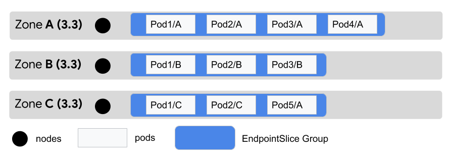
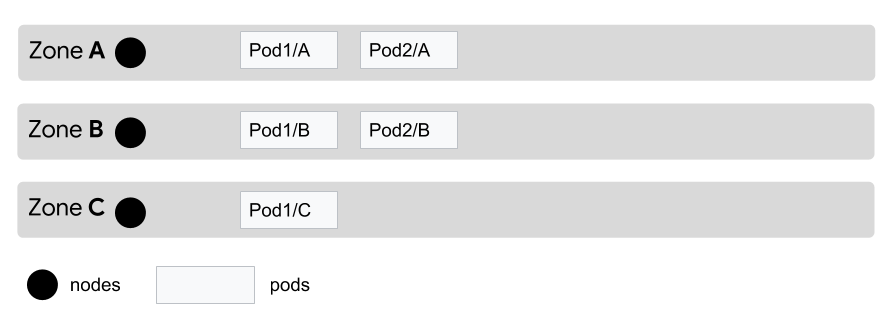
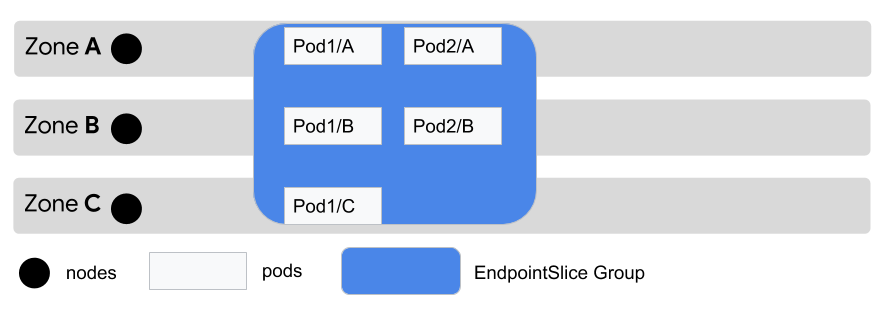
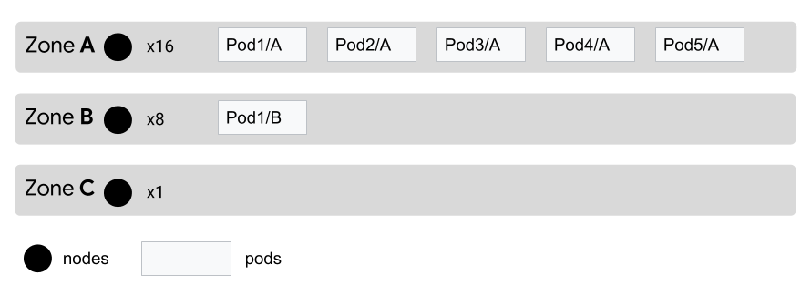
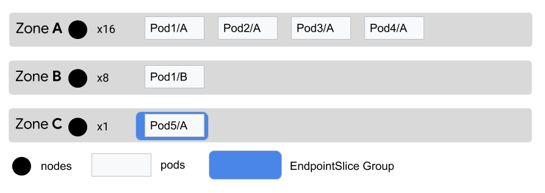
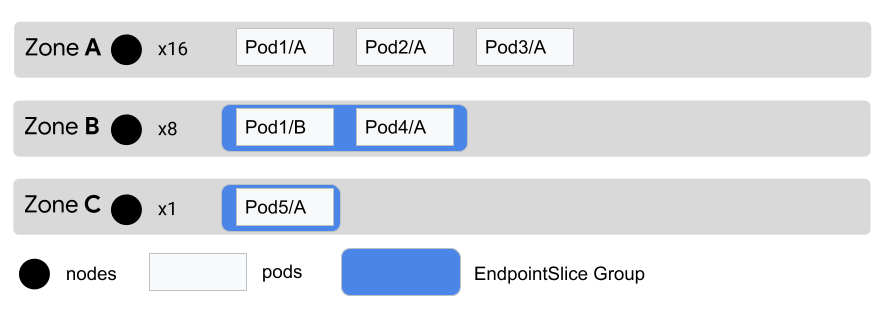
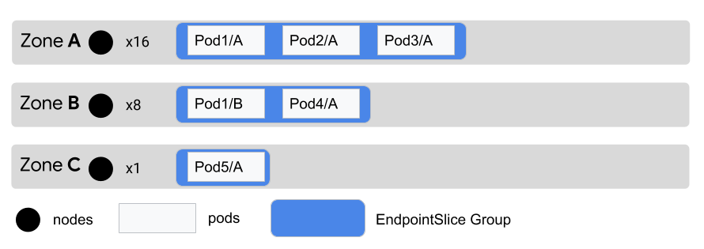

# KEP: Topology Aware Subsetting
<!-- toc -->
- [Release Signoff Checklist](#release-signoff-checklist)
- [Summary](#summary)
- [Motivation](#motivation)
  - [Goals](#goals)
  - [Non-Goals](#non-goals)
- [Proposal](#proposal)
  - [Terminology](#terminology)
  - [Configuration](#configuration)
    - [Interoperability](#interoperability)
    - [Feature Gate](#feature-gate)
  - [Notes/Constraints/Caveats](#notesconstraintscaveats)
  - [Risks and Mitigations](#risks-and-mitigations)
- [Design Details](#design-details)
  - [Assumptions](#assumptions)
  - [Kube-Proxy](#kube-proxy)
  - [Auto Approach](#auto-approach)
    - [Terminology](#terminology-1)
    - [Scheme Logic](#scheme-logic)
    - [Evaluation Tool](#evaluation-tool)
    - [Test Results](#test-results)
  - [Recommended Algorithm: Local](#recommended-algorithm-local)
    - [Optimizations](#optimizations)
    - [Distribution of EndpointSlices](#distribution-of-endpointslices)
    - [Rationale](#rationale)
    - [Potential Issues](#potential-issues)
  - [Other Algorithms Evaluated](#other-algorithms-evaluated)
    - [Local-Shared](#local-shared)
      - [Rationale](#rationale-1)
      - [Potential Issues](#potential-issues-1)
    - [Local-Weighted](#local-weighted)
      - [Rationale](#rationale-2)
      - [Potential Issues](#potential-issues-2)
    - [Local-Opt](#local-opt)
      - [Rationale](#rationale-3)
      - [Potential Issues](#potential-issues-3)
  - [Future Expansion](#future-expansion)
  - [Test Plan](#test-plan)
  - [Observability](#observability)
  - [Graduation Criteria](#graduation-criteria)
  - [Version Skew Strategy](#version-skew-strategy)
- [Production Readiness Review Questionnaire](#production-readiness-review-questionnaire)
  - [Feature Enablement and Rollback](#feature-enablement-and-rollback)
  - [Rollout, Upgrade and Rollback Planning](#rollout-upgrade-and-rollback-planning)
  - [Monitoring Requirements](#monitoring-requirements)
  - [Dependencies](#dependencies)
  - [Scalability](#scalability)
  - [Troubleshooting](#troubleshooting)
- [Implementation History](#implementation-history)
- [Drawbacks](#drawbacks)
- [Alternatives](#alternatives)
<!-- /toc -->

## Release Signoff Checklist

Items marked with (R) are required *prior to targeting to a milestone / release*.

- [x] (R) Enhancement issue in release milestone, which links to KEP dir in [kubernetes/enhancements] (not the initial KEP PR)
- [x] (R) KEP approvers have approved the KEP status as `implementable`
- [x] (R) Design details are appropriately documented
- [x] (R) Test plan is in place, giving consideration to SIG Architecture and SIG Testing input
- [x] (R) Graduation criteria is in place
- [x] (R) Production readiness review completed
- [ ] Production readiness review approved
- [ ] "Implementation History" section is up-to-date for milestone
- [ ] User-facing documentation has been created in [kubernetes/website], for publication to [kubernetes.io]
- [ ] Supporting documentation—e.g., additional design documents, links to mailing list discussions/SIG meetings, relevant PRs/issues, release notes

[kubernetes.io]: https://kubernetes.io/
[kubernetes/enhancements]: https://git.k8s.io/enhancements
[kubernetes/kubernetes]: https://git.k8s.io/kubernetes
[kubernetes/website]: https://git.k8s.io/website

## Summary

Kubernetes clusters are increasingly deployed in multi-zone environments but
unfortunately network routing has not caught up with that. This KEP proposes an
automatic topology aware subsetting mechanism with a new Service annotation.
This new annotation will enable users to opt-in to EndpointSlice subsetting
functionality that will enable topology aware routing. Currently our proposal
will only focus on topology aware routing at zone level. This is closely tied
to [KEP 2030: Topology Aware Proxying](https://github.com/kubernetes/enhancements/blob/master/keps/sig-network/2030-topology-aware-proxying).

## Motivation

Kubernetes clusters are increasingly deployed in multi-zone environments.
Network traffic is routed randomly to any endpoint matching a Service. Some
users might want the traffic to stay in the same zone for the following
reasons:
- Cost savings: Keeping traffic within a zone can limit cross-zone networking
  costs.
- Performance: Traffic within a zone usually has less latency and bandwidth
  constraints, having a better performance than traffic leaving the zone.

In this KEP we are going to focus on avoiding cross-zone traffic when in-zone
endpoints would suffice. We're attempting to provide a simple and more automatic
approach to topology aware routing. This API will still allow users to indicate
that they prefer to keep traffic in the same zone if there's sufficient
capacity. With this approach users won't have to configure anything by default
for most use cases.


### Goals
- Provide a simple way for users to indicate their preference for keeping
  traffic in zone.
- Use the standardized topology label `topology.kubernetes.io/zone` to derive
  the zones of nodes and endpoints.
- Use EndpointSlice subsetting as the primary mechanism for topology aware
  routing.
  - Improve kube-proxy scalability by limiting the number of endpoints it needs
    to process.
- Minimize churn of EndpointSlices while doing topology aware distribution.
- Minimize the number of new EndpointSlices required.
- Provide a simple API that requires minimal configuration for most users.

### Non-Goals
- Real-time distribution rebalancing based on traffic load or distribution
  feedback or metrics.
- Providing a way for kube-proxy to consume subsets of EndpointSlices. (This is
  covered by [KEP 2030](https://github.com/kubernetes/enhancements/issues/2030)).
- Providing a way to require Node local traffic ([this is a separate
  KEP](https://github.com/kubernetes/enhancements/pull/1944)).
- Multi-cluster topology aware routing (this same pattern may be useful there
  though).
- Region based topology aware routing (this may come later).
- Ensuring that Pods are distributed evenly across zones.

## Proposal

### Terminology

- **EndpointSlice Group**: One or multiple EndpointSlices that will be consumed
  by the same set of zones.
- **Endpoints**: In this KEP, “endpoints” are used to describe individual Pod
  IPs. These are not references to Kubernetes Endpoints resources.

### Configuration

A new `endpointslice.kubernetes.io/subsetting` annotation will be supported on
Services. This will have 2 potential values:

- `Auto`: When there are a sufficient number of endpoints for the Service, the
  EndpointSlice controller will subset them into proportional amounts for each
  zone in a cluster. When Topology Aware Proxying (KEP 2004) is enabled,
  each instance of kube-proxy will only consume the subset of endpoints labeled
  for the zone it is in.
- `Disabled`: EndpointSlices will not be subset for this feature.

When this annotation is either unspecified or not set to `Auto`, the `Disabled`
behavior will be default. A future KEP will explore changing the default
behavior from `Disabled` to `Auto` with a new feature gate.

#### Interoperability

If both this annotation and `topologyKeys` are set on a Service, `topologyKeys`
will be given precedence and this annotation will be ignored.

#### Feature Gate

This functionality will be guarded by the `TopologyAwareSubsetting` feature
gate. This gate should not be enabled if the `ServiceTopology` gate is enabled.

### Notes/Constraints/Caveats

In the future, if there is sufficient need, we may introduce another parameter
for the `Auto` approach that would allow users to specify a starting threshold.
Starting threshold defines the starting point for `Auto` (more detailed
description below). We currently set the starting threshold to 3x the number of
zones based on results from our test dataset for safer distribution results.

Pods may exist without topology information. In that case, they will be
distributed to zones that have the highest need (determined by the difference
between expected endpoints and actual endpoints in the zone).

### Risks and Mitigations

- Extra complexity to EndpointSlice Controller introduced by the `Auto` approach
  could result in slower EndpointSlices update and potentially end up limiting
  scalability.
- In a scenario where all traffic originates from a single zone, with the `Auto`
  approach, there is a chance that endpoints in that zone will be overloaded
  while endpoints in other zones receive little to no traffic. Without some sort
  of feedback (out of scope) this will not self-rectify.
- Autoscaling will not behave well if only a single zone is receiving large
  amounts of traffic. This could potentially be mitigated by separating
  deployments and HPAs per zone.
- Services with ExternalTrafficPolicy=local will need special treatment here.
  The `Auto` approach could result in a situation where an endpoint on a Node
  is delivered to a separate underprovisioned zone. The simplest approach would
  be to disable this subsetting functionality altogether. Alternatively, we
  could subset strictly by zone without any kind of rebalancing mechanism.

## Design Details

### Assumptions

- Incoming traffic is proportional to the number of allocatable CPU cores in a
  zone. Although this is an imperfect metric, it is the best available way of
  predicting how much traffic will be received in a zone. If we are unable to
  derive the number of allocatable cores in a zone we will fall back to the
  number of nodes in that zone.
- Service capacity is proportional to the number of endpoints in a zone. This
  assumes that each endpoint has equivalent capacity. Although this is not
  always true, it usually is. We can explore ways to deal with variable capacity
  endpoints in the future.

### Kube-Proxy

This KEP is dependent on the [EndpointSlice Subsetting
KEP](https://github.com/kubernetes/enhancements/issues/2030#issuecomment-701056673).
That KEP proposes updating kube-proxy to support EndpointSlice subsetting. Each
instance will watch for EndpointSlices that have a label indicating they should
be consumed by a zone or region.

### Auto Approach
Within this model, there are potentially several algorithms. As this feature
moves toward GA, we will fine-tune the algorithm and the coefficients to it.
While we aspire to a single "good for everyone" solution, it may be desirable to
allow these to be tuned in some edge cases. To that end, we will describe a
single algorithm here, but leave room for other options later.

#### Terminology
- **Starting threshold**: threshold to start a topology aware routing (number of
  endpoints vs number of zones etc.)
- **Padding**: to avoid frequent and unnecessary mechanism switches caused by
  rolling up, defer the mechanism update with a padding value, i.e. starting
  threshold = 6, padding = 3, switch to topology aware routing at endpoints
  number = 9.
- **Overload**: When an endpoint receives more traffic than expected. For
  example, if 100 requests were expected with an even traffic distribution and
  instead an endpoint would receive 150 requests with this distribution, the
  overload would be 50%.
- **Overload threshold**: max traffic overload for any single endpoint compared
  to random approach (50% by default).

#### Scheme Logic
1. Group all endpoints in a zone in a local EndpointSlice Group.
2. Rebalance endpoints among EndpointSlice Groups to a random state based on
   the proportion of nodes in each zone. The detailed rebalancing algorithms
   will be elaborated below.

#### Evaluation Tool
We evaluated different `Auto` algorithms with a [topology simulation
tool](https://github.com/googleinterns/k8s-topology-simulator). This tool
abstracts concepts like endpoints, nodes, zones to simpler data structures and
simulates the EndpointSlice grouping and traffic distribution.

We have tested different algorithms with various datasets with a relatively
conservative score mechanism (in-zone traffic 45%, traffic overload 40%, number
of EndpointSlices 15%) .
1. Different algorithms have been tested with datasets:
   - Representative data points
   - Small/Medium/Large ranged scale datasets
2. We measure the outcome of algorithms on three metrics: in-zone traffic,
   overload and number of EndpointSlices.

| Metric | Calculation | Weight  |
|:-:|:-:|:-:|
| in-zone traffic | 90% in-zone traffic = 90 credits | 45% |
| max overload | 30% max overload = 100 - 30 = 70 credits | 20% |
| mean overload | 10% mean overload = 100 - 10 = 90 credits | 20% |
| # of EndpointSlices | 6 EndpointSlices with Auto, 3 EndpointSlices when disabled = (3/6 * 100) = 50 credits | 15% |

#### Test Results
We have tested various algorithms with all the dataset and calculated their
aggregate results for different dataset:

**Results of large dataset (39+ million inputs)**
| alg name | mean total score | mean in-zone score | mean overload score | mean slice score |
|:-:|:-:|:-:|:-:|:-:|
| **random** | 72.48 | 38.84 | 100 | 100 |
| **local** | 86.71 | 84.33 | 98.25 | 63.10 |
| **local-shared** | 86.89 | 84.13 | 98.94 | 63.06 |
| **local-weighted** | 84.34 | 83.90 | 100 | 43.88 |
| **local-opt** | 84.89 | 83.74 | 99.47 | 49.45 |

### Recommended Algorithm: Local
Local algorithm keeps as many endpoints (by EndpointSlice subsetting)
responsible for its local zone as possible based on the nodes ratio. Meanwhile,
it rebalances the endpoints from overflowed zones to insufficient zones to
maintain overload for every endpoint less than overload threshold.

Each zone expects 3.3 endpoints.


ZoneA gives one extra endpoint to ZoneC.



#### Optimizations
_Downgrading:_
1. If failed to maintain an overload less than overload threshold, we downgrade
   the whole mechanism to the `Disabled` approach.

Each zone expects 1.67 endpoints.



Any zone ending up with 1 endpoint will have an overload = 67% (above threshold of 50%).



_Starting Threshold -- default 3x of zone number:_
1. As we evaluated algorithms on different datasets, we found that at small
   scales of endpoints number, it is too risky to conduct a `Auto` approach.
   It results in a high probability of EndpointSlice churn (higher ratio change
   when updating endpoints) and imbalanced traffic load for endpoints. With
   all that said, we determined a starting threshold based on the test results
   as 3 times the number of zones.
<br>_Note that this starting threshold may vary with different score mechanisms._
2. Besides the starting threshold, we also want to introduce a padding
   protection for policy switches. This design is meant to protect unnecessary
   churn caused by rolling updates.

Example: starting threshold = 9, padding = 3
1. Don't subset until # of endpoints hits 12
2. Remain with `Auto` subsetting approach until # of endpoints hits 6

**Scores on small dataset with different starting thresholds for local algorithm**
|Algorithm/Starting threshold| Score |
|:---|:---|
|random|72.55|
|local-1x|80.05|
|local-2x|80.07|
|local-3x|80.07|
|local-4x|80.05|
|local-5x|79.98|

_Overload Maintenance:_

Keep track of endpoints overload during endpoints rebalance, assign more
endpoints to EndpointSlice Groups that are exceeding the overload threshold
with a higher priority from zones:
1. With negative overloads first
2. With overloads less than overload threshold after zones in condition 1 runs
   out

_Lazy Rebalance:_
1. To reduce churn of EndpointSlices and overhead for the API server.
2. After rebalancing endpoints among EndpointSlices, any following endpoints
   update without any endpoints exceeding a threshold, make that update only.
3. Do a full rebalance until the update can't be made without exceeding the
   threshold.

#### Distribution of EndpointSlices
Each EndpointSlice Group is consumed by a single zone and will only receive
traffic from that zone (local zone). The number of endpoints belonging to that
SliceGroup is calculated by `total endpoints * nodes in zone / total nodes`
(**expected endpoints**). The control plane tries to fill SliceGroup with local
endpoints as full as possible.
1. Iterate through existing zones, assign all endpoints to its corresponding
   local SliceGroups.
2. If the current zone has enough endpoints to achieve traffic load below the
   overload threshold, put it into an `endpoints_available` pool. Otherwise put
   it into an `endpoints_require` pool. The pool is implemented by a priority
   queue which will place the zone with most extra endpoints or the zone with
   most insufficient endpoints first.
3. Iterate through the `endpoints_available` pool and the `endpoints_require`
   pool. Pop out the first zones from both pools and assign one endpoint from
   the `available_zone` to the `require_zone`. Push the `available_zone` back
   to the `endpoints_available` pool if it still has overload below threshold.
   Push the `require_zone` back to the `endpoints_require pool` if it still has
   overload above threshold. This step ends when one of the conditions meets:
   - `endpoints_available` pool is empty.
   - `endpoints_require` pool is empty.
4. If `endpoints_available` pool is empty and `endpoints_require` pool is not
   empty, downgrade to `Disabled` approach.
5. Otherwise, iterate all zones again, assign endpoints from zones in
   `endpoints_available` pool to zones with endpoints fewer than expected
   endpoints. In this step, zones in `endpoints_available` pool only provide
   extra endpoints when they have endpoints > expected endpoints. This ends
   when one of the conditions meets:
   - `endpoints_available` pool is empty.
   - All zones have at least the flooring number of expected endpoints in their
  local SliceGroup.

ZoneA, ZoneB, ZoneC expect 3.2, 1.6, 0.2 endpoints respectively.



ZoneA gives one extra endpoint to ZoneC to help ZoneC maintain overload.



ZoneA has to give one more endpoint to ZoneB to help ZoneB maintain overload.



ZoneA ends with endpoints fewer than expected. But its overload is still below
threshold.



During our tests among different datasets, we found that with a large number of
total endpoints it is less likely to have cases described in step 4, that's one
of the reasons we introduced the starting threshold for this mechanism.
Meanwhile as described above, we may open the starting threshold as a
configurable parameter for users. This might be updated after collecting enough
feedback from users.

#### Rationale
1. Easy to implement and acceptable churn of EndpointSlices
2. Relatively high in-zone traffic
3. Random deviation for endpoints
4. No weights involved -- no API additions needed

#### Potential Issues
1. Possibility of overloaded endpoints if a large portion of traffic originates
   from a single zone.
2. Higher number of EndpointSlices compared to when subsetting is disabled.

### Other Algorithms Evaluated
#### Local-Shared
LS shares the same idea of `recommended` that rebalances endpoints from
overflowed zones to insufficient zones. Instead of trying every effort to
assign endpoints to insufficient zones, it creates shared SliceGroups for
zones:
1. Have 0 endpoints originally.
2. Not be able to achieve lower overload after the reallocation of step 3
   described in `recommended`.

##### Rationale
1. Well-balanced traffic load for every endpoint.
2. Relatively high in-zone traffic.
3. Fewer number of EndpointSlices compared to `recommended`.
4. Relatively higher performance than `recommended`.
5. No weights involved -- no API additions needed.

##### Potential Issues
1. Extra complexity for the EndpointSlice subsetting KEP which needs to support
   multiple zones to consume a shared EndpointSlice.
2. More complicated to implement.
3. Potential more churn of EndpointSlices than `recommended` (transition
   between shared and local SliceGroups)

The extra complexity introduced to subsetting is the main reason we chose
_local_ as `recommended` over _local-shared_. In terms of performance, _loca_l
is reasonably close to _local-shared_ which we think the overhead for
subsetting is not worthwhile compared to the improvement we can gain from this
algorithm compared to _local_. But this could be a very competitive alternative
algorithm.

#### Local-Weighted
LW shares the same idea of `recommended` that rebalances endpoints from
overflowed zones to insufficient zones. Instead of approximation from float to
integer, LW uses the precise expected value for every zone while rebalancing.
This idea can be implemented with weights.

##### Rationale
1. Perfectly balanced traffic load for every endpoint
2. Relatively high in-zone traffic

##### Potential Issues
1. Weights require API additions
2. Weights are volatile that increases churn of EndpointSlices (any single
   endpoint update leads to a weight change for almost every EndpointSlice)
3. Higher number of EndpointSlices
4. Lower in-zone traffic than `recommended`

#### Local-Opt
LO shares the same idea of `recommended` that rebalances endpoints from
overflowed zones to insufficient zones. Instead of keeping more endpoints than
expected in a `local EndpointSlice Group`, it shares those overall extra
endpoints to all zones with an evenly divided weight to achieve better
overload.

##### Rationale
1. Relatively high in-zone traffic
2. Relatively balanced deviation

##### Potential Issues
1. Weights involved in the tie-breaker stage
   - Requires API addition
   - Introduces more volatility
2. Higher number of EndpointSlices
3. Lower in-zone traffic than `recommended`


### Future Expansion

In the future we may expand this functionality if needed. This could include:

- A new `RequireZone` algorithm that would keep endpoints in EndpointSlices for
  the same zone they are in.
- A new option to specify a minimum threshold for the `Auto` approach.
- Support for region based subsetting.

### Test Plan
| Test Name | Test Type | Test Details | Expected Output | Comments |
| :--- | :--- | :--- | :--- | :--- |
| Single Approach Test | Unit Test | Small/Large number of nodes | Distribute EndpointSlices as expected | |
| |  | Zero endpoints in some zones | Distribute EndpointSlices as expected | |
| |  | Invalid annotation | Approach sets to default, distribute EndpointSlices as expected | |
| `Auto` Test | Unit Test | Invalid starting threshold | Set starting threshold to default and start `Auto` approach with condition meets| This is applicable for customized starting threshold only|
| |  | Endpoints below `starting threshold + padding` | `Auto` approach will not be conducted | |
| |  | Endpoints above `starting threshold + padding` | `Auto` works as expected | |
| Approach Transition Test | Unit Test | 1. Set annotation to `Auto` <br> 2. Increase endpoints number to above `starting threshold` but below `starting threshold + padding` | `Auto` will not be conducted | If capable, monitor the churn of EndpointSlices during the rolling update |
|  |  | 1. Set annotation to `Auto` <br> 2. Increase endpoints number to above `starting threshold + padding` | Distribution will be changed from `Disabled` to `Auto` | Same as above |
|  |  | 1. Set annotation to `Auto` <br> 2. Decrease endpoints number to below `starting threshold` but above `starting threshold - padding` | Distribution will remain `Auto` | Same as above |
|  |  | 1. Set annotation to `Auto` <br> 2. Decrease endpoints number to below `starting threshold - padding` | Distribution will be changed from `Auto` to `Disabled` | Same as above |
|  |  | 1. Set annotation to one of the three <br> 2. Set endpoints to above `starting threshold + padding` <br> 3. Manually change the annotation to another approach | Distribution will be changed based on the new value | Step 2 is only needed for `Auto` |
| Rolling Update Test | Integration Test |1. Use integration framework to mock pods <br> 2. Set annotation to `Auto` <br> 3. Conduct an aggressive rolling update policy for endpoints update <br> 4. Set endpoints to test corner cases | In the desired state, EndpointSlices are distributed as expected | If capable, monitor the churn of EndpointSlices during the rolling update |
| Traffic Reliability Test | E2E Test |1. Set annotation to `Auto` <br> 2. Set endpoints above `starting threshold + padding` <br> 3. Reuse the current traffic reachability test | Endpoints are reachable from different zones as expected | Step 2 is only needed for `Auto` |

### Observability
We can reuse some of the metrics of EndpointSlice Controller that we already
have in the current version to observe the changes of endpoints (addition,
deletion and update).
Meanwhile we can add more metrics to have a glimpse of different approaches.

- `endpoint_slice_controller/endpointslices_changed_per_sync`
- `endpoint_slice_controller/reallocated_endpoints_per_sync`
- `endpoint_slice_controller/syncs`
- `endpoint_slice_controller/total_endpoints` (this has already been defined)
```
const SubSystem = "endpoint_slice_controller"

// This metric observes churn of EndpointSlices per sync
EPSChangedPerSync = metrics.NewHistogramVec(
	&metrics.HistogramOpts{
		Subsystem: Subsystem,
		Name: "endpointslices_changed_per_sync",
		Help: "Number of EndpointSlices be changed on each Service sync",
	},
	[]string{"approach"}, // either "random" or "auto"
)

// This metric observes reallocated endpoints per sync
EPEachZonePerSync = metrics.NewHistogramVec(
	&metrics.HistogramOpts{
		Subsystem: Subsystem,
		Name: "reallocated_endpoints_per_sync",
		Help: "Number of endpoints being reallocated to other zones on each Service sync",
	},
	[]string{},
)

// EndpointSliceSyncs tracks the number of sync operations the controller runs along with their result.
EndpointSliceSyncs = metrics.NewCounterVec(
  &metrics.CounterOpts{
    Subsystem:      EndpointSliceSubsystem,
    Name:           "syncs",
    Help:           "Number of EndpointSlice syncs",
    StabilityLevel: metrics.ALPHA,
  },
  []string{"result"}, // either "success" or "failure"
)

```

### Graduation Criteria
- Alpha should provide basic functionality covered with tests described above.
- This KEP will largely depend on the EndpointSlice Subsetting. Once the
  EndpointSlice Subsetting feature has been updated, our change can kick-in
  without any new fields being added.
- Evaluate how this could apply to DNS.

### Version Skew Strategy
Our KEP requires updates on both EndpointSlice Controller and kube-proxy. Thus
there could be two potential version skew scenarios:
1. EndpointSlice Controller falls back to current behavior that does not
   support labeling EndpointSlices. In this case, kube-proxy will still work
   because it will consume all EndpointSlices with a zone label set to the same
   zone _or_ no zone label set at all.
2. Kube-Proxy falls back to current behavior that does not support consuming
   EndpointSlices based on labels. In this case, kube-proxy will continue to
   consume all EndpointSlices. This will not be an issue, it simply won't be
   taking advantage of the new controller functionality.

Each scenario described above will end up with a `Random` approach no matter
what value has been set for a Service annotation.

Throughout all of this, it will continue to be possible to list all endpoints
for a Service by querying EndpointSlices with the `kubernetes.io/service-name`
label. Each approach may group the endpoints in slightly different
combinations of EndpointSlices, but it will still be just as easy to list all
endpoints for a Service.

## Production Readiness Review Questionnaire

### Feature Enablement and Rollback

* **How can this feature be enabled / disabled in a live cluster?**
  - [x] Feature gate (also fill in values in `kep.yaml`)
    - Feature gate name: TopologyAwareSubsetting
    - Components depending on the feature gate: kube-controller-manager
  - [x] Other
    - Describe the mechanism:
      `endpointslice.kubernetes.io/subsetting` annotation on Service.
    - Will enabling / disabling the feature require downtime of the control
      plane?
      No
    - Will enabling / disabling the feature require downtime or reprovisioning
      of a node?
      No

* **Does enabling the feature change any default behavior?**
  In most cases, this feature will be intentionally enabled on specific Services
  with the annotation described above. This will only have an effect if the
  feature gate is enabled on kube-controller-manager. Even then, this will just
  represent a different way to group EndpointSlices and will not have any
  significant effect unless the consumer of EndpointSlices is also configured to
  support this feature (see KEP 2030). If all of those bits are enabled, traffic
  will be more likely to be routed to endpoints within the same zone. A future
  KEP will explore enabling this feature by default on Services with a separate
  feature gate.

* **Can the feature be disabled once it has been enabled (i.e. can we roll back
  the enablement)?**
  Yes. It can easily be disabled universally by turning off the feature gate or
  on a specific Service by setting the annotation to `Disable`.

* **What happens if we reenable the feature if it was previously rolled back?**
  EndpointSlices will be subset again resulting in changes to existing
  EndpointSlices for Services that have this feature enabled.

* **Are there any tests for feature enablement/disablement?**
  This feature is not yet implemented but per-Service enablement/disablement is
  covered in depth as part of the test plan.

### Rollout, Upgrade and Rollback Planning

* **How can a rollout fail? Can it impact already running workloads?**
  The biggest risk here is that EndpointSlices may be created for some but not
  all zones. This could result in a service being unreachable from zones that do
  not have corresponding EndpointSlices if a client did not properly account for
  that possibility. Although this is an unlikely scenario, kube-proxy will
  include a fallback to all endpoints if no endpoints are available for the
  current zone. It is recommended that other clients do the same.

* **What specific metrics should inform a rollback?**
  If the proportion of `endpoint_slice_controller/syncs` with a "failure" result
  is greater than 10%, a rollback may be considered. It is worth noting that
  other issues can cause sync failures such as an out of date informer cache.
  The key indicator should be a significantly elevated error rate when compared
  with before the feature was enabled.

* **Were upgrade and rollback tested? Was the upgrade->downgrade->upgrade path tested?**
  This feature is not yet implemented but per-Service enablement/disablement is
  covered in depth as part of the test plan.

* **Is the rollout accompanied by any deprecations and/or removals of features,
  APIs, fields of API types, flags, etc.?**
  Yes, this represents a replacement to the approach tracked with KEP 536. This
  KEP included an alpha implementation but did not graduate beyond that.

### Monitoring Requirements

* **How can an operator determine if the feature is in use by workloads?**
  If the `endpointslices_changed_per_sync` metric has a non-zero value for the
  `auto` approach, this feature is in use.

* **What are the SLIs (Service Level Indicators) an operator can use to
  determine the health of the service?**
  - [x] Metrics
    - Metric name: `endpoint_slice_controller/syncs`
    - [Optional] Aggregation method: Counter
    - Components exposing the metric: EndpointSlice Controller
    - The relative failure rate over time can be used to track the health of
      this controller.

* **What are the reasonable SLOs (Service Level Objectives) for the above SLIs?**
  As a starting point, it is likely reasonable for the EndpointSlice controller
  to experience up to a 10% sync failure rate. This is largely related to it
  trying to update stale EndpointSlices. When we are able to find a solution for
  that issue the expected sync failure rate should be significantly lower. This
  specific problem is most notable for large Services that have rapidly updating
  endpoints.

* **Are there any missing metrics that would be useful to have to improve
  observability of this feature?**
  None that I can think of.

### Dependencies

* **Does this feature depend on any specific services running in the cluster?**
  This primarily depends on API Server. Kube-Proxy depends on this controller.

### Scalability

* **Will enabling / using this feature result in any new API calls?**
  This will result in more EndpointSlices which would result in more create and
  update calls.

* **Will enabling / using this feature result in introducing new API types?**
  No.

* **Will enabling / using this feature result in any new calls to the cloud
  provider?**
  No.

* **Will enabling / using this feature result in increasing size or count of the
  existing API objects?**
  In most cases this will result in some additional EndpointSlices. This will be
  dependent on the number of endpoints for each Service. In a 3 zone cluster:
  * <12 endpoints: no additional EndpointSlices, feature will not kick in until
    threshold.
  * 12-100 endpoints: 3 EndpointSlices instead of 1.
  * 100-300 endpoints: 3-5 EndpointSlices instead of 1-3.
  * \>300 endpoints: Generally equivalent amount of EndpointSlices.

* **Will enabling / using this feature result in increasing time taken by any
  operations covered by [existing SLIs/SLOs]?**
  Although the EndpointSlice controller may take slightly longer to create
  EndpointSlices, kube-proxy performance should also be slightly improved. I do
  not anticipate any impact on existing SLIs or SLOs.

* **Will enabling / using this feature result in non-negligible increase of
  resource usage (CPU, RAM, disk, IO, ...) in any components?**
  This could result in increased CPU utilization for kube-controller-manager
  (specifically  the EndpointSlice controller). Profiling will be performed to
  ensure that this increase is minimal.

### Troubleshooting

* **How does this feature react if the API server and/or etcd is unavailable?**
  The EndpointSlice controller will stop functioning.

* **What are other known failure modes?**
  - The API server is unavailable. This is not specific to this controller and
    detections and mitigations are likely already widely covered.

* **What steps should be taken if SLOs are not being met to determine the problem?**
  This feature should be disabled. It is easy to leave this enabled for a single
  Service for debugging, but if SLOs are not being met the fastest solution is
  likely to disable this feature for any critical Services.

[supported limits]: https://git.k8s.io/community//sig-scalability/configs-and-limits/thresholds.md
[existing SLIs/SLOs]: https://git.k8s.io/community/sig-scalability/slos/slos.md#kubernetes-slisslos

## Implementation History

- KEP Merged: October 2020

## Drawbacks
1. Increased complexity in EndpointSlice controller
2. No immediate plans to support region
3. Different algorithms used by controller could make debugging more
   challenging
4. Does not provide a simple way to balance endpoints across zones

## Alternatives
1. Conduct topology aware routing at node level with specified topology keys,
   refer to the previous [Topology Aware Routing
   KEP](https://github.com/kubernetes/enhancements/blob/master/keps/sig-network/20181024-service-topology.md).
   As drawbacks described above, we could do some improvement i.e. fix the
   topology keys. But it still requires API and controller additions which
   introduces more complexity meanwhile cannot offer an easy policy decision at
   service level.
2. Implement this proposal with other slicing algorithms to achieve better
   endpoints overload. This has been described in more details above. The main
   drawback is to introduce weights which require API additions as well as lead
   to more churn of EndpointSlices.

