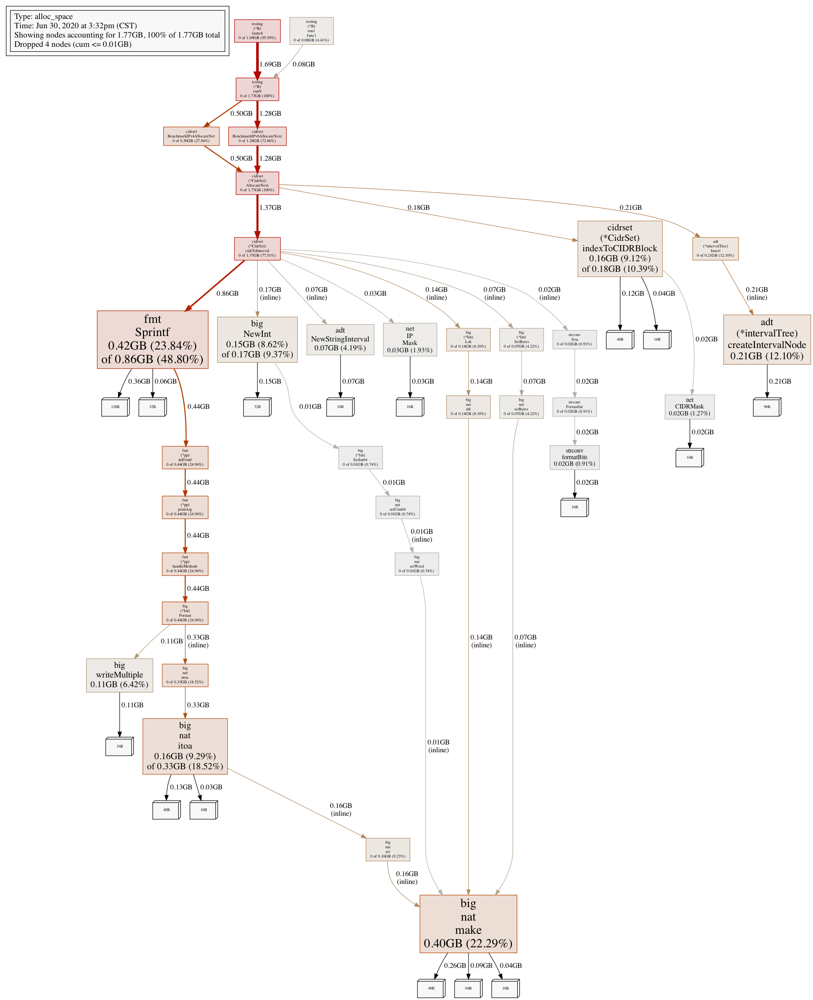

<!--
**Note:** When your KEP is complete, all of these comment blocks should be removed.

To get started with this template:

- [ ] **Pick a hosting SIG.**
  Make sure that the problem space is something the SIG is interested in taking
  up.  KEPs should not be checked in without a sponsoring SIG.
- [ ] **Create an issue in kubernetes/enhancements**
  When filing an enhancement tracking issue, please ensure to complete all
  fields in that template.  One of the fields asks for a link to the KEP.  You
  can leave that blank until this KEP is filed, and then go back to the
  enhancement and add the link.
- [ ] **Make a copy of this template directory.**
  Copy this template into the owning SIG's directory and name it
  `NNNN-short-descriptive-title`, where `NNNN` is the issue number (with no
  leading-zero padding) assigned to your enhancement above.
- [ ] **Fill out as much of the kep.yaml file as you can.**
  At minimum, you should fill in the "title", "authors", "owning-sig",
  "status", and date-related fields.
- [ ] **Fill out this file as best you can.**
  At minimum, you should fill in the "Summary", and "Motivation" sections.
  These should be easy if you've preflighted the idea of the KEP with the
  appropriate SIG(s).
- [ ] **Create a PR for this KEP.**
  Assign it to people in the SIG that are sponsoring this process.
- [ ] **Merge early and iterate.**
  Avoid getting hung up on specific details and instead aim to get the goals of
  the KEP clarified and merged quickly.  The best way to do this is to just
  start with the high-level sections and fill out details incrementally in
  subsequent PRs.

Just because a KEP is merged does not mean it is complete or approved.  Any KEP
marked as a `provisional` is a working document and subject to change.  You can
denote sections that are under active debate as follows:

```
<<[UNRESOLVED optional short context or usernames ]>>
Stuff that is being argued.
<<[/UNRESOLVED]>>
```

When editing KEPS, aim for tightly-scoped, single-topic PRs to keep discussions
focused.  If you disagree with what is already in a document, open a new PR
with suggested changes.

One KEP corresponds to one "feature" or "enhancement", for its whole lifecycle.
You do not need a new KEP to move from beta to GA, for example.  If there are
new details that belong in the KEP, edit the KEP.  Once a feature has become
"implemented", major changes should get new KEPs.

The canonical place for the latest set of instructions (and the likely source
of this file) is [here](/keps/NNNN-kep-template/README.md).

**Note:** Any PRs to move a KEP to `implementable` or significant changes once
it is marked `implementable` must be approved by each of the KEP approvers.
If any of those approvers is no longer appropriate than changes to that list
should be approved by the remaining approvers and/or the owning SIG (or
SIG Architecture for cross cutting KEPs).
-->
# KEP-20200617 NodeIPAM controller support variable sized CIDRs

<!--
This is the title of your KEP.  Keep it short, simple, and descriptive.  A good
title can help communicate what the KEP is and should be considered as part of
any review.
-->

<!--
A table of contents is helpful for quickly jumping to sections of a KEP and for
highlighting any additional information provided beyond the standard KEP
template.

Ensure the TOC is wrapped with
  <code>&lt;!-- toc --&rt;&lt;!-- /toc --&rt;</code>
tags, and then generate with `hack/update-toc.sh`.
-->

<!-- toc -->
- [Release Signoff Checklist](#release-signoff-checklist)
- [Summary](#summary)
- [Motivation](#motivation)
  - [Goals](#goals)
  - [Non-Goals](#non-goals)
- [Proposal](#proposal)
  - [User Stories (optional)](#user-stories-optional)
    - [Story 1](#story-1)
  - [Notes/Constraints/Caveats (optional)](#notesconstraintscaveats-optional)
  - [Risks and Mitigations](#risks-and-mitigations)
- [Design Details](#design-details)
  - [Test Plan](#test-plan)
  - [Graduation Criteria](#graduation-criteria)
  - [Upgrade / Downgrade Strategy](#upgrade--downgrade-strategy)
  - [Version Skew Strategy](#version-skew-strategy)
- [Benchmarking](#benchmarking)
- [Production Readiness Review Questionnaire](#production-readiness-review-questionnaire)
  - [Feature enablement and rollback](#feature-enablement-and-rollback)
  - [Rollout, Upgrade and Rollback Planning](#rollout-upgrade-and-rollback-planning)
  - [Monitoring requirements](#monitoring-requirements)
  - [Dependencies](#dependencies)
  - [Scalability](#scalability)
  - [Troubleshooting](#troubleshooting)
- [Implementation History](#implementation-history)
- [Drawbacks](#drawbacks)
- [Alternatives](#alternatives)
- [Infrastructure Needed (optional)](#infrastructure-needed-optional)
<!-- /toc -->

## Release Signoff Checklist

<!--
**ACTION REQUIRED:** In order to merge code into a release, there must be an
issue in [kubernetes/enhancements] referencing this KEP and targeting a release
milestone **before the [Enhancement Freeze](https://git.k8s.io/sig-release/releases)
of the targeted release**.

For enhancements that make changes to code or processes/procedures in core
Kubernetes i.e., [kubernetes/kubernetes], we require the following Release
Signoff checklist to be completed.

Check these off as they are completed for the Release Team to track. These
checklist items _must_ be updated for the enhancement to be released.
-->

Items marked with (R) are required *prior to targeting to a milestone / release*.

- [ ] (R) Enhancement issue in release milestone, which links to KEP dir in [kubernetes/enhancements] (not the initial KEP PR)
- [ ] (R) KEP approvers have approved the KEP status as `implementable`
- [ ] (R) Design details are appropriately documented
- [ ] (R) Test plan is in place, giving consideration to SIG Architecture and SIG Testing input
- [ ] (R) Graduation criteria is in place
- [ ] (R) Production readiness review completed
- [ ] Production readiness review approved
- [ ] "Implementation History" section is up-to-date for milestone
- [ ] User-facing documentation has been created in [kubernetes/website], for publication to [kubernetes.io]
- [ ] Supporting documentation e.g., additional design documents, links to mailing list discussions/SIG meetings, relevant PRs/issues, release notes

<!--
**Note:** This checklist is iterative and should be reviewed and updated every time this enhancement is being considered for a milestone.
-->

[kubernetes.io]: https://kubernetes.io/
[kubernetes/enhancements]: https://git.k8s.io/enhancements
[kubernetes/kubernetes]: https://git.k8s.io/kubernetes
[kubernetes/website]: https://git.k8s.io/website

## Summary

<!--
This section is incredibly important for producing high quality user-focused
documentation such as release notes or a development roadmap.  It should be
possible to collect this information before implementation begins in order to
avoid requiring implementors to split their attention between writing release
notes and implementing the feature itself.  KEP editors, SIG Docs, and SIG PM
should help to ensure that the tone and content of the `Summary` section is
useful for a wide audience.

A good summary is probably at least a paragraph in length.

Both in this section and below, follow the guidelines of the [documentation
style guide]. In particular, wrap lines to a reasonable length, to make it
easier for reviewers to cite specific portions, and to minimize diff churn on
updates.

[documentation style guide]: https://github.com/kubernetes/community/blob/master/contributors/guide/style-guide.md
-->

Make NodeIPAM controller support variable sized CIDRs.

## Motivation

<!--
This section is for explicitly listing the motivation, goals and non-goals of
this KEP.  Describe why the change is important and the benefits to users.  The
motivation section can optionally provide links to [experience reports][] to
demonstrate the interest in a KEP within the wider Kubernetes community.

[experience reports]: https://github.com/golang/go/wiki/ExperienceReports
-->

Some user want to change `--node-cidr-mask-size` after create kubernetes cluster by some reason, 
but current kubernetes doesn't allow `--node-cidr-mask-size` to change, because NodeIPAM controller
doesn't support variable sized CIDRs.


### Goals

<!--
List the specific goals of the KEP.  What is it trying to achieve?  How will we
know that this has succeeded?
-->

Make NodeIPAM controller support variable sized CIDRs.

### Non-Goals

<!--
What is out of scope for this KEP?  Listing non-goals helps to focus discussion
and make progress.
-->

## Proposal

<!--
This is where we get down to the specifics of what the proposal actually is.
This should have enough detail that reviewers can understand exactly what
you're proposing, but should not include things like API designs or
implementation.  The "Design Details" section below is for the real
nitty-gritty.
-->

Use interval tree instead of bitmap to allocate podCIDR.

### User Stories (optional)

<!--
Detail the things that people will be able to do if this KEP is implemented.
Include as much detail as possible so that people can understand the "how" of
the system.  The goal here is to make this feel real for users without getting
bogged down.
-->

#### Story 1

For example, we have a kubernetes cluster, the `clusterCIDR` is 192.168.0.0/16 and `--node-cidr-mask-size` is 24
1. add two nodes to cluster, podCIDR will be `192.168.0.0/24` and `192.168.1.0/24`;
2. change `--node-cidr-mask-size` to 23 and delete node `192.168.1.0/24`;
3. add a node pod CIDR will be `192.168.0.0/23`, `192.168.0.0/24` and `192.168.0.0/23` overlap.

### Notes/Constraints/Caveats (optional)

<!--
What are the caveats to the proposal?
What are some important details that didn't come across above.
Go in to as much detail as necessary here.
This might be a good place to talk about core concepts and how they relate.
-->

### Risks and Mitigations

<!--
What are the risks of this proposal and how do we mitigate.  Think broadly.
For example, consider both security and how this will impact the larger
kubernetes ecosystem.

How will security be reviewed and by whom?

How will UX be reviewed and by whom?

Consider including folks that also work outside the SIG or subproject.
-->

## Design Details

<!--
This section should contain enough information that the specifics of your
change are understandable.  This may include API specs (though not always
required) or even code snippets.  If there's any ambiguity about HOW your
proposal will be implemented, this is the place to discuss them.
-->

We need use a new data structure instead of bitmap to allocate podCIDR, it should support variable sized CIDRs, 
interval tree is suitable. I found etcd already implement an interval tree 
(https://github.com/etcd-io/etcd/blob/master/pkg/adt/interval_tree.go).

If CIDR can convert to Interval, then we can use `IntervalTree.Insert`, `IntervalTree.Intersects` and `IntervalTree.Delete`.
First get begin IP and end IP in CIDR, because IPv6 length is 128 bits, `uint64` is not enough, 
so convert an IP to `big.Int`, then convert big.Int to string, we got `adt.StringInterval`.

```go
func (s *CidrSet) cidrToInterval(cidr *net.IPNet) (adt.Interval, error) {
	if cidr == nil {
		return adt.Interval{}, fmt.Errorf("cidr is nil")
	}
	if !s.clusterCIDR.Contains(cidr.IP.Mask(s.clusterCIDR.Mask)) {
		return adt.Interval{}, fmt.Errorf("cidr %v is out the range of cluster cidr %v", cidr, s.clusterCIDR)
	}
	begin := big.NewInt(0)
	end := big.NewInt(1)
	maskSize, length := cidr.Mask.Size()
	if s.clusterMaskSize < maskSize {
		if cidr.IP.To4() != nil {
			begin = begin.SetBytes(cidr.IP.To4())
		} else {
			begin = begin.SetBytes(cidr.IP.To16())
		}
		ones, bits := cidr.Mask.Size()
		end.Lsh(end, uint(bits-ones)).Add(begin, end)
	} else {
		if s.clusterCIDR.IP.To4() != nil {
			begin = begin.SetBytes(s.clusterCIDR.IP.To4())
		} else {
			begin = begin.SetBytes(s.clusterCIDR.IP.To16())
		}
		ones, bits := s.clusterCIDR.Mask.Size()
		end.Lsh(end, uint(bits-ones)).Add(begin, end)
	}
	return adt.NewStringInterval(
		fmt.Sprintf("%0"+strconv.Itoa(length)+"s", begin),
		fmt.Sprintf("%0"+strconv.Itoa(length)+"s", end),
	), nil
}
```

### Test Plan

<!--
**Note:** *Not required until targeted at a release.*

Consider the following in developing a test plan for this enhancement:
- Will there be e2e and integration tests, in addition to unit tests?
- How will it be tested in isolation vs with other components?

No need to outline all of the test cases, just the general strategy.  Anything
that would count as tricky in the implementation and anything particularly
challenging to test should be called out.

All code is expected to have adequate tests (eventually with coverage
expectations).  Please adhere to the [Kubernetes testing guidelines][testing-guidelines]
when drafting this test plan.

[testing-guidelines]: https://git.k8s.io/community/contributors/devel/sig-testing/testing.md
-->

### Graduation Criteria

<!--
**Note:** *Not required until targeted at a release.*

Define graduation milestones.

These may be defined in terms of API maturity, or as something else. The KEP
should keep this high-level with a focus on what signals will be looked at to
determine graduation.

Consider the following in developing the graduation criteria for this enhancement:
- [Maturity levels (`alpha`, `beta`, `stable`)][maturity-levels]
- [Deprecation policy][deprecation-policy]

Clearly define what graduation means by either linking to the [API doc
definition](https://kubernetes.io/docs/concepts/overview/kubernetes-api/#api-versioning),
or by redefining what graduation means.

In general, we try to use the same stages (alpha, beta, GA), regardless how the
functionality is accessed.

[maturity-levels]: https://git.k8s.io/community/contributors/devel/sig-architecture/api_changes.md#alpha-beta-and-stable-versions
[deprecation-policy]: https://kubernetes.io/docs/reference/using-api/deprecation-policy/

Below are some examples to consider, in addition to the aforementioned [maturity levels][maturity-levels].

#### Alpha -> Beta Graduation

- Gather feedback from developers and surveys
- Complete features A, B, C
- Tests are in Testgrid and linked in KEP

#### Beta -> GA Graduation

- N examples of real world usage
- N installs
- More rigorous forms of testing e.g., downgrade tests and scalability tests
- Allowing time for feedback

**Note:** Generally we also wait at least 2 releases between beta and
GA/stable, since there's no opportunity for user feedback, or even bug reports,
in back-to-back releases.

#### Removing a deprecated flag

- Announce deprecation and support policy of the existing flag
- Two versions passed since introducing the functionality which deprecates the flag (to address version skew)
- Address feedback on usage/changed behavior, provided on GitHub issues
- Deprecate the flag

**For non-optional features moving to GA, the graduation criteria must include [conformance tests].**

[conformance tests]: https://git.k8s.io/community/contributors/devel/sig-architecture/conformance-tests.md
-->

### Upgrade / Downgrade Strategy

<!--
If applicable, how will the component be upgraded and downgraded? Make sure
this is in the test plan.

Consider the following in developing an upgrade/downgrade strategy for this
enhancement:
- What changes (in invocations, configurations, API use, etc.) is an existing
  cluster required to make on upgrade in order to keep previous behavior?
- What changes (in invocations, configurations, API use, etc.) is an existing
  cluster required to make on upgrade in order to make use of the enhancement?
-->

### Version Skew Strategy

<!--
If applicable, how will the component handle version skew with other
components? What are the guarantees? Make sure this is in the test plan.

Consider the following in developing a version skew strategy for this
enhancement:
- Does this enhancement involve coordinating behavior in the control plane and
  in the kubelet? How does an n-2 kubelet without this feature available behave
  when this feature is used?
- Will any other components on the node change? For example, changes to CSI,
  CRI or CNI may require updating that component before the kubelet.
-->

## Benchmarking

```go
func BenchmarkIPv4AllocateNet(b *testing.B) {
	_, clusterCIDR, _ := net.ParseCIDR("10.0.0.0/8")
	a, err := NewCIDRSet(clusterCIDR, 24)
	if err != nil {
		b.Fatalf("unexpected error: %v", err)
	}
	for i := 0; i < a.maxCIDRs; i++ {
		if _, err := a.AllocateNext(); err != nil {
			b.Fatalf("unexpected error: %v", err)
		}
	}
}

func BenchmarkIPv6AllocateNext(b *testing.B) {
	_, clusterCIDR, _ := net.ParseCIDR("2001:0db8:1234:3::/48")
	a, err := NewCIDRSet(clusterCIDR, 64)
	if err != nil {
		b.Fatalf("unexpected error: %v", err)
	}
	b.ResetTimer()
	for i := 0; i < a.maxCIDRs; i++ {
		if _, err := a.AllocateNext(); err != nil {
			b.Fatalf("unexpected error: %v", err)
		}
	}
}
```




## Production Readiness Review Questionnaire

<!--

Production readiness reviews are intended to ensure that features merging into
Kubernetes are observable, scalable and supportable, can be safely operated in
production environments, and can be disabled or rolled back in the event they
cause increased failures in production. See more in the PRR KEP at
https://git.k8s.io/enhancements/keps/sig-architecture/20190731-production-readiness-review-process.md

Production readiness review questionnaire must be completed for features in
v1.19 or later, but is non-blocking at this time. That is, approval is not
required in order to be in the release.

In some cases, the questions below should also have answers in `kep.yaml`. This
is to enable automation to verify the presence of the review, and reduce review
burden and latency.

The KEP must have a approver from the
[`prod-readiness-approvers`](http://git.k8s.io/enhancements/OWNERS_ALIASES)
team. Please reach out on the
[#prod-readiness](https://kubernetes.slack.com/archives/CPNHUMN74) channel if
you need any help or guidance.

-->

### Feature enablement and rollback

_This section must be completed when targeting alpha to a release._

* **How can this feature be enabled / disabled in a live cluster?**
  No.

* **Does enabling the feature change any default behavior?**
  No.

* **Can the feature be disabled once it has been enabled (i.e. can we rollback
  the enablement)?**
  No.

* **What happens if we reenable the feature if it was previously rolled back?**

* **Are there any tests for feature enablement/disablement?**
  The e2e framework does not currently support enabling and disabling feature
  gates. However, unit tests in each component dealing with managing data created
  with and without the feature are necessary. At the very least, think about
  conversion tests if API types are being modified.

### Rollout, Upgrade and Rollback Planning

_This section must be completed when targeting beta graduation to a release._

* **How can a rollout fail? Can it impact already running workloads?**
  Try to be as paranoid as possible - e.g. what if some components will restart
  in the middle of rollout?

* **What specific metrics should inform a rollback?**

* **Were upgrade and rollback tested? Was upgrade->downgrade->upgrade path tested?**
  Describe manual testing that was done and the outcomes.
  Longer term, we may want to require automated upgrade/rollback tests, but we
  are missing a bunch of machinery and tooling and do that now.

* **Is the rollout accompanied by any deprecations and/or removals of features,
  APIs, fields of API types, flags, etc.?**
  Even if applying deprecation policies, they may still surprise some users.

### Monitoring requirements

_This section must be completed when targeting beta graduation to a release._

* **How can an operator determine if the feature is in use by workloads?**
  Ideally, this should be a metrics. Operations against Kubernetes API (e.g.
  checking if there are objects with field X set) may be last resort. Avoid
  logs or events for this purpose.

* **What are the SLIs (Service Level Indicators) an operator can use to
  determine the health of the service?**
  - [ ] Metrics
    - Metric name:
    - [Optional] Aggregation method:
    - Components exposing the metric:
  - [ ] Other (treat as last resort)
    - Details:

* **What are the reasonable SLOs (Service Level Objectives) for the above SLIs?**
  At the high-level this usually will be in the form of "high percentile of SLI
  per day <= X". It's impossible to provide a comprehensive guidance, but at the very
  high level (they needs more precise definitions) those may be things like:
  - per-day percentage of API calls finishing with 5XX errors <= 1%
  - 99% percentile over day of absolute value from (job creation time minus expected
    job creation time) for cron job <= 10%
  - 99,9% of /health requests per day finish with 200 code

* **Are there any missing metrics that would be useful to have to improve
  observability if this feature?**
  Describe the metrics themselves and the reason they weren't added (e.g. cost,
  implementation difficulties, etc.).

### Dependencies

_This section must be completed when targeting beta graduation to a release._

* **Does this feature depend on any specific services running in the cluster?**
  Think about both cluster-level services (e.g. metrics-server) as well
  as node-level agents (e.g. specific version of CRI). Focus on external or
  optional services that are needed. For example, if this feature depends on
  a cloud provider API, or upon an external software-defined storage or network
  control plane.

  For each of the fill in the following, thinking both about running user workloads
  and creating new ones, as well as about cluster-level services (e.g. DNS):
  - [Dependency name]
    - Usage description:
      - Impact of its outage on the feature:
      - Impact of its degraded performance or high error rates on the feature:


### Scalability

_For alpha, this section is encouraged: reviewers should consider these questions
and attempt to answer them._

_For beta, this section is required: reviewers must answer these questions._

_For GA, this section is required: approvers should be able to confirms the
previous answers based on experience in the field._

* **Will enabling / using this feature result in any new API calls?**
  Describe them, providing:
  - API call type (e.g. PATCH pods)
  - estimated throughput
  - originating component(s) (e.g. Kubelet, Feature-X-controller)
  focusing mostly on:
  - components listing and/or watching resources they didn't before
  - API calls that may be triggered by changes of some Kubernetes resources
    (e.g. update of object X triggers new updates of object Y)
  - periodic API calls to reconcile state (e.g. periodic fetching state,
    heartbeats, leader election, etc.)

* **Will enabling / using this feature result in introducing new API types?**
  Describe them providing:
  - API type
  - Supported number of objects per cluster
  - Supported number of objects per namespace (for namespace-scoped objects)

* **Will enabling / using this feature result in any new calls to cloud
  provider?**

* **Will enabling / using this feature result in increasing size or count
  of the existing API objects?**
  Describe them providing:
  - API type(s):
  - Estimated increase in size: (e.g. new annotation of size 32B)
  - Estimated amount of new objects: (e.g. new Object X for every existing Pod)

* **Will enabling / using this feature result in increasing time taken by any
  operations covered by [existing SLIs/SLOs][]?**
  Think about adding additional work or introducing new steps in between
  (e.g. need to do X to start a container), etc. Please describe the details.

* **Will enabling / using this feature result in non-negligible increase of
  resource usage (CPU, RAM, disk, IO, ...) in any components?**
  Things to keep in mind include: additional in-memory state, additional
  non-trivial computations, excessive access to disks (including increased log
  volume), significant amount of data send and/or received over network, etc.
  This through this both in small and large cases, again with respect to the
  [supported limits][].

### Troubleshooting

Troubleshooting section serves the `Playbook` role as of now. We may consider
splitting it into a dedicated `Playbook` document (potentially with some monitoring
details). For now we leave it here though.

_This section must be completed when targeting beta graduation to a release._

* **How does this feature react if the API server and/or etcd is unavailable?**

* **What are other known failure modes?**
  For each of them fill in the following information by copying the below template:
  - [Failure mode brief description]
    - Detection: How can it be detected via metrics? Stated another way:
      how can an operator troubleshoot without loogging into a master or worker node?
    - Mitigations: What can be done to stop the bleeding, especially for already
      running user workloads?
    - Diagnostics: What are the useful log messages and their required logging
      levels that could help debugging the issue?
      Not required until feature graduated to Beta.
    - Testing: Are there any tests for failure mode? If not describe why.

* **What steps should be taken if SLOs are not being met to determine the problem?**

[supported limits]: https://git.k8s.io/community//sig-scalability/configs-and-limits/thresholds.md
[existing SLIs/SLOs]: https://git.k8s.io/community/sig-scalability/slos/slos.md#kubernetes-slisslos

## Implementation History

<!--
Major milestones in the life cycle of a KEP should be tracked in this section.
Major milestones might include
- the `Summary` and `Motivation` sections being merged signaling SIG acceptance
- the `Proposal` section being merged signaling agreement on a proposed design
- the date implementation started
- the first Kubernetes release where an initial version of the KEP was available
- the version of Kubernetes where the KEP graduated to general availability
- when the KEP was retired or superseded
-->

## Drawbacks

<!--
Why should this KEP _not_ be implemented?
-->

## Alternatives

<!--
What other approaches did you consider and why did you rule them out?  These do
not need to be as detailed as the proposal, but should include enough
information to express the idea and why it was not acceptable.
-->

Use map record a CIDR used by node count, but it cost too many memories,
see https://github.com/kubernetes/kubernetes/pull/90926. 

## Infrastructure Needed (optional)

<!--
Use this section if you need things from the project/SIG.  Examples include a
new subproject, repos requested, github details.  Listing these here allows a
SIG to get the process for these resources started right away.
-->
