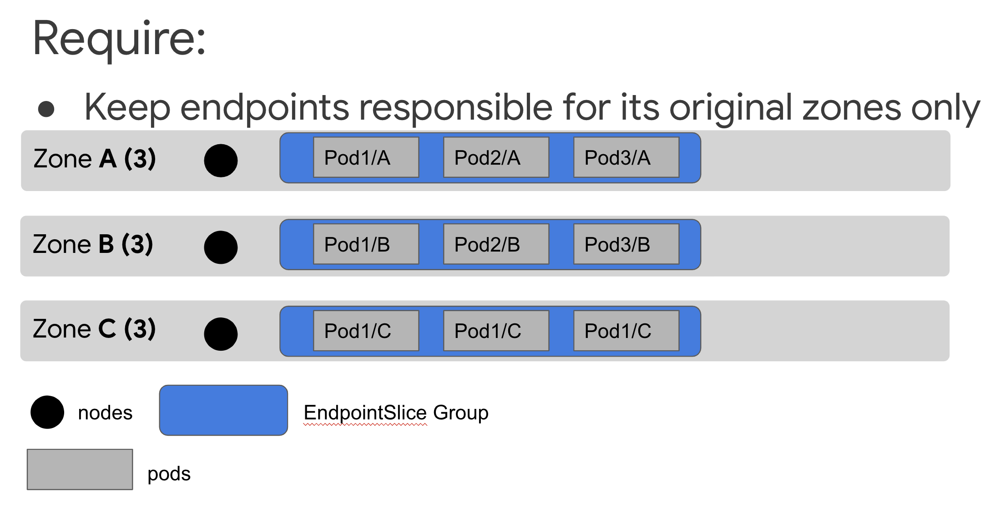
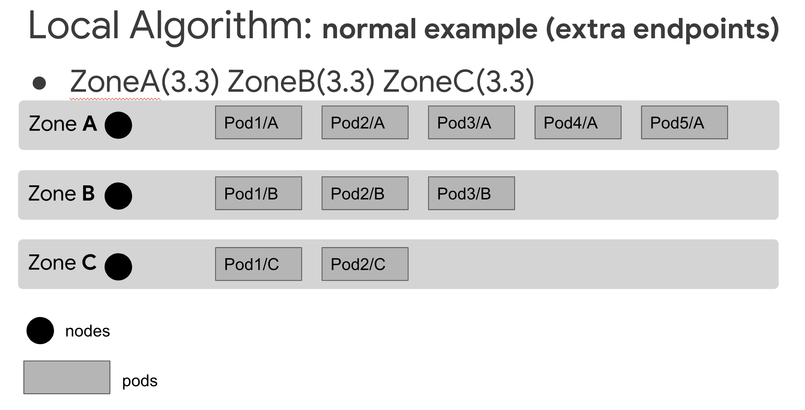
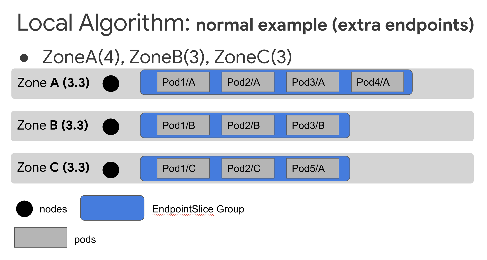
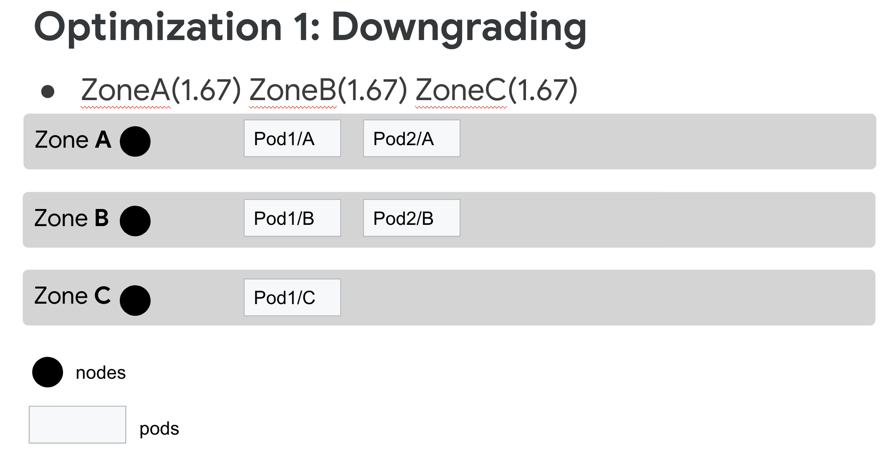
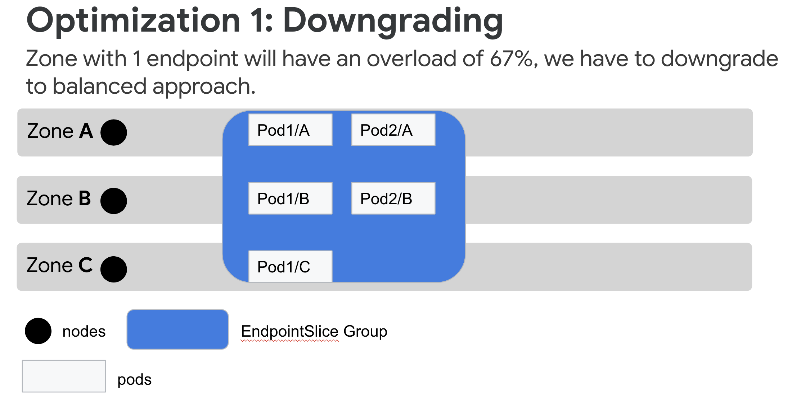
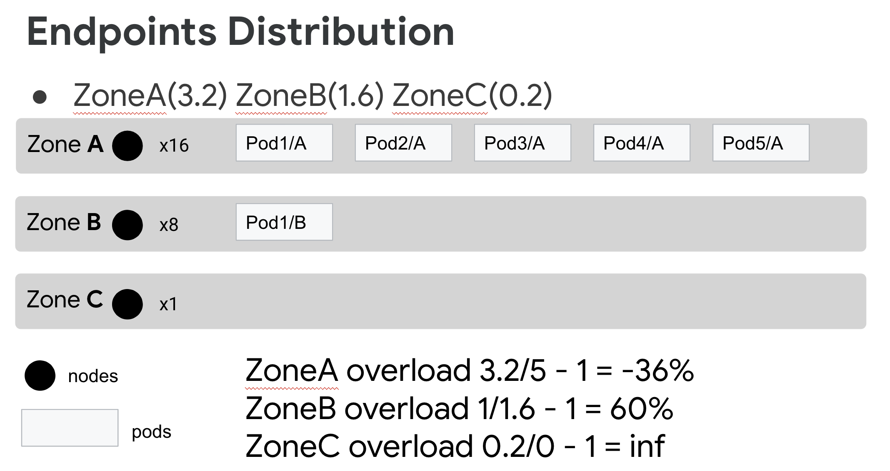
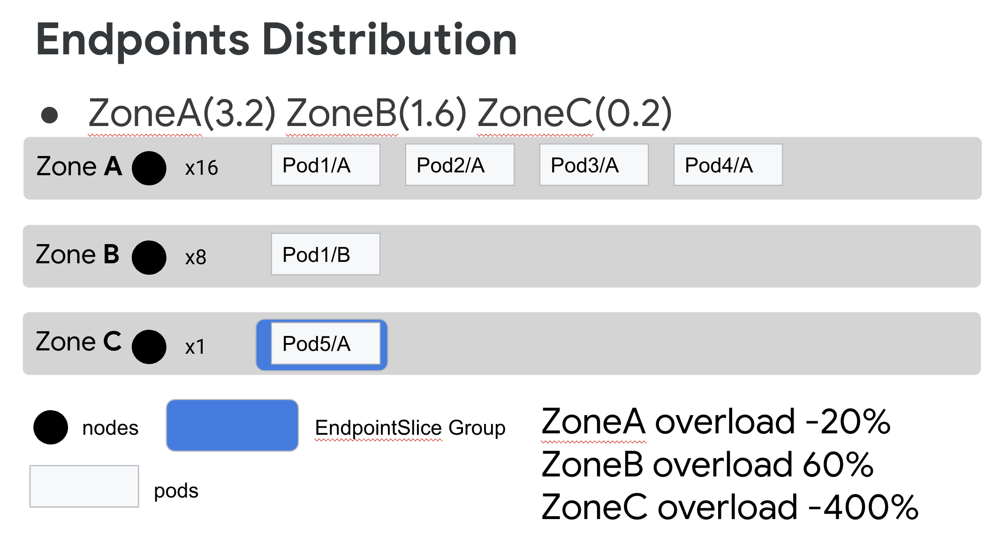
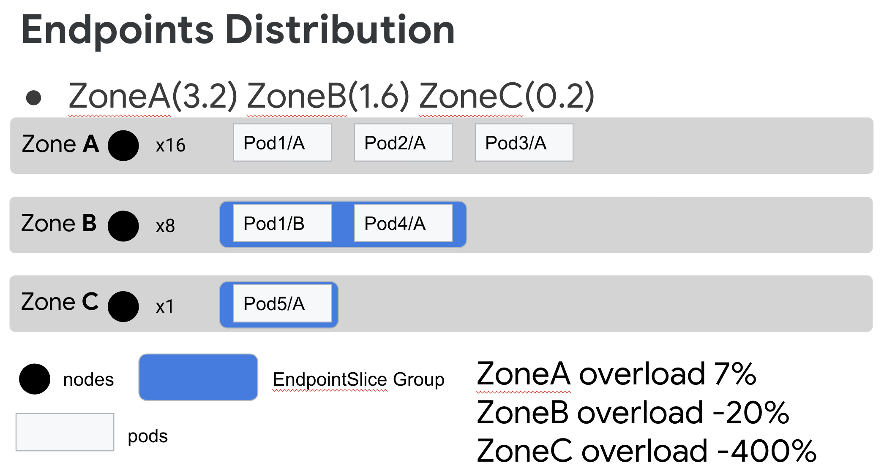
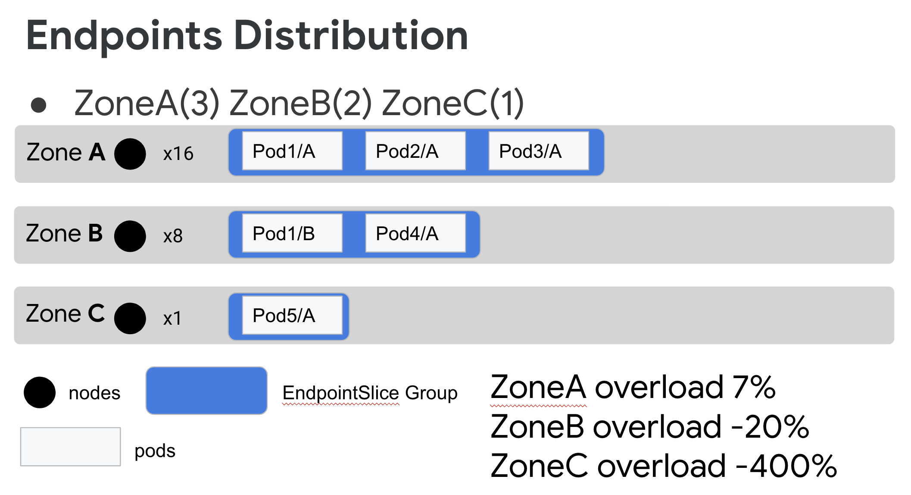

# KEP: Topology Aware Routing
<!-- toc -->
- [Release Signoff Checklist](#release-signoff-checklist)
- [Summary](#summary)
- [Motivation](#motivation)
  - [Goals](#goals)
  - [Non-Goals](#non-goals)
- [Proposal](#proposal)
  - [Terminology](#terminology)
  - [Configuration](#configuration)
  - [Notes/Constraints/Caveats](#notesconstraintscaveats)
  - [Risks and Mitigations](#risks-and-mitigations)
- [Design Details](#design-details)
  - [Assumptions](#assumptions)
  - [Kube-Proxy](#kube-proxy)
  - [`Balanced`](#balanced)
    - [Scheme Logic](#scheme-logic)
  - [`Require`](#require)
    - [Scheme Logic](#scheme-logic-1)
  - [`Prefer`](#prefer)
    - [Terminology](#terminology-1)
    - [Scheme Logic](#scheme-logic-2)
    - [Evaluation Tool](#evaluation-tool)
    - [Test Results](#test-results)
    - [Recommended Algorithm](#recommended-algorithm)
      - [Local Algorithm](#local-algorithm)
        - [Optimizations](#optimizations)
        - [Distribution of EndpointSlices](#distribution-of-endpointslices)
        - [Rationale](#rationale)
        - [Potential Issues](#potential-issues)
    - [Other Algorithms Evaluated](#other-algorithms-evaluated)
      - [Local-Shared Algorithm](#local-shared)
        - [Rationale](#rationale-1)
        - [Potential Issues](#potential-issues-1)
      - [Local-Weighted Algorithm](#local-weighted)
        - [Rationale](#rationale-2)
        - [Potential Issues](#potential-issues-2)
      - [Local-Opt Algorithm](#local-opt)
        - [Rationale](#rationale-3)
        - [Potential Issues](#potential-issues-3)
  - [Test Plan](#test-plan)
  - [Observability](#observability)
- [Drawbacks](#drawbacks)
- [Alternatives](#alternatives)
<!-- /toc -->

## Release Signoff Checklist

<!--
**ACTION REQUIRED:** In order to merge code into a release, there must be an
issue in [kubernetes/enhancements] referencing this KEP and targeting a release
milestone **before the [Enhancement Freeze](https://git.k8s.io/sig-release/releases)
of the targeted release**.

For enhancements that make changes to code or processes/procedures in core
Kubernetes—i.e., [kubernetes/kubernetes], we require the following Release
Signoff checklist to be completed.

Check these off as they are completed for the Release Team to track. These
checklist items _must_ be updated for the enhancement to be released.
-->

Items marked with (R) are required *prior to targeting to a milestone / release*.

- [ ] (R) Enhancement issue in release milestone, which links to KEP dir in [kubernetes/enhancements] (not the initial KEP PR)
- [ ] (R) KEP approvers have approved the KEP status as `implementable`
- [ ] (R) Design details are appropriately documented
- [ ] (R) Test plan is in place, giving consideration to SIG Architecture and SIG Testing input
- [ ] (R) Graduation criteria is in place
- [ ] (R) Production readiness review completed
- [ ] Production readiness review approved
- [ ] "Implementation History" section is up-to-date for milestone
- [ ] User-facing documentation has been created in [kubernetes/website], for publication to [kubernetes.io]
- [ ] Supporting documentation—e.g., additional design documents, links to mailing list discussions/SIG meetings, relevant PRs/issues, release notes

[kubernetes.io]: https://kubernetes.io/
[kubernetes/enhancements]: https://git.k8s.io/enhancements
[kubernetes/kubernetes]: https://git.k8s.io/kubernetes
[kubernetes/website]: https://git.k8s.io/website

## Summary

<!--
This section is incredibly important for producing high-quality, user-focused
documentation such as release notes or a development roadmap. It should be
possible to collect this information before implementation begins, in order to
avoid requiring implementors to split their attention between writing release
notes and implementing the feature itself. KEP editors and SIG Docs
should help to ensure that the tone and content of the `Summary` section is
useful for a wide audience.

A good summary is probably at least a paragraph in length.

Both in this section and below, follow the guidelines of the [documentation
style guide]. In particular, wrap lines to a reasonable length, to make it
easier for reviewers to cite specific portions, and to minimize diff churn on
updates.

[documentation style guide]: https://github.com/kubernetes/community/blob/master/contributors/guide/style-guide.md
-->
Kubernetes clusters are increasingly deployed in multi-zone environments but unfortunately network routing has not caught up with that. This doc proposes an automatic topology aware routing mechanism with a new Service annotation. This new annotation will provide three options of different routing options. Currently our proposal will only focus on topology aware routing at zone level.  

## Motivation

<!--
This section is for explicitly listing the motivation, goals and non-goals of
this KEP.  Describe why the change is important and the benefits to users. The
motivation section can optionally provide links to [experience reports] to
demonstrate the interest in a KEP within the wider Kubernetes community.

[experience reports]: https://github.com/golang/go/wiki/ExperienceReports
-->
Kubernetes clusters are increasingly deployed in multi-zone environments. Network traffic is routed randomly to any endpoint matching a Service. Some users might want the traffic to stay in the same zone for the following reasons:
- Cost savings: Keeping traffic within a zone can limit cross-zone networking costs.
- Performance: Traffic within a zone is often more performant than traffic leaving the zone.

In this KEP we are going to focus on avoiding cross-zone traffic when in-zone endpoints would suffice. We're attempting to provide a simple and more automatic approach to topology aware routing. This API will still allow users to require traffic to stay within a zone, or simply to indicate that they prefer to keep traffic in the same zone if there’s sufficient capacity. With this approach no new API fields are required, we can accomplish this simply with a new annotation on Service. 


### Goals
- Provide a simple way for users to indicate their preference for keeping traffic in zone.
- Provide different approaches to users who have a strong desire over the routing policy:
  - Balanced: Use the original approach to ensure traffic is distributed across all endpoints for a Service. 
  - RequireZone: Only route to endpoints within the same zone.
  - PreferZone: Prefer routing to endpoints within the same zone when they are available.
- Use EndpointSlice subsetting as the primary mechanism for topology aware routing.
  - Improve kube-proxy scalability by limiting the number of endpoints it needs to process.
- Minimize churn of EndpointSlices while doing topology aware distribution. 
- Minimize the number of new EndpointSlices required.
- Provide a simple API that does not require any new API fields.

### Non-Goals
- Real-time distribution rebalancing based on traffic load or distribution feedback or metrics.
- Providing a way for kube-proxy to consume subsets of EndpointSlices (this is a separate KEP).
- Providing a way to require Node local traffic ([this is a separate KEP](https://github.com/kubernetes/enhancements/pull/1944)). 
- Multi-cluster topology aware routing (this same pattern may be useful there though).
- Region based topology aware routing (this may come later).
- Ensuring that endpoints are distributed evenly across zones.

## Proposal

### Terminology

- **EndpointSlice Group**: One or multiple EndpointSlices that will be consumed by the same set of zones.
- **Endpoints**: In this KEP, “endpoints” are used to describe individual Pod IPs. These are not references to Kubernetes Endpoints resources. We also omit the unready pods that number of endpoints = number of pods.

### Configuration

This proposal builds off of the [EndpointSlice API](https://kubernetes.io/docs/concepts/services-networking/endpoint-slices/). 

We propose a new Service annotation: `endpointslice.kubernetes.io/same-zone` with three options:
- `Balanced`:This is the default, it does not need to be specified which also provides backward compatibility for users. It represents the existing approach that is already used, no special mechanism will be added. Traffic will be evenly distributed among endpoints behind a Service. 
- `Require`: EndpointSlice controller will conduct a simple but aggressive routing mechanism. It will group endpoints in a zone to an EndpointSlice Group that only receives traffic from that zone. `Require` requires users to ensure that a sufficient number of endpoints for a Service exist in each zone. Services using this approach will only be reachable from zones that contain endpoints for the Service. 
- `Prefer`: EndpointSlice controller will conduct a more conservative routing mechanism. It will keep traffic in zone as long as each zone has a sufficient number of endpoints. If a zone does not have a sufficient number of endpoints, traffic will be routed to other zones.

This same pattern could be used for topology aware routing at node and region level. We could add new annotations `endpointslice.kubernetes.io/same-node` and `endpointslice.kubernetes.io/same-region` for node and region respectively with the same values `Require` and `Prefer`. With all these three levels combined together, their individual value could be influenced by values of others, i.e. `Require` node would also `Require` zone and region. 


### Notes/Constraints/Caveats

In the future, we may introduce another parameter for the `Prefer` approach that would allow users to specify a starting threshold. Starting threshold defines the starting point for `Prefer` (more detailed description below). We currently set the starting threshold to 3x the number of zones based on results from our test dataset for safer distribution results.

### Risks and Mitigations

- When users opt-in to the `Require` routing scheme, it is their responsibility to make sure the workloads are balanced.
- In a scenario where all traffic originates from a single zone, with `Require` and `Prefer` options, there is a chance that endpoints in that zone will be overloaded while endpoints in other zones receive little to no traffic. 

## Design Details

### Assumptions

- Incoming traffic is proportional to the number of nodes in a zone. Although this is an imperfect metric, it is the best available way of predicting how much traffic will be received in a zone. We could alternatively consider basing this on the number of cores in a zone.
- Service capacity is proportional to the number of endpoints in a zone. This assumes that each endpoint has equivalent capacity. Although this is not always true, it usually is. We can explore ways to deal with variable capacity endpoints in the future.

### Kube-Proxy

Kube-Proxy will be updated to support EndpointSlice subsetting. Each instance will watch for EndpointSlices that have a label indicating they should be consumed by this zone. For more information, refer to the EndpointSlice subsetting KEP.

### Balanced

As for the balanced approach, we do not need to change anything in the current system. When requests come in, they will be evenly distributed among all the endpoints of a service. 

Absent of the `endpointslice.kubernetes.io/same-zone` annotation or any other values for this key other than `Require` and `Prefer` will be interpreted as `Balanced` approach required.

#### Scheme Logic:
1. Group all endpoints in a single global EndpointSlice Group.

### Require
`Require` groups endpoints in a zone to an EndpointSlice Group that only receives traffic from that zone, users have to ensure the distribution of endpoints is balanced.
Users specify `RequireZone` approach by adding `endpointslice.kubernetes.io/same-zone`: `Require` in annotations of a Service

#### Scheme Logic:
1. Group all endpoints in a zone in a local EndpointSlice Group.


### Prefer
#### Terminology
- **Starting threshold**: threshold to start a topology aware routing (number of endpoints vs number of zones etc.)
- **Padding**: to avoid frequent and unnecessary mechanism switches caused by rolling up, defer the mechanism update with a padding value, i.e. starting threshold = 6, padding = 3, switch to topology aware routing at endpoints number = 9.
- **Overload**: When an endpoint receives more traffic than expected. For example, if 100 requests were expected with an even traffic distribution and instead an endpoint would receive 150 requests with this distribution, the overload would be 50%. 
- **Overload threshold**: max traffic overload for any single endpoint compared to balanced approach (50% by default).

#### Scheme Logic
1. Group all endpoints in a zone in a local EndpointSlice Group.
2. Rebalance endpoints among EndpointSlice Groups to a balanced state based on the proportion of nodes in each zone. The detailed rebalancing algorithms will be elaborated below.

#### Evaluation Tool
We evaluated different `Prefer` algorithms with a [topology simulation tool](https://github.com/googleinterns/k8s-topology-simulator). This tool abstracts concepts like endpoints, nodes, zones to simpler data structures and simulates the EndpointSlice grouping and traffic distribution.

We have tested different algorithms with various datasets with a relatively conservative score mechanism (in-zone traffic 45%, traffic overload 40%, number of EndpointSlices 15%) .
1. Different algorithms have been tested with datasets:
  * Representative data points
  * Small/Medium/Large ranged scale datasets 
2. We measure the outcome of algorithms on three metrics: in-zone traffic, overload and number of EndpointSlices.

| Metric        | Calculation           | Weight  |
| :------------- |:-------------:| :-----:|
| in-zone traffic      | 90% in-zone traffic = 90 credits | 45% |
| max overload      | 30% max overload = 100 - 30 = 70 credits      |   20% |
| mean overload | 10% mean overload = 100 - 10 = 90 credits      |    20% |
| # of EndpointSlices | 6 EndpointSlices with Prefer, 3 EndpointSlices with Balanced = (3/6 * 100) = 50 credits      |    15% |

#### Test Results
We have tested various algorithms with all the dataset and calculated their aggregate results for different dataset:

**Results of large dataset (39+ million inputs)**
| alg name        | mean total score           | mean in-zone score  | mean overload score | mean slice score | 
| :------------- |:-------------:| :-------------:| :-------------:| :-----:|
| **balanced**      | 72.48 | 38.84 | 100 | 100 |
| **local**      | 86.69 | 84.27 | 98.26 | 63.1 |
| **local-shared** | 86.87 | 83.92 | 98.98 | 63.41 |
| **local-weighted** | 84.34 | 83.9 | 100 | 43.88 |
| **local-opt** | 84.89 | 83.74 | 99.47 | 49.35 |

#### Recommended Algorithm
##### Local Algorithm
Local algorithm keeps as many endpoints (by EndpointSlice subsetting) responsible for its local zone as possible based on the nodes ratio. Meanwhile, it rebalances the endpoints from overflowed zones to insufficient zones to maintain overload for every endpoint less than overload threshold.



###### Optimizations
_Downgrading:_
1. If failed to maintain an overload less than overload threshold, we downgrade the whole mechanism to the `Balanced` approach.



_Starting Threshold -- default 3x of zone number:_
1. As we evaluated algorithms on different datasets, we found that at small scales of endpoints number, it is too risky to conduct a `Prefer` approach. It results in a high probability of EndpointSlice churn (higher ratio change when updating endpoints) and imbalanced traffic load for endpoints. With all that said, we determined a starting threshold based on the test results as 3 times the number of zones. 
<br>_Note that this starting threshold may vary with different score mechanisms._
2. Besides the starting threshold, we also want to introduce a padding protection for policy switches. This design is meant to protect unnecessary churn caused by rolling updates. 

Example: starting threshold = 9, padding = 3
1. Remain `Balanced` approach until # of endpoints hits 12
2. Remain `Prefer` approach until # of endpoints hits 6

**Scores on small dataset with different starting thresholds for local algorithm**
|Algorithm/Starting threshold| Score |
|:---|:---|
|balanced|72.55|
|local-1x|80.07|
|local-2x|80.09|
|local-3x|80.1|
|local-4x|80.08|
|local-5x|80.01|

_Overload Maintenance:_

Keep track of endpoints overload during endpoints rebalance, assign more endpoints to EndpointSlice Groups that are exceeding the overload threshold with a higher priority from zones:
1. With negative overloads first
2. With overloads less than overload threshold after zones in condition 1 runs out

_Lazy Rebalance:_
1. To reduce churn of EndpointSlices and overhead for the API server.
2. After rebalancing endpoints among EndpointSlices, any following endpoints update without any endpoints exceeding a threshold, make that update only. 
3. Do a full rebalance until the update can't be made without exceeding the threshold.

###### Distribution of EndpointSlices
Each EndpointSlice Group is consumed by a single zone and will only receive traffic from that zone (local zone). The number of endpoints belonging to that SliceGroup is calculated by `total endpoints * nodes in zone / total nodes` (**expected endpoints**). The control plane tries to fill SliceGroup with local endpoints as full as possible.
1. Iterate through existing zones, assign all endpoints to its corresponding ‘local SliceGroups’. 
2. If the current zone has enough endpoints to achieve traffic load below the overload threshold, put it into an ‘endpoints_available pool’. Otherwise put it into an ‘endpoints_require pool’. The pool is implemented by a priority queue which will place the zone with most extra endpoints or the zone with most insufficient endpoints first.
3. Iterate through the ‘endpoints_available pool’ and the ‘endpoints_require pool’. Pop out the first zones from both pools and assign one endpoint from the ‘available_zone’ to the ‘require_zone’. Push the ‘available_zone’ back to the ‘endpoints_available pool’ if it still has overload below threshold. Push the ‘require_zone’ back to the ‘endpoints_require pool’ if it still has overload above threshold. This step ends when one of the conditions meets:
  * ‘endpoints_available pool’ is empty.
  * ‘endpoints_require pool’ is empty.
4. If ‘endpoints_available pool’ is empty and ‘endpoints_require pool’ is not empty, downgrade to `Balanced` approach. 
5. Otherwise, iterate all zones again, assign endpoints from zones in ‘endpoints_available pool’ to zones with endpoints fewer than expected endpoints. In this step, zones in ‘endpoints_available pool’ only provide extra endpoints when they have endpoints > expected endpoints. This ends when one of the conditions meets:
  * ‘endpoints_available pool’ is empty.
  * All zones have at least the flooring number of expected endpoints in their ‘local SliceGroup’.






During our tests among different datasets, we found that with a large number of total endpoints it is less likely to have cases described in step 4, that’s one of the reasons we introduced the starting threshold for this mechanism. Meanwhile as described above, we may open the starting threshold as a configurable parameter for users. This might be updated after collecting enough feedback from users. 

###### Rationale
1. Easy to implement and acceptable churn of EndpointSlices
2. Relatively high in-zone traffic
3. Balanced deviation for endpoints
4. No weights involved -- no API additions needed

###### Potential Issues
1. Can’t deal with the single-zone traffic case described above
2. Higher number of EndpointSlices compared to `Balance`.

#### Other Algorithms Evaluated
##### Local-Shared
LS shares the same idea of `recommended` that rebalances endpoints from overflowed zones to insufficient zones. Instead of trying every effort to assign endpoints to insufficient zones, it creates shared SliceGroups for zones:
1. Have 0 endpoints originally.
2. Not be able to achieve lower overload after the reallocation of step 3 described in `recommended`.

###### Rationale
1. Well-balanced traffic load for every endpoint.
2. Relatively high in-zone traffic.
3. Fewer number of EndpointSlices compared to `recommended`. 
4. Relatively higher performance than `recommended`.
5. No weights involved -- no API additions needed.

###### Potential Issues
1. Extra complexity for the EndpointSlice subsetting KEP which needs to support multiple zones to consume a shared EndpointSlice.
2. More complicated to implement.
3. Potential more churn of EndpointSlices than `recommended` (transition between shared and local SliceGroups)

The extra complexity introduced to subsetting is the main reason we chose ‘local’ as `recommended` over ‘local-shared’. In terms of performance, ‘local’ is reasonably close to ‘local-shared’ which we think the overhead for subsetting is not worthwhile compared to the improvement we can gain from this algorithm compared to ‘local’. But this could be a very competitive alternative algorithm. 

##### Local-Weighted
LW shares the same idea of `recommended` that rebalances endpoints from overflowed zones to insufficient zones. Instead of approximation from float to integer, LW uses the precise expected value for every zone while rebalancing. This idea can be implemented with weights.

###### Rationale
1. Perfectly balanced traffic load for every endpoint
2. Relatively high in-zone traffic

###### Potential Issues
1. Weights require API additions
2. Weights are volatile that increases churn of EndpointSlices (any single endpoint update leads to a weight change for almost every EndpointSlice)
3. Higher number of EndpointSlices
4. Lower in-zone traffic than `recommended`

##### Local-Opt
LO shares the same idea of `recommended` that rebalances endpoints from overflowed zones to insufficient zones. Instead of keeping more endpoints than expected in a `local EndpointSlice Group`, it shares those overall extra endpoints to all zones with an evenly divided weight to achieve better overload. 

###### Rationale
1. Relatively high in-zone traffic 
2. Relatively balanced deviation

###### Potential Issues
1. Weights involved in the tie-breaker stage
  * Requires API addition
  * Introduces more volatility
2. Higher number of EndpointSlices
3. Lower in-zone traffic than `recommended`


### Test Plan
| Test Name | Test Type | Test Details | Expected Output | Comments |
| :--- | :--- | :--- | :--- | :--- |
| Single Approach Test | Unit Test | Small/Large number of nodes | Distribute EndpointSlices as expected | |
| |  | Balanced/Imbalanced endpoints | Distribute EndpointSlices as expected | |
| |  | Zero endpoints in some zones | Distribute EndpointSlices as expected | |
| |  | Invalid annotation | Approach sets to default, distribute EndpointSlices as expected | |
| `Prefer` Test | Unit Test | Invalid starting threshold | Set starting threshold to default and start `Prefer` approach with condition meets| This is applicable for customized starting threshold only|
| |  | Endpoints below `starting threshold + padding` | `Prefer` approach will not be conducted | |
| |  | Endpoints above `starting threshold + padding` | `Prefer` works as expected | |
| Approach Transition Test | Unit Test | 1.Set annotation to `Prefer` <br>2. Increase endpoints number to above `starting threshold` but below `starting threshold + padding` | `Prefer` will not be conducted | If capable, monitor the churn of EndpointSlices during the rolling update |
|  |  | 1.Set annotation to `Prefer` <br>2. Increase endpoints number to above `starting threshold + padding` | Distribution will be changed from `Balanced` to `Prefer` | Same as above |
|  |  | 1.Set annotation to `Prefer` <br>2. Decrease endpoints number to below `starting threshold` but above `starting threshold - padding` | Distribution will remain `Prefer` | Same as above |
|  |  | 1.Set annotation to `Prefer` <br>2. Decrease endpoints number to below `starting threshold - padding` | Distribution will be changed from `Prefer` to `Balanced` | Same as above |
|  |  | 1.Set annotation to one of the three <br>2. Set endpoints to above `starting threshold + padding` <br> 3. Manually change the annotation to another approach | Distribution will be changed based on the new value | Step 2 is only needed for `Prefer` |
| Rolling Update Test | E2E Test |1.Set annotation to `Prefer` <br>2. Conduct an aggressive rolling update policy for endpoints update <br> 3. Set endpoints to test corner cases | In the desired state, EndpointSlices are distributed as expected | If capable, monitor the churn of EndpointSlices during the rolling update |
| Traffic Reliability Test | E2E Test |1.Set annotation to `Require` and `Prefer` <br>2. Set endpoints above `starting threshold + padding` <br> 3. Reuse the current traffic reachability test | Endpoints are reachable from different zones as expected | Step 2 is only needed for `Prefer` |

### Observability
We can reuse some of the metrics of EndpointSlice Controller that we already have in the current version to observe the changes of endpoints (addition, deletion and update).
Meanwhile we can add more metrics to have a glimpse of different approaches.

- `endpoint_slice_controller/changes_endpointslices_per_sync`
- `endpoint_slice_controller/reallocated_endpoints_per_sync`
- `endpoint_slice_controller/total_endpoints (this has already been defined by endpoint_slice_controller)`
```
const SubSystem = "endpoint_slice_controller"

// This metric observes churn of EndpointSlices per sync  
EPSChangesPerSync = metrics.NewHistogramVec(  
	&metrics.HistogramOpts{  
		Subsystem: Subsystem,  
		Name: "changes_endpointslices_per_sync",  
		Help: "Number of EndpointSlices be changed on each Service sync",  
	},  
	[]string{"approach"},  
)

// This metric observes reallocated endpoints per sync  
EPEachZonePerSync = metrics.NewHistogramVec(  
	&metrics.HistogramOpts{  
		Subsystem: Subsystem,  
		Name: "reallocated_endpoints_per_sync",  
		Help: "Number of endpoints being reallocated to other zones on each Service sync",  
	}, 
	[]string{},  
)
```


## Drawbacks
1. Increased complexity in EndpointSlice controller
2. No immediate plans to support region
3. Different algorithms used by controller could make debugging more challenging
4. Does not provide a simple way to balance endpoints across zones

## Alternatives
1. Conduct topology aware routing at node level with specified topology keys, refer to the previous [Topology Aware Routing KEP](https://github.com/kubernetes/enhancements/blob/master/keps/sig-network/20181024-service-topology.md). As drawbacks described above, we could do some improvement i.e. fix the topology keys. But it still requires API and controller additions which introduces more complexity meanwhile cannot offer an easy policy decision at service level. 
2. Implement this proposal with other slicing algorithms to achieve better endpoints overload. This has been described in more details above. The main drawback is to introduce weights which require API additions as well as lead to more churn of EndpointSlices.

