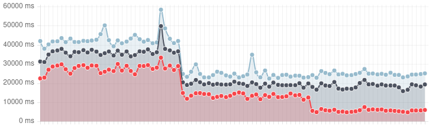

# KEP-3453: Minimizing iptables-restore input size

<!-- toc -->
- [Release Signoff Checklist](#release-signoff-checklist)
- [Summary](#summary)
- [Motivation](#motivation)
  - [Goals](#goals)
  - [Non-Goals](#non-goals)
- [Proposal](#proposal)
  - [General Plan](#general-plan)
  - [Risks and Mitigations](#risks-and-mitigations)
    - [Catastrophic Failure](#catastrophic-failure)
    - [Subtle Optimization Failure](#subtle-optimization-failure)
    - [Subtle Synchronization Delays](#subtle-synchronization-delays)
- [Design Details](#design-details)
  - [Test Plan](#test-plan)
      - [Prerequisite testing updates](#prerequisite-testing-updates)
      - [Unit tests](#unit-tests)
      - [Integration tests](#integration-tests)
      - [e2e tests](#e2e-tests)
  - [Graduation Criteria](#graduation-criteria)
    - [Alpha](#alpha)
    - [Beta](#beta)
    - [GA](#ga)
  - [Upgrade / Downgrade Strategy](#upgrade--downgrade-strategy)
  - [Version Skew Strategy](#version-skew-strategy)
- [Production Readiness Review Questionnaire](#production-readiness-review-questionnaire)
  - [Feature Enablement and Rollback](#feature-enablement-and-rollback)
  - [Rollout, Upgrade and Rollback Planning](#rollout-upgrade-and-rollback-planning)
  - [Monitoring Requirements](#monitoring-requirements)
  - [Dependencies](#dependencies)
  - [Scalability](#scalability)
  - [Troubleshooting](#troubleshooting)
- [Implementation History](#implementation-history)
- [Drawbacks](#drawbacks)
- [Alternatives](#alternatives)
<!-- /toc -->

## Release Signoff Checklist

Items marked with (R) are required *prior to targeting to a milestone / release*.

- [ ] (R) Enhancement issue in release milestone, which links to KEP dir in [kubernetes/enhancements] (not the initial KEP PR)
- [ ] (R) KEP approvers have approved the KEP status as `implementable`
- [ ] (R) Design details are appropriately documented
- [ ] (R) Test plan is in place, giving consideration to SIG Architecture and SIG Testing input (including test refactors)
  - [ ] e2e Tests for all Beta API Operations (endpoints)
  - [ ] (R) Ensure GA e2e tests meet requirements for [Conformance Tests](https://github.com/kubernetes/community/blob/master/contributors/devel/sig-architecture/conformance-tests.md) 
  - [ ] (R) Minimum Two Week Window for GA e2e tests to prove flake free
- [ ] (R) Graduation criteria is in place
  - [ ] (R) [all GA Endpoints](https://github.com/kubernetes/community/pull/1806) must be hit by [Conformance Tests](https://github.com/kubernetes/community/blob/master/contributors/devel/sig-architecture/conformance-tests.md) 
- [ ] (R) Production readiness review completed
- [ ] (R) Production readiness review approved
- [ ] "Implementation History" section is up-to-date for milestone
- [ ] User-facing documentation has been created in [kubernetes/website], for publication to [kubernetes.io]
- [ ] Supporting documentation—e.g., additional design documents, links to mailing list discussions/SIG meetings, relevant PRs/issues, release notes

[kubernetes.io]: https://kubernetes.io/
[kubernetes/enhancements]: https://git.k8s.io/enhancements
[kubernetes/kubernetes]: https://git.k8s.io/kubernetes
[kubernetes/website]: https://git.k8s.io/website

## Summary

The performance of kube-proxy's iptables mode in large clusters could
be greatly increased by optimizing its calls to `iptables-restore`.
Although this is a small change in terms of code size, it has a large
effect on kube-proxy operation, and could potentially completely break
clusters (if the code was buggy), so we have decided to treat it as a
KEP-able feature.

## Motivation

### Goals

- Improve the performance of kube-proxy in iptables mode, by optimizing
  its calls to `iptables-restore` by not including rules that haven't
  changed.

### Non-Goals

- Everything else.

## Proposal

### General Plan

`iptables-restore` has the constraint that if you want to specify
_any_ rule in a given iptables chain, then you must specify _every_
rule in that chain. However, if you want to leave a chain completely
unchanged, then you can just fail to mention any rules in that chain,
and it will be left untouched. (If you want to delete a chain you have
to explicitly request that.)

Thus, [the proposed PR] keeps track of which Service and EndpointSlice
objects have changed since the last `iptables-restore`, and only
outputs the Service-specific chains for a Service (the `KUBE-SVC-*`,
`KUBE-SVL-*`, `KUBE-EXT-*`, `KUBE-FW-*`, and `KUBE-SEP-*` chains) if
the Service or its EndpointSlice(s) changed (or were deleted) since the last
`iptables-restore`. (The `KUBE-SERVICES`, `KUBE-EXTERNAL-SERVICES`,
and `KUBE-NODEPORTS` chains are written in their entirety on every
sync.)

In theory this could be optimized further; eg, there are situations
where only `KUBE-FW-*` changes, or where we need to rewrite the
`KUBE-SERVICES` rules for a service but not any of the
service-specific chains, or vice versa. However, these other
optimizations would be more complicated, and would only result in a
small additional performance improvement relative to the main
improvement of not rewriting _every_ service and endpoint rule on
_every_ resync.

In the event that a partial `iptables-restore` call fails, kube-proxy
will queue another resync, and fall back to doing a full
`iptables-restore` that time. This should only happen if there is a
bug in kube-proxy that makes it accidentally write out an inconsistent
partial ruleset; eg, if kube-proxy mistakenly believed that it had
previously successfully created the `KUBE-SVC-ABCD` chain, and then
later tried to restore a ruleset including a `KUBE-SERVICES` rule that
jumps to `KUBE-SVC-ABCD`, then that restore would fail because of the
dangling jump. Falling back to a full restore would then fix things,
because in that case kube-proxy would recreate every chain that it
needed, including the missing `KUBE-SVC-ABCD`.

Additionally, kube-proxy will always do a full resync when there are
topology-related changes to Node labels, and it will always do a full
resync at least once every `iptablesSyncPeriod`.

[the proposed PR]: https://github.com/kubernetes/kubernetes/pull/110268

### Risks and Mitigations

#### Catastrophic Failure

In the event of bugs in the code, kube-proxy could fail
catastrophically, entirely breaking the cluster. This would be "bad".

#### Subtle Optimization Failure

The code could also fail more subtly. In the worst case, every attempt
to do a partial restore might fail, causing the code to fall back
to the slower full `iptables-restore` on the next sync, with the end
result that kube-proxy becomes _less_ efficient than the old code that
would have just done a full restore the first time.

Less obviously, the new code might reliably cause a fail-and-retry
only in certain circumstances (eg, when a service goes from 1 endpoint
to 0, or when a particular Service property changes).

Since, as mentioned above, there are no _expected_ cases where a
partial restore will fail, we will have a metric for when it does, so
we can notice that this failure mode is happening.

#### Subtle Synchronization Delays

The new code needs to analyze Service/EndpointSlice changes to
determine when the service-specific chains for each service need to be
included in the `iptables-restore` input. If this analysis is
incorrect, it might fail to update the iptables rules for a service in
response to certain kinds of changes (eg, when a service goes from 1
endpoint to 0, or when a particular Service property changes), causing
the iptables rules to be stale until they eventually get fixed in a
future full resync.

(There is no particular reason to assume that this sort of bug would
happen; it's just something that theoretically _could_ happen.)

In order to detect this, we would have to sanity-check every partial
restore, to ensure that, if applied to the current kernel state, it
would generate the same end result as the full restore we would
otherwise have applied. Although we could do this with the
`FakeIPTables` code in `pkg/util/iptables/testing`, that code is only
intended for the sorts of small-ish test cases in the unit tests, and
not at all optimized for handling the sort of very large rule sets
that would exist in larger clusters (ie, the rule sets that would
benefit the most from the partial restore feature).

Additionally, the code to do this checking would end up being much
more complicated than the code that it was actually checking, and so
any reported failures would be as likely to be the result of a bug in
the checking code as they would be to indicate a bug in the actual
syncing code.

## Design Details

### Test Plan

[X] I/we understand the owners of the involved components may require updates to
existing tests to make this code solid enough prior to committing the changes necessary
to implement this enhancement.

##### Prerequisite testing updates

This is the latest in a series of iptables kube-proxy improvements,
and many prerequisite tests have already been added.

##### Unit tests

We will add unit tests of the partial-resyncing feature, to ensure
that expected rules are updated when services and endpoints
change. (This is already done in the current PR.)

Existing coverage:
- `k8s.io/kubernetes/pkg/proxy/iptables`: `2022-08-02` - `67%`

##### Integration tests

Kube-proxy is mostly tested via unit tests and e2e, not integration,
and this is not expected to change.

##### e2e tests

All existing kube-proxy/Service e2e tests would be testing the new
code. In fact, a large percentage of the non-networking e2e tests
would also end up testing the new code. There is really no good way to
_specifically_ test this feature in any way that wasn't redundant with
the existing e2e tests and the feature's unit tests.

It would be useful to test at the end of the e2e test run (or at
least, at the end of the "Service" test suite) that the "partial sync
failures" metric is "0". There doesn't currently seem to be any
infrastructure in the e2e test for doing this, so we will need to add
appropriate code for that.

### Graduation Criteria

#### Alpha

- Feature implemented behind a feature flag
- "Partial sync failures" metric implemented
- Scalability tests modified to check that the "partial sync failures"
  metric is 0 at the end of the test run.

#### Beta

- No new bugs
- Feature actually improves performance (eg, in the `gce-5000Nodes`
  periodic job).
- Additional metrics to distinguish partial and full resync times

#### GA

- No new bugs

### Upgrade / Downgrade Strategy

N/A: This is not a feature, per se, it's just a modification of
existing code. Old and new versions of kube-proxy will be attempting
to generate the same iptables kernel state, they're just doing it in
different ways.

### Version Skew Strategy

N/A: Old and new versions of kube-proxy will be attempting to generate
the same iptables kernel state, they're just doing it in different
ways.

## Production Readiness Review Questionnaire

### Feature Enablement and Rollback

###### How can this feature be enabled / disabled in a live cluster?

- [X] Feature gate (also fill in values in `kep.yaml`)
  - Feature gate name: `MinimizeIPTablesRestore`
  - Components depending on the feature gate:
    - kube-proxy

###### Does enabling the feature change any default behavior?

Assuming no bugs, there should be no obvious changes in small
clusters. In large clusters, service/endpoint changes should be
reflected in iptables faster, and kube-proxy's process group should
use much less CPU.

###### Can the feature be disabled once it has been enabled (i.e. can we roll back the enablement)?

Yes. With the feature disabled (or with kube-proxy rolled back to an
older version), kube-proxy will completely overwrite all
kube-proxy-related iptables rules on its next sync, thus completely
reverting back to the state the node would have been in if the new
code had never been used.

###### What happens if we reenable the feature if it was previously rolled back?

Nothing different than enabling it the first time.

###### Are there any tests for feature enablement/disablement?

No, but:

- Even with the new code enabled, kube-proxy will always do a full
  sync the first time it syncs after startup (regardless of the
  pre-existing iptables state), so a test that switched from
  "disabled" to "enabled" would not really test anything different
  than a test that just brought up the cluster with the feature
  enabled in the first place.

- Even with the new code enabled, kube-proxy will periodically do a
  full resync, so a test that switched from "enabled" to "disabled"
  would not really test anything that wouldn't also be tested by just
  letting kube-proxy run for a while with the feature enabled. (Where
  "a while" is much less than the length of an e2e run.)

- The new code does not make any API writes (or change any other
  persistent cluster or node state besides the iptables rules), so
  there is nothing else that would need to be validated.

### Rollout, Upgrade and Rollback Planning

###### How can a rollout or rollback fail? Can it impact already running workloads?

There are no rollout/rollback-specific failure modes. If the code
works, then it will work fine during rollout, and if the code is
buggy, then it will (presumably) fail (to some extent) during rollout,
presumably impacting already-running workloads.

Given a sufficiently-catastrophic rollout failure, a rollback could
fail because, eg, some component could no longer reach the apiserver
because kube-proxy had written incorrect iptables rules. At this point
there would be no easy way to recover the cluster. It is unlikely that
such a drastic bug would make it to a GA release.

Other than that, it should not be possible for a rollback to fail,
because when the old/non-feature-enabled version of kube-proxy starts
up, it would delete all of the rules created by the
new/feature-enabled kube-proxy and replace them with the correct
rules.

###### What specific metrics should inform a rollback?

The new kube-proxy
`sync_proxy_rules_iptables_partial_restore_failures_total` metric
indicates when kube-proxy is falling back from a partial resync to a
full resync due to an unexpected `iptables-restore` error. While it may
eventually be non-0 due to unrelated unexpected `iptables-restore`
errors, it should not ever be steadily increasing, and if it was, that
would likely indicate a bug in the code.

###### Were upgrade and rollback tested? Was the upgrade->downgrade->upgrade path tested?

No, but as described above, the ordinary operation of kube-proxy with
the feature enabled includes behavior that is equivalent to what would
happen during an upgrade or rollback.

###### Is the rollout accompanied by any deprecations and/or removals of features, APIs, fields of API types, flags, etc.?

No

### Monitoring Requirements

###### How can an operator determine if the feature is in use by workloads?

This is a change to the core functioning of kube-proxy; if the feature
is enabled, then it is in use.

###### How can someone using this feature know that it is working for their instance?

- [X] Other (treat as last resort)
  - Details: End users do not "use this feature". It is a change to
    the core functioning of kube-proxy. If the feature is enabled, and
    their Services work, then the feature is working for them.

###### What are the reasonable SLOs (Service Level Objectives) for the enhancement?

Sync performance should be much better in large clusters, and should
be somewhat independent of cluster size.

Enabling this feature on the 5000-node scalability test immediately
resulted in a 2x improvement to the
`network_programming_duration_seconds` (aka
`NetworkProgrammingLatency`) metric in the 50th, 90th, and 99th
percentile buckets, with the 50th percentile going from about 27
seconds to about 13 (the first drop in the graph above).

On further investigation, we realized that it could theoretically have
improved further, but the tests were running kube-proxy with
`--iptables-min-sync-period 10s`, which introduced its own latency.
Dropping them to `--iptables-min-sync-period 1s` (the default) caused
a further drop in the 50th percentile latency, to about 5 seconds (the
second drop in the graph above) though at a cost of increased CPU
usage (since `syncProxyRules()`, the heart of kube-proxy, runs 10
times as often now). (90th and 99th percentile latency did not change,
because they are more dominated by the time it takes to do _full_
resyncs. We realized that we should probably add separate partial/full
sync time metrics to get more fine-grained information.)

For 1.26 we added a new section to the kube-proxy documentation
describing the kube-proxy `--sync-period` and
`--iptables-min-sync-period` options ([website #28435]), which also
mentions that the `MinimizeIPTablesRestore` feature reduces the need
for `--iptables-min-sync-period` and that administrators using that
feature should try out smaller min-sync-period values. For 1.27, we
should add a note about the latency vs CPU usage tradeoff, and we
should make sure to have a release note about this as well.

[website #28435]: https://github.com/kubernetes/website/pull/38435

###### What are the SLIs (Service Level Indicators) an operator can use to determine the health of the service?

- [X] Metrics
  - Metric names:
      - sync_proxy_rules_iptables_partial_restore_failures_total
      - sync_full_proxy_rules_duration_seconds
      - sync_partial_proxy_rules_duration_seconds
  - Components exposing the metric:
    - kube-proxy

###### Are there any missing metrics that would be useful to have to improve observability of this feature?

As of 1.26, there are no metrics for distinguishing the average
partial sync time from the average full sync time, which would help
administrators to understand kube-proxy's performance better and
figure out a good `--iptables-min-sync-period` value. We will add
those metrics for beta.

As discussed above under [Subtle Synchronization
Delays](#subtle-synchronization-delays), it would theoretically be
possible to have kube-proxy check the results of the partial restores
against an equivalent full restore, to ensure that it got the result
it was expecting. However, as also discussed there, this would be
quite difficult to implement, and would involve much more new code
than the actual partial-restores feature. Given that, and the fact
that e2e testing during Alpha has not turned up any problems with the
feature, it seems that if we tried to sanity check the rules in that
way, a failure would be more likely to indicate a bug in the
rule-sanity-checking code than a bug in the rule-generation code.
Thus, we are not implementing such a metric.

### Dependencies

###### Does this feature depend on any specific services running in the cluster?

No (other than the things kube-proxy already depends on).

### Scalability

###### Will enabling / using this feature result in any new API calls?

No; this affects how kube-proxy processes the data it receives from
the apiserver, but does not affect its communications with the
apiserver at all.

###### Will enabling / using this feature result in introducing new API types?

No.

###### Will enabling / using this feature result in any new calls to the cloud provider?

No.

###### Will enabling / using this feature result in increasing size or count of the existing API objects?

No.

###### Will enabling / using this feature result in increasing time taken by any operations covered by existing SLIs/SLOs?

No. The goal of the feature is specifically to _decrease_ the time
take by operations related to kube-proxy SLIs/SLOs.

###### Will enabling / using this feature result in non-negligible increase of resource usage (CPU, RAM, disk, IO, ...) in any components?

There should be no effect on disk, IO, or RAM.

The feature itself should result in a _decrease_ in the CPU usage of
kube-proxy's process group, since the `iptables-restore` processes it
spawns will have less work to do.

(If administrators also follow the recommendation to lower
`--iptables-min-sync-period`, then that will _increase_ kube-proxy CPU
usage, since kube-proxy will be waking up to resync more often. But
this is a CPU usage increase that the administrator is more-or-less
explicitly requesting.)

###### Can enabling / using this feature result in resource exhaustion of some node resources (PIDs, sockets, inodes, etc.)?

No

### Troubleshooting

###### How does this feature react if the API server and/or etcd is unavailable?

It does not change kube-proxy's behavior in this case.

###### What are other known failure modes?

No known failure modes. See [Risks and
Mitigations](#risks-and-mitigations) for theorized potential failure
modes.

###### What steps should be taken if SLOs are not being met to determine the problem?

## Implementation History

- 2022-08-02: Initial proposal
- 2022-10-04: Initial KEP merged
- 2022-11-01: Code PR merged
- 2022-11-10: Testing PRs merged; 5000Nodes test begins enabling the feature
- 2022-12-08: Kubernetes 1.26 released

## Drawbacks

Assuming the code is not buggy, there are no drawbacks. The new code
would be strictly superior to the old code.

## Alternatives

Not really applicable; there are other things that might be done to
improve kube-proxy performance, but this KEP is about a single
specific idea, and does not prevent us from also doing other
improvements later.
