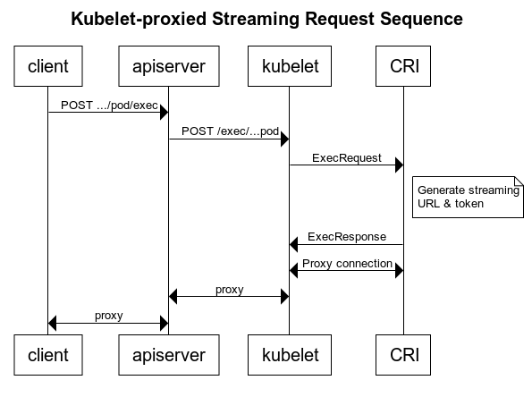

# Cleaning up container streaming requests

## Table of Contents

<!-- toc -->
- [Release Signoff Checklist](#release-signoff-checklist)
- [Summary](#summary)
- [Background](#background)
- [Motivation](#motivation)
  - [Goals](#goals)
  - [Non-Goals](#non-goals)
- [Proposal](#proposal)
  - [Rollout Plan](#rollout-plan)
  - [Risks and Mitigations](#risks-and-mitigations)
    - [Dependence on apiserver redirects](#dependence-on-apiserver-redirects)
    - [Rollout breakage](#rollout-breakage)
- [Design Details](#design-details)
  - [Test Plan](#test-plan)
  - [Graduation Criteria](#graduation-criteria)
      - [Removing a deprecated flag](#removing-a-deprecated-flag)
  - [Upgrade / Downgrade Strategy](#upgrade--downgrade-strategy)
  - [Version Skew Strategy](#version-skew-strategy)
- [Implementation History](#implementation-history)
<!-- /toc -->

## Release Signoff Checklist

**ACTION REQUIRED:** In order to merge code into a release, there must be an issue in [kubernetes/enhancements] referencing this KEP and targeting a release milestone **before [Enhancement Freeze](https://github.com/kubernetes/sig-release/tree/master/releases)
of the targeted release**.

For enhancements that make changes to code or processes/procedures in core Kubernetes i.e., [kubernetes/kubernetes], we require the following Release Signoff checklist to be completed.

Check these off as they are completed for the Release Team to track. These checklist items _must_ be updated for the enhancement to be released.

- [ ] kubernetes/enhancements issue in release milestone, which links to KEP (this should be a link to the KEP location in kubernetes/enhancements, not the initial KEP PR)
- [ ] KEP approvers have set the KEP status to `implementable`
- [ ] Design details are appropriately documented
- [ ] Test plan is in place, giving consideration to SIG Architecture and SIG Testing input
- [ ] Graduation criteria is in place
- [ ] "Implementation History" section is up-to-date for milestone
- [ ] User-facing documentation has been created in [kubernetes/website], for publication to [kubernetes.io]
- [ ] Supporting documentation e.g., additional design documents, links to mailing list discussions/SIG meetings, relevant PRs/issues, release notes

**Note:** Any PRs to move a KEP to `implementable` or significant changes once it is marked `implementable` should be approved by each of the KEP approvers. If any of those approvers is no longer appropriate than changes to that list should be approved by the remaining approvers and/or the owning SIG (or SIG-arch for cross cutting KEPs).

**Note:** This checklist is iterative and should be reviewed and updated every time this enhancement is being considered for a milestone.

[kubernetes.io]: https://kubernetes.io/
[kubernetes/enhancements]: https://github.com/kubernetes/enhancements/issues
[kubernetes/kubernetes]: https://github.com/kubernetes/kubernetes
[kubernetes/website]: https://github.com/kubernetes/website

## Summary

There are several features and flags for handling container streaming requests
(exec/attach/port-forward). Having so many different ways of handling these requests unnecessarily
complicates configuration, and opens the cluster to potential security risks. This is a proposal to
consolidate the current options into a single supported configuration. Specifically, it proposes:

1. Deprecate the Kubelet's `--redirect-container-streaming` feature
2. Deprecate the `StreamingProxyRedirects` feature

## Background

The Kubelet's `--redirect-container-streaming` option controls whether the Kubelet proxies the
streaming request to the CRI streaming server locally (when `--redirect-container-streaming=false`)
or if the Kubelet forwards the CRI streaming server address to the apiserver (when
`--redirect-container-streaming=true`). This option was added in v1.11, and defaults to `false`
(proxy locally).

The apiserver is expecting to upgrade the connection to the Kubelet to proxy back to the
client. However, in order to handle a redirect from the Kubelet, the apiserver will peak at the
first 16384 bytes from the Kubelet to check for and follow a redirect. This behavior is controlled
by the `StreamingProxyRedirects` feature gate, which is beta and default-enabled as of v1.6. To
mitigate SSRF attacks from a compromised Kubelet, the `ValidateProxyRedirects` feature was added in
v1.10 (beta in v1.14). ValidateProxyRedirects ensures that the redirect location is on the same host
as the original exec request to the Kubelet.

To summarize, here is a table describing the interaction of `redirect-container-streaming` and
`StreamingProxyRedirects`:

|                                            | `StreamingProxyRedirects=true`                                                            | `StreamingProxyRedirects=false`                                                                |
|:-------------------------------------------|:------------------------------------------------------------------------------------------|:-----------------------------------------------------------------------------------------------|
| **`--redirect-container-streaming=false`** | _Default configuration_ Kubelet proxies locally (see [Proposal](#proposal) diagram) | Kubelet proxies locally                                                                        |
| **`--redirect-container-streaming=true`**  | Kubelet responds with a 302 redirect, apiserver follows the redirect.                     | Kubelet responds with a 302 redirect, apiserver proxies redirect to the client, request fails. |

## Motivation

The `StreamingProxyRedirects` feature was originally added as part of the migration the [Container
Runtime Interface][]. One of the initial goals was to bypass the Kubelet for these long-running
requests in order to better account the request overhead. However, the apiserver is still
responsible for proxying these requests, so the gains of bypassing the Kubelet are
marginal. Furthermore, the redirect handling significantly complicates the apiserver stream
handling, and opens it up to [potential SSRF attacks][], so we added the `ValidateProxyRedirects`
feature to mitigate those.

When we went to add mTLS support to the runtime streaming server, we realized getting the right
certs established between the apiserver and the runtime was complicated, but the apiserver already
had an mTLS connection to the Kubelet. So, we added the ability for the Kubelet to connect the
stream locally and proxy the connection back to the apiserver. This setup is more secure, removes
the need for `StreamingProxyRedirects` and `ValidateProxyRedirects`, but adds the Kubelet back into
the long-running request chain. For background, see the discussion on [kubernetes/kubernetes#36666
(comment)](https://github.com/kubernetes/kubernetes/issues/36666#issuecomment-378440458).

`StreamingProxyRedirects` and `ValidateProxyRedirects` are currently in Beta, and should either be
graduated or removed.

[Container Runtime Interface]: https://github.com/kubernetes/community/blob/master/contributors/design-proposals/node/container-runtime-interface-v1.md
[potential SSRF attacks]: https://github.com/kubernetes/kubernetes/issues/85867

### Goals

1. Simplify secure container runtime setup and operation
2. Remove conformance dependencies on beta features

### Non-Goals

Design a high-bandwidth low-latency production ready streaming channel to containers. Such a system
should go through an ingress point other than the apiserver, and could be implemented (or at least
prototyped) out of tree by leveraging the new [ephemeral containers
feature](277-ephemeral-containers).

## Proposal

After the [transition period](#rollout-plan), the only way to configure container streaming will be
using the local redirect with Kubelet proxy approach. Under this configuration, handling streaming
redirects are not needed by the apiserver, so `StreamingProxyRedirects` will be deprecated and
eventually removed. Once `StreamingProxyRedirects` are removed, `ValidateProxyRedirects` is no
longer needed and can be removed. Finally, the `--redirect-container-streaming` flag will be
deprecated and eventually removed.

Upon completion, streaming requests will be forwarded to the Kubelet. The Kubelet will ask the CRI
to prepare a streaming server, and then open an upgraded connection to the CRI streaming server. The
kubelet will proxy the connection back to the apiserver (upgrade the original exec request), which
will in turn proxy the connection back to the client.

### Rollout Plan

1. release **1.18**
   1. Mark the `--redirect-container-streaming` flag as deprecated. Log a warning on use.
   2. Mark the `StreamingProxyRedirects` feature as deprecated. Log a warning on use.
2. release **1.19** - no changes
3. release **1.20**
   1. `--redirect-container-streaming` can no longer be enabled. If the flag is set, log an error
      and continue as though it is unset.
4. release **1.22** 
   1. Default `StreamingProxyRedirects` to disabled. If there is a >= 2 version skew between master
      and nodes, and the old nodes were enabling `--redirect-container-streaming`, this **will break
      them**. In this case, the `StreamingProxyRedirects` can still be manually enabled.
5. release **1.24**
   1. Remove the `--redirect-container-streaming` flag.
   2. Remove the `StreamingProxyRedirects` feature.

### Risks and Mitigations

#### Dependence on apiserver redirects

Risk: a user depends on the ability to handle streaming redirects in the apiserver.

This could be the case if:

1. Pods are run outside the node, and the kubelet has no connectivity to streaming server. This is
   not a conformant setup, and I do not think we need to support it. If the kubelet _does_ have
   connectivity, then the kubelet can still proxy the stream.
2. The use case is extremely latency or resource sensitive, and cannot tolerate the extra hop
   through the Kubelet. My hypothesis is that these use cases would also be intolerant of the
   apiserver hop, and should look into alternative solutions.

Without direct evidence of use cases that wouldn't be able to handle the new approach anything here
is purely speculative. Hopefully the long transition plan would raise any issues in this bucket
before we pass the point of no return (features removed).

As a mitigation, a new configuration option will be exposed in the Kubelet to limit the data rate
through the proxied connection, `MaxConnectionBytesPerSec`. This option is analogous to the option
of the same name on the apiserver, should typically be configured to be match the apiserver's value.

#### Rollout breakage

Risk: no configurations are updated, and streaming is broken during the rollout transition.

There are 4 potential points for breakage in the rollout, which we'll consider separately:

1. `--redirect-container-streaming` cannot be set (rollout step 3.1) - This case is covered by
   [Dependence on apiserver redirects](#dependence-on-apiserver-redirects).
2. `StreamingProxyRedirects` disabled or removed (rollout step 4.1 or 5.2) - This would only be the
   case if there was version skew of at least 2 versions from the apiserver to the nodes, and the old
   nodes were still using `--redirect-container-streaming`. At this point, the user should have had
   ample warning (3 versions), and would only be affected if nodes were lagging the apiserver
   version. The safe alternative rollout plan waits 2 versions between steps, which is the maximum
   version skew supported between apiserver & nodes, to eliminate this concern.
3. Features / flags removed (rollout steps 3.2, 5.1 or 5.2) - The rollout plan conforms with the
   [Kubernetes deprecation policy][] for feature gates & flags, which gives users several releases
   and warnings to upgrade their configuration.

[Kubernetes deprecation policy]: https://kubernetes.io/docs/reference/using-api/deprecation-policy/#deprecating-a-flag-or-cli

## Design Details

### Test Plan

Multiple configurations are currently covered in the e2e environment, and there are many tests that
depend on the exec behavior. There are exec, attach, and port-forward tests in the kubectl test
suite.

### Graduation Criteria

See [Rollout Plan](#rollout-plan).

##### Removing a deprecated flag

This proposal removes 2 feature gates (`ValidateProxyRedirects` and `StreamingProxyRedirects`) and a
kubelet flag `--redirect-container-streaming`. See [Rollout Plan](#rollout-plan) for the details.

### Upgrade / Downgrade Strategy

There are no special considerations during upgrade and downgrade, except those around version skew
(see [Rollout breakage](#rollout-breakage)).

### Version Skew Strategy

See [Rollout breakage](#rollout-breakage).

## Implementation History

- _2019-12-05_: Published KEP
- _2020-02-19_: Mark the `--redirect-container-streaming` flag as deprecated. Log a warning on use.
Mark the `StreamingProxyRedirects` feature as deprecated. Log a warning on use in v1.18.
- _2020-10-28_: `--redirect-container-streaming` can no longer be enabled in v1.20.
- _2021-04-30_: Default `StreamingProxyRedirects` to disabled in v1.22.
- _2021-12-06_: Removed `StreamingProxyRedirects` feature gate in v1.24.