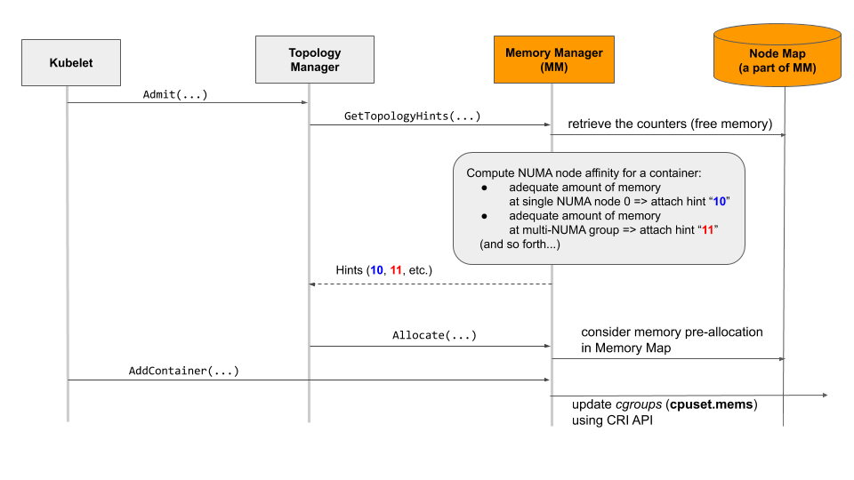
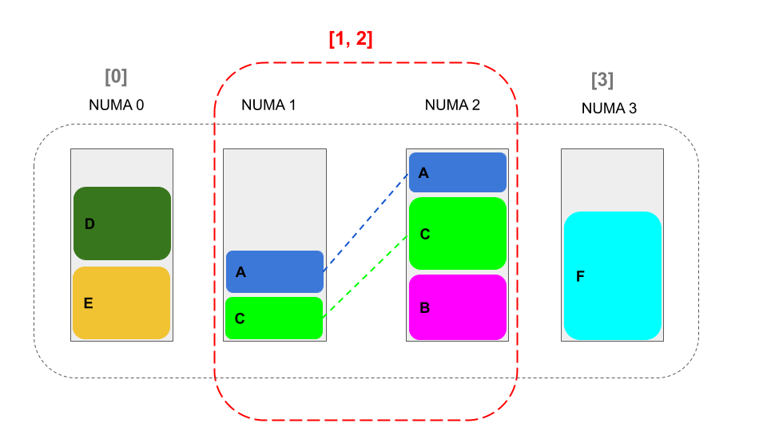
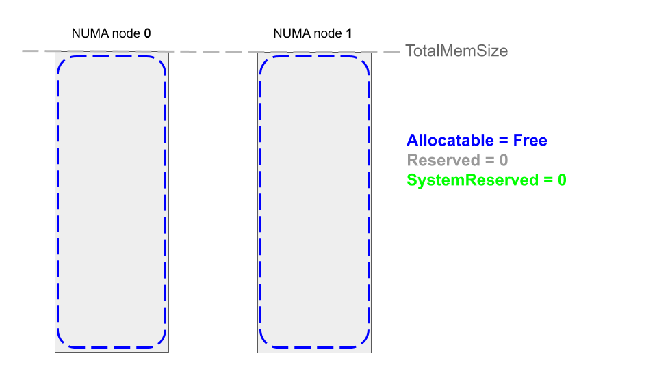
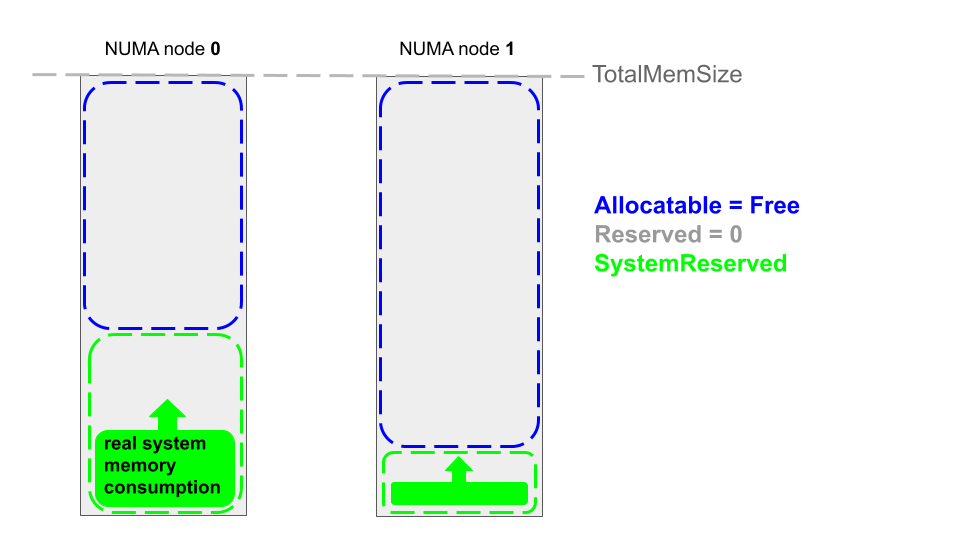
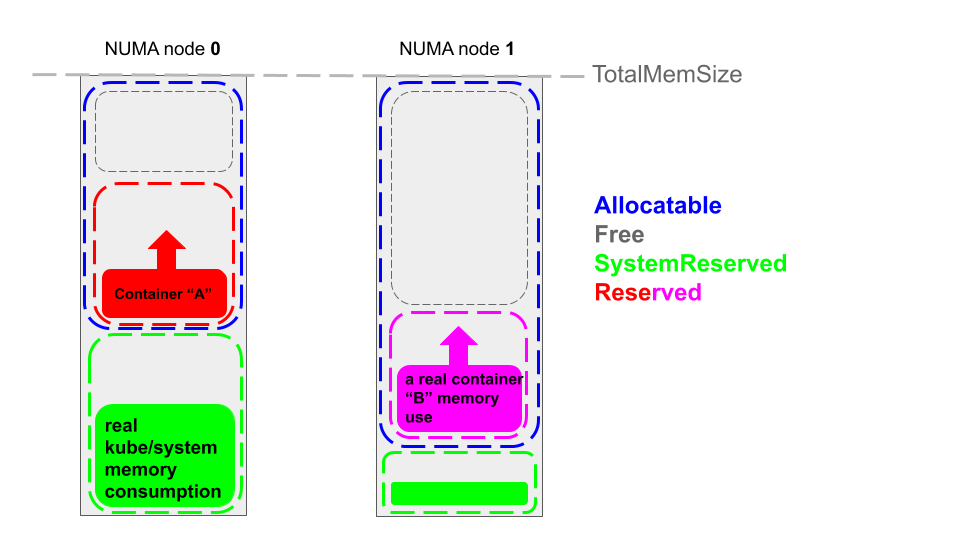

# KEP-1769: Memory Manager

<!-- toc -->
- [Release Signoff Checklist](#release-signoff-checklist)
- [Summary](#summary)
- [Motivation](#motivation)
  - [Goals](#goals)
  - [Non-Goals](#non-goals)
- [Proposal](#proposal)
  - [User Stories](#user-stories)
    - [Story 1 : High-performance packet processing with DPDK](#story-1--high-performance-packet-processing-with-dpdk)
    - [Story 2 : Databases](#story-2--databases)
    - [Story 3 : KubeVirt (provided by @rmohr)](#story-3--kubevirt-provided-by-rmohr)
  - [Notes/Constraints/Caveats (Optional)](#notesconstraintscaveats-optional)
  - [Risks and Mitigations](#risks-and-mitigations)
    - [UX](#ux)
- [Design Details](#design-details)
  - [Overview](#overview)
  - [How to enable the guaranteed memory allocation over many NUMA nodes?](#how-to-enable-the-guaranteed-memory-allocation-over-many-numa-nodes)
  - [The Concept of Node Map and Memory Maps](#the-concept-of-node-map-and-memory-maps)
  - [Memory Map](#memory-map)
    - [Memory Maps at start-up (with examples)](#memory-maps-at-start-up-with-examples)
    - [Memory Maps at runtime (with examples)](#memory-maps-at-runtime-with-examples)
  - [Simulation - how the Memory Manager works? (by examples)](#simulation---how-the-memory-manager-works-by-examples)
    - [Slide &quot;Reject Pod2&quot;](#slide-reject-pod2)
  - [Hints Generation for Topology Manager](#hints-generation-for-topology-manager)
  - [New Flags and Configuration of the Memory Manager](#new-flags-and-configuration-of-the-memory-manager)
    - [Feature Gate Flag](#feature-gate-flag)
    - [Memory Manager Policy Flag](#memory-manager-policy-flag)
    - [Reserved Memory Flag](#reserved-memory-flag)
  - [New Interfaces](#new-interfaces)
  - [How this proposal affects the kubelet ecosystem?](#how-this-proposal-affects-the-kubelet-ecosystem)
    - [Container Manager](#container-manager)
    - [Topology Manager](#topology-manager)
    - [Internal Container Lifecycle](#internal-container-lifecycle)
  - [Test Plan](#test-plan)
    - [Single-NUMA Systems Tests](#single-numa-systems-tests)
    - [Multi-NUMA System Tests](#multi-numa-system-tests)
      - [Prerequisite testing updates](#prerequisite-testing-updates)
      - [Unit tests](#unit-tests)
      - [Integration tests](#integration-tests)
      - [e2e tests](#e2e-tests)
  - [Graduation Criteria](#graduation-criteria)
    - [Phase 1: Alpha (target v1.21)](#phase-1-alpha-target-v121)
    - [Phase 2: Beta (target v1.22)](#phase-2-beta-target-v122)
    - [GA (stable)](#ga-stable)
  - [Upgrade / Downgrade Strategy](#upgrade--downgrade-strategy)
  - [Version Skew Strategy](#version-skew-strategy)
- [Production Readiness Review Questionnaire](#production-readiness-review-questionnaire)
  - [Feature Enablement and Rollback](#feature-enablement-and-rollback)
  - [Rollout, Upgrade and Rollback Planning](#rollout-upgrade-and-rollback-planning)
  - [Monitoring Requirements](#monitoring-requirements)
  - [Dependencies](#dependencies)
  - [Scalability](#scalability)
  - [Troubleshooting](#troubleshooting)
- [Implementation History](#implementation-history)
- [Drawbacks](#drawbacks)
- [Alternatives](#alternatives)
- [Appendix](#appendix)
  - [Related Features](#related-features)
  - [Related issues](#related-issues)
  - [Kubernetes Node's Memory Management Mechanisms and their relation to the Memory Manager](#kubernetes-nodes-memory-management-mechanisms-and-their-relation-to-the-memory-manager)
    - [Mechanism I (pod eviction by kubelet)](#mechanism-i-pod-eviction-by-kubelet)
    - [Mechanism II (Out-of-Memory (OOM) killer by kernel/OS)](#mechanism-ii-out-of-memory-oom-killer-by-kernelos)
    - [Mechanism III (obey cgroup limit, by OOM killer)](#mechanism-iii-obey-cgroup-limit-by-oom-killer)
<!-- /toc -->

## Release Signoff Checklist

Items marked with (R) are required *prior to targeting to a milestone / release*.

- [x] (R) Enhancement issue in release milestone, which links to KEP dir in [kubernetes/enhancements] (not the initial KEP PR)
- [x] (R) KEP approvers have approved the KEP status as `implementable`
- [x] (R) Design details are appropriately documented
- [x] (R) Test plan is in place, giving consideration to SIG Architecture and SIG Testing input (including test refactors)
  - [x] e2e Tests for all Beta API Operations (endpoints)
  - [x] (R) Ensure GA e2e tests meet requirements for [Conformance Tests](https://github.com/kubernetes/community/blob/master/contributors/devel/sig-architecture/conformance-tests.md)
  - [x] (R) Minimum Two Week Window for GA e2e tests to prove flake free
- [x] (R) Graduation criteria is in place
  - [x] (R) [all GA Endpoints](https://github.com/kubernetes/community/pull/1806) must be hit by [Conformance Tests](https://github.com/kubernetes/community/blob/master/contributors/devel/sig-architecture/conformance-tests.md)
- [x] (R) Production readiness review completed
- [x] Production readiness review approved
- [x] "Implementation History" section is up-to-date for milestone
- [x] User-facing documentation has been created in [kubernetes/website], for publication to [kubernetes.io]
- [x] Supporting documentation—e.g., additional design documents, links to mailing list discussions/SIG meetings, relevant PRs/issues, release notes

[kubernetes.io]: https://kubernetes.io/
[kubernetes/enhancements]: https://git.k8s.io/enhancements
[kubernetes/kubernetes]: https://git.k8s.io/kubernetes
[kubernetes/website]: https://git.k8s.io/website

## Summary

The *Memory Manager* is a new component in *kubelet* ecosystem proposed to enable the feature of guaranteed memory (and hugepages) allocation for pods in Guaranteed QoS class. The feature offers a couple of allocation strategies. The first one, the *single-NUMA* strategy, is intended for high-performance and performance-sensitive applications. Relevant user stories are illustrated in here for the *single-NUMA* strategy. The second one, the *multi-NUMA* strategy, complements the overall design while it overcomes the situation that cannot be managed with the *single-NUMA* strategy. Namely, whenever the amount of memory demanded by a pod is in the excess of a single NUMA node capacity, the guaranteed memory is provisioned across multiple NUMA nodes with the *multi-NUMA* strategy.  

In both scenarios, the *Memory Manager* employs hint generation protocol to yield the most suitable NUMA affinity for a pod, and it feeds the central manager (*Topology Manager*) with those affinity hints. Moreover, *Memory Manager* ensures that the memory which a pod requests is allocated from a minimum number of NUMA nodes.

The up-to-date implementation of the *Memory Manager* is available through the link in [Implementation History](##implementation-history) section. Technically, the *single-NUMA* strategy is a special case of the *multi-NUMA* strategy, and thus, no separate implementation was developed for them. Still, the proposal differentiates between the *single-NUMA* and the *multi-NUMA* strategies. First of all, it allows for a number of important use cases or situations to be discussed and contrasted.       

## Motivation

### Goals

- Offer guaranteed memory (and hugepages) allocation over a minimum number of NUMA nodes for containers (within a pod). 

- Guaranteeing the affinity of memory and hugepages to the same NUMA node for the whole group of containers (within a pod). This is a long-term goal which will be achieved along with PR [#1752](https://github.com/kubernetes/enhancements/pull/1752) and the implementation of `hintprovider.GetPodLevelTopologyHints()` API in the *Memory Manager*.  

### Non-Goals

- Both the upgrade of K8S scheduler and further extension of the official pod specification are out of scope.

- This proposal confines to the family of Linux operating systems.

## Proposal

The *Memory Manager* is a new component of _kubelet_ ecosystem proposed to enable single-NUMA and multi-NUMA guaranteed memory allocation. Besides:
- *Memory Manager* is also a new hint provider for _Topology Manager_;
- The hints are intended to indicate preferred memory (and hugepages) affinity which pins the memory for a container either to a single or a group of NUMA nodes;
- By design, *Memory Manager* offers guaranteed memory allocation for pods in Guaranteed QoS class.

The next subsection introduces to the proposal by outlining its design. 

### User Stories

#### Story 1 : High-performance packet processing with DPDK

- Systems such as real-time trading system or 5G CNFs (User Plain Function, UPF) employ DPDK to guarantee low-latency packet processing. DPDK (*Data Plane Development Kit*) consists of a set of libraries designed for packet processing acceleration managed in software, in the userspace. DPDK requires dedicated resources (such as exclusive CPUs, hugepages, and DPDK-compatible Network Interface Card), and most importantly, the alignment of resources to the same NUMA node so as to prevent an unexpected performance degradation due to inter-node (between NUMA nodes) communication overhead. This creates the reason to guarantee the reservation of memory (and hugepages) and other computing resources (e.g. CPU cores and NICs) from the same NUMA node, for DPDK-oriented containers. One of key KPIs in 5G deployment is Ultra-Reliable and Low Latency Communications (URLLC) which is mission-critical. This accounts for why this proposal is also critical.

#### Story 2 : Databases

- Databases (e.g., Oracle, PostgreSQL, and MySQL) require relatively extensive amount of memory and hugepages to access massive volumes of data relatively efficiently. In order to reduce the latency caused by cross-NUMA memory access and sharing, all resources (CPU cores, memory, hugepages, and I/O devices) should be aligned to the same single NUMA node. This will serve the stability and performance enhancement significantly.

- In-memory databases have even more extensive memory demand which extends to multiple NUMA nodes. This creates requirements to sustain and manage memory across multiple NUMA nodes.  

#### Story 3 : KubeVirt (provided by @rmohr)

- Similar use cases as for databases exist. The NUMA alignment is relevant to the workloads inside the guest VM. The VMs profit significantly from fine-tuning, i.e.: 
  - assigning full CPU cores to vCPUs inside the VM to enhance performance
  - using hugepages as memory backing mechanism to avoid double-memory-management via the guest and the host kernel
  - I/O devices passthrough, where it makes sense to run on NUMA nodes nearby the device

### Notes/Constraints/Caveats (Optional)

Allocation of resources happens, like all the other resource managers (CPU manager, device manager), at admission time. This behavior creates a disconnect with the scheduler
view of the system, which doesn't consider resource alignments or locality, which can contribute to runaway pod creation.

### Risks and Mitigations

Bugs in memorymanager can cause the kubelet to crash, or workloads to start with incorrect pinning. This can be mitigated with comprehensive testing and improving the observability of the system (see metrics).

The memory manager `None` policy is very simple and pretty safe, being almost a no-operation. The `Static` policy, which enabled memory pinning, has seen barely changes since beta,
and because of interactions with other features (VPA).

#### UX

To increase the UX, the number of new kubelet flags was minimized to a minimum.
The minimum set of kubelet flags, which is necessary to configure the Memory Manger, is presented in [this](#new-flags-and-configuration-of-the-memory-manager) section.

## Design Details 

### Overview



Once *kubelet* requests a guaranteed QoS pod admission, as shown in the figure above, *Topology Manager* queries *Memory Manager* about the preferred NUMA affinity for memory and hugepages, for all containers in a pod. For each container in a pod, *Memory Manager* calculates the affinity using its internal database, namely the `Node Map`. The `Node Map` is an object which is responsible for tracking the utilization of memory (and hugepages) for all containers in Guaranteed QoS class.
Once *Memory Manager* completes the computations, it returns the hints to *Topology Manager* so that *Topology Manager* can figure out which NUMA node or a group of NUMA nodes are the best fit for memory pinning, for a container. The overall calculation is performed for all containers in the pod, and if none of containers is rejected, the pod becomes finally admitted and deployed.

Depending on Topology Manager scope (`container` or `pod`), distinct hint generation routines are used:
- `GetTopologyHints` for `container` scope
- `GetPodTopologyHints` for `pod` scope

In the admission phase, the *Memory Manager* uses `Allocate()` and updates its `Node Map` to reflect the amount of memory and hugepages requested by a container. After that, *Memory Manager* uses `AddContainer()` and enforces the consumption of memory and hugepages for the container. The enforcement limits the container's memory consumption to the NUMA node or the group of NUMA nodes indicated by *Topology Manager*. In the final step in figure above, *Memory Manager* updates `cgroups`, namely `cpuset.mems`. The *Memory Manager* will offer guaranteed memory allocation (only) for pods in Guaranteed QoS class, which is clarified in [this](#mechanism-ii-out-of-memory-oom-killer-by-kernelos) section.

### How to enable the guaranteed memory allocation over many NUMA nodes?

The Linux kernel does not support multi-NUMA memory allocation (pinning), to the best of our knowledge, and thus, we assumed that we have to wait for a suitable upgrade in the Linux kernel so as to adopt multi-NUMA memory allocation (pinning) strategy in the *Memory Manager*. However, the community urged us to implement multi-NUMA strategy as something that is really necessary. In fact, we come up with a simple concept and design for multi-NUMA memory allocation (pinning), which allows for guaranteed memory allocation over many NUMA nodes. The main idea is to treat a group of NUMA nodes as an independent unit, and manage those independent units right by the *Memory Manager*.

The groups of NUMA nodes must be disjoint. This is the rule. A disjont set of NUMA groups is exemplified in the figure below. The groups in the figure are disjiont, i.e.: `[0]`, `[1, 2]` and `[3]`. The rule must be obeyed because the groups that overlap basically do not ensure guaranteed memory allocation over multiple NUMA nodes. 



For example, the following groups overlap, `[0, 1]`, `[1, 2]` and `[3]`, because they have a common NUMA node indexed by `1`. In other words, if a pair of groups overlap (`[0, 1]` and `[1, 2]`), the memory resources of some group (indexed by `1`) can be prior consumed by another group  (`[0, 1]`), and thus, the other group (`[1, 2]`) eventually starves. 

### The Concept of Node Map and Memory Maps

*Memory Manager* has an internal database, i.e. `Node Map` that incorporates `Memory Maps`. This database is used to keep track of the memory reserved for already deployed containers in Guaranteed QoS class. `Node Map` object remembers the dynamic configuration of disjont NUMA-node groups in `Node` objects. Notice that in fact `Memory Map` offers the counters for tracking the memory; therefore, the map should not be understood as a map that allows for reservation of ranges of memory or consecutive blocks of memory. 

_Notice: admins can examine the map though the on-disk state file._

The map is also utilized to calculate NUMA affinity once a container is being deployed. *Memory Manager* supports conventional memory and hugepages of various and all possible sizes (such as 2 MiB or 1 GiB). *Memory Manager* takes all those kinds of memory into account for topology hints calculation and generation. For instance, consider a *kubelet* node which offers hugepages of a couple of sizes, e.g., 1 GiB and 2 MiB. In other words, the node exposes three types of memory to *Memory Manager*, i.e.: conventional memory, `hugepages-1Gi`, and `hugepages-2Mi`.

At the start-up time, *Memory Manager* initializes a `Memory Table` collection for each NUMA node and respective memory types resulting in ready-to-be-used `Memory Map` objects. The code below illustrates the way both `Memory Table` and `Memory Map` collections are structured.

```go
// MemoryTable contains memory information
type MemoryTable struct {
	TotalMemSize   uint64 `json:"total"`
	SystemReserved uint64 `json:"systemReserved"`
	Allocatable    uint64 `json:"allocatable"`
	Reserved       uint64 `json:"reserved"`
	Free           uint64 `json:"free"`
}

// NodeState contains NUMA node related information
type NodeState struct {
	// NumberOfAssignments contains a number memory assignments from this node
	// When the container requires memory and hugepages it will increase number of assignments by two
	NumberOfAssignments int `json:"numberOfAssignments"`
	// MemoryTable contains NUMA node memory related information
	MemoryMap map[v1.ResourceName]*MemoryTable `json:"memoryMap"`
	// NodeGroups contains NUMA nodes that current NUMA node in group with them
	// It means that we have container that pinned to the current NUMA node and all group nodes
	Nodes []int `json:"nodes"`
}

// NodeMap contains memory information for each NUMA node.
type NodeMap map[int]*NodeState
```

For instance, consider a two-socket machine with only one size of hugepages pre-allocated. In this case, *Memory Manager* instatiates four memory tables (`[ two NUMA nodes ] * [ two  memory types ]`) on start-up. 

Notice that on modern architectures, a single socket, i.e., a physical NUMA node, can be further split into a number of logical NUMA nodes, which is done to further improve the performance. For this purpose, Intel offers machines with Sub-NUMA Clustering (SNC, an upgraded version of Cluster-On-Die) feature, and AMD offers mchines with NUMA Nodes per Socket (NPS) feature. In such a scenario where SNC or NPS is enabled on a machine, a K8S node and the *Memory Manager* can detect and be aware of many NUMA nodes, although the machine features a single socket (a single physical NUMA node).

### Memory Map 

`Memory Map` serves the purpose of tracking the memory utilization at each NUMA node. `Memory Map` involves several counters for tracking the memory utilization. The following rules hold:

```go
Allocatable = TotalMemSize - SystemReserved
Free + Reserved = Allocatable
```
or:
```go
Free = Allocatable - Reserved 
Reserved = Allocatable - Free
```

* The value of `TotalMemSize` is provided by `cadvisor` to *Memory Manager* for each memory type (regular memory, `hugepages-1Gi`, and so forth). The value of `TotalMemSize` is constant, and indicates the total (maximum) capacity of memory of a particular type available at a NUMA node. 
* `SystemReserved` is equal to `0` (zero) unless the administrator of _K8S_ node decides to employ [Node Allocatable Feature](https://kubernetes.io/docs/tasks/administer-cluster/reserve-compute-resources/) which was designed for improving the stability of _K8S_ node. We elaborate below the characteristics of this feature. Also, we describe the way how *Memory Manager* must be configured to satisfy and remain backwards-compatible with [Node Allocatable Feature](https://kubernetes.io/docs/tasks/administer-cluster/reserve-compute-resources/). The value of `SystemReserved` depends on the pre-configuration passed to *Memory Manager* by the administrator of _K8S_ node through `--reserved-memory` flag. Details concerning the flag are present in [this](#reserved-memory-flag) section.
* `Reserved` memory denotes exactly the same what we already meant by another term, i.e. **guaranteed** memory. So, in other words, `SystemReserved` stands for the memory **guaranteed** for system or `kubelet` daemons. `Reserved` indicates the total **guaranteed** memory reserved for containers in Guaranteed QoS class. By reserving memory for a container, the amount of `Free` memory becomes automatically reduced. On the other hand, when a container become successfully removed, the memory becomes reclaimed, and the amount of `Free` memory adequately increases.

**Notice**: the support for [Node Allocatable Feature](https://kubernetes.io/docs/tasks/administer-cluster/reserve-compute-resources/) is an extra feature in *Memory Manager*, i.e., basically to ensure backwards-compatibility. 

#### Memory Maps at start-up (with examples)

The figure below illustrates `Memory Maps` (for regular memory) shortly after node start-up.



The figure below illustrates `Memory Maps` (for regular memory) shortly after node start-up and when [Node Allocatable Feature](https://kubernetes.io/docs/tasks/administer-cluster/reserve-compute-resources/) is used, i.e. the value of `SystemReserved` must be configured by the node administrator as for example:

`--reserved-memory={numa-node=0, type=memory, limit=500MB}, {numa-node=1,type=memory, limit=100MB}`



The value of `SystemReserved` is pre-configured via our new `kubelet` flag; therefore, `SystemReserved` remains constant during the runtime. The value of `SystemReserved` directly implies the value of `Allocatable`, so `Allocatable` is also invariable during the runtime. 

`SystemReserved` indicates the amount of memory which is pre-reserved, i.e. **guaranteed**, for the system, i.e., kernel, OS daemons, and core node components such as *kubelet* (*kubelet* deamons).

#### Memory Maps at runtime (with examples)

The figure below illustrates `Memory Maps` (for regular memory) during the node runtime. The figure shows the situation after a successful deployment of container _"A"_ and container _"B"_. Also, *Memory Manager* **guaranteed** (reserved) memory for the containers. In the example, the containers consume less memory than it was reserved (**guaranteed**), so for both containers their memory consumption remains below their memory limits (e.g. `cgroup` memory limit), and containers operate as normal.



However, if **Out-of-Memory** (OOM) situation occurs, i.e., a particular memory limit is reached and crossed (e.g. by the containers) within _K8S_ node, the node triggers one of [the mechanisms](#kubernetes-nodes-memory-management-mechanisms-and-their-relation-to-the-memory-manager). Depending on what a particular limit is crossed (`cgroups` memory limit, `hard-eviction-treshold` memory limit, etc.), a suitable mechanism becomes triggered accordingly. As already noticed, such an OOM situation is handled by *kubelet* or system (OOM kernel killer) and not by *Memory Manager* itself. 

### Simulation - how the Memory Manager works? (by examples)

In this section, a number of slides is intended to illustrate the operation of the Memory Manager in various situations, i.e., to show how the pods in different QoS classes (Guaranteed, BestEffort/Burstable) are handled by the Memory Manager or other means, and how the disjoint groups of NUMA nodes are dynamically managed (created or removed) by the Memory Manager.  


#### Slide "Reject Pod2"

The slide _"Reject Pod2"_ results from a standard scenario, i.e.:

0. Both NUMA nodes are empty.
1. Memory Manager finds out from which NUMA nodes a pod should allocate memory, i.e. *Pod2* must use both NUMA nodes. 
2. Memory Manager updates `cpuset.mems`. 
3. Kernel uses its default [NUMA Memory Policy](https://www.systutorials.com/docs/linux/man/2-set_mempolicy/), i.e. "local".
4. Memory is allocated "locally", i.e. from the NUMA node where CPUs are pinned. 
5. As normal, CPU Manager pinned CPUs to the first NUMA node.
6. Therefore, memory is consumed from the first NUMA node completely (10G). 
7. And then, *Pod2* consumes memory from the second NUMA node (5G).

This might be surprising that *Pod2* is rejected although there is still enough spare memory for *Pod2* at the second (single) NUMA node. Nevertheless, the behaviour is correct and complies with the design. In fact, [Topology Manager design](https://kubernetes.io/blog/2020/04/01/kubernetes-1-18-feature-topoloy-manager-beta/) involves the physical resource availability check: 
> "NOTE: Setting of the Preferred field in this way is not based on the set of currently available resources. It is based on the ability to physically allocate the number of requested resources on some minimal set of NUMA nodes."

So, in our case, *Pod2* can be allocated physically to a single NUMA node, but because there is no spare single NUMA node as *Group1* is an inseparable unit of two NUMA nodes, *Pod2* becomes rejected with the assumption that there is a spare single NUMA node somewhere in the cluster to satisfy *Pod2*. 

The issue in the slide could also be illustrated in a different way, i.e., 5GB available to *Pod2* could be available from both nodes (e.g. 2GB from the first and 3GB from the second NUMA node). This would show that the memory needs to be allocated from a couple of different NUMA nodes, and that *Pod2* admission should be clearly rejected.  

### Hints Generation for Topology Manager

In brief, the Memory Manager calculates topology hints for a container in Guaranteed QoS Pod for conventional memory and hugepages of all sizes. A topology hint represents a possible set of NUMA nodes that has enough capacity to satisfy container's memory demand for all demanded memory types.

_Notice: in the case of failure, admins can examine system logs which provide verbose information about hint generation for pods and containers._

The concept of hint generation that ensures the guaranteed memory allocation was explained [here][sig-node-memory-manager-presentation] (slides 17-20). The presentation illustrates on how hint generation is performed by the Memory Manager.

<!--
To generate a NUMA affinity for a container, Memory Manager refers to `Memory Map` and decides if _Free_ memory of _Allocatable Zone_ for all memory types from each NUMA node is enough to assign for the container. After collecting _NUMA affinity_ for each NUMA node from the perspective of memory, Memory Manager merges them to a topology hint and send it back to Topology Manager.

- Here is a brief example for two socket machine.
  - A Pod requests 2Gi of memory and 1 hugepages-1Gi.
  - Memory Manager found that NUMA node #0 has enough memory and hugepage but NUMA node #1 does not so that the calculated NUMA affinity is NUMA node #0.
  - Memory Manager returns the result as a topology hint with NUMA node #0.
-->

### New Flags and Configuration of the Memory Manager

#### Feature Gate Flag 

A new feature gate flag will be added to enable the Memory Manager feature. This feature gate will be disabled by default in the initial releases.

Syntax:
`--feature-gate=MemoryManager=false|true`

#### Memory Manager Policy Flag  

The `Static` value of the flag enables the guaranteed memory allocation, whereas `None` disables it.

Syntax:
`--memory-manager-policy=Static|None`

#### Reserved Memory Flag

[Node Allocatable Feature](https://kubernetes.io/docs/tasks/administer-cluster/reserve-compute-resources/) is already a feature of K8S, and it is commonly used by node administrators to reserve resources in a K8S node (for the kubelet processes or system processes) in order to enhance the stability of K8S nodes. A group of flags is used to specify the total amount of reserved memory at a K8S node. This value is then used to calculate the real offered amount of node's "allocatable" memory. Also, K8S scheduler uses "allocatable" to improve the scheduling. The foregoing flags are `kube-reserved`, `system-reserved` and `eviction-threshold`. Their sum accounts for the total amount of reserved memory.    

The new `--reserved-memory` was added to allow for this total reserved memory to be split (by a node administrator) across many NUMA nodes. 

Syntax:
* `--reserved-memory=[{numa-node=int,type=string,limit=string}][,][...]`
* `numa-node` - an integer index of NUMA node, e.g. `0`
* `type` can be either set to:
  * `memory` to reserve conventional memory
  * `hugepages-2Mi` or `hugepages-1Gi` to reserve hugepages 
* `limit` - the amount of reserved memory, e.g. `1Gi`

Example A:

`--reserved-memory={numa-node=0,type=memory,limit=1Gi},{numa-node=1,type=memory,limit=2Gi}`

The following formula must hold for each memory type: 

`sum(SystemReserved(i)) = kube-reserved + system-reserved + eviction-threshold`, 

where `i` is an index of a NUMA node. In other words, the total sum `sum(SystemReserved(i))` equals to total `reserved-memory`. The values above can be specified with Node Allocatable Feature flags (more details [here](https://kubernetes.io/docs/tasks/administer-cluster/out-of-resource/)), for example:
* `--kube-reserved=cpu=500m,memory=50Mi`
* `--system-reserved=cpu=123m,memory=333Mi`
* `--eviction-hard=memory.available<500Mi`

_NOTICE: hard eviction threshold is not equal to zero by default but `100Mi`, so do not forget to decrease the total in `--reserved-memory` by this `100Mi`. Otherwise, the Memory Manager will display an error._

If the above formula does not hold, the Memory Manager returns an error.

In other words, "Example A" indicates that for conventional memory (`type=memory`) we reserve in total: 

`sum(SystemReserved(i)) = SystemReserved(0) + SystemReserved(1) = 1Gi + 2Gi = 3Gi`

NOTICE:
- The administrator guide is out of scope of this proposal. It is assumed that node administrators have ample professional background, and therefore, they are able to reserve suitable amount of memory across all NUMA nodes so that system and kubelet can operate in a stable way on NUMA-based servers. 

<!-- ### The configuration of Memory Manager

Following flags are used to configure the Memory Manager:
- Feature Gate: `--feature-gate=MemoryManager=true|false`
- Kubelet Flag: `--reserved-memory=[{numa-node=int, type=string, limit=string}][,][...]`

#### Feature Gate Flag

#### Reserved Memory Flag
-->

<!-- 
As described in Memory Map section, the size of Memory Reserved and Allocatable Zone are determined by the configuration of Memory Manager. Administrators are expected to have high confidence in the configuration of `--reserved-memory` flag.
As mentioned above, This feature will provide basic validation of configuration for administrators.

The Node Allocatable memory of Node Allocatable Feature is calculated by following formula:
- [Node-Allocatable] = [Node-Capacity] - [Kube-Reserved] - [System-Reserved] - [Eviction-Threshold]

The Node Allocatable is exposed to API server as part of `v1.Node` object and referred by scheduler to select appropriate worker node to bind a Pod.

NOTE:
- With respect to hugepages, in v1.17, Node Allocateble feature did not support the reservation of hugepages. Once Node Allocatable feature supports hugepages reservation (#83541), Reserved Memory for hugepages will operate in the same manner as for the conventional memory.

Configuring Memory Manager is important, Memory Manager assumes that components in kube/system-reserved consume memory from Memory Reserved so that total amount of Memory Reserved for every NUMA node and memory type should be identical to sum of `Kube-Reserved`, `System-Reserved` and `Eviction-Threshold`.

This constraint is proposed to avoid misconfiguration of Memory Manager that may lead node to Pod binding issue.

TBD: example of binding issue

To minimize Pod binding issue, total amount of Allocatable Zone memory should be identical to Node Allocatable memory for each memory type. Memory Manager validates it's configuration flags to ensure equality between total amount of Allocatable Zone memory and Node Allocatable memory for each memory type.
-->

### New Interfaces

We recommend browsing the code referred in [this](#implementation-history) section to learn about new interfaces.

### How this proposal affects the kubelet ecosystem?

#### Container Manager

Container Manager will create the Memory Manager and register to the Topology Manager as a hint provider.

#### Topology Manager

The Topology Manager will call out the Memory Manager to gather topology hints and allocate memory resources during its admission sequence.

#### Internal Container Lifecycle

`InternalContainerLifecycle` will call out the Memory Manager on container lifecycle events (Add/Stop) to allocate and reclaim memory resources.

### Test Plan

[x] I/we understand the owners of the involved components may require updates to existing tests to make this code solid enough prior to committing the changes necessary to implement this enhancement.

The Memory Manager E2E test will enable the Topology Manager feature gate and set the Memory Manager policy to 'static'.

At the beginning of the test, the code will determine if the system under test has support for single or multi-NUMA nodes.

Both Single-NUMA and Multi-NUMA tests will:
- be carried out for each of the four Topology Manager policies
- be spinning up non-guaranteed (BestEffort, Burstable) pods, guaranteed pods, and multiple guaranteed and non-guaranteed pods
- be carried out for all policies and all QoS classes, tests will validate whether pods can be deployed without errors

#### Single-NUMA Systems Tests
The admission of pods will be validated. Tests related to multi-NUMA systems will be skipped. 

#### Multi-NUMA System Tests
Memory pinning will be validated for Topology Manager `single-numa-node` and `restricted` policies. Once a pod in Guaranteed/QoS class is deployed, the NUMA node affinity for CPU assignment, memory, hugepages, or devices will be validated. Specifically for Topology Manager `restricted` policy, multi-NUMA feature will be tested against memory demands exceeding the capacity of a single NUMA node.

##### Prerequisite testing updates

##### Unit tests

- `k8s.io/kubernetes/pkg/kubelet/cm/memorymanager`: `20230928` - `81%`

##### Integration tests

<!--
Integration tests are contained in k8s.io/kubernetes/test/integration.
Integration tests allow control of the configuration parameters used to start the binaries under test.
This is different from e2e tests which do not allow configuration of parameters.
Doing this allows testing non-default options and multiple different and potentially conflicting command line options.
-->

<!--
This question should be filled when targeting a release.
For Alpha, describe what tests will be added to ensure proper quality of the enhancement.
For Beta and GA, add links to added tests together with links to k8s-triage for those tests:
https://storage.googleapis.com/k8s-triage/index.html
-->

  Not Applicable.

##### e2e tests

[Memory Manager E2E Tests](https://storage.googleapis.com/k8s-triage/index.html?sig=node&test=Memory%20Manager)

### Graduation Criteria

#### Phase 1: Alpha (target v1.21)
- Feature gate is disabled by default.
- Memory Manager supports multi-NUMA guaranteed memory allocation for pods in Guaranteed/QoS class.
- Unit test coverage.
- Memory Manager allocation policy takes topology hints into account.
- Alpha-level documentation.
- All flags are supported, i.e.: `--memory-manager-policy`, `--reserved-memory`.
- Add E2E tests.

#### Phase 2: Beta (target v1.22)
- Extend E2E test coverage.
- Provide memory manager metrics under pod resources API.
- Feature gate is enabled by default.
- Provide beta-level documentation.

#### GA (stable)

- 2 or more examples of real-world usage
- 2 or more installs
- More rigorous forms of testing—e.g., downgrade tests and scalability tests
- Allowing time for feedback

**Note about conformance tests**
[conformance tests]: https://git.k8s.io/community/contributors/devel/sig-architecture/conformance-tests.md
Conformance tests validate API endpoints, but memory manager has no API endpoints.
We defer the correctness of the behavior (resource allocation) and the observable behavior (e.g. metrics)
to e2e tests, like the other kubelet resource managers.

### Upgrade / Downgrade Strategy

Not applicable.

### Version Skew Strategy

<!--
If applicable, how will the component handle version skew with other
components? What are the guarantees? Make sure this is in the test plan.

Consider the following in developing a version skew strategy for this
enhancement:
- Does this enhancement involve coordinating behavior in the control plane and nodes?
- How does an n-3 kubelet or kube-proxy without this feature available behave when this feature is used?
- How does an n-1 kube-controller-manager or kube-scheduler without this feature available behave when this feature is used?
- Will any other components on the node change? For example, changes to CSI,
  CRI or CNI may require updating that component before the kubelet.
-->
Not applicable.

## Production Readiness Review Questionnaire

<!--

Production readiness reviews are intended to ensure that features merging into
Kubernetes are observable, scalable and supportable; can be safely operated in
production environments, and can be disabled or rolled back in the event they
cause increased failures in production. See more in the PRR KEP at
https://git.k8s.io/enhancements/keps/sig-architecture/20190731-production-readiness-review-process.md.

The production readiness review questionnaire must be completed for features in
v1.19 or later, but is non-blocking at this time. That is, approval is not
required in order to be in the release.

In some cases, the questions below should also have answers in `kep.yaml`. This
is to enable automation to verify the presence of the review, and to reduce review
burden and latency.

The KEP must have a approver from the
[`prod-readiness-approvers`](http://git.k8s.io/enhancements/OWNERS_ALIASES)
team. Please reach out on the
[#prod-readiness](https://kubernetes.slack.com/archives/CPNHUMN74) channel if
you need any help or guidance.

-->

### Feature Enablement and Rollback

###### How can this feature be enabled / disabled in a live cluster?

  - [X] Feature gate (also fill in values in `kep.yaml`)
    - Feature gate name: MemoryManager
    - Components depending on the feature gate: kubelet
    - Will enabling / disabling the feature require downtime of the control
      plane? No
    - Will enabling / disabling the feature require downtime or reprovisioning
      of a node? Yes, it uses a feature gate.

###### Does enabling the feature change any default behavior?

Yes, the admission flow changes for a pod in Guaranteed QoS class. With the Memory Manager, Topology Manager also takes into account allocatable memory (and hugepages) to either admit a pod to the node or reject it. 

###### Can the feature be disabled once it has been enabled (i.e. can we roll back the enablement)?

Pre-GA: the feature is using `MemoryManager` feature gate and can be disabled.
Disabling the feature gate requires kubelet restart for changes to take effect.
In case no workloads are running on the node, or consuming memory, disabling the 
feature should be seamless.

GA and later: the code paths will always be hit during execution.
However, disabling the feature is still possible reconfiguring the kubelet to use
the `None` memory manager policy, which disables the vast majority of the code paths.

In case there are running workloads which are requested for memory, it's the 
cluster admin's responsibility to drain the node, prior to the feature disablement.

If the node is not drained and the feature is disabled, the running workloads which
had memory assignment must be assumed to lose the previous guarantees, as the memory
manager is no longer enforcing them.

###### What happens if we reenable the feature if it was previously rolled back?

The Memory Manager utilizes the state file to track memory assignments. If State file is not valid, it must be removed and kubelet restarted. E.g., State file might become invalid when kube/system reserved have changed (increased), which may lead to a situation when some containers cannot be started.

###### Are there any tests for feature enablement/disablement?

Yes, there is a number of Unit Tests designated for State file validation.

### Rollout, Upgrade and Rollback Planning

###### How can a rollout or rollback fail? Can it impact already running workloads?

It is possible that the state file will have inconsistent data during the rollout, because of the kubelet restart, but
you can easily to fix it by removing memory manager state file and run kubelet restart. It should not affect any running 
workloads.


###### What specific metrics should inform a rollback?

The pod may fail with the admission error because the kubelet can not provide all resources aligned from the same NUMA node. 
You can see the error message under the pod events.
Additionally, the value of metric `memory_manager_pinning_errors_total` is expected to be consistently equal to zero
under normal operating conditions; admission rejects will cause the value of this metric to increase.

###### Were upgrade and rollback tested? Was the upgrade->downgrade->upgrade path tested?

Tested it manually by replacing the kubelet binary on the node with the `Static` memory manager policy, but I failed
to find correct procedure how to test upgrade from 1.21 to my custom build with updated kubelet binary.

###### Is the rollout accompanied by any deprecations and/or removals of features, APIs, fields of API types, flags, etc.?

No.

### Monitoring Requirements

Monitor the metrics
- `memory_manager_pinning_requests_total`
- `memory_manager_pinning_errors_total`

###### How can an operator determine if the feature is in use by workloads?

The memory manager data will be available under pod resources API.
When it is configured with the static policy, you will see memory related data during call to the pod resources API List method under the container.

In addition, in case the workload is guaranteed, the metric named `memory_manager_pinning_requests_total` should `be incremented.

###### How can someone using this feature know that it is working for their instance?
  
*For cluster admins:*
  
The assumption that the feature should work, once memory manager static policy and reserved memory flags configured under the kubelet
and kubelet succeeded to restart. Entities (daemonsets or operators) which can access the nodes have two options to verify if
containers are pinned to the NUMA node:
  - Via pod resources API, you will need to connect to grpc socket and get information from it, see [pod resource API doc page](https://kubernetes.io/docs/concepts/extend-kubernetes/compute-storage-net/device-plugins/#monitoring-device-plugin-resources) for more information. 
  - Checking the relevant container CGroup under the node.
  
*For a pod author:*
  
* Pod succeeded to start. If a pod requiring memory pinning is admitted is implied that resources are allocated correctly and the workload
must verify the allocation by itself, for example reimplementing the check that the allocated memory areas area all on the same NUMA zones,
usually through sysfs.

* Pod failed to start because of the admission error.
    
To understand the reason, you will need to check via pod resources API the amount of allocatable memory and memory reserved by containers.

###### What are the reasonable SLOs (Service Level Objectives) for the enhancement?

For each node, the value of the metric `memory_manager_pinning_requests_total` is expected to match the number of admitted pods which require memory pinning.
For each node, the value of the metric `memory_manager_pinning_errors_total` is expected to be zero.

###### What are the SLIs (Service Level Indicators) an operator can use to determine the health of the service?

- [X] Metrics
  - Metric name:
    - `memory_manager_pinning_requests_total`
    - `memory_manager_pinning_errors_total`

###### Are there any missing metrics that would be useful to have to improve observability of this feature?
- `memory_manager_pinning_requests_total`
- `memory_manager_pinning_errors_total`

The addition of these metrics will be done before moving to GA
issue - `https://github.com/kubernetes/kubernetes/issues/120986`

### Dependencies

###### Does this feature depend on any specific services running in the cluster?
No.


### Scalability

###### Will enabling / using this feature result in any new API calls?

No.

###### Will enabling / using this feature result in introducing new API types?

No.

###### Will enabling / using this feature result in any new calls to the cloud provider?

No.

###### Will enabling / using this feature result in increasing size or count of the existing API objects?

No.

###### Will enabling / using this feature result in increasing time taken by any operations covered by existing SLIs/SLOs?

No.

###### Will enabling / using this feature result in non-negligible increase of resource usage (CPU, RAM, disk, IO, ...) in any components?
  
No.

###### Can enabling / using this feature result in resource exhaustion of some node resources (PIDs, sockets, inodes, etc.)?
<!--
Focus not just on happy cases, but primarily on more pathological cases
(e.g. probes taking a minute instead of milliseconds, failed pods consuming resources, etc.).
If any of the resources can be exhausted, how this is mitigated with the existing limits
(e.g. pods per node) or new limits added by this KEP?
Are there any tests that were run/should be run to understand performance characteristics better
and validate the declared limits?
-->

No.

### Troubleshooting

The Troubleshooting section currently serves the `Playbook` role. We may consider
splitting it into a dedicated `Playbook` document (potentially with some monitoring
details). For now, we leave it here.

###### How does this feature react if the API server and/or etcd is unavailable?
No impact.

###### What are other known failure modes?

During the enabling and disabling of the memory manager(changing memory manager policy) you must remove the memory
manager state file(`/var/lib/kubelet/memory_manager_state`), otherwise the kubelet start will fail.
You can identify the issue by checking of the kubelet log.

If the node is not drained and the feature is disabled, the running workloads which
had memory assignment must be assumed to lose the previous guarantees, as the memory
manager is no longer enforcing them.

###### What steps should be taken if SLOs are not being met to determine the problem?

Not applicable.

[supported limits]: https://git.k8s.io/community//sig-scalability/configs-and-limits/thresholds.md
[existing SLIs/SLOs]: https://git.k8s.io/community/sig-scalability/slos/slos.md#kubernetes-slisslos

## Implementation History

- **2021-02-09** Memory Manager has been developed within this PR: 
https://github.com/kubernetes/kubernetes/pull/95479
- **2024-10-01** KEP ported to the most recent template and GA graduation.


## Drawbacks

No objections exist to implement this KEP.

## Alternatives

<!--
What other approaches did you consider and why did you rule them out?  These do
not need to be as detailed as the proposal, but should include enough
information to express the idea and why it was not acceptable.
-->
Another proposal on the memory management was discussed [here](https://docs.google.com/document/d/1jZv6sZ4faGJDDWsM8CK2CRV988RKQQe2CrykJ88h1Cs/edit?usp=sharing) and summarized [here](https://github.com/kubernetes/enhancements/pull/1203#issuecomment-661792150).

Some concepts in the foregoing proposal can be adopted in the Memory Manager as incremental changes. For example, the support of NUMA distances is among candidates.

## Appendix

### Related Features

- [Topology Manager][topology-manager] collects topology hints from various hint providers (e.g. CPU Manager or Device Manager) in order to calculate what NUMA nodes can offer a suitable amount of resources for a container. The final decision of Topology Manager is subjected to the topology policy (i.e. _best-effort, restricted, single-numa-policy_) and possible NUMA affinity for containers. Finally, the Topology Manager determines whether a container in a pod can be deployed to the node or rejected.

- [CPU Manager][cpu-manager] provides CPU pinning functionality by using cgroups cpuset subsystem, and it also provides topology hints, which indicate CPU core availability at particular NUMA nodes, to Topology Manager.

- [Device Manager][device-manager] allows device vendors to advertise their device resources such as NIC device or GPU device through their device plugins to kubelet so that the devices can be utilized by containers. Similarly, Device Manager provides topology hints to the Topology Manager. The hints indicate the availability of devices at particular NUMA nodes.

- [Hugepages][hugepages] enables the assignment of pre-allocated hugepage resources to a container.

- [Node Allocatable Feature][node-allocatable-feature] helps to increase the stability of node operation, while it pre-reserves compute resources for kubelet and system processes. In v1.17, the feature supports the following reservable resources: CPU, memory, and ephemeral storage.

### Related issues

- [Hardware topology awareness at node level (including NUMA)][numa-issue]
- [Support Container Isolation of Hugepages][hugepage-issue]
- [Support isolating memory to single NUMA node][memory-issue]

<!-- 
### OOM Score Enforcement

The fundamental idea of this feature depends on OOM score enforcement of Kubelet. Kubelet enforces different `oom_score_adj` values for each QoS Class of Pod. Kubelet sets the value of high priority(`-998`) for Guaranteed QoS Class Pod. It protects the containers from global OOM event while the containers consume on designated NUMA node.

Based on `OOM score enforcement`, Memory Manager makes strong assumption that certain amount of reserved memory shall be available on the designated NUMA node.

However, some containers ,which in the non Guaranteed Pod which has the `oom_score_adj` value of low priority(`2~1000`), may consume some reserved memory and makes no more memory is available on the designated NUMA node at some moment. In this case, global OOM event will be occurred while reserved memory is being requested by the proper container then preempted reserved memory will be retrieved by termination of container(s) in non Guaranteed QoS Pod. Consequently, the reserved memory will be allocated to the proper container. Terminated containers are expected to restart depends on its `restartPolicy`.

### CPUSET Enforcement

Memory Manager restricts memory access of managed containers to a specific NUMA node by using CRI-API. The CRI-API support to use cgroup cpuset subsystem which has `cpuset.cpus` and `cpuset.mems` file interface that constrains cpu and memory usage.

```golang
protobuf
// LinuxContainerResources specifies Linux specific configuration for
// resources.
// TODO: Consider using Resources from opencontainers/runtime-spec/specs-go
// directly.
message LinuxContainerResources {
    // CPU CFS (Completely Fair Scheduler) period. Default: 0 (not specified).
    int64 cpu_period = 1;
    // CPU CFS (Completely Fair Scheduler) quota. Default: 0 (not specified).
    int64 cpu_quota = 2;
    // CPU shares (relative weight vs. other containers). Default: 0 (not specified).
    int64 cpu_shares = 3;
    // Memory limit in bytes. Default: 0 (not specified).
    int64 memory_limit_in_bytes = 4;
    // OOMScoreAdj adjusts the oom-killer score. Default: 0 (not specified).
    int64 oom_score_adj = 5;
    // CpusetCpus constrains the allowed set of logical CPUs. Default: "" (not specified).
    string cpuset_cpus = 6;
    // CpusetMems constrains the allowed set of memory nodes. Default: "" (not specified).
    string cpuset_mems = 7;
    // List of HugepageLimits to limit the HugeTLB usage of container per page size. Default: nil (not specified).
    repeated HugepageLimit hugepage_limits = 8;
}
```

_Figure: LinuxContainerResources of CRI-API

The cpuset subsystem provides the mechanism(`cpuset.mems`) for assigning a set of memory nodes(it equals to NUMA nodes) for linux processes.  In kubelet, CPU Manager already uses `cpuset.cpus` to allocate exclusive logical cpu core to a container. Similarly, Memory Manager uses `cpuset.mems` to restrict containers memory access to specific memory node. 

-->

### Kubernetes Node's Memory Management Mechanisms and their relation to the Memory Manager

The management of memory is sustained by means of various mechanisms independent of the *Memory Manager*. But how they relate to Memory Manager? In the situation when memory limits are exceeded (e.g. by containers), a K8S node can trigger one of the mechanisms described in this section. The section also discusses how those mechanisms relate to *Memory Manager*. 

#### Mechanism I (pod eviction by kubelet)
Kubelet can evict a number of pods and thus reclaim memory after an eviction threshold is exceeded by containers. "If a hard eviction threshold is met, the kubelet kills the Pod immediately with no graceful termination." 

The Memory Manager adopts hard eviction threshold because Memory Manager also adopts [Node Allocatable feature](https://kubernetes.io/docs/tasks/administer-cluster/reserve-compute-resources/) (which involves this threshold).

Reference: [Configure Out of Resource Handling](https://kubernetes.io/docs/tasks/administer-cluster/out-of-resource/).

#### Mechanism II (Out-of-Memory (OOM) killer by kernel/OS)

"If the kubelet is unable to reclaim memory prior to a node experiencing system OOM", system triggers OOM killer and kills processes with the accordance to OOM score ranking. Low-priority containers (BestEffort/QoS or Burstable/QoS) are targeted before the high-priority containers (Guaranteed/QoS). Therefore, the *Memory Manager* will offer guaranteed memory allocation (only) for pods in Guaranteed QoS class (pod limits=requests).

Reference: [Configure Out of Resource Handling](https://kubernetes.io/docs/tasks/administer-cluster/out-of-resource/).

#### Mechanism III (obey cgroup limit, by OOM killer)

Whenever cgroup memory limit is exceeded for a container (which typically results in "Memory cgroup out of memory" error message), OOM killer targets processes in a container with the accordance to OOM score ranking.

The Memory Manager sets and enforces cgroup memory limit for ("on behalf of") a container (container’s requests/limits are taken into account). 

[sig-node-memory-manager-presentation]: https://docs.google.com/presentation/d/1WLHbEdm3vO94eu5QyQGkutXfbfWcci4-kEDmp8ty8Ho/edit?usp=sharing 
[topology-manager]: https://github.com/kubernetes/enhancements/blob/dcc8c7241513373b606198ab0405634af643c500/keps/sig-node/0035-20190130-topology-manager.md
[cpu-manager]: https://github.com/kubernetes/design-proposals-archive/blob/master/node/cpu-manager.md
[device-manager]: https://github.com/kubernetes/design-proposals-archive/blob/master/resource-management/device-plugin.md
[hugepages]: https://github.com/kubernetes/enhancements/blob/master/keps/sig-node/20190129-hugepages.md
[node-allocatable-feature]: https://github.com/kubernetes/design-proposals-archive/blob/master/node/node-allocatable.md
[numa-issue]: https://github.com/kubernetes/kubernetes/issues/49964
[hugepage-issue]: https://github.com/kubernetes/kubernetes/issues/80716
[memory-issue]: https://github.com/kubernetes/kubernetes/issues/81009

