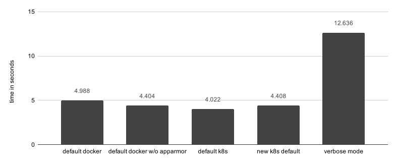

# enable-seccomp-by-default

## Table of Contents

<!-- toc -->
- [Release Signoff Checklist](#release-signoff-checklist)
- [Summary](#summary)
- [Motivation](#motivation)
  - [Goals](#goals)
  - [Non-Goals](#non-goals)
- [Proposal](#proposal)
  - [1. Audit mode support](#1-audit-mode-support)
  - [2. Built-in profiles](#2-built-in-profiles)
  - [3. Set <code>kubernetes/default-audit</code> as the default profile](#3-set--as-the-default-profile)
    - [Performance Considerations](#performance-considerations)
    - [Log spamming](#log-spamming)
    - [Cost vs Benefit](#cost-vs-benefit)
  - [User Stories](#user-stories)
    - [Story 1](#story-1)
    - [Story 2](#story-2)
    - [Story 3](#story-3)
- [Implementation Details](#implementation-details)
  - [1. Audit mode support (Details)](#1-audit-mode-support-details)
  - [2. Built-in profiles (Details)](#2-built-in-profiles-details)
  - [3. Set <code>kubernetes/default-audit</code> as the default profile](#3-set--as-the-default-profile-1)
- [Design Details](#design-details)
  - [Test Plan](#test-plan)
  - [Upgrade / Downgrade Strategy](#upgrade--downgrade-strategy)
  - [Version Skew Strategy](#version-skew-strategy)
  - [Graduation Criteria](#graduation-criteria)
      - [Alpha](#alpha)
      - [Alpha -&gt; Beta Graduation](#alpha---beta-graduation)
      - [Beta -&gt; GA Graduation](#beta---ga-graduation)
- [Implementation History](#implementation-history)
- [Alternatives](#alternatives)
- [References](#references)
<!-- /toc -->

## Release Signoff Checklist

**ACTION REQUIRED:** In order to merge code into a release, there must be an issue in [kubernetes/enhancements] referencing this KEP and targeting a release milestone **before [Enhancement Freeze](https://github.com/kubernetes/sig-release/tree/master/releases)
of the targeted release**.

For enhancements that make changes to code or processes/procedures in core Kubernetes i.e., [kubernetes/kubernetes], we require the following Release Signoff checklist to be completed.

Check these off as they are completed for the Release Team to track. These checklist items _must_ be updated for the enhancement to be released.

- [ ] kubernetes/enhancements issue in release milestone, which links to KEP (this should be a link to the KEP location in kubernetes/enhancements, not the initial KEP PR)
- [ ] KEP approvers have set the KEP status to `implementable`
- [ ] Design details are appropriately documented
- [ ] Test plan is in place, giving consideration to SIG Architecture and SIG Testing input
- [ ] Graduation criteria is in place
- [ ] "Implementation History" section is up-to-date for milestone
- [ ] User-facing documentation has been created in [kubernetes/website], for publication to [kubernetes.io]
- [ ] Supporting documentation e.g., additional design documents, links to mailing list discussions/SIG meetings, relevant PRs/issues, release notes

**Note:** Any PRs to move a KEP to `implementable` or significant changes once it is marked `implementable` should be approved by each of the KEP approvers. If any of those approvers is no longer appropriate than changes to that list should be approved by the remaining approvers and/or the owning SIG (or SIG-arch for cross cutting KEPs).

**Note:** This checklist is iterative and should be reviewed and updated every time this enhancement is being considered for a milestone.

[kubernetes.io]: https://kubernetes.io/
[kubernetes/enhancements]: https://github.com/kubernetes/enhancements/issues
[kubernetes/kubernetes]: https://github.com/kubernetes/kubernetes
[kubernetes/website]: https://github.com/kubernetes/website

## Summary

A proposal to enhance the current seccomp support, enabling it by default in new deployments by leveraging a new audit-only feature.

This lays the foundation required for us to arrive at a more secure enforceable seccomp setup later down the road.


## Motivation

Kubernetes supports Seccomp in some capacity since v1.3. But it is [disabled by default](https://github.com/kubernetes/kubernetes/issues/81115), as highlighted by the recent [security audit](https://github.com/kubernetes/kubernetes/issues/81146). 
Enabling it poses a few challenges to users due to the absence of 1) auditing capabilities, 2) user-friendly ways to create and maintain profiles, and 3) mechanisms to synchronise custom profiles across nodes. This proposal focuses on the first one of those challenges.

Removing such barriers of entry for seccomp usage in Kubernetes clusters, will encourage adoption and provide a safer baseline across the ecosystem. 


### Goals

- Add audit-mode support for logging violations instead of blocking them.
- Set clusters to use the new audit profile (i.e. `kubernetes/default-audit`) by default.  
- Avoid breaking changes for Kubernetes api and user workloads.


### Non-Goals

- Changes to make Seccomp GA. This is being covered by another [KEP](20190717-seccomp-ga.md).
- Changes to `PodSecurityPolicy`.
- Changes to Kubernetes API to natively represent seccomp profiles.
- Provide new mechanisms to handle user-defined seccomp profiles.
- Windows Support.


## Proposal

The proposed change aims to make the seccomp support in Kubernetes more user-friendly, by 1) supporting audit mode, 2) creating new Kubernetes built-in profiles, and 3) enabling seccomp in audit-mode by default. 


### 1. Audit mode support 
In Linux kernel 4.14 support for a new seccomp return action named `SECCOMP_RET_LOG` was added. This return action permits that systems calls are logged and then executed. Before such feature, seccomp profiles had only the ability to block, allow and trace system calls, which could lead to disruptive profiles that would evolve through trial and error. 

Audit mode empowers users to monitor the impact of new profiles for extensive periods of time before switching into more restrictive modes. An example of it would be a profile with safe system calls whitelisted using `SCMP_ACT_ALLOW` and a default action of `SCMP_ACT_LOG`, instead of the current `SCMP_ACT_ERRNO`. The result would be that all system calls would be executed, however, only the ones outside the whitelist would be logged into the system logs.

To arrive in Kubernetes, this functionality needs to first make it to libseccomp and OCI/runc. It was recently added to Libseccomp-golang [v0.9.1](https://github.com/seccomp/libseccomp-golang/releases/tag/v0.9.1) as `SCMP_ACT_LOG`. It has recently merged into master for [runC](https://github.com/opencontainers/runc/pull/1951) and is currently being considered for the [OCI](https://github.com/opencontainers/runtime-spec/pull/1019).

The support is based on the downstream dependencies, therefore Kubernetes changes are not _required_. However, some changes may be improve its usability as pointed out on the [Implementation Details](#implementation-details) section.


### 2. Built-in profiles
The table below shows what built-in profiles and the two supported ways to create user-defined profiles.

| Profile Name 	| Description 	| Status 	| Requires Audit Support 	| Fallback profile 	|
|-------------------------	|------------------------------------------------------------------------------------------------------------------------------------------------------------------------------------------------------------------------------------------------------------------------	|-------------------------------------------	|-----------------------------------------	|------------------	|
| `runtime/default` 	| The default container runtime. Syscalls outside allowed list are blocked. 	| Unchanged 	| No 	| N/A 	|
| `kubernetes/default` 	| The default Kubernetes profile - a copy of `runtime/default`. System calls outside the allowed list are blocked. 	| New 	| No 	| N/A 	|
| `kubernetes/default-audit` 	| Allows the same system calls as `kubernetes/default`, but logs all violations. 	| New 	| Yes 	| `unconfined` 	|
| `kubernetes/audit-verbose` 	| Remove all whitelisted system calls, logging every time any system calls are used. Useful for creating new profiles based on the execution of a container. 	| New 	| Yes 	| `unconfined` 	|
| `localhost/<path>` 	| User defined profile as a file on the node located at <seccomp_root>/<path>, where <seccomp_root> is defined via the  --seccomp-profile-root flag on the Kubelet. _Note that the user is responsible for physically synchronising the profile files across all nodes._ 	| Unchanged 	| Only when ` SCPM_ACT_LOG` is being used 	| `unconfined` 	|
| `docker/default` 	| The Docker default seccomp profile is used. Deprecated as of Kubernetes 1.11. Use  `runtime/default` instead. 	| Unchanged, Deprecated 	| No 	| N/A 	|
| `unconfined` 	| Seccomp is not applied to the container processes (the current default in Kubernetes), if no alternative is provided. Usage should be discouraged. 	| Unchanged 	| No 	| N/A 	|

 
### 3. Set `kubernetes/default-audit` as the default profile

By default clusters will have `kubernetes/default-audit` applied to all containers (users can opt-out) that haven't got a seccomp profile associated to them. This profile is similar to the existing `runtime/default`, with the difference being that system calls used that are outside the allowed list will be logged instead of having their execution blocked. This improves the default auditing capabilities of high risk syscalls whilst not breaking existing workloads.

An extra benefit is to provide an easier route for users to move to `kubernetes/default`. They can determine their workload readiness by going through violations on syslogs, instead of having to profile each application individually. 

To support audit mode, some validation will be required ensuring that the downstream dependencies (Kernel, Libseccomp and runc) also supports it. If audit mode is not supported, the default seccomp profile will be set back to `unconfined`, for backwards compatibility. 

#### Performance Considerations

Enabling Linux Security Modules, such as seccomp or apparmor, may come with a performance overhead. To assess that impact a performance test was made comparing a given application running against different seccomp configurations. 

Docker by default has both apparmor and seccomp enabled, which is the security community's recommendation. In contrast, Kubernetes have both disabled by default. To make it clearer the real impact of enabling this feature in Kubernetes, the comparison shows all those different scenarios. 



Using the proposed "new k8s default" (a.k.a. `kubernetes/default-audit`), performed 10% slower than running as "default k8s" (a.k.a. `unconfined`). However, it performed marginally slower than "default docker w/o apparmor" (a.k.a. `runtime/default` or `docker/default`), which is the default seccomp profile used by docker. 

_For the purposes of this test, the time calculated was just for the application inside the container to execute 4 million lstat operations. Tests executed using: Docker Engine Community v19.03.2, containerd v1.2.6 and runc v1.0.0-rc8._

#### Log spamming

Enabling this audit mode by default raises concerns on the impact it can have in production systems, potentially leading to node's syslogs being spammed. Such a risk is automatically mitigated in Linux by its log throttling mechanisms. 

The performance tests were done on an Ubuntu machine, and involved an application calling a syscall a few million times. The log entries each test execution had 1 summary entry showing the amount of messages suppressed and 10 audit entries:

```
kauditd_printk_skb: 2336845 callbacks suppressed
audit: type=1326 audit(1569825222.987:120145027): auid=4294967295 uid=0 gid=0 ses=4294967295 pid=6974 comm="allowedsyscall" exe="/allowedsyscall" sig=0 arch=c000003e syscall=262 compat=0 ip=0x47c29a code=0x7ffc0000
audit: type=1326 audit(1569825222.991:120145028): auid=4294967295 uid=0 gid=0 ses=4294967295 pid=6974 comm="allowedsyscall" exe="/allowedsyscall" sig=0 arch=c000003e syscall=262 compat=0 ip=0x47c29a code=0x7ffc0000
...
audit: type=1326 audit(1569825222.991:120145035): auid=4294967295 uid=0 gid=0 ses=4294967295 pid=6974 comm="allowedsyscall" exe="/allowedsyscall" sig=0 arch=c000003e syscall=262 compat=0 ip=0x47c29a code=0x7ffc0000
audit: type=1326 audit(1569825222.991:120145036): auid=4294967295 uid=0 gid=0 ses=4294967295 pid=6974 comm="allowedsyscall" exe="/allowedsyscall" sig=0 arch=c000003e syscall=262 compat=0 ip=0x47c29a code=0x7ffc0000

```

The throttling is based on the runtime kernel parameters below:

```
net.core.message_burst = 10
net.core.message_cost = 5
```

Users can adjust the verbosity of their logs on demand, although the default settings are quite safe.


#### Cost vs Benefit

The performance overhead of auditing syscalls that not whitelisted are negligible, once the cost of enabling seccomp is taken into account. 

Kubernetes should take the same approach taken by docker of enabling both AppArmor and Seccomp by default. This would make any overhead added by such features part of the cost for running secure container workloads. 

Providing users with sensible default security settings outweights the performance impact incurred, specially when users are given the ability to opt-out if their prefer to do so.


### User Stories

#### Story 1
As a user and administrator, I want to be able to assess what pods within my cluster would be affected by applying more restrictive seccomp profiles.

#### Story 2
As a user, I want to be able to assess whether my pods will be affected by more restrictive seccomp profiles.

#### Story 3
As a user and administrator, I want Kubernetes to audit all potentially dangerous system calls from my containers by default.


## Implementation Details

### 1. Audit mode support (Details)

Kubernetes will continue to be unaware of downstream support. If a user tries to use unsupported actions (i.e. `SCMP_ACT_LOG`) today, the lower level dependencies will return an error. As a result, the container won't be able to start. We are proposing no changes to this behaviour.


### 2. Built-in profiles (Details)

The internal built-in profiles will be implemented in golang, not allowing users to amend them. It will be based off the implementation in [docker](https://github.com/moby/moby/blob/master/profiles/seccomp/default.json) and [containerd](https://github.com/containerd/containerd/blob/master/contrib/seccomp/seccomp_default.go).


The new built-in profiles would be mapped to an additional Kubernetes profile type. And its definition would be passed as a serialised json object inside dockerOpt objects, in the same way that it is done currently for file based profiles:
```
jsonSeccomp, _ := json.Marshal(profile.Spec)
return []dockerOpt{{"seccomp", string(jsonSeccomp), seccompProfileName}}, nil
```
_Needs confirmation as to whether this would also work for non-docker runtime implementations._


Built-in profiles will act in the same way as custom profiles, therefore, trying to apply any of the audit built-in profiles in nodes which do not support `SCMP_ACT_LOG` (due to kernel or dependencies version) will cause containers to fail to start.


### 3. Set `kubernetes/default-audit` as the default profile

To define what seccomp profile a container will use, the following order of priority must be observed:

1. Profile name set at container-level (TODO: update with seccomp GA field)
1. Profile name set at pod-level (TODO: update with seccomp GA field)
1. Default profile name set at PodSecurityPolicy (TODO: update with seccomp GA field)

If none found, falls back to assessment to take place in the kubelet prior to creating the container:
1. Is Libseccomp-golang higher than v0.9.1, and runC higher than runc 1.0-rc8 then use `kubernetes/default-audit`.  TODO: need to confirm what version of runC will support this, changes are already merged but a new release needs to happen.
1. Fallback to `unconfined`.


## Design Details

### Test Plan

Seccomp already has E2E tests, but the tests are guarded by the [Feature:Seccomp] tag and not run in the standard test suites.

As part of seccomp [being marked GA](https://github.com/kubernetes/enhancements/pull/1148), the feature tag will be removed from the seccomp tests.

New tests will be added covering profile selection logic described under [Implementation Details](#implementation-details). 


### Upgrade / Downgrade Strategy

No upgrade changes required. 

Users can opt-out of this feature by setting the default seccomp profile to `unconfined` on a `PodSecurityPolicy` object. 


### Version Skew Strategy

This feature is based on kubelet changes only. 

Older Kubelet versions won't be able set the default profile to `kubernetes/default-audit`, keeping the current setting of `unconfined` instead.

The new built-in profiles will only be available from this version onwards. To use them, the pods must be scheduled on nodes in which the kubelet support them, otherwise they will fail to start.


### Graduation Criteria

##### Alpha

- Make Built-in profiles available.

##### Alpha -> Beta Graduation

- API changes to map Built-in profiles to an additional `Kubernetes` type.

##### Beta -> GA Graduation

- Enable audit-mode as default.


## Implementation History
- 2019-09-25: Initial KEP
- 2019-09-30: Updates based on reviewer's feedback
- 2019-10-02: Added Graduation Criteria


## Alternatives

**Downstream seccomp support awareness.** Validation could be added to assert whether the Seccomp Profile could be applied by the downstream dependencies on a _per- node_ basis, and lead to a list of available profiles for each node. This would benefit clusters with heterogeneus nodes. It would also benefit the usage of the current `localhost/<path>` profile, which an administrator has currently no way to tell which nodes have them and which ones don't. 

This can be treated as an incremental enhancement in the future, based on users feedback.


## References
- [Original Seccomp Proposal](https://github.com/kubernetes/community/blob/master/contributors/design-proposals/node/seccomp.md)
- [Seccomp GA KEP](https://github.com/kubernetes/enhancements/pull/1148)