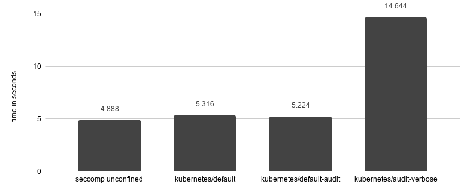

# seccomp-built-in-profiles

## Table of Contents

<!-- toc -->
- [Release Signoff Checklist](#release-signoff-checklist)
- [Summary](#summary)
- [Motivation](#motivation)
  - [Goals](#goals)
  - [Non-Goals](#non-goals)
- [Proposal](#proposal)
  - [1. Complain mode support](#1-complain-mode-support)
  - [2. Built-in profiles](#2-built-in-profiles)
    - [Performance Considerations](#performance-considerations)
    - [Log spamming](#log-spamming)
  - [User Stories](#user-stories)
    - [Story 1](#story-1)
    - [Story 2](#story-2)
- [Implementation Details](#implementation-details)
  - [1. Audit mode support (Details)](#1-audit-mode-support-details)
  - [2. Built-in profiles (Details)](#2-built-in-profiles-details)
- [Design Details](#design-details)
  - [Test Plan](#test-plan)
  - [Upgrade / Downgrade Strategy](#upgrade--downgrade-strategy)
  - [Version Skew Strategy](#version-skew-strategy)
  - [Graduation Criteria](#graduation-criteria)
      - [Alpha](#alpha)
      - [Alpha -&gt; Beta Graduation](#alpha---beta-graduation)
      - [Beta -&gt; GA Graduation](#beta---ga-graduation)
- [Implementation History](#implementation-history)
- [Alternatives](#alternatives)
- [References](#references)
<!-- /toc -->

## Release Signoff Checklist

**ACTION REQUIRED:** In order to merge code into a release, there must be an issue in [kubernetes/enhancements] referencing this KEP and targeting a release milestone **before [Enhancement Freeze](https://github.com/kubernetes/sig-release/tree/master/releases)
of the targeted release**.

For enhancements that make changes to code or processes/procedures in core Kubernetes i.e., [kubernetes/kubernetes], we require the following Release Signoff checklist to be completed.

Check these off as they are completed for the Release Team to track. These checklist items _must_ be updated for the enhancement to be released.

- [ ] kubernetes/enhancements issue in release milestone, which links to KEP (this should be a link to the KEP location in kubernetes/enhancements, not the initial KEP PR)
- [ ] KEP approvers have set the KEP status to `implementable`
- [ ] Design details are appropriately documented
- [ ] Test plan is in place, giving consideration to SIG Architecture and SIG Testing input
- [ ] Graduation criteria is in place
- [ ] "Implementation History" section is up-to-date for milestone
- [ ] User-facing documentation has been created in [kubernetes/website], for publication to [kubernetes.io]
- [ ] Supporting documentation e.g., additional design documents, links to mailing list discussions/SIG meetings, relevant PRs/issues, release notes

**Note:** Any PRs to move a KEP to `implementable` or significant changes once it is marked `implementable` should be approved by each of the KEP approvers. If any of those approvers is no longer appropriate than changes to that list should be approved by the remaining approvers and/or the owning SIG (or SIG-arch for cross cutting KEPs).

**Note:** This checklist is iterative and should be reviewed and updated every time this enhancement is being considered for a milestone.

[kubernetes.io]: https://kubernetes.io/
[kubernetes/enhancements]: https://github.com/kubernetes/enhancements/issues
[kubernetes/kubernetes]: https://github.com/kubernetes/kubernetes
[kubernetes/website]: https://github.com/kubernetes/website

## Summary

A proposal to enhance the current seccomp support, by creating new built-in profiles for users to choose from. Some of which running in complain mode.

This lays the foundation required for us to arrive at a more secure enforceable seccomp setup later down the road. 


## Motivation

Kubernetes supports Seccomp in some capacity since v1.3. But it is [disabled by default](https://github.com/kubernetes/kubernetes/issues/81115), as highlighted by the recent [security audit](https://github.com/kubernetes/kubernetes/issues/81146). 
Enabling it poses a few challenges to users due to the absence of 1) auditing capabilities, 2) user-friendly ways to create and maintain profiles, and 3) mechanisms to synchronise custom profiles across nodes. This proposal focuses on the first one of those challenges.

Removing such barriers of entry for seccomp usage in Kubernetes clusters, will encourage adoption and provide a safer baseline across the ecosystem. 


### Goals

- Add audit-mode support for logging violations instead of blocking them.
- Avoid breaking changes for Kubernetes api and user workloads.


### Non-Goals

- Changes to make Seccomp GA. This is being covered by another [KEP](20190717-seccomp-ga.md).
- Changes to `PodSecurityPolicy`.
- Changes to Kubernetes API to natively represent seccomp profiles.
- Provide new mechanisms to handle user-defined seccomp profiles.
- Windows Support.


## Proposal

The proposed change aims to make the seccomp support in Kubernetes more user-friendly, by 1) supporting complain mode, and 2) creating new Kubernetes built-in profiles. 


### 1. Complain mode support 
In Linux kernel 4.14 support for a new seccomp return action named `SECCOMP_RET_LOG` was added. 
This return action permits system calls to be logged and then executed. Before such feature, seccomp profiles had only the ability to allow, block and trace system calls. 
To test profile changes in production meant that either some calls would be blocked, potentially impacting the application behaviour, or a tracer would have to be attached to it, 
which could have performance and security implications. 

Complain mode empower users to assess whether their workloads would be able to function normally under the enforceable seccomp profile without that disruption.
All system calls would be executed, and the ones outside the whitelist would be logged into the system logs.
Users would be able to test their applications for extensive periods of time without the risk of breaking them. 

The support is based on the downstream dependencies, therefore Kubernetes changes are based on creating new built-in profiles for users to choose. 


### 2. Built-in profiles
The table below shows what built-in profiles and the supported way to create user-defined profiles.

| Profile Name 	| Description 	| Status 	| Requires Audit Support 	| 
|-------------------------	|------------------------------------------------------------------------------------------------------------------------------------------------------------------------------------------------------------------------------------------------------------------------	|-------------------------------------------	|-----------------------------------------	|------------------	|
| `runtime/default` 	| The default container runtime. Syscalls outside allowed list are blocked. 	| Unchanged 	| No 	|
| `kubernetes/default` 	| The default Kubernetes profile - a copy of `runtime/default`. System calls outside the allowed list are blocked. 	| New 	| No 	| 
| `kubernetes/default-audit` 	| Allows the same system calls as `runtime/default`, but logs all violations instead of blocking them. 	| New 	| Yes 	| 
| `kubernetes/audit-verbose` 	| Remove all whitelisted system calls, logging every time system calls are used. Useful for creating new profiles based on the execution of a container. 	| New 	| Yes 	| 
| `localhost/<path>` 	| User defined profile as a file on the node located at <seccomp_root>/<path>, where <seccomp_root> is defined via the  --seccomp-profile-root flag on the Kubelet. _Note that the user is responsible for physically synchronising the profile files across all nodes._ 	| Unchanged 	| Only when ` SCPM_ACT_LOG` is being used 	|
| `docker/default` 	| The Docker default seccomp profile is used. Deprecated as of Kubernetes 1.11. Use  `runtime/default` instead. 	| Unchanged, Deprecated 	| No 	| 
| `unconfined` 	| Seccomp is not applied to the container processes (the current default in Kubernetes), if no alternative is provided. Usage should be discouraged. 	| Unchanged 	| No 	|

 
Users will be able to define the complain mode profile in the same way they do today: at pod, container and cluster levels. 
Please note that as part of [Seccomp becoming GA](https://github.com/kubernetes/enhancements/pull/1148), there may be some changes in syntax.


#### Performance Considerations

Enabling security features may come with a performance overhead, to assess such impact for landing this proposal, a given application was executed against different seccomp configurations, and the results are per below. 



_For the purposes of this test, the time calculated was just for the [application](https://gist.github.com/pjbgf/8474083a612d0566aa5328747341bddb) inside the container to execute 4 million lstat operations. Tests executed using: Docker Engine Community v19.03.2, containerd v1.2.6 and runc v1.0.0-rc9._

By enabling seccomp there was an increase of around 10% for the time required for the task to be completed. Both profiles `kubernetes/default` and `kubernetes/default-audit`, performed quite similarly, considering a 200ms std deviation. 

Note that the comparison used an [application](https://gist.github.com/pjbgf/8474083a612d0566aa5328747341bddb) that consumes syscalls that are white-listed in `kubernetes/default`, otherwise it would not be a fair comparison, as the enforceable profile would block the operation.

Considering that the built-in seccomp profiles whitelist around 80% of the syscalls supported by seccomp, which include the most commonly used ones, the impact between using `kubernetes/default` and `kubernetes/default-audit` in line of business applications should be negligible. For applications that heavily depend on the other 20% of syscalls, the impact can be as big as the one showed for `kubernetes/audit-verbose`, namely up to 3 times slower.


#### Log spamming

Enabling this audit mode by default raises concerns on the impact it can have in production systems, potentially leading to node's syslogs being spammed. Such a risk is automatically mitigated in Linux by its log throttling mechanisms. 

The performance tests were done on an Ubuntu machine, and involved an application calling a syscall a few million times. The log entries each test execution had 1 summary entry showing the amount of messages suppressed and 10 audit entries:

```
kauditd_printk_skb: 2336845 callbacks suppressed
audit: type=1326 audit(1569825222.987:120145027): auid=4294967295 uid=0 gid=0 ses=4294967295 pid=6974 comm="allowedsyscall" exe="/allowedsyscall" sig=0 arch=c000003e syscall=262 compat=0 ip=0x47c29a code=0x7ffc0000
audit: type=1326 audit(1569825222.991:120145028): auid=4294967295 uid=0 gid=0 ses=4294967295 pid=6974 comm="allowedsyscall" exe="/allowedsyscall" sig=0 arch=c000003e syscall=262 compat=0 ip=0x47c29a code=0x7ffc0000
...
audit: type=1326 audit(1569825222.991:120145035): auid=4294967295 uid=0 gid=0 ses=4294967295 pid=6974 comm="allowedsyscall" exe="/allowedsyscall" sig=0 arch=c000003e syscall=262 compat=0 ip=0x47c29a code=0x7ffc0000
audit: type=1326 audit(1569825222.991:120145036): auid=4294967295 uid=0 gid=0 ses=4294967295 pid=6974 comm="allowedsyscall" exe="/allowedsyscall" sig=0 arch=c000003e syscall=262 compat=0 ip=0x47c29a code=0x7ffc0000

```

The throttling is based on the runtime kernel parameters below:

```
net.core.message_burst = 10
net.core.message_cost = 5
```

Users can adjust the verbosity of their logs on demand, although the default settings are quite safe.


### User Stories

#### Story 1
As a user and administrator, I want a non-disruptive way to assess what pods within my cluster would be affected by applying the `kubernetes/default` seccomp profile.

#### Story 2
As a user and administrator, I want to be able to audit all potentially dangerous system calls my containers.


## Implementation Details

### 1. Audit mode support (Details)

Kubernetes will continue to be unaware of downstream support. 
If a user tries to apply a seccomp profile containing unsupported actions (i.e. `SCMP_ACT_LOG`) today, the lower level dependencies (i.e. runC) will return an error. 
As a result, the container won't be able to start. The same will happen if a user tries to use `kubernetes/default-audit` on a node that does not support the new seccomp action. 
We are proposing no changes to this behaviour.


### 2. Built-in profiles (Details)

The internal built-in profiles will be implemented in golang, not allowing users to amend them. It will be based off the implementation in [docker](https://github.com/moby/moby/blob/master/profiles/seccomp/default.json) and [containerd](https://github.com/containerd/containerd/blob/master/contrib/seccomp/seccomp_default.go).

The new built-in profiles would be mapped to an additional Kubernetes profile type, which is contingent on the GA API changes proposed in [#1148](https://github.com/kubernetes/enhancements/pull/1148):

```
const (
    SeccompProfileUnconfined SeccompProfileType = "Unconfined"
    SeccompProfileRuntime    SeccompProfileType = "Runtime"
    SeccompProfileLocalhost  SeccompProfileType = "Localhost"
    SeccompProfileKubernetes SeccompProfileType = "Kubernetes"
)
```

Profiles will be passed as a serialised json object inside dockerOpt objects, in the same way that it is done currently for file based profiles:
```
jsonSeccomp, _ := json.Marshal(profile.Spec)
return []dockerOpt{{"seccomp", string(jsonSeccomp), seccompProfileName}}, nil
```
_Needs confirmation as to whether this would also work for non-docker runtime implementations._


## Design Details

### Test Plan

Seccomp already has E2E tests, but the tests are guarded by the [Feature:Seccomp] tag and not run in the standard test suites.

As part of seccomp [being marked GA](https://github.com/kubernetes/enhancements/pull/1148), the feature tag will be removed from the seccomp tests.

New tests will be added to verify the use of the new built-in profiles.


### Upgrade / Downgrade Strategy

No upgrade changes required. 


### Version Skew Strategy

This feature is based on kubelet changes only. 

Older Kubelet versions won't be able to schedule containers using the new built-in profiles. 
To use them, the pods must be scheduled on nodes in which the kubelet support them, otherwise they will fail to start.


### Graduation Criteria

##### Alpha

- Make Built-in profiles available. 

##### Alpha -> Beta Graduation

- Gather feedback among community and developers.

##### Beta -> GA Graduation

- API changes to map Built-in profiles to an additional `Kubernetes` type.


## Implementation History
- 2019-09-25: Initial KEP
- 2019-09-30: Updates based on reviewer's feedback
- 2019-10-02: Added Graduation Criteria
- 2019-10-02: Added new SeccompProfileType for kubernetes type
- 2019-10-15: Limited the scope to the creation of kubernetes built-in types


## Alternatives

**Downstream seccomp support awareness.** Validation could be added to assert whether the Seccomp Profile could be applied by the downstream dependencies on a _per- node_ basis, and lead to a list of available profiles for each node. This would benefit clusters with heterogeneus nodes. It would also benefit the usage of the current `localhost/<path>` profile, which an administrator has currently no way to tell which nodes have them and which ones don't. 

This can be treated as an incremental enhancement in the future, based on users feedback.


## References
- [Original Seccomp Proposal](https://github.com/kubernetes/community/blob/master/contributors/design-proposals/node/seccomp.md)
- [Seccomp GA KEP](https://github.com/kubernetes/enhancements/pull/1148)