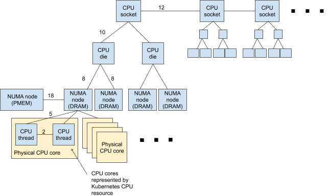
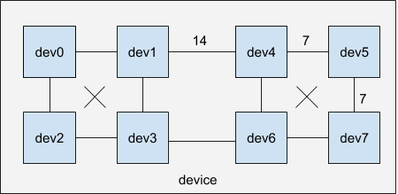
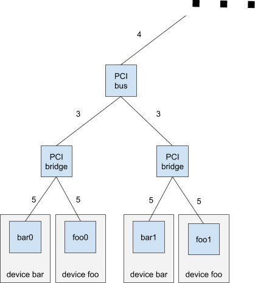
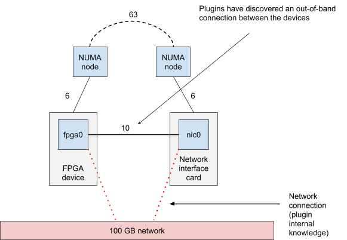
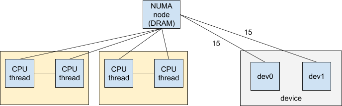
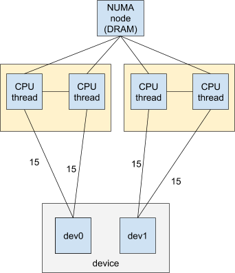
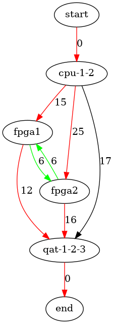

<!--
**Note:** When your KEP is complete, all of these comment blocks should be removed.

To get started with this template:

- [ ] **Pick a hosting SIG.**
  Make sure that the problem space is something the SIG is interested in taking
  up.  KEPs should not be checked in without a sponsoring SIG.
- [ ] **Create an issue in kubernetes/enhancements**
  When filing an enhancement tracking issue, please ensure to complete all
  fields in that template.  One of the fields asks for a link to the KEP.  You
  can leave that blank until this KEP is filed, and then go back to the
  enhancement and add the link.
- [ ] **Make a copy of this template directory.**
  Copy this template into the owning SIG's directory and name it
  `NNNN-short-descriptive-title`, where `NNNN` is the issue number (with no
  leading-zero padding) assigned to your enhancement above.
- [ ] **Fill out as much of the kep.yaml file as you can.**
  At minimum, you should fill in the "title", "authors", "owning-sig",
  "status", and date-related fields.
- [ ] **Fill out this file as best you can.**
  At minimum, you should fill in the "Summary", and "Motivation" sections.
  These should be easy if you've preflighted the idea of the KEP with the
  appropriate SIG(s).
- [ ] **Create a PR for this KEP.**
  Assign it to people in the SIG that are sponsoring this process.
- [ ] **Merge early and iterate.**
  Avoid getting hung up on specific details and instead aim to get the goals of
  the KEP clarified and merged quickly.  The best way to do this is to just
  start with the high-level sections and fill out details incrementally in
  subsequent PRs.

Just because a KEP is merged does not mean it is complete or approved.  Any KEP
marked as a `provisional` is a working document and subject to change.  You can
denote sections that are under active debate as follows:

```
<<[UNRESOLVED optional short context or usernames ]>>
Stuff that is being argued.
<<[/UNRESOLVED]>>
```

When editing KEPS, aim for tightly-scoped, single-topic PRs to keep discussions
focused.  If you disagree with what is already in a document, open a new PR
with suggested changes.

One KEP corresponds to one "feature" or "enhancement", for its whole lifecycle.
You do not need a new KEP to move from beta to GA, for example.  If there are
new details that belong in the KEP, edit the KEP.  Once a feature has become
"implemented", major changes should get new KEPs.

The canonical place for the latest set of instructions (and the likely source
of this file) is [here](/keps/NNNN-kep-template/README.md).

**Note:** Any PRs to move a KEP to `implementable` or significant changes once
it is marked `implementable` must be approved by each of the KEP approvers.
If any of those approvers is no longer appropriate than changes to that list
should be approved by the remaining approvers and/or the owning SIG (or
SIG Architecture for cross cutting KEPs).
-->

# Topology-based Resource Selection Algorithm


<!--
A table of contents is helpful for quickly jumping to sections of a KEP and for
highlighting any additional information provided beyond the standard KEP
template.

Ensure the TOC is wrapped with
  <code>&lt;!-- toc --&rt;&lt;!-- /toc --&rt;</code>
tags, and then generate with `hack/update-toc.sh`.
-->

<!-- toc -->
- [Release Signoff Checklist](#release-signoff-checklist)
- [Summary](#summary)
- [Motivation](#motivation)
  - [Goals](#goals)
  - [Non-Goals](#non-goals)
- [Proposal](#proposal)
  - [Operating principle](#operating-principle)
  - [System Devices](#system-devices)
  - [Finding the cost between devices](#finding-the-cost-between-devices)
  - [Connecting devices to system topology](#connecting-devices-to-system-topology)
  - [Kubelet changes](#kubelet-changes)
  - [User Stories (optional)](#user-stories-optional)
    - [GPU interconnect](#gpu-interconnect)
    - [GPU and network card pipeline](#gpu-and-network-card-pipeline)
  - [Notes/Constraints/Caveats](#notesconstraintscaveats)
  - [Risks and Mitigations](#risks-and-mitigations)
- [Design Details](#design-details)
  - [Test Plan](#test-plan)
  - [Graduation Criteria](#graduation-criteria)
    - [Alpha -&gt; Beta Graduation](#alpha---beta-graduation)
    - [Beta -&gt; GA Graduation](#beta---ga-graduation)
    - [Removing a deprecated flag](#removing-a-deprecated-flag)
  - [Upgrade / Downgrade Strategy](#upgrade--downgrade-strategy)
  - [Version Skew Strategy](#version-skew-strategy)
- [Implementation History](#implementation-history)
- [Drawbacks](#drawbacks)
- [Alternatives](#alternatives)
<!-- /toc -->

## Release Signoff Checklist

<!--
**ACTION REQUIRED:** In order to merge code into a release, there must be an
issue in [kubernetes/enhancements] referencing this KEP and targeting a release
milestone **before the [Enhancement Freeze](https://git.k8s.io/sig-release/releases)
of the targeted release**.

For enhancements that make changes to code or processes/procedures in core
Kubernetes i.e., [kubernetes/kubernetes], we require the following Release
Signoff checklist to be completed.

Check these off as they are completed for the Release Team to track. These
checklist items _must_ be updated for the enhancement to be released.
-->

- [ ] Enhancement issue in release milestone, which links to KEP dir in [kubernetes/enhancements] (not the initial KEP PR)
- [ ] KEP approvers have approved the KEP status as `implementable`
- [ ] Design details are appropriately documented
- [ ] Test plan is in place, giving consideration to SIG Architecture and SIG Testing input
- [ ] Graduation criteria is in place
- [ ] "Implementation History" section is up-to-date for milestone
- [ ] User-facing documentation has been created in [kubernetes/website], for publication to [kubernetes.io]
- [ ] Supporting documentation e.g., additional design documents, links to mailing list discussions/SIG meetings, relevant PRs/issues, release notes

<!--
**Note:** This checklist is iterative and should be reviewed and updated every time this enhancement is being considered for a milestone.
-->

[kubernetes.io]: https://kubernetes.io/
[kubernetes/enhancements]: https://git.k8s.io/enhancements
[kubernetes/kubernetes]: https://git.k8s.io/kubernetes
[kubernetes/website]: https://git.k8s.io/website

## Summary

For high-performance computing workloads, it's important to get all the
used resources aligned to achieve maximum application performance in
terms of bandwidth and latency. In the current implementation the
Topology Manager aligns resources based on NUMA locality, that limits
ways to express device to device communications.

This KEP proposes a new algorithm which will allow Topology Manager to
more effectively and flexibly align the device resource instances, CPU
cores, memory regions and other device to device connections.

## Motivation

* Current Topology Manager algorithm doesn’t take into account how close the devices are to each other -- it only tracks which NUMA node they are on and tries to minimize the number of nodes used.
* Current Topology Manager algorithm is exponential -- it scales badly when the number of resource assignments to NUMA nodes increases.
* When devices are connected via PCIe bridges, they form a tree-like cost topology, even if they are in the end connected to the same NUMA node. For a concrete example see this KubeCon 2019 presentation: [NHD - A Topology-Aware Scheduler for K8s for Low-Latency & HPC Applications - Cliff Burdick, ViaSat](https://www.youtube.com/watch?v=8N8vErJmzdc)
* Devices have out-of-band links between them.
  * PCI cards can be connected via network or proprietary physical connections such as NVLink.
* Devices have internal structure.
  * If a graphics card is on a single NUMA node, connected to a single PCI slot, it might still have internal devices (tiles) which have different internal distances. In order to have maximum performance, the internal structure needs to be taken into account when choosing device instances.
  * Multi-chip CPU packages (example: Intel Xeon Platinum 9200) may have complex internal topologies. The NUMA nodes are not similar in cost between each other, as NUMA nodes describe areas within different chip tiles, dies within one socket and multiple sockets. Using NUMA node information without utilizing cost information provided by the kernel will lead to suboptimal allocation of resources.

### Goals

* The [Topology Manager KEP](https://github.com/kubernetes/enhancements/blob/master/keps/sig-node/0035-20190130-topology-manager.md#non-goals) suggests that "Inter-device topology can be considered entirely within the scope of the Device Manager, after which it can emit possible socket affinities. The policy to reach that decision can start simple and iterate to include support for arbitrary inter-device graphs." This work is now specifying the inter-device graph with an algorithm to find the resource set.
* Faster and scalable device selection algorithm for Topology Manager
* Optimized selection of device instances of the same type, based on hardware topology.
* Performance focused optimization for interconnected multi-device pipelines.

### Non-Goals

* Worrying about how the devices will be accessing each other. This proposal is just for selecting the "best" devices of requested types. The device plugins will need to know about any out-of-band links etc.
* Finding the costs between various devices in the system. However, see Device plugin responsibilities and API changes below for discussion about an accompanying library.
* Assigning exact meaning (latency in nanoseconds, bandwidth etc.) to the costs. The costs reported by a device plugin will be normalized before using them in the algorithm.

## Proposal

The idea is to create a graph of inter-device costs and use them to find
the optimal set of resources for a workload to consume.

### Operating principle

Device plugin `foo` announces the following resources:

    resource example.com/foo/id0, resource example.com/foo/id1, ...

Device plugin `bar` announces the following resources:

    resource example.com/bar/card0, resource example.com/bar/card1, ...

The device plugins return a map of known distances to other devices in
the system. This is used to create the inter-device cost graph. For
example, in the yaml file below, resource `example.com/foo/id0` has cost
`10` to `example.com/bar/card0`, which has the cost `12` back. Having both
`foo/id0` and `bar/card0` granted to the same container would mean a total
cost of `22` (`10+12`).

    example.com/foo/id0-1:
      - 10:
        - cpu/cpu0-20
        - example.com/bar/card0-3
      - 20
        - cpu/cpu21-30

    example.com/bar/card0:
      - 5:
        - cpu/cpu0-20
      - 12:
        - example.com/foo/id0

From the costs a graph can be generated. The graph contains as vertices
the resource instances, and as edges the costs between the resource
instances. A solution in the graph is a set of interconnected vertices
which satisfy the container resource request. Finding the optimal
solution means finding such a set with the minimal combined costs in the
edges. Finding such an optimal solution is NP-complete, but a
"reasonably good" solution can be found using heuristics in a faster
time (O(m log n), where n is the size of the resource request and m is
the number of resource instances).

### System Devices

Topology Manager will be responsible for building the internal graph of
the system devices (CPU, Memory Nodes). For example, in the following
graph is a topology of a multi-socket system which is not fully
interconnected, with a Persistent Memory device represented as a NUMA
node without any CPU cores. From the graph it can be seen that
connections between local CPU threads (within one physical CPU core) are
the cheapest, and the cost rises when multiple devices have to be
selected which are not topographically close to each other. The costs in
the graph edges will be determined by the interconnect topology reported
by Linux kernel.



The helper library that will help for device plugins discover
connections to system devices (CPU, Memory nodes, PCI buses, etc). will
be provided.

### Finding the cost between devices

Providing topology information from device plugin is completely
optional. If no information is provided, devices will be treated as
independent. In this case there will be no preference on how devices are
selected.

The device plugins can provide information about how the devices are
internally interconnected which will help to select the most cost
optimal combination in the scenarios when multiple devices of the same
type are requested. This is an example of a device with complex internal
topology, such as a Nvidia GPU with several tiles located within a
single graphics card:



The device plugins can detect and provide topology cost information
towards devices in other domains (e.g. devices are interconnected by
external fabric). This will allow to select cost optimal set of devices
from multiple device domains to create “pipelines” (e.g. GPU+FPGA+SR-IOV
network card). For example, consider devices connected to a known PCI
bridge topology:



Another example would be two network-connected devices, which would be
connected to the same network switch and thus would benefit from being
in the same resource pipeline:



### Connecting devices to system topology

The device plugin can provide topology information about how devices
within its domain are connected to system resources (CPU cores, Memory
nodes, etc.) For example, this device plugin would have dev0 connected
to one physical core and dev1 connected to another physical core:



Current implementation of TopologyHint provided by older plugins in form
of NUMA number will be internally transformed to the edges of graph
connecting device ID to system devices (CPU, Memory nodes).



To simplify the development of device plugins, there will be a library
which will help determine the cost from a device to elements in the
system graph. The library will work by understanding how a device is
connected to popular interfaces such as PCI, and then knowing the costs
to the system elements. The library could be based on the current way
how Intel device plugins find out the topology hints, see
https://github.com/intel/intel-device-plugins-for-kubernetes/tree/master/pkg/topology. 

The new-style device plugins will implement an API so that when
requested, the device plugin will return a map of other devices it knows
in the system to the cost of accessing them from the device. The API
could be extended [GetPreferredAllocations() API](https://github.com/kubernetes/enhancements/pull/1121):

    rpc GetPreferredAllocations(PreferredAllocationsRequest) returns (PreferredAllocationsResponse) {}

    message PreferredAllocationsForDomain {
      ContainerAllocateRequest preferred_allocations = 1;
      string resource_domain = 2;
      int32 cost = 3;
    }

    message PreferredAllocationsResponse {
       repeated PreferredAllcationsForDomain
       preferred_allocations_for_domain = 1;
    }

### Kubelet changes

In addition to using the new Device plugin inter-device cost API,
Topology manager will have its algorithm changed to one which will
process the inter-device cost graph and find a suitable solution. In
addition to this, heuristics will be developed which allow the algorithm
to have a reasonably fast running speed. TODO: have a more detailed
understanding how kubelet will be changed, including changes to Topology
manager and CPU manager.

### User Stories (optional)

<!--
Detail the things that people will be able to do if this KEP is implemented.
Include as much detail as possible so that people can understand the "how" of
the system.  The goal here is to make this feel real for users without getting
bogged down.
-->

#### GPU interconnect

 * Two GPUs are connected with a physical link between the cards and should be used together if possible.

#### GPU and network card pipeline

 * User wants to use devices without going over many PCI bridges.

### Notes/Constraints/Caveats

Q: What are the costs? Are they real values, for example latency values? Are they comparable between resources? Are they symmetric?

A: The costs are just values, which correspond to the distance between the devices (with a larger cost associated with a larger distance). The values are normalized: all values are remapped to [0..100] before they are used for calculation. The costs don’t need to be symmetric, but for our purposes costs x -> y and y -> x are summed because we don’t know the way how the devices will interact.

Q: What if there isn’t a cost between two resources in the graph?

A: If the resources are not associated with each other in any way, the cost between the resources is set to 0. This means that they will both be part of the solution in the graph, but they just don’t set any constraints to the solution selection (can always be a part of the "optimal" solution).

Q: How does the device plugin know what other devices are in the system?

A: It’s up to the device plugin to find other devices in the system that it knows can be used with the device it owns. Some devices should be obvious, such as the CPU. But for example, if device A is connected through a separate bus to device B and might want to use it directly, the device plugin for A will need to scan the system for devices of type B too (or obtain the information some other way, such as with static configuration). 

### Risks and Mitigations

* Adding complexity to topology management
  * Can be mitigated by better e2e tests.
* Adding responsibilities to device plugin writers
  * Can be mitigated by a backward compatible API where Topology Manager will calculate the approximate costs if the device plugin provides NUMA hints. Also the helper library for finding out costs to system devices can be used byt the device plugins.

## Design Details

The algorithmic problem can be solved in many ways (and, as due to the
problem format, also presented as manifestations of many well-known
problems). The algorithm below is one example which we have tested and
experimented with.

The algorithm has three steps: 

1. Creation of the graph based on the input costs. The graph vertices
(nodes) are the resource instances (or collections of equivalent
resources instances) and the edges are the costs between resources
instances. 
2. Finding one solution using a greedy walk through the graph. 
3. Improving the solution using a simulated annealing algorithm. 

The algorithm first creates a layered graph based on the resources in
the container resource request. Every layer corresponds to a single
resource type. A path is then traced from the top of the graph to the
bottom, passing all layers. When the bottom node is reached, the path
which has been walked is a solution to the resource problem.

Graph creation is straightforward. A start node is connected to each
resource instance on the topmost layer (in the figure below, that layer
would be “cpu” layer). All nodes in a layer are connected to all nodes
in the layer below (red edges in figure below). The green edges connect
nodes inside a layer -- they are used when several resources of the same
type are requested.  The black edges are used only for total path cost
calculation.

For performance reasons, one node can represent several equivalent
resource instances. These nodes are called compound nodes. When a
compound node becomes part of a solution path, it is used as many times
as possible to satisfy resource requirements of a given type.



    The red edges are between resource layers. The green edges are inside a
    resource type and used if multiple resources of the same type are
    requested. The black edges are used for calculating the total path cost.
    This graph is generated from this cost input:
    
    intel.com/fpga/fpga1:
      - 10:
        - cpu/cpu1
        - cpu/cpu2
      - 12:
        - intel.com/qat/qat0-3
      - 3:
        - intel.com/fpga/fpga2
    intel.com/fpga/fpga2:
      - 20:
        - cpu/cpu1-2
      - 16:
        - intel.com/qat/qat0-3
      - 3:
        - intel.com/fpga/fpga1
    cpu/cpu1-2:
      - 5:
        - intel.com/fpga/fpga1
        - intel.com/fpga/fpga2
      - 7:
        - intel.com/qat/qat0-3
    intel.com/qat/qat1-3:
      - 10:
        - cpu/cpu1-2
      - 20:
        - intel.com/fpga/fpga-2


The first solution is found by walking through the graph following the
red edges, accessing nodes until the resource request has been
satisfied. The walk is greedy: every edge is chosen so that it is the
current cheapest solution to the resource problem. When the end node is
reached, a single solution has been found. In case several resources of
the same type are requested, the algorithm stays in the same layer
(follows the green edges) until the resource request has been satisfied
for that resource type.

The last step in the algorithm is to improve the first solution. A [simulated
annealing](https://en.wikipedia.org/wiki/Simulated_annealing) algorithm
generates a new solution by changing the current solution slightly. The new
candidate solution is created by randomly changing one node in the solution
to a different one in the same layer. Then, based on the cost of the new
candidate solution and the current “temperature” of the algorithm, the
algorithm selects the candidate solution on some probability. The candidate
solution then becomes the current solution, otherwise the old solution is
retained. When the algorithm “temperature” is reduced, the probability of
changing to a worse-than-current solution goes down. The benefits of
simulated annealing are that it avoids local maxima when it searches for a
solution and that the number of improvement steps is a constant. In our
tests, we were able to find good solutions to quite complex resource problems
in just a few milliseconds.

### Test Plan

To be determined.
<!--
**Note:** *Not required until targeted at a release.*

Consider the following in developing a test plan for this enhancement:
- Will there be e2e and integration tests, in addition to unit tests?
- How will it be tested in isolation vs with other components?

No need to outline all of the test cases, just the general strategy.  Anything
that would count as tricky in the implementation and anything particularly
challenging to test should be called out.

All code is expected to have adequate tests (eventually with coverage
expectations).  Please adhere to the [Kubernetes testing guidelines][testing-guidelines]
when drafting this test plan.

[testing-guidelines]: https://git.k8s.io/community/contributors/devel/sig-testing/testing.md
-->

### Graduation Criteria

To be determined.
<!--
**Note:** *Not required until targeted at a release.*

Define graduation milestones.

These may be defined in terms of API maturity, or as something else. The KEP
should keep this high-level with a focus on what signals will be looked at to
determine graduation.

Consider the following in developing the graduation criteria for this enhancement:
- [Maturity levels (`alpha`, `beta`, `stable`)][maturity-levels]
- [Deprecation policy][deprecation-policy]

Clearly define what graduation means by either linking to the [API doc
definition](https://kubernetes.io/docs/concepts/overview/kubernetes-api/#api-versioning),
or by redefining what graduation means.

In general, we try to use the same stages (alpha, beta, GA), regardless how the
functionality is accessed.

[maturity-levels]: https://git.k8s.io/community/contributors/devel/sig-architecture/api_changes.md#alpha-beta-and-stable-versions
[deprecation-policy]: https://kubernetes.io/docs/reference/using-api/deprecation-policy/

Below are some examples to consider, in addition to the aforementioned [maturity levels][maturity-levels].

#### Alpha -> Beta Graduation

- Gather feedback from developers and surveys
- Complete features A, B, C
- Tests are in Testgrid and linked in KEP

#### Beta -> GA Graduation

- N examples of real world usage
- N installs
- More rigorous forms of testing e.g., downgrade tests and scalability tests
- Allowing time for feedback

**Note:** Generally we also wait at least 2 releases between beta and
GA/stable, since there's no opportunity for user feedback, or even bug reports,
in back-to-back releases.

#### Removing a deprecated flag

- Announce deprecation and support policy of the existing flag
- Two versions passed since introducing the functionality which deprecates the flag (to address version skew)
- Address feedback on usage/changed behavior, provided on GitHub issues
- Deprecate the flag

**For non-optional features moving to GA, the graduation criteria must include [conformance tests].**

[conformance tests]: https://git.k8s.io/community/contributors/devel/sig-architecture/conformance-tests.md
-->

### Upgrade / Downgrade Strategy

Provide an API compatible with the current topology hints to help
upgrade device plugins in stages.

<!--
If applicable, how will the component be upgraded and downgraded? Make sure
this is in the test plan.

Consider the following in developing an upgrade/downgrade strategy for this
enhancement:
- What changes (in invocations, configurations, API use, etc.) is an existing
  cluster required to make on upgrade in order to keep previous behavior?
- What changes (in invocations, configurations, API use, etc.) is an existing
  cluster required to make on upgrade in order to make use of the enhancement?
-->

### Version Skew Strategy

To be determined.
<!--
If applicable, how will the component handle version skew with other
components? What are the guarantees? Make sure this is in the test plan.

Consider the following in developing a version skew strategy for this
enhancement:
- Does this enhancement involve coordinating behavior in the control plane and
  in the kubelet? How does an n-2 kubelet without this feature available behave
  when this feature is used?
- Will any other components on the node change? For example, changes to CSI,
  CRI or CNI may require updating that component before the kubelet.
-->

## Implementation History

<!--
Major milestones in the life cycle of a KEP should be tracked in this section.
Major milestones might include
- the `Summary` and `Motivation` sections being merged signaling SIG acceptance
- the `Proposal` section being merged signaling agreement on a proposed design
- the date implementation started
- the first Kubernetes release where an initial version of the KEP was available
- the version of Kubernetes where the KEP graduated to general availability
- when the KEP was retired or superseded
-->

## Drawbacks

<!--
Why should this KEP _not_ be implemented?
-->

* Potential difficult-to-anticipate topology choices when devices are added to container requests. The algorithm is probabilistic; it might converge on different results on different runs.

## Alternatives

<!--
What other approaches did you consider and why did you rule them out?  These do
not need to be as detailed as the proposal, but should include enough
information to express the idea and why it was not acceptable.
-->

* [KEP PR 1121](https://github.com/kubernetes/enhancements/pull/1121). This solution helps to select better device resource instances. It has some issues with scaling (all possible sets must be returned by the device plugin). It fixes part of the problem space (single device type), but will not solve multi-device pipelines and more complex topologies.
