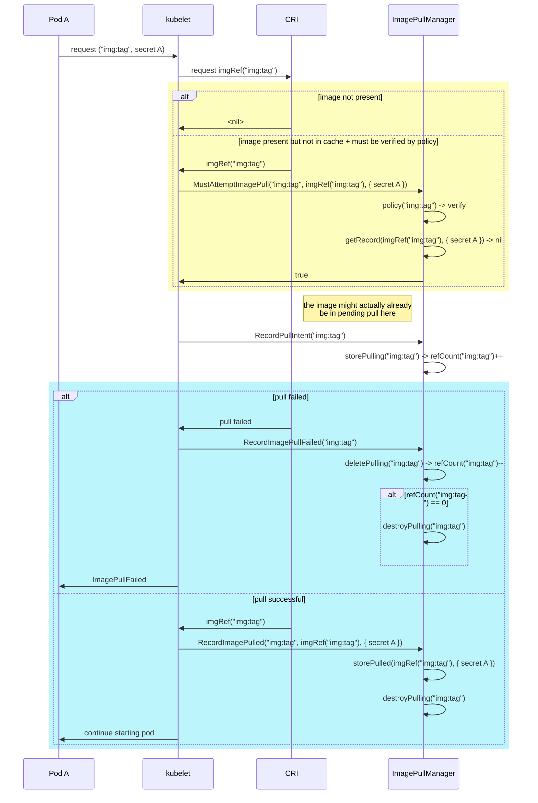
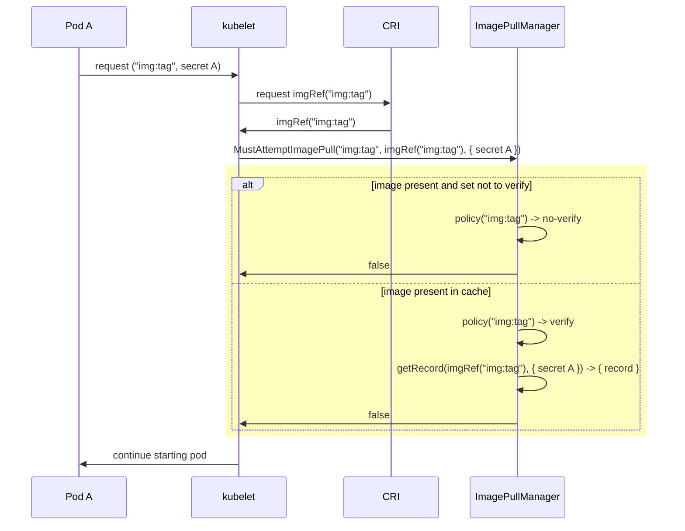

# KEP-2535: Ensure Secret Pulled Images

## Table of Contents

<!-- toc -->
- [Release Signoff Checklist](#release-signoff-checklist)
- [Summary](#summary)
- [Motivation](#motivation)
  - [Goals](#goals)
  - [Non-Goals](#non-goals)
- [Proposal](#proposal)
  - [User Stories](#user-stories)
    - [Story 1](#story-1)
    - [Story 2](#story-2)
  - [Notes/Constraints/Caveats (Optional)](#notesconstraintscaveats-optional)
  - [Risks and Mitigations](#risks-and-mitigations)
- [Design Details](#design-details)
  - [Image Pulling Scenarios](#image-pulling-scenarios)
  - [Kubelet Caching](#kubelet-caching)
    - [Credential Verification Policies](#credential-verification-policies)
    - [Writing to the Cache](#writing-to-the-cache)
      - [Cache writes upon successful credentials match:](#cache-writes-upon-successful-credentials-match)
      - [Failure modes:](#failure-modes)
    - [Cache Directory Structure](#cache-directory-structure)
    - [Kubelet Cache Housekeeping](#kubelet-cache-housekeeping)
  - [Test Plan](#test-plan)
      - [Prerequisite testing updates](#prerequisite-testing-updates)
      - [Unit tests](#unit-tests)
      - [Integration tests](#integration-tests)
      - [e2e tests](#e2e-tests)
  - [Graduation Criteria](#graduation-criteria)
    - [Alpha](#alpha)
    - [Beta](#beta)
  - [Upgrade / Downgrade Strategy](#upgrade--downgrade-strategy)
  - [Version Skew Strategy](#version-skew-strategy)
- [Production Readiness Review Questionnaire](#production-readiness-review-questionnaire)
  - [Feature Enablement and Rollback](#feature-enablement-and-rollback)
  - [Rollout, Upgrade and Rollback Planning](#rollout-upgrade-and-rollback-planning)
  - [Monitoring Requirements](#monitoring-requirements)
  - [Dependencies](#dependencies)
  - [Scalability](#scalability)
  - [Troubleshooting](#troubleshooting)
- [Implementation History](#implementation-history)
- [Drawbacks [optional]](#drawbacks-optional)
- [Alternatives [optional]](#alternatives-optional)
- [Infrastructure Needed [optional]](#infrastructure-needed-optional)
<!-- /toc -->

## Release Signoff Checklist

Items marked with (R) are required *prior to targeting to a milestone / release*.

- [ ] (R) Enhancement issue in release milestone, which links to KEP dir in [kubernetes/enhancements] (not the initial KEP PR)
- [ ] (R) KEP approvers have approved the KEP status as `implementable`
- [ ] (R) Design details are appropriately documented
- [ ] (R) Test plan is in place, giving consideration to SIG Architecture and SIG Testing input (including test refactors)
  - [ ] e2e Tests for all Beta API Operations (endpoints)
  - [ ] (R) Ensure GA e2e tests for meet requirements for [Conformance Tests](https://github.com/kubernetes/community/blob/master/contributors/devel/sig-architecture/conformance-tests.md)
  - [ ] (R) Minimum Two Week Window for GA e2e tests to prove flake free
- [ ] (R) Graduation criteria is in place
  - [ ] (R) [all GA Endpoints](https://github.com/kubernetes/community/pull/1806) must be hit by [Conformance Tests](https://github.com/kubernetes/community/blob/master/contributors/devel/sig-architecture/conformance-tests.md)
- [ ] (R) Production readiness review completed
- [ ] (R) Production readiness review approved
- [ ] "Implementation History" section is up-to-date for milestone
- [ ] User-facing documentation has been created in [kubernetes/website], for publication to [kubernetes.io]
- [ ] Supporting documentation—e.g., additional design documents, links to mailing list discussions/SIG meetings, relevant PRs/issues, release notes

[kubernetes.io]: https://kubernetes.io/
[kubernetes/enhancements]: https://git.k8s.io/enhancements
[kubernetes/website]: https://git.k8s.io/website

## Summary

Give the admin the ability to ensure pods that use an image are authorized to access that image. This will culminate in changes to the `IfNotPresent` and
`Never` pull policies, as the `Always` policy will go through an authentication check each time.

When this feature is enabled, and an image in a pod request has not been successfully pulled with the given credentials
(or successfully pulled in the past with no credentials), then the kubelet will consider the credentials unauthenticated.
Thus even if the image is present, it may still be reauthenticated.
- For `IfNotPresent` images, the kubelet will re-pull the image
- For `Never` images, the image creation will fail

This behavior mirrors what would happen if an image was not present on the node (as opposed to present, but yet to be authorized with the credentials present).

This will be enforced for both `IfNotPresent` and `Never` policies.

Kubelet configuration will give the administrator the ability to choose how images should be verified:
1. *Do not* allow access to *any* images without verification.
2. Only allow access to a *specific list* of pre-loaded images without verification.
3. *Allow* access to *all* pre-loaded images without verification (default behavior).
4. Allow access to all images without having to reverify credentials (previous behavior).

During development, this feature will be guarded by a feature gate.

*** The issue and these changes improving the security posture without requiring the forcing of pull always, will be documented in the kubernetes image pull policy documentation. ***

## Motivation

There have been customer requests for improving upon kubernetes' ability to
secure images pulled with auth on a node. Issue
[#18787](https://github.com/kubernetes/kubernetes/issues/18787) has been around
for a while.

To secure images one currently needs to inject `Always` `ImagePullPolicy` into pod
specs via an admission plugin. As @liggitt [notes](https://github.com/kubernetes/kubernetes/issues/18787#issuecomment-532280931)
the `pull` does not re-pull already-pulled layers of the image, but simply
resolves/verifies the image manifest has not changed in the registry (which
incidentally requires authenticating to private registries, which enforces the
image access). That means in the normal case (where the image has not changed
since the last pull), the request size is O(kb).

However, the `pull` does put the registry in the critical path of starting a container,
since an unavailable registry will fail the pull image manifest check (with or without proper authentication.)

Thus, the motivation is to allow users to ensure the kubelet requires an image pull auth check for each new set of credentials,
regardless of whether the image is already present on the node.

### Goals

Modify the current behavior of images with an `IfNotPresent` and `Never` `ImagePullPolicy` enforced by the kubelet to
ensure the images pulled with a secret by the kubelet are authenticated by the CRI implementation. During the
EnsureImagesExist step the kubelet will require authentication of present images pulled with auth since boot.

Optimize to only force re-authentication for a pod container image when the
`ImagePullSecrets` used to pull the container image has not already been authenticated.
IOW if an image is pulled with authentication for a first pod, subsequent pods that have the same
authentication information should not need to re-authenticate.

Images already present at boot or loaded externally to the kubelet will not require
authentication unless configured otherwise.
Images successfully pulled through the kubelet with no `ImagePullSecrets` authentication required will
not require authentication.

The new behavior is designed in a way so that it replaces current behavior - it is going
to be an on-by-default feature once graduated.

### Non-Goals

Out of scope for this KEP is an image caching policy that would direct container
runtimes through the CRI wrt. how they should treat the caching of images on a
node. Such as store for public use but only if encrypted. Or Store for private
use un-encrypted...

This feature will not change the behavior of pod with `ImagePullPolicy` `Always`.

Enforcing periodic repull might be important in order to, for example, be able
to recheck image license entitlement, but is a non-goal for this enhancement.

## Proposal

The kubelet will track container images and the list of authentication information
that lead to their successful pulls. This data will be persisted across reboots
of the host and restarts of the kubelet.

The persistent authentication data storage will be done using files kept in the
kubelet directory on the node. The content of these files will be structured and
versioned using standard config file API versioning techniques.

The kubelet will ensure any image requiring credential verification is always pulled if authentication information
from an image pull is not yet present, thus enforcing authentication / re-authentication.

Two new kubelet configuration options will be added, as well as a feature
gate to gate their use:
- `imagePullCredentialsVerificationPolicy`
    - An enum of 4 possible values:
      - `NeverVerify`
        - **original behavior before this feature**
        - anyone on a node can use any image present on the node
      - `NeverVerifyPreloadedImages`
        - **default value**
        - images that were pulled to the node by something else than the kubelet can be used without reverifying pull credentials
      - `NeverVerifyAllowlistedImages`
        - like `NeverVerifyPreloadedImages` but only node images from `preloadedImagesVerificationAllowlist` don't require reverification
      - `AlwaysVerify`
        - all images require credential reverification
- `preloadedImagesVerificationAllowlist`
  - a string list to be used with the `NeverVerifyAllowlistedImages` image pull credentials verification policy
  - images specified by this list will not require credential reverification if they are requested
    by a pod with `IfNotPresent` or `Never` image pull policies
  - the list accepts a full path segment wildcard suffix - `/*`
  - granularity:
    - **finest**: image name
    - **coarsest**: registry host
  - example list values:
    - registry.host/org/image-name
    - registry.host/public-org/\*
    - registry.host/\*
  - Note: registry.host/org/image-name:tag would be invalid as image name is considered the most granular possible configuration

### User Stories

#### Story 1

User with multiple tenants will be able to support all image pull policies without
concern that one tenant will gain access to an image that they don't have rights to.

#### Story 2

User will no longer have to inject the `PullAlways` imagePullPolicy to
ensure all tenants have rights to the images that are already present on a host.

### Notes/Constraints/Caveats (Optional)

The new behavior might put registry availability in the critical path for cases
where an image was pulled with credentials, image pull policy is `IfNotPresent`
and a new pod with new set of credentials requests an image that is known to
require authentication.

### Risks and Mitigations

- Credentials used to pull an image from a registry may expire.
  - This enhancement considers credentials that already pulled an image always
    valid in order to use the said image. If credential expiration is a worry,
    users should still use the `Always` image pull policy. Further improving
    the new behavior should be a subject to future KEPs.

- Images can be "pre-loaded", or pulled behind the kubelet's back before it starts.
  In this case, the kubelet is not managing the credentials for these images.
  - To mitigate, metadata matching the image pull credentials verification policy will be
    persisted across reboot. The kubelet will compare previously
    cached credentials against the images that exist. On a new image pull, the kubelet will use
    its saved cache and revalidate as necessary.


## Design Details

### Image Pulling Scenarios

The following scenarios are being considered based on how images get pulled:
1. preloaded and never pulled by the kubelet
1. pulled by the kubelet without auth
1. pulled by the kubelet with node-level credentials
1. images pulled by the kubelet with pod/serviceaccount-level credentials, then used again by the same pod / service account / credentials

Today, neither of the above scenarios would cause an image (or image manifest, in case the image already exists) repull in case the `ImagePullPolicy`
is set to either `IfNotPresent` or `Never`.

The goal of this enhancement is to allow multiple tenants to live on the same node without
needing to worry about tenant A's image being reused by tenant B, but at the same time to avoid unnecessary
pulls so that registries' availability does not become blocking.

The goal implies that for scenarios 1-3, the proposed solution must not put registries' availability in the critical path.

For scenario 4., the kubelet must remember credentials that were used to successfully pull an image. It must then require
a repull if there's an attempt to fetch the same image with different, currently unknown credentials. In case the
credentials that come with an image pull request were successfully used before, a repull at the registry must not be issued.

### Kubelet Caching

The kubelet tracks a pulled image auth cache for the credentials that were successfully used to pull an image.
This also includes anonymous pulls and pulls with node-wide credentials. This cache will be persisted to disk using 
well-defined structure that follows standard config file API versioning techniques.
This is done to keep track of the authenticated images between kubelet restarts.

A cache entry for an image will be deleted when the image is garbage collected. Thus, the max size of the
cache scales with the number of unique cache entries * the number of unique images that have not been garbage collected.
It is not expected that this would be a significant number of bytes. This claim shall be verified by actual use in Alpha and subsequent metrics in Beta.

For Alpha, the cache should be implemented solely in files and then be duplicated to
memory in Beta.

#### Credential Verification Policies

Some images that already exist on the kubelet's node and are not tracked in the cache might be ignored
for credential verification.

The rules that define what should be ignored are set by the `imagePullCredentialsVerificationPolicy`:
- `NeverVerify` matches the previous behavior from user perspective.
- `NeverVerifyPreloadedImages` images pulled outside the kubelet process are ignored (new default behavior).
- `NeverVerifyAllowlistedImages` - images pulled outside the kubelet process and mentioned
  in `preloadedImagesVerificationAllowlist` are ignored.
- `AlwaysVerify` - all the image pulls need credential verification.

The kubelet will create records for any actual remote pull that is requested even if the credential verification is
not required. This happens in order to be able to change the policy later.

#### Writing to the Cache

There are two different stages when the kubelet updates its cache:
1. **Before the image pull**
    - An image pull intent record is written before the actual pull occurs.
    - This is is to mitigate a situation where the kubelet crashes during the pull and an
      image that gets pulled in the meantime later appears as if it were *preloaded*.
2. **After the pull**
    - Once we know the result of the pull operation, we either remove the image pull intent record
      (=> failed pull attempt), or we write a new "image pulled record" about the image
      being pulled successfully and remove the original record of the image pull intent.
    - Without this, if kubelet failed during an image pull, an existing image pull intent record
      would already grant image access irregardless of this pull operation result for any next
      pull attempts.

The kubelet uses the following Golang interface to interact with the cache:
```go
// ImagePullManager keeps the state of images that were pulled and which are
// currently still being pulled.
// It should keep an internal state of images currently being pulled by the kubelet
// in order to determine whether to destroy a "pulling" record should an image
// pull fail.
type ImagePullManager interface {
    // RecordPullIntent records an intent to pull an image and should be called
    // before a pull of the image occurs.
    //
    // RecordPullIntent() should be called before every image pull. Each call of
    // RecordPullIntent() must match exactly one call of RecordImagePulled()/RecordImagePullFailed().
    //
    // `image` is the content of the pod's container `image` field.
    RecordPullIntent(image string) error
    // RecordImagePulled writes a record of an image being successfully pulled
    // with ImagePullCredentials.
    //
    // `credentials` must not be nil and must contain either exactly one Kubernetes
    // Secret coordinates in the `.KubernetesSecrets` slice or set `.NodePodsAccessible`
    // to `true`.
    //
    // `image` is the content of the pod's container `image` field.
    RecordImagePulled(image, imageRef string, credentials *imagemanager.ImagePullCredentials)
    // RecordImagePullFailed should be called if an image failed to pull.
    //
    // Internally, it lowers its reference counter for the given image. If the
    // counter reaches zero, the pull intent record for the image is removed.
    //
    // `image` is the content of the pod's container `image` field.
    RecordImagePullFailed(image string)
    // MustAttemptImagePull evaluates the policy for the image specified in
    // `image` and if the policy demands verification, it checks the internal
    // cache to see if there's a record of pulling the image with the presented
    // set of credentials or if the image can be accessed by any of the node's pods.
    //
    // Returns true if the policy demands verification and no record of the pull
    // was found in the cache.
    //
    // `image` is the content of the pod's container `image` field.
    MustAttemptImagePull(image, imageRef string, credentials []imagemanager.ImagePullSecret) bool
    // PruneUnknownRecords deletes all of the cache ImagePulledRecords for each of the images
    // whose imageRef does not appear in the `imageList` iff such an record was last updated
    // _before_ the `until` timestamp.
    //
    // This method is only expected to be called by the kubelet's image garbage collector.
    // `until` is a timestamp created _before_ the `imageList` was requested from the CRI.
    PruneUnknownRecords(imageList []string, until time.Time)
}

```

The following two graphs describe the scenario when:
  1. an image needs to be re-pulled because it's either missing or the policy demands it:



  2. The image is already present on the node and it's either allow-listed or a record
of its pull with the given credentials is present in the cache:



In the above figures, the logic of `ImagePullManager.getRecord()` first attempts
to retrieve a record of a successfully *pulled* image, and if it does not find any
it will also attempt to find a record of an image currently being in a *pulling*
state.

##### Cache writes upon successful credentials match:

There are two special cases when a new cache entry would be added during the
`MustAttemptImagePull()` check:

1. A secret coming from the checked pod matches with cached credential hash but has different coordinates (namespace/name/uid).
2. A secret coming from the checked pod matches with cached secret coordinates but the credential hash is different.

These writes happen in order to prevent unnecessary registry polling in case the
cached credentials got rotated.

In order to prevent unbound writes in cases of a high namespace turnover, we limit
these particular `MustAttemptImagePull()` writes to only occur if the number of
already cached entries per image isn't greater than 100.

For beta we should consider removing cached credentials upon Kubernetes secret / namespace
deletions.

##### Failure modes:

We should always fail safe. If there's an error reading from the disk, the record
MUST be assumed as non-existent, meaning the image pull needs credential re-verification.
This might cause an additional request to pull an image. If it is successful,
the original failing record should be overridden to reflect the new success.

#### Cache Directory Structure

A new subdirectory is introduced to the kubelet's directory: `image_manager`.
The directory contains two further subdirectories: `pulling` and `pulled`. The former
serves for kubelet to store the state about images that it intends to pull. The
latter subdirectory should contain information about all the images that were
successfully pulled by the kubelet.

The figure below shows the Go structures that should appear in files in the
subdirectories described above. These structures **are not part of the REST API**
but belong to the `imagemanager.kubelet.config.k8s.io` configuration API group.
They only ever appear as JSON structures in files outside the kubelet memory.

`ImagePullIntent` is the structure that is present in files in the `image_manager/pulling`
directory. The filename of each such file is a SHA-256 hash of the image spec prepended
by `sha256-`.

`ImagePulledRecord` is the structure that appears in files in the `image_manager/pulled`
directory. The filename of each such file is a SHA-256 hash of the image reference
presented to us by the CRI.

```go
// ImagePullIntent is a record of the kubelet attempting to pull an image.
type ImagePullIntent struct {
    metav1.TypeMeta

    // Image is the image spec from a Container's `image` field.
    // The filename is a SHA-256 hash of this value. This is to avoid filename-unsafe
    // characters like ':' and '/'.
    Image string `json:"image"`
}

// ImagePullRecord is a record of an image that was pulled by the kubelet.
//
// If there are no records in the `kubernetesSecrets` field and both `nodeWideCredentials`
// and `anonymous` are `false`, credentials must be re-checked the next time an
// image represented by this record is being requested.
type ImagePulledRecord struct {
    metav1.TypeMeta

    // LastUpdatedTime is the time of the last update to this record
    LastUpdatedTime metav1.Time `json:"lastUpdatedTime"`

    // ImageRef is a reference to the image represented by this file as received
    // from the CRI.
    // The filename is a SHA-256 hash of this value. This is to avoid filename-unsafe
    // characters like ':' and '/'.
    ImageRef string `json:"imageRef"`

    // CredentialMapping maps `image` to the set of credentials that it was
    // previously pulled with.
    // `image` in this case is the content of a pod's container `image` field that's
    // got its tag/digest removed.
    //
    // Example:
    //   Container requests the `hello-world:latest@sha256:91fb4b041da273d5a3273b6d587d62d518300a6ad268b28628f74997b93171b2` image:
    //     "credentialMapping": {
    //       "hello-world": { "nodePodsAccessible": true }
    //     }
    CredentialMapping map[string]ImagePullCredentials `json:"credentialMapping,omitempty"`

}

// ImagePullCredentials describe credentials that can be used to pull an image.
type ImagePullCredentials struct {
    // KuberneteSecretCoordinates is an index of coordinates of all the kubernetes
    // secrets that were used to pull the image.
    // +optional
    KubernetesSecrets []ImagePullSecret `json:"kubernetesSecretCoordinates"`

    // NodePodsAccessible is a flag denoting the pull credentials are accessible
    // by all the pods on the node, or that no credentials are needed for the pull.
    //
    // If true, it is mutually exclusive with the `kubernetesSecrets` field.
    // +optional
    NodePodsAccessible bool `json:"nodePodsAccessible,omitempty"`  
}

// ImagePullSecret is a representation of a Kubernetes secret object coordinates along
// with a credential hash of the pull secret credentials this object contains.
type ImagePullSecret struct {
    UID string       `json:"uid"`
    Namespace string `json:"namespace"`
    Name string      `json:"name"`

    // CredentialHash is a SHA-256 retrieved by hashing the image pull credentials
    // content of the secret specified by the UID/Namespace/Name coordinates.
    CredentialHash string `json:"credentialHash"`
}

```

**Examples:**<br>
Contents of `/var/lib/kubelet/image_manager/pulling/sha256-9f023ac6b143be2e542ca832efa4f162392e3f88c6e9e77b149398d19e2ad1e2`:

```json
{
  "apiVersion": "imagemanager.kubelet.config.k8s.io/v1alpha1",
  "kind": "ImagePullIntent",
  "image": "docker.io/hello-world:latest",
}
```

Contents of `/var/lib/kubelet/image_manager/pulled/sha256-8a24326ac510759b13cce8f02faf7d4f3b2653d5945e75a75be71d878f56a84e`:

```json
{
  "apiVersion": "imagemanager.kubelet.config.k8s.io/v1alpha1",
  "kind": "ImagePulledRecord",
  "imageRef": "sha256:d2c94e258dcb3c5ac2798d32e1249e42ef01cba4841c2234249495f87264ac5a",
  "credentialMapping": {
    "docker.io/hello-world": {
        "nodePodsAccessible": true
    }
  }
}
```

#### Kubelet Cache Housekeeping

Upon kubelet start, the `pulling` part of the cache should be checked for dangling items.
These would be the records of images in the *pulling* state that now exist on the node
as listed by the CRI. If such a record exists, a `pulled` record is created in
its place with all authentication-related fields unset,
meaning the image is tracked but credentials must be re-verified the next time it is
requested. The `pulling` record is removed afterwards.

Kubelet start is also the time when any version migration of both the `pulling` and
`pulled` items should occur. This is to limit the number of `imagemanager.kubelet.config.k8s.io`
API versions the kubelet needs to support.

Pruning of the `pulled` folder happens in kubelet's runtime and is tied to kubelet
image garbage collection. If an image gets garbage collected and its ID no longer
appears on the node, its record of being pulled should also be removed from the disk.

### Test Plan

[x] I/we understand the owners of the involved components may require updates to
existing tests to make this code solid enough prior to committing the changes
necessary to implement this enhancement.

##### Prerequisite testing updates

##### Unit tests

For alpha, exhaustive Kubelet unit tests will be provided. Functions affected by the feature gate will be run with the feature gate on and with the feature gate off.

Additionally, for Alpha we will update this readme with an enumeration of the core packages being touched by the PR to implement this enhancement and provide the current unit coverage for those in the form of:

- <package>: <date> - <current test coverage>

The data will be read from:
https://testgrid.k8s.io/sig-testing-canaries#ci-kubernetes-coverage-unit

##### Integration tests

**kubelet parallel pulling**
1. start the kubelet with `SerializeImagePulls=false`
1. attempt a parallel pull from two different pods with two different sets of credentials
      when one succeeds and one fails
1. only the pull that succeeded should ever be allowed to proceed with container start

At beta we will revisit if integration buckets are warranted for cri-tools/critest, and after gathering feedback.

<!--
Integration tests are contained in k8s.io/kubernetes/test/integration.
Integration tests allow control of the configuration parameters used to start the binaries under test.
This is different from e2e tests which do not allow configuration of parameters.
Doing this allows testing non-default options and multiple different and potentially conflicting command line options.
-->

<!--
This question should be filled when targeting a release.
For Alpha, describe what tests will be added to ensure proper quality of the enhancement.

For Beta and GA, add links to added tests together with links to k8s-triage for those tests:
https://storage.googleapis.com/k8s-triage/index.html
-->

- <test>: <link to test coverage> (TBD)

##### e2e tests

**image that can be pulled anonymously is pulled with credentials**
1. pod A attempts to pull an image with a pull secret, but the image can be pulled anonymously
1. after that, pod B requests the image without any pull secret
1. pod B should be allowed to use the image

<!--
This question should be filled when targeting a release.
For Alpha, describe what tests will be added to ensure proper quality of the enhancement.

For Beta and GA, add links to added tests together with links to k8s-triage for those tests:
https://storage.googleapis.com/k8s-triage/index.html

We expect no non-infra related flakes in the last month as a GA graduation criteria.
-->
At beta we will revisit if e2e buckets are warranted for e2e node, and after gathering feedback.

- <test>: <link to test coverage> (TBD)

### Graduation Criteria

#### Alpha

- Feature implemented behind a feature flag - `KubeletEnsureSecretPulledImages`.
  - The feature gate is disabled by default, no pull records are being created.
  - When enabled without any further configuration, the kubelet behaves according to the
    `NeverVerifyPreloadedImages` [credential verification policy](#credential-verification-policies)
- Initial e2e tests completed and enabled - No additional e2e identified as yet
- The kubelet cache is implemented solely via files. The implementation leverages
  interfaces in order to abstract the cache storage (in memory/via files/file-based database/...)
  and the storage format (JSON/CBOR/...). This is to allow us to later experiment with
  these various aspects to achieve optimal performance for a picked data transparency model.

#### Beta

- The `KubeletEnsureSecretPulledImages` feature gate is enabled by default and,
  unless configured otherwise, the kubelet follows the `NeverVerifyPreloadedImages`
  [credential verification policy](#credential-verification-policies)
- Kubelet cache is duplicated in memory and on disk. This is more resilient to I/O
  operation errors when reading from disk.

### Upgrade / Downgrade Strategy

### Version Skew Strategy

Version skew between the versions of the on-disk cache records should be handled
during initialization of the cache by performing a storage migration (e.g. migrating
the records from v1alpha1 to v1beta1).

The kubelet should be able to read cache records within the supported kubelet skew.

## Production Readiness Review Questionnaire

### Feature Enablement and Rollback

###### How can this feature be enabled / disabled in a live cluster?

- [x] Feature gate (also fill in values in `kep.yaml`)
  - Feature gate name: KubeletEnsureSecretPulledImages
  - Components depending on the feature gate: Kubelet
- [x] Other
  - Describe the mechanism: Disabling is possible by disabling the kubelet feature gate
    `KubeletEnsureSecretPulledImages`. This will turn off the feature completely.
    An alternative is to set the `imagePullCredentialsVerificationPolicy` kubelet
    configuration field to value `NeverVerify`, which will at least keep the pull
    record caching, which would make it easier to turn on the feature later.
  - Will enabling / disabling the feature require downtime of the control
    plane?
    - No, only a restart of the kubelet
  - Will enabling / disabling the feature require downtime or reprovisioning
    of a node?
    - Yes, as the kubelet must be restarted.

###### Does enabling the feature change any default behavior?

Yes. The behavior of `IfNotPresent` and `Never` pull policies will change, incurring more image pulls and pod creation failures, respectively.

###### Can the feature be disabled once it has been enabled (i.e. can we roll back the enablement)?

Yes.

###### What happens if we reenable the feature if it was previously rolled back?

Images pulled during the period the feature was disabled will not be present in the cache and will be treated
as preloaded. Depending on the policy configured, this could either incur redundant pulls and thus container
creation failures if the image registry is unavailable, or it might cause that these images will be available
to all pods on the node that pulled them.

Only images that don't expect any credential verification should be kept on the node before the feature is reenabled.

###### Are there any tests for feature enablement/disablement?

Yes, tests run both enabled and disabled.

### Rollout, Upgrade and Rollback Planning

###### How can a rollout or rollback fail? Can it impact already running workloads?

Rollout can fail if the registry isn't available when the kubelet is starting and attempting to create pods, in a similar way
to how the kubelet will generally be more sensitive to registry downtime.

Rollback should not fail for this feature specifically. The kubelet will no longer use the cache to determine whether credentials were used, and
the behavior of the pull policies will revert to the previous behavior.

###### What specific metrics should inform a rollback?

Enabling the feature will make the kubelet expose several metrics:
- each caching layers should provide the following:
    - `<cache_name>_<pullintents/pulledrecords>_total` gauge for the number of records (e.g. files, keys of a map)
      that are kept in the cache
- `image_mustpull_checks_total` counter vector tracks how many times the check for
  image pull credentials was called
  - labels:
    - `result`:
      - "credentialPolicyAllowed" for cases where the kubelet's credential verification pull policy allows
        access to the image (e.g. via allowlist or to an image pre-pulled to the node)
      - "credentialRecordFound" when a matching credential record was found in the cache positively verifying access to an image
      - "mustAuthenticate" when an additional check is required to verify access to the image, normally done by
        authentication and verifying manifest access at a container registry for the image when the layers are already local
      - "error" in error cases
- the `ensure_image_requests_total` counter vector tracks how many times EnsureImageExists()
  was called
  - labels:
    - `pull_policy` - either of "never", "ifnotpresent" or "always", according to container image pull policy
    - `present_locally` - "true" if the image is present on the node per container runtime, "false" if it isn't,
                          "unknown" if there was an error before this was determined
    - `pull_required` - "true" if an image was requested to be pulled (e.g. from credential reverification
                        mechanism or by the ImagePullPolicy from the Pod), "false" if not,
                        "unknown" if there was an error before this was determined

This will allow an admin to see how many reverification checks are being requested for existing images and how
many requests make it all the way to the persistent cache.

###### Were upgrade and rollback tested? Was the upgrade->downgrade->upgrade path tested?

No. The feature does not exist at the time of writing.

###### Is the rollout accompanied by any deprecations and/or removals of features, APIs, fields of API types, flags, etc.?

No

### Monitoring Requirements

###### How can an operator determine if the feature is in use by workloads?

When the feature is enabled, the kubelet will emit a metric named `image_mustpull_checks_total`.

Admins can also check the node's filesystem, where a directory `image_manager` with subdirectories
`pulling` and `pulled` should be present in the kubelet's main directory.

If the feature was used by at least one workload that successfully started and is running a container with
a non-preloaded image (based on the policy), they should be able to find a file with a matching record of a
pulled image in the `<kubelet dir>/image_manager/pulled` directory at the node that
is running the workload's pod. The filename structure for these directories is described
in [Cache Directory Structure](#cache-directory-structure).

###### How can someone using this feature know that it is working for their instance?

Users are able to observe events in case workloads in their namespaces
were successfully able to retrieve an image that was previously pulled to a node.

- [x] Events
  - Event message: "Container image ... already present on machine **and can be accessed by the pod**"

###### What are the reasonable SLOs (Service Level Objectives) for the enhancement?

Since the kubelet does not provide image pull success rate at the time of writing,
the SLO for the feature should be based on the remote registries image pull success
rate.

The use of the feature may result in an increased rate of image pull requests
when compared to the old use of the "IfNotPresent" pod image pull policy. Given
how image pulling works, depending on the container registry authorization implementation,
this might mean an increase of 401 (Unauthorized), 403 (Forbidden) or 404 (NotFound) errors
but these should be directly proportional to the number of successful pulls.

A disproportionate increase in the number of unsuccessful pulls would suggest misuse
of pods' "IfNotPresent" image pull policy within the cluster.

###### What are the SLIs (Service Level Indicators) an operator can use to determine the health of the service?

These metrics might spike when the node is getting initialized and so
it makes sense to observe these in a later stage of the node's lifetime.

- [x] Metrics
  - Metric name: `kubelet_imagemanager_ondisk_pullintents_total`, `kubelet_imagemanager_inmemory_pullintents_total`
    should usually be around 0, indicates the number of tracked in-flight image pulls.
  - Metric name: if `kubelet_imagemanager_ensure_image_requests_total{pull_policy!="always", present_locally="true",pull_required="true"}` (i.e. "reverifies requested") gets
    too close to `kubelet_imagemanager_ensure_image_requests_total{pull_policy!="always", present_locally!="unknown",pull_required!="unknown"}` (i.e. "all non-error image requests")
    this might suggest either a) credentials are not very commonly shared within the cluster;
    or b) there is a problem with the credential-tracking cache. To consider the values
    too close, "reverifies requested" / "all non-error image requests" would be above 0.9.
  - Components exposing the metric: kubelet

###### Are there any missing metrics that would be useful to have to improve observability of this feature?

No.

### Dependencies

###### Does this feature depend on any specific services running in the cluster?

No.

### Scalability

###### Will enabling / using this feature result in any new API calls?

No.

###### Will enabling / using this feature result in introducing new API types?

No REST API types, only kubelet configuration API is being extended.

###### Will enabling / using this feature result in any new calls to the cloud provider?

No.

###### Will enabling / using this feature result in increasing size or count of the existing API objects?

No, existing API objects will be unchanged.

###### Will enabling / using this feature result in increasing time taken by any operations covered by existing SLIs/SLOs?

Yes. When enabled, and when container images have been pulled with image pull secrets (credentials), subsequent image
pulls for pods that do not contain the image pull secret that successfully pulled the image will have to authenticate
by trying to pull the image manifests from the registry. The image layers do not have to be re-pulled, just the
manifests for authentication purposes.

However, this registry round-trip will slow down the pod creation process. This slowdown is the expense of the added security of this feature.

###### Will enabling / using this feature result in non-negligible increase of resource usage (CPU, RAM, disk, IO, ...) in any components?

Similar to the increased time above, there will also be a CPU/memory/IO cost when the kubelet instructs the CRI implementation to repull the image
redundantly.

### Troubleshooting

###### How does this feature react if the API server and/or etcd is unavailable?

This feature doesn't interact with the API server or etcd.

###### What are other known failure modes?

A registry being unavailable is going to be a common failure mode for this feature. Unfortunately, this is the cost of this feature. The kubelet
needs to go through the authentication process redundantly, and that will mean the cluster will be more sensitive to registry downtime.

###### What steps should be taken if SLOs are not being met to determine the problem?

Reduce the number of cache misses (as seen through the metrics) by ensuring similar credentials are shared among images.

## Implementation History

- [x] 2024-10-08 - Reworked version of the KEP merged, accepted as implementable
- [x] 2025-03-17 - Alpha implementation merged - https://github.com/kubernetes/kubernetes/pull/128152

## Drawbacks [optional]

Why should this KEP _not_ be implemented. TBD

## Alternatives [optional]

- Discussions went back and forth on whether this should go directly to GA as a fix or alpha as a feature gate. It seems this should be the default security posture for pullIfNotPresent as it is not clear to admins/users that an image pulled by a first pod with authentication can be used by a second pod without authentication. The performance cost should be minimal as only the manifest needs to be re-authenticated. But after further review and discussion with MrunalP we'll go ahead and have a kubelet feature gate with default off for alpha in v1.23.
- Set the flag at some other scope e.g. pod spec (doing it at the pod spec was rejected by SIG-Node).
- For beta/ga we may revisit/replace the in memory hash map in kubelet design, with an extension to the CRI API for having the container runtime
ensure the image instead of kubelet.
- For beta, we may want to consider deleting cached credentials upon Kubernetes secret / namespace deletion.
- Discussions went back and forth as to whether to persist the cache across reboots. It was decided to do so.
- `Never` could be always allowed to use an image on the node, regardless of its presence on the node. However, this would functionally disable this feature from a security standpoint.
- Consider incorporating the ":latest" or a missing tag as a special case of why an image was requested
  to be pulled in the `kubelet_imagemanager_ensure_image_requests_total` metric.

## Infrastructure Needed [optional]

--
