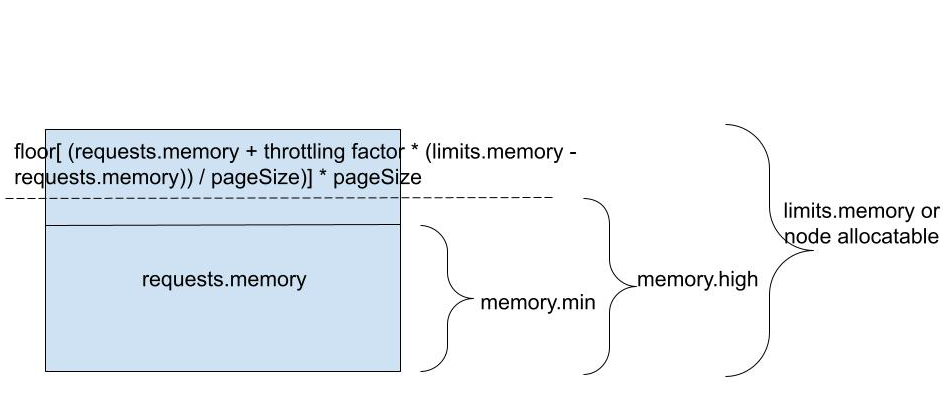
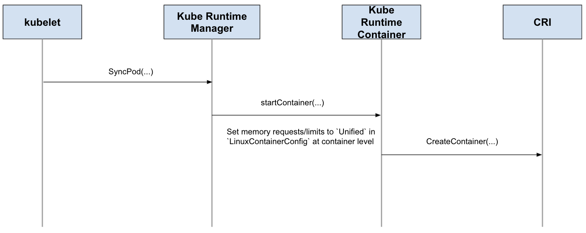
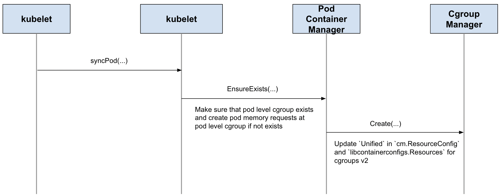
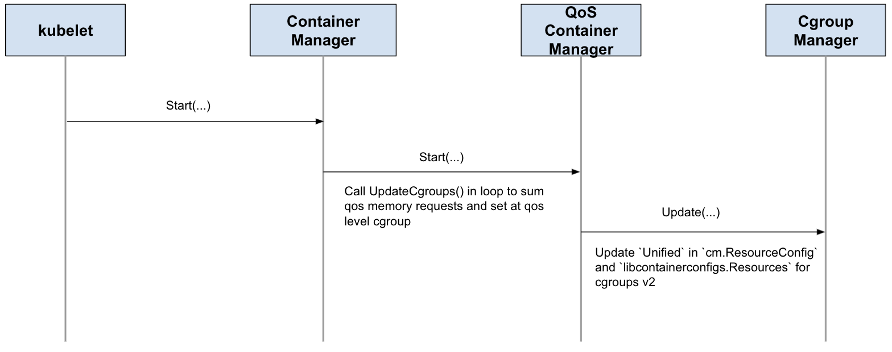
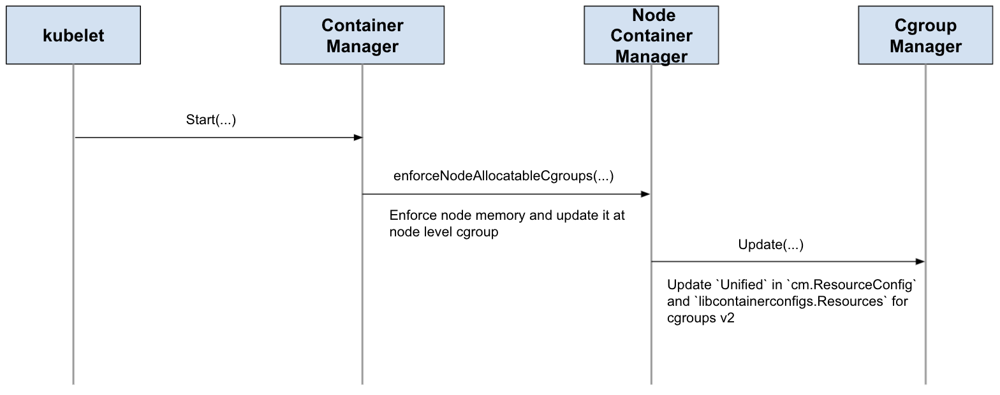

# KEP-2570: Support Memory QoS with cgroups v2
<!-- toc -->
- [Release Signoff Checklist](#release-signoff-checklist)
- [Summary](#summary)
- [Motivation](#motivation)
  - [Goals](#goals)
  - [Non-Goals](#non-goals)
- [Proposal](#proposal)
  - [User Stories (Optional)](#user-stories-optional)
    - [Memory Sensitive Workload](#memory-sensitive-workload)
    - [Node Availability](#node-availability)
  - [Comparison with Memory Manager](#comparison-with-memory-manager)
  - [memory.low vs memory.min](#memorylow-vs-memorymin)
- [Design Details](#design-details)
  - [Prerequisite](#prerequisite)
  - [Feature Gate](#feature-gate)
  - [Mapping Rules](#mapping-rules)
    - [Container/Pod](#containerpod)
    - [Node](#node)
  - [Interactive](#interactive)
  - [Workflow](#workflow)
    - [Container](#container)
    - [Pod](#pod)
    - [QoS](#qos)
    - [Node](#node-1)
  - [Cgroup Hierarchy](#cgroup-hierarchy)
  - [Cgroup v2 Support](#cgroup-v2-support)
  - [Container Runtime Interface (CRI) Changes](#container-runtime-interface-cri-changes)
  - [Test Plan](#test-plan)
  - [Graduation Criteria](#graduation-criteria)
    - [Alpha Graduation](#alpha-graduation)
    - [Beta Graduation](#beta-graduation)
    - [GA Graduation](#ga-graduation)
- [Production Readiness Review Questionnaire](#production-readiness-review-questionnaire)
  - [Feature Enablement and Rollback](#feature-enablement-and-rollback)
- [Implementation History](#implementation-history)
<!-- /toc -->

## Release Signoff Checklist
- [x] (R) Enhancement issue in release milestone, which links to KEP dir in [kubernetes/enhancements] (not the initial KEP PR)
- [x] (R) KEP approvers have approved the KEP status as `implementable`
- [x] (R) Design details are appropriately documented
- [x] (R) Test plan is in place, giving consideration to SIG Architecture and SIG Testing input (including test refactors)
- [x] (R) Graduation criteria is in place
- [x] (R) Production readiness review completed
- [x] (R) Production readiness review approved
- [x] "Implementation History" section is up-to-date for milestone
- [ ] User-facing documentation has been created in [kubernetes/website], for publication to [kubernetes.io]
- [ ] Supporting documentation—e.g., additional design documents, links to mailing list discussions/SIG meetings, relevant PRs/issues, release notes

## Summary
Support memory qos with cgroups v2.

## Motivation
In traditional cgroups v1 implement in Kubernetes, we can only limit cpu resources, such as `cpu_shares / cpu_set / cpu_quota / cpu_period`, memory qos is not yet implemented. cgroups v2 brings new capabilities for memory controller and it would help Kubernetes enhance memory isolation quality.

### Goals
- Provide guarantees around memory availability for pod and container memory requests and limits
- Provide guarantees around memory availability for node resource
- Make use of new cgroup v2 memory knobs(`memory.min/memory.high`) for pod and container level cgroup
- Make use of new cgroup v2 memory knobs(`memory.min`) for node level cgroup

### Non-Goals
- Additional qos design
- Support other resources qos
- Consider QOSReserved feature

## Proposal
This proposal uses memory controller of cgroups v2 to support memory qos for guaranteeing pod/container memory requests/limits and node resource.

Currently we only use `memory.limit_in_bytes=sum(pod.spec.containers.resources.limits[memory])` with cgroups v1 and `memory.max=sum(pod.spec.containers.resources.limits[memory])` with cgroups v2 to limit memory usage. `resources.requests[memory]` is not yet used neither by cgroups v1 nor cgroups v2 to protect memory requests. About memory protection, we use `oom_scores` to determine order of killing container process when OOM occurs. Besides, kubelet can only reserve memory from node allocatable at node level, there is no other memory protection for node resource.

So there are missing some memory protection, it may cause:
- Pod/Container memory requests can't be fully reserved, page cache is at risk of being recycled
- Pod/Container memory allocation is not well protected, there may occur allocation latency frequently when node memory nearly runs out
- Memory overcommit of container is not throttled, there may increase risk of node memory pressure
- Memory resource of node can't be fully retained and protected

Cgroups v2 introduces a better way to protect and guarantee memory quality.

| File | Description |
| -------- | -------- |
| memory.min | memory.min specifies a minimum amount of memory the cgroup must always retain, i.e., memory that can never be reclaimed by the system. If the cgroup's memory usage reaches this low limit and can’t be increased, the system OOM killer will be invoked. **We map it to `requests.memory`.** |
| memory.max | memory.max is the memory usage hard limit, acting as the final protection mechanism: If a cgroup's memory usage reaches this limit and can't be reduced, the system OOM killer is invoked on the cgroup. Under certain circumstances, usage may go over the memory.high limit temporarily. When the high limit is used and monitored properly, memory.max serves mainly to provide the final safety net. The default is max. **We map it to `limits.memory` as consistent with existing `memory.limit_in_bytes` for cgroups v1.** |
| memory.low | memory.low is the best-effort memory protection, a "soft guarantee" that if the cgroup and all its descendants are below this threshold, the cgroup's memory won't be reclaimed unless memory can’t be reclaimed from any unprotected cgroups. Not yet considered for now. |
| memory.high | memory.high is the memory usage throttle limit. This is the main mechanism to control a cgroup's memory use. If a cgroup's memory use goes over the high boundary specified here, the cgroup’s processes are throttled and put under heavy reclaim pressure. The default is max, meaning there is no limit. **We use a formula to calculate `memory.high` depending on `limits.memory/node allocatable memory` and a memory throttling factor.** |

This proposal sets `requests.memory` to `memory.min` for protecting container memory requests. `limits.memory` is set to `memory.max` (this is consistent with existing `memory.limit_in_bytes` for cgroups v1, we do nothing because [cgroup_v2](https://github.com/kubernetes/enhancements/tree/master/keps/sig-node/2254-cgroup-v2) has implemented for that).  

We also introduce `memory.high` to throttle container memory overcommit allocation. It will be set based on a formula:
```
memory.high=limits.memory/node allocatable memory * memory throttling factor
```

e.g. if a container has `requests.memory=50, limits.memory=100`, and we have a throttling factor of .8, `memory.high` would be 80. if a container had no memory limit specified, we substitute `limits.memory` for `node allocatable memory` and apply the throttling factor of .8 to that value.
It must be ensure that `memory.high` is always greater than `memory.min`.

Node reserved resources(kube-reserved/system-reserved) are either considered. It is tied to `--enforce-node-allocatable` and `memory.min` will be set properly.

Brief map as follows:
| type | memory.min | memory.high |
| -------- | -------- | -------- | 
| container | requests.memory | limits.memory/node allocatable memory * memory throttling factor |
| pod | sum(requests.memory) | n |
| node | n/a | pods, kube-reserved, system-reserved | n |

### User Stories (Optional)
#### Memory Sensitive Workload
Some workloads are sensitive to memory allocation and availability, slight delays may cause service outage. In this case, a mechanism is needed to ensure the quality of memory.
We must provide guarantee in both of the following aspects:
- Retain memory requests to reduce allocation latency
- Protect memory requests from being reclaimed

#### Node Availability
The stability of kubelet node is very important to users. As the key resource of the node, the availability of memory is the key factor for the stability of the node. We should do something to protect node reserved memory.

### Comparison with Memory Manager
The Memory Manager is a new component of kubelet ecosystem proposed to enable single-NUMA and multi-NUMA guaranteed memory allocation at topology level. Memory QoS proposal mainly uses cgroups v2 to improve the quality of memory requests, thereby improving the memory qos of `Guaranteed` and `Burstable` pods and even entire node. 
See also https://github.com/kubernetes/enhancements/tree/master/keps/sig-node/1769-memory-manager

### memory.low vs memory.min
In cgroups v2, `memory.low` is designed for best-effort memory protection which is more like "soft guarantee" and won't be reclaimed unless memory can't be reclaimed from any unprotected cgroups. `memory.min` is a bit aggressive. It will always retain specified amount of memory and it can be never reclaimed. When requirement is not satisfied, system OOM killer will be invoked. 

## Design Details
### Prerequisite
1. Kernel enables cgroups v2 unified hierarchy 
2. CRI runtime supports [cgroups v2 Unified Spec](https://github.com/opencontainers/runtime-spec/blob/7c549cb0939af03d5a2a8b271e2ad6871309e228/specs-go/config.go#L376) for container level
3. Kubelet enables `--enforce-node-allocatable=<pods, kube-reserved, system-reserved>` 

### Feature Gate
Set `--feature-gates=MemoryQoS=true` to enable the feature.

### Mapping Rules
#### Container/Pod

1. If container sets `requests.memory`, we set `memory.min=pod.spec.containers[i].resources.requests[memory]` for container level cgroup
2. If any containers in pod sets `requests.memory`, we set `memory.min=sum(pod.spec.containers[i].resources.requests[memory])` for pod level cgroup
3. If container sets `limits.memory`, we set `memory.high=pod.spec.containers[i].resources.limits[memory] * memory throttling factor` for container level cgroup if `memory.high>memory.min` 
4. If container does't set `limits.memory`, we set `memory.high=node allocatable memory * memory throttling factor` for container level cgroup
5. If kubelet sets `--cgroups-per-qos=true`, we set `memory.min=sum(pod[i].spec.containers[j].resources.requests[memory])` to make ancestor cgroups propagation effective
6. There are no changes regarding memory limit, that is `memory.max=memory_limits` (same as existing cgroup v2 implementation)
#### Node
1. If kubelet sets `--enforce-node-allocatable=kube-reserved`, `--kube-reserved=[a]` and `--kube-reserved-cgroup=[b]`, we set `memory.min=[a]` for node level cgroup `[b]`
2. If kubelet sets `--enforce-node-allocatable=system-reserved`, `--system-reserved=[a]` and `--system-reserved-cgroup=[b]`, we set `memory.min=[a]` for node level cgroup `[b]`
3. If kubelet sets `--enforce-node-allocatable=pods`, we set `memory.min=sum(pod[i].spec.containers[j].resources.requests[memory])` for kubepods cgroup

### Interactive
New `Unified` field will be added in both CRI and QoS Manager for cgroups v2 extra parameters. It is recommended to has same semantics with opencontainers/runtime-spec#1040

- container level: `Unified` added in `LinuxContainerResources`
- pod/node level: `Unified` added in `cm.ResourceConfig` 

### Workflow
#### Container 


#### Pod 


#### QoS 


#### Node 


### Cgroup Hierarchy 
Container/Pod:
```
// Container
/cgroup2/kubepods/pod<UID>/<container-id>/memory.min=pod.spec.containers[i].resources.requests[memory]
/cgroup2/kubepods/pod<UID>/<container-id>/memory.high=(pod.spec.containers[i].resources.limits[memory]/node allocatable memory)*memory throttling factor // Burstable
// Pod
/cgroup2/kubepods/pod<UID>/memory.min=sum(pod.spec.containers[i].resources.requests[memory])
// QoS ancestor cgroup
/cgroup2/kubepods/burstable/memory.min=sum(pod[i].spec.containers[j].resources.requests[memory]) 
```

Node:
```
/cgroup2/kubepods/memory.min=sum(pod[i].spec.containers[j].resources.requests[memory])
/cgroup2/<kube-reserved-cgroup,system-reserved-cgroup>/memory.min=<kube-reserved,system-reserved>
```

### Cgroup v2 Support
After Kubernetes v1.19, kubelet can identify cgroups v2 and do the convention. Since [v1.0.0-rc93](https://github.com/opencontainers/runc/releases/tag/v1.0.0-rc93), runc supports `Unified` to pass through cgroups v2 parameters. So we use this variable to pass `memory.min` when cgroups v2 mode is detected.

### Container Runtime Interface (CRI) Changes
We need add new field `Unified` in CRI api which is basically passthrough for OCI spec Unified field and has same semantics: opencontainers/runtime-spec#1040

```
type LinuxContainerResources struct {
    ...
    Unified map[string]string `json:"unified,omitempty"
}
```

### Test Plan
For `Alpha`, unit tests were added to test functionality for container/pod/node level cgroup with containerd and CRI-O.

For `Beta`, e2e-node tests were added, tests were added for dockershim

For `GA`, the introduced e2e tests will be promoted to conformance. It was also verified that all e2e coverage was proper and CRI's had tests in their respective repos testing this feature.


### Graduation Criteria

#### Alpha Graduation
- [cgroup_v2](https://github.com/kubernetes/enhancements/tree/master/keps/sig-node/2254-cgroup-v2) is in `Alpha`
- Memory QoS is implemented for new feature gate
- Memory QoS is covered by proper tests
- Memory QoS supports containerd, cri-o

#### Beta Graduation
- [cgroup_v2](https://github.com/kubernetes/enhancements/tree/master/keps/sig-node/2254-cgroup-v2) is in `Beta`
- Memory QoS is covered by unit and e2e-node tests
- Memory QoS supports containerd, cri-o and dockershim

#### GA Graduation
- [cgroup_v2](https://github.com/kubernetes/enhancements/tree/master/keps/sig-node/2254-cgroup-v2) is in `GA`
- Memory QoS has been in beta for at least 2 releases
- Memory QoS sees use in 3 projects or articles
- Memory QoS is covered by conformance tests

## Production Readiness Review Questionnaire

<!--

Production readiness reviews are intended to ensure that features merging into
Kubernetes are observable, scalable and supportable; can be safely operated in
production environments, and can be disabled or rolled back in the event they
cause increased failures in production. See more in the PRR KEP at
https://git.k8s.io/enhancements/keps/sig-architecture/1194-prod-readiness.

The production readiness review questionnaire must be completed and approved
for the KEP to move to `implementable` status and be included in the release.

In some cases, the questions below should also have answers in `kep.yaml`. This
is to enable automation to verify the presence of the review, and to reduce review
burden and latency.

The KEP must have a approver from the
[`prod-readiness-approvers`](http://git.k8s.io/enhancements/OWNERS_ALIASES)
team. Please reach out on the
[#prod-readiness](https://kubernetes.slack.com/archives/CPNHUMN74) channel if
you need any help or guidance.
-->

### Feature Enablement and Rollback

<!--
This section must be completed when targeting alpha to a release.
-->

###### How can this feature be enabled / disabled in a live cluster?

<!--
Pick one of these and delete the rest.
-->

- [x] Feature gate (also fill in values in `kep.yaml`)
  - Feature gate name: MemoryQoS
  - Components depending on the feature gate: kubelet

###### Does enabling the feature change any default behavior?

<!--
Any change of default behavior may be surprising to users or break existing
automations, so be extremely careful here.
-->
Yes, the kubelet will set `memory.min` for Guaranteed and Burstable pod/container level cgroup. It also will set `memory.high` for burstable container, which may cause memory allocation throttle. `memory.min` for qos or node level cgroup will be set when `--cgroups-per-qos` or `--enforce-node-allocatable` is satisfied.

###### Can the feature be disabled once it has been enabled (i.e. can we roll back the enablement)?

<!--
Describe the consequences on existing workloads (e.g., if this is a runtime
feature, can it break the existing applications?).

NOTE: Also set `disable-supported` to `true` or `false` in `kep.yaml`.
-->
Yes, related cgroups can be rolled back, `memory.min/memory.high` will reset to default value.

###### What happens if we reenable the feature if it was previously rolled back?
The kubelet will reconcile `memory.min/memory.high` with related cgroups.

###### Are there any tests for feature enablement/disablement?

<!--
The e2e framework does not currently support enabling or disabling feature
gates. However, unit tests in each component dealing with managing data, created
with and without the feature, are necessary. At the very least, think about
conversion tests if API types are being modified.
-->
Yes, some unit tests are exercised with the feature both enabled and disabled to verify proper behavior in both cases. When enabled, we test `memory.min/memory.high` for workloads and node cgroups whether it is proper value. When transitioning from enabled to disabled happens, we verify `memory.min/memory.high` whether be reset to default value.

## Implementation History
- 2020/03/14: initial proposal
- 2020/05/05: target Alpha to v1.22
