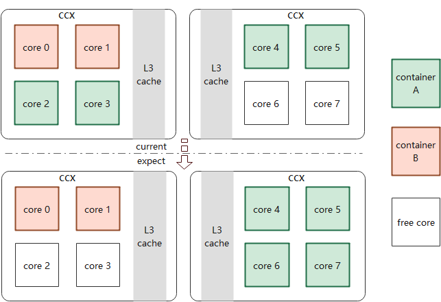
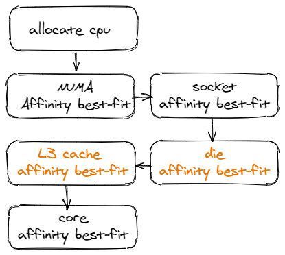

# KEP-2621: Add LLC Affinity to CPU manager

<!-- toc -->
- [Release Signoff Checklist](#release-signoff-checklist)
- [Summary](#summary)
- [Motivation](#motivation)
  - [Goals](#goals)
  - [Future Work](#future-work)
- [Proposal](#proposal)
  - [User Stories (Optional)](#user-stories-optional)
  - [Notes/Constraints/Caveats (Optional)](#notesconstraintscaveats-optional)
  - [Risks and Mitigations](#risks-and-mitigations)
- [Design Details](#design-details)
  - [Test Plan](#test-plan)
  - [Graduation Criteria](#graduation-criteria)
    - [Alpha](#alpha)
    - [Alpha to Beta Graduation](#alpha-to-beta-graduation)
    - [Beta to G.A Graduation](#beta-to-ga-graduation)
  - [Upgrade / Downgrade Strategy](#upgrade--downgrade-strategy)
  - [Version Skew Strategy](#version-skew-strategy)
- [Production Readiness Review Questionnaire](#production-readiness-review-questionnaire)
  - [Feature Enablement and Rollback](#feature-enablement-and-rollback)
  - [Rollout, Upgrade and Rollback Planning](#rollout-upgrade-and-rollback-planning)
  - [Monitoring Requirements](#monitoring-requirements)
  - [Dependencies](#dependencies)
  - [Scalability](#scalability)
  - [Troubleshooting](#troubleshooting)
- [Implementation History](#implementation-history)
<!-- /toc -->

## Release Signoff Checklist

Items marked with (R) are required *prior to targeting to a milestone / release*.

- [x] (R) Enhancement issue in release milestone, which links to KEP dir in [kubernetes/enhancements] (not the initial KEP PR)
- [ ] (R) KEP approvers have approved the KEP status as `implementable`
- [x] (R) Design details are appropriately documented
- [x] (R) Test plan is in place, giving consideration to SIG Architecture and SIG Testing input
- [x] (R) Graduation criteria is in place
- [ ] (R) Production readiness review completed
- [ ] (R) Production readiness review approved
- [ ] "Implementation History" section is up-to-date for milestone
- [ ] User-facing documentation has been created in [kubernetes/website], for publication to [kubernetes.io]
- [x] Supporting documentation—e.g., additional design documents, links to mailing list discussions/SIG meetings, relevant PRs/issues, release notes

[kubernetes.io]: https://kubernetes.io/
[kubernetes/enhancements]: https://git.k8s.io/enhancements
[kubernetes/kubernetes]: https://git.k8s.io/kubernetes
[kubernetes/website]: https://git.k8s.io/website

## Summary

Caches are not considered in current Kubernetes cpu-manager, in some architectures, each socket/package owns more than one L3 cache, containers may encounter performance degradation for L3 cache interference and lower hit rate.
We propose to support for L3 cache affinity during container cpu allocation. While in the same package/socket, try to use cpus sharing L3 cache for container demand but not just choose from all cpus in the package/socket.

## Motivation

Kubernetes cpu-manager tries to allocate cpus in the same core, socket/package, gaining better performance. In traditional architecture, L3 cache is shared between the whole socket, current cpus allocator works well.
However, the allocation algorithm may encounter problem in processors like `2nd Gen AMD EPYC™`, each `ccx`(a term used by AMD to describe a cluster of physical cores along with the shared L3 cache) owns its L3 cache, more than one L3 cache exists in a socket/package, we call L3 caches like this as uncore-cache all this design). Depending on current cpu allocation may face uncore-cache interference. For example, 4 cores with HT in ccx, a container demand for 8 cpus may not get the whole ccx, but get some cpus in other ccx(see figure below), container A and B may affect each other while the other flush uncore-cache. In our opinion, container's cpu locality should be considered.



### Goals

Support uncore-cache affinity in cpu allocation in architecture.

### Future Work

Cross-die may also decrease process performance. We will add die affinity future, and corresponding cpu assignment algorithm implemetation.

## Proposal

In order to make a decision to allocate cpu with uncore-cache affinity, we should be aware of the uncore-cache information in kubelet, current kubelet gets cpu topology with cadvisor, which does not support the related details. So, we add cache id and uncore-cache items to cadvisor(all merged).
- Add cache id to cadvisor
In cadvisor PR(https://github.com/google/cadvisor/pull/2847/),  use /sys/devices/system/cpu/cpu*/cache/index3/id to get L3 cache id of current cpu, and store it as cpu topology.
```go
type Cache struct {
+	// Id of memory cache
+	Id int `json:"id"`
	// Size of memory cache in bytes.
	Size uint64 `json:"size"`
	// Type of memory cache: data, instruction, or unified.
	Type string `json:"type"`
	// Level (distance from cpus) in a multi-level cache hierarchy.
	Level int `json:"level"`
}
```
- Add uncore cache to cadvisor
In cadvisor PR(https://github.com/google/cadvisor/pull/2849), add L3 cache not shared among the whole socket(uncore cache) to core info in cpu topology. And we can get core->uncore-cache mappings.
```go
type Core struct {
	Id           int     `json:"core_id"`
	Threads      []int   `json:"thread_ids"`
	Caches       []Cache `json:"caches"`
+	UncoreCaches []Cache `json:"uncore_caches"`
	SocketID     int     `json:"socket_id"`
}
```

### User Stories (Optional)

Before change, when kubelet allocates cpus for containers, uncore-cache is not considered, and may get cpus across caches even there're free cpus shared uncore-caches. 
We make a bench with `stream2` DAXPY, as we can see, cross ccx(cross uncore-cache) gets lower bandwidth.


And, when workload is memory sensitive, this feature can improve memory bandwidth significantly(20% above).
We also conduct tests in real applications like dpdk and redis, and get performance data. While in dpdk, with throughput degration from 19Mpps(share uncore-cache) to 12Mpps(cross uncore-cache).
### Notes/Constraints/Caveats (Optional)

### Risks and Mitigations

+ Currently no risks was found.
+ Feature is enabled by a gate - a new kube feature with default false, potential risk effects could be limited.

## Design Details

- Feature Gate
  - C1: Add `CPUManagerUncoreCacheAlign` to kubelet's feature-gates to enable(true)/disable(false) the feature.
  - C2: More than one l3 cache should exist in a single socket/package(uncore-cache exists).
  - And, we make a conclusion here,
    - C1=true, C2=true -> Enabled
    - C1=true, C2=false -> Disabled
    - C1=false, C2=true -> Disabled
    - C1=false, C2=false -> Disabled
- General Design
  - Logic Elaboration
  Try to allocate cpus sharing the same cache if demand is larger than one core. Add L3 cache affinity before trying core affinity best-fit.
  If we cannot find llc-satisfied cpus, continue the original process(find available cores). 

  

  - Feature-gates `CPUManagerUncoreCacheAlign`
    `CPUManagerUncoreCacheAlign` should set `false` in `defaultKubernetesFeatureGates`. And make a judge in `takeByTopology`, `enable`->`(do l3 cache affinity best-fit)`,`disable`->`(skip)`.
### Test Plan
- Unit tests for new added allocation algorithm.
- E2E tests should work on two scenarios:
  - For AMD rome/milan or other architectures with more than one L3 cache in a socket, cpu allocation for a container should always try to get all demand cpus sharing one L3 cache. Check containers’ cpuset.cpus for verification.
  - For other architectures, cpu allocation should be the same as before.

### Graduation Criteria
#### Alpha

 - Implement the new policy.
 - Ensure proper e2e node tests are in place.
#### Alpha to Beta Graduation

 - Gather feedback from the consumer of the policy.
 - No major bugs reported in the previous cycle.
#### Beta to G.A Graduation

 - Allowing time for feedback (1 year).
 - Risks have been addressed.
### Upgrade / Downgrade Strategy

We expect no impact. The new kube feature is opt-in.

### Version Skew Strategy
No changes needed.

## Production Readiness Review Questionnaire

### Feature Enablement and Rollback

- Feature gate
  We use a feature symbol `CPUManagerUncoreCacheAlign` with default `false` to kubelet's kube-feature.

### Rollout, Upgrade and Rollback Planning

### Monitoring Requirements

### Dependencies

High version cadvisor is in need, in which cache id and uncore cache info are stored in cpu topology.

### Scalability

### Troubleshooting

## Implementation History
- 2021.5.10: KEP updated, add CPUManagerUncoreCacheAlign as a kube feature.
- 2021.5.6: KEP created
- 2021.5.1: Original design doc with solutions considered: https://docs.google.com/document/d/1BuiBgsittUnU3heKHRCQ66YYxzAItT5gcPlu3N83PfA/edit#
