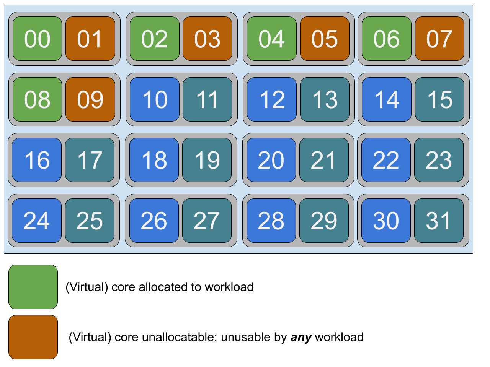

# SMT-aware cpu manager

## Table of Contents

<!-- toc -->
- [Release Signoff Checklist](#release-signoff-checklist)
- [Summary](#summary)
- [Motivation](#motivation)
  - [Goals](#goals)
- [Proposal](#proposal)
  - [User Stories](#user-stories)
    - [Containerized Network Functions (CNF)](#containerized-network-functions-cnf)
  - [Risks and Mitigations](#risks-and-mitigations)
- [Design Details](#design-details)
  - [Proposed Change](#proposed-change)
    - [smtaware policy](#smtaware-policy)
    - [smtisolate policy](#smtisolate-policy)
  - [Resource Accounting](#resource-accounting)
    - [smtaware policy](#smtaware-policy-1)
    - [smtisolate policy](#smtisolate-policy-1)
  - [Alternatives](#alternatives)
    - [Add extra resources](#add-extra-resources)
    - [Add a new unit for CPU resources](#add-a-new-unit-for-cpu-resources)
  - [Test Plan](#test-plan)
  - [Graduation Criteria](#graduation-criteria)
    - [Alpha](#alpha)
    - [Alpha to Beta Graduation](#alpha-to-beta-graduation)
    - [Beta to G.A Graduation](#beta-to-ga-graduation)
  - [Upgrade / Downgrade Strategy](#upgrade--downgrade-strategy)
  - [Version Skew Strategy](#version-skew-strategy)
- [Production Readiness Review Questionnaire](#production-readiness-review-questionnaire)
  - [Feature enablement and rollback](#feature-enablement-and-rollback)
  - [Rollout, Upgrade and Rollback Planning](#rollout-upgrade-and-rollback-planning)
  - [Monitoring requirements](#monitoring-requirements)
  - [Dependencies](#dependencies)
  - [Scalability](#scalability)
  - [Troubleshooting](#troubleshooting)
- [Implementation History](#implementation-history)
<!-- /toc -->

## Release Signoff Checklist

Items marked with (R) are required *prior to targeting to a milestone / release*.

- [ ] (R) Enhancement issue in release milestone, which links to KEP dir in [kubernetes/enhancements](https://github.com/kubernetes/enhancements/issues/2404)
- [ ] (R) KEP approvers have approved the KEP status as `implementable`
- [ ] (R) Design details are appropriately documented
- [ ] (R) Test plan is in place, giving consideration to SIG Architecture and SIG Testing input
- [ ] (R) Graduation criteria is in place
- [ ] (R) Production readiness review completed
- [ ] Production readiness review approved
- [ ] "Implementation History" section is up-to-date for milestone
- ~~ [ ] User-facing documentation has been created in [kubernetes/website], for publication to [kubernetes.io] ~~
- [ ] Supporting documentation e.g., additional design documents, links to mailing list discussions/SIG meetings, relevant PRs/issues, release notes

[kubernetes.io]: https://kubernetes.io/
[kubernetes/enhancements]: https://git.k8s.io/enhancements
[kubernetes/kubernetes]: https://git.k8s.io/kubernetes
[kubernetes/website]: https://git.k8s.io/website

## Summary

We propose a change in cpumanager to make the behaviour of latency-sensitive applications more predictable when running on SMT-enabled systems.

## Motivation

Latency-sensitive applications want to have exclusive CPU allocation to have performance isolation and meet their performance requirements.
The static policy of the cpumanager already allows this behaviour.
However, for some classes of these latency-sensitive applications running on simultaneous multithreading (SMT) enabled system, it is also necessary to consider thread affinity, to avoid any possible interference caused by noisy neighborhoods.

### Goals

* Allow the workload to request the core allocation at per-hardware-thread level, avoiding noisy neighbours situations and allow emulation of non-SMT behaviour on SMT systems. 

## Proposal

### User Stories

#### Containerized Network Functions (CNF)

This class of latency applications benefits of hardware-thread level placement control
To maximise cache efficiency, the workload  wants to be pinned to thread siblings. This is already the default behaviour of the cpumanager static policy, but this enhancement wants to provide stronger guarantees.

The workload guest may wish to avoid thread siblings. This is to avoid noisy neighborhoods, which may have effect on core compute resources or in processor cache interference.
Implementations of this policy proposed here are already found in [external projects](https://github.com/nokia/CPU-Pooler#hyperthreading-support)
or in [OpenStack](https://specs.openstack.org/openstack/nova-specs/specs/mitaka/implemented/virt-driver-cpu-thread-pinning.html),
which is one of the leading platform for VNF (Virtual Network Functions), the predecessor of CNFs.

### Risks and Mitigations

This new behaviour is opt-in. Users will need to explicitly enable it in their kubelet configuration. The change is very self contained, with little impact in the shared codebase.
The impact in the shared codebase will be addressed enhancing the current testsuite.

| Risk                                                      | Impact        | Mitigation |
| --------------------------------------------------------- | ------------- | ---------- |
| Bugs in the implementation lead to kubelet crash | High | Disable the policy and restart the kubelet. The workload will run but with weaker guarantees - like it was before this change. |


## Design Details

### Proposed Change

We propose to add a two cpumanager policies called `smtaware` and `smtisolate` which will be a further refinements of the existing static policy.
This means the new policies will implement all the behaviour of the static policy, with additional guarantees.

To illustrate the behaviour of the policies, we will consider the following CPU topology. We will take a cpu package with 16 physical cores, 2-way SMT-capable.


#### smtaware policy

Key properties:
- Each guaranteed container will have allocated a integral even number of cores, multiple of the number of virtual cpus per physical cores rounding up. (e.g. multiple of 2 on 2-way SMT)
- Ensure that containers will always get an integral amount of physical cores, rounding up if needed. See below for examples.
This is done to ensure that a guaranteed container will never share resources to any other container, thus preventing any possible noisy neighborhood.
- Should the node not have enough free physical cores, the Pod will be put in Failed state, with `SMTAlignmentError` as reason.

The new `smtaware` policy will allocate cores like the current cpumanager static policy, but avoid physical core sharing.
This means that the allocation will be performed in terms of hardware thread sets (physical cores).  On 2-way SMT platforms this means hardware thread pairs.
If the container requires a odd number of cores, the leftover core will be left unallocated, and the policy will guarantee no workload will consume it.

Example: let’s consider a pod with one container requesting 5 cores.


### Implementation details of `smtaware` CPU Manager

- The CPU Manager implements the pod admit handler interface and participates in Kubelet pod admission.
- GetAllocateResourcesPodAdmitHandler() function in the Container Manager is modified to perform admission checks for CPU Manager in addition to the already occuring Topology manager admission check. Just like Topology Manager returns `TopologyAffinityError` is case of resources cannot be NUMA-aligned in case of `restricted` or `single-numa-node policy`, CPU Manager admission failure results in a rejected pod with `SMTAlignmentError`. If both CPU Manager and Topology manager don't allow pod to be admitted `ContainerManagerAdmissionError` is returned to indicate that both the admit handlers are not allowing pod to be admitted. 
- The Policy interface in CPU Manager is enhanced to support an Admit function. This allows to perform pod admission decision for CPU Manager policies.
- When CPU Manager is configured with `smtaware` policy, when the Admit() function is called it is checked if the CPU request is
such that it would acquire an entire physical core. In case request translates to partial occupancy of the cores the Pod will not be admitted and would fail with `SMTAlignmentError`. In case of `static` and `none` policy, the Admit() function always returns true meaning the pod is always admitted.
- When `smtaware` policy is bootstrapped, we intentionally reuse `static` policy. The allocation logic of the `static` policy works seemlessly in case of `smtaware` policy as following the check at admission time of a pod, it is known that CPUs would be allocated such that full cores are allocated. Because of this check, a pod would never have to acquire single threads with the aim to fill partially-allocated cores


#### smtisolate policy

Key properties:
- Each guaranteed container will have allocated a integral even number of cores, multiple of the number of virtual cpus per physical cores rounding up. (e.g. multiple of 2 on 2-way SMT)
- Ensure that containers will get allocated a number of cores which is the ratio of requested amound of cores divided the numer of virtual cores per physical cores.
- Should the node not have enough free physical cores, the Pod will be put in Failed state, with `SMTAlignmentError` as reason.

This policy will emulate non-SMT on SMT-enabled machines. It will have no effect on non-SMT machines. Only one of a group of virtual thread pair will be used per physical core.
All but one thread sibling on each utilized core is therefore guaranteed to be unallocatable.

Example: let’s consider a pod with one container requesting 5 cores.




### Resource Accounting

Without the admission restriction imposed by policies, a key side effect of this change is that the total amount of virtual cores actually taken by a container will be greater than the amount of cores requested by the container.
cpumanager, thus the kubelet will reserve for the container the cores requested by the workload plus some amount of unallocated cores, needed to enforce the physical constraints which prevent noisy neighborhoods.

Let's evaluate how the behaviour would be without the admission check.

#### smtaware policy

| Requested Virtual cores | Workload-required Virtual Cores | Unallocatable Virtual Cores | Total taken virtual cores |
| ----------------------- | ------------------------------- | --------------------------- | ------------------------- |
| 1                       | 1                               | 1                           | 2                         |
| 2                       | 2                               | 0                           | 2                         |
| 4                       | 4                               | 0                           | 4                         |
| 5                       | 5                               | 1                           | 6                         |
| 11                      | 11                              | 1                           | 12                        |

So, to make the `cpu` resource accounting consistent, and in order to minimize the overall changes to the system, we added the extra admission check for the `smtaware` policy.
The admission will accept only pods whose Guaranteed QOS containers request a integral amount of CPU which is a multiple of the number of virtual cpus per physical core (= 2 on 2-way SMT).

#### smtisolate policy

| Requested Virtual cores | Workload-required Virtual Cores | Unallocatable Virtual Cores | Total taken virtual cores |
| ----------------------- | ------------------------------- | --------------------------- | ------------------------- |
| 1                       | 1                               | 1                           | 2                         |
| 2                       | 2                               | 2                           | 4                         |
| 4                       | 4                               | 4                           | 8                         |
| 5                       | 5                               | 5                           | 10                        |
| 11                      | 11                              | 11                          | 22                        |

So, yo make the `cpu` resource accounting consistent, and in order to minimize the overall changes to the system, we added the extra admission check for `smtisolate` policy.
The admission will accept only pods whose Guaranteed QOS containers request a integral amount of CPU which is a multiple of the number of virtual cpus per physical core (= 2 on 2-way SMT).
With this prerequisite enforced, the policy can safely allocate an amount of physical cores equal to request(cpu) divided by the number of virtual cpus per physical core (= 2 on 2-way SMT).

So, for example, a container requesting 20 cpus:
- will make the `node.Status.Accountable` to be decremented by 20.
- will get `20 / 2 = 10` physical cores to be allocated to the container.

Once the container is removed, all 20 cpus will be made available again.

### Alternatives

The constraint we add to make the resource accounting consistent when using the `smtisolate` policy is admittedly awkward. We evaluated possible alternatives, but we eventually
discarded all of them. We document them in this section.

#### Add extra resources

We can add a new extended resource alongside `cpu` - [which on baremetal represents virtual thrads]((https://kubernetes.io/docs/tasks/configure-pod-container/assign-cpu-resource/#cpu-units), to represent
physical cpus. However having two resources to represent the same hardware entity is confusing and cumbersome. We believe cpumanager should keep consuming the core `cpu` resource for consistency reasons.

#### Add a new unit for CPU resources

Since a physical core always hosts one or more virtual thread, [hence one or more cpus](https://kubernetes.io/docs/tasks/configure-pod-container/assign-cpu-resource/#cpu-units), we can
add a resource qualifier to represent such multiple. For example, the `p` qualifier in the example below could allow the users to change the meaning of the value such as the request
is expressed in terms of physical cpus:

```yaml
apiVersion: v1
kind: Pod
metadata:
  name: frontend
spec:
  containers:
  - name: app
    image: images.my-company.example/app:v4
    resources:
      requests:
        memory: "128Mi"
        cpu: "2p"
      limits:
        memory: "128Mi"
        cpu: "2p"
```

This approach however is relevant only when kubernetes runs on baremetal machines, and irrelevant on the cloud; More over it will make the definition more ambiguous,
because the relationship between physical cpus and virtual cpus is hardware and configuration dependent:

| Environment                                          | Virtual/Physical cpu ratio |
| ---------------------------------------------------- | -------------------------- |
| Baremetal, 2-way SMT capable (x86_64), SMT enabled   | 2                          |
| Baremetal, 2-way SMT capable, SMT disabled           | 1                          |

SMT can usually be disabled via software (kernel parameter, firmware settings), and [other implementations than 2-way SMT are possible](https://en.wikipedia.org/wiki/Simultaneous_multithreading).
Hence, the ratio between virtual and physical CPUs is not fixed and is not predictable, subject to changes in future.

### Test Plan

The implementation PR will extend both the unit test suite and the E2E test suite to cover the policy changes described in this KEP.

### Graduation Criteria

#### Alpha
- [] TBD

#### Alpha to Beta Graduation
- [] TBD

#### Beta to G.A Graduation
- [] TBD

### Upgrade / Downgrade Strategy

We expect no impact. The new policies are opt-in and separated by the existing ones.

### Version Skew Strategy

No changes needed

## Production Readiness Review Questionnaire
### Feature enablement and rollback

* **How can this feature be enabled / disabled in a live cluster?**
  - [X] Feature gate (also fill in values in `kep.yaml`).
    - needed? the policy is optin anyway
    - Components depending on the feature gate: kubelet.

* **Does enabling the feature change any default behavior?** No
* **Can the feature be disabled once it has been enabled (i.e. can we rollback the enablement)?** Yes, through kubelet configuration - switch to a different policy.
* **What happens if we reenable the feature if it was previously rolled back?** No changes. Existing container will not see their allocation changed. New containers will.
* **Are there any tests for feature enablement/disablement?** TBD

### Rollout, Upgrade and Rollback Planning

* **How can a rollout fail? Can it impact already running workloads?** Kubelet may fail to start. The kubelet may crash.
* **What specific metrics should inform a rollback?** TBD
* **Were upgrade and rollback tested? Was upgrade->downgrade->upgrade path tested?** Not Applicable.
* **Is the rollout accompanied by any deprecations and/or removals of features,  APIs, fields of API types, flags, etc.?** No.

### Monitoring requirements
* **How can an operator determine if the feature is in use by workloads?**
  - Inspect the kubelet configuration of the nodes.
* **What are the SLIs (Service Level Indicators) an operator can use to determine the health of the service?**
  - [X] Metrics
    - TBD

* **What are the reasonable SLOs (Service Level Objectives) for the above SLIs?** N/A.
* **Are there any missing metrics that would be useful to have to improve observability if this feature?** N/A.


### Dependencies

* **Does this feature depend on any specific services running in the cluster?** Not applicable.

### Scalability

* **Will enabling / using this feature result in any new API calls?** No.
* **Will enabling / using this feature result in introducing new API types?** No.
* **Will enabling / using this feature result in any new calls to cloud provider?** No.
* **Will enabling / using this feature result in increasing size or count of the existing API objects?** No.
* **Will enabling / using this feature result in increasing time taken by any operations covered by [existing SLIs/SLOs][]?** No.
* **Will enabling / using this feature result in non-negligible increase of resource usage (CPU, RAM, disk, IO, ...) in any components?** No.

### Troubleshooting

* **How does this feature react if the API server and/or etcd is unavailable?**: No effect.
* **What are other known failure modes?** TBD
* **What steps should be taken if SLOs are not being met to determine the problem?** N/A

[supported limits]: https://git.k8s.io/community//sig-scalability/configs-and-limits/thresholds.md
[existing SLIs/SLOs]: https://git.k8s.io/community/sig-scalability/slos/slos.md#kubernetes-slisslos

## Implementation History

- 2021-04-14: KEP created
- 2021-04-16: KEP updated with the `smtisolate` policy
- 2021-04-19: KEP updated to capture implementation details of the `smtaware` policy

