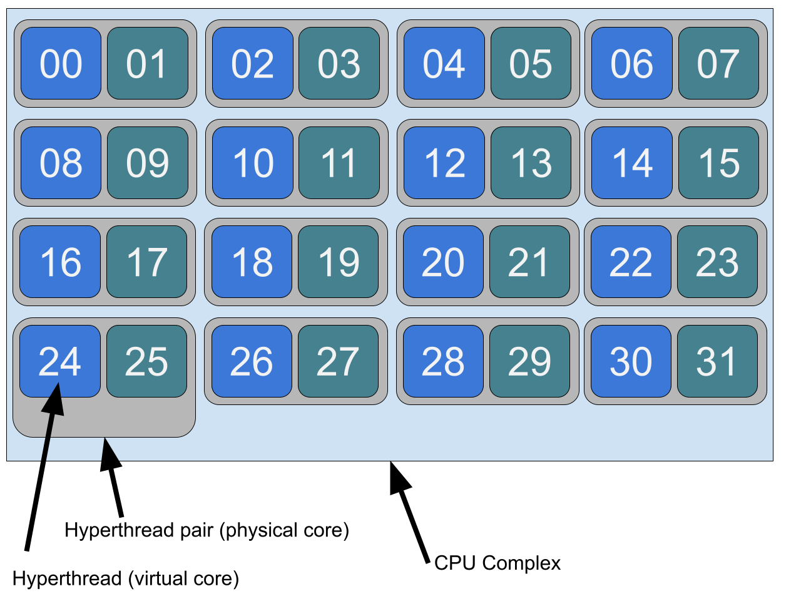
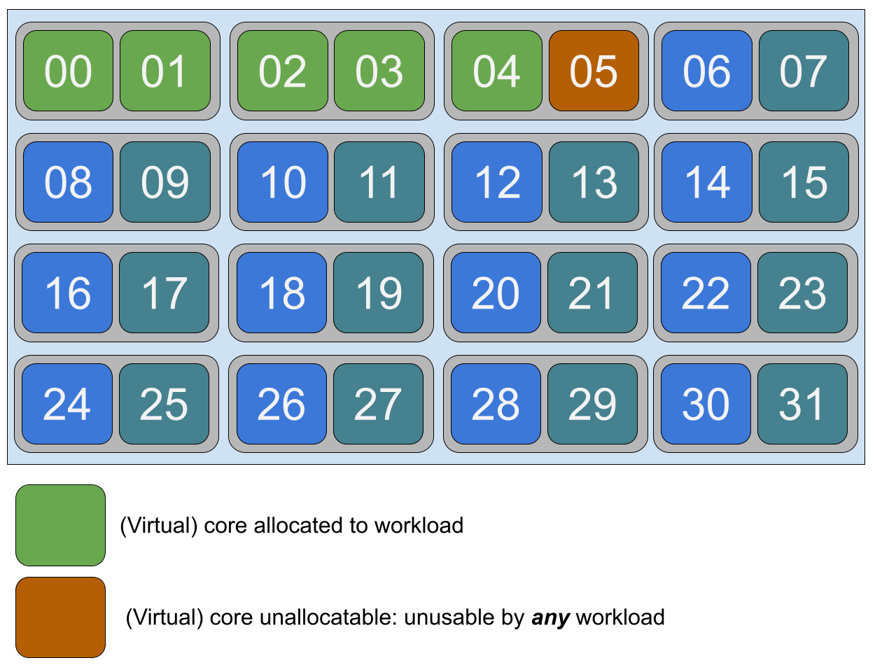

# SMT-aligned cpu manager

## Table of Contents

<!-- toc -->
- [Release Signoff Checklist](#release-signoff-checklist)
- [Summary](#summary)
- [Motivation](#motivation)
  - [Goals](#goals)
- [Proposal](#proposal)
  - [User Stories](#user-stories)
    - [Latency-sensitive applications runtime guarantees](#latency-sensitive-applications-runtime-guarantees)
    - [Improve the density of running containers](#improve-the-density-of-running-containers)
  - [Risks and Mitigations](#risks-and-mitigations)
- [Design Details](#design-details)
  - [Proposed Change](#proposed-change)
  - [Implementation strategy of smtalign CPU Manager policy option](#implementation-strategy-of-smtalign-cpu-manager-policy-option)
  - [Resource Accounting](#resource-accounting)
  - [Alternatives](#alternatives)
    - [Add extra resources](#add-extra-resources)
    - [Add a new unit for CPU resources](#add-a-new-unit-for-cpu-resources)
  - [Future extension](#future-extension)
  - [Test Plan](#test-plan)
  - [Graduation Criteria](#graduation-criteria)
    - [Alpha](#alpha)
    - [Alpha to Beta Graduation](#alpha-to-beta-graduation)
    - [Beta to G.A Graduation](#beta-to-ga-graduation)
  - [Upgrade / Downgrade Strategy](#upgrade--downgrade-strategy)
  - [Version Skew Strategy](#version-skew-strategy)
- [Production Readiness Review Questionnaire](#production-readiness-review-questionnaire)
  - [Feature enablement and rollback](#feature-enablement-and-rollback)
  - [Rollout, Upgrade and Rollback Planning](#rollout-upgrade-and-rollback-planning)
  - [Monitoring requirements](#monitoring-requirements)
  - [Dependencies](#dependencies)
  - [Scalability](#scalability)
  - [Troubleshooting](#troubleshooting)
- [Implementation History](#implementation-history)
<!-- /toc -->

## Release Signoff Checklist

Items marked with (R) are required *prior to targeting to a milestone / release*.

- [ ] (R) Enhancement issue in release milestone, which links to KEP dir in [kubernetes/enhancements](https://github.com/kubernetes/enhancements/issues/2404)
- [ ] (R) KEP approvers have approved the KEP status as `implementable`
- [ ] (R) Design details are appropriately documented
- [ ] (R) Test plan is in place, giving consideration to SIG Architecture and SIG Testing input
- [ ] (R) Graduation criteria is in place
- [ ] (R) Production readiness review completed
- [ ] Production readiness review approved
- [ ] "Implementation History" section is up-to-date for milestone
- ~~ [ ] User-facing documentation has been created in [kubernetes/website], for publication to [kubernetes.io] ~~
- [ ] Supporting documentation e.g., additional design documents, links to mailing list discussions/SIG meetings, relevant PRs/issues, release notes

[kubernetes.io]: https://kubernetes.io/
[kubernetes/enhancements]: https://git.k8s.io/enhancements
[kubernetes/kubernetes]: https://git.k8s.io/kubernetes
[kubernetes/website]: https://git.k8s.io/website

## Summary

We propose a change in cpumanager to make the behaviour of latency-sensitive applications more predictable when running on SMT-enabled systems.

## Motivation

Latency-sensitive applications want to have exclusive CPU allocation to enable performance isolation and to meet their latency requirements.
The static policy of the cpumanager already allows to prevent virtual CPU sharing.
However, for some classes of these latency-sensitive applications running on simultaneous multithreading (SMT) enabled system, it is also beneficial
to consider thread-level allocation, to avoid physical CPU sharing and prevent possible interferences caused by noisy neighborhoods.

### Goals

* Allow the workload to request the core allocation at hardware-thread level, avoiding noisy neighbours situations
* Allow the workload to request full physical core allocation, to enable more efficient cache sharing

## Proposal

### User Stories

#### Latency-sensitive applications runtime guarantees

Some classes of latency-sensitive applications (CNF, HFT, ML/AI) benefit of the thread placement constraints this policy enables.
More precise thread placement allows to control which physical cores are shared among containers, such as:

1. workloads may ensure the physical cores are shared among their threads for increased efficiency
2. workloads may ensure the physical cores are *not* shared with other containers for interference prevention.

An implementation of the concepts proposed here is already found in [external projects](https://github.com/nokia/CPU-Pooler#hyperthreading-support).
[OpenStack](https://specs.openstack.org/openstack/nova-specs/specs/mitaka/implemented/virt-driver-cpu-thread-pinning.html),
which is one of the leading platform for VNF (Virtual Network Functions), the predecessor of CNFs.

#### Improve the density of running containers

Thread allocation guarantees enables more efficient usage of the node resources.
The nodes can now accommodate safely mixed workloads of latency-sensitive and not-latency-sensitive (infrastructure) pods.
This increases the node usage, which reduces the need for extra hardware, which drives down the TCO of a container-based solution.

### Risks and Mitigations

This new behaviour is opt-in. Users will need to explicitly enable it in their kubelet configuration. The change is very self contained, with little impact in the shared codebase.
The impact in the shared codebase will be addressed enhancing the current testsuite.

| Risk                                                      | Impact        | Mitigation |
| --------------------------------------------------------- | ------------- | ---------- |
| Bugs in the implementation lead to kubelet crash | High | Disable the policy and restart the kubelet. The workload will run but with weaker guarantees - like it was before this change. |


## Design Details

### Proposed Change

We propose to add a new flag in Kubelet called `CPUManagerPolicyOptions` in the kubelet config or command line argument called `cpumanager-policy-options` which allows the user to specify the CPU Manager policy option. If the value of this option is specified to be `smtalign`, it results in further refinements of the existing static policy.
The static policy allocates CPUs using a topology-aware best-fit allocation. This enhancement wants to provide stronger guarantees by restricting the allocation of threads.
The aim is to achieve the isolation for workloads managed by Kubernetes. The other part of isolation is (as of now) not managed by Kubernetes, as described in [Explicitly Reserved CPU List](https://kubernetes.io/docs/tasks/administer-cluster/reserve-compute-resources/#explicitly-reserved-cpu-list) and [Static policy](https://kubernetes.io/docs/tasks/administer-cluster/cpu-management-policies/#static-policy).

Key properties:
- Preserve all the properties of the `static` policy.
- Never allocate less than a physical-cpu worth amount of cores.
- With this requirement enforced, the cpumanager allocation algorithm will guarantee avoidance of physical core sharing.
- Should the node not have enough free physical cores, the Pod will be put in Failed state, with `SMTAlignmentError` as reason.

### Implementation strategy of smtalign CPU Manager policy option

- In order to introduce SMT-alignment in CPU Manager, we introduce a new flag in Kubelet to allow the user to specify `cpumanager-policy-options` which when specified with `smtalign` as its value provides the capability to modify the behaviour of static policy to strictly guarantee allocation of whole cores to a workload.  
- The `CPUManagerPolicyOptions` received from the kubelet config/command line args is propogated to the Container Manager.
- The responsibility of admission control is centralized in containermanager. The resource managers and/or the resource allocation orchestrator (Topology Manager) still have the responsibility of running the checks to admit the pods, but the handling of these errors and the building of the pod lifecycle result are now factored in containermanager.
- Prior to this feature, the Container Manager admission handler was delegated to the topology manager if the latter was enabled. This worked well under the assumption that only Topology Manager had the ability to reject admissions with pods. But with the introduction of this feature, the CPU Manager also needs the ability to possibly reject pods if strict SMT alignment is requested. In order to do so, we introduce a new error and let it drive the rejection. Due to an already existing dependency between cpumanager and topologymanager as the former imports the latter in order to support the topologymanager.HintProvider interface, container manager is considered as the appropriate for performing admission control.
- When `smtalign` policy option is specified along with `static` CPU Manager policy, an additional check in the allocation logic of the `static` policy ensures that CPUs would be allocated such that full cores are allocated. Because of this check, a pod would never have to acquire single threads with the aim to fill partially-allocated cores.
- In case request translates to partial occupancy of the cores, the Pod will not be admitted and would fail with `SMTAlignmentError`.


### Resource Accounting

To illustrate the behaviour of the `smtalign` policy option, we will consider the following CPU topology. We will use as example a CPU package with 16 physical cores, 2-way SMT-capable.




Let's consider a single container, requesting 5 isolated cores.

```yaml
apiVersion: v1
kind: Pod
metadata:
  name: frontend
spec:
  containers:
  - name: app
    image: images.my-company.example/app:v4
    resources:
      requests:
        memory: "128Mi"
        cpu: "5"
      limits:
        memory: "128Mi"
        cpu: "5"
```

The `smtalign` policy option would need to make sure the remaining core on the half-allocated physical CPU is left unallocated to avoid noisy neighbours.



The container will then actually get more virtual cores (6) than what is requesting (5).

| Requested (virtual) CPUs | Requested (physical) CPUs | Unallocatable (virtual) CPUs   | Total allocated (virtual) CPUs            |
| ------------------------ | ------------------------- | ------------------------------ | ----------------------------------------- |
| 5                        | 3                         | 1                              | 6                                         |
| N                        | M = N / `threads_per_cpu` | X = N % `threads_per_cpu`      | `requested_vcpus` + `unallocatable_vcpus` |

With `threads_per_cpu` is typical 2 on x86_64 with SMT enabled - but this number is not fixed and can change in future hardware implementation.

In order to make the resource reporting consistent, and avoiding cascading changes in the system, we enforce the request constraints ad admission time.
This approach follows what the Topology Manager already does.

### Alternatives

The only drawback of the proposed admission handler is that pods might have to overallocate resources.
We evaluated possible alternatives to the extra admission control, but we eventually discarded all of them. We document them in this section.

#### Add extra resources

We can add a new extended resource alongside `cpu` - [which on baremetal represents virtual threads](https://kubernetes.io/docs/tasks/configure-pod-container/assign-cpu-resource/#cpu-units), to represent
physical CPUs. However having two resources to represent the same hardware entity is confusing and cumbersome. We believe cpumanager should keep consuming the core `cpu` resource for consistency reasons.

Just considering the new extended resource, is not feasible as well, because it will prevent the pod to be in the guaranteed QoS class, and will void the desirable property of keeping all the guarantees
the static policy provides.

#### Add a new unit for CPU resources

Since a physical core always hosts one or more virtual thread, [hence one or more CPUs](https://kubernetes.io/docs/tasks/configure-pod-container/assign-cpu-resource/#cpu-units), we can
add a resource qualifier to represent such multiple. For example, the `p` qualifier in the example below could allow the users to change the meaning of the value such as the request
is expressed in terms of physical CPUs:

```yaml
apiVersion: v1
kind: Pod
metadata:
  name: frontend
spec:
  containers:
  - name: app
    image: images.my-company.example/app:v4
    resources:
      requests:
        memory: "128Mi"
        cpu: "3p"
      limits:
        memory: "128Mi"
        cpu: "3p"
```

This approach however is relevant only when kubernetes runs on baremetal machines, and irrelevant on the cloud; More over it will make the definition more ambiguous,
because the relationship between physical CPUs and virtual CPUs is hardware and configuration dependent:

| Environment                                          | Virtual/Physical cpu ratio |
| ---------------------------------------------------- | -------------------------- |
| Baremetal, 2-way SMT capable (x86_64), SMT enabled   | 2                          |
| Baremetal, 2-way SMT capable, SMT disabled           | 1                          |

SMT can usually be disabled via software (kernel parameter, firmware settings), and [other implementations than 2-way SMT are possible](https://en.wikipedia.org/wiki/Simultaneous_multithreading).
Hence, the ratio between virtual and physical CPUs is not fixed and is not predictable, subject to changes in future.
Furthermore, this new unit would make sense only for CPU resources, and not for all the other resources.

### Future extension

We would like to mention a further extension of this work, which we are *not* proposing here.

A further subset of the latency sensitive class of workload we identified (CNF, HFT) benefits most of non-SMT system, delivering the best possible performance here.
For these applications, just disabling SMT at machine level solves the need of the workload, but overall creates worse usage of hardware resources and poorer container density.

Another policy option, or a further refinement of `smtalign`, which enables non-SMT emulation on SMT-enabled system would allow to accommodate these needs, but this would cause even more significant resource accounting mismatches
as described above. Furthermore, at the moment of writing we are still assessing how large is the set of the classes which benefit of these extra guarantees.

For all these reasons we postponed this work to a later date.

### Test Plan

The implementation PR will extend both the unit test suite and the E2E test suite to cover the policy changes described in this KEP.

### Graduation Criteria

#### Alpha
- [X] Implement the new policy.
- [X] Ensure proper e2e node tests are in place.

#### Alpha to Beta Graduation
- [X] Gather feedback from the consumer of the policy.
- [X] No major bugs reported in the previous cycle.

#### Beta to G.A Graduation
- [X] Allowing time for feedback (1 year).
- [X] Risks have been addressed.

### Upgrade / Downgrade Strategy

We expect no impact. The new policies are opt-in and separated by the existing ones.

### Version Skew Strategy

No changes needed

## Production Readiness Review Questionnaire
### Feature enablement and rollback

* **How can this feature be enabled / disabled in a live cluster?**
  - [X] Feature gate (also fill in values in `kep.yaml`).
    - Feature gate name: `CPUManagerPolicyOptions`.
    - Components depending on the feature gate: kubelet
  - [X] Change the kubelet configuration to set the cpumanager policy option to `smtalign`
* **Does enabling the feature change any default behavior?**
  - Yes, it makes the behaviour of the `cpumanager` static policy more restrictive and can lead to pod admission rejection.
* **Can the feature be disabled once it has been enabled (i.e. can we rollback the enablement)?**
  - Yes, disabling the feature gate shuts down the feature completely; alternatively,
  - Yes, through kubelet configuration - switch to a different policy.
* **What happens if we reenable the feature if it was previously rolled back?** No changes. Existing container will not see their allocation changed. New containers will.
* **Are there any tests for feature enablement/disablement?**
  - A specific e2e test will demonstrate that the default behaviour is preserved when the feature gate is disabled, or when the feature is not used (2 separate tests)

### Rollout, Upgrade and Rollback Planning

* **How can a rollout fail? Can it impact already running workloads?** Kubelet may fail to start. The kubelet may crash.
* **What specific metrics should inform a rollback?** Not applicable
* **Were upgrade and rollback tested? Was upgrade->downgrade->upgrade path tested?** Not Applicable.
* **Is the rollout accompanied by any deprecations and/or removals of features,  APIs, fields of API types, flags, etc.?** No.

### Monitoring requirements
* **How can an operator determine if the feature is in use by workloads?**
  - Inspect the kubelet configuration of the nodes: check feature gate and usage of the new option
* **What are the SLIs (Service Level Indicators) an operator can use to determine the health of the service?**
  - No change
* **What are the reasonable SLOs (Service Level Objectives) for the above SLIs?** N/A.
* **Are there any missing metrics that would be useful to have to improve observability if this feature?** N/A.


### Dependencies

* **Does this feature depend on any specific services running in the cluster?** No.

### Scalability

* **Will enabling / using this feature result in any new API calls?** No.
* **Will enabling / using this feature result in introducing new API types?** No.
* **Will enabling / using this feature result in any new calls to cloud provider?** No.
* **Will enabling / using this feature result in increasing size or count of the existing API objects?** No.
* **Will enabling / using this feature result in increasing time taken by any operations covered by [existing SLIs/SLOs][]?** No.
* **Will enabling / using this feature result in non-negligible increase of resource usage (CPU, RAM, disk, IO, ...) in any components?** No.

### Troubleshooting

* **How does this feature react if the API server and/or etcd is unavailable?**: No effect.
* **What are other known failure modes?** TBD
* **What steps should be taken if SLOs are not being met to determine the problem?** N/A

[supported limits]: https://git.k8s.io/community//sig-scalability/configs-and-limits/thresholds.md
[existing SLIs/SLOs]: https://git.k8s.io/community/sig-scalability/slos/slos.md#kubernetes-slisslos

## Implementation History

- 2021-04-14: KEP created
- 2021-04-16: KEP updated with the `smtisolate` policy
- 2021-04-19: KEP updated to capture implementation details of the `smtaware` policy; clarified the resource accounting vs admission requirements
- 2021-04-22: KEP updated to clarify the `smtaware` policy after discussion on sig-node and to postpone the `smtisolate` policy
- 2021-05-04: KEP updated to change name from `smtaware` to `smtalign`. In addition to this we capture changes in the implmentation details including the introduction of a new flag in Kubelet called `cpumanager-policy-options` to allow the user to specify `smtalign` as a value to enable this capability.
- 2021-05-06: KEP update to add the feature gate and clarify PRR answers.
