# KEP-2837: Pod Level Resource Specifications

<!-- toc -->
- [Release Signoff Checklist](#release-signoff-checklist)
- [Summary](#summary)
- [Motivation](#motivation)
  - [Goals](#goals)
  - [Non Goals](#non-goals)
- [Proposal](#proposal)
  - [User Stories](#user-stories)
    - [Simplified Resource Management](#simplified-resource-management)
    - [Better Resource Utilization](#better-resource-utilization)
  - [Notes/Constraints/Caveats](#notesconstraintscaveats)
  - [Risks and Mitigations](#risks-and-mitigations)
- [Design Details](#design-details)
  - [Design Principles](#design-principles)
  - [Components/Features changes](#componentsfeatures-changes)
    - [Cgroup Structure Remains unchanged](#cgroup-structure-remains-unchanged)
    - [PodSpec API changes](#podspec-api-changes)
    - [PodSpec Validation Rules](#podspec-validation-rules)
      - [Proposed Validation &amp; Defaulting Rules](#proposed-validation--defaulting-rules)
      - [Comprehensive Tabular View](#comprehensive-tabular-view)
      - [Clarifying Tricky Cases and Design Decisions with Pod Level Resources](#clarifying-tricky-cases-and-design-decisions-with-pod-level-resources)
    - [Scheduler Changes](#scheduler-changes)
    - [QoS Changes](#qos-changes)
    - [OOM Killer Behavior](#oom-killer-behavior)
      - [OOM Score Adjustment](#oom-score-adjustment)
      - [System Out-of-Memory (OOM) Kill](#system-out-of-memory-oom-kill)
      - [cgroup Out-of-Memory (OOM) Kill](#cgroup-out-of-memory-oom-kill)
    - [Init Containers &amp; Sidecar Containers](#init-containers--sidecar-containers)
    - [Ephemeral Containers](#ephemeral-containers)
    - [Admission Controller](#admission-controller)
    - [Eviction Manager](#eviction-manager)
    - [Pod Overhead](#pod-overhead)
    - [[Scoped for Beta] User Experience Survey](#scoped-for-beta-user-experience-survey)
    - [[Scoped for Beta] Surfacing Pod Resource Requirements](#scoped-for-beta-surfacing-pod-resource-requirements)
      - [The Challenge of Determining Effective Pod Resource Requirements](#the-challenge-of-determining-effective-pod-resource-requirements)
      - [Goals of surfacing Pod Resource Requirements](#goals-of-surfacing-pod-resource-requirements)
      - [Implementation Details](#implementation-details)
      - [Notes for implementation](#notes-for-implementation)
    - [[Scoped for Beta] HugeTLB cgroup](#scoped-for-beta-hugetlb-cgroup)
    - [[Scoped for Beta] Topology Manager](#scoped-for-beta-topology-manager)
    - [[Scoped for Beta] Memory Manager](#scoped-for-beta-memory-manager)
    - [[Scoped for Beta] CPU Manager](#scoped-for-beta-cpu-manager)
    - [[Scoped for Beta] In-Place Pod Resize](#scoped-for-beta-in-place-pod-resize)
    - [[Scoped for Beta] VPA](#scoped-for-beta-vpa)
    - [[Scoped for Beta] Cluster Autoscaler](#scoped-for-beta-cluster-autoscaler)
    - [[Scoped for Beta] Support for Windows](#scoped-for-beta-support-for-windows)
  - [Test Plan](#test-plan)
    - [Unit tests](#unit-tests)
    - [e2e tests](#e2e-tests)
  - [Graduation Criteria](#graduation-criteria)
    - [Phase 1: Alpha (target 1.32)](#phase-1-alpha-target-132)
    - [Phase 2:  Beta (target 1.33)](#phase-2--beta-target-133)
    - [GA (stable)](#ga-stable)
  - [Upgrade / Downgrade Strategy](#upgrade--downgrade-strategy)
      - [Upgrade](#upgrade)
      - [Downgrade](#downgrade)
  - [Version Skew Strategy](#version-skew-strategy)
- [Production Readiness Review Questionnaire](#production-readiness-review-questionnaire)
  - [Feature Enablement and Rollback](#feature-enablement-and-rollback)
  - [Rollout, Upgrade and Rollback Planning](#rollout-upgrade-and-rollback-planning)
  - [Monitoring Requirements](#monitoring-requirements)
  - [Dependencies](#dependencies)
  - [Scalability](#scalability)
  - [Troubleshooting](#troubleshooting)
- [Implementation History](#implementation-history)
- [Drawbacks](#drawbacks)
- [Alternatives](#alternatives)
  - [VPA](#vpa)
<!-- /toc -->


## Release Signoff Checklist


Items marked with (R) are required *prior to targeting to a milestone / release*.

- [ ] (R) Enhancement issue in release milestone, which links to KEP dir in [kubernetes/enhancements] (not the initial KEP PR)
- [ ] (R) KEP approvers have approved the KEP status as `implementable`
- [ ] (R) Design details are appropriately documented
- [ ] (R) Test plan is in place, giving consideration to SIG Architecture and SIG Testing input (including test refactors)
  - [ ] e2e Tests for all Beta API Operations (endpoints)
  - [ ] (R) Ensure GA e2e tests meet requirements for [Conformance Tests](https://github.com/kubernetes/community/blob/master/contributors/devel/sig-architecture/conformance-tests.md) 
  - [ ] (R) Minimum Two Week Window for GA e2e tests to prove flake free
- [ ] (R) Graduation criteria is in place
  - [ ] (R) [all GA Endpoints](https://github.com/kubernetes/community/pull/1806) must be hit by [Conformance Tests](https://github.com/kubernetes/community/blob/master/contributors/devel/sig-architecture/conformance-tests.md) 
- [ ] (R) Production readiness review completed
- [ ] (R) Production readiness review approved
- [ ] "Implementation History" section is up-to-date for milestone
- [ ] User-facing documentation has been created in [kubernetes/website], for publication to [kubernetes.io]
- [ ] Supporting documentation—e.g., additional design documents, links to mailing list discussions/SIG meetings, relevant PRs/issues, release notes

<!--
**options** This checklist is iterative and should be reviewed and updated every time this enhancement is being considered for a milestone.
-->

[kubernetes.io]: https://kubernetes.io/
[kubernetes/enhancements]: https://git.k8s.io/enhancements
[kubernetes/kubernetes]: https://git.k8s.io/kubernetes
[kubernetes/website]: https://git.k8s.io/website

## Summary

Currently resource allocation on PodSpec is container-centric, allowing users to
specify resource requests and limits for each container. The scheduler uses the
aggregate of the requested resources by all containers in a pod to find a
suitable node for scheduling the pod. The kubelet then enforces these resource
constraints by translating the requests and limits into corresponding cgroup
settings both for containers and for the pod (where pod level values are
aggregates of container level values derived using the formula in
[KEP#753](https://github.com/kubernetes/enhancements/blob/master/keps/sig-node/753-sidecar-containers/README.md#resources-calculation-for-scheduling-and-pod-admission)).
The existing Pod API lacks the ability to set resource constraints at pod level,
limiting the flexibility and ease of resource management for pods as a whole.
This limitation is particularly problematic when users want to focus on
controlling the overall resource consumption of a pod without the need to
meticulously configure resource specifications for each individual container in
it.

To address this, this KEP proposes extending the Pod API to support Pod-level
resource limits and requests for non-extended resources (CPU, Memory and
Hugepages), in addition to the existing container-level settings.

## Motivation

Kubernetes workloads often consist of multiple containers collaborating within a
pod. While this separation enables granular monitoring and management of each
container, it can be challenging to accurately estimate and allocate resources
for individual containers, especially for workloads with unpredictable or bursty
resource demands. This often leads to over-allocation of resources to ensure that
no container experiences resource starvation, as kubernetes currently lacks a
mechanism for sharing resources between containers within a pod easily.

Introducing pod-level resource requests and limits offers a more simplified
resource management for multi-container pods as it is easier to gauge the
collective resource usage of all containers in a pod rather than predicting each
container’s individual needs. This proposal seeks to support pod-level resource
management, enabling Kubernetes to control the total resource consumption of the
pod, relieving users from the burden of meticulously configuring resources for
each container. This simplified approach is particularly valuable for tightly
coupled applications, and it will enable Kubernetes to leverage the underlying
cgroup resource management mechanisms more effectively for better resource
utilization for bursty workloads. 

This new feature of resource specification at pod-level would complement, not
replace, the existing container-level limits, providing users with greater
flexibility.

### Goals

This proposal aims to:

1. Extend Pod API to allow specifying resource spec (requests and limits) at the
   pod level. 
2. Make this feature compatible with existing usage of container level
   requests/limits, and other features like topology manager, memory manager, VPA
   etc.

### Non Goals

1. This KEP focuses on the core resource types of CPU, memory and hugepages. It doesn’t
   intend to address other resource types (e.g. GPU, storage, network bandwidth) at
   the pod level in this phase. However, it could be considered in future extensions of
   the KEP.
2. Pod-level device plugins: existing container-level device plugins are
   compatible with this proposal, but there are some discussions on how to share
   device(s) among containers within a pod, which is out of scope of this KEP.
3. This proposal will not explore dynamic QoS class adjustments based on runtime
   conditions or pod phases. Instead, it will focus on static QoS class
   determination based on pod-level and container-level resources. Future
   explorations into dynamic QoS changes may be considered in subsequent
   proposals.
4. This proposal does not aim to implement fine-grained control over resource
   sharing within a pod. While pod-level resources facilitate basic resource
   sharing, more advanced controls such as weighted sharing and prioritization
   are outside the current scope. These enhancements may be explored in future
   proposals.
5. This proposal does not focus on performance optimizations for specific
   workloads. Although the feature is anticipated to enhance resource
   utilization, specific optimizations for particular workloads, such as
   high-performance computing, will be considered in future iterations.

## Proposal

### User Stories

#### Simplified Resource Management

There are cases when it is challenging to decide a-priori how much resources to
allocate to each container in a pod. For instance, consider a **development
environment** implemented as a Kubernetes Pod with multiple sidecar containers for
tools, and a regular container for web-based IDE. The IDE container may have a
fixed memory limit, but the resource needs of the tool containers can fluctuate
depending on the developer's activities.

The proposed Pod Level Resource Spec feature addresses this by allowing all
containers within the pod to share a defined resource pool. In the example
provided, even though the IDE has its own resource constraints, tool1 and tool2
containers can dynamically utilize any remaining resources within the pod's
overall limit. 

```yaml
apiVersion: v1
kind: Pod
metadata:
  labels:
    run: ide
  name: myide
spec:
  resources:
    limits:
      memory: "1024Mi"
      cpu: "4"
  initContainers:
    - image: debian:buster
      name: shell
      restartPolicy: Always
    - image: first-tool:latest
      name: tool1
      restartPolicy: Always
    - image: second-tool:latest
      name: tool2
      restartPolicy: Always
  containers:
    - name: ide
      image: theia:latest
      resources:
        requests:
          memory: "128Mi"
          cpu: "0.5"
        limits:
          memory: "256Mi"
          cpu: "1"
```

Without this feature, the developers will need to estimate beforehand how much
resources to allocate to the tools, a task that can be challenging especially for
workloads with varying resource demands.

#### Better Resource Utilization

When multiple containers within a pod experience independent and uncoordinated
spikes in resource usage, the current container-level resource management can
result in significant waste. Resources are allocated based on the peak usage of
each container, even if those peaks do not occur simultaneously. As a result,
while one container may be using a large amount of resources, others might remain
idle, leading to underutilization within the pod.

Pod-level resource specifications provide a more efficient strategy for resource
allocation. By setting limits at the pod level, containers can dynamically share
resources. This allows one container experiencing a spike to access idle
resources from others, optimizing overall utilization.

Since resource demands across containers are often not synchronized, the total
resource usage of the pod is usually lower than the sum of the individual peak
usages. By establishing pod-level limits based on this aggregate demand,
organizations can enhance resource efficiency and avoid unnecessary
over-allocation.

For instance, in an **AI/ML Batch Processing Workload** involving tightly coupled
containers that execute tasks on large datasets, resource demands can vary
significantly based on the size of the data and the complexity of the operations.
Different stages of batch processing might experience peaks at different times.
For example, data cleaning may require more memory when handling complex
datasets, whereas data transformation could be less resource-intensive. If
resources are allocated at the container level based on peak estimates, this can
lead to scenarios where one container consumes its allocated resources while
others remain underutilized, resulting in inefficiencies.

Moreover, manually tuning requests and limits for each container can be
time-consuming and complex. By defining pod-level limits, all containers can
dynamically share the designated resources. For example, when one container is
performing a resource-intensive task, it can leverage the unused resources of
other containers within the pod. This approach not only improves overall resource
utilization but can also lead to cost savings in cloud environments where
resource allocation impacts billing.

Note: Understanding the distinction between resource sharing with pod-level
resources feature and with burstable pods is important. While both allow
containers to share resources with other containers, they both operate at
different scopes. Pod-level resources enable containers within a pod to share
unused resoures amongst themselves, promoting efficient utilization within the
pod. In contrast, burstable pods allows sharing of spare resources between
containers in any pods on the node. This means a container in a burstable pod
can use resources available elsewhere on the node.

### Notes/Constraints/Caveats

1. cgroupv1 has been moved to maintenance mode since Kubernetes version 1.31.
   Hence this feature will be supported only on cgroupv2. Kubelet will fail to
   admit pods with pod-level resources on nodes with cgroupv1.

2. Pod Level Resource Specifications is an **opt-in** feature, and will have no
   effect on existing deployments. Only deployments that explicitly require this
   functionality should turn it on by setting the relevant resource section at
   pod-level in the Pod specification.

3. In alpha stage of Pod-level Resources feature, when using pod-level resources,
   in-place pod resizing is unsupported with in-place pod resizing. **Users won't
   be able to use in-place pod resize with pod-level resources enabled.**

### Risks and Mitigations

1. Since Pod Level Resource Specifications is an **opt-in** feature, merging the
   feature related changes won't impact existing workloads. Moreover, the feature
   will be rolled out gradually, beginning with an alpha release for testing and
   gathering feedback. This will be followed by beta and GA releases as the
   feature matures and potential problems and improvements are addressed.

2. While this feature doesn't alter the existing cgroups structure, it does
   change how pod-level cgroup values are determined. Currently, Kubernetes
   derived these values from the container-level cgroup settings. However, with
   Pod Level Resource Specifications enabled, pod-level cgroup settings will be
   directly set based on the values specified in the pod's resource spec stanza,
   if set. This change in behavior could potentially affect:

    * Workloads or tools that rely on reading cgroup values: This means that any
   workloads or tools that depend on reading or interpreting container cgroup
   values might observe different derived values if pod-level resources are
   specified without container level settings.

    * Third-party schedulers or tools that make assumptions about pod-level
      resource calculation: These tools might require adjustments to accommodate
      the new way pod-level resources are determined. 
   
   To mitigate potential issues, the feature documentation will clearly highlight
   this change and its potential impact. This will allow users to:
    * Adjust their pod-level and container-level resource settings as needed
    * Modify any custom schedulers or tools to align with new resource
      calculation method.

## Design Details

### Design Principles
To ensure this feature is intuitive, and beneficial, and complies with existing
container-level resources design, we adhered to the following core design
principles:

1. Prioritize Explicit Pod-Level Settings: When users explicitly define resource
   requests or limits at pod-level, these settings take precedence. This respects
   the user's intent and provides clarity in resource allocation.

2. Consistent Derivation from Container Values: If pod-level resources are not
   explicitly defined, they are derived consistently from the container-level
   resource specifications, if container-level requests are set. This ensures predictability and maintains the
   expected behavior of existing applications.

3. Symmetric Semantic For Consistency & Compatibility With Existing Behavior:
   This principle ensures consistency between how Kubernetes handles resource
   requests at both the container level and the pod level. We preserve the
   existing container-level behavior where a missing resource request defaults to
   the container's limit, if set, and extend this same logic to pods.
   This means that at the pod level, if a resource request is not explicitly
   defined, Kubernetes attempts to derive it from requests specified
   at container-level within the pod. However, container-level requests are not
   set for at least 1 container, the pod-level request cannot be
   accurately derived. In this case,  the pod's resource request will default to
   the pod's limit, if pod limit is set. This ensures consistency and
   predictability across both levels of resource management.

4. Fairness: The resource allocation mechanism aims to be fair among containers
   within a pod. No single container can monopolize resources unless explicitly
   configured to do so by setting container-level requests. For example, OOM
   score adjustment calculation below demonstrates the fairness in our design.

5. Flexibility: The design allows for flexibility in resource allocation. Users
   can express different resource requirements and sharing strategies as needed.
   For example, optional pod-level resources, combination of pod-level and
   container-level limits, etc. make the resource allocation flexible enough to
   meet the different requirements.

### Components/Features changes

#### Cgroup Structure Remains unchanged

This KEP introduces pod-level resource specifications but does not alter the
fundamental cgroup structure. Currently, pod level cgroups are derived from the
resource requests and limits defined at the container level in the PodSpec. With
this KEP, the PodSpec is extended to include pod-level resource requests and
limits. These values will be directly used to configure the pod-level cgroup,
providing a more direct and explicit way to manage the overall resource
consumption of the pod.

#### PodSpec API changes

New field in `PodSpec`

```
type PodSpec struct {
...
  // The total amount of compute resources required by all containers in the pod.
  // Currently, only CPU and Memory resources are supported .
  // +featureGate=PodLevelResources
  // +optional
  Resources ResourceRequirements
}
```

#### PodSpec Validation Rules

##### Proposed Validation & Defaulting Rules

To ensure clarity and prevent ambiguity in resource allocation, the following
validation rules are proposed for pod-level resource specifications:

* In alpha, invalidate requests to update resources at container-level if
  `resources` is set in PodSpec.

* Pod-level Resources Priority: If pod-level requests and limits are explicitly
  set, they take precedence over container-level settings. Defaulting logic is only
  applied when pod-level requests and/or limits are not explicitly specified.

* Container-level Defaulting: 
  * [Existing Rule] If the container-level request is not set, but the
    container-level limit is set, then the container-level request defaults to
    the container-level limit.
    [PR#12035](https://github.com/kubernetes/kubernetes/pull/12035)
  * [Existing Rule] If neither container-level nor pod-level requests and limits
    are set, then the Kubernetes scheduler applies [implementation-defined
    minimum](https://github.com/kubernetes/kubernetes/blob/master/pkg/scheduler/util/pod_resources.go#L32-L37)
    as the container request. The pod-level request is derived as the product of
    the number of containers and this minimum value. These values won’t appear in
    the pod specification.

* Pod-level Defaulting: 
  * If pod-level requests or limits are not set, they will be derived from the
    individual container requests and limits within the pod.
  * If a pod-level request is not defined, but a pod-level limit is specified and
    no container requests are set, Kubernetes is unable to derive the pod-level
    request from the container requests unless at least one container has a
    request defined. In this case, the pod-level request defaults to the
    pod-level limit.
  
* The aggregated container requests cannot be greater than pod-level
  request or limit.

* The aggregate container-level limits can exceed pod-level limits, but the total
  resource consumption across all containers in a pod will always remain within
  the pod-level limit. While the total container limits can exceed pod-level
  requests or limits, no single container limit can exceed the pod-level limit.
 
* **Supported Resources**: Currently, pod level resources support only CPU and
  memory.

##### Comprehensive Tabular View

The table below presents a comprehensive view of how Kubernetes handles resource
requests and limits, tracing the flow of these values from the initial user
defined Pod specification, through the application of default values, to final
cgroup settings that enforce the resource constraints on the containers. 

Table Legend:

* CR  = Container-level Requests as specified in the Pod Spec
* CL  = Container-level Limits as specified in the Pod Spec
* PR  = Pod-level Request as specified in the Pod Spec
* PL  = Pod-level Limit as Specified in the Pod Spec
* f() = Formula to calculate resource requirements as described in
[KEP#753](https://github.com/kubernetes/enhancements/blob/master/keps/sig-node/753-sidecar-containers/README.md#resources-calculation-for-scheduling-and-pod-admission)
* default min = Respective default minimum cgroup value for a resource.
   * cpu.weight default min value is 1
   * memory.min the default minimum value is 0.
* default max = Respective default maximum cgroup value for a resource. It is
  equal to node allocatable.

Rows 1 - 4 state the existing rules for container-level resource management,
while rows 5 - 16 outline the proposed rules with the addition of pod-level
resource specifications. 

  * **Rows 1 - 4**

    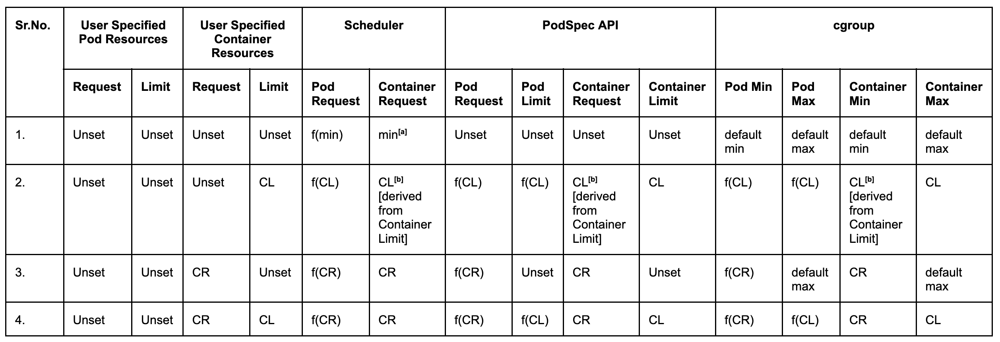
    
      * Row 1 Annotation [a]: When container-level requests and limits are not
        set, the scheduler uses the [default minimum values for CPU and memory
        requests](https://github.com/kubernetes/kubernetes/blob/005f184ab631e52195ed6d129969ff3914d51c98/pkg/scheduler/util/pod_resources.go#L32-L37).
        These minimum values are not applied to the PodSpec itself; they are
        solely used by the scheduler for scheduling decisions.
    
      * Row 2 Annotation [b]: For container level resources, if a request is not
        specified but a limit it set, the Pod Spec is modified to set the [request
        equal to limit](https://github.com/kubernetes/kubernetes/blob/005f184ab631e52195ed6d129969ff3914d51c98/pkg/apis/core/v1/defaults.go#L167-L228) for each container. This modified Pod spec is then used by
        the scheduler, and also for configuring cgroup settings.
  
  * **Rows 5 - 8**

    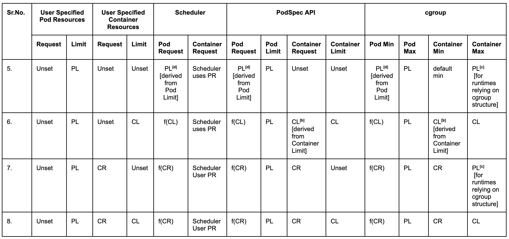
    
      * Row 5 Annotation [d]: When the pod-level request is not specified and
        cannot be inferred from the container-level request because
        container-level request is also unset, the pod-level request defaults to
        the limit. 

      * Row 7 Annotation [c]: When container-level limit is not set, the
        pod-level limit is applied to each container's cgroup maximum value. This
        is because container-level limit is implied in this case, and some
        runtimes (like the Java runtime) rely on container-level cgroup maximum
        values for fine tuning their components. This implied pod-level limit is
        not set in Pod spec.  

  * **Rows 9 - 12**

    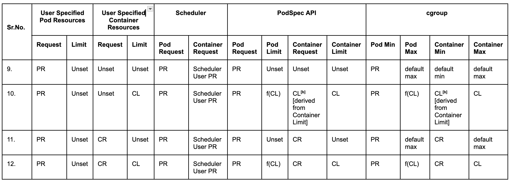

      * When the pod-level limit is unset, the value will be derived from
        container-level limits. If no pod-level limit is defined and not all the
        containers within the pod have explicitly limits set, then the containers
        in this pod will have access to an unknown amount of resources, up to the
        node allocatable capacity, but not less than their specified requests.

      * Row 10 Annotation [b]: For container level resources, if a request is not
        specified but a limit it set, the Pod Spec is modified to set the [request
        equal to limit](https://github.com/kubernetes/kubernetes/blob/005f184ab631e52195ed6d129969ff3914d51c98/pkg/apis/core/v1/defaults.go#L167-L228) for each container. This modified Pod spec is then used by
        the scheduler, and also for configuring cgroup settings.  

  * **Rows 13 - 16**

    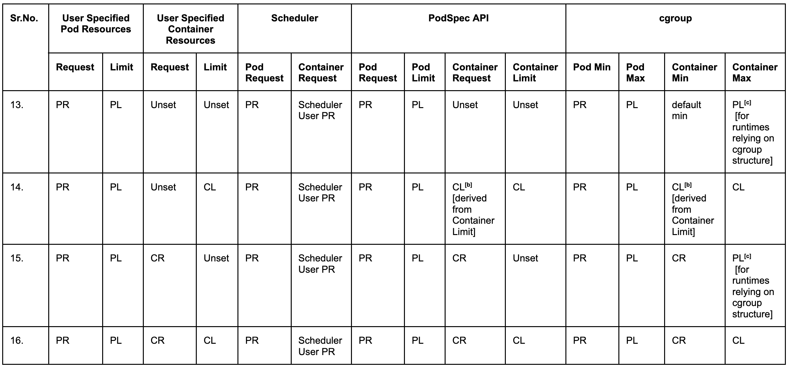

      * When both pod-level request and limit are explicitly specified,the scheduler and
        cgroups will use those values directly.
    
      * Rows 13, 15 Annotation [c]: When container-level limit is not set, the
        pod-level limit is applied to each container's cgroup maximum value. This
        is because container-level limit is implied in this case, and some
        runtimes (like the Java runtime) rely on container-level cgroup maximum
        values for fine tuning their components.
<br>

##### Clarifying Tricky Cases and Design Decisions with Pod Level Resources

1. Row 5 from the scenarios table: Pod Limits Defined; Pod
   Requests & Container Specs Unspecified.
   
   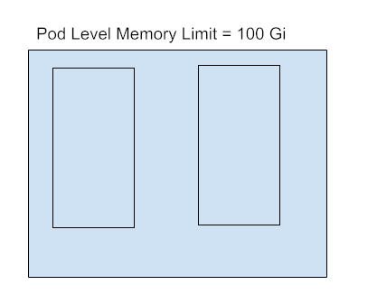

   * Since container-level requests are not specified for at least one container,
     pod-level request cannot be derived from container-level requests. 
   * As pod-level limit is set, pod-level request defaults to pod-level limit in
     Pod Spec.
   * For runtimes relying on cgroup structure, we set container-level limit equal
     to pod-level limit in cgroup configuration. These values are not set in Pod
     Spec.

2. Row 6 from the scenarios table: Pod Limits and Container
   Limits Defined, Pod Requests and Container Requests Unspecified.

   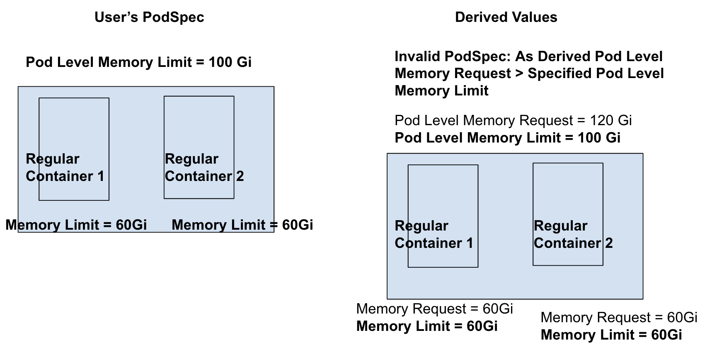

   * As container-level limits are specified, container-level requests default to
     container-level limits, which means Container-level Request = 60 Gi for each
     container.
   * Now as containers have requests, pod-level request can be derived from
     container-level requests using the formula from
     [KEP#753](https://github.com/kubernetes/enhancements/blob/master/keps/sig-node/753-sidecar-containers/README.md#resources-calculation-for-scheduling-and-pod-admission),
     which means Pod-level Request = 60 Gi + 60 Gi = 120 Gi.
   * Pod-Level Request of 120Gi > Pod-Level Limit of 100 Gi which makes this
     PodSpec invalid.

3. Row 7 from the scenarios table: Pod Limit is set; Container Requests are set for
   both regular containers.

   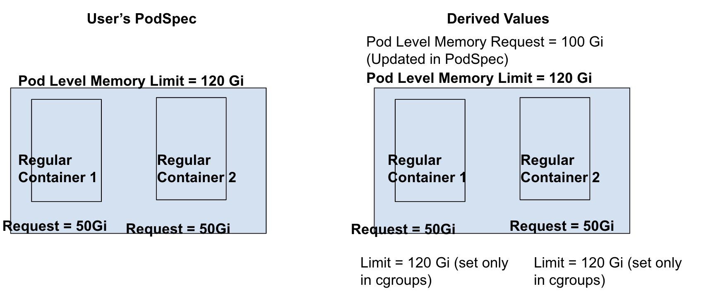

   * Since container-level requests are set, Kubernetes can
     determine the pod-level request using the formula from
     [KEP#753](https://github.com/kubernetes/enhancements/blob/master/keps/sig-node/753-sidecar-containers/README.md#resources-calculation-for-scheduling-and-pod-admission).
     As both containers in the pod are regular containers, the pod-level request
     will be calculated as sum of container level request which is equal to
     100Gi. This is set in Pod Spec.
    
   * Container-level limit will be set equal to pod-level limit only in cgroup
     settings (and not in PodSpec) for runtimes (or other softwares) relying on
     container-level cgroup values.
4. Pod-level Request is set, Pod-level limit is not set; Container-level Requests
   & Limits are not set.
    
   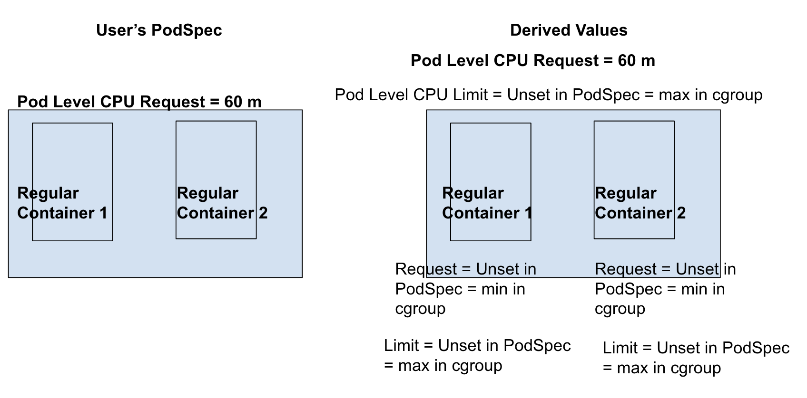

   * Since container-level limits are not set for all containers, Kubernetes
     cannot determine pod-level limit from container-level values.
   * As container-level limits are not set for all containers (only 1 container
     has limits specified) in this pod, there's no way to derive pod-level
     limits. Consequently, the containers in this pod will have access to an
     unknown amount of resources, up to the node allocatable capacity, but not
     less than the total specified pod requests which guarantees minimum
     resources for both containers. This is facilitated by setting memory.max=max
     in the pod-level cgroup.
    * As container-level requests and limits are not set, container level cgroup
      setting for cpu.weight defaults to 1 (minimum default weight) and cpu.max
      defaults to "max 100000" (maximum default value for cpu.weight).

5. Row 10 from scenaior table: Pod-level Request is set; Container-level limits
   are set for all containers.

   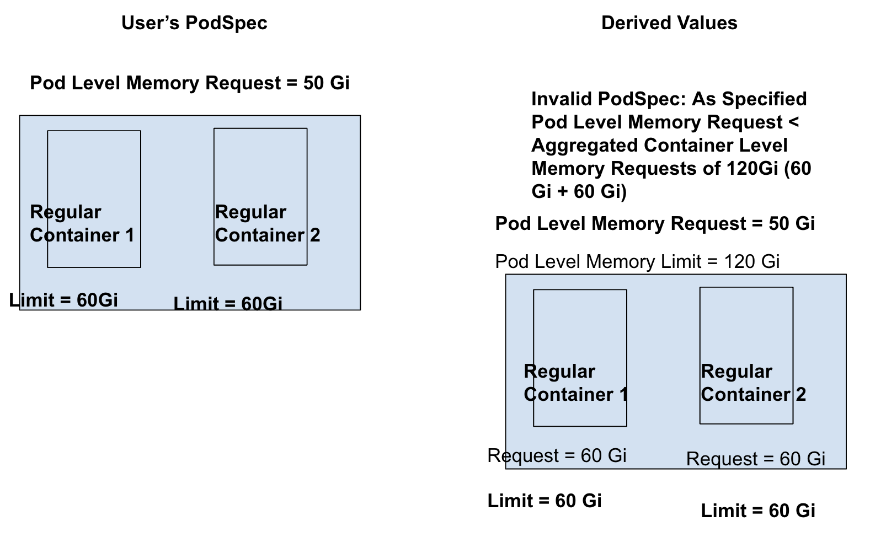
  
   * As container-level limits are specified, container-level requests default to
     container-level limits, which means Container-level Request = 60 Gi for each
     container.
   * Aggregated container-level requests = 60 Gi + 60 Gi = 120 Gi; Pod-level
     specified request is less than aggregated container-level requests which
     makes this pod invalid.  

6. Pod-level Limit is set; Container Requests & Limits are set for 1 regular container.
   
   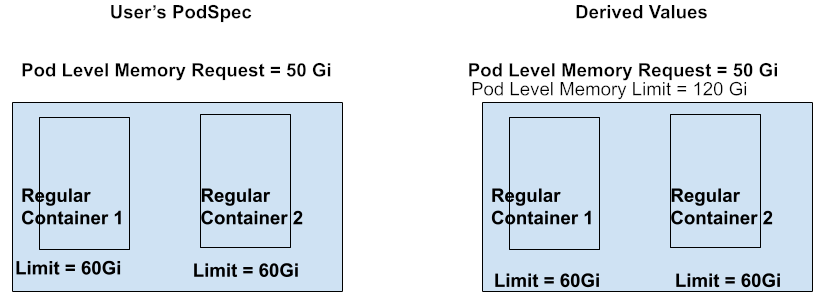
   
   * As container-level request is set for at least 1 container, pod-level
     requests can be derived from container-level requests, which makes pod-level
     request = 50 Gi.

   * Container-level limit for container 2 will be set equal to pod-level limit
     only in cgroup settings (and not in PodSpec) for runtimes (or other
     softwares) relying on container-level cgroup values.    

7. Pod-level request is set; Container level limits set for 1 container.

    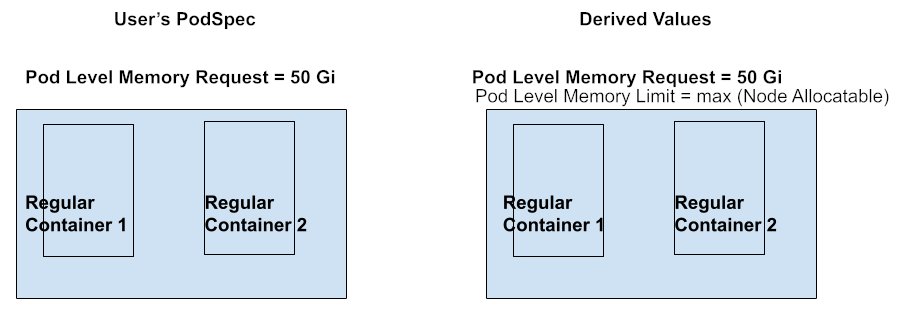

   * As container-level limits are not set for all containers (only 1 container
     has limits specified) in this pod, there's no way to derive pod-level
     limits. As a result, the containers in this pod will have access to an
     unknown amount of resources, up to the node allocatable capacity, but not
     less than their specified requests.

8. Pod-level request is set; Container-level spec is not set.  
   
   

    * As container-level limits are not set for all containers in this pod,
     there's no way to derive pod-level limits. As a result, the containers in
     this pod will have access to an unknown amount of resources, up to the node
     allocatable capacity, but not less than their specified requests.

9. Pod-level limit is set, Container-level request is set for all containers.
   
   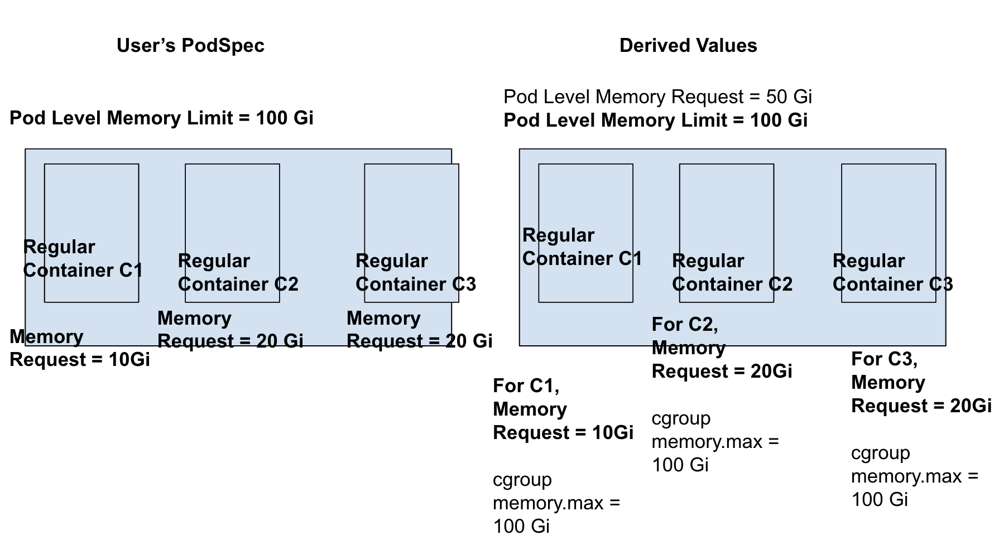
    
    * AS container-level request are set, pod-level request can be derived from
      formula in
      [KEP#753](https://github.com/kubernetes/enhancements/blob/master/keps/sig-node/753-sidecar-containers/README.md#resources-calculation-for-scheduling-and-pod-admission).
      So pod-level request is equal = 10 Gi + 20 Gi + 20 Gi = 50 Gi.
    * Container-level limit will be set equal to pod-level limit only in cgroup
     settings (and not in PodSpec) for runtimes (or other softwares) relying on
     container-level cgroup values.  


#### Scheduler Changes

The scheduler will determine pod resources requirements in the following ways:
1. Directly from Pod-Level Resources (pod.spec.resources)
   
   If the pod.spec.resources is defined, the scheduler will use the resource
   requests at the pod-level as the sole indicator of the pod's resource needs.
   This includes the combined resource requirements of all containers within the
   pod, including init containers, sidecar containers, and regular containers.

2. Indirectly from Container-level Resources
   
   If the pod.spec.resources is NOT defined, the scheduler will derive the pod's
   resource needs by aggregating the requests and limits of all containers (init,
   sidecar and regular containers) within the pod.

3. Both Pod-level and Container level
   
   If both pod-level and container-level resources are specified, the scheduler
   will prioritize the pod-level resources and ignore the container-level
   requests for node placement decisions.

Note: It is important to consider how this change will affect observability tools
(like kube-state-metrics) that monitor and report on Kubernetes' resource usage.
To ensure these tools work correctly with pod-level resource specifications,
these changes will be clearly documented to spread awareness around how these
tools need to be updated before this feature is enabled by default in Beta.

To further aid in this transition, the Sig Scheduling community is working on developing
PodRequests library function that these tools can use to accurately retrieve pod
resource requests, taking into account both pod-level and container-level
specifications. This effort is tracked in https://github.com/kubernetes/kubernetes/pull/124609

#### QoS Changes

With the addition of pod-level resource specifications, Kubernetes will
prioritize those values when determining the Quality of Service (QoS) for a pod.
Here's the order of preference:
1. Pod Level Resources: If the resources are specified at the pod level,
   Kubernetes will use those values to determine the QoS class.
2. Container Level Resources: If pod-level resources are not specified,
   Kubernetes will fallback to the resources defined at the container level for QoS
   classification.
  
Essentially, pod-level resource specifications, when present, take precedence
over container-level specifications in determining the QoS class of a pod.

For each core resource type (CPU, Memory), a pod may have pod-scoped resource
request and/or limit. Pods which have a defined request or limit for a given
resource are said to "have explicitly resourced" or "be explicitly resourced".
Pods which DO NOT have a defined request or limit for a given resource type are
said to "have implicit resources" or "be implicitly resourced"

* **Guaranteed QoS**

    A pod is considered `Guaranteed` if, for each resource type (CPU and memory),
    one of following conditions is true:
    * It is explicitly resourced for that resource type AND the the pod's request
     is equal to its limit.

    * [Unchanged Current Behavior] It is implicitly resourced for that resource 
    type AND all containers' requests are equal to their limits.


  **Note: If the pod spec includes `resources` stanza at pod level, but either
  requests or limits are missing for a resource, the pod will not be considered
  Guaranteed QoS, even if container-level requests and limits are present and are
  equal.**

* **Burstable QoS Criteria**

    A pod is considered `Burstable`, if for each resource type it doesn't meet
    the criteria for Guaranteed QoS for that resource, and either of following is
    true:

    * It is explicitly resourced (pod.spec.resources is set) for that resource,
      AND pod request (less than or equal to limit) or limit is set.
    * It is implicitly resourced for that resource AND for at least one container
      in the pod, request (less than or equal to limit) or limit is set. 
  

* **BestEffort QoS Criteria**

    None of pod-level or container-level resources requests or limits are specified.


#### OOM Killer Behavior

##### OOM Score Adjustment
Kubernetes uses oom_score_adj value to influence which processes are more likely
to be terminated by the OOM killer when a node faces memory constraints.

For Guaranteed and BestEffort pods, the oom_score_adj values remains unchanged.
They retain their constant values of -997 and 1000, respectively. Thus ensures
consistent behavior for these QoS classes, even with the introduction of pod-level
resource specifications.

Currently, the oom_score_adj calculation for containers in Burstable pods only
considers container-level memory requests:

$$ 
oomScoreAdjust = {1000 - \left[1000 \times
{memoryRequest \over memoryCapacity }\right ]}
$$

where:

* memoryRequest: Container-level memory request
* memoryCapacity: Node memory capacity

<br>

This approach creates issues with the introduction of pod level resources. If a
pod only has pod level memory request and no container-level requests, the
oom_score_adj will be high (~1000) for all the containers in the pod. This makes
the processes in these containers to be unfairly targeted by the OOM Killer, even
though the user has specified a pod-level request indicating a desire for some
level of memory guarantee. 

To address this, the KEP proposes a modified oom_score_adj formula for Burstable
pods that considers both pod-level and container level memory requests.

$$ 
oomScoreAdjust = {1000 - \left[1000 \times
{containerMemoryRequest + remainingPodMemRequestPerContainer \over memoryCapacity
}\right ]}
$$

where:

* containerMemoryRequest: Container-level memory request
* memoryCapacity: Node memory capacity
* remainingPodMemRequestPerContainer can be calculated as:

$$ 
remainingPodMemRequestPerContainer = {\left[PodRequest -
\sum(containerMemoryRequests) \right] \over no. of containers}
$$

Let's understand the reasoning behind the new formula with examples.
1. Consider the following pods. Let's assume the Node Memory Capacity is 1000 Gi.

    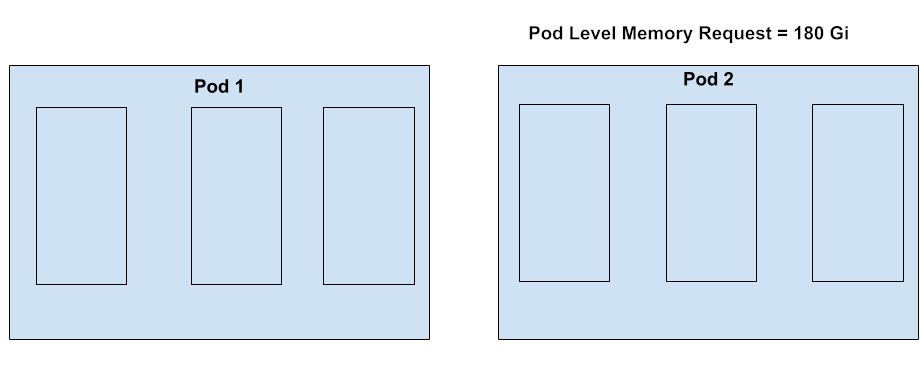

    * Using the existing formula, the oom_score_adj for all containers in both
      pods would be 1000.

      $oomScoreAdjust _{current\_formula} = 1000 - [1000 \times 0] / 1000 = 1000$

      |                 | **Pod 1** | **Pod 2** |
      |-----------------|-----------|-----------|       
      | **Container 1** |   1000    |   1000    |
      | **Container 2** |   1000    |   1000    |
      | **Container 3** |   1000    |   1000    |

      This is problematic because it means that the containers in Pod 2, despite
      having a pod-level memory request, are treated the same as containers in
      Pod 1, which have no memory requests at all. This is unfair to Pod 2, as
      the user has explicitly requested a certain amount of memory at pod level,
      indicating some level of memory guarantee.
    
    * The new formula addresses this issue by considering both pod-level and
      container-level memory requests.

      For Pod 2,

      $remainingPodMemRequestPerContainer = {\left[PodRequest -
  \sum(containerMemoryRequests) \right] \over no. of containers} = {[180 - 0] /
  3} = {60}$
      
      $oomScoreAdjust _{proposed\_formula} = {1000 - \left[1000 \times
  {containerMemoryRequest + remainingPodMemRequestPerContainer \over
  memoryCapacity }\right ]} = {1000 - [1000 \times {0 + 60 \over 1000}]} = 940$
       

      |                 | **Pod 1** | **Pod 2** |
      |-----------------|-----------|-----------|       
      | **Container 1** |   1000    |   940     |
      | **Container 2** |   1000    |   940     |
      | **Container 3** |   1000    |   940     |

    The new formula assigns a lower oom_score_adj to the containers in Pod 2 than
    the containers in Pod 1, making them less likely to be killed by the OOM
    killer. This is a fairer approach as it reflects user's intention to provide
    some level of memory guarantee to the pod.

2. Consider the following pods. Let's assume the Node Memory Capacity is 1000 Gi.
  
    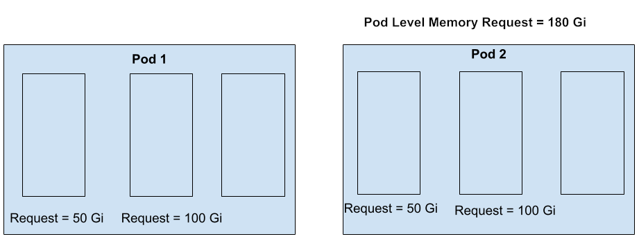

      * Using the existing formula, the oom_score_adj will be as following:
        
        For Container 1 in both pods,

        $oomScoreAdjust _{current\_formula} = 1000 - [1000 \times 50] / 1000 =
        950$
        
        For Container 2 in both pods,

        $oomScoreAdjust _{current\_formula} = 1000 - [1000 \times 100] / 1000 =
        900$
        
        For Container 3 in both pods,

        $oomScoreAdjust _{current\_formula} = 1000 - [1000 \times 0] / 1000 = 1000$

        |                 | **Pod 1** | **Pod 2** |
        |-----------------|-----------|-----------|       
        | **Container 1** |    950    |    950    |
        | **Container 2** |    900    |    900    |
        | **Container 3** |   1000    |   1000    |

        Container 3 in Pod 2 has same oom_score_adj as Container 3 in Pod 1, even
        though Pod 2 has a pod-level memory request indicating the user's desire
        for some level of memory guaratee. This is unfair to Container 3 in Pod 2.
      
      * The new formula addresses this issue by considering both pod-level and
        container-level memory requests.

        For Pod 2 Container 1,

        $remainingPodMemRequestPerContainer = {\left[PodRequest -
    \sum(containerMemoryRequests) \right] \over no. of containers} = {[180 - 150] /
    3} = {10}$
        
        $oomScoreAdjust  _{proposed\_formula} = {1000 - \left[1000 \times
    {containerMemoryRequest + remainingPodMemRequestPerContainer \over
    memoryCapacity }\right ]} = {1000 - [1000 \times {50 + 10 \over 1000}]} = 940$
    

        For Pod 2 Container 2,
   
        $oomScoreAdjust  _{proposed\_formula} = {1000 - \left[1000 \times
    {containerMemoryRequest + remainingPodMemRequestPerContainer \over
    memoryCapacity }\right ]} = {1000 - [1000 \times {100 + 10 \over 1000}]} = 890$
    

        For Pod 2 Container 3,
        
        $oomScoreAdjust  _{proposed\_formula} = {1000 - \left[1000 \times
    {containerMemoryRequest + remainingPodMemRequestPerContainer \over
    memoryCapacity }\right ]} = {1000 - [1000 \times {0 + 10 \over 1000}]} = 990$
    
        

        |                 | **Pod 1** | **Pod 2** |
        |-----------------|-----------|-----------|       
        | **Container 1** |   950     |   940     |
        | **Container 2** |   900     |   890     |
        | **Container 3** |   1000    |   990     |

    The new formula assigns lower oom_score_adj values to all containers in Pod 2
    than the containers in Pod 1, making them less likely to be killed compared
    to Pod 1. The reasoning behind this intent is to **reward the pods with
    explicit pod-level requests**.

    Also, this formula ensures that **containers with explicit requests** are
    prioritized over the containers with no requests set. In our example, within Pod 2, containers
    with explicit requests (Containers 1 & 2) have lower oom_score_adj values
    than Container 3 (no explicit request).
      

##### System Out-of-Memory (OOM) Kill

  When a node is under memory pressure, if the kernel is not able to reclaim
  memory, the kernel will trigger OOM Killer. The OOM Killer prioritizes killing
  the processes  with higher OOM scores. The new oom_score_adj formula, which
  considers both pod-level and container-level resources, helps the OOM Killer
  make fair and informed decisions about which processes to terminate.

##### cgroup Out-of-Memory (OOM) Kill 
  Previously, with only container-level resource limits, the cgroup OOM killer
  would be triggered if an individual container exceeded its own memory limit.
  Now, if only pod-level limits are specified, the cgroup OOM killer will be
  triggered when the combined memory usage of all the containers within a pod 
  exceeds the pod-level memory limit.

#### Init Containers & Sidecar Containers

The current implementation (before this KEP) calculates the total effective
resource requirements for a pod by aggregating the resource needs of Init
containers, Sidecar containers and Regular containers. The calculation is
detailed in the [Sidecar containers KEP]((KEP)[https://github.com/kubernetes/enhancements/blob/master/keps/sig-node/753-sidecar-containers/README.md#resources-calculation-for-scheduling-and-pod-admission])).

Note: This section doesn't factor in Pod Overhead when calculating pod level resource
needs. Pod Overhead is considered to be added independently from resources
specified in the Pod Spec by the kubelet.

With the addition of pod-level requests and limits, there are a few ways to
determine a pod's final resource allocation:

* **[Selected] Option 1: Pod Level Requests & Limits as an Override**

  With this option, the resource requests and limits the users sets at the pod
  level will directly determine the resource constraints applied to the pod's
  cgroup. This means the pod's overall resource usage, including all its
  containers, will be capped by the limits you define at the pod level, and the
  pod as a whole is guaranteed to receive at least the amount of resources
  requested at the pod level (minimum guarantees).
  
  For example, 
  ```yaml
  apiVersion: v1
  kind: Pod
  spec:
    resources:
      requests:
        memory: 100Mi
        cpu: 1
      limits:
        memory: 200Mi
        cpu: 2
    initContainers:
      - name: init-container
        image: busybox
        ...    
    containers:
      - name: container-1
        ...
      - name: container-2
        resources:
          requests:
            memory: 50Mi
            cpu: 1
  ```

  **Resources requests at pod-level**

  * The Scheduler will use the requested resources (CPU and memory) settings
    specified at the pod level to find a node with enough available resources. 
  * The Kubelet will use the CPU request at the pod-level resources to set 
    cpu.weight in pod-level cgroup.

  **Resources limits at pod-level**

  * All init(Regular and Sidecar) and non-init containers will be capped by the
    pod level limit which represents the combined peak usage of all containers.
  * Kubelet will use CPU and memory limits from PodSpec to set cpu.max and
    memory.max cgroup settings at pod-level respectively. 

  **Pros**

  * This approach is straightforward to understand and implement.
  * It ensures enough resources are available for all containers.
    within the pod, collectively
  
  **Cons**

  * This method can sometimes lead to potential over-provisioning (resource wastage),
    particularly when the init containers have significantly higher peak resource
    usage compared to the non-init containers. In this case, allocating resources
    based on the init container's needs can result in unnecessary resource
    allocation for the application containers. However this can be mitigated by
    setting container level resource spec for application containers.

    For example, if your init container needs 2 CPU cores and 512Mi of memory
    for a short burst during initialization, while your application container
    only requires 0.5 CPU cores and 256Mi of memory. You should set pod level
    requests and limits to 2 CPU and 512Mi of memory. Crucially, you could also
    set container level requests and limits for your app container (0.5 CPU and
    256Mi). This prevents the application container from using the extra
    resources allocated to the pod, making the resources available for other workloads.

* **[Rejected]Option 2: Phased requests/limits - Pod-level cgroups are set after init containers are completed.**

  This option proposes a more dynamic approach where pod-level cgroup settings
  are applied after the completion of init containers. This requires specifying
  resource requests and limits for init containers at container level if the peak
  resource requirement/usage of init containers is higher than those of non-init
  containers (sidecar & regular containers). The resources spec set at pod level 
  will account for all regular and sidecar containers (non-init containers).

For example,
  ```yaml
  apiVersion: v1
  kind: Pod
  spec:
    resources:
      requests:
        memory: 100Mi
        cpu: 2
      limits:
        memory: 200Mi
        cpu: 3
    initContainers:
    - name: init-myservice
      resources:
        requests:
          memory: 300Mi
          cpu: 4
        limits:
          memory: 600Mi
          cpu: 6
    containers:
    - name: container-1
      resources:
        requests:
          memory: 50Mi
          cpu: 1
        limits:
          memory: 100Mi
          cpu: 2
      - name: container-2
        resources:
          requests:
            memory: 50Mi
            cpu: 1
          limits:
            memory: 100Mi
            cpu: 2 
  ```

  **Resources requests at pod-level**

  * The scheduler will use the higher of init and pod-level requests values to find the suitable node.
    
    From the example above, the scheduler will use:

      max(init container resources requests, pod-level resources requests) 

        = max (memory: 300Mi cpu: 4, memory: 100 Mi cpu: 2)

        = (memory: 300 Mi, cpu: 4) to find a suitable node.

  * The init containers will rely on its own requests specified in the PodSpec. 
  * After the init containers complete, kubelet will use the pod-level request to
    set cpu.weight in pod-level cgroup settings. (Currently, Kubernetes doesn't
    directly map memory request to a specific cgroup settings) 

  **Resources limits at pod-level**

  * The init containers will rely on their own limits specified in the PodSpec.
  * After the init containers complete, kubelet uses CPU and memory limit at
    pod-level to set cpu.max and memory.max in the pod level cgroup.

  **Pros**

  * Reduces the problem of overprovisioning.

  **Cons**

  * Complicated to implement as it requires additional logic in kubelet to
    monitor init containers completion after which it will set/change pod level
    cgroup settings.
  * Determining the QoS class for a pod becomes complicated with this approach.
    With this option, the QoS classification would need to consider both the init
    container's requests and limits and the pod-level requests and limits. This
    could potentiall lead to a scenario where a pod's QoS class changes
    dynamically based on its execution phase (whether it's in initialization
    phase or in the phase after init containers are completed).
    
**Note: Option 1 is a *preferred* design option as it is easier to implement, and also easier to understand from UX perspective. 
If there are enough supporting use cases for Option 2, we can explore the implementation in the beta phase of the KEP. Option 2
will also require discussions about dynamic QoS classes as per the execution phase of the pod (init vs non-init phase).**

#### Ephemeral Containers

Currently, you can't set resource limits (like CPU or memory) directly for
ephemeral containers. They inherit the resource limits derived from the limits
defined for other containers (regular, sidecars and init) in a pod. This behavior
won't change as a part of this KEP. Ephemeral containers will be capped by
pod-level resource limits.

For further information on potential future changes, refer to the documentation
on "scoped-for-beta-in-place-pod-resize".

#### Admission Controller

* LimitRange

  LimitRange today supports objects of type `Container`, `Pod` and
  `PersistentVolumeClaim`. It allows following constraints:
  
    * min (this option is to specify min usage constraint on the resource)
    * max (this option is to specify max usage constraints on the resource)
    * defaultRequest (this option is to specify default resource request for the
      named resource)
    * default (this option is to specify default limit for the named resource)
    * maxLimitRequestRatio (represents the max burst value of the named resource)
  
  default and defaultRequest are not supported by LimitRanger of type `Pod`. To
  incorporate Pod level resource specifications, LimitRanger of type `Pod` logic
  will be extended with following changes:
  1. Validation at Pod Admission will use pod resources from `resources` stanza
     at pod level if it is set.
  2. Extend `Pod` type LimitRanger to support `defaultRequest` and `default` to
     allow setting Pod level defaults.

  Note: If there is an existing LimitRange of type Container in a namespace and a
  user creates a pod with pod-level resources only (without specifying
  container-level resources), Kubernetes will apply default container-level
  values based on the Container LimitRange. To avoid having the Container
  LimitRange applied to their workloads, the user should create pods in a
  different namespace where no Container LimitRange is set. 

* ResourceQuota

 The ResourceQuota admission plugin will prioritize using pod-level resources if
 they are specified. If not, it will rely on container-level resources to
 determine the effective resource requests and limits for the pod.

The ResourceQuota Controller obtains the PodSpec directly from the Kubernetes API
Server to monitor and track resource usage within a namespace. Therefore, if
pod-level resources are specified, the ResourceQuota will use these pod-level
resources from the PodSpec for both tracking and monitoring purposes.

#### Eviction Manager

For memory.available signal, the eviction manager checks the pod's memory usage
and compares it with memory requests at pod level to determine the pod eviction
order. It aggregates the container-level memory requests to calculate the
effective pod-level memory request. When pod-level memory requests are specified,
the Eviction Manager should use the pod-level request directly instead of
aggregating container-level requests. This logic should be modified to check if
pod-level requests are set. If so, use the pod-level request; otherwise, fall
back to aggregating container requests.


#### Pod Overhead

* Scheduling: The scheduler will consider the Pod Overhead in addition to
  pod-level resource requests (if specified) when selecting a node for the pod.
* Cgroup Sizing: The kubelet will include the Pod Overhead in determining the
  size of the pod's cgroup. This means the pod cgroup's resource limits will be
  set to accommodate both pod-level requests and pod overhead.

#### [Scoped for Beta] User Experience Survey

Before promoting the feature to Beta, we plan to conduct a UX survey to
understand user expectations for setting various combinations of requests and
limits at both the pod and container levels. This will help us gather use cases
for different combinations, enabling us to enhance the feature's usability.

#### [Scoped for Beta] Surfacing Pod Resource Requirements

##### The Challenge of Determining Effective Pod Resource Requirements

Calculating the actual resource requirements of a pod can be quite complex. This
is due to several factors:

* Derived Pod Resources: Without Pod-level resources, the Pod-level resource
  requirements are derived from container level specifications, involving a complex
  formula (as described in [KEP#753](https://github.com/kubernetes/enhancements/blob/master/keps/sig-node/753-sidecar-containers/README.md#resources-calculation-for-scheduling-and-pod-admission)) that considers init containers, sidecar containers, regular containers,
  and Pod Overhead. 

* Defaulting Logic: With Pod-level resources, Kubernetes will apply default
  values for resource requests and limits when they are not explicitly
  specified, further adding to the complexity of determining the final resource
  requirements. 

* In-Place Pod Updates: The ability to update the resource requirements without
  restarting the pod
  ([KEP#1287](https://github.com/kubernetes/enhancements/blob/master/keps/sig-node/1287-in-place-update-pod-resources/README.md))
  introduces another layer of complexity in calculating the effective resource
  requirements.
  
  This inherent complexity makes it difficult for users to accurately determine
  the total resources a pod needs. Various components, such as kube-scheduler,
  kubelet, autoscalers, etc, rely on accurate information about a pod's resource
  requirements to function correctly. Expecting users to perform these
  calculations to understand their pod's resource usage and plan their cluster
  capacity is unrealistic and cumbersome. 

  To address this, this KEP proposes adding a new field called `DesiredResources`
  to the Pod Status. This field will provide a clear and readily available
  representation of the total resource requirements for a pending or scheduled
  pod, simplifying resource understanding and capacity planning for users.

##### Goals of surfacing Pod Resource Requirements

* Allow Kubernetes users to quickly identify the effective resource requirements
  for a pending or scheduled pod directly via observing the pod status.
* Provide cluster autoscaler, karpenter etc with direct access resource
  requirement information of unavailable/unschedulable pods, enabling
  them to determine the necessary capacity and add nodes accordingly.
* Allow consuming the Pod Requested Resources via metrics:
  * Make sure kube_pod_resource_requests formula is up to date
  * Consider exposing Pod Requirements as a Pod state metric via
    https://github.com/kubernetes/kube-state-metrics/blob/main/docs/pod-metrics.md 
* Provide a well documented, reusable, exported function to be used to calculate
  the effective resource requirements for a v1.Pod struct.
* Eliminate duplication of the pod resource requirement calculation within
  `kubelet` and `kube-scheduler`.

Note: in order to support the [Downgrade strategy](#downgrade-strategy), scheduler
will ignore the presence of the `PodLevelResources` feature gate when calculating resources. This will
prevent overbooking of nodes when scheduler ignored sidecar when calculating resources
and scheduled too many Pods on the Node that had the `SidecarContainers` feature gate enabled.

##### Implementation Details

To effectively address the needs of both users and Kubernetes components that
rely on accurate pod resource information, the proposed implementation involves
two key changes:

1. Add a field, `DesiredResources` to `PodStatus` to represent the effective
resource requirements for the pod. This field allows users to inspect running and
pending pods to quickly determine their effective resource requirements. 

The field will be first populated by scheduler in the
[updatePod](https://github.com/kubernetes/kubernetes/blob/815e651f397a6f5691efb26b0d4f3bddb034668c/pkg/scheduler/schedule_one.go#L943)
method.

It will then be updated in
[generateAPIPodStatus](https://github.com/kubernetes/kubernetes/blob/a668924cb60901b413abc1fe7817bc7969167064/pkg/kubelet/kubelet_pods.go#L1459)
method.

```
// TotalResourcesRequested is the effective resource requirements for this pod, taking into consideration init containers, sidecars, containers and pod overhead.
// More info: https://kubernetes.io/docs/concepts/configuration/manage-resources-containers/  
// +optional  
DesiredResources ResourceRequirements `json:"desiredResources,omitempty" protobuf:"bytes,8,opt,name=desiredResources"`
```

2. Update the
[PodRequestsAndLimitsReuse](https://github.com/kubernetes/kubernetes/blob/dfc9bf0953360201618ad52308ccb34fd8076dff/pkg/api/v1/resource/helpers.go#L64)
function to support the new calculation and, if possible, re-use this
functionality the other places that pod resource requests are needed (e.g.
kube-scheduler, kubelet).  This ensures that components within Kubernetes have an
identical computation for effective resource requirements and will reduce
maintenance effort. Currently this function is only used for the metrics
`kube_pod_resource_request` and `kube_pod_resource_limit` that are exposed by
`kube-scheduler` which align with the values that will also now be reported on
the pod status.

A key advantage of having a well-defined, exported function for calculating pod
resource requirements is that it can be used by various Kubernetes ecosystem
components, even for pods that don't yet exist (pending pods). For example, an
autoscaler needs to know what the resource requirements will be for DaemonSet
pods when they are created to incorporate them into its calculations if it
supports scale to zero.

##### Notes for implementation

This change could be made in a phased manner:
* Refactor to use the `PodRequestsAndLimitsReuse` function in all situations
  where pod resource requests are needed.
* Add the new `DesiredResources` field on `PodStatus` and modify `kubelet` &
  `kube-scheduler` to update the field.

These two changes are independent of the sidecar and in-place resource update
KEPs.  The first change doesn’t present any user visible change, and if
implemented, will in a small way reduce the effort for both of those KEPs by
providing a single place to update the pod resource calculation.

#### [Scoped for Beta] HugeTLB cgroup

Note: This section includes only high level overview; Design details will be added in Beta stage.

To support pod-level resource specifications for hugepages, Kubernetes will need to adjust how it handles hugetlb cgroups. Unlike memory, where an unset limit 
means unlimited, an unset hugetlb limit is the same as setting it to 0.

With the proposed changes, hugepages-2Mi and hugepages-1Gi will be added to the pod-level resources section, alongside CPU and memory. The hugetlb cgroup for the
pod will then directly reflect the pod-level hugepage limits, rather than using an aggregated value from container limits. When scheduling, the scheduler will 
consider hugepage requests at the pod level to find nodes with enough available resources.


#### [Scoped for Beta] Topology Manager

Note: This section includes only high level overview; Design details will be added in Beta stage.


* (Tentative) Only pod level scope for topology alignment will be supported if pod level requests and limits are specified without container-level requests and limits.
* The pod level scope for topology aligntment will consider pod level requests and limits instead of container level aggregates.
* The hint providers will consider pod level requests and limits instead of container level aggregates.


#### [Scoped for Beta] Memory Manager

Note: This section includes only high level overview; Design details will be
added in Beta stage.

With the introduction of pod-level resource specifications, the Kubernetes Memory
Manager will evolve to track and enforce resource limits at both the pod and
container levels. It will need to aggregate memory usage across all containers
within a pod to calculate the pod's total memory consumption. The Memory Manager
will then enforce the pod-level limit as the hard cap for the entire pod's memory
usage, preventing it from exceeding the allocated amount.  While still
maintaining container-level limit enforcement, the Memory Manager will need to
coordinate with the Kubelet and eviction manager to make decisions about pod
eviction or individual container termination when the pod-level limit is
breached.


#### [Scoped for Beta] CPU Manager

Note: This section includes only high level overview; Design details will be
added in Beta stage.

With the introduction of pod-level resource specifications, the CPU manager in
Kubernetes will adapt to manage CPU requests and limits at the pod level rather
than solely at the container level. This change means that the CPU manager will
allocate and enforce CPU resources based on the total requirements of the entire
pod, allowing for more flexible and efficient CPU utilization across all
containers within a pod. The CPU manager will need to ensure that the aggregate
CPU usage of all containers in a pod does not exceed the pod-level limits.

#### [Scoped for Beta] In-Place Pod Resize

In-Place Pod resizing of resources is not supported in alpha stage of Pod-level
resources feature. **Users should avoid using in-place pod resizing if they are
utilizing pod-level resources.**

In version 1.33, the In-Place Pod resize functionality will be controlled by a
separate feature gate and introduced as an independent alpha feature. This is
necessary as it involves new fields in the PodStatus at the pod level.

Note for design & implementation: Previously, assigning resources to ephemeral
containers wasn't allowed because pod resource allocations were immutable. With
the introduction of in-place pod resizing, users will gain more flexibility:

* Adjust pod-level resources to accommodate the needs of ephemeral containers. This
allows for a more dynamic allocation of resources within the pod.
* Specify resource requests and limits directly for ephemeral containers. Kubernetes will
then automatically resize the pod to ensure sufficient resources are available
for both regular and ephemeral containers.

Currently, setting `resources` for ephemeral containers is disallowed as pod
resource allocations were immutable before In-Place Pod Resizing feature. With
in-place pod resize for pod-level resource allocation, users should be able to
either modify the pod-level resources to accommodate ephemeral containers or
supply resources at container-level for ephemeral containers and kubernetes will
resize the pod to accommodate the ephemeral containers.

#### [Scoped for Beta] VPA

TBD. Do not review for the alpha stage.

#### [Scoped for Beta] Cluster Autoscaler

Cluster Autoscaler won't work as expected with pod-level resources in alpha since
it relies on container-level values to be specified. If a user specifies only
pod-level resources, the CA will assume that the pod requires no resources since
container-level values are not set. As a result, the CA won't scale the number of
nodes to accommodate this pod. Meanwhile, the scheduler will evaluate the
pod-level resource requests but may be unable to find a suitable node to fit the
pod. Consequently, the pod will not be scheduled. While this behavior is
acceptable for the alpha implementation, it is anticipated that Cluster
Autoscaler support will be addressed in the Beta phase with pod resource
requirements surfaced in a helper library/function that autoscalers can use to
make autoscaling decisions.

#### [Scoped for Beta] Support for Windows

Pod-level resource specifications are a natural extension of Kubernetes' existing
resource management model. Although this new feature is expected to function with
Windows containers, careful testing and consideration are required due to
platform-specific differences. As the introduction of pod-level resources is a
major change in itself, full support for Windows will be addressed in future
stages, beyond the initial alpha release.

### Test Plan

[X] I/we understand the owners of the involved components may require updates to
existing tests to make this code solid enough prior to committing the changes
necessary to implement this enhancement.

#### Unit tests

This feature will touch multiple components. For alpha, unit tests coverage for following packages needs to be added:

* Scheduler logic will be updated to consider pod-level requests. Hence pkg/scheduler will require additional coverage.
* pkg/kubelet/cm will be updated to set pod-level cgroups using CPU requests and limits, and memory limits.
* pkg/apis/core/validation/types_test.go and pkg/apis/core/validation since new fields are added in PodSpec and also new validation rules are required for the new fields.
* pkg/kubeapiserver/admission for changes made in the admission logic for LimitRanger and ResourceQuota admission controllers.


#### e2e tests

Following scenarios need to be covered:

* Cgroup settings when pod-level resources are set.
* Validate scheduling and admission.
* Validate the containers with no limits set are throttled on CPU when CPU usage reaches Pod level CPU limits.
* Validate the containers with no limits set are OOMKilled when memory usage
  reaches Pod level memory limits.
* Test the correct values in TotalResourcesRequested.


### Graduation Criteria


#### Phase 1: Alpha (target 1.32)


* Feature is disabled by default. It is an opt-in feature which can be enabled by enabling the `PodLevelResources`
feature gate and by setting the new `resources` fields in PodSpec at Pod level.
* Support the basic functionality for scheduler to consider pod-level resource requests to find a suitable node.
* Support the basic functionality for kubelet to translate pod-level requests/limits to pod-level cgroup settings.
* Unit test coverage.
* E2E tests.
* Documentation mentioning high level design.


#### Phase 2:  Beta (target 1.33)


* User Feedback.
* Feature is disabled by default. It is an opt-in feature which can be enabled by setting the new fields in PodSpec.
* Support for all features that are scoped out of alpha phase in the KEP design.
* Unit test coverage for additional features supported in Beta.
* E2E tests for additional features supported in Beta.
* Documentation update and blog post to announce feature in beta phase.
* [Tentative] Benchmark tests for resource usage with and without pod level resources for bursty workloads.
  * Use kube_pod_container_resource_usage metric to check resource utilization.
* [TBD] In-place pod resize support either as a part of this KEP or a separate KEP/feature.

#### GA (stable)

* TBD


### Upgrade / Downgrade Strategy

##### Upgrade
API Server and Scheduler should be upgraded before the kubelet in that order. 

The existing workloads will not have any impact specifically because of pod-level resources feature
since they won't be using the new field `resources` in PodSpec at pod-level. 

##### Downgrade
Kubelet should be downgraded before Scheduler and API server. 

The existing workloads that don't use pod-level resources won't be affected by
the downgrade. The existing pods using the new feature will still have the old
pod-level cgroup settings which can lead to unpredictable resource allocation, and
potentially cause issues with resource limits and enforcements.
Hence it is recommended to drain the nodes and recreate the workloads with a
clean slate.

Downgrade Steps:

1. Disable the Feature Flag: Disabling the pod-level resource feature flag.
2. Cordon Nodes: Cordon all the nodes to prevent new pods from being scheduled.
3. Modify Workloads: This is the crucial step. Update your pod specifications to
   remove the pod-level resource fields and use container-level resources
   instead.
4. Drain Nodes: Now you can safely drain nodes one by one. The evicted pods, with
   their updated configurations, will be scheduled on other nodes.
5. Downgrade Kubelets.
6. Downgrade Scheduler. 
7. Downgrade API Server.
8. Uncordon nodes.

### Version Skew Strategy

Pod-level resource specification is an opt-in feature. For this feature to work
correctly, it must be enabled in all parts of the cluster (scheduler, API server,
kubelet). 

When the feature gate is disabled on control plane, but enabled on kubelet,
users will not be able to schedule Pods with the new `resources` field in the
`spec`.

When the feature gate is enabled on control plane, but disabled on kubelet, users
will be able to create the Pods with `resources` field, but kubelet will reject
those pods.

Therefore, all cluster nodes (controlplane and worker nodes), must be upgraded
before the user can deploy pods with the new `resources` field in the `spec`.

For users wanting to use this feature, it is user's responsibility to use the
correct version of kube-scheduler, kube-apiserver and kubelet otherwise the
feature will not work as expected.

## Production Readiness Review Questionnaire


### Feature Enablement and Rollback

<!--
This section must be completed when targeting alpha to a release.
-->

###### How can this feature be enabled / disabled in a live cluster?

<!--
Pick one of these and delete the rest.

Documentation is available on [feature gate lifecycle] and expectations, as
well as the [existing list] of feature gates.

[feature gate lifecycle]: https://git.k8s.io/community/contributors/devel/sig-architecture/feature-gates.md
[existing list]: https://kubernetes.io/docs/reference/command-line-tools-reference/feature-gates/
-->

- [X] Feature gate (also fill in values in `kep.yaml`)
  - Feature gate name: PodLevelResources
  - Components depending on the feature gate: kubelet, kube-apiserver, kube-scheduler
  - Will enabling / disabling the feature require downtime of the control
    plane? No. Once the feature is disabled, the control plane components reject
    the pods with pod-level resources.
  - Will enabling / disabling the feature require downtime or reprovisioning
    of a node? No. Once the feature is disabled, the kubelet rejects the pods with
    pod-level resources.

###### Does enabling the feature change any default behavior?

No. This feature is guarded by a feature gate, and requires setting Pod level
`resource` stanza explicitly. Existing default behavior does not change if the
feature is not used.

###### Can the feature be disabled once it has been enabled (i.e. can we roll back the enablement)?

Yes. Any new pods created after disabling the feature will not utilize the
pod-level resources feature. Disabling the feature will not affect existing pods
not using pod-level resources feature -- they will continue to function. 

* For pods that were created with pod-level resources, disabling the feature can
result in a discrepancy between how different components calculate resource usage
and the actual resource consumption of those workloads. For example, if a
ResourceQuota object exists in a namespace with pods that were using pod-level
resources, and then the feature is disabled, those existing pods will continue to
run. However, the ResourceQuota controller will revert to using container-level
resources instead of pod-level resources when calculating resource usage for
these pods. This may lead to a temporary mismatch until the pods are recreated or
the resource settings are updated.

* Another scenario arises if the feature is disabled after a series of deployments
have been admitted with only pod-level resources. In this case, the scheduler
will interpret these pods as having the minimum implementation-defined resource
requirements. As a result, these pods may be classified as BestEffort QoS pods,
which means they are considered to have the lowest priority for resource
allocation. Consequently, this classification could lead to scheduling issues, as
the pods may be placed on nodes that lack sufficient resources for them to run
effectively. This situation highlights the potential risks associated with
toggling the feature gate after deployments are already in place, as it can
affect pod scheduling and resource availability in the cluster.

To resolve this, users can delete the affected pods and recreate them.

###### What happens if we reenable the feature if it was previously rolled back?

If the feature is re-enabled after being previously disabled, any new pods will
again have access to the pod-level resources feature. 

Pods that were created but not yet started will be treated based on its resource
spec (pod-level when feature gate is enabled, and container-level when the gate
is disabled).

Pods that are already running with resources provisioned will continue running
with resources provisioned at the time of execution (whether it was pod-level or
container-level resources).

However, some components may calculate the resource usage of the pods based on
the resource spec (pod-level when feature gate is enabled, and container-level
when feature gata is disabled), and that may not necessarily match the actual
resources provisioned for the running pod.

To ensure consistent and intuitive resource calculations, it is advisable to
delete all pods when toggling the feature between enabling and disabling. This
will help eliminate discrepancies and ensure that all pods operate under the same
resource management scheme.

###### Are there any tests for feature enablement/disablement?

Yes, the tests will be added along with alpha implementation. 
* Validate that the users can set pod-level resources in the Pod spec only when
  the feature gate is enabled.
* Validate that scheduler considers pod level resources when the feature is enabled, and falls back to container level resources.
when the feature is disabled. 
* Validate the kubelet is using pod level resources in cgroup settings if the feature is enabled, and uses container level values
when feature is disabled.
* Confirm that the API server gracefully ignores the pod-level resource fields and reverts to the existing container-level 
resource aggregation logic when the feature gate is disabled.
* Confirm Limit Ranger uses defaultRequest and limit when feature is enabled, and errors out for these values when feature is disabled.

### Rollout, Upgrade and Rollback Planning

<!--
This section must be completed when targeting beta to a release.
-->

###### How can a rollout or rollback fail? Can it impact already running workloads?

<!--
Try to be as paranoid as possible - e.g., what if some components will restart
mid-rollout?

Be sure to consider highly-available clusters, where, for example,
feature flags will be enabled on some API servers and not others during the
rollout. Similarly, consider large clusters and how enablement/disablement
will rollout across nodes.
-->

Since the feature is opt-in feature and requires setting new fields in the PodSpec,
the rollouts won't likely fail because of this feature. For the new workloads
that want to use this feature, there could be unexpected interactions with
the existing features. This is why this feature will be rolled out in phases
to make sure all the cases and interaction with existing features are covered
before making it available in GA.

Rollbacks should be seamless if done after disabling the feature, and recreating 
the running workloads that use the feature.

###### What specific metrics should inform a rollback?

<!--
What signals should users be paying attention to when the feature is young
that might indicate a serious problem?
-->

Any unusual observations in the following metrics should signal rollback:

* `kube_pod_container_resource_requests`: This metric exposes the resource
  requests (CPU and memory) for each container within a pod. 
* `kube_pod_container_resource_limits`: This metric exposes the resource limits
  (CPU and memory) for each container within a pod. 
* `node_collector_evictions_total`: to check if a pod level resource setting is
  causing to evict more pods than normal.
* `started_pods_errors_total`: exposed by kubelet to check if large number of
  pods are failing unusually.
* `started_containers_errors_total`: exposed by kubelet to check if large number.
  of containers are failing unusually
* `scheduler_pending_pods`: Number of pending pods on `unschedulable` queue to
  see number of pods scheduler failed to schedule. 
* `scheduler_pod_scheduling_attempts`: Any spiked in number of attempts to schedule pods 
* `scheduler_schedule_attempts_total`: Number of attempts to schedule pods.

###### Were upgrade and rollback tested? Was the upgrade->downgrade->upgrade path tested?

<!--
Describe manual testing that was done and the outcomes.
Longer term, we may want to require automated upgrade/rollback tests, but we
are missing a bunch of machinery and tooling and can't do that now.
-->
It will be tested manually as a part of implementation and there will also
be automated tests to cover the scenarios.

###### Is the rollout accompanied by any deprecations and/or removals of features, APIs, fields of API types, flags, etc.?

No

### Monitoring Requirements

<!--
This section must be completed when targeting beta to a release.

For GA, this section is required: approvers should be able to confirm the
previous answers based on experience in the field.
-->

###### How can an operator determine if the feature is in use by workloads?

<!--
Ideally, this should be a metric. Operations against the Kubernetes API (e.g.,
checking if there are objects with field X set) may be a last resort. Avoid
logs or events for this purpose.
-->

This feature will be built into kubelet, API server and scheduler. In order to determine if the feature
is being used by the workloads, check the  `resources` field at pod level in the spec. There's no special
metric planned to track the usage of this feature at the moment.

###### How can someone using this feature know that it is working for their instance?

<!--
For instance, if this is a pod-related feature, it should be possible to determine if the feature is functioning properly
for each individual pod.
Pick one more of these and delete the rest.
Please describe all items visible to end users below with sufficient detail so that they can verify correct enablement
and operation of this feature.
Recall that end users cannot usually observe component logs or access metrics.
-->

- [X] Other Field
  - pod.status.spec.resources[x]
  - Inspect Cgroup Filesystem: cgroup fs for the pod will reflect the requests/limits at pod level in cpu.weight, cpu.max, memory.max cgroup files.


###### What are the reasonable SLOs (Service Level Objectives) for the enhancement?

<!--
This is your opportunity to define what "normal" quality of service looks like
for a feature.

It's impossible to provide comprehensive guidance, but at the very
high level (needs more precise definitions) those may be things like:
  - per-day percentage of API calls finishing with 5XX errors <= 1%
  - 99% percentile over day of absolute value from (job creation time minus expected
    job creation time) for cron job <= 10%
  - 99.9% of /health requests per day finish with 200 code

These goals will help you determine what you need to measure (SLIs) in the next
question.
-->
Measure the overall resource utilization of the cluster with and without pod-level resources to ensure that the feature
does not lead to significant over-provisioning or underutilization of resources.

###### What are the SLIs (Service Level Indicators) an operator can use to determine the health of the service?

<!--
Pick one more of these and delete the rest.
-->

- [X] Metrics
  - Metric name:
  - `apiserver_rejected_requests` will indicate any failures (`Bad Request` code=400) related to translation of new `resources` field in PodSpec. 
  - `schedule_attempts_total{result="error|unschedulable"}`
  - `node_collector_evictions_total`: to check if a pod level resource setting is causing to evict more pods than normal
  - `started_pods_errors_total`: exposed by kubelet to check if large number of pods are failing unusually
  - `started_containers_errors_total`: exposed by kubelet to check if large number of containers are failing unusually
  - Components exposing the metric: apiserver, kubelet, scheduler

###### Are there any missing metrics that would be useful to have to improve observability of this feature?

<!--
Describe the metrics themselves and the reasons why they weren't added (e.g., cost,
implementation difficulties, etc.).
-->
No 

### Dependencies

<!--
This section must be completed when targeting beta to a release.
-->

###### Does this feature depend on any specific services running in the cluster?

<!--
Think about both cluster-level services (e.g. metrics-server) as well
as node-level agents (e.g. specific version of CRI). Focus on external or
optional services that are needed. For example, if this feature depends on
a cloud provider API, or upon an external software-defined storage or network
control plane.

For each of these, fill in the following—thinking about running existing user workloads
and creating new ones, as well as about cluster-level services (e.g. DNS):
  - [Dependency name]
    - Usage description:
      - Impact of its outage on the feature:
      - Impact of its degraded performance or high-error rates on the feature:
-->
No.

### Scalability

<!--
For alpha, this section is encouraged: reviewers should consider these questions
and attempt to answer them.

For beta, this section is required: reviewers must answer these questions.

For GA, this section is required: approvers should be able to confirm the
previous answers based on experience in the field.
-->

###### Will enabling / using this feature result in any new API calls?

<!--
Describe them, providing:
  - API call type (e.g. PATCH pods)
  - estimated throughput
  - originating component(s) (e.g. Kubelet, Feature-X-controller)
Focusing mostly on:
  - components listing and/or watching resources they didn't before
  - API calls that may be triggered by changes of some Kubernetes resources
    (e.g. update of object X triggers new updates of object Y)
  - periodic API calls to reconcile state (e.g. periodic fetching state,
    heartbeats, leader election, etc.)
-->
No. It only modifies existing API request/response payloads.

###### Will enabling / using this feature result in introducing new API types?

<!--
Describe them, providing:
  - API type
  - Supported number of objects per cluster
  - Supported number of objects per namespace (for namespace-scoped objects)
-->
Yes, the PodSpec object will be modified to include new fields for pod level resources
specifications i.e. pod.spec.resources.requests and pod.spec.resources.limit.


###### Will enabling / using this feature result in any new calls to the cloud provider?

<!--
Describe them, providing:
  - Which API(s):
  - Estimated increase:
-->
No

###### Will enabling / using this feature result in increasing size or count of the existing API objects?

<!--
Describe them, providing:
  - API type(s):
  - Estimated increase in size: (e.g., new annotation of size 32B)
  - Estimated amount of new objects: (e.g., new Object X for every existing Pod)
-->
Negligible.

###### Will enabling / using this feature result in increasing time taken by any operations covered by existing SLIs/SLOs?

<!--
Look at the [existing SLIs/SLOs].

Think about adding additional work or introducing new steps in between
(e.g. need to do X to start a container), etc. Please describe the details.

[existing SLIs/SLOs]: https://git.k8s.io/community/sig-scalability/slos/slos.md#kubernetes-slisslos
-->

The computational overhead introduced in API server, scheduler and kubelet due to additional validation for pod level resource specifications should be negligible. Thorough testing and monitoring will ensure the SLIs/SLOs are not impacted.

###### Will enabling / using this feature result in non-negligible increase of resource usage (CPU, RAM, disk, IO, ...) in any components?

<!--
Things to keep in mind include: additional in-memory state, additional
non-trivial computations, excessive access to disks (including increased log
volume), significant amount of data sent and/or received over network, etc.
This through this both in small and large cases, again with respect to the
[supported limits].

[supported limits]: https://git.k8s.io/community//sig-scalability/configs-and-limits/thresholds.md
-->

No. Pod-level resource information could lead to marginal increase in storage requirements for the new fields, although
its impact is likely to be small compared to other Kubernetes object data.

###### Can enabling / using this feature result in resource exhaustion of some node resources (PIDs, sockets, inodes, etc.)?

<!--
Focus not just on happy cases, but primarily on more pathological cases
(e.g. probes taking a minute instead of milliseconds, failed pods consuming resources, etc.).
If any of the resources can be exhausted, how this is mitigated with the existing limits
(e.g. pods per node) or new limits added by this KEP?

Are there any tests that were run/should be run to understand performance characteristics better
and validate the declared limits?
-->
Yes, it could.

Pod-level resource limits can enable higher pod density on a node, especially when containers within a
pod don't have simultaneous peak resource usage. This is because pod-level limits can more accurately reflect
the pod's overall resource needs, reducing over-provisioning compared to using only container-level limits.
However, this increased density may also increase consumption of other resources like PIDs and network 
sockets. 

This is however be mitigated by `maxPods` kubelet configuration that limits the number of pods on a node.


### Troubleshooting

<!--
This section must be completed when targeting beta to a release.

For GA, this section is required: approvers should be able to confirm the
previous answers based on experience in the field.

The Troubleshooting section currently serves the `Playbook` role. We may consider
splitting it into a dedicated `Playbook` document (potentially with some monitoring
details). For now, we leave it here.
-->

###### How does this feature react if the API server and/or etcd is unavailable?

No dependency on etcd availability.

The scheduler relies on the API server to fetch pod specifications and node information.
Without access to the API server, it cannot make informed scheduling decisions based on
pod-level resource requests. This could lead to suboptimal placement.

###### What are other known failure modes?

<!--
For each of them, fill in the following information by copying the below template:
  - [Failure mode brief description]
    - Detection: How can it be detected via metrics? Stated another way:
      how can an operator troubleshoot without logging into a master or worker node?
    - Mitigations: What can be done to stop the bleeding, especially for already
      running user workloads?
    - Diagnostics: What are the useful log messages and their required logging
      levels that could help debug the issue?
      Not required until feature graduated to beta.
    - Testing: Are there any tests for failure mode? If not, describe why.
-->


###### What steps should be taken if SLOs are not being met to determine the problem?

It is suggested that if workloads with pod level resource specifications enabled cause performance 
or stability degradations, those workloads are recrated with only container level resource specs.

## Implementation History

- **2020-03-17:** Initial discussion in [SIG Node meeting] (https://www.youtube.com/watch?v=3cU56ZiUZ8w&list=PL69nYSiGNLP1wJPj5DYWXjiArF-MJ5fNG&index=101)
- **2020-03-30:** Initial [KEP draft](https://github.com/kubernetes/enhancements/pull/1592) and discussion.
- **2021-07-26:** Issue [link](https://github.com/kubernetes/enhancements/issues/2837)
- **2024-05-31:** Revised KEP for alpha (#4678)[https://github.com/kubernetes/enhancements/pull/4678]


## Drawbacks

<!--
Why should this KEP _not_ be implemented?
-->

## Alternatives

### VPA

This KEP focusses on addressing the challenge of accurately assessing the container-level resource usage. VPA could be used as an alternative
as it requires setting initial values for requests and limits, and then dynamically adjusts the values based on the actual usage. However,
setting the initial values at container level is still required.

Furthermore, VPA introduces a delay in resource adjustments, as it needs time to gather and analyze usage data. This delay can be problematic
for applications that experience sudden spike in resource usage demands. Additionally, there's always a risk that VPA's requested resource
adjustments might be denied due to limited cluster resources.


<!--
What other approaches did you consider, and why did you rule them out? These do
not need to be as detailed as the proposal, but should include enough
information to express the idea and why it was not acceptable.
-->
