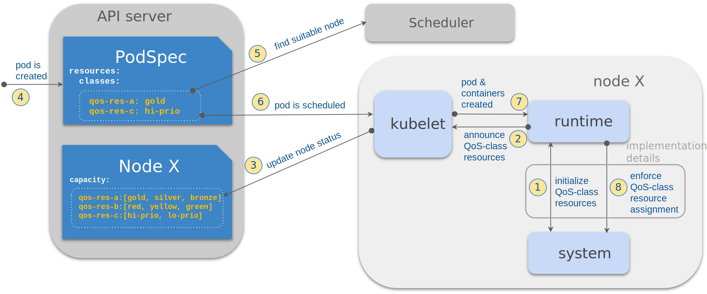

<!--
**Note:** When your KEP is complete, all of these comment blocks should be removed.

To get started with this template:

- [ ] **Pick a hosting SIG.**
  Make sure that the problem space is something the SIG is interested in taking
  up. KEPs should not be checked in without a sponsoring SIG.
- [ ] **Create an issue in kubernetes/enhancements**
  When filing an enhancement tracking issue, please make sure to complete all
  fields in that template. One of the fields asks for a link to the KEP. You
  can leave that blank until this KEP is filed, and then go back to the
  enhancement and add the link.
- [ ] **Make a copy of this template directory.**
  Copy this template into the owning SIG's directory and name it
  `NNNN-short-descriptive-title`, where `NNNN` is the issue number (with no
  leading-zero padding) assigned to your enhancement above.
- [ ] **Fill out as much of the kep.yaml file as you can.**
  At minimum, you should fill in the "Title", "Authors", "Owning-sig",
  "Status", and date-related fields.
- [ ] **Fill out this file as best you can.**
  At minimum, you should fill in the "Summary" and "Motivation" sections.
  These should be easy if you've preflighted the idea of the KEP with the
  appropriate SIG(s).
- [ ] **Create a PR for this KEP.**
  Assign it to people in the SIG who are sponsoring this process.
- [ ] **Merge early and iterate.**
  Avoid getting hung up on specific details and instead aim to get the goals of
  the KEP clarified and merged quickly. The best way to do this is to just
  start with the high-level sections and fill out details incrementally in
  subsequent PRs.

Just because a KEP is merged does not mean it is complete or approved. Any KEP
marked as `provisional` is a working document and subject to change. You can
denote sections that are under active debate as follows:

```
<<[UNRESOLVED optional short context or usernames ]>>
Stuff that is being argued.
<<[/UNRESOLVED]>>
```

When editing KEPS, aim for tightly-scoped, single-topic PRs to keep discussions
focused. If you disagree with what is already in a document, open a new PR
with suggested changes.

One KEP corresponds to one "feature" or "enhancement" for its whole lifecycle.
You do not need a new KEP to move from beta to GA, for example. If
new details emerge that belong in the KEP, edit the KEP. Once a feature has become
"implemented", major changes should get new KEPs.

The canonical place for the latest set of instructions (and the likely source
of this file) is [here](/keps/NNNN-kep-template/README.md).

**Note:** Any PRs to move a KEP to `implementable`, or significant changes once
it is marked `implementable`, must be approved by each of the KEP approvers.
If none of those approvers are still appropriate, then changes to that list
should be approved by the remaining approvers and/or the owning SIG (or
SIG Architecture for cross-cutting KEPs).
-->
# [KEP-3008](#3008): QoS-class resources

<!-- toc -->
- [Release Signoff Checklist](#release-signoff-checklist)
- [Summary](#summary)
- [Motivation](#motivation)
  - [Goals](#goals)
  - [Non-Goals](#non-goals)
- [Implementation phases](#implementation-phases)
  - [Phase 1](#phase-1)
  - [Future work](#future-work)
    - [In-place pod vertical scaling](#in-place-pod-vertical-scaling)
    - [Access control](#access-control)
    - [Scheduler improvements](#scheduler-improvements)
    - [Kubelet-initiated pod eviction](#kubelet-initiated-pod-eviction)
    - [Default and limits](#default-and-limits)
    - [Cluster autoscaler](#cluster-autoscaler)
    - [API objects for resources and classes](#api-objects-for-resources-and-classes)
- [Proposal](#proposal)
  - [User Stories (Optional)](#user-stories-optional)
    - [Mitigating noisy neighbors](#mitigating-noisy-neighbors)
    - [Vendor-specific QoS](#vendor-specific-qos)
    - [Defaults and limits](#defaults-and-limits)
    - [Set ulimits](#set-ulimits)
    - [Possible future scenarios](#possible-future-scenarios)
      - [Pass on Pod QoS class to the runtime](#pass-on-pod-qos-class-to-the-runtime)
      - [Kubernetes-managed QoS-class resources](#kubernetes-managed-qos-class-resources)
      - [Container-level memory QoS](#container-level-memory-qos)
      - [Runtime classes](#runtime-classes)
      - [Splitting Pod QoS Class](#splitting-pod-qos-class)
      - [Pod priority class](#pod-priority-class)
  - [Notes/Constraints/Caveats (Optional)](#notesconstraintscaveats-optional)
  - [Risks and Mitigations](#risks-and-mitigations)
- [Design Details](#design-details)
  - [CRI API](#cri-api)
    - [Implicit defaults](#implicit-defaults)
    - [ContainerConfig](#containerconfig)
    - [UpdateContainerResourcesRequest](#updatecontainerresourcesrequest)
    - [PodSandboxConfig](#podsandboxconfig)
    - [PodSandboxStatus](#podsandboxstatus)
    - [ContainerStatus](#containerstatus)
    - [RuntimeStatus](#runtimestatus)
  - [Kubernetes API](#kubernetes-api)
    - [PodSpec](#podspec)
    - [PodStatus](#podstatus)
    - [NodeStatus](#nodestatus)
    - [Consts](#consts)
  - [Kubelet](#kubelet)
  - [API server](#api-server)
  - [Scheduler](#scheduler)
  - [Kubectl](#kubectl)
  - [Container runtimes](#container-runtimes)
  - [Test Plan](#test-plan)
      - [Prerequisite testing updates](#prerequisite-testing-updates)
      - [Unit tests](#unit-tests)
      - [Integration tests](#integration-tests)
      - [e2e tests](#e2e-tests)
  - [Graduation Criteria](#graduation-criteria)
    - [Beta](#beta)
    - [GA](#ga)
  - [Upgrade / Downgrade Strategy](#upgrade--downgrade-strategy)
  - [Version Skew Strategy](#version-skew-strategy)
- [Production Readiness Review Questionnaire](#production-readiness-review-questionnaire)
  - [Feature Enablement and Rollback](#feature-enablement-and-rollback)
  - [Rollout, Upgrade and Rollback Planning](#rollout-upgrade-and-rollback-planning)
  - [Monitoring Requirements](#monitoring-requirements)
  - [Dependencies](#dependencies)
  - [Scalability](#scalability)
  - [Troubleshooting](#troubleshooting)
- [Implementation History](#implementation-history)
- [Drawbacks](#drawbacks)
- [Alternatives](#alternatives)
  - [Dynamic Resource Allocation (DRA)](#dynamic-resource-allocation-dra)
  - [Pod annotations](#pod-annotations)
    - [Kubelet](#kubelet-1)
    - [API server](#api-server-1)
  - [Class capacity with extended resources](#class-capacity-with-extended-resources)
  - [RDT-only](#rdt-only)
  - [Widen the scope](#widen-the-scope)
- [Infrastructure Needed (Optional)](#infrastructure-needed-optional)
<!-- /toc -->

## Release Signoff Checklist

<!--
**ACTION REQUIRED:** In order to merge code into a release, there must be an
issue in [kubernetes/enhancements] referencing this KEP and targeting a release
milestone **before the [Enhancement Freeze](https://git.k8s.io/sig-release/releases)
of the targeted release**.

For enhancements that make changes to code or processes/procedures in core
Kubernetes—i.e., [kubernetes/kubernetes], we require the following Release
Signoff checklist to be completed.

Check these off as they are completed for the Release Team to track. These
checklist items _must_ be updated for the enhancement to be released.
-->

Items marked with (R) are required *prior to targeting to a milestone / release*.

- [ ] (R) Enhancement issue in release milestone, which links to KEP dir in [kubernetes/enhancements] (not the initial KEP PR)
- [ ] (R) KEP approvers have approved the KEP status as `implementable`
- [ ] (R) Design details are appropriately documented
- [ ] (R) Test plan is in place, giving consideration to SIG Architecture and SIG Testing input (including test refactors)
  - [ ] e2e Tests for all Beta API Operations (endpoints)
  - [ ] (R) Ensure GA e2e tests meet requirements for [Conformance Tests](https://github.com/kubernetes/community/blob/master/contributors/devel/sig-architecture/conformance-tests.md)
  - [ ] (R) Minimum Two Week Window for GA e2e tests to prove flake free
- [ ] (R) Graduation criteria is in place
  - [ ] (R) [all GA Endpoints](https://github.com/kubernetes/community/pull/1806) must be hit by [Conformance Tests](https://github.com/kubernetes/community/blob/master/contributors/devel/sig-architecture/conformance-tests.md)
- [ ] (R) Production readiness review completed
- [ ] (R) Production readiness review approved
- [ ] "Implementation History" section is up-to-date for milestone
- [ ] User-facing documentation has been created in [kubernetes/website], for publication to [kubernetes.io]
- [ ] Supporting documentation—e.g., additional design documents, links to mailing list discussions/SIG meetings, relevant PRs/issues, release notes

<!--
**Note:** This checklist is iterative and should be reviewed and updated every time this enhancement is being considered for a milestone.
-->

[kubernetes.io]: https://kubernetes.io/
[kubernetes/enhancements]: https://git.k8s.io/enhancements
[kubernetes/kubernetes]: https://git.k8s.io/kubernetes
[kubernetes/website]: https://git.k8s.io/website

## Summary

Add support to Kubernetes for declaring _quality-of-service_ resources, and
assigning these to Pods. A quality-of-service (QoS-class) resource is similar
to other Kubernetes resource types (i.e. native resources such as `cpu` and
`memory` or extended resources) because you can assign that resource to a
particular container. However, QoS-class resources are also different from
those other resources because they are used to assign a _class identifier_,
rather than to declare a specific amount of capacity that is allocated.

Main characteristics of the new resource type (and the technologies they are
aimed at enabling) are:

- multiple containers can be assigned to the same class of a certain type of
  QoS-class resource
- classes are mutually exclusive - a given entity (pod or container) can only
  have one class assigned for each type of QoS-class resource resource
- QoS-class resources are represented by an enumerable set of class identifiers
- each type of QoS-class resource has an independent set of class identifiers

With QoS-class resources, Pods and their containers can request opaque
QoS-class identifiers (classes) of certain QoS mechanism (QoS-class resource
type). Kubelet relays this information to the container runtime, without
directing how the request is enforced in the underlying system. Being opaque to
Kubernetes means that QoS-class resources have to be supported by the container
runtime as it is responsible for the actual low-level management of them.

## Motivation

This enhancement proposal aims at improving the quality of service of
applications by making available a new type of resource control mechanism in
Kubernetes. Certain types of resources are inherently shared by applications,
e.g. cache, memory bandwidth and disk I/O. While there are technologies for
controlling how these resources are shared between applications, there is
currently no meaningful way to support these technologies in Kubernetes. This
proposal suggests to address the issue above in a generalized way by extending
the Kubernetes resource model with a new type of resources, i.e. QoS-class
resources.

This KEP identifies two technologies that can immediately be enabled with
QoS-class resources. However, these are just two examples and the proposed
changes are generic (and not tied to these two QoS-class resource types in any
way), making it easier to implement new QoS-class resource types. For example,
the [NRI API][nri-api] would be good mechanism to implement new QoS-class
resources.

[Intel RDT][intel-rdt] implements a class-based mechanism for controlling the
cache and memory bandwidth QoS of applications. All processes in the same
hardware class share a portion of cache lines and memory bandwidth. RDT
provides a way for mitigating noisy neighbors and fulfilling SLAs. In Linux
control happens via resctrl -- a pseudo-filesystem provided by the kernel which
makes it virtually agnostic of the hardware architecture. The OCI runtime-spec
has supported Intel RDT for a while already (see the
[OCI runtime-spec][oci-runtime-rdt]). Other hardware vendors have comparable
technologies which use the same [resctrl interface][linux-resctrl].

The Linux Block IO controller parameters depend very heavily on the underlying
hardware and system configuration (device naming/numbering, IO scheduler
configuration etc) which makes it very impractical to control from the Pod spec
level. In order to hide this complexity the concept of blockio classes has been
added to the container runtimes (CRI-O and containerd). A system administrator
is able to configure blockio controller parameters on per-class basis and the
classes are then made available for CRI clients. Following this model also
provides a possible framework for the future improvements, for instance
enabling class-based network or memory type prioritization of applications.

At the time of writing (May 2023), there is no mechanism in Kubernetes to use
these types of resources. CRI-O and containerd runtimes have support for RDT
and blockio classes, but rely on Pod annotations as the user interface, with an
inferred expectation that people set the equivalent nonstandard and private
annotations on a Kubernetes Pod. The goal of this KEP is to get these types of
resources first class citizens and properly supported in Kubernetes, providing
visibility, a well-defined user interface, and permission controls.

Two types of QoS-class resources are identified, container-level and pod-level
QoS-class resources. Container-level resources enable QoS on per-container
granularity, for example container-level cgroups in Linux or cache and memory
bandwidth control technologies. Examples for pod-level QoS include e.g.
pod-level cgroups or network QoS that cannot support per-container granularity.

### Goals

- Make it possible to request QoS-class resources from the PodSpec
  - Container-level QoS-class resources
  - Pod-level (sandbox-level) QoS-class resources
- Make it simple to implement new types QoS-class resource
- Make QoS-class resources opaque (as possible) to Kubernetes
- Support automatic discovery of the available QoS-class resources
- Support per-node status/capacity of QoS-class resources
- Access control ([future work](#future-work))
- Support updating QoS-class resource assignment of running containers
  ([future work](#in-place-pod-vertical-scaling))

### Non-Goals

- Interface or mechanism for configuring the QoS-class resources (responsibility of
  the container runtime).
- Specifying available (QoS-class) resource types or their detailed behavior
- API changes to support updating Pod-level (sandbox-level) QoS-class resource
  assignment of running pods (will be subject to a separate KEP)
- Per runtime class QoS (needs a separate KEP if this is desired, as it must
  cover other aspects than just QoS)

## Implementation phases

This proposal splits the full implementation of QoS-class resources into
multiple phases, building functionality gradually. The goal is to
make the discussions more focused and easier. We may also learn on the way,
insights from earlier phases affecting design choices made in the later phases,
hopefully resulting in a better overall end result. However, we also outline
all the future steps to not lose the overall big picture.

The figure below illustrates the design of implementation phase 1. The first
implementation phase covers the communication between kubelet and the container
runtime (i.e. CRI API) and Kubernetes API for NodeStatus and PodSpec and their
respecive implementations (kubelet and kube-scheduler). Access control (e.g.
resource quota) is left to future work. This KEP (the [Proposal](#proposal) and
[Design Details](#design-details)) in its current form implements this first
phase.



QoS-class resources are designed to be opaque to the CRI client in the sense
that the container runtime takes care of configuration and control of the
resources and the classes within.

### Phase 1

The goal is to enable a functional base for users to leverage QoS-class
resources and start experimenting with them in Kubernetes:

- extend the CRI protocol to allow QoS-class resource assignment and updates to
  be communicated from kubelet to the runtime
- extend the CRI protocol to allow runtime to communicate available QoS-class
  resources (the types of resources and the classes within) to kubelet
- introduce a feature gate for enabling QoS-class resource support in kubelet
- extend PodSpec to support assignment of QoS-class resources
- extend NodeStatus to show availability/capacity of QoS-class resources on a
  node

### Future work

This section sheds light on the end goal of this work in order to better
evaluate this KEP in a broader context. What a fully working solution would
consists of and what the (next) steps to accomplish that would be. These topics
are currently listed as "future work" in [Goals](#goals).

In practice, the future work mostly consists of changes to the Kubernetes API
and control plane components.

All the sub-sections below should be considered as `<<[UNRESOLVED]>>`.

#### In-place pod vertical scaling

Properly integrating QoS-class resources to
[In-place pod vertical scaling](#1287) will allow update of running containers.
However, some QoS-class resources may be immutable, meaning the in-place
updates are not possible.

#### Access control

This future step adds support for controlling the access to available QoS-class
resources.

Access control could be achieved e.g. by extending ResourceQuotaSpec which
would implement restrictions based on the namespace.

```diff
 // ResourceQuotaSpec defines the desired hard limits to enforce for Quota.
 type ResourceQuotaSpec struct {
     // hard is the set of desired hard limits for each named resource.
     Hard ResourceList
     // A collection of filters that must match each object tracked by a quota.
     // If not specified, the quota matches all objects.
     Scopes []ResourceQuotaScope 
     // scopeSelector is also a collection of filters like scopes that must match each
     // object tracked by a quota but expressed using ScopeSelectorOperator in combination
     // with possible values.
     ScopeSelector *ScopeSelector
+   // QOSResources contains the desired set of allowed QoS resources.
+   // +optional
+   QOSResources QOSResourceQuota
 }

+// QOSResourceQuota contains the allowed QoS resources.
+type QOSResourceQuota struct {
+       // Pod contains the allowed QoS resources for pods.
+       // +optional
+       Pod []AllowedQOSResource
+       // Container contains the allowed QoS resources for containers.
+       // +optional
+       Container []AllowedQOSResource
+}

+// AllowedQOSResource specifies access to one QoS resources type.
+type AllowedQOSResource struct {
+       // Name of the resource.
+       Name QOSResourceName
+       // Allowed classes.
+       Classes []AllowedQOSResourceClass
+}

+// AllowedQOSResourceClass specifies one allowed class of a QoS resource and
+// possible limits for its usage.
+type AllowedQOSResourceClass struct {
+       // Name of the class.
+       Name string
+       // Capacity is the hard limit for usage of the class.
+       // +optional
+       Capacity int64
+}

 // ResourceQuotaStatus defines the enforced hard limits and observed use.
 type ResourceQuotaStatus struct {
        ...
        // Used is the current observed total usage of the resource in the namespace
        // +optional
        Used ResourceList
+       // QOSResources contains the enforced set of available QoS resources.
+       // +optional
+       QOSResources QOSResourceQuota
+       // QOSResourcesUsage contains the observed usage of QoS resources in the namespace.
+       // +optional
+       QOSResourcesUsage QOSResourceQuota
 }
```

#### Scheduler improvements

The first implementation phase only adds basic filtering of nodes based on
QoS-class resources and node scoring is not altered. However, the relevant
scheduler plugins (e.g. NodeResourcesFit and NodeResourcesBalancedAllocation)
could be extended to do scoring based on the capacity (maximum number of
assignments to a class), availability (how much of that still is available,
i.e. capacity minus the current number of assignments) and usage (the current
number of assignments to a class) of QoS-class resources on the nodes.

#### Kubelet-initiated pod eviction

QoS-class resources available on a node are dynamic in the sense that they may
change over the lifetime of the node. E.g. re-configuration of the container
runtime may make new types of QoS-class resources available, properties of
existing resources may changes (e.g. the set of available classes or their
capacity) or some resources might be removed completely. It might be desirable
that kubelet could evict a running pod that request QoS-class resources that
are no more available on the node. This should be relatively straightforward to
implement as kubelet knows what QoS-class resources are available on the node
and also monitors all running pods.

#### Default and limits

LimitRanges is a way to specify per-container resource constraints. They might
have limited applicability also in the context of QoS-class resources. In
particular, LimitRanges could be used for specifying defaults for QoS-class
resources. An additional possible usage would be to set per-pod limits on the
usage of container-level QoS-class resources.

```diff
 // LimitRangeItem defines a min/max usage limit for any resource that matches on kind
 type LimitRangeItem struct {
@@ -5167,6 +5167,28 @@ type LimitRangeItem struct {
        // MaxLimitRequestRatio represents the max burst value for the named resource
        // +optional
        MaxLimitRequestRatio ResourceList
+       //  QOSResources specifies the limits for QoS resources.
+       QOSResources []LimitQOSResource
+}
+
+// LimitQOSResource specifies limits of one QoS resources type.
+type LimitQOSResource struct {
+       // Name of the resource.
+       Name QOSResourceName
+       // Default specifies the default class to be assigned.
+       // +optional
+       Default string
+       // Max usage of classes
+       // +optional
+       Max []QOSResourceClassLimit
+}
+
+// QOSResourceClassLimit specifies a limit for one class of a QoS resource.
+type QOSResourceClassLimit struct {
+       // Name of the class.
+       Name string
+       // Capacity is the limit for usage of the class.
+       Capacity int64
 }
```

`<<[UNRESOLVED @logicalhan]>>`

Use field name `Ceiling` instead `Capacity` in QOSResourceClassLimit.

`<<[/UNRESOLVED]>>`

Not supporting Max (i.e. only supporting Default) in LimitRanges could simplify
the API.

#### Cluster autoscaler

The cluster autoscaler support will be extended to support QoS-class resources.
The expectation would be that all nodes in a node group would have an identical
set of QoS-class resources (same resource types, same set of classes with the
same capacity for each).

The functionality will be comparable to extended resources. The cluster
autoscaler uses the Kubernetes scheduler framework for running simulations.
Scaling up node groups with one or more nodes works practically without any
changes as the Kubernetes scheduler handles QoS-class resources and the cluster
autoscaler can correctly run the simulation based on the QoS-class resources
available on the existing node(s) of the node group. However, to support
scaling of empty node groups needs to be worked on, implementing specific
mechanisms (e.g. annotations) for each infrastructure provider to inform the
autoscaler about the QoS-class resources available on node groups.

#### API objects for resources and classes

`<<[UNRESOLVED]>>`

There has been discussion that QoS-class resources and their classes could be
represented as separate Kubernetes API objects (say QOSResource and QOSClass).
These could serve as a second level of configuration what is made
available/visible/what can be registered on the cluster, in addition to the
runtime configuration. They could also be used to store documentation
(description) of different resources and their classes.

`<<[/UNRESOLVED]>>`

## Proposal

This section currently covers [implementation phase 1](#phase-1) (see
[implementation phases](#implementation-phases) for an outline of the complete
implementation).

We extend the CRI protocol to contain information about the QoS-class
resource assignment of containers and pods. Resource assignment requests will
be simple key-value pairs (*resource-type=class-name*)

We also extend the CRI protocol to support updates of QoS-class resource
assignment of running containers. We recognize that currently container
runtimes lack the capability to update either of the two types of QoS-class
resources we have identified (RDT and blockio). However, there is no technical
limitation in that and we are planning to implement update support for them
in the future.

We also extend the Kubernetes API to support the assignment of QoS-class
resources to applications via PodSpec, and to users and the kube-scheduler to
see availability of QoS-class resources on a per-node basis via NodeStatus.

Container runtime is expected to be aware of all resource types and the classes
within. The CRI protocol is extended to be able to communicate the available
QoS-class resources from the runtime to the client. This information includes:
- Available QoS-class resource types.
- Available classes within each resource type.
- Whether the resource type is immutable or if it supports in-place updates.
  In-place updates of resoures might not be possible because of runtime
  limitations or the underlying technology, for example.

QoS-class resources may be bounded in the way that the number of applications
that can be assigned to a specific class (of one QoS-class resource) on a node
can be limited. This limit is configurable on a per-class (and per-node)
basis. This can be used to e.g. limit access to a high-tier class.

Pod-level and container-level QoS-class resources are independent resource
types. However, specifying a container-level QoS-class resource something in
the pod-level request in PodSpec will be regarded by Kubernetes as a default
for all containers of the pod.

Currently we identify two types of container-level QoS-class resources (RDT and
blockio) but the API changes will be generic so that it will serve other
similar resources in the future. Currently there are no pod-level QoS-class
resources that would be enabled immediately after the new APIs are available
but we see usage scenarios for those in the future (communicating the pod QoS
class to the runtime and enabling pod-level cgroup controls for blockio,
network QoS).

We introduce a feature gate that enables Kubernetes components (kubelet,
kube-apiserver, kube-scheduler) to support QoS-class resources.

### User Stories (Optional)

#### Mitigating noisy neighbors

As a user I want to minimize the interference of other applications to my
main application by assigning it to a class with exclusive cache allocation. I
also want to boost it's local disk I/O priority over other containers within
the pod. At the same time, I want to make sure my low-priority, I/O-intensive
background task running in a side-car container does not disturb the main
application.

```yaml
apiVersion: v1
kind: Pod
metadata:
  name: qos-resource-example
spec:
  containers:
  - name: main-app
    image: my-app
    resources:
      qosResources:
      - name: rdt
        class: exclusive
      - name: blockio
        class: high-prio
  - name: sidecar
    image: my-sidecar
    resources:
      qosResources:
      - name: rdt
        class: limited
      - name: blockio
        class: throttled
  ...
```

#### Vendor-specific QoS

As a vendor I want to implement custom QoS controls as an extension of the
container runtime. I want my QoS control to be visible in the cluster and
integrated e.g. in the Kubernetes sheduler and not rely e.g. on Pod annotations
to communicate QoS requests. I will implement my QoS-class resources as an
[NRI API][nri-api] plugin.

#### Defaults and limits

As a cluster administrator I want to set control what is the default QoS of
applications. I also want to configure different defaults for certain
Kubernetes namespaces. In addition I want to limit access to high-priority QoS
on certain namespaces.

I set per-node defaults for in the node's system-level and runtime
configuration, outside Kubernetes.

I set per-namespace defaults using LimitRanges:

```yaml
apiVersion: v1
kind: LimitRange
metadata:
  name: qos-defaults
spec:
  limits:
  - type: Pod
    qosResources:
    - name: network
      default: slow
  - type: Container
    qosResources:
    - name: qos-foo
      default: low-prio
    - name: vendor.example/xyz-qos
      default: normal
```

I set per-namespace constraints on the overall usage of QoS-class resources:

```yaml
apiVersion: v1
kind: ResourceQuota
metadata:
  name: qos-constraints
spec:
  qosResources:
    pod:
      - name: network
        classes:
          - name: slow      # unlimited access
          - name: normal
            capacity: 2     # only two pods with this is allowed
          #- name: high     # class "high" is not allowed at all
    container:
      - name: qos-foo
        classes:
          - name: low-prio
          - name: normal-prioa
          #- name: high-prio    # high-prio is not allowed at all
      - name: vendor.example/xyz-qos
        classes:
          - name: low-prio
          - name: normal
          - name: high-prio
            capacity: 1     # high-prio is allowed but with very limited usage
```

#### Set ulimits

As a cluster administrator I want to enable per-application control of system
resource usage /such as maximum number of processes or open files) exposed as
ulimits/rlimits in a Linux/UNIX system. However, I don't want to give the users
full control of the exact numeric parameters but specify pre-defined classes of
limits for different workload profiles.

Currently, ulimits can be set via an
[NRI plugin](https://github.com/containerd/nri/tree/main/plugins/ulimit-adjuster)
but that relies on Pod annotations. Using QoS-class resources would give better
user interface and control to the cluster administrator.

#### Possible future scenarios

This section speculates on possible future uses of the QoS-class resources
mechanism.

##### Pass on Pod QoS class to the runtime

The [Pod QoS class][pod-qos-class] could be communicated to the container
runtime as a special Kubernetes-specific QoS-class resource.

Information about Pod QoS class is currently internal to kubelet and not
visible to the container runtime. However, container runtimes (CRI-O, at least)
are already depending on this information and currently determining it
indirectly by evaluating other CRI parameters.

This change would make the information about Pod QoS explicit and would allow
elimination of unreliable code paths in runtimes, for example.

Pod QoS class would not be advertised as one of the available QoS-class
resources in NodeStatus. Also, users would not be allowed to request it in the
PodSpec which would be enforced by admission checks in the api-server and
kubelet. In other words, this would be purely informational, aimed for the
container runtime.

```diff
+ // Kubernetes-managed QoS resources. These are only informational to the runtime
+ // and no CRI requests should fail because of these.
+const (
+       // QOSResourcePodQOS is the Kubernetes Pod Quality of Service Class.
+       // Possible values are "Guaranteed", "Burstable" and "BestEffort".
+       QOSResourcePodQOS = "pod-qos"
+)
```

##### Kubernetes-managed QoS-class resources

It would be possible to have QoS-class resources that would be managed by
Kubernetes/kubelet instead of the container runtime. If we specify and manage
official well-known QoS-class resource names in the API it would be possible to
specify Kubernetes-internal names that the container runtime would know to
ignore (or not try to manage itself). E.g. any non-namespaced QoS-class
resources (one without `<namespace>/` prefix in the name) would be treated as
Kubernetes-managed and ignored by the container runtime. See [Consts](#consts)
section below for details about QoS-class resource naming.

One possible usage-scenario would be pod-level cgroup controls, e.g. cgroup v2
memory knobs in linux (see
[KEP-2570: Support Memory QoS with cgroups v2][kep-2570].

QoS-class resources could be used to specify OOM kill behavior of individual
containers
(ref [PR for disabling group oom kill](https://github.com/kubernetes/kubernetes/pull/122813)).

Another possible usage could be to allow the user to explicitly specify the
desired Pod QoS class of the application (instead of implicitly deriving it
from the resource requests/limits).

##### Container-level memory QoS

Container runtimes could implement an admin-configurable support for memory
QoS, as an alternative to
[KEP-2570: Support Memory QoS with cgroups v2][kep-2570].

It would be easy to enable also for example `memory.swap.*` control knobs
available in Linux cgroups v2 to control swap-usage on a per-container basis.

##### Runtime classes

The QoS-class resources mechanism could be used to replace (or
re-implement) the current runtime classes.

One benefit of using a QoS-class resource to represent runtime classes would be
the "automatic" visibility to what runtime classes are available on each node.
E.g. adding a new runtime class on a node by re-configuration of the runtime
would be immediately reflected in the node status without any additional admin
tasks (like node labeling or manual creation of RuntimeClass objects).

##### Splitting Pod QoS Class

Currently the Pod QoS class is an implicit property of a Pod, tied to how the
resource requests and limits of its containers are specified. QoS-class
resources could make it possible for users to explicitly specify the Pod QoS
class in the Pod's `.spec`, making it possible e.g. to define a pod with a
container whose memory limit is higher than the requests, but that is treated
by the node as `Guaranteed`.

Taking this idea further, QoS-class resources could also make it possible to
split several properties implicit in the Pod QoS class (for example: eviction
behavior or OOM scoring) into separate properties. For example, in the case of
OOM scoring make it possible for the user to specify a burstable pod with low
OOM priority (low chance of being killed).

##### Pod priority class

One wild idea would be to implement pod priority class mechanism (or part of
it) as a QoS-class resource. This would be a
[Kubernetes-managed](#kubernetes-managed-qos-class-resources) pod-level
QoS-class resource. Likely benefits of using the QoS-class resources mechanism
would be to be able to set per-namespace defaults with LimitRanges and allow
permission-control to high-priority classes with ResourceQuotas.

### Notes/Constraints/Caveats (Optional)

The proposal only describes the details of implementation Phase 1 and some
parts like permission control are not covered. The
risk in this piecemeal approach is finding devil in the details, resulting in
inconsistent and/or crippled and/or cumbersome end result. However, the missing
parts are already outlined in [future work](#future-work) and there is aa lot
of experience in extending the API and understanding which sort of solutions
are functional and practical, mitigating the problem.

### Risks and Mitigations

<!--
What are the risks of this proposal, and how do we mitigate? Think broadly.
For example, consider both security and how this will impact the larger
Kubernetes ecosystem.

How will security be reviewed, and by whom?

How will UX be reviewed, and by whom?

Consider including folks who also work outside the SIG or subproject.
-->

The identified risks are mainly related to usability or unfriendly users
hogging all available high-priority QoS.

- User assigning container to “unauthorized” class, causing interference and
  access to unwanted set/amount of resources. This will be addressed in future
  KEP introducing permission controls.
- Cross-registering pod and container-level QoS-class resources: it would be
  possible to register a resource name as a pod-level resource on one node and
  as a container-level resource on one node. This would obviously be confusing
  for the user but also cause surprises in scheduling in some cases as
  container-level QoS-class resources may be specified in pod-level request
  field to denote pod-wide defaults for all containers within. This will be
  mitigated in the future with "official" resource names (we know which names
  are pod-level resources and which container-level) but there is still
  possibility to mix-up vendor-specific QoS-class resources, although the risk
  for this is relatively small (severe misconfiguration)
- A node can only serve a limited amount of users of high-priority QoS. This
  is mitigated by the Capacity attribute of classes, limiting the number of
  simultaneous users of a class. This information if per-node and it is
  determined by the system and/or runtime contiguration of the node, outside
  Kubernetes. It is the  responsibility of the node administrator to configure
  meaningful capacity limits for QoS-class resources that require it.
- User does not request any QoS but the runtime applies some defaults on the
  application, limiting service level. This is mitigated by user being able
  to see the effective assignments in Pod status.
- User accidentally specifies pod-level QoS-class resources for a container.
  For "official" well-known QoS-class resources (see [Consts](#consts)) this
  will be mitigated by admission check, rejecting the Pod. For vendor-specific
  QoS-class resources the Pod will stay in pending state, with Pod status
  indicating that no nodes are available with a message describing the detailed
  reason of unavailable container-level QoS-class resource type.
- User mistakenly specifies a container-level QoS-class resources as a
  pod-level request. This is not regarded as an error or misconfiguration
  but the request is regarded as a pod-wide default for all containers.
  However, an unintended consequence may be that some containers are run
  at on unintended QoS level or the pod becomes unschedulable because no nodes
  have enough capacity to satisfy a high-priority QoS-class for all containers.
  In the latter case the Pod stays in pending state with Pod status
  describing the details of insufficient QoS-class resources.

## Design Details

The detailed design presented here covers [implementation phase 1](#phase-1)
(see [implementation phases](#implementation-phases) for an outline of all
planned changes). Configuration and management of the QoS-class resources is
fully handled by the underlying container runtime and is invisible to kubelet.

Summary of the proposed design details:

- QoS resources are opaque (just names) to kubernetes, configuration and
  management of QoS resources is handled in the node (container runtime, kubelet)
  - no "system reserved" (or equivalent) exists (considered as configuration
    detail outside Kubernetes)
  - no overprovisioning (or auto-promotion to free classes) exists (considered
    as implementation detail of specific QoS-class resource, outside
    Kubernetes)
  - not requesting anything implies a "default" that is an implementation
    detail on the container runtime side
- Pod and container level QoS-class resources are separate concepts
  - Pod-level QoS-class resources are meant for sandbox-level QoS
  - Pod-level QoS-class resources cannot be specified in container resources field
  - container-level QoS-class resources are meant for per-container QoS
  - container-level QoS-class resources can be specified in pod-level request
    field (in PodSpec) in which case it is regarded as a default for all
    containers within that pod
  - resource names across pod and container level QoS-class resource names
    must be unique - i.e. the runtime cannot register a pod-level and
    container-level resource with the same name
- runtime advertises available QoS resources to kubelet
  - QoS resources are dynamic i.e. can change during the lifetime of the node
  - CRI [RuntimeStatus](#runtimestatus) message is used for carrying the information
- kubelet
  - updates NodeStatus based on the available QoS-class resources advertised by
    the runtimea
  - relays QoS-class resource requests from PodSpec to the runtime at pod
    startup via [ContainerConfig](#containerconfig) and
    [PodSandboxConfig](#podsandboxconfig) messages
  - updates Pod status to reflect the assignment of QoS-class resources, based
    on pod/container status reveived from the runtime
  - implements admission handler that validates the availability of QoS-class resources
  - pod eviction as a possible [future improvement](#kubelet-initiated-pod-eviction)
- scheduler
  - simple node filtering based on the availability of QoS-class resources in
    the first implementation phase (with possible
    [future improvements](#scheduler-improvements))
  - pod priority based eviction is in effect
- quota, limits and defaults are [future work](#future-work) items


### CRI API

The following additions to the CRI protocol are suggested.

#### Implicit defaults

Any defaults imposed by the runtime, i.e. for resources that the user didn't
request anything, must be reflected in the PodSandboxStatus and ContainerStatus
messages. This information (about implicit defaults) can change during the
lifetime of the Pod e.g. because of re-configuration of the runtime:

- new QoS resource types might be added in which case a Pod/Container is
  assigned to the default class of this new resource and this information must
  be reflected in PodSandboxStatus/ContainerStatus
- the default class of an existing QoS resource type might change and the
  Pod/Container migrated to this class and this information must be reflected
  in PodSandboxStatus/ContainerStatus

An empty value (empty string) denotes "system default" i.e. the runtime did not
enforce any QoS for this specific type of QoS-class resource.
For example Linux cgroup controls where "system default" would mean that the
runtime did not enforce any changes so they will be set to the default values
determined by the system configuration.

#### ContainerConfig

The `ContainerConfig` message will be supplemented with new `qos_resources`
field, providing per-container setting for QoS-class resources. This will be
used in `CreateContainerRequest` to communicate the container-level QoS-class
resource assignments to the runtime.

```diff
 message ContainerConfig {

 ...
     // Configuration specific to Linux containers.
     LinuxContainerConfig linux = 15;
     // Configuration specific to Windows containers.
     WindowsContainerConfig windows = 16;
+
+    // Configuration of QoS resources.
+    repeated ContainerQOSResource qos_resources = 17;
 }

+// ContainerQOSResource specifies the assignment of one QoS resource for a
+// container.
+message ContainerQOSResource {
+    // Name of the QoS resource.
+    string name = 1;
+    // Name of the class.
+    string class = 2;
+}
```

`<<[UNRESOLVED @haircommander @mrunalp]>>`

Instead of separate types (ContainerQOSResource ans PodQOSResource) use shared
type (say QOSResource) for assignment/status of both container and pod level
resources.

`<<[/UNRESOLVED]>>`

#### UpdateContainerResourcesRequest

Similar to `CreateContainerRequest`, the `UpdateContainerResourcesRequest`
message will extended to allow updating of QoS-class resource configuration of
a running container. Depending on runtime-level support of a particular
resource (and possibly the type of resource) in-place updates of running
containers might not be possible. Resource discovery (see
[Runtime status](#runtime-status)) has the capability to distinguish whether a
particular QoS-class resource supports in-place updates (the Mutable field in
QOSResourceInfo message). UpdateContainerResources must be atomic so the
runtime must fail early (before e.g. calling the OCI runtime to make any
changes to other resources) if an attempt to update an "immutable" QoS-class
resource is requested.

Note that neither of the existing QoS-class resource types (RDT or blockio)
support updates because of runtime limitations, yet.

```diff
 message UpdateContainerResourcesRequest {

 ...
     // resources to update or other options to use when updating the container.
     map<string, string> annotations = 4;
+    // Configuration of QoS resources.
+    // Note that UpdateContainerResourcesRequest must be atomic so that the
+    // runtime ensure that the requested update to QoS resources can be applied
+    // before e.g. updating other resources.
+    repeated ContainerQOSResource qos_resources = 5;
}
```

#### PodSandboxConfig

The `PodSandboxConfig` will be supplemented with a new `class_resources` field
that specifies the assignment of pod-level QoS-class resources. The intended
use for this would be to be able to communicate pod-level QoS-class resource
assignments at sandbox creation time (`RunPodSandboxRequest`).

```diff
 message PodSandboxConfig {
@@ -45,5 +45,14 @@ message PodSandboxConfig {
     LinuxPodSandboxConfig linux = 8;
     // Optional configurations specific to Windows hosts.
     WindowsPodSandboxConfig windows = 9;
+    // Configuration of QoS resources.
+    repeated PodQOSResource qos_resources = 10;
 }

+// PodQOSResource specifies the assignment of one QoS resource for a
+// pod.
+message PodQOSResource {
+    // Name of the QoS resource.
+    string name = 1;
+    // Name of the class.
+    string class = 2;
+}
```

#### PodSandboxStatus

The `PodSandboxStatus` message will be extended to report back assignment of
pod-level QoS-class resources. The runtime must report back assignment of all
supported QoS-class resources, also defaults for resources that the client
didn't request anythin (see [implicit defaults](#implicit-defaults))

```diff
@@ -545,6 +545,8 @@ message PodSandboxStatus {
     // runtime configuration used for this PodSandbox.
     string runtime_handler = 9;
+    // Assignment of QoS resources. The runtime must report back assignment
+    // of all available QoS resources on the node, also possible defaults for
+    // resources that the client didn't explicitly request.
+    repeated PodQOSResource qos_resources = 10;
 }

```

#### ContainerStatus

The `ContainerResources` message (part of `ContainerStatus`) will be extended
to report back QoS-class resource assignments of a container, similar to other
resources. The runtime must report back assignment of all supported QoS-class
resources, also defaults for resources that the client didn't request
explicitly (see [implicit defaults](#implicit-defaults))

```diff
@@ -1251,6 +1269,8 @@ message ContainerResources {
     LinuxContainerResources linux = 1;
     // Resource limits configuration specific to Windows container.
     WindowsContainerResources windows = 2;
+    // Assignment of QoS resources. The runtime must report back assignment
+    // of all available QoS resources on the node, also possible defaults for
+    // resources that the client didn't explicitly request.
+    repeated ContainerQOSResource qos_resources = 3;
```

#### RuntimeStatus

Extend the `RuntimeStatus` message with new `resources` field that is used to
communicate the available QoS-class resources from the runtime to the client.
This information is dynamic i.e. the available QoS-class resources (or their
properties like available classes or per-class capacity) may change over time,
e.g. after re-configuration of the runtime.

Names of the QoS-class resources must be unique, also across pod-level and
container-level resources. I.e. the same name must not be advertised as both a
pod-level and container-level resource.

```diff
 message RuntimeStatus {
     // List of current observed runtime conditions.
     repeated RuntimeCondition conditions = 1;
+    // Information about the discovered resources
+    ResourcesInfo resources = 2;
+}

+// ResourcesInfo contains information about the resources discovered by the
+// runtime.
+message ResourcesInfo {
+    // Pod-level QoS resources available.
+    repeated QOSResourceInfo pod_qos_resources = 1;
+    // Container-level QoS resources available.
+    repeated QOSResourceInfo container_qos_resources = 2;
+}

+// QOSResourceInfo contains information about one type of QoS resource.
+message QOSResourceInfo {
+    // Name of the QoS resources. Name must be unique, also across pod and
+    // container level QoS resources.
+    string Name = 1;
+    // Mutable is set to true if this resource supports in-place updates i.e.
+    // the class of a running container or sandbox can be changed.
+    bool Mutable = 2;
+    // List of classes of this QoS resource.
+    repeated QOSResourceClassInfo classes = 3;
+}

+// QOSResourceClassInfo contains information about one class of certain
+// QoS resource.
+message QOSResourceClassInfo {
+    // Name of the class
+    string name = 1;
+    // Capacity is the number of maximum allowed simultaneous assignments into this class
+    // Zero means "infinite" capacity i.e. the usage is not restricted.
+    uint64 capacity = 2;
 }
```

### Kubernetes API

The PodSpec will be extended to support assignment of pod-level and
container-level QoS-class devices. NodeStatus will be extended to include
information about the available QoS-class resources on a node.

#### PodSpec

We introduce a new field, QOSResources into the existing ResourceRequirements
struct. This will enable the assignment of QoS resources for containers.

```diff
 type ResourceRequirements struct {
        // Limits describes the maximum amount of compute resources allowed.
@@ -2195,6 +2198,10 @@ type ResourceRequirements struct {
        // +featureGate=DynamicResourceAllocation
        // +optional
        Claims []ResourceClaim
+       // QOSResources specifies the requested QoS resources.
+       // +optional
+       QOSResources []QOSResourceRequest
 }

+// QOSResourceName is the name of a QoS resource.
+type QOSResourceName string

+// QOSResourceRequest specifies a request for one QoS resource type.
+type QOSResourceRequest struct {
+       // Name of the QoS resource.
+       Name QOSResourceName
+       // Name of the class (inside the QoS resource type specified by Name field).
+       Class string
+}
```

Also, we add a Resources field to the PodSpec, to enable assignment of
pod-level QoS resources. We will re-use the existing ResourceRequirements type
but Limits and Requests and Claims must be left empty. QOSResources may be set
and they represent the Pod-level assignment of QoS-class resources,
corresponding the PodQOSResources message in PodSandboxConfig in the CRI
API.

```diff
 type PodSpec struct {
@@ -3062,6 +3069,10 @@ type PodSpec struct {
        ResourceClaims []PodResourceClaim
+       // QOSResources specifies the Pod-level requests of QoS resources.
+       // Container-level QoS resources may be specified in which case they
+       // are considered as a default for all containers within the Pod.
+       // +featureGate=QOSResources
+       // +optional
+       QOSResources []PodQOSResourceRequest
 }

+// PodQOSResourceRequest specifies a request for one QoS resource type for a
+// Pod.
+type PodQOSResourceRequest struct {
+       // Name of the QoS resource.
+       Name QOSResourceName
+       // Name of the class (inside the QoS resource type specified by Name field).
+       Class string
+}
```

There is an ongoing effort to add [Pod level resource limits][kep-2837] that
aims at adding a pod level `Resources`. However, we propose to add a distinct
QOSResources field (with a distinct PodQOSResourceRequest type) in the PodSpec
in order to decouple dependencies between types and fields.

As an example, a Pod requesting class "fast" of a (exemplary) pod-level QoS
resource named "network", with one container requesting class "gold" of
container-level QoS resource named "rdt":

```yaml
apiVersion: v1
kind: Pod
metadata:
  name: qos-resource-example
spec:
  qosResources:
  - name: network
    class: fast
  containers:
  - name: cnt
    image: nginx
    resources:
      qosResources:
      - name: rdt
        class: gold
```

#### PodStatus

PodStatus and ContainerStatus types are extended to include information of
QoS-class resource assignments. The main motivation for this change is to
communicate to the user "implicit defaults", i.e. report back what was assigned
for QoS-class resources for which nothing was requested (see
[implicit defaults](#implicit-defaults))

```diff
type PodStatus struct {
@@ -3534,6 +3537,10 @@ type PodStatus struct {
        // Status for any ephemeral containers that have run in this pod.
        // +optional
        EphemeralContainerStatuses []ContainerStatus
+
+       // QOSResources shows the assignment of pod-level QoS resources.
+       // +optional
+       QOSResources []PodQOSResourceRequest
 }
```

```diff
type ContainerStatus struct {
@@ -2437,6 +2437,9 @@ type ContainerStatus struct {
        Started     *bool
+
+       // QOSResources shows the assignment of QoS resources.
+       // +optional
+       QOSResources []QOSResourceRequest
 }
```

Status will re-use the PodQOSResourceRequest and QOSResourceRequest that are
specified as part of [PodSpec](#podspec) update.

#### NodeStatus

We extend NodeStatus to list available QoS-class resources on a node, This
consists of the list of the available QoS-class resource types and the classes
available within each of these resource types.

```diff
 type NodeStatus struct {
@@ -4444,6 +4482,11 @@ type NodeStatus struct {
        // Status of the config assigned to the node via the dynamic Kubelet config feature.
        Config *NodeConfigStatus
+       // QOSResources contains information about the QoS resources that are
+       // available on the node.
+       // +featureGate=QOSResources
+       // +optional
+       QOSResources QOSResourceStatus
 }

...

+// QOSResourceStatus describes QoS resources available on the node.
+type QOSResourceStatus struct {
+       // PodQOSResources contains the QoS resources that are available for pods
+       // to be assigned to.
+       PodQOSResources []QOSResourceInfo
+       // ContainerQOSResources contains the QoS resources that are available for
+       // containers to be assigned to.
+       ContainerQOSResources []QOSResourceInfo
+}

+// QOSResourceInfo contains information about one QoS resource type.
+type QOSResourceInfo struct {
+       // Name of the resource.
+       Name QOSResourceName
+       // Mutable is set to true if the resource supports in-place updates.
+       Mutable bool
+       // Classes available for assignment.
+       Classes []QOSResourceClassInfo
+}

+// QOSResourceClassInfo contains information about single class of one QoS
+// resource.
+type QOSResourceClassInfo struct {
+       // Name of the class.
+       Name string
+       // Capacity is the number of maximum allowed simultaneous assignments into this class
+       // Zero means "infinite" capacity i.e. the usage is not restricted
+       // +optional
+       Capacity int64
+}
```

A referential example Node with two container-level QoS-class resources and two
pod-level QoS-class resources:

```yaml
apiVersion: v1
kind: Node
...
status:
  qosResources:
    containerQoSResources:
    - name: blockio
      classes:
      - name: high-prio
        capacity: 4
      - name: throttled   # no capacity implies "unlimited"
    - name: vendor.example/foo-qos
      classes:
      - name: platinum
        capacity: 1
      - name: gold
        capacity: 3
      - name: silver
        capacity: 9
      - name: bronze    # no capacity implies "unlimited"
    podQoSResources:
    - name: network
      classes:
      - name: fast
        capacity: 2
      - name: normal
        capacity: 10
      - name: slow      # no capacity implies "unlimited"
    - name: vendo2.example/bar-qos
      classes:
      - name: cls-a
        capacity: 2
      - name: cls-b
        capacity: 2
      - name: default   # no capacity implies "unlimited"
```

#### Consts

We define standard well-known QoS-class resource types in the API. These are
considered as the canonical list of "official" QoS-class resource names. In
addition to the name the API documents the expected high-level behavior and
semantics of these canonical QoS-class resources to provide common standards
across different implementations.

`<<[UNRESOLVED @sftim]>>`

The canonical Kubernetes names for QoS-class resources come in two variants:

- The `k8s.io/` prefix is reserved for "official" well-known runtime-managed
  QoS resources.
- Non-namespaced (i.e. without a `<namespace>/` prefix) names are reserved for
  possible future
  [Kubernetes-managed QoS-class resources](#kubernetes-managed-qos-class-resources).
  Runtimes are not allowed to register QoS-class resources with `k8s.io/`
  prefix. Runtimes should treat any non-namespaced QoS-class resource with as
  ones managed by Kubernetes and consider assignments as informational-only.

Namespaced (or fully qualified) names outside `k8s.io/` like
`example.com/acme-qos` are not controlled and are meant for e.g. vendor or
application specific QoS implementations.

`<<[/UNRESOLVED]>>`

```diff
+const (
+       // QOSResourceRdt is the name of the QoS-class resource named IntelRDT
+       // in the OCI runtime spec and interfaced through the resctrlfs
+       // pseudp-filesystem in Linux. This is a container-level reosurce.
+       QOSResourceIntelRdt = "k8s.io/rdt"
+       // QOSResourceBlockio is the name of the blockio QoS-class resource.
+       // This is a container-level resource.
+       QOSResourceBlockio = "k8s.io/blockio"
+)
```

In later implementation phases (Beta) admission control (validation) is added to
reject requests for unknown QoS-class resources in the "official" namespaces
(unprefixed or `k8s.io/`). Also (in Beta), kubelet will reject the registration
of unknown QoS-class resources in the "official" namespaces (unprefixed or
`k8s.io/`). Custom/vendor-specific QoS-class resources will still be allowed
outside the "official" namespaces.

### Kubelet

Kubelet gets QoS-class resource assignment from the [PodSpec](#podspec) and
translates these into corresponding `QOSResources` data in the CRI API. This is
ContainerConfig message at container creation time (CreateContainerRequest) and
PodSandboxConfig at sandbox creation time (RunPodSandboxRequest). In practice,
there is no translation, just copying key-value pairs.

Kubelet will receive the information about available QoS-class resources (the
types of resources and their classes) from the runtime over the CRI API (new
Resources field in [RuntimeStatus](#runtimestatus) message). The kubelet
updates the new QOSResources field in [NodeStatus](#nodestatus) accordingly,
making QoS-class resources on the node visible to users and the kube-scheduler.
This information is dynamic, i.e. the available QoS-class resources (or their
properties) may change over time. QoS-class resource names must be unique, i.e.
kubelet will refuse to register pod-level and container-level QoS-class
resource with the same name.

Kubelet receives information about actual QoS-class resource assignment of pods
and containers from the runtime over the CRI API
([PodSandboxStatus](#podsandboxstatus) and [ContainerStatus](#containerstatus)
messages). Kubelet updates [PodStatus](#podstatus) accordingly. This is
especially to communicate defaults applied by the runtime back to the user
(see [implicit defaults](#implicit-defaults)). Note that this information may
change over the lifetime of the pod.

An admission handler is added into kubelet to validate the QoS-class resource
request against the resource availability on the node. Pod is rejected if
sufficient resources do not exist. This also applies to static pods.

Invalid class assignments will cause an error in the container runtime which
causes the corresponding CRI RuntimeService request (e.g.  RunPodSandbox or
CreateContainer) to fail with an error. This can happen, despite the admission
check, e.g. when the requested QoS-class resource is not available on the
runtime (e.g. kubelet sends the pod or container start request before getting
an update of changed QoS-class resource availability from the runtime).

No kubelet-initiated pod eviction is implemented in the first implementation
phase.

A feature gate QOSResources enables kubelet to update the QoS-class resources
in NodeStatus and handle QoS-class resource requests in the PodSpec.

`<<[UNRESOLVED @logicalhan]>>`

Use feature gate name `PrioritizedResources` instead of `QOSResources`. If when
changed, needs to sync with all of the naming in the KEP.

`<<[/UNRESOLVED]>>`

### API server

Input validation of QoS-class resource names and class names is implemented.
They must be "qualified Kubernetes names", i.e. a name part optionally prefixed
by a DNS subdomain (and a slash). The name part must be non-empty less than 64
characters long, must start and end with an alphanumeric character and may
contain only alphanumeric characters, dashes, underscores or dots (`-`,
`_` or `.`). The optional DNS subdomain part must not be moore than 253
characters long, must start and end with an alphanumeric character and may only
contain lowercase alphanumeric characters, dashes (`-`) and dots (`.`).

Official canonical names for well-known QoS-class resources are specified in
the API. In later implementation phases admission (validation) for their usage
is implemented (see [Consts](#consts) for more details).

### Scheduler

The kube-scheduler will be extended to do node pre-filtering based on the
QoS-class resource requests of a Pod. If any of the requested QoS-class
resources are unavailable on a node, that node is not fit. If no nodes can
satisfy all of the requests the Pod is marked as unschedulable and will be
scheduled in the future when/if requests can be satisfied by some node.

In principle, scheduling will behave similarly to native and extended
resources. The kube-scheduler will also take in account the per-class capacity
on the nodes if that is provided. No QoS-class specific scoring is added in the
the first implementation phase, thus all nodes satisfying the requests are
equally good (in terms of QoS-class resources). More diverese scheduling is
part of the [future work](#future-work).

Pod eviction based on pod priority works similarly to other other resources:
lower priority pod(s) are evicted if deleting them makes a higher priority pod
schedulable (in this case by freeing up QoS-class resources).

### Kubectl

The kubectl describe command will be extended to:

- available QoS-class resources of nodes
- display QoS-class resource requests of pods

For example, regarding available QoS-class resources on a node, `kubectl
describe node` could show output something like this:

```
...
Pod QoS resources:
  Name      Classes (capacity)
  ----      ------------------
  net       slow(inf)    normal (8)  fast (2)
  qoz-xyz   cls-1 (inf)  cls-2 (1)   cls-3 (5)  cls-4 (10)

Container QoS resources:
  Name     Mutable  Classes (capacity)
  ----     -------  ------------------
  blockio  No       low-prio (inf)   normal (10)   high-prio (3)
  rdt      No       bronze (inf)     gold (1)      silver (2)
...
```

### Container runtimes

There is support (container-level QoS-class resources) for Intel RDT
and blockio in CRI-O ([~~#4830~~](https://github.com/cri-o/cri-o/pull/4830),
[~~#4873~~](https://github.com/cri-o/cri-o/pull/4873)) and containerd
([~~#5439~~](https://github.com/containerd/containerd/pull/5439),
[~~#5490~~](https://github.com/containerd/containerd/pull/5490)) runtimes.
The current user interface is provided through pod and container annotations.
The plan is to start using QoS-class resources instead of annotations.

The plan is also to extend the [NRI API][nri-api]
(Node Resource Interface) to support QoS-class resources, allowing for example
the implementation of new types of QoS-class resources as NRI plugins.

Container runtimes will be updated to support the
[CRI API extensions](#cri-api)

### Test Plan

<!--
**Note:** *Not required until targeted at a release.*
The goal is to ensure that we don't accept enhancements with inadequate testing.

All code is expected to have adequate tests (eventually with coverage
expectations). Please adhere to the [Kubernetes testing guidelines][testing-guidelines]
when drafting this test plan.

[testing-guidelines]: https://git.k8s.io/community/contributors/devel/sig-testing/testing.md
-->

[x] I/we understand the owners of the involved components may require updates to
existing tests to make this code solid enough prior to committing the changes necessary
to implement this enhancement.

##### Prerequisite testing updates

<!--
Based on reviewers feedback describe what additional tests need to be added prior
implementing this enhancement to ensure the enhancements have also solid foundations.
-->

No prerequisites have been identified.

##### Unit tests

<!--
In principle every added code should have complete unit test coverage, so providing
the exact set of tests will not bring additional value.
However, if complete unit test coverage is not possible, explain the reason of it
together with explanation why this is acceptable.
-->

<!--
Additionally, for Alpha try to enumerate the core package you will be touching
to implement this enhancement and provide the current unit coverage for those
in the form of:
- <package>: <date> - <current test coverage>
The data can be easily read from:
https://testgrid.k8s.io/sig-testing-canaries#ci-kubernetes-coverage-unit

This can inform certain test coverage improvements that we want to do before
extending the production code to implement this enhancement.
-->

- `k8s.io/kubernetes/pkg/kubelet/kuberuntime`: `2023-06-16` - `66.§%`
- `k8s.io/kubernetes/pkg/apis/core/validation`: `2023-06-16` - `83.5%`
- `k8s.io/kubernetes/pkg/scheduler/framework`: `2023-06-16` - `77.9%`

##### Integration tests

<!--
This question should be filled when targeting a release.
For Alpha, describe what tests will be added to ensure proper quality of the enhancement.

For Beta and GA, add links to added tests together with links to k8s-triage for those tests:
https://storage.googleapis.com/k8s-triage/index.html
-->

Alpha: Existing integration tests for kubelet and kube-scheduler will be
extended to cover QoS-class resources.

Beta: Existing integration tests for affected components (e.g. scheduler, node
status, quota) are extended to cover QoS-class resources.

> NOTE: having a mock implementation of CRI server would be helpful in writing
> integration tests for kubelet.

- <test>: <link to test coverage>

##### e2e tests

<!--
This question should be filled when targeting a release.
For Alpha, describe what tests will be added to ensure proper quality of the enhancement.

For Beta and GA, add links to added tests together with links to k8s-triage for those tests:
https://storage.googleapis.com/k8s-triage/index.html

We expect no non-infra related flakes in the last month as a GA graduation criteria.
-->

Alpha: no specific e2e-tests are planned.

In order to be able to run e2e tests, a cluster with nodes having runtime
support for QoS-class resources is required.

### Graduation Criteria

<!--
**Note:** *Not required until targeted at a release.*

Define graduation milestones.

These may be defined in terms of API maturity, [feature gate] graduations, or as
something else. The KEP should keep this high-level with a focus on what
signals will be looked at to determine graduation.

Consider the following in developing the graduation criteria for this enhancement:
- [Maturity levels (`alpha`, `beta`, `stable`)][maturity-levels]
- [Feature gate][feature gate] lifecycle
- [Deprecation policy][deprecation-policy]

Clearly define what graduation means by either linking to the [API doc
definition](https://kubernetes.io/docs/concepts/overview/kubernetes-api/#api-versioning)
or by redefining what graduation means.

In general we try to use the same stages (alpha, beta, GA), regardless of how the
functionality is accessed.

[feature gate]: https://git.k8s.io/community/contributors/devel/sig-architecture/feature-gates.md
[maturity-levels]: https://git.k8s.io/community/contributors/devel/sig-architecture/api_changes.md#alpha-beta-and-stable-versions
[deprecation-policy]: https://kubernetes.io/docs/reference/using-api/deprecation-policy/

Below are some examples to consider, in addition to the aforementioned [maturity levels][maturity-levels].

#### Alpha

- Feature implemented behind a feature flag
- Initial e2e tests completed and enabled

#### Beta

- Gather feedback from developers and surveys
- Complete features A, B, C
- Additional tests are in Testgrid and linked in KEP

#### GA

- N examples of real-world usage
- N installs
- More rigorous forms of testing—e.g., downgrade tests and scalability tests
- Allowing time for feedback

**Note:** Generally we also wait at least two releases between beta and
GA/stable, because there's no opportunity for user feedback, or even bug reports,
in back-to-back releases.

**For non-optional features moving to GA, the graduation criteria must include
[conformance tests].**

[conformance tests]: https://git.k8s.io/community/contributors/devel/sig-architecture/conformance-tests.md

#### Deprecation

- Announce deprecation and support policy of the existing flag
- Two versions passed since introducing the functionality that deprecates the flag (to address version skew)
- Address feedback on usage/changed behavior, provided on GitHub issues
- Deprecate the flag
-->

#### Beta

- Gather feedback from developers and surveys
- In addition to the initial changes in CRI API, implement the following
  - Extend CRI API to support updating sandbox-level QoS-class resources
  - Permission control (ResourceQuota etc)
- Well-defined behavior with [In-place pod vertical scaling](https://github.com/kubernetes/enhancements/tree/master/keps/sig-node/1287-in-place-update-pod-resources)
- Validation of QoS-class resources in the "official" namespace:
  - enforce admission control on "official" QoS-class resource names
  - kubelet rejects registration of unknown QoS-class resorce names in the
    "official" namespace
- Integration with RuntimeClasses
- Additional tests are in Testgrid and linked in KEP
- User documentation is available

#### GA

- More rigorous forms of testing—e.g., downgrade tests and scalability tests
- Allowing time for feedback

### Upgrade / Downgrade Strategy

<!--
If applicable, how will the component be upgraded and downgraded? Make sure
this is in the test plan.

Consider the following in developing an upgrade/downgrade strategy for this
enhancement:
- What changes (in invocations, configurations, API use, etc.) is an existing
  cluster required to make on upgrade, in order to maintain previous behavior?
- What changes (in invocations, configurations, API use, etc.) is an existing
  cluster required to make on upgrade, in order to make use of the enhancement?
-->

### Version Skew Strategy

<!--
If applicable, how will the component handle version skew with other
components? What are the guarantees? Make sure this is in the test plan.

Consider the following in developing a version skew strategy for this
enhancement:
- Does this enhancement involve coordinating behavior in the control plane and
  in the kubelet? How does an n-2 kubelet without this feature available behave
  when this feature is used?
- Will any other components on the node change? For example, changes to CSI,
  CRI or CNI may require updating that component before the kubelet.
-->

It is possible to run control plane and worker nodes with mismatched versions.
However, these scenarios should be handled by the API(s).

If control plane has the feature enabled but some nodes have it disabled, those
nodes are simply seen as having no QoS-class resources available.

If control plane has the feature disabled but some nodes have it enabled the
nodes are simply unable to advertise the QoS-class resources available on the
nodes to the control plane. One potential gap is that users have no visibility
to implicit defaults imposed by the runtime (see
[implicit defaults](#implicit-defaults)).

If a worker node has a container runtime with QoS-class resources enabled but
the kubelet on the node has the feature disabled the node is not able to
advertise the resources to the control plane, making them effectively
unavailable to the users. Also in this case users have no visibility to
implicit defaults imposed by the runtime (see
[implicit defaults](#implicit-defaults)).

If a worker node is running a container runtime that does not support QoS-class
resources the node is simply seen in the Kubernetes API as one having no
QoS-class resources available.

## Production Readiness Review Questionnaire

<!--

Production readiness reviews are intended to ensure that features merging into
Kubernetes are observable, scalable and supportable; can be safely operated in
production environments, and can be disabled or rolled back in the event they
cause increased failures in production. See more in the PRR KEP at
https://git.k8s.io/enhancements/keps/sig-architecture/1194-prod-readiness.

The production readiness review questionnaire must be completed and approved
for the KEP to move to `implementable` status and be included in the release.

In some cases, the questions below should also have answers in `kep.yaml`. This
is to enable automation to verify the presence of the review, and to reduce review
burden and latency.

The KEP must have a approver from the
[`prod-readiness-approvers`](http://git.k8s.io/enhancements/OWNERS_ALIASES)
team. Please reach out on the
[#prod-readiness](https://kubernetes.slack.com/archives/CPNHUMN74) channel if
you need any help or guidance.
-->

In this section we refer to different
[implementation phases](#implementation-phases). In this KEP we're now
targeting phase 1.

### Feature Enablement and Rollback

<!--
This section must be completed when targeting alpha to a release.
-->

###### How can this feature be enabled / disabled in a live cluster?

<!--
Pick one of these and delete the rest.

Documentation is available on [feature gate lifecycle] and expectations, as
well as the [existing list] of feature gates.

[feature gate lifecycle]: https://git.k8s.io/community/contributors/devel/sig-architecture/feature-gates.md
[existing list]: https://kubernetes.io/docs/reference/command-line-tools-reference/feature-gates/
-->

- [x] Feature gate (also fill in values in `kep.yaml`)
  - Feature gate name: QOSResources
  - Components depending on the feature gate:
    - Implementation Phase 1:
        - kubelet
        - kube-apiserver
        - kube-scheduler
    - Future phases (with quota and limitranges support):
        - kubelet
        - kube-apiserver
        - kube-scheduler
        - kube-controller-manager
- [ ] Other
  - Describe the mechanism:
  - Will enabling / disabling the feature require downtime of the control
    plane?
  - Will enabling / disabling the feature require downtime or reprovisioning
    of a node?

###### Does enabling the feature change any default behavior?

<!--
Any change of default behavior may be surprising to users or break existing
automations, so be extremely careful here.
-->

No.

###### Can the feature be disabled once it has been enabled (i.e. can we roll back the enablement)?

<!--
Describe the consequences on existing workloads (e.g., if this is a runtime
feature, can it break the existing applications?).

Feature gates are typically disabled by setting the flag to `false` and
restarting the component. No other changes should be necessary to disable the
feature.

NOTE: Also set `disable-supported` to `true` or `false` in `kep.yaml`.
-->

Yes it can.

Running workloads continue to work without any changes. Restarting or
re-deploying a workload may cause it to fail as the requested QoS-class resources
are not available in Kubernetes anymore. The resources are still supported by
the underlying runtime but disabling the feature in Kubernetes makes them
unavailable and the related PodSpec fields are not accepted in validation.

In particular:

- kubelet will ignore any QoS-class resources specified in the PodSpec if the
  feature is disabled. New pods and containers (re-)created on the node
  effectively have no QoS set as the information about QoS-class resource
  assignments is not propagated to the CRI runtime.
- kube-scheduler will ignore any QoS-class resource requests if the feature is
  disabled. This may cause pod admission failures on the node if the feature
  is enabled in kubelet.
- kube-apiserver will reject creation of new pods with QoS-class resource
  requests if the feature is disabled. This may cause e.g. failures in
  re-deployment of an application that previously succeeded.

###### What happens if we reenable the feature if it was previously rolled back?

Workloads might have failed because of unsupported fields in the pod spec and
need to be restarted.

###### Are there any tests for feature enablement/disablement?

<!--
The e2e framework does not currently support enabling or disabling feature
gates. However, unit tests in each component dealing with managing data, created
with and without the feature, are necessary. At the very least, think about
conversion tests if API types are being modified.

Additionally, for features that are introducing a new API field, unit tests that
are exercising the `switch` of feature gate itself (what happens if I disable a
feature gate after having objects written with the new field) are also critical.
You can take a look at one potential example of such test in:
https://github.com/kubernetes/kubernetes/pull/97058/files#diff-7826f7adbc1996a05ab52e3f5f02429e94b68ce6bce0dc534d1be636154fded3R246-R282
-->

Kubelet unit tests are extended to verify that no QoS-class resource
assignments are correctly passed down to the CRI API, also verifying that
assignments are not passed down if the feature gate is disabled.

Apiserver unit tests are extended to verify that the new fields in PodSpec are
preserved over updates of the Pod object, even when the feature gate is
disabled.

Scheduler unit tests are extended to verify that QoS-class resources are
correctly taken into account in node fitting.

### Rollout, Upgrade and Rollback Planning

<!--
This section must be completed when targeting beta to a release.
-->

###### How can a rollout or rollback fail? Can it impact already running workloads?

<!--
Try to be as paranoid as possible - e.g., what if some components will restart
mid-rollout?

Be sure to consider highly-available clusters, where, for example,
feature flags will be enabled on some API servers and not others during the
rollout. Similarly, consider large clusters and how enablement/disablement
will rollout across nodes.
-->

Implementation Phase 1: Already running workloads should not be affected as the
QoS-class resources feature operates on new fields in the PodSpec. Bugs in
kubelet might cause containers fail to start, either by failing a pod admission
check that should pass or passing incorrect parameters to the container
runtime. Bugs in kube-scheduler might leave Pods in pending state (even though
they could be run in some node) or scheduling on an incorrect node, causing
kubelet todeny running the pod.

Future implementation phases: TBD.

###### What specific metrics should inform a rollback?

<!--
What signals should users be paying attention to when the feature is young
that might indicate a serious problem?
-->

Implementation Phase 1: Watch for non-ready pods with CreateContainerError
status. The error message will indicate the if the failure is related to
QoS-class resources. Generally, pod events would be a good source for
determining if problems are related to QoS-class resources feature. For
kube-scheduler and kubelet the existing metrics (e.g.
`kubelet_started_containers_errors_total`) can be used.

Future implementation phases: TBD.

###### Were upgrade and rollback tested? Was the upgrade->downgrade->upgrade path tested?

<!--
Describe manual testing that was done and the outcomes.
Longer term, we may want to require automated upgrade/rollback tests, but we
are missing a bunch of machinery and tooling and can't do that now.
-->

TBD in future implementation phases.

###### Is the rollout accompanied by any deprecations and/or removals of features, APIs, fields of API types, flags, etc.?

<!--
Even if applying deprecation policies, they may still surprise some users.
-->

Implementation Phase 1: No.

Future implementation phases: TBD but should be no. Disabling the feature
should preserve the data of new fields (e.g. in pod spec) even if they are
disabled.

### Monitoring Requirements

<!--
This section must be completed when targeting beta to a release.

For GA, this section is required: approvers should be able to confirm the
previous answers based on experience in the field.
-->

###### How can an operator determine if the feature is in use by workloads?

<!--
Ideally, this should be a metric. Operations against the Kubernetes API (e.g.,
checking if there are objects with field X set) may be a last resort. Avoid
logs or events for this purpose.
-->

By examining the new fields in pod spec.

###### How can someone using this feature know that it is working for their instance?

<!--
For instance, if this is a pod-related feature, it should be possible to determine if the feature is functioning properly
for each individual pod.
Pick one more of these and delete the rest.
Please describe all items visible to end users below with sufficient detail so that they can verify correct enablement
and operation of this feature.
Recall that end users cannot usually observe component logs or access metrics.
-->

- [x] Events
  - Event Reason: Failed (CreateContainerError)

<!--
- [ ] API .status
  - Condition name: 
  - Other field: 
- [ ] Other (treat as last resort)
  - Details:
-->

To be defined in more detail in future implementation phases and for beta.

###### What are the reasonable SLOs (Service Level Objectives) for the enhancement?

<!--
This is your opportunity to define what "normal" quality of service looks like
for a feature.

It's impossible to provide comprehensive guidance, but at the very
high level (needs more precise definitions) those may be things like:
  - per-day percentage of API calls finishing with 5XX errors <= 1%
  - 99% percentile over day of absolute value from (job creation time minus expected
    job creation time) for cron job <= 10%
  - 99.9% of /health requests per day finish with 200 code

These goals will help you determine what you need to measure (SLIs) in the next
question.
-->

TBD in future implementation phases but basically the existing SLOs for Pods
should be adequate.

###### What are the SLIs (Service Level Indicators) an operator can use to determine the health of the service?

<!--
Pick one more of these and delete the rest.
-->

<!--
- [ ] Metrics
  - Metric name:
  - [Optional] Aggregation method:
  - Components exposing the metric:
- [ ] Other (treat as last resort)
  - Details:
-->

TBD in future implementation phases and for beta.

###### Are there any missing metrics that would be useful to have to improve observability of this feature?

<!--
Describe the metrics themselves and the reasons why they weren't added (e.g., cost,
implementation difficulties, etc.).
-->

TBD in future implementation phases.

### Dependencies

<!--
This section must be completed when targeting beta to a release.
-->

###### Does this feature depend on any specific services running in the cluster?

<!--
Think about both cluster-level services (e.g. metrics-server) as well
as node-level agents (e.g. specific version of CRI). Focus on external or
optional services that are needed. For example, if this feature depends on
a cloud provider API, or upon an external software-defined storage or network
control plane.

For each of these, fill in the following—thinking about running existing user workloads
and creating new ones, as well as about cluster-level services (e.g. DNS):
  - [Dependency name]
    - Usage description:
      - Impact of its outage on the feature:
      - Impact of its degraded performance or high-error rates on the feature:
-->

Implementation Phase 1: A container runtime with support for the new CRI API
fields is required.

### Scalability

<!--
For alpha, this section is encouraged: reviewers should consider these questions
and attempt to answer them.

For beta, this section is required: reviewers must answer these questions.

For GA, this section is required: approvers should be able to confirm the
previous answers based on experience in the field.
-->

###### Will enabling / using this feature result in any new API calls?

<!--
Describe them, providing:
  - API call type (e.g. PATCH pods)
  - estimated throughput
  - originating component(s) (e.g. Kubelet, Feature-X-controller)
Focusing mostly on:
  - components listing and/or watching resources they didn't before
  - API calls that may be triggered by changes of some Kubernetes resources
    (e.g. update of object X triggers new updates of object Y)
  - periodic API calls to reconcile state (e.g. periodic fetching state,
    heartbeats, leader election, etc.)
-->

No, enabling or using the feature does not induce any new API calls in
Kubernetes.

###### Will enabling / using this feature result in introducing new API types?

<!--
Describe them, providing:
  - API type
  - Supported number of objects per cluster
  - Supported number of objects per namespace (for namespace-scoped objects)
-->

Implementation Phase 1: No. QoS-class resources do extend existing API types
but presumably not introduce new types of objects.

Future implementation phases: the design for resource discovery and permission
control is not ready which might change this.

###### Will enabling / using this feature result in any new calls to the cloud provider?

<!--
Describe them, providing:
  - Which API(s):
  - Estimated increase:
-->

No, enabling or using the feature does not result in any new calls to the cloud
provider.

###### Will enabling / using this feature result in increasing size or count of the existing API objects?

<!--
Describe them, providing:
  - API type(s):
  - Estimated increase in size: (e.g., new annotation of size 32B)
  - Estimated amount of new objects: (e.g., new Object X for every existing Pod)
-->

New fields in NodeStatus will slightly increase the size of Node objects if
QoS-class resources are present. This will consist of a few bytes per each type
of QoS-class resource (mostly from the name field) plus a few bytes per each
class (mostly from the name field).

New fields in PodSpec will increase the size of Pod objects by a few bytes per
QoS requested if QoS-class resources are requested, The increase in size
basically consists of the name of the resource and name of the class.
Similarly, new fields in PodStatus will increase its size by a few bytes per
each type of QoS-class resource.

Future implementation phases: extensions to ResourceQuota and/or LimitRanges
objects will increase their sizes if limits on QoS-class resources are
specified by the user.

###### Will enabling / using this feature result in increasing time taken by any operations covered by existing SLIs/SLOs?

<!--
Look at the [existing SLIs/SLOs].

Think about adding additional work or introducing new steps in between
(e.g. need to do X to start a container), etc. Please describe the details.

[existing SLIs/SLOs]: https://git.k8s.io/community/sig-scalability/slos/slos.md#kubernetes-slisslos
-->

No, this is not expected.

###### Will enabling / using this feature result in non-negligible increase of resource usage (CPU, RAM, disk, IO, ...) in any components?

<!--
Things to keep in mind include: additional in-memory state, additional
non-trivial computations, excessive access to disks (including increased log
volume), significant amount of data sent and/or received over network, etc.
This through this both in small and large cases, again with respect to the
[supported limits].

[supported limits]: https://git.k8s.io/community//sig-scalability/configs-and-limits/thresholds.md
-->

No, this is not expected.

###### Can enabling / using this feature result in resource exhaustion of some node resources (PIDs, sockets, inodes, etc.)?

<!--
Focus not just on happy cases, but primarily on more pathological cases
(e.g. probes taking a minute instead of milliseconds, failed pods consuming resources, etc.).
If any of the resources can be exhausted, how this is mitigated with the existing limits
(e.g. pods per node) or new limits added by this KEP?

Are there any tests that were run/should be run to understand performance characteristics better
and validate the declared limits?
-->

Not on Kubernetes side. That should not happen as the feature is about API
changes and related changes in the Kubernetes components, requiring no new
resources (except for a tiny amount of cpu and memory becauxe of the added
code).

However, a severely buggy implementation on the CRI runtime side might cause
resource exhaustion (of basically any kind). In this case the only plausible
mitigation on Kubernetes side is to disable the feature.

### Troubleshooting

<!--
This section must be completed when targeting beta to a release.

For GA, this section is required: approvers should be able to confirm the
previous answers based on experience in the field.

The Troubleshooting section currently serves the `Playbook` role. We may consider
splitting it into a dedicated `Playbook` document (potentially with some monitoring
details). For now, we leave it here.
-->

###### How does this feature react if the API server and/or etcd is unavailable?

Pods cannot be scheduled which makes the feature unavailable for new workloads.
Existing workloads continue to work without interruption (with respect to this
feature).

###### What are other known failure modes?

<!--
For each of them, fill in the following information by copying the below template:
  - [Failure mode brief description]
    - Detection: How can it be detected via metrics? Stated another way:
      how can an operator troubleshoot without logging into a master or worker node?
    - Mitigations: What can be done to stop the bleeding, especially for already
      running user workloads?
    - Diagnostics: What are the useful log messages and their required logging
      levels that could help debug the issue?
      Not required until feature graduated to beta.
    - Testing: Are there any tests for failure mode? If not, describe why.
-->

TBD.

###### What steps should be taken if SLOs are not being met to determine the problem?

TBD.

## Implementation History

<!--
Major milestones in the lifecycle of a KEP should be tracked in this section.
Major milestones might include:
- the `Summary` and `Motivation` sections being merged, signaling SIG acceptance
- the `Proposal` section being merged, signaling agreement on a proposed design
- the date implementation started
- the first Kubernetes release where an initial version of the KEP was available
- the version of Kubernetes where the KEP graduated to general availability
- when the KEP was retired or superseded
-->

## Drawbacks

<!--
Why should this KEP _not_ be implemented?
-->

## Alternatives

<!--
What other approaches did you consider, and why did you rule them out? These do
not need to be as detailed as the proposal, but should include enough
information to express the idea and why it was not acceptable.
-->

### Dynamic Resource Allocation (DRA)

[DRA][dra-kep] provides an API for requesting and sharing resources between
pods and containers.

DRA is designed for allocating resources, not expressing QoS. Or put
differently, designed for quantitative rather than qualitative resources.
Specifically, it is targeting accelerator devices with potentially complex
paraemterization and lifecycle state management for both workloads and the
devices themselves. All of this brings complexity and overhead that is not an
issue with the intended usage where only a small fraction of workloads request
devices (via DRA).  However, this becomes significant when scaling to say
hundreds of nodes with hundreds of pods per node, all of which are potentially
requesting (e.g. via defaults) multiple classes of multiple types of QoS.

The QoS-class resources mechanism follows the existing conventions and
design patterns (with high code re-use in the implementation) of existing
native and extended resources. This includes support for setting defaults and
usage restrictions via existing LimitRanges and ResourceQuota mechanisms which
would be non-trivial and costly to implement with DRA on per-QoS-class level.

### Pod annotations

Instead of updating CRI and Kubernetes API in lock-step, the API changes could
be split into two phases. Similar to e.g. how seccomp support was added, Pod
annotations could be used as an initial user interface before the Kubernetes
API changes are merged.

Specifically, annotations for specifying RDT and blockio class would be
supported. These are the two types of QoS-class resources that already have
basic support in the container runtimes.

- `rdt.resources.kubernetes.io/default` for setting a Pod-level default RDT
  class for all containers
- `rdt.resources.kubernetes.io/container.<container-name>` for
  container-specific RDT class settings
  blockio class for all containers
- `blockio.resources.kubernetes.io/default` for setting a Pod-level default
- `blockio.resources.kubernetes.io/container.<container-name>` for
  container-specific blockio class settings

#### Kubelet

Kubelet would interpret the specific [pod annotations](#pod-annotations) and
translate them into corresponding `QOSResources` data in the CRI
ContainerConfig message at container creation time (CreateContainerRequest).
Pod-level QoS-class would not supported at this point (via pod annotations).

A feature gate `TranslateQoSPodMetadata` would enable kubelet to interpret the
specific pod annotations. If the feature gate is disabled the annotations would
simply be ignored by kubelet.

#### API server

A validation check (core api validation) would added in the API server to
reject changes to the QoS-class resource specific
[pod annotations](#pod-annotations) after a Pod has been created. This would
ensure that the annotations always reflect the actual assignment of QoS-class
resources of a Pod. It also would serve as part of the UX to indicate the
in-place updates of the resources via annotations is not supported.

### Class capacity with extended resources

Support for class capacity could be left out of the proposal to simplify the
concept. It would be possible to implement "class capacity" by leveraging
extended resources and mutating admission webhooks:

1. An extended resource with the desired capacity is created for each class
   which needs to be controlled. A possible example:
  ```plaintext
  Allocatable:
  qos/container/resource-X/class-A:        2
  qos/container/resource-X/class-B:        4
  qos/container/resource-Y/class-foo:      1
  ```

  In this example *class-A* and *class-B* of QoS-class resource *resource-X*
  would be limited to 2 and 4 assignments, respectively (on this node).
  Similarly, class *class-foo* of QoS-class resource *resource-Y* would be
  limited to only one assignment.

2. A specific mutating admission webhook is deployed which syncs the specific
   extended resources. That is, if a specific QoS-class resource assignment is
   requested in the pod spec, a request for the corresponding extended resource
   is automatically added. And vice versa: if a specific extended resource is
   requested a QoS-class resource request is automatically put in place.

However, this approach is quite involved, has shortcomings and caveats and thus
it is probably suitable only for targeted usage scenarios, not as a general
solution. Downsides include:

- requires implementation of "side channel" control mechanisms, e.g. admission
  webhook and some solution for capacity management (extended resources)
- deployment of admission webhooks is cumbersome (validating admission policies
  can mitigate this somewhat if/when support for mutating admission is
  implemented)
- management of capacity is limited and cumbersome
  - management of extended resources needs a separate mechanism
  - ugly to handle a scenario where *class-A* on *node-1* would be unlimited
    but on *node-2* it would have some capacity limit (e.g. use a very high
    integer capacity of the extended resource on *node-2*)
  - dynamic changes are harder
- not well-suited for managing pod-level QoS-class resources as pod-level
  resource requests (for the extended resource) are not supported in Kubernetes
- possible confusion for users regarding the double accounting (QoS-class
  resources and extended resources)

### RDT-only

The scope of the KEP could be narrowed down by concentrating on RDT only,
dropping support for blockio. This would center the focus on RDT only which is
well understood and specified in the OCI runtime specification.

### Widen the scope

The currently chosen strategy of this KEP is "minimum viable product" with
incremental future steps of improving and supplementing the functionality. This
strategy was chosen in order to make the review easier by handling smaller
digestible (but still coherent and self-contained) chunks at a time.

An alternaive would be to widen the scope of this KEP to include some or all of
the subjects mentioned in [future work](#future-work) (i.e. resource discovery,
status/capacity and access control).

## Infrastructure Needed (Optional)

<!--
Use this section if you need things from the project/SIG. Examples include a
new subproject, repos requested, or GitHub details. Listing these here allows a
SIG to get the process for these resources started right away.
-->

For proper end-to-end testing of RDT, a cluster with nodes that have RDT
enabled would be required. Similarly, for end-to-end testing of blockio, nodes
with blockio cgroup controller and suitable i/o scheduler enabled would be
required.

<!-- References -->
[intel-rdt]: https://www.intel.com/content/www/us/en/architecture-and-technology/resource-director-technology.html
[linux-resctrl]: https://www.kernel.org/doc/html/latest/x86/resctrl.html
[kep-2837]: https://github.com/kubernetes/enhancements/pull/1592
[kep-2570]: https://github.com/kubernetes/enhancements/tree/master/keps/sig-node/2570-memory-qos
[oci-runtime-rdt]: https://github.com/opencontainers/runtime-spec/blob/v1.0.2/config-linux.md#IntelRdt
[pod-qos-class]: https://kubernetes.io/docs/concepts/workloads/pods/pod-qos/
[dra-kep]: https://github.com/kubernetes/enhancements/tree/master/keps/sig-node/3063-dynamic-resource-allocation
[nri-api]: https://github.com/containerd/nri
