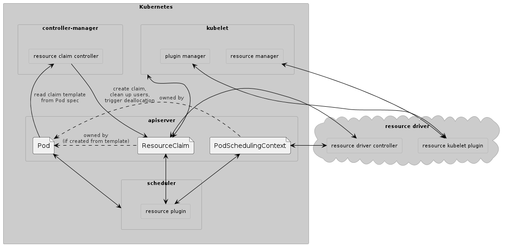
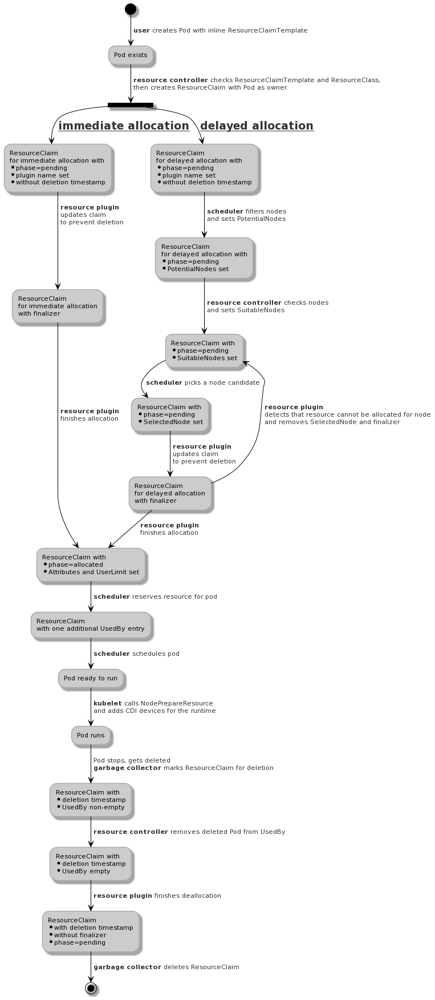

<!--
**Note:** When your KEP is complete, all of these comment blocks should be removed.

To get started with this template:

- [ ] **Pick a hosting SIG.**
  Make sure that the problem space is something the SIG is interested in taking
  up. KEPs should not be checked in without a sponsoring SIG.

- [ ] **Create an issue in kubernetes/enhancements**
  When filing an enhancement tracking issue, please make sure to complete all
  fields in that template. One of the fields asks for a link to the KEP. You
  can leave that blank until this KEP is filed, and then go back to the
  enhancement and add the link.

- [ ] **Make a copy of this template directory.**
  Copy this template into the owning SIG's directory and name it
  `NNNN-short-descriptive-title`, where `NNNN` is the issue number (with no
  leading-zero padding) assigned to your enhancement above.

- [ ] **Fill out as much of the kep.yaml file as you can.**
  At minimum, you should fill in the "Title", "Authors", "Owning-sig",
  "Status", and date-related fields.

- [ ] **Fill out this file as best you can.**
  At minimum, you should fill in the "Summary" and "Motivation" sections.
  These should be easy if you've preflighted the idea of the KEP with the
  appropriate SIG(s).

- [ ] **Create a PR for this KEP.**
  Assign it to people in the SIG who are sponsoring this process.

- [ ] **Merge early and iterate.**
  Avoid getting hung up on specific details and instead aim to get the goals of
  the KEP clarified and merged quickly. The best way to do this is to just
  start with the high-level sections and fill out details incrementally in
  subsequent PRs.

Just because a KEP is merged does not mean it is complete or approved. Any KEP
marked as `provisional` is a working document and subject to change. You can
denote sections that are under active debate as follows:

```
<<[UNRESOLVED optional short context or usernames ]>>
Stuff that is being argued.
<<[/UNRESOLVED]>>
```

When editing KEPS, aim for tightly-scoped, single-topic PRs to keep discussions
focused. If you disagree with what is already in a document, open a new PR
with suggested changes.

One KEP corresponds to one "feature" or "enhancement" for its whole lifecycle.
You do not need a new KEP to move from beta to GA, for example. If
new details emerge that belong in the KEP, edit the KEP. Once a feature has become
"implemented", major changes should get new KEPs.

The canonical place for the latest set of instructions (and the likely source
of this file) is [here](/keps/NNNN-kep-template/README.md).

**Note:** Any PRs to move a KEP to `implementable`, or significant changes once
it is marked `implementable`, must be approved by each of the KEP approvers.
If none of those approvers are still appropriate, then changes to that list
should be approved by the remaining approvers and/or the owning SIG (or
SIG Architecture for cross-cutting KEPs).
-->
# [KEP-3063](https://github.com/kubernetes/enhancements/issues/3063): Dynamic resource allocation


<!-- toc -->
- [Release Signoff Checklist](#release-signoff-checklist)
- [Summary](#summary)
- [Motivation](#motivation)
  - [Goals](#goals)
  - [Non-Goals](#non-goals)
- [Proposal](#proposal)
  - [User Stories (Optional)](#user-stories-optional)
    - [Story 1](#story-1)
    - [Story 2](#story-2)
  - [Notes/Constraints/Caveats (Optional)](#notesconstraintscaveats-optional)
  - [Risks and Mitigations](#risks-and-mitigations)
- [Design Details](#design-details)
  - [Implementation](#implementation)
  - [API](#api)
  - [Communication between kubelet and resource node plugin](#communication-between-kubelet-and-resource-node-plugin)
    - [<code>NodePrepareResource</code>](#)
      - [NodePrepareResource Errors](#nodeprepareresource-errors)
    - [<code>NodeUnprepareResource</code>](#-1)
      - [NodeUnprepareResource Errors](#nodeunprepareresource-errors)
    - [Implementing a plugin for node resources](#implementing-a-plugin-for-node-resources)
  - [Test Plan](#test-plan)
  - [Graduation Criteria](#graduation-criteria)
  - [Upgrade / Downgrade Strategy](#upgrade--downgrade-strategy)
  - [Version Skew Strategy](#version-skew-strategy)
- [Production Readiness Review Questionnaire](#production-readiness-review-questionnaire)
  - [Feature Enablement and Rollback](#feature-enablement-and-rollback)
  - [Rollout, Upgrade and Rollback Planning](#rollout-upgrade-and-rollback-planning)
  - [Monitoring Requirements](#monitoring-requirements)
  - [Dependencies](#dependencies)
  - [Scalability](#scalability)
  - [Troubleshooting](#troubleshooting)
- [Implementation History](#implementation-history)
- [Drawbacks](#drawbacks)
- [Alternatives](#alternatives)
  - [ResourceClaimTemplate](#resourceclaimtemplate)
  - [Reusing volume support as-is](#reusing-volume-support-as-is)
  - [Extend volume support](#extend-volume-support)
  - [Extend Device Plugins](#extend-device-plugins)
  - [Webhooks instead of ResourceClaim updates](#webhooks-instead-of-resourceclaim-updates)
- [Infrastructure Needed (Optional)](#infrastructure-needed-optional)
<!-- /toc -->

## Release Signoff Checklist

<!--
**ACTION REQUIRED:** In order to merge code into a release, there must be an
issue in [kubernetes/enhancements] referencing this KEP and targeting a release
milestone **before the [Enhancement Freeze](https://git.k8s.io/sig-release/releases)
of the targeted release**.

For enhancements that make changes to code or processes/procedures in core
Kubernetes—i.e., [kubernetes/kubernetes], we require the following Release
Signoff checklist to be completed.

Check these off as they are completed for the Release Team to track. These
checklist items _must_ be updated for the enhancement to be released.
-->

Items marked with (R) are required *prior to targeting to a milestone / release*.

- [ ] (R) Enhancement issue in release milestone, which links to KEP dir in [kubernetes/enhancements] (not the initial KEP PR)
- [ ] (R) KEP approvers have approved the KEP status as `implementable`
- [ ] (R) Design details are appropriately documented
- [ ] (R) Test plan is in place, giving consideration to SIG Architecture and SIG Testing input (including test refactors)
- [ ] (R) Graduation criteria is in place
- [ ] (R) Production readiness review completed
- [ ] (R) Production readiness review approved
- [ ] "Implementation History" section is up-to-date for milestone
- [ ] User-facing documentation has been created in [kubernetes/website], for publication to [kubernetes.io]
- [ ] Supporting documentation—e.g., additional design documents, links to mailing list discussions/SIG meetings, relevant PRs/issues, release notes

<!--
**Note:** This checklist is iterative and should be reviewed and updated every time this enhancement is being considered for a milestone.
-->

[kubernetes.io]: https://kubernetes.io/
[kubernetes/enhancements]: https://git.k8s.io/enhancements
[kubernetes/kubernetes]: https://git.k8s.io/kubernetes
[kubernetes/website]: https://git.k8s.io/website

## Summary

<!--
This section is incredibly important for producing high-quality, user-focused
documentation such as release notes or a development roadmap. It should be
possible to collect this information before implementation begins, in order to
avoid requiring implementors to split their attention between writing release
notes and implementing the feature itself. KEP editors and SIG Docs
should help to ensure that the tone and content of the `Summary` section is
useful for a wide audience.

A good summary is probably at least a paragraph in length.

Both in this section and below, follow the guidelines of the [documentation
style guide]. In particular, wrap lines to a reasonable length, to make it
easier for reviewers to cite specific portions, and to minimize diff churn on
updates.

[documentation style guide]: https://github.com/kubernetes/community/blob/master/contributors/guide/style-guide.md
-->

Dynamic resource allocation introduces an alternative to the existing [device
manager
API](https://github.com/kubernetes/community/blob/master/contributors/design-proposals/resource-management/device-plugin.md)
for third-party hardware vendors. Both are expected to co-exist, with vendors
choosing the API that better suits their needs on a case-by-case basis. Because
the new API is going to be implemented independently of the existing device
manager, there's little risk of breaking stable APIs.

The new API is inspired by the existing [volume provisioning support with CSI](https://github.com/kubernetes/community/blob/master/contributors/design-proposals/storage/container-storage-interface.md#provisioning-and-deleting) and uses similar
concepts. The goal is to let users request resources with parameters that can
be different depending on what kind of resource gets requested. Resource
allocations can be ephemeral (specified in a Pod spec, allocated and destroyed
together with the Pod) and persistent (lifecycle managed separately from a Pod,
with an allocated resource used for multiple different Pods).

Several core Kubernetes components must be modified (see the
[implementation](#implementation) section for details):
- kube-apiserver (new API)
- kube-controller-manager (new controller)
- kube-scheduler (new builtin plugin)
- kubelet (new third-party plugin kind)

Resources are managed by third-party plugins that communicate with central
Kubernetes components, in particular the kube-scheduler, by updating
objects stored in the kube-apiserver. kube-scheduler only needs to be modified
once to support dynamic resource allocation. Then multiple plugins from
different vendors can be installed at the same time without making further
changes to the scheduler.

Communication between the kubelet and the local part of the plugin is
handled through local Unix domain sockets and the plugin registration
mechanism, using a new plugin type and a new gRPC interface.
The container runtime uses the
[Container Device Interface
(CDI)](https://github.com/container-orchestrated-devices/container-device-interface)
to expose the resources.

## Motivation

<!--
This section is for explicitly listing the motivation, goals, and non-goals of
this KEP.  Describe why the change is important and the benefits to users. The
motivation section can optionally provide links to [experience reports] to
demonstrate the interest in a KEP within the wider Kubernetes community.

[experience reports]: https://github.com/golang/go/wiki/ExperienceReports
-->

Originally, Kubernetes and its scheduler only tracked CPU and RAM as
resources for containers. Later, support for storage and discrete,
countable per-node extended resources was added. The device plugin
interface then made such local resources available to containers. But
for many newer devices, this approach and the Kubernetes API for
requesting these custom resources is too limited. This KEP addresses
limitations of the current approach for the following use cases:

- *Device initialization*: When starting a workload I’d like to have
  the device reconfigured or reprogrammed during orchestration. For
  security reasons workloads should not be able to reconfigure devices
  directly.

  *Limitation*: Currently, it’s impossible to specify the desired
  device properties that are required for reconfiguring devices.

- *Device cleanup*: When my workload is finished, I would like to have
  a mechanism for cleanup of the device, that will ensure that device
  does not contain traces/parameters/data from previous workloads and
  appropriate power state/shutdown.

  *Limitation*: Post-stop actions are not supported.

- *Partial allocation*: When deploying a container I’d like to be able
  to use part of the shareable device inside a container and other
  containers should be able to use other free resources on the same
  device.

  *Limitation*: Current implementation of the device plugin doesn’t
  allow one to allocate part of the device because parameters are too limited
  and Kubernetes doesn't have enough information about the extended
  resources on a node to decide whether they can be shared.

- *Optional allocation*: When deploying a workload I’d like to specify
  soft(optional) device requirements. If a device exists and it’s
  allocatable it will be allocated. If not - the workload will be run on
  a node without a device. GPU and crypto-offload engines are
  examples of this kind of device. If they’re not available, workloads
  can still run by falling back to using only the CPU for the same
  task.

  *Limitation*: Optional allocation is supported neither by the device
  plugins nor by current Pod resource declaration.

- *Support Over the Fabric devices*: When deploying a container, I’d
  like to utilize devices available over the Fabric (PCIe, CXL,
  Network, special links, etc).

  *Limitation*: Device Plugins framework supports only local devices.

- *Access to the container image*: When deploying a container that
  needs access to a GPU device, I would like my container to
  gracefully fail to start (rather than SIGSEGV at runtime) if a
  minimum driver requirement is not met on the host.

  *Limitation*: GPU driver requirements are currently stored as labels
  on the container image, and device plugins do not have access to the
  container image.

Because this KEP enables the usage of
[CDI](https://github.com/container-orchestrated-devices/container-device-interface/#readme)
in Kubernetes, it also addresses those problems that are handled by
CDI:

- *Perform container runtime specific operations*: When deploying a container
  that needs access to a device, I would like to be able to reuse the
  same pod spec, irrespective of the underlying container runtime in
  use (e.g. kata vs. runc).

  *Limitation*: At present, there is no way to perform
  runtime-specific operations that may need to occur as a result of
  injecting a device into a container (device plugins are runtime
  agnostic). A good example is supporting GPU passthrough
  virtualization on kata vs. runc.

- *Access to the plugin container*: When deploying a device plugin, I
  would like to ensure that all of the operations that need to occur
  as part of “injecting” a device into a container, also occur for the
  “plugin container” itself.

  *Limitation*: At present, there is a chicken-and-egg problem to
  supporting this because the device plugin is the sole dictator of
  which containers will have these operations performed on them.

### Goals

<!--
List the specific goals of the KEP. What is it trying to achieve? How will we
know that this has succeeded?
-->

* More flexibility:
  * Arbitrary, resource-specific setup and cleanup actions
  * Over-the-fabric resources
  * Custom matching of resource requests with available resources,
    including handling of optional resource requests
* User-friendly API for describing resource requests
* Allow resource management plugins that can be developed and deployed
  separately from Kubernetes and are independent of specific container
  runtimes.

### Non-Goals

<!--
What is out of scope for this KEP? Listing non-goals helps to focus discussion
and make progress.
-->

* Extend the model that kube-scheduler has about
  resources. Instead, it will need information from the plugin for
  each resource request to determine where a Pod using the resource
  might run. The [Representing Compute Resources in Kubernetes
  proposal](https://docs.google.com/document/d/1666PPUs4Lz56TqKygcy6mXkNazde-vwA7q4e5H92sUc/edit#)
  had some ideas what information the scheduler might need (“supports
  overcommit”, “fractional”), but ultimately any choice regarding that
  will only work for certain kinds of resources.

* Standardize how to describe available resources. Only allocated
  resources are visible through the APIs defined below. How to
  describe available resources is plugin specific because it depends
  on the kind of resource which attributes might be relevant. Plugins
  should use and document their individual approach for this (for
  example, defining a CRD and publishing through that).

* Provide an abstraction layer for resource requests, i.e., something like a
  “I want some kind of GPU”. Users will need to know about specific
  resource plugins and which parameters they support. Portability of
  workloads could be added on top of this proposal by introducing the
  selection of a resource implementation through labels and
  standardizing those labels and the associated parameters. The
  [Resource Class
  Proposal](https://docs.google.com/document/d/1qKiIVs9AMh2Ua5thhtvWqOqW0MSle_RV3lfriO1Aj6U/edit#heading=h.jzfmfdca34kj)
  included such an approach.

## Proposal

<!--
This is where we get down to the specifics of what the proposal actually is.
This should have enough detail that reviewers can understand exactly what
you're proposing, but should not include things like API designs or
implementation. What is the desired outcome and how do we measure success?.
The "Design Details" section below is for the real
nitty-gritty.
-->

The proposal is that a plugin handles all operations that are specific
to the resources managed by that plugin. This includes operations at
the control plane level (tracking where in the cluster resources are
available, helping with pod scheduling decisions, allocating resources
when requested) as well as the node level (preparing container
startup). Such a plugin can be implemented in arbitrary programming
languages as long as it supports the resource allocation protocol and
gRPC interfaces defined in this KEP. An utility package with Go
support code will be made available to simplify the development of
such a plugin, but using it will not be required and its API is not
part of this KEP.

Three new API object types get added in a new API group:
- ResourcePlugin, not namespaced, with a description of the plugin.
- ResourceClass, not namespaced, with privileged parameters for
  multiple resource instances of a certain kind. All these instances
  are provided by the same resource plugin, which is identified by a
  field in the class.
- ResourceClaim, namespaced, with parameters provided by a normal user
  that describes a resource instance that needs to be allocated. A
  ResourceClaim contains the usual meta data, a spec and a status. The
  spec identifies the plugin that handles the resource via a class
  name.

To support arbitrarily complex parameters, both ResourceClass and
ResourceClaim contain one field which holds a
runtime.RawExtension. Validation can be handled by plugins through an
admission controller (if desired) or later at runtime when the
parameters are passed to the plugin.

The ResourceClaim spec is read-only once created. The ResourceClaim
status is reserved for system usage and holds the current state of the
resource. The status must not get lost. This is departing from how
Kubernetes traditionally handled status, but something that more
recently [became more
acceptable](https://github.com/kubernetes/enhancements/pull/2537). Kube-scheduler
and plugin communicate by modifying that status. The status is also
how Kubernetes tracks that a plugin has allocated the resource and on
which nodes the resource is available.

This approach is an intentional simplification compared to the PV/PVC
model for volumes because we don't need to deal with two objects when
allocating resources and therefore don't need something like the
volume binding controller. If desired, a resource plugin can implement
support for manually allocated (“static provisioning” in the context
of volumes) and/or existing resources by reacting to ResourceClaims by
using those resources to satisfy a claim.

Allocation of a resource happens either immediately (“immediate
allocation”) or when a Pod needs the resource (“delayed allocation”),
depending on a flag in the ResourceClaim spec. Pods reference resource
claims in a new PodSpec.Resources list. Each resource in that list
then can be made available to one or more containers in that Pod.  To
support ephemeral resources, an entry in the new PodSpec.Resources
list can also be a ResourceClaimTemplate. When a Pod gets created,
such a template will be used to create a normal ResourceClaim with the
Pod as owner, and then the normal allocation of the resource takes
place.

For immediate allocation, scheduling Pods is simple because the
resource is already allocated and determines the nodes on which the
Pod may run. For delayed allocation, a node is selected tentatively
and plugin(s) try to allocate their resources for that node. If that
succeeds, the Pod can start to run. If it fails, the scheduler must
determine whether some other node fits the requirements and if so,
request allocation again. If no node fits because some resources were
already allocated for a node and are only usable there, then those
resources must be released and then get allocated elsewhere.

The resources allocated for a ResourceClaim can be shared by multiple
containers in a pod. Depending on the capabilities defined in the
ResourceClaim by the plugin, a ResourceClaim can be used exclusively
by one pod at a time, by a certain maximum number of pods, or an
unlimited number of pods.

### User Stories (Optional)

#### Cluster add-on development

As a hardware vendor, I want to make my hardware available also to applications
that run in a container under Kubernetes. I want to make it easy for a cluster
administrator to configure a cluster where some nodes have this hardware.

I develop two components, one that runs as part of the Kubernetes control plane
and one that runs on each node, and package those inside container images. YAML
files describe how to deploy my software on a Kubernetes cluster that supports
dynamic resource allocation.

Documentation for administrators explains how the nodes need to be set
up. Documentation for users explains which parameters control the behavior of
my hardware and how to use it inside a container.

#### Cluster configuration

As a cluster administrator, I want to make GPUs from vendor ACME available to users
of that cluster. I prepare the nodes and deploy the vendor's components with
`kubectl create`.

I create a ResourceClass for the hardware with parameters that only I as the
administrator are allowed to choose, like for example running a command with
root privileges that does some cluster-specific initialization for each allocation:
```
apiVersion: cdi.k8s.io/v1alpha1
metadata:
  name: acme-gpu
pluginName: gpu.acme.com
parameters:
  initCommand:
  - /usr/local/bin/acme-gpu-init
  - --cluster
  - my-cluster
```

#### Partial GPU allocation

As a user, I want to use a GPU as accelerator, but don't need exclusive access
to that GPU. Running my workload with just 2Gb of memory is sufficient. This is
supported by the ACME GPU hardware. I know that the administrator has created
an "acme-gpu" ResourceClass.

For a simple trial, I create a Pod directly where two containers share the same subset
of the GPU:
```
apiVersion: v1
kind: Pod
metadata:
  name: device-consumer
spec:
  containers:
  - name: workload
    image: my-app
    command: ["/bin/program"]
    podResources:
    - name: gpu
    resources:
      requests:
        memory: "64Mi"
        cpu: "250m"
      limits:
        memory: "128Mi"
        cpu: "500m"
  - name: monitor
    image: my-app
    command: ["/bin/other-program"]
    podResources:
    - name: gpu
    resources:
      requests:
        memory: "32Mi"
        cpu: "25m"
      limits:
        memory: "64Mi"
        cpu: "50m"
  resources:
  - name: gpu
    template:
      resourceClassName: "acme-gpu"
      parameters:
        memory: "2Gi"
```

This request triggers resource allocation on a node that has a GPU device with
2Gi of memory available and then the Pod runs on that node. The remaining
capacity of the GPU can be used by other pods. The resource is deallocated
automatically once the Pod is deleted.

In production, a similar PodTemplateSpec in a Deployment will be used.

### Notes/Constraints/Caveats (Optional)

<!--
What are the caveats to the proposal?
What are some important details that didn't come across above?
Go in to as much detail as necessary here.
This might be a good place to talk about core concepts and how they relate.
-->

Scheduling is likely to be slower when many Pods request the new
resource types, both because scheduling such a Pod involves more
round-trips through the API server for ResourceClaimStatus updates and
because scheduling one Pod may affect other Pods in ways that cannot
be anticipated by the kube-scheduler. When many Pods compete for
limited resources, multiple attempts may be needed before a suitable
node is found.

The hardware that is expected to need this more flexible allocation
approach is going to be used by only a small subset of the pods in the
cluster and those pods are likely to run for extended periods of time,
so this is not a major concern.

### Risks and Mitigations

<!--
What are the risks of this proposal, and how do we mitigate? Think broadly.
For example, consider both security and how this will impact the larger
Kubernetes ecosystem.

How will security be reviewed, and by whom?

How will UX be reviewed, and by whom?

Consider including folks who also work outside the SIG or subproject.
-->

## Design Details

<!--
This section should contain enough information that the specifics of your
change are understandable. This may include API specs (though not always
required) or even code snippets. If there's any ambiguity about HOW your
proposal will be implemented, this is the place to discuss them.
-->

### Implementation



Several components must be implemented or modified in Kubernetes:
- The new API must be added to kube-apiserver.
- A new controller in kube-controller-manager which generates
  ResourceClaims from Pod ResourceClaimTemplates, similar to
  https://github.com/kubernetes/kubernetes/tree/master/pkg/controller/volume/ephemeral
- A kube-scheduler plugin must detect Pods which reference a
  ResourceClaim (directly or through a template) and ensure that the
  resource is allocated before the Pod gets scheduled, similar to
  https://github.com/kubernetes/kubernetes/blob/master/pkg/controller/volume/scheduling/scheduler_binder.go
- Kubelet must be extended to retrieve information from ResourceClaims
  and then invoke local resource plugin methods. It must pass information about
  the additional resources to the container runtime. It must detect
  whether the container runtime has the necessary support and
  advertise that in the cluster via node labels to simplify deployment
  of plugins and Pod scheduling.

For a resource plugin the following components are needed:
- Some utility library similar to
  https://github.com/kubernetes-sigs/sig-storage-lib-external-provisioner
  and the code in driver-registrar.
- *Resource controller*: a central component which handles resource allocation
  by watching and modifying ResourceClaims.
- *Resource node plugin*: a component which cooperates with kubelet to prepare
  the usage of the resource on a node.

The utility library will be developed outside of Kubernetes and does not have
to be used by plugins, therefore it is not described further in this KEP.


```
<<[UNRESOLVED @pohly]>>
All of the changes in Kubernetes need to be specified in a lot more detail.

Upgrade and downgrade scenarios should already be considered for v1alpha1 to ensure
that whatever changes will be needed are in place before going to v1beta1 where
downgrades have to be supported.

All of that will be added once there is consensus to move ahead with this proposal.
<<[/UNRESOLVED]>>
```

### Resource allocation flow

The following diagram shows how resource allocation works for a resource that
gets defined inline in a Pod. For a full definition of ResourceClass,
ResourceClaim and ResourceClaimTemplate see the [API](#API) section below.

Several of these operations may fail without changing the system state. They
then must be retried until they succeed or something else changes in the
system, like for example deleting objects. These additional state transitions
are not shown for the sake of simplicity.



The flow is similar for a ResourceClaim that gets created as a stand-alone
object by the user. In that case, the Pod reference that ResourceClaim by
name. The ResourceClaim does not get deleted at the end and can be reused by
another Pod and/or used by multiple different Pods at the same time (if
supported by the plugin).

### API

ResourceClaim, ResourceClass and ResourcePlugin are new built-in types
in a new `cdi.k8s.io/v1alpha1` API group. This was chosen instead of
using CRDs because core Kubernetes components must interact with them
and installation of CRDs as part of cluster creation is an unsolved
problem.

The PodSpec gets extended.

```
type ResourceClass struct {
    // Resource plugins have a unique name in reverse domain order (acme.example.com).
    PluginName string
    // Parameters holds arbitrary values that will be available to the plugin
    // when allocating a resource that uses this class. The plugin will
    // be able to distinguish between parameters stored here and
    // and those stored in ResourceClaimSpec. These parameters
    // here can only be set by cluster administrators.
    Parameters runtime.RawExtension
}

type ResourcePlugin struct {
    // The name of the object is the unique plugin name.
    ObjectMeta

    // Features contains a list of features supported by the plugin.
    // New features may be added over time and must be ignored
    // by code that does not know about them.
    Features []ResourcePluginFeature
}

type ResourcePluginFeature struct {
    // Name is one of the pre-defined names for a feature.
    Name ResourcePluginFeatureName
    // Parameters might provide additional information about how
    // the plugin supports the feature. Boolean features have
    // no parameters, merely listing them indicates support.
    Parameters runtime.RawExtension
}

type ResourceClaim struct {
    // The plugin must set a finalizer here before it attempts to
    // allocate the resource. It removes the finalizer again when
    // a) the allocation attempt has definitely failed or b) when
    // the allocated resource was freed. This ensures that
    // resources are not leaked.
    ObjectMeta
    // Spec describes the desired attributes of a resource that then
    // needs to be allocated. It can only be set once when creating
    // the ResourceClaim.
    Spec ResourceClaimSpec
    // Status describes whether the resource is available and with
    // which attributes.
    Status ResourceClaimStatus
}

type ResourceClaimSpec struct {
    // ResourceClassName references the plugin and additional
    // parameters via the name of a ResourceClass that was
    // created as part of the plugin deployment.
    //
    // The apiserver does not check that the referenced class
    // exists, but a plugin-specific admission webhook
    // may require that and is allowed to reject claims where
    // the class is missing.
    ResourceClassName string

    // Parameters holds arbitrary values that will be available to the plugin
    // when allocating a resource for the claim.
    Parameters runtime.RawExtension

    // Allocation can start immediately or when a Pod wants to use
    // the resource. Waiting for a Pod is the default.
    AllocationMode AllocationMode
}

type AllocationMode string

const (
     AllocationModeImmediate AllocationMode = “Immediate”
     AllocationModeDelayed AllocationMode = “Delayed”
}

type ResourceClaimStatus struct {
   // Explains what the current status of the claim is and
   // determines which component needs to do something.
   Phase ResourceClaimPhase

   // A copy of the plugin name from the ResourceClass at
   // the time when allocation started. Plugins can
   // filter claims by this field. It's also necessary to
   // support deallocation when the class gets deleted before
   // a claim.
   PluginName string

   // When allocation is delayed, the scheduler must set
   // the node for which it wants the resource to be allocated
   // before the plugin proceeds with allocation.
   // For immediate allocation, the scheduler will not set
   // this field. The plugin controller component may then
   // set it to trigger allocation on a specific node if the
   // resources are local to nodes.
   SelectedNode string

   // When allocation is delayed, and the scheduler needs to
   // decide on which node a Pod should run, it must first
   // ask the plugin on which nodes the resource might be
   // made available. To trigger that check, the scheduler must
   // provide the names of nodes which might be suitable
   // for the Pod. Will be updated periodically until
   // the claim is allocated.
   PotentialNodes []string

   // A change of the node candidates triggers a check
   // on which nodes the resource could be made available.
   // This can change, so the plugin must refresh
   // this information periodically until a node gets
   // selected by the scheduler.
   SuitableNodes []string

   // An allocated resource is available on nodes that match this
   // selector. If nil, the resource is available everywhere.
   AvailableOnNodes *corev1.NodeSelector

   // Arbitrary data returned by the plugin after a successful allocation.
   // This data is passed to the plugin for all operations involving
   // the allocated resource. This is opaque for Kubernetes.
   // Plugin documentation may explain to users how to interpret
   // this data if needed.
   //
   // The attributes must be sufficient to deallocate the resource
   // because the ResourceClass might not be available anymore
   // when deallocation starts.
   Attributes map[string]string

    // UsersLimit determines how many entities are allowed to use this resource
    // at the same time. The default is 1. -1 enables the usage by an unlimited number
   // of users. Individual containers in a pod are not counted as users, only the Pod
   // is.
   UserLimit int

   // UsedBy indicates which entities are currently using the resource.
   // Usually those are Pods. Only Pods listed as users can be scheduled,
   // all others must wait. Updated by kube-scheduler as part of Pod scheduling
   // (TBD – a separate controller might also work).
   UsedBy []metav1.OwnerReference
}

type ResourceClaimPhase string

const (
    // The claim is waiting for allocation by the plugin.
    //
    // If it uses delayed allocation, SuitableNodes must have
    // been set, otherwise the plugin cannot proceed with
    // the allocation.
    ResourceClaimPending ResourceClaimPhase = “Pending”

    // Set by the plugin once the resource has been successfully
    // allocated. The scheduler waits for all resources used by
    // a Pod to be in this phase.
    ResourceClaimAllocated ResourceClaimPhase = “Allocated”

    // It can happen that a resource got allocated for a Pod and
    // then the Pod cannot be scheduled onto the nodes where the allocated
    // resource is available. The scheduler detects this and
    // then sets the “reallocate” phase to tell the plugin that it must
    // free the resource. The plugin does that and resets
    // the ResourceClaimPhase back to "Pending".
    ResourceClaimReallocate ResourceClaimPhase = “Reallocate”
)

type PodSpec {
   ...
   Resources []PodResource
   ...
}

type Container {
   ...
   // The entries are the names of resources in PodSpec.Resources
   // that are used by the container.
   PodResources []string
   ...
}

type PodResource struct {
   // A name under which this resource can be referenced by the containers.
   Name string

   // The resource is independent of the Pod and defined by
   // a separate ResourceClaim in the same namespace as
   // the Pod. Either this or Template must be set, but not both.
   ResourceClaimName *string

    // Will be used to create a stand-alone ResourceClaim to allocate the resource.
    // The pod in which this PodResource is embedded will be the
    // owner of the ResourceClaim, i.e. the ResourceClaim will be deleted together with the
    // pod.  The name of the ResourceClaim will be `<pod name>-<resource name>` where
    // `<resource name>` is the name PodResource.Name
    // Pod validation will reject the pod if the concatenated name
    // is not valid for a ResourceClaim (for example, too long).
    //
    // An existing ResourceClaim with that name that is not owned by the pod
    // will *not* be used for the pod to avoid using an unrelated
    // resource by mistake. Starting the pod is then blocked until
    // the unrelated ResourceClaim is removed. If such a pre-created ResourceClaim is
    // meant to be used by the pod, the ResourceClaim has to be updated with an
    // owner reference to the pod once the pod exists. Normally
    // this should not be necessary, but it may be useful when
    // manually reconstructing a broken cluster.
    //
    // This field is read-only and no changes will be made by Kubernetes
    // to the ResourceClaim after it has been created.
   Template *ResourceClaimTemplate
}

type ResourceClaimTemplate struct {
    // May contain labels and annotations that will be copied into the ResourceClaim
    // when creating it. No other fields are allowed and will be rejected during
    // validation.
    metav1.ObjectMeta

    // The specification for the ResourceClaim. The entire content is
    // copied unchanged into the ResourceClaim that gets created from this
    // template. The same fields as in a ResourceClaim
    // are also valid here.
    Spec ResourceClaimSpec
}
```

### Communication between kubelet and resource node plugin

This gRPC interface is provided by the resource node plugin and invoked by
kubelet. It is inspired by
[CSI](https://github.com/container-storage-interface/spec/blob/master/spec.md),
with “volume” replaced by “resource” and volume specific parts removed.

```
<<[UNRESOLVED @pohly]>>
Do plugin operations need secrets? They are currently not part of the proposed Kubernetes API.
<<[/UNRESOLVED]>>
```

#### `NodePrepareResource`

This RPC is called by kubelet when a Pod that wants to use the
specified resource is scheduled on a node.  The Plugin SHALL assume
that this RPC will be executed on the node where the resource will be
used.  The Plugin SHALL return device name and kind for allocated
device[s].

The Plugin SHALL create or update json file[s] in CDI format for each
allocated device. These files SHALL be used by runtime to update
runtime configuration before creating containers that use the
device[s].

This operation SHALL do as little work as possible as it’s called
after a pod is scheduled to a node. All potentially failing operations
SHALL be done during allocation phase.

This operation MUST be idempotent. If the resource corresponding to
the `resource_id` has already been prepared, the Plugin MUST reply `0
OK`.

If this RPC failed, or kubelet does not know if it failed or not, it
MAY choose to call `NodePrepareResource` again, or choose to call
`NodeUnprepareResource`.

After a successful call, Kubelet MUST pass device names and kinds to
the runtime through the CRI protocol.

```
<<[UNRESOLVED @bart0sh]>>
CRI protocol may need to be extended for
this purpose, e.g. device id can be added to the CRI Device structure.
<<[/UNRESOLVED]>>
```

```protobuf
message NodePrepareResourceRequest {
  // The UID of the ResourceClaim. This field is REQUIRED.
  string resource_uid = 1;
}

message NodePrepareResourceResponse {
  // These are the additional devices that kubelet must
  // make available via the container runtime. A resource
  // may have zero or more devices.
  repeated CDIDevice devices = 1;
}

message CDIDevice {
  // Kind is the string that together with the name identifies a device
  // (https://github.com/container-orchestrated-devices/container-device-interface/blob/master/SPEC.md#kind).
  string kind = 1;
  // Name is the name that within its kind uniquely identifies a
  // device (https://github.com/container-orchestrated-devices/container-device-interface/blob/master/SPEC.md#cdi-devices).
  string name = 2;
}
```

##### NodePrepareResource Errors

If the plugin is unable to complete the NodePrepareResource call
successfully, it MUST return a non-ok gRPC code in the gRPC status.
If the conditions defined below are encountered, the plugin MUST
return the specified gRPC error code.  Kublet MUST implement the
specified error recovery behavior when it encounters the gRPC error
code.

| Condition | gRPC Code | Description | Recovery Behavior |
|-----------|-----------|-------------|-------------------|
| Resource does not exist | 5 NOT_FOUND | Indicates that a resource corresponding to the specified `resource_id` does not exist. | Caller MUST verify that the `resource_id` is correct and that the resource is accessible and has not been deleted before retrying with exponential back off. |
 

#### `NodeUnprepareResource`

A Node Plugin MUST implement this RPC call. This RPC is a reverse
operation of `NodePrepareResource`. This RPC MUST undo the work by
the corresponding `NodePrepareResource`. This RPC SHALL be called by
kubelet at least once for each successful `NodePrepareResource`. The
Plugin SHALL assume that this RPC will be executed on the node where
the resource is being used.

This RPC is called by kubelet when the Pod using the resource is being
deleted.

This operation MUST be idempotent. If this RPC failed, or kubelet does
not know if it failed or not, it can choose to call
`NodeUnprepareResource` again.

```protobuf
message NodeUnprepareResourceRequest {
  // The UID of the ResourceClaim. This field is REQUIRED.
  string resource_id = 1;
}

message NodeUnprepareResourceResponse {
  // Intentionally empty.
}
```

##### NodeUnprepareResource Errors

If the plugin is unable to complete the NodeUprepareResource call
successfully, it MUST return a non-ok gRPC code in the gRPC status.
If the conditions defined below are encountered, the plugin MUST
return the specified gRPC error code.  Kubelet MUST implement the
specified error recovery behavior when it encounters the gRPC error
code.

| Condition | gRPC Code | Description | Recovery Behavior |
|-----------|-----------|-------------|-------------------|
| Resource does not exist | 5 NOT_FOUND | Indicates that a resource corresponding to the specified `resource_id` does not exist. | Caller MUST verify that the `resource_id` is correct and that the resource is accessible and has not been deleted before retrying with exponential back off. |


#### Implementing a plugin for node resources

The proposal depends on a central controller plugin. Implementing that
part poses an additional challenge for plugins that so far only ran
locally on a node because they now need to establish a secure
communication path between node and controller.

How plugins implement that is up to the developer. This section
outlines a possible solution. If there is sufficient demand, common
code for this solution could be made available as a reusable Go
module.

- Each plugin defines a CRD which describes how much resources are
  available per node and how much is currently allocated.
- RBAC rules ensure that only the plugin can modify objects of that
  type. The objects can and should be namespaced, which makes it
  possible to add automatic cleanup via owner references (similar to
  CSIStorageCapacity).
- The node plugin publishes information about the local state via a
  CRD object named after the node. Plugin developers can document
  those CRDs and then users can query the cluster state by listing
  those objects.
- The controller plugin watches those objects and resource claims. It
  can keep track of claims that are in the process of being allocated
  and consider that when determining where another claim might get
  allocated. For delayed allocation, the controller plugin informs the
  scheduler by updating the ResourceClaimStatus.SuitableNodes field
  which then sets the selected node field. For immediate allocation,
  the controller plugin itself sets the selected node field.
- In both cases, the node plugin waits for a ResourceClaim assigned to
  its own node and tries to allocate the resource. If that fails, it
  can unset the selected node field to trigger another allocation
  attempt elsewhere.

### Test Plan

<!--
**Note:** *Not required until targeted at a release.*

Consider the following in developing a test plan for this enhancement:
- Will there be e2e and integration tests, in addition to unit tests?
- How will it be tested in isolation vs with other components?

No need to outline all of the test cases, just the general strategy. Anything
that would count as tricky in the implementation, and anything particularly
challenging to test, should be called out.

All code is expected to have adequate tests (eventually with coverage
expectations). Please adhere to the [Kubernetes testing guidelines][testing-guidelines]
when drafting this test plan.

[testing-guidelines]: https://git.k8s.io/community/contributors/devel/sig-testing/testing.md
-->

### Graduation Criteria

<!--
**Note:** *Not required until targeted at a release.*

Define graduation milestones.

These may be defined in terms of API maturity, or as something else. The KEP
should keep this high-level with a focus on what signals will be looked at to
determine graduation.

Consider the following in developing the graduation criteria for this enhancement:
- [Maturity levels (`alpha`, `beta`, `stable`)][maturity-levels]
- [Deprecation policy][deprecation-policy]

Clearly define what graduation means by either linking to the [API doc
definition](https://kubernetes.io/docs/concepts/overview/kubernetes-api/#api-versioning)
or by redefining what graduation means.

In general we try to use the same stages (alpha, beta, GA), regardless of how the
functionality is accessed.

[maturity-levels]: https://git.k8s.io/community/contributors/devel/sig-architecture/api_changes.md#alpha-beta-and-stable-versions
[deprecation-policy]: https://kubernetes.io/docs/reference/using-api/deprecation-policy/

Below are some examples to consider, in addition to the aforementioned [maturity levels][maturity-levels].

#### Alpha -> Beta Graduation

- Gather feedback from developers and surveys
- Complete features A, B, C
- Tests are in Testgrid and linked in KEP

#### Beta -> GA Graduation

- N examples of real-world usage
- N installs
- More rigorous forms of testing—e.g., downgrade tests and scalability tests
- Allowing time for feedback

**Note:** Generally we also wait at least two releases between beta and
GA/stable, because there's no opportunity for user feedback, or even bug reports,
in back-to-back releases.

#### Removing a Deprecated Flag

- Announce deprecation and support policy of the existing flag
- Two versions passed since introducing the functionality that deprecates the flag (to address version skew)
- Address feedback on usage/changed behavior, provided on GitHub issues
- Deprecate the flag

**For non-optional features moving to GA, the graduation criteria must include 
[conformance tests].**

[conformance tests]: https://git.k8s.io/community/contributors/devel/sig-architecture/conformance-tests.md
-->

### Upgrade / Downgrade Strategy

<!--
If applicable, how will the component be upgraded and downgraded? Make sure
this is in the test plan.

Consider the following in developing an upgrade/downgrade strategy for this
enhancement:
- What changes (in invocations, configurations, API use, etc.) is an existing
  cluster required to make on upgrade, in order to maintain previous behavior?
- What changes (in invocations, configurations, API use, etc.) is an existing
  cluster required to make on upgrade, in order to make use of the enhancement?
-->

### Version Skew Strategy

<!--
If applicable, how will the component handle version skew with other
components? What are the guarantees? Make sure this is in the test plan.

Consider the following in developing a version skew strategy for this
enhancement:
- Does this enhancement involve coordinating behavior in the control plane and
  in the kubelet? How does an n-2 kubelet without this feature available behave
  when this feature is used?
- Will any other components on the node change? For example, changes to CSI,
  CRI or CNI may require updating that component before the kubelet.
-->

## Production Readiness Review Questionnaire

<!--

Production readiness reviews are intended to ensure that features merging into
Kubernetes are observable, scalable and supportable; can be safely operated in
production environments, and can be disabled or rolled back in the event they
cause increased failures in production. See more in the PRR KEP at
https://git.k8s.io/enhancements/keps/sig-architecture/1194-prod-readiness.

The production readiness review questionnaire must be completed and approved
for the KEP to move to `implementable` status and be included in the release.

In some cases, the questions below should also have answers in `kep.yaml`. This
is to enable automation to verify the presence of the review, and to reduce review
burden and latency.

The KEP must have a approver from the
[`prod-readiness-approvers`](http://git.k8s.io/enhancements/OWNERS_ALIASES)
team. Please reach out on the
[#prod-readiness](https://kubernetes.slack.com/archives/CPNHUMN74) channel if
you need any help or guidance.
-->

### Feature Enablement and Rollback

<!--
This section must be completed when targeting alpha to a release.
-->

###### How can this feature be enabled / disabled in a live cluster?

<!--
Pick one of these and delete the rest.
-->

- [ ] Feature gate (also fill in values in `kep.yaml`)
  - Feature gate name:
  - Components depending on the feature gate:
- [ ] Other
  - Describe the mechanism:
  - Will enabling / disabling the feature require downtime of the control
    plane?
  - Will enabling / disabling the feature require downtime or reprovisioning
    of a node? (Do not assume `Dynamic Kubelet Config` feature is enabled).

###### Does enabling the feature change any default behavior?

<!--
Any change of default behavior may be surprising to users or break existing
automations, so be extremely careful here.
-->

###### Can the feature be disabled once it has been enabled (i.e. can we roll back the enablement)?

<!--
Describe the consequences on existing workloads (e.g., if this is a runtime
feature, can it break the existing applications?).

NOTE: Also set `disable-supported` to `true` or `false` in `kep.yaml`.
-->

###### What happens if we reenable the feature if it was previously rolled back?

###### Are there any tests for feature enablement/disablement?

<!--
The e2e framework does not currently support enabling or disabling feature
gates. However, unit tests in each component dealing with managing data, created
with and without the feature, are necessary. At the very least, think about
conversion tests if API types are being modified.
-->

### Rollout, Upgrade and Rollback Planning

<!--
This section must be completed when targeting beta to a release.
-->

###### How can a rollout fail? Can it impact already running workloads?

<!--
Try to be as paranoid as possible - e.g., what if some components will restart
mid-rollout?
-->

###### What specific metrics should inform a rollback?

<!--
What signals should users be paying attention to when the feature is young
that might indicate a serious problem?
-->

###### Were upgrade and rollback tested? Was the upgrade->downgrade->upgrade path tested?

<!--
Describe manual testing that was done and the outcomes.
Longer term, we may want to require automated upgrade/rollback tests, but we
are missing a bunch of machinery and tooling and can't do that now.
-->

###### Is the rollout accompanied by any deprecations and/or removals of features, APIs, fields of API types, flags, etc.?

<!--
Even if applying deprecation policies, they may still surprise some users.
-->

### Monitoring Requirements

<!--
This section must be completed when targeting beta to a release.
-->

###### How can an operator determine if the feature is in use by workloads?

<!--
Ideally, this should be a metric. Operations against the Kubernetes API (e.g.,
checking if there are objects with field X set) may be a last resort. Avoid
logs or events for this purpose.
-->

###### What are the SLIs (Service Level Indicators) an operator can use to determine the health of the service?

<!--
Pick one more of these and delete the rest.
-->

- [ ] Metrics
  - Metric name:
  - [Optional] Aggregation method:
  - Components exposing the metric:
- [ ] Other (treat as last resort)
  - Details:

###### What are the reasonable SLOs (Service Level Objectives) for the above SLIs?

<!--
At a high level, this usually will be in the form of "high percentile of SLI
per day <= X". It's impossible to provide comprehensive guidance, but at the very
high level (needs more precise definitions) those may be things like:
  - per-day percentage of API calls finishing with 5XX errors <= 1%
  - 99% percentile over day of absolute value from (job creation time minus expected
    job creation time) for cron job <= 10%
  - 99,9% of /health requests per day finish with 200 code
-->

###### Are there any missing metrics that would be useful to have to improve observability of this feature?

<!--
Describe the metrics themselves and the reasons why they weren't added (e.g., cost,
implementation difficulties, etc.).
-->

### Dependencies

<!--
This section must be completed when targeting beta to a release.
-->

###### Does this feature depend on any specific services running in the cluster?

<!--
Think about both cluster-level services (e.g. metrics-server) as well
as node-level agents (e.g. specific version of CRI). Focus on external or
optional services that are needed. For example, if this feature depends on
a cloud provider API, or upon an external software-defined storage or network
control plane.

For each of these, fill in the following—thinking about running existing user workloads
and creating new ones, as well as about cluster-level services (e.g. DNS):
  - [Dependency name]
    - Usage description:
      - Impact of its outage on the feature:
      - Impact of its degraded performance or high-error rates on the feature:
-->

### Scalability

<!--
For alpha, this section is encouraged: reviewers should consider these questions
and attempt to answer them.

For beta, this section is required: reviewers must answer these questions.

For GA, this section is required: approvers should be able to confirm the
previous answers based on experience in the field.
-->

###### Will enabling / using this feature result in any new API calls?

<!--
Describe them, providing:
  - API call type (e.g. PATCH pods)
  - estimated throughput
  - originating component(s) (e.g. Kubelet, Feature-X-controller)
Focusing mostly on:
  - components listing and/or watching resources they didn't before
  - API calls that may be triggered by changes of some Kubernetes resources
    (e.g. update of object X triggers new updates of object Y)
  - periodic API calls to reconcile state (e.g. periodic fetching state,
    heartbeats, leader election, etc.)
-->

###### Will enabling / using this feature result in introducing new API types?

<!--
Describe them, providing:
  - API type
  - Supported number of objects per cluster
  - Supported number of objects per namespace (for namespace-scoped objects)
-->

###### Will enabling / using this feature result in any new calls to the cloud provider?

<!--
Describe them, providing:
  - Which API(s):
  - Estimated increase:
-->

###### Will enabling / using this feature result in increasing size or count of the existing API objects?

<!--
Describe them, providing:
  - API type(s):
  - Estimated increase in size: (e.g., new annotation of size 32B)
  - Estimated amount of new objects: (e.g., new Object X for every existing Pod)
-->

###### Will enabling / using this feature result in increasing time taken by any operations covered by existing SLIs/SLOs?

<!--
Look at the [existing SLIs/SLOs].

Think about adding additional work or introducing new steps in between
(e.g. need to do X to start a container), etc. Please describe the details.

[existing SLIs/SLOs]: https://git.k8s.io/community/sig-scalability/slos/slos.md#kubernetes-slisslos
-->

###### Will enabling / using this feature result in non-negligible increase of resource usage (CPU, RAM, disk, IO, ...) in any components?

<!--
Things to keep in mind include: additional in-memory state, additional
non-trivial computations, excessive access to disks (including increased log
volume), significant amount of data sent and/or received over network, etc.
This through this both in small and large cases, again with respect to the
[supported limits].

[supported limits]: https://git.k8s.io/community//sig-scalability/configs-and-limits/thresholds.md
-->

### Troubleshooting

<!--
This section must be completed when targeting beta to a release.

The Troubleshooting section currently serves the `Playbook` role. We may consider
splitting it into a dedicated `Playbook` document (potentially with some monitoring
details). For now, we leave it here.
-->

###### How does this feature react if the API server and/or etcd is unavailable?

###### What are other known failure modes?

<!--
For each of them, fill in the following information by copying the below template:
  - [Failure mode brief description]
    - Detection: How can it be detected via metrics? Stated another way:
      how can an operator troubleshoot without logging into a master or worker node?
    - Mitigations: What can be done to stop the bleeding, especially for already
      running user workloads?
    - Diagnostics: What are the useful log messages and their required logging
      levels that could help debug the issue?
      Not required until feature graduated to beta.
    - Testing: Are there any tests for failure mode? If not, describe why.
-->

###### What steps should be taken if SLOs are not being met to determine the problem?

## Implementation History

<!--
Major milestones in the lifecycle of a KEP should be tracked in this section.
Major milestones might include:
- the `Summary` and `Motivation` sections being merged, signaling SIG acceptance
- the `Proposal` section being merged, signaling agreement on a proposed design
- the date implementation started
- the first Kubernetes release where an initial version of the KEP was available
- the version of Kubernetes where the KEP graduated to general availability
- when the KEP was retired or superseded
-->

## Drawbacks

<!--
Why should this KEP _not_ be implemented?
-->

## Alternatives

<!--
What other approaches did you consider, and why did you rule them out? These do
not need to be as detailed as the proposal, but should include enough
information to express the idea and why it was not acceptable.
-->

### ResourceClaimTemplate

Instead of creating a ResourceClaim from an embedded template, the
PodStatus could be extended to hold the same information as a
ResourceClaimStatus. Every component which works with that information
then needs permission and extra code to work with PodStatus. Creating
an extra object seems simpler.

### Reusing volume support as-is

ResourceClaims are similar to PersistentVolumeClaims and also a lot of
the associated logic is similar. An [early
prototype](https://github.com/intel/proof-of-concept-cdi) used a
custom CSI driver to manage resources.

The user experience with that approach is poor because per-resource
parameters must be stored in annotations of a PVC due to the lack of
custom per-PVC parameters. Passing annotations as additional parameters was [proposed
before](https://github.com/kubernetes-csi/external-provisioner/issues/86)
but were essentially [rejected by
SIG-Storage](https://github.com/kubernetes-csi/external-provisioner/issues/86#issuecomment-465836185)
because allowing apps to set custom parameters would make apps
non-portable.

The current volume support also has open issues that affect the
“volume as resource” approach: Multiple different Pods on a node are
allowed to use the same
volume. https://github.com/kubernetes/enhancements/pull/2489 will
address that, but is still work in progress.  Recovery from a bad node
selection during delayed binding may get stuck when a Pod has multiple
volumes because volumes are not getting deleted after a partial
provisioning. A proposal to fix that needs further work
(https://github.com/kubernetes/enhancements/pull/1703).  Each “fake”
CSI driver would have to implement and install a scheduler extender
because storage capacity tracking only considers volume size as
criteria for selecting nodes, which is not applicable for custom
resources.

### Extend volume support

The StorageClass and PersistentVolumeClaim structs could be extended
to allow custom parameters. Together with an extension of the CSI
standard that would address the main objection against the previous
alternative.

However, SIG-Storage and the CSI community would have to agree to this
kind of reuse and accept that some of the code maintained by them
becomes more complex because of these new use cases.

### Extend Device Plugins

The Device Plugins API could be extended to implement some of the
requirements mentioned in the “Motivation” section of this
document. There were certain attempts to do it, for example an attempt
to [add ‘Deallocate’ API call](https://github.com/kubernetes/enhancements/pull/1949) and [pass pod annotations to 'Allocate' API call](https://github.com/kubernetes/kubernetes/pull/61775)

However, most of the requirements couldn’t be satisfied using this
approach as they would require major incompatible changes in the
Device Plugins API. For example: partial and optional resource
allocation couldn’t be done without changing the way resources are
currently declared on the Pod and Device Plugin level.

Extending the Device Plugins API to use [Container Device Interface](https://github.com/container-orchestrated-devices/container-device-interface)
would help address some of the requirements, but not all of them.

It should be also taken into account that Device Plugins API is
beta. Introducing incompatible changes to it may not be accepted by
the Kubernetes community.

### Webhooks instead of ResourceClaim updates

In the current design, scheduler and the resource controller communicate by
updating fields in a ResourceClaim. This has several advantages compared to an
approach were kube-scheduler retrieves information from the resource controller
via HTTP:
* No need for a new webhook API.
* Simpler deployment of resource controller because all it needs are
  credentials to communicate with the apiserver.
* Current status can be checked by querying the ResourceClaim.

The downside is higher load on the apiserver and an increase of the size of
ResourceClaim objects.

## Infrastructure Needed (Optional)

<!--
Use this section if you need things from the project/SIG. Examples include a
new subproject, repos requested, or GitHub details. Listing these here allows a
SIG to get the process for these resources started right away.
--> 
