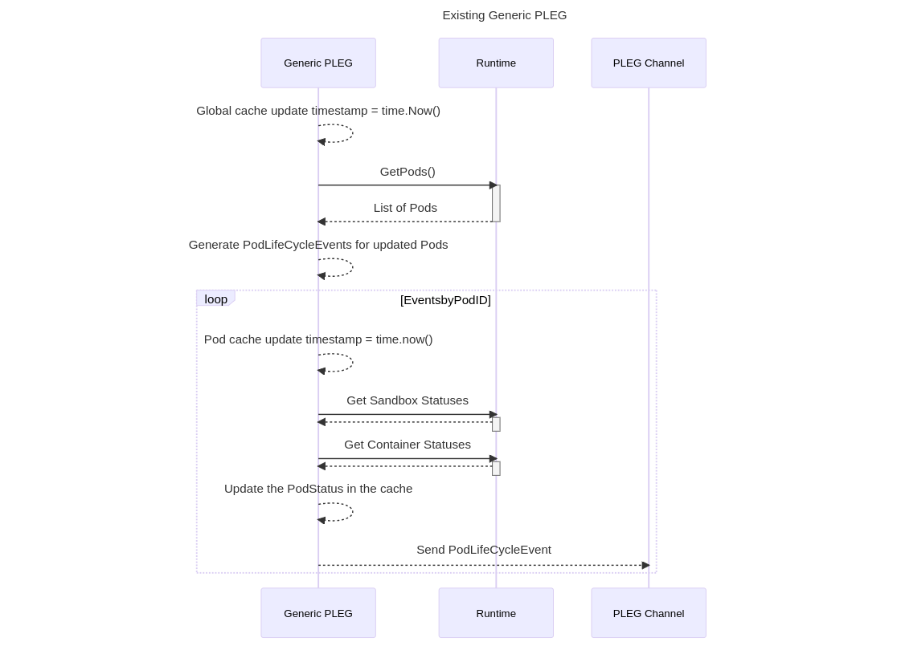
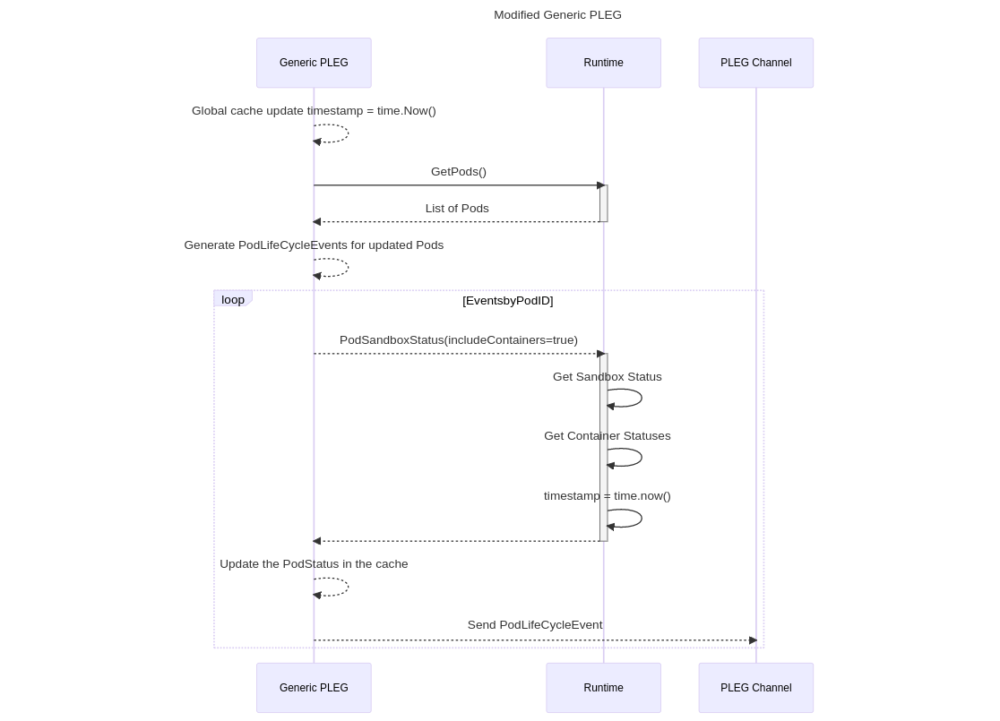
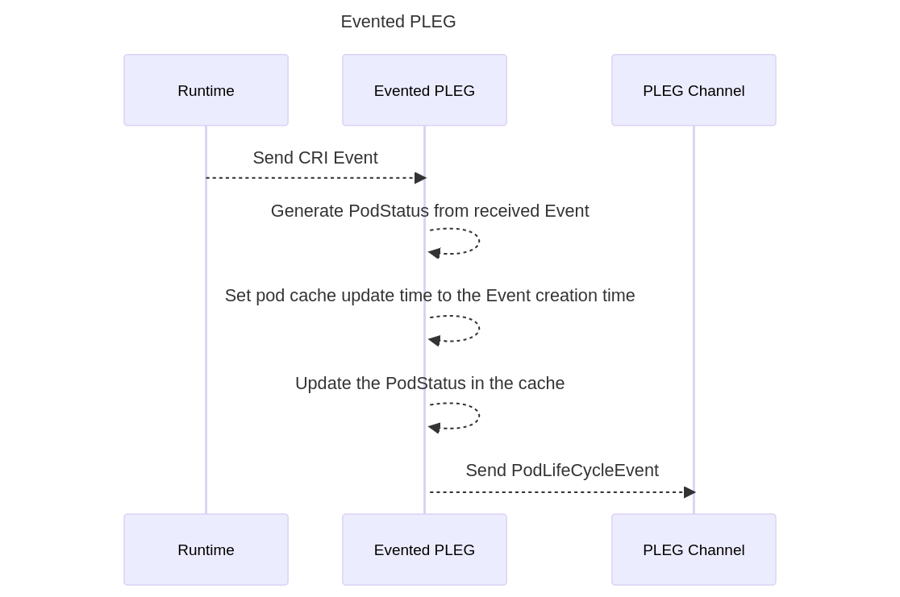
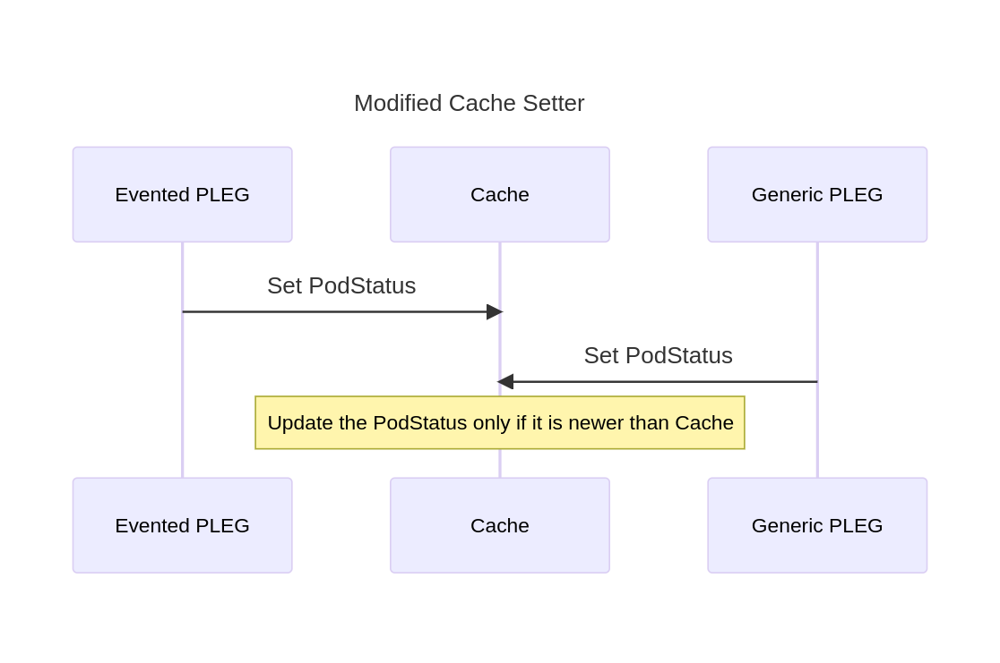

# KEP-3386: Kubelet Evented PLEG for Better Performance

<!-- toc -->
- [Release Signoff Checklist](#release-signoff-checklist)
- [Acknowledgements](#acknowledgements)
- [Summary](#summary)
- [Motivation](#motivation)
  - [Goals](#goals)
  - [Non-Goals](#non-goals)
- [Proposal](#proposal)
  - [User Stories](#user-stories)
  - [Notes/Constraints/Caveats (Optional)](#notesconstraintscaveats-optional)
  - [Risks and Mitigations](#risks-and-mitigations)
- [Design Details](#design-details)
  - [Feature Gate](#feature-gate)
  - [Timestamp of the Pod Status](#timestamp-of-the-pod-status)
  - [Runtime Service Changes](#runtime-service-changes)
  - [Pod Status Update in the Cache](#pod-status-update-in-the-cache)
  - [Test Plan](#test-plan)
      - [Prerequisite testing updates](#prerequisite-testing-updates)
      - [Unit tests](#unit-tests)
      - [Integration tests](#integration-tests)
      - [e2e tests](#e2e-tests)
  - [Graduation Criteria](#graduation-criteria)
    - [Alpha](#alpha)
  - [Upgrade / Downgrade Strategy](#upgrade--downgrade-strategy)
  - [Version Skew Strategy](#version-skew-strategy)
- [Production Readiness Review Questionnaire](#production-readiness-review-questionnaire)
  - [Feature Enablement and Rollback](#feature-enablement-and-rollback)
  - [Rollout, Upgrade and Rollback Planning](#rollout-upgrade-and-rollback-planning)
  - [Monitoring Requirements](#monitoring-requirements)
  - [Dependencies](#dependencies)
  - [Scalability](#scalability)
  - [Troubleshooting](#troubleshooting)
- [Implementation History](#implementation-history)
- [Drawbacks](#drawbacks)
- [Alternatives](#alternatives)
- [Infrastructure Needed (Optional)](#infrastructure-needed-optional)
<!-- /toc -->

## Release Signoff Checklist

Items marked with (R) are required *prior to targeting to a milestone / release*.

- [ ] (R) Enhancement issue in release milestone, which links to KEP dir in [kubernetes/enhancements] (not the initial KEP PR)
- [ ] (R) KEP approvers have approved the KEP status as `implementable`
- [ ] (R) Design details are appropriately documented
- [ ] (R) Test plan is in place, giving consideration to SIG Architecture and SIG Testing input (including test refactors)
  - [ ] e2e Tests for all Beta API Operations (endpoints)
  - [ ] (R) Ensure GA e2e tests for meet requirements for [Conformance Tests](https://github.com/kubernetes/community/blob/master/contributors/devel/sig-architecture/conformance-tests.md)
  - [ ] (R) Minimum Two Week Window for GA e2e tests to prove flake free
- [ ] (R) Graduation criteria is in place
  - [ ] (R) [all GA Endpoints](https://github.com/kubernetes/community/pull/1806) must be hit by [Conformance Tests](https://github.com/kubernetes/community/blob/master/contributors/devel/sig-architecture/conformance-tests.md)
- [ ] (R) Production readiness review completed
- [ ] (R) Production readiness review approved
- [ ] "Implementation History" section is up-to-date for milestone
- [ ] User-facing documentation has been created in [kubernetes/website], for publication to [kubernetes.io]
- [ ] Supporting documentation—e.g., additional design documents, links to mailing list discussions/SIG meetings, relevant PRs/issues, release notes

<!--
**Note:** This checklist is iterative and should be reviewed and updated every time this enhancement is being considered for a milestone.
-->

[kubernetes.io]: https://kubernetes.io/
[kubernetes/enhancements]: https://git.k8s.io/enhancements
[kubernetes/kubernetes]: https://git.k8s.io/kubernetes
[kubernetes/website]: https://git.k8s.io/website

## Acknowledgements

This proposal is heavily based off of [this community enhancement][1], as the problem was never addressed. The purpose of this document is to modernize the proposal: both in the sense of process--updating the doc to meet the new KEP guidelines, as well as in the sense of implementation--updating the proposal to be about changing the CRI instead of the now dropped dockershim.

A lot of credit goes to the authors of the previous proposal.

[1]: https://github.com/kubernetes/community/blob/4026287dc3a2d16762353b62ca2fe4b80682960a/contributors/design-proposals/node/pod-lifecycle-event-generator.md#leverage-upstream-container-events

## Summary

The purpose of this KEP is to outline changes to the Kubelet and Container Runtime Interface (CRI) that update the way the Kubelet updates changes to pod state to a List/Watch model that polls less frequently reducing overhead. Specifically, the Kubelet will listen for [gRPC server streaming](https://grpc.io/docs/what-is-grpc/core-concepts/#server-streaming-rpc) events from the CRI implementation for events required for generating pod lifecycle events.

The overarching goal of this effort is to reduce the Kubelet and CRI implementation's steady state CPU usage.

## Motivation

In Kubernetes, Kubelet is a per-node daemon that manages the pods on the node, driving the pod states to match their pod specifications (specs). To achieve this, Kubelet needs to react to changes in both (1) pod specs and (2) the container states. For the former, Kubelet watches the pod specs changes from multiple sources; for the latter, Kubelet polls the container runtime [periodically](https://github.com/kubernetes/kubernetes/blob/release-1.24/pkg/kubelet/kubelet.go#L162) for the latest states for all containers. the current hardcoded default value is 1s.

Polling incurs non-negligible overhead as the number of pods/containers increases, and is exacerbated by Kubelet's parallelism -- one worker (goroutine) per pod, which queries the container runtime individually. Periodic, concurrent, large number of requests causes high CPU usage spikes (even when there is no spec/state change), poor performance, and reliability problems due to overwhelmed container runtime. Ultimately, it limits Kubelet's scalability.

### Goals

- Reduce unnecessary work during inactivty (no spec/state changes)
	- In other words, reduce steady-state CPU usage of Kubelet and CRI implementation by reducing frequent polling of the container statuses.

### Non-Goals

- Completely eliminate polling altogether.
    - This proposal does not advocate completely removing the polling. We cannot solely rely on the upstream container events due to the possibility of missing events. PLEG should relist at reduced frequency to ensure no events are missed.
- Addressing container image relisting via CRI events is out of scope for this enhancement at this point in time.

## Proposal

This proposal aims to replace the periodic polling with a pod lifecycle event watcher. Currently, the Kubelet calls into three CRI calls of the form `List*`: [ListContainers](https://github.com/kubernetes/kubernetes/blob/6efd6582df2011f1ec8c146ef711b3348ae07d60/staging/src/k8s.io/cri-api/pkg/apis/runtime/v1/api.proto#L78), [ListPodSandbox](https://github.com/kubernetes/kubernetes/blob/6efd6582df2011f1ec8c146ef711b3348ae07d60/staging/src/k8s.io/cri-api/pkg/apis/runtime/v1/api.proto#L60). Each of these is used to populate the Kubelet's perspective
of the state of the node.

As the number of pods on a node increases, the amount of time the Kubelet and CRI implementation takes in generating and reading this list increases linearly. What is needed is a way of the Kubelet being notified when a container changes state in a way it did not trigger.

There should only be two such cases, and in normal operation, only one would happen frequently:

- The first, and most clear case of a container changing state without the Kubelet triggering that state change is when a container stops. Containers can exit gracefully, or be OOM killed, and the Kubelet would not know.
   - We will also introduce events when the container is created as well as is started. This will help us reduce the relisting that takes placed while the kubelet waits for the container to start.
   - Although kubelet initiates the container deletion, for sake of increased validation we are also introducing the event to denote that from the runtime.
- The second, and less likely case is when another entity comes and changes the state of the node.
	- For container related events (such as a container creating, starting, stopping or being killed), this can appear as a user calling [crictl](https://github.com/kubernetes-sigs/cri-tools/blob/master/docs/crictl.md) manually, or even using the runtime directly.

The Kubelet currently covers each of thse cases quite easily: by listing all of the resources on the node, it will have an accurate picture after the amount of time of its [poll interval](https://github.com/kubernetes/kubernetes/blob/release-1.24/pkg/kubelet/kubelet.go#L162). For each of these cases, a new CRI-based events API can be made, using [gRPC server streaming](https://grpc.io/docs/what-is-grpc/core-concepts/#server-streaming-rpc). This way, the entity closest to the activity of the containers and pods (the CRI implementation) can be responsible for informing the Kubelet of their behavior directly.

### User Stories

- As a cluster administrator I want to enable `Evented PLEG` feature of the kubelet for better performance with as little infrastructure overhead as possible.

### Notes/Constraints/Caveats (Optional)

<!--
What are the caveats to the proposal?
What are some important details that didn't come across above?
Go in to as much detail as necessary here.
This might be a good place to talk about core concepts and how they relate.
-->

### Risks and Mitigations

- PLEG is very core to the container status handling in the kubelet. Hence any miscalculation there would result in unpredictable behaviour not just for the node but for an entire cluster.
  - To reduce the risk of regression, this feature initially will be available only as an opt-in.
  - Users can disable this feature to make kubelet use existing relisting based PLEG.
- Another risk is the CRI implementation could have a buggy event emitting system, and miss pod lifecycle events.
  - A mitigation is a `kube_pod_missed_events` metric, which the Kubelet could report when a lifecycle event is registered that wasn't triggered by an event, but rather by changes of state between lists.
  - While using the Evented implementation, the periodic relisting functionality would still be used with an increased interval which should work as a fallback mechanism for missed events in case of any disruptions.
  - Evented PLEG will need to update global cache timestamp periodically in order to make sure pod workers don't get stuck at [GetNewerThan](https://github.com/kubernetes/kubernetes/blob/4a894be926adfe51fd8654dcceef4ece89a4259f/pkg/kubelet/pod_workers.go#L924) in case Evented PLEG misses the event for any unforeseen reason.

## Design Details

Kubelet generates [PodLifecycleEvent](https://github.com/kubernetes/kubernetes/blob/release-1.24/pkg/kubelet/pleg/pleg.go#L41) using [relisting](https://github.com/kubernetes/kubernetes/blob/050f930f8968874855eb215f0c0f0877bcdaa0e8/pkg/kubelet/pleg/generic.go#L150). These `PodLifecycleEvents` get [used](https://github.com/kubernetes/kubernetes/blob/050f930f8968874855eb215f0c0f0877bcdaa0e8/pkg/kubelet/kubelet.go#L2060) in kubelet's sync loop to infer the state of the container. e.g. to determine if the [container has died](https://github.com/kubernetes/kubernetes/blob/050f930f8968874855eb215f0c0f0877bcdaa0e8/pkg/kubelet/kubelet.go#L2118).

 The idea behind this enhancment is, kubelet will receive the [CRI events](#Runtime-Service-Changes) mentioned above from the CRI runtime and generate the corresponding `PodLifecycleEvent`. This will reduce kubelet's dependency on relisting to generate `PodLifecycleEvent` and that event will be immediately available within sync loop instead of waiting for relisting to finish. Kubelet will still do relisting but with a reduced frequency.
### Feature Gate
This feature can only be used when `EventedPLEG` feature gate is enabled.

### Timestamp of the Pod Status


Kubelet cache saves the [pod status with the timestamp](https://github.com/kubernetes/kubernetes/blob/c012d901d8bee86ef3e3c9472a1a4a0368a34775/pkg/kubelet/pleg/generic.go#L426). The value of this timestamp is calculated [within the kubelet process](https://github.com/kubernetes/kubernetes/blob/c012d901d8bee86ef3e3c9472a1a4a0368a34775/pkg/kubelet/pleg/generic.go#L399). This works fine when there is only Generic PLEG at work as it will calculate the timestamp first and then fetch the `PodStatus` to save it in the cache.

As of today, the `PodStatus` is saved in the cache without any validation of the existing status against the current timestamp. This works well when there is only `Generic PLEG` setting the `PodStatus` in the cache.

If we have multiple entities, such as `Evented PLEG`, while trying to set the `PodStatus` in the cache we may run into the racy timestamps given each of them were to calculate the timestamps in their respective execution flow. While `Generic PLEG` calculates this timestamp and gets the `PodStatus`, we can only calculate the corresponding timestamp in `Evented PLEG` after the event has been received by the Kubelet. Any disruptions in getting the events, such as errors in the grpc connection, might skew our calculation of the time in the kubelet for the `Evented PLEG`.

In order to address the issues above, we propose that existing `Generic PLEG` as well as `Evented PLEG` should rely on the CRI Runtime for the timestamp of the `PodStatus`. This way the `PodStatus` would also be a bit more closer to the actual time when the statuses of the `Sandboxes` and `Containers` where provided by the CRI Runtime. It will enable us to correctly compare the timestamps before saving them in the cache, to avoid the erroneous behaviour. This should also prevent any old buffered `PodStatus` (consolidated during any disruptions or failures) from overriding the newer entry in the cache.






### Runtime Service Changes

Instead of getting the `Sandbox` and `Container` statuses independently and using the timestamp calculated from the kubelet process, `Generic PLEG` can fetch the `PodStatus` directly from the CRI Runtime using the modified [PodSandboxStatus](https://github.com/kubernetes/kubernetes/blob/4a894be926adfe51fd8654dcceef4ece89a4259f/staging/src/k8s.io/cri-api/pkg/apis/runtime/v1/api.proto#L58) rpc of the RuntimeService.

The modified `PodSandboxStatusRequest` will have a field `includeContainer` to indicate if `PodSandboxStatusResponse` should have `ContainerStatuses` and the corresponding timestamp.

```protobuf=
message PodSandboxStatusRequest {
    // ID of the PodSandbox for which to retrieve status.
    string pod_sandbox_id = 1;
    // Verbose indicates whether to return extra information about the pod sandbox.
    bool verbose = 2;
    // IncludeContainers indicates whether to include ContainerStatuses and timestamp in the PodSandboxStatusResponse
    bool includeContainers = 3;
}
```

```protobuf=
message PodSandboxStatusResponse {
    // Status of the PodSandbox.
    PodSandboxStatus status = 1;

    // Info is extra information of the PodSandbox. The key could be arbitrary string, and
    // value should be in json format. The information could include anything useful for
    // debug, e.g. network namespace for linux container based container runtime.
    // It should only be returned non-empty when Verbose is true.
    map<string, string> info = 2;

    // ContainerStatus needs to be included if includeContainers is set true PodSandboxStatusRequest
    repeated ContainerStatus containerStatues = 3;

    // Timestamp needs to be included if includeContainers is set true in PodSandboxStatusRequest
    int64 timestamp = 4;

}
```

Another RPC will be introduced in the [CRI Runtime Service](https://github.com/kubernetes/kubernetes/blob/6efd6582df2011f1ec8c146ef711b3348ae07d60/staging/src/k8s.io/cri-api/pkg/apis/runtime/v1/api.proto#L34),

```protobuf=
    // GetContainerEvents gets container events from the CRI runtime
    rpc  GetContainerEvents(GetEventsRequest) returns (stream ContainerEventResponse) {}
```

```protobuf=
message ContainerEventResponse {
    // ID of the container
    string container_id = 1;

    // Type of the container event
    ContainerEventType container_event_type = 2;

    // Creation timestamp of this event
    int64 created_at = 3;

    // Metadata of the pod sandbox
    PodSandboxMetadata pod_sandbox_metadata = 4;

    // Sandbox status of the pod
    PodSandboxStatus pod_sandbox_status = 5;

    // Container statuses of the pod
    repeated ContainerStatus containers_statuses = 6;
}

```
Creation timestamp of the event will be used when saving the `PodStatus` in the kubelet cache.

```protobuf=
enum ContainerEventType {
    // Container created
    CONTAINER_CREATED_EVENT = 0;

    // Container started
    CONTAINER_STARTED_EVENT = 1;

    // Container stopped
    CONTAINER_STOPPED_EVENT = 2;

    // Container deleted
    CONTAINER_DELETED_EVENT = 3;
}
```
### Pod Status Update in the Cache

While using `Evented PLEG`, the existing `Generic PLEG` is set to relist with the increased period. But in case `Evented PLEG` faces temporary disruptions in the grpc connection with the runtime, there is a chance that when the normalcy is restored the incoming buffered events (which are outdated now) might end up overwriting the latest pod status in the cache updated by the `Generic PLEG`. Having a cache setter that only updates if the pod status in the cache is older than the current pod status helps in mitigating this issue.

At present kubelet updates the cache using the [Set function](https://github.com/kubernetes/kubernetes/blob/7f129f1c9af62cc3cd4f6b754dacdf5932f39d5c/pkg/kubelet/container/cache.go#L101).

Pod status should be updated in the cache only if the new status update has timestamp newer than the timestamp of the already present in the cache.



```go
func (c *cache) Set(id types.UID, status *PodStatus, err error, timestamp time.Time) (updated bool) {
	c.lock.Lock()
	defer c.lock.Unlock()
	// Set the value in the cache only if it's not present already
	// or the timestamp in the cache is older than the current update timestamp
	if val, ok := c.pods[id]; !ok || val.modified.Before(timestamp) {
		c.pods[id] = &data{status: status, err: err, modified: timestamp}
		c.notify(id, timestamp)
		return true
	}
	return false
}
```

This has no impact on the existing `Generic PLEG` when used without `Evented PLEG` because its the only entity that sets the cache and it does so every second (if needed) for a given pod.


### Test Plan

[X] I/we understand the owners of the involved components may require updates to
existing tests to make this code solid enough prior to committing the changes necessary
to implement this enhancement.

##### Prerequisite testing updates

<!--
Based on reviewers feedback describe what additional tests need to be added prior
implementing this enhancement to ensure the enhancements have also solid foundations.
-->

##### Unit tests

<!--
In principle every added code should have complete unit test coverage, so providing
the exact set of tests will not bring additional value.
However, if complete unit test coverage is not possible, explain the reason of it
together with explanation why this is acceptable.
-->

<!--
Additionally, for Alpha try to enumerate the core package you will be touching
to implement this enhancement and provide the current unit coverage for those
in the form of:
- <package>: <date> - <current test coverage>
The data can be easily read from:
https://testgrid.k8s.io/sig-testing-canaries#ci-kubernetes-coverage-unit

This can inform certain test coverage improvements that we want to do before
extending the production code to implement this enhancement.
-->

- `kubernetes/kubernetes/tree/master/pkg/kubelet` : `15-Jun-2022` - `64.5`
##### Integration tests

<!--
This question should be filled when targeting a release.
For Alpha, describe what tests will be added to ensure proper quality of the enhancement.

For Beta and GA, add links to added tests together with links to k8s-triage for those tests:
https://storage.googleapis.com/k8s-triage/index.html
-->

- Ensure the `PodLifecycleEvent` is generated by the kubelet when the CRI events are received.
- Verify the Pod status is updated correctly when the CRI events are received.

##### e2e tests

<!--
This question should be filled when targeting a release.
For Alpha, describe what tests will be added to ensure proper quality of the enhancement.

For Beta and GA, add links to added tests together with links to k8s-triage for those tests:
https://storage.googleapis.com/k8s-triage/index.html

We expect no non-infra related flakes in the last month as a GA graduation criteria.
-->

- Existing Pod Lifecycle tests must pass fine even after increasing the relisting frequency.


### Graduation Criteria
#### Alpha

- Feature implemented behind a feature flag
- Existing `node e2e` tests around pod lifecycle must pass

### Upgrade / Downgrade Strategy

N/A

### Version Skew Strategy

N/A.

Since this feature alters only the way kubelet determines the container statuses, this section is irrelevant to this feature.

## Production Readiness Review Questionnaire

<!--
This section must be completed when targeting alpha to a release.
-->
### Feature Enablement and Rollback

###### How can this feature be enabled / disabled in a live cluster?

- [X] Feature gate (also fill in values in `kep.yaml`)
  - Feature gate name: EventedPLEG
  - Components depending on the feature gate: kubelet
- [X] CRI runtime must enable/disable this feature as well for it to work properly.

###### Does enabling the feature change any default behavior?

This feature does not introduce any user facing changes. Although users should notice increased performance of the kubelet which should result in reduced overhead of kubelet and the CRI runtime after enabling this feature.

###### Can the feature be disabled once it has been enabled (i.e. can we roll back the enablement)?

Yes, kubelet needs to be restarted to disable this feature.

###### What happens if we reenable the feature if it was previously rolled back?

If reenabled, kubelet will again start updating container statuses using CRI events instead of relisting. Everytime this feature is enabled or disabled, the kubelet will need to be restarted. Hence, the kubelet will start from a clean state.

###### Are there any tests for feature enablement/disablement?

Yes, unit tests for the feature when enabled and disabled will be implemented in both kubelet

### Rollout, Upgrade and Rollback Planning

<!--
This section must be completed when targeting beta to a release.
-->

###### How can a rollout or rollback fail? Can it impact already running workloads?

<!--
Try to be as paranoid as possible - e.g., what if some components will restart
mid-rollout?

Be sure to consider highly-available clusters, where, for example,
feature flags will be enabled on some API servers and not others during the
rollout. Similarly, consider large clusters and how enablement/disablement
will rollout across nodes.
-->

This feature relies on the CRI runtime events to determine the container statuses. If the CRI runtime is not upgraded to the version which emits those CRI events before enabling this feature, the kubelet will not be able to determine the container statuses immediately. However, we aren't getting rid of the exiting relisting altogether. So the kubelet should eventually reconcile the container statuses using relisting abeit rather more infrequently due to [increased relisting period](https://github.com/kubernetes/kubernetes/blob/release-1.24/pkg/kubelet/kubelet.go#L162) that comes with this feature.

###### What specific metrics should inform a rollback?

<!--
What signals should users be paying attention to when the feature is young
that might indicate a serious problem?
-->

If users observe incosistancy in the container statuses reported by the kubelet and the CRI runtime (e.g. using a tool like `crictl`) after enabling this feature, they should consider rolling back the feature.
###### Were upgrade and rollback tested? Was the upgrade->downgrade->upgrade path tested?

<!--
Describe manual testing that was done and the outcomes.
Longer term, we may want to require automated upgrade/rollback tests, but we
are missing a bunch of machinery and tooling and can't do that now.
-->
N/A for alpha release. But we will add the tests for beta release.
###### Is the rollout accompanied by any deprecations and/or removals of features, APIs, fields of API types, flags, etc.?

<!--
Even if applying deprecation policies, they may still surprise some users.
-->
No.


### Monitoring Requirements

<!--
This section must be completed when targeting beta to a release.

For GA, this section is required: approvers should be able to confirm the
previous answers based on experience in the field.
-->
- Add a metric `kube_pod_missed_events` that describes when a pod changed state between relisting periods without a corresponding event.
  - This is to catch situations where a CRI implementation is buggy and is not properly emitting events.

###### How can an operator determine if the feature is in use by workloads?

<!--
Ideally, this should be a metric. Operations against the Kubernetes API (e.g.,
checking if there are objects with field X set) may be a last resort. Avoid
logs or events for this purpose.
-->

This feature is not directly going to be used by the workloads. This is an optimization for the kubelet to determine the container statuses.

However, users can use existing pod lifecycle related pod metrics such as, `kube_pod_start_time` or `kube_pod_completion_time` and compare the timestamps reported in the CRI runtime (e.g. `CRI-O` or `containerd`) logs. The time difference must always be lesser than the relisting frequency.

###### How can someone using this feature know that it is working for their instance?

<!--
For instance, if this is a pod-related feature, it should be possible to determine if the feature is functioning properly
for each individual pod.
Pick one more of these and delete the rest.
Please describe all items visible to end users below with sufficient detail so that they can verify correct enablement
and operation of this feature.
Recall that end users cannot usually observe component logs or access metrics.
-->

- [ ] Events
  - Event Reason:
- [ ] API .status
  - Condition name:
  - Other field:
- [X] Other (treat as last resort)
  - Details: In the kubelet logs look for `PodLifecycleEvent` getting generated from the received CRI runtime event. This is a good indicator that the feature is working.

###### What are the reasonable SLOs (Service Level Objectives) for the enhancement?

<!--
This is your opportunity to define what "normal" quality of service looks like
for a feature.

It's impossible to provide comprehensive guidance, but at the very
high level (needs more precise definitions) those may be things like:
  - per-day percentage of API calls finishing with 5XX errors <= 1%
  - 99% percentile over day of absolute value from (job creation time minus expected
    job creation time) for cron job <= 10%
  - 99.9% of /health requests per day finish with 200 code

These goals will help you determine what you need to measure (SLIs) in the next
question.
-->

- The time between pod status change and Kubelet reporting the pod status change must decrease on average from the current polling interval of 1 second.
- The number listed in the `kube_pod_missed_events` metric should remain low (ideally zero or at least near-zero).

###### What are the SLIs (Service Level Indicators) an operator can use to determine the health of the service?

<!--
Pick one more of these and delete the rest.
-->

- [X] Metrics
  - Metric name: `kube_pod_start_time`
  - Aggregation method: Compare against the start time reported in the CRI runtime logs.
  - Components exposing the metric: Kubelet
- Metric name: `kube_pod_completion_time`
  - Aggregation method: Compare against the container exit time reported in the CRI runtime logs.
  - Components exposing the metric: Kubelet
- [X] Other (treat as last resort)
  - Details: Admins can also look for the `PodLifecycleEvent` getting generated from the received CRI runtime event in the kubelet logs. This is a good indicator that the feature is working.
###### Are there any missing metrics that would be useful to have to improve observability of this feature?

<!--
Describe the metrics themselves and the reasons why they weren't added (e.g., cost,
implementation difficulties, etc.).
-->
Kubelet already has the metrics for the pod status update times (e.g `kube_pod_start_time` and `kube_pod_completion_time`). But there is no standard metric emitted by the various CRI runtime implementations for the pod statuses update times. It would be ideal if we had a standard metrics for the container statuses emitted by all the CRI implementations.

### Dependencies

<!--
This section must be completed when targeting beta to a release.
-->

###### Does this feature depend on any specific services running in the cluster?

<!--
Think about both cluster-level services (e.g. metrics-server) as well
as node-level agents (e.g. specific version of CRI). Focus on external or
optional services that are needed. For example, if this feature depends on
a cloud provider API, or upon an external software-defined storage or network
control plane.

For each of these, fill in the following—thinking about running existing user workloads
and creating new ones, as well as about cluster-level services (e.g. DNS):
  - [Dependency name]
    - Usage description:
      - Impact of its outage on the feature:
      - Impact of its degraded performance or high-error rates on the feature:
-->
- CRI Runtime
  - CRI runtimes that are capable of emitting CRI events must be installed and running.
    - Impact of its outage on the feature: Kubelet will detect the outage and fall back on the `Generic PLEG` with the default relisting period to make sure the pod statuses are updated correctly.
    - Impact of its degraded performance or high-error rates on the feature:
        - Any instability with the CRI runtime events stream that results in an error can be detected by the kubelet. Such an error will result in the kubelet falling back to the `Generic PLEG` with default relisting period to make sure the pod statuses are updated in time.
        - If the instability is only of the form degraded performance but does not result in an error then the kubelet will not be able to fall back to the `Generic PLEG` with default relisting period and will continue to use the CRI runtime events stream. With the changes proposed in the section [Pod Status update in the Cache](#pod-status-update-in-the-cache) should help in handling this scenario.
    - Kubelet should emit a metric `kube_pod_missed_events` when it detects pods changing state between relist periods not caught by an event.
### Scalability
###### Will enabling / using this feature result in any new API calls?

No.

###### Will enabling / using this feature result in introducing new API types?

No.

###### Will enabling / using this feature result in any new calls to the cloud provider?

No.

###### Will enabling / using this feature result in increasing size or count of the existing API objects?

No.

###### Will enabling / using this feature result in increasing time taken by any operations covered by existing SLIs/SLOs?

No.

###### Will enabling / using this feature result in non-negligible increase of resource usage (CPU, RAM, disk, IO, ...) in any components?

No.

### Troubleshooting

###### How does this feature react if the API server and/or etcd is unavailable?

Since it's a kubelet specific feature, it has no effect of unavailibility of either API server and/or etcd.

###### What are other known failure modes?

- Incorrect container statuses
  - Detection: If the user notices that the container statuses reported by the kubelet are not consistent with the container statuses reported by the CRI runtime (i.e. using say, `crictl`) then we are running into the failure of this feature.
  - Mitigations: They will have to disable this feature and open an issue for further investigation.
  - Diagnostics: CRI Runtime logs (such as, `cri-o` or `containerd`) may not be consistent with the kubelet logs on container statuses.
- Missed events
  - Detection: If there's a bug in the CRI implementation, it may miss events or not send them correctly. Kubelet will see this when the statuses are listed. It should emit a metric `kube_pod_missed_events` to quantify.
  - Mitigations: The feature could be disabled or relist frequency could be increased until CRI fixes.
  - Diagnostics: Increasing value of `kube_pod_missed_events` metric coming from Kubelet.


###### What steps should be taken if SLOs are not being met to determine the problem?

Disabling this feature in the kubelet will revert to the existing relisting PLEG.

## Implementation History

- PR for required CRI changes - https://github.com/kubernetes/kubernetes/pull/110165

## Drawbacks

This KEP introduces changes to the [kubelet PLEG](https://github.com/kubernetes/kubernetes/tree/master/pkg/kubelet/pleg), which is very core to the kubelet operation.

## Alternatives

The Kubelet PLEG can be made to utilize the events from cadvisor as well. But we are trying to reduce the kubelet's dependency on cadvisor so that option is not viable. This is also discussed in the older [enhancement](https://github.com/kubernetes/community/blob/4026287dc3a2d16762353b62ca2fe4b80682960a/contributors/design-proposals/node/pod-lifecycle-event-generator.md#leverage-upstream-container-events) in detail.

## Infrastructure Needed (Optional)

<!--
Use this section if you need things from the project/SIG. Examples include a
new subproject, repos requested, or GitHub details. Listing these here allows a
SIG to get the process for these resources started right away.
-->
