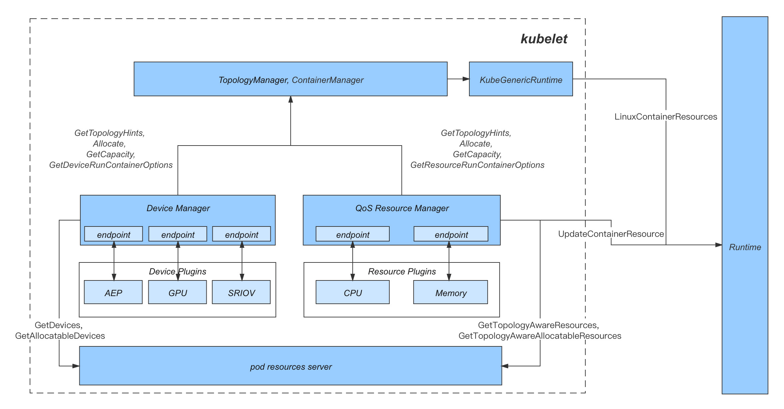
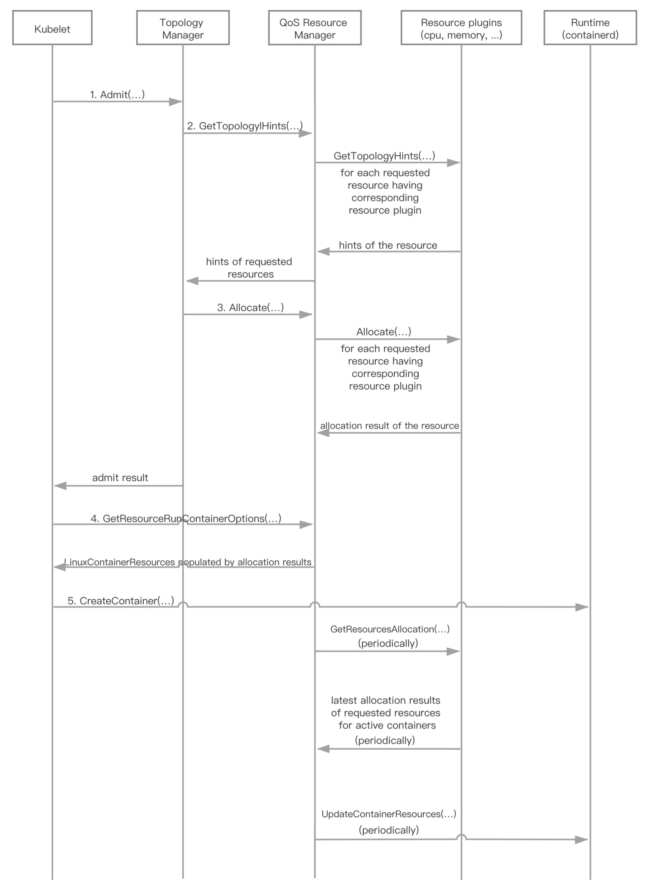

# KEP-3461: Add QoS Resource Manager to Extend Resource Allocation Policies

<!-- toc -->
- [Summary](#summary)
- [Motivation](#motivation)
  - [Goals](#goals)
  - [Non-Goals](#non-goals)
- [Proposal](#proposal)
  - [User Stories](#user-stories)
    - [Story 1: Adjust resource allocation results dynamically in QoS aware systems](#story-1-adjust-resource-allocation-results-dynamically-in-qos-aware-systems)
    - [Story 2: Expand customized resource allocation policies in user-developed plugins](#story-2-expand-customized-resource-allocation-policies-in-user-developed-plugins)
    - [Story 3: Allocate share devices with NUMA affinity for multiple pods](#story-3-allocate-share-devices-with-numa-affinity-for-multiple-pods)
  - [Risks and Mitigations](#risks-and-mitigations)
    - [UX](#ux)
- [Design Details](#design-details)
  - [Detailed Working Flow](#detailed-working-flow)
    - [Synchronous Pod Admission](#synchronous-pod-admission)
    - [Asynchronous Resource Adjustment](#asynchronous-resource-adjustment)
  - [Pod Resources Checkpoint](#pod-resources-checkpoint)
  - [Simulation: how QRM works](#simulation-how-qrm-works)
    - [Example 1: running a QoS System using QRM](#example-1-running-a-qos-system-using-qrm)
      - [Initialize plugins](#initialize-plugins)
      - [Admit pod with online role](#admit-pod-with-online-role)
      - [Admit pod with offline role](#admit-pod-with-offline-role)
      - [Admit another pod with online role](#admit-another-pod-with-online-role)
      - [Periodically adjust resource allocation](#periodically-adjust-resource-allocation)
    - [Example 2: allocate NUMA-affinity resources with extended policy](#example-2-allocate-numa-affinity-resources-with-extended-policy)
      - [Initialize plugins](#initialize-plugins-1)
      - [Admit pod with storage-service role](#admit-pod-with-storage-service-role)
      - [Admit pod with reranker role](#admit-pod-with-reranker-role)
    - [Example 3: allocate shared NUMA affinitive NICs](#example-3-allocate-shared-numa-affinitive-nics)
      - [Initialize plugins](#initialize-plugins-2)
      - [Admit pod with numa-sharing &amp;&amp; cpu-execlusive role](#admit-pod-with-numa-sharing--cpu-execlusive-role)
      - [Admit another pod with the same role](#admit-another-pod-with-the-same-role)
  - [New Flags and Configuration of QRM](#new-flags-and-configuration-of-qrm)
    - [Feature Gate Flag](#feature-gate-flag)
    - [QRM Reconcile Period Flag](#qrm-reconcile-period-flag)
    - [How this proposal affects the kubelet ecosystem](#how-this-proposal-affects-the-kubelet-ecosystem)
      - [Container Manager](#container-manager)
      - [Topology Manager](#topology-manager)
      - [kubeGenericRuntimeManager](#kubegenericruntimemanager)
      - [Kubelet Node Status Setter](#kubelet-node-status-setter)
      - [Pod Resources Server](#pod-resources-server)
  - [Test Plan](#test-plan)
- [Production Readiness Review Questionnaire](#production-readiness-review-questionnaire)
  - [Feature Enablement and Rollback](#feature-enablement-and-rollback)
      - [How can this feature be enabled / disabled in a live cluster?](#how-can-this-feature-be-enabled--disabled-in-a-live-cluster)
      - [Does enabling the feature change any default behavior?](#does-enabling-the-feature-change-any-default-behavior)
      - [Can the feature be disabled once it has been enabled (i.e. can we roll back the enablement)?](#can-the-feature-be-disabled-once-it-has-been-enabled-ie-can-we-roll-back-the-enablement)
      - [What happens if we reenable the feature if it was previously rolled back?](#what-happens-if-we-reenable-the-feature-if-it-was-previously-rolled-back)
      - [Are there any tests for feature enablement/disablement?](#are-there-any-tests-for-feature-enablementdisablement)
  - [Rollout, Upgrade and Rollback Planning](#rollout-upgrade-and-rollback-planning)
      - [How can a rollout or rollback fail? Can it impact already running workloads?](#how-can-a-rollout-or-rollback-fail-can-it-impact-already-running-workloads)
      - [What specific metrics should inform a rollback?](#what-specific-metrics-should-inform-a-rollback)
      - [Were upgrade and rollback tested? Was the upgrade-&gt;downgrade-&gt;upgrade path tested?](#were-upgrade-and-rollback-tested-was-the-upgrade-downgrade-upgrade-path-tested)
      - [Is the rollout accompanied by any deprecations and/or removals of features, APIs, fields of API types, flags, etc.?](#is-the-rollout-accompanied-by-any-deprecations-andor-removals-of-features-apis-fields-of-api-types-flags-etc)
  - [Monitoring Requirements](#monitoring-requirements)
  - [Dependencies](#dependencies)
  - [Scalability](#scalability)
  - [Troubleshooting](#troubleshooting)
      - [How does this feature react if the API server and/or etcd is unavailable?](#how-does-this-feature-react-if-the-api-server-andor-etcd-is-unavailable)
      - [What are other known failure modes?](#what-are-other-known-failure-modes)
      - [What steps should be taken if SLOs are not being met to determine the problem?](#what-steps-should-be-taken-if-slos-are-not-being-met-to-determine-the-problem)
- [Implementation History](#implementation-history)
- [Drawbacks](#drawbacks)
- [Appendix](#appendix)
  - [Related Features](#related-features)
<!-- /toc -->

## Summary

Despite the fact that the CPU Manager and Memory Manager in kubelet can allocate `cpuset.cpus` and `cpuset.mems` 
with numa affinity, they have some restrictions and are difficult to customize since all policies of them share 
the same checkpoint.

* For instance, only pods with Guaranteed QoS class can be allocated with exclusive `cpuset.cpus` and `cpuset.mems`, 
  but in each individual production environment, Kubernetes original QoS classes may be not flexible enough to depict 
  workloads with different QoS requirements. 
* Besides, those allocation logic works in a static way cause it only counts on numerical values of each resource, 
  without considering the running state of each node. 
* Finally, the current implementation is not pluggable, and if new policies or additional resource managers 
  (like disk quota or network bandwidth) are needed, we have to make changes for kubelet source codes and 
  update kubelet for clusters and that would be costly.

Thus, we propose the `QoS Resource Manager` (abbreviated to `QRM` later in the article) as a new component in kubelet 
ecosystem. It extends the ability of resource allocation in admission phase, and enable dynamic resource allocation 
adjustment for pods with better flexibility. 

QRM works in a similar way like the Device Manager, and resource allocation logic will be implemented in external plugins. 
It will then periodically collect latest resource allocation results, along with real-time node running states, and 
assemble them as parameters to update through standard CRI interface, like `cpuset.cpus`, `cpuset.mems` or any other 
potential resources needed in the future,. 

In this way, the allocation and adjustment logic is offloaded to different plugins, and can be customized by 
user-defined QoS requirements. In addition, we can implement setting and adjustment logic in plugins for cgroup 
parameters supported in LinuxContainerResources config (eg. `memory.oom_control`, `io.weight`), QRM will set and 
update those parameters for pods when corresponding plugins registered.

Currently, we have already implemented QRM framework and multiple plugins, and they are already running in production 
to support QoS-Aware and heterogeneous systems.

## Motivation

### Goals

* **Pluggable:** make it easier to extend additional resource allocation and adjustment (NUMA affinitive NICs, network or memory 
  bandwidth, disk capacity etc.) without modifying kubelet source codes.
* **Adjustable:** dynamically adjust resource allocation and qos-control strategies according to the real-time node running states.
* **Customizable:** all resource plugins can do the customized qos managing by the specific qos definition.

### Non-Goals

* Expand or overturn current pod QoS definitions, thus they'll still remain as Guarantee, Burstable and BestEffort.
  Instead, users should use common annotations to reflect customized QoS types as needed. 
* Replace current implementation of the CPU Manager and Memory Manager, and they will still work as general resource 
  allocation components to match native QoS definitions.

## Proposal

QRM is a new component of the kubelet ecosystem proposed to extend resource allocation policies. Besides:
* QRM is also a hint provider for Topology Manager like Device Manager.
* The hints are intended to indicate preferred resource affinity, and pind the resources for a container 
  either to a single or a group of NUMA nodes. 
* QRM will not restrict to any native QoS definition; instead, it will pass meta to plugins and plugins should 
  make it with customized policies.

### User Stories

#### Story 1: Adjust resource allocation results dynamically in QoS aware systems

To improve resource utilization rate, overselling, either by VPA or by running complementary workloads in one node, 
is usually used in production environments. As a result, the resource consumption states will always be in flux, 
thus static resource allocation (i.e. `cpuset.cpus` or `cpu.cfs_quota_us`) is not enough, especially for workloads 
with high performance requirements. So a real-time, customized and dynamic resource allocation results adjustment 
mechanism will be needed.

The dynamic adjustment for resource allocation results is usually closely tied to the implementation of QoS aware 
systems and workload characteristics, so it would be better to provide a general framework in kubelet and offload 
the resource allocation in plugins. QRM works as such a framework.

#### Story 2: Expand customized resource allocation policies in user-developed plugins

The native CPU/Memory Manager requires that only pods with Guarantee QoS can be allocated with exclusive `cpuset.cpus` 
or `cpuset.mems`, but this abstraction lacks flexibility.

For instance, in a hybrid cluster, `offline ETL workloads`, `latency-sensitive web services` and`storage services` 
may run in one same node. In this case, there may be three kinds of `cpuset.cpus` pools, one for offline workloads 
with shared `cpuset.cpus`, one for web services with shared or exclusive `cpuset.cpus`, and one for storage services 
with exclusive `cpuset.cpus`. And the same logic may be required for `cpuset.mems` allocation.

In other words, we need a `role-based` or `fine-grained` QoS classification and corresponding resource allocation 
logic, which is uneasy to implement in general CPU/Memory Manager, but can be implemented in user-developed plugins.

#### Story 3: Allocate share devices with NUMA affinity for multiple pods

Consider a node that has multiple NUMA nodes and network interfaces, and pods scheduled to this node want to stick 
to single NUMA and only use network interface that is affiliated with the NUMA.

In this case, multiple pods need to be allocated with the same network device. Although the Device Manager and 
device plugins can be used, it only allows for `exclusive mode`, ie, device can only be allocated to one certain 
container. A possible workaround is to allocate `fake device` and set its amount to a large enough value, but 
`fake device` is kind of weird for end users to request as a resource.

With the help of QRM, we also express this `implicit` allocation requirements in annotations and make the customized 
plugins support it.

### Risks and Mitigations

#### UX

To increase the UX, the number of new kubelet flags was minimized to a minimum. The minimum set of kubelet flags, 
which is necessary to configure the QoS Resource Manger, is presented in this section.

## Design Details


As shown in the figure above, QRM works as both a plugin handler added to kubelet plugin manager, 
and a hint provider for Topology Manager.

As a plugin handler, QRM is responsible for plugin registration of new plugins, and brings the resource 
allocation results into effect through standard CRI interface. Detailed strategy is actually implemented 
in plugins, including NUMA affinity calculation, resources allocation and dynamic adjustment for resources or cgroup 
parameter control knobs (eg. `memory.oom_control`, `io.weight`, ...). Based on dynamic plugin discovery functionality 
in kubelet, plugins will register to QRM automatically and make effects during pod lifecycle.

As a hint provider, QRM will get preferred NUMA affinity hints of resources with corresponding plugins registered 
for a container.

### Detailed Working Flow


The figure below illustrates the workflow of QRM, including two major processes
* the synchronous workflow of pod admission and resource allocation
* and the asynchronous workflow of periodical resource adjustment

#### Synchronous Pod Admission

Once kubelet requests a pod admission, for each container in a pod, Topology Manager will query QRM (along with 
other hind providers if needed) about the preferred NUMA affinity for each resource that container requests.

QRM will call `GetTopologyHints()` of the resource plugin and get the preferred NUMA affinity for this resource, 
and return hints for each resource to Topology Manager. Topology Manager then will figure out which NUMA node or a 
group of NUMA nodes are the best fit for resources/devices affinity aligned allocation after merging hints from 
all hint providers.

After getting the best fit, Topology Manager will call `Allocate()` of all hint providers for the container. 
When `Allocate()` is called, QRM will assemble a ResourceRequest for each resource. ResourceRequest contains 
pod and container metadata, pod `role` and resource `QoS type`, the requested resource name and request/limit quantities 
and the best hint got in the previous step. To be noted, pod role and resource QoS type are newly defined, 
and are extracted by `kubernetes.io/pod-role` and `kubernetes.io/resource-type` from pod annotations. 
They are used to uniquely identify the pod QoS type which will influence the allocation results.

QRM will then call `Allocate()` of resource plugin by the ResourceRequest and get the ResourceAllocationResponse. 
The ResourceAllocationResponse contains properties AllocatedQuantity, AllocationResult, OciPropertyName, Envs, 
Annotations. etc. A possible ResourceAllocationResponse example for QRM CPU plugin would be like:
```
* AllocatedQuantity: 4
* OciPropertyName: CpusetCpus (matching with property name in LinuxContainerResources)
* AllocatationResult: "0-1,8-9" (matching with cgroup cpuset.cpus format)
```

After successfully getting the ResourceAllocationResponse, QRM will cache the allocation result in the pod resources 
checkpoint, and make the checkpoint persistent by writing checkpoint file.

In PreCreateContainer phase, kubeGenericRuntimeManager indirectly will call `GetResourceRunContainerOptions()` of QRM. 
And the allocation results for the container cached in the pod resources checkpoint will be populated into
[LinuxContainerResources](https://github.com/kubernetes/cri-api/blob/master/pkg/apis/runtime/v1alpha2/api.pb.go#L3075) 
of CRI api by reflecting mechanism.

The completed LinuxContainerResources config will be embedded in the 
[ContainerConfig](https://github.com/kubernetes/cri-api/blob/master/pkg/apis/runtime/v1alpha2/api.pb.go#L4137), 
and be passed as a parameter of 
[`CreateContainer()`](https://github.com/kubernetes/cri-api/blob/master/pkg/apis/services.go#L35) API. In this way, 
the resource allocation results or cgroup parameter control knobs generated by QRM will be taken into the runtime.

The overall calculation is performed for all containers in the pod, and if none of containers is rejected, pod finally 
becomes admitted and deployed.

#### Asynchronous Resource Adjustment

Dynamic resource adjustment is provided as an enhancement for static resource allocation, and is needed in 
some cases (e.g. QoS aware resource adjustment for resource utilization improvement mentioned in user story 1 above).

To support this case, QRM invokes `reconcileState()` periodically, and afterwards calls`GetResourcesAllocation()` of 
every registered plugin to get latest resource allocation results. QRM will then update pod resources checkpoint and call 
[`UpdateContainerResources()`](https://github.com/kubernetes/cri-api/blob/master/pkg/apis/services.go#L47) 
to update cgroup configs for containers by latest resource allocation results.

### Pod Resources Checkpoint

Pod resources checkpoint is a cache for QRM to keep track of the resource allocation results. It is made by 
registered resource plugins for all active containers and their resources requests. The structure is shown below:
```
type ResourceAllocation map[string]*ResourceAllocationInfo    // Keyed by resourceName
type ContainerResources map[string]ResourceAllocation         // Keyed by containerName
type PodResources map[string]ContainerResources               // Keyed by podUID
type podResourcesChk struct {
    sync.RWMutex
    resources PodResources    // Keyed by podUID
}

type ResourceAllocationInfo struct {
    OciPropertyName  string `protobuf:"bytes,1,opt,name=oci_property_name,json=ociPropertyName,proto3" json:"oci_property_name,omitempty"`
    IsNodeResource   bool   `protobuf:"varint,2,opt,name=is_node_resource,json=isNodeResource,proto3" json:"is_node_resource,omitempty"`
    IsScalarResource bool   `protobuf:"varint,3,opt,name=is_scalar_resource,json=isScalarResource,proto3" json:"is_scalar_resource,omitempty"`
    // only for resources with true value of IsScalarResource
    AllocatedQuantity  float64           `protobuf:"fixed64,4,opt,name=allocated_quantity,json=allocatedQuantity,proto3" json:"allocated_quantity,omitempty"`
    AllocatationResult string            `protobuf:"bytes,5,opt,name=allocatation_result,json=allocatationResult,proto3" json:"allocatation_result,omitempty"`
    Envs               map[string]string `protobuf:"bytes,6,rep,name=envs,proto3" json:"envs,omitempty" protobuf_key:"bytes,1,opt,name=key,proto3" protobuf_val:"bytes,2,opt,name=value,proto3"`
    Annotations        map[string]string `protobuf:"bytes,7,rep,name=annotations,proto3" json:"annotations,omitempty" protobuf_key:"bytes,1,opt,name=key,proto3" protobuf_val:"bytes,2,opt,name=value,proto3"`
    ResourceHints      *ListOfTopologyHints `protobuf:"bytes,8,opt,name=resource_hints,json=resourceHints,proto3" json:"resource_hints,omitempty"`
}
```

PodResources structure is organized as a three-layer map, and it uses pod UID, container name and resource name 
as keys for each level. ResourceAllocationInfo is stored in the lowest map, and contains the allocation result
of a specific resource for the identified container. ResourceAllocationInfo currently has those properties:
```
* OCIPropertyName
  - it's used to identify which property in the config LinuxContainerResources should be populated into.
* IsScalarResource
  - if it's true, resource allocation results can be quantified, and possibly be used as foundation of scheduling and 
  admitting logic. QRM will compare the requested quantity with the allocated quantity when the active container is re-admitted.
* IsNodeResource
  - if this property and IsScalarResource are both true, QRM will expose "allocatable" and "capacity" quantities of the 
    resource to kubelet node status setter, and finally set to node status.
  - For instance, quantified resources have been covered in kubelet node status setter (eg. cpu, memory, ..), it's 
    unnecessary to set quantity of them to node status again, so we should set IsNodeResource as false. Otherwise, we 
    should set IsNodeResource as true for those extended quantified resources, and set quantity of them to node status.
* AllocatedQuantity
  - it represents resource allocated quantity for the container, and it's only for resources with IsScalarResource 
    set as true.
* AllocatationResult
  - it represents resource allocation result for the container, and must be a valid value of the property in 
    LinuxContainerResources that OciPropertyName indicates. For example, if OciPropertyName is CpusetCpus, the 
    AllocatationResult should be like "0-1,8-9" (a valid value for cgroup cpuset.cpus).
* Envs
  - environmental variables that the resource plugin returns and should be set in the container.
* Annotations
  - annotations that the resource plugin returns and should be taken to runtime.
* ResourceHints
  it's the preferred NUMA affinity matching with the AllocatationResult. It will be used when kubelet restarts, and 
  active containers with allocated resources are re-admitted.
```

### Simulation: how QRM works

#### Example 1: running a QoS System using QRM

Assume that we have a machine with CPU Intel(R) Xeon(R) Platinum 8260 CPU @ 2.40GH 
(80 CPUs, 0-39 in NUMA node0, 40-79 in NUMA node1).

We divide CPUs in this machine into two pools, one for common online micro-service (eg. web service), 
and the other for common offline workloads (eg. ETL or video transcoding tasks).
And we deploy a QoS aware system to adjust the size of those two pools according to the performance metrics.

##### Initialize plugins

QRM CPU Plugin starts to work:
- Initialize those two `cpuset.cpus` pools
  - suppose `0-37,40-77` for online pool, and `38-39,78-79` for offline pool by default
- QRM CPU Plugin is discovered by kubelet plugin manager dynamically and register to QRM

##### Admit pod with online role

Suppose there comes a pod1 with one container requesting 4 CPUs, and its pod role is online-micro_service, 
meaning that it should be placed in the online pool.

In pod1 admission phase, QRM calls `Allocate()` of QRM CPU plugin. And plugin identifies that the container is for 
online `cpuset.cpus` pool, so it returns `ResourceAllocationResponse` like below:
```
{ 
    "pod_uid": "054a696f-d176-488d-b228-d6046faaf67c",
    "pod_namespace": "default",
    "pod_name": "pod1",
    "container_name": "container0",
    "container_type": "MAIN",
    "container_index": 0,
    "pod_role": "online-micro_service",
    "resource_name": "cpu",
    "allocatation_result": {
        "resource_allocation": {
            "cpu": {
                "oci_property_name": "CpusetCpus",
                "is_node_resource": false,
                "is_scalar_resource": true,
                "allocated_quantity": 76,
                "allocatation_result": "0-37,40-77",
                "resource_hints": [] // no NUMA preference
            }
        }
    }
}
```

QRM caches the allocation result in the pod resources checkpoint.

In the PreCreateContainer phase, the kubeGenericRuntimeManager calls `GetResourceRunContainerOptions()` of 
QRM and gets a `LinuxContainerResources` config like below
```
{
    "cpusetCpus": "0-37,40-77",
}
```

pod1 starts successfully with the `cpuset.cpus` allocated.

##### Admit pod with offline role

Suppose there comes a pod2 with one container requesting 2 CPUs, and its pod role is ETL, 
meaning that it should be placed in the offline pool.

In pod2 admission phase, QRM call `Allocate()` of QRM CPU plugin. And plugin identifies the container identifies 
that the container is for offline `cpuset.cpus` pool, so it returns `ResourceAllocationResponse` like below:
```
{ 
    "pod_uid": "fe8d9c25-6fb4-4983-908f-08e39ebeafe7",
    "pod_namespace": "default",
    "pod_name": "pod2",
    "container_name": "container0",
    "container_type": "MAIN",
    "container_index": 0,
    "pod_role": "ETL",
    "resource_name": "cpu",
    "allocatation_result": {
        "resource_allocation": {
            "cpu": {
                "oci_property_name": "CpusetCpus",
                "is_node_resource": false,
                "is_scalar_resource": true,
                "allocated_quantity": 4,
                "allocatation_result": "38-39,78-79",
                "resource_hints": [] // no NUMA preference
            }
        }
    }
}
```

QRM cache the allocation result in the pod resources checkpoint.

In the PreCreateContainer phase, the kubeGenericRuntimeManager calls `GetResourceRunContainerOptions()` of 
QRM and gets a `LinuxContainerResources` config like below:
```
{
    "cpusetCpus": "38-39,78-79"",
}
```
The pod2 starts successfully with the `cpuset.cpus` allocated.

##### Admit another pod with online role

Similar to the pod1, if there comes a pod3 also with online-micro_service role, it will be placed in the online 
pool too. So it will get a `LinuxContainerResources` config like below in the `PreCreateContainer` phase:
```
{
    "cpusetCpus": "0-37,40-77",
}
```

##### Periodically adjust resource allocation

After a period of time, the QoS aware system adjusts the online `cpuset.cpus` pool to `0-13,40-53` and 
the offline `cpuset.cpus` pool `14-39,54-79`, according the system indicators.

QRM invokes `reconcileState()` for latest resource allocation results (like below) from QRM CPU plugin. 
It then updates the pod resources checkpoint, and calls `UpdateContainerResources()` to update the cgroup resources 
for containers by latest resource allocation results.
```
 { 
    "pod_resources": {
        "054a696f-d176-488d-b228-d6046faaf67c": { // pod1
            "container0": {
                "cpu": {
                    "oci_property_name": "CpusetCpus",
                    "is_node_resource": false,
                    "is_scalar_resource": true,
                    "allocated_quantity": 28,
                    "allocatation_result": "0-13,40-53",
                    "resource_hints": [] // no NUMA preference
                }
            }
        },
        "fe8d9c25-6fb4-4983-908f-08e39ebeafe7": { // pod2
            "container0": {
                "cpu": {
                    "oci_property_name": "CpusetCpus",
                    "is_node_resource": false,
                    "is_scalar_resource": true,
                    "allocated_quantity": 52,
                    "allocatation_result": "14-39,54-79",
                    "resource_hints": [] // no NUMA preference
                }
            }
        },
        "26731da7-b283-488b-b232-cff611c914e1": { // pod3
            "container0": {
                "cpu": {
                    "oci_property_name": "CpusetCpus",
                    "is_node_resource": false,
                    "is_scalar_resource": true,
                    "allocated_quantity": 28,
                    "allocatation_result": "0-13,40-53",
                    "resource_hints": [] // no NUMA preference
                }
            }
        },
    }
}
```

#### Example 2: allocate NUMA-affinity resources with extended policy

Assume that we have a machine with CPU Intel(R) Xeon(R) Platinum 8260 CPU @ 2.40GH 
(80 CPUs, 0-39 in NUMA node0, 40-79 in NUMA node1; 452 GB memory, 226 GB in NUMA node0, 26 GB in NUMA node1)

And we have multiple latency-sensitive services, including storage services, re-caller, retriever and re-ranker services 
in information retrieval systems. etc. To meet QoS requirements, we should pin them to exclusive
NUMA nodes by setting `cpuset.cpus` and `cpuset.mems`.

Although the default CPU/Memory Manager have already provided the ability to set `cpuset.cpus` and `cpuset.mems` 
for containers, current policies are only toward Guaranteed pod QoS class, and can't handle container anti-affinity 
in NUMA nodes scope with flexibility.


##### Initialize plugins

QRM CPU/Memory plugins start to work
- QRM CPU plugin initializes checkpoint with default machine state like below:
```
{
    "machineState": {
        "0": {
            "reserved_cpuset": "0-1",
            "allocated_cpuset": "",
            "default_cpuset": "2-39"
        },
        "1": {
            "reserved_cpuset": "40-41",
            "allocated_cpuset": "",
            "default_cpuset": "42-79"
        }
    },
    "pod_entries": {}
}
```
- QRM Memory plugin initializes checkpoint with default machine state like below:
```
{
    "machineState": {
        "memory": {
            "0": {
                "Allocated": "0",
                "allocatable": "237182648320",
                "free": "237182648320",
                "pod_entries": {},
                "systemReserved": "524288000",
                "total": "237706936320"
            },
            "1": {
                "Allocated": "0",
                "allocatable": "237282263040",
                "free": "237282263040",
                "pod_entries": {},
                "systemReserved": "524288000",
                "total": "237806551040"
            }
        }
    },
    "pod_resource_entries": {},
}
```
- All QRM plugins are discovered by kubelet plugin manager dynamically and register to QRM

##### Admit pod with storage-service role

There comes a pod1 with one container requesting 20 CPUs, 40GB memory and its pod role is storage-service.

In pod1 admission phase, QRM calls `GetTopologyHints()` of QoS plugins, and gets preferred NUMA affinity 
hint (10) from both of them. Then QRM calls `Allocate()` of plugins
- calls Allocate() of QoS CPU plugin gets `ResourceAllocationResponse` like below:
```
{ 
    "pod_uid": "bc9e28df-1b5c-4099-8866-6110277184e0",
    "pod_namespace": "default",
    "pod_name": "pod1",
    "container_name": "container0",
    "container_type": "MAIN",
    "container_index": 0,
    "pod_role": "storage-service",
    "resource_name": "cpu",
    "allocatation_result": {
        "resource_allocation": {
            "cpu": {
                "oci_property_name": "CpusetCpus",
                "is_node_resource": false,
                "is_scalar_resource": true,
                "allocated_quantity": 20,
                "allocatation_result": "2-21",
                "resource_hints": [
                    {
                        "nodes": [0],
                        "Preferred": true
                    }
                ]
            }
        }
    }
}
```
- calls Allocate() of QoS Memory plugin and gets `ResourceAllocationResponse` like below:
```
{ 
    "pod_uid": "bc9e28df-1b5c-4099-8866-6110277184e0",
    "pod_namespace": "default",
    "pod_name": "pod1",
    "container_name": "container0",
    "container_type": "MAIN",
    "container_index": 0,
    "pod_role": "storage-service",
    "resource_name": "memory",
    "allocatation_result": {
        "resource_allocation": {
            "cpu": {
                "oci_property_name": "CpusetMems",
                "is_node_resource": false,
                "is_scalar_resource": true,
                "allocated_quantity": 1,
                "allocatation_result": "0",
                "resource_hints": [
                    {
                        "nodes": [0],
                        "Preferred": true
                    }
                ]
            }
        }
    }
}
```
QRM caches the allocation results in the pod resources checkpoint.
In the `PreCreateContainer` phase, the kubeGenericRuntimeManager calls `GetResourceRunContainerOptions()` of 
QRM and gets a `LinuxContainerResources` config like below:
```
{
    "cpusetCpus": "2-21",
    "cpusetMems": "0",
}
```
The pod1 starts successfully with the `cpuset.cpus`, `cpuset.mems` allocated.

##### Admit pod with reranker role

There comes a pod2 with one container requesting 10 CPUs, 20GB memory and its pod role is reranker.

Although the quantity of available resources is enough for the pod2, QRM plugins identify that pod1 and 
pod2 should follow anti-affinity requirement in NUMA nodes scope by pod roles. So `ResourceAllocationResponses`
for pod2 from QRM CPU/Memory plugins are like below:
```
{ 
    "pod_uid": "6f695526-b07c-4baa-90e3-af1dfed2faf8",
    "pod_namespace": "default",
    "pod_name": "pod2",
    "container_name": "container0",
    "container_type": "MAIN",
    "container_index": 0,
    "pod_role": "storage-service",
    "resource_name": "cpu",
    "allocatation_result": {
        "resource_allocation": {
            "cpu": {
                "oci_property_name": "CpusetCpus",
                "is_node_resource": false,
                "is_scalar_resource": true,
                "allocated_quantity": 10,
                "allocatation_result": "42-51",
                "resource_hints": [
                    {
                        "nodes": [1],
                        "Preferred": true
                    }
                ]
            }
        }
    }
}

{ 
    "pod_uid": "6f695526-b07c-4baa-90e3-af1dfed2faf8",
    "pod_namespace": "default",
    "pod_name": "pod2",
    "container_name": "container0",
    "container_type": "MAIN",
    "container_index": 0,
    "pod_role": "storage-service",
    "resource_name": "memory",
    "allocatation_result": {
        "resource_allocation": {
            "cpu": {
                "oci_property_name": "CpusetMems",
                "is_node_resource": false,
                "is_scalar_resource": true,
                "allocated_quantity": 1,
                "allocatation_result": "1",
                "resource_hints": [
                    {
                        "nodes": [1],
                        "Preferred": true
                    }
                ]
            }
        }
    }
}
```

QRM caches the allocation result in the pod resources checkpoint.In the `PreCreateContainer` phase, 
the `kubeGenericRuntimeManager` calls `GetResourceRunContainerOptions()` of QRM and 
gets a `LinuxContainerResources` config like below:
```
{
    "cpusetCpus": "42-51",
    "cpusetMems": "1",
}
```
The pod2 starts successfully with the cpuset.cpus allocated.

#### Example 3: allocate shared NUMA affinitive NICs

Assume that we have a machine with CPU Intel(R) Xeon(R) Platinum 8260 CPU @ 2.40GH 
(80 CPUs, 0-39 in NUMA node0, 40-79 in NUMA node1) and 2 Mellanox Technologies MT28841 NICs with speed 25000Mb/s 
(eth0 is affinitive to NUMA node0, eth1 is affinitive to NUMA node1 and).

##### Initialize plugins

QRM CPU/Memory/NIC plugins start to work
- QRM CPU/Memory plugins initialize checkpoint with default machine state (same as example 2)
- QRM NIC plugin initializes checkpoint with default machine state containing NICs information organized by NUMA affinity:
```
{
    "machineState": {
        "0": {
            "nics": [
                {
                    "interface_name": "eth0",
                    "nuam_node": 0,
                    "address": {
                        "ipv6": "fdbd:dc05:3:154::20"
                    }
                }
            ]
        },
        "1": {
            "nics": [
                {
                    "interface_name": "eth1",
                    "nuam_node": 1,
                    "address": {
                        "ipv6": "fdbd:dc05:3:155::20"
                    },
                    "netns": "/var/run/netns/ns1" // must be filled in if the NIC is added to the non-default network namespace 
                }
            ]
        },
    },
    "pod_entries": {}
}
```
- All QRM plugins are discovered by kubelet plugin manager dynamically and register to QRM


##### Admit pod with numa-sharing && cpu-execlusive role

We assume that all related resources in NUMA node0 have been allocated and allocatable resources in 
NUMA node1 are all available. There comes a pod1 with one container requesting 10 CPUs, 20GB memory, 
hostNetwork true and its pod role is `numa-sharing && cpu-execlusive` (`numa-enhancement` for abbreviation). 
This role means the pod can be located in the same NUMA node with other pods with the same role, 
but it should be allocated with exclusive `cpuset.cpus`.

In pod1 admission phase, QRM calls `GetTopologyHints()` of QoS plugins, and gets preferred NUMA affinity 
hint (01) from all of them. Then QRM calls `Allocate()` of plugins
- calls `Allocate()` of QRM CPU/Memory plugins and gets `ResourceAllocationResponses` similar to example 2
- calls `Allocate()` of QRM NIC plugin and gets `ResourceAllocationResponse` like below:
```
{ 
    "pod_uid": "c44ba6fd-2ce5-43e0-8d4d-b2224dfaeebd",
    "pod_namespace": "default",
    "pod_name": "pod1",
    "container_name": "container0",
    "container_type": "MAIN",
    "container_index": 0,
    "pod_role": "numa-enhancement",
    "resource_name": "NIC",
    "allocatation_result": {
        "resource_allocation": {
            "NIC": {
                "oci_property_name": "",
                "is_node_resource": false,
                "is_scalar_resource": false,
                "resource_hints": [
                    {
                        "nodes": [1],
                        "Preferred": true
                    }
                ],
                "envs": {
                    "AFFINITY_NIC_ADDR_IPV6": "fdbd:dc05:3:155::20"
                },
                "annotations": {
                    "kubernetes.io/host-netns-path": "/var/run/netns/ns1"
                }
            }
        }
    }
}
```

QRM caches the allocation results in the pod resources checkpoint.
In the `PreCreateContainer` phase, the kubeGenericRuntimeManager calls `GetResourceRunContainerOptions()` 
of QRM and gets a `ResourceRunContainerOptions` like below, and the content will be filled into `ContainerConfig`
```
{
    "envs": {
        "AFFINITY_NIC_ADDR_IPV6": "fdbd:dc05:3:155::20",
    },
    "annotations": {
        "kubernetes.io/host-netns-path": "/var/run/netns/ns1"
    },
    "linux_container_resources": { 
        "cpusetCpus": "42-51",
        "cpusetMems": "1",
    },
}
```
The pod1 starts successfully with the cpuset.cpus, cpuset.mems allocated. In addition, the container process can 
get IP address of the NIC with NUMA affinity from the environment variable `AFFINITY_NIC_ADDR_IPV6` 
and bind sockets to the address.

##### Admit another pod with the same role

There comes a pod2 with one container requesting 10 CPUs, 20GB memory, hostNetwork true and its pod role is also
`numa-enhancement`. That means the pod2 can be located in the same NUMA node with the pod1 if the available 
resources satisfy the requirements.

Similar to the pod1, the pod2 gets a `ResourceRunContainerOptions` like below in admission phase
```
{
    "envs": {
        "AFFINITY_NIC_ADDR_IPV6": "fdbd:dc05:3:155::20",
    },
    "annotations": {
        "kubernetes.io/host-netns-path": "/var/run/netns/ns1"
    },
    "linux_container_resources": { 
        "cpusetCpus": "52-61",
        "cpusetMems": "1",
    },
}
```

Notice that the pod1 and pod2 share the same NIC. If we implement a device plugin with the device manager to 
provide NIC information with NUMA affinity, it's exclusive so we can't make multiple pods share the same device ID.

### New Flags and Configuration of QRM

#### Feature Gate Flag

A new feature gate flag will be added to enable QRM feature. 
This feature gate will be disabled by default in the initial releases.

Syntax: `--feature-gate=QoSResourceManager=false|true`

#### QRM Reconcile Period Flag

This flag controls the interval time between QRM invoking `reconcileState()` to adjust allocation results dynamically. 
If not supplied, its default value is 3s.

Syntax: `--qos-resource-manager-reconcile-period=10s|1m`

#### How this proposal affects the kubelet ecosystem

##### Container Manager

Container Manager will create QRM and register it to Topology Manager as a hint provider.

##### Topology Manager

Topology Manager will call out QRM to gather topology hints, 
and allocate resources with corresponding resource plugins registered during pod admission sequence.

##### kubeGenericRuntimeManager

kubeGenericRuntimeManager will indirectly call `GetResourceRunContainerOptions()` of QRM, and get 
`LinuxContainerResources` config populated with allocation results of requested resources during executing `startContainer()`.

##### Kubelet Node Status Setter

MachineInfo setter will be extended to indirectly call `GetCapacity()` of QRM to get capacity, 
allocatable quantity of resources and already-removed resource names from registered resource plugins.

##### Pod Resources Server

In order to get the allocated and allocatable resources managed by QRM and registered resource plugin from 
pod resources server, we make the container manager implement ResourcesProvider defined below:
```
// ResourcesProvider knows how to provide the resources used by the given container
type ResourcesProvider interface {
    // UpdateAllocatedResources frees any Resources that are bound to terminated pods.
    UpdateAllocatedResources()
    // GetResources returns information about the resources assigned to pods and containers in topology aware format
    GetTopologyAwareResources(pod *v1.Pod, container *v1.Container) []*podresourcesapi.TopologyAwareResource
    // GetAllocatableResources returns information about all the resources known to the manager in topology aware format
    GetTopologyAwareAllocatableResources() []*podresourcesapi.AllocatableTopologyAwareResource
}

When List() of the pod resources server is called, below calling train will be trigger:
(*v1PodResourcesServer).List(...) -> 
(*containerManagerImpl)).GetTopologyAwareResources(...) -> 
(*QoSResourceManagerImpl).GetTopologyAwareResources(...) -> 
(*resourcePluginEndpoint).GetTopologyAwareResources(...) for each registered resource plugin
QRM will merge allocated resource responses from resource plugins and the pod resources server 
will return the merged information to the end user.

When GetAllocatableResources() of the pod resources server is called, below calling train will be trigger:
(*v1PodResourcesServer).GetAllocatableResources(...) -> 
(*containerManagerImpl)).GetTopologyAwareAllocatableResources(...) -> 
(*QoSResourceManagerImpl).GetTopologyAwareAllocatableResources(...) -> 
(*resourcePluginEndpoint).GetTopologyAwareAllocatableResources(...) for each registered resource plugin
QRM will merge allocatable resource responses from resource plugins and the pod resources server 
will return the merged information to the end user.
```

### Test Plan

We will initialize QRM with mock resource plugins registered and cover key points listed below:
- the plugin mananger can discover the listening resource plugin dynamically and register it into QRM successfully.
- QRM can return correct LinuxContainerResources config populated with allocation results.
- Validate allocating resources to containers and getting preferred NUMA affinity hints in QRM through registered resource plugins.
- Validate that reconcileState() of QRM will update the cgroup configs for containers by latest resource allocation results.
- GetTopologyAwareAllocatableResources() and GetTopologyAwareResources()of QRM return correct allocatable 
and allocated to the pod resources server.
- pod resources checkpoint is stored and resumed normally and its basic operations work as expected.

## Production Readiness Review Questionnaire

### Feature Enablement and Rollback

##### How can this feature be enabled / disabled in a live cluster?

Feature gate
- Feature gate name: QoSResourceManager
- Components depending on the feature gate: kubelet
- Will enabling / disabling the feature require downtime of the control plane? No
- Will enabling / disabling the feature require downtime or reprovisioning of a node? 
(Do not assume Dynamic Kubelet Config feature is enabled). Yes, it uses a feature gate.

##### Does enabling the feature change any default behavior?

Yes, the pod admission flow will change if QRM is enabled, it will call the plugins to determine 
whether the pod is admitted or not. And QRM can't work together with CPU Manager or Memory Manager if 
there are plugins for CPU/Memory allocation registered to QRM.

##### Can the feature be disabled once it has been enabled (i.e. can we roll back the enablement)?

Yes, it uses a feature gate.

##### What happens if we reenable the feature if it was previously rolled back?

QRM uses the state file to track resource allocations. If the state file is not valid, 
it's better to remove the state file and restart kubelet. 
(e.g. the state file might become invalid that some pods in it have been removed). 
But the Manager will reconcile to fix it, so it won't be a big deal.

##### Are there any tests for feature enablement/disablement?

Yes, there is a number of Unit Tests designated for State file validation.

### Rollout, Upgrade and Rollback Planning

##### How can a rollout or rollback fail? Can it impact already running workloads?

It is possible that the State file will have inconsistent data during the rollout, 
because of kubelet restart, but you can easily fix it by removing State file and restarting kubelet. 
It should not affect any running workloads. And the Manager will reconcile to fix it, so it won't be a big deal.

##### What specific metrics should inform a rollback?

The pod may fail with the admission error because the plugin fails to allocate resources. 
You can see the error message under the pod events.

##### Were upgrade and rollback tested? Was the upgrade->downgrade->upgrade path tested?

Yes.

##### Is the rollout accompanied by any deprecations and/or removals of features, APIs, fields of API types, flags, etc.?

No.

### Monitoring Requirements

###### How can an operator determine if the feature is in use by workloads?

QRM data will also be available under Pod Resources API.

###### How can someone using this feature know that it is working for their instance?

- After pod starts, you have two options to verify if containers work as expected
  - via Pod Resources API, you will need to connect to grpc socket and get information from it. 
    Please see pod resource API doc page for more information.
  - checking the relevant container cgroup under the node.
- Pod failed to start because of the admission error.

###### What are the reasonable SLOs (Service Level Objectives) for the enhancement?

This does not seem relevant to this feature.

###### What are the SLIs (Service Level Indicators) an operator can use to determine the health of the service?

A bunch of metrics will be added to indicate the running states of QRM and the plugins. 
The detailed metrics name and meaning will be added to this doc in the future.

### Dependencies

###### Does this feature depend on any specific services running in the cluster?

None

### Scalability

###### Will enabling / using this feature result in any new API calls?

No

###### Will enabling / using this feature result in introducing new API types?

No

###### Will enabling / using this feature result in any new calls to the cloud provider?

No

###### Will enabling / using this feature result in increasing size or count of the existing API objects?

No

###### Will enabling / using this feature result in increasing time taken by any operations covered by existing SLIs/SLOs?

No

###### Will enabling / using this feature result in non-negligible increase of resource usage (CPU, RAM, disk, IO, ...) in any components?

No, the algorithm will run on a single `goroutine` with minimal memory requirements.

### Troubleshooting
##### How does this feature react if the API server and/or etcd is unavailable?

No.

##### What are other known failure modes?

During the enabling and disabling of QRM, you must remove the memory manager 
state file(/var/lib/kubelet/qos_resource_manager_state), otherwise the kubelet start will fail. 
You can identify the issue via checking the kubelet log.

##### What steps should be taken if SLOs are not being met to determine the problem?

Not applicable.

## Implementation History

QRM has been developed and running in our production environment, 
but still needs a little effort to make an open-source version.

## Drawbacks

No objections exist to implement this KEP.

## Appendix
### Related Features

- [Topology Manager](https://github.com/kubernetes/enhancements/blob/dcc8c7241513373b606198ab0405634af643c500/keps/sig-node/0035-20190130-topology-manager.md) 
  collects topology hints from various hint providers (e.g. CPU Manager or Device Manager) in order to calculate which
  NUMA nodes can offer a suitable amount of resources for a container. The final decision of Topology Manager is 
  subjected to the topology policy (i.e. best-effort, restricted, single-numa-policy) and 
  possible NUMA affinity for containers. Finally, the Topology Manager determines whether a container in a pod 
  can be deployed to the node or rejected.

* [CPU Manager](https://github.com/kubernetes/community/blob/master/contributors/design-proposals/node/cpu-manager.md) 
  provides CPU pinning functionality by using cgroups cpuset subsystem, and it also provides topology hints, 
  which indicate CPU core availability at particular NUMA nodes, to Topology Manager.

- [Device Manager](https://github.com/kubernetes/community/blob/master/contributors/design-proposals/resource-management/device-plugin.md) 
  allows device vendors to advertise their device resources such as NIC device or GPU device through their 
  device plugins to kubelet so that the devices can be utilized by containers. Similarly, Device Manager provides 
  topology hints to the Topology Manager. The hints indicate the availability of devices at particular NUMA nodes.

* [Hugepages enables](https://github.com/kubernetes/enhancements/blob/master/keps/sig-node/20190129-hugepages.md)
  the assignment of pre-allocated hugepage resources to a container.

- [Node Allocatable Feature](https://github.com/kubernetes/community/blob/master/contributors/design-proposals/node/node-allocatable.md)
  helps to increase the stability of node operation, while it pre-reserves compute resources for kubelet and system 
  processes. In v1.17, the feature supports the following reservable resources: CPU, memory, and ephemeral storage.
