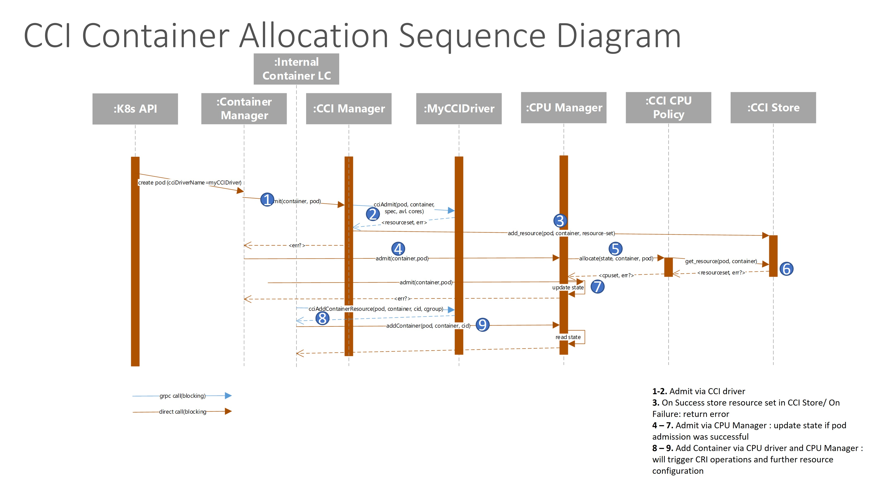
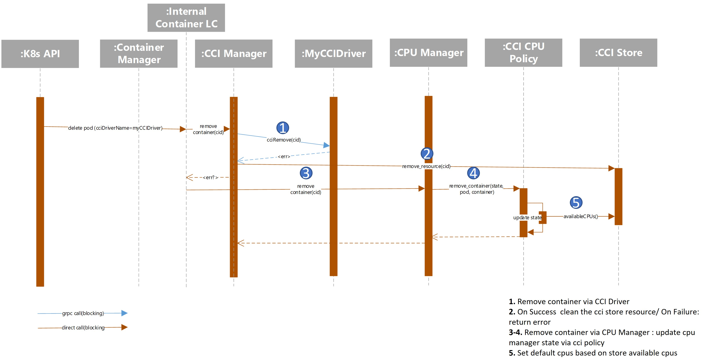

<!--
**Note:** When your KEP is complete, all of these comment blocks should be removed.

To get started with this template:

- [X] **Pick a hosting SIG.**
  sig-node
  Make sure that the problem space is something the SIG is interested in taking
  up. KEPs should not be checked in without a sponsoring SIG.
- [X] **Create an issue in kubernetes/enhancements**
  When filing an enhancement tracking issue, please make sure to complete all
  fields in that template. One of the fields asks for a link to the KEP. You
  can leave that blank until this KEP is filed, and then go back to the
  enhancement and add the link.
  Number 3675
- [X] **Make a copy of this template directory.**
  Copy this template into the owning SIG's directory and name it
  `NNNN-short-descriptive-title`, where `NNNN` is the issue number (with no
  leading-zero padding) assigned to your enhancement above.
- [ ] **Fill out as much of the kep.yaml file as you can.**
  At minimum, you should fill in the "Title", "Authors", "Owning-sig",
  "Status", and date-related fields.
- [ ] **Fill out this file as best you can.**
  At minimum, you should fill in the "Summary" and "Motivation" sections.
  These should be easy if you've preflighted the idea of the KEP with the
  appropriate SIG(s).
- [ ] **Create a PR for this KEP.**
  Assign it to people in the SIG who are sponsoring this process.
- [ ] **Merge early and iterate.**
  Avoid getting hung up on specific details and instead aim to get the goals of
  the KEP clarified and merged quickly. The best way to do this is to just
  start with the high-level sections and fill out details incrementally in
  subsequent PRs.

Just because a KEP is merged does not mean it is complete or approved. Any KEP
marked as `provisional` is a working document and subject to change. You can
denote sections that are under active debate as follows:

```
<<[UNRESOLVED optional short context or usernames ]>>
Stuff that is being argued.
<<[/UNRESOLVED]>>
```

When editing KEPS, aim for tightly-scoped, single-topic PRs to keep discussions
focused. If you disagree with what is already in a document, open a new PR
with suggested changes.

One KEP corresponds to one "feature" or "enhancement" for its whole lifecycle.
You do not need a new KEP to move from beta to GA, for example. If
new details emerge that belong in the KEP, edit the KEP. Once a feature has become
"implemented", major changes should get new KEPs.

The canonical place for the latest set of instructions (and the likely source
of this file) is [here](/keps/NNNN-kep-template/README.md).

**Note:** Any PRs to move a KEP to `implementable`, or significant changes once
it is marked `implementable`, must be approved by each of the KEP approvers.
If none of those approvers are still appropriate, then changes to that list
should be approved by the remaining approvers and/or the owning SIG (or
SIG Architecture for cross-cutting KEPs).
-->
# KEP-3675: Pluggable Resource Management 
Container Compute Interface (CCI) Driver Extension


<!--
This is the title of your KEP. Keep it short, simple, and descriptive. A good
title can help communicate what the KEP is and should be considered as part of
any review.
-->

<!--
A table of contents is helpful for quickly jumping to sections of a KEP and for
highlighting any additional information provided beyond the standard KEP
template.

Ensure the TOC is wrapped with
  <code>&lt;!-- toc --&rt;&lt;!-- /toc --&rt;</code>
tags, and then generate with `hack/update-toc.sh`.
-->

<!-- toc -->
- [Release Signoff Checklist](#release-signoff-checklist)
- [Summary](#summary)
- [Motivation](#motivation)
  - [Goals](#goals)
  - [Non-Goals](#non-goals)
- [Proposal](#proposal)
  - [User Stories](#user-stories)
  - [Notes/Constraints/Caveats (Optional)](#notesconstraintscaveats-optional)
  - [Risks and Mitigations](#risks-and-mitigations)
- [Design Details](#design-details)
  - [Test Plan](#test-plan)
      - [Unit tests](#unit-tests)
      - [Integration tests](#integration-tests)
      - [e2e tests](#e2e-tests)
  - [Graduation Criteria](#graduation-criteria)
  - [Upgrade / Downgrade Strategy](#upgrade--downgrade-strategy)
  - [Version Skew Strategy](#version-skew-strategy)
- [Production Readiness Review Questionnaire](#production-readiness-review-questionnaire)
  - [Feature Enablement and Rollback](#feature-enablement-and-rollback)
  - [Rollout, Upgrade and Rollback Planning](#rollout-upgrade-and-rollback-planning)
  - [Monitoring Requirements](#monitoring-requirements)
  - [Dependencies](#dependencies)
  - [Scalability](#scalability)
  - [Troubleshooting](#troubleshooting)
- [Implementation History](#implementation-history)
- [Drawbacks](#drawbacks)
- [Alternatives](#alternatives)
- [Infrastructure Needed](#infrastructure-needed-optional)
<!-- /toc -->

## Release Signoff Checklist

<!--
**ACTION REQUIRED:** In order to merge code into a release, there must be an
issue in [kubernetes/enhancements] referencing this KEP and targeting a release
milestone **before the [Enhancement Freeze](https://git.k8s.io/sig-release/releases)
of the targeted release**.

For enhancements that make changes to code or processes/procedures in core
Kubernetes—i.e., [kubernetes/kubernetes], we require the following Release
Signoff checklist to be completed.

Check these off as they are completed for the Release Team to track. These
checklist items _must_ be updated for the enhancement to be released.
-->

Items marked with (R) are required *prior to targeting to a milestone / release*.

- [ ] (R) Enhancement issue in release milestone, which links to KEP dir in [kubernetes/enhancements] (not the initial KEP PR)
- [ ] (R) KEP approvers have approved the KEP status as `implementable`
- [ ] (R) Design details are appropriately documented
- [ ] (R) Test plan is in place, giving consideration to SIG Architecture and SIG Testing input (including test refactors)
  - [ ] e2e Tests for all Beta API Operations (endpoints)
  - [ ] (R) Ensure GA e2e tests meet requirements for [Conformance Tests](https://github.com/kubernetes/community/blob/master/contributors/devel/sig-architecture/conformance-tests.md) 
  - [ ] (R) Minimum Two Week Window for GA e2e tests to prove flake free
- [ ] (R) Graduation criteria is in place
  - [ ] (R) [all GA Endpoints](https://github.com/kubernetes/community/pull/1806) must be hit by [Conformance Tests](https://github.com/kubernetes/community/blob/master/contributors/devel/sig-architecture/conformance-tests.md) 
- [ ] (R) Production readiness review completed
- [ ] (R) Production readiness review approved
- [ ] "Implementation History" section is up-to-date for milestone
- [ ] User-facing documentation has been created in [kubernetes/website], for publication to [kubernetes.io]
- [ ] Supporting documentation—e.g., additional design documents, links to mailing list discussions/SIG meetings, relevant PRs/issues, release notes

<!--
**Note:** This checklist is iterative and should be reviewed and updated every time this enhancement is being considered for a milestone.
-->

[kubernetes.io]: https://kubernetes.io/
[kubernetes/enhancements]: https://git.k8s.io/enhancements
[kubernetes/kubernetes]: https://git.k8s.io/kubernetes
[kubernetes/website]: https://git.k8s.io/website

## Summary

<!--
This section is incredibly important for producing high-quality, user-focused
documentation such as release notes or a development roadmap. It should be
possible to collect this information before implementation begins, in order to
avoid requiring implementors to split their attention between writing release
notes and implementing the feature itself. KEP editors and SIG Docs
should help to ensure that the tone and content of the `Summary` section is
useful for a wide audience.

A good summary is probably at least a paragraph in length.

Both in this section and below, follow the guidelines of the [documentation
style guide]. In particular, wrap lines to a reasonable length, to make it
easier for reviewers to cite specific portions, and to minimize diff churn on
updates.

[documentation style guide]: https://github.com/kubernetes/community/blob/master/contributors/guide/style-guide.md
-->

The authors have taken inspiration from the [CSI development](https://github.com/kubernetes/design-proposals-archive/blob/main/storage/container-storage-interface.md). 
Kubernetes compute management is tightly integrated with the Kubelet and the 
existing suite of resources managers including the topology manager, CPU manager, 
memory manager, and device manager. While these managers have added functionality that has addressed a varied set of use cases, they do present the community with several challenges.

Adding a new capability to one of these managers is slow moving and difficult 
due to their complex interactions, the level of prudence required given the potential
impacts, the implied necessity to make the extension work in as many scenarios as
possible, as well as the overhead heaped onto the sig-node maintainers. More 
details on the challenges discussed with the community have been captured in 
the [CPU Management Kubelet Use Cases & Current State document](https://docs.google.com/document/d/1U4jjRR7kw18Rllh-xpAaNTBcPsK5jl48ZAVo7KRqkJk).  

As a result, adding optimizations necessary to support some more niche use cases, 
to improve total cost of ownership for deployments with more exacting requirements 
on resources or to provide a mechanism to progressively roll-out the benefits of 
innovations related to newer CPU architectures is difficult and high cost to community resources.

This proposal aims to address the challenges by introducing a new Container Compute 
Interface (CCI). The CCI is conceptually equivalent to the CSI in that it will 
delineate between the responsibility of the Kubelet and lower-level responsibility
of compute focused plugins for resource assignment capabilities, such CPU and memory. 

Given the existing Kubelet CPU/memory manager capabilities and their usefulness 
for many scenarios, the proposal takes a minimally disruptive approach to
introducing the CCI favouring an architecture that drops back to the existing
behaviour seamlessly during error conditions.

The implication of CCI and the addition of the proposed CCI plugin manager 
will be to allow compute capabilities such as CPU and memory to be managed outside
of the Kubelet via pluggable CCI Drivers.  This will allow users to augment the
current implementation of Kubelet managed resources with support for more complex
use-cases without having to modify the Kubelet. The CCI extensions will coexist 
with the existing CPU and memory allocation technique available to Kubernetes users today.

These changes will allow the community to disaggregate the long-term 
stability and advancement of the Kubelet from the task of improving the compute 
resource management and keeping pace with the needs of specialized use cases and
the advancements in the compute vendor ecosystem.


## Motivation

<!--
This section is for explicitly listing the motivation, goals, and non-goals of
this KEP.  Describe why the change is important and the benefits to users. The
motivation section can optionally provide links to [experience reports] to
demonstrate the interest in a KEP within the wider Kubernetes community.

[experience reports]: https://github.com/golang/go/wiki/ExperienceReports
-->

Users are requiring more varied workloads; the current set of available configurations
for CPU, memory, and topology remain limited.  Additionally, the number of managers
becoming internal to the Kubelet continues to increase, and we should find a more 
dynamic and pluggable way of handling these resources.  Operating systems work by
allowing drivers and pluggable resources, even to how cpu, memory, and devices are allocated.
Kubernetes can be looked at as being the operating system of the cloud, and allowing
specialty modules in order to address the use cases, rather than continuing to add
complexity directly by continuing to modify the kubelet, will allow the greatest scope
of abilities while stopping the continued increasing complexity within the core of
the Kubelet.

Users would like to be able to address the following use cases:

* The ability to allow vendors to release vendor-specific managers for their hardware
  and provide an interface while not having vendor-specific code within Kubelet.
* Differentiate between types of cores and memory. <br>
  Note - Dynamic resouce allocation does this with regular resources today.  We seek to
  extend this ability.
* Diffentiate between different configurations of cores and memory, for instance cores
  designated as performance versus those designated as efficiency cores 
* Have custom plugins to optimize for particular types of workloads.  These plugins
  may be built for performance, power reduction, cpu savings, et cetera.  <br>
  Note:  Currently, there are very limited sets of available topology policies.  Every
  new policy must be approved and be lockstep with the Kuberenetes release process.
* Be able to hot-plug and test new resource managers.  
* Be able to remove some of the complexity with current setup and, over time, reduce
  the amount of code contained within Kubelet.  Instead, build a library with specific
  needs.
* Have a faster path to desired changes, without potentially impacting the core of 
  Kubernetes with every policy change. <br>
  Note that current solutions have been cropping up to allow for resource management
  outside the core Kubelet.  THese solutions require turning off the Kubelet functionality 
  and overriding current Kubelet allocation.  We should provide a path otherwise.
* Be able to get information on the pods on the node without having to contact the
  API server, which may not have updated information. 
* Be able to do research, with minimum toil, on new policies and resource management strategies

This design will also use the already tried and true gRPC, which is used for many other
pluggable components within Kubernetes.  The hope is that it will also, as a side effect, allow a 
path to simplify the Kubelet as it is today and move the complexity into external plugins.

### Goals

<!--
List the specific goals of the KEP. What is it trying to achieve? How will we
know that this has succeeded?
-->

#### Alpha Goals

1.	Provide Initial infrastructure to support CCI Plugins and k8s Deployments requiring CCI Drivers
2.	Support seamless k8s start ( no plugins required) through the CCI CPU management policy
3.	Support minimal set of plugin-less Pod-deployment through CPU Manager – equivalent to best-effort QoS (if sufficient time – static handling of burstable and guaranteed QoS)
4.	Resource sets support cpu and memory
5.	Consistent state handling between CCI Driver and CPU Manager
6.	Support proper fail mechanisms of Pods if CCI driver is not available
7.	Continue cluster operation if CCI driver is not available 


#### Beta & Post-Beta Goals

1.	Interoperability with Device Plugins, DRA .. 
2.	Identify minimal in-cluster operational core (from existing CPU Manager, Memory Manager, Topology Manager)
3.	E2E testing including other components


### Non-Goals

<!--
What is out of scope for this KEP? Listing non-goals helps to focus discussion
and make progress.
-->

* Break any existing use cases for topology manager, memory manager, cpu manager, or 
device manager.
* Creating any more latency than there is today for scheduling:  We should be 
careful not to add any latency into scheduling over what exists today for default behavior.
* Podspecs:  Will be able to support current pod specs.  While there may be additional 
extensibility in the future, the current pod specs will still work.
* Plugins do not write to API themselves.


#### Not In Scope for Alpha

1.	Standard Pods (not handled by a driver) which require Topology and Memory management will not be covered by the alpha release and new cci cpu management policy (target for beta). 
2.	Full E2E testing with other components such as Device Manager, DRA .. (target for beta).
3.	Scheduler validation (target for beta)


## Proposal

<!--
This is where we get down to the specifics of what the proposal actually is.
This should have enough detail that reviewers can understand exactly what
you're proposing, but should not include things like API designs or
implementation. What is the desired outcome and how do we measure success?.
The "Design Details" section below is for the real
nitty-gritty.
-->


### User Stories

<!--
Detail the things that people will be able to do if this KEP is implemented.
Include as much detail as possible so that people can understand the "how" of
the system. The goal here is to make this feel real for users without getting
bogged down.
-->


#### Custom workloads, such as HPC/AI/ML

Custom workloads often have a desire to mix types of cores.  For instance, a workload
should be able to have some number of static cores and some number of shared cores.
A node should be able to allow both types of cores, without having to have one setting
or another, and be able to pull from these pulls accordingly.  Additionally, there may 
be a need to have some high-priority cores for higher performance and other lower-priority
cores for other less-sensitive parts of a workloads.  In these use cases, the workloads 
may also have particular types of NUMA splits required.

#### Power optimization of workloads

Cores should be able to be quickly spun up or down according to resource requirements.
Additionally, the nodes should be as densely packed as possible regrading the abliity to
do core use.  There should also be the ability to choose between efficiency cores and
performance cores within newer architectures, according to workload requirements.

#### Research of new resource management patterns within the cloud

There are a variety of modifiers that can be placed around cores.  Static cores,
isolated cores, shared cores, efficiency cores, and performance cores are only the
beginning of unexplored spaces.  Being able to play with various patterns in research
without having to be an expert in how to modify Kubelet and it's multiple internal
managers is a big benefit to the research community.

#### User-specific plugins

A user may have very specific allocation patterns they require.  This sort of capability
may be rare and not belong upstream in mainstream Kubernetes, but there should still
be a simple way to do allow users to do their specific experiments.

### Notes/Constraints/Caveats (Optional)

<!--
What are the caveats to the proposal?
What are some important details that didn't come across above?
Go in to as much detail as necessary here.
This might be a good place to talk about core concepts and how they relate.
-->

### Risks and Mitigations

<!--
What are the risks of this proposal, and how do we mitigate? Think broadly.
For example, consider both security and how this will impact the larger
Kubernetes ecosystem.

How will security be reviewed, and by whom?

How will UX be reviewed, and by whom?

Consider including folks who also work outside the SIG or subproject.
-->

## Design Details

<!--
This section should contain enough information that the specifics of your
change are understandable. This may include API specs (though not always
required) or even code snippets. If there's any ambiguity about HOW your
proposal will be implemented, this is the place to discuss them.
-->

#### Compute Specification Option

The CCI model combined with some of the capabilities introduced in the Dynamic 
Resource Allocation (DRA) KEP [3], offers the ability to transition compute 
resource allocation behavior from being a cluster-admin dominated configuration
to one that allows users with precise compute requirements to articulate the
compute attributes that they need. 

In several domains such Streaming, Telco, HPC, and AI/ML, users require
fine-grained compute resource control to maximize their key performance 
indicators.  They need an API option that can be made available through
upstream Kubernetes components and specific compute resource allocation 
plugins.

##### Example 1: Attributed-based resource specification

One realization of such an API can be achieved by an attribute-based 
mechanism for compute resources that resembles the Dynamic Resource 
Allocation (DRA) claim mechanism. The attribute-based compute resource 
request model is a step towards improved semantic workload portability 
that can be tried in a progressive manner with CCI. 

In the following, there is an example of a novel approach that could be 
fulfilled with the CCI architecture. This example presents a set of
per-core attributes that enable precision beyond a policy-only based approach: 

    # A resource request which consists of:
    # 2 exclusive cores (no other processes running on them)
    # 	* the cores shall be siblings
    # 	* they shall run at 2.1 ghz
    # 	* application assigned has the highest priority on the core
    # 	* there are no IRQs on the core
    # 6 exclusive cores(no other processes running on them)
    # 4 shared cores(other processes can run on them) 
    apiVersion: v1
    kind: ConfigMap
    metadata:
      name: example-compute-claim-parameters
      namespace: default
    data:
      cores: |
    2
    6
    4
      compute_attributes: |
        exclusive, smt-sibling-required, 2.1Ghz, 1.0 priority, no-irq
        exclusive
        shared
    apiVersion: resource.k8s.io/v1alpha1
    kind: ResourceClaimTemplate
    metadata:
      name: example-compute-claim-parameters-template
      namespace: default
    spec:
      metadata:
        labels:
          app: inline-resource
      spec:
        resourceClassName: cpuressources
        parametersRef:
          kind: ConfigMap
          name: example-compute-claim-parameters

##### Example 2.: Policy-based resource specification

Another option how a resource allocation configuration for Kubernetes
Pods could be achieved is through a policy mechanism. In this case the
policy will be applied to all Pods to be processed. The configuration
of the policy can happen directly in a CCI Compute Resource Driver Plugin
as input argument in the yaml deployment. This methodology can be used to
realize methodologies similar to the static CPU manager policy or other policies.

##### Resource Manager Architecture

The extension consists of an optional CCI driver inside Pod spec which
indicates if a CCI driver exists, then it shall process compute resources. 
The CCI plugin allocations can coexist with the existing CPU manager and 
memory manager allocations through the introduction of a new policy inside 
the CPU manager: cci-policy. The policy addition will allow the non-disruptive
handling of all existing Pods without attached CCI drivers by the existing
CPU manager and the triggering of Pod allocation done via the driver.
The policy also takes care for fallback options, proper cluster start and 
plugin failure handling.

In the alpha version of the Resource Manager applies plugins to manage resource
allocations for Pods which are explicitly marked to be handled by an allocation 
plugin.  The overall architecture consists of a manager component – the Resource
Manager inside the container manager, an optional Pod spec argument to identify which 
Pods to be processed by the manager, a compute resource store – a component used to sync
the cpuset state of the cpu manager and resource plugins and  a new policy inside cpu
manager which can query the compute resource store for any allocations and allocation-removals
done by the plugin.

<br>
Fig. 2.: CCI Resource Manager Architecture inside Kubelet

    Pod Spec “CCIDriverName Extension”
    type PodSpec {
       …
    	 // CCIResourceDriver is an optional parameter which can identify if a Pod resource manager (cpu an memory)
	    // has to be handled by a pluggable CCI resource driver 
	    // This is an alpha field and requires enabling the
    	 // CCIResourceManager feature gate.
	    //
    	 // This field is immutable.
	    //
	    // +featureGate=CCIResourceManager
	    // +optional
	    CCIResourceDriver string `js”n:”cciResourceDriver,omitem”ty” protob”f:”bytes,40,opt,name=cciResourceDri”er”`
     …}

The proposed extension relies on a new optional argument inside the Pod spec to `driverName`. 
We use this optional argument to drive the allocation process. If the driver name is not provided,
the Pod resources will be allocated through the standard CPU manager within t ubeletlet. An
alternative association approach can be considered during the implementation which can avoid
Pod spec changes.

1. CCI Resource Manager<br>
These changes will need a separate resource manager component inside the container 
manager which will handle plugin management tasks, including plugin registration and 
invocations of registered plugins.  These tasks will be managed via grpc for Pods who 
require one or more resource management plugin(s) to get successfully allocated.  In 
the alpha version we provide to entry points to plugins on admission,  addContainer 
and removeContainer lifetime events (plugins have to implement Admit, AddResource 
and RemoveResource handlers accordingly). 

2. CCI Resource Store<br>
The Resource Manager uses a store to keep track of resourcesets which can include 
cpusets, memory, etc ..  allocated by CCI Drivers. This information is gathered 
per container. The store will be used by a new cpu manager policy to synchronize 
the state between cpu manager and pluggable CCI Drivers.  The store offers the 
following interface to manage resource sets.

        +AddResource(Pod, container, resourceset)
        +RemoveResource(container)
        +AvailablResources(): resourceset

3. The Container Compute Interface “CCI” CPU Manager Policy<br>
The synchronization of cpuset state is done by a new policy inside the 
cpu manager – “CCI”. For simplicity in alpha version we plan to support 
best-effort QoS for all Pods not requiring a resource management driver. 
In later phases we can support cover Pods requiring the static policy but
no resource driver. 

4. CCI Drivers Plugin Interface<br>
The initial interface of resource management plugins is very simple and consists 
of three functions:

        +cciAdmit(Pod, container, cci spec, available resources) : <err, resourceset>
        +cciAddContainerResource (Pod, container, cgroup, containerid): <err>
        +cciRemoveContainerResource (containerid): err

`cciAdmit` function provides information if a given container belonging to a
Pod and having a specific cci spec can be admitted to next stage of the allocation 
pipeline. The admission will return a reserved resource-set or error. In case of 
successful admission the resource set will be stored in the CCI Store and made 
available to the cpu manager policy. In the case of failure the error is reported
back to user and the Pod allocation is cancelled.

`cciAddContainerResource` function is called before container start with a given 
Pod name and container name, cgroup of Pod and the container id. The driver than
performs an allocation of the admitted resource-set.  In case of failure of the
driver and error is returned.

`cciRemoveContainerResource` function is called to free the cpu resources taken
by a container. The functions returns nil if the operation was successful or an
error if the operation failed on the plugin side.

    /* 
    CCIDriver a grpc service interface for cci resour ubelet d ent drivers.
    The interface provides admission, allocation and cleanup entrypoints.
    Drivers are registered  ubeletlet plugins and will be called by the 
    cci resource manager for Pods which are associated with this driver.
    */
    service CCIDriver {
      //cciAdmit admission function to reserve resources for a given container
      rpc cciAdmit(AdmitRequest) returns (AdmitResponse) {}
  
      //cciAddContainerResource allocation entry point for admitted containers
      rpc cciAddContainerResource (AddResourceRequest)
        returns (AddResourceResponse) {}

      //cciRemoveContainerResource clea ubelet dted resources for a given container
      rpc cciRemoveContainerResource (RemoveResourceRequest)
        returns (RemoveResourceResponse) {}
    }

5.	CCI Drivers Factory API<br>
The KEP includes a new staged API which enabled the CCI driver creation. The 
API can be used by a driver implementor to start a driver and automatically
register it against Kubelet's CCI Resource Manager.

6.	CCI Drivers Registration<br>
The CCI driver registration can be handled by t ubeletlet plugin framework. 
This approach is already used with device plugins and DRA plugins. The approach
will be sufficient the cover plugin registration, status and health-check functionality.

##### Allocation & Container Removal Flow

Admission and adding a Container:<br>
<br>
Fig. 3.: Sequence of container allocation which uses CCI driver<br><br>


The lifetime events are triggered by the container manager and internal lifecycle manager in 
exact order for admitting, adding, and removing containers. As shown on Fig . 3  an admit 
container is invoked for containers inside Pods requiring a resource driver before calling 
the admit on the cpu manager side. On success the resource set result is added to the CCI 
store. The admit call on cpu manager side will trigger the CCI policy which will execute a 
lookup inside the store to get the assigned cpuset for the new container.  If the operation 
fails an error will be reported back to the user. On success the data will be stored in the 
cpu manager state which then gets accessed by add container call. All blocking rpc calls are 
configured in alpha with a reasonable timeout. 

Container Removal:<br>
<br>

Fig.4.: Container removal sequence diagram involving cci plugins<br><br>
The container removal case is described as a sequence in Fig.4. After registering
a removal event in the internal container lifecycle the cci manager is triggered 
and it invokes the CCI Driver to free any resources takes by the container. On
success the cci store will be also cleaned and a new available resource set will 
be computed. Directly after this action a remove container call is triggered on 
the cpu manager side and this invokes the cci policy. The cci policy will remove the
container also from the cpu manager state and update the available cpus based on the
available resources returned by the cci store. All blocking rpc calls are configured in
alpha with a reasonable timeout.


### Test Plan

<!--
**Note:** *Not required until targeted at a release.*
The goal is to ensure that we don't accept enhancements with inadequate testing.

All code is expected to have adequate tests (eventually with coverage
expectations). Please adhere to the [Kubernetes testing guidelines][testing-guidelines]
when drafting this test plan.

[testing-guidelines]: https://git.k8s.io/community/contributors/devel/sig-testing/testing.md
-->

[X] I/we understand the owners of the involved components may require updates to
existing tests to make this code solid enough prior to committing the changes necessary
to implement this enhancement.

##### Unit tests

<!--
In principle every added code should have complete unit test coverage, so providing
the exact set of tests will not bring additional value.
However, if complete unit test coverage is not possible, explain the reason of it
together with explanation why this is acceptable.
-->

<!--
Additionally, for Alpha try to enumerate the core package you will be touching
to implement this enhancement and provide the current unit coverage for those
in the form of:
- <package>: <date> - <current test coverage>
The data can be easily read from:
https://testgrid.k8s.io/sig-testing-canaries#ci-kubernetes-coverage-unit

This can inform certain test coverage improvements that we want to do before
extending the production code to implement this enhancement.
-->

###### Alpha

*	CCI Resource Manager: target code cvg >=80%
*	CCI Store: target code cvg >=80%
*	CCI CPU Manager Policy: target code cvg >=80%
*	CCI Drivers Factory API: target code cvg >=80%

###### BETA

*	Introduce fail-safety tests
*	Performance/Scalabilty tests


##### Integration tests
###### Alpha
* CPU and CCI Manager Integration test: driver-based allocation and best-effort QoS 
* State Consistency (CPU Manager + CCI) integrateion test
###### BETA
* CPU, Memory, Topology and CCI Manager Integration test
*	Further integration tests with Device Manager and DRA
*	Integration test including static QoS and driver-based allocation
<!--
This question should be filled when targeting a release.
For Alpha, describe what tests will be added to ensure proper quality of the enhancement.

For Beta and GA, add links to added tests together with links to k8s-triage for those tests:
https://storage.googleapis.com/k8s-triage/index.html
- <test>: <link to test coverage>
-->

##### e2e tests
###### Alpha
*	E2E test with mocked CCI driver 
###### BETA
*	End-to-End tests including both CCI Driver Allocations and cpu manager allocations
*	End-to-End tests including CCI Driver Allocations , cpu manager allocations amd devices
<!--
This question should be filled when targeting a release.
For Alpha, describe what tests will be added to ensure proper quality of the enhancement.

For Beta and GA, add links to added tests together with links to k8s-triage for those tests:
https://storage.googleapis.com/k8s-triage/index.html

We expect no non-infra related flakes in the last month as a GA graduation criteria.
- <test>: <link to test coverage>
-->


### Graduation Criteria

<!--
**Note:** *Not required until targeted at a release.*

Define graduation milestones.

These may be defined in terms of API maturity, [feature gate] graduations, or as
something else. The KEP should keep this high-level with a focus on what
signals will be looked at to determine graduation.

Consider the following in developing the graduation criteria for this enhancement:
- [Maturity levels (`alpha`, `beta`, `stable`)][maturity-levels]
- [Feature gate][feature gate] lifecycle
- [Deprecation policy][deprecation-policy]

Clearly define what graduation means by either linking to the [API doc
definition](https://kubernetes.io/docs/concepts/overview/kubernetes-api/#api-versioning)
or by redefining what graduation means.

In general we try to use the same stages (alpha, beta, GA), regardless of how the
functionality is accessed.

[feature gate]: https://git.k8s.io/community/contributors/devel/sig-architecture/feature-gates.md
[maturity-levels]: https://git.k8s.io/community/contributors/devel/sig-architecture/api_changes.md#alpha-beta-and-stable-versions
[deprecation-policy]: https://kubernetes.io/docs/reference/using-api/deprecation-policy/

Below are some examples to consider, in addition to the aforementioned [maturity levels][maturity-levels].
-->
#### Alpha to Beta

- Feature implemented behind a feature flag
- Initial e2e tests completed and enabled
- Integrate API feedback from users and community
-	Proven cross-components consistency (ideally via tests)
-	Handling of topology manager and memory manager use-cases
-	Finish Identified Code refactoring of common building blocks (look at common pieces in all plugin-frameworks  in kubelet) 
-	Look to what makes sense to leave inside Kubelet due to latency and use case requirementsIntroduce community cci drivers repo
-	Similar to Kubernetes Scheduler Plugin repo
-	Have plugins specific to common use cases or environments
-	Smooth integration with scheduler extensions/ plugins …

#### Beta to GA

- Gather feedback from developers and surveys and integrate it
-	Successful adoption across users
-	Proven Components Correctness
-	Performance tests completion
- N examples of real-world usage

#### Deprecation


### Upgrade / Downgrade Strategy

<!--
If applicable, how will the component be upgraded and downgraded? Make sure
this is in the test plan.

Consider the following in developing an upgrade/downgrade strategy for this
enhancement:
- What changes (in invocations, configurations, API use, etc.) is an existing
  cluster required to make on upgrade, in order to maintain previous behavior?
- What changes (in invocations, configurations, API use, etc.) is an existing
  cluster required to make on upgrade, in order to make use of the enhancement?
-->

### Version Skew Strategy

<!--
If applicable, how will the component handle version skew with other
components? What are the guarantees? Make sure this is in the test plan.

Consider the following in developing a version skew strategy for this
enhancement:
- Does this enhancement involve coordinating behavior in the control plane and
  in the kubelet? How does an n-2 kubelet without this feature available behave
  when this feature is used?
- Will any other components on the node change? For example, changes to CSI,
  CRI or CNI may require updating that component before the kubelet.
-->

## Production Readiness Review Questionnaire

<!--

Production readiness reviews are intended to ensure that features merging into
Kubernetes are observable, scalable and supportable; can be safely operated in
production environments, and can be disabled or rolled back in the event they
cause increased failures in production. See more in the PRR KEP at
https://git.k8s.io/enhancements/keps/sig-architecture/1194-prod-readiness.

The production readiness review questionnaire must be completed and approved
for the KEP to move to `implementable` status and be included in the release.

In some cases, the questions below should also have answers in `kep.yaml`. This
is to enable automation to verify the presence of the review, and to reduce review
burden and latency.

The KEP must have a approver from the
[`prod-readiness-approvers`](http://git.k8s.io/enhancements/OWNERS_ALIASES)
team. Please reach out on the
[#prod-readiness](https://kubernetes.slack.com/archives/CPNHUMN74) channel if
you need any help or guidance.
-->

### Feature Enablement and Rollback

<!--
This section must be completed when targeting alpha to a release.
-->

#### Operational Requirements for Alpha:

*	Enable CCI Feature Gate
*	Disable Memory manager 
*	Disable Topology Manager
*	Choose the “CCI” CPU management policy


###### How can this feature be enabled / disabled in a live cluster?

<!--
Pick one of these and delete the rest.

Documentation is available on [feature gate lifecycle] and expectations, as
well as the [existing list] of feature gates.

[feature gate lifecycle]: https://git.k8s.io/community/contributors/devel/sig-architecture/feature-gates.md
[existing list]: https://kubernetes.io/docs/reference/command-line-tools-reference/feature-gates/
-->

- [x] Feature gate (also fill in values in `kep.yaml`)
  - Feature gate name: CCIResourceManager
  - Components depending on the feature gate: CCIResourceManager, CCI CPU Manger Policy, Pod Association Mechaninism, CCI APIs
- [ ] Other
  - Describe the mechanism:
  - Will enabling / disabling the feature require downtime of the control
    plane?
  - Will enabling / disabling the feature require downtime or reprovisioning
    of a node? (Do not assume `Dynamic Kubelet Config` feature is enabled).

###### Does enabling the feature change any default behavior?
No
<!--
Any change of default behavior may be surprising to users or break existing
automations, so be extremely careful here.
-->

###### Can the feature be disabled once it has been enabled (i.e. can we roll back the enablement)?
Yes, a deletion of pods requiring cci driver will be recommended
<!--
Describe the consequences on existing workloads (e.g., if this is a runtime
feature, can it break the existing applications?).

Feature gates are typically disabled by setting the flag to `false` and
restarting the component. No other changes should be necessary to disable the
feature.

NOTE: Also set `disable-supported` to `true` or `false` in `kep.yaml`.
-->

###### What happens if we reenable the feature if it was previously rolled back?
Pods requiring cci driver might have been handled by standard cpu manager, those will need to 
be recreated after enabling the cci driver.

###### Are there any tests for feature enablement/disablement?
Planned to include some
<!--
The e2e framework does not currently support enabling or disabling feature
gates. However, unit tests in each component dealing with managing data, created
with and without the feature, are necessary. At the very least, think about
conversion tests if API types are being modified.

Additionally, for features that are introducing a new API field, unit tests that
are exercising the `switch` of feature gate itself (what happens if I disable a
feature gate after having objects written with the new field) are also critical.
You can take a look at one potential example of such test in:
https://github.com/kubernetes/kubernetes/pull/97058/files#diff-7826f7adbc1996a05ab52e3f5f02429e94b68ce6bce0dc534d1be636154fded3R246-R282
-->

### Rollout, Upgrade and Rollback Planning

<!--
This section must be completed when targeting beta to a release.
-->
The usual Kubernetes upgrade and downgrade strategy applies for in-tree components. 
Vendors must take care that upgrades and downgrades work with the drivers that
they provide to customers
  
We propose a solution of the bootstrapping problem for the cluster initialization by
using the new CCI policy of CPU Manager. The policies allows the deployment of
Pods not bound a CCI driver without requiring any plugin. The allocation of such
Pods will be handled by std cpu manager. 
  
Pods which require CCI Driver will fail starting and report an error due to driver 
unavailability.  If a CCI Plugin fails, Pods which were about to be allocated
that were tied to the plugin will fail. Based on requirements a fallback mechanism 
can be implemented where such Pods fallback to a given std. QoS Model.


###### How can a rollout or rollback fail? Can it impact already running workloads?
Failure of CCI drivers will have impact only over pods requiring cci driver for 
resource management. All other pods will not be impacted. THe impacted pods will
an error message showing failure of the driver.
<!--
Try to be as paranoid as possible - e.g., what if some components will restart
mid-rollout?

Be sure to consider highly-available clusters, where, for example,
feature flags will be enabled on some API servers and not others during the
rollout. Similarly, consider large clusters and how enablement/disablement
will rollout across nodes.
-->

###### What specific metrics should inform a rollback?

Unhealthy CCI drivers which can't get to a ready state and repeating failures 
to allocate pods in cases of free resources.
<!--
What signals should users be paying attention to when the feature is young
that might indicate a serious problem?
-->

###### Were upgrade and rollback tested? Was the upgrade->downgrade->upgrade path tested?

TBD in Beta
<!--
Describe manual testing that was done and the outcomes.
Longer term, we may want to require automated upgrade/rollback tests, but we
are missing a bunch of machinery and tooling and can't do that now.
-->

###### Is the rollout accompanied by any deprecations and/or removals of features, APIs, fields of API types, flags, etc.?

TBD in Beta
<!--
Even if applying deprecation policies, they may still surprise some users.
-->

### Monitoring Requirements

TBD in Beta
<!--
This section must be completed when targeting beta to a release.

For GA, this section is required: approvers should be able to confirm the
previous answers based on experience in the field.
-->

###### How can an operator determine if the feature is in use by workloads?
Pods will be running on the cluster which are associated to CCI drivers. 
<!--
Ideally, this should be a metric. Operations against the Kubernetes API (e.g.,
checking if there are objects with field X set) may be a last resort. Avoid
logs or events for this purpose.
-->

###### How can someone using this feature know that it is working for their instance?

<!--
For instance, if this is a pod-related feature, it should be possible to determine if the feature is functioning properly
for each individual pod.
Pick one more of these and delete the rest.
Please describe all items visible to end users below with sufficient detail so that they can verify correct enablement
and operation of this feature.
Recall that end users cannot usually observe component logs or access metrics.
-->

- [ ] Events
  - Event Reason: 
- [x] API .status
  - Condition name: CCI Driver readiness and CCI Status field can be introduced
  - Other field: 
- [ ] Other (treat as last resort)
  - Details:

###### What are the reasonable SLOs (Service Level Objectives) for the enhancement?
Pods not using CCI Driveres continue to work as before.
Consistent state handling for Pods requiring CCI Driver and standard CPU-Manager managed pods.
<!--
This is your opportunity to define what "normal" quality of service looks like
for a feature.

It's impossible to provide comprehensive guidance, but at the very
high level (needs more precise definitions) those may be things like:
  - per-day percentage of API calls finishing with 5XX errors <= 1%
  - 99% percentile over day of absolute value from (job creation time minus expected
    job creation time) for cron job <= 10%
  - 99.9% of /health requests per day finish with 200 code

These goals will help you determine what you need to measure (SLIs) in the next
question.
-->

###### What are the SLIs (Service Level Indicators) an operator can use to determine the health of the service?

<!--
Pick one more of these and delete the rest.
-->
TBD
- [ ] Metrics
  - Metric name:
  - [Optional] Aggregation method:
  - Components exposing the metric:
- [ ] Other (treat as last resort)
  - Details:

###### Are there any missing metrics that would be useful to have to improve observability of this feature?

<!--
Describe the metrics themselves and the reasons why they weren't added (e.g., cost,
implementation difficulties, etc.).
-->

### Dependencies
None
<!--
This section must be completed when targeting beta to a release.
-->

###### Does this feature depend on any specific services running in the cluster?
A CCI Driver (daemonset) will be required to handle pods which need cci driver resource managment
<!--
Think about both cluster-level services (e.g. metrics-server) as well
as node-level agents (e.g. specific version of CRI). Focus on external or
optional services that are needed. For example, if this feature depends on
a cloud provider API, or upon an external software-defined storage or network
control plane.

For each of these, fill in the following—thinking about running existing user workloads
and creating new ones, as well as about cluster-level services (e.g. DNS):
  - [Dependency name]
    - Usage description:
      - Impact of its outage on the feature:
      - Impact of its degraded performance or high-error rates on the feature:
-->

### Scalability

The CCI Resource Manager approach resembles device manager protocol. The scalability and performance impact will be similar to the case of handling device plugins.

Further performance benchmarks will be done in Beta Phase


###### Will enabling / using this feature result in any new API calls?

For Pods requiring CCI Driver the admission, container add and container removal operations will be handled via 
api call to external CCI Driver. Remaining pods should be handled as before.
<!--
Describe them, providing:
  - API call type (e.g. PATCH pods)
  - estimated throughput
  - originating component(s) (e.g. Kubelet, Feature-X-controller)
Focusing mostly on:
  - components listing and/or watching resources they didn't before
  - API calls that may be triggered by changes of some Kubernetes resources
    (e.g. update of object X triggers new updates of object Y)
  - periodic API calls to reconcile state (e.g. periodic fetching state,
    heartbeats, leader election, etc.)
-->

###### Will enabling / using this feature result in introducing new API types?

A helper API to create CCI Drivers (CCI Driver Factory) can be integrated as staged repo.
<!--
Describe them, providing:
  - API type
  - Supported number of objects per cluster
  - Supported number of objects per namespace (for namespace-scoped objects)
-->

###### Will enabling / using this feature result in any new calls to the cloud provider?

No 

<!--
Describe them, providing:
  - Which API(s):
  - Estimated increase:
-->

###### Will enabling / using this feature result in increasing size or count of the existing API objects?

Optional CCI driver association mechanism bound to pod spec. One realistion can be an optional driver name attribute.
<!--
Describe them, providing:
  - API type(s):
  - Estimated increase in size: (e.g., new annotation of size 32B)
  - Estimated amount of new objects: (e.g., new Object X for every existing Pod)
-->

###### Will enabling / using this feature result in increasing time taken by any operations covered by existing SLIs/SLOs?
No
<!--
Look at the [existing SLIs/SLOs].

Think about adding additional work or introducing new steps in between
(e.g. need to do X to start a container), etc. Please describe the details.

[existing SLIs/SLOs]: https://git.k8s.io/community/sig-scalability/slos/slos.md#kubernetes-slisslos
-->

###### Will enabling / using this feature result in non-negligible increase of resource usage (CPU, RAM, disk, IO, ...) in any components?
No  
<!--
Things to keep in mind include: additional in-memory state, additional
non-trivial computations, excessive access to disks (including increased log
volume), significant amount of data sent and/or received over network, etc.
This through this both in small and large cases, again with respect to the
[supported limits].

[supported limits]: https://git.k8s.io/community//sig-scalability/configs-and-limits/thresholds.md
-->

### Troubleshooting

<!--
This section must be completed when targeting beta to a release.

For GA, this section is required: approvers should be able to confirm the
previous answers based on experience in the field.

The Troubleshooting section currently serves the `Playbook` role. We may consider
splitting it into a dedicated `Playbook` document (potentially with some monitoring
details). For now, we leave it here.
-->
  
We propose a solution of the bootstrapping problem for the cluster initialization 
by using the new CCI policy of CPU Manager. The policies allows the deployment of
Pods not bound a CCI driver without requiring any plugin. The allocation of such Pods
will be handled by std cpu manager. Pods which require CCI Driver will fail starting
and report an error due to driver unavailability.
  
If a CCI Plugin fails, Pods which were about to be allocated will fail. Based on 
requirements a fallback mechanism can be implemented where such Pods fallback to 
a given std. QoS Model.


###### How does this feature react if the API server and/or etcd is unavailable?

Feature lives completly in kubelet and will not be impacted directly. 

###### What are other known failure modes?
TBD
<!--
For each of them, fill in the following information by copying the below template:
  - [Failure mode brief description]
    - Detection: How can it be detected via metrics? Stated another way:
      how can an operator troubleshoot without logging into a master or worker node?
    - Mitigations: What can be done to stop the bleeding, especially for already
      running user workloads?
    - Diagnostics: What are the useful log messages and their required logging
      levels that could help debug the issue?
      Not required until feature graduated to beta.
    - Testing: Are there any tests for failure mode? If not, describe why.
-->

###### What steps should be taken if SLOs are not being met to determine the problem?

We plan to provide sufficient logging information inside kubelet log to help determine
problems with CCI Resource Management Stack. Additionally CCI Driver implementations should 
consider integrating proper logging mechanism and error messages to help determine any 
issues during operation.

## Implementation History

TBD
<!--
Major milestones in the lifecycle of a KEP should be tracked in this section.
Major milestones might include:
- the `Summary` and `Motivation` sections being merged, signaling SIG acceptance
- the `Proposal` section being merged, signaling agreement on a proposed design
- the date implementation started
- the first Kubernetes release where an initial version of the KEP was available
- the version of Kubernetes where the KEP graduated to general availability
- when the KEP was retired or superseded
-->

## Drawbacks

<!--
Why should this KEP _not_ be implemented?
-->

## Alternatives

<!--
What other approaches did you consider, and why did you rule them out? These do
not need to be as detailed as the proposal, but should include enough
information to express the idea and why it was not acceptable.
-->
  We could choose, instead, to continually extend existing Kubelet managers.  This is
  already complicated and becomes more so as users want more and more specialty use
  cases.  Additionally, chip companies are coming up with increasingly complicated 
  architecture and the community will not want to spend time and resources supporting
  odd changes particular for particular chipsets.  Rather, we should choose to reduce
  complexity within the Kubelet over time.

## Infrastructure Needed 

<!--
Use this section if you need things from the project/SIG. Examples include a
new subproject, repos requested, or GitHub details. Listing these here allows a
SIG to get the process for these resources started right away.
-->
  
We may choose to add in a repo that allows donations of plugins specific to particular
use cases, in the way that we already do so for Kubernetes Scheduler Plugins.  This 
will allow a central place for the community to donate useful content.
