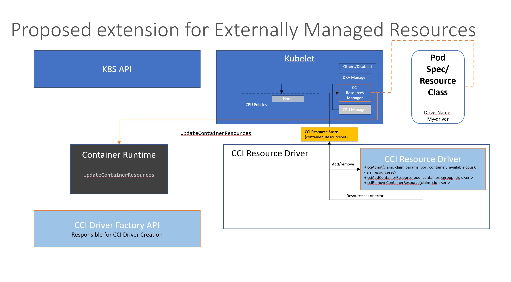
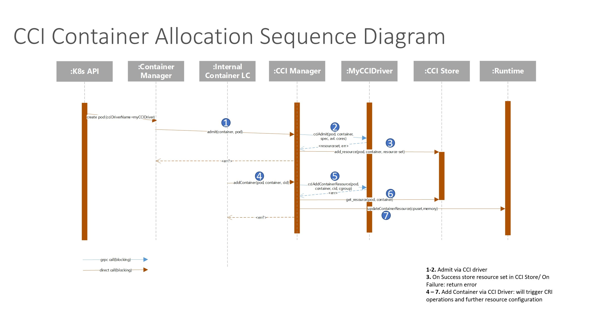
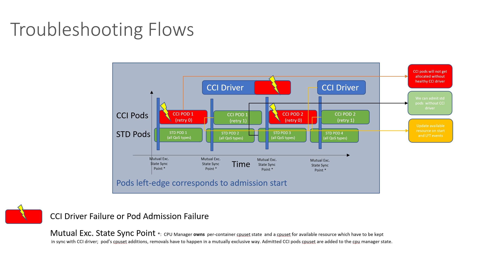

# KEP-3675: Pluggable Resource Management
Container Compute Interface (CCI) Driver Extension

<!-- toc -->
- [Release Signoff Checklist](#release-signoff-checklist)
- [Summary](#summary)
- [Motivation](#motivation)
  - [Goals](#goals)
    - [Alpha Goals](#alpha-goals)
    - [Beta &amp; Post-Beta Goals](#beta--post-beta-goals)
  - [Non-Goals](#non-goals)
- [Proposal](#proposal)
  - [User Stories](#user-stories)
    - [Custom workloads, such as Telco/HPC/AI/ML](#custom-workloads-such-as-telcohpcaiml)
    - [Power optimization of workloads](#power-optimization-of-workloads)
    - [Research of new resource management patterns within the cloud](#research-of-new-resource-management-patterns-within-the-cloud)
    - [User-specific Drivers](#user-specific-drivers)
    - [Roles](#roles)
  - [Notes/Constraints/Caveats (Optional)](#notesconstraintscaveats-optional)
  - [Risks and Mitigations](#risks-and-mitigations)
- [Design Details](#design-details)
    - [Compute Specification Option](#compute-specification-option)
      - [User API for Alpha: Policy-based resource specification - no scheduler impact](#user-api-for-alpha-policy-based-resource-specification---no-scheduler-impact)
      - [Options for User APIs in Post-Alpha:](#options-for-user-apis-in-post-alpha)
      - [Attributed-based resource specification](#attributed-based-resource-specification)
      - [CCI Resource Manager Architecture](#cci-resource-manager-architecture)
      - [Allocation &amp; Container Removal Flow](#allocation--container-removal-flow)
      - [Post-Alpha &amp; GA Architectural Considerations](#post-alpha--ga-architectural-considerations)
  - [Test Plan](#test-plan)
      - [Unit tests](#unit-tests)
      - [Integration tests](#integration-tests)
      - [e2e tests](#e2e-tests)
  - [Graduation Criteria](#graduation-criteria)
    - [Alpha to Beta](#alpha-to-beta)
    - [Beta to GA](#beta-to-ga)
    - [Deprecation](#deprecation)
  - [Upgrade / Downgrade Strategy](#upgrade--downgrade-strategy)
  - [Version Skew Strategy](#version-skew-strategy)
- [Production Readiness Review Questionnaire](#production-readiness-review-questionnaire)
  - [Feature Enablement and Rollback](#feature-enablement-and-rollback)
    - [Alpha](#alpha)
    - [Beta](#beta)
    - [Operational Requirements for Alpha:](#operational-requirements-for-alpha)
  - [Rollout, Upgrade and Rollback Planning](#rollout-upgrade-and-rollback-planning)
  - [Monitoring Requirements](#monitoring-requirements)
  - [Dependencies](#dependencies)
  - [Scalability](#scalability)
  - [Troubleshooting](#troubleshooting)
- [Challenges and Considerations](#challenges-and-considerations)
- [Implementation History](#implementation-history)
- [Drawbacks](#drawbacks)
- [Alternatives](#alternatives)
- [Infrastructure Needed](#infrastructure-needed)
<!-- /toc -->

## Release Signoff Checklist

Items marked with (R) are required *prior to targeting to a milestone / release*.

- [ ] (R) Enhancement issue in release milestone, which links to KEP dir in [kubernetes/enhancements] (not the initial KEP PR)
- [ ] (R) KEP approvers have approved the KEP status as `implementable`
- [ ] (R) Design details are appropriately documented
- [ ] (R) Test plan is in place, giving consideration to SIG Architecture and SIG Testing input (including test refactors)
  - [ ] e2e Tests for all Beta API Operations (endpoints)
  - [ ] (R) Ensure GA e2e tests meet requirements for [Conformance Tests](https://github.com/kubernetes/community/blob/master/contributors/devel/sig-architecture/conformance-tests.md)
  - [ ] (R) Minimum Two Week Window for GA e2e tests to prove flake free
- [ ] (R) Graduation criteria is in place
  - [ ] (R) [all GA Endpoints](https://github.com/kubernetes/community/pull/1806) must be hit by [Conformance Tests](https://github.com/kubernetes/community/blob/master/contributors/devel/sig-architecture/conformance-tests.md)
- [ ] (R) Production readiness review completed
- [ ] (R) Production readiness review approved
- [ ] "Implementation History" section is up-to-date for milestone
- [ ] User-facing documentation has been created in [kubernetes/website], for publication to [kubernetes.io]
- [ ] Supporting documentation—e.g., additional design documents, links to mailing list discussions/SIG meetings, relevant PRs/issues, release notes

[kubernetes.io]: https://kubernetes.io/
[kubernetes/enhancements]: https://git.k8s.io/enhancements
[kubernetes/kubernetes]: https://git.k8s.io/kubernetes
[kubernetes/website]: https://git.k8s.io/website

## Summary

Kubernetes compute management is tightly integrated with the Kubelet and the
existing suite of resources managers including the topology manager, CPU manager,
memory manager, and device manager. While these managers have added functionality that
address a varied set of use cases, they also present the community with challenges.

Adding a new capability to one of these managers is slow moving and difficult
due to their complex interactions, the level of prudence required given the potential
impacts, the implied necessity to make the extension work in as many scenarios as
possible, as well as the overhead heaped onto the sig-node maintainers. More
details on the challenges discussed with the community have been captured in
the [CPU Management Kubelet Use Cases & Current State document](https://docs.google.com/document/d/1U4jjRR7kw18Rllh-xpAaNTBcPsK5jl48ZAVo7KRqkJk).

As a result, adding optimizations necessary to support some more niche use cases,
to improve total cost of ownership for deployments with more exacting requirements
on resources or to provide a mechanism to progressively roll-out the benefits of
innovations related to newer CPU architectures is difficult and high cost to community resources.

This proposal aims to address the challenges by introducing a new Container Compute
Interface (CCI). The CCI is conceptually equivalent to the [CSI](https://github.com/kubernetes/design-proposals-archive/blob/main/storage/container-storage-interface.md) in that it will
delineate between the responsibility of the Kubelet and the responsibility of lower-level,
compute focused drivers for resource assignment capabilities, such as CPU and memory.

We propose an iterative implementation approach:

In the first stage (alpha) we propose adding a new component to the Kubelet called the CCIResourceManager
that focuses exclusively on providing a mechanism for pluggable CPU management policies (as a replacement
to the builtin CPUManager and its corresponding policies). Enablement of the CCIResourceManager will be blocked by a feature gate
which, when enabled, will trigger all CPU Management decisions to flow through the CCIResourceManager instead of the builtin CPUManager.
For this, the CPUManager policy MUST be set to none if this new feature gate is enabled. This will
be enforced by the Kubelet, causing it to "fail fast" if this invariant does not hold true.

For alpha, only a single driver will be allowed to run on a node at any given time. Details of how
we plan to enforce this requirement as well as how we plan to (temporarily) handle bootstrapping a
node that does not yet have a pluggable CPU Management policy running can be found in Section [Throubleshooting].
In a later phase, we will provide a proper mechanism to handle bootstrapping in cases where a driver
becomes temporarily unavailable.

The implication of CCI and the addition of the proposed CCI Resource Manager will be to allow compute
capabilities such as CPU and memory to be managed outside of the Kubelet via pluggable CCI Drivers.
This will allow users to augment the current implementation of Kubelet managed resources with
support for more complex use-cases without having to modify the Kubelet. The CCI extensions can coexist
with the existing CPU and memory allocation technique available to Kubernetes users today.

Although our alpha implementation provides an alternate route for managing CPUs through pluggable
CPU management drivers, the long-term goal is to allow these drivers to be used side-by-side with
the built-in policies. Pods will be able to choose which policy they want their CPUs allocated with,
and the machinery in the Kubelet will take care to ensure the proper CPU Management policy is invoked
(be that from a builtin policy or from a driver).

These changes will allow the community to disaggregate the long-term
stability and advancement of the Kubelet from the task of improving the compute
resource management while keeping pace with the needs of
specialized use cases and the advancements in the compute vendor ecosystem.

## Motivation

Users have varied workloads; the current set of available configurations
for CPU, memory, and topology remain limited.  Additionally, the number of managers
becoming internal to the Kubelet continues to increase; we should find a more
dynamic and plugable way of handling these resources.

Operating systems work by allowing drivers and plugable resources, including varied
policies for CPU, memory, and devices allocation.  Kubernetes can be viewed as the operating
system of the cloud.  Allowing specialty modules to address the use cases
directly, rather than continuing to add complexity by continuing to modify the ubelet,
will allow the greatest scope of abilities while halting continued increases of complexity
within the core of the Kubelet.

This KEP aims to address the following challenges:

* Differentiate between types of cores and memory.  
  Note - Dynamic resource allocation does this with regular resources today. We seek to
  extend this ability.
* Differentiate between different configurations of cores and memory, for instance cores
  designated as performance versus those designated as efficiency cores
* Have custom driver to optimize for particular types of workloads.  These drivers
  may be built for performance, power reduction, cpu savings, et cetera.   
  Note:  Currently, there are very limited sets of available topology policies.  Every
  new policy must be approved and be lockstep with the kubernetes release process.
* Allow vendors to release vendor-specific managers for their hardware
  and provide an interface, keeping vendor-specific code external to the Kubelet.
* Be able to hot-plug and test new resource managers.
* Be able to remove some of the complexity with current setup and, over time, reduce
  the amount of code contained within Kubelet.  Instead, build a library with specific
  needs.
* Have a faster path to desired changes, without potentially impacting the core of
  Kubernetes with every policy change.  
  Note that current solutions have been cropping up to allow for resource management
  outside the core Kubelet. These solutions require turning off the Kubelet functionality
  and overriding current Kubelet allocation, such as [CPU Pooler](https://github.com/nokia/CPU-Pooler).
  We should provide a path otherwise. Many of these solutions are custom to particular companies.
  Many are not open source. The community should give a process to allow this functionality in core
  kubelet at a granular level, same as we have in many systems, such as HPC or Telco.
* Leverage additional parts from the pod spec information which could help make allocation decisions
without the need to query the k8s controlplane.
* Be able to do research, with minimum toil, on new policies and resource management strategies

This design will also use gRPC, which is used for many other pluggable components within Kubernetes.
The hope is that it will also, as a side effect, allow a path to simplify the Kubelet as it is
today and move the complexity into external drivers.

### Goals

#### Alpha Goals

1.  Provide Initial infrastructure to support CCI Drivers and k8s Deployments requiring CCI Drivers.
1.  Provide a feature gate to enable CCI Resource Manager. The feature will require CPU Manager policy set to None.
1.  Provide a CCI test driver which can demonstrate CCI Driver implementation requirements and several resource management use-cases for cpu.
1.  Provide documentation of the CCI Resource Manager and the provided test driver plus illustration of the currently covered use-cases, including a sample driver.
1.  Provide end-to-end tests using the sample driver.
1.  Support seamless k8s start.
1.  CCI Driver results (cpusets) are passed back to kubelet and allocated.
1.  Handle resource management state for cpu through CCI.
1.  Support proper fail mechanisms of Pods if CCI driver is not available - Error message + retry
1.  Continue cluster operation if CCI driver is not available
1.  Podspecs:  Will be able to support current pod specs.  While there may be additional
extensibility in the future, the current pod specs will still work.
1.  Guarantee that cpu resources managed by CCI are visible for the scheduler to be able to
    correctly assign nodes.  This can be limited as far as simple CPU counts for this version.

#### Beta & Post-Beta Goals

1.  Support standard pod deployments not requiring CCI Drivers through CPU & Memory Manager: all QoS types
1.  Support hint providers for topology manager
1.  Interoperability with Device Plugins, DRA, et cetera.
1.  Identify and provide a minimal in-cluster operational core (from existing CPU Manager, Memory Manager, Topology Manager) either through in-tree libraries or through further KEPs.
1.  Guarantee that cpu and memory resources managed by CCI are visible for the scheduler to be able to
    correctly assign nodes.  This will be expanded as necessary, dependant on use cases, from the base
    group for alpha (topology, type, et cetera).
1.  Gather feedback on the feature through surveys.
1.  E2E testing including any new components, such as memory and topology.
1.  Adding support for e2e tests in testgrid.
1.  Health identification mechanisms and automatic health-repair procedures for CCI Drivers.
1.  Optimize on-node resource usage (approaches to avoid waste of resources because of fragmentation).
1.  Consider whether useful to support multiple CCI drivers.

### Non-Goals

* Break any existing use cases for topology manager, memory manager, cpu manager, or
device manager.
* Creating any more latency than there is today for scheduling:  We should be
careful not to add any latency into scheduling over what exists today for default behavior.

## Proposal

This proposal contains a path to update the kubelet to support more nuanced
uses of cpu and memory and further on-node resource management enhancements.
The proposed Container Compute Interface gives users a way to manage these
resources without having to either bypass or hack the kubelet cpu and memory
controllers. The CCI will allow for seamless integration of new and interesting
cpu and memory policies; this allows for innovation for better workload performance
and sustainability for data centers.

### User Stories

#### Custom workloads, such as Telco/HPC/AI/ML

Custom workloads often have a desire for a mix of types of cores. For instance, a workload
should be able to have some number of static cores and some number of shared cores.
A node should be able to allow both types of cores, without having to have one setting
or another, and be able to pull from these pulls accordingly. Additionally, there is
a need to have some high-priority cores for higher performance and other lower-priority
cores for other less-sensitive parts of a workloads. In these use cases, the workloads
may also have particular types of NUMA splits required.

Users in these fields want fine-grained control over their resources. Users in this
field need to be able to adapt clusters to the workload.

#### Power optimization of workloads

Cores should be able to be quickly spun up or down according to resource requirements.
Additionally, the nodes should be as densely packed as possible while respecting resource
attributes. There should also be the ability to choose between efficiency cores and
performance cores within newer architectures, according to workload requirements.

As energy becomes more expensive for datacenters, maximizing the use of resources is
desired. Users should be able to specify whether a workload needs the fastest available
cores or is content to run on more power efficient cores.

#### Research of new resource management patterns within the cloud

There are a variety of modifiers that can be placed around cores. Static cores,
isolated cores, shared cores, efficiency cores, and performance cores are only the
beginning of unexplored spaces.  Being able to experiment with various patterns in
research without having to be an expert in how to modify Kubelet and its multiple
internal managers is a decisive benefit to the research community.

Users, analog to the use case for Telco/HPC/AI/ML, similarly need fine-grained
control over their core placement decisions.

#### User-specific Drivers

A user may have very specific allocation patterns they require. This sort of capability
may be rare and not belong upstream in mainstream Kubernetes, but there should still
be a simple way to allow users to meet their specific experiments.

#### Roles

1. Cluster operator or a system administrator is responsible to enable CCIResourceManager feature gate on kubelet and install a CCI Driver.
1. CCI Drivers can be vendor specific or community drivers. The drivers are provided/implemented by vendors or the kubernetes community.
1. User specify a request of resources through policy or attribute-based request.

### Notes/Constraints/Caveats (Optional)

<!--
What are the caveats to the proposal?
What are some important details that didn't come across above?
Go in to as much detail as necessary here.
This might be a good place to talk about core concepts and how they relate.
-->

### Risks and Mitigations

As the feature is stand-alone and behind a feature gate, this should not
impact standard Kubelet behavior.  In the event someone is using the CCI
Drivers, the alpha version will default to standard best effort QoS until
the CCI Driver is deployed.  After deployment, the management will be reliant on
the CCI Driver implementation.

## Design Details

#### Compute Specification Option

The CCI model combined with some of the capabilities introduced in the Dynamic
Resource Allocation (DRA) KEP [3], offers the ability to transition compute
resource allocation behavior from being a cluster-admin dominated configuration
to one that allows users with precise compute requirements to articulate the
compute attributes that they need.

In several domains such Streaming, Telco, HPC, and AI/ML, users require
fine-grained compute resource control to maximize their key performance
indicators.  They need an API option that can be made available through
upstream Kubernetes components and specific compute resource allocation
drivers.

##### User API for Alpha: Policy-based resource specification - no scheduler impact

In this proposal we focus on API which can be lavaraged by using Dynamic Resource Allocation
Claim constructs. The compute specification can be provided in configmap or CRD form similar
to other DRA Claim specifications.

###### DRA-inspired Attribute-Claims:

This example presents a set of per-core attributes in a claim that enables precision beyond
a policy-only based approach:

       # A resource request which consists of:
       # 5 exclusive cores (no other processes running on them)
       # 	* cores have to be aligned to a device
       #  * cores have to follow compact placement in a single NUMA zone
       # 	* pairs of cores shall be SMT siblings
       # 20 shared cores wihtout device and memory affinity requirements
       apiVersion: v1
      kind: ConfigMap
      metadata:
        name: test-inline-claim-parameters
        namespace: default
      data:
      config.json: |
          {
              "cores" : ["5" , "20"],
              "device attributes" :  [
                "NUMA-DEVICE-AFFINITY-REQUIRED",
                "NO-DEVICE-AFFINITY"
                ],
              "mem attributes" : [
                "NUMA-MEM-AFFINITY-BIND-REQUIRED",
                "NO-MEM-AFFINITY"
              ]
              "cpu attributes" : [
                ["EXCLUSIVE", "CORE-SIBLING-PREFERRED"],
                ["SHARED"]
              ]
          }
      ---
       apiVersion: resource.k8s.io/v1alpha1
       kind: ResourceClaimTemplate
       metadata:
         name: example-compute-claim-parameters-template
         namespace: default
       spec:
         metadata:
           labels:
             app: inline-resource
         spec:
           resourceClassName: CPUressources
           parametersRef:
             kind: ConfigMap
             name: example-compute-claim-parameters

Pros:
  * Can be used to expose attribute-based configurations

Cons:
  * Needs a solution for resource quotas (possibly through additional resource specificationin pod spec)
  * Requires Controller which can deal with cpu and memory resources
  * Scalability

The following code snippet provides initial specification for allowed CCI compute configuration values:

    // requested number of cores or a range in the case of burstable.
    "cores" : ["2“, "6-8" , “1-4"],

    // device affinity attributes
    “device attributes" : [
      "NUMA-DEVICE-AFFINITY-REQUIRED”, // If a device is requested, the CPU cores shall be from the same NUMA zone.
      "NUMA-DEVICE-AFFINITY-PREFERRED”, // If a device is requested, the CPU cores should be from the same NUMA zone.
      “NO-DEVICE-AFFINITY” // No device affinity required
      ]

    // memory affinity attributes  
    “mem attributes" : [
      “NUMA-MEM-AFFINITY-BIND-REQUIRED”, // If memory affinity requested, the CPU cores SHALL be from the same NUMA zone.
      "NUMA-MEM-AFFINITY-BIND-PREFERRED”, // If memory affinity requested, the CPU cores SHOULD be from the same NUMA zone.
      “NUMA-MEM-AFFINITY-INTERLEAVE-REQUIRED” // If memory affinity requested, the CPU cores SHALL be from the all NUMA zone.   
      ]
    // Possible memory attributes:  “NO-MEM-AFFINITY”, “NUMA-MEM-AFFINITY-INTERLEAVE-PREFERRED”, “HUGE_PAGE_SIZE_1M”, etc..

    // cpu and smt attributes
    “cpu attributes" : [
              ["EXCLUSIVE", “CORE-SIBLING-REQUIRED"], // Use all logical cores on given physical cores to pack the processes.
              [“EXCLUSIVE“, “CORE-SIBLING-DENIED], // 
              ["SHARED"]
            ]   
    // Possible CPU attributes:
    // "CORE-SIBLING-REQUIRED"  Use all logical cores on given physical cores to pack the processes, require sufficient siblings.
    // “CORE-SIBLING-PREFERRED“ Maximize usage of sibling pairs on given physical cores.
    // "CORE-SIBLING-DENIED" Single logical core use only. Full cores. Noting else on the platform will have access to this set of core(s).
    // “EXCLUSIVE” Full cores. Exclusively allocated to one pod. System services may use the cores too.
    // “SHARED” Default setting. Set of core(s) or portions of cores shared with all users of the platform.

##### CCI Resource Manager Architecture

CCI Resource Manager Architecture uses DRA resource class mechanism to identify drivers
for a pod which has a resource claim. To ensure conflict-free co-existence of DRA drivers
and CCI drivers, the registration of CCI drivers has to happen through unique registration handler
analogue to other plugin frameworks (device plugins, dra, etc..).

In the alpha version CCI will rely on DRA controller to handle scheduling of resource allocation
requests expressed by the means of resource claim as described in  Sec. [Compute Specification Option].
To ensure a correct functioning of the kubernetes scheduler CCI Resource manager will feed the pod resource
server with the correct number of allocatable cpu and memory resources. In alpha phase pods which require CCI
Drivers will provide cpu and memory resource specifications only through the claim mechanism. In post-alpha
we will consider integration with standard cpu and memory resource requests and limits.

In the alpha version of the Resource Manager applies drivers to manage resource
allocations for Pods which use Resource Claims. The association to a driver happens through the already provided resourceclass mechanisms in DRA. The overall architecture consists of a manager component – the Resource Manager inside the container manager, a compute resource store – a component used to store
the resource sets (cpusets, memory affinity configuration) for the pods handled via resource drivers or via CCI Manager. The CCI Manager keeps track of pods without claims (standard pods) in the resource store. In alpha version the cpusets of those pods are mapped to all available cores. In the case of exclusive cores request the cpusets of the standard pods have to be adjusted to guarantee exclusivity. The CCI Manager is enabled via a feature gate. After turning on the feature gate all pod allocation requests for cpu
and memory will be handled by the CCI Manager.

 
Figure 1: CCI Resource Manager Architecture inside Kubelet

For alpha phase CCIResource Manager will be used for all pods as long as the CCIResourceManager feature gate is enabled. The CPU Manager policy has to be set to None and Memory Manager disabled. CCI drivers will be invoked only for pods which require a claim. Remaining pods will be mapped to the cpuset of currently available cores (cores not used by containers with exclusive resource requirements).

1. CCI Resource Manager 
To support this architecture the implementation will need a separate resource manager component inside the container manager which will handle drivers management tasks, including registration and
invocations of registered drivers.  These tasks will be managed via grpc for Pods who
require one or more resource management driver(s) to get successfully allocated.  In
the alpha version we provide two entry points  on admission, add Container
and remove Container lifetime events (drivers have to implement Admit, AddResource
and RemoveResource handlers accordingly). The admission entry point includes also information about the
claim associated that container and it's parameters.

2. CCI Resource Store 
The Resource Manager uses a store to keep track of resourcesets which can include
cpusets, etc ..  allocated by CCI Drivers. This information is gathered
per container. The gathered information will be used to provide data for on-node available resources. The store offers the following interface to manage resource sets.

        +AddResource(pod, container, resourceset)
        +RemoveResource(container)
        +AvailableResources(): resourceset
        +Save(path)
        +Load(path)

The resource sets are getting stored in a map where the lookup
is done via pod id and container name. For alpha versions the resource set includes the cpuset. In later stage the resource set will be extended with memory affinity information. The map together with the currently available resource will be serialized to the file system to ensure proper coverage of kubelet restart and recovery scenarios through the Save and Load functions (/var/lib/kubelet/cci_manager_state).

4. CCI Driver Interface 
The initial interface of resource management drivers is very simple and consists
of three functions:

        +CCIAdmit(claim, claim parameter, pod, container, *available resources) : <err, resourceset>
        +CCIAddContainerResource (pod, container, cgroup, containerid): <err>
        +CCIRemoveContainerResource (claim, containerid): err

`CCIAdmit` function provides information if a given container belonging to a
Pod and having a specific CCI spec can be admitted to next stage of the allocation
pipeline. The requested resources get reserved in the case of success. The user input which was defined in the resource claim is passed as claim parameter (analogue to DRA) to the function (see Sec. [Compute Specification Option]). The admission will return a reserved resource-set or error. In case of successful admission the resource set will be stored in the CCI Store. In the case of exclusive reservations the cpusets of standard pods might change based on the updated list of available cores. In the case of failure the error is reported back to user and the Pod allocation is cancelled. In the admission function we pass a list of available cpusets which allow us to inform drivers about system-reserved resources.

`CCIAddContainerResource` function is called before container start with a given
Pod name and container name, cgroup of Pod and the container id. The driver than
performs an allocation of the admitted resource-set. The cpuset gets allocated via the runtime. In case of failure of the driver and error is returned.

`CCIRemoveContainerResource` function is called to free the cpu resources taken
by a container and the underlying claim. The functions returns nil if the operation was successful or an
error if the operation failed on the driver side.

CCI Drivers GRPC Protocol:

    /*
    CCIDriver is a grpc service interface for CCI resource kubelet drivers.
    The interface provides admission, allocation and cleanup entry points.
    Drivers are registered  as kubelet plugins and will be called by the
    CCI Resource Manager for pods which are associated with this driver.
    */
    service CCIDriver {
      //cciAdmit admission function to reserve resources for a given container
      rpc CCIAdmit(AdmitRequest) returns (AdmitResponse) {}

      //cciAddContainerResource allocation entry point for admitted containers
      rpc CCIAddContainerResource (AddResourceRequest)
        returns (AddResourceResponse) {}

      //cciRemoveContainerResource clean kubelet resources for a given container
      rpc CCIRemoveContainerResource (RemoveResourceRequest)
        returns (RemoveResourceResponse) {}
    }

    message AdmitRequest{
        string namespace = 1;
        // The UID of the Resource claim (ResourceClaim.meta.UUID).
        // This field is REQUIRED.
        string claim_uid = 2;
        // The name of the Resource claim (ResourceClaim.meta.Name)
        // This field is REQUIRED.
        string claim_name = 3;
        // currently available cpus
        string availableCpus = 4;
        // pod identifier
        string pod = 5;
        // container identifier
        string container = 6;
        // cci Resource handle
        string resource_handle = 7;
    }

    message ResourceSet{
        // admitted cpuset
        string cpuset = 1;
        // flag if exclusive
        bool exclusive = 2;
    }

    message AdmitResponse {
      // allocated resource set
      ResourceSet rSet = 1;
      // error object
      string err = 2;
    }

    message AddResourceRequest{
        // pod cgroup
        string cgroup = 1;
        // pod identifier
        string pod = 2;
        // container identifier
        string container = 3;
        // container id
        string container_id = 4;
    }

    message AddResourceResponse {
        // error object
        string err = 1;
    }

    message RemoveResourceRequest {
        // The ResourceClaim namespace (ResourceClaim.meta.Namespace).
        // This field is REQUIRED.
        string namespace = 1;
        // The UID of the Resource claim (ResourceClaim.meta.UUID).
        // This field is REQUIRED.
        string claim_uid = 2;
        // The name of the Resource claim (ResourceClaim.meta.Name)
        // This field is REQUIRED.
        string claim_name = 3;
        // id of the container to be removed
        string container_id = 4;
    }

    message RemoveResourceResponse {
        // error object
        string err = 1;
    }

5. Scheduling 
In the alpha version of the CCI Resource Manager, scheduling decisions will be taken by DRA Controllers based
on claim specification. To ensure the correct scheduling of both kind of pods:
pods without claim (scheduled by k8s scheduler) and claim-based pods, all pods have to provide resource request and limit fields.    &emsp;As the kubernetes scheduler works as a stateless component, for alpha version the cores/memory requests provided in the CCI configuration as part of the resource claim have to match pod resource requests and limits provided in pod spec. Further CCI-awareness and requests validation can be provided by the DRA controller implementation. Post-alpha we will consider adding an extension to the scheduler which can propagate further information from CCI spec down to the scheduler.

6. CCI Drivers Factory API 
The KEP includes a new staged API which enabled the CCI driver creation. The
API can be used by a driver implementor to start a driver and automatically
register it against Kubelet's CCI Resource Manager.

7.	CCI Drivers Registration 
The CCI driver registration can be handled by the kubelet plugin framework.
This approach is already used with device plugins and DRA plugins. The approach
will be sufficient the cover drivers registration, status and health-check functionality. The framework also provides a versioning mechanism for plugins (similar to DRA approach).

##### Allocation & Container Removal Flow

Admission and adding a Container: 
 
Figure 2: Sequence of container allocation which uses CCI driver  

The lifetime events are triggered by the container manager and internal lifecycle manager in
exact order for admitting, adding, and removing containers. As shown on Figure 2 an admit
container is invoked for containers inside pods requiring a resource driver.
On success, the resource set result is added to the CCI
store. If the operation fails an error will be reported back to the user (in alpha we will go back to best-effort QoS).
All blocking rpc calls are configured in alpha with a reasonable timeout. After getting an actual container id, the internal
lifecycle loop triggers the add container call.

Container Removal: 
 

Figure 3: Container removal sequence diagram involving CCI drivers  
The container removal case is described as a sequence in Figure 3. After registering
a removal event in the internal container lifecycle, the CCI Resource Manager is triggered
and invokes the CCI Driver to free any resources takes by the container. On
success, the CCI store will be also cleaned and a new available resource set will
be updated. All blocking rpc calls are configured with
a reasonable timeout in alpha.

##### Post-Alpha & GA Architectural Considerations

After the initial alpha implementation we will consider the integration of the
Container Compute Interface “CCI” with existing CPU and Memory manager stack
This can be achieved either by using already existing managers and introducing state
synchronization or through a common code base which can be invoked
from within the CCI Resource Manager.

A possible integration with topology manager could follow by implementing the topology hints
interface for the CCI Resource Manager which will use data extracted from CCI Store. This will
require such data to be provided by CCI Drivers and the CCI store has to be extended to
be able to handle it correctly for serving the corresponding topology hints calls.

### Test Plan

[X] I/we understand the owners of the involved components may require updates to
existing tests to make this code solid enough prior to committing the changes necessary
to implement this enhancement.

##### Unit tests

###### Alpha

* CCI Resource Manager (CPU, Feature Gate): target code cvg >=80%
* CCI Store (CPU, persistency): target code cvg >=80%
* CCI Drivers Factory API: target code cvg >=80%
* Scheduling on nodes running CCI (policy based) cvg >=80%

###### BETA

* CCI Pod Association tests: target code cvg >=80%
* CCI Resource Manager (CPU + Memory, persistency, Feature Gate): target code cvg >=80%
* CCI Store (CPU + Memory): target code cvg >=80%
* Scheduling on nodes running CCI (policy based and attribute-based) with and without drivers cvg >=80%
* Pod Admission Race tests
* Introduce fail-safety tests

##### Integration tests
###### Alpha
* CCI Resource Manager Integration test for cpu use-cases: driver-based allocation and best-effort QoS
* CCI Driver failure condition tests
* Kubelet restart integration test
* System-reserved resources test
###### BETA
* CPU Manager None, Static Policy Integration with CCI
* CPU, Memory, Topology and CCI Resource Manager Integration test
* Further integration tests with Device Manager and DRA
* Integration test including static QoS and driver-based allocation
* Monitoring of CCI Drivers health tests
* Performance/Scalabilty tests

##### e2e tests
###### Alpha
* E2E tests including a test CCI Driver
* E2E tests for showcasing resource allocations for cpu through CCI - policy based
* End-to-End tests to cover kubelet restart and system-reserved resources

###### BETA
* End-to-End tests to cover all cci resource allocation use-cases
* End-to-End tests to cover CCI Driver association mechanism
* End-to_End tests with device plugins and DRA
* End-to_End Scheduling on nodes running CCI (policy based and attribute-based) with and without drivers cvg >=80%
* Performance and resource utilization tests

### Graduation Criteria

#### Alpha to Beta

- Integrate API feedback from users and community
- Proven cross-components consistency (ideally via tests)
- Handling of topology manager and memory manager use-cases
- Finish Identified Code refactoring of common building blocks (look at common pieces in all plugin-frameworks  in kubelet)
- Look to what makes sense to leave inside Kubelet due to latency and use case requirements. Introduce community CCI drivers repo
Similar to Kubernetes Scheduler Plugin repo
-	Have CCI Drivers specific to common use cases or environments
-	Smooth integration with scheduler extensions/ plugins …

#### Beta to GA

- Gather feedback from developers and surveys and integrate it
-	Successful adoption across users
-	Proven Components Correctness
-	Performance tests completion
- N examples of real-world usage

#### Deprecation

### Upgrade / Downgrade Strategy

TBD in Beta
<!--
If applicable, how will the component be upgraded and downgraded? Make sure
this is in the test plan.

Consider the following in developing an upgrade/downgrade strategy for this
enhancement:
- What changes (in invocations, configurations, API use, etc.) is an existing
  cluster required to make on upgrade, in order to maintain previous behavior?
- What changes (in invocations, configurations, API use, etc.) is an existing
  cluster required to make on upgrade, in order to make use of the enhancement?
-->

### Version Skew Strategy

Version handling of Drivers will happened through the kubelet plugin framework. We will use semantic versions starting from alpha for the driver and update according to graduation process(similar approach to device plugins and DRA).
<!--
If applicable, how will the component handle version skew with other
components? What are the guarantees? Make sure this is in the test plan.

Consider the following in developing a version skew strategy for this
enhancement:
- Does this enhancement involve coordinating behavior in the control plane and
  in the kubelet? How does an n-2 kubelet without this feature available behave
  when this feature is used?
- Will any other components on the node change? For example, changes to CSI,
  CRI or CNI may require updating that component before the kubelet.
-->

## Production Readiness Review Questionnaire

### Feature Enablement and Rollback

#### Alpha
Before having a driver in the system, or if one is not available, we default to
best effort QoS for incoming pods. This will ensure that we can start
the cluster initial pods such as cni-pods, dns-pods and CCI Driver pod.

A newly installed CCI Driver becomes responsible to handle incoming pods.  It is
responsible for reading the state from the kubelet on startup.

#### Beta
Pods without an available attached CCI Driver we will fail and be retried until
the driver comes up or failed after a configurable timeout.

#### Operational Requirements for Alpha:

* Enable CCI Feature Gate
* Disable Memory manager
* Disable Topology Manager
* Set CPU Manager policy to None

###### How can this feature be enabled / disabled in a live cluster?

- [x] Feature gate (also fill in values in `kep.yaml`)
  - Feature gate name: CCIResourceManager
  - Components depending on the feature gate: Kubelet
- [ ] Other
  - Describe the mechanism:
  - Will enabling / disabling the feature require downtime of the control
    plane?
  - Will enabling / disabling the feature require downtime or reprovisioning
    of a node? (Do not assume `Dynamic Kubelet Config` feature is enabled).

###### Does enabling the feature change any default behavior?

Yes, if enabled resource allocation for pods will be handled by CCI Resource Manager and CCI Drivers.

###### Can the feature be disabled once it has been enabled (i.e. can we roll back the enablement)?

Yes, a deletion of pods requiring CCI driver will be recommended. Addition cleanup on the node and a kubelet restart will be required.

###### What happens if we reenable the feature if it was previously rolled back?

Running pods should not be impacted.  New pods should be handled by the CCI Driver.

###### Are there any tests for feature enablement/disablement?

Yes.

### Rollout, Upgrade and Rollback Planning

The usual Kubernetes upgrade and downgrade strategy applies for in-tree components.
Vendors must take care that upgrades and downgrades work with the drivers that
they provide to customers.

Pods which require CCI Driver will fail starting and report an error due to driver
unavailability. If a CCI Driver fails, Pods which were about to be allocated
that were tied to the driver will fail.

###### How can a rollout or rollback fail? Can it impact already running workloads?
Alpha:
When the CCI Resource Manager feature is enabled we will handle all initial pod deployments as best-effort QoS
until a CCI Driver gets deployed. After the driver becomes available all pod allocations will be handled by the driver. Proper driver failure mechanism will be implemented in post-alpha stage.

Post Alpha:
Failure of CCI drivers will have impact only over pods requiring CCI driver for
resource management. All other pods will not be impacted. The impacted pods will
fail with an error message showing failure of the driver.

###### What specific metrics should inform a rollback?

Unhealthy CCI drivers which can't get to a ready state and repeated failures
to allocate pods in cases of free resources, or cases where a node reports no free to the scheduler but the resource were not used (can be detected via available cpu resource counters on the node).

###### Were upgrade and rollback tested? Was the upgrade->downgrade->upgrade path tested?

TBD in Beta

###### Is the rollout accompanied by any deprecations and/or removals of features, APIs, fields of API types, flags, etc.?

TBD in Beta

### Monitoring Requirements

Alpha: available cpus
Beta: available cpus and other resource metrics(based on attributes)

###### How can an operator determine if the feature is in use by workloads?

Pods will be running on the cluster which are associated to CCI drivers.
Additionally, available resources will be updated.

###### How can someone using this feature know that it is working for their instance?

- [X] Other (treat as last resort)
  - Details: check the kubelet metric `cci_manager_allocation_requests_total`

###### What are the reasonable SLOs (Service Level Objectives) for the enhancement?
Alpha: k8s Cluster can be started without driver
Beta: Pods not using CCI Drivers continue to work as before.

###### What are the SLIs (Service Level Indicators) an operator can use to determine the health of the service?

- [X] Metrics
  - Metric name:
    - cci_manager_allocation_requests_total
    - cci_manager_allocation_errors_total

###### Are there any missing metrics that would be useful to have to improve observability of this feature?

- cci_resource_manager_allocation_requests_total
- cci_manager_allocation_errors_total

### Dependencies

None
<!--
This section must be completed when targeting beta to a release.
-->

###### Does this feature depend on any specific services running in the cluster?

No, CCI Driver does not require an external service to be operational.

### Scalability

The CCI Resource Manager approach resembles device manager protocol. The scalability and performance impact will be similar to the case of handling device plugins.

Further performance benchmarks will be done in Beta Phase.

###### Will enabling / using this feature result in any new API calls?

In alpha phase: no
In post-alpha phase:
For Pods requiring CCI Driver the admission, container add and container removal operations will be handled via
api call to external CCI Driver. Remaining pods should be handled as before (post alpha phase).

###### Will enabling / using this feature result in introducing new API types?

A helper API to create CCI Drivers (CCI Driver Factory) can be integrated as staged repo.

###### Will enabling / using this feature result in any new calls to the cloud provider?

No

###### Will enabling / using this feature result in increasing size or count of the existing API objects?

This will not be true for Alpha.  For Beta, where there may be multiple drivers, it may be prudent to consider this.

###### Will enabling / using this feature result in increasing time taken by any operations covered by existing SLIs/SLOs?

No

###### Will enabling / using this feature result in non-negligible increase of resource usage (CPU, RAM, disk, IO, ...) in any components?

No

### Troubleshooting

In alpha phase we propose to handle bootstrapping and failures due unavailable drivers
by going back to best-effort QoS (in post-alpha this should result to pod failure). In post-alpha phase we will consider solutions of the bootstrapping and driver failure problem
though an association mechanism between pods and drivers. If a pod does not require a driver CCI Resource Manager can
provide allocation for this pod without and driver invocations, which will allow a smooth bootstrapping procedure of the cluster.

 

Figure 4: Troubleshooting Flows: Handling of pods requiring CCI driver and standard pods without CCI Driver requirements in the case of unhealthy driver.  

After alpha phase if a CCI Driver fails, Pods associated with a driver which were about to be allocated will fail.
To illustrate this lets consider some of the flows described on Figure 4. We distinguish
between pods handled by CCI drivers(group 1 pods) and standard Pods(group 2 pods). Until the CCI driver is not started the pod admission of group 1 pods will fail with an admission error due to driver unavailability. Group 2 pods are not impacted by and they
can be deployed on the cluster. After the CCI Driver comes online  the admission of
group 1 pods can continue. The admission transactions of group 1 and 2 are mutually exclusive. In later time the driver becomes unhealthy and the admission of second pod
from group 1 will fail.

###### How does this feature react if the API server and/or etcd is unavailable?

Feature lives completely in kubelet and will not be impacted directly.

###### What are other known failure modes?

TBD

###### What steps should be taken if SLOs are not being met to determine the problem?

We plan to provide sufficient logging information inside kubelet log to help determine
problems with CCI Resource Management Stack. Additionally CCI Driver implementations should
consider integrating proper logging mechanism and error messages to help determine any
issues during operation.

## Challenges and Considerations
###### Checkpoint assignments

The driver must be able to pick up where it left off in case the Kubelet restarts for any reason. With regards to cpusets, the CCI Resource Manager can reassign those values in the event of a Kubelet restart as the CCI Resource Manager store also keeps track of Pods covered by CCI drivers. Information specific to the driver can be handled by the driver itself using a checkpoint file.

## Implementation History

TBD

## Drawbacks

TBD in Beta.

## Alternatives

  We could choose, instead, to continually extend existing Kubelet managers.  This is
  already complicated and becomes more so as users want more and more specialty use
  cases.  Additionally, chip companies are coming up with increasingly complicated
  architecture and the community will not want to spend time and resources supporting
  odd changes particular for particular chipsets.  Rather, we should choose to reduce
  complexity within the Kubelet over time.

  One example how current managers could be leveraged for that can be seen in the [CPU Pooler](https://github.com/nokia/CPU-Pooler)
  project where a device plugin is used to handle cpu and memory management. In contrast
  to this work our CCI approach concentrates on CPU and memory and will not require to do initial reservation of system resources to handle user applications.
  The realization of CCI is clearly separated from other components and will enable a functional and seamless integration with other device plugins and DRA plugins.
  In later phase of CCI development will consider handling cpu and memory resources also for pods
  not requiring drivers to run, by leveraging existing code base (post-alpha goal -
  it can also include refactoring of existing code base). Further, CCI approach will cover required interfaces
  to identify available cpu and memory resource so that correct scheduling can be performed.

### Alternatives for API Handling
There different alternative methodologies how to enabled further configuration capabilities for the user in kubernetes,
each with some pro and cons.

One option here could be to suggest a change or extension of the pod spec interface to define cpu and
memory resources. This option has the drawback that it will need to touch the pod specification mechanisms and the
change might have impact to different groups using kubernetes. In this KEP we would like to follow less disruptive approaches.

An alternative which does not require pod spec changes is to define a resource allocation configuration for Kubernetes
Pods through policy mechanism as annotation. The CCI Driver will process the policy for each pod/container.
The policy mechanism can't offer the same level of granularity as the attributed-based configuration methodology.

Example with 4 containers in the pod:

annotation:
*  cci.resources.alpha.kubernetes.io/pod: cci-default
*  cci.resources.alpha.kubernetes.io/container.container1: cci-exclusive
*  cci.resources.alpha.kubernetes.io/container.container2: cci-shared
*  cci.resources.alpha.kubernetes.io/container.container3: other-policy

       container1:
         resources:
           requests:
             cpu: <>
             memory: <>
           limits:
             cpu: <>
             memory: <>
       container2:
         resources:
           requests:
             cpu: <>
             memory: <>
           limits:
             cpu: <>
             memory: <>

Pros:
  * Policy per container/pod available as a user choice
  * New policies can be provided to users through CCI Drivers without kubelet impact
  * Resource quotas still supported
Cons:
  * User is required to understand the policies

annotation:
*  cci.resources.alpha.kubernetes.io/pod: cci-default
*  cci.resources.alpha.kubernetes.io/container.container1: sibling-cores-required
*  cci.resources.alpha.kubernetes.io/container.container2: no-sibling-cores
*  cci.resources.alpha.kubernetes.io/container.container3: other-attributes

       container1:
         resources:
           requests:
             cpu: <>
             memory: <>
           limits:
             cpu: <>
             memory: <>
       container2:
         resources:
           requests:
             cpu: <>
             memory: <>
           limits:
             cpu: <>
             memory: <>

Pros:
  * Does not require scheduler extension
  * Easy to process in CCI driver
  * No API extension required
  * Resource quotas still supported
  * More precision vs. policy only approach

Cons:
  * Better suited for specialized use-cases
  * No attribute awareness in the scheduler (could be addressed through DRA driver-subject of post alpha)
  * Attributes are CCI driver specific (consider standardization within sig-node)

## Infrastructure Needed

We may choose to add in a repo that allows donations of drivers specific to particular
use cases, in the way that we already do so for Kubernetes scheduler Plugins. This will allow a central place for the community to donate useful content.
