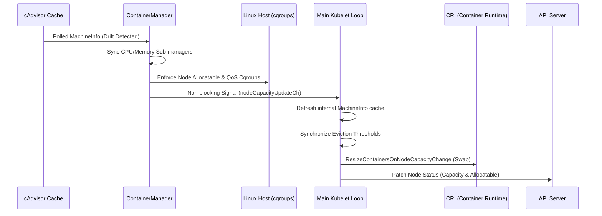

# KEP-3953: In-place Node Resource Resize

<!--
A table of contents is helpful for quickly jumping to sections of a KEP and for
highlighting any additional information provided beyond the standard KEP
template.

Ensure the TOC is wrapped with
  <code>&lt;!-- toc --&rt;&lt;!-- /toc --&rt;</code>
tags, and then generate with `hack/update-toc.sh`.
-->

<!-- toc -->
- [Release Signoff Checklist](#release-signoff-checklist)
- [Glossary](#glossary)
- [Summary](#summary)
- [Motivation](#motivation)
  - [Goals](#goals)
  - [Non-Goals](#non-goals)
- [Proposal](#proposal)
  - [User Stories](#user-stories)
    - [Story 1: Maximizing Specialized Hardware](#story-1-maximizing-specialized-hardware)
    - [Story 2: Vertical Scaling for Performance](#story-2-vertical-scaling-for-performance)
    - [Story 3: Reducing Operational Complexity (Scale-Up vs. Scale-Out)](#story-3-reducing-operational-complexity-scale-up-vs-scale-out)
    - [Story 4: Instant Capacity Utilization](#story-4-instant-capacity-utilization)
    - [Story 5: Zero-Disruption Operations](#story-5-zero-disruption-operations)
    - [Story 6: Safe Resource Reclaim (Downscaling)](#story-6-safe-resource-reclaim-downscaling)
    - [Story 7: Dynamic Storage Expansion](#story-7-dynamic-storage-expansion)
  - [Notes/Constraints/Caveats (Optional)](#notesconstraintscaveats-optional)
  - [Risks and Mitigations](#risks-and-mitigations)
    - [OOMScoreAdjust Drift for Existing Pods](#oomscoreadjust-drift-for-existing-pods)
    - [Container Swap Limit Re-calculation Overhead](#container-swap-limit-re-calculation-overhead)
    - [Kubelet Sub-Manager Synchronization Failure](#kubelet-sub-manager-synchronization-failure)
    - [API Status Clamping](#api-status-clamping)
    - [Application-Level Hardware Assumptions](#application-level-hardware-assumptions)
    - [Coordination with External NRI/Runtime Plugins](#coordination-with-external-nriruntime-plugins)
- [Design Details](#design-details)
  - [Architecture Flow](#architecture-flow)
    - [Phase 1:Host-Level Enforcement (ContainerManager)](#phase-1host-level-enforcement-containermanager)
    - [Phase 2: Cluster &amp; Runtime Enforcement (Kubelet)](#phase-2-cluster--runtime-enforcement-kubelet)
    - [Flow Control: Container Swap Limit Recalculation](#flow-control-container-swap-limit-recalculation)
    - [Flow Control: Hardware Degradation and Capacity Starvation](#flow-control-hardware-degradation-and-capacity-starvation)
    - [Compatibility with Cluster Autoscaler](#compatibility-with-cluster-autoscaler)
    - [Proposed Core Code Changes](#proposed-core-code-changes)
  - [Observability and Metrics](#observability-and-metrics)
  - [Test Plan](#test-plan)
      - [Unit tests](#unit-tests)
      - [e2e tests](#e2e-tests)
  - [Graduation Criteria](#graduation-criteria)
    - [Phase 1: Alpha (target 1.37)](#phase-1-alpha-target-137)
  - [Upgrade / Downgrade Strategy](#upgrade--downgrade-strategy)
      - [Upgrade](#upgrade)
      - [Downgrade](#downgrade)
  - [Version Skew Strategy](#version-skew-strategy)
- [Production Readiness Review Questionnaire](#production-readiness-review-questionnaire)
  - [Feature Enablement and Rollback](#feature-enablement-and-rollback)
  - [Rollout, Upgrade and Rollback Planning](#rollout-upgrade-and-rollback-planning)
  - [Monitoring Requirements](#monitoring-requirements)
  - [Dependencies](#dependencies)
  - [Scalability](#scalability)
  - [Troubleshooting](#troubleshooting)
- [Implementation History](#implementation-history)
- [Drawbacks](#drawbacks)
- [Alternatives](#alternatives)
- [Infrastructure Needed (Optional)](#infrastructure-needed-optional)
- [Future Work](#future-work)
<!-- /toc -->

## Release Signoff Checklist

Items marked with (R) are required *prior to targeting to a milestone / release*.

- [ ] (R) Enhancement issue in release milestone, which links to KEP dir in [kubernetes/enhancements] (not the initial KEP PR)
- [ ] (R) KEP approvers have approved the KEP status as `implementable`
- [ ] (R) Design details are appropriately documented
- [ ] (R) Test plan is in place, giving consideration to SIG Architecture and SIG Testing input (including test refactors)
    - [ ] e2e Tests for all Beta API Operations (endpoints)
    - [ ] (R) Ensure GA e2e tests meet requirements for [Conformance Tests](https://github.com/kubernetes/community/blob/master/contributors/devel/sig-architecture/conformance-tests.md)
    - [ ] (R) Minimum Two Week Window for GA e2e tests to prove flake free
- [ ] (R) Graduation criteria is in place
    - [ ] (R) [all GA Endpoints](https://github.com/kubernetes/community/pull/1806) must be hit by [Conformance Tests](https://github.com/kubernetes/community/blob/master/contributors/devel/sig-architecture/conformance-tests.md)
- [ ] (R) Production readiness review completed
- [ ] (R) Production readiness review approved
- [ ] "Implementation History" section is up-to-date for milestone
- [ ] User-facing documentation has been created in [kubernetes/website], for publication to [kubernetes.io]
- [ ] Supporting documentation—e.g., additional design documents, links to mailing list discussions/SIG meetings, relevant PRs/issues, release notes

<!--
**Note:** This checklist is iterative and should be reviewed and updated every time this enhancement is being considered for a milestone.
-->

[kubernetes.io]: https://kubernetes.io/
[kubernetes/enhancements]: https://git.k8s.io/enhancements
[kubernetes/kubernetes]: https://git.k8s.io/kubernetes
[kubernetes/website]: https://git.k8s.io/website

## Glossary

* **In-Place Resource Resize:** Dynamically increasing or decreasing compute resources (CPU, Memory, Swap Capacity, and HugePages) on a node without requiring a node reboot or kubelet restart.
* **Node Compute Resource:** CPU, Memory, Swap Capacity, and HugePages.
## Summary

This proposal facilitates dynamic native resource resizing (increases and decreases in capacity) on a node to streamline cluster capacity updates, offering a seamless alternative to adding or removing nodes from an existing cluster. The revised node configurations automatically propagate at both the node and cluster levels.

This KEP introduces the ability for the Kubelet to dynamically monitor and reconcile changes to the node's native hardware capacity. When a change is detected via cAdvisor, the Kubelet will seamlessly update its internal sub-managers, top-level kubepods cgroups, eviction thresholds, container swap limits, and the Node API object's Capacity and Allocatable fields—all without requiring a Kubelet restart.

## Motivation

Currently, a node's resource configurations are recorded solely during the Kubelet bootstrap phase and subsequently cached, operating under the assumption that the node's native capacity remains immutable throughout its lifecycle. In a conventional Kubernetes environment, cluster resources frequently require modifications over time due to inaccurate initial provisioning or escalating/subsiding workloads, traditionally forcing operators to add or remove entire nodes from the cluster.

Contemporarily, modern hypervisors, cloud providers, and kernel capabilities enable the dynamic hot-plugging and hot-unplugging of native resources such as CPU, Memory (e.g., [CPU Hotplug](https://docs.kernel.org/core-api/cpu_hotplug.html), [Memory Hotplug](https://docs.kernel.org/core-api/memory-hotplug.html)), and Ephemeral Storage block devices.

Because Kubernetes is currently unaware of these altered capacities during a live-resize, it retains outdated information, leading to two severe failure modes:

- Cluster-Level Starvation (Upscaling): If capacity is added, the Kubernetes Scheduler and Cluster Autoscaler remain blind to it, rendering the new expensive hardware useless for pending workloads.

- Node-Level Instability (Downscaling): If capacity is removed, the Kubelet's stale top-level cgroups, container swap limits, and Eviction Manager thresholds do not adjust. Because the Kubelet assumes the resources still exist, it fails to evict pods defensively, causing the host's Linux kernel to invoke the OOM killer or exhaust the disk, violently terminating processes and potentially crashing the node.

With the current state of implementation in the Kubernetes realm, the only available workaround to synchronize these capacity changes is to restart the node or at least the Kubelet. This is highly problematic because coupling a Kubelet restart to an infrastructure resize operation (like a Cloud SDK call) is rarely seamless and lacks established best practices.

Furthermore, relying on a Kubelet restart or node reboot carries significant drawbacks:

- Introducing downtime for existing or to-be-scheduled workloads until the node is fully available again.

- For bare-metal clusters, rebooting involves a significant amount of time before nodes return to a Ready state.

- The necessity to reconfigure underlying services post-reboot.

- Triggering a myriad of known edge-case nuances and bugs associated with Kubelet restarts, such as:

    - https://github.com/kubernetes/kubernetes/issues/109595

    - https://github.com/kubernetes/kubernetes/issues/119645

    - https://github.com/kubernetes/kubernetes/issues/125579

    - https://github.com/kubernetes/kubernetes/issues/127793

Therefore, it is necessary to handle capacity updates gracefully across the cluster organically, rather than resetting core cluster components to achieve the same outcome. Enabling the Kubelet to dynamically detect and adapt to underlying capacity changes mitigates manual administrative toil and unlocks several distinct advantages:

- Control Plane Efficiency: Managing resource demands by scaling existing nodes in-place brings significantly less overhead to the control plane compared to provisioning and joining entirely new nodes.

- Speed to Delivery: Expanding the capabilities of current nodes is considerably more time-efficient than the procedure of establishing new virtual machines.

- Network Optimization: Improved inter-pod network latencies, as inter-node traffic is reduced when more pods can be hosted locally on a single scaled-up node.

- Stability: Avoids the aforementioned historical bugs and disruption risks associated with forced Kubelet restarts.

Implementing this KEP will empower nodes to recognize and adapt to changes in their native configurations instantly, facilitating the safe, efficient, and uninterrupted deployment of workloads.

### Goals

* API Synchronization: Update Node API Capacity and Allocatable fields dynamically without requiring a Kubelet restart or node drain.

* Component Sync: Re-initialize internal Kubelet managers (CPU, Memory, Eviction) to safely align with the altered hardware capacity.

* Cgroup Enforcement: Update the host's top-level /kubepods and QoS cgroup boundaries to physical enforce the resized limits.

* Container Swap: Recalculate and update swap memory limits for actively running containers via the CRI.

### Non-Goals

* Reserved Adjustments: Dynamically changing --system-reserved and --kube-reserved values (these remain static from bootstrap).

* Infrastructure Orchestration: Executing the physical hardware hot-plug or updating the autoscaler to trigger it.

* Workload Re-balancing: Automatically migrating or re-balancing existing workloads across the cluster to utilize the new space.

* NRI Plugins: Propagating host resource changes to external Node Resource Interface (NRI) plugins.

* OOM Score Updates: Dynamically rewriting oom_score_adj for running processes, due to severe latency and race condition risks.

* Pod Resizing: Dynamically resizing individual Pod resource requests and limits (covered independently by KEP-1287).


## Proposal

This KEP introduces an event-driven reconciliation architecture to handle native resource reconfiguration safely and dynamically. Instead of relying on a static boot-time cache or periodic polling, the Kubelet's ContainerManager is updated to react to capacity change events from the underlying system hardware (via cAdvisor).

When a hardware capacity change event is triggered, the Kubelet executes a two-phase, non-blocking reconciliation pipeline:

 - Host-Level Reconciliation: The ContainerManager immediately intercepts the event and updates its internal capacity state. It dynamically re-synchronizes its native sub-managers (CPU Manager, Memory Manager) and rewrites the top-level /kubepods and Quality of Service (QoS) cgroups to physically enforce the new host boundaries. Once the host filesystem is secure, it emits an internal Go channel signal.

 - Cluster & Runtime Reconciliation: A dedicated listener in the main Kubelet loop catches this signal and executes the final integration steps:

   - Cache Refresh: Refreshes the Kubelet's internal hardware cache to prevent the node status updater from incorrectly clamping the new Allocatable values down to stale boot-time metrics.

   - Eviction Sync: Adjusts absolute thresholds in the Eviction Manager to protect the node from disk or memory exhaustion during a hardware downscale.

   - Runtime Update: Recalculates proportional swap limits for actively running pods and safely propagates them down to the Container Runtime Interface (CRI).

   - API Dissemination: Triggers an immediate node status sync, publishing the newly updated Capacity and Allocatable values to the Kubernetes API server so the control plane can utilize them.

### User Stories

#### Story 1: Maximizing Specialized Hardware

As a Cluster Administrator, I want to seamlessly add CPU and memory to an existing node equipped with specialized, scarce hardware (e.g., custom ASICs, specific CPU architectures), so that I can maximize the utilization of that specific hardware without draining the node or disrupting the workloads already utilizing it.

#### Story 2: Vertical Scaling for Performance

As a Performance Engineer, I want to dynamically increase the compute capacity of a node running a monolithic database or data-heavy application, so that the application can immediately benefit from larger memory caches and reduced context-switching without suffering the downtime of a pod migration.

#### Story 3: Reducing Operational Complexity (Scale-Up vs. Scale-Out)

As a Site Reliability Engineer (SRE), I want the option to vertically scale existing nodes instead of always horizontally provisioning new VMs, so that I can manage fewer, larger nodes to simplify network topology, monitoring overhead, and overall cluster complexity.

#### Story 4: Instant Capacity Utilization

As a Cluster Administrator, I want the Kubernetes control plane to instantly recognize when a node's capacity is expanded on-the-fly via my cloud provider, so that pending workloads can be scheduled onto that new space immediately without the latency of waiting for a new VM to boot and join the cluster.

#### Story 5: Zero-Disruption Operations

As an Application Owner, I expect my running workloads to experience zero downtime or disruption when the infrastructure administrator adds capacity to the underlying node, entirely avoiding the historical risks and bugs associated with forced Kubelet restarts or node reboots.

#### Story 6: Safe Resource Reclaim (Downscaling)

As a Cluster Administrator, I want to dynamically reclaim (hot-unplug) underutilized memory or CPU from a node without restarting the Kubelet, with the confidence that the Kubelet will automatically adjust its cgroups and eviction thresholds to protect the node from kernel panics or Out-Of-Memory (OOM) crashes.

#### Story 7: Dynamic Storage Expansion

As a Storage Administrator, I want to dynamically expand the root block volume of a worker node on the fly, so that the Kubelet instantly recognizes the increased Ephemeral Storage capacity and allows pods to utilize the new space without triggering false disk-pressure evictions.


### Notes/Constraints/Caveats (Optional)

### Risks and Mitigations

1. #### OOMScoreAdjust Drift for Existing Pods

    **Risk**: The Kubelet calculates a container's `oom_score_adj` upon creation using the formula: `1000 - (1000 * containerMemoryRequest) / nodeMemoryCapacity`. 
If a node's memory capacity changes, the OOM scores of existing Burstable pods will mathematically drift compared to newly scheduled Burstable pods, potentially skewing the Linux OOM killer's tie-breaker logic.

    **Mitigation**: We explicitly accept this minor drift. Updating `oom_score_adj` for running containers requires identifying and rewriting the `/proc/<PID>/oom_score_adj` file for every single running thread inside the container. 
This introduces severe latency, high CPU overhead, and dangerous race conditions. The overarching QoS hierarchy (Guaranteed pods remain invincible, BestEffort pods remain first-to-die) is strictly preserved, making the risk of a slightly skewed Burstable tie-breaker acceptable compared to the danger of rewriting thousands of running PIDs.

2. #### Container Swap Limit Re-calculation Overhead

    **Risk**: The proportional swap limit for a container relies on the node's total memory capacity. Upon a resize, ignoring this math leads to stranded swap space (during upscaling) or immediate host kernel panics (during downscaling). However, recalculating and applying this to all active pods introduces CRI overhead.

    **Mitigation**: The Kubelet implements a highly targeted CRI method (ResizeContainersOnNodeCapacityChange). The Kubelet safely iterates over the active pod cache in memory and only pushes updates to the CRI for containers currently in a Running state. Furthermore, if the node operates with Swap disabled, this entire loop short-circuits instantly, resulting in zero overhead.

3. #### Kubelet Sub-Manager Synchronization Failure
    
    **Risk**: During an upscale, if the internal Kubelet sub-managers (CPU Manager, Memory Manager) fail to synchronize the new capacity, the Kubelet might reject new pod allocations, leading to underutilized hardware and scheduling deadlocks.
    
    **Mitigation**: The reconciliation loop is built to be self-healing. If a sub-manager fails to sync, it emits an error but does not crash the Kubelet. The system emits a Prometheus metric (kubelet_node_resize_errors_total) to immediately alert cluster operators. Furthermore, because cAdvisor continues to report the new capacity, the ContainerManager will re-attempt the reconciliation on the next evaluation cycle.

4. #### API Status Clamping

    **Risk**: The Kubelet's node status updater relies on a boot-time MachineInfo cache. If the ContainerManager updates its internal Allocatable limits but fails to update this global cache, the status updater will aggressively clamp the new Allocatable value down to the stale boot-time Capacity, hiding the new hardware from the control plane forever.
    
    **Mitigation**: The event-driven signal explicitly forces a refresh of kl.setCachedMachineInfo() before calling syncNodeStatus(). This ensures the status updater evaluates the new limits against the live physical reality, bypassing the clamping safeguard safely.

5. #### Application-Level Hardware Assumptions

    **Risk**: Workloads often read /proc/cpuinfo or /proc/meminfo exactly once during their startup routine. If the node is vertically scaled, applications that spawn fixed per-CPU thread pools or rely on strict NUMA boundary alignments will not organically scale to use the new resources.
    
    **Mitigation**: This is an accepted limitation and is treated as an application-level responsibility. Applications must be written to dynamically poll their limits (e.g., listening to cgroup file changes) or be manually restarted by their controlling Deployment to read the new hardware layout. The Kubelet's responsibility is solely to make the hardware available at the cgroup boundary.

6. #### Coordination with External NRI/Runtime Plugins

   **Risk**: External Node Resource Interface (NRI) plugins or custom runtime wrappers may cache node capacity independently of the Kubelet, leading to split-brain resource tracking after a resize event.
   
   **Mitigation**: Updating external plugins is explicitly listed as a Non-Goal. Plugin maintainers will be responsible for subscribing to the Kubelet's Node API updates or utilizing future NRI specification enhancements to react to host-level capacity changes.


## Design Details

To handle hardware capacity safely, the Kubelet splits responsibilities into two distinct layers:

- **The ContainerManager**: Enforces physical boundaries directly on the Linux host (e.g., cgroups).

- **The Main Kubelet Loop**: Manages cluster-level operations, including API updates, Pod Eviction, and the Container Runtime (CRI).

This KEP replaces the static boot-time hardware evaluation with an event-driven reconciliation pipeline.

### Architecture Flow

The diagram below illustrates the interaction between cAdvisor, the Container Manager, the Host filesystem, and the API Server during a resize event.



The reconciliation sequence executes in two distinct phases to guarantee host stability before the control plane is notified:

#### Phase 1:Host-Level Enforcement (ContainerManager)

* The ContainerManager periodically checks cAdvisor's machine info.

* If a capacity drift is detected between the physical hardware and the internal cm.capacity cache, the ContainerManager locks its state and updates the internal cache.

* Sub-managers (CPU Manager, Memory Manager) are re-initialized with the new capacity via a new ResourceResizer interface.

* Top-level host boundaries (/kubepods cgroup) and QoS cgroups are immediately rewritten to physically enforce the new limits on the Linux kernel.

* A signal is emitted via nodeCapacityUpdateCh.


#### Phase 2: Cluster & Runtime Enforcement (Kubelet)

* A dedicated Goroutine in the main Kubelet loop catches the capacity update signal.

* The Kubelet's global MachineInfo cache is refreshed to prevent the Status Manager from clamping the new Allocatable values down to the stale boot-time baseline.

* Eviction Synchronization: The Eviction Manager's absolute memory and disk thresholds are recalculated. This is critical during a hot-unplug to ensure the Kubelet evicts pods before the host kernel invokes an Out-Of-Memory (OOM) panic.

* CRI Swap Update: Proportional Swap limits are recalculated for all active pods and pushed to the CRI.

* The Node API object is patched, alerting the Kubernetes Scheduler to the new capacity.

#### Flow Control: Container Swap Limit Recalculation

If a node is configured with Swap, a container's swap limit is dynamically proportional to the total node memory. Failing to update this during a resize leads to stranded resources or immediate kernel panics.

**Formula**: `(<containerMemoryRequest> / <nodeTotalMemory>) * <totalPodsSwapAvailable>`
```
T=0: Initial Node Resources
- Node Memory: 6G
- Node Swap: 4G
Pod (Running):
- MemoryRequest: 2G
Runtime Cgroup (<cgroup_path>/memory.swap.max): 1.33G

T=1: Hot-plug Memory (Upscale)
- Node Memory: 8G  (+2G)
- Node Swap: 4G
Pod (Running):
- MemoryRequest: 2G
Runtime Cgroup (<cgroup_path>/memory.swap.max): 1.0G (Recalculated via CRI)
```

#### Flow Control: Hardware Degradation and Capacity Starvation

During a hot-unplug (downscale) event, the node's physical capacity may drop below the total resources currently requested by active workloads. Because the Kubelet can no longer fulfill the strict scheduling contract, it must intervene to prevent system lockups or kernel panics.

* **Memory Starvation:** If the newly reduced node memory capacity falls below the aggregate memory requests or active working set of running pods, the Eviction Manager will trigger standard memory-pressure evictions.
* **CPU Starvation (Guaranteed QoS):** If the node's CPU core count drops below the threshold required to fulfill the exclusive core allocations of `Guaranteed` pods (managed by the `static` CPU Manager policy), the Kubelet cannot safely throttle the workload without violating the SLA.

In these starvation scenarios, the Kubelet's eviction manager will gracefully terminate the affected pods with a `Failed` status (Reason: `NodeCapacityExceeded`). This explicitly forces the cluster-wide controllers (e.g., Deployments, StatefulSets) to immediately reschedule the workload onto a capable, healthy node.

#### Compatibility with Cluster Autoscaler

The Cluster Autoscaler (CA) presently anticipates uniform allocatable values among nodes within the same NodeGroup, using existing nodes as templates for newly provisioned nodes. With In-Place Node Resource Resize, nodes within a single group may horizontally drift in capacity.

If not addressed, the CA could randomly select a dynamically scaled node as a template, assuming identical scaled values for all upcoming new nodes, leading to suboptimal or failed provisioning.

To ensure the Cluster Autoscaler remains stable, we will Capture the Node's Initial Allocatable Values via Annotations:

* During the initial boot, the Kubelet will stamp the node with an annotation representing its baseline boot capacity (e.g., `resize.node.kubernetes.io/initial-capacity: <json_resource_list>`).

* This baseline annotation remains immutable during dynamic resize events.

* The Cluster Autoscaler will be updated to read this annotation (if present) to construct reliable templates for new node provisioning, ignoring the dynamically shifting Node.Status.Capacity fields for template generation.

#### Proposed Core Code Changes

1. **The Dedicated Kubelet Listener** (`pkg/kubelet/kubelet.go`)

   Instead of hijacking the main syncLoopIteration, capacity updates are handled cleanly in the Kubelet's asynchronous `Run()` method:
```go
// Listen for dynamic node capacity changes if the feature gate is enabled.
if utilfeature.DefaultFeatureGate.Enabled(features.InPlaceNodeResourceResize) {
    go wait.Until(func() {
        for range kl.containerManager.NodeCapacityUpdates() {
            // 1. Refresh internal cache to prevent Status Manager clamping
            if info, err := kl.cadvisor.MachineInfo(); err == nil {
                info.Timestamp = time.Time{}
                kl.setCachedMachineInfo(info)
            }

            currentCapacity := kl.containerManager.GetCapacity(kl.supportLocalStorageCapacityIsolation())

            // 2. Sync Eviction Thresholds for safe downscaling
            kl.evictionManager.SynchronizeThresholds(currentCapacity)

            // 3. Update active container Swap boundaries via CRI
            kl.containerRuntime.ResizeContainersOnNodeCapacityChange(ctx, kl.GetActivePods(), currentCapacity, totalSwap)

            // 4. Disseminate updates to the API Server
            kl.syncNodeStatus(ctx)
        }
    }, 0, wait.NeverStop)
}
```

2. **The Sub-Manager Interfaces** (`pkg/kubelet/kubelet.go`)

   Resource managers must implement a new interface to accept dynamic sync events natively, avoiding a full Kubelet restart.
```go
// ResourceResizer defines the interface for sub-managers to accept dynamic capacity changes
type ResourceResizer interface {
    // SyncCapacity safely re-evaluates the sub-manager's internal state against the new hardware
    SyncCapacity(machineInfo *cadvisorapi.MachineInfo) error
}
```

3. **Resource Manager Synchronization**

When the `ContainerManager` detects a capacity drift, it invokes the `SyncCapacity()` method on its internal sub-managers. This triggers specific state reconciliations:

- **CPU Manager:** 
  * **Upscale (Hot-plug):** 
  
  Newly added CPUs are instantly detected and added to the "shared pool" (the default cpuset). They immediately become available for pods in the Burstable and BestEffort QoS classes, or for new Guaranteed pods requesting exclusive cores.

  * **Downscale (Hot-unplug):** 
  
  If CPUs are removed, the CPU Manager removes them from the shared pool. If a removed CPU was actively pinned to a Guaranteed pod, the Kubelet relies on the Eviction Manager to terminate the pod before the hardware is physically removed.


- **Memory Manager:**

  - The Memory Manager recalculates the total memory and hugepages available per NUMA node. It updates its internal state machine so that future TopologyManager admission checks accurately reflect the resized NUMA boundaries.

- **Topology Manager:**

  - While the Topology Manager itself does not store capacity state, the underlying updates to the CPU and Memory managers ensure that any subsequent topology alignment checks (for new pods) use the freshly updated hardware boundaries.

### Observability and Metrics

To ensure cluster operators can monitor resize events and failures, this KEP introduces the following Prometheus metrics within the Kubelet:

- `kubelet_node_resize_requests_total`: Counter tracking the number of successful native resource resize events (labeled by resource name and direction: `increase`/`decrease`).

- `kubelet_node_resize_errors_total`: Counter tracking failures during the reconciliation pipeline (labeled by the failing subsystem, e.g., `cpu_manager_sync`, `cgroup_update`).

### Test Plan

[x] I/we understand the owners of the involved components may require updates to
existing tests to make this code solid enough prior to committing the changes necessary
to implement this enhancement.

##### Unit tests

1. **cAdvisor Cache Refresh** (`kubelet_node_status_test.go`): Verify that injecting a new `MachineInfo` struct successfully updates the Kubelet's internal cache, and that the subsequent node status sync does not incorrectly clamp the new `Allocatable` values to the old boot-time capacity.

2. **Cgroup Enforcement** (`container_manager_linux_test.go`): Verify that when a capacity change is detected, `enforceNodeAllocatableCgroups` and `UpdateQOSCgroups` are invoked with the newly calculated boundaries, and that the `nodeCapacityUpdateCh` signal is successfully emitted without blocking.

3. **Sub-Manager Re-initialization** (`cpu_manager_test.go`, `memory_manager_test.go`): Verify that the CPU and Memory managers properly implement the `ResourceResizer` interface and cleanly accept `SyncCapacity()` calls without leaking state or crashing.

4. **Eviction Threshold Sync** (`eviction_manager_test.go`): Verify that `SynchronizeThresholds` correctly recalculates absolute byte values (e.g., < `100Mi` vs `10%`) when the underlying capacity increases or decreases.

5. **CRI Swap Limit Recalculation** (`kubelet_test.go`): Verify the math for proportional swap limits. Ensure `ResizeContainersOnNodeCapacityChange` correctly iterates over active pods and invokes the mock CRI interface with the newly calculated boundaries (explicitly validating that `oom_score_adj` is not touched).

##### e2e tests

These tests will utilize a mock `cAdvisor` interface to inject dynamic hardware capacity changes into a running test Kubelet to validate the end-to-end reconciliation pipeline.

* **Scenario 1: Safe Upscale and Scheduling**

  - **Action**: Inject an upscale event (e.g., `10G` -> `15G` memory).

  - **Validation:** Verify the `/kubepods` host cgroup expands. Verify the Node API object reflects the new capacity. Verify a previously `Pending` pod (due to lack of memory) is successfully scheduled and transitions to `Running`.


* **Scenario 2: Safe Downscale and Eviction (Resource Starvation)**

  - **Action**: Schedule pods that consume 8G of memory. Inject a downscale event reducing the node's total memory to 5G.

  - **Validation**: Verify the Kubelet updates its Eviction Manager thresholds and successfully evicts the lowest-priority pod (e.g., `BestEffort`) to protect the node before the cgroups enforce the 5G limit.


* **Scenario 3: Proportional Swap Recalculation**

  - **Action**: Deploy a pod on a swap-enabled node. Inject a memory upscale event.

  - **Validation**: Inspect the active pod's `memory.swap.max` cgroup file on the host filesystem and verify the limit was proportionally reduced based on the new total node memory.


* **Scenario 4: Upsize -> Downsize -> Upsize (Flapping)**

  - **Action**: Rapidly inject alternating capacity changes.

  - **Validation**: Ensure the `ContainerManager` reconciliation loop does not deadlock, the cgroups settle on the final capacity, and no duplicate capacity update signals block the main Kubelet loop.

### Graduation Criteria


#### Phase 1: Alpha (target 1.37)

* Feature is disabled by default. It is an opt-in feature which can be enabled by enabling the `InPlaceNodeResourceResize`
  feature gate.
* Comprehensive Unit Test coverage for the `ContainerManager` reconciliation loop, cache bypass, and Eviction Manager synchronization.
* E2E Node tests (`e2e_node`) validating the end-to-end flow using a mocked `cAdvisor` machine-info injector.
* Documentation mentioning high level design.


### Upgrade / Downgrade Strategy

<!--
If applicable, how will the component be upgraded and downgraded? Make sure
this is in the test plan.

Consider the following in developing an upgrade/downgrade strategy for this
enhancement:
- What changes (in invocations, configurations, API use, etc.) is an existing
  cluster required to make on upgrade, in order to maintain previous behavior?
- What changes (in invocations, configurations, API use, etc.) is an existing
  cluster required to make on upgrade, in order to make use of the enhancement?
-->

##### Upgrade 

To upgrade the cluster to use this feature, the Kubelet must be restarted with the `InPlaceNodeResourceResize` feature gate enabled. Existing clusters do not experience any immediate impact upon upgrade; the Kubelet will simply begin mirroring the existing physical hardware capacity dynamically.

##### Downgrade

It is trivially possible to downgrade by disabling the feature gate and restarting the Kubelet. The Kubelet will simply revert to its legacy behavior: capturing the node capacity once during boot and freezing it. Any subsequent hardware hot-plugs will be safely ignored.

### Version Skew Strategy

<!--
If applicable, how will the component handle version skew with other
components? What are the guarantees? Make sure this is in the test plan.

Consider the following in developing a version skew strategy for this
enhancement:
- Does this enhancement involve coordinating behavior in the control plane and
  in the kubelet? How does an n-2 kubelet without this feature available behave
  when this feature is used?
- Will any other components on the node change? For example, changes to CSI,
  CRI or CNI may require updating that component before the kubelet.
-->

Not relevant, As this kubelet specific feature and does not impact other components.

## Production Readiness Review Questionnaire

<!--

Production readiness reviews are intended to ensure that features merging into
Kubernetes are observable, scalable and supportable; can be safely operated in
production environments, and can be disabled or rolled back in the event they
cause increased failures in production. See more in the PRR KEP at
https://git.k8s.io/enhancements/keps/sig-architecture/1194-prod-readiness.

The production readiness review questionnaire must be completed and approved
for the KEP to move to `implementable` status and be included in the release.

In some cases, the questions below should also have answers in `kep.yaml`. This
is to enable automation to verify the presence of the review, and to reduce review
burden and latency.

The KEP must have a approver from the
[`prod-readiness-approvers`](http://git.k8s.io/enhancements/OWNERS_ALIASES)
team. Please reach out on the
[#prod-readiness](https://kubernetes.slack.com/archives/CPNHUMN74) channel if
you need any help or guidance.
-->

### Feature Enablement and Rollback

<!--
This section must be completed when targeting alpha to a release.
-->

###### How can this feature be enabled / disabled in a live cluster?

- [x] Feature gate (also fill in values in `kep.yaml`)
    - Feature gate name: `InPlaceNodeResourceResize`
    - Components depending on the feature gate: `kubelet`
- [ ] Other
    - Describe the mechanism:
    - Will enabling / disabling the feature require downtime of the control
      plane?
    - Will enabling / disabling the feature require downtime or reprovisioning
      of a node?

###### Does enabling the feature change any default behavior?

No immediate behavior changes occur if the underlying node hardware has not changed.
If the hardware does change, the default behavior changes from "ignoring the hardware change" to:

- Upscale: Dynamically patching the `Node` Allocatable resources and rewriting host cgroups, allowing pending pods to be scheduled.

- Downscale: Dynamically shrinking host cgroups, lowering Eviction Manager thresholds, and potentially triggering pod evictions.

###### Can the feature be disabled once it has been enabled (i.e. can we roll back the enablement)?

Yes. The feature can be disabled by restarting the Kubelet with the feature gate turned off. The Kubelet will freeze its capacity at whatever `cAdvisor` reported during that specific boot cycle.

###### What happens if we re-enable the feature if it was previously rolled back?

The Kubelet will immediately poll the live cAdvisor data, detect any drift that occurred while the feature was disabled, and execute a one-time reconciliation to update the internal cgroups and the API Server's `Node.Status`.

###### Are there any tests for feature enablement/disablement?

Yes, unit tests will validate that the `capacityReconciler` Go routine completely short-circuits and exits if `utilfeature.DefaultFeatureGate.Enabled()` returns false.

### Rollout, Upgrade and Rollback Planning

<!--
This section must be completed when targeting beta to a release.
-->

###### How can a rollout or rollback fail? Can it impact already running workloads?

<!--
Try to be as paranoid as possible - e.g., what if some components will restart
mid-rollout?

Be sure to consider highly-available clusters, where, for example,
feature flags will be enabled on some API servers and not others during the
rollout. Similarly, consider large clusters and how enablement/disablement
will rollout across nodes.
-->

Rollout failures are isolated to the specific node. If the `ContainerManager` fails to enforce the new top-level `/kubepods` cgroups due to a filesystem error, the main Kubelet loop will not be signaled, and the API Server will not be updated. Existing running workloads are perfectly safe and will continue to operate under their current cgroup limits.

###### What specific metrics should inform a rollback?

<!--
What signals should users be paying attention to when the feature is young
that might indicate a serious problem?
-->
An operator should roll back the feature if there is a sustained spike in the `kubelet_node_resize_errors_total` metric, indicating the Kubelet is deadlocking or failing to write to the host filesystem.

###### Were upgrade and rollback tested? Was the upgrade->downgrade->upgrade path tested?

<!--
Describe manual testing that was done and the outcomes.
Longer term, we may want to require automated upgrade/rollback tests, but we
are missing a bunch of machinery and tooling and can't do that now.
-->

Yes, manual testing of the upgrade -> downgrade -> upgrade path validates that the Kubelet safely falls back to static boot-time caching without disrupting running workloads.

###### Is the rollout accompanied by any deprecations and/or removals of features, APIs, fields of API types, flags, etc.?

<!--
Even if applying deprecation policies, they may still surprise some users.
-->
No
### Monitoring Requirements

<!--
This section must be completed when targeting beta to a release.

For GA, this section is required: approvers should be able to confirm the
previous answers based on experience in the field.
-->

Monitor the metrics
- `kubelet_node_resize_requests_total`
- `kubelet_node_resize_errors_total`

###### How can an operator determine if the feature is in use by workloads?

<!--
Ideally, this should be a metric. Operations against the Kubernetes API (e.g.,
checking if there are objects with field X set) may be a last resort. Avoid
logs or events for this purpose.
-->

The enablement of the Kubelet feature gate can be determined via the `kubernetes_feature_enabled` metric. Operational use can be observed when the `kubelet_node_resize_requests_total` counter increments during a hardware change.

###### How can someone using this feature know that it is working for their instance?

<!--
For instance, if this is a pod-related feature, it should be possible to determine if the feature is functioning properly
for each individual pod.
Pick one more of these and delete the rest.
Please describe all items visible to end users below with sufficient detail so that they can verify correct enablement
and operation of this feature.
Recall that end users cannot usually observe component logs or access metrics.
-->

An end-user can verify the feature by executing a hot-plug via their hypervisor, and then running `kubectl get node <node-name> -o yaml`. The `.status.capacity` and `.status.allocatable` fields will natively reflect the newly added hardware within ~10 seconds.

###### What are the reasonable SLOs (Service Level Objectives) for the enhancement?

<!--
This is your opportunity to define what "normal" quality of service looks like
for a feature.

It's impossible to provide comprehensive guidance, but at the very
high level (needs more precise definitions) those may be things like:
  - per-day percentage of API calls finishing with 5XX errors <= 1%
  - 99% percentile over day of absolute value from (job creation time minus expected
    job creation time) for cron job <= 10%
  - 99.9% of /health requests per day finish with 200 code

These goals will help you determine what you need to measure (SLIs) in the next
question.
-->

For each dynamically resized node, the `kubelet_node_resize_errors_total` counter is expected to remain strictly at 0.

###### What are the SLIs (Service Level Indicators) an operator can use to determine the health of the service?

<!--
Pick one more of these and delete the rest.
-->

- [X] Metrics
    - Metric name:
      - `kubelet_node_resize_requests_total`
      - `kubelet_node_resize_errors_total`
   - Components exposing the metric: kubelet

###### Are there any missing metrics that would be useful to have to improve observability of this feature?

<!--
Describe the metrics themselves and the reasons why they weren't added (e.g., cost,
implementation difficulties, etc.).
-->
No

### Dependencies

<!--
This section must be completed when targeting beta to a release.
-->

###### Does this feature depend on any specific services running in the cluster?

<!--
Think about both cluster-level services (e.g. metrics-server) as well
as node-level agents (e.g. specific version of CRI). Focus on external or
optional services that are needed. For example, if this feature depends on
a cloud provider API, or upon an external software-defined storage or network
control plane.

For each of these, fill in the following—thinking about running existing user workloads
and creating new ones, as well as about cluster-level services (e.g. DNS):
  - [Dependency name]
    - Usage description:
      - Impact of its outage on the feature:
      - Impact of its degraded performance or high-error rates on the feature:
-->

**cAdvisor (Internal):** The Kubelet strictly relies on the integrated `cAdvisor` package to successfully read the underlying Linux kernel and hardware capacity.

**Container Runtime (CRI):** The Kubelet relies on the runtime (e.g., containerd, CRI-O) to successfully honor the `UpdateContainerResources` RPC call to propagate recalculated Swap limits.

### Scalability

<!--
For alpha, this section is encouraged: reviewers should consider these questions
and attempt to answer them.

For beta, this section is required: reviewers must answer these questions.

For GA, this section is required: approvers should be able to confirm the
previous answers based on experience in the field.
-->

###### Will enabling / using this feature result in any new API calls?

<!--
Describe them, providing:
  - API call type (e.g. PATCH pods)
  - estimated throughput
  - originating component(s) (e.g. Kubelet, Feature-X-controller)
Focusing mostly on:
  - components listing and/or watching resources they didn't before
  - API calls that may be triggered by changes of some Kubernetes resources
    (e.g. update of object X triggers new updates of object Y)
  - periodic API calls to reconcile state (e.g. periodic fetching state,
    heartbeats, leader election, etc.)
-->

Yes, but with strictly negligible throughput.

- **API Call**: PATCH `/api/v1/nodes/<node-name>/status`

- **Throughput**: Extremely low. This call is only triggered at the exact moment a physical hardware capacity change is detected on the host. It does not introduce a periodic polling load on the API Server.

- **Originating Component**: Kubelet

###### Will enabling / using this feature result in introducing new API types?

<!--
Describe them, providing:
  - API type
  - Supported number of objects per cluster
  - Supported number of objects per namespace (for namespace-scoped objects)
-->
No 
###### Will enabling / using this feature result in any new calls to the cloud provider?

<!--
Describe them, providing:
  - Which API(s):
  - Estimated increase:
-->
No
###### Will enabling / using this feature result in increasing size or count of the existing API objects?

<!--
Describe them, providing:
  - API type(s):
  - Estimated increase in size: (e.g., new annotation of size 32B)
  - Estimated amount of new objects: (e.g., new Object X for every existing Pod)
-->
No

###### Will enabling / using this feature result in increasing time taken by any operations covered by existing SLIs/SLOs?

<!--
Look at the [existing SLIs/SLOs].

Think about adding additional work or introducing new steps in between
(e.g. need to do X to start a container), etc. Please describe the details.

[existing SLIs/SLOs]: https://git.k8s.io/community/sig-scalability/slos/slos.md#kubernetes-slisslos
-->

Negligible, In the case of resource reconfiguration the resource manager may take some time to re-sync.

###### Will enabling / using this feature result in non-negligible increase of resource usage (CPU, RAM, disk, IO, ...) in any components?

<!--
Things to keep in mind include: additional in-memory state, additional
non-trivial computations, excessive access to disks (including increased log
volume), significant amount of data sent and/or received over network, etc.
This through this both in small and large cases, again with respect to the
[supported limits].

[supported limits]: https://git.k8s.io/community//sig-scalability/configs-and-limits/thresholds.md
-->

Negligible computational overhead is introduced. The Kubelet utilizes an event-driven Go channel to signal capacity updates, avoiding heavy CPU polling cycles.


###### Can enabling / using this feature result in resource exhaustion of some node resources (PIDs, sockets, inodes, etc.)?

<!--
Focus not just on happy cases, but primarily on more pathological cases
(e.g. probes taking a minute instead of milliseconds, failed pods consuming resources, etc.).
If any of the resources can be exhausted, how this is mitigated with the existing limits
(e.g. pods per node) or new limits added by this KEP?

Are there any tests that were run/should be run to understand performance characteristics better
and validate the declared limits?
-->

Yes, organically. Expanding a node's capacity allows the Scheduler to place more Pods onto the node, consuming more PIDs/sockets. However, this is strictly mitigated by the pre-existing `--max-pods` Kubelet configuration, which enforces a hard ceiling regardless of the underlying hardware size.

### Troubleshooting

<!--
This section must be completed when targeting beta to a release.

For GA, this section is required: approvers should be able to confirm the
previous answers based on experience in the field.

The Troubleshooting section currently serves the `Playbook` role. We may consider
splitting it into a dedicated `Playbook` document (potentially with some monitoring
details). For now, we leave it here.
-->

###### How does this feature react if the API server and/or etcd is unavailable?

If the API Server is unavailable during a hardware resize, the Kubelet will successfully update the local host cgroups, sub-managers, and Eviction thresholds to protect the node. However, the `syncNodeStatus` call will fail. The local node will be physically resized and stable, but the cluster Scheduler will remain "blind" to the new capacity until API connectivity is restored.

###### What are other known failure modes?

<!--
For each of them, fill in the following information by copying the below template:
  - [Failure mode brief description]
    - Detection: How can it be detected via metrics? Stated another way:
      how can an operator troubleshoot without logging into a master or worker node?
    - Mitigations: What can be done to stop the bleeding, especially for already
      running user workloads?
    - Diagnostics: What are the useful log messages and their required logging
      levels that could help debug the issue?
      Not required until feature graduated to beta.
    - Testing: Are there any tests for failure mode? If not, describe why.
-->

* **Cgroup Enforcement Failure**

  - **Detection**: Spike in `kubelet_node_resize_errors_total` with the label `subsystem="cgroup_update"`.

  - **Mitigations**: Investigate host filesystem or AppArmor/SELinux denials preventing the Kubelet from writing to `/sys/fs/cgroup`.

* **CRI Swap Update Failure**

    Detection: Spike in `kubelet_node_resize_errors_total` with the label `subsystem="container_swap_resize"`.

    Mitigations: Verify the Container Runtime (containerd/CRI-O) is healthy and accepting RPC calls.

###### What steps should be taken if SLOs are not being met to determine the problem?

Examine Kubelet logs for errors emitted by `container_manager_linux`.go. Disable the feature gate to freeze capacity evaluation until the host-level conflict is resolved.
## Implementation History

<!--
Major milestones in the lifecycle of a KEP should be tracked in this section.
Major milestones might include:
- the `Summary` and `Motivation` sections being merged, signaling SIG acceptance
- the `Proposal` section being merged, signaling agreement on a proposed design
- the date implementation started
- the first Kubernetes release where an initial version of the KEP was available
- the version of Kubernetes where the KEP graduated to general availability
- when the KEP was retired or superseded
-->

## Drawbacks

<!--
Why should this KEP _not_ be implemented?
-->

If dynamically removed resources (specifically CPUs or NUMA Memory zones) were exclusively pinned and allocated to specific containers via the CPU Manager or Topology Manager, the underlying hardware backing their strict isolation guarantees no longer exists on the motherboard.

Because the node can no longer fulfill the Pod's strict Requests contract, those affected pods must be forcefully evicted by the Kubelet with a `Failed` status (Reason: `NodeCapacityExceeded`). While this protects the node, it does introduce a disruptive pod termination that would not occur if the node capacity remained static.
## Alternatives
<!--
What other approaches did you consider, and why did you rule them out? These do
not need to be as detailed as the proposal, but should include enough
information to express the idea and why it was not acceptable.
-->

* **Node Replacement (Horizontal Scaling):** Instead of resizing existing nodes, operators can horizontally scale by provisioning entirely new, larger nodes, draining the original nodes, and deleting them.

  * _Why it was rejected:_ This introduces significant workload disruption during the drain process, increases control plane overhead, and takes considerably longer to execute than a simple underlying hypervisor hot-plug.


* **Manual Kubelet Restarts:** Administrators can hot-plug the hardware and then manually restart the `kubelet` systemd service to force it to read the new capacity.

  * _Why it was rejected:_ This causes temporary node `NotReady` states, breaks active `exec`/`port-forward` sessions, and risks triggering historic edge-case bugs associated with Kubelet restarts.

* **Balloon Drivers / Fake Placeholder Resources:** Pre-provisioning massive virtual machines but using memory ballooning or fake placeholder resources to artificially restrict the Kubelet, "inflating" them when capacity is needed.

  * _Why it was rejected:_ This is highly inefficient, complex to manage at the hypervisor level, and confuses the Kubernetes Scheduler, which relies on accurate, native cgroup boundaries.

## Infrastructure Needed (Optional)

For standard Kubernetes CI (e2e_node tests), no special infrastructure is needed because the tests will utilize a mocked cAdvisor client to simulate hardware capacity events.

However, for provider-specific end-to-end integration testing in the future, underlying infrastructure VMs that natively support CPU and Memory hot-plugging will be required to validate the complete hardware-to-API lifecycle.

## Future Work

* **Dynamic System and Kube Reserved Adjustments**

  * Currently, the `--system-reserved` and `--kube-reserved` values are static configurations defined during Kubelet bootstrap. If a node scales massively (e.g., from 16GB to 128GB of memory), the OS and Kubelet might organically require a dynamically scaled reservation rather than the original static threshold. Future iterations could explore allowing these reservations to be expressed as percentages or dynamic tunables.

* **NRI (Node Resource Interface) Integration**

  * Extending the internal Kubelet resize event broadcaster so that external NRI plugins can natively subscribe to hardware capacity changes. This would allow third-party runtime wrappers and advanced topology managers to react to node upscales and downscales simultaneously with the Kubelet.
