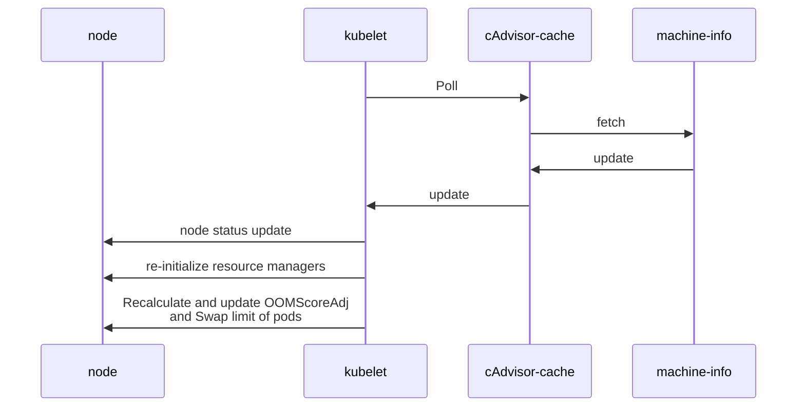

# KEP-3953: Node Resource Hot Plug

<!--
A table of contents is helpful for quickly jumping to sections of a KEP and for
highlighting any additional information provided beyond the standard KEP
template.

Ensure the TOC is wrapped with
  <code>&lt;!-- toc --&rt;&lt;!-- /toc --&rt;</code>
tags, and then generate with `hack/update-toc.sh`.
-->

<!-- toc -->
- [Release Signoff Checklist](#release-signoff-checklist)
- [Glossary](#glossary)
- [Summary](#summary)
- [Motivation](#motivation)
  - [Goals](#goals)
  - [Non-Goals](#non-goals)
- [Proposal](#proposal)
  - [Handling HotUnplug Events](#handling-hotunplug-events)
  - [User Stories](#user-stories)
    - [Story 1](#story-1)
    - [Story 2](#story-2)
    - [Story 3](#story-3)
    - [Story 4](#story-4)
    - [Story 5](#story-5)
  - [Notes/Constraints/Caveats (Optional)](#notesconstraintscaveats-optional)
  - [Risks and Mitigations](#risks-and-mitigations)
- [Design Details](#design-details)
  - [Test Plan](#test-plan)
      - [Unit tests](#unit-tests)
      - [e2e tests](#e2e-tests)
  - [Graduation Criteria](#graduation-criteria)
    - [Phase 1: Alpha (target 1.33)](#phase-1-alpha-target-133)
  - [Upgrade / Downgrade Strategy](#upgrade--downgrade-strategy)
      - [Upgrade](#upgrade)
      - [Downgrade](#downgrade)
  - [Version Skew Strategy](#version-skew-strategy)
- [Production Readiness Review Questionnaire](#production-readiness-review-questionnaire)
  - [Feature Enablement and Rollback](#feature-enablement-and-rollback)
  - [Rollout, Upgrade and Rollback Planning](#rollout-upgrade-and-rollback-planning)
  - [Monitoring Requirements](#monitoring-requirements)
  - [Dependencies](#dependencies)
  - [Scalability](#scalability)
  - [Troubleshooting](#troubleshooting)
- [Implementation History](#implementation-history)
- [Drawbacks](#drawbacks)
- [Alternatives](#alternatives)
- [Infrastructure Needed (Optional)](#infrastructure-needed-optional)
- [Future Work](#future-work)
<!-- /toc -->

## Release Signoff Checklist

Items marked with (R) are required *prior to targeting to a milestone / release*.

- [ ] (R) Enhancement issue in release milestone, which links to KEP dir in [kubernetes/enhancements] (not the initial KEP PR)
- [ ] (R) KEP approvers have approved the KEP status as `implementable`
- [ ] (R) Design details are appropriately documented
- [ ] (R) Test plan is in place, giving consideration to SIG Architecture and SIG Testing input (including test refactors)
    - [ ] e2e Tests for all Beta API Operations (endpoints)
    - [ ] (R) Ensure GA e2e tests meet requirements for [Conformance Tests](https://github.com/kubernetes/community/blob/master/contributors/devel/sig-architecture/conformance-tests.md)
    - [ ] (R) Minimum Two Week Window for GA e2e tests to prove flake free
- [ ] (R) Graduation criteria is in place
    - [ ] (R) [all GA Endpoints](https://github.com/kubernetes/community/pull/1806) must be hit by [Conformance Tests](https://github.com/kubernetes/community/blob/master/contributors/devel/sig-architecture/conformance-tests.md)
- [ ] (R) Production readiness review completed
- [ ] (R) Production readiness review approved
- [ ] "Implementation History" section is up-to-date for milestone
- [ ] User-facing documentation has been created in [kubernetes/website], for publication to [kubernetes.io]
- [ ] Supporting documentation—e.g., additional design documents, links to mailing list discussions/SIG meetings, relevant PRs/issues, release notes

<!--
**Note:** This checklist is iterative and should be reviewed and updated every time this enhancement is being considered for a milestone.
-->

[kubernetes.io]: https://kubernetes.io/
[kubernetes/enhancements]: https://git.k8s.io/enhancements
[kubernetes/kubernetes]: https://git.k8s.io/kubernetes
[kubernetes/website]: https://git.k8s.io/website

## Glossary

Hotplug: Dynamically add compute resources (CPU, Memory, Swap Capacity and HugePages) to the node, either via software (online offlined resources) or via hardware (physical additions while the system is running)

Hotunplug: Dynamically remove compute resources (CPU, Memory, Swap Capacity and HugePages) to the node, either via software (make resources go offline) or via hardware (physical removal while the system is running)


## Summary

The proposal seeks to facilitate hot plugging of node compute resources(CPU, Memory, Swap Capacity and HugePages), thereby streamlining cluster resource capacity updates through node compute resource resizing rather than introducing new nodes to the cluster.
The revised node configurations will be automatically propagated at both the node and cluster levels.

Furthermore, this proposal intends to enhance the initialization and reinitialization processes of resource managers, including the CPU manager and memory manager, in response to alterations in a node's CPU and memory configurations and 
aims to optimize resource management, improve scalability, and minimize disruptions to cluster operations.

## Motivation
Currently, the node's resource configurations are recorded solely during the kubelet bootstrap phase and subsequently cached, assuming the node's compute capacity remains unchanged throughout the cluster's lifecycle.
In a conventional Kubernetes environment, the cluster resources might necessitate modification because of inaccurate resource allocation during cluster initialization or escalating workload over time, 
necessitating supplementary resources within the cluster.

Contemporarily, kernel capabilities enable the dynamic addition of CPUs and memory to a node (for example: https://docs.kernel.org/core-api/cpu_hotplug.html and https://docs.kernel.org/core-api/memory-hotplug.html).
This can be across different architecture and compute environments like Cloud, Bare metal or VM. During this exercise it can lead to Kubernetes being unaware of the node's altered compute capacities during a live-resize,
causing the node to retain outdated information and leading to inconsistencies or an imbalance in the cluster, thus affecting the optimal scheduling and deployment of workloads. As a side-effect, it is also possible for the workloads
to be force migrated to a different node, causing a temporary spike in the CPU/Memory utilisation which is undesirable.

With the current state of implementation in the Kubernetes realm, the available workarounds to allow the cluster to be aware of the changes in the cluster's capacity is by 
restarting the node or at-least restarting the kubelet, which does not have a certain set of best-practices to follow.

However, this approach does carry a few drawbacks such as
 - Introducing a downtime for the existing/to-be-scheduled workloads on the cluster until the node is available.
 - Necessity to reconfigure the underlying services post node-reboot.
 - Managing the associated nuances that a kubelet restart or node reboot carries such as
   - https://github.com/kubernetes/kubernetes/issues/109595
   - https://github.com/kubernetes/kubernetes/issues/119645
   - https://github.com/kubernetes/kubernetes/issues/125579
   - https://github.com/kubernetes/kubernetes/issues/127793

Hence, it is necessary to handle the updates in the compute capacity in a graceful fashion across the cluster, than adopting to reset the cluster components to achieve the same.

Also, given that the capability to live-resize a node exists in the Linux and Windows kernels, enabling the kubelet to be aware of the underlying changes in the node's compute capacity will mitigate any actions that are required to be made
by the Kubernetes administrator.

Node resource hot plugging proves advantageous in scenarios such as:
- Efficiently managing resource demands with a limited number of nodes by increasing the capacity of existing nodes instead of provisioning new ones.
- The procedure of establishing new nodes is considerably more time-intensive than expanding the capabilities of current nodes.
- Improved inter-pod network latencies as the inter-node traffic can be reduced if more pods can be hosted on a single node.
- Easier to manage the cluster with fewer nodes, which brings less overhead on the control-plane
- Mitigate a few of the existing limitations/issues that are associated with a node/kubelet restart.

Implementing this KEP will empower nodes to recognize and adapt to changes in their compute configurations and allow facilitating the efficient and effective deployment of pod workloads to nodes capable of meeting the required compute demands.

### Goals

* Achieve seamless node capacity expansion through hot plugging resources.
* Enable the re-initialization of resource managers (CPU manager, memory manager) and kube runtime manager to accommodate alterations in the node's resource allocation.
* Recalculating and updating the OOMScoreAdj and swap memory limit for existing pods.

### Non-Goals

* Dynamically adjust system reserved and kube reserved values.
* Hot unplug of node resources.
* Update the autoscaler to utilize resource hot plugging.
* Re-balance workloads across the nodes.
* Update runtime/NRI plugins with host resource changes.

## Proposal

This KEP strives to enable node resource hot plugging by incorporating a polling mechanism within the kubelet to retrieve machine-information from cAdvisor's cache, which is already updated periodically.
The kubelet will periodically fetch this information, subsequently entrusting the node status updater to disseminate these updates at the node level across the cluster.
Moreover, this KEP aims to refine the initialization and reinitialization processes of resource managers, including the memory manager and CPU manager, to ensure their adaptability to changes in node configurations.
With this proposal its also necessary to recalculate and update OOMScoreAdj and swap limit for the pods that had been existing before resize. But this carries small overhead due to recalculation of swap and OOMScoreAdj.

### Handling HotUnplug Events

Though this KEP focuses only on resource hotplug, It will enable the kubelet to capture the current available capacity of the node (Regardless of whether it was a hotplug or hotunplug of resources.)
For now, we will introduce an error mode in the kubelet to inform users about the shrink in the available resources in case of hotunplug.

Few of the concerns surrounding hotunplug are listed below
* Pod re-admission:
    * Given that there is probability that the current Pod resource usage may exceed the available capacity of node, its necessary to check if the pod can continue Running
      or if it has to be terminated due to resource crunch.
* Recalculate OOM adjust score and Swap limits:
    * Since the total capacity of the node has changed, values associated with the nodes memory capacity must be recomputed.
* Handling unplug of reserved CPUs.

we intend to propose a separate KEP dedicated to hotunplug of resources to address the same.

### User Stories

#### Story 1

As a Kubernetes user, I want to allocate more resources (CPU, memory) to a node with existing specialized hardware or CPU Capabilities (for example:https://www.kernel.org/doc/html/v5.8/arm64/elf_hwcaps.html)
so that additional workloads can leverage the hardware to be efficiently scheduled and run without manual intervention.

#### Story 2

As a Kubernetes Application Developer, I want the kernel to optimize system performance by making better use of local resources when a node is resized, so that my applications run faster with fewer disruptions. This is achieved when there are
Fewer Context Switches: With more CPU cores and memory on a resized node, the kernel has a better chance to spread workloads out efficiently. This can reduce contention between processes, leading to fewer context switches (which can be costly in terms of CPU time) 
and less process interference and also reduces latency.
Better Memory Allocation: If the kernel has more memory available, it can allocate larger contiguous memory blocks, which can lead to better memory locality (i.e., keeping related data closer in physical memory),improved paging and swap limits thus 
reducing latency for applications that rely on large datasets, in the case of a database applications.

#### Story 3

As a Site Reliability Engineer (SRE), I want to reduce the operational complexity of managing multiple worker nodes, so that I can focus on fewer resources and simplify troubleshooting and monitoring.

#### Story 4

As a Cluster administrator, I want to resize a Kubernetes node dynamically, so that I can quickly hot plug resources without waiting for new nodes to join the cluster.

#### Story 5

As a Cluster administrator, I expect my existing workloads to function without having to undergo a disruption which is induced during capacity addition followed by a node/kubelet restart to
detect the change in compute capacity, which can bring in additional complications.

### Notes/Constraints/Caveats (Optional)

### Risks and Mitigations

- Change in OOMScoreAdjust value:
    - The formula to calculate OOMScoreAdjust is `1000 - (1000*containerMemReq)/memoryCapacity`
    - With change in memoryCapacity post up-scale, The existing OOMScoreAdjust may not be inline with the
      actual OOMScoreAdjust for existing pods.
        - This can be mitigated by recalculating the OOMScoreAdjust value for the existing pods. However, there can be an associated overhead for
          recalculating the scores.
- Change in Swap limit:
    - The formula to calculate the swap limit is `<containerMemoryRequest>/<nodeTotalMemory>)*<totalPodsSwapAvailable>`
    - With change in nodeTotalMemory and totalPodsSwapAvailable post up-scale, The existing swap limit may not be inline with the
      actual swap limit for existing pods.
        - This can be mitigated by recalculating the swap limit for the existing pods. However, there can be an associated overhead for
          recalculating the scores.

- Post up-scale any failure in resync of Resource managers may be lead to incorrect or rejected allocation, which can lead to underperformed or rejected workload.
  - To mitigate the risks adequate tests should be added to avoid the scenarios where failure to resync resource managers can occur.

- Lack of coordination about change in resource availability across kubelet/runtime/plugins.
  - The plugins/runtime should be updated to react to change in resource information on the node.

- Kubelet missing hotplug event or too many hotplug events
  - Hotplug events are captured via periodic polling by the kubelet, this ensures that the capacity is updated in the poll cycle and can technically not miss the event/fail to handle a flood of events.

- Handling downsize events
  - Though there is no support through this KEP to handle an event of node-downsize, it's the onus of the cluster administrator to resize responsibly to avoid disruption as it lies out of the kubernetes realm.
  - However, enabling this feature will ensure that the correct resource information is pushed across the cluster.

## Design Details

Below diagram is shows the interaction between kubelet, node and cAdvisor.




The interaction sequence is as follows
1. Kubelet will be polling in interval to fetch the machine resource information from cAdvisor's cache, Which is currently updated every 5 minutes.
2. Kubelet's cache will be updated with the latest machine resource information.
3. Node status updater will update the node's status with the latest resource information.
4. Kubelet will reinitialize the resource managers to keep them up to date with dynamic resource changes.
5. Kubelet will recalculate and update the OOMScoreAdj and swap limit for the existing pods.

With increase in cluster resources the following components will be updated

1. Scheduler
   * Scheduler will automatically schedule any pending pods.

2. Update in Node allocatable capacity.

3. Resource managers will re-initialised.

4. Change in OOM score adjust
    * Currently, the OOM score adjust is calculated by
      `1000 - (1000*containerMemReq)/memoryCapacity`
    * Increase in memoryCapacity will result in updated OOM score adjust for pods deployed post resize and also recalculate the same for existing pods.

5. Change in Swap Memory limit
   * Currently, the swap memory limit is calculated by 
 `(<containerMemoryRequest>/<nodeTotalMemory>)*<totalPodsSwapAvailable>`
   * Increase in nodeTotalMemory or totalPodsSwapAvailable will result in updated swap memory limit for pods deployed post resize and also recalculate the same for existing pods.

**Proposed Code changes**

**Pseudocode for Resource Hotplug**

```go
	if utilfeature.DefaultFeatureGate.Enabled(features.NodeResourceHotPlug) {
		// Handle the node dynamic scale up
		machineInfo, err := kl.cadvisor.MachineInfo()
		if err != nil {
			klog.ErrorS(err, "Error fetching machine info")
		} else {
			cachedMachineInfo, _ := kl.GetCachedMachineInfo()
            // Avoid collector collects it as a timestamped metric
            // See PR #95210 and #97006 for more details.
                machineInfo.Timestamp = time.Time{}
			if !reflect.DeepEqual(cachedMachineInfo, machineInfo) {
				kl.setCachedMachineInfo(machineInfo)

				// Resync the resource managers
				if err := kl.containerManager.ResyncComponents(machineInfo); err != nil {
					klog.ErrorS(err, "Error resyncing the kubelet components with machine info")
				}
				
				// Recalculate OOMScoreAdj and Swap Limit.
				// NOTE: we will make use UpdateContainerResources CRI method to update the values.
                if err := kl.RecalculateOOMScoreAdjAndSwap(); err != nil {
                    klog.ErrorS(err, "Error recalculating OOMScoreAdj and Swap")
                }
				
			}
		}
	}
```

**Changes to resource managers to adapt to dynamic scale up of resources**

1. Adding ResyncComponents() method to ContainerManager interface
```go
    // Manages the containers running on a machine.
    type ContainerManager interface {
        .
        .
        // ResyncComponents will resyc the resource managers like cpu, memory and topology managers
	// with updated machineInfo
	ResyncComponents(machineInfo *cadvisorapi.MachineInfo) error
	.
	.
    )
```

2. Adding a method Sync to all the resource managers and will be invoked once there is resource hotplug.

```go
        // SyncMachineInfo will sync the Manager with the latest machine info
        SyncMachineInfo(machineInfo *cadvisorapi.MachineInfo) error
```

### Test Plan

[x] I/we understand the owners of the involved components may require updates to
existing tests to make this code solid enough prior to committing the changes necessary
to implement this enhancement.

##### Unit tests

1. Add necessary tests in kubelet_node_status_test.go to check for the node status behaviour with dynamic node scale up.
2. Add necessary tests in kubelet_pods_test.go to check for the pod cleanup and pod addition workflow.
3. Add necessary tests in eventhandlers_test.go to check for scheduler behaviour with dynamic node capacity change.
4. Add necessary tests in resource managers to check for managers behaviour to adopt dynamic node capacity change.


##### e2e tests

Following scenarios need to be covered:

* Node resource information before and after resource hot plug for the following scenarios.
  * upsize -> downsize
  * upsize -> downsize -> upsize
  * downsize- > upsize
* State of Pending pods due to lack of resources after resource hot plug.
* Resource manager states after the resync of components.

### Graduation Criteria


#### Phase 1: Alpha (target 1.33)


* Feature is disabled by default. It is an opt-in feature which can be enabled by enabling the `NodeResourceHotPlug`
  feature gate.
* Unit test coverage.
* E2E tests.
* Documentation mentioning high level design.


### Upgrade / Downgrade Strategy

<!--
If applicable, how will the component be upgraded and downgraded? Make sure
this is in the test plan.

Consider the following in developing an upgrade/downgrade strategy for this
enhancement:
- What changes (in invocations, configurations, API use, etc.) is an existing
  cluster required to make on upgrade, in order to maintain previous behavior?
- What changes (in invocations, configurations, API use, etc.) is an existing
  cluster required to make on upgrade, in order to make use of the enhancement?
-->

##### Upgrade 

To upgrade the cluster to use this feature, Kubelet should be updated to enable featuregate. 
Existing cluster does not have any impact as the node resources already been updated during cluster creation.

##### Downgrade

It's always possible to trivially downgrade to the previous kubelet, It does not have any impact as the future node resource hot plug wont be reflected in cluster.


### Version Skew Strategy

<!--
If applicable, how will the component handle version skew with other
components? What are the guarantees? Make sure this is in the test plan.

Consider the following in developing a version skew strategy for this
enhancement:
- Does this enhancement involve coordinating behavior in the control plane and
  in the kubelet? How does an n-2 kubelet without this feature available behave
  when this feature is used?
- Will any other components on the node change? For example, changes to CSI,
  CRI or CNI may require updating that component before the kubelet.
-->

Not relevant, As this kubelet specific feature and does not impact other components.

## Production Readiness Review Questionnaire

<!--

Production readiness reviews are intended to ensure that features merging into
Kubernetes are observable, scalable and supportable; can be safely operated in
production environments, and can be disabled or rolled back in the event they
cause increased failures in production. See more in the PRR KEP at
https://git.k8s.io/enhancements/keps/sig-architecture/1194-prod-readiness.

The production readiness review questionnaire must be completed and approved
for the KEP to move to `implementable` status and be included in the release.

In some cases, the questions below should also have answers in `kep.yaml`. This
is to enable automation to verify the presence of the review, and to reduce review
burden and latency.

The KEP must have a approver from the
[`prod-readiness-approvers`](http://git.k8s.io/enhancements/OWNERS_ALIASES)
team. Please reach out on the
[#prod-readiness](https://kubernetes.slack.com/archives/CPNHUMN74) channel if
you need any help or guidance.
-->

### Feature Enablement and Rollback

<!--
This section must be completed when targeting alpha to a release.
-->

###### How can this feature be enabled / disabled in a live cluster?

<!--
Pick one of these and delete the rest.

Documentation is available on [feature gate lifecycle] and expectations, as
well as the [existing list] of feature gates.

[feature gate lifecycle]: https://git.k8s.io/community/contributors/devel/sig-architecture/feature-gates.md
[existing list]: https://kubernetes.io/docs/reference/command-line-tools-reference/feature-gates/
-->

- [x] Feature gate (also fill in values in `kep.yaml`)
    - Feature gate name:NodeResourceHotPlug
    - Components depending on the feature gate: kubelet
- [ ] Other
    - Describe the mechanism:
    - Will enabling / disabling the feature require downtime of the control
      plane?
    - Will enabling / disabling the feature require downtime or reprovisioning
      of a node?

###### Does enabling the feature change any default behavior?

No. This feature is guarded by a feature gate. Existing default behavior does not change if the
feature is not used. 
Even if the feature is enabled via feature gate, If there is no change in 
node configuration the system will continue to work in the same way.

###### Can the feature be disabled once it has been enabled (i.e. can we roll back the enablement)?

Yes. The feature can be disabled by restarting kubelet with the feature-gate off.
Once disabled any hot plug of resources won't reflect at the cluster level.

###### What happens if we reenable the feature if it was previously rolled back?

To reenanble the feature, need to turn on the feature-gate and restart the kubelet,
with feature reenabled, the node resources can be hot plugged in again. Cluster will be automatically updated
with the new resource information. If there are any pending pods due to lack of resources they will turn into
running state.

###### Are there any tests for feature enablement/disablement?

Yes, the tests will be added along with alpha implementation.
* Validate the hot plug of resource to machine is updated at the node resource level.
* Validate the hot plug of resource made the pending pods to transition into running state.
* Validate the resource managers are update with the latest machine information after hot plug of resources.

### Rollout, Upgrade and Rollback Planning

<!--
This section must be completed when targeting beta to a release.
-->

###### How can a rollout or rollback fail? Can it impact already running workloads?

<!--
Try to be as paranoid as possible - e.g., what if some components will restart
mid-rollout?

Be sure to consider highly-available clusters, where, for example,
feature flags will be enabled on some API servers and not others during the
rollout. Similarly, consider large clusters and how enablement/disablement
will rollout across nodes.
-->

Rollout may fail if the resource managers are not re-synced properly due to programmatic errors.
In case of rollout failures, running workloads are not affected, If the pods are on pending state they remain
in the pending state only.
Rollback failure should not affect running workloads.

###### What specific metrics should inform a rollback?

<!--
What signals should users be paying attention to when the feature is young
that might indicate a serious problem?
-->
If there is significant increase in `node_resize_resync_errors_total` metric means the feature is not working as expected.
In case of pending pods and hot plug of resource but still there is no change `scheduler_pending_pods` metric
means the feature is not working as expected.

###### Were upgrade and rollback tested? Was the upgrade->downgrade->upgrade path tested?

<!--
Describe manual testing that was done and the outcomes.
Longer term, we may want to require automated upgrade/rollback tests, but we
are missing a bunch of machinery and tooling and can't do that now.
-->

It will be tested manually as a part of implementation and there will also be automated tests to cover the scenarios.

###### Is the rollout accompanied by any deprecations and/or removals of features, APIs, fields of API types, flags, etc.?

<!--
Even if applying deprecation policies, they may still surprise some users.
-->
No
### Monitoring Requirements

<!--
This section must be completed when targeting beta to a release.

For GA, this section is required: approvers should be able to confirm the
previous answers based on experience in the field.
-->

Monitor the metrics
- `node_resize_resync_request_total`
- `node_resize_resync_errors_total`

###### How can an operator determine if the feature is in use by workloads?

<!--
Ideally, this should be a metric. Operations against the Kubernetes API (e.g.,
checking if there are objects with field X set) may be a last resort. Avoid
logs or events for this purpose.
-->

This feature will be built into kubelet and behind a feature gate. Examining the kubelet feature gate would help 
in determining whether the feature is used. The enablement of the kubelet feature gate can be determined from the 
`kubernetes_feature_enabled` metric.

In addition, newly added metrics `node_resize_resync_request_total`, `node_resize_resync_errors_total` are incremented in case of up-scale of resource
and failing to re-sync resources managers respectively.

###### How can someone using this feature know that it is working for their instance?

<!--
For instance, if this is a pod-related feature, it should be possible to determine if the feature is functioning properly
for each individual pod.
Pick one more of these and delete the rest.
Please describe all items visible to end users below with sufficient detail so that they can verify correct enablement
and operation of this feature.
Recall that end users cannot usually observe component logs or access metrics.
-->

End user can do a hot plug of resource and verify the same change as reflected at the node resource level.
In case there were any pending pods prior to resource hot plug, those pods should transition into Running with addition
of new resources.

###### What are the reasonable SLOs (Service Level Objectives) for the enhancement?

<!--
This is your opportunity to define what "normal" quality of service looks like
for a feature.

It's impossible to provide comprehensive guidance, but at the very
high level (needs more precise definitions) those may be things like:
  - per-day percentage of API calls finishing with 5XX errors <= 1%
  - 99% percentile over day of absolute value from (job creation time minus expected
    job creation time) for cron job <= 10%
  - 99.9% of /health requests per day finish with 200 code

These goals will help you determine what you need to measure (SLIs) in the next
question.
-->

For each node, the value of the metric `node_resize_resync_request_total` is expected to match the number of time the node is resized.
For each node, the value of the metric `node_resize_resync_errors_total` is expected to be zero.


###### What are the SLIs (Service Level Indicators) an operator can use to determine the health of the service?

<!--
Pick one more of these and delete the rest.
-->

- [X] Metrics
    - Metric name:
      - `node_resize_resync_request_total`
      - `node_resize_resync_errors_total`
   - Components exposing the metric: kubelet

###### Are there any missing metrics that would be useful to have to improve observability of this feature?

<!--
Describe the metrics themselves and the reasons why they weren't added (e.g., cost,
implementation difficulties, etc.).
-->
- `node_resize_resync_request_total`
- `node_resize_resync_errors_total`

### Dependencies

<!--
This section must be completed when targeting beta to a release.
-->

###### Does this feature depend on any specific services running in the cluster?

<!--
Think about both cluster-level services (e.g. metrics-server) as well
as node-level agents (e.g. specific version of CRI). Focus on external or
optional services that are needed. For example, if this feature depends on
a cloud provider API, or upon an external software-defined storage or network
control plane.

For each of these, fill in the following—thinking about running existing user workloads
and creating new ones, as well as about cluster-level services (e.g. DNS):
  - [Dependency name]
    - Usage description:
      - Impact of its outage on the feature:
      - Impact of its degraded performance or high-error rates on the feature:
-->
No, It does not depend on any service running on the cluster, But depends on cAdvisor package to fetch
the machine resource information.

### Scalability

<!--
For alpha, this section is encouraged: reviewers should consider these questions
and attempt to answer them.

For beta, this section is required: reviewers must answer these questions.

For GA, this section is required: approvers should be able to confirm the
previous answers based on experience in the field.
-->

###### Will enabling / using this feature result in any new API calls?

<!--
Describe them, providing:
  - API call type (e.g. PATCH pods)
  - estimated throughput
  - originating component(s) (e.g. Kubelet, Feature-X-controller)
Focusing mostly on:
  - components listing and/or watching resources they didn't before
  - API calls that may be triggered by changes of some Kubernetes resources
    (e.g. update of object X triggers new updates of object Y)
  - periodic API calls to reconcile state (e.g. periodic fetching state,
    heartbeats, leader election, etc.)
-->

No, It won't add/modify any user facing APIs.
The resource managers might need to be updated with new methods to resync their components with updated
machine information.

###### Will enabling / using this feature result in introducing new API types?

<!--
Describe them, providing:
  - API type
  - Supported number of objects per cluster
  - Supported number of objects per namespace (for namespace-scoped objects)
-->
No 
###### Will enabling / using this feature result in any new calls to the cloud provider?

<!--
Describe them, providing:
  - Which API(s):
  - Estimated increase:
-->
No
###### Will enabling / using this feature result in increasing size or count of the existing API objects?

<!--
Describe them, providing:
  - API type(s):
  - Estimated increase in size: (e.g., new annotation of size 32B)
  - Estimated amount of new objects: (e.g., new Object X for every existing Pod)
-->
No
###### Will enabling / using this feature result in increasing time taken by any operations covered by existing SLIs/SLOs?

<!--
Look at the [existing SLIs/SLOs].

Think about adding additional work or introducing new steps in between
(e.g. need to do X to start a container), etc. Please describe the details.

[existing SLIs/SLOs]: https://git.k8s.io/community/sig-scalability/slos/slos.md#kubernetes-slisslos
-->
Negligible, In the case of resource hot plug the resource manager may take some time to resync.
###### Will enabling / using this feature result in non-negligible increase of resource usage (CPU, RAM, disk, IO, ...) in any components?

<!--
Things to keep in mind include: additional in-memory state, additional
non-trivial computations, excessive access to disks (including increased log
volume), significant amount of data sent and/or received over network, etc.
This through this both in small and large cases, again with respect to the
[supported limits].

[supported limits]: https://git.k8s.io/community//sig-scalability/configs-and-limits/thresholds.md
-->
Negligible computational overhead might be introduced into kubelet as it periodically needs to fetch machine information 
from cAdvisor cache and resync all the resource managers with the updated machine information.
###### Can enabling / using this feature result in resource exhaustion of some node resources (PIDs, sockets, inodes, etc.)?

<!--
Focus not just on happy cases, but primarily on more pathological cases
(e.g. probes taking a minute instead of milliseconds, failed pods consuming resources, etc.).
If any of the resources can be exhausted, how this is mitigated with the existing limits
(e.g. pods per node) or new limits added by this KEP?

Are there any tests that were run/should be run to understand performance characteristics better
and validate the declared limits?
-->
Yes, It could.
Since the nodes computational capacity is increased dynamically there might be more pods scheduled on the node.
This is however be mitigated by maxPods kubelet configuration that limits the number of pods on a node.

### Troubleshooting

<!--
This section must be completed when targeting beta to a release.

For GA, this section is required: approvers should be able to confirm the
previous answers based on experience in the field.

The Troubleshooting section currently serves the `Playbook` role. We may consider
splitting it into a dedicated `Playbook` document (potentially with some monitoring
details). For now, we leave it here.
-->

###### How does this feature react if the API server and/or etcd is unavailable?

This feature is node local and mainly handled in kubelet, It has no dependency on etcd.
In case there are pending pods and there is hot plug of resources, The scheduler relies on the API server to fetch node information. 
Without access to the API server, it cannot make scheduling decisions as the node resources are not updated. The pending pods would remain in same condition.

###### What are other known failure modes?

<!--
For each of them, fill in the following information by copying the below template:
  - [Failure mode brief description]
    - Detection: How can it be detected via metrics? Stated another way:
      how can an operator troubleshoot without logging into a master or worker node?
    - Mitigations: What can be done to stop the bleeding, especially for already
      running user workloads?
    - Diagnostics: What are the useful log messages and their required logging
      levels that could help debug the issue?
      Not required until feature graduated to beta.
    - Testing: Are there any tests for failure mode? If not, describe why.
-->

This feature mainly does two things fetch machine information from cAdvisor and reinitialize resource managers.
Failure scenarios can occur in cAdvisor level that is if it wrongly updated with incorrect machine information.


###### What steps should be taken if SLOs are not being met to determine the problem?

If the SLOs are not being met one can examine the kubelet logs and its also advised not to hotplug the node resources.

## Implementation History

<!--
Major milestones in the lifecycle of a KEP should be tracked in this section.
Major milestones might include:
- the `Summary` and `Motivation` sections being merged, signaling SIG acceptance
- the `Proposal` section being merged, signaling agreement on a proposed design
- the date implementation started
- the first Kubernetes release where an initial version of the KEP was available
- the version of Kubernetes where the KEP graduated to general availability
- when the KEP was retired or superseded
-->

## Drawbacks

<!--
Why should this KEP _not_ be implemented?
-->

Currently, This KEP only focuses on resource hotplug however in a case where the node is downsized its possible that the
nodes capacity may be lower than existing workloads memory requirement.

## Alternatives

Horizontally scale the cluster by incorporating additional compute nodes.

<!--
What other approaches did you consider, and why did you rule them out? These do
not need to be as detailed as the proposal, but should include enough
information to express the idea and why it was not acceptable.
-->

## Infrastructure Needed (Optional)
VMs of cluster should support hot plug of compute resources for e2e tests.

## Future Work

* Support hot-unplug of node resources:
  * Pod re-admission:
    * Given that there is probability that the current Pod resource usage may exceed the available capacity of node, its necessary to check if the pod can continue Running
      or if it has to be terminated due to resource crunch.
  * Recalculate OOM adjust score and Swap limits:
    * Since the total capacity of the node has changed, values associated with the nodes memory capacity must be recomputed.
  * Handling unplug of reserved CPUs.
  
* Fetching machine info via CRI
    * At present, the machine data is retrieved from cAdvisor's cache through periodic checks. There is ongoing development to utilize CRI APIs for this purpose.
    * Presently, resource managers are updated through regular polling. Once the CRI APIs are enhanced to fetch machine information, we can significantly enhance the reinitialization of resource managers, 
      enabling them to respond more effectively to resize events.
