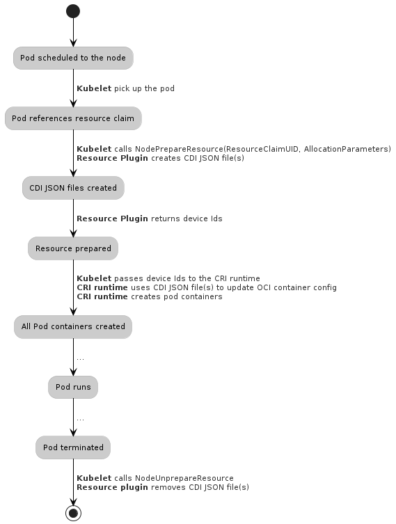

<!--
**Note:** When your KEP is complete, all of these comment blocks should be removed.

To get started with this template:

- [ ] **Pick a hosting SIG.**
  Make sure that the problem space is something the SIG is interested in taking
  up. KEPs should not be checked in without a sponsoring SIG.
- [ ] **Create an issue in kubernetes/enhancements**
  When filing an enhancement tracking issue, please make sure to complete all
  fields in that template. One of the fields asks for a link to the KEP. You
  can leave that blank until this KEP is filed, and then go back to the
  enhancement and add the link.
- [ ] **Make a copy of this template directory.**
  Copy this template into the owning SIG's directory and name it
  `NNNN-short-descriptive-title`, where `NNNN` is the issue number (with no
  leading-zero padding) assigned to your enhancement above.
- [ ] **Fill out as much of the kep.yaml file as you can.**
  At minimum, you should fill in the "Title", "Authors", "Owning-sig",
  "Status", and date-related fields.
- [ ] **Fill out this file as best you can.**
  At minimum, you should fill in the "Summary" and "Motivation" sections.
  These should be easy if you've preflighted the idea of the KEP with the
  appropriate SIG(s).
- [ ] **Create a PR for this KEP.**
  Assign it to people in the SIG who are sponsoring this process.
- [ ] **Merge early and iterate.**
  Avoid getting hung up on specific details and instead aim to get the goals of
  the KEP clarified and merged quickly. The best way to do this is to just
  start with the high-level sections and fill out details incrementally in
  subsequent PRs.

Just because a KEP is merged does not mean it is complete or approved. Any KEP
marked as `provisional` is a working document and subject to change. You can
denote sections that are under active debate as follows:

```
<<[UNRESOLVED optional short context or usernames ]>>
Stuff that is being argued.
<<[/UNRESOLVED]>>
```

When editing KEPS, aim for tightly-scoped, single-topic PRs to keep discussions
focused. If you disagree with what is already in a document, open a new PR
with suggested changes.

One KEP corresponds to one "feature" or "enhancement" for its whole lifecycle.
You do not need a new KEP to move from beta to GA, for example. If
new details emerge that belong in the KEP, edit the KEP. Once a feature has become
"implemented", major changes should get new KEPs.

The canonical place for the latest set of instructions (and the likely source
of this file) is [here](/keps/NNNN-kep-template/README.md).

**Note:** Any PRs to move a KEP to `implementable`, or significant changes once
it is marked `implementable`, must be approved by each of the KEP approvers.
If none of those approvers are still appropriate, then changes to that list
should be approved by the remaining approvers and/or the owning SIG (or
SIG Architecture for cross-cutting KEPs).
-->

# [KEP-4381](https://github.com/kubernetes/enhancements/issues/4381): Dynamic Resource Allocation with Structured Parameters

<!-- toc -->
- [Release Signoff Checklist](#release-signoff-checklist)
- [Summary](#summary)
- [Motivation](#motivation)
  - [Goals](#goals)
  - [Non-Goals](#non-goals)
- [Proposal](#proposal)
  - [User Stories](#user-stories)
    - [Cluster add-on development](#cluster-add-on-development)
    - [Cluster configuration](#cluster-configuration)
    - [Partial GPU allocation](#partial-gpu-allocation)
  - [Publishing node resources](#publishing-node-resources)
    - [Devices as a named list](#devices-as-a-named-list)
  - [Using structured parameters](#using-structured-parameters)
  - [Communicating allocation to the DRA driver](#communicating-allocation-to-the-dra-driver)
  - [Risks and Mitigations](#risks-and-mitigations)
    - [Feature not used](#feature-not-used)
    - [Compromised node](#compromised-node)
    - [Compromised kubelet plugin](#compromised-kubelet-plugin)
    - [User permissions and quotas](#user-permissions-and-quotas)
    - [Usability](#usability)
- [Design Details](#design-details)
  - [Components](#components)
  - [State and communication](#state-and-communication)
  - [Sharing a single ResourceClaim](#sharing-a-single-resourceclaim)
  - [Ephemeral vs. persistent ResourceClaims lifecycle](#ephemeral-vs-persistent-resourceclaims-lifecycle)
  - [Scheduled pods with unallocated or unreserved claims](#scheduled-pods-with-unallocated-or-unreserved-claims)
  - [Handling non graceful node shutdowns](#handling-non-graceful-node-shutdowns)
  - [API](#api)
    - [resource.k8s.io](#resourcek8sio)
      - [ResourceSlice](#resourceslice)
      - [DeviceClass](#deviceclass)
      - [Allocation result](#allocation-result)
      - [ResourceClaimTemplate](#resourceclaimtemplate)
    - [core](#core)
      - [Pod](#pod)
      - [ResourceQuota](#resourcequota)
  - [kube-controller-manager](#kube-controller-manager)
  - [kube-scheduler](#kube-scheduler)
    - [EventsToRegister](#eventstoregister)
    - [PreEnqueue](#preenqueue)
    - [Pre-filter](#pre-filter)
    - [Filter](#filter)
    - [Post-filter](#post-filter)
    - [Reserve](#reserve)
    - [PreBind](#prebind)
    - [Unreserve](#unreserve)
  - [kubelet](#kubelet)
    - [Communication between kubelet and kubelet plugin](#communication-between-kubelet-and-kubelet-plugin)
    - [Version skew](#version-skew)
    - [Security](#security)
    - [Managing resources](#managing-resources)
      - [NodePrepareResource](#nodeprepareresource)
      - [NodeUnprepareResources](#nodeunprepareresources)
  - [Simulation with CA](#simulation-with-ca)
  - [Test Plan](#test-plan)
      - [Prerequisite testing updates](#prerequisite-testing-updates)
      - [Unit tests](#unit-tests)
      - [Integration tests](#integration-tests)
      - [e2e tests](#e2e-tests)
  - [Graduation Criteria](#graduation-criteria)
    - [Alpha](#alpha)
    - [Beta](#beta)
    - [GA](#ga)
  - [Upgrade / Downgrade Strategy](#upgrade--downgrade-strategy)
  - [Version Skew Strategy](#version-skew-strategy)
- [Production Readiness Review Questionnaire](#production-readiness-review-questionnaire)
  - [Feature Enablement and Rollback](#feature-enablement-and-rollback)
  - [Rollout, Upgrade and Rollback Planning](#rollout-upgrade-and-rollback-planning)
  - [Monitoring Requirements](#monitoring-requirements)
  - [Dependencies](#dependencies)
  - [Scalability](#scalability)
  - [Troubleshooting](#troubleshooting)
- [Implementation History](#implementation-history)
- [Drawbacks](#drawbacks)
- [Alternatives](#alternatives)
  - [Publishing resource information in node status](#publishing-resource-information-in-node-status)
  - [Injecting vendor logic into CA](#injecting-vendor-logic-into-ca)
  - [ResourceClaimTemplate](#resourceclaimtemplate-1)
  - [Reusing volume support as-is](#reusing-volume-support-as-is)
  - [Extend volume support](#extend-volume-support)
  - [Extend Device Plugins](#extend-device-plugins)
  - [ResourceDriver](#resourcedriver)
- [Infrastructure Needed](#infrastructure-needed)
<!-- /toc -->

## Release Signoff Checklist

<!--
**ACTION REQUIRED:** In order to merge code into a release, there must be an
issue in [kubernetes/enhancements] referencing this KEP and targeting a release
milestone **before the [Enhancement Freeze](https://git.k8s.io/sig-release/releases)
of the targeted release**.

For enhancements that make changes to code or processes/procedures in core
Kubernetes—i.e., [kubernetes/kubernetes], we require the following Release
Signoff checklist to be completed.

Check these off as they are completed for the Release Team to track. These
checklist items _must_ be updated for the enhancement to be released.
-->

Items marked with (R) are required *prior to targeting to a milestone / release*.

- [ ] (R) Enhancement issue in release milestone, which links to KEP dir in [kubernetes/enhancements] (not the initial KEP PR)
- [ ] (R) KEP approvers have approved the KEP status as `implementable`
- [ ] (R) Design details are appropriately documented
- [ ] (R) Test plan is in place, giving consideration to SIG Architecture and SIG Testing input (including test refactors)
  - [ ] e2e Tests for all Beta API Operations (endpoints)
  - [ ] (R) Ensure GA e2e tests meet requirements for [Conformance Tests](https://github.com/kubernetes/community/blob/master/contributors/devel/sig-architecture/conformance-tests.md) 
  - [ ] (R) Minimum Two Week Window for GA e2e tests to prove flake free
- [ ] (R) Graduation criteria is in place
  - [ ] (R) [all GA Endpoints](https://github.com/kubernetes/community/pull/1806) must be hit by [Conformance Tests](https://github.com/kubernetes/community/blob/master/contributors/devel/sig-architecture/conformance-tests.md) 
- [ ] (R) Production readiness review completed
- [ ] (R) Production readiness review approved
- [ ] "Implementation History" section is up-to-date for milestone
- [ ] User-facing documentation has been created in [kubernetes/website], for publication to [kubernetes.io]
- [ ] Supporting documentation—e.g., additional design documents, links to mailing list discussions/SIG meetings, relevant PRs/issues, release notes

<!--
**Note:** This checklist is iterative and should be reviewed and updated every time this enhancement is being considered for a milestone.
-->

[kubernetes.io]: https://kubernetes.io/
[kubernetes/enhancements]: https://git.k8s.io/enhancements
[kubernetes/kubernetes]: https://git.k8s.io/kubernetes
[kubernetes/website]: https://git.k8s.io/website

## Summary

This KEP originally defined an extension of the ["classic" DRA #3063
KEP](../3063-dynamic-resource-allocation/README.md). Now the roles are
reversed: this KEP defines the base functionality and #3063 adds an optional
extension.

Users are increasingly deploying Kubernetes as management solution for new
workloads (batch processing) and in new environments (edge computing). Such
workloads no longer need just RAM and CPU, but also access to specialized
hardware. With upcoming enhancements of data center interconnects, accelerators
can be installed outside of specific nodes and be connected to nodes
dynamically as needed.

This KEP introduces a new API for describing which of these new resources
a pod needs. Typically, such resources are devices like a GPU or other kinds
of accelerators. The API supports:

- Network-attached devices. The existing [device plugin API](https://github.com/kubernetes/design-proposals-archive/blob/main/resource-management/device-plugin.md)
  is limited to hardware on a node.
- Sharing of allocated devices between multiple containers or pods.
  The device plugin API currently cannot share devices at all. It
  could be extended to share devices between containers in a single pod,
  but supporting sharing between pods would need a completely new
  API similar to the one in this KEP.
- Using a device that is expensive to initialize multiple times
  in different pods. This is not possible at the moment.
- Custom parameters that describe device configuration.
  With the current Pod API, annotations have to be used to capture such
  parameters and then hacks are needed to access them from a CSI driver or
  device plugin.

Support for new hardware will be provided by hardware vendor add-ons. Those add-ons
are called "DRA drivers". They are responsible for reporting available devices in a format defined and
understood by Kubernetes and for configuring hardware before it is used. Kubernetes
handles the allocation of those devices as part of pod scheduling.
This KEP does not replace other means of requesting traditional resources
(RAM/CPU, volumes, extended resources).

In the typical case of node-local devices, the high-level form of DRA with
structured parameters is as follows:

* DRA drivers publish their available devices in the form of a
  `ResourceSlice` object on a node-by-node basis. This object is stored in the
  API server and available to the scheduler (or Cluster Autoscaler) to query
  when a request for devices comes in later on.

* When a user wants to consume a resource, they create a `ResourceClaim`.
  This object defines how
  many devices are needed and which capabilities they must have.

* With such a claim in place, the scheduler (or Cluster Autoscaler) can evaluate against the
  `ResourceSlice` of any candidate nodes by comparing attributes, without knowing exactly what is
  being requested. They then use this information to help decide which node to
  schedule a pod on (as well as allocate resources from its `ResourceSlice`
  in the process).

* Once a node is chosen and the allocation decisions made, the scheduler will
  store the result in the API server as well as update its in-memory model of
  available resources. DRA drivers are responsible for using this allocation
  result to inject any allocated resource into the Pod, according to
  the device choices made by the scheduler. This includes applying any
  configuration information attached to the original request.

This KEP defines a way to describe devices with a name and some associated
attributes that are used to select devices.

## Motivation

<!--
This section is for explicitly listing the motivation, goals, and non-goals of
this KEP.  Describe why the change is important and the benefits to users. The
motivation section can optionally provide links to [experience reports] to
demonstrate the interest in a KEP within the wider Kubernetes community.

[experience reports]: https://github.com/golang/go/wiki/ExperienceReports
-->

Originally, Kubernetes and its scheduler only tracked CPU and RAM as
resources for containers. Later, support for storage and discrete,
countable per-node extended resources was added. The kubelet device plugin
interface then made such local resources available to containers. But
for many newer devices, this approach and the Kubernetes API for
requesting these custom resources is too limited. This KEP may eventually
address limitations of the current approach for the following use cases:

- *Device initialization*: When starting a workload that uses
  an accelerator like an FPGA, I’d like to have the accelerator
  reconfigured or reprogrammed without having to deploy my application
  with full hardware access and/or root privileges. Running applications
  with less privileges is better for overall security of the cluster.

  *Limitation*: Currently, it’s impossible to specify the desired
  device properties that are required for reconfiguring devices.
  For the FPGA example, a file containing the desired configuration
  of the FPGA has to be referenced.

- *Device cleanup*: When my workload is finished, I would like to have
  a mechanism for cleanup of the device, that will ensure that device
  does not contain traces/parameters/data from previous workloads and
  appropriate power state/shutdown. For example, an FPGA might have
  to be reset because its configuration for the workload was
  confidential.

  *Limitation*: Post-stop actions are not supported.

- *Partial allocation*: When workloads use only a portion of the device
  capabilities, devices can be partitioned (e.g. using Nvidia MIG or SR-IOV) to
  better match workload needs. Sharing the devices in this way can greatly
  increase HW utilization / reduce costs.

  *Limitation*: currently there's no API to request partial device
  allocation. With the current device plugin API, devices need to be
  pre-partitioned and advertised in the same way a full / static devices
  are. User must then select a pre-partitioned device instead of having one
  created for them on the fly based on their particular resource
  constraints. Without the ability to create devices dynamically (i.e. at the
  time they are requested) the set of pre-defined devices must be carefully
  tuned to ensure that device resources do not go unused because some of the
  pre-partioned devices are in low-demand. It also puts the burden on the user
  to pick a particular device type, rather than declaring the resource
  constraints more abstractly.

- *Optional allocation*: When deploying a workload I’d like to specify
  soft(optional) device requirements. If a device exists and it’s
  allocatable it will be allocated. If not - the workload will be run on
  a node without a device. GPU and crypto-offload engines are
  examples of this kind of device. If they’re not available, workloads
  can still run by falling back to using only the CPU for the same
  task.

  *Limitation*: Optional allocation is supported neither by the device
  plugins nor by current Pod resource declaration.

- *Support Over the Fabric devices*: When deploying a container, I’d
  like to utilize devices available over the Fabric (network, special
  links, etc).

  *Limitation*: The device plugin API is designed for node-local resources that
  get discovered by a plugin running on the node. Projects like
  [Akri](https://www.cncf.io/projects/akri/) have to work around that by
  reporting the same network-attached resource on all nodes that it could
  get attached to and then updating resource availability on all of those
  nodes when resources get used.

Several other limitations are addressed by
[CDI](https://github.com/container-orchestrated-devices/container-device-interface/),
a container runtime extension that this KEP is using to expose resources
inside a container.

### Goals

- Enable cluster autoscaling when pods use resource claims, with correct
  decisions and changing the cluster size by more than one node at a time.

- Support node-local and network-attached resources.

- Support configuration parameters that are specified in a format defined by a
  vendor.

### Non-Goals

* Replace the device plugin API. For devices that fit into its model
  of a single, linear quantity it is a good solution. Other devices
  should use dynamic resource allocation. Both are expected to co-exist, with vendors
  choosing the API that better suits their needs on a case-by-case
  basis. Because the new API is going to be implemented independently of the
  existing device plugin support, there's little risk of breaking stable APIs.

* Provide an abstraction layer for device requests, i.e., something like a
  “I want some kind of GPU”. Users will need to know about specific
  DRA drivers and which configuration parameters and attributes they support.
  Administrators and/or vendors can simplify this by creating device class
  objects in the cluster, but defining those is out-of-scope for Kubernetes.

  Portability of workloads could be added on top of this proposal by
  standardizing attributes and what they mean for certain classes of devices.
  The
  [Resource Class
  Proposal](https://docs.google.com/document/d/1qKiIVs9AMh2Ua5thhtvWqOqW0MSle_RV3lfriO1Aj6U/edit#heading=h.jzfmfdca34kj)
  included such an approach.

## Proposal

### User Stories

#### Cluster add-on development

As a hardware vendor, I want to make my hardware available also to applications
that run in a container under Kubernetes. I want to make it easy for a cluster
administrator to configure a cluster where some nodes have this hardware.

I develop a DRA driver, package it in a container image and provide YAML files
for running it as a kubelet plugin via a daemon set.

Documentation for administrators explains how the nodes need to be set
up. Documentation for users explains which parameters control the behavior of
my hardware and how to use it inside a container.

#### Cluster configuration

As a cluster administrator, I want to make GPUs from vendor ACME available to users
of that cluster. I prepare the nodes and deploy the vendor's components with
`kubectl create`.

I create a DeviceClass for the hardware with parameters that only I as the
administrator am allowed to choose, like for example running a command with
root privileges that does some cluster-specific initialization of a device
each time it is prepared on a node:

```yaml
apiVersion: resource.k8s.io/v1beta1
kind: DeviceClass
metadata:
  name: acme-gpu
spec:
  selectors:
  - cel:
      expression: device.driver == "gpu.acme.example.com"
  config:
  - opaque:
      driver: gpu.acme.example.com
      parameters:
        apiVersion: gpu.acme.example.com/v1
        kind: GPUInit
        # DANGER! This option must not be accepted for
        # user-supplied parameters.
        initCommand:
          - /usr/local/bin/acme-gpu-init
          - --cluster
          - my-cluster
```

#### Partial GPU allocation

As a user, I want to use a GPU as accelerator, but don't need exclusive access
to that GPU. Running my workload with just 2Gb of memory is sufficient. This is
supported by the ACME GPU hardware. I know that the administrator has created
an "acme-gpu" DeviceClass and set up the hardware such that each card is
partitioned into slices of different sizes. Each slice is represented as
a device with a `gpu.acme.example.com/memory` attribute that describes how
much memory is assigned to it.

**Note:** This partitioning is static. Dynamically reconfiguring a card to
match demand is not part of this KEP. It's covered by the ["partitionable
devices" extension](https://github.com/kubernetes/enhancements/issues/4815).

For a simple trial, I create a Pod directly where two containers share the same subset
of the GPU:

```yaml
apiVersion: resource.k8s.io/v1beta1
kind: ResourceClaimTemplate
metadata:
  name: device-consumer-gpu-template
spec:
  metadata:
    # Additional annotations or labels for the
    # ResourceClaim could be specified here.
  spec:
    devices:
      requests:
      - name: gpu-request # could be used to select this device in a container when requesting more than one
        deviceClassName: acme-gpu
        selectors:
        - cel:
            expression: device.attributes["gpu.acme.example.com"].memory.isGreaterThan(quantity("2Gi")) # Always set for ACME GPUs.
---
apiVersion: v1
kind: Pod
metadata:
  name: device-consumer
spec:
  resourceClaims:
  - name: "gpu" # this name gets referenced below under "claims"
    resourceClaimTemplateName: device-consumer-gpu-template
  containers:
  - name: workload
    image: my-app
    command: ["/bin/program"]
    resources:
      requests:
        memory: "64Mi"
        cpu: "250m"
      limits:
        memory: "128Mi"
        cpu: "500m"
      claims:
        - name: "gpu"
  - name: monitor
    image: my-app
    command: ["/bin/other-program"]
    resources:
      requests:
        memory: "32Mi"
        cpu: "25m"
      limits:
        memory: "64Mi"
        cpu: "50m"
      claims:
      - name: "gpu"
```

This request triggers allocation on a node that has a GPU device or fraction of a GPU device
with at least 2Gi of memory and then the Pod runs on that node.
The lifecycle of the allocation is tied to the lifecycle of the Pod.

In production, a similar PodTemplateSpec in a Deployment will be used.

### Publishing node resources

The devices available on a node need to be published to the API server. In
the typical case, this is expected to be published by the on-node driver
as described in the next paragraph. However, the source of this data may vary; for
example, a cloud provider controller could populate this based upon information
from the cloud provider API.

In the node-local case, each driver running on a node publishes a set of
`ResourceSlice` objects to the API server for its own resources, using its
connection to the apiserver. The collection of these objects form a pool from
which resources can be allocated. Some additional fields (defined in the API
section) enable a consumer to determine whether it has a complete and
consistent view of that pool.

Access control through a validating admission
policy can ensure that the drivers running on one node are not allowed to
create or modify `ResourceSlices` belonging to another node. The `nodeName`
and `driverName` fields in each `ResourceSlice` object are used to determine which objects are
managed by which driver instance. The owner reference ensures that objects
beloging to a node get cleaned up when the node gets removed.

In addition, whenever the kubelet starts, it first deletes all `ResourceSlices`
belonging to the node with a `DeleteCollection` call that uses the node name in
a field filter. This ensures that no pods depending in DRA get scheduled to the
node until the required DRA drivers have started up again (node reboot) and
reconnected to kubelet (kubelet restart). It also ensures that drivers which
don't get started up again at all don't leave stale `ResourceSlices`
behind. Garbage collection does not help in this case because the node object
still exists. For the same reasons, the ResourceSlices belonging to a driver
get removed when the driver unregisters, this time with a field filter for node
name and driver name.

Deleting `ResourceSlices` is possible because all information in them can be
reconstructed by the driver. This has no effect on already allocated claims
because the allocation result is tracked in those claims, not the
`ResourceSlice` objects (see [below](#state-and-communication)).

#### Devices as a named list

Embedded inside each `ResourceSlice` is a list of one or more devices, each of which contains separate sets of attributes and capacities (represented as quantities).

```yaml
kind: ResourceSlice
apiVersion: resource.k8s.io/v1beta1
...
spec:
  # The node name indicates the node.
  #
  # Each driver on a node provides pools of devices for allocation,
  # with unique device names inside each pool. A pool might be defined
  # by more than one ResourceSlice.
  nodeName: worker-1
  pool:
    ...
  driver: cards.dra.example.com
  devices:
  - name: card-1 # unique inside the worker-1 pool
    basic:
      attributes:
        manufacturer: # a vendor-specific attribute, automatically qualified as cards.dra.example.com/manufacturer
          string: Cards-are-us Inc.
        productName:
          string: ACME T1000 16GB
        driverVersion:
          version: 1.2.3
        runtimeVersion:
          version: 11.1.42
        powerSavingSupported:
          bool: true
        dra.k8s.io/pciRoot: # a fictional standardized attribute, not actually part of this KEP
          string: pci-root-0
      capacity:
        memory: 16Gi
```

Compared to labels, attributes have values of exactly one type. Quantities are defined
in the separate `capacity` map. As described later on, both sets can be used in CEL expressions to select a
specific resource for allocation on a node.

To avoid any future conflicts, we reserve any attributes with the ".k8s.io/" domain prefix
for future use and standardization by Kubernetes. This could be used to describe
topology across resources from different vendors, for example, but this is out-
of-scope for now.

**Note:** If a driver needs to remove a device or change its attributes,
then there is a risk that a claim gets allocated based on the old
`ResourceSlice`. The scheduler must handle
scenarios where more devices are allocated than available. The kubelet plugin
of a DRA driver ***must*** double-check that the allocated devices are still
available when NodePrepareResource is called. If not, the pod cannot start until
the device comes back. Checking it at admission time and treating this as a fatal error
would allow us to delete the pod and trying again with a new one, but is not done
at the moment because admission checks cannot be retried if a check finds
a transient problem.

### Using structured parameters

A ResourceClaim is a request to allocate one or more devices. Each request in a
claim must reference a pre-defined DeviceClass to narrow down which devices are
desired and may restrict that further in the request itself through one or more device
selectors. A device selector is a CEL expression that must evaluate to true if a
device satisfies the request. A special `device` variable provides access to
the attributes of a device.

To correlate different devices, a claim may have "match attributes". Those are
the names of attributes whose values must be the same for all devices that get
allocated for the claim.

Configuration parameters can be embedded in the claim so that they apply
to all or some requests. These configuration parameters are ignored by
the scheduler when selecting devices. They get passed down to the DRA drivers
when preparing the devices on a node.

A DeviceClass can contain the same device selector and device configuration
parameters. Those get added to what is specified in the claim when a class gets
referenced.

### Communicating allocation to the DRA driver

The scheduler decides which devices to use for a claim. It also needs to pass
through the opaque vendor parameters, if there are any. This accurately
captures the configuration parameters as they were set at the time of
allocation. All of this information gets stored in the allocation result inside
the ResourceClaim status.

### Risks and Mitigations

<!--
What are the risks of this proposal, and how do we mitigate? Think broadly.
For example, consider both security and how this will impact the larger
Kubernetes ecosystem.

How will security be reviewed, and by whom?

How will UX be reviewed, and by whom?

Consider including folks who also work outside the SIG or subproject.
-->

#### Feature not used

In a cluster where the feature is not used (no DRA driver installed, no
pods using dynamic resource allocation) the impact is minimal, both for
performance and security. The scheduler plugin will
return quickly without doing any work for pods.

#### Compromised node

Kubelet is intentionally limited to read-only access for ResourceClaim
to prevent that a
compromised kubelet interferes with scheduling of pending pods, for example
by updating status information normally set by the scheduler.
Faking such information could be used for a denial-of-service
attack against pods using those ResourceClaims, for example by overwriting
their allocation result with a node selector that matches no node. A
denial-of-service attack against the cluster and other pods is harder, but
still possible. For example, frequently updating ResourceSlice objects could
cause new scheduling attempts for pending pods.

Another potential attack goal is to get pods with sensitive workloads to run on
a compromised node. For pods that don't use special resources nothing changes
in that regard. Such an attack is possible for pods with extended resources
because kubelet is in control of which capacity it reports for those: it could
publish much higher values than the device plugin reported and thus attract
pods to the node that normally would run elsewhere. With dynamic resource
allocation, such an attack is still possible, but the attack code would have to
be different for each DRA driver because all of them will use structured
parameters differently for reporting resource availability.

#### Compromised kubelet plugin

This is the result of an attack against the DRA driver, either from a
container which uses a device exposed by the driver, a compromised kubelet
which interacts with the plugin, or due to DRA driver running on a node
with a compromised root account.

The DRA driver needs write access for ResourceSlices. It can be deployed so
that it can only write objects associated with the node, so the impact of a
compromise would be limited to the node. Other drivers on the node could also
be impacted because there is no separation by driver.

However, a DRA driver may need root access on the node to manage
hardware. Attacking the driver therefore may lead to root privilege
escalation. Ideally, driver authors should try to avoid depending on root
permissions and instead use capabilities or special permissions for the kernel
APIs that they depend on. Long term, limiting apiserver access by driver
name would be useful.

A DRA driver may also need privileged access to remote services to manage
network-attached devices. DRA driver vendors and cluster administrators
have to consider what the effect of a compromise could be for that and how such
privileges could get revoked.

#### User permissions and quotas

Similar to generic ephemeral inline volumes, the [ephemeral resource use
case](#ephemeral-vs-persistent-resourceclaims-lifecycle) gets covered by
creating ResourceClaims on behalf of the user automatically through
kube-controller-manager. The implication is that RBAC rules that are meant to
prevent creating ResourceClaims for certain users can be circumvented, at least
for ephemeral claims. Administrators need to be aware of this caveat when
designing user restrictions.

A quota system that is based on the attributes of devices
could be implemented in Kubernetes. When a user has exhausted their
quota, the scheduler then refuses to allocate further ResourceClaims.

#### Usability

Aside from security implications, usability and usefulness of dynamic resource
allocation also may turn out to be insufficient. Some risks are:

- Slower pod scheduling due to more complex decision making.

- Additional complexity when describing pod requirements because
  separate objects must be created.

All of these risks will have to be evaluated by gathering feedback from users
and DRA driver developers.

## Design Details

### Components


Several components must be implemented or modified in Kubernetes:
- The new API must be added to kube-apiserver.
- A new controller in kube-controller-manager which creates
  ResourceClaims from ResourceClaimTemplates, similar to
  https://github.com/kubernetes/kubernetes/tree/master/pkg/controller/volume/ephemeral.
  It also removes the reservation entry for a consumer in `claim.status.reservedFor`,
  the field that tracks who is allowed to use a claim, when that user no longer exists.
  It clears the allocation and thus makes the underlying resources available again
  when a ResourceClaim is no longer reserved.
- A kube-scheduler plugin must detect Pods which reference a
  ResourceClaim (directly or through a template) and ensure that the
  resource is allocated before the Pod gets scheduled, similar to
  https://github.com/kubernetes/kubernetes/blob/master/pkg/controller/volume/scheduling/scheduler_binder.go
- Kubelet must be extended to manage ResourceClaims
  and to call a kubelet plugin. That plugin returns CDI device ID(s)
  which then must be passed to the container runtime.

A DRA driver can have the following components:
- *admission webhook* (optional): a central component which checks the opaque
  configuration parameters in ResourceClaims, ResourceClaimTemplates and DeviceClasses at
  the time that they are created. Without this, invalid parameters can only
  be detected when a Pod is about to run on a node.
- *kubelet plugin* (required): a component which publishes device information
  and cooperates with kubelet to prepare the usage of the devices on a node.

A [utility library](https://github.com/kubernetes/kubernetes/tree/master/staging/src/k8s.io/dynamic-resource-allocation) for DRA drivers was developed.
It does not have to be used by drivers, therefore it is not described further
in this KEP.

### State and communication

A ResourceClaim object defines what devices are needed and what parameters should be used to configure them once allocated. It is owned by a user and namespaced. Additional
parameters are provided by a cluster admin in DeviceClass objects.

The ResourceClaim spec is immutable. The ResourceClaim
status is reserved for system usage and holds the current state of the
resource. The status must not get lost, which in the past was not ruled
out. For example, status could have been stored in a separate etcd instance
with lower reliability. To recover after a loss, status was meant to be recoverable.
A [recent KEP](https://github.com/kubernetes/enhancements/tree/master/keps/sig-architecture/2527-clarify-status-observations-vs-rbac)
clarified that status will always be stored reliably and can be used as
proposed in this KEP.

Handling state and communication through objects has two advantages:
- Changes for a resource are (almost) atomic, which avoids race conditions.
  One small exception is that changing finalizers and the status have to
  be done in separate operations.
- The only requirement for deployments is that the components can connect to
  the API server.

The entire state of a claim can be determined by looking at its
status (see [API below](#api) for details), for example:

- It is **allocated** if and only if `claim.status.allocation` is non-nil and
  points to the `AllocationResult`, i.e. the struct where information about
  a successful allocation is stored.

- It is in use if and only if `claim.status.reservedFor` contains one or
  more consumers. It does not matter whether those users, usually pods, are
  currently running because that could change at any time.

- A resource is no longer needed when `claim.deletionTimestamp` is set. It must not
  be deallocated yet when it is still in use.

Some of the race conditions that need to be handled are:

- A ResourceClaim gets created and deleted again while the scheduler
  is allocating it. Before it actually starts doing anything, the
  scheduler adds a finalizer. Either adding the finalizer or removing the
  ResourceClaim win. If the scheduler wins, it continues with allocation
  and can either complete or abort the operation when it notices the non-nil
  DeletionTimestamp. Otherwise, allocation gets aborted immediately.

  What this avoids is the situation where an allocation succeed without having
  an object where the result can be stored. The driver can also be killed at
  any time: when it restarts, the finalizer indicates that allocation may be in
  progress and has to be completed or aborted.

  However, users may still force-delete a ResourceClaim, or the entire
  cluster might get deleted. Driver implementations must store enough
  information elsewhere to detect when some allocated resource is no
  longer needed to recover from such scenarios.

- A ResourceClaim gets deleted and recreated while the scheduler is
  adding the finalizer. The scheduler can update the object to add the finalizer
  and then will get a conflict error, which informs the scheduler that it must
  work on a new instance of the claim. In general, patching a ResourceClaim
  is only acceptable when it does not lead to race conditions. To detect
  delete+recreate, the UID must be added as precondition for a patch.
  To detect also potentially conflicting other changes, ResourceVersion
  needs to be checked, too.

- In a cluster with multiple scheduler instances, two pods might get
  scheduled concurrently by different schedulers. When they reference
  the same ResourceClaim which may only get used by one pod at a time,
  only one pod can be scheduled.

  Both schedulers try to add their pod to the `claim.status.reservedFor` field, but only the
  update that reaches the API server first gets stored. The other one fails
  with a conflict error and the scheduler which issued it knows that it must
  put the pod back into the queue, waiting for the ResourceClaim to become
  usable again.

- Two pods get created which both reference the same unallocated claim with
  delayed allocation. A single scheduler can detect this special situation
  and then do allocation only for one of the two pods. When the pods
  are handled by different schedulers, only one will succeed with writing
  back the `claim.status.allocation`.

- Scheduling a pod and allocating resources for it has been attempted, but one
  claim needs to be reallocated to fit the overall resource requirements. A second
  pod gets created which references the same claim that is in the process of
  being deallocated. Because that is visible in the claim status, scheduling
  of the second pod cannot proceed.

### Sharing a single ResourceClaim

Pods reference resource claims in a new `pod.spec.resourceClaims` list. Each
resource in that list can then be made available to one or more containers in
that Pod. Containers can also get access to a specific requested devices in cases where a
claim has asked for more than one.

Consumers of a ResourceClaim are listed in `claim.status.reservedFor`. They
don't need to be Pods. At the moment, Kubernetes itself only handles Pods and
allocation for Pods.

The only limit on the number of concurrent consumers is the maximum size of
that field. Support for additional constraints (maximum number of consumers,
maximum number of nodes) could be added once there are use cases for those.

### Ephemeral vs. persistent ResourceClaims lifecycle

A persistent ResourceClaim has a lifecyle that is independent of any particular
pod. It gets created and deleted by the user. This is useful for resources
which are expensive to configure and that can be used multiple times by pods,
either at the same time or one after the other. Such persistent ResourceClaims
get referenced in the pod spec by name. When a PodTemplateSpec in an app
controller spec references a ResourceClaim by name, all pods created by that
controller also use that name and thus share the resources allocated for that
ResourceClaim.

But often, each Pod is meant to have exclusive access to its own ResourceClaim
instance instead. To support such ephemeral resources without having to modify
all controllers that create Pods, an entry in the new PodSpec.ResourceClaims
list can also be a reference to a ResourceClaimTemplate. When a Pod gets created, such a
template will be used to create a normal ResourceClaim with the Pod as owner
with an
[OwnerReference](https://pkg.go.dev/k8s.io/apimachinery/pkg/apis/meta/v1#OwnerReference)),
and then the normal allocation of the resource takes place. Once the pod got
deleted, the Kubernetes garbage collector will also delete the
ResourceClaim.

This mechanism documents ownership and serves as a fallback for scenarios where
dynamic resource allocation gets disabled in a cluster (for example, during a
downgrade). But it alone is not sufficient: for example, the job controller
does not delete pods immediately when they have completed, which would keep
their resources allocated. Therefore the resource controller watches for pods
that have completed and releases their resource allocations.

The difference between persistent and ephemeral resources for kube-scheduler
and kubelet is that the name of the ResourceClaim needs to be determined
differently: the name of an ephemeral ResourceClaim is recorded in the Pod status.
Ownership must be checked to detect accidental conflicts with
persistent ResourceClaims or previous incarnations of the same ephemeral
resource.

### Scheduled pods with unallocated or unreserved claims

There are several scenarios where a Pod might be scheduled (= `pod.spec.nodeName`
set) while the claims that it depends on are not allocated or not reserved for
it:

* A user might manually create a pod with `pod.spec.nodeName` already set.
* Some special cluster might use its own scheduler and schedule pods without
  using kube-scheduler.
* The feature might have been disabled in kube-scheduler while scheduling
  a pod with claims.

The kubelet is refusing to run such pods and reports the situation through
an event (see below). It's an error scenario that should better be avoided.

Users should avoid this situation by not scheduling pods manually. If they need
it for some reason, they can use a node selector which matches only the desired
node and then let kube-scheduler do the normal scheduling.

Custom schedulers should emulate the behavior of kube-scheduler and ensure that
claims are allocated and reserved before setting `pod.spec.nodeName`.

The last scenario might occur during a downgrade or because of an
administrator's mistake. Administrators can fix this by deleting such pods.

### Handling non graceful node shutdowns

When a node is shut down unexpectedly and is tainted with an `out-of-service`
taint with NoExecute effect as explained in the [Non graceful node shutdown KEP](https://github.com/kubernetes/enhancements/tree/master/keps/sig-storage/2268-non-graceful-shutdown),
all running pods on the node will be deleted by the GC controller and the
resources used by the pods will be deallocated. However, they will not be
un-prepared as the node is down and Kubelet is not running on it.

DRA drivers should be able to handle this situation correctly and
should not expect `UnprepareNodeResources` to be always called.
If resources are unprepared when `Deallocate` is called, `Deallocate`
might need to perform additional actions to correctly deallocate
resources.

### API

The PodSpec gets extended. To minimize the changes in core/v1, all new types
get defined in a new resource group. This makes it possible to revise those
more experimental parts of the API in the future. The new fields in the
PodSpec are gated by the DynamicResourceAllocation feature gate and can only be
set when it is enabled. Initially, they are declared as alpha. Even though they
are alpha, changes to their schema are discouraged and would have to be done by
using new field names.

After promotion to beta they are still disabled by default unless the feature
gate explicitly gets enabled. The feature gate remains off by default because
DRA depends on a new API group which following the
[convention](https://github.com/kubernetes/enhancements/tree/master/keps/sig-architecture/3136-beta-apis-off-by-default)
is off by default.

ResourceClaim, DeviceClass and ResourceClaimTemplate are built-in types
in `resource.k8s.io/v1beta1`. This beta group must be explicitly enabled in
the apiserver's runtime configuration. Using builtin types was chosen instead
of using CRDs because core Kubernetes components must interact with the new
objects and installation of CRDs as part of cluster creation is an unsolved
problem.

The storage version of this API group is `v1beta1`. This enables a potential
future removal of the `v1alpha3` version. `v1alpha3` is still supported for
clients via conversion. This enables version skew testing (kubelet from 1.31
with 1.32 control plane, incremental update) and makes DRA drivers written for
1.31 immediately usable with 1.32. Cluster upgrades from 1.31 are supported,
downgrades only if DRA is not enabled in the downgraded cluster or no resources
exist in the cluster which use the `v1beta1` format.

Secrets are not part of this API: if a DRA driver needs secrets, for
example to access its own backplane, then it can define custom parameters for
those secrets and retrieve them directly from the apiserver. This works because
drivers are expected to be written for Kubernetes.

#### resource.k8s.io

##### ResourceSlice

For each node, one or more ResourceSlice objects get created. The drivers
on a node publish them with the node as the owner, so they get deleted when a node goes
down and then gets removed.

All list types are atomic because that makes tracking the owner for
server-side-apply (SSA) simpler. Patching individual list elements is not
needed and there is a single owner.

```go
// ResourceSlice represents one or more resources in a pool of similar resources,
// managed by a common driver. A pool may span more than one ResourceSlice, and exactly how many
// ResourceSlices comprise a pool is determined by the driver.
//
// At the moment, the only supported resources are devices with attributes and capacities.
// Each device in a given pool, regardless of how many ResourceSlices, must have a unique name.
// The ResourceSlice in which a device gets published may change over time. The unique identifier
// for a device is the tuple <driver name>, <pool name>, <device name>.
//
// Whenever a driver needs to update a pool, it increments the pool.Spec.Pool.Generation number
// and updates all ResourceSlices with that new number and new resource definitions. A consumer
// must only use ResourceSlices with the highest generation number and ignore all others.
//
// When allocating all resources in a pool matching certain criteria or when
// looking for the best solution among several different alternatives, a
// consumer should check the number of ResourceSlices in a pool (included in
// each ResourceSlice) to determine whether its view of a pool is complete and
// if not, should wait until the driver has completed updating the pool.
//
// For resources that are not local to a node, the node name is not set. Instead,
// the driver may use a node selector to specify where the devices are available.
//
// This is an alpha type and requires enabling the DynamicResourceAllocation
// feature gate.
type ResourceSlice struct {
    metav1.TypeMeta
    // Standard object metadata
    // +optional
    metav1.ObjectMeta

    // Contains the information published by the driver.
    //
    // Changing the spec automatically increments the metadata.generation number.
    Spec ResourceSliceSpec
}

const (
    // ResourceSliceSelectorNodeName can be used in a [metav1.ListOptions]
    // field selector to filter based on [ResourceSliceSpec.NodeName].
    ResourceSliceSelectorNodeName = "spec.nodeName"
    // ResourceSliceSelectorDriver can be used in a [metav1.ListOptions]
    // field selector to filter based on [ResourceSliceSpec.Driver].
    ResourceSliceSelectorDriver = "spec.driver"
)

// ResourceSliceSpec contains the information published by the driver in one ResourceSlice.
type ResourceSliceSpec struct {
    // Driver identifies the DRA driver providing the capacity information.
    // A field selector can be used to list only ResourceSlice
    // objects with a certain driver name.
    //
    // Must be a DNS subdomain and should end with a DNS domain owned by the
    // vendor of the driver. This field is immutable.
    //
    // +required
    Driver string

    // Pool describes the pool that this ResourceSlice belongs to.
    //
    // +required
    Pool ResourcePool

    // NodeName identifies the node which provides the resources in this pool.
    // A field selector can be used to list only ResourceSlice
    // objects belonging to a certain node.
    //
    // This field can be used to limit access from nodes to ResourceSlices with
    // the same node name. It also indicates to autoscalers that adding
    // new nodes of the same type as some old node might also make new
    // resources available.
    //
    // Exactly one of NodeName, NodeSelector and AllNodes must be set.
    // This field is immutable.
    //
    // +optional
    // +oneOf=NodeSelection
    NodeName string

    // NodeSelector defines which nodes have access to the resources in the pool,
    // when that pool is not limited to a single node.
    //
    // Must use exactly one term.
    //
    // Exactly one of NodeName, NodeSelector and AllNodes must be set.
    //
    // +optional
    // +oneOf=NodeSelection
    NodeSelector *core.NodeSelector

    // AllNodes indicates that all nodes have access to the resources in the pool.
    //
    // Exactly one of NodeName, NodeSelector and AllNodes must be set.
    //
    // +optional
    // +oneOf=NodeSelection
    AllNodes bool

    // Devices lists some or all of the devices in this pool.
    //
    // Must not have more than 128 entries.
    //
    // +optional
    // +listType=atomic
    Devices []Device
}

// ResourcePool describes the pool that ResourceSlices belong to.
type ResourcePool struct {
    // Name is used to identify the pool. For node-local devices, this
    // is often the node name, but this is not required.
    //
    // It must not be longer than 253 characters and must consist of one or more DNS sub-domains
    // separated by slashes. This field is immutable.
    //
    // +required
    Name string

    // Generation tracks the change in a pool over time. Whenever a driver
    // changes something about one or more of the resources in a pool, it
    // must change the generation in all ResourceSlices which are part of
    // that pool. Consumers of ResourceSlices should only consider
    // resources from the pool with the highest generation number. The
    // generation may be reset by drivers, which should be fine for
    // consumers, assuming that all ResourceSlices in a pool are updated to
    // match or deleted.
    //
    // Combined with ResourceSliceCount, this mechanism enables consumers to
    // detect pools which are comprised of multiple ResourceSlices and are
    // in an incomplete state.
    //
    // +required
    Generation int64

    // ResourceSliceCount is the total number of ResourceSlices in the pool at this
    // generation number. Must be greater than zero.
    //
    // Consumers can use this to check whether they have seen all ResourceSlices
    // belonging to the same pool.
    //
    // +required
    ResourceSliceCount int64
}

const ResourceSliceMaxSharedCapacity = 128
const ResourceSliceMaxDevices = 128
const PoolNameMaxLength = validation.DNS1123SubdomainMaxLength // Same as for a single node name.
```

The ResourceSlice object holds the information about available devices.
Together, the slices form a pool of devices that can be allocated.

A status is not strictly needed because
the information in the allocated claim statuses is sufficient to determine
which devices are allocated to which claims.

However, despite the finalizer on the claims it could happen that a well
intentioned but poorly informed user deletes a claim while it is in use.
Therefore adding a status is a useful future extension. That status will
include information about reserved devices (set by schedulers before
allocating a claim) and in-use resources (set by the kubelet). This then
enables conflict resolution when multiple schedulers schedule pods to the same
node because they would be required to set a reservation before proceeding with
the allocation. It also enables detecting inconsistencies and taking actions to
fix those, like deleting pods which use a deleted claim.

```go
// Device represents one individual hardware instance that can be selected based
// on its attributes. Besides the name, exactly one field must be set.
type Device struct {
    // Name is unique identifier among all devices managed by
    // the driver in the pool. It must be a DNS label.
    //
    // +required
    Name string

    // Basic defines one device instance.
    //
    // +optional
    // +oneOf=deviceType
    Basic *BasicDevice
}
```

Future KEPs may define devices with other, more complex
descriptions. Schedulers which don't support those will see a device with just
a name, which indicates that the scheduler cannot allocate that device because
it doesn't support the new device type yet.

```go
// BasicDevice defines one device instance.
type BasicDevice struct {
    // Attributes defines the set of attributes for this device.
    // The name of each attribute must be unique in that set.
    //
    // To ensure this uniqueness, attributes defined by the vendor
    // must be listed without the driver name as domain prefix in
    // their name. All others must be listed with their domain prefix.
    //
    // The maximum number of attributes and capacities combined is 32.
    //
    // +optional
    Attributes map[QualifiedName]DeviceAttribute

    // Capacity defines the set of capacities for this device.
    // The name of each capacity must be unique in that set.
    //
    // To ensure this uniqueness, capacities defined by the vendor
    // must be listed without the driver name as domain prefix in
    // their name. All others must be listed with their domain prefix.
    //
    // The maximum number of attributes and capacities combined is 32.
    //
    // +optional
    Capacity map[QualifiedName]DeviceCapacity
}

// Limit for the sum of the number of entries in both ResourceSlices.Attributes
// and ResourceSlices.Capacity.
const ResourceSliceMaxAttributesAndCapacitiesPerDevice = 32

// QualifiedName is the name of a device attribute or capacity.
//
// Attributes and capacities are defined either by the owner of the specific
// driver (usually the vendor) or by some 3rd party (e.g. the Kubernetes
// project). Because they are sometimes compared across devices, a given name
// is expected to mean the same thing and have the same type on all devices.
//
// Names must be either a C identifier (e.g. "theName") or a DNS subdomain
// followed by a slash ("/") followed by a C identifier
// (e.g. "dra.example.com/theName"). Names which do not include the
// domain prefix are assumed to be part of the driver's domain. Attributes
// or capacities defined by 3rd parties must include the domain prefix.
//
//
// The maximum length for the DNS subdomain is 63 characters (same as
// for driver names) and the maximum length of the C identifier
// is 32.
type QualifiedName string

// FullyQualifiedName is a QualifiedName where the domain is set.
type FullyQualifiedName string

// DeviceMaxIDLength is the maximum length of the identifier in a device attribute or capacity name (`<domain>/<ID>`).
const DeviceMaxIDLength = 32

// DeviceAttribute must have exactly one field set.
type DeviceAttribute struct {
    // The Go field names below have a Value suffix to avoid a conflict between the
    // field "String" and the corresponding method. That method is required.
    // The Kubernetes API is defined without that suffix to keep it more natural.

    // IntValue is a number.
    //
    // +optional
    // +oneOf=ValueType
    IntValue *int64

    // BoolValue is a true/false value.
    //
    // +optional
    // +oneOf=ValueType
    BoolValue *bool

    // StringValue is a string. Must not be longer than 64 characters.
    //
    // +optional
    // +oneOf=ValueType
    StringValue *string

    // VersionValue is a semantic version according to semver.org spec 2.0.0.
    // Must not be longer than 64 characters.
    //
    // +optional
    // +oneOf=ValueType
    VersionValue *string
}

// DeviceAttributeMaxValueLength is the maximum length of a string or version attribute value.
const DeviceAttributeMaxValueLength = 64

// DeviceCapacity describes a quantity associated with a device.
type DeviceCapacity struct {
    // Quantity defines how much of a certain device capacity is available.
    Quantity resource.Quantity

    // potential future addition: fields which define how to "consume"
    // capacity (= share a single device between different consumers).
```

The `v1alpha3` API directly mapped to a `resource.Quantity` instead of this
`DeviceCapacity`. Semantically the two are currently equivalent, therefore
custom conversion code makes it possible to continue supporting `v1alpha3`. At
the time that "consumable capacity" gets added (if it gets added!) the alpha
API probably can be removed because all clients will use the beta API.

###### ResourceClaim


```go
// ResourceClaim describes a request for access to resources in the cluster,
// for use by workloads. For example, if a workload needs an accelerator device
// with specific properties, this is how that request is expressed. The status
// stanza tracks whether this claim has been satisfied and what specific
// resources have been allocated.
//
// This is an alpha type and requires enabling the DynamicResourceAllocation
// feature gate.
type ResourceClaim struct {
    metav1.TypeMeta
    // Standard object metadata
    // +optional
    metav1.ObjectMeta

    // Spec describes what is being requested and how to configure it.
    // The spec is immutable.
    Spec ResourceClaimSpec

    // Status describes whether the claim is ready to use and what has been allocated.
    // +optional
    Status ResourceClaimStatus
}

const (
    // Finalizer is the finalizer that gets set for claims
    // which were allocated through a builtin controller.
    // Reserved for use by Kubernetes, DRA driver controllers must
    // use their own finalizer.
    Finalizer = "resource.kubernetes.io/delete-protection"
)
```

The scheduler must set a finalizer in a ResourceClaim before it adds
an allocation. This ensures that an allocated, reserved claim cannot
be removed accidentally by a user.

If storing the status fails, the scheduler will retry on the next
scheduling attempt. If the ResourceClaim gets deleted in the meantime,
the scheduler will not try to schedule again. This situation is handled
by the kube-controller-manager by removing the finalizer.

Force-deleting a ResourceClaim by clearing its finalizers (something that users
should never do without being aware of the consequences) cannot be
prevented. Deleting the entire cluster also leaves resources allocated outside
of the cluster in an allocated state.

```go
// ResourceClaimSpec defines what is being requested in a ResourceClaim and how to configure it.
type ResourceClaimSpec struct {
    // Devices defines how to request devices.
    //
    // +optional
    Devices DeviceClaim
}

// DeviceClaim defines how to request devices with a ResourceClaim.
type DeviceClaim struct {
    // Requests represent individual requests for distinct devices which
    // must all be satisfied. If empty, nothing needs to be allocated.
    //
    // +optional
    // +listType=atomic
    Requests []DeviceRequest

    // These constraints must be satisfied by the set of devices that get
    // allocated for the claim.
    //
    // +optional
    // +listType=atomic
    Constraints []DeviceConstraint

    // This field holds configuration for multiple potential drivers which
    // could satisfy requests in this claim. It is ignored while allocating
    // the claim.
    //
    // +optional
    // +listType=atomic
    Config []DeviceClaimConfiguration

    // Potential future extension, ignored by older schedulers. This is
    // fine because scoring allows users to define a preference, without
    // making it a hard requirement.
    //
    // Score *SomeScoringStruct
}

const (
    DeviceRequestsMaxSize    = AllocationResultsMaxSize
    DeviceConstraintsMaxSize = 32
    DeviceConfigMaxSize      = 32
)

// DeviceRequest is a request for devices required for a claim.
// This is typically a request for a single resource like a device, but can
// also ask for several identical devices.
//
// A DeviceClassName is currently required. Clients must check that it is
// indeed set. It's absence indicates that something changed in a way that
// is not supported by the client yet, in which case it must refuse to
// handle the request.
type DeviceRequest struct {
    // Name can be used to reference this request in a pod.spec.containers[].resources.claims
    // entry and in a constraint of the claim.
    //
    // Must be a DNS label.
    //
    // +required
    Name string

    // DeviceClassName references a specific DeviceClass, which can define
    // additional configuration and selectors to be inherited by this
    // request.
    //
    // A class is required. Which classes are available depends on the cluster.
    //
    // Administrators may use this to restrict which devices may get
    // requested by only installing classes with selectors for permitted
    // devices. If users are free to request anything without restrictions,
    // then administrators can create an empty DeviceClass for users
    // to reference.
    //
    // +required
    DeviceClassName string

    // Selectors define criteria which must be satisfied by a specific
    // device in order for that device to be considered for this
    // request. All selectors must be satisfied for a device to be
    // considered.
    //
    // +optional
    // +listType=atomic
    Selectors []DeviceSelector

    // AllocationMode and its related fields define how devices are allocated
    // to satisfy this request. Supported values are:
    //
    // - ExactCount: This request is for a specific number of devices.
    //   This is the default. The exact number is provided in the
    //   count field.
    //
    // - All: This request is for all of the matching devices in a pool.
    //   Allocation will fail if some devices are already allocated,
    //   unless adminAccess is requested.
    //
    // If AlloctionMode is not specified, the default mode is ExactCount. If
    // the mode is ExactCount and count is not specified, the default count is
    // one. Any other requests must specify this field.
    //
    // More modes may get added in the future. Clients must refuse to handle
    // requests with unknown modes.
    //
    // +optional
    AllocationMode DeviceAllocationMode

    // Count is used only when the count mode is "ExactCount". Must be greater than zero.
    // If AllocationMode is ExactCount and this field is not specified, the default is one.
    //
    // +optional
    // +oneOf=AllocationMode
    Count int64

    // AdminAccess indicates that this is a claim for administrative access
    // to the device(s). Claims with AdminAccess are expected to be used for
    // monitoring or other management services for a device.  They ignore
    // all ordinary claims to the device with respect to access modes and
    // any resource allocations.
    //
    // This is an alpha field and requires enabling the DRAAdminAccess
    // feature gate.
    //
    // +optional
    // +default=false
    // +featureGate=DRAAdminAccess
    AdminAccess bool
}
```

Admin access to devices is a privileged operation because it grants users
access to devices that are in use by other users. Drivers might also remove
other restrictions when preparing the device.

In Kubernetes 1.31, an example validating admission policy [was
provided](https://github.com/kubernetes/kubernetes/blob/4aeaf1e99e82da8334c0d6dddd848a194cd44b4f/test/e2e/dra/test-driver/deploy/example/admin-access-policy.yaml#L1-L11)
which restricts access to this option. It is the responsibility of cluster
admins to ensure that such a policy is installed if the cluster shouldn't allow
unrestricted access.

Long term, a Kubernetes cluster should disable usage of this field by default
and only allow it for users with additional privileges. More time is needed to
figure out how that should work, therefore the field is placed behind a
separate `DRAAdminAccess` feature gate which remains in alpha. A separate
KEP will be created to push this forward.

The `DRAAdminAccess` feature gate controls whether users can set the field to
true when requesting devices. That is checked in the apiserver. In addition,
the scheduler refuses to allocate claims with admin access when the feature is
turned off and somehow the field was set (for example, set in 1.31 when it
was available unconditionally, or set while the feature gate was enabled).
A similar check in the kube-controller-manager prevents creating a
ResourceClaim when the ResourceClaimTemplate has admin access enabled.

```yaml
const (
    DeviceSelectorsMaxSize = 32
)

type DeviceAllocationMode string

// Valid [DeviceRequest.CountMode] values.
const (
    DeviceAllocationModeExactCount = DeviceAllocationMode("ExactCount")
    DeviceAllocationModeAll        = DeviceAllocationMode("All")
)

// DeviceSelector must have exactly one field set.
type DeviceSelector struct {
    // CEL contains a CEL expression for selecting a device.
    //
    // +optional
    // +oneOf=SelectorType
    CEL *CELDeviceSelector
}

// CELDeviceSelector contains a CEL expression for selecting a device.
type CELDeviceSelector struct {
    // Expression is a CEL expression which evaluates a single device. It
    // must evaluate to true when the device under consideration satisfies
    // the desired criteria, and false when it does not. Any other result
    // is an error and causes allocation of devices to abort.
    //
    // The expression's input is an object named "device", which carries
    // the following properties:
    //  - driver (string): the name of the driver which defines this device.
    //  - attributes (map[string]object): the device's attributes, grouped by prefix
    //    (e.g. device.attributes["dra.example.com"] evaluates to an object with all
    //    of the attributes which were prefixed by "dra.example.com".
    //  - capacity (map[string]object): the device's capacities, grouped by prefix.
    //
    // Example: Consider a device with driver="dra.example.com", which exposes
    // two attributes named "model" and "ext.example.com/family" and which
    // exposes one capacity named "modules". This input to this expression
    // would have the following fields:
    //
    //     device.driver
    //     device.attributes["dra.example.com"].model
    //     device.attributes["ext.example.com"].family
    //     device.capacity["dra.example.com"].modules
    //
    // The device.driver field can be used to check for a specific driver,
    // either as a high-level precondition (i.e. you only want to consider
    // devices from this driver) or as part of a multi-clause expression
    // that is meant to consider devices from different drivers.
    //
    // The value type of each attribute is defined by the device
    // definition, and users who write these expressions must consult the
    // documentation for their specific drivers. The value type of each
    // capacity is Quantity.
    //
    // If an unknown prefix is used as a lookup in either device.attributes
    // or device.capacity, an empty map will be returned. Any reference to
    // an unknown field will cause an evaluation error and allocation to
    // abort.
    //
    // A robust expression should check for the existence of attributes
    // before referencing them.
    //
    // For ease of use, the cel.bind() function is enabled, and can be used
    // to simplify expressions that access multiple attributes with the
    // same domain. For example:
    //
    //     cel.bind(dra, device.attributes["dra.example.com"], dra.someBool && dra.anotherBool)
    //
    // The length of the expression must be smaller or equal to 10 Ki. The
    // cost of evaluating it is also limited based on the estimated number
    // of logical steps. Validation against those limits happens only when
    // setting an expression for the first time or when changing
    // it. Therefore it is possible to change these limits without
    // affecting stored expressions. Those remain valid.
    //
    // +required
    Expression string
}

// CELSelectorExpressionMaxCost specifies the cost limit for a single CEL selector
// evaluation.
//
// There is no overall budget for selecting a device, so the actual time
// required for that is proportional to the number of CEL selectors and how
// often they need to be evaluated, which can vary depending on several factors
// (number of devices, cluster utilization, additional constraints).
//
// According to
// https://github.com/kubernetes/kubernetes/blob/4aeaf1e99e82da8334c0d6dddd848a194cd44b4f/staging/src/k8s.io/apiserver/pkg/apis/cel/config.go#L20-L22,
// this gives roughly 0.1 second for each expression evaluation.
// However, this depends on how fast the machine is.
const CELSelectorExpressionMaxCost = 1000000

// CELSelectorExpressionMaxLength is the maximum length of a CEL selector expression string.
const CELSelectorExpressionMaxLength = 10 * 1024

// DeviceConstraint must have exactly one field set besides Requests.
type DeviceConstraint struct {
    // Requests is a list of the one or more requests in this claim which
    // must co-satisfy this constraint. If a request is fulfilled by
    // multiple devices, then all of the devices must satisfy the
    // constraint. If this is not specified, this constraint applies to all
    // requests in this claim.
    //
    // +optional
    // +listType=atomic
    Requests []string

    // MatchAttribute requires that all devices in question have this
    // attribute and that its type and value are the same across those
    // devices.
    //
    // For example, if you specified "dra.example.com/numa" (a hypothetical example!),
    // then only devices in the same NUMA node will be chosen. A device which
    // does not have that attribute will not be chosen. All devices should
    // use a value of the same type for this attribute because that is part of
    // its specification, but if one device doesn't, then it also will not be
    // chosen.
    //
    // Must include the domain qualifier.
    //
    // +optional
    // +oneOf=ConstraintType
    MatchAttribute *FullyQualifiedName

    // Potential future extension, not part of the current design:
    // A CEL expression which compares different devices and returns
    // true if they match.
    //
    // Because it would be part of a one-of, old schedulers will not
    // accidentally ignore this additional, for them unknown match
    // criteria.
    //
    // MatchExpression string
}

// DeviceClaimConfiguration is used for configuration parameters in DeviceClaim.
type DeviceClaimConfiguration struct {
    // Requests lists the names of requests where the configuration applies.
    // If empty, it applies to all requests.
    //
    // +optional
    // +listType=atomic
    Requests []string

    DeviceConfiguration // inline
}

// DeviceConfiguration must have exactly one field set. It gets embedded
// inline in some other structs which have other fields, so field names must
// not conflict with those.
type DeviceConfiguration struct {
    // Opaque provides driver-specific configuration parameters.
    //
    // +optional
    // +oneOf=ConfigurationType
    Opaque *OpaqueDeviceConfiguration
}

// OpaqueDeviceConfiguration contains configuration parameters for a driver
// in a format defined by the driver vendor.
type OpaqueDeviceConfiguration struct {
    // Driver is used to determine which kubelet plugin needs
    // to be passed these configuration parameters.
    //
    // An admission policy provided by the driver developer could use this
    // to decide whether it needs to validate them.
    //
    // Must be a DNS subdomain and should end with a DNS domain owned by the
    // vendor of the driver.
    //
    // +required
    Driver string

    // Parameters can contain arbitrary data. It is the responsibility of
    // the driver developer to handle validation and versioning. Typically this
    // includes self-identification and a version ("kind" + "apiVersion" for
    // Kubernetes types), with conversion between different versions.
    //
    // +required
    Parameters runtime.RawExtension
}
```

The `DeviceClassName` field is required. This ensures that users cannot select
arbitrary devices because an admin has to create a DeviceClass first.

There are some corner cases:
- Empty `claim.requests`: this is a "null request" which can be satisfied without
  allocating any device.
- Non-empty `deviceClassName`, empty class: this is how admins can enable users
  to select arbitrary devices.

```go
// ResourceClaimStatus tracks whether the resource has been allocated and what
// the result of that was.
type ResourceClaimStatus struct {
    // Allocation is set once the claim has been allocated successfully.
    //
    // +optional
    Allocation *AllocationResult

    // ReservedFor indicates which entities are currently allowed to use
    // the claim. A Pod which references a ResourceClaim which is not
    // reserved for that Pod will not be started. A claim that is in
    // use or might be in use because it has been reserved must not get
    // deallocated.
    //
    // In a cluster with multiple scheduler instances, two pods might get
    // scheduled concurrently by different schedulers. When they reference
    // the same ResourceClaim which already has reached its maximum number
    // of consumers, only one pod can be scheduled.
    //
    // Both schedulers try to add their pod to the claim.status.reservedFor
    // field, but only the update that reaches the API server first gets
    // stored. The other one fails with an error and the scheduler
    // which issued it knows that it must put the pod back into the queue,
    // waiting for the ResourceClaim to become usable again.
    //
    // There can be at most 32 such reservations. This may get increased in
    // the future, but not reduced.
    //
    // +optional
    // +listType=map
    // +listMapKey=uid
    // +patchStrategy=merge
    // +patchMergeKey=uid
    ReservedFor []ResourceClaimConsumerReference
}

// ReservedForMaxSize is the maximum number of entries in
// claim.status.reservedFor.
const ResourceClaimReservedForMaxSize = 32

// ResourceClaimConsumerReference contains enough information to let you
// locate the consumer of a ResourceClaim. The user must be a resource in the same
// namespace as the ResourceClaim.
type ResourceClaimConsumerReference struct {
    // APIGroup is the group for the resource being referenced. It is
    // empty for the core API. This matches the group in the APIVersion
    // that is used when creating the resources.
    // +optional
    APIGroup string
    // Resource is the type of resource being referenced, for example "pods".
    // +required
    Resource string
    // Name is the name of resource being referenced.
    // +required
    Name string
    // UID identifies exactly one incarnation of the resource.
    // +required
    UID types.UID
}
```

`ResourceClaimConsumerReference` is typically set by the control plane and
therefore uses the more technically correct "resource" name instead of the
more user-friendly "kind".

##### DeviceClass

```go
// DeviceClass is a vendor- or admin-provided resource that contains
// device configuration and selectors. It can be referenced in
// the device requests of a claim to apply these presets.
// Cluster scoped.
//
// This is an alpha type and requires enabling the DynamicResourceAllocation
// feature gate.
type DeviceClass struct {
    metav1.TypeMeta
    // Standard object metadata
    // +optional
    metav1.ObjectMeta

    // Spec defines what can be allocated and how to configure it.
    //
    // This is mutable. Consumers have to be prepared for classes changing
    // at any time, either because they get updated or replaced. Claim
    // allocations are done once based on whatever was set in classes at
    // the time of allocation.
    //
    // Changing the spec automatically increments the metadata.generation number.
    Spec DeviceClassSpec
}

// DeviceClassSpec is used in a [DeviceClass] to define what can be allocated
// and how to configure it.
type DeviceClassSpec struct {
    // Each selector must be satisfied by a device which is claimed via this class.
    //
    // +optional
    // +listType=atomic
    Selectors []DeviceSelector

    // Config defines configuration parameters that apply to each device that is claimed via this class.
    // Some classses may potentially be satisfied by multiple drivers, so each instance of a vendor
    // configuration applies to exactly one driver.
    //
    // They are passed to the driver, but are not considered while allocating the claim.
    //
    // +optional
    // +listType=atomic
    Config []DeviceClassConfiguration
}

// DeviceClassConfiguration is used in DeviceClass.
type DeviceClassConfiguration struct {
    DeviceConfiguration // inline
}
```

##### Allocation result

```go
// AllocationResult contains attributes of an allocated resource.
type AllocationResult struct {
    // Devices is the result of allocating devices.
    //
    // +optional
    Devices DeviceAllocationResult

    // NodeSelector defines where the allocated resources are available. If
    // unset, they are available everywhere.
    //
    // +optional
    NodeSelector *core.NodeSelector
}

// DeviceAllocationResult is the result of allocating devices.
type DeviceAllocationResult struct {
    // Results lists all allocated devices.
    //
    // +optional
    // +listType=atomic
    Results []DeviceRequestAllocationResult

    // This field is a combination of all the claim and class configuration parameters.
    // Drivers can distinguish between those based on a flag.
    //
    // This includes configuration parameters for drivers which have no allocated
    // devices in the result because it is up to the drivers which configuration
    // parameters they support. They can silently ignore unknown configuration
    // parameters.
    //
    // +optional
    // +listType=atomic
    Config []DeviceAllocationConfiguration
}

// AllocationResultsMaxSize represents the maximum number of
// entries in allocation.devices.results.
const AllocationResultsMaxSize = 32

// DeviceRequestAllocationResult contains the allocation result for one request.
type DeviceRequestAllocationResult struct {
    // Request is the name of the request in the claim which caused this
    // device to be allocated. Multiple devices may have been allocated
    // per request.
    //
    // +required
    Request string

    // Driver specifies the name of the DRA driver whose kubelet
    // plugin should be invoked to process the allocation once the claim is
    // needed on a node.
    //
    // Must be a DNS subdomain and should end with a DNS domain owned by the
    // vendor of the driver.
    //
    // +required
    Driver string

    // This name together with the driver name and the device name field
    // identify which device was allocated (`<driver name>/<pool name>/<device name>`).
    //
    // Must not be longer than 253 characters and may contain one or more
    // DNS sub-domains separated by slashes.
    //
    // +required
    Pool string

    // Device references one device instance via its name in the driver's
    // resource pool. It must be a DNS label.
    //
    // +required
    Device string

    // AdminAccess is a copy of the AdminAccess value in the
    // request which caused this device to be allocated.
    //
    // New allocations are required to have this set when the DRAAdminAccess
    // feature gate is enabled. Old allocations made
    // by Kubernetes 1.31 do not have it yet. Clients which want to
    // support Kubernetes 1.31 need to look up the request and retrieve
    // the value from there if this field is not set.
    //
    // This is an alpha field and requires enabling the DRAAdminAccess
    // feature gate. Admin access is disabled if this field is unset or
    // set to false, otherwise it is enabled.
    //
    // +optional
    // +featureGate=DRAAdminAccess
    AdminAccess *bool
}

// DeviceAllocationConfiguration gets embedded in an AllocationResult.
type DeviceAllocationConfiguration struct {
    // Source records whether the configuration comes from a class and thus
    // is not something that a normal user would have been able to set
    // or from a claim.
    //
    // +required
    Source AllocationConfigSource

    // Requests lists the names of requests where the configuration applies.
    // If empty, its applies to all requests.
    //
    // +optional
    // +listType=atomic
    Requests []string

    DeviceConfiguration // inline
}

type AllocationConfigSource string

// Valid [DeviceAllocationConfiguration.Source] values.
const (
    AllocationConfigSourceClass = "FromClass"
    AllocationConfigSourceClaim = "FromClaim"
)
```

##### ResourceClaimTemplate

```go
// ResourceClaimTemplate is used to produce ResourceClaim objects.
//
// This is an alpha type and requires enabling the DynamicResourceAllocation
// feature gate.
type ResourceClaimTemplate struct {
    metav1.TypeMeta
    // Standard object metadata
    // +optional
    metav1.ObjectMeta

    // Describes the ResourceClaim that is to be generated.
    //
    // This field is immutable. A ResourceClaim will get created by the
    // control plane for a Pod when needed and then not get updated
    // anymore.
    Spec ResourceClaimTemplateSpec
}

// ResourceClaimTemplateSpec contains the metadata and fields for a ResourceClaim.
type ResourceClaimTemplateSpec struct {
    // ObjectMeta may contain labels and annotations that will be copied into the ResourceClaim
    // when creating it. No other fields are allowed and will be rejected during
    // validation.
    // +optional
    metav1.ObjectMeta

    // Spec for the ResourceClaim. The entire content is copied unchanged
    // into the ResourceClaim that gets created from this template. The
    // same fields as in a ResourceClaim are also valid here.
    Spec ResourceClaimSpec
}
```

#### core

##### Pod

```go
type PodSpec {
   ...
    // ResourceClaims defines which ResourceClaims must be allocated
    // and reserved before the Pod is allowed to start. The resources
    // will be made available to those containers which consume them
    // by name.
    //
    // This is an alpha field and requires enabling the
    // DynamicResourceAllocation feature gate.
    //
    // This field is immutable.
    //
    // +featureGate=DynamicResourceAllocation
    // +optional
    ResourceClaims []PodResourceClaim
   ...
}

type ResourceRequirements struct {
   Limits ResourceList
   Requests ResourceList
   ...
}

// ResourceClaim references one entry in PodSpec.ResourceClaims.
type ResourceClaim struct {
    // Name must match the name of one entry in pod.spec.resourceClaims of
    // the Pod where this field is used. It makes that resource available
    // inside a container.
    Name string

    // Request is the name chosen for a request in the referenced claim.
    // If empty, everything from the claim is made available, otherwise
    // only the result of this request.
    //
    // +optional
    Request string
}
```

`Claims` is a list of structs with a single `Name` element because that struct
can be extended later, for example to add parameters that influence how the
resource is made available to a container. This wouldn't be possible if
it was a list of strings.

```go
// PodResourceClaim references exactly one ResourceClaim through a ClaimSource.
// It adds a name to it that uniquely identifies the ResourceClaim inside the Pod.
// Containers that need access to the ResourceClaim reference it with this name.
type PodResourceClaim struct {
    // Name uniquely identifies this resource claim inside the pod.
    // This must be a DNS_LABEL.
    Name string

    // ResourceClaimName is the name of a ResourceClaim object in the same
    // namespace as this pod.
    //
    // Exactly one of ResourceClaimName and ResourceClaimTemplateName must
    // be set.
    ResourceClaimName *string

    // ResourceClaimTemplateName is the name of a ResourceClaimTemplate
    // object in the same namespace as this pod.
    //
    // The template will be used to create a new ResourceClaim, which will
    // be bound to this pod. When this pod is deleted, the ResourceClaim
    // will also be deleted. The pod name and resource name, along with a
    // generated component, will be used to form a unique name for the
    // ResourceClaim, which will be recorded in pod.status.resourceClaimStatuses.
    //
    // This field is immutable and no changes will be made to the
    // corresponding ResourceClaim by the control plane after creating the
    // ResourceClaim.
    //
    // Exactly one of ResourceClaimName and ResourceClaimTemplateName must
    // be set.
    ResourceClaimTemplateName *string
}

struct PodStatus {
    ...
    // Status of resource claims.
    // +featureGate=DynamicResourceAllocation
    // +optional
    ResourceClaimStatuses []PodResourceClaimStatus
}

// PodResourceClaimStatus is stored in the PodStatus for each PodResourceClaim
// which references a ResourceClaimTemplate. It stores the generated name for
// the corresponding ResourceClaim.
type PodResourceClaimStatus struct {
    // Name uniquely identifies this resource claim inside the pod.
    // This must match the name of an entry in pod.spec.resourceClaims,
    // which implies that the string must be a DNS_LABEL.
    Name string

    // ResourceClaimName is the name of the ResourceClaim that was
    // generated for the Pod in the namespace of the Pod. If this is
    // unset, then generating a ResourceClaim was not necessary. The
    // pod.spec.resourceClaims entry can be ignored in this case.
    ResourceClaimName *string
}
```

##### ResourceQuota

The core ResourceQuota mechanism checks at admission time whether creating a
resource in the apiserver would exceed per-namespace limits. We extend this
mechanism to support limiting the number of ResourceClaims based on what
gets requested.

A resource entry in ResourceQuota with the name
`<device-class-name>.deviceclass.resource.k8s.io/devices` limits the number of
ResourceClaim objects in a namespace such that the number of devices requested
through objects with that device class does not exceed the specified limit. When admins
define device classes so that they select specific device types, this quota mechanism
can be used to limit access to those device types.

A single request may cause the allocation of multiple devices:
```
requests:
- name: gpus
  allocationMode: exactCount
  count: 5
```

For such exact counts, the quota limit is based on the sum of those exact
counts.

Users may also ask for all devices matching the request:
```
requests:
- name: largeGPUs
  allocationMode: all
  selectors:
  - cel:
      expression: device.capacity["dra.example.com"].memory.isGreaterThan(quantity("4G"))
```

In this case, the exact count is not known at admission time because it depends
on what information the driver is publishing in ResourceSlices, which will be
checked during the actual allocation attempt. The number of allocated devices
per claim is limited to `AllocationResultsMaxSize = 32`. The quota mechanism
uses that as the worst-case upper bound, so `allocationMode: all` is treated
like `allocationMode: exactCount` with `count: 32`.

Requests asking for "admin access" contribute to the quota. In practice,
namespaces where such access is allowed will typically not have quotas
configured.

### kube-controller-manager

The code that creates a ResourceClaim from a ResourceClaimTemplate started
as an almost verbatim copy of the [generic ephemeral volume
code](https://github.com/kubernetes/kubernetes/tree/master/pkg/controller/volume/ephemeral),
just with different types. Later, generating the name of the ephemeral ResourceClaim
was added.

kube-controller-manager needs [RBAC
permissions](https://github.com/kubernetes/kubernetes/commit/ff3e5e06a79bc69ad3d7ccedd277542b6712514b#diff-2ad93af2302076e0bdb5c7a4ebe68dd3188eee8959c72832181a7597417cd196) that allow creating and updating ResourceClaims.

kube-controller-manager also removes `claim.status.reservedFor` entries that reference
removed pods or pods that have completed ("Phase" is "done" or will never start).
This is required for pods because kubelet does not have write
permission for ResourceClaimStatus. Pods as user is the common case, so special
code based on a shared pod informer will handle it. Other consumers
need to be handled by whatever controller added them.

In addition to updating `claim.status.reservedFor`, kube-controller-manager also
removes the allocation from ResourceClaims that are no longer in use.
Updating the claim during deallocation will be observed by kube-scheduler and
tells it that it can use the capacity set aside for the claim
again. kube-controller-manager itself doesn't need to support specific structured
models.

Because the controller is already tracking ResourceClaims and is aware of their
semantic, it's a good place to calculate and publish metrics about them:

- `resourceclaim_controller_resource_claims`: total number of claims
- `resourceclaim_controller_allocated_resource_claims`: number of claims which currently are allocated


### kube-scheduler

The scheduler plugin for ResourceClaims ("claim plugin" in this section)
needs to implement several extension points. It is responsible for
ensuring that a ResourceClaim is allocated and reserved for a Pod before
the final binding of a Pod to a node.

The following extension points are implemented in the new claim plugin. Except
for some unlikely edge cases (see below) there are no API calls during the main
scheduling cycle. Instead, the plugin collects information and updates the
cluster in the separate goroutine which invokes PreBind.

When started with DRA enabled, the scheduler should check whether DRA is also
enabled in the API server. Without such an explicit check, syncing the informer
caches would fail when the feature gate is enabled but the API group is
disabled. How to implement such a check reliably still needs to be determined.

#### EventsToRegister

This registers all cluster events that might make an unschedulable pod
schedulable, like creating a claim that the pod needs or finishing the
allocation of a claim.

[Queuing hints](https://github.com/kubernetes/enhancements/issues/4247) are
supported. These are callbacks that can limit the effect of a cluster event to
specific pods. For example, allocating a claim only makes those pods
scheduleable which reference the claim. There is no need to try scheduling a pod
which waits for some other claim. Hints are also used to trigger the next
scheduling cycle for a pod immediately when some expected and require event
like "drivers have provided information" occurs, instead of forcing the pod to
go through the backoff queue and the usually 5 second long delay associated
with that.

Queuing hints are an optional feature of the scheduler, with (as of Kubernetes
1.29) their own `SchedulerQueueingHints` feature gate that defaults to
off. When turned off, performance of scheduling pods with resource claims is
slower compared to a cluster configuration where they are turned on.

#### PreEnqueue

This checks whether all claims referenced by a pod exist. If they don't,
scheduling the pod has to wait until the kube-controller-manager or user create
the claims. PreEnqueue tries to finish quickly because it is called from
event handlers, so not everything is checked.

#### Pre-filter

This is a more thorough version of the checks done by PreEnqueue. It ensures
that all information that is needed (ResourceClaim, DeviceClass, parameters)
is available.

Another reason why a Pod might not be schedulable is when it depends on claims
which are in the process of being allocated. That process starts in Reserve and
ends in PreBind or Unreserve (see below).

It then prepares for filtering by converting information stored in various
places (node filter in DeviceClass, available resources in ResourceSlices,
allocated resources in ResourceClaim statuses, in-flight allocations) into a
format that can be used efficiently by Filter.

#### Filter

This checks whether the given node has access to those ResourceClaims which
were already allocated. For ResourceClaims that were not, it checks that the
allocation can succeed for a node.

#### Post-filter

This is called when no suitable node could be found. If the Pod depends on ResourceClaims with delayed
allocation, then deallocating one or more of these ResourceClaims may make the
Pod schedulable after allocating the resource elsewhere. Therefore each
ResourceClaim with delayed allocation is checked whether all of the following
conditions apply:
- allocated
- not currently in use
- it was the reason why some node could not fit the Pod, as recorded earlier in
  Filter

One of the ResourceClaims satisfying these criteria is picked randomly and gets
deallocated by clearing the allocation in its status. This may make it possible to run the Pod
elsewhere. If it still doesn't help, deallocation may continue with another
ResourceClaim, if there is one.

This is currently using blocking API calls. It's quite rare because this
situation can only arise when there are multiple claims per pod and writing
the status of one of them fails, thus leaving the other claims in the
allocated state.

#### Reserve

A node has been chosen for the Pod.

For each unallocated claim, the actual allocation result is determined now. To
avoid blocking API calls, that result is not written to the status yet. Instead,
it gets stored in a map of in-flight claims.

#### PreBind

This is called in a separate goroutine. The plugin now checks all the
information gathered earlier and updates the cluster accordingly. If some
some API request fails now, PreBind fails and the pod must be
retried.

Claims whose status got written back get removed from the in-flight claim map.

#### Unreserve

The claim plugin removes the Pod from the `claim.status.reservedFor` field if
set there because it cannot be scheduled after all.

This is necessary to prevent a deadlock: suppose there are two stand-alone
claims that only can be used by one pod at a time and two pods which both
reference them. Both pods will get scheduled independently, perhaps even by
different schedulers. When each pod manages to allocate and reserve one claim,
then neither of them can get scheduled because they cannot reserve the other
claim.

Giving up the reservations in Unreserve means that the next pod scheduling
attempts have a chance to succeed. It's non-deterministic which pod will win,
but eventually one of them will. Not giving up the reservations would lead to a
permanent deadlock that somehow would have to be detected and resolved to make
progress.

All claims get removed from the in-flight claim map.

Unreserve is called in two scenarios:
- In the main goroutine when scheduling a pod has failed: in that case the plugin's
  Reserve call hasn't actually changed the claim status yet, so there is nothing
  that needs to be rolled back.
- After binding has failed: this runs in a goroutine, so reverting the
  `claim.status.reservedFor` with a blocking call is acceptable.

### kubelet

#### Communication between kubelet and kubelet plugin

kubelet plugins are discovered through the [kubelet plugin registration
mechanism](https://kubernetes.io/docs/concepts/extend-kubernetes/compute-storage-net/device-plugins/#device-plugin-registration). A
new "ResourcePlugin" type will be used in the Type field of the
[PluginInfo](https://pkg.go.dev/k8s.io/kubelet/pkg/apis/pluginregistration/v1#PluginInfo)
response to distinguish the plugin from device and CSI plugins.

Under the advertised Unix Domain socket the kubelet plugin provides the
k8s.io/kubelet/pkg/apis/dra gRPC interface. It was inspired by
[CSI](https://github.com/container-storage-interface/spec/blob/master/spec.md),
with “volume” replaced by “resource” and volume specific parts removed.

Versions v1alpha4 and v1beta1 are supported by kubelet. Both are identical.
DRA drivers should implement both because support for v1alpha4 might get
removed.

The following metric mirrors the `csi_operations_seconds`:
- Metric name: `dra_operations_seconds`
- Description: Dynamic Resource Allocation interface operation duration with gRPC error code status total
- Type: Histogram
- Labels: `driver_name`, `grpc_status_code`, `method_name`

#### Version skew

Previously, kubelet retrieved ResourceClaims and published ResourceSlices on
behalf of DRA drivers on the node. The information included in those got passed
between API server, kubelet, and kubelet plugin using the version of the
resource.k8s.io used by the kubelet. Combining a kubelet using some older API
version with a plugin using a new version was not possible because conversion
of the resource.k8s.io types is only supported in the API server and an old
kubelet wouldn't know about a new version anyway.

Keeping kubelet at some old release while upgrading the control and DRA drivers
is desirable and officially supported by Kubernetes. To support the same when
using DRA, the kubelet now leaves [ResourceSlice
handling](#publishing-node-resources) almost entirely to the plugins. The
remaining calls are done with whatever resource.k8s.io API version is the
latest known to the kubelet. To support version skew, support for older API
versions must be preserved as far back as support for older kubelet releases is
desired.

#### Security

The daemonset of a DRA driver must be configured to have a service account
which grants the following permissions:
- get/list/watch/create/update/patch/delete ResourceSlice
- get ResourceClaim
- get Node

Ideally, write access to ResourceSlice should be limited to objects belonging
to the node. This is possible with a [validating admission
policy](https://kubernetes.io/docs/reference/access-authn-authz/validating-admission-policy/). As
this is not a core feature of the DRA KEP, instructions for how to do that will
not be included here. Instead, the DRA example driver will provide an example
and documentation. The in-tree driver already [has
that](https://github.com/kubernetes/kubernetes/blob/4aeaf1e99e82da8334c0d6dddd848a194cd44b4f/test/e2e/dra/test-driver/deploy/example/plugin-permissions.yaml#L38-L71).

#### Managing resources

kubelet must ensure that resources are ready for use on the node before running
the first Pod that uses a specific resource instance and make the resource
available elsewhere again when the last Pod has terminated that uses it. For
both operations, kubelet calls a kubelet plugin as explained in the next
section.

Pods that are not listed in ReservedFor or where the ResourceClaim doesn't
exist at all must not be allowed to run. Instead, a suitable event must be
emitted which explains the problem. Such a situation can occur as part of
downgrade scenarios.

If this was the last Pod on the node that uses the specific
resource instance, then NodeUnprepareResource (see below) must have been called
successfully before allowing the pod to be deleted. This ensures that network-attached resource are available again
for other Pods, including those that might get scheduled to other nodes. It
also signals that it is safe to deallocate and delete the ResourceClaim.



##### NodePrepareResource

This RPC is called by the kubelet when a Pod that wants to use the specified
resource is scheduled on a node. The Plugin SHALL assume that this RPC will be
executed on the node where the resource will be used.

ResourceClaim.meta.Namespace, ResourceClaim.meta.UID, ResourceClaim.Name are
passed to the Plugin as parameters to identify
the claim and perform resource preparation.

The Plugin SHALL return fully qualified device name[s].

The Plugin SHALL ensure that there are json file[s] in CDI format
for the allocated resource. These files SHALL be used by runtime to
update runtime configuration before creating containers that use the
resource.

This operation SHALL do as little work as possible as it’s called
after a pod is scheduled to a node. All potentially failing operations
SHALL be done during allocation phase.

This operation MUST be idempotent. If the resource corresponding to
the `resource_id` has already been prepared, the Plugin MUST reply `0
OK`.

If this RPC failed, or kubelet does not know if it failed or not, it
MAY choose to call `NodePrepareResource` again, or choose to call
`NodeUnprepareResource`.

On a successful call this RPC should return set of fully qualified
CDI device names, which kubelet MUST pass to the runtime through the CRI
protocol. As of v1alpha3, the RPC should return multiple sets of
fully qualified CDI device names, one per claim that was sent in the input parameters.

```protobuf
message NodePrepareResourcesRequest {
     // The list of ResourceClaims that are to be prepared.
     repeated Claim claims = 1;
}

message Claim {
    // The ResourceClaim namespace (ResourceClaim.meta.Namespace).
    // This field is REQUIRED.
    string namespace = 1;
    // The UID of the Resource claim (ResourceClaim.meta.UUID).
    // This field is REQUIRED.
    string uid = 2;
    // The name of the Resource claim (ResourceClaim.meta.Name)
    // This field is REQUIRED.
    string name = 3;
}
```

The allocation result is intentionally not included here. The content of that
field is version-dependent. The kubelet would need to discover in which version
each plugin wants the data, then potentially get the claim multiple times
because only the apiserver can convert between versions. Instead, each plugin
is required to get the claim itself using its own credentials. In the most common
case of one plugin per claim, that doubles the number of GETs for each claim
(once by the kubelet, once by the plugin).

```
message NodePrepareResourcesRequest {
     // The list of ResourceClaims that are to be prepared.
     repeated Claim claims = 1;
}

message NodePrepareResourcesResponse {
    // The ResourceClaims for which preparation was done
    // or attempted, with claim_uid as key.
    //
    // It is an error if some claim listed in NodePrepareResourcesRequest
    // does not get prepared. NodePrepareResources
    // will be called again for those that are missing.
    map<string, NodePrepareResourceResponse> claims = 1;
}

message NodePrepareResourceResponse {
    // These are the additional devices that kubelet must
    // make available via the container runtime. A claim
    // may have zero or more requests and each request
    // may have zero or more devices.
    repeated Device devices = 1;
    // If non-empty, preparing the ResourceClaim failed.
    // Devices are ignored in that case.
    string error = 2;
}

message Device {
    // The requests in the claim that this device is associated with.
    // Optional. If empty, the device is associated with all requests.
    repeated string request_names = 1;

    // The pool which contains the device. Required.
    string pool_name = 2;

    // The device itself. Required.
    string device_name = 3;

    // A single device instance may map to several CDI device IDs.
    // None is also valid.
    repeated string cdi_device_ids = 4 [(gogoproto.customname) = "CDIDeviceIDs"];
}
```

The `request_names` here allows kubelet to find the right CDI IDs for a
container which uses device(s) from a specific request instead of all devices
of a claim.

CRI protocol MUST be extended for this purpose:

 * CDIDevice structure was added to the CRI specification
```protobuf
// CDIDevice specifies a CDI device information.
message CDIDevice {
    // Fully qualified CDI device name
    // for example: vendor.com/gpu=gpudevice1
    // see more details in the CDI specification:
    // https://github.com/container-orchestrated-devices/container-device-interface/blob/main/SPEC.md
    string name = 1;
}
```

 * CDI devices have been added to the ContainerConfig structure:

```protobuf
// ContainerConfig holds all the required and optional fields for creating a
// container.
message ContainerConfig {
    // Metadata of the container. This information will uniquely identify the
    // container, and the runtime should leverage this to ensure correct
    // operation. The runtime may also use this information to improve UX, such
    // as by constructing a readable name.
    ContainerMetadata metadata = 1 ;
    // Image to use.
    ImageSpec image = 2;
    // Command to execute (i.e., entrypoint for docker)
    repeated string command = 3;
...
    // CDI devices for the container.
    repeated CDIDevice cdi_devices = 17;
}
```

At the time of Kubernetes 1.31, most container runtimes [support this
field](https://github.com/kubernetes/kubernetes/issues/125210) so it can be
used instead of some earlier approach with annotations.

###### NodePrepareResource Errors

If the plugin is unable to complete the NodePrepareResource call
successfully, it MUST return a non-ok gRPC code in the gRPC status.
If the conditions defined below are encountered, the plugin MUST
return the specified gRPC error code.  Kubelet MUST implement the
specified error recovery behavior when it encounters the gRPC error
code.

| Condition | gRPC Code | Description | Recovery Behavior |
|-----------|-----------|-------------|-------------------|
| Resource does not exist | 5 NOT_FOUND | Indicates that a resource corresponding to the specified `resource_id` does not exist. | Caller MUST verify that the `resource_id` is correct and that the resource is accessible and has not been deleted before retrying with exponential back off. |


##### NodeUnprepareResources

A Kubelet Plugin MUST implement this RPC call. This RPC is a reverse
operation of `NodePrepareResource`. This RPC MUST undo the work by
the corresponding `NodePrepareResource`. This RPC SHALL be called by
kubelet at least once for each successful `NodePrepareResource`. The
Plugin SHALL assume that this RPC will be executed on the node where
the resource is being used.

This RPC is called by the kubelet when the last Pod using the resource is being
deleted or has reached a final state ("Phase" is "done").

This operation MUST be idempotent. If this RPC failed, or kubelet does
not know if it failed or not, it can choose to call
`NodeUnprepareResource` again.

```protobuf
message NodeUnprepareResourcesRequest {
    // The list of ResourceClaims that are to be unprepared.
    repeated Claim claims = 1;
}

message NodeUnprepareResourcesResponse {
    // The ResourceClaims for which preparation was reverted.
    // The same rules as for NodePrepareResourcesResponse.claims
    // apply.
    map<string, NodeUnprepareResourceResponse> claims = 1;
}

message NodeUnprepareResourceResponse {
    // If non-empty, unpreparing the ResourceClaim failed.
    string error = 1;
}
```

###### NodeUnprepareResource Errors

If the plugin is unable to complete the NodeUprepareResource call
successfully, it MUST return a non-ok gRPC code in the gRPC status.
If the conditions defined below are encountered, the plugin MUST
return the specified gRPC error code.  Kubelet MUST implement the
specified error recovery behavior when it encounters the gRPC error
code.

| Condition | gRPC Code | Description | Recovery Behavior |
|-----------|-----------|-------------|-------------------|
| Resource does not exist | 5 NOT_FOUND | Indicates that a resource corresponding to the specified `resource_id` does not exist. | Caller MUST verify that the `resource_id` is correct and that the resource is accessible and has not been deleted before retrying with exponential back off. |


### Simulation with CA

The usual call sequence of a scheduler plugin when used in the scheduler is
at program startup:
- instantiate plugin
- EventsToRegister

For each new pod:
- PreEnqueue

For each pod that is ready to be scheduled, one pod at a time:
- PreFilter, Filter, etc.

Scheduling a pod gets finalized with:
- Reserve, PreBind, Bind

CA works a bit differently. It identifies all pending pods,
takes a snapshot of the current cluster state, and then simulates the effect
of scheduling those pods with additional nodes added to the cluster. To
determine whether a pod fits into one of these simulated nodes, it
uses the same PreFilter and Filter plugins as the scheduler. Other extension
points (Reserve, Bind) are not used. Plugins which modify the cluster state
therefore need a different way of recording the result of scheduling
a pod onto a node.

One option for this is to add a new optional plugin interface that is
implemented by the dynamic resource plugin. Through that interface the
autoscaler can then inform the plugin about events like starting simulation,
binding pods, and adding new nodes. With this approach, the autoscaler doesn't
need to know what the persistent state of each plugin is.

Another option is to extend the state that the autoscaler keeps for
plugins. The plugin then shouldn't need to know that it runs inside the
autoscaler. This implies that the autoscaler will have to call Reserve and
PreBind as that is where the state gets updated.

Which of these options is chosen will be decided during the implementation
phase. Autoscalers which don't use the in-tree scheduler plugin will have
to implement a similar logic.

### Test Plan

[X] I/we understand the owners of the involved components may require updates to
existing tests to make this code solid enough prior to committing the changes necessary
to implement this enhancement.

##### Prerequisite testing updates

None.

##### Unit tests

<!--
In principle every added code should have complete unit test coverage, so providing
the exact set of tests will not bring additional value.
However, if complete unit test coverage is not possible, explain the reason of it
together with explanation why this is acceptable.
-->

<!--
Additionally, for Alpha try to enumerate the core package you will be touching
to implement this enhancement and provide the current unit coverage for those
in the form of:
- <package>: <date> - <current test coverage>
The data can be easily read from:
https://testgrid.k8s.io/sig-testing-canaries#ci-kubernetes-coverage-unit

This can inform certain test coverage improvements that we want to do before
extending the production code to implement this enhancement.
-->

2022-05-24:

- `k8s.io/kubernetes/pkg/scheduler`: 75.0%
- `k8s.io/kubernetes/pkg/scheduler/framework`: 76.3%
- `k8s.io/kubernetes/pkg/controller`: 69.4%
- `k8s.io/kubernetes/pkg/kubelet`: 64.5%

More specifically for DRA code in Kubernetes (based on checking out the code):

<!--
Generated with:

go test -cover ./pkg/apis/resource/validation ./pkg/scheduler/framework/plugins/dynamicresources/... ./pkg/controller/resourceclaim ./pkg/kubelet/cm/dra/... ./staging/src/k8s.io/dynamic-resource-allocation/cel ./staging/src/k8s.io/dynamic-resource-allocation/structured | sed -e 's/.*\(k8s.io[a-z/-]*\).*coverage: \(.*\) of statements/- `\1`: \2/' | sort

-->

v1.31.0:

- `k8s.io/dynamic-resource-allocation/cel`: 80.0%
- `k8s.io/dynamic-resource-allocation/structured`: 82.7%
- `k8s.io/kubernetes/pkg/apis/resource/validation`: 77.1%
- `k8s.io/kubernetes/pkg/controller/resourceclaim`: 70.1%
- `k8s.io/kubernetes/pkg/kubelet/cm/dra`: 78.6%
- `k8s.io/kubernetes/pkg/kubelet/cm/dra/plugin`: 77.9%
- `k8s.io/kubernetes/pkg/kubelet/cm/dra/state`: 46.2%
- `k8s.io/kubernetes/pkg/scheduler/framework/plugins/dynamicresources`: 72.4%

Start of v1.32 development cycle (v1.32.0-alpha.1-178-gd9c46d8ecb1):

- `k8s.io/dynamic-resource-allocation/cel`: 88.8%
- `k8s.io/dynamic-resource-allocation/structured`: 82.7%
- `k8s.io/kubernetes/pkg/apis/resource/validation`: 77.1%
- `k8s.io/kubernetes/pkg/controller/resourceclaim`: 70.0%
- `k8s.io/kubernetes/pkg/kubelet/cm/dra`: 78.6%
- `k8s.io/kubernetes/pkg/kubelet/cm/dra/plugin`: 77.7%
- `k8s.io/kubernetes/pkg/kubelet/cm/dra/state`: 46.2%
- `k8s.io/kubernetes/pkg/scheduler/framework/plugins/dynamicresources`: 72.9%

End of v1.32 development cycle (~ https://github.com/kubernetes/kubernetes/pull/127511 = v1.32.0-alpha.3-414-g50d0f920c01):

- `k8s.io/dynamic-resource-allocation/cel`: 89.6%
- `k8s.io/dynamic-resource-allocation/structured`: 91.3%
- `k8s.io/kubernetes/pkg/apis/resource/validation`: 98.4%
- `k8s.io/kubernetes/pkg/controller/resourceclaim`: 73.5%
- `k8s.io/kubernetes/pkg/kubelet/cm/dra`: 78.7%
- `k8s.io/kubernetes/pkg/kubelet/cm/dra/plugin`: 91.0%
- `k8s.io/kubernetes/pkg/kubelet/cm/dra/state`: 46.2%
- `k8s.io/kubernetes/pkg/scheduler/framework/plugins/dynamicresources`: 77.4%

##### Integration tests

<!--
This question should be filled when targeting a release.
For Alpha, describe what tests will be added to ensure proper quality of the enhancement.

For Beta and GA, add links to added tests together with links to k8s-triage for those tests:
https://storage.googleapis.com/k8s-triage/index.html
-->

The scheduler plugin and resource claim controller are covered by the workloads
in
https://github.com/kubernetes/kubernetes/blob/master/test/integration/scheduler_perf/config/performance-config.yaml
with "Structured" in the name. Those tests run in:

- [pre-submit](https://testgrid.k8s.io/presubmits-kubernetes-blocking#pull-kubernetes-integration) and [periodic](https://testgrid.k8s.io/sig-release-master-blocking#integration-master) integration testing under `k8s.io/kubernetes/test/integration/scheduler_perf.scheduler_perf`
- [periodic performance testing](https://testgrid.k8s.io/sig-scalability-benchmarks#scheduler-perf) which populates [http://perf-dash.k8s.io](http://perf-dash.k8s.io/#/?jobname=scheduler-perf-benchmark&metriccategoryname=Scheduler&metricname=BenchmarkPerfResults&Metric=SchedulingThroughput&Name=SchedulingBasic%2F5000Nodes_10000Pods%2Fnamespace-2&extension_point=not%20applicable&plugin=not%20applicable&result=not%20applicable&event=not%20applicable)

**TODO**: link to "Structured" once https://github.com/kubernetes/kubernetes/pull/127277) is merged.

The periodic performance testing prevents performance regressions by tracking
performance over time and by failing the test if performance drops below a
threshold defined for each workload.

##### e2e tests

<!--
This question should be filled when targeting a release.
For Alpha, describe what tests will be added to ensure proper quality of the enhancement.

For Beta and GA, add links to added tests together with links to k8s-triage for those tests:
https://storage.googleapis.com/k8s-triage/index.html

We expect no non-infra related flakes in the last month as a GA graduation criteria.
-->

End-to-end testing depends on a working DRA driver and a container runtime
with CDI support. A [test driver](https://github.com/kubernetes/kubernetes/tree/master/test/e2e/dra/test-driver)
was developed in parallel to developing the
code in Kubernetes.

That test driver simply takes parameters from DeviceClass
and ResourceClaim and turns them into environment variables that then get
checked inside containers. Tests for different behavior of an driver in various
scenarios can be simulated by running the control-plane part of it in the E2E
test itself. For interaction with kubelet, proxying of the gRPC interface can
be used, as in the
[csi-driver-host-path](https://github.com/kubernetes-csi/csi-driver-host-path/blob/16251932ab81ad94c9ec585867104400bf4f02e5/cmd/hostpathplugin/main.go#L61-L63):
then the kubelet plugin runs on the node(s), but the actual processing of gRPC
calls happens inside the E2E test.

All tests that don't involve actually running a Pod can become part of
conformance testing. Those tests that run Pods cannot be because CDI support in
runtimes is not required.

Test links:
- [E2E](https://github.com/kubernetes/kubernetes/tree/master/test/e2e/dra): https://testgrid.k8s.io/sig-node-dynamic-resource-allocation#ci-kind-dra
- [E2E node](https://github.com/kubernetes/kubernetes/blob/master/test/e2e_node/dra_test.go): see "ci-node*" in https://testgrid.k8s.io/sig-node-dynamic-resource-allocation#Summary

### Graduation Criteria

#### Alpha

- Feature implemented behind a feature flag
- Initial e2e tests completed and enabled

#### Beta

- Gather feedback from developers and surveys
- Fully implemented
- Additional tests are in Testgrid and linked in KEP

#### GA

- At least 3 real-world driver implementations from different organizations
- Standardization of at least one attribute suitable for intra-node topology
  alignment across drivers (e.g., NUMA or PCIe root, as determined to be
  appropriate and useful).
- Allowing time for feedback
- Scalability and performance analysis done and published

[conformance tests]: https://git.k8s.io/community/contributors/devel/sig-architecture/conformance-tests.md

### Upgrade / Downgrade Strategy

Because of the strongly-typed versioning of resource attributes and allocation
results, the gRPC interface between kubelet and the DRA driver is tied to the
version of the supported structured models. A DRA driver has to implement all
gRPC interfaces that might be used by older releases of kubelet. The same
applies when upgrading kubelet while the DRA driver remains at an older
version.

### Version Skew Strategy

Ideally, the latest release of a DRA driver should be used and it should
support a wide range of structured type versions. Then problems due to version
skew are less likely to occur.

## Production Readiness Review Questionnaire

### Feature Enablement and Rollback

The initial answer in this section is for the core DRA. The second answer is
marked with DRAAdminAccess and applies to that sub-feature.

###### How can this feature be enabled / disabled in a live cluster?

- [X] Feature gate
  - Feature gate name: DynamicResourceAllocation
  - Components depending on the feature gate:
    - kube-apiserver
    - kubelet
    - kube-scheduler
    - kube-controller-manager
- [X] Feature gate
  - Feature gate name: DRAAdminAccess
  - Components depending on the feature gate:
    - kube-apiserver


###### Does enabling the feature change any default behavior?

No.

DRAAdminAccess: no.

###### Can the feature be disabled once it has been enabled (i.e. can we roll back the enablement)?

Yes. Applications that were already deployed and are running will continue to
work, but they will stop working when containers get restarted because those
restarted containers won't have the additional resources.

DRAAdminAccess: Workloads which were deployed with admin access will continue
to run with it. They need to be deleted to remove usage of the feature.
If they were not running, then the feature gate checks in kube-scheduler will prevent
scheduling and in kube-controller-manager will prevent creating the ResourceClaim from
a ResourceClaimTemplate. In both cases, usage of the feature is prevented.

###### What happens if we reenable the feature if it was previously rolled back?

Pods might have been scheduled without handling resources. Those Pods must be
deleted to ensure that the re-created Pods will get scheduled properly.

DRAAdminAccess: Workloads which were deployed with admin access enabled are not
affected by a rollback. If the pods were already running, they keep running. If
they pods where kept as unschedulable because the scheduler refused to allocate
claims, they might now get scheduled.


###### Are there any tests for feature enablement/disablement?

<!--
The e2e framework does not currently support enabling or disabling feature
gates. However, unit tests in each component dealing with managing data, created
with and without the feature, are necessary. At the very least, think about
conversion tests if API types are being modified.

Additionally, for features that are introducing a new API field, unit tests that
are exercising the `switch` of feature gate itself (what happens if I disable a
feature gate after having objects written with the new field) are also critical.
You can take a look at one potential example of such test in:
https://github.com/kubernetes/kubernetes/pull/97058/files#diff-7826f7adbc1996a05ab52e3f5f02429e94b68ce6bce0dc534d1be636154fded3R246-R282
-->

Tests for apiserver will cover disabling the feature. This primarily matters
for the extended PodSpec: the new fields must be preserved during updates even
when the feature is disabled.

DRAAdminAccess: Tests for apiserver will cover disabling the feature. A test
that the DaemonSet controller tolerates keeping pods as pending is needed.

### Rollout, Upgrade and Rollback Planning

###### How can a rollout or rollback fail? Can it impact already running workloads?

Workloads not using ResourceClaims should not be impacted because the new code
will not do anything besides checking the Pod for ResourceClaims.

When kube-controller-manager fails to create ResourceClaims from
ResourceClaimTemplates, those Pods will not get scheduled. Bugs in
kube-scheduler might lead to not scheduling Pods that could run or worse,
schedule Pods that should not run. Those then will get stuck on a node where
kubelet will refuse to start them. None of these scenarios affect already
running workloads.

Failures in kubelet might affect running workloads, but only if containers for
those workloads need to be restarted.

###### What specific metrics should inform a rollback?

One indicator are unexpected restarts of the cluster control plane
components (kube-scheduler, apiserver, kube-controller-manager).

If the `scheduler_pending_pods` metric in the kube-scheduler suddenly
increases, then perhaps scheduling no longer works as intended.  Another are an
increase in the number of pods that fail to start, as indicated by the
`kubelet_started_containers_errors_total` metric.

In all cases further analysis of logs and pod events is needed to
determine whether errors are related to this feature.

###### Were upgrade and rollback tested? Was the upgrade->downgrade->upgrade path tested?

This will be done manually before transition to beta by bringing up a KinD
cluster with kubeadm and changing the feature gate for individual components.

Roundtripping of API types is covered by unit tests.

###### Is the rollout accompanied by any deprecations and/or removals of features, APIs, fields of API types, flags, etc.?

No.

### Monitoring Requirements

<!--
This section must be completed when targeting beta to a release.

For GA, this section is required: approvers should be able to confirm the
previous answers based on experience in the field.
-->

###### How can an operator determine if the feature is in use by workloads?

There will be pods which have a non-empty PodSpec.ResourceClaims field and ResourceClaim objects.

Metrics in kube-controller-manager about total
(`resourceclaim_controller_resource_claims`) and allocated ResourceClaims
(`resourceclaim_controller_allocated_resource_claims`).

###### How can someone using this feature know that it is working for their instance?

- [X] API .status
  - Other field: ".status.allocation" will be set for a claim using structured parameters
    when needed by a pod.

###### What are the reasonable SLOs (Service Level Objectives) for the enhancement?

For Pods not using ResourceClaims, the same SLOs apply as before.

For kube-controller-manager, metrics for the new controller could be checked to
ensure that work items do not remain in the queue for too long, for some
definition of "too long".

Pod scheduling and startup are more important. However, expected performance
will depend on how resources are used (for example, how often new Pods are
created), therefore it is impossible to predict what reasonable SLOs might be.

The resource manager component will do its work similarly to the
existing volume manager, but the overhead and complexity should
be lower:

* Resource preparation should be fairly quick as in most cases it simply
  creates CDI file 1-3 Kb in size. Unpreparing resource usually means
  deleting CDI file, so it should be quick as well.

* The complexity is lower than in the volume manager
  because there is only one global operation needed (prepare vs.
  attach + publish for each pod).

* Reconstruction after a kubelet restart is simpler (call
  NodePrepareResource again vs. trying to determine whether
  volumes are mounted).

Because allocation should never over-subscribe resources, preparing resources
on a node by the DRA driver should never fail. A reasonable SLO is that
`NodePrepareResources` and `NodeUnprepareResources` calls by the kubelet never
fail, which can be monitored with the `dra_operations_seconds` and its
`grpc_status_code` label.

###### What are the SLIs (Service Level Indicators) an operator can use to determine the health of the service?

For kube-controller-manager, metrics similar to the generic ephemeral volume
controller [were added](https://github.com/kubernetes/kubernetes/blob/163553bbe0a6746e7719380e187085cf5441dfde/pkg/controller/resourceclaim/metrics/metrics.go#L32-L47):

- [X] Metrics
  - Metric name: `resourceclaim_controller_create_total`
  - Metric name: `resourceclaim_controller_create_failures_total`
  - Metric name: `resourceclaim_controller_resource_claims`
  - Metric name: `resourceclaim_controller_allocated_resource_claims`
  - Metric name: `workqueue` with `name="resource_claim"`

For kube-scheduler and kubelet, existing metrics for handling Pods already
cover most aspects. For example, in the scheduler the
["unschedulable_pods"](https://github.com/kubernetes/kubernetes/blob/6f5fa2eb2f4dc731243b00f7e781e95589b5621f/pkg/scheduler/metrics/metrics.go#L200-L206)
metric will call out pods that are currently unschedulable because of the
`DynamicResources` plugin.

To track the interaction between the kubelet and DRA drivers, the following
metric records gRPC call duration. Because it uses the gRPC status code and
driver name as labels, it's possible to identify failures and which driver is
involved:

- [X] Metrics:
  - Metric name: `dra_operations_seconds`

###### Are there any missing metrics that would be useful to have to improve observability of this feature?

No.

### Dependencies

The container runtime must support CDI. The kubelet [cannot
discover](https://github.com/kubernetes/kubernetes/issues/121350) whether the
runtime supports it. When kubelet tells the runtime to add some resources
through the CDI fields in the CRI messages, a runtime without support will
silently ignore those and containers will not have those resources.

###### Does this feature depend on any specific services running in the cluster?

A third-party DRA driver is required for publishing resource information and
preparing resources on a node.

### Scalability

<!--
For alpha, this section is encouraged: reviewers should consider these questions
and attempt to answer them.

For beta, this section is required: reviewers must answer these questions.

For GA, this section is required: approvers should be able to confirm the
previous answers based on experience in the field.
-->

###### Will enabling / using this feature result in any new API calls?

For Pods not using ResourceClaims, not much changes. The following components
need to watch additional resources:
- kube-controller-manager: ResourceClaimTemplate
- kube-scheduler: ResourceClaim, DeviceClass, ResourceSlice

If the feature isn't used, those watches will not cause much overhead.

If the feature is used, kube-scheduler needs to update ResourceClaim during Pod
scheduling. kube-controller-manager creates it (optional, only
when using ResourceClaimTemplate) during Pod creation and updates and
optionally deletes it after Pod termination.

Once a ResourceClaim is allocated and the Pod runs, there will be no periodic
API calls. How much this impacts performance of the apiserver therefore mostly
depends on how often this feature is used for new ResourceClaims and
Pods. Because it is meant for long-running applications, the impact should not
be too high.

###### Will enabling / using this feature result in introducing new API types?

For DeviceClass, only a few (something like 10 to 20)
objects per cluster are expected. Admins need to create those.

The number of ResourceClaim objects depends on how much the feature is
used. They are namespaced and get created directly or indirectly by users. In
the most extreme case, there will be one or more ResourceClaim for each Pod.
But that seems unlikely for the intended use cases.

How many ResourceSlice objects get published depends on third-party drivers and
how much hardware is installed in the cluster. Typically, each driver will
publish one ResourceSlice per node where it manages hardware.

Kubernetes itself will not impose specific limitations for the number of these
objects.

###### Will enabling / using this feature result in any new calls to the cloud provider?

Only if the third-party resource driver uses features of the cloud provider.


###### Will enabling / using this feature result in increasing size or count of the existing API objects?

The PodSpec potentially changes and thus all objects where it is embedded as
template. Merely enabling the feature does not change the size, only using it
does.

In the simple case, a Pod references an existing ResourceClaim or
ResourceClaimTemplate by name, which will add some short strings to the PodSpec
and to the ContainerSpec.

###### Will enabling / using this feature result in increasing time taken by any operations covered by existing SLIs/SLOs?

Startup latency of schedulable stateless pods may be affected by enabling the
feature because some CPU cycles are needed for each Pod to determine whether it
uses ResourceClaims.

Actively using the feature will increase load on the apiserver, so latency of
API calls may get affected.

###### Will enabling / using this feature result in non-negligible increase of resource usage (CPU, RAM, disk, IO, ...) in any components?

Merely enabling the feature is not expected to increase resource usage much.

How much using it will increase resource usage depends on the usage patterns
and is hard to predict.

###### Can enabling / using this feature result in resource exhaustion of some node resources (PIDs, sockets, inodes, etc.)?

The kubelet needs a gRPC connection to each DRA driver running on the node.

### Troubleshooting

<!--
This section must be completed when targeting beta to a release.

For GA, this section is required: approvers should be able to confirm the
previous answers based on experience in the field.

The Troubleshooting section currently serves the `Playbook` role. We may consider
splitting it into a dedicated `Playbook` document (potentially with some monitoring
details). For now, we leave it here.
-->

###### How does this feature react if the API server and/or etcd is unavailable?

The Kubernetes control plane will be down, so no new Pods get
scheduled. kubelet may still be able to start or or restart containers if it
already received all the relevant updates (Pod, ResourceClaim, etc.).


###### What are other known failure modes?

- kube-scheduler cannot allocate ResourceClaims.

  - Detection: When pods fail to get scheduled, kube-scheduler reports that
    through events and pod status. For DRA, messages include "cannot allocate
    all claims" (insufficient resources) and "ResourceClaim not created yet"
    (user or kube-controller-manager haven't created the ResourceClaim yet).
    The
    ["unschedulable_pods"](https://github.com/kubernetes/kubernetes/blob/9fca4ec44afad4775c877971036b436eef1a1759/pkg/scheduler/metrics/metrics.go#L200-L206)
    metric will have pods counted under the "dynamicresources" plugin label.

    To troubleshoot, "kubectl describe" can be used on (in this order) Pod
    and ResourceClaim.

  - Mitigations: When resources should be available but don't get
    advertised in ResoureSlices, debugging must focus on the DRA driver,
    with trouble-shooting instructions provided by the vendor.

    When ResourceClaims for ResourceClaimTemplates don't get created, the log
    output of the kube-controller-manager will have more information.

  - Diagnostics: In kube-scheduler, -v=4 enables simple progress reporting
    in the "dynamicresources" plugin. -v=5 provides more information about
    each plugin method. The special status results mentioned above also get
    logged.

  - Testing: E2E testing covers various scenarios that involve waiting
    for a DRA driver. This also simulates partial allocation of node-local
    resources in one driver and then failing to allocate the remaining
    resources in another driver (the "need to deallocate" fallback).

- A Pod gets scheduled without allocating resources.

  - Detection: The Pod either fails to start (when kubelet has DRA
    enabled) or gets started without the resources (when kubelet doesn't
    have DRA enabled), which then will fail in an application specific
    way.

  - Mitigations: DRA must get enabled properly in kubelet and kube-controller-manager.

  - Diagnostics: kubelet will log pods without allocated resources as errors
    and emit events for them.

  - Testing: An E2E test covers the expected behavior of kubelet and
    kube-controller-manager by creating a pod with `spec.nodeName` already set.

- A DRA driver kubelet plugin fails to prepare resources or is not running
  on the node.

  - Detection: The Pod fails to start after being scheduled.

  - Mitigations: This depends on the specific DRA driver and has to be documented
    by vendors.

  - Diagnostics: kubelet will log pods with such errors and emit events for them.

  - Testing: An E2E test covers the expected retry mechanism in kubelet when
    `NodePrepareResources` fails intermittently.


###### What steps should be taken if SLOs are not being met to determine the problem?

## Implementation History

<!--
Major milestones in the lifecycle of a KEP should be tracked in this section.
Major milestones might include:
- the `Summary` and `Motivation` sections being merged, signaling SIG acceptance
- the `Proposal` section being merged, signaling agreement on a proposed design
- the date implementation started
- the first Kubernetes release where an initial version of the KEP was available
- the version of Kubernetes where the KEP graduated to general availability
- when the KEP was retired or superseded
-->

- Kubernetes 1.30: Code merged as extension of v1alpha2
- Kubernetes 1.31: v1alpha3 with new API and several new features

## Drawbacks

DRA driver developers have to give up some flexibility with regards to
parameters compared to opaque parameters in KEP #3063.
They have to learn and understand how structured models
work to pick something which fits their needs.

## Alternatives

### Publishing resource information in node status

This is not desirable for several reasons (most important one first):
- All data from all drivers must be in a single object which is already
  large. It might become too large, with no chance of mitigating that by
  splitting up the information.
- All watchers of node objects get the information even if they don't need it.
- It puts complex alpha quality fields into a GA API.

### Injecting vendor logic into CA

With this KEP, vendor's use resource tracking and simulation that gets
implemented in core Kubernetes. Alternatively, CA could support vendor logic in
several different ways:

- Call out to a vendor server via some RPC mechanism (similar to scheduler
  webhooks). The risk here is that simulation becomes to slow. Configuration
  and security would be more complex.

- Load code provided by a vendor as [Web Assembly
  (WASM)](https://webassembly.org/) at runtime and invoke it similar to the
  builtin controllers in this KEP.  WASM is currently too experimental and has
  several drawbacks (single-threaded, all data must be
  serialized). https://github.com/kubernetes-sigs/kube-scheduler-wasm-extension
  is currently exploring usage of WASM for writing scheduler plugins. If this
  becomes feasible, then implementing a builtin controller which delegates its
  logic to vendor WASM code will be possible.

- Require that vendors provide Go code with their custom logic and rebuild CA
  with that code included. The scheduler could continue to use
  PodSchedulingContext, as long as the custom logic exactly matches what the
  DRA driver controller does. This approach is not an option when a pre-built
  CA binary has to be used and leads to challenges around maintenance and
  support of such a rebuilt CA binary. However, technically it [becomes
  possible](https://github.com/kubernetes-sigs/kube-scheduler-wasm-extension)
  with this KEP.

### ResourceClaimTemplate

Instead of creating a ResourceClaim from a template, the
PodStatus could be extended to hold the same information as a
ResourceClaimStatus. Every component which works with that information
then needs permission and extra code to work with PodStatus. Creating
an extra object seems simpler.

### Reusing volume support as-is

ResourceClaims are similar to PersistentVolumeClaims and also a lot of
the associated logic is similar. An [early
prototype](https://github.com/intel/proof-of-concept-cdi) used a
custom CSI driver to manage resources.

The user experience with that approach is poor because per-resource
parameters must be stored in annotations of a PVC due to the lack of
custom per-PVC parameters. Passing annotations as additional parameters was [proposed
before](https://github.com/kubernetes-csi/external-provisioner/issues/86)
but were essentially [rejected by
SIG-Storage](https://github.com/kubernetes-csi/external-provisioner/issues/86#issuecomment-465836185)
because allowing apps to set custom parameters would make apps
non-portable.

The current volume support also has open issues that affect the
“volume as resource” approach: Multiple different Pods on a node are
allowed to use the same
volume. https://github.com/kubernetes/enhancements/pull/2489 will
address that, but is still work in progress.  Recovery from a bad node
selection during delayed binding may get stuck when a Pod has multiple
volumes because volumes are not getting deleted after a partial
provisioning. A proposal to fix that needs further work
(https://github.com/kubernetes/enhancements/pull/1703).  Each “fake”
CSI driver would have to implement and install a scheduler extender
because storage capacity tracking only considers volume size as
criteria for selecting nodes, which is not applicable for custom
resources.

### Extend volume support

The StorageClass and PersistentVolumeClaim structs could be extended
to allow custom parameters. Together with an extension of the CSI
standard that would address the main objection against the previous
alternative.

However, SIG-Storage and the CSI community would have to agree to this
kind of reuse and accept that some of the code maintained by them
becomes more complex because of these new use cases.

### Extend Device Plugins

The device plugins API could be extended to implement some of the
requirements mentioned in the “Motivation” section of this
document. There were certain attempts to do it, for example an attempt
to [add ‘Deallocate’ API call](https://github.com/kubernetes/enhancements/pull/1949) and [pass pod annotations to 'Allocate' API call](https://github.com/kubernetes/kubernetes/pull/61775)

However, most of the requirements couldn’t be satisfied using this
approach as they would require major incompatible changes in the
Device Plugins API. For example: partial and optional resource
allocation couldn’t be done without changing the way resources are
currently declared on the Pod and Device Plugin level.

Extending the device plugins API to use [Container Device Interface](https://github.com/container-orchestrated-devices/container-device-interface)
would help address some of the requirements, but not all of them.

NodePrepareResource and NodeUnprepareResource could be added to the Device Plugins API and only get called for
resource claims.

However, this would mean that
developers of the device plugins would have to implement mandatory
API calls (ListAndWatch, Allocate), which could create confusion
as those calls are meaningless for the Dynamic Resource Allocation
purposes.

Even worse, existing device plugins would have to implement the new
calls with stubs that return errors because the generated Go interface
will require them.

It should be also taken into account that device plugins API is
beta. Introducing incompatible changes to it may not be accepted by
the Kubernetes community.

### ResourceDriver

Similar to CSIDriver for storage, a separate object describing a DRA
driver might be useful at some point. At the moment it is not needed yet and
therefore not part of the v1alpha2 API. If it becomes necessary to describe
optional features of a DRA driver, such a ResourceDriver type might look
like this:

```
type ResourceDriver struct {
    // The name of the object is the unique driver name.
    ObjectMeta

    // Features contains a list of features supported by the driver.
    // New features may be added over time and must be ignored
    // by code that does not know about them.
    Features []ResourceDriverFeature
}

type ResourceDriverFeature struct {
    // Name is one of the pre-defined names for a feature.
    Name ResourceDriverFeatureName
    // Parameters might provide additional information about how
    // the driver supports the feature. Boolean features have
    // no parameters, merely listing them indicates support.
    Parameters runtime.RawExtension
}
```

## Infrastructure Needed

Initially, all development will happen inside the main Kubernetes
repository. The mock driver can be developed inside test/e2e/dra.  For the
generic part of that driver, i.e. the code that other drivers can reuse, and
other common code a new staging repo `k8s.io/dynamic-resource-allocation` is
needed.
