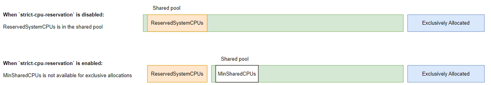

# KEP-4540: Add CPUManager policy option to restrict reservedSystemCPUs to system daemons and interrupt processing

<!-- toc -->
- [Release Signoff Checklist](#release-signoff-checklist)
- [Summary](#summary)
- [Motivation](#motivation)
  - [Goals](#goals)
  - [Non-Goals](#non-goals)
- [Proposal](#proposal)
  - [User Stories (Optional)](#user-stories-optional)
    - [Story 1](#story-1)
    - [Story 2](#story-2)
- [Design Details](#design-details)
  - [Risks and Mitigations](#risks-and-mitigations)
    - [Archived Risk Mitigation (Option 1)](#archived-risk-mitigation-option-1)
    - [Archived Risk Mitigation (Option 2)](#archived-risk-mitigation-option-2)
  - [Test Plan](#test-plan)
      - [Prerequisite testing updates](#prerequisite-testing-updates)
      - [Unit tests](#unit-tests)
      - [Integration tests](#integration-tests)
      - [e2e tests](#e2e-tests)
  - [Graduation Criteria](#graduation-criteria)
    - [Alpha](#alpha)
    - [Beta](#beta)
    - [GA](#ga)
  - [Upgrade / Downgrade Strategy](#upgrade--downgrade-strategy)
  - [Version Skew Strategy](#version-skew-strategy)
- [Production Readiness Review Questionnaire](#production-readiness-review-questionnaire)
  - [Feature Enablement and Rollback](#feature-enablement-and-rollback)
  - [Rollout, Upgrade and Rollback Planning](#rollout-upgrade-and-rollback-planning)
  - [Monitoring Requirements](#monitoring-requirements)
  - [Dependencies](#dependencies)
  - [Scalability](#scalability)
  - [Troubleshooting](#troubleshooting)
- [Implementation History](#implementation-history)
- [Drawbacks](#drawbacks)
- [Alternatives](#alternatives)
- [Infrastructure Needed (Optional)](#infrastructure-needed-optional)
<!-- /toc -->

## Release Signoff Checklist

Items marked with (R) are required *prior to targeting to a milestone / release*.

- [x] (R) Enhancement issue in release milestone, which links to KEP dir in [kubernetes/enhancements] (not the initial KEP PR)
- [x] (R) KEP approvers have approved the KEP status as `implementable`
- [x] (R) Design details are appropriately documented
- [x] (R) Test plan is in place, giving consideration to SIG Architecture and SIG Testing input (including test refactors)
  - [x] e2e Tests for all Beta API Operations (endpoints)
  - [x] (R) Ensure GA e2e tests meet requirements for [Conformance Tests](https://github.com/kubernetes/community/blob/master/contributors/devel/sig-architecture/conformance-tests.md)
  - [x] (R) Minimum Two Week Window for GA e2e tests to prove flake free
- [ ] (R) Graduation criteria is in place
  - [ ] (R) [all GA Endpoints](https://github.com/kubernetes/community/pull/1806) must be hit by [Conformance Tests](https://github.com/kubernetes/community/blob/master/contributors/devel/sig-architecture/conformance-tests.md) 
- [x] (R) Production readiness review completed
- [ ] (R) Production readiness review approved
- [x] "Implementation History" section is up-to-date for milestone
- [x] User-facing documentation has been created in [kubernetes/website], for publication to [kubernetes.io]
- [x] Supporting documentation—e.g., additional design documents, links to mailing list discussions/SIG meetings, relevant PRs/issues, release notes

[kubernetes.io]: https://kubernetes.io/
[kubernetes/enhancements]: https://git.k8s.io/enhancements
[kubernetes/kubernetes]: https://git.k8s.io/kubernetes
[kubernetes/website]: https://git.k8s.io/website

## Summary

Starting with Kubernetes 1.22, a new `CPUManager` flag has facilitated the use of `CPUManager` Policy options (#2625) which enable users to customize their behavior based on workload requirements without having to introduce an entirely new policy.
These policy options work together to ensure an optimized cpu set is allocated for workloads running on a cluster.
The policy options that already exist are `full-pcpus-only` (#2625) and `distribute-cpus-across-numa` (#2902) and `align-by-socket` (#3327) and `distribute-cpus-across-cores` (#4176).
With this KEP, a new `CPUManager` policy option `strict-cpu-reservation` is introduced which ensures that `reservedSystemCPUs` are strictly reserved for system daemons or interrupt processing and are not used by burstable and best-effort pods.

## Motivation

The static policy is used to reduce latency or improve performance. If you want to move system daemons or interrupt processing to dedicated cores, the obvious way is use the `reservedSystemCPUs` option. But in current implementation this isolation is implemented only for guaranteed pods with integer CPU requests not for burstable and best-effort pods (and guaranteed pods with fractional CPU requests).
Admission is only comparing the cpu requests against the allocatable cpus. Since the cpu limit are higher than the request, it allows burstable and best-effort pods to use up the capacity of `reservedSystemCPUs` and cause host OS services to starve in real life deployments.

### Goals
 * Align scheduler and node view for Node Allocatable (total - reserved).
 * Ensure `reservedSystemCPUs` is only used by system daemons or interrupt processing not by workloads.
 * Ensure no breaking changes for the `static` policy of `CPUManager`.

### Non-Goals
 * Change interface between node and scheduler.

## Proposal

We propose to add a new `CPUManager` policy option called `strict-cpu-reservation` to the `static` policy of `CPUManager`.
When this policy option is enabled, we remove the reserved cores from the list of all available cores at the stage of calculation DefaultCPUSet. As a result, burstable and best-effort containers are launched with a cpuset in which the reserved cores are excluded.

### User Stories (Optional)

#### Story 1
To protect latency of workload, systemd daemons including irqbalance daemon are commonly constrained to the reserved CPUs.
Burstable and best-effort pods (and guaranteed pods with fractional CPU requests) running on the reserved CPUs causes CPU throttling for infrastructure services which results in poor system response time which in turn hits back on workload response time.
This issue is particularly bad in all-in-one deployments where workloads are placed on combined master+worker+storage nodes.

#### Story 2
Silently allowing workloads running on the reserved CPUs makes benchmarking infrastructure and workloads both inaccurate.

## Design Details

In Kubelet, when `strict-cpu-reservation` is enabled as a policy option, we remove the reserved cores from the shared pool at the stage of calculation DefaultCPUSet.

Feature impact can be illustrated as following:

With the following Kubelet configuration:

```yaml
kind: KubeletConfiguration
apiVersion: kubelet.config.k8s.io/v1beta1
cpuManagerPolicy: static
cpuManagerPolicyOptions:
  strict-cpu-reservation: "true"
reservedSystemCPUs: "0,32,1,33,16,48"
...
```

When `strict-cpu-reservation` is disabled:
```console
# cat /var/lib/kubelet/cpu_manager_state
{"policyName":"static","defaultCpuSet":"0-63","checksum":1058907510}
```

When `strict-cpu-reservation` is enabled:
```console
# cat /var/lib/kubelet/cpu_manager_state
{"policyName":"static","defaultCpuSet":"2-15,17-31,34-47,49-63","checksum":4141502832}
```

### Risks and Mitigations

The feature is isolated to a specific policy option `strict-cpu-reservation` under `cpuManagerPolicyOptions`.

Concern for feature impact on best-effort workloads, the workloads that do not have resource requests, is brought up.

Kube-scheduler schedules pods on node allocatable (total - reserved). For best-effort pods, kube-scheduler uses default request values when scoring the nodes, see https://github.com/kubernetes/kubernetes/blob/master/pkg/scheduler/util/pod_resources.go#L32 and https://github.com/kubernetes/kubernetes/blob/master/pkg/scheduler/framework/plugins/noderesources/resource_allocation.go#L123, but the scheduler does not use the default request values when fitting the nodes i.e. best-effort pods are always admitted.

The concern is, when the feature graduates to `Stable`, it will be enabled by default, best-effort workloads could be starved on the node when the node runs out of CPU cores.

However, this is exactly the feature intent, best-effort workloads have no KPI requirement, they are meant to consume whatever CPU resources left on the node including starving from time to time. Best-effort workloads are not scheduled to run on the `reservedSystemCPUs` so they shall not be run on the `reservedSystemCPUs` to destablize the whole node.

Nevertheless, risk mitigation has been discussed in details (see archived options below) and we agree to start with the following node metrics of cpu pool sizes in Alpha and Beta stages to assess the actual impact in real deployment. The plan is to move the current implementation to Stable stage if no field issue is observed for one year.

https://github.com/kubernetes/kubernetes/pull/127506
- `cpu_manager_shared_pool_size_millicores`: report shared pool size, in millicores (e.g. 13500m), expected to be non-zone otherwise best-effort pods will starve
- `cpu_manager_exclusive_cpu_allocation_count`: report exclusively allocated cores, counting full cores (e.g. 16)


#### Archived Risk Mitigation (Option 1)

This option is to add `numMinSharedCPUs` in `strict-cpu-reservation` option as the minimum number of CPU cores not available for exclusive allocation and expose it to Kube-scheduler for enforcement.

In Kubelet, when `strict-cpu-reservation` is enabled as a policy option, we remove the reserved cores from the shared pool at the stage of calculation DefaultCPUSet and remove the `MinSharedCPUs` from the list of available cores for exclusive allocation.



When `strict-cpu-reservation` is disabled:
```console
Total CPU cores: 64
ReservedSystemCPUs: 6
defaultCPUSet = Reserved (6) + 58 (available for exclusive allocation)
```

When `strict-cpu-reservation` is enabled:
```console
Total CPU cores: 64
ReservedSystemCPUs: 6
MinSharedCPUs: 4
defaultCPUSet = MinSharedCPUs (4) + 54 (available for exclusive allocation)
```

Prototype PR for the option is created:
https://github.com/kubernetes/kubernetes/pull/123979/commits

Add `numMinSharedCPUs` as part of `strict-cpu-reservation` option in Kubelet configuration:

```yaml
kind: KubeletConfiguration
apiVersion: kubelet.config.k8s.io/v1beta1
featureGates:
  ...
  CPUManagerPolicyAlphaOptions: true
cpuManagerPolicy: static
cpuManagerPolicyOptions:
  strict-cpu-reservation: { "enable": "true", "numMinSharedCPUs": 4 }
reservedSystemCPUs: "0,32,1,33,16,48"
...
```

In Node API, we add `exclusive-cpu` in Node Allocatable for Kube-scheduler to consume.

```
  "status": {
    "capacity": {
      "cpu": "64",
      "exclusive-cpu": "64",
      "ephemeral-storage": "832821572Ki",
      "hugepages-1Gi": "0",
      "hugepages-2Mi": "0",
      "memory": "196146004Ki",
      "pods": "110"
    },
    "allocatable": {
      "cpu": "58",
      "exclusive-cpu": "54",
      "ephemeral-storage": "767528359485",
      "hugepages-1Gi": "0",
      "hugepages-2Mi": "0",
      "memory": "186067796Ki",
      "pods": "110"
    },
  ...
```

In kube-scheduler, `ExlusiveMilliCPU` is added in scheduler's `Resource` structure and `NodeResourcesFit` plugin is extended to filter out nodes that can not meet pod's exclusive CPU request.

A new item `ExclusiveMilliCPU` is added in the scheduler `Resource` structure:

```
// Resource is a collection of compute resource.
type Resource struct {
        MilliCPU          int64
        ExclusiveMilliCPU int64    // added
        Memory            int64
        EphemeralStorage  int64
        // We store allowedPodNumber (which is Node.Status.Allocatable.Pods().Value())
        // explicitly as int, to avoid conversions and improve performance.
        AllowedPodNumber int
        // ScalarResources
        ScalarResources map[v1.ResourceName]int64
}
```

A new node fitting failure 'Insufficient exclusive cpu' is added in the `NodeResourcesFit` plugin:

```
        if podRequest.MilliCPU > 0 && podRequest.MilliCPU > (nodeInfo.Allocatable.MilliCPU-nodeInfo.Requested.MilliCPU) {
                insufficientResources = append(insufficientResources, InsufficientResource{
                        ResourceName: v1.ResourceCPU,
                        Reason:       "Insufficient cpu",
                        Requested:    podRequest.MilliCPU,
                        Used:         nodeInfo.Requested.MilliCPU,
                        Capacity:     nodeInfo.Allocatable.MilliCPU,
                })
        }
        if nodeInfo.Allocatable.ExclusiveMilliCPU > 0 {    // added
                if podRequest.ExclusiveMilliCPU > 0 && podRequest.ExclusiveMilliCPU > (nodeInfo.Allocatable.ExclusiveMilliCPU-nodeInfo.Requested.ExclusiveMilliCPU) {
                        insufficientResources = append(insufficientResources, InsufficientResource{
                                ResourceName: v1.ResourceExclusiveCPU,
                                Reason:       "Insufficient exclusive cpu",
                                Requested:    podRequest.ExclusiveMilliCPU,
                                Used:         nodeInfo.Requested.ExclusiveMilliCPU,
                                Capacity:     nodeInfo.Allocatable.ExclusiveMilliCPU,
                        })
                }
        }
```

#### Archived Risk Mitigation (Option 2)

The problem with `MinSharedCPUs` is that it creates another complication like memory and hugpages, new resources vs overlapping resources, exclusive-cpus is a subset of cpu.

Currently the noderesources scheduler plugin does not filter out the best-effort pods in the case there's no available CPU.

Another option is to force the cpu requests for best effort pods to 1 MilliCPU in kubelet for the purpose of resource availability checks (or, equivalently, check there's at least 1 MilliCPU allocatable). This option is meant to be simpler than option-1, but it can create runaway pods similar to that in https://github.com/kubernetes/kubernetes/issues/84869.


### Test Plan

[X] I/we understand the owners of the involved components may require updates to
existing tests to make this code solid enough prior to committing the changes necessary
to implement this enhancement.

##### Prerequisite testing updates

<!--
Based on reviewers feedback describe what additional tests need to be added prior
implementing this enhancement to ensure the enhancements have also solid foundations.
-->

##### Unit tests

- `k8s.io/kubernetes/pkg/kubelet/cm/cpumanager/policy_static.go`: `03-18-2024` - `91.1`

##### Integration tests

No new integration tests for kubelet are planned.

##### e2e tests

The e2e tests are implemented in <https://github.com/kubernetes/kubernetes/blob/master/test/e2e_node/cpu_manager_test.go>, marked with Ginkgo "strict-cpu-reservation" label.

Feature functionality tests:
- running with strict CPU reservation: should let the container access all the online CPUs without a reserved CPUs set
- running with strict CPU reservation: should let the container access all the online CPUs minus the reserved CPUs set when enabled
- running with strict CPU reservation: should let the container access all the online non-exclusively-allocated CPUs minus the reserved CPUs set when enabled`

CPU Manager options compatibility tests:
- SMT Alignment and strict CPU reservation: should reject workload asking non-SMT-multiple of cpus
- SMT Alignment and strict CPU reservation: should admit workload asking SMT-multiple of cpus
- Strict CPU Reservation and Uncore Cache Alignment: should assign CPUs aligned to uncore caches with prefer-align-cpus-by-uncore-cache and avoid reserved cpus

Testgrid:
- [kubelet-serial-gce-e2e-cpu-manager](https://testgrid.k8s.io/sig-node-kubelet#kubelet-serial-gce-e2e-cpu-manager): Green
- [kubelet-gce-e2e-arm64-ubuntu-serial](https://testgrid.k8s.io/sig-node-kubelet#kubelet-gce-e2e-arm64-ubuntu-serial): Green
- [pull-e2e-serial-ec2](https://testgrid.k8s.io/sig-node-containerd#pull-e2e-serial-ec2): Green
- [node-kubelet-containerd-resource-managers](https://testgrid.k8s.io/sig-node-containerd#node-kubelet-containerd-resource-managers): Green

### Graduation Criteria

#### Alpha

- [X] Implement the new policy option.
- [X] Ensure proper unit tests are in place.

#### Beta

- [X] Gather feedback from consumers of the new policy option.
- [X] Verify no major bugs reported in the previous cycle.
- [X] Ensure proper e2e tests are in place.

#### GA

- [X] Allow time for feedback (two releases).
- [X] Make sure all risks have been addressed.

### Upgrade / Downgrade Strategy

The new policy option is opt-in and orthogonal to the existing ones.

### Version Skew Strategy

No changes needed.

## Production Readiness Review Questionnaire

### Feature Enablement and Rollback

The `/var/lib/kubelet/cpu_manager_state` needs to be removed when enabling or disabling the feature.

###### How can this feature be enabled / disabled in a live cluster?

- [X] Change the kubelet configuration to set a `CPUManager` policy of `static` and a `CPUManager` policy option of `strict-cpu-reservation`
  - Will enabling / disabling the feature require downtime of the control plane? No
  - Will enabling / disabling the feature require downtime or reprovisioning of a node?  No -- removing `/var/lib/kubelet/cpu_manager_state` and restarting kubelet are enough.


###### Does enabling the feature change any default behavior?

Yes. Reserved CPU cores will be strictly used for system daemons and interrupt processing no longer available for workloads.

The feature is only enabled when all following conditions are met:
1. The `static` `CPUManager` policy is selected
2. The `strict-cpu-reservation` policy option is selected
3. The `reservedSystemCPUs` is not empty

###### Can the feature be disabled once it has been enabled (i.e. can we roll back the enablement)?

Yes, the feature can be disabled by the following steps:
1. Remove `strict-cpu-reservation` from the list of `CPUManager` policy options
2. Remove `/var/lib/kubelet/cpu_manager_state` and restart kubelet

###### What happens if we reenable the feature if it was previously rolled back?

The feature will be enabled regardless it is enabled for the first time or not.

###### Are there any tests for feature enablement/disablement?

- A specific e2e test will demonstrate that the default behaviour is preserved when the feature is not used (2 separate tests)

### Rollout, Upgrade and Rollback Planning

<!--
This section must be completed when targeting beta to a release.
-->

###### How can a rollout or rollback fail? Can it impact already running workloads?

If the feature rollout fails, burstable and best-efforts continue to run on the reserved CPU cores.
If the feature rollback fails, burstable and best-efforts continue not to run on the reserved CPU cores.
In either case, existing workload will not be affected.

When enabling or disabling the feature, make sure `/var/lib/kubelet/cpu_manager_state` is removed before restarting kubelet otherwise kubelet restart could fail.

<!--
Try to be as paranoid as possible - e.g., what if some components will restart
mid-rollout?

Be sure to consider highly-available clusters, where, for example,
feature flags will be enabled on some API servers and not others during the
rollout. Similarly, consider large clusters and how enablement/disablement
will rollout across nodes.
-->

###### What specific metrics should inform a rollback?

<!--
What signals should users be paying attention to when the feature is young
that might indicate a serious problem?
-->

Best-effort workloads are starved for prolonged time. This indicates you are lacking hardware to use the feature, or you should review the amount of CPU cores reserved.


###### Were upgrade and rollback tested? Was the upgrade->downgrade->upgrade path tested?

<!--
Describe manual testing that was done and the outcomes.
Longer term, we may want to require automated upgrade/rollback tests, but we
are missing a bunch of machinery and tooling and can't do that now.
-->
If you have this feature enabled in v1.32 under `CPUManagerPolicyAlphaOptions` (default to false) you will continue to have the feature enabled in v1.33 under `CPUManagerPolicyBetaOptions` (default to true) automatically i.e. no extra action is needed.
To enable or disable this feature in v1.33, follow the feature activation and de-activation procedures described above.

Manual upgrade->downgrade->upgrade testing from v1.32 to v1.33 is as follows:

With the following Kubelet configuration and `cpu_manager_state` v1.32:

```yaml
kind: KubeletConfiguration
apiVersion: kubelet.config.k8s.io/v1beta1
featureGates:
  CPUManagerPolicyAlphaOptions: true
  ...
cpuManagerPolicy: static
cpuManagerPolicyOptions:
  strict-cpu-reservation: "true"
reservedSystemCPUs: "0,32,1,33,16,48"
...
```

```console
# cat /var/lib/kubelet/cpu_manager_state
{"policyName":"static","defaultCpuSet":"2-15,17-31,34-47,49-63","checksum":4141502832}
```

The same Kubelet `cpu_manager_state` will be seen after upgrading to v1.33:
```console
# cat /var/lib/kubelet/cpu_manager_state
{"policyName":"static","defaultCpuSet":"2-15,17-31,34-47,49-63","checksum":4141502832}
```

You are recommended to remove the `CPUManagerPolicyAlphaOptions` feature gate after upgrading to v1.33 for operational integrity, but it is not mandatory.

If you want to disable the feature in v1.33, you can either disable the `CPUManagerPolicyBetaOptions` feature gate, or remove the `strict-cpu-reservation` policy option. Remember to remove the `/var/lib/kubelet/cpu_manager_state` file before restarting kubelet.

The following `cpu_manager_state` will be seen after the feature is disabled:
```console
# cat /var/lib/kubelet/cpu_manager_state
{"policyName":"static","defaultCpuSet":"0-63","checksum":1058907510}
```

If you want to enable the feature in v1.33, you need to make sure the `CPUManagerPolicyBetaOptions` feature gate is not disabled and add the `strict-cpu-reservation` policy option. Remember to remove the `/var/lib/kubelet/cpu_manager_state` file before restarting kubelet.

The following `cpu_manager_state` will be seen after the feature is enabled:
```console
# cat /var/lib/kubelet/cpu_manager_state
{"policyName":"static","defaultCpuSet":"2-15,17-31,34-47,49-63","checksum":4141502832}
```

###### Is the rollout accompanied by any deprecations and/or removals of features, APIs, fields of API types, flags, etc.?

<!--
Even if applying deprecation policies, they may still surprise some users.
-->

No.

### Monitoring Requirements

###### How can an operator determine if the feature is in use by workloads?

Inspect the `defaultCpuSet` in `/var/lib/kubelet/cpu_manager_state`:
- When the feature is disabled, the reserved CPU cores are included in the `defaultCpuSet`.
- When the feature is enabled, the reserved CPU cores are not included in the `defaultCpuSet`.

###### How can someone using this feature know that it is working for their instance?

Inspect the pods' status file -- check the reserved cores are not used by them.

Below is an example:

```console
# kubectl exec cnf1-58446568f4-dr986 -n cnf1-ns -- grep Cpus_allowed /proc/self/status
Cpus_allowed:   fffefffc,fffefffc
Cpus_allowed_list:      2-15,17-31,34-47,49-63
```

###### What are the reasonable SLOs (Service Level Objectives) for the enhancement?

This feature allows users to protect infrastructure services from bursty workloads.

###### What are the SLIs (Service Level Indicators) an operator can use to determine the health of the service?

Monitor the following kubelet counters:
- `cpu_manager_shared_pool_size_millicores`: report shared pool size, in millicores (e.g. 13500m), expected to be non-zone otherwise best-effort pods will starve
- `cpu_manager_exclusive_cpu_allocation_count`: report exclusively allocated cores, counting full cores (e.g. 16)

###### Are there any missing metrics that would be useful to have to improve observability of this feature?

No.


### Dependencies

No.

###### Does this feature depend on any specific services running in the cluster?

No.

### Scalability

###### Will enabling / using this feature result in any new API calls?

No.

###### Will enabling / using this feature result in introducing new API types?

No.

###### Will enabling / using this feature result in any new calls to the cloud provider?

No.

###### Will enabling / using this feature result in increasing size or count of the existing API objects?

No.

###### Will enabling / using this feature result in increasing time taken by any operations covered by existing SLIs/SLOs?

No.

###### Will enabling / using this feature result in non-negligible increase of resource usage (CPU, RAM, disk, IO, ...) in any components?

No.

###### Can enabling / using this feature result in resource exhaustion of some node resources (PIDs, sockets, inodes, etc.)?

No.

### Troubleshooting

Increase kubelet log level and check kubelet log for errors.

Below is how to check kubelet log when it runs as a systemd service:
```console
journalctl _SYSTEMD_INVOCATION_ID=`systemctl show -p InvocationID --value kubelet.service`
```


###### How does this feature react if the API server and/or etcd is unavailable?

There is no known impact.

###### What are other known failure modes?

There is no known failure mode.

###### What steps should be taken if SLOs are not being met to determine the problem?

You can safely disable the feature.

## Implementation History

- 2024-03-08: Initial KEP created
- 2024-10-07: KEP gets LGTM and Approval
- 2025-02-03: KEP updated with Beta criteria
- 2025-09-30: KEP updated with GA criteria

## Drawbacks

## Alternatives

## Infrastructure Needed (Optional)
