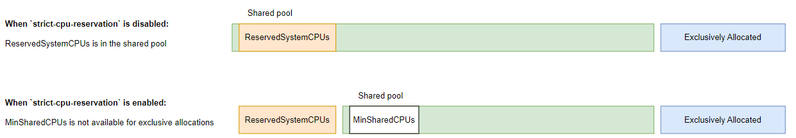

# KEP-4540: Add CPUManager policy option to restrict reservedSystemCPUs to system daemons and interrupt processing

<!-- toc -->
- [Release Signoff Checklist](#release-signoff-checklist)
- [Summary](#summary)
- [Motivation](#motivation)
  - [Goals](#goals)
  - [Non-Goals](#non-goals)
- [Proposal](#proposal)
  - [User Stories (Optional)](#user-stories-optional)
    - [Story 1](#story-1)
    - [Story 2](#story-2)
  - [Risks and Mitigations](#risks-and-mitigations)
- [Design Details](#design-details)
  - [Test Plan](#test-plan)
      - [Prerequisite testing updates](#prerequisite-testing-updates)
      - [Unit tests](#unit-tests)
      - [Integration tests](#integration-tests)
      - [e2e tests](#e2e-tests)
  - [Graduation Criteria](#graduation-criteria)
    - [Alpha](#alpha)
    - [Beta](#beta)
    - [GA](#ga)
  - [Upgrade / Downgrade Strategy](#upgrade--downgrade-strategy)
  - [Version Skew Strategy](#version-skew-strategy)
- [Production Readiness Review Questionnaire](#production-readiness-review-questionnaire)
  - [Feature Enablement and Rollback](#feature-enablement-and-rollback)
  - [Rollout, Upgrade and Rollback Planning](#rollout-upgrade-and-rollback-planning)
  - [Monitoring Requirements](#monitoring-requirements)
  - [Dependencies](#dependencies)
  - [Scalability](#scalability)
  - [Troubleshooting](#troubleshooting)
- [Implementation History](#implementation-history)
- [Drawbacks](#drawbacks)
- [Alternatives](#alternatives)
- [Infrastructure Needed (Optional)](#infrastructure-needed-optional)
<!-- /toc -->

## Release Signoff Checklist

Items marked with (R) are required *prior to targeting to a milestone / release*.

- [ ] (R) Enhancement issue in release milestone, which links to KEP dir in [kubernetes/enhancements] (not the initial KEP PR)
- [ ] (R) KEP approvers have approved the KEP status as `implementable`
- [ ] (R) Design details are appropriately documented
- [ ] (R) Test plan is in place, giving consideration to SIG Architecture and SIG Testing input (including test refactors)
  - [ ] e2e Tests for all Beta API Operations (endpoints)
  - [ ] (R) Ensure GA e2e tests meet requirements for [Conformance Tests](https://github.com/kubernetes/community/blob/master/contributors/devel/sig-architecture/conformance-tests.md) 
  - [ ] (R) Minimum Two Week Window for GA e2e tests to prove flake free
- [ ] (R) Graduation criteria is in place
  - [ ] (R) [all GA Endpoints](https://github.com/kubernetes/community/pull/1806) must be hit by [Conformance Tests](https://github.com/kubernetes/community/blob/master/contributors/devel/sig-architecture/conformance-tests.md) 
- [ ] (R) Production readiness review completed
- [ ] (R) Production readiness review approved
- [ ] "Implementation History" section is up-to-date for milestone
- [ ] User-facing documentation has been created in [kubernetes/website], for publication to [kubernetes.io]
- [ ] Supporting documentation—e.g., additional design documents, links to mailing list discussions/SIG meetings, relevant PRs/issues, release notes

[kubernetes.io]: https://kubernetes.io/
[kubernetes/enhancements]: https://git.k8s.io/enhancements
[kubernetes/kubernetes]: https://git.k8s.io/kubernetes
[kubernetes/website]: https://git.k8s.io/website

## Summary

Starting with Kubernetes 1.22, a new `CPUManager` flag has facilitated the use of `CPUManager` Policy options (#2625) which enable users to customize their behavior based on workload requirements without having to introduce an entirely new policy.
These policy options work together to ensure an optimized cpu set is allocated for workloads running on a cluster.
The three policy options that already exist are `full-pcpus-only` (#2625) and `distribute-cpus-across-numa` (#2902) and `align-by-socket` (#3327).
With this KEP, a new `CPUManager` policy option is introduced which ensures that `reservedSystemCPUs` are strictly reserved for system daemons or interrupt processing and are not used by burstable and best-effort pods.


## Motivation

The static policy is used to reduce latency or improve performance. If you want to move system daemons or interrupt processing to dedicated cores, the obvious way is use the `reservedSystemCPUs` option. But in current implementation this isolation is implemented only for guaranteed pods with integer CPU requests not for burstable and best-effort pods (and guaranteed pods with fractional CPU requests).
Admission is only comparing the cpu requests against the allocatable cpus. Since the cpu limit are higher than the request, it allows burstable and best-effort pods to use up the capacity of `reservedSystemCPUs` option and cause the OS/Systemd services to starve in real life deployments.
Solutions like Intel's Balloons Policy can be deployed to separate infrastructure and workload into different CPU pools but they require extra software, additional tuning and reduced CPU pool size could affect performance of multi-threaded processes.

### Goals
 * Allow `reservedSystemCPUs` is used by system daemons or interrupt processing only not by pods.
 * Ensure no breaking changes for the `static` policy of `CPUManager`.

### Non-Goals

## Proposal

We propose to add a new `CPUManager` policy option called `strict-cpu-reservation` to the `static` policy of `CPUManager`.
With this policy option, we remove the reserved cores from the list of all available cores at the stage of calculation DefaultCPUSet. As a result, burstable and best-effort containers are launched with a cpuset in which the reserved cores are excluded. 

### User Stories (Optional)

#### Story 1
To protect latency of guaranteed workload, systemd daemons including irqbalance daemon are commonly constrained to the reserved CPUs.
Burstable and best-effort pods (and guaranteed pods with fractional CPU requests) running on the reserved CPUs causes CPU throttling for infrastructure services which results in poor system response time which in turn hits back on workload response time e.g. hand-shaking failures between guaranteed pods.

#### Story 2
Isolating system daemons and interrupt processing is particularly critical in all-in-one deployments where workloads are placed on combined master+worker(+HCI storage) nodes.
In all-in-one deployments, system daemons include additional services like ceph storage. Burstable and best-effort pods running on the reserved CPUs can saturate those CPUs degrading infrastructure performance which in turn causes latency issues for workload.

### Risks and Mitigations

The feature is isolated to a specific policy option within the `CPUManager`, and is protected both by the option itself, as well as the `CPUManagerPolicyAlphaOptions` feature gate (which is disabled by default).

Kube-scheduler schedules pods on node allocatable which is total - reserved cores. It is at the node level, burstable and best-effort pods are allowed to run on the reserved cores. The `strict-cpu-reservation` feature removes this discrepancy.

However, kubelet has been requiring non-zero shared pool when the static policy is enabled. Kube-scheduler knows a portion of the node allocatable is not available for exclusive allocation. This not-for-exclusive portion has been conveniently the reserved cores.

To maintain backward compatibility, we introduce `numMinSharedCPUs` in KubeletConfiguration as the minimum number of CPU cores not available for exclusive allocation and expose it to Kube-scheduler.



When `strict-cpu-reservation` is disabled:
```console
Total CPU cores: 64
ReservedSystemCPUs: 6
defaultCPUSet = Reserved (6) + 58 (available for exclusive allocation)
```

When `strict-cpu-reservation` is enabled:
```console
Total CPU cores: 64
ReservedSystemCPUs: 6
MinSharedCPUs: 4
defaultCPUSet = MinSharedCPUs (4) + 54 (available for exclusive allocation)
```

## Design Details

In Kubelet, when `strict-cpu-reservation` is enabled as a policy option, we remove the reserved cores from the shared pool at the stage of calculation DefaultCPUSet and remove the `MinSharedCPUs` from the list of available cores for exclusive allocation.

Feature impact can be illustrated as following:

With the following Kubelet configuration:

```yaml
kind: KubeletConfiguration
apiVersion: kubelet.config.k8s.io/v1beta1
featureGates:
  ...
  CPUManagerPolicyOptions: true
  CPUManagerPolicyAlphaOptions: true
cpuManagerPolicy: static
cpuManagerPolicyOptions:
  strict-cpu-reservation: "true"
reservedSystemCPUs: "0,32,1,33,16,48"
numMinSharedCPUs: 4
...
```

When `strict-cpu-reservation` is disabled:
```console
# cat /var/lib/kubelet/cpu\_manager\_state
{"policyName":"static","defaultCpuSet":"0-79","checksum":1241370203}
```

When `strict-cpu-reservation` is enabled:
```console
# cat /var/lib/kubelet/cpu\_manager\_state
{"policyName":"static","defaultCpuSet":"2-3,6-15,17-31,34-35,38-47,49-63","entries":{"6dda0e2e-ac6c-4f9d-8cff-201e18aebb2f":{"busybox":"36"},"6ed17b91-0eb0-4a0c-8841-3565fd2e45dc":{"busybox":"37"},"716e4823-ca49-4be7-a429-58d6f3c29d96":{"busybox":"4"},"93ad7328-0dd5-4f9c-ac51-eb46debb16a7":{"busybox":"5"}},"checksum":2153668133}
```

In Node API, we add `exclusive-cpu` in Node Allocatable for Kube-scheduler to consume.

```
  "status": {
    "capacity": {
      "cpu": "64",
      "exclusive-cpu": "64",
      "ephemeral-storage": "832821572Ki",
      "hugepages-1Gi": "0",
      "hugepages-2Mi": "0",
      "memory": "196146004Ki",
      "pods": "110"
    },
    "allocatable": {
      "cpu": "58",
      "exclusive-cpu": "54",
      "ephemeral-storage": "767528359485",
      "hugepages-1Gi": "0",
      "hugepages-2Mi": "0",
      "memory": "186067796Ki",
      "pods": "110"
    },
  ...
```

### Test Plan

[X] I/we understand the owners of the involved components may require updates to
existing tests to make this code solid enough prior to committing the changes necessary
to implement this enhancement.

##### Prerequisite testing updates

<!--
Based on reviewers feedback describe what additional tests need to be added prior
implementing this enhancement to ensure the enhancements have also solid foundations.
-->

##### Unit tests

- `k8s.io/kubernetes/pkg/kubelet/cm/cpumanager/policy_static.go`: `03-18-2024` - `91.1`

##### Integration tests

- These cases will be added in the existing integration tests:
  - Feature gate enable/disable tests
  - `strict-cpu-reservation` policy option works as expected.
  - `strict-cpu-reservation` policy option works with existing polity options.

##### e2e tests

- These cases will be added in the existing e2e tests:
  - Feature gate enable/disable tests
  - `strict-cpu-reservation` policy option works as expected.
  - `strict-cpu-reservation` policy option works with existing polity options.

### Graduation Criteria

#### Alpha

- [X] Implement the new policy option.
- [X] Ensure proper unit tests are in place.
- [X] Ensure proper e2e node tests are in place.

#### Beta

- [X] Gather feedback from consumers of the new policy option.
- [X] Verify no major bugs reported in the previous cycle.

#### GA

- [X] Allow time for feedback (1 year).
- [X] Make sure all risks have been addressed.

### Upgrade / Downgrade Strategy

The new policy option is opt-in and orthogonal to the existing ones.

### Version Skew Strategy

No changes needed

## Production Readiness Review Questionnaire

### Feature Enablement and Rollback

The /var/lib/kubelet/cpu\_manager\_state needs be removed when changing the value of `strict-cpu-reservation`.

###### How can this feature be enabled / disabled in a live cluster?

- [X] Feature gate (also fill in values in `kep.yaml`)
  - Feature gate name: `CPUManagerPolicyAlphaOptions`
  - Components depending on the feature gate: `kubelet`
- [X] Change the kubelet configuration to set a `CPUManager` policy of `static` and a `CPUManager` policy option of `strict-cpu-reservation`
  - Will enabling / disabling the feature require downtime of the control
    plane? No
  - Will enabling / disabling the feature require downtime or reprovisioning
    of a node?
        Yes -- removing /var/lib/kubelet/cpu\_manager\_state and restarting kubelet are required.


###### Does enabling the feature change any default behavior?

Yes. Reserved CPU cores for system usage will be strictly used for system daemons and interrupt processing no longer available for workloads.

The feature is only enabled when all following conditions are met:
1. The `CPUManagerPolicyAlphaOptions` feature gate must be enabled
2. The `static` `CPUManager` policy must be selected
3. The new `strict-cpu-reservation` policy option must be selected
4. The `reservedSystemCPUs` is not empty

###### Can the feature be disabled once it has been enabled (i.e. can we roll back the enablement)?

Yes, the feature can be disabled by either:
1. Disabling the `CPUManagerPolicyAlphaOptions` feature gate
2. Switching the `CPUManager` policy to `none`
3. Removing `strict-cpu-reservation` from the list of `CPUManager` policy options

###### What happens if we reenable the feature if it was previously rolled back?

The feature will be enabled regardless it is enabled for the first time or not.

###### Are there any tests for feature enablement/disablement?

- A specific e2e test will demonstrate that the default behaviour is preserved when the feature gate is disabled, or when the feature is not used (2 separate tests)

### Rollout, Upgrade and Rollback Planning

<!--
This section must be completed when targeting beta to a release.
-->

###### How can a rollout or rollback fail? Can it impact already running workloads?

<!--
Try to be as paranoid as possible - e.g., what if some components will restart
mid-rollout?

Be sure to consider highly-available clusters, where, for example,
feature flags will be enabled on some API servers and not others during the
rollout. Similarly, consider large clusters and how enablement/disablement
will rollout across nodes.
-->

###### What specific metrics should inform a rollback?

<!--
What signals should users be paying attention to when the feature is young
that might indicate a serious problem?
-->

###### Were upgrade and rollback tested? Was the upgrade->downgrade->upgrade path tested?

<!--
Describe manual testing that was done and the outcomes.
Longer term, we may want to require automated upgrade/rollback tests, but we
are missing a bunch of machinery and tooling and can't do that now.
-->

###### Is the rollout accompanied by any deprecations and/or removals of features, APIs, fields of API types, flags, etc.?

<!--
Even if applying deprecation policies, they may still surprise some users.
-->

### Monitoring Requirements

###### How can an operator determine if the feature is in use by workloads?

Inspect the kubelet configuration -- check the presence of the feature gate and usage of the new policy option.

###### How can someone using this feature know that it is working for their instance?

Inspect the cgroup/cpuset configuration of burstable and best-effort pods -- check the reserved cores are not used by them.

Below is an example when Cgroup v1 is used:
```console
# cat /sys/fs/cgroup/cpuset/kubepods.slice/kubepods-burstable.slice/kubepods-burstable-pod50ca196f\_866c\_4070\_844a\_16d466b957ae.slice/cri-containerd-b511f2ad6e959a0a369578d335c8f0c3f01a2108c9157bce8d239a8d8d6a0d64.scope/cpuset.cpus
2-19,22-39,42-59,62-79 
```

###### What are the reasonable SLOs (Service Level Objectives) for the enhancement?

This feature to protect infrastructure services, when they are restricted to run on limited number of CPU cores, from bursty workloads.

###### What are the SLIs (Service Level Indicators) an operator can use to determine the health of the service?

Run `top -H` to observe reservedSystemCPUs are used by system daemons and interrupt processing only.

###### Are there any missing metrics that would be useful to have to improve observability of this feature?

None

### Dependencies

None

###### Does this feature depend on any specific services running in the cluster?

No

### Scalability

###### Will enabling / using this feature result in any new API calls?

No

###### Will enabling / using this feature result in introducing new API types?

No

###### Will enabling / using this feature result in any new calls to the cloud provider?

No

###### Will enabling / using this feature result in increasing size or count of the existing API objects?

No

###### Will enabling / using this feature result in increasing time taken by any operations covered by existing SLIs/SLOs?

No

###### Will enabling / using this feature result in non-negligible increase of resource usage (CPU, RAM, disk, IO, ...) in any components?

No

###### Can enabling / using this feature result in resource exhaustion of some node resources (PIDs, sockets, inodes, etc.)?

No

### Troubleshooting

Incease kubelet log level and check kubelet log for errors.

Below is how to check kubelet log when it runs as a systemd service:
```console
journalctl _SYSTEMD_INVOCATION_ID=`systemctl show -p InvocationID --value kubelet.service`
```


###### How does this feature react if the API server and/or etcd is unavailable?

There is no impact on this node local feature.

###### What are other known failure modes?

There is no known failure mode since this feature changes available CPU core for burstable and best-effort pods only.

###### What steps should be taken if SLOs are not being met to determine the problem?

You can safely disable the feature.

## Implementation History

- 2023-03-08: Initial KEP created

## Drawbacks

## Alternatives

## Infrastructure Needed (Optional)
