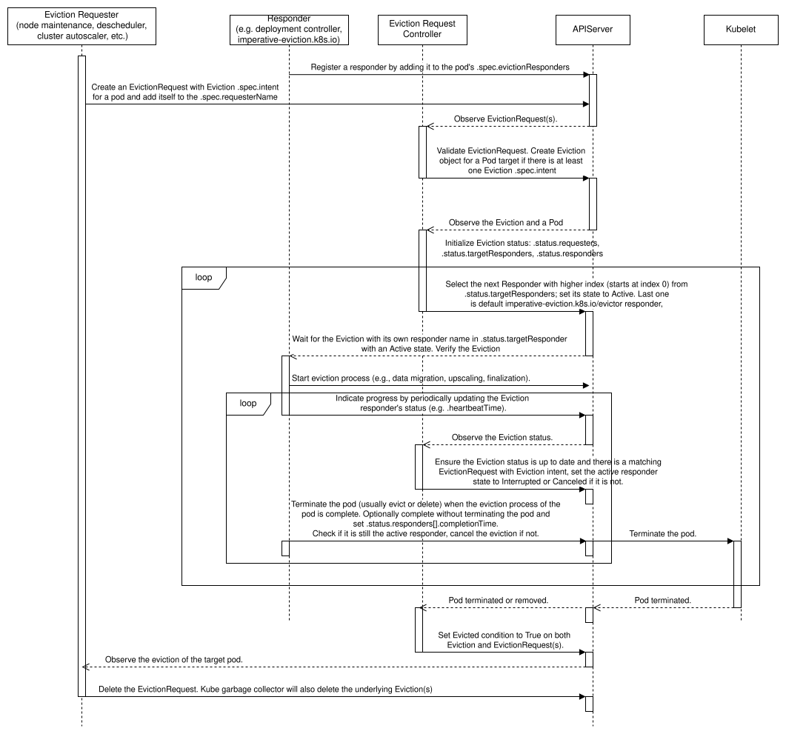

# KEP-4563: EvictionRequest API

<!-- toc -->
- [Release Signoff Checklist](#release-signoff-checklist)
- [Summary](#summary)
- [Motivation](#motivation)
  - [PodDisruptionBudget Standing Issues](#poddisruptionbudget-standing-issues)
  - [Goals](#goals)
  - [Non-Goals](#non-goals)
- [Proposal](#proposal)
  - [EvictionRequest and Eviction API](#evictionrequest-and-eviction-api)
  - [Eviction Requester](#eviction-requester)
  - [Pod and Responder](#pod-and-responder)
  - [Eviction Request Controller](#eviction-request-controller)
  - [User Stories (Optional)](#user-stories-optional)
    - [Story 1](#story-1)
    - [Story 2](#story-2)
    - [Story 3](#story-3)
    - [Story 4](#story-4)
    - [Story 5](#story-5)
    - [Story 6](#story-6)
    - [Story 7](#story-7)
  - [Notes/Constraints/Caveats (Optional)](#notesconstraintscaveats-optional)
  - [Risks and Mitigations](#risks-and-mitigations)
    - [Disruptive Eviction](#disruptive-eviction)
- [Design Details](#design-details)
  - [EvictionRequest](#evictionrequest)
  - [Eviction Requester](#eviction-requester-1)
  - [Responder](#responder)
  - [Eviction Request Controller](#eviction-request-controller-1)
    - [Validation](#validation)
    - [Registration](#registration)
    - [pod-name-prefix-hash123456abc](#pod-name-prefix-hash123456abc)
    - [pod-uid-hash123456abc](#pod-uid-hash123456abc)
    - [target-type-eviction-counter-target-name-prefix (pod-1-ngingx)](#target-type-eviction-counter-target-name-prefix-pod-1-ngingx)
    - [Cancellation and default GC](#cancellation-and-default-gc)
    - [Label Generation](#label-generation)
    - [Responder Selection](#responder-selection)
    - [Condition synchronization](#condition-synchronization)
  - [Imperative Eviction Responder Controller](#imperative-eviction-responder-controller)
    - [Eviction](#eviction)
  - [Pod and EvictionRequest API](#pod-and-evictionrequest-api)
    - [Remarks on Responders](#remarks-on-responders)
    - [EvictionRequest Validation on Admission](#evictionrequest-validation-on-admission)
      - [CREATE](#create)
    - [Immutability of EvictionRequest Fields](#immutability-of-evictionrequest-fields)
    - [Eviction Validation on Admission](#eviction-validation-on-admission)
      - [CREATE](#create-1)
      - [UPDATE](#update)
    - [Immutability of Eviction Fields](#immutability-of-eviction-fields)
  - [EvictionRequest Process](#evictionrequest-process)
    - [EvictionRequest and Eviction Completion and Deletion](#evictionrequest-and-eviction-completion-and-deletion)
  - [EvictionRequest Cancellation Examples](#evictionrequest-cancellation-examples)
    - [Multiple Dynamic Requesters and No EvictionRequest Cancellation](#multiple-dynamic-requesters-and-no-evictionrequest-cancellation)
    - [Single Dynamic Requester and EvictionRequest Cancellation](#single-dynamic-requester-and-evictionrequest-cancellation)
  - [Follow-up Design Details for Kubernetes Workloads](#follow-up-design-details-for-kubernetes-workloads)
    - [Pod Surge Example](#pod-surge-example)
  - [Future Improvements](#future-improvements)
    - [New Targets Types](#new-targets-types)
    - [New EvictionRequest Types and Synchronization of Pod Termination Mechanisms](#new-evictionrequest-types-and-synchronization-of-pod-termination-mechanisms)
    - [Workload API Support](#workload-api-support)
    - [Preemption Support](#preemption-support)
  - [Adoption](#adoption)
  - [Test Plan](#test-plan)
      - [Prerequisite testing updates](#prerequisite-testing-updates)
      - [Unit tests](#unit-tests)
      - [Integration tests](#integration-tests)
      - [e2e tests](#e2e-tests)
  - [Graduation Criteria](#graduation-criteria)
    - [Alpha](#alpha)
    - [Alpha2](#alpha2)
    - [Beta](#beta)
    - [GA](#ga)
    - [Deprecation](#deprecation)
  - [Upgrade / Downgrade Strategy](#upgrade--downgrade-strategy)
  - [Version Skew Strategy](#version-skew-strategy)
- [Production Readiness Review Questionnaire](#production-readiness-review-questionnaire)
  - [Feature Enablement and Rollback](#feature-enablement-and-rollback)
  - [Rollout, Upgrade and Rollback Planning](#rollout-upgrade-and-rollback-planning)
  - [Monitoring Requirements](#monitoring-requirements)
  - [Dependencies](#dependencies)
  - [Scalability](#scalability)
  - [Troubleshooting](#troubleshooting)
- [Implementation History](#implementation-history)
- [Drawbacks](#drawbacks)
- [Alternatives](#alternatives)
  - [Track EvictionRequests and Eviction in a single object.](#track-evictionrequests-and-eviction-in-a-single-object)
  - [EvictionRequest or Eviction subresource](#evictionrequest-or-eviction-subresource)
  - [Pod API](#pod-api)
  - [Responder list in Pod's annotations](#responder-list-in-pods-annotations)
  - [Enhancing PodDisruptionBudgets](#enhancing-poddisruptionbudgets)
  - [Cancellation of EvictionRequest](#cancellation-of-evictionrequest)
  - [The Name of the EvictionRequest Objects](#the-name-of-the-evictionrequest-objects)
    - [Pod UID](#pod-uid)
    - [Pod Name](#pod-name)
    - [Pod UID and Pod Name Prefix](#pod-uid-and-pod-name-prefix)
    - [Any Name](#any-name)
  - [Changes to the Eviction API](#changes-to-the-eviction-api)
- [Infrastructure Needed (Optional)](#infrastructure-needed-optional)
<!-- /toc -->

## Release Signoff Checklist

<!--
**ACTION REQUIRED:** In order to merge code into a release, there must be an
issue in [kubernetes/enhancements] referencing this KEP and targeting a release
milestone **before the [Enhancement Freeze](https://git.k8s.io/sig-release/releases)
of the targeted release**.

For enhancements that make changes to code or processes/procedures in core
Kubernetes—i.e., [kubernetes/kubernetes], we require the following Release
Signoff checklist to be completed.

Check these off as they are completed for the Release Team to track. These
checklist items _must_ be updated for the enhancement to be released.
-->

Items marked with (R) are required *prior to targeting to a milestone / release*.

- [x] (R) Enhancement issue in release milestone, which links to KEP dir in [kubernetes/enhancements] (not the initial KEP PR)
- [x] (R) KEP approvers have approved the KEP status as `implementable`
- [x] (R) Design details are appropriately documented
- [x] (R) Test plan is in place, giving consideration to SIG Architecture and SIG Testing input (including test refactors)
  - [ ] e2e Tests for all Beta API Operations (endpoints)
  - [ ] (R) Ensure GA e2e tests meet requirements for [Conformance Tests](https://github.com/kubernetes/community/blob/master/contributors/devel/sig-architecture/conformance-tests.md)
  - [ ] (R) Minimum Two Week Window for GA e2e tests to prove flake free
- [x] (R) Graduation criteria is in place
  - [ ] (R) [all GA Endpoints](https://github.com/kubernetes/community/pull/1806) must be hit by [Conformance Tests](https://github.com/kubernetes/community/blob/master/contributors/devel/sig-architecture/conformance-tests.md)
- [ ] (R) Production readiness review completed
- [ ] (R) Production readiness review approved
- [x] "Implementation History" section is up-to-date for milestone
- [ ] User-facing documentation has been created in [kubernetes/website], for publication to [kubernetes.io]
- [ ] Supporting documentation—e.g., additional design documents, links to mailing list discussions/SIG meetings, relevant PRs/issues, release notes

<!--
**Note:** This checklist is iterative and should be reviewed and updated every time this enhancement is being considered for a milestone.
-->

[kubernetes.io]: https://kubernetes.io/
[kubernetes/enhancements]: https://git.k8s.io/enhancements
[kubernetes/kubernetes]: https://git.k8s.io/kubernetes
[kubernetes/website]: https://git.k8s.io/website

## Summary

There are many issues with today's Eviction API and PodDisruptionBudgets that are of great concern
to cluster administrators and application owners. These issues range from insufficient data safety,
application availability, autoscaling to node draining issues.

This KEP proposes to add a new declarative EvictionRequest and Eviction API to manage the eviction
of pods. Its mission is to allow for a cooperative termination of a pod, usually in order to run
the pod on another node. If the owner of the pod does not cooperate, the eviction request will try
to resort to a pod eviction (API-initiated Eviction).

These new APIs can be used to implement additional capabilities around node draining, pod
descheduling, autoscaling, or as a general interface between applications and/or controllers. It
would provide additional safety and observability guarantees and prevent bad practices as opposed
to just using the current Eviction API endpoint and PodDisruptionBudgets.

## Motivation

Many of today's solutions rely on API-initiated eviction as the goto-safe way to remove
a pod from a node (kubectl drain, descheduler, cluster autoscaler, partially scheduler preemption).
Unfortunately, this is done in an application agnostic way and can cause many problems.

From an application owner or developer perspective, the only standard tool they have to protect
them against eviction is a PodDisruptionBudget. This is sufficient in a basic scenario with a simple
multi-replica application. The edge case applications, where this does not work are very important
to the cluster admin or controllers managing workload distribution on nodes, as they can for
example block the node drain. And, in turn, very important to the application owner, as the admin
can then override the pod disruption budget and disrupt their sensitive application anyway.

The major issues are:

1. Without extra manual effort, an application running with a single replica has to settle for
   experiencing application downtime during the node drain. They cannot use PDBs with
   `minAvailable: 1` or `maxUnavailable: 0`, or they will block node maintenance. Not every user
   needs high availability either, due to a preference for a simpler deployment model, lack of
   application support for HA, or to minimize compute costs. Also, any automated solution needs
   to edit the PDB to account for the additional pod that needs to be spun to move the workload
   from one node to another. This has been discussed in issue [kubernetes/kubernetes#66811](https://github.com/kubernetes/kubernetes/issues/66811)
   and in issue [kubernetes/kubernetes#114877](https://github.com/kubernetes/kubernetes/issues/114877).
2. Similar to the first point, it is difficult to use PDBs for applications that can have a variable
   number of pods; for example applications with a configured horizontal pod autoscaler (HPA). These
   applications cannot be disrupted during a low load when they only have one pod. However, it is
   possible to disrupt the pods during a high load without experiencing application downtime. If
   the minimum number of pods is 1, PDBs cannot be used without blocking the node drain. This has
   been discussed in issue [kubernetes/kubernetes#93476](https://github.com/kubernetes/kubernetes/issues/93476).
3. Replicaset scaling down does not take inter-pods scheduling constraints into consideration. The
   current mechanism for choosing pods to terminate takes only [creation time,
   node rank](https://github.com/kubernetes/kubernetes/blob/cae35dba5a3060711a2a3f958537003bc74a59c0/pkg/controller/replicaset/replica_set.go#L822-L832),
   and [pod-deletion-cost annotation](https://kubernetes.io/docs/concepts/workloads/controllers/replicaset/#pod-deletion-cost)
   into account. This is not sufficient, and it can dis-balance the pods across the nodes as
   described in [kubernetes/kubernetes#124306](https://github.com/kubernetes/kubernetes/issues/124306)
   and [many other issues](https://github.com/kubernetes/kubernetes/issues/124306#issuecomment-2493091257).
4. Descheduler does not allow postponing eviction for applications that are unable to be evicted
   immediately. This can result in descheduling of incorrect set of pods. This is outlined in the
   descheduler [KEP-1397](https://github.com/kubernetes-sigs/descheduler/blob/master/keps/1397-evictions-in-background/README.md)
   and [kubernetes-sigs/descheduler#1466](https://github.com/kubernetes-sigs/descheduler/pull/1466).
5. Kubernetes does not offer resource reservation during a pod migration. We would like to make sure
   that we have guaranteed resources for the workload before terminating the pod. This is discussed
   in the [kubernetes/kubernetes#129038](https://github.com/kubernetes/kubernetes/issues/129038).
6. Graceful deletion of DaemonSet pods is currently supported as part of graceful node shutdown.
   However, this process has a few drawbacks. First, the length of the shutdown is not application
   specific, it is set cluster-wide (optionally by priority) by the cluster admin. This does not
   take into account `.spec.terminationGracePeriodSeconds` of each pod and may cause premature
   termination of the application. This has been discussed in issue [kubernetes/kubernetes#75482](https://github.com/kubernetes/kubernetes/issues/75482)
   and in issue [kubernetes-sigs/cluster-api#6158](https://github.com/kubernetes-sigs/cluster-api/issues/6158).
   Additionally, the DaemonSet controller runs its own scheduling logic and creates the pods again.
   This causes a race. Such pods should be removed and not recreated, but higher priority pods that
   have not yet been terminated should be recreated if they are missing. This has been discussed in
   the issue [kubernetes/kubernetes#122912](https://github.com/kubernetes/kubernetes/issues/122912).
7. Different pod termination mechanisms are not synchronized with each other. So for example, the
   taint manager may prematurely terminate pods that are currently under Node Graceful Shutdown.
   This can also happen with other mechanism (e.g., different types of evictions). This has been
   discussed in the issue [kubernetes/kubernetes#124448](https://github.com/kubernetes/kubernetes/issues/124448)
   and in the issue [kubernetes/kubernetes#72129](https://github.com/kubernetes/kubernetes/issues/72129).

Some applications solve the disruption problem by introducing validating admission webhooks.
This has some drawbacks. The webhooks are not easily discoverable by cluster admins. And they can
block evictions for other applications if they are misconfigured or misbehave. The eviction API is
not intended to be extensible in this way. The webhook approach is therefore not recommended.

Some solutions rely on automatic PDB updates (e.g. `.spec.minAvailable`). However, this is not
atomic during scaling, as there can be a short window after scaling (e.g. HPA) when the PDB has
not yet been updated, which can allow unwanted extra evictions. Some solutions set the required
availability too high, which can unnecessarily block eviction (e.g. during node drain).

Some drainers solve the node drain by depending on the kubectl logic, or by extending/rewriting it
with additional rules and logic.

As seen in the experience reports and GitHub issues ([Declarative Node Maintenance KEP](https://github.com/kubernetes/enhancements/pull/4213)),
some admins solve their problems by simply ignoring PDBs which can cause unnecessary disruptions or
data loss. Some solve this by playing with the application deployment, but have to understand that
the application supports this.


### PodDisruptionBudget Standing Issues

For completeness here is a complete list of open PDB issues. Most are relevant to this KEP.

- [Mandatorliy specify how the application handle disruptions in the pod spec.](https://github.com/kubernetes/kubernetes/issues/124390)
- [Treat liveness probe-based restarts as voluntary disruptions gated by PodDisruptionBudgets](https://github.com/kubernetes/kubernetes/issues/123204)
- [Correct Keyword name for DisruptionsAllowed in PDB.](https://github.com/kubernetes/kubernetes/issues/121585)
- [maxSurge for node draining or how to meet availability requirements when draining nodes by adding pods](https://github.com/kubernetes/kubernetes/issues/114877)
- [Topology Aware Infrastructure Disruptions for Statefulsets](https://github.com/kubernetes/kubernetes/issues/114010)
- [Support PDBs for DS](https://github.com/kubernetes/kubernetes/issues/108124)
- [Allow scaling up to meet PDB constraints](https://github.com/kubernetes/kubernetes/issues/93476)
- [Priority-based preemption can easily violate PDBs even when unnecessary due to multiple issues with the implementation](https://github.com/kubernetes/kubernetes/issues/91492)
- [Disruption controller support configure workers' number](https://github.com/kubernetes/kubernetes/issues/82930)
- [Cannot drain node with pod with more than one Pod Disruption Budget](https://github.com/kubernetes/kubernetes/issues/75957)
- [Eviction should be able to request eviction asynchronously](https://github.com/kubernetes/kubernetes/issues/66811)
- [Reasonable defaults with eviction and PodDisruptionBudget](https://github.com/kubernetes/kubernetes/issues/35318)
- [New FailedEviction PodDisruptionCondition](https://github.com/kubernetes/kubernetes/issues/128815)
- [Distinguish PDB error separately in eviction API](https://github.com/kubernetes/kubernetes/issues/125500)
- [Confusing use of TooManyRequests error for eviction](https://github.com/kubernetes/kubernetes/issues/106286)
- [New EvictionBlocked PodDisruptionCondition](https://github.com/kubernetes/kubernetes/issues/128815)

### Goals

- Introduce new EvictionRequest and Eviction APIs (`evictionrequest.lifecycle.k8s.io`) and
  eviction request controller.
- Allow the Eviction API to be extended with a set of responders for each pod.
- Use API-initiated Eviction API of pods that support the eviction request process, only if there
  are no active non-default responders.

### Non-Goals

- Implement eviction request capabilities in Kubernetes workloads (ReplicaSet, Deployment, etc.).
- Implement eviction request capabilities for autoscaling, de/scheduling.
- Synchronizing of the eviction request status to the pod status.
- Introduce the eviction request concept for types other than pods.
- Synchronize almost all pod termination mechanisms (see #4 in the [Motivation](#motivation)
  section), so that they do not terminate pods under EvictionRequest driven node maintenance. There
  may still be places (hard OOM) where this is not possible as described in [New EvictionRequest Types and Synchronization of Pod Termination Mechanisms](#new-evictionrequest-types-and-synchronization-of-pod-termination-mechanisms).

## Proposal

We will introduce new declarative APIs called EvictionRequest and Eviction, whose purpose is to
coordinate the eviction of a pod from a node. They create a contract between the eviction requester,
the pod, and the responder (described later). The contract is enforced by the eviction request
controller, the API definition and validation.

Pods will carry a new field `.spec.evictionResponders`, which specifies a list of responders
involved in their lifecycle. This would allow multiple actors to take an action before the pod is
terminated. Only one responder may progress with the eviction at a time. The responder with the
index 0 is executed first. If there is no responder, or the last responder has finished without
terminating the pod, the imperative eviction responder controller will attempt to evict the pod
using the existing API-initiated eviction.

Multiple requesters can request the eviction of the same pod by creating EvictionRequest objects.
They can optionally withdraw their request in certain scenarios
([EvictionRequest Cancellation Examples](#evictionrequest-cancellation-examples)).

We can think of EvictionRequest and Eviction as a managed and safer alternative to eviction. For
instance, it can be used to scale up a workload before terminating the pods. See the
[Pod Surge Example](#pod-surge-example) based on the [EvictionRequest Process](#evictionrequest-process).

The following items provide further information on the evolution and adoption of this feature:
- [Follow-up Design Details for Kubernetes Workloads](#follow-up-design-details-for-kubernetes-workloads)
- [Future Improvements](#future-improvements)
- [Adoption](#adoption)

### EvictionRequest and Eviction API

`EvictionRequest` is used to request and store an eviction intent and to report the final state of
the eviction (`Evicted`, `Failed`). 

`Eviction` is used to coordinate the eviction process. Each eviction responder is given the
opportunity to progress or complete the eviction. The entire eviction process and Eviction object
lifecycle is managed by the eviction request controller. 

Alternatively, the EvictionRequest and Eviction could be combined into a single object. However,
there are major advantages to decoupling the eviction request and the eviction invocation into two
separate types.

The eviction request lifecycle differs from the eviction lifecycle. There is a many-to-many
relationship between the requests and evictions. Multiple requesters can request the eviction of the
same pod, and they can register and withdraw their eviction intent over time. 
- If there were only a single EvictionRequest type and an instance for a single pod, multiple actors
  would run into conflicts when requesting or canceling an eviction. 
- Some actors could even block an eviction by creating an EvictionRequest object with a finalizer
  and cancelling the eviction. 
- It would also be difficult to agree on who should perform garbage collection on old or canceled
  EvictionRequests.
- We would also need to introduce a one-to-one mapping to ensure that there is at most one active
  Eviction per pod. The identity and lookup raise additional concerns.

With two types, the management becomes simple: each requester creates their own EvictionRequest.
If they no longer require the eviction, they can either cancel the eviction intent or just delete
the object. Alternatively, they can also wait until the eviction completion, read the results,
and garbage collect the request when desired. There are no naming restrictions and the name can be
generated as required.

The lifecycle management of the Eviction invocation is solely handled by the eviction request
controller. This controller will translate EvictionRequests into an Eviction.
- No validation is needed on admission. The controller examines the last state of the world
  (EvictionRequests) to determine if the Eviction should be present and if it should be active or
  canceled. This can later be enhanced to offer various cancellation policies.
- We have the ability to translate a single EvictionRequest into multiple Evictions for new targets
  (e.g. PodGroup).
- No naming constraints are needed. Labels should be used to look up both EvictionRequests and
  Evictions.

Other controllers or actors are discouraged to create Eviction Objects. EvictionRequests should be
used to ensure seamless operation.
evictionrequest-controller will ensure that there is at most one active Eviction per target. It will
not start, and it will immediately cancel duplicate Evictions. This enables the responders to
observe and send updates to a single Eviction object at a time. This helps with scalability and
state duplication. Please refer to [Cancellation and default GC](#cancellation-and-default-gc)
for more details.

Responders do not need to handle the requester side; they can simply observe Evictions and interact
with them as explained below.

For additional details please see [Track EvictionRequests and Eviction in a single object.](#track-evictionrequests-and-eviction-in-a-single-object).

### Eviction Requester

The eviction requester can be any entity in the system: node maintenance controller, descheduler,
cluster autoscaler, or any application/controller interfacing with the affected application/pods. It
can also be manually invoked by a human actor if necessary.

The requester's responsibility is to communicate an intent to a pod that it should be evicted via
the EvictionRequest, according to the requester's own internal rules. It should ensure that the
intent is up to date and remove it when the eviction request is no longer necessary.

Example eviction request triggers:
- Node maintenance controller: node maintenance triggered by an admin.
- Descheduler: descheduling triggered by a descheduling rule.
- Cluster autoscaler: node downscaling triggered by a low node utilization.
- HPA: pod downscaling or rebalancing.

It is understood that multiple eviction requesters may request the eviction of the same pod at the
same time. Each requester should communicate their intent using their own instance of
EvictionRequest. They can observe the conditions to check whether the eviction has been successful
or not. They can also look up Eviction objects to gather more detailed status.

For more details see [Eviction Requester](#eviction-requester-1) section in the Design Details.

### Pod and Responder

Any pod may be the subject to an eviction request type of eviction. There can be multiple responders
for a single pod, and they should all advertise which pods they are responsible for. Normally, the
owner/controller of the pod is the main responder. In a special case, the pod can be its own
responder. The responder should decide what action to take when it observes an eviction request
intent directed at that responder:
1. It can decline the eviction request and wait for the pod to be processed by
   another responder or evicted by the imperative eviction responder controller.
2. It can do nothing and wait for the pod to be processed by another responder or evicted by the
   imperative eviction responder controller. This is discouraged because the heartbeat has to
   timeout out after 20 minutes. It is therefore better to simply decline the processing of the
   eviction request.
3. It can start the eviction logic and periodically respond to the eviction request intent to signal
   that the eviction request is in progress and not stuck. The eviction logic is at the discretion
   of the responder and can take many forms:
   - Migration of data (both persistent and ephemeral) from one node to another.
   - Waiting for a cleanup and release of important resources held by the pod.
   - Waiting for important computations to complete.
   - Non-graceful termination of the pod (`gracePeriodSeconds=0`).
   - Deletion of a pod that is covered by a blocking PodDisruptionBudget. The controller of the
     application should have additional logic to distinguish whether a disruption of a particular
     pod will disrupt the application as a whole.
   - After a partial cleanup (e.g. storage migrated, notification sent) and if the application is
     still in an available state, the API-initiated eviction can be used to respect
     PodDisruptionBudgets.

The end goal of an EvictionRequest + Eviction is for a pod to be terminated by one of the responders,
or by an API-initiated eviction triggered by the imperative eviction responder controller. Usually
this will also coincide with the deletion of the pod (evict or delete call). In some scenarios, the
pod may only be terminated (e.g. by a remote call) if the pod `restartPolicy` allows it, to preserve
the pod data for further processing or debugging.

The responder should observe Eviction cancellations. See
[EvictionRequest Cancellation Examples](#evictionrequest-cancellation-examples) for details.

We should discourage the creation of preventive EvictionRequests and Evictions, so that they do not
end up as another PDB. So we should design the API appropriately and also not allow behaviors that
do not conform to the eviction request contract.

For more details see the [Design Details](#design-details) section.

### Eviction Request Controller

In order to fully enforce the eviction request contract and prevent code duplication among eviction
requesters, we will introduce a new controller called the eviction request controller.

Its responsibility is to observe eviction requests from requesters and:
1. Transform EvictionRequests into Evictions. For example, if a single pod target is shared across
   multiple EvictionRequests, there should be one Eviction object. 
2. Periodically check that responders are making progress in evicting/terminating pods. It is
   important to see a consistent effort by the responders to reconcile the progress of the eviction
   request. This is important to prevent stuck eviction requests that could bring node maintenance
   to a halt. If the eviction request controller detects that the eviction request progress updates
   have stopped (due to a timeout), it will assign another responder. If there is no other responder
   available, it will resort to pod eviction by calling the eviction API (taking
   PodDisruptionBudgets into consideration).

It is also responsible for reconciling the `Canceled`, `Evicted`, conditions
according to the [EvictionRequest and Eviction Completion and Deletion](#evictionrequest-and-eviction-completion-and-deletion)

### User Stories (Optional)

#### Story 1

As a cluster admin I want high-level components like node maintenance (planned replacement of
kubectl drain), scheduler, descheduler to use the EvictionRequest + Eviction API to gracefully
remove pods from a set of nodes. I also want to see the progress of ongoing eviction requests and be
able to debug them if something goes wrong. This means to:
- Easily identify pods that have accepted eviction requests and are making progress. If possible to
  be able to see eviction request's ETA.
- Identify pods that are being evicted by the API-intiated eviction instead of being processed via
  custom responders, and to be able to distinguish pods that are failing eviction.
- See additional debug information from the active responder and be able to identify all the
  registered responders.

#### Story 2

As an application owner, I want to run single replica applications without disruptions and have the
ability to easily migrate the workload pods from one node to another. This is particularly useful
for applications that prefer a simpler deployment model, lack application support for HA
(e.g., virtual machines, databases), or for those looking to minimize compute costs.

The same applies to applications with larger number of replicas that prefer to surge (upscale) pods
first instead of downscaling.

#### Story 3

As an application owner, I want to have a custom logic tailored to my application for migration,
down-scaling, or removal of pods. I want to be able to easily override the default eviction request
process, including the eviction and PDBs, available to workloads. To achieve this, I also need to
be able to identify other actors (responders) and an order in which they will run.

I want to be able to set the execution priority for my responder. If it is also the main
controller, then I also want to reserve a number of priorities for my organization to orchestrate
multiple components requiring close interactions (e.g. Deployment and ReplicaSet controllers in the
k8s case).

#### Story 4

As an application owner, I want my pods to be scheduled on correct nodes. I want to use the
descheduler or the upcoming Affinity Based Eviction feature to remove pods from incorrect nodes
and then have the pods scheduled on new ones. I want to do the rescheduling gracefully and be able
to control the disruption level of my application (even 0% application unavailability).

#### Story 5

As an application owner, I run a large Deployment with pods that utilize TopologySpreadConstraints.
I want to downscale such a Deployment so that these constraints are preserved and the pods are
correctly balanced across the nodes.

#### Story 6

As a cluster admin or application owner, I know that the cost of evicting particular workload can be
quite high in terms of lost progress of stateful workloads, losing loaded memory structures and
temporary data mounted in emptyDirs. For example, ML trainings/inference or long-running
computational jobs with no application-based checkpoint would experience downtime during the node
drain.
Checkpointing could solve these issues and also contribute to a faster container startup for evicted
workloads in the serverless mode. It could also be used in alongside rescheduling to improve pod
placement (e.g. to a different rack).

Checkpoint and restore could also be used to implement seamless live migration without experiencing
any downtime or data/state loss.

To support the required functionality, I need a mechanism that would trigger checkpointing and delay
pod termination/eviction until the checkpointing orchestration has completed. Current eviction
mechanisms either call the eviction API or send a DELETE request and
`pod.spec.terminationGracePeriodSeconds` is inadequate to predict the amount of the time that
checkpointing would take.

#### Story 7

As an application owner, I want to trigger the termination of my pods with `restartPolicy=Never` by
means other than pod deletion. I want to keep the pod object present for tracking and debugging
purposes after it has reached the terminal phase (`Succeeded` or `Failed`).

### Notes/Constraints/Caveats (Optional)

### Risks and Mitigations

If there is no custom responder, and the application has insufficient availability and a blocking
PDB or blocking validating admission webhook, then the imperative eviction responder controller will
enter into an API-initiated eviction cold loop with a backoff. To help with observability we will
increment the `imperative_eviction_responder_controller_failed_evictions` metric. The mitigation
depends on the application and the consequences of disruption. This metric should help users
identify these applications.

A responder could reconcile the status properly without making any progress. It is thus
recommended to check `creationTimestamp` of the EvictionRequests and observe
`evictionrequest_controller_responder_state` metric to see how much it takes for a responder
to complete the eviction. This metric can be also used to implement additional alerts.

RBAC permissions for an EvictionRequest resource imply delete permissions for pods and eventually
PodGroups and other resources. This could result in higher privileges being assigned to users that
do not need them; allowing them to evict any supported target. Following discussions with SIG Auth,
it was concluded that this escalation of privileges should not currently pose a risk wrt the Pods
and PodGroups and that a namespace boundary for assigning RBAC privileges should be sufficient to
secure the system. If any new targets emerge in the future that require tighter control, we can
consider adding a new authorization check for these resources. 

#### Disruptive Eviction

When using kubectl drain, pods without owning controller and pods with local storage
(having `emptyDir` volumes) are not evicted by default. We have decided to evict most
of the pods (except DaemonSet and mirror pods) by default. In the motivation section of the
[Declarative Node Maintenance KEP](https://github.com/kubernetes/enhancements/pull/4213),
we can see many administrators override these default settings and many components evict all pods
indiscriminately. There are also many ways that users use to prevent the eviction;
PodDisruptionBudgets, validating admission webhooks, or just plain HA. Users who want to protect
their applications in today's clusters should already be aware that they should be able to handle
sudden evictions. Therefore, it should be okay for the imperative eviction responder controller to
evict these pods.

To mitigate the sudden eviction problem, users should use PodDisruptionBudgets or HA.

## Design Details

### EvictionRequest

We will introduce `evictionrequest.lifecycle.k8s.io` and `eviction.lifecycle.k8s.io` types to
enforce the contract between the eviction requesters and the responders. This type is a bit similar
to `leases.coordination.k8s.io` in that it requires multiple actors to synchronize the state. Which
in our case is the progress of the eviction. The coordination group is not being reused for these
new types, because it should only contain coordination primitives for generic apiservers. And even
though PDBs are in the policy group, evictions are ephemeral and do not adhere properly to being a
policy. Therefore, we will introduce a new lifecycle group.

### Eviction Requester
[Eviction Requester](#eviction-requester) section provides a general overview.

There can be many eviction requesters, each of whome manages their own EvictionRequest object.

When a requester decides that a pod needs to be evicted, it should create an EvictionRequest:
- `.spec.target.pod` should be set to fully identify the pod. The name and the UID should be
  specified to ensure that we do not evict a pod with the same name that appears immediately
  after the previous pod is removed.
- `.spec.requesterName` should be set to a domain-prefixed path to fully identify the requester
- `.spec.intent` should be set to `Eviction`.

In return, the eviction request controller will create an Eviction object with the same target and
add `.spec.requesterName` to its labels. The requester can then observe this object (e.g. via
`labelSelector`) to track the progress of the responders.

If the eviction is no longer needed, the requester should set `.spec.intent` to `Withdrawn`. If all
requesters' intents are withdrawn in all EvictionRequests, the eviction will be canceled and the
eviction request controller will set a `Canceled` condition to `.status.conditions`. See also
[EvictionRequest Cancellation Examples](#evictionrequest-cancellation-examples).

The requester can observe the `Canceled` and `Evicted` conditions ([EvictionRequest and Eviction Completion and Deletion](#evictionrequest-and-eviction-completion-and-deletion))
to decide whether the EvictionRequest should be deleted/garbage collected.
 
### Responder

[Pod and Responder](#pod-and-responder) section provides a general overview.

There can be multiple responders for a single pod, which can be given control of the eviction
process by the eviction request controller.

Responders can range from partial, which perform limited cleanup without terminating the pod, to
controllers and higher-level controllers, which can terminate the pod gracefully. Generic fallback
responders can be used if all other concrete ones fail or are unavailable.

First, the responder should register itself with all the pods it is interested in
evicting/processing (either partially or fully) by adding itself to the
`.spec.evictionResponders` field of the pod. This list is then added to the
[Eviction](#pod-and-evictionrequest-api) after creation by the eviction request controller.

Responders registered in pod's `.spec.evictionResponders` are executed sequentially, starting with
the lowest index ([Responder Selection](#responder-selection)). Each responder should assess its
role and priority, and either preempt other responders or run at a later time.

The Responder type should set the `name` field. For more
details see [Pod and EvictionRequest API](#pod-and-evictionrequest-api) and
[Remarks on Responders](#remarks-on-responders).

Example pod with responders:

```yaml
apiVersion: v1
kind: Pod
metadata:
  labels:
    app: nginx
  name: sensitive-app
  namespace: blueberry
  spec:
    ...
    evictionResponders:
      - name: horizontalpodautoscaler.autoscaling.k8s.io
      - name: sensitive-workload-operator.fruit-company.com
      - name: deployment.apps.k8s.io
      - name: replicaset.apps.k8s.io
      - name: fallback-responder.rescue-company.com
```

The responder should observe the Eviction objects that match the pods that the responder manages
(e.g. through labels and labelSelector). It should observe the TargetResponder struct in the
`.status.targetResponders` in the Eviction object that matches the `name` it previously set in the
pod's `.spec.evictionResponders`. It should then react to the `.status.targetResponders[].state`
field, and adjust the eviction process and the responder lifecycle accordingly.

If the responder is not interested in evicting the pod anymore, it should set
`.status.responders[].completionTime`. If the
responder is unable to respond to the eviction request for 20
minutes, the control of the eviction process will be passed to the next responders at the higher
list index. This includes the default ones, such as `imperative-eviction.k8s.io/evictor`. If
there is no responder available, the Eviction and EvictionRequest will be canceled with the
`CanceledDueToNoRequesters` reason.

If the responder is interested in processing the eviction of the pod it should ensure to update the
Eviction status periodically at intervals of less than 20 minutes. Therefore, updating the
status every 3 minutes may be sufficient to allow for potential disruption of the responder. The
status updates should look as follows:
- Verify that the `.spec.target` is the desired target (e.g., there is a correct pod in the
  `.spec.target.pod`)
- Observe the `.status.targetResponders[].state` field and act accordingly:
  - `Inactive`: no action.
  - `Active`: it should start or continue with the eviction process.
  - `Canceled`: it should fully stop the eviction process work if possible, or aid in reconciling to
    the healthy state as soon as possible. It should output an error (e.g. via an event or a
    condition).
  - `Interrupted`: set by the eviction request controller if the responder failed to start or update
    the progress in `.status.responders`. If the responder wakes up, it should stop all the work.
    There might be a different responder processing an eviction or recovering from the interrupted
    responder, so the interrupted responder should not take any action in a standard scenario.
  - `Completed`: this is done in a response of detecting a successful eviction ( completionTime or
    the target is gone). The active responder is expected to have completed, or about to complete
    shortly.
- Set `.status.responders[].heartbeatTime` to the present time to signal that the eviction is not
  stuck. 
- Update `.status.responders[].ExpectedCompletionTime` if a reasonable estimation can be
  made of how long the eviction process will take for the current responder. This can be modified
  later to change the estimate.
- Set `.status.responders[].completionTime` to indicate whether the eviction process has completed
  or not.
- Set `.status.message` to inform about the progress of the eviction in human-readable form.
- Optionally, `.status.conditions` can be set for additional details about the eviction.
- Optionally, an event can be emitted to inform about the start/progress of the eviction. Or lack
  thereof, if the eviction request is blocked. The responder should ensure that an appropriate
  number of events is emitted. `event.involvedObject` should be set to the current Eviction.

Responders should be aware that the Eviction object can be deleted at any time. See
  [EvictionRequest Cancellation Examples](#evictionrequest-cancellation-examples) for details.

The completion of the Eviction and EvictionRequest is communicated by pod termination (usually by an
evict or delete call) and reaching the terminal phase (`Succeeded` or `Failed`). It can also
withdraw from the eviction process by setting `.status.responders[].completionTime`.

The responder should prefer the eviction API endpoint call for the pod deletion/termination to
respect the PDBs, unless the eviction process is incompatible with the PDBs and the application has
already been disrupted (either by the responder or by external forces). Or the responder has a
better insight into the application availability than the PDB. In these cases, it is possible to
skip the eviction call and use the delete call directly.

Also, the responder should not block the eviction by updating
the `.status.responders[].heartbeatTime` when no work is being done on the eviction. This should
be decided solely by the user deploying the application and resolved by creating a PDB.

### Eviction Request Controller

[Eviction Request Controller](#eviction-request-controller) section provides a general overview.

#### Validation

The controller will perform validation to ensure this is a valid eviction request.

The target will be obtained from a lister and if it doesn't exist, the controller will cancel the
eviction request by setting a `Failed` condition to `.status.conditions` with an appropriate
reason (`EvictionInvalid`) and a message (`Target Pod xyz was not found.`).

The new Workload API groups a set of pods that may not handle individual pod evictions well. It may
be preferable to target the Workload resource. In the alpha version of the EvictionRequest API,
pods referencing PodGroups will be ignored. Therefore, we will reject any EvictionRequest that
references a pod that has `.spec.schedulingGroup`. We will consider [Workload API Support](#workload-api-support)
later. The rejection will be done again by setting a `Failed` condition with an appropriate
reason (`EvictionInvalid`) and a message
(`Target Pod xyz is part of a Workload/PodGroup. Eviction of such pods is currently not supported.`). 

If the validation fails, the eviction request will no longer be processed.

#### Registration

The controller will watch all EvictionRequests and transform the active and valid ones into Evictions.
- An active Eviction is an EvictionRequest with `Eviction` value in the `.spec.intent`.
- The validation phase happens first and can block Eviction creation. The advantage of this is that
  it limits the Eviction traffic to responders.
- The creation of Evictions by other users than the evictionrequest-controller is discouraged. If an
  Eviction appears from another user that complies with the controller requirements, it will be
  adopted, otherwise it is garbage collected, as described in [Cancellation and default GC](#cancellation-and-default-gc).

If a single pod target is shared across multiple EvictionRequests, this should result in a single
Eviction object.

There are multiple options for naming the Evictions, but we must be careful as new targets could be
added later.

#### pod-name-prefix-hash123456abc

- Pod name prefix might be too long.
- Pod name prefix might be shared with a different target so it might be confusing.

#### pod-uid-hash123456abc
- New id per eviction invocation.
- Not user-friendly.

#### target-type-eviction-counter-target-name-prefix (pod-1-ngingx)
- User-friendly.

The counter (1) would only be used for conflict resolution of eviction chain detection. If
pod-1-nginx fails to evict pod-2-nginx is created. If pod-2-nginx is evicted, but a new pod nginx is
immediately created with a different UID, pod-3-nginx can be created. This has the advantage that
controllers that still work with the old evict instance can finish their in-flight work and then
start processing the newer instance (e.g. pod-3-nginx). The UID can also change, so the responders
may have to start the eviction process from scratch. If there is a long pause, we can start the
eviction chain again and drop back to pod-1-nginx.

#### Cancellation and default GC

The controller will cancel an Eviction if all EvictionRequests matching the target have been
canceled (`Withdrawn` value in `.spec.intent`) or ceased to exist. Cancellation is done by setting
a `Failed` condition with the `CanceledDueToNoRequesters` reason to the Eviction and all
EvictionRequests. This applies also to Evictions that have not been created by the
evictionrequest-controller and implicit creation of such Evictions is discouraged

The controller will also add EvictionRequest ownerReferences to an Eviction.
Once all EvictionRequests matching the target have been deleted, the Eviction object should be
garbage collected. This applies also to Evictions that have not been created by the
evictionrequest-controller and implicit creation of such Evictions is discouraged

An EvictionRequest with an Eviction intent and a blocking finalizer is also considered canceled or
`Withdrawn`.

#### Label Generation

EvictionRequest's `.spec.requesterName` should be set to the Eviction labels as a key. It should do
the same for all responder names. The value should be either `"requester"`, `"responder"`, or
`"requesterresponder"` depending on whether the same name/identifier is shared with any responder.

This will make watching these resources easier for all the parties as they can use a predictable
labelSelector.

#### Responder Selection

Eviction `.status.targetResponders` will be set from pod/target's `.spec.evictionResponders` in the
same order. A set of default responders (`imperative-eviction.k8s.io/evictor`) will also be appended
to the end of the list. Once set, items cannot be added to or removed from `.status.targetResponders`.

The controller should set `.status.observedGeneration` each time it observes a new generation of the
Eviction object.

The eviction request controller reconciles Evictions and first picks the index 0 responder
from `.status.targetResponders` and setting its `state` to `Active`.
`.status.responders[].startTime` should also be set to establish a baseline for any non-cooperating
responder.

If active responder's `.status.responders[].completionTime` is set, or 20 minutes have elapsed
since `.status.responders[].heartbeatTime`, then the eviction request controller sets
`.status.targetResponders[].state` to `Completed` or `Interrupted` respectively. The next responder
at the higher list index from `.status.targetResponders[]` is then selected and its `state` is set
to `Active`.

If there is no EvictionRequest with the same target and Eviction intent in `.spec.intent`, the
eviction is canceled and an `Active` states transition to `Canceled` states in
`.status.targetResponders[].state`. 

#### Condition synchronization

If an Eviction object exists, Failed and Evicted conditions will be periodically copied into all
EvictionRequests so that the requesters can observe the final result of the underlying Eviction.
These two conditions can be resolved early without the Eviction as well, if the initial validation
fails.

Eviction conditions are final when they transition to `True`. EvictionRequest conditions are not
final, and they can be reset (e.g. `False` -> `True` -> `False`) over time. This is because, there
can be multiple Evictions during the EvictionRequest object's lifetime.

### Imperative Eviction Responder Controller

#### Eviction

The imperative eviction responder controller will implement an `imperative-eviction.k8s.io/evictor`
responder. This responder observes Evictions and evict pods that are unable to be terminated
by calling the eviction API endpoint.

If a pod cannot be terminated and all the Eviction's custom responders in the
`.status.targetResponders` have been processed, then the `state` of
`imperative-eviction.k8s.io/evictor` is set to `Active`. The controller should now start processing
the eviction request.

API-initiated eviction of DaemonSet pods and mirror pods is not supported. However, the
Eviction can still be used to terminate them by other means.

No attempt will be made to evict pods that are currently terminating.

If the pod eviction fails, e.g. due to a blocking PodDisruptionBudget, the
`imperative_eviction_responder_controller_failed_evictions` metric is incremented, 
`.status.responders[].message` is updated to reflect the new count, and the pod is
added back to the queue with exponential backoff (maximum approx. 15 minutes).

Example message: `Could not evict a pod due to failing eviction requests, number of retries: 7`.

### Pod and EvictionRequest API

```golang

type PodSpec struct {
    ...
    // evictionResponders reference responders that react to Evictions based on EvictionRequests.
    // Responders should observe and communicate through the Eviction Resource API to help with
    // the graceful termination of a pod. The responders are selected sequentially, in the order
    // in which they appear in the list.
    //
    // Responders should periodically report on an eviction progress by updating the
    // .status.responders[].heartbeatTime field of the Eviction object. If this field is
    // not updated within 20 minutes, the eviction request is passed over to the next responder at
    // a higher index. If there is no other responder, the last default
    // imperative-eviction.k8s.io/evictor responder will evict the pod using the imperative
    // Eviction API (/evict endpoint).
    //
    // The maximum length of the responders list is 16.
    // Responders are not supported when the pod is part of a PodGroup (.spec.schedulingGroup is set).
    // This field can only be set on creation and is immutable afterwards.
    // +featureGate=EvictionRequestAPI
    // +optional
    // +patchMergeKey=name
    // +patchStrategy=merge
    // +listType=map
    // +listMapKey=name
    EvictionResponders []EvictionResponder `json:"evictionResponders,omitempty" patchStrategy:"merge" patchMergeKey:"name" protobuf:"bytes,44,rep,name=evictionResponders"`
}

// EvictionRequest defines a request that should ideally result in a graceful eviction of a
// .spec.target (e.g. termination of a pod).
//
// The evictionrequest-controller observes intents of all EvictionRequests and transforms them into
// Evictions.
//   - .spec.requesterName is set as a label on the Eviction for easier lookup.
//   - Each target can have a set of responders assigned to it. Eviction objects are observed by
//     these responders, who implement the eviction logic and update the Eviction's status with
//     progress.
//
// There is many-to-many relationship between EvictionRequests and Evictions.
//
// If all requesters withdraw their eviction intent for a common target, the eviction will be
// canceled. Deleting an EvictionRequest also counts as a withdrawal.
// Once all EvictionRequest of a target are removed, the corresponding Evictions are eventually
// garbage collected.
//
// +k8s:validation-gen-nolint // Note: remove this when the API got GA
type EvictionRequest struct {
    metav1.TypeMeta `json:",inline"`

    // metadata is the standard object metadata; More info: https://git.k8s.io/community/contributors/devel/sig-architecture/api-conventions.md#metadata.
    // +optional
    metav1.ObjectMeta `json:"metadata,omitempty" protobuf:"bytes,1,opt,name=metadata"`

    // spec defines the eviction request specification.
    // https://git.k8s.io/community/contributors/devel/sig-architecture/api-conventions.md#spec-and-status
    // +required
    Spec EvictionRequestSpec `json:"spec" protobuf:"bytes,2,opt,name=spec"`

    // status represents the most recently observed status of the eviction request.
    // More info: https://git.k8s.io/community/contributors/devel/sig-architecture/api-conventions.md#spec-and-status
    // +optional
    Status EvictionRequestStatus `json:"status,omitempty" protobuf:"bytes,3,opt,name=status"`
}

// EvictionRequestSpec is a specification of an EvictionRequest.
type EvictionRequestSpec struct {
    // target contains a reference to an object (e.g. a pod) that should be evicted.
    // This field is required and immutable.
    // +required
    // +k8s:immutable
    // NOTE: the EvictionTarget type will be duplicated into EvictionRequestTarget in the actual implementation
    Target EvictionTarget `json:"target" protobuf:"bytes,1,opt,name=target"`

    // requesterName allows you to identify the entity, that requested the eviction of the target.
    //
    // It must be a valid domain-prefixed path (such as "acme.io/foo").
    // Domain names *.k8s.io and *.kubernetes.io are reserved.
    // This field is required and immutable.
    // +required
    // +k8s:required
	// +k8s:immutable
    RequesterName string `json:"requesterName" protobuf:"bytes,2,opt,name=requesterName"`

    // intent specifies the action that should be taken for the specified target.
    //
    // - Eviction means that the requester is interested in the eviction of the target.
    // - Withdrawn means that the requester is no longer interested in the eviction of the target.
    //   If all requesters' intents are withdrawn for a common target, the eviction will be canceled.
    //   Cancellation consequences:
    //   - Inactive responders will never run.
    //   - Active responders are expected to cancel the eviction.
    //   - Completed or Interrupted responders should not take any action.
    // +required
    // +k8s:required
    // NOTE: the RequesterIntent type will be duplicated into EvictionRequestIntent in the actual implementation
    Intent RequesterIntent `json:"intent" protobuf:"bytes,3,opt,name=intent,casttype=EvictionRequestIntent"`
}

// EvictionRequestStatus represents the last observed status of the eviction request.
type EvictionRequestStatus struct {
    // conditions contain information about the eviction request.
    //
    // EvictionRequest specific conditions are: Evicted or Failed (managed by evictionrequest-controller).
    // - Failed means that the eviction request is no longer being processed
    //   by any eviction responder. This can happen if the request is canceled or if no responder
    //   managed to evict the target (e.g. terminate or delete a pod).
    // - Evicted means that the target has been evicted (e.g. a pod has been terminated or deleted).
    //
    // These conditions can be reset if the eviction was unsuccessful and a new Eviction intent has
    // been submitted.
    //
    // The maximum length of the conditions list is 100.
    // +optional
    // +patchMergeKey=type
    // +patchStrategy=merge
    // +listType=map
    // +listMapKey=type
    // +k8s:optional
    // +k8s:listType=map
    // +k8s:listMapKey=type
    // +k8s:maxItems=100
    Conditions []metav1.Condition `json:"conditions,omitempty" patchStrategy:"merge" patchMergeKey:"type" protobuf:"bytes,1,rep,name=conditions"`

    // observedGeneration is EvictionRequest's .metadata.generation observed by the evictionrequest-controller.
    // The observed generation value cannot be negative and can only be incremented.
    // The minimum value is 1.
    // This field is managed by evictionrequest-controller.
    // +optional
    // +k8s:optional
    // +k8s:minimum=1
    ObservedGeneration *int64 `json:"observedGeneration,omitempty" protobuf:"varint,2,opt,name=observedGeneration"`
}

// Eviction initiates an eviction process, which should ideally result in a graceful eviction of a
// .spec.target (e.g. termination of a pod).
//
// The evictionrequest-controller observes intents of all EvictionRequests and transforms them into
// Evictions. It manages the Eviction lifecycle.
// Requesters are preserved in .status.requesters even after they have withdrawn their request.
// If all requesters withdraw their eviction intent for a common target, the eviction will be
// canceled. Once all EvictionRequest corresponding to this Eviction .spec.target have been
// removed, this Eviction object will eventually be garbage collected.
//
// If the target is a pod, the .status.targetResponders is populated from Pod's
// .spec.evictionResponders.
//
// Responders should observe and communicate through the .status to help with the eviction
// of the target when they see their state == Active in .status.targetResponders. ResponderStatus
// struct should then be periodically updated to indicate the progress or completion of the eviction
// process by each responder in .status.responders. If .status.responders[].heartbeatTime is
// not updated within 20 minutes, the eviction request is passed over to the next responder.
//
// If there are no other responders and the target is a pod, the last default
// imperative-eviction.k8s.io/evictor responder will evict the pod using the imperative Eviction API
// (/evict endpoint).
// +k8s:validation-gen-nolint // Note: remove this when the API got GA
type Eviction struct {
    metav1.TypeMeta `json:",inline"`

    // metadata is the standard object metadata; More info: https://git.k8s.io/community/contributors/devel/sig-architecture/api-conventions.md#metadata.
    // .metadaata.name set by the evictionrequest-controller is purely informative and subject to change.
    // .spec.target field should be used to identify the target precisesly.
    //
    // The requester and responder names will be used as label keys and added to the labels of the
    // eviction in one of the following formats:
    // 1. acme.io/foo: "requester"
    // 2. acme.io/foo: "responder"
    // 3. acme.io/foo: "requesterresponder"
    // +optional
    metav1.ObjectMeta `json:"metadata,omitempty" protobuf:"bytes,1,opt,name=metadata"`

    // spec defines the eviction specification.
    // https://git.k8s.io/community/contributors/devel/sig-architecture/api-conventions.md#spec-and-status
    // +required
    Spec EvictionSpec `json:"spec" protobuf:"bytes,2,opt,name=spec"`

    // status represents the most recently observed status of the eviction.
    // Populated by responders and evictionrequest-controller.
    // More info: https://git.k8s.io/community/contributors/devel/sig-architecture/api-conventions.md#spec-and-status
    // +optional
    Status EvictionStatus `json:"status,omitempty" protobuf:"bytes,3,opt,name=status"`
}

// EvictionSpec is a specification of an Eviction.
type EvictionSpec struct {
    // target contains a reference to an object (e.g. a pod) that should be evicted.
    // This field is required and immutable.
    // +required
    // +k8s:immutable
    Target EvictionTarget `json:"target" protobuf:"bytes,1,opt,name=target"`
}

// EvictionTarget contains a reference to an object that should be evicted.
// +union
type EvictionTarget struct {
    // pod references a pod that is subject to eviction/termination.
    // Pods that are part of a PodGroup (.spec.schedulingGroup is set) are not supported.
    // +optional
    // +k8s:optional
    // +k8s:unionMember
    Pod *EvictionPodReference `json:"pod,omitempty" protobuf:"bytes,1,opt,name=pod"`
}

// EvictionPodReference contains enough information to locate the referenced pod inside the same
// namespace.
type EvictionPodReference struct {
    // name of the target.
    // This field is required.
    // +required
    // +k8s:required
    // +k8s:format=k8s-long-name
    Name string `json:"name" protobuf:"bytes,1,opt,name=name"`
    // uid of the target.
    // It can be found in .spec.metadata.uid of the target and is a lowercase UUID in 8-4-4-4-12 format.
    // This field is required.
    // +required
    // +k8s:required
    // +k8s:format=k8s-uuid
    UID apimachinerytypes.UID `json:"uid" protobuf:"bytes,2,opt,name=uid,casttype=k8s.io/kubernetes/pkg/types.UID"`
}

// EvictionStatus represents the last observed status of the eviction request.
type EvictionStatus struct {
    // conditions contain information about the eviction request.
    //
    // Eviction request specific conditions are: Evicted or Failed (managed by evictionrequest-controller).
    // - Failed means that the eviction request is no longer being processed
    //   by any eviction responder. This can happen if the request is canceled or if no responder
    //   managed to evict the target (e.g. terminate or delete a pod).
    // - Evicted means that the target has been evicted (e.g. a pod has been terminated or deleted).
    //
    // 	The maximum length of the conditions list is 100.
    // +optional
    // +patchMergeKey=type
    // +patchStrategy=merge
    // +listType=map
    // +listMapKey=type
    // +k8s:optional
    // +k8s:listType=map
    // +k8s:listMapKey=type
    // +k8s:maxItems=100
    Conditions []metav1.Condition `json:"conditions,omitempty" patchStrategy:"merge" patchMergeKey:"type" protobuf:"bytes,1,rep,name=conditions"`

    // observedGeneration is Eviction's .metadata.generation observed by the evictionrequest-controller.
    // The observed generation value cannot be negative and can only be incremented.
    // The minimum value is 1.
    // This field is managed by evictionrequest-controller.
    // +optional
    // +k8s:optional
    // +k8s:minimum=1
    ObservedGeneration *int64 `json:"observedGeneration,omitempty" protobuf:"varint,2,opt,name=observedGeneration"`

    // requesters allow you to identify the entities, that requested the eviction of the target.
    // If all the requesters withdraw their eviction intent, the eviction will be canceled.
    //
    // Once added, items cannot be removed.
    // +optional
    // +patchMergeKey=name
    // +patchStrategy=merge
    // +listType=map
    // +listMapKey=name
    // +k8s:optional
    // +k8s:listType=map
    // +k8s:listMapKey=name
    Requesters []Requester `json:"requesters,omitempty" patchStrategy:"merge" patchMergeKey:"name" protobuf:"bytes,3,rep,name=requesters"`

    // targetResponders reference responders that should eventually respond to this eviction
    // request to help with the graceful eviction of a target. These responders are selected
    // sequentially, in the order in which they appear in the list by setting the Active state to
    // the TargetResponder .state field. The maximum number of active responders allowed is 1.
    // Eventually each responder can end up in an Interrupted, Canceled or, Complete state.
    // Responders should observe these states in order to navigate their lifecycle.
    //
    // If the target is a pod, the field is populated from Pod's .spec.evictionResponders. Default
    // responders may be added to the list according to the target.
    //
    // Default responders:
    // - imperative-eviction.k8s.io/evictor responder is appended to the end of the list if the
    //   target is a pod. It will call the /evict API endpoint. This call may not succeed due to
    //   PodDisruptionBudgets, which may block the pod termination. It will update the responder
    //   message and try again with a backoff.
    //
    // The maximum length of the responders list is 17.
    // The length and keys of the list cannot change once set.
    // This field is managed by evictionrequest-controller.
    // +optional
    // +patchMergeKey=name
    // +patchStrategy=merge
    // +listType=map
    // +listMapKey=name
    // +k8s:optional
    // +k8s:listType=map
    // +k8s:listMapKey=name
    // +k8s:maxItems=17
    TargetResponders []TargetResponder `json:"targetResponders,omitempty" patchStrategy:"merge" patchMergeKey:"name" protobuf:"bytes,4,rep,name=targetResponders"`

    // responders represents the eviction process status of each declared responder.
    //
    // The responder list should be the same length and have the same .name fields as
    // .status.targetResponders. Only responders with .name that have Active state in
    // .targetResponders[].state should be updated and can be mutated. First initialization
    // of the list is allowed.
    //
    // Each ResponderStatus is initialized by evictionrequest-controller and then managed by
    // the designated responder.
    // +optional
    // +patchMergeKey=name
    // +patchStrategy=merge
    // +listType=map
    // +listMapKey=name
    // +k8s:optional
    // +k8s:listType=map
    // +k8s:listMapKey=name
    // +k8s:maxItems=17
    Responders []ResponderStatus `json:"responders,omitempty" patchStrategy:"merge" patchMergeKey:"name" protobuf:"bytes,5,rep,name=responders"`
}

type EvictionConditionType string

// These are built-in conditions of an eviction request.
const (
    // EvictionConditionFailed means that the eviction request is no longer being processed
    // by any eviction responder. This can happen if the request is canceled or if no responder
    // managed to evict the target (e.g. terminate or delete a pod).
    EvictionConditionFailed EvictionConditionType = "Failed"

    // EvictionConditionEvicted means that the target has been evicted (e.g. a pod has been
    // terminated or deleted).
    EvictionConditionEvicted EvictionConditionType = "Evicted"
)

type EvictionConditionReason string

// These are built-in condition reasons of an eviction request.
const (
    // EvictionConditionReasonAwaitingEviction means that this Eviction works as expected and the target
    // is scheduled for an eviction.
    // This reason is set for the Failed and Evicted condition.
    EvictionConditionReasonAwaitingEviction EvictionConditionReason = "AwaitingEviction"
    // EvictionConditionReasonEvictionInvalid means that the Eviction is not accepted because the
    // initial configuration is not valid.
    // This reason is set for the Failed condition.
    EvictionConditionReasonEvictionInvalid EvictionConditionReason = "EvictionInvalid"
	// EvictionConditionReasonCanceledDueToNoRequesters means that the Eviction is canceled because there is no
	// EvictionRequest with the same target and Eviction intent in .spec.intent.
    // This reason is set for the Failed condition.
    EvictionConditionReasonCanceledDueToNoRequesters EvictionConditionReason = "CanceledDueToNoRequesters"
    // EvictionConditionReasonSucceeded means that the Eviction has successfully evicted the target.
    // This reason is set for the Failed condition.
    EvictionConditionReasonSucceeded EvictionConditionReason = "Succeeded"
    // EvictionConditionReasonNoFurtherResponder means that the Eviction responders failed to evict
    // the target and that no further responder is available.
    // This reason is set for the Failed condition.
    EvictionConditionReasonNoFurtherResponder EvictionConditionReason = "NoFurtherResponder"
    // EvictionConditionReasonPodDeleted means that the target pod has been deleted.
    // This reason is set for the Evicted condition.
    EvictionConditionReasonPodDeleted EvictionConditionReason = "PodDeleted"
    // EvictionConditionReasonPodTerminal means that the target pod has reached a terminal state.
    // This reason is set for the Evicted condition.
    EvictionConditionReasonPodTerminal EvictionConditionReason = "PodTerminal"
    // EvictionConditionReasonEvictionFailed means that the eviction of the target was unsuccessful.
    // This reason is set for the Evicted condition.
    EvictionConditionReasonEvictionFailed EvictionConditionReason = "EvictionFailed"
)

// Requester allows you to identify the entity, that requested the eviction of the target.
// +structType=atomic
type Requester struct {
    // name allows you to identify the entity, that requested the eviction of the target.
    //
    // It must be a valid domain-prefixed path (such as "acme.io/foo").
    // Domain names *.k8s.io and *.kubernetes.io are reserved.
    // This field must be unique for each requester.
    // This field is required.
    // +required
    // +k8s:required
    Name string `json:"name" protobuf:"bytes,1,opt,name=name"`

    // intent specifies the action that should be taken for the specified target.
    //
    // - Eviction means that the requester is interested in the eviction of the target.
    // - Withdrawn means that the requester is no longer interested in the eviction of the target.
    //   If all requesters' intents are withdrawn, the eviction will be canceled.
    //   Cancellation consequences:
    //   - Inactive responders will never run.
    //   - Active responders are expected to cancel the eviction.
    //   - Completed or Interrupted responders should not take any action.
    // +required
    // +k8s:required
    Intent RequesterIntent `json:"intent" protobuf:"bytes,2,opt,name=intent,casttype=RequesterIntent"`
}

// RequesterIntent specifies a requester intent.
// +k8s:enum
type RequesterIntent string

// These are intents that can be set by each requester.
const (
    // RequesterIntentEviction means that the requester is interested in the eviction of the target.
    RequesterIntentEviction RequesterIntent = "Eviction"

    // RequesterIntentWithdrawn means that the requester is no longer interested in the eviction of the target.
    // If all requesters' intents are withdrawn, the eviction will be canceled.
    // Cancellation consequences:
    // - Inactive responders will never run.
    // - Active responders are expected to cancel the eviction.
    // - Completed or Interrupted responders should not take any action.
    RequesterIntentWithdrawn RequesterIntent = "Withdrawn"
)

// TargetResponder allows you to specify the responder reacting to the Eviction.
// Responders should observe and communicate through the Eviction API (see .state) to help
// with the graceful eviction of a target (e.g. termination of a pod).
// +structType=atomic
type TargetResponder struct {
    // name allows you to identify the responder reacting to the Eviction.
    //
    // It must be a valid domain-prefixed path (such as "acme.io/foo").
    // This field must be unique for each responder.
    // This field is required.
    // +required
    // +k8s:required
    Name string `json:"name" protobuf:"bytes,1,opt,name=name"`

    // state specifies a state that is assigned by the evictionrequest-controller. Responders should observe
    // this state in order to navigate their lifecycle.
    // - Inactive means that the responder should not yet process this eviction request.
    // - Active means that the responder is either running or expected to start soon.
    //   Also, startTime has been set in the ResponderStatus by the evictionrequest-controller.
    //
    //   An active responder should currently interact with the eviction process by updating
    //   .status.responders, where .name is the active responder name. ResponderStatus fields
    //   should be periodically updated to indicate the progress or completion of the eviction process.
    //   If .status.responders[].heartbeatTime field is not updated within 20 minutes, the eviction
    //   request is passed over to the next responder. Only one responder can be active at a time.
    // - Interrupted means that the responder has failed to start or failed to update
    //   heartbeatTime in ResponderStatus in a timely manner.
	// - Canceled means that the responder has been canceled. In other words, there	is no
	//   EvictionRequest with the same target and Eviction intent in .spec.intent.
    // - Completed means that the responder has successfully completed and set completionTime
    //   in ResponderStatus.
    //
    // Please refer to the ResponderStatus in .status.responders for more details on each responder.
    // +required
    // +k8s:required
    State ResponderStateType `json:"state" protobuf:"bytes,2,opt,name=state,casttype=ResponderStateType"`
}

// ResponderStateType specifies a state that is assigned by the evictionrequest-controller.
// +k8s:enum
type ResponderStateType string

const (
    // ResponderStateInactive means that the responder should not yet process this eviction request.
    ResponderStateInactive ResponderStateType = "Inactive"

    // ResponderStateActive means that the responder is either running or expected to start soon.
    // Also, startTime has been set in the ResponderStatus by the evictionrequest-controller.
    //
    // An active responder should currently interact with the eviction process by updating
    // .status.responders, where .name is the active responder name. ResponderStatus fields
    // should be periodically updated to indicate the progress or completion of the eviction process.
    // If .status.responders[].heartbeatTime field is not updated within 20 minutes, the eviction
    // request is passed over to the next responder. Only one responder can be active at a time.
    ResponderStateActive ResponderStateType = "Active"

    // ResponderStateInterrupted means that the responder has failed to start or failed to update
    // heartbeatTime in ResponderStatus in a timely manner.
    ResponderStateInterrupted ResponderStateType = "Interrupted"

    // ResponderStateCanceled means that the responder has been canceled. In other words, there
    // is no EvictionRequest with the same target and Eviction intent in .spec.intent.
    ResponderStateCanceled ResponderStateType = "Canceled"

    // ResponderStateCompleted means that the responder has successfully completed and set completionTime
    // in ResponderStatus.
    ResponderStateCompleted ResponderStateType = "Completed"
)

// ResponderStatus represents the last observed status of the eviction process of the responder.
// It should be only updated by the designated responder whose name is .name field.
// +structType=granular
type ResponderStatus struct {
    // name allows you to identify the responder reacting to the Eviction.
    //
    // It must be a valid domain-prefixed path (such as "acme.io/foo").
    // This field is initialized by Kubernetes and must be unique for each responder.
    // This field is required.
    // +required
    // +k8s:required
    Name string `json:"name" protobuf:"bytes,1,opt,name=name"`

    // startTime tracks the time at which this responder was designated as active and should start
    // processing the eviction request.
    // It should reflect the present time when set.
    // This field is initialized by Kubernetes when this responder becomes active.
    // This field becomes immutable once set.
    // +optional
    // +k8s:optional
    // +k8s:update=NoModify
    // +k8s:update=NoUnset
    StartTime *metav1.Time `json:"startTime,omitempty" protobuf:"bytes,2,opt,name=startTime"`

    // heartbeatTime is the last time at which the eviction process was reported to be in progress
    // by the responder.
    // It should reflect the present time when set.
    // Responders should avoid heartbeats more frequent than 20 seconds to avoid overloading the
    // control-plane.
    // +optional
    // +k8s:optional
    HeartbeatTime *metav1.Time `json:"heartbeatTime,omitempty" protobuf:"bytes,3,opt,name=heartbeatTime"`

    // expectedCompletionTime is the time at which the eviction process step is expected to end for the
    // responder.
    // The time cannot be set to the past.
    // May be omitted if no estimate can be made.
    // +optional
    // +k8s:optional
    ExpectedCompletionTime *metav1.Time `json:"expectedCompletionTime,omitempty" protobuf:"bytes,4,opt,name=expectedCompletionTime"`

    // completionTime tracks the time at which the Responder stopped processing the eviction request.
    // Completion means that the responders has either fully or partially completed the
    // eviction process, which may have resulted in target eviction (e.g. pod termination).
    // It should reflect the present time when set.
    // This field becomes immutable once set.
    // +optional
    // +k8s:optional
    // +k8s:update=NoModify
    // +k8s:update=NoUnset
    CompletionTime *metav1.Time `json:"completionTime,omitempty" protobuf:"bytes,5,opt,name=completionTime"`

    // message provides human-readable details about the state of the responder and the eviction
    // process.
    // Maximum length is 4000 characters.
    // +optional
    // +k8s:optional
    // +k8s:maxLength=4000
    Message string `json:"message,omitempty" protobuf:"bytes,6,opt,name=message"`
}
```

#### Remarks on Responders

- Other responders should insert themselves into the `.spec.evictionResponders` according to
  their own needs. Lower index responders are selected first by the eviction request controller. 
- The number of the responders is limited to 15 for the Pod and for the Eviction. If there
  is a need for a larger number of responders, the current use case should be re-evaluated.
  Limiting the number of responders ensures that the Eviction cannot be blocked indefinitely by
  setting an abnormally large number of these responders on a pod.
- To prevent misuse, we will maintain a list of allowed `*.k8s.io` responder names. And reject
  any names with `k8s.io` suffix outside the main Kubernetes project on admission.

#### EvictionRequest Validation on Admission

##### CREATE

`.spec.requesterName` must pass `IsDomainPrefixedKey` validation.

The API is designed to be extensible to include additional evictable targets (e.g., Workload, PVCs).
Currently, the `.spec.target.pod` field is required, but we might change this to include
additional references in the future.

`.status` is set to empty on creation.

Additional validation will be done on the controller side. For more details, see: [Validation](#validation).

#### Immutability of EvictionRequest Fields

`.spec.target` and `.spec.target.pod` does not make sense to make mutable, the EvictionRequest is
always scoped to a specific instance of a target/pod. If the pod is immediately recreated with the
same name, but a different UID, a new EvictionRequest object should be created

`spec.requesterName`: the identity of the requester should not change during the lifecycle of the
EvictionRequest.

#### Eviction Validation on Admission

##### CREATE

The API is designed to be extensible to include additional evictable targets (e.g., Workload, PVCs).
Currently, the `.spec.target.pod` field is required, but we might change this to include
additional references in the future. 

`.status` is set to empty on creation.

##### UPDATE

`.status.targetResponders` The responder names must pass `IsDomainPrefixedKey` validation. The items
cannot be removed or added once set. State transitions should be validated. For example, only the
index 0 responder can be set to `Active` in the beginning.  After that, it is only possible to set
only the next responder at a higher index and so on. We can also condition this transition according
to the other fields. `.status.responders[].completionTime` is set or
`.status.responders[].heartbeatTime` has exceeded the 20-minute deadline.

`.status.responders` should conform to the validation described in `.status.responders` and in the
`ResponderStatus` struct.

#### Immutability of Eviction Fields

`.spec.target` and `.spec.target.pod` does not make sense to make mutable, the Eviction is
always scoped to a specific instance of a target/pod. If the pod is immediately recreated with the
same name, but a different UID, a new Eviction object should be created

`.status.targetResponders` is only set once by the eviction request controller. We do not allow
subsequent addition or removal of items to this field to ensure the predictability of the eviction
request process. For example, this allows requesters to predict which pods have which responders,
if any. Also, late registration of the responder could go unnoticed and be preempted by the eviction
request controller, resulting in the premature eviction of the pod. The state field of the
`TargetResponder` is mutable.

### EvictionRequest Process

The following diagrams describe what the EvictionRequest process will look like for each actor:




#### EvictionRequest and Eviction Completion and Deletion

The EvictionRequest and Eviction is considered evicted if:
- The referenced pod/target has reached the terminal phase (`Succeeded` or `Failed`), signaling a
  successful eviction.
- The referenced pod/target no longer exists (has been deleted from etcd), signaling a successful
  eviction.

The Eviction is considered canceled if:
- All requesters' intents (.spec.intent) are set to `Withdrawn`.

The EvictionRequest is considered canceled if:
- Validation fails after eviction request is created, for example the target pod is not found. This
  additional validation is enforced by the eviction request controller. 
- All requesters' intents (.spec.intent) are set to `Withdrawn`. This has been taken over from the
  Eviction cancellation reasons above.

Eviction controller will signal each of these by setting  `Canceled` or `Evicted` conditions to
`True` in the EvictionRequest and Eviction objects. See
[Condition synchronization](#condition-synchronization) for more details.

Requesters are expected to delete the EvictionRequest when the `Canceled` or `Evicted` condition
is `True`, after they have processed the EvictionRequest and Eviction status. Although early
deletion instead of cancellation is supported, it should generally be avoided in order to give
responders time to react to such an abrupt cancellation. Setting .spec.intent to `Withdrawn` and
delete with a delay is preferred. Eviction objects have an ownerReference set to all matching
EvictionRequests and are subject to garbage collection. 

### EvictionRequest Cancellation Examples

Let's assume there is a single pod p-1 of application P with responders for actors A and B.
These actors are generic and can represent any application (e.g. Deployment).

```yaml
apiVersion: v1
kind: Pod
metadata:
  name: p-1
  spec:
    ...
    evictionResponders:
        - name: actor-b.k8s.io
        - name: actor-a.k8s.io
```

#### Multiple Dynamic Requesters and No EvictionRequest Cancellation

1. A node drain controller starts draining a node Z and makes it unschedulable.
2. The node drain controller creates an EvictionRequest for the only pod p-1 of application P to
   evict it from a node. It sets the`nodemaintenance.disruption-management.org` value to the
   `.spec.requesterName` and `Eviction` to `.spec.intent`.
3. The descheduling controller notices that the pod p-1 is running in the wrong zone. It creates a
   new EvictionRequest and sets the`descheduling.avalanche.io` value to the
   `.spec.requesterName` and `Eviction` to `.spec.intent`.
4. The eviction request controller creates an Eviction and starts tracking these two requesters in
   `.status.requesters`.
5. The eviction request controller designates Actor B as the next responder by updating
   `.status.targetResponders[0].state` to `Active`.
6. Actor B begins notifying users of application P that the application will experience
   a disruption and delays the disruption so that the users can finish their work.
7. The admin changes his/her mind and cancels the node drain of node Z and makes it schedulable
   again.
8. The node drain controller sets the intent to `Withdrawn` in `.spec.intent` of its own
   EvictionRequest.
9. The eviction request controller notices the change in `.spec.intent`, but there is still an
   active descheduling requester, so no action is required other than updating the
   `.status.requesters`.
10. Actor B sets `.status.responders[].completionTime` on the eviction requests of pod p-1, which
    is ready to be deleted.
11. The eviction request controller designates Actor A as the next responder by updating
    `.status.targetResponders[1].state` to `Active`.
12. Actor A deletes the p-1 pod and sets `.status.responders[].completionTime`.
13. Once the pod terminates, the eviction request controller sets `Evicted` condition to `True` in
    all EvictionRequests and the single instance of Eviction.
14. The node drain and descheduling controllers can delete their own EvictionRequests.
15. The Eviction is garbage collected.

#### Single Dynamic Requester and EvictionRequest Cancellation

1. A node drain controller starts draining a node Z and makes it unschedulable.
2. The node drain controller creates an EvictionRequest for the only pod p-1 of application P to
   evict it from a node. It sets the`nodemaintenance.disruption-management.org` value to the
   `.spec.requesterName` and `Eviction` to `.spec.intent`.
3. The eviction request controller creates an Eviction and starts tracking this single requesters in
   `.status.requesters`.
4. The eviction request controller designates Actor B as the next responder by updating
   `.status.targetResponders[0].state` to `Active`.
5. Actor B begins notifying users of application P that the application will experience
   a disruption and delays the disruption so that the users can finish their work.
6. The admin changes his/her mind and cancels the node drain of node Z and makes it schedulable
   again.
7. The node drain controller sets the intent to `Withdrawn` in `.spec.intent` of its own
   EvictionRequest.
8. The eviction request controller notices the change in `.spec.intent`, and sets `Canceled`
   condition to `True` in both EvictionRequest and Eviction as there is no requester present. It 
   also updates `.status.targetResponders[0].state` to `Canceled`.
9. Actor B can detect the cancellation of the EvictionRequest object and notify users of application
   P that the disruption has been canceled.
10. The node drain controller can delete its own EvictionRequests.


### Follow-up Design Details for Kubernetes Workloads

Kubernetes Workloads should be made aware of the EvictionRequest and Eviction API to properly
support the eviction request process.

- ReplicaSet and ReplicationController partial support is considered. The full eviction logic should
  be implemented by a higher level workload such as Deployments. ReplicaSets are intended to be a
  simple primitive without any sophisticated scaling logic. It could prefer the deletion of pods
  with associated Eviction objects during scale-down and expose an eviction responder on
  its pods to defer pod deletion. This could then be used by higher-level components for
  rebalancing pods.
- Deployment support is considered. This could guarantee zero application disruption by scaling up
  before pod termination for rolling updates with a positive `.spec.strategy.rollingUpdate.maxSurge`
  field. When acting as the active responder, it could create surge pods, wait for them to become
  available and coordinates safe pod deletion via ReplicaSets. It would also update the
  Eviction status throughout the eviction process. Support for other strategies and
  configurations could be considered on an opt-in basis.
- StatefulSet support is considered. Instead of deleting pods, it could create EvictionRequests to
  offer more safety and gracefulness for its pods. Improving availability through custom scaling
  could also be done, but would have to be implemented as part of a new `.spec.updateStrategy` or
  other additional configuration.
- DaemonSet support is considered. DaemonSet pods could be terminated by an EvictionRequest, but
  they cannot simply be disrupted during normal operation because they can run critical services. We
  can identify important scenarios such as Graceful Node Shutdown and Node Maintenance, and improve
  the observability of these scenarios to support DaemonSet eviction.
- Jobs/CronJobs are not yet considered, because jobs should not normally run critical workloads
  that require eviction request and should therefore leave the node quickly and not block its drain.
  If required, custom responders can be implemented to support custom eviction logic for
  specialized types of jobs.

#### Pod Surge Example

We can use a Deployment with a positive `.spec.strategy.rollingUpdate.maxSurge` field to prevent any
disruption for the underlying application. This involves scaling up first before terminating the
pods. 

This example can also be applied to other direct or higher level controllers
(e.g. HorizontalPodAutoscaler) with the ability to create surge pods.

1. A set of pods A of an application P are created with a Deployment controller responder and a
   ReplicaSet controller responder.
   Application P is a PostgresSQL instance that can have 1-n pods and requires no loss of
   availability.
2. A node drain controller starts draining a node Z and makes it unschedulable.
3. The node drain controller creates an EvictionRequests for a subset B of pods A to evict them from
   a node.
4. The eviction request controller creates an Eviction and starts tracking this single requesters in
   `.status.requesters`.
5. The eviction request controller designates the deployment controller as the responder (index 0)
   by updating `.status.targetResponders[0].state` to `Active`. No action (termination) is taken on
   the pods yet.
6. The deployment controller creates a set of surge pods C to compensate for the future loss of
   availability of pods B. The new pods are created by temporarily surging the `.spec.replicas`
   count of the underlying replica sets up to the value of deployments `maxSurge`.
7. Pods C are scheduled on a new schedulable node that is not under the node drain.
8. Pods C become available.
9. The deployment controller scales down the surging replica sets back to their original value.
10. The deployment controller sets `Complete` `.status.responders[].completionTime` on the
    evictions of pods B that are ready to be deleted.
11. The eviction request controller designates the replica set controller as the next responder by
    updating `.status.targetResponders[1].state` to `Active`.
12. The replica set controller deletes the pods to which an Eviction object has been
    assigned, preserving the availability of the application.

### Future Improvements

#### New Targets Types
The `EvictionRequestSpec`, `EvictionSpec` and `EvictionStatus` are extendable and
`Eviction`/`EvictionRequest` can support the eviction of objects other than pods in the future. This
can be achieved by adding a `pvcRef` to the `.spec.target`, for example. In this case, we would
expect either `.spec.target.pod` or `.spec.target.pvcRef` to be present. This allows us to support
any type in the future (e.g. Workload API, PodGroup API).

#### New EvictionRequest Types and Synchronization of Pod Termination Mechanisms

We are considering adding a new `.spec.type` field to `EvictionRequest`. This would help us
distinguish between different eviction types. The default or explicitly defined `Soft` behavior
gives each responder unlimited time, provided they responds periodically within a timeframe of less
than 20 minutes. This would give each requester a way to request the gracefulness of the eviction
(e.g. normal vs spot VM disruption). We would have to combine this list of types into final type and
report in the status.

We can introduce a more disruptive eviction request types. For example `Hard`, `SoftWithDeadline`,
etc. The `Hard` type would allow us to use the responder infrastructure and
graceful termination in any pod deletion call. We have to examine each use case to determine the
appropriate level of "softness" or "hardness" for each eviction request. For instance, we could
introduce timeouts or deadlines for each responder or for the eviction request as a whole.

This would help us introduce a graceful eviction in the following cases, among others:
- Taint Based Eviction
- Scheduling Preemption
- Node Pressure Eviction (soft eviction thresholds, for hard see below)

This would allow us to synchronize almost all pod termination mechanisms under one API and react to
pod termination before it occurs.

However, some disruptions might still be unresolvable. For example, the kubelet reacting to OOM or
OOD will use hard eviction thresholds without a possibility for responders to pursue cooperative
eviction. There simply isn't enough time and resources to prevent the pod from being disrupted by
the kernel.

#### Workload API Support

As mentioned in the [Pod and EvictionRequest API](#pod-and-evictionrequest-api) and the [CREATE](#create)
sections, we currently ignore the eviction of pods that are part of a PodGroup (the Pod's
`.spec.schedulingGroup` is set). The PodGroup API is primarily used for gang scheduling, but it could be
useful for handling disruption of the whole group of pods simultaneously as well. For example, a
controller (LeaderWorkerSet, JobSet, MPIJob or TrainJob) that runs jobs on these pods for AI
training purposes might decide to wait for all of these pods to finish their work. It could also
choose to store the state of these pods and run them later if a certain number of pods are disrupted.

The disruption recovery behavior may depend on the workload. It may be useful to know a disruption
policy per each workload.
- Pod Level Disruption: Pods can be disrupted as normal, regardless of belonging to the Workload.
- Workload Level Disruption: Standalone disruption of pods is not possible and the Workload should
  be disrupted as a whole. E.g. by creating an EvictionRequest that has `.spec.target.podGroup`
  set.
- Partial Workload Disruption: A workload can consist of multiple groups of pods (e.g. leaders and
  workers). Each group may want to handle disruption differently. We could add a disruption policy
  to each group as well. The policy could be similar as above and either require a pod disruption or
  a workload disruption.

A similar feature is currently being proposed in the [Workload-aware preemption KEP](https://github.com/kubernetes/enhancements/pull/5711)
for preemption.


```golang
// DisruptionMode describes the mode in which a PodGroup can be disrupted (e.g. preempted).
// +enum
type DisruptionMode string

const (
// DisruptionModePod means that individual pods can be disrupted or preempted independently.
// It doesn't depend on exact set of Pods currently running in this PodGroup.
DisruptionModePod = "Pod"
// DisruptionModePodGroup means that the whole PodGroup replica needs to be disrupted or
// preempted together.
DisruptionModePodGroup = "PodGroup"
)


// DisruptionMode defines the mode in which a given PodGroup can be disrupted.
// One of Pod, PodGroup.
// Defaults to Pod if unset.
DisruptionMode *DisruptionMode
```

The eviction-request-controller should use these fields introduce by the preemption KEP and disrupt
pods in a pod group according to the disruption mode. Workload level disruption is not currently
supported, but could be considered if use cases arise.


[EvictionRequest and Eviction API](#evictionrequest-and-eviction-api) design allow us to easily 
support this feature. We can only add support for the PodGroup only to the EvictionRequest's
`.spec.target`. The eviction request controller would then create the required number of Evictions
with a Pod `.spec.target`. The number of Evictions would depend on the policies mentioned above.
Most likely, no change will be needed for the Eviction API.

#### Preemption Support

Adding EvictionRequest support to pod preemption is an important part of the disruption story.
Currently, the scheduler first scores and sorts nodes that are targets for preemption. The scoring
considers number of attributes such as violating PDBs, pod priority observations, number of pods and
their start time. Then, a number of pods are selected to be preempted by a new pod. The selection
logic prefers pods that are not protected by PDBs, but cannot guarantee it. If there are not enough
pods to be preempted on the node, PDBs will be violated.

We could prefer nodes with pods that don't have responders. However, it is difficult to compare
pods that have responders. One solution would be to track the `expectedResponderFinishTime` in
the pod's `.spec.evictionResponders` for each responder. Another option would be to track some
kind of weight. This is useful for other simulation purposes (e.g. node drain) as well.

If we have to disrupt a pod with responders, we would like to give a guarantee to a preemptor pod
when it would run. We cannot block pod deletion in order to maintain backward compatibility. There
are two non-competing options

1. Add support for a new EvictionRequest type, such as `SoftWithDeadline` as discussed in
   [New EvictionRequest Types and Synchronization of Pod Termination Mechanisms](#new-evictionrequest-types-and-synchronization-of-pod-termination-mechanisms) that would
   override `Soft` EvictionRequests. Then, preemption would create an EvictionRequest with a maximum
   eviction time for all responders instead of a DELETE request. The deadline could be a hardcoded
   value or based on the pod's `TerminationGracePeriodSeconds`.
2. Introduce a new `preemptionPolicy` called `PreemptLowerPriorityViaEvictionRequest` that would
   allow preemptor pods to specify that they are okay with lower-priority pods taking longer to
   leave the node. This opt-in behavior would allow users to provide graceful eviction guarantees to
   lower-priority pods.
3. Add `preemptionPriorityClassName` or `disruptionPriorityClassName` field to the pod's
   `.spec.evictionResponders`. This would allow critical workloads and responders to set a
   higher priority during preemption, which would override the pod's `.spec.priority`. During
   preemption, we would still need options 1. or 2. though.

The best-effort PDB preemption should remain the same as is it is today, since EvictionRequest works
on top of the PDB API. We would now also prefer nodes and pods without responders.

### Adoption

This feature does not introduce any breaking changes to the way the current API-initiated eviction
and PDBs work. This feature's usefulness relies on the adoption in Kubernetes core and ecosystem.

The main focus is improving node drain scenarios. In the Kubernetes core this is mostly implemented
by a kubectl drain and graceful node shutdown. 

We could quickly introduce this feature to kubectl drain. However, we are trying to introduce a new
declarative maintenance API as part of the Specialized Lifecycle Management KEP, which could use the
EvictionRequest API and replace the kubectl drain. It might not make sense to implement it for
kubectl drain, if it is soft-deprecated later. We will monitor the progress of the Specialized
Lifecycle Management KEP and decide on the implementation later.

A similar situation applies to the Graceful Node Shutdown feature (GNS), but in this case,
EvictionRequest alone is insufficient enough to resolve all GNS issues. The Specialized Lifecycle
Management (SLM) feature could play a significant role in making the GNS feature complete. A new KEP
should be opened to improve the GNS as there are many points that have to be solved. How graceful
the shutdown should be? Do we need a new EvictionRequest type(s) or eviction timeout/deadline?
Should we outsource the drain logic from the kubelet to the mode maintenance controller, or should
we let kubelet work as is but communicate through  SLM? Is additional configuration needed for the
GNS?

The ecosystem has many [node drain solutions](https://github.com/atiratree/kube-enhancements/blob/improve-node-maintenance/keps/sig-apps/4212-declarative-node-maintenance/README.md#motivation)
that would benefit from the increased safety nad smoother, more capable eviction. Adoption depends
on each project, but we will try to promote the use of this feature. The Kured project has already
expressed an interest in using the EvictionRequest and Node Maintenance features.

The adoption of this feature by actors responding to (AKA responders) and resolving
EvictionRequests is also important. The main advantages are observability and graceful termination
guarantees.
- Core controllers can gradually adopt this feature. The deployment controller can particularly use
this feature to upscale first before terminating the pods of the Deployment
([Pod Surge Example](#pod-surge-example)). As mentioned in the motivation
section, users requested this feature to improve pod availability and safety. It should bring in
immediate benefit to clusters using Deployments during node drain scenarios without requiring any
action from users. 
- We will explore ways to improve and unify Taint Based Eviction, Scheduling Preemption and Node
  Pressure Eviction.
- New eviction vector could already benefit from the EvictionRequest API during the initial feature
  rollout stage. For example, the kubelet's eviction of pods during sustained memory pressure
  [KEP-5986](https://github.com/kubernetes/enhancements/issues/5986) (MemoryHighEviction feature).
- The Descheduler project has already implemented a similar feature to the EvictionRequest
  (annotation based) and has expressed interest in adopting EvictionRequest instead in [KEP-1397](https://github.com/kubernetes-sigs/descheduler/blob/master/keps/1397-evictions-in-background/README.md).
- The KubeVirt project has an integration with the aforementioned descheduling feature and has
  expressed an intent to adopt the EvictionRequest.
- Uber has shown interest in using the EvictionRequest feature for its internal systems. They have a
  custom solution that facilitates coordination between the applications and their drain logic. This
  was presented to the Node Lifecycle WG ([recording](https://www.youtube.com/watch?v=aCclWRYrkSU&list=PL69nYSiGNLP3yd1ztIDecigN44mo6Nx_D)).
  They created a PoC for the EvictionRequest API ([recording](https://youtu.be/uhJ16dCVYBk?list=PL69nYSiGNLP3yd1ztIDecigN44mo6Nx_D&t=2321))
  and would like to use it even if it isn't accepted by Kubernetes. The PoC implementation can be
  found at https://github.com/uMetalooper/k8s-eviction-controller.
- NVIDIA is interested in using EvictionRequest API as part of the Specialized Lifecycle Management.
  They have an in-house system and would like to use more advanced Kubernetes features to replace
  some of their own. This was presented to the Node Lifecycle WG ([recording](https://www.youtube.com/watch?v=Yn7Dp57VQD4&list=PL69nYSiGNLP3yd1ztIDecigN44mo6Nx_D)).
- Datadog has also expressed interest in using the EvictionRequest API. Their in-house solution
  supports pre-activities which allow users to run custom code before drain/eviction. This concept
  is analogous to the EvictionRequest's responders. This was presented to the Node Lifecycle WG
  ([recording](https://www.youtube.com/watch?v=7S1GpAstzSI&list=PL69nYSiGNLP3yd1ztIDecigN44mo6Nx_D)).


### Test Plan

[x] I/we understand the owners of the involved components may require updates to
existing tests to make this code solid enough prior to committing the changes necessary
to implement this enhancement.

##### Prerequisite testing updates

N/A

##### Unit tests

<!--
In principle every added code should have complete unit test coverage, so providing
the exact set of tests will not bring additional value.
However, if complete unit test coverage is not possible, explain the reason of it
together with explanation why this is acceptable.
-->

<!--
Additionally, for Alpha try to enumerate the core package you will be touching
to implement this enhancement and provide the current unit coverage for those
in the form of:
- <package>: <date> - <current test coverage>
The data can be easily read from:
https://testgrid.k8s.io/sig-testing-canaries#ci-kubernetes-coverage-unit

This can inform certain test coverage improvements that we want to do before
extending the production code to implement this enhancement.
-->

- `pkg/apis/core/validation`: `2026-02-06` - `85.3%`
- `pkg/controller`: `2026-02-06` - `71.9%`


##### Integration tests

<!--
Integration tests are contained in k8s.io/kubernetes/test/integration.
Integration tests allow control of the configuration parameters used to start the binaries under test.
This is different from e2e tests which do not allow configuration of parameters.
Doing this allows testing non-default options and multiple different and potentially conflicting command line options.
-->

<!--
This question should be filled when targeting a release.
For Alpha, describe what tests will be added to ensure proper quality of the enhancement.

For Beta and GA, add links to added tests together with links to k8s-triage for those tests:
https://storage.googleapis.com/k8s-triage/index.html

- <test>: <link to test coverage>
-->

- Switching on and off the gate should enable/disable the feature and increase pod validation.
- Test the EvictionRequest early validation, which is done by the eviction request controller.
- Test that the Evictions are derived correctly from existing EvictionRequests.
- Test all the interactions between the eviction request controller and the responder.
- Test the imperative eviction responder controller interactions.
- Test that the eviction of the pod happens if there is no responder or the responder stops
  responding.
- Test switching between different responders and resetting the EvictionRequest status.
- Test that the EvictionRequest has the `Canceled=True` condition when all the EvictionRequest are
  canceled or when validation fails.
- Test that the Eviction has the `Canceled=True` condition when all the EvictionRequest are
  canceled.
- Test that the Eviction and EvictionRequests have the `Evicted=True` condition when the pod is
  terminated.

##### e2e tests

<!--
This question should be filled when targeting a release.
For Alpha, describe what tests will be added to ensure proper quality of the enhancement.

For Beta and GA, add links to added tests together with links to k8s-triage for those tests:
https://storage.googleapis.com/k8s-triage/index.html

We expect no non-infra related flakes in the last month as a GA graduation criteria.

- <test>: <link to test coverage>
-->

- Test the full eviction request flow with multiple responders.
- Test the eviction backoff if the API-initiated eviction is blocked by a PDB. Check that the
  eviction terminates the pod once PDB stops blocking the disruption

### Graduation Criteria

#### Alpha

- Feature implemented behind a feature flag.
- Unit, integration and e2e tests implemented and passing.

#### Alpha2

- Consider various kinds of alternative ordering or dependency tracking of the responders. For
  example, use numeric priorities or roles.
- Evaluate the relationship between the EvictionRequest API and Pod Deletion.
- Consider introducing tge `.spec.heartbeatDeadlineSeconds` field to allow for customization of how
  long a non-cooperating responder can take before proceeding to the next one. Lower values would
  improve the responsiveness of the system, while higher values would increase the workload's safety
  when the responder is disrupted.
- Consider introducing an EvictionCancellationPolicy that could be used by responders to signal that
  cancelling the Eviction is not possible. This could be used, for example, when the migration of
  the pod has mostly completed and it would be expensive or impossible to interrupt it.
- Consider introducing a mechanism that allows potential responders to register their intent
  about upcoming pods. This would likely require a new API where I can express my intent to be
  added as a responder for pods satisfying certain rules (e.g. by selector, CEL expression or
  other criteria). Then an eviction request controller would propagate that. With the increased
  number of interested parties and add-ons that cannot discover each other, also consider increasing
  the maximum length of the responders' lists.
- Consider adding garbage collection for EvictionRequests to avoid the permanent leakage of
  EvictionRequest and Eviction objects, eventually leading to hitting storage limits. This would be
  needed if we find that the requesters are not cleaning the objects properly.
- Consider allowing each requester to specify a different type of eviction in the `.spec.type`
  field. The default eviction type is `Soft` and gives unlimited time to resolve the eviction
  request, provided the responders responds periodically within a timeframe of less than 20 minutes.
  This might be limiting in more disruptive scenarios, such as spot VMs.
  Even if we do not introduce a new eviction type, it might be useful to explicitly set this type
  field, so that, in the future, clients can implement a fallback behavior if they encounter a new
  type they do not recognize.
- Propose a new feature for the deployment controller that utilizes EvictionRequests and Evictions
  to surge first and delete pods later. More details can be found in the [Pod Surge Example](#pod-surge-example),
  and the best way to track it is in a new standalone KEP.

#### Beta

- Unit, integration and e2e tests passing.
- Manual test for upgrade->downgrade->upgrade path will be performed.
- Re-evaluate the immutability of `.spec.evictionResponders`. It might be better to introduce
  responder registration mechanism suggested in `Alpha2`, to prevent performance issues (every
  pod creation may have N additional API calls if N responders want to register themselves).
- Asses the state of the [Specialized Lifecycle Management](https://github.com/kubernetes/enhancements/issues/5683)
  (previously the [NodeMaintenance feature](https://github.com/kubernetes/enhancements/issues/4212)),
  and other components interested in using the EvictionRequest API.
- Asses the state and maturity of [Workload API Support](#workload-api-support) and
  [Preemption Support](#preemption-support). Ensure that these APIs remain compatible with the
  EvictionRequest API. Either prepare a detailed integration plan for evicting the Workload Resource
  (a group of pods), which can be added later after GA in backwards compatible way. Alternatively
  consider adding this support in Beta (either this KEP or an additional KEP) if the Workload API
  and Preemption Support features are sufficiently stable and consensus is reached on how to
  approach this (mainly with SIG Scheduling).
- Re-evaluate whether adding additional metrics and events would be helpful. And update the KEP
  with existing ones.
- Consider adding information to a pod to indicate that it is being evicted by EvictionRequest. For
  example via a condition.

#### GA

- Feature gate enabled by default.
- Every bug report is fixed.
- All issues and gaps identified as feedback during beta are resolved.
- E2E tests should be graduated to conformance.
- At least one workload (e.g., Deployment) should support eviction request to fully test
  the new API and flow.
- Adoption: look at all the consumers of the API, especially the requesters and responders. Look
  at how the API is being used and see if there are any pain points that we could address.
- Evaluate whether we can make changes to the eviction API to increase the safety for applications
  and help with EvictionRequest API adoption. See [Changes to the Eviction API](#changes-to-the-eviction-api)
  for more details.

#### Deprecation

- Remove the feature-gate in GA+2.

### Upgrade / Downgrade Strategy

The feature is gated. kube-apiserver should be updated first and downgraded last to ensure that the
new EvictionRequest and Eviction API is served and that it can be reconciled by
kube-controller-manager.

### Version Skew Strategy

A version skew between the kube-controller-manager and the kube-apiserver is not supported as the
feature will not work properly. The feature should be used after a full upgrade has completed.

If kube-apiserver is behind, the EvictionRequest and Eviction API will not be served.

If kube-controller is behind, the eviction request controller will not run and reconcile the
EvictionRequests. Also, imperative eviction responder controller will not run. Thus, there will be no
selection of responders or eviction of pods.

## Production Readiness Review Questionnaire

### Feature Enablement and Rollback

###### How can this feature be enabled / disabled in a live cluster?

- [x] Feature gate (also fill in values in `kep.yaml`)
  - Feature gate name: EvictionRequestAPI
  - Components depending on the feature gate: kube-apiserver, kube-controller-manager

###### Does enabling the feature change any default behavior?

No.

###### Can the feature be disabled once it has been enabled (i.e. can we roll back the enablement)?

Yes it can be rolled backed by disabling the feature gate, but it will disable any pending eviction
requests. This means that pods that have been requested to be evicted, will continue to run. Also,
any component that depends on the EvictionRequest and Eviction API
(e.g. eviction requester, responder) will also stop working or will not operate correctly.

Administrators should be careful when disabling the feature and watch for the following consequences:
- It may leave the pods in the cluster in an undefined state. This may be especially harmful for
  applications that are in the middle of data migration.
- The EvictionRequest and Eviction API serves as an integration and collaboration point. Third-party
  components and systems (even those outside the cluster) may experience various disruptions or
  unwanted behaviors.

Cluster admin should take the following precautions, before disabling this feature.
- Ensure that no evictions are in progress and no new eviction requests will occur during
  the disablement.
- Ensure that all dependent components (eviction requesters, responders) in the cluster support
  disabling the feature.

###### What happens if we reenable the feature if it was previously rolled back?

The eviction request controller and the imperative eviction responder controller will start working
again.
- Eviction that are have started are likely to fail with a NoFurtherResponder reason or skip a
  responder. There is also a small chance that the heartbeat update will make it though before the
  KCM and the controller have fully starts again.
- The unprocessed pending eviction requests will begin to migrate or evict pods from nodes.

###### Are there any tests for feature enablement/disablement?

<!--
The e2e framework does not currently support enabling or disabling feature
gates. However, unit tests in each component dealing with managing data, created
with and without the feature, are necessary. At the very least, think about
conversion tests if API types are being modified.

Additionally, for features that are introducing a new API field, unit tests that
are exercising the `switch` of feature gate itself (what happens if I disable a
feature gate after having objects written with the new field) are also critical.
You can take a look at one potential example of such test in:
https://github.com/kubernetes/kubernetes/pull/97058/files#diff-7826f7adbc1996a05ab52e3f5f02429e94b68ce6bce0dc534d1be636154fded3R246-R282
-->

The tests will be added in alpha.

### Rollout, Upgrade and Rollback Planning

###### How can a rollout or rollback fail? Can it impact already running workloads?

During a rollout a bug could occur, resulting in a high load on the apiserver. Also, it is not
recommended to use the EvictionRequest and Eviction API during a rollout, as mentioned in the
[Version Skew Strategy](#version-skew-strategy)

As mentioned in [Feature Enablement and Rollback](#feature-enablement-and-rollback), administrators
should be careful when disabling the feature. They should take special precautions before disabling
the feature.

###### What specific metrics should inform a rollback?

- If there is an unreasonably large number of evictions reported by a
  `imperative_eviction_responder_controller_failed_evictions` metric.
- Large values of the `workqueue_depth` and `workqueue_work_duration_seconds` metrics may indicate
  a problem.

###### Were upgrade and rollback tested? Was the upgrade->downgrade->upgrade path tested?

A manual test will be performed, as follows:

1. Create a cluster in 1.35.
2. Upgrade to 1.36.
3. Create an EvictionRequest A and pod A. Observe that the EvictionRequest and Eviction evicts the
   pod and terminates it. Observe that the EvictionRequest has `Evicted=True` condition at the end.
4. Create an EvictionRequest B, pod B and PDB B targeting the pod B with `maxUnavailable=0`. Observe
   that the imperative eviction responder controller increases the
   `imperative_eviction_responder_controller_failed_evictions` metric and correctly updates
   `.status.responders[].message`, but does not evict the pod.
5. Downgrade to 1.35.
6. Delete PDB B. Observe that the pod B keeps running without any termination.
7. Upgrade to 1.36.
8. Observe that the EvictionRequest B evicts pod B and terminates it. Observe that the
   EvictionRequest B has `Evicted=True` condition at the end.

###### Is the rollout accompanied by any deprecations and/or removals of features, APIs, fields of API types, flags, etc.?

No.

### Monitoring Requirements

###### How can an operator determine if the feature is in use by workloads?

By observing the `imperative_eviction_responder_controller_failed_evictions`,
`evictionrequest_controller_responder_state`, `evictionrequest_controller_requester_intent`,
`evictionrequest_controller_target_responders` and `workqueue` metrics.

Cluster state can also be checked:
- It is possible to create EvictionRequest and Eviction objects.
- EvictionRequest and Eviction status is reconciled and a pod referenced in the `.spec.target` is
  eventually terminated.

###### How can someone using this feature know that it is working for their instance?

- [x] Events
  - Event Reason: TBD (will be added in Beta)
- [x] EvictionRequest API .status
  - Other field: all the status fields are correctly reconciled
- [x] Other (treat as last resort)
  - Details: After creating the EvictionRequest, the referenced pods should eventually be terminated.

###### What are the reasonable SLOs (Service Level Objectives) for the enhancement?

No new SLOs are added.

This feature should comply with the existing SLO about processing mutating API calls.

###### What are the SLIs (Service Level Indicators) an operator can use to determine the health of the service?

- [x] Metrics
  - Metric name: `imperative_eviction_responder_controller_failed_evictions` (number of failed evictions per EvictionRequest and Pod)
    - Components exposing the metric: kube-controller-manager (new)
  - Metric name: `evictionrequest_controller_responder_state` (state of each responder per EvictionRequest and Target)
    - Components exposing the metric: kube-controller-manager (new)
  - Metric name: `evictionrequest_controller_requester_intent` (requesters intent (Eviction, Withdrawn) per EvictionRequest and Target)
      - Components exposing the metric: kube-controller-manager (new)
  - Metric name: `evictionrequest_controller_target_responders` (available responders per target (Pod))
      - Components exposing the metric: kube-controller-manager (new)
  - Metric name: `workqueue_depth`, `workqueue_adds_total`, `workqueue_queue_duration_seconds`, `workqueue_work_duration_seconds`, `workqueue_unfinished_work_seconds`, `workqueue_retries_total`
    - [Optional] Aggregation method: name=evictionrequests
    - Components exposing the metric: kube-controller-manager (new)

###### Are there any missing metrics that would be useful to have to improve observability of this feature?

We will reevaluate whether adding additional metrics would be helpful at Beta and GA graduation.

### Dependencies

###### Does this feature depend on any specific services running in the cluster?

No.

### Scalability

###### Will enabling / using this feature result in any new API calls?

New API calls by the kube-controller-manager:
- List and watch for EvictionRequests and Evictions.
- Update calls to reconcile Eviction status. This is also done by an active 3rd party
  responder and by the eviction request controller.
- Update calls to reconcile EvictionRequest status. This is also done by the eviction request
  controller.
- At least one `/eviction` call for each EvictionRequest. And possibly more with a backoff. This
  should not dramatically increase the apiserver usage, as these calls should be made in similar
  situations as today. Instead of repeating the eviction API call manually with a components/cli
  (e.g. kubectl drain), it will be done by a controller.

Responder calls and interactions with the Pod and Eviction APIs
- Alpha1 still locks the mutation of Pod's `.spec.evictionResponders`. If the mutability
  constraint is lifted in the future, it could result in N responder registration calls for each
  pod when it is created, which could result in performance issues.
- There are N responders per one Eviction. Only one responder is instructed to interact
  with it at a time. This responder is instructed to update the
  `.status.responders[].heartbeatTime` and the rest of the responder status
  `.status.responders[]`. We validate the `heartbeatTime` and only allow periodic updates that are
  60+ seconds to prevent frequent responder status updates.


###### Will enabling / using this feature result in introducing new API types?

- API type: EvictionRequest
- Supported number of objects per cluster: TBD; eventually could be up to the number of pods per cluster (150000) x times number of requesters (1-9).
- Supported number of objects per namespace: TBD; eventually could be up to the number of pods per namespace x times number of requesters (1-9).

- API type: Eviction
- Supported number of objects per cluster: TBD; eventually could be up to the number of pods per cluster (150000).
- Supported number of objects per namespace: TBD; eventually could be up to the number of pods per namespace.

###### Will enabling / using this feature result in any new calls to the cloud provider?

No.

###### Will enabling / using this feature result in increasing size or count of the existing API objects?

Yes.

- API type(s): v1.Pod
- Estimated increase in size: a new field;`.spec.evictionResponders` list of structs of length 15.
  Each struct has a name that has at most 253 characters in length. At worst the new field should
  increase the size of a Pod by 4 KiB.

###### Will enabling / using this feature result in increasing time taken by any operations covered by existing SLIs/SLOs?

No.

###### Will enabling / using this feature result in non-negligible increase of resource usage (CPU, RAM, disk, IO, ...) in any components?

Small RAM increase in kube-apiserver and kube-controller-manager to accommodate for caching the new
API EvictionRequest and Eviction types.

Small CPU increase in kube-controller-manager to run two additional controllers.

###### Can enabling / using this feature result in resource exhaustion of some node resources (PIDs, sockets, inodes, etc.)?

No.

### Troubleshooting

###### How does this feature react if the API server and/or etcd is unavailable?

- It is not possible to communicate eviction intent via the EvictionRequest and Eviction API.
- EvictionRequest pods are not evicted/terminated.
- Migration operations done by responders may still happen in the background, but the
  observability will be limited.

###### What are other known failure modes?

TBD / Completed before beta graduation.

The responder crashes mid-eviction and its heartbeat expires. 
- Consequences
  - If there is no other responder, the eviction will become Failed. The requester may recreate the
    eviction again in the future, but the state of the responder will not be preserved and the
    eviction might have to start anew.
  -  If there is a responder next line, the eviction will continue, but the side effects or outcome
     of the eviction will not be the same.
- Detection:
  - `evictionrequest_controller_responder_state` metric should be observed to monitor the state of
    responders.
- Mitigation:
  - Responders should have sufficient heartbeat updates (e.g. every 3 minutes), so short to medium
    unavailability of the responder doesn't affect the eviction process.
  - Responders should run as a highly available application to limit the effect of potential
    disruption.

evictionrequest-controller stops / restarts or takes a long time to recover:
- Consequences
  - Evictions might not be created or reconciled.
- Detection:
  - kube-controller-manager logs should be examined to check that the evictionrequest-controller is
    running properly. Workqueue metrics (e.g. `workqueue_depth`) can also be examined

###### What steps should be taken if SLOs are not being met to determine the problem?

Apart from checking the metrics, events and EvictionRequest and Eviction API status,
kube-controller-manager and kube-apiserver logs should be checked.

If the apiserver is flooded with requests (eviction, etc.), the feature gate should be turned off.
Before the feature gate is turned off, special precautions should be taken as mentioned in
[Feature Enablement and Rollback](#feature-enablement-and-rollback).

## Implementation History

- 2023-03-28: Evacuation API KEP was spun off from [Declarative NodeMaintenance](https://github.com/kubernetes/enhancements/issues/4212) KEP.
- 2024-12-03: Evacuation API was renamed to EvictionRequest API.
- 2026-05-11: EvictionRequest API is deployed together with the Eviction API. General API update.

## Drawbacks

## Alternatives

### Track EvictionRequests and Eviction in a single object.

[EvictionRequest and Eviction API](#evictionrequest-and-eviction-api) already includes a set of
issues that arise when a single object is used.

One important issue that would need to be solved is EvictionRequest cancellation and restart. In
order to prevent a race and share a state, EvictionRequests would required a stable identity. The
problem arises when an eviction is canceled (withdrawn) and immediately recreated. What if the last
owner of the objects continues to hold the object via `.metadata.finalizers` even when it is deleted?
This would effectively block the eviction for other requesters and responders. Garbage collection
responsibility would also have to be handled or handed over.

One solution to these lifecycle and management issues would be to implement a similar solution to
leases. Leases allow lease reconciliation even during object deletion. The difference is that leases
handle only simple `renewTime` or `holderIdentity` updates. EvictionRequest brings in a state
machine and history into the picture. In order to allow eviction restart we would have to disregard
all the previous state and clear the status. For example, we would  have to erase the state of any
first responder(s) that have already run, which could include important in-flight information
concerning the workload. This would make status validation, state transitions, the API and
expectations more complex and complicated. It would also erase the execution history. 

With the EvictionRequest and Eviction combination we can simply create a new object to circumvent
all these issues.

It is better for clients to understand and expect that `name == one Eviction invocation`, which can
result in pod termination or eviction cancellation. There can be multiple of these Eviction
invocations per single pod UID. Such a contract is easier to enforce and for clients to implement as
it doesn't involve synchronization and caching problems.

### EvictionRequest or Eviction subresource

Creating a pod subresource similar to the eviction one for the eviction request, or modifying the
eviction subresource is not really feasible because we need to persist the eviction request
information. EvictionRequests can take a long time, and we cannot block a single request until it is
done or allow polling.

There are multiple entities (Eviction Requesters, Responders, eviction request controller) that
need to communicate their intent to evict a pod, report on the progress of the eviction, manage the
lifecycle of the eviction request, and to handle the change of ownership between requesters and
between responders. This is better done through a standalone API resource object.

Alternatively, additional subresource(s) could be used to store information in the pod. These
subresources could offer similar actions and information as the EvictionRequest. RBAC could be also
used to control the access to these subresources. However, this approach has the following
disadvantages:
- RBAC cannot be very granular, or we would need a large number of subresources.
- The new API surfaces is not small and would increase the size of the Pod object.
- Updates and interactions with the pod are expected to be quiet frequent. This could weigh on the
  current pod watches, as not every observer is interested in the eviction updates.
- It is more difficult to extend the subresource API.

### Pod API

The original proposal in the [Declarative Node Maintenance KEP](https://github.com/kubernetes/enhancements/pull/4213)
was to use pod conditions to communicate the intent of EvictionRequest between the eviction
requester and the responder.

Two new condition types would be introduced:
1. `EvacuationRequested` condition should be set by a controller (e.g. node maintenance controller)
   on the pod to signal a request to evacuate the pod from the node. A reason should be given to
   identify the requester, in our case `EvacuationByNodeMaintenance` (similar to how `DisruptionTarget`
   condition behaves). The requester has the ability to withdraw the request by removing the
   condition or setting the condition status to `False`. Other controllers can also use this
   condition to request evacuation. For example, a descheduler could set this condition to `True`
   and give a `EvacuationByDescheduler` reason. Such a controller should not overwrite an  existing
   request and should wait for either the pod deletion or removal of the evacuation request. The
   owning controller of the pod should observe the pod's conditions and respond to the
   `EvacuationRequested` by accepting it and setting an `EvacuationInitiated` condition to `True` in
   the pod conditions.
2. `EvacuationInitiated` condition should be set by the owning controller to signal that work is
   being done to either remove or evacuate/migrate the pod to another node. The draining
   process/controller should wait a reasonable amount of time (3 minutes) to observe the appearance
   of the condition or change of the condition status to `True`. The draining process should then
   skip such a pod and leave its management to the owning controller. If `EvacuationInitiated`
   condition does not appear after 3 minutes, the draining process will begin evicting or deleting
   the pod. If the owning controller is unable to remove or migrate the pod, it should set the
   `EvacuationInitiated` condition status back to `False` to give the eviction a chance to start.

```golang

type PodConditionType string

const (
	...
	EvacuationRequested PodConditionType = "EvacuationRequested"
	EvacuationInitiated PodConditionType = "EvacuationInitiated"
)

const (
	...
	PodReasonNodeMaintenance = "NodeMaintenance"
)

```

There are multiple issues with this approach:
- Multiple eviction requesters can try to request an eviction of a pod at the same time and there is
  no simple way to track this in a single condition. It is much easier to handle concurrency on a
  standalone resource.
- The observability of the eviction progress, responder reference and other useful information is
  lacking as we can see requested in the [User Stories](#user-stories-optional).


### Responder list in Pod's annotations

We could support annotations in the Pod object that encode the `.spec.evictionResponders`
information. For example, the value could be stored as
`responder.evictionrequest.lifecycle.k8s.io/priority_${RESPONDER_NAME}: ${PRIORITY}/${ROLE}`.

This was originally considered because it does not require changes to the Pod API. Unfortunately,
there are major drawbacks:
- The length of the RESPONDER_NAME is limited to 63 characters.
- Validation is difficult as there are many constraints.
-  This API is difficult or impossible to extend in the future.

Therefore, we have decided to introduce a new field in the Pod object instead:
`.spec.evictionResponders`. 

### Enhancing PodDisruptionBudgets

The main function of today's PDBs is to count how many pods the application has via the selector.
And how many of those pods are healthy and therefore how many can be disrupted.

We would like to extend this API with the following functionality
- Request the eviction of a pod.
- Observe which pods are in the progress of being evicted.

As a cluster admin it should be possible to request the eviction of any pod. Even the one that is
guarded by a PDB. Currently, applications can set `maxUnavailable: 0` on a PDB and thus forbid any
eviction. Among the reasons mentioned in the
[EvictionRequest or Eviction subresource](#evictionrequest-or-eviction-subresource) section, it is
also not possible to change the default eviction behavior for safety reasons. So an opt-in behavior
would not be sufficient, as we need to solve this for all pods.

We could track these requests in the PDB object itself. A PDB can track multiple pods with its
selector. These pods may run in various locations and may have various reasons for their disruption.
It would be difficult to synchronize the PDB object for applications with a large number of pods.
This could result in inconsistent updates and conflicts as many components would race for the PDB
updates.

The updates to the PDB could be done solely by the eviction endpoint, but this is disqualified
because many components override this endpoint with validating admission webhooks. And so we would
not be sure that we are tracking all the eviction requests correctly.

To decouple this, we could track the eviction requests in the Pod. Unfortunately there is also a
race for the pod by different actors ([Pod API](#pod-api)), so the eviction request is better served
as a standalone API that implements the synchronization.

To implement better observability of the eviction, we would either have to ask each actor interested
in the eviction to update the PDB status, which would also cause the synchronization issues.

The PDB controller could also request the eviction status as it does with the scale endpoint. The
main difference is that the scale check is done per application and not per pod. So we would run
into scalability issues here as well. Such a pod status endpoint would be hard to enforce and also
difficult to implement for the user.

Tracking the eviction status in a pod would be feasible, but it would be hard to coordinate between
the actors as mentioned. So it would be better to decouple the eviction request process from the pod
as well.

### Cancellation of EvictionRequest

The current implementation requires eviction requesters to create EvictionRequest in order for the
Eviction to be processed and the pod terminated. If all requester intents are withdrawn in
`.spec.intent`, the eviction request is canceled. Responders cannot prevent EvictionRequest
cancellation.

Requesters are advised to reconcile the Evictions object to ensure that the Eviction is
present, but they are not required to do so.

The eviction request controller will set the `Evicted` condition to `True` as the pod is terminated.

To avoid implementing the cancellation, we could alternatively forbid deletion of Eviction on
admission, unless the pod has already disappeared. The main drawback is, that there are many
applications today that block the node drain (either via a PDB or via a validating admission
webhook for API-initiated eviction). EvictionRequest and NodeMaintenance can be compared to the
kubectl drain. If we forbid deletion of evictions, the cluster administrator has no way of
reverting the node drain decision. With the kubectl drain, this can easily be done by simply
stopping the process. If the imperative eviction responder controller fails to evict multiple pods
in a loop (even with a backoff), many requests to the apiserver could degrade cluster performance.
By deleting the NodeMaintenance and associated EvictionRequests and Evictions, the administrator can
break the loop and buy time to understand which applications are blocking the node drain and asses
whether they can be safely deleted.

### The Name of the EvictionRequest Objects

It would be useful for the name of the Eviction object to be unique and predictable for each
pod instance to prevent the creation of multiple Evictions for the same pod. Because we do
not expect the responders to support interaction with multiple Evictions for a pod. We could
also verify `.spec.target.pod` field on admission. However, it would be difficult/impossible to
change or support other naming strategies in the future.

NOTE: the creation of Eviction objects is currently handled solely by the eviction request
controller. So a strict naming strategy is not required, as the controller itself can ensure that
there is only one Eviction instance per a pod.

We could validate each Eviction `.metadata.name` to have one of the following formats:

#### Pod UID

Pros:
- Unique and conflict free (there is an astronomically small chance of conflict due to the UID
  implementation).
- Exact mapping of a Pod to an EvictionRequest. An EvictionRequest can look up a pod and vice versa.
- Friendly to controllers (e.g. creation, lookup).

Cons:
- `.metadata.generateName` is not supported (we are mostly okay with not supporting it).
- Not very user friendly. The workaround is to better format the output with the clients (e.g.
  kubectl).

#### Pod Name

Pros:
- User friendly.

Cons:
- `.metadata.generateName` is not supported (we are mostly okay with not supporting it).
- Potential for conflict if an old EvictionRequest object exists and a pod with a new UID is created
  with the same name. Although there is a `.spec.target.pod.uid` field to distinguish between the
  new and old request, all the actors in the system could be blocked if the old EvictionRequest is
  present. For example, requesters cannot create a new EvictionRequest.
- Actors in the system might start to rely on the name alone, rather than the full reference in
  `.spec.target.pod.uid`, and mis-target pods.
- Not extensible - hard to support new resources (e.g. PVCs).


#### Pod UID and Pod Name Prefix

`.metadata.name` of the pod is expected to be in the format `${POD_UID}-${POD_NAME_PREFIX}`.
The `POD_UID` is there for uniqueness and the `POD_NAME_PREFIX` is there for a user convenience.

- The `POD_UID` (length [36 characters](https://pkg.go.dev/github.com/google/uuid#UUID.String))
  must be identical to `.spec.target.pod.uid` or the request will be rejected.
- The maximum length of the `POD_NAME_PREFIX` is 150 characters. Even though, the maximum length of
  the name is 253 characters and the length of `POD_UID` is 36 characters, we leave 66 characters
  for a potential future extension. If the pod name is less than or equal to 150 characters, then
  the `POD_NAME_PREFIX` must be identical to `.spec.target.pod.name`. If the pod name length is
  greater, then the `POD_NAME_PREFIX` must be a prefix of `.spec.target.pod.name` and have a
  length of 150 characters. If this is not met, the request will be rejected.

Pros:
- Unique and conflict free.
- Partially user friendly.
- Partially friendly to controllers (e.g. creation, lookup).

Cons
- `.metadata.generateName` is not supported (we are mostly okay with not supporting it).
- Cumbersome to use.
- Not extensible - hard to support new resources (e.g. PVCs).

#### Any Name

We would allow users to specify any name, and just check the `.spec.target.pod` field on
admission.

Pros:
- Versatility; users can use any name they see fit.
- `.metadata.generateName` is supported.
- Actors in the system have a greater incentive to use `.spec.target.pod`.
- Extensible - easy to support new resources (e.g. PVCs) with `.metadata.generateName`.

Cons:
- Name conflict resolution is left up to the users, but as a workaround they can simply generate the
  name.
- Less consistent/user friendly. It is harder to match the pod for all the actors/controllers and
  may result in an increased number of API requests to list all EvictionRequest objects.
- There is a non-zero chance of a race condition due to slow caching in the admission plugin, which
  would result in two requests being created for the same pod.


### Changes to the Eviction API

We could forbid direct eviction for any pod that supports EvictionRequest (has at least one
responder in `.spec.evictionResponders`).

At this point, we know that there is a more graceful deletion of the pod available than just a PDB.
We could ask the users making the eviction requests to create an EvictionRequest object instead.

If the pod termination fails because the responder(s) do not respond, then the eviction request
controller will proceed with the eviction. To support this, the eviction could only be allowed only
at this point. That is, if there is a matching Eviction object and the eviction conditions
are met according to the [Eviction](#eviction) section.

Eviction of these pods with responders would act as a PDB with a fallback to eviction if things
do not go according to plan.

This would break the eviction assumption, that eviction can proceed quickly when no PDB exists or is
non-blocking, but it would greatly increase the safety and availability for applications.

This would reduce the need to override the eviction endpoint with validating admission webhooks, as
we can see in many projects today. They would only need a single controller responding to
Eviction objects.

Disadvantages:
- A person deploying the application completely loses the ability to enforce PDBs on responders
  that support it, because the responder controller cannot use the eviction API. The controller
  either has to use delete calls or take the PDB into consideration, which is prone to
  implementation mistakes and races.
- There are many in-tree and out-of-tree components that use the eviction API. Initially, this
  would break many use cases when going into beta. For example, a node drain which has many
  implementations. Even though an alternative would exist in the form of the EvictionRequest API, it
  would take a long time for all the components and systems to migrate to this new API.

We may consider introducing blocking eviction requests in the future, after communicating the
deprecation and significant adoption of the EvictionRequest and Eviction API.

## Infrastructure Needed (Optional)
