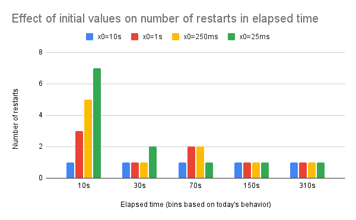

<!--
**Note:** When your KEP is complete, all of these comment blocks should be removed.

To get started with this template:

- [x] **Pick a hosting SIG.**
  Make sure that the problem space is something the SIG is interested in taking
  up. KEPs should not be checked in without a sponsoring SIG.
- [x] **Create an issue in kubernetes/enhancements**
  When filing an enhancement tracking issue, please make sure to complete all
  fields in that template. One of the fields asks for a link to the KEP. You
  can leave that blank until this KEP is filed, and then go back to the
  enhancement and add the link.
- [x] **Make a copy of this template directory.**
  Copy this template into the owning SIG's directory and name it
  `NNNN-short-descriptive-title`, where `NNNN` is the issue number (with no
  leading-zero padding) assigned to your enhancement above.
- [x] **Fill out as much of the kep.yaml file as you can.**
  At minimum, you should fill in the "Title", "Authors", "Owning-sig",
  "Status", and date-related fields.
- [x] **Fill out this file as best you can.**
  At minimum, you should fill in the "Summary" and "Motivation" sections.
  These should be easy if you've preflighted the idea of the KEP with the
  appropriate SIG(s).
- [x] **Create a PR for this KEP.**
  Assign it to people in the SIG who are sponsoring this process.
- [ ] **Merge early and iterate.**
  Avoid getting hung up on specific details and instead aim to get the goals of
  the KEP clarified and merged quickly. The best way to do this is to just
  start with the high-level sections and fill out details incrementally in
  subsequent PRs.

Just because a KEP is merged does not mean it is complete or approved. Any KEP
marked as `provisional` is a working document and subject to change. You can
denote sections that are under active debate as follows:

```
<<[UNRESOLVED optional short context or usernames ]>>
Stuff that is being argued.
<<[/UNRESOLVED]>>
```

When editing KEPS, aim for tightly-scoped, single-topic PRs to keep discussions
focused. If you disagree with what is already in a document, open a new PR
with suggested changes.

One KEP corresponds to one "feature" or "enhancement" for its whole lifecycle.
You do not need a new KEP to move from beta to GA, for example. If
new details emerge that belong in the KEP, edit the KEP. Once a feature has become
"implemented", major changes should get new KEPs.

The canonical place for the latest set of instructions (and the likely source
of this file) is [here](/keps/NNNN-kep-template/README.md).

**Note:** Any PRs to move a KEP to `implementable`, or significant changes once
it is marked `implementable`, must be approved by each of the KEP approvers.
If none of those approvers are still appropriate, then changes to that list
should be approved by the remaining approvers and/or the owning SIG (or
SIG Architecture for cross-cutting KEPs).
-->
# KEP-4603: Tune CrashLoopBackoff

<!--
This is the title of your KEP. Keep it short, simple, and descriptive. A good
title can help communicate what the KEP is and should be considered as part of
any review.
-->

<!--
A table of contents is helpful for quickly jumping to sections of a KEP and for
highlighting any additional information provided beyond the standard KEP
template.

Ensure the TOC is wrapped with
  <code>&lt;!-- toc --&rt;&lt;!-- /toc --&rt;</code>
tags, and then generate with `hack/update-toc.sh`.
-->

<!-- toc -->
- [Release Signoff Checklist](#release-signoff-checklist)
- [Summary](#summary)
- [Motivation](#motivation)
  - [Goals](#goals)
  - [Non-Goals](#non-goals)
- [Proposal](#proposal)
  - [Existing backoff curve change: front loaded decay, lower maximum backoff](#existing-backoff-curve-change-front-loaded-decay-lower-maximum-backoff)
  - [Refactor and flat rate to 10 minutes for the backoff counter reset threshold](#refactor-and-flat-rate-to-10-minutes-for-the-backoff-counter-reset-threshold)
  - [User Stories](#user-stories)
    - [Task isolation](#task-isolation)
    - [Fast restart on failure](#fast-restart-on-failure)
    - [Sidecar containers fast restart](#sidecar-containers-fast-restart)
  - [Notes/Constraints/Caveats (Optional)](#notesconstraintscaveats-optional)
  - [Risks and Mitigations](#risks-and-mitigations)
- [Design Details](#design-details)
  - [Front loaded decay curve, modified maximum backoff methodology](#front-loaded-decay-curve-modified-maximum-backoff-methodology)
  - [Refactor of recovery threshold](#refactor-of-recovery-threshold)
  - [Kubelet overhead analysis](#kubelet-overhead-analysis)
  - [Benchmarking](#benchmarking)
  - [Relationship with Job API podFailurePolicy and backoffLimit](#relationship-with-job-api-podfailurepolicy-and-backofflimit)
  - [Relationship with ImagePullBackOff](#relationship-with-imagepullbackoff)
  - [Relationship with k/k#123602](#relationship-with-kk123602)
  - [Test Plan](#test-plan)
      - [Prerequisite testing updates](#prerequisite-testing-updates)
      - [Unit tests](#unit-tests)
      - [Integration tests](#integration-tests)
      - [e2e tests](#e2e-tests)
  - [Graduation Criteria](#graduation-criteria)
    - [Alpha](#alpha)
    - [Beta](#beta)
    - [GA](#ga)
  - [Upgrade / Downgrade Strategy](#upgrade--downgrade-strategy)
    - [Conflict resolution](#conflict-resolution)
  - [Version Skew Strategy](#version-skew-strategy)
- [Production Readiness Review Questionnaire](#production-readiness-review-questionnaire)
  - [Feature Enablement and Rollback](#feature-enablement-and-rollback)
  - [Rollout, Upgrade and Rollback Planning](#rollout-upgrade-and-rollback-planning)
  - [Monitoring Requirements](#monitoring-requirements)
  - [Dependencies](#dependencies)
  - [Scalability](#scalability)
  - [Troubleshooting](#troubleshooting)
- [Implementation History](#implementation-history)
- [Drawbacks](#drawbacks)
- [Alternatives](#alternatives)
  - [Global override](#global-override)
  - [Per exit code configuration](#per-exit-code-configuration)
  - [<code>RestartPolicy: Rapid</code>](#restartpolicy-rapid)
  - [Flat-rate restarts for <code>Succeeded</code> Pods](#flat-rate-restarts-for-succeeded-pods)
    - [On Success and the 10 minute recovery threshold](#on-success-and-the-10-minute-recovery-threshold)
      - [Related: API opt-in for flat rate/quick restarts when transitioning from <code>Succeeded</code> phase](#related-api-opt-in-for-flat-ratequick-restarts-when-transitioning-from-succeeded-phase)
      - [Related: <code>Succeeded</code> vs <code>Rapid</code>ly failing: who's getting the better deal?](#related-succeeded-vs-rapidly-failing-whos-getting-the-better-deal)
  - [Front loaded decay with interval](#front-loaded-decay-with-interval)
  - [Late recovery](#late-recovery)
  - [More complex heuristics](#more-complex-heuristics)
- [Appendix A](#appendix-a)
  - [Kubelet SyncPod](#kubelet-syncpod)
  - [Runtime SyncPod](#runtime-syncpod)
  - [Kubelet SyncTerminatingPod + runtime killPod](#kubelet-syncterminatingpod--runtime-killpod)
  - [Kubelet SyncTerminatedPod](#kubelet-syncterminatedpod)
- [Infrastructure Needed (Optional)](#infrastructure-needed-optional)
<!-- /toc -->

## Release Signoff Checklist

<!--
**ACTION REQUIRED:** In order to merge code into a release, there must be an
issue in [kubernetes/enhancements] referencing this KEP and targeting a release
milestone **before the [Enhancement Freeze](https://git.k8s.io/sig-release/releases)
of the targeted release**.

For enhancements that make changes to code or processes/procedures in core
Kubernetes—i.e., [kubernetes/kubernetes], we require the following Release
Signoff checklist to be completed.

Check these off as they are completed for the Release Team to track. These
checklist items _must_ be updated for the enhancement to be released.
-->

Items marked with (R) are required *prior to targeting to a milestone / release*.

- [x] (R) Enhancement issue in release milestone, which links to KEP dir in [kubernetes/enhancements] (not the initial KEP PR)
- [ ] (R) KEP approvers have approved the KEP status as `implementable`
- [ ] (R) Design details are appropriately documented
- [ ] (R) Test plan is in place, giving consideration to SIG Architecture and SIG Testing input (including test refactors)
  - [ ] e2e Tests for all Beta API Operations (endpoints)
  - [ ] (R) Ensure GA e2e tests meet requirements for [Conformance Tests](https://github.com/kubernetes/community/blob/master/contributors/devel/sig-architecture/conformance-tests.md) 
  - [ ] (R) Minimum Two Week Window for GA e2e tests to prove flake free
- [x] (R) Graduation criteria is in place
  - [ ] (R) [all GA Endpoints](https://github.com/kubernetes/community/pull/1806) must be hit by [Conformance Tests](https://github.com/kubernetes/community/blob/master/contributors/devel/sig-architecture/conformance-tests.md) 
- [ ] (R) Production readiness review completed
- [ ] (R) Production readiness review approved
- [ ] "Implementation History" section is up-to-date for milestone
- [ ] User-facing documentation has been created in [kubernetes/website], for publication to [kubernetes.io]
- [ ] Supporting documentation—e.g., additional design documents, links to mailing list discussions/SIG meetings, relevant PRs/issues, release notes

<!--
**Note:** This checklist is iterative and should be reviewed and updated every time this enhancement is being considered for a milestone.
-->

[kubernetes.io]: https://kubernetes.io/
[kubernetes/enhancements]: https://git.k8s.io/enhancements
[kubernetes/kubernetes]: https://git.k8s.io/kubernetes
[kubernetes/website]: https://git.k8s.io/website

## Summary

<!--
This section is incredibly important for producing high-quality, user-focused
documentation such as release notes or a development roadmap. It should be
possible to collect this information before implementation begins, in order to
avoid requiring implementors to split their attention between writing release
notes and implementing the feature itself. KEP editors and SIG Docs
should help to ensure that the tone and content of the `Summary` section is
useful for a wide audience.

A good summary is probably at least a paragraph in length.

Both in this section and below, follow the guidelines of the [documentation
style guide]. In particular, wrap lines to a reasonable length, to make it
easier for reviewers to cite specific portions, and to minimize diff churn on
updates.

[documentation style guide]: https://github.com/kubernetes/community/blob/master/contributors/guide/style-guide.md
-->

CrashLoopBackoff is designed to slow the speed at which failing containers
restart, preventing the starvation of kubelet by a misbehaving container.
Currently it is a subjectively conservative, fixed behavior regardless of
container failure type: when a Pod has a restart policy besides `Never`, after
containers in a Pod exit, the kubelet restarts them with an exponential back-off
delay (10s, 20s, 40s, …), that is capped at five minutes. The delay for restarts
will stay at 5 minutes until a container has executed for 2x the maximum backoff
-- that is, 10 minutes -- without any problems, in which case the kubelet resets
the backoff count for that container and further crash loops start again at the
beginning of the delay curve
([ref](https://kubernetes.io/docs/concepts/workloads/pods/pod-lifecycle/)). 

Both the decay to 5 minute back-off delay, and the 10 minute recovery threshold,
are considered too conservative, especially in cases where the exit code was 0
(Success) and the pod is transitioned into a "Completed" state or the expected
length of the pod run is less than 10 minutes.

This KEP proposes the following changes:
* Provide an alpha-gated change to get feedback and periodic scalability tests
  on changes to the global initial backoff to 1s and maximum backoff to 1 minute


## Motivation

<!--
This section is for explicitly listing the motivation, goals, and non-goals of
this KEP.  Describe why the change is important and the benefits to users. The
motivation section can optionally provide links to [experience reports] to
demonstrate the interest in a KEP within the wider Kubernetes community.

[experience reports]: https://github.com/golang/go/wiki/ExperienceReports
-->

[Kubernetes#57291](https://github.com/kubernetes/kubernetes/issues/57291), with
over 250 positive reactions and in the top five upvoted issues in k/k, covers a
range of suggestions to change the rate of decay for the backoff delay or the
criteria to restart the backoff counter, in some cases requesting to make this
behavior tunable per node, per container, and/or per exit code. Anecdotally,
there are use cases representative of some of Kubernetes' most rapidly growing
workload types like
[gaming](https://github.com/googleforgames/agones/issues/2781) and
[AI/ML](https://github.com/kubernetes/enhancements/tree/master/keps/sig-apps/3329-retriable-and-non-retriable-failures)
that would benefit from this behavior being different for varying types of
containers. Application-based workarounds using init containers or startup
wrapper scripts, or custom operators like
[kube_remediator](https://github.com/ankilosaurus/kube_remediator) and
[descheduler](https://github.com/kubernetes-sigs/descheduler) are used by the
community to anticipate crashloopbackoff behavior, prune pods with nonzero
backoff counters, or otherwise "pretend" the pod did not exit recently to force
a faster restart from kubelet. Discussions with early Kubernetes contributors
indicate that the current behavior was not designed beyond the motivation to
throttle misbehaving containers, and is open to reintepretation in light of user
experiences, empirical evidence, and emerging workloads.

By definition this KEP will cause pods to restart faster and more often than the
current status quo; let it be known that such a change is desired. It is also
the intention of the author that, to some degree, this change happens without
the need to reconfigure workloads or expose extensive API surfaces, as
experience shows that makes changes difficult to adopt, increases the risk for
misconfiguration, and can make the system overly complex to reason about. That
being said, this KEP recognizes the need of backoff times to protect node
stability, avoiding too big of sweeping changes to backoff behavior, or setting
unreasonable or unpredictable defaults. Therefore the approach manages the risk
of different decay curves to node stability by providing an API surface to
opt-in to the riskiest option, and ultimately also provides the observability
instrumentation needed by cluster operators to model the impact of this change
on their existing deployments.

A large number of alternatives have been discussed over the 5+ years the
canonical tracking issue has been open, some of which imply high levels of
sophistication for kubelet to make different decisions based on system state,
workload specific factors, or by detecting anomalous workload behavior. While
this KEP does not rule out those directions in the future, the proposal herein
focuses on the simpler, easily modeled changes that are designed to address the
most common issues observed today. It is the desire of the author that the
observability and benchmarking improvements instrumented as part of this
proposal can serve as a basis for pursuing those types of improvements in the
future, including as signals for end users to represent such solutions as
necessary. Some analysis of these alternatives are included in the Alternatives
Considered section below for future reference.

### Goals

<!--
List the specific goals of the KEP. What is it trying to achieve? How will we
know that this has succeeded?
-->

* Improve pod restart backoff logic to better match the actual load it creates
  and meet emerging use cases
* Quantify and expose risks to node stability resulting from decreased and/or
  hetereogeneous backoff configurations
* Empirically derive defaults and allowable thresholds that approximate current
  node stability
* Provide a simple UX that does not require changes for the majority of
  workloads
* Must work for Jobs and sidecar containers

### Non-Goals

<!--
What is out of scope for this KEP? Listing non-goals helps to focus discussion
and make progress.
-->

* This effort is NOT intending to support fully user-specified configuration, to
  cap risk to node stability
* This effort is purposefully NOT implementing more complex heuristics by
  kubelet (e.g. system state, workload specific factors, or by detecting
anomalous workload behavior) to focus on better benchmarking and observability
  and address common use cases with easily modelled changes first
* This effort is NOT changing the independent backoff curve for image pulls

## Proposal

<!--
This is where we get down to the specifics of what the proposal actually is.
This should have enough detail that reviewers can understand exactly what
you're proposing, but should not include things like API designs or
implementation. What is the desired outcome and how do we measure success?.
The "Design Details" section below is for the real
nitty-gritty.
-->

This design seeks to change the existing initial value for the backoff curve to
1s to stack more retries earlier, and reduce the maximum backoff for a given
restart from 5 minutes to 1 minute, for all restarts (`restartPolicy: OnFailure`
and `restartPolicy: Always`).

To derive these values, manual stress testing observing the behavior of kubelet,
   API server, and overall cluster operations and behavior were performed. In
addition, part of the alpha period will be dedicated entirely to systematically
stress testing kubelet and API Server with different distributions of workloads
utilizing the new backoff curves. During the benchmarking period in alpha,
kubelet memory and CPU, API server latency, and pod restart latency will be
observed and analyzed to further refine the maximum allowable restart rate for
fully saturated nodes.

Longer term, these
metrics will also supply cluster operators the data necessary to better analyze
and anticipate the change in load and node stability as a result of upgrading to
these changes.

While they are more deeply rationalized in the Alternatives Considered section,
because they are commonly inquired about at this point, note that this proposal
will NOT change:
* backoff behavior for Pods transitioning from the "Success" state differently
  from those transitioning from a "Failed" state -- see [here in Alternatives
  Considered](#on-success-and-the-10-minute-recovery-threshold)
* the ImagePullBackoff -- out of scope, see [Design
  Details](#relationship-with-imagepullbackoff)
* changes that address 'late recovery', or modifications to backoff behavior
  once the maximum backoff has been reached -- see
  [Alternatives](#more-complex-heuristics)


### Existing backoff curve change: front loaded decay, lower maximum backoff

This KEP proposes changing the existing backoff curve to load more restarts
earlier by changing the initial value of the exponential backoff, and to retry
periodically more often by reducing the maximum for the backoff. A number of
alternate initial values and maximum backoff values are modelled below. This
proposal suggests we start with a new initial value of 1s (changed from 10s
today) and a maximum backoff of 1 minute (changed from 5 minutes today) based on
prior research, and further analyze its impact on infrastructure during alpha. 


### Refactor and flat rate to 10 minutes for the backoff counter reset threshold

Finally, this KEP proposes factoring out the backoff counter reset threshold for
CrashLoopBackoff behavior induced restarts into a new constant. Instead of being
proportional to the configured maximum backoff, it will instead be a flat rate
equivalent to the current implementation, 10 minutes. This will only apply to
backoff counter resets from CrashLoopBackoff behavior.


### User Stories

<!--
Detail the things that people will be able to do if this KEP is implemented.
Include as much detail as possible so that people can understand the "how" of
the system. The goal here is to make this feel real for users without getting
bogged down.
-->

#### Task isolation
By design the container wants to exit so it will be recreated and restarted to
start a new “session” or “task”. It may be a new gaming session or a new
isolated task processing an item from the queue.

This is not possible to do by creating the wrapper of a container that will
restart the process in a loop because those tasks or gaming sessions desire to
start from scratch. In some cases - they may even want to download a new
container image.

For these cases, it is important that the startup latency of the full
rescheduling of a new pod is avoided.

#### Fast restart on failure

There are AI/ML scenarios where an entire workload is delayed if one of the Pods
is not running. Some Pods in this scenario may fail with the recoverable error -
for example some dependency failure or be killed by infrastructure (e.g. exec
probe failures on containerd slow restart). In such cases, it is desirable to
restart the container as fast as possible and not wait for 5 minutes of the max
crashloop backoff timeout. With the existing max crashloop backoff timeout, a
failure of a single pod in a highly-coupled workload can cause a cascade in the
workload leading to an overall delay of (much) greater than the 5 minute
backoff.

The typical pattern here today is to be quick to restart container, but with the
intermittently failed dependency (e.g. network is down for some time, some
intermittent issue with a GPU), this causes the container to fail repeatedly and
the backoff timeout to eventually be reached. However when the dependency goes
back to green, the container is not restarted immediately and has already
reached the maximum crash loop backoff duration of 5 minutes.

#### Sidecar containers fast restart

There are cases when the Pod consists of a user container implementing business
logic and a sidecar providing networking access (Istio), logging (opentelemetry
collector), or orchestration features. In some cases sidecar containers are
critical for the user container functioning as they provide a basic
infrastructure for the user container to run in. In such cases it is considered
beneficial to not apply the exponential backoff to the sidecar container
restarts and keep it at a low constant value.

This is especially true for cases when the sidecar is killed by infrastructure
(e.g. OOMKill) as it may have happened for reasons independent from the sidecar
functionality.


### Notes/Constraints/Caveats (Optional)

<!--
What are the caveats to the proposal?
What are some important details that didn't come across above?
Go in to as much detail as necessary here.
This might be a good place to talk about core concepts and how they relate.
-->

### Risks and Mitigations

<!--
What are the risks of this proposal, and how do we mitigate? Think broadly.
For example, consider both security and how this will impact the larger
Kubernetes ecosystem.

How will security be reviewed, and by whom?

How will UX be reviewed, and by whom?

Consider including folks who also work outside the SIG or subproject.
-->

The biggest risk of this proposal is reducing the decay of the _default_
CrashLoopBackoff: to do so too severely compromises node stability, risking the
kubelet component to become too slow to respond and the pod lifecycle to
increase in latency, or worse, causing entire nodes to crash if kubelet takes up
too much CPU or memory. Since each phase transition for a Pod also has an
accompanying API request, if the requests become rapid enough due to fast enough
churn of Pods through CrashLoopBackoff phases, the central API server could
become unresponsive, effectively taking down an entire cluster.

Some observations and analysis were made to quantify these risks going into
alpha. In the [Kubelet Overhead Analysis](#kubelet-overhead-analysis), the code
paths all restarting pods go through result in 5 obvious `/pods` API server
status updates; when observed empirically in an active cluster, while we do see
an initial surges in `/pods` API traffic to the kubelet client side rate limit
of ~5 QPS when deploying 110 mass crashing pods for our tests, even with
instantly crashing pods and intantaneously restarting CrashLoopBackOff behavior,
`/pods` API requests quickly normalized to ~2 QPS. In the same tests, runtime
CPU usage increased by x10 and the API server CPU usage increased by 2x.
<<[UNRESOLVED non blocking]If you were testing this on a small cluster without a lot of
additional load, the 2x increase in apiserver cpu usage is probably not a
particularly useful metric. Might be worth mentioning the raw numbers here
instead.>> <<[/UNRESOLVED]>>

For both of these changes, by passing these changes through the existing
SIG-scalability tests, while pursuing manual and more detailed periodic
benchmarking during the alpha period, we can increase the confidence in the
changes and explore the possibility of reducing the values further in the
future.

In the meantime, during alpha, naturally the first line of defense is that the
enhancements, even the reduced "default" baseline curve for CrashLoopBackoff,
are not usable by default and must be opted into. In this specific case they are
opted into separately with different alpha feature gates, so clusters will only
be affected by each risk if the cluster operator enables the new features during
the alpha period.

Beyond this, there are two main mitigations during alpha: conservativism in
changes to the default behavior based on prior stress testing, and limiting any
further overrides to be opt-in per Node, and only by users with the permissions
to modify the kubelet configuration -- in other words, a cluster operator
persona.

The alpha changes to the _default_ backoff curve were chosen because they meet
emerging use cases and user sentiment from the canonical feature request issue
and research by the author, AND because they are indicated to be safe changes
based on initial benchmarking and analysis. The reduction of the initial value
from 10s to 1s and the reduction of the backoff maximum from 5 minutes to 1
minute introduces 

* 5 excess restarts per pod in the first five minutes
  * the first 3 excess in the first 30 seconds
  * and the last 2 excess between 150 and 300 seconds
  * an excess 5 restarts every five minutes compared to today given the change
    in the backoff maximum

For a hypothetical node with the default maximum 110 pods all stuck in a
simultaneous 10s CrashLoopBackoff, at its most efficient this would result in a
new restart for each pod every second, and API requests to the API server to
change the state transition would increase at its fastest period from ~550
requests/10s to ~5500 requests/10s, or 10x. In conjunction, the lowered backoff
would continuously add 5 excess restarts every five minutes compared to today's
behavior, so each crashing pod would be adding an excess of 25 pod state
transition API requests, for a total of 2750 excess API requests for a node
fully saturated with crashing pods.

## Design Details 

<!--
This section should contain enough information that the specifics of your
change are understandable. This may include API specs (though not always
required) or even code snippets. If there's any ambiguity about HOW your
proposal will be implemented, this is the place to discuss them.
-->

### Front loaded decay curve, modified maximum backoff methodology
As mentioned above, today the standard backoff curve is a 2x exponential decay
starting at 10s and capping at 5 minutes, resulting in a composite of the
standard hockey-stick exponential decay graph followed by a linear rise until
the heat death of the universe as depicted below:


Remember that the backoff counter is reset if containers run longer than 10
minutes, so in the worst case where a container always exits after 9:59:59, this
means in the first 30 minute period, the container will restart twice. In a more
easily digestible example used in models below, for a fast exiting container
crashing every 10 seconds, in the first 30 minutes the container will restart
about 10 times, with the first four restarts in the first 5 minutes.

Why change the initial value of the backoff curve instead of its rate, or why
not change the decay function entirely to other well known equations (like
functions resulting in curves that are lienar, parabolic, sinusoidal, etc)?

Exponential decay, particularly at a rate of 2x, is commonly used for software
retry backoff as it has the nice properties of starting restarts at a low value,
but penalizing repeated crashes harshly, to protect primarily against
unrecoverable failures. In contrast, we can interpret linear curves as
penalizing every failure the same, or parabolic and sinusoidal curves as giving
our software a "second chance" and forgiving later failures more. For a default
restart decay curve, where the cause of the restart cannot be known, 2x
exponential decay still models the desired properties more, as the biggest risk
is unrecoverable failures causing "runaway" containers to overload kubelet.

To determine the effect in abstract of changing the initial value on current
behavior, we modeled the change in the starting value of the decay from 10s to
1s, 250ms, or even 25ms. 


For today's decay rate, the first restart is within the first 10s, the second
within the first 30s, the third within the first 70s. Using those same time
windows to compare alternate initial values, for example changing the initial
rate to 1s, we would instead have 3 restarts in the first time window, 1 restart
within the second time window, and two more restarts within the third time
window. As seen below, this type of change gives us more restarts earlier, but
even at 250ms or 25ms initial values, each approach a similar rate of restarts
after the third time window.


Among these modeled initial values, we would get between 3-7 excess restarts per
backoff lifetime, mostly within the first three time windows matching today's
restart behavior.

The above modeled values converge like this because of the harshly increasing
rate caused by the exponential growth, but also because they grow to the same
maximum value -- 5 minutes. By layering on alternate models for maximum backoff,
we observe more restarts for longer:


While this graph includes several variations -- initial values of 10s in red and
pink, initial values of 1s in purple and lilac, and both of these initial values
modeled either 60s or 30s maximum backoff -- hopefully it can impress upon the
reader how including a reduction to maximum backoff increases the number of
excess restarts later in the cycle. In the most extreme case modeled above, with
initial value of 1s and a maximum backoff of 30s, there are 2 excess restarts in
the first time window, 1 excess in the second time window, 3 excess in the
fourth time window and 4 excess in the fifth time window for a total of 10
excess restarts compared to today's behavior.

As a first estimate for alpha in line with maximums discussed on
[Kubernetes#57291](https://github.com/kubernetes/kubernetes/issues/57291), the
initial curve is selected at initial=1s / max=1 minute. During the alpha period
this will be further investigated against kubelet capacity, potentially
targeting something closer to an initial value near 0s, and a cap of 10-30s. To
further restrict the blast radius of this change before full and complete
benchmarking is worked up, this is gated by its own feature gate,
`ReduceDefaultCrashLoopBackoffDecay`.

### Refactor of recovery threshold

A simple change
to maximum backoff would naturally come with a modification of the backoff
counter reset threshold -- as it is currently calculated based on 2x the maximum
backoff. Without any other modification, as a result of this KEP, default
containers would be "rewarded" by having their backoff counter set back to 0 for
running successfully for 2\*1 minute=2 minutes (instead of for 2\*5minutes=10
minutes like it is today); containers on nodes with an override could be
rewarded for running successfully for as low as 2 seconds if they are configured
with the minimum allowable backoff of 1s. 

From a technical perspective, granularity of the associated worker polling loops
governing restart behavior is between 1 and 10 seconds, so a reset value under
10 seconds is effectively meaningless (until and unless those loops increase in
speed or we move to evented PLEG). From a user perspective, it does not seem
that there is any particular end user value in artificially preserving the
current 10 minute recovery threshold as part of this implementation, since it
was an arbitrary value in the first place. However, since late recovery as a
category of problem space is expressly a non-goal of this KEP, and in the
interest of reducing the number of changed variables during the alpha period to
better observe the ones previously enumerated, this proposal intends to maintain
that 10 minute recovery threshold anyways. 

Forecasting that the recovery threshold for CrashLoopBackOff may be better
served by being configurable in the future, or at least separated in the code
from all other uses of `client_go.Backoff` for whatever future enhancements
address the late recovery problem space, the mechanism proposed here is to
redefine  `client_go.Backoff` to accept alternate functions for
[`client_go.Backoff.hasExpired`](https://github.com/kubernetes/kubernetes/blob/master/staging/src/k8s.io/client-go/util/flowcontrol/backoff.go#L178),
and configure the `client_go.Backoff` object created for use by the kube runtime
manager for container restart bacoff with a function that compares to a flat
rate of 300 seconds.

### Kubelet overhead analysis

As it's intended that, after this KEP, pods will restart more often that in
current Kubernetes, it's important to understand what the kubelet does during
pod restarts. The most informative code path for that is through (all links to
1.31) [`kubelet/kubelet.go
SyncPod`](https://github.com/kubernetes/kubernetes/blob/release-1.31/pkg/kubelet/kubelet.go),
[`kubelet/kuberuntime/kuberuntime_manager.go
SyncPod`](https://github.com/kubernetes/kubernetes/blob/release-1.31/pkg/kubelet/kuberuntime/kuberuntime_manager.go#L1052),
[`kubelet/kuberuntime/kuberuntime_container.go
startContainer`](https://github.com/kubernetes/kubernetes/blob/release-1.31/pkg/kubelet/kuberuntime/kuberuntime_container.go#L195)
and [`kubelet/kubelet.go SyncTerminatingPod`](),
[`kubelet/kuberuntime/kuberuntime_container.go
killContainer`](https://github.com/kubernetes/kubernetes/blob/release-1.31/pkg/kubelet/kuberuntime/kuberuntime_container.go#L761),
[`kubelet/kuberuntime/kuberuntime_manager.go
killPodWithSyncResult`](https://github.com/kubernetes/kubernetes/blob/release-1.31/pkg/kubelet/kuberuntime/kuberuntime_manager.go#L1466),
 [`kubelet/kubelet.go
SyncTerminatingPod`](https://github.com/kubernetes/kubernetes/blob/release-1.31/pkg/kubelet/kubelet.go#L1996), and [`kubelet/kubelet.go SyncTerminatedPod`](https://github.com/kubernetes/kubernetes/blob/release-1.31/pkg/kubelet/kubelet.go#L2143).


As you might imagine this is a very critical code path with hooks to many
in-flight features; [Appendix A](#appendix-a) includes a more complete list (yet
still not as exhaustive as the source code), but the following are selected as
the most important behaviors of kubelet during a restart to know about, that are
not currently behind a feature gate.

After a Pod is in Terminating phase, kubelet:

* Clears up old containers using container runtime
* Stops probes and pod sandbox, and unmounts volumes and unregisters
  secrets/configmaps (since Pod was in a terminal phase)
* While still in the backoff window, wait for network / attach volumes /
  register pod to secret and configmap managers / re-download image secrets if
  necessary

Once the current backoff window has passed, kubelet:

* Potentially re-downloads the image (utilizing network + IO and blocks other
  image downloads) if image pull policy specifies it
  ([ref](https://github.com/kubernetes/kubernetes/blob/release-1.31/pkg/kubelet/images/image_manager.go#L135)).
* Recreates the pod sandbox and probe workers
* Recreates the containers using container runtime
* Runs user configured prestart and poststart hooks for each container
* Runs startup probes until containers have started (startup probes may be more
  expensive than the readiness probes as they often configured to run more
  frequently)
* Redownloads all secrets and configmaps, as the pod has been unregistered and
  reregistered to the managers, while computing container environment/EnvVarFrom
* Application runs through its own initialization logic (typically utilizing
  more IO)
* Logs information about all container operations (utilizing disk IO and
  “spamming” logs)

The following diagram showcases these same highlights more visually and in
context of the responsible API surface (Kubelet or Runtime aka CRI).


```
 <<[UNRESOLVED non blocking answer these question from original PR or make new bugs]>> 
 >Does this [old container cleanup using containerd] include cleaning up the image filesystem? There might be room for some optimization here, if we can reuse the RO layers.
 to answer question: looks like it is per runtime. need to check about leasees. also part of the value of this is to restart the sandbox.
```

### Benchmarking

Again, let it be known that by definition this KEP will cause pods to restart
faster and more often than the current status quo and such a change is desired.
However, to do so as safely as possible, it is required that during the alpha
period, we reevaluate the SLIs and SLOs and benchmarks related to this change and
expose clearly the methodology needed for cluster operators to be able to quantify the
risk posed to their specific clusters on upgrade.

To best reason about the changes in this KEP, we require the ability to
determine, for a given percentage of heterogenity between "Succeeded"
terminating pods, and "Failed" (aka crashing) terminating pods whose
`restartPolicy: Always`:
 * what is the load and rate of Pod restart related API requests to the API
   server?
 * what are the performance (memory, CPU, and pod start latency) effects on the
   kubelet component? What about when considering the effects of different
   plugins (e.g. CSI, CNI)

Today there are alpha SLIs in Kubernetes that can observe that impact in
aggregate:
* Kubelet component CPU and memory
* `kubelet_http_inflight_requests`
* `kubelet_http_requests_duration_seconds`
* `kubelet_http_requests_total`
* `kubelet_pod_worker_duration_seconds`
* `kubelet_runtime_operations_duration_seconds`
* `kubelet_pod_start_duration_seconds`
* `kubelet_pod_start_sli_duration_seconds`

In addition, estimates given the currently suggested changes in API requests are
included in [Risks and Mitigations](#risks-and-mitigations) and were deciding
factors in specific changes to the backoff curves. Since the changes in this
proposal are deterministic, this is pre-calculatable for a given heterogenity of
quantity and rate of restarting pods.

In addition, the `kube-state-metrics` project already implements
restart-specific metadata for metrics that can be used to observe pod restart
latency in more detail, including:
* `kube_pod_container_status_restarts_total`
* `kube_pod_restart_policy`
* `kube_pod_start_time`
* `kube_pod_created`

During the alpha period, these metrics, the SIG-Scalability benchmarking tests,
added kubelet performance tests, and manual benchmarking by the author against
`kube-state-metrics` will be used to answer the above questions, tying together
the container restart policy (inherited or declared), the terminal state of a
container before restarting, and the number of container restarts, to articulate
the observed rate and load of restart related API requests and the performance
effects on kubelet.

### Relationship with Job API podFailurePolicy and backoffLimit

Job API provides its own API surface for describing alterntive restart
behaviors, from [KEP-3329: Retriable and non-retriable Pod failures for
Jobs](https://github.com/kubernetes/enhancements/tree/master/keps/sig-apps/3329-retriable-and-non-retriable-failures),
in beta as of Kubernetes 1.30. The following example from that KEP shows the new
configuration options: `backoffLimit`, which controls for number of retries on
failure, and `podFailurePolicy`, which controls for types of workload exit codes
or kube system events to ignore against that `backoffLimit`.

```yaml
apiVersion: v1
kind: Job
spec:
  [ . . . ]
  backoffLimit: 3
  podFailurePolicy:
    rules:
    - action: FailJob
      onExitCodes:
        containerName: main-job-container
        operator: In
        values: [1,2,3]
    - action: Ignore
      onPodConditions:
      - type: DisruptionTarget
```

The implementation of KEP-3329 is entirely in the Job controller, and the
restarts are not handled by kubelet at all; in fact, use of this API is only
available if the `restartPolicy` is set to `Never` (though
[kubernetes#125677](https://github.com/kubernetes/kubernetes/issues/125677)
wants to relax this validation to allow it to be used with other `restartPolicy`
values). As a result, to expose the new backoff curve to Jobs using this
feature, the updated backoff curve must also be implemented in the Job
controller. This is currently considered out of scope of the first alpha
implementation of this design.

### Relationship with ImagePullBackOff

ImagePullBackoff is used, as the name suggests, only when a container needs to
pull a new image. If the image pull fails, a backoff decay is used to make later
retries on the image download wait longer and longer. This is configured
internally independently
([here](https://github.com/kubernetes/kubernetes/blob/release-1.30/pkg/kubelet/kubelet.go#L606))
from the backoff for container restarts
([here](https://github.com/kubernetes/kubernetes/blob/release-1.30/pkg/kubelet/kubelet.go#L855)).

This KEP considers changes to ImagePullBackoff as out of scope, so during
implementation this will keep the same backoff. This is both to reduce the
number of variables during the benchmarking period for the restart counter, and
because the problem space of ImagePullBackoff could likely be handled by a
completely different pattern, as unlike with CrashLoopBackoff the types of
errors with ImagePullBackoff are less variable and better interpretable by the
infrastructure as recoverable or non-recoverable (i.e. 404s).

### Relationship with k/k#123602

It was observed that there is a bug with the current requeue behavior, described
in https://github.com/kubernetes/kubernetes/issues/123602. The first restart
will have 0 seconds delay instead of the advertised initial value delay, because
the backoff object will not be initialized until a key is generated, which
doesn't happen until after the first restart of a pod (see
[ref](https://github.com/kubernetes/kubernetes/blob/a7ca13ea29ba5b3c91fd293cdbaec8fb5b30cee2/pkg/kubelet/kuberuntime/kuberuntime_manager.go#L1336-L1349)).
That first restart will also not impact future backoff calculations, so the
observed behavior is closer to:

* 0 seconds delay for first restart
* 10 seconds for second restart
* 10 * 2^(restart_count - 2) for subsequent restarts

By watching a crashing pod, we can observe that it does not enter a
CrashLoopBackoff state or behave as advertised until after that first "free"
restart:

```
# a pod that crashes every 10s
thing  0/1  Pending  0 29s
thing  0/1  Pending  0 97s
thing  0/1  ContainerCreating  0 97s
thing  1/1  Running  0 110s           
thing  0/1  Completed  0 116s                       # first run completes
thing  1/1  Running  1 (4s ago)  118s               # no crashloopbackoff observed, 1 restart tracked
thing  0/1  Completed  1 (10s ago)  2m4s            # second runc ompletes
thing  0/1  CrashLoopBackOff 1 (17s ago)  2m19s     # crashloopbackoff observed
thing  1/1  Running  2 (18s ago)  2m20s             # third run starts
thing  0/1  Completed  2 (23s ago)  2m25s
thing  0/1  CrashLoopBackOff 2 (14s ago)  2m38s     # crashloopbackoff observed again
thing  1/1  Running  3 (27s ago)  2m51s
thing  0/1  Completed  3 (32s ago)  2m56s
```

Ultimately, being able to predict the exact number of restarts or remedying up
to 10 seconds delay for the advertised behavior is not the ultimate goal of this
KEP, though certain assumptions were made when calculating risks, mitigations,
and analyzing existing behavior that are affected by this bug. Since the
behavior is already changing as part of this KEP, and similar code paths will be
changed, it is within scope of this KEP to address this bug if it is a blocker
to implementation for alpha; it can wait until beta otherwise. This is
represented below in the [Graduation Criteria](#graduation-criteria).

### Test Plan

<!--
**Note:** *Not required until targeted at a release.*
The goal is to ensure that we don't accept enhancements with inadequate testing.

All code is expected to have adequate tests (eventually with coverage
expectations). Please adhere to the [Kubernetes testing guidelines][testing-guidelines]
when drafting this test plan.

[testing-guidelines]: https://git.k8s.io/community/contributors/devel/sig-testing/testing.md
-->

[x] I/we understand the owners of the involved components may require updates to
existing tests to make this code solid enough prior to committing the changes necessary
to implement this enhancement.

This feature requires two levels of testing: the regular enhancement testing
(described in the template below) and the stress/benchmark testing required to
increase confidence in ongoing node stability given heterogeneous backoff timers
and timeouts.

Some stress/benchmark testing will still be developed as part of the
implementation of this enhancement, including the kubelet_perf tests indicated
in the e2e section below.

Some of the benefit of pursuing this change in alpha is to also have the
opportunity to run against the existing SIG-Scalability performance and
benchmarking tests within an alpha candidate. In addition, manual benchmark
testing with GKE clusters can be performed by the author as described in [Design
Details](#benchmarking), and evaluated as candidates for formal, periodic
benchmark testing in the Kubernetes testgrid.

##### Prerequisite testing updates

<!--
Based on reviewers feedback describe what additional tests need to be added prior
implementing this enhancement to ensure the enhancements have also solid foundations.
-->

* Test coverage of proper requeue behavior; see
  https://github.com/kubernetes/kubernetes/issues/123602

##### Unit tests

<!--
In principle every added code should have complete unit test coverage, so providing
the exact set of tests will not bring additional value.
However, if complete unit test coverage is not possible, explain the reason of it
together with explanation why this is acceptable.
-->

<!--
Additionally, for Alpha try to enumerate the core package you will be touching
to implement this enhancement and provide the current unit coverage for those
in the form of:
- <package>: <date> - <current test coverage>
The data can be easily read from:
https://testgrid.k8s.io/sig-testing-canaries#ci-kubernetes-coverage-unit

This can inform certain test coverage improvements that we want to do before
extending the production code to implement this enhancement.
-->


- `kubelet/kuberuntime/kuberuntime_manager_test`:
  [testgrid](https://testgrid.k8s.io/sig-testing-canaries#ci-kubernetes-coverage-unit&include-filter-by-regex=kuberuntime),
  [latest
  prow](https://prow.k8s.io/view/gs/kubernetes-ci-logs/logs/ci-kubernetes-coverage-unit/1843696946913480704)

##### Integration tests

<!--
Integration tests are contained in k8s.io/kubernetes/test/integration.
Integration tests allow control of the configuration parameters used to start the binaries under test.
This is different from e2e tests which do not allow configuration of parameters.
Doing this allows testing non-default options and multiple different and potentially conflicting command line options.
-->

<!--
This question should be filled when targeting a release.
For Alpha, describe what tests will be added to ensure proper quality of the enhancement.

For Beta and GA, add links to added tests together with links to k8s-triage for those tests:
https://storage.googleapis.com/k8s-triage/index.html
-->

- k8s.io/kubernetes/test/integration/kubelet:
  [testgrid](https://testgrid.k8s.io/sig-testing-canaries#pull-kubernetes-integration-go-canary),
  [latest
  prow](https://prow.k8s.io/view/gs/kubernetes-jenkins/pr-logs/directory/pull-kubernetes-integration-go-canary/1710565150676750336)
  * test with and without feature flags enabled

##### e2e tests

<!--
This question should be filled when targeting a release.
For Alpha, describe what tests will be added to ensure proper quality of the enhancement.

For Beta and GA, add links to added tests together with links to k8s-triage for those tests:
https://storage.googleapis.com/k8s-triage/index.html

We expect no non-infra related flakes in the last month as a GA graduation criteria.
-->

- Crashlooping container that restarts some number of times (ex 10 times),
  timestamp the logs and read it back in the test, and expect the diff in those
  time stamps to be minimum the backoff, with a healthy timeout
- k8s.io/kubernetes/test/e2e/node/kubelet_perf: new suite for a given percentage
of heterogenity between "Succeeded" terminating pods, and crashing pods whose
`restartPolicy: Always` or `restartPolicy: OnFailure`, 
  - what is the load and rate of Pod restart related API requests to the API
    server?
  - what are the performance (memory, CPU, and pod start latency) effects on the
    kubelet component? 
  - With different plugins (e.g. CSI, CNI)

### Graduation Criteria

#### Alpha

- New `ReduceDefaultCrashLoopBackoffDecay` feature flag which, when enabled,
  changes CrashLoopBackOff behavior (and ONLY the CrashLoopBackOff behavior) to
  a 2x decay curve starting at 1s initial value, 1 minute maximum backoff for
  all workloads, therefore affecting workload configured with `restartPolicy:
  Always` or `restartPolicy: OnFailure`
    - Requires a refactor of image pull backoff from container restart backoff
      object
- Maintain current 10 minute recovery threshold by refactoring backoff counter
  reset threshold and explicitly implementing container restart backoff behavior
  at the current 10 minute recovery threshold
- Initial e2e tests setup and enabled
- Initial unit tests covering new behavior
  - Especially confirming the backoff object is set properly depending on the
feature gates set as per the [Conflict Resolution](#conflict-resolution) policy
- Low confidence in the specific numbers/decay rate


#### Beta

- Gather feedback from developers and surveys
- High confidence in the specific numbers/decay rate
- Benchmark restart load methodology and analysis published and discussed with
  SIG-Node
- Discuss PLEG polling loops and its effect on specific decay rates
- Additional e2e and benchmark tests, as identified during alpha period, are in
  Testgrid and linked in KEP

#### GA

- 2 Kubernetes releases soak in beta
- Completely finalize the decay curves and document them thoroughly
- Remove the feature flag code
- Confirm the exponential backoff decay curve related tests and code are still
  in use elsewhere and do not need to be removed


<!--
**Note:** *Not required until targeted at a release.*

Define graduation milestones.

These may be defined in terms of API maturity, [feature gate] graduations, or as
something else. The KEP should keep this high-level with a focus on what
signals will be looked at to determine graduation.

Consider the following in developing the graduation criteria for this enhancement:
- [Maturity levels (`alpha`, `beta`, `stable`)][maturity-levels]
- [Feature gate][feature gate] lifecycle
- [Deprecation policy][deprecation-policy]

Clearly define what graduation means by either linking to the [API doc
definition](https://kubernetes.io/docs/concepts/overview/kubernetes-api/#api-versioning)
or by redefining what graduation means.

In general we try to use the same stages (alpha, beta, GA), regardless of how the
functionality is accessed.

[feature gate]: https://git.k8s.io/community/contributors/devel/sig-architecture/feature-gates.md
[maturity-levels]: https://git.k8s.io/community/contributors/devel/sig-architecture/api_changes.md#alpha-beta-and-stable-versions
[deprecation-policy]: https://kubernetes.io/docs/reference/using-api/deprecation-policy/

Below are some examples to consider, in addition to the aforementioned [maturity levels][maturity-levels].

#### Alpha

- Feature implemented behind a feature flag
- Initial e2e tests completed and enabled

#### Beta

- Gather feedback from developers and surveys
- Complete features A, B, C
- Additional tests are in Testgrid and linked in KEP

#### GA

- N examples of real-world usage
- N installs
- More rigorous forms of testing—e.g., downgrade tests and scalability tests
- Allowing time for feedback

**Note:** Generally we also wait at least two releases between beta and
GA/stable, because there's no opportunity for user feedback, or even bug reports,
in back-to-back releases.

**For non-optional features moving to GA, the graduation criteria must include
[conformance tests].**

[conformance tests]: https://git.k8s.io/community/contributors/devel/sig-architecture/conformance-tests.md

#### Deprecation

- Announce deprecation and support policy of the existing flag
- Two versions passed since introducing the functionality that deprecates the flag (to address version skew)
- Address feedback on usage/changed behavior, provided on GitHub issues
- Deprecate the flag
-->

### Upgrade / Downgrade Strategy

<!--
If applicable, how will the component be upgraded and downgraded? Make sure
this is in the test plan.

Consider the following in developing an upgrade/downgrade strategy for this
enhancement:
- What changes (in invocations, configurations, API use, etc.) is an existing
  cluster required to make on upgrade, in order to maintain previous behavior?
- What changes (in invocations, configurations, API use, etc.) is an existing
  cluster required to make on upgrade, in order to make use of the enhancement?
-->

For `ReduceDefaultCrashLoopBackoffDecay`:

For an existing cluster, no changes are required to configuration, invocations
or API objects to make an upgrade.

To use the enhancement, the alpha feature gate is turned on. In the future when
(/if) the feature gate is removed, no configurations would be required to be
made, and the default behavior of the baseline backoff curve would -- by design
-- be changed.

To stop use of this enhancement, the entire cluster must be restarted or just
kubelet must restart with the `ReduceDefaultCrashLoopBackoffDecay` feature gate
turned off. Since kubelet does not cache the backoff object, on kubelet restart
Pods will start at the beginning of their backoff curve. The exact backoff curve
a given Pod will use will be the original one with initial value 10s.

#### Conflict resolution

[KEP-5593: Configure the max CrashLoopBackOff delay](https://github.com/kubernetes/enhancements/tree/master/keps/sig-apps/5593-configure-the-max-crashloopbackoff-delay) describes the addition of a
per-node configurable max delay for CrashLoopBackOff. If this configuration is
enabled and set, its value will take precedence over the new defaults described
in this proposal.

scenario | ReduceDefaultCrashLoopBackoffDecay | EnableKubeletCrashLoopBackoffMax | Effective initial value
---------|---------|----------|---------
_today's behavior_ | disabled | disabled | 10s
_new default only_ | enabled | disabled | 1s
_faster per node config_ | enabled | 2s | 2s
_slower per node config_ | enabled | 10s | 10s
" |  enabled | 300s | 300s


### Version Skew Strategy

<!--
If applicable, how will the component handle version skew with other
components? What are the guarantees? Make sure this is in the test plan.

Consider the following in developing a version skew strategy for this
enhancement:
- Does this enhancement involve coordinating behavior in the control plane and nodes?
- How does an n-3 kubelet or kube-proxy without this feature available behave when this feature is used?
- How does an n-1 kube-controller-manager or kube-scheduler without this feature available behave when this feature is used?
- Will any other components on the node change? For example, changes to CSI,
  CRI or CNI may require updating that component before the kubelet.
-->

For the default backoff curve, no coordination must be
done between the control plane and the nodes; all behavior changes are local to
the kubelet component and its start up configuration. An n-3 kube-proxy, n-1
kube-controller-manager, or n-1 kube-scheduler without this feature available is
not affected when this feature is used, nor will different CSI or CNI
implementations. Code paths that will be touched are exclusively in kubelet
component.

An n-3 kubelet without this feature available will behave like normal, with the
original CrashLoopBackOff behavior.

While the CRI is a consumer of the result of this change (as it will receive
more requests to start containers), it does not need to be updated at all to
take advantage of this feature as the restart logic is entirely in process of
the kubelet component.

## Production Readiness Review Questionnaire

<!--

Production readiness reviews are intended to ensure that features merging into
Kubernetes are observable, scalable and supportable; can be safely operated in
production environments, and can be disabled or rolled back in the event they
cause increased failures in production. See more in the PRR KEP at
https://git.k8s.io/enhancements/keps/sig-architecture/1194-prod-readiness.

The production readiness review questionnaire must be completed and approved
for the KEP to move to `implementable` status and be included in the release.

In some cases, the questions below should also have answers in `kep.yaml`. This
is to enable automation to verify the presence of the review, and to reduce review
burden and latency.

The KEP must have a approver from the
[`prod-readiness-approvers`](http://git.k8s.io/enhancements/OWNERS_ALIASES)
team. Please reach out on the
[#prod-readiness](https://kubernetes.slack.com/archives/CPNHUMN74) channel if
you need any help or guidance.
-->

### Feature Enablement and Rollback

<!--
This section must be completed when targeting alpha to a release.
-->

###### How can this feature be enabled / disabled in a live cluster?

<!--
Pick one of these and delete the rest.

Documentation is available on [feature gate lifecycle] and expectations, as
well as the [existing list] of feature gates.

[feature gate lifecycle]: https://git.k8s.io/community/contributors/devel/sig-architecture/feature-gates.md
[existing list]: https://kubernetes.io/docs/reference/command-line-tools-reference/feature-gates/
-->

- [x] Feature gate (also fill in values in `kep.yaml`)
  - Feature gate name: `ReduceDefaultCrashLoopBackoffDecay`
    - Components depending on the feature gate: `kubelet`

###### Does enabling the feature change any default behavior?

<!--
Any change of default behavior may be surprising to users or break existing
automations, so be extremely careful here.
-->

Yes, `ReduceDefaultCrashLoopBackoffDecay` changes the default backoff curve for
exiting Pods (including sidecar containers) when `restartPolicy` is either `OnFailure`
or `Always`.

Since we currently only have anecdotal benchmarking, the alpha will implement
more conservative modeled initial value and maximum backoff, though less
conservative from the 1.31 proposal as initial manual data indicated faster
maximum backoff caps were safe. The new values for all CrashLoopBackOff behavior
for all workloads will be initial value=1s, max=60s. (See [this
section](#front-loaded-decay-curve-modified-maximum-backoff-methodology) for
more rationale.)

###### Can the feature be disabled once it has been enabled (i.e. can we roll back the enablement)?

<!--
Describe the consequences on existing workloads (e.g., if this is a runtime
feature, can it break the existing applications?).

Feature gates are typically disabled by setting the flag to `false` and
restarting the component. No other changes should be necessary to disable the
feature.

NOTE: Also set `disable-supported` to `true` or `false` in `kep.yaml`.
-->

Yes, disable is supported.

If disabled, once kubelet is restarted it will initialize the default backoff to
the prior initial value of10s, and all restart delays thereafter will be
calculated against this equation. Since changing this configuration will at
minimum require a restart of kubelet to take effect, restart delays will begin
at the beginning of their backoff curve since the backoff is not cached between
kubelet restarts.

###### What happens if we reenable the feature if it was previously rolled back?

The feature can also be reenabled.

If reenabled, once kubelet is restarted it will initialize the default backoff
again to the new initial value of 1s and maximum backoff to 1 minute, and all
restart delays thereafter will be calculated against this equation.

###### Are there any tests for feature enablement/disablement?

<!--
The e2e framework does not currently support enabling or disabling feature
gates. However, unit tests in each component dealing with managing data, created
with and without the feature, are necessary. At the very least, think about
conversion tests if API types are being modified.

Additionally, for features that are introducing a new API field, unit tests that
are exercising the `switch` of feature gate itself (what happens if I disable a
feature gate after having objects written with the new field) are also critical.
You can take a look at one potential example of such test in:
https://github.com/kubernetes/kubernetes/pull/97058/files#diff-7826f7adbc1996a05ab52e3f5f02429e94b68ce6bce0dc534d1be636154fded3R246-R282
-->

At minimum, unit tests will be included confirming the backoff object is set
properly depending on the feature gates set as per the [Conflict
Resolution](#conflict-resolution) policy.


### Rollout, Upgrade and Rollback Planning

<!--
This section must be completed when targeting beta to a release.
-->

###### How can a rollout or rollback fail? Can it impact already running workloads?

<!--
Try to be as paranoid as possible - e.g., what if some components will restart
mid-rollout?

Be sure to consider highly-available clusters, where, for example,
feature flags will be enabled on some API servers and not others during the
rollout. Similarly, consider large clusters and how enablement/disablement
will rollout across nodes.
-->

<<[UNRESOLVED beta]>> Fill out when targeting beta to a release. <<[/UNRESOLVED]>>

###### What specific metrics should inform a rollback?

<!--
What signals should users be paying attention to when the feature is young
that might indicate a serious problem?
-->

This biggest bottleneck expected will be kubelet, as it is expected to get more
restart requests and have to trigger all the overhead discussed in [Design
Details](#kubelet-overhead-analysis) more often. Cluster operators should be
closely watching these existing metrics:

* Kubelet component CPU and memory
* `kubelet_http_inflight_requests`
* `kubelet_http_requests_duration_seconds`
* `kubelet_http_requests_total`
* `kubelet_pod_worker_duration_seconds`
* `kubelet_runtime_operations_duration_seconds`

Most important to the perception of the end user is Kubelet's actual ability to
create pods, which we measure in the latency of a pod actually starting compared
to its creation timestamp. The following existing metrics are for all pods, not
just ones that are restarting, but at a certain saturation of restarting pods
this metric would be expected to become slower and must be watched to determine
rollback:
* `kubelet_pod_start_duration_seconds`
* `kubelet_pod_start_sli_duration_seconds`


###### Were upgrade and rollback tested? Was the upgrade->downgrade->upgrade path tested?

<!--
Describe manual testing that was done and the outcomes.
Longer term, we may want to require automated upgrade/rollback tests, but we
are missing a bunch of machinery and tooling and can't do that now.
-->

<<[UNRESOLVED beta]>> Fill out when targeting beta to a release. <<[/UNRESOLVED]>>

###### Is the rollout accompanied by any deprecations and/or removals of features, APIs, fields of API types, flags, etc.?

<!--
Even if applying deprecation policies, they may still surprise some users.
-->

<<[UNRESOLVED beta]>> Fill out when targeting beta to a release. <<[/UNRESOLVED]>>

### Monitoring Requirements

<!--
This section must be completed when targeting beta to a release.

For GA, this section is required: approvers should be able to confirm the
previous answers based on experience in the field.
-->

###### How can an operator determine if the feature is in use by workloads?

<!--
Ideally, this should be a metric. Operations against the Kubernetes API (e.g.,
checking if there are objects with field X set) may be a last resort. Avoid
logs or events for this purpose.
-->

<<[UNRESOLVED beta]>> Fill out when targeting beta to a release. <<[/UNRESOLVED]>>

###### How can someone using this feature know that it is working for their instance?

<!--
For instance, if this is a pod-related feature, it should be possible to determine if the feature is functioning properly
for each individual pod.
Pick one more of these and delete the rest.
Please describe all items visible to end users below with sufficient detail so that they can verify correct enablement
and operation of this feature.
Recall that end users cannot usually observe component logs or access metrics.
-->

<<[UNRESOLVED beta]>> Fill out when targeting beta to a release.
- [ ] Events
  - Event Reason: 
- [ ] API .status
  - Condition name: 
  - Other field: 
- [ ] Other (treat as last resort)
  - Details:

  <<[/UNRESOLVED]>>

###### What are the reasonable SLOs (Service Level Objectives) for the enhancement?

<!--
This is your opportunity to define what "normal" quality of service looks like
for a feature.

It's impossible to provide comprehensive guidance, but at the very
high level (needs more precise definitions) those may be things like:
  - per-day percentage of API calls finishing with 5XX errors <= 1%
  - 99% percentile over day of absolute value from (job creation time minus expected
    job creation time) for cron job <= 10%
  - 99.9% of /health requests per day finish with 200 code

These goals will help you determine what you need to measure (SLIs) in the next
question.
-->

<<[UNRESOLVED beta]>> Fill out when targeting beta to a release. <<[/UNRESOLVED]>>

###### What are the SLIs (Service Level Indicators) an operator can use to determine the health of the service?

<!--
Pick one more of these and delete the rest.
-->

<<[UNRESOLVED beta]>> Fill out when targeting beta to a release.

- [ ] Metrics
  - Metric name:
  - [Optional] Aggregation method:
  - Components exposing the metric:
- [ ] Other (treat as last resort)
  - Details:
  
<<[/UNRESOLVED]>>

###### Are there any missing metrics that would be useful to have to improve observability of this feature?

<!--
Describe the metrics themselves and the reasons why they weren't added (e.g., cost,
implementation difficulties, etc.).
-->

<<[UNRESOLVED beta]>> Fill out when targeting beta to a release. <<[/UNRESOLVED]>>

### Dependencies

<!--
This section must be completed when targeting beta to a release.
-->

###### Does this feature depend on any specific services running in the cluster?

<!--
Think about both cluster-level services (e.g. metrics-server) as well
as node-level agents (e.g. specific version of CRI). Focus on external or
optional services that are needed. For example, if this feature depends on
a cloud provider API, or upon an external software-defined storage or network
control plane.

For each of these, fill in the following—thinking about running existing user workloads
and creating new ones, as well as about cluster-level services (e.g. DNS):
  - [Dependency name]
    - Usage description:
      - Impact of its outage on the feature:
      - Impact of its degraded performance or high-error rates on the feature:
-->

<<[UNRESOLVED beta]>> Fill out when targeting beta to a release. <<[/UNRESOLVED]>>

### Scalability

<!--
For alpha, this section is encouraged: reviewers should consider these questions
and attempt to answer them.

For beta, this section is required: reviewers must answer these questions.

For GA, this section is required: approvers should be able to confirm the
previous answers based on experience in the field.
-->

###### Will enabling / using this feature result in any new API calls?

<!--
Describe them, providing:
  - API call type (e.g. PATCH pods)
  - estimated throughput
  - originating component(s) (e.g. Kubelet, Feature-X-controller)
Focusing mostly on:
  - components listing and/or watching resources they didn't before
  - API calls that may be triggered by changes of some Kubernetes resources
    (e.g. update of object X triggers new updates of object Y)
  - periodic API calls to reconcile state (e.g. periodic fetching state,
    heartbeats, leader election, etc.)
-->

It will not result in NEW API calls but it will result in MORE API calls. See
the [Risks and Mitigations](#risks-and-mitigations) section for the
back-of-the-napkin math on the increase in especially /pods API endpoint calls,
which initial benchmarking showed an aggressive case (110 instantly restarting
single-contaier pods) reaching 5 QPS before slowing down to 2 QPS.

###### Will enabling / using this feature result in introducing new API types?

<!--
Describe them, providing:
  - API type
  - Supported number of objects per cluster
  - Supported number of objects per namespace (for namespace-scoped objects)
-->

No, this KEP will not result in any new API types.

###### Will enabling / using this feature result in any new calls to the cloud provider?

<!--
Describe them, providing:
  - Which API(s):
  - Estimated increase:
-->

No, this KEP will not result in any new calls to the cloud provider.

###### Will enabling / using this feature result in increasing size or count of the existing API objects?

<!--
Describe them, providing:
  - API type(s):
  - Estimated increase in size: (e.g., new annotation of size 32B)
  - Estimated amount of new objects: (e.g., new Object X for every existing Pod)
-->

No, this KEP will not result in increasing size or count of the existing API objects.

###### Will enabling / using this feature result in increasing time taken by any operations covered by existing SLIs/SLOs?

<!--
Look at the [existing SLIs/SLOs].

Think about adding additional work or introducing new steps in between
(e.g. need to do X to start a container), etc. Please describe the details.

[existing SLIs/SLOs]: https://git.k8s.io/community/sig-scalability/slos/slos.md#kubernetes-slisslos
-->

Maybe! As containers will be restarting more, this may affect "Startup latency
of schedulable stateless pods", "Startup latency of schedule stateful pods".
This is directly the type of SLI impact that a) the split between the default
behavior change and the per node opt in is trying to mitigate, and b) one of the
targets of the benchmarking period during alpha.

###### Will enabling / using this feature result in non-negligible increase of resource usage (CPU, RAM, disk, IO, ...) in any components?

<!--
Things to keep in mind include: additional in-memory state, additional
non-trivial computations, excessive access to disks (including increased log
volume), significant amount of data sent and/or received over network, etc.
This through this both in small and large cases, again with respect to the
[supported limits].

[supported limits]: https://git.k8s.io/community//sig-scalability/configs-and-limits/thresholds.md
-->

Yes! We expect more CPU usage of kubelet as it processes more restarts. In
initial manual benchmarking tests, CPU usage of kubelet increased 2x on nodes
saturated with 110 instantly crashing single-container pods. During the alpha
benchmarking period, we will be quantifying that amount in fully and partially
saturated nodes with both the new default backoff curve and the minimum per node
backoff curve.

###### Can enabling / using this feature result in resource exhaustion of some node resources (PIDs, sockets, inodes, etc.)?

<!--
Focus not just on happy cases, but primarily on more pathological cases
(e.g. probes taking a minute instead of milliseconds, failed pods consuming resources, etc.).
If any of the resources can be exhausted, how this is mitigated with the existing limits
(e.g. pods per node) or new limits added by this KEP?

Are there any tests that were run/should be run to understand performance characteristics better
and validate the declared limits?
-->

Based on the initial benchmarking, no, which was based on manual benchmarking
tests on nodes saturated with 110 instantly crashing single-container pods.
However, more "normal" cases (with lower percentage of crashing pods) and even
more pathological cases (with higher container-density Pods, sidecars, n/w
traffic, and large image downloads) will be tested further during this alpha
period to better articulate the risk against the most aggressive restart
characteristics.

### Troubleshooting

<!--
This section must be completed when targeting beta to a release.

For GA, this section is required: approvers should be able to confirm the
previous answers based on experience in the field.

The Troubleshooting section currently serves the `Playbook` role. We may consider
splitting it into a dedicated `Playbook` document (potentially with some monitoring
details). For now, we leave it here.
-->

###### How does this feature react if the API server and/or etcd is unavailable?

<<[UNRESOLVED beta]>> Fill out when targeting beta to a release. <<[/UNRESOLVED]>>

###### What are other known failure modes?

<!--
For each of them, fill in the following information by copying the below template:
  - [Failure mode brief description]
    - Detection: How can it be detected via metrics? Stated another way:
      how can an operator troubleshoot without logging into a master or worker node?
    - Mitigations: What can be done to stop the bleeding, especially for already
      running user workloads?
    - Diagnostics: What are the useful log messages and their required logging
      levels that could help debug the issue?
      Not required until feature graduated to beta.
    - Testing: Are there any tests for failure mode? If not, describe why.
-->

###### What steps should be taken if SLOs are not being met to determine the problem?

<<[UNRESOLVED beta]>> Fill out when targeting beta to a release. <<[/UNRESOLVED]>>

## Implementation History

<!--
Major milestones in the lifecycle of a KEP should be tracked in this section.
Major milestones might include:
- the `Summary` and `Motivation` sections being merged, signaling SIG acceptance
- the `Proposal` section being merged, signaling agreement on a proposed design
- the date implementation started
- the first Kubernetes release where an initial version of the KEP was available
- the version of Kubernetes where the KEP graduated to general availability
- when the KEP was retired or superseded
-->

* 04-23-2024: Problem lead opted in by SIG-Node for 1.31 target
  ([enhancements#4603](https://github.com/kubernetes/enhancements/issues/4603))
* 06-04-2024: KEP proposed to SIG-Node focused on providing limited alpha
  changes to baseline backoff curve, addition of opt-in `Rapid` curve, and
  change to constant backoff for `Succeeded` Pods
* 06-06-2024: Removal of constant backoff for `Succeeded` Pods
* 09-09-2024: Removal of `RestartPolicy: Rapid` in proposal, removal of PRR, in
  order to merge a provisional and address the new 1.32 design in a cleaner PR
* 09-20-2024: Rewrite for 1.32 design focused on per-node config in place of
  `RestartPolicy: Rapid`
* 10-02-2024: PRR added for 1.32 design
* 10-29-2025: Split into two separate proposals. This KEP now only covers
  the change to the default backoff curve. The per-node configuration is
  covered in [KEP-5593 - Configure the max CrashLoopBackOff
  delay](https://github.com/kubernetes/enhancements/blob/master/keps/sig-node/5593-configure-the-max-crashloopbackoff-delay/README.md).

## Drawbacks

<!--
Why should this KEP _not_ be implemented?
-->

CrashLoopBackoff behavior has been stable and untouched for most of the
Kubernetes lifetime. It could be argued that it "isn't broken", that most people
are ok with it or have sufficient and architecturally well placed workarounds
using third party reaper processes or application code based solutions, and
changing it just invites high risk to the platform as a whole instead of
individual end user deployments. However, per the [Motivation](#motivation)
section, there are emerging workload use cases and a long history of a vocal
minority in favor of changes to this behavior, so trying to change it now is
timely. Obviously we could still decide not to graduate the change out of alpha
if the risks are determined to be too high or the feedback is not positive.

Though the issue is highly upvoted, on an analysis of the comments presented in
the canonical tracking issue
[Kubernetes#57291](https://github.com/kubernetes/kubernetes/issues/57291), 22
unique commenters were requesting a constant or instant backoff for `Succeeded`
Pods, 19 for earlier recovery tries, and 6 for better late recovery behavior;
the latter is arguably even more highly requested when also considering related
issue [Kubernetes#50375](https://github.com/kubernetes/kubernetes/issues/50375).
Though an early version of this KEP also addressed the `Success` case, in its
current version this KEP really only addresses the early recovery case, which by
our quantitative data is actually the least requested option. That being said,
other use cases described in [User Stories](#user-stories) that don't have
quantitative counts are also driving forces on why we should address the early
recovery cases now. On top of that, compared to the late recovery cases, early
recovery is more approachable and easily modelable and improving benchmarking
and insight can help us improve late recovery later on (see also the related
discussion in Alternatives [here](#more-complex-heuristics) and
[here](#late-recovery)).

## Alternatives

<!--
What other approaches did you consider, and why did you rule them out? These do
not need to be as detailed as the proposal, but should include enough
information to express the idea and why it was not acceptable.
-->

### Global override

Allow an override of the global constant of a maximum backoff period (or other
settings) in kubelet configuration.

### Per exit code configuration

One alternative is for new container spec values that allow individual containers to
respect overrides on the global timeout behavior depending on the exit reason.
These overrides will exist for the following reasons:

* image download failures
* workload crash: any non-0 exit code from the workload itself
* infrastructure events: terminated by the system, e.g. exec probe failures,
  OOMKill, or other kubelet runtime errors
* success: a 0 exit code from the workload itself

These had been selected because there are known use cases where changed restart
behavior would benefit workloads epxeriencing these categories of failures.

### `RestartPolicy: Rapid`

In the 1.31 version of this proposal, this KEP proposed a two-pronged approach
to revisiting the CrashLoopBackoff behaviors for common use cases:
1. modifying the standard backoff delay to start faster but decay to the same 5m
   threshold
2. allowing Pods to opt-in to an even faster backoff curve with a lower max cap

For step (2), the method to allow the Pods to opt-in was by a new enum value,
`Rapid`, for a Pod's `RestartPolicy`. In this case, Pods and restartable init
(aka sidecar) containers would be able to set a new OneOf value, `restartPolicy:
Rapid`, to opt in to an exponential backoff decay that starts at a lower initial
value and maximizes to a lower cap. This proposal suggested we start with a new
initial value of 250ms and cap of 1 minute, and analyze its impact on
infrastructure during alpha.


**Why not?**: There was still a general community consensus that even though
this was opt-in, giving the power to reduce the backoff curve to users in
control of the pod manifest -- who as a persona are not necessarily users with
cluster-wide or at least node-wide visibility into load and scheduling -- was
too risky to global node stability. 

In addition, overriding an existing Pod spec
enum value, while convenient, required detailed management of the version skew
period, at minimum across 3 kubelet versions per the [API policy for new enum values in existing fields](https://github.com/kubernetes/community/blob/master/contributors/devel/sig-architecture/api_changes.md#new-enum-value-in-existing-field). In practice
this meant the API server and kubelets across all nodes must be coordinated.

Firstly, `Rapid` must be a valid option to the `restartPolicy` in the API server
(which would only be possible if/when the API server was updated), and secondly,
the `Rapid` value must be interpretable by all kubelets on every node.
Unfortunately, it is not possible for the API server to be aware of what version
each kubelet is on, so it cannot serve `Rapid` as `Always` preferentially to
each kubelet depending on its version. Instead, each kubelet must be able to
handle this value properly, both at n-3 kubelet version and -- more easily -- at
its contemporary kubelet version. For updated kubelet versions, each kubelet
would be able to detect if it has the feature gate on, and if so, interpret
`Rapid` to use the new rapid backoff curve; and if the feature gate is off,
interpret it instead as `Always`. But at earlier kubelet versions, `Rapid` must
be ignored in favor of `Always`. Unfortunately for this KEP, the default value
for `restartPolicy` is Never, though even more unfortunately, it looks like
different code paths use a different default value (thank you
[@tallclair](https://github.com/tallclair)!!;
[1](https://github.com/kubernetes/kubernetes/blob/a7ca13ea29ba5b3c91fd293cdbaec8fb5b30cee2/pkg/kubelet/container/helpers.go#L105)
defaults to `Always`,
[2](https://github.com/kubernetes/kubernetes/blob/a7ca13ea29ba5b3c91fd293cdbaec8fb5b30cee2/pkg/kubelet/kubelet_pods.go#L1713)
defaults to `OnFailure`,
[3](https://github.com/kubernetes/kubernetes/blob/a7ca13ea29ba5b3c91fd293cdbaec8fb5b30cee2/pkg/kubelet/kuberuntime/kuberuntime_manager.go#L838-L859)
defaults to `Always`, and
[4](https://github.com/kubernetes/kubernetes/blob/a7ca13ea29ba5b3c91fd293cdbaec8fb5b30cee2/pkg/kubelet/status/status_manager.go#L554-L573)
defaults to `Never`), so if kubelet drops unexpected enum values for
`restartPolicy`, a Pod with `Rapid` will be misconfigured by an old kubelet.

### Flat-rate restarts for `Succeeded` Pods

We start from the assumption that the "Succeeded" phase of a Pod in Kubernetes
means that all workloads completed as expected. Most often this is colloquially
referred to as an exit code 0, as this exit code is what is caught by Kuerbenetes
for linux containers.

The wording of the public documentation
([ref](https://kubernetes.io/docs/concepts/workloads/pods/pod-lifecycle/#container-restarts))
and the naming of the `CrashLoopBackOff` state itself implies that it is a
remedy for a container not exiting as intended, but the restart delay decay
curve is applied to even successful pods if their `restartPolicy = Always`. On the
canonical tracking issue for this problem, a significant number of requests
focus on how an exponential decay curve is inappropriate for workloads
completing as expected, and unnecessarily delays healthy workloads from being
rescheduled.

This alternative would vastly simplify and cut down on the restart delays for
workloads completing as expected, as detectable by their transition through the
"Succeeded" phase in Kubernetes. The target is to get as close to the capacity
of kubelet to instantly restart as possible, anticipated to be somewhere within
0-10s flat rate + jitter delay for each restart, pending benchmarking in alpha.

Fundamentally, this change is taking a stand that a successful exit of a
workload is intentional by the end user -- and by extension, if it has been
configured with `restartPolicy = Always`, that its impact on the Kubernetes
infrastructure when restarting is by end user design. This is in contrast to the
prevailing Kubernetes assumption that on its own, the Pod API best models
long-running containers that rarely or never exit themselves with "Success";
features like autoscaling, rolling updates, and enhanced workload types like
StatefulSets assume this, while other workload types like those implemented with
the Job and CronJob API better model workloads that do exit themselves, running
until Success or at predictable intervals. If this alternative was pursued, we
would instead interpret an end user's choice to run a relatively fast exiting
Pod (under 10 minutes) with both a successful exit code and configured to
`restartPolicy: Always`, as their intention to restart the pod indefinitely
without penalty.


**Why not?**: This provides a workaround (and therefore, opportunity for abuse),
where application developers could catch any number of internal errors of their
workload in their application code, but exit successfully, forcing extra fast
restart behavior in a way that is opaque to kubelet or the cluster operator.
Something similar is already being taken advantage of by application developers
via wrapper scripts, but this causes no extra strain on kubelet as it simply
causes the container to run indefinitely and uses no kubelet overhead for
restarts.

#### On Success and the 10 minute recovery threshold

The original version of this proposal included a change specific to Pods
transitioning through the "Succeeded" phase to have flat rate restarts. On
further discussion, this was determined to be both too risky and a non-goal for
Kubernetes architecturally, and moved into the Alternatives section. The risk
for bad actors overloading the kubelet is described in the Alternatives section
and is somewhat obvious. The larger point of it being a non-goal within the
design framework of Kubernetes as a whole is less transparent and discussed
here.

After discussion with early Kubernetes contributors and members of SIG-Node,
it's become more clear to the author that the prevailing Kubernetes assumption
is that that on its own, the Pod API best models long-running containers that
rarely or never exit themselves with "Success"; features like autoscaling,
rolling updates, and enhanced workload types like StatefulSets assume this,
while other workload types like those implemented with the Job and CronJob API
better model workloads that do exit themselves, running until Success or at
predictable intervals. In line with this assumption, Pods that run "for a while"
(longer than 10 minutes) are the ones that are "rewarded" with a reset backoff
counter -- not Pods that exit with Success. Ultimately, non-Job Pods are not
intended to exit Successfully in any meaningful way to the infrastructure, and
quick rerun behavior of any application code is considered to be an application
level concern instead.

Therefore, even though it is widely desired by commenters on
[Kubernetes#57291](https://github.com/kubernetes/kubernetes/issues/57291), this
KEP is not pursuing a different backoff curve for Pods exiting with Success any
longer.

For Pods that are today intended to rerun after Success, it is instead suggested
to 

1. exec the application logic with an init script or shell that reruns it
   indefinitely, like that described in
   [Kubernetes#57291#issuecomment-377505620](https://github.com/kubernetes/kubernetes/issues/57291#issuecomment-377505620):
  ```
  #!/bin/bash

  while true; do
      python /code/app.py
  done
  ```
2. or, if a shell in particular is not desired, implement the application such
   that it starts and monitors the restarting process inline, or as a
   subprocess/separate thread/routine

The author is aware that these solutions still do not address use cases where
users have taken advantage of the "cleaner" state "guarantees" of a restarted
pod to alleviate security or privacy concerns between sequenced Pod runs.

This decision here does not disallow the possibility that this is solved in
other ways, for example:
1. the Job API, which better models applications with meaningful Success states,
   introducing a variant that models fast-restarting apps by infrastructure
   configuration instead of by their code, i.e. Jobs with `restartPolicy:
   Always` and/or with no completion count target
2. support restart on exit 0 as a directive in the container runtime or as a
   common independent tool, e.g. `RESTARTABLE CMD mycommand` or
   `restart-on-exit-0 -- mycommand -arg -arg -arg`
3. formalized reaper behavior such as discussed in
   [Kubernetes#50375](https://github.com/kubernetes/kubernetes/issues/50375)

However, there will always need to be some throttling or quota for restarts to
protect node stability, so even if these alternatives are pursued separately,
they will depend on the analysis and benchmarking implementation during this
KEP's alpha stage to stay within node stability boundaries. 


##### Related: API opt-in for flat rate/quick restarts when transitioning from `Succeeded` phase

Workloads must opt-in with `restartPolicy: FastOnSuccess`, as a
foil to `restartPolicy: OnFailure`. In this case, existing workloads with
`restartPolicy: Always` or ones not determined to be in the critical path would
use the new, yet still relatively slower, front-loaded decay curve and only
those updated with `FastOnSuccess` would get truer fast restart behavior.
However, then it becomes impossible for a workload to opt into both
`restartPolicy: FastOnSuccess` and `restartPolicy: Rapid`.

##### Related: `Succeeded` vs `Rapid`ly failing: who's getting the better deal?

When both a flat rate `Succeeded` and a `Rapid` implementation were combined in
this proposal, depending on the variation of the initial value, the first few
restarts of a failed container would be faster than a successful container,
which at first look seems backwards.


However, based on the use cases, this is still correct because the goal of
restarting failed containers is to take maximum advantage of quickly recoverable
situations, while the goal of restarting successful containers is only to get
them to run again sometime and not penalize them with longer waits later when
they've behaving as expected.

### Front loaded decay with interval
In an effort
to anticipate API server stability ahead of the experiential data we can collect
during alpha, the proposed changes are to both reduce the initial value, and include a
step function to a higher delay cap once the decay curve triggers the same
number of total restarts as experienced today in a 10 minute time horizon, in
order to approximate load (though not rate) of pod restart API server requests.

In short, the current proposal is to implement a new initial
value of 1s, and a catch-up delay of 569 seconds (almost 9.5 minutes) on the 6th
retry.


**Why not?**: If we keep the same decay rate as today (2x), no matter what the
initial value is, the majority of the added restarts are in the beginning. Even
if we "catch up" the delay to the total number of restarts, we expect problem
with kubelet to happen more as a result of the faster restarts in the beginning,
not because we spaced out later ones longer. In addition, we are only talking
about 3-7 more restarts per backoff, even in the fastest modeled case (25ms
initial value), which is not anticipated to be a sufficient enough hit to the
infrastructure to warrant implementing such a contrived backoff curve.



### Late recovery

There are many use cases not covered in this KEP's target [User
Stories](#user-stories) that share the common properties of being concerned with
the recovery timeline of Pods that have already reached their max cap for their
backoff. Today, some of these Pods will have their backoff counters reset once
they have run successfully for 10 minutes. However, user stories exist where

1. the Pod will never successfully run for 10 minutes by design
2. the user wants to be able to force the decay curve to restart
   ([Kubernetes#50375](https://github.com/kubernetes/kubernetes/issues/50375))
3. the application knows what to wait for and could communicate that to the
   system (like a restart probe)

As discussed
[here in Alternatives Considered](#on-success-and-the-10-minute-recovery-threshold),
the first case is unlikely to be address by Kubernetes.

The latter two are considered out of scope for this KEP, as the most common use
cases are regarding the initial recovery period. If there is still sufficient
appetite after this KEP reaches beta to specifically address late recovery
scenarios, then that would be a good time to address them without the noise and
change of this KEP.

### More complex heuristics

The following alternatives are all considered by the author to be in the
category of "more complex heuristics", meaning solutions predicated on kubelet
making runtime decisions on a variety of system or workload states or trends.
These approaches all share the common negatives of being:
1. harder to reason about
2. of unknown return on investment for use cases relative to the investment to
   implement
3. expensive to benchmark and test

That being said, after this initial KEP reaches beta and beyond, it is entirely
possible that the community will desire more sophisticated behavior based on or
inspired by some of these considered alternatives. As mentioned above, the
observability and benchmarking work done within the scope of this KEP can help
users provide empirical support for further enhancements, and the following
review may be useful to such efforts in the future.

  * Expose podFailurePolicy to nonJob Pods
  * Subsidize successful running time/readinessProbe/livenessProbe seconds in
    current backoff delay
  * Detect anomalous workload crashes

## Appendix A

### Kubelet SyncPod

* Update API status
* Wait for network ready
* Register pod to secrets and configmap managers
* Create/update QOS cgroups for a restarting, unkilled pod if enabled
* Create mirror pod for static pod if deleted
* Make pod data directories
* Wait for volumes to attach/mount, up to 2 minutes per sync loop
* Get image pull secrets
* Add pod to probe manager (start probe workers)
* Vertical pod scaling; potentially do a resize on podmanager/statusmanager

### Runtime SyncPod

* Fix/create pod sandbox if necessary
* Start ephemeral containers
* Start init/sidecar containers
* Start normal containers
* Start =
  * Get image volumes
  * If still in backoff, error; will come back next round
    * Error caught by kubelet, isTerminal=False
  * Pull image volumes if enabled
  * Pull image
  * Generate container config, including generating env and pulling secrets
  * Create container
  * User Pre start hook
  * Start container
  * User Post start hook

### Kubelet SyncTerminatingPod + runtime killPod

* Update Pod status
* Stop probes
* Kill pod (with grace if enabled)
  * Send kill signals and wait
  * Stop sandboxes
  * update QOS cgroups if enabled
* Remove probes
* Deallocate DRA resources, if enabled
* Set the Pod status again with exit codes

### Kubelet SyncTerminatedPod

* Update Pod status
* Unmount volumes (up to 2 minutes 3 seconds per sync loop)
* Unregister secret and configmap
* Remove cgroups for qos if enabled
* Release user namespace (if enabled, needs I/O)
* Update Pod status again


## Infrastructure Needed (Optional)

<!--
Use this section if you need things from the project/SIG. Examples include a
new subproject, repos requested, or GitHub details. Listing these here allows a
SIG to get the process for these resources started right away.
-->
