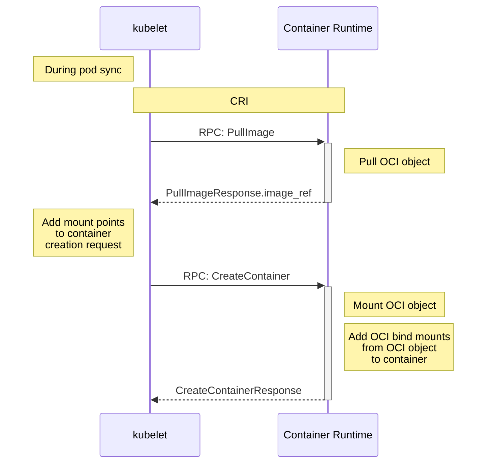

<!--
**Note:** When your KEP is complete, all of these comment blocks should be removed.

To get started with this template:

- [ ] **Pick a hosting SIG.**
  Make sure that the problem space is something the SIG is interested in taking
  up. KEPs should not be checked in without a sponsoring SIG.
- [ ] **Create an issue in kubernetes/enhancements**
  When filing an enhancement tracking issue, please make sure to complete all
  fields in that template. One of the fields asks for a link to the KEP. You
  can leave that blank until this KEP is filed, and then go back to the
  enhancement and add the link.
- [ ] **Make a copy of this template directory.**
  Copy this template into the owning SIG's directory and name it
  `NNNN-short-descriptive-title`, where `NNNN` is the issue number (with no
  leading-zero padding) assigned to your enhancement above.
- [ ] **Fill out as much of the kep.yaml file as you can.**
  At minimum, you should fill in the "Title", "Authors", "Owning-sig",
  "Status", and date-related fields.
- [ ] **Fill out this file as best you can.**
  At minimum, you should fill in the "Summary" and "Motivation" sections.
  These should be easy if you've preflighted the idea of the KEP with the
  appropriate SIG(s).
- [ ] **Create a PR for this KEP.**
  Assign it to people in the SIG who are sponsoring this process.
- [ ] **Merge early and iterate.**
  Avoid getting hung up on specific details and instead aim to get the goals of
  the KEP clarified and merged quickly. The best way to do this is to just
  start with the high-level sections and fill out details incrementally in
  subsequent PRs.

Just because a KEP is merged does not mean it is complete or approved. Any KEP
marked as `provisional` is a working document and subject to change. You can
denote sections that are under active debate as follows:

```
<<[UNRESOLVED optional short context or usernames ]>>
Stuff that is being argued.
<<[/UNRESOLVED]>>
```

When editing KEPS, aim for tightly-scoped, single-topic PRs to keep discussions
focused. If you disagree with what is already in a document, open a new PR
with suggested changes.

One KEP corresponds to one "feature" or "enhancement" for its whole lifecycle.
You do not need a new KEP to move from beta to GA, for example. If
new details emerge that belong in the KEP, edit the KEP. Once a feature has become
"implemented", major changes should get new KEPs.

The canonical place for the latest set of instructions (and the likely source
of this file) is [here](/keps/NNNN-kep-template/README.md).

**Note:** Any PRs to move a KEP to `implementable`, or significant changes once
it is marked `implementable`, must be approved by each of the KEP approvers.
If none of those approvers are still appropriate, then changes to that list
should be approved by the remaining approvers and/or the owning SIG (or
SIG Architecture for cross-cutting KEPs).
-->
# KEP-4639: OCI VolumeSource

<!--
This is the title of your KEP. Keep it short, simple, and descriptive. A good
title can help communicate what the KEP is and should be considered as part of
any review.
-->

<!--
A table of contents is helpful for quickly jumping to sections of a KEP and for
highlighting any additional information provided beyond the standard KEP
template.

Ensure the TOC is wrapped with
  <code>&lt;!-- toc --&rt;&lt;!-- /toc --&rt;</code>
tags, and then generate with `hack/update-toc.sh`.
-->

<!-- toc -->
- [Release Signoff Checklist](#release-signoff-checklist)
- [Summary](#summary)
- [Motivation](#motivation)
  - [Goals](#goals)
  - [Non-Goals](#non-goals)
- [Proposal](#proposal)
  - [User Stories (Optional)](#user-stories-optional)
    - [Story 1](#story-1)
    - [Story 2](#story-2)
    - [Story 3](#story-3)
    - [Story 4](#story-4)
  - [Notes/Constraints/Caveats (Optional)](#notesconstraintscaveats-optional)
  - [Vocabulary: OCI Images, Artifacts, and Objects](#vocabulary-oci-images-artifacts-and-objects)
  - [Risks and Mitigations](#risks-and-mitigations)
- [Design Details](#design-details)
  - [Kubernetes API](#kubernetes-api)
  - [Kubelet and Container Runtime Interface (CRI) support for OCI artifacts](#kubelet-and-container-runtime-interface-cri-support-for-oci-artifacts)
    - [kubelet](#kubelet)
      - [Pull Policy](#pull-policy)
      - [Registry authentication](#registry-authentication)
    - [CRI](#cri)
    - [Container Runtimes](#container-runtimes)
      - [Filesystem representation](#filesystem-representation)
      - [SELinux](#selinux)
  - [Test Plan](#test-plan)
      - [Prerequisite testing updates](#prerequisite-testing-updates)
      - [Unit tests](#unit-tests)
      - [Integration tests](#integration-tests)
      - [e2e tests](#e2e-tests)
  - [Graduation Criteria](#graduation-criteria)
    - [Alpha](#alpha)
    - [Beta](#beta)
    - [GA](#ga)
  - [Upgrade / Downgrade Strategy](#upgrade--downgrade-strategy)
  - [Version Skew Strategy](#version-skew-strategy)
- [Production Readiness Review Questionnaire](#production-readiness-review-questionnaire)
  - [Feature Enablement and Rollback](#feature-enablement-and-rollback)
  - [Rollout, Upgrade and Rollback Planning](#rollout-upgrade-and-rollback-planning)
  - [Monitoring Requirements](#monitoring-requirements)
  - [Dependencies](#dependencies)
  - [Scalability](#scalability)
  - [Troubleshooting](#troubleshooting)
- [Implementation History](#implementation-history)
- [Drawbacks](#drawbacks)
- [Alternatives](#alternatives)
  - [No enhancement](#no-enhancement)
  - [<a href="https://github.com/kubernetes/enhancements/tree/master/keps/sig-storage/1495-volume-populators">KEP 1495: Volume Populators</a>](#kep-1495-volume-populators)
  - [Custom CSI Plugin](#custom-csi-plugin)
  - [Advantages of In-Tree OCI VolumeSource](#advantages-of-in-tree-oci-volumesource)
  - [Conclusion](#conclusion)
<!-- /toc -->

## Release Signoff Checklist

<!--
**ACTION REQUIRED:** In order to merge code into a release, there must be an
issue in [kubernetes/enhancements] referencing this KEP and targeting a release
milestone **before the [Enhancement Freeze](https://git.k8s.io/sig-release/releases)
of the targeted release**.

For enhancements that make changes to code or processes/procedures in core
Kubernetes—i.e., [kubernetes/kubernetes], we require the following Release
Signoff checklist to be completed.

Check these off as they are completed for the Release Team to track. These
checklist items _must_ be updated for the enhancement to be released.
-->

Items marked with (R) are required *prior to targeting to a milestone / release*.

- [x] (R) Enhancement issue in release milestone, which links to KEP dir in [kubernetes/enhancements] (not the initial KEP PR)
- [x] (R) KEP approvers have approved the KEP status as `implementable`
- [x] (R) Design details are appropriately documented
- [x] (R) Test plan is in place, giving consideration to SIG Architecture and SIG Testing input (including test refactors)
  - [ ] e2e Tests for all Beta API Operations (endpoints)
  - [ ] (R) Ensure GA e2e tests meet requirements for [Conformance Tests](https://github.com/kubernetes/community/blob/master/contributors/devel/sig-architecture/conformance-tests.md) 
  - [ ] (R) Minimum Two Week Window for GA e2e tests to prove flake free
- [x] (R) Graduation criteria is in place
  - [x] (R) [all GA Endpoints](https://github.com/kubernetes/community/pull/1806) must be hit by [Conformance Tests](https://github.com/kubernetes/community/blob/master/contributors/devel/sig-architecture/conformance-tests.md) 
- [x] (R) Production readiness review completed
- [x] (R) Production readiness review approved
- [x] "Implementation History" section is up-to-date for milestone
- [x] User-facing documentation has been created in [kubernetes/website], for publication to [kubernetes.io]
- [x] Supporting documentation—e.g., additional design documents, links to mailing list discussions/SIG meetings, relevant PRs/issues, release notes

<!--
**Note:** This checklist is iterative and should be reviewed and updated every time this enhancement is being considered for a milestone.
-->

[kubernetes.io]: https://kubernetes.io/
[kubernetes/enhancements]: https://git.k8s.io/enhancements
[kubernetes/kubernetes]: https://git.k8s.io/kubernetes
[kubernetes/website]: https://git.k8s.io/website

## Summary

The proposed enhancement adds a new `VolumeSource` to Kubernetes that supports OCI images.
This allows users to package files and share them among containers in a pod without including them in the main image,
thereby reducing vulnerabilities and simplifying image creation.

## Motivation

Supporting OCI images directly as a `VolumeSource` allows
Kubernetes to focus on OCI standards as well as allows to store and distribute
any content using OCI registries. This allows the project to grow into use cases
which go beyond running particular images.

### Goals

- Introduce a new `VolumeSource` type that allows mounting OCI images.
- Simplify the process of sharing files among containers in a pod.
- Providing a runtime guideline of how artifact files and directories should be
  mounted.

### Non-Goals

- This proposal does not aim to replace existing `VolumeSource` types.
- This proposal does not address other use cases for OCI objects beyond directory sharing among containers in a pod.
- Mounting thousands of images in a single pod.
- The enhancement leaves single file use case out for now and restrict the mount
  output to directories.
- The runtimes (CRI-O, containerd, others) will have to agree on the
  implementation of how images are manifested as directories. We don't want
  to over-spec on selecting based on media types or other attributes now and can
  consider that for later.
    - We don't want to tie too strongly to how models are hosted on a particular
      provider so we are flexible to adapt to different ways models and their
      configurations are stored.
    - If some file, say a VM format such as a qcow file, is stored as an
      artifact, we don't want the runtime to be the entity responsible for
      interpreting and correctly processing it to its final consumable state.
      That could be delegated to the consumer or perhaps to some hooks and is
      out of scope for alpha.
- Manifest list use cases are left out for now and will be restricted to
  matching architecture like we do today for images. In the future (if there are
  use cases) we will consider support for lists with items separated by
  quantization or format or other attributes. However, that is out of scope for
  now as it is easily worked around by creating a different image/artifact for
  each instance/format/quantization of a model.

## Proposal

We propose to add a new `VolumeSource` that supports OCI images. This `VolumeSource` will allow users to mount an OCI image
directly into a pod, making the files within the image accessible to the containers without the need to include them in the main image and to be able to host them in OCI compatible registries.

### User Stories (Optional)

#### Story 1

As a Kubernetes user, I want to share a configuration file among multiple containers in a pod without including the file in my main image, so that I can
minimize security risks and image size. 

Beside that, I want:
- to package this file in an OCI object to take advantage of OCI distribution.
- the image to be downloaded with the same credentials that kubelet using for other images.
- to be able to use image pull secrets when downloading the image if an image is from the registry that requires image pull secrets.
- to be able to update the configuration if the artifact is referenced by a
  moving tag like `latest`. To achieve that, I just have to restart the pod and
  specify a `pullPolicy` of `Always`.

#### Story 2

As a DevOps engineer, I want to package and distribute binary artifacts using
OCI image and distribution specification standards and mount them directly into
my Kubernetes pods, so that I can streamline my CI/CD pipeline. This allows me to
maintain a small set of base images by attaching the CI/CD artifacts to them.
Beside that, I want to package the artifacts in an OCI object to take advantage
of OCI distribution.

#### Story 3

As a data scientist, MLOps engineer, or AI developer, I want to mount large
language model weights or machine learning model weights in a pod alongside a
model-server, so that I can efficiently serve them without including them in the
model-server container image. I want to package these in an OCI object to take
advantage of OCI distribution and ensure efficient model deployment. This allows
to separate the model specifications/content from the executables that process
them.

#### Story 4

As a security engineer, I want to use a public image for a malware scanner and
mount in a volume of private (commercial) malware signatures, so that I can load
those signatures without baking my own combined image (which might not be
allowed by the copyright on the public image). Those files work regardless of
the OS or version of the scanning software.


### Notes/Constraints/Caveats (Optional)

- This enhancement assumes that the cluster has access to the OCI registry.
- The implementation must handle image pull secrets and other registry authentication mechanisms.
- Performance considerations must be taken into account, especially for large images.

### Vocabulary: OCI Images, Artifacts, and Objects

**OCI Image ([spec](https://github.com/opencontainers/image-spec/blob/main/spec.md)):**
   - A container image that conforms to the Open Container Initiative (OCI) Image Specification.
     It includes a filesystem bundle and metadata required to run a container.
   - Consists of multiple layers (each layer being a tarball), a manifest (which lists the layers), and a config file
     (which provides configuration data such as environment variables, entry points, etc.).
   - **Use Case:** Used primarily for packaging and distributing containerized applications.

**OCI Artifact ([guidance](https://github.com/opencontainers/image-spec/blob/main/artifacts-guidance.md)):**
   - An artifact describes any content that is stored and distributed using the OCI image format.
     It includes not just container images but also other types of content like Helm charts, WASM modules, machine learning models, etc.
   - Artifacts use the same image manifest and layer structure but may contain different types of data
     within those layers. The artifact manifest can have media types that differ from those in standard container images.
   - **Use Case:** Allows the distribution of non-container content using the same infrastructure and tools developed for OCI images.

**OCI Object:**
   - Umbrella term encompassing both OCI images and OCI artifacts. It represents
     any object that conforms to the OCI specifications for storage and
     distribution and can be represented as file or filesystem by an OCI container runtime.

### Risks and Mitigations

- **Security Risks:**:
    - Allowing direct mounting of OCI objects introduces potential attack
      vectors. Mitigation includes thorough security reviews and limiting access
      to trusted registries. Limiting to non-runnable content
      and read-only mode will lessen the security risk.
    - Path traversal attacks are a high risk for introducing security
      vulnerabilities. Container Runtimes should re-use their existing
      implementations to merge layers as well as secure join symbolic links in
      the container storage prevent such issues.
- **Compatibility Risks:** Existing webhooks watching for the images used by the pod using some policies will need to be updated to expect the image to be specified as a `VolumeSource`.
- **Performance Risks:** Large images could impact performance. Mitigation includes optimizations in the implementation and providing
  guidance on best practices for users.

## Design Details

The new `VolumeSource` will be defined in the Kubernetes API, and the implementation will involve updating components (CRI, Kubelet)
to support this source type. Key design aspects include:

- API changes to introduce the new `VolumeSource` type.
- Modifications to the Kubelet to handle mounting OCI images.
- Handling image pull secrets and registry authentication.
- The regular OCI images (that are used to create container rootfs today) can
  be setup similarly as a directory and mounted as a volume source.

### Kubernetes API

The following code snippet illustrates the proposed API change:

```yaml
apiVersion: v1
kind: Pod
metadata:
  name: example-pod
spec:
  volumes:
  - name: oci-volume
    image:
      reference: "example.com/my-image:latest"
      pullPolicy: IfNotPresent
  containers:
  - name: my-container
    image: busybox
    volumeMounts:
    - mountPath: /data
      name: oci-volume
```


This means we extend the [`VolumeSource`](https://github.com/kubernetes/kubernetes/blob/7b359a2f9e1ff5cdc49cfcc4e350e9d796f502c0/staging/src/k8s.io/api/core/v1/types.go#L49)
by:

```go
// Represents the source of a volume to mount.
// Only one of its members may be specified.
type VolumeSource struct {
	// …

	// image …
	Image *ImageVolumeSource `json:"image,omitempty" protobuf:"bytes,30,opt,name=image"
}
```

And add the corresponding `ImageVolumeSource` type:

```go
// ImageVolumeSource represents a image volume resource.
type ImageVolumeSource struct {
	// Required: Image or artifact reference to be used.
	// …
	Reference string `json:"reference" protobuf:"bytes,1,opt,name=reference"`

	// Policy for pulling OCI objects.
	// …
	PullPolicy PullPolicy `json:"pullPolicy,omitempty" protobuf:"bytes,2,opt,name=pullPolicy,casttype=PullPolicy"`
}
```

The same will apply to [`pkg/apis/core/types.VolumeSource`](https://github.com/kubernetes/kubernetes/blob/7b359a2f9e1ff5cdc49cfcc4e350e9d796f502c0/pkg/apis/core/types.go#L58),
which is the internal API compared to the external one from staging. The [API Validation](https://github.com/kubernetes/kubernetes/blob/7b359a2f9e1ff5cdc49cfcc4e350e9d796f502c0/pkg/apis/core/validation/validation.go)
validation will be extended to disallow the `subPath`/`subPathExpr` field as
well as making the `reference` mandatory:

```go
// …

if source.OCI != nil {
	if numVolumes > 0 {
		allErrs = append(allErrs, field.Forbidden(fldPath.Child("oci"), "may not specify more than 1 volume type"))
	} else {
		numVolumes++
		allErrs = append(allErrs, validateImageVolumeSource(source.OCI, fldPath.Child("oci"))...)
	}
}

// …
```

```go
func validateImageVolumeSource(oci *core.ImageVolumeSource, fldPath *field.Path) field.ErrorList {
	allErrs := field.ErrorList{}
	if len(oci.Reference) == 0 {
		allErrs = append(allErrs, field.Required(fldPath.Child("reference"), ""))
	}
	allErrs = append(allErrs, validatePullPolicy(oci.PullPolicy, fldPath.Child("pullPolicy"))...)
	return allErrs
}
```

```go
// …

// Disallow subPath/subPathExpr for image volumes
if v, ok := volumes[mnt.Name]; ok && v.OCI != nil {
	if mnt.SubPath != "" {
		allErrs = append(allErrs, field.Invalid(idxPath.Child("subPath"), mnt.SubPath, "not allowed in image volume sources"))
	}
	if mnt.SubPathExpr != "" {
		allErrs = append(allErrs, field.Invalid(idxPath.Child("subPathExpr"), mnt.SubPathExpr, "not allowed in image volume sources"))
	}
}

// …
```

### Kubelet and Container Runtime Interface (CRI) support for OCI artifacts

Kubelet and the Container Runtime Interface (CRI) currently handle OCI images. To support OCI artifacts,
potential enhancements may be required:

**Extended Media Type Handling in the container runtime:**
   - Update container runtimes to recognize and handle new media types associated with OCI artifacts.
   - Ensure that pulling and storing these artifacts is as efficient and secure as with OCI images.

**Lifecycling and Garbage Collection:**
   - Reuse the existing kubelet logic for managing the lifecycle of OCI objects.
   - Extending the existing image garbage collection to not remove an OCI volume
     image if a pod is still referencing it. 

**Artifact-Specific Configuration:**
   - Introduce new configuration options to handle the unique requirements of different types of OCI artifacts.

**Artifacts as Subject Referrers:**
   - Introduce new refer to image and filter for artifact type criterion/options for to be mounted artifact(s).
   - Certain types of OCI artifacts include a subject reference. That reference
     identifies the artifact/image for which this artifact refers. For example a
     signature artifact could refer to a platform index, for certifying the
     platform images, or to an SBOM artifact that refers to a platform matched
     image. These artifacts may or may not be located on the same
     registry/repository. The new referrers API allows for discovering
     artifacts from a requested repository.
   - How Kubernetes and especially runtimes should support OCI referrers is not
     part of the alpha feature and will be considered in future graduations.

**Validation:**
   - Extend validation and security checks to cover new artifact types.
   - Disallow `subPath`/`subPathExpr` mounting through the API validation

**Storage Optimization in the container runtime:**
   - Develop optimized storage solutions tailored for different artifact types,
     potentially integrating with existing storage solutions or introducing new mechanisms.

#### kubelet

While the container runtime will be responsible of pulling and storing the OCI
objects in the same way as for images, the kubelet still has to manage the full
lifecycle of them. This means that some parts of the existing kubelet code can
be reused, for example:

- The logic how to ensure that an image exists on the node:
  https://github.com/kubernetes/kubernetes/blob/39c6bc3/pkg/kubelet/images/image_manager.go#L102
- The retrieval of available secrets for a pod:
  https://github.com/kubernetes/kubernetes/blob/39c6bc3/pkg/kubelet/kubelet_pods.go#L988

##### Pull Policy

While the `imagePullPolicy` is working on container level, the introduced
`pullPolicy` is a pod level construct. This means that we can support the same
values `IfNotPresent`, `Always` and `Never`, but will only pull once per pod.

Technically it means that we need to pull in [`SyncPod`](https://github.com/kubernetes/kubernetes/blob/b498eb9/pkg/kubelet/kuberuntime/kuberuntime_manager.go#L1049)
for OCI objects on a pod level and not for each container during [`EnsureImageExists`](https://github.com/kubernetes/kubernetes/blob/b498eb9/pkg/kubelet/images/image_manager.go#L102)
before they get started.

If users want to re-pull images when referencing moving tags like `latest`,
then they need to restart / evict the pod.

The [AlwaysPullImages](https://kubernetes.io/docs/reference/access-authn-authz/admission-controllers/#alwayspullimages)
admission plugin needs to respect the pull policy as well and has to set the
field accordingly.

##### Registry authentication

For registry authentication purposes the same logic will be used as for the
container image.

#### CRI

The CRI API is already capable of managing container images [via the `ImageService`](https://github.com/kubernetes/cri-api/blob/3a66d9d/pkg/apis/runtime/v1/api.proto#L146-L161).
Those RPCs will be re-used for the KEP, while the [`Mount`](https://github.com/kubernetes/cri-api/blob/3a66d9d/pkg/apis/runtime/v1/api.proto#L220-L247)
message will be extended to mount an OCI object using the existing [`ImageSpec`](https://github.com/kubernetes/cri-api/blob/3a66d9d/pkg/apis/runtime/v1/api.proto#L798-L813)
on container creation:

```protobuf
// Mount specifies a host volume to mount into a container.
message Mount {
    // …

    // Mount an image reference (image ID, with or without digest), which is a
    // special use case for image volume mounts. If this field is set, then
    // host_path should be unset. All OCI mounts are per feature definition
    // readonly. The kubelet does an PullImage RPC and evaluates the returned
    // PullImageResponse.image_ref value, which is then set to the
    // ImageSpec.image field. Runtimes are expected to mount the image as
    // required.
    // Introduced in the OCI Volume Source KEP: https://kep.k8s.io/4639
    ImageSpec image = 9;
}
```

This allows to re-use the existing kubelet logic for managing the OCI objects,
with the caveat that the new `VolumeSource` won't be isolated in a dedicated
plugin as part of the existing [volume manager](https://github.com/kubernetes/kubernetes/tree/6d0aab2/pkg/kubelet/volumemanager).

Runtimes are already aware of the correct SELinux parameters during container
creation and will re-use them for the OCI object mounts.

The kubelet will use the returned `PullImageResponse.image_ref` on pull and sets
it to `Mount.image.image` together with the other fields for `Mount.image`. The
runtime will then mount the OCI object directly on container creation assuming
it's already present on disk. The runtime also manages the lifecycle of the
mount, for example to remove the OCI bind mount on container removal as well as
the object mount on the `RemoveImage` RPC.

The kubelet tracks the information about which OCI object is used by which
sandbox and therefore manages the lifecycle of them for garbage collection
purposes.

The overall flow for container creation will look like this:



1. **Kubelet Initiates Image Pull**:
   - During pod setup, the kubelet initiates the pull for the OCI object based on the volume source.

2. **Runtime Handles Mounting**:
   - The runtime returns the image reference information to the kubelet.

3. **Redirecting of the Mountpoint**:
   - The kubelet uses the returned image reference to build the container creation request for each container using that mount.
   - The kubelet initiates the container creation and the runtime creates the required OCI object mount as well as bind mounts to the target location.
     This is the current implemented behavior for all other mounts and should require no actual container runtime code change.

4. **Lifecycle Management**:
   - The container runtime manages the lifecycle of the mounts, ensuring they are created during pod setup and cleaned up upon sandbox removal.

5. **Tracking and Coordination**:
   - During image garbage collection, the runtime provides the kubelet with the necessary mount information to ensure proper cleanup.

6. **SELinux Context Handling**:
   - The runtime applies SELinux labels to the volume mounts based on the security context provided by the kubelet, ensuring consistent enforcement of security policies.

7. **Pull Policy Implementation**:
   - The `pullPolicy` at the pod level will determine when the OCI object is pulled, with options for `IfNotPresent`, `Always`, and `Never`.
   - `IfNotPresent`: Prevents redundant pulls and uses existing images when available.
   - `Always`: Ensures the latest images are used, for example, with development and testing environments.
   - `Never`: Ensures only pre-pulled images are used, for example, in air-gapped or controlled environments.

8. **Security and Performance Optimization**:
   - Implement thorough security checks to mitigate risks such as path traversal attacks.
   - Optimize performance for handling large OCI images, including caching strategies and efficient retrieval methods.

#### Container Runtimes

Container runtimes need to support the new `Mount.image` field, otherwise the
feature cannot be used. Pods using the new `VolumeSource` combined with a not
supported container runtime version will fail to run on the node, because the
`Mount.host_path` field is not set for those mounts.

For security reasons, volume mounts should set the [`noexec`] and `ro`
(read-only) options by default.

Note: in the process of mounting images into the container's rootfs, there may need to be intermediate mounts created. This is especially relevant if
the CRI implementation wishes to support one image being mounted with multiple different SELinux labels. If that's done, the CRI implementation is responsible
for cleaning up that additional mount.

##### Filesystem representation

Container Runtimes are expected to manage a `mountpoint`, which is a single
directory containing the unpacked (in case of tarballs) and merged layer files
from the image or artifact. If an OCI artifact has multiple layers (in the same
way as for container images), then the runtime is expected to merge them
together. Duplicate files from distinct layers will be overwritten from the
higher indexed layer.

Runtimes are expected to be able to handle layers as tarballs (like they do for
images right now) as well as plain single files. How the runtimes implement the
expected output and which media types they want to support is deferred to them
for now. Kubernetes only defines the expected output as a single directory
containing the (unpacked) content.

###### Example using ORAS

Assuming the following directory structure:

```console
./
├── dir/
│  └── file
└── file
```

```console
$ cat dir/file
layer0

$ cat file
layer1
```

Then we can manually create two distinct layers by:

```bash
tar cfvz layer0.tar dir
tar cfvz layer1.tar file
```

We also need a `config.json`, ideally indicating the requested architecture:

```bash
jq --null-input '.architecture = "amd64" | .os = "linux"' > config.json
```

Now using [ORAS](https://oras.land) to push the distinct layers:

```bash
oras push --config config.json:application/vnd.oci.image.config.v1+json \
    localhost:5000/image:v1 \
    layer0.tar:application/vnd.oci.image.layer.v1.tar+gzip \
    layer1.tar:application/vnd.oci.image.layer.v1.tar+gzip
```

```console
✓ Uploaded  layer1.tar                                                                                                                               129/129  B 100.00%   73ms
  └─ sha256:0c26e9128651086bd9a417c7f0f3892e3542000e1f1fe509e8fcfb92caec96d5
✓ Uploaded  application/vnd.oci.image.config.v1+json                                                                                                   47/47  B 100.00%  126ms
  └─ sha256:4a2128b14c6c3699084cd60f24f80ae2c822f9bd799b24659f9691cbbfccae6b
✓ Uploaded  layer0.tar                                                                                                                               166/166  B 100.00%  132ms
  └─ sha256:43ceae9994ffc73acbbd123a47172196a52f7d1d118314556bac6c5622ea1304
✓ Uploaded  application/vnd.oci.image.manifest.v1+json                                                                                               752/752  B 100.00%   40ms
  └─ sha256:7728cb2fa5dc31ad8a1d05d4e4259d37c3fc72e1fbdc0e1555901687e34324e9
Pushed [registry] localhost:5000/image:v1
ArtifactType: application/vnd.oci.image.config.v1+json
Digest: sha256:7728cb2fa5dc31ad8a1d05d4e4259d37c3fc72e1fbdc0e1555901687e34324e9
```

The resulting manifest looks like:

```bash
oras manifest fetch localhost:5000/image:v1 | jq .
```

```json
{
  "schemaVersion": 2,
  "mediaType": "application/vnd.oci.image.manifest.v1+json",
  "config": {
    "mediaType": "application/vnd.oci.image.config.v1+json",
    "digest": "sha256:4a2128b14c6c3699084cd60f24f80ae2c822f9bd799b24659f9691cbbfccae6b",
    "size": 47
  },
  "layers": [
    {
      "mediaType": "application/vnd.oci.image.layer.v1.tar+gzip",
      "digest": "sha256:43ceae9994ffc73acbbd123a47172196a52f7d1d118314556bac6c5622ea1304",
      "size": 166,
      "annotations": {
        "org.opencontainers.image.title": "layer0.tar"
      }
    },
    {
      "mediaType": "application/vnd.oci.image.layer.v1.tar+gzip",
      "digest": "sha256:0c26e9128651086bd9a417c7f0f3892e3542000e1f1fe509e8fcfb92caec96d5",
      "size": 129,
      "annotations": {
        "org.opencontainers.image.title": "layer1.tar"
      }
    }
  ],
  "annotations": {
    "org.opencontainers.image.created": "2024-06-14T07:49:06Z"
  }
}
```

ORAS (and other tools) are also able to push multiple files or directories
within a single layer. This should be supported by container runtimes in the
same way.

##### SELinux

Traditionally, the container runtime is responsible of applying SELinux labels
to volume mounts, which are inherited from the `securityContext` of the pod or
container on container creation. The same will apply to OCI volume mounts.

### Test Plan

<!--
**Note:** *Not required until targeted at a release.*
The goal is to ensure that we don't accept enhancements with inadequate testing.

All code is expected to have adequate tests (eventually with coverage
expectations). Please adhere to the [Kubernetes testing guidelines][testing-guidelines]
when drafting this test plan.

[testing-guidelines]: https://git.k8s.io/community/contributors/devel/sig-testing/testing.md
-->

[ ] I/we understand the owners of the involved components may require updates to
existing tests to make this code solid enough prior to committing the changes necessary
to implement this enhancement.

##### Prerequisite testing updates

<!--
Based on reviewers feedback describe what additional tests need to be added prior
implementing this enhancement to ensure the enhancements have also solid foundations.
-->

##### Unit tests

<!--
In principle every added code should have complete unit test coverage, so providing
the exact set of tests will not bring additional value.
However, if complete unit test coverage is not possible, explain the reason of it
together with explanation why this is acceptable.
-->

<!--
Additionally, for Alpha try to enumerate the core package you will be touching
to implement this enhancement and provide the current unit coverage for those
in the form of:
- <package>: <date> - <current test coverage>
The data can be easily read from:
https://testgrid.k8s.io/sig-testing-canaries#ci-kubernetes-coverage-unit

This can inform certain test coverage improvements that we want to do before
extending the production code to implement this enhancement.
-->

- `pkg/kubelet/images`: `2-10-2024` - `83.8`
- `pkg/kubelet/kuberuntime`: `2-10-2024` - `66.6`

##### Integration tests

Integration tests for the kubelet are not existing yet and will be covered by
extending the e2e_node, e2e and unit tests.

##### e2e tests

<!--
This question should be filled when targeting a release.
For Alpha, describe what tests will be added to ensure proper quality of the enhancement.

For Beta and GA, add links to added tests together with links to k8s-triage for those tests:
https://storage.googleapis.com/k8s-triage/index.html

We expect no non-infra related flakes in the last month as a GA graduation criteria.
-->

- [sig-node] ImageVolume [NodeFeature:ImageVolume] should fail if image volume is not existing
- [sig-node] ImageVolume [NodeFeature:ImageVolume] should succeed if image volume is not existing but unused
- [sig-node] ImageVolume [NodeFeature:ImageVolume] should succeed with multiple pods and same image on the same node
- [sig-node] ImageVolume [NodeFeature:ImageVolume] should succeed with pod and multiple volumes
- [sig-node] ImageVolume [NodeFeature:ImageVolume] should succeed with pod and pull policy of Always

https://testgrid.k8s.io/sig-node-cri-o#pr-crio-cgrpv2-imagevolume-e2e

### Graduation Criteria

<!--
**Note:** *Not required until targeted at a release.*

Define graduation milestones.

These may be defined in terms of API maturity, [feature gate] graduations, or as
something else. The KEP should keep this high-level with a focus on what
signals will be looked at to determine graduation.

Consider the following in developing the graduation criteria for this enhancement:
- [Maturity levels (`alpha`, `beta`, `stable`)][maturity-levels]
- [Feature gate][feature gate] lifecycle
- [Deprecation policy][deprecation-policy]

Clearly define what graduation means by either linking to the [API doc
definition](https://kubernetes.io/docs/concepts/overview/kubernetes-api/#api-versioning)
or by redefining what graduation means.

In general we try to use the same stages (alpha, beta, GA), regardless of how the
functionality is accessed.

[feature gate]: https://git.k8s.io/community/contributors/devel/sig-architecture/feature-gates.md
[maturity-levels]: https://git.k8s.io/community/contributors/devel/sig-architecture/api_changes.md#alpha-beta-and-stable-versions
[deprecation-policy]: https://kubernetes.io/docs/reference/using-api/deprecation-policy/

Below are some examples to consider, in addition to the aforementioned [maturity levels][maturity-levels].

#### Alpha

- Feature implemented behind a feature flag
- Initial e2e tests completed and enabled

#### Beta

- Gather feedback from developers and surveys
- Complete features A, B, C
- Additional tests are in Testgrid and linked in KEP

#### GA

- N examples of real-world usage
- N installs
- More rigorous forms of testing—e.g., downgrade tests and scalability tests
- Allowing time for feedback

**Note:** Generally we also wait at least two releases between beta and
GA/stable, because there's no opportunity for user feedback, or even bug reports,
in back-to-back releases.

**For non-optional features moving to GA, the graduation criteria must include
[conformance tests].**

[conformance tests]: https://git.k8s.io/community/contributors/devel/sig-architecture/conformance-tests.md

#### Deprecation

- Announce deprecation and support policy of the existing flag
- Two versions passed since introducing the functionality that deprecates the flag (to address version skew)
- Address feedback on usage/changed behavior, provided on GitHub issues
- Deprecate the flag
-->

#### Alpha

- Initial implementation added
- CRI implementations starting to add support

#### Beta

- Add support for [`subPath`](https://kubernetes.io/docs/concepts/storage/volumes/#using-subpath):
    - By adding a new CRI string `image_sub_path` field to the
      [`Mount`](https://github.com/kubernetes/cri-api/blob/010fdf8/pkg/apis/runtime/v1/api.proto#L221)
      message. Alternatively it would be possible to re-use the existing
      [`Mount.host_path`] field which is empty right now if an image volume is
      being used.
    - If the sub path does not exist in the image, then runtimes should fail and
      return an error.
- Expand unit and e2e tests.
- Add three kubelet metrics for an admin to see the success of their image volumes:
    - `image_volume_requested_total`
    - `image_volume_mounted_success`
    - `image_volume_mounted_error`
- Production support in at least one of CRI-O and containerd, and a release
  candidate is available in the other.
    - However, until both CRI-O and containerd have a released RC with support, this feature will be off by default

#### GA

- Multiple examples of real world uses
- Production support in both CRI-O and containerd
- Allowing time for feedback


### Upgrade / Downgrade Strategy

<!--
If applicable, how will the component be upgraded and downgraded? Make sure
this is in the test plan.

Consider the following in developing an upgrade/downgrade strategy for this
enhancement:
- What changes (in invocations, configurations, API use, etc.) is an existing
  cluster required to make on upgrade, in order to maintain previous behavior?
- What changes (in invocations, configurations, API use, etc.) is an existing
  cluster required to make on upgrade, in order to make use of the enhancement?
-->

kube-apiserver, kubelet and CRI implementation have to support the feature for it to work e2e.
If any of these components downgrades or turns it off, the volume will not be mounted, and the pod creation will fail.
The images that were previously pulled with this feature will be deemed unused by the kubelet's ImageGCManager
and will be garbage collected when the node hits sufficient utilization (or have been unused a certain amount of time
if the ImageGCMaxAge feature is used).

### Version Skew Strategy

<!--
If applicable, how will the component handle version skew with other
components? What are the guarantees? Make sure this is in the test plan.

Consider the following in developing a version skew strategy for this
enhancement:
- Does this enhancement involve coordinating behavior in the control plane and nodes?
- How does an n-3 kubelet or kube-proxy without this feature available behave when this feature is used?
- How does an n-1 kube-controller-manager or kube-scheduler without this feature available behave when this feature is used?
- Will any other components on the node change? For example, changes to CSI,
  CRI or CNI may require updating that component before the kubelet.
-->

Same as above: all the components must have support for it to work.
Specifically, kube-apiserver will filter this field if it doesn't recognize/support it.
If the kubelet doesn't support the field, it will not pull the image, and the path will not be present for the volume manager
to mount it in, and the pod will fail.
if the CRI implementation doesn't support it, then the PullImage request will fail and the pod creation will fail.

If the kubelet does not support the feature because it's too old, then the
container creation will fail because the volume manager is unable to mount the
volume because no volume plugin is available for the provided source.

## Production Readiness Review Questionnaire

<!--

Production readiness reviews are intended to ensure that features merging into
Kubernetes are observable, scalable and supportable; can be safely operated in
production environments, and can be disabled or rolled back in the event they
cause increased failures in production. See more in the PRR KEP at
https://git.k8s.io/enhancements/keps/sig-architecture/1194-prod-readiness.

The production readiness review questionnaire must be completed and approved
for the KEP to move to `implementable` status and be included in the release.

In some cases, the questions below should also have answers in `kep.yaml`. This
is to enable automation to verify the presence of the review, and to reduce review
burden and latency.

The KEP must have a approver from the
[`prod-readiness-approvers`](http://git.k8s.io/enhancements/OWNERS_ALIASES)
team. Please reach out on the
[#prod-readiness](https://kubernetes.slack.com/archives/CPNHUMN74) channel if
you need any help or guidance.
-->

### Feature Enablement and Rollback

<!--
This section must be completed when targeting alpha to a release.
-->

###### How can this feature be enabled / disabled in a live cluster?

<!--
Pick one of these and delete the rest.

Documentation is available on [feature gate lifecycle] and expectations, as
well as the [existing list] of feature gates.

[feature gate lifecycle]: https://git.k8s.io/community/contributors/devel/sig-architecture/feature-gates.md
[existing list]: https://kubernetes.io/docs/reference/command-line-tools-reference/feature-gates/
-->

- [x] Feature gate (also fill in values in `kep.yaml`)
  - Feature gate name: ImageVolume
  - Components depending on the feature gate:
    - kube-apiserver (API validation)
    - kubelet (volume mount)

###### Does enabling the feature change any default behavior?

<!--
Any change of default behavior may be surprising to users or break existing
automations, so be extremely careful here.
-->

Yes, it makes the new `VolumeSource` API functional.

###### Can the feature be disabled once it has been enabled (i.e. can we roll back the enablement)?

<!--
Describe the consequences on existing workloads (e.g., if this is a runtime
feature, can it break the existing applications?).

Feature gates are typically disabled by setting the flag to `false` and
restarting the component. No other changes should be necessary to disable the
feature.

NOTE: Also set `disable-supported` to `true` or `false` in `kep.yaml`.
-->

Yes, by disabling the feature gate. Existing workloads will not be affected by
the change.

To clear old volumes, all workloads using the `VolumeSource` needs to be
recreated after restarting the kubelets. The kube-apiserver does only the API
validation whereas the kubelets serve the implementation. This means means that
a restart of the kubelet as well as the workload would be enough to disable the
feature functionality.

###### What happens if we reenable the feature if it was previously rolled back?

It will make the API functional again. If the feature gets re-enabled only for a
subset of kubelets and a user runs a scalable deployment or daemonset, then the
volume source will be only available for some pod instances.

###### Are there any tests for feature enablement/disablement?

<!--
The e2e framework does not currently support enabling or disabling feature
gates. However, unit tests in each component dealing with managing data, created
with and without the feature, are necessary. At the very least, think about
conversion tests if API types are being modified.

Additionally, for features that are introducing a new API field, unit tests that
are exercising the `switch` of feature gate itself (what happens if I disable a
feature gate after having objects written with the new field) are also critical.
You can take a look at one potential example of such test in:
https://github.com/kubernetes/kubernetes/pull/97058/files#diff-7826f7adbc1996a05ab52e3f5f02429e94b68ce6bce0dc534d1be636154fded3R246-R282
-->

Yes, unit tests for the alpha release for each component. End-to-end (serial
node) tests will be targeted for beta.

### Rollout, Upgrade and Rollback Planning

<!--
This section must be completed when targeting beta to a release.
-->

###### How can a rollout or rollback fail? Can it impact already running workloads?

<!--
Try to be as paranoid as possible - e.g., what if some components will restart
mid-rollout?

Be sure to consider highly-available clusters, where, for example,
feature flags will be enabled on some API servers and not others during the
rollout. Similarly, consider large clusters and how enablement/disablement
will rollout across nodes.
-->

kube-apiserver must support it, and every node that has a pod scheduled that
attempts to mount image volumes must have a kubelet and CRI that support it.
If any don't, the volume won't be enabled and containers will not start. If the
kubelet does not support it but will be upgraded, then the container will become
available after the upgrade.

Since this field only applies on a per node basis, once the control plane agrees
on the feature gates, any kubelet with the feature on will have access to it,
not needing to wait for other workers.

###### What specific metrics should inform a rollback?

A sharp increase in high `kubelet_image_pull_duration_seconds_bucket`, potentially showing registry unavailability or delays.

###### Were upgrade and rollback tested? Was the upgrade->downgrade->upgrade path tested?

<!--
Describe manual testing that was done and the outcomes.
Longer term, we may want to require automated upgrade/rollback tests, but we
are missing a bunch of machinery and tooling and can't do that now.
-->

Not yet but they will be.

###### Is the rollout accompanied by any deprecations and/or removals of features, APIs, fields of API types, flags, etc.?

<!--
Even if applying deprecation policies, they may still surprise some users.
-->

N/A

### Monitoring Requirements

<!--
This section must be completed when targeting beta to a release.

For GA, this section is required: approvers should be able to confirm the
previous answers based on experience in the field.
-->

###### How can an operator determine if the feature is in use by workloads?

<!--
Ideally, this should be a metric. Operations against the Kubernetes API (e.g.,
checking if there are objects with field X set) may be a last resort. Avoid
logs or events for this purpose.
-->

There was not any metric added for alpha.
For beta, three metrics can be added to report the state of image volume:
- total image volumes requested
- successful image mounts
- failed image mounts

###### How can someone using this feature know that it is working for their instance?

<!--
For instance, if this is a pod-related feature, it should be possible to determine if the feature is functioning properly
for each individual pod.
Pick one more of these and delete the rest.
Please describe all items visible to end users below with sufficient detail so that they can verify correct enablement
and operation of this feature.
Recall that end users cannot usually observe component logs or access metrics.
-->

- [x] Metrics: The added metrics `image_volume_requested_total` `image_volume_mounted_success` `image_volume_mounted_error`
  will signal to an admin that this feature is working or not.

###### What are the reasonable SLOs (Service Level Objectives) for the enhancement?

<!--
This is your opportunity to define what "normal" quality of service looks like
for a feature.

It's impossible to provide comprehensive guidance, but at the very
high level (needs more precise definitions) those may be things like:
  - per-day percentage of API calls finishing with 5XX errors <= 1%
  - 99% percentile over day of absolute value from (job creation time minus expected
    job creation time) for cron job <= 10%
  - 99.9% of /health requests per day finish with 200 code

These goals will help you determine what you need to measure (SLIs) in the next
question.
-->

###### What are the SLIs (Service Level Indicators) an operator can use to determine the health of the service?

<!--
Pick one more of these and delete the rest.
-->

- [x] Metrics
  - Metric name: `kubelet_image_pull_duration_seconds_bucket`
  - Components exposing the metric: kubelet
- [x] Metrics
  - Metric name: `pod_start_sli_duration_seconds`
  - Components exposing the metric: kubelet
- [ ] Other (treat as last resort)
  - Details:

Note: the pod's start SLI may be affected if the image that is being pulled is large. An accurate comparison in pod start time is
if the contents of the image mount are stored in the container's image, rather than present on a different volume type, as the
cost of pulling from a registry needs to be controlled for.

###### Are there any missing metrics that would be useful to have to improve observability of this feature?

<!--
Describe the metrics themselves and the reasons why they weren't added (e.g., cost,
implementation difficulties, etc.).
-->

A metric to show volume type so admins could find when their image volumes were requested
as well as a success/error metric for showing that volumes did or did not get mounted
These will be added in beta.

### Dependencies

<!--
This section must be completed when targeting beta to a release.
-->

###### Does this feature depend on any specific services running in the cluster?

<!--
Think about both cluster-level services (e.g. metrics-server) as well
as node-level agents (e.g. specific version of CRI). Focus on external or
optional services that are needed. For example, if this feature depends on
a cloud provider API, or upon an external software-defined storage or network
control plane.

For each of these, fill in the following—thinking about running existing user workloads
and creating new ones, as well as about cluster-level services (e.g. DNS):
  - [Dependency name]
    - Usage description:
      - Impact of its outage on the feature:
      - Impact of its degraded performance or high-error rates on the feature:
-->

A CRI implementation with support, and an available registry that has the requested image.

### Scalability

<!--
For alpha, this section is encouraged: reviewers should consider these questions
and attempt to answer them.

For beta, this section is required: reviewers must answer these questions.

For GA, this section is required: approvers should be able to confirm the
previous answers based on experience in the field.
-->

###### Will enabling / using this feature result in any new API calls?

<!--
Describe them, providing:
  - API call type (e.g. PATCH pods)
  - estimated throughput
  - originating component(s) (e.g. Kubelet, Feature-X-controller)
Focusing mostly on:
  - components listing and/or watching resources they didn't before
  - API calls that may be triggered by changes of some Kubernetes resources
    (e.g. update of object X triggers new updates of object Y)
  - periodic API calls to reconcile state (e.g. periodic fetching state,
    heartbeats, leader election, etc.)
-->

No new API calls, but yes new image pulls from an OCI registry.

###### Will enabling / using this feature result in introducing new API types?

<!--
Describe them, providing:
  - API type
  - Supported number of objects per cluster
  - Supported number of objects per namespace (for namespace-scoped objects)
-->

No.

###### Will enabling / using this feature result in any new calls to the cloud provider?

<!--
Describe them, providing:
  - Which API(s):
  - Estimated increase:
-->

Potentially for credential plugins to give node image pull credentials, but it doesn't need to.

###### Will enabling / using this feature result in increasing size or count of the existing API objects?

<!--
Describe them, providing:
  - API type(s):
  - Estimated increase in size: (e.g., new annotation of size 32B)
  - Estimated amount of new objects: (e.g., new Object X for every existing Pod)
-->

A new type of volume in the pods, which will have the same size as other volume types.

###### Will enabling / using this feature result in increasing time taken by any operations covered by existing SLIs/SLOs?

<!--
Look at the [existing SLIs/SLOs].

Think about adding additional work or introducing new steps in between
(e.g. need to do X to start a container), etc. Please describe the details.

[existing SLIs/SLOs]: https://git.k8s.io/community/sig-scalability/slos/slos.md#kubernetes-slisslos
-->

Not technically because there is no defined SLI

###### Will enabling / using this feature result in non-negligible increase of resource usage (CPU, RAM, disk, IO, ...) in any components?

<!--
Things to keep in mind include: additional in-memory state, additional
non-trivial computations, excessive access to disks (including increased log
volume), significant amount of data sent and/or received over network, etc.
This through this both in small and large cases, again with respect to the
[supported limits].

[supported limits]: https://git.k8s.io/community//sig-scalability/configs-and-limits/thresholds.md
-->

CPU/Memory/Disk will be used when pulling an image volume, proportional to the
size of the image. An image could be pulled using a constant sized memory
buffer depending on the runtime implementation.

###### Can enabling / using this feature result in resource exhaustion of some node resources (PIDs, sockets, inodes, etc.)?

<!--
Focus not just on happy cases, but primarily on more pathological cases
(e.g. probes taking a minute instead of milliseconds, failed pods consuming resources, etc.).
If any of the resources can be exhausted, how this is mitigated with the existing limits
(e.g. pods per node) or new limits added by this KEP?

Are there any tests that were run/should be run to understand performance characteristics better
and validate the declared limits?
-->

Yes, in the same way a large image used to run a container could use these resources (so no additional risk).

### Troubleshooting

<!--
This section must be completed when targeting beta to a release.

For GA, this section is required: approvers should be able to confirm the
previous answers based on experience in the field.

The Troubleshooting section currently serves the `Playbook` role. We may consider
splitting it into a dedicated `Playbook` document (potentially with some monitoring
details). For now, we leave it here.
-->

###### How does this feature react if the API server and/or etcd is unavailable?

Pods won't be able to be created, so the feature won't be accessible.

###### What are other known failure modes?

<!--
For each of them, fill in the following information by copying the below template:
  - [Failure mode brief description]
    - Detection: How can it be detected via metrics? Stated another way:
      how can an operator troubleshoot without logging into a master or worker node?
    - Mitigations: What can be done to stop the bleeding, especially for already
      running user workloads?
    - Diagnostics: What are the useful log messages and their required logging
      levels that could help debug the issue?
      Not required until feature graduated to beta.
    - Testing: Are there any tests for failure mode? If not, describe why.
-->

Registry unavailability
- They can be found in the pod's events and look like image pull failures
- No tests at the time of writing

###### What steps should be taken if SLOs are not being met to determine the problem?

At the time of writing, check the pod events. If metrics are added for image pull issues, then checking those would help as well.

## Implementation History

<!--
Major milestones in the lifecycle of a KEP should be tracked in this section.
Major milestones might include:
- the `Summary` and `Motivation` sections being merged, signaling SIG acceptance
- the `Proposal` section being merged, signaling agreement on a proposed design
- the date implementation started
- the first Kubernetes release where an initial version of the KEP was available
- the version of Kubernetes where the KEP graduated to general availability
- when the KEP was retired or superseded
-->

- 16-05-2024 Issue opened 
- 21-06-2024 KEP merged, targeted at alpha
- 2-10-2024 KEP updated


## Drawbacks

<!--
Why should this KEP _not_ be implemented?
-->

## Alternatives

### No enhancement

Currently, a shared volume approach can be used. This involves packaging file to share in an image that includes a shell in its base layer.
An init container can be used to copy files from an image to a shared volume using shell commands. This volume can be made accessible to all
containers in the pod.

An OCI VolumeSource eliminates the need for a shell and an init container by allowing the direct mounting of OCI objects as volumes,
making it easier to modularize. For example, in the case of LLMs and model-servers, it is useful to package them in separate images,
so various models can plug into the same model-server image. An OCI VolumeSource not only simplifies file copying but also allows
container native distribution, authentication, and version control for files.

### [KEP 1495: Volume Populators](https://github.com/kubernetes/enhancements/tree/master/keps/sig-storage/1495-volume-populators)

The volume-populators API extension allows you to populate a volume with data from an external data source when the volume is created.
This is a good solution for restoring a volume from a snapshot or initializing a volume with data from a database backup. However, it does not
address the desire to use OCI distribution, versioning, and signing for mounted data.

The proposed in-tree OCI VolumeSource provides a direct and integrated approach to mount OCI artifacts, leveraging the existing OCI
infrastructure for packaging, distribution, and security.

### Custom CSI Plugin

See [https://github.com/warm-metal/container-image-csi-driver](https://github.com/warm-metal/container-image-csi-driver)

An out-of-tree CSI plugin can provide flexibility and modularity, but there are trade-offs to consider:

 - Complexity of managing an external CSI plugin. This includes handling the installation, configuration, and updates of the CSI driver, which adds
   an additional operational burden. For a generic, vendor-agnostic, and widely-adopted solution this would not make sense.
 - Supporting the image pull secrets as well as credentials provider will be tricky and needs to be reimplemented with the separate API calls.
 - External CSI plugins implement their own lifecycle management and garbage collection mechanisms,
   yet these already exist in-tree for OCI images.
    - The kubelet has max parallel image pull constant to maintain the reasonable
      load on a disk and network. This will not be respected by CSI driver and
      the only point of integration may be if we move this constant down to
      runtime.
    - The kubelet has GC logic that is not cleaning up images immediately in
      case they will be reused. Also GC logic has it's own thresholds and
      behavior on eviction. It will be nice to have those integrated.
    - The kubelet exposes metrics on image pulls and we have KEP in place to
      improve it even further. Having CSI exposing those metrics will require
      customer to integrate with one more source of data.
 - Performance: There is additional overhead with an out-of-tree CSI plugin, especially in scenarios requiring frequent image pulls
   or large volumes of data.

### Advantages of In-Tree OCI VolumeSource

1. **Leverage Existing Mechanisms:**
   - **No New Data Types or Objects:** OCI images are already a core part of the Kubernetes ecosystem. Extending support for OCI artifacts, many of
     the same mechanisms will be reused. This ensures consistency and reduces complexity, as both adhere to the same OCI image format.
   - **Existing Lifecycle Management and Garbage Collection:** Kubernetes has efficient lifecycle management and garbage collection mechanisms for
	 volumes and container images. The in-tree OCI VolumeSource will utilize these existing mechanisms.

2. **Integration with Kubernetes:**
   - **Optimal Performance:** Deep integration with the scheduler and kubelet ensures optimal performance and
     resource management. This integration allows the OCI VolumeSource to benefit from all existing optimizations and features.
   - **Unified Interface:** Users interact with a consistent and unified interface for managing volumes, reducing the learning curve and
     potential for configuration errors.

3. **Simplified Maintenance and Updates:**
   - **Core Project Maintenance:** In-tree features are maintained and updated as part of the core project. It makes sense
     for widely-used and vendor agnostic features to utilize the core testing infrastructure, release cycles, and security updates.

### Conclusion

The in-tree implementation of an OCI VolumeSource offers significant advantages by leveraging existing core mechanisms,
ensuring deep integration, and simplifying management. This approach avoids the complexity, duplication, and other potential inefficiencies
of out-of-tree CSI plugins, providing a more reliable solution for mounting OCI images.
