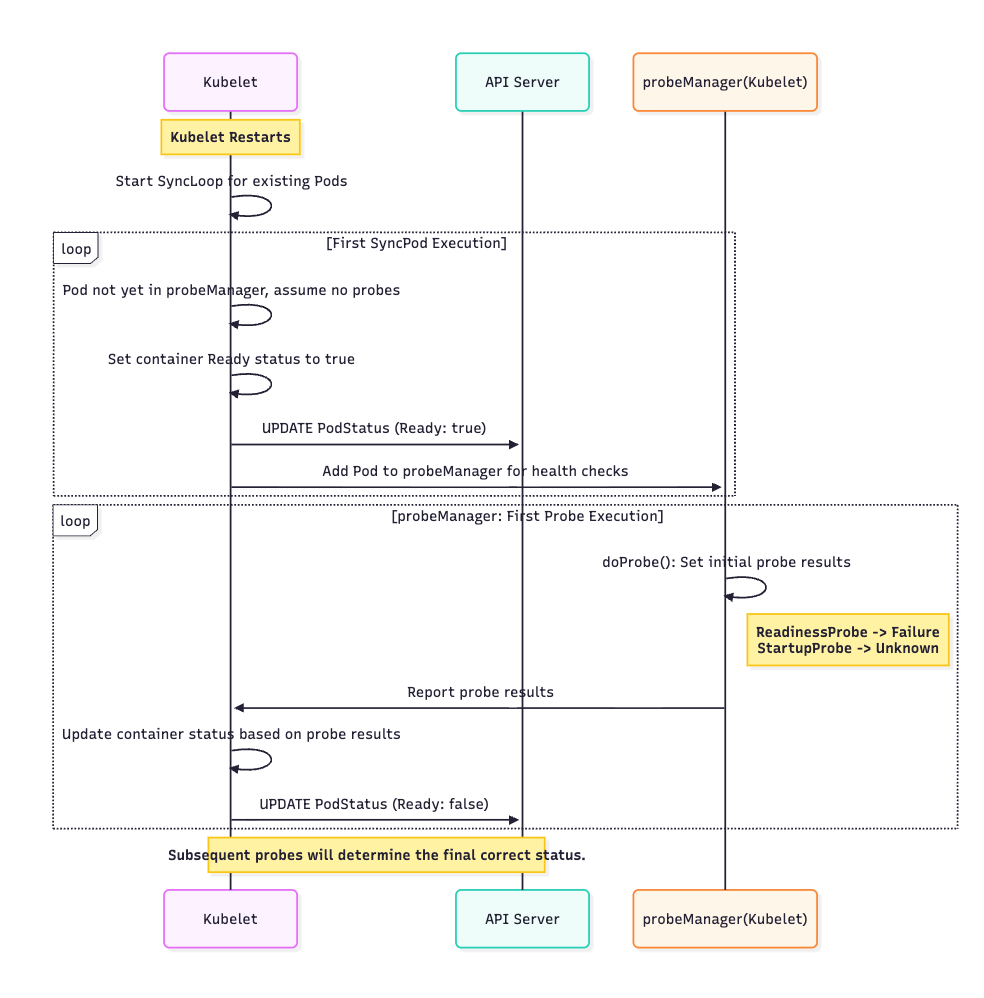
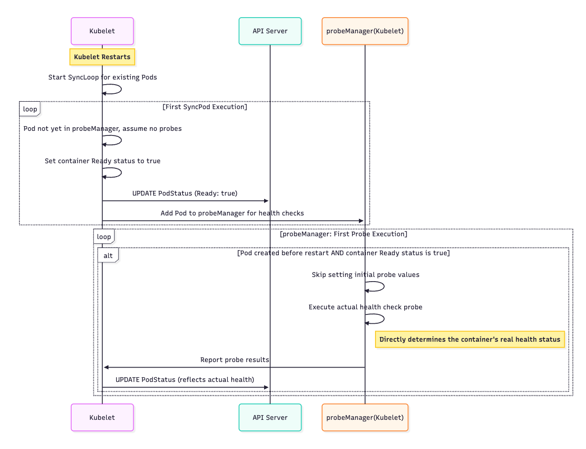
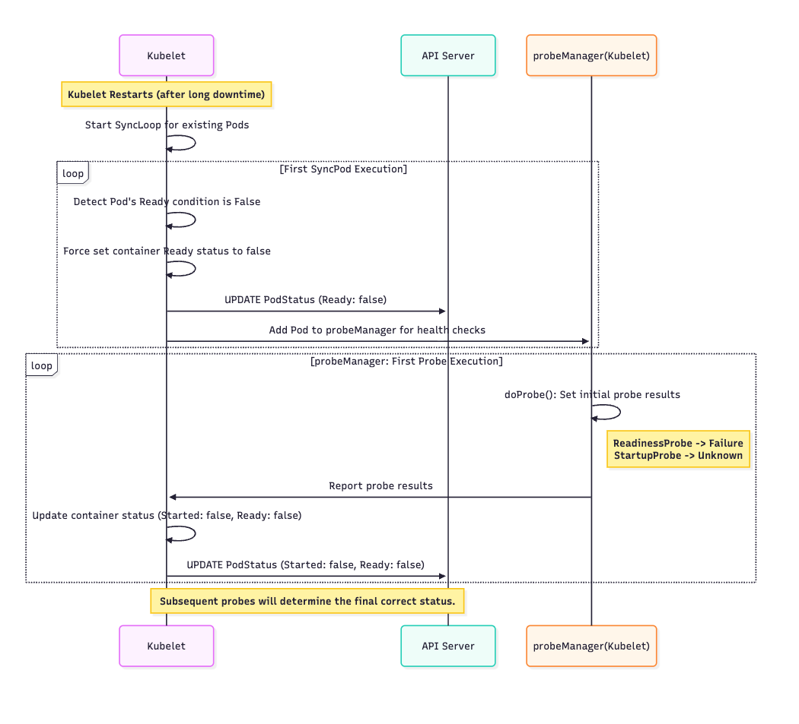

# KEP-4781: Restarting kubelet does not change pod status

<!-- toc -->
- [Release Signoff Checklist](#release-signoff-checklist)
- [Summary](#summary)
- [Motivation](#motivation)
  - [Goals](#goals)
  - [Non-Goals](#non-goals)
- [Proposal](#proposal)
  - [User Stories (Optional)](#user-stories-optional)
    - [Story 1](#story-1)
  - [Risks and Mitigations](#risks-and-mitigations)
      - [Inconsistency with other Kubernetes components](#inconsistency-with-other-kubernetes-components)
      - [Delayed Health Check Updates](#delayed-health-check-updates)
- [Design Details](#design-details)
  - [Test Plan](#test-plan)
      - [Prerequisite testing updates](#prerequisite-testing-updates)
      - [Unit tests](#unit-tests)
      - [Integration tests](#integration-tests)
      - [e2e tests](#e2e-tests)
  - [Graduation Criteria](#graduation-criteria)
    - [deprecated](#deprecated)
    - [GA](#ga)
  - [Upgrade / Downgrade Strategy](#upgrade--downgrade-strategy)
  - [Version Skew Strategy](#version-skew-strategy)
- [Production Readiness Review Questionnaire](#production-readiness-review-questionnaire)
  - [Feature Enablement and Rollback](#feature-enablement-and-rollback)
  - [Rollout, Upgrade and Rollback Planning](#rollout-upgrade-and-rollback-planning)
  - [Monitoring Requirements](#monitoring-requirements)
  - [Dependencies](#dependencies)
  - [Scalability](#scalability)
  - [Troubleshooting](#troubleshooting)
- [Implementation History](#implementation-history)
- [Drawbacks](#drawbacks)
- [Alternatives](#alternatives)
- [Infrastructure Needed (Optional)](#infrastructure-needed-optional)
<!-- /toc -->

## Release Signoff Checklist

Items marked with (R) are required *prior to targeting to a milestone / release*.

- [ ] (R) Enhancement issue in release milestone, which links to KEP dir in [kubernetes/enhancements] (not the initial KEP PR)
- [ ] (R) KEP approvers have approved the KEP status as `implementable`
- [ ] (R) Design details are appropriately documented
- [ ] (R) Test plan is in place, giving consideration to SIG Architecture and SIG Testing input (including test refactors)
  - [ ] e2e Tests for all Beta API Operations (endpoints)
  - [ ] (R) Ensure GA e2e tests meet requirements for [Conformance Tests](https://github.com/kubernetes/community/blob/master/contributors/devel/sig-architecture/conformance-tests.md) 
  - [ ] (R) Minimum Two Week Window for GA e2e tests to prove flake free
- [ ] (R) Graduation criteria is in place
  - [ ] (R) [all GA Endpoints](https://github.com/kubernetes/community/pull/1806) must be hit by [Conformance Tests](https://github.com/kubernetes/community/blob/master/contributors/devel/sig-architecture/conformance-tests.md) 
- [ ] (R) Production readiness review completed
- [ ] (R) Production readiness review approved
- [ ] "Implementation History" section is up-to-date for milestone
- [ ] User-facing documentation has been created in [kubernetes/website], for publication to [kubernetes.io]
- [ ] Supporting documentation—e.g., additional design documents, links to mailing list discussions/SIG meetings, relevant PRs/issues, release notes

<!--
**Note:** This checklist is iterative and should be reviewed and updated every time this enhancement is being considered for a milestone.
-->

[kubernetes.io]: https://kubernetes.io/
[kubernetes/enhancements]: https://git.k8s.io/enhancements
[kubernetes/kubernetes]: https://git.k8s.io/kubernetes
[kubernetes/website]: https://git.k8s.io/website

## Summary

When a kubelet restarts, for whatever reason, it usually will not have any impact on currently running pods. Today, however, a kubelet restart causes all pods on that node to have their Started and Ready statuses set to False (by the kubelet), which can disrupt services that were actually functioning normally. This KEP proposes improving Pod readiness management in the kubelet to ensure that the status of Pods is not unilaterally modified, and is instead preserved during kubelet restarts.

## Motivation

Ensuring high availability and minimizing service disruptions are critical considerations for Kubernetes clusters. 
When the kubelet restarts, it resets the Start and Ready states of all containers to False by default. This means that any successful probe statuses that were previously established are lost upon the restart. As a result, services may be inaccurately flagged as unavailable, despite having been operational prior to the kubelet's restart. This reset can lead to erroneous perceptions of service health and negatively impact the overall performance of the cluster, potentially triggering unnecessary alerts or load balancing changes. 

Some users have reported that this issue has been causing them trouble. Here are some links to historical discussions related to this problem: https://github.com/kubernetes/kubernetes/issues/100277, https://github.com/kubernetes/kubernetes/issues/100277#issuecomment-1179412974, https://github.com/kubernetes/kubernetes/issues/102367 

It's essential to implement strategies to ensure that the service states accurately reflect their operational status, even during kubelet interruptions.

### Goals

- Ensure consistency in container start and ready states across kubelet restarts.
- Minimize unnecessary service disruptions caused by temporary ready state changes.

### Non-Goals

- If the kubelet fails to renew its lease beyond the nodeMonitorGracePeriod due to an excessively long restart interval, the Ready status of the containers in the pods on the node will be set to false. In this situation, we should not manually set the Ready status back to true. Instead, it should remain false, waiting for the probe to execute again and restore it.
- Modify the fundamental logic of how readiness probes work.

## Proposal

### User Stories (Optional)

<!--
Detail the things that people will be able to do if this KEP is implemented.
Include as much detail as possible so that people can understand the "how" of
the system. The goal here is to make this feel real for users without getting
bogged down.
-->

#### Story 1
As a user of Kubernetes, I want the container's Ready state to remain consistent across kubelet restarts so that my services do not experience unnecessary downtime.
However, currently, a kubelet restart causes a brief "Not Ready" storm, where the state of all Pods is set to Not Ready, impacting the availability of my services.

### Risks and Mitigations

##### Inconsistency with other Kubernetes components
If other parts of Kubernetes (e.g., the API server, controllers) expect certain behavior regarding container readiness states, these changes might cause inconsistencies.

##### Delayed Health Check Updates
By preserving the old state without immediate health checks, there is a delay in recognizing containers that have become unhealthy during or after kubelet's downtime. Services relying on Pod readiness for service discovery might continue directing traffic to Pods with containers that are no longer healthy but are still reported as Ready.

## Design Details

We will be adding a deprecated feature gate: `ChangeContainerStatusOnKubeletRestart`. This feature gate will be disabled by default. When disabled, the Kubelet will not change container statuses after a restart. Users can enable the `ChangeContainerStatusOnKubeletRestart` feature gate to restore the behavior where the Kubelet changes container statuses after a restart.

Regarding this feature gate, the changes we will make in the kubelet codebase are as follows:

  * We will retrieve the `Started` field from the container status in the Pod via the API server. After the Kubelet restarts, during the first entry into `SyncPod`, we will propagate this value to the newly generated container status.

  * We ensure that if the `Started` field in the container status is true, the container is considered started (since the startupProbe only runs during container startup and will not execute again once completed).

  * If the Kubelet restart occurs within the `nodeMonitorGracePeriod` and the Pod’s Ready condition is set to false, we will set the container’s ready status to false. It will remain in this state until subsequent probes reset it to true.

  * We will modify the logic in the `doProbe` function. When it detects a container that was already running before the Kubelet restarted (for the first time after restart), it will skip marking an initial Failure status. This allows the probe `result` to retain the default `Success` status. If the container’s state changes during the Kubelet restart period and causes the probe to return an abnormal result, the status will be updated to a non-Success state in the next probe cycle. Subsequent syncPod operations will then set the container’s Ready status to false.

**Before the Changes:**
If kubelet restarts, the pod status transition process is as follows:

1. Kubelet uses `SyncPod` to reconcile the pod state. During the first execution of `SyncPod`, the pod has not yet been added to the `probeManager`. At this point, `SyncPod` assumes the pod has no probes configured (note: if it is a newly created pod, the first execution of `SyncPod` does not go through this step). Therefore, it sets the container's `Ready` status to true and updates it to the APIserver.

2. After updating the container status, `SyncPod` adds the pod to the `probeManager`. The pod then begins executing probes.

3. During the first execution of `doProbe`(It will skip the `initialDelaySeconds` period because the container's startup time exceeds the `initialDelaySeconds` period), `doProbe` sets the result of all probes to their `initialValue`. The `initialValue` for `readinessProbe` is `Failure`, and for `startupProbe` it is `Unknown`. Based on the probe results, it updates the `Started` and `Ready` fields of the container status in the APIserver to false.

The sequence diagram for this process is as follows:

**After the Changes:**  
**Scenario 1:**
After the changes, if kubelet restarts, the pod status transition process is as follows:

* (The first two steps are the same as before the changes and are omitted here.)
1. During the first execution of `doProbe`(It will skip the `initialDelaySeconds` period because the container's startup time exceeds the `initialDelaySeconds` period), If the pod's creation time precedes the kubelet's start time by more than 10 seconds (a tolerance for clock skew), and the container's readiness state is true. `doProbe` skips the step of setting all probe results to their `initialValue` and proceeds with subsequent probe steps. This ensures that kubelet can immediately probe whether the container is still functioning properly after restarting, avoiding a situation where the container becomes unhealthy during kubelet restart but kubelet fails to update the container's `Ready` fields to false in a timely manner.

The sequence diagram for this process is as follows:

**Scenario 2:**
After the change, if the kubelet is restarted for a sufficiently long time (exceeding the `nodeMonitorGracePeriod`), causing the pod's `Ready condition` to be set to false:

1. `Kubelet` uses `SyncPod` to reconcile the pod state. During the first execution of `SyncPod`, if kubelet detects that the pod's `Ready condition` is false, it directly sets the container's `Ready` fields to `false` and updates it to the APIserver.

2. After updating the container status, `SyncPod` adds the pod to the `probeManager`. The pod then begins executing probes.

3. The logic here is the same as in Scenario 1. Since the container's `Ready` fields is false, doProbe sets the result of all probes to their `initialValue` and updates the `Started` and `Ready` fields of the container status in the API server to false based on the probe results. Subsequent executions of `doProbe` will then transition the pod status to the desired state.

The sequence diagram for this process is as follows:

### Test Plan

[ ] I/we understand the owners of the involved components may require updates to
existing tests to make this code solid enough prior to committing the changes necessary
to implement this enhancement.

##### Prerequisite testing updates

##### Unit tests

- `pkg/kubelet/prober`: `2025-08-25` - `77.4%`
- `k8s.io/kubernetes/pkg/kubelet`: `2025-08-25` - `71.2%`

##### Integration tests

- <test>: <link to test coverage>

##### e2e tests

* Add an e2e test case to verify that restarting kubelet does not affect pod status when the pod has no probes.
* Add an e2e test case to verify that restarting kubelet does not affect pod status when the pod has a `startupProbe`.
* Add an e2e test case to verify that restarting kubelet does not affect pod status when the pod has a `readinessProbe`.
* Add an e2e test case to verify that restarting kubelet does not affect pod status when the pod has both `startupProbe` and `readinessProbe`.

### Graduation Criteria

#### deprecated

Implement the code and add the `ChangeContainerStatusOnKubeletRestart` feature gate.
Add e2e tests to ensure the functionality meets expectations.

#### GA

During the Deprecated phase, no issues were reported by users.

### Upgrade / Downgrade Strategy

### Version Skew Strategy

N/A

## Production Readiness Review Questionnaire

### Feature Enablement and Rollback

###### How can this feature be enabled / disabled in a live cluster?

- [ ] Feature gate (also fill in values in `kep.yaml`)
  - Feature gate name: `ChangeContainerStatusOnKubeletRestart`
  - Components depending on the feature gate: `kubelet`

###### Does enabling the feature change any default behavior?

<!--
Any change of default behavior may be surprising to users or break existing
automations, so be extremely careful here.
-->
Yes, currently, when a kubelet restarts, the state of Pods and containers are reported as Not Ready. This feature changes the behavior to inherit the last state of Pods and containers, thus avoiding service inconsistencies, but may introduce delayed updates to the Not Ready state.

###### Can the feature be disabled once it has been enabled (i.e. can we roll back the enablement)?

Yes. By setting the feature gate to false and restarting the kubelet, the cluster will revert to the previous default behavior. This rollback is safe since the feature does not involve storage modifications to API objects.

###### What happens if we reenable the feature if it was previously rolled back?

If the feature is re-enabled, the kubelet will once again adopt the new behavior of preserving pod status during restarts. Re-enabling the feature will not cause side effects, as it is stateless and only affects the kubelet's startup logic.

###### Are there any tests for feature enablement/disablement?

### Rollout, Upgrade and Rollback Planning

###### How can a rollout or rollback fail? Can it impact already running workloads?

Rolling back (disabling the feature gate) is inherently safe as it simply restores kubelet' long-standing default behavior. 
The likelihood of failure is extremely low, as both deployment and rollback only require a kubelet restart. 
Running pods (workloads) will not be restarted. The purpose of deployment is to minimize impact on workloads, while rollback restores the current "impactful yet predictable" state.

###### What specific metrics should inform a rollback?

N/A

###### Were upgrade and rollback tested? Was the upgrade->downgrade->upgrade path tested?

N/A

###### Is the rollout accompanied by any deprecations and/or removals of features, APIs, fields of API types, flags, etc.?

N/A

### Monitoring Requirements

<!--
This section must be completed when targeting beta to a release.

For GA, this section is required: approvers should be able to confirm the
previous answers based on experience in the field.
-->

###### How can an operator determine if the feature is in use by workloads?

<!--
Ideally, this should be a metric. Operations against the Kubernetes API (e.g.,
checking if there are objects with field X set) may be a last resort. Avoid
logs or events for this purpose.
-->

###### How can someone using this feature know that it is working for their instance?

<!--
For instance, if this is a pod-related feature, it should be possible to determine if the feature is functioning properly
for each individual pod.
Pick one more of these and delete the rest.
Please describe all items visible to end users below with sufficient detail so that they can verify correct enablement
and operation of this feature.
Recall that end users cannot usually observe component logs or access metrics.
-->

- [ ] Events
  - Event Reason: 
- [ ] API .status
  - Condition name: 
  - Other field: 
- [ ] Other (treat as last resort)
  - Details:

###### What are the reasonable SLOs (Service Level Objectives) for the enhancement?

<!--
This is your opportunity to define what "normal" quality of service looks like
for a feature.

It's impossible to provide comprehensive guidance, but at the very
high level (needs more precise definitions) those may be things like:
  - per-day percentage of API calls finishing with 5XX errors <= 1%
  - 99% percentile over day of absolute value from (job creation time minus expected
    job creation time) for cron job <= 10%
  - 99.9% of /health requests per day finish with 200 code

These goals will help you determine what you need to measure (SLIs) in the next
question.
-->

###### What are the SLIs (Service Level Indicators) an operator can use to determine the health of the service?

<!--
Pick one more of these and delete the rest.
-->

- [ ] Metrics
  - Metric name:
  - [Optional] Aggregation method:
  - Components exposing the metric:
- [ ] Other (treat as last resort)
  - Details:

###### Are there any missing metrics that would be useful to have to improve observability of this feature?

### Dependencies

###### Does this feature depend on any specific services running in the cluster?

No

### Scalability

###### Will enabling / using this feature result in any new API calls?

No

###### Will enabling / using this feature result in introducing new API types?

No

###### Will enabling / using this feature result in any new calls to the cloud provider?

No

###### Will enabling / using this feature result in increasing size or count of the existing API objects?

No

###### Will enabling / using this feature result in increasing time taken by any operations covered by existing SLIs/SLOs?

No

###### Will enabling / using this feature result in non-negligible increase of resource usage (CPU, RAM, disk, IO, ...) in any components?

No

###### Can enabling / using this feature result in resource exhaustion of some node resources (PIDs, sockets, inodes, etc.)?

No

### Troubleshooting

###### How does this feature react if the API server and/or etcd is unavailable?

###### What are other known failure modes?

###### What steps should be taken if SLOs are not being met to determine the problem?

## Implementation History

## Drawbacks

If a container becomes unhealthy during the kubelet restart, the kubelet may still report a Ready status until the Readiness probe completes its check. This can lead to other Kubernetes components making decisions based on stale information, such as directing traffic to an unhealthy Pod, resulting in service degradation or failed user requests.

## Alternatives

## Infrastructure Needed (Optional)
