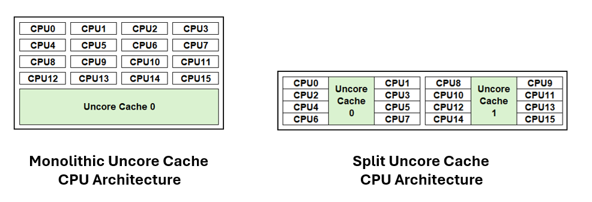
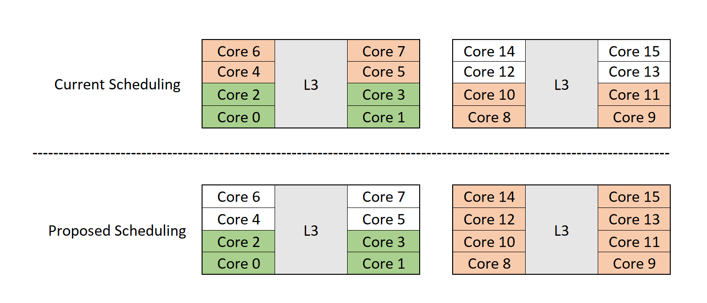
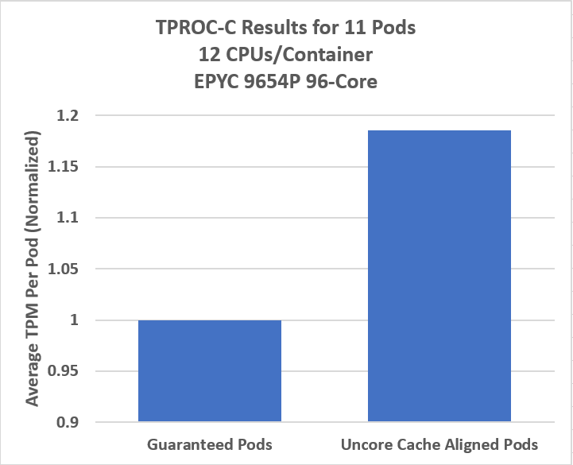
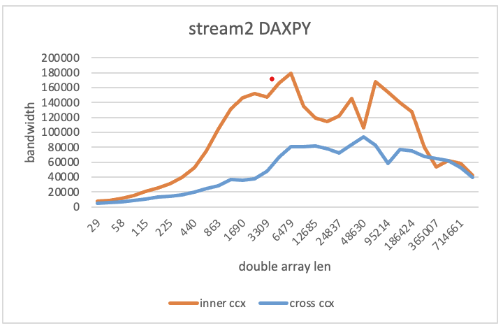
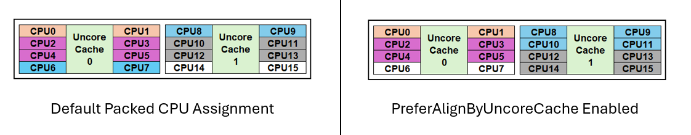
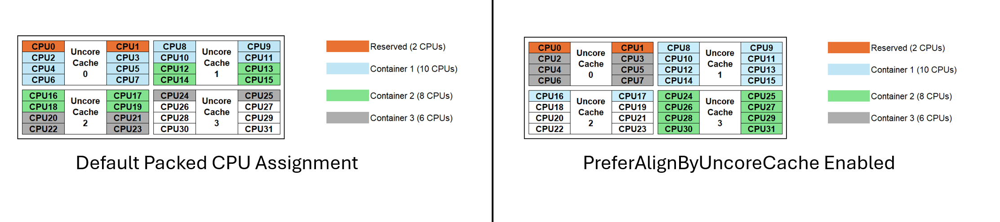

# KEP-4800: Split UncoreCache Toplogy Awareness in CPU Manager

<!-- toc -->
- [Release Signoff Checklist](#release-signoff-checklist)
- [Summary](#summary)
- [Motivation](#motivation)
  - [Goals](#goals)
  - [Non-Goals](#non-goals)
- [Proposal](#proposal)
  - [User Stories (Optional)](#user-stories-optional)
    - [Story 1](#story-1)
    - [Story 2](#story-2)
  - [Notes/Constraints/Caveats (Optional)](#notesconstraintscaveats-optional)
  - [Risks and Mitigations](#risks-and-mitigations)
- [Design Details](#design-details)
  - [Test Plan](#test-plan)
      - [Prerequisite testing updates](#prerequisite-testing-updates)
      - [Unit tests](#unit-tests)
      - [Integration tests](#integration-tests)
      - [e2e tests](#e2e-tests)
  - [Graduation Criteria](#graduation-criteria)
    - [Alpha](#alpha)
    - [Beta](#beta)
  - [Upgrade / Downgrade Strategy](#upgrade--downgrade-strategy)
  - [Version Skew Strategy](#version-skew-strategy)
- [Production Readiness Review Questionnaire](#production-readiness-review-questionnaire)
  - [Feature Enablement and Rollback](#feature-enablement-and-rollback)
  - [Rollout, Upgrade and Rollback Planning](#rollout-upgrade-and-rollback-planning)
  - [Monitoring Requirements](#monitoring-requirements)
  - [Dependencies](#dependencies)
  - [Scalability](#scalability)
  - [Troubleshooting](#troubleshooting)
- [Implementation History](#implementation-history)
- [Drawbacks](#drawbacks)
- [Alternatives](#alternatives)
- [Infrastructure Needed (Optional)](#infrastructure-needed-optional)
<!-- /toc -->

## Release Signoff Checklist

Items marked with (R) are required *prior to targeting to a milestone / release*.

- [x] (R) Enhancement issue in release milestone, which links to KEP dir in [kubernetes/enhancements] (not the initial KEP PR)
- [x] (R) KEP approvers have approved the KEP status as `implementable`
- [x] (R) Design details are appropriately documented
- [ ] (R) Test plan is in place, giving consideration to SIG Architecture and SIG Testing input (including test refactors)
  - [ ] e2e Tests for all Beta API Operations (endpoints)
  - [ ] (R) Ensure GA e2e tests meet requirements for [Conformance Tests](https://github.com/kubernetes/community/blob/master/contributors/devel/sig-architecture/conformance-tests.md) 
  - [ ] (R) Minimum Two Week Window for GA e2e tests to prove flake free
- [ ] (R) Graduation criteria is in place
  - [x] (R) [all GA Endpoints](https://github.com/kubernetes/community/pull/1806) must be hit by [Conformance Tests](https://github.com/kubernetes/community/blob/master/contributors/devel/sig-architecture/conformance-tests.md) 
- [x] (R) Production readiness review completed
- [ ] (R) Production readiness review approved
- [x] "Implementation History" section is up-to-date for milestone
- [x] User-facing documentation has been created in [kubernetes/website], for publication to [kubernetes.io]
- [x] Supporting documentation—e.g., additional design documents, links to mailing list discussions/SIG meetings, relevant PRs/issues, release notes

[kubernetes.io]: https://kubernetes.io/
[kubernetes/enhancements]: https://git.k8s.io/enhancements
[kubernetes/kubernetes]: https://git.k8s.io/kubernetes
[kubernetes/website]: https://git.k8s.io/website

## Summary

This KEP proposes to introduce a new CPU Manager static policy option, "prefer-align-cpus-by-uncorecache", that groups CPU resources by uncore cache where possible.
An uncore cache, also known as the last-level-cache, refers to the cache that exists at a shared level among CPU cores, unlike low-level caches which are dedicated per individual core.
The opt-in feature changes the CPU assignment algorithm to recognize and sort CPUs by uncore cache, and then allocate CPUs aligned to the fewest uncore caches as possible. This is primarily beneficial for CPU architectures that utilize multiple uncore caches, or split uncore caches, within the processor.
In cases where the number of CPUs requested exceeds the number of CPUs grouped in a uncore cache, the algorithm attempts to align allocations at a best-effort policy to reduce assignments of CPUs across minimal uncore caches.
If the CPU Manager cannot align optimally, it will still admit the workload as before. Uncore cache assignment will be preferred but not a strict requirement for this feature.

## Motivation

Traditional CPU architectures commonoly employ a monolithic uncore cache design where all CPU cores share equal access to a unified uncore cache. To address scalability challenges, CPU architectures are adopting a modular design. One such example is the split uncore cache architecture, where subsets of CPU cores are grouped with dedicated uncore caches, and these modular units are interconnected to form the complete processor.

The primary goal of this proposal is to integrate the split uncore cache architecture into the static CPU Manager to enhance container resource allocation by mitigating noisy neighbor issues and intercross-cache latency. This optimization is particularly relevant for systems featuring a split uncore cache, which is supported on both x86 and ARM architectures.
The challenge with the current Kubelet’s CPU Manager is that it is unaware of split uncore cache architecture and can distribute CPU assignments across multiple uncore caches. This creates a noisy neighbor problem where multiple pods/containers are sharing and competing for access to the same uncore cache. In addition, containers spread across multiple uncore caches can see higher latency and reduced performance due to inter-cache access where a CPU will need to access an undedicated uncore cache. For workload use cases that are sensitive to cache latency and are performance deterministic, minimizing the uncore cache spread can have significant improvements in performance.

The figure below highlights performance gain when container placement is aligned to an uncore cache group. In this example HammerDB TPROC-C/My-SQL is the workload deployed. There was a 18% uplift in performance when uncore cache aligned compared to default behavior. Other workloads may see higher or lower gains based on uncore cache utilization.

 

### Goals

- Introduce a new CPU Manager policy option that attempts to assign CPUs within the same uncore cache group to a container.  
- Minimize the number of CPUs assignments from different uncore cache groups to containers.

### Non-Goals

- This proposal does not aim to modify CPU assignments for CPU Manager policy set to none.
- This does not alter the behavior of existing static policy options such as `full-pcpus-only`.

## Proposal

- Introduce a new static policy option to optimize CPU assignments by prioritizing alignment with uncore cache groupings. The `prefer-align-cpus-by-uncorecache` option, enabled on an opt-in basis, attempts to allocate CPUs to each container in a way that minimizes the number of uncore caches used, if possible.

- Add a new member called `uncorecacheId` into the CPUInfo struct that tracks whether the CPU is part of a split uncore cache. Topology struct already contains CPUDetails which is a map of CPUInfo.  CPUInfo knows about NUMA, socket, and core IDs associated with a CPU.   Functionality to support this was merged in cadvisor with these pull-requests [cadvisor/pr-2849](https://github.com/google/cadvisor/pull/2849) and [cadvisor/pr-2847](https://github.com/google/cadvisor/pull/2847/)

- Handle enablement of the policy option in pkg/kubelet/cm/cpumanager/policy_options.go and check the validity of the user flag and capability of the system. If the node CPU topology does not support split uncore caches, enabling this feature will not impact on the default CPU allocation behavior. 

- For platforms where SMT is enabled, `prefer-align-cpus-by-uncorecache` can be enabled along with `full-pcpus-only` and enforce full core assignment with uncore cache alignment.

### User Stories (Optional)

#### Story 1

- As a HPC user, I want to extract the best performance possible and reduce latency, so that I can extract the most value when deploying applications in Kubernetes. I can use the static CPU Manager Policy option, but on split uncore cache processors, my application can experience latency when assigned CPUs across multiple uncore caches. In order to maximize performance, I want to minimize the distribution across uncore caches to minimize the latency. I want a feature I can enable so the CPU allocation logic inside the kubelet will automatically handle this for me for larger clusters for simple deployment and efficiency.

#### Story 2

- As a Networking/Telco Engineer, my application is latency sensitive, to which uncore cache misalignment is a contributing factor. I want my application to be statically assigned to CPUs that correspond to one single uncore cache so that I can get the maximum throughput from my application. Additionally, I have applications that are also static and of different CPU size requirements. The default Static CPU Manager Policy will result in my applications being assigned to two or more uncore caches. I have a large multi-node Kuberentes cluster. I want a cpu allocation logic to automatically assign CPUs for the best performance across the fewest amount of uncore cahces based on available CPUs without having to worry about what order/size I deploy my applications so I can ensure I get the best performance possible. 

### Notes/Constraints/Caveats (Optional)

- The name `UncoreCache` is directly derived from cAdvisor that is being used as a package. 
- Using the flow in `CPUManagerPolicy{Alpha,Beta}Options` from [xref](https://github.com/kubernetes/kubernetes/blob/af879aebb1a866a2f0e45bb33c09a1cc8f7acc45/pkg/features/kube_features.go#L110C1-L117C83) which is used to avoid proliferation of feature gates. 

### Risks and Mitigations

- Risk: Enabling or disabling the feature might lead to unexpected behavior
  - Mitigation: Feature is enabled by a static policy option flag
- Risk: The new feature might interfere with existing functionality
  - Mitigation: It does not change behavior of non-static policy and preserves the behavior of other static options
- Risk: Inconsistent configuration could cause allocation issues
  - Mitigation: Failure will occur during runtime if mismatch between options occurs, preventing the Pod from being allocated incorrectly or leading a non-optimal aligment

## Design Details

We propose to:

- make the CPUManager aware of the uncore cache architecture.
- add a new static CPUManager option called `prefer-align-cpus-by-uncorecache` that affines CPU resources to a container while minimizing the uncore cache distribution at a best-effort policy. 

To make Kubelet be uncore cache aware for CPU sensitive workloads, the CPU allocation, `UncoreCacheID` has been added to the `CPUInfo` and `CPUTopology` structures that are provided by `cAdvisorapi.MachineInfo` during the CPU discovery process.

A new Static CPUManager Policy option, `prefer-align-cpus-by-uncorecache`, will be introduced to enable the proposed feature. When enabled, the algorithm for `prefer-align-cpus-by-uncorecache` will be implemented to follow the default packed behavior of the existing static CPU Manager allocation with the introduction of a uncore cache hierarchy. Each Guaranteed container allocated resources with the Static CPU Manager Policy will have a defined total CPU requirement. Based on this requirement, CPUs will be allocated from whole CPU Domains, which consist of CPUs sharing a common characteristic such as socket, memory locality (NUMA), uncore caches, or cores. CPU allocations will prioritize larger domains first for optimal resource distribution. 

The CPU allocation algorithm is as follows:
- If the number of CPUs required for the container is equal to or larger than a total NUMA/Socket's-worth of CPUs (depending on which is larger in the hierarchy), allocate whole NUMA/Socket's worth of CPUs (`takeFullFirstLevel`). Deduct the amount of CPU allocated from the required number of total CPUs. Continue allocating CPUs by this CPU Domain until the required number of total CPUs is satisfied or less than the current CPU Domain.
- If the remaining CPUs required or original required total number of CPUs for the container is equal to or larger than a total NUMA/Socket's worth of CPUs (depending on which is smaller in the hierarchy), allocate whole NUMA/Socket's worth of CPUs (`takeFullSecondLevel`). Deduct the amount of CPUs allocated from the required number of total CPUs. Continue allocating CPUs by this CPU Domain until the required number of total CPUs is satisfied or less than the current CPU Domain.
- NOTE: If the container's CPU requirement is large enough to trigger `takeFullFirstLevel` or `takeFullSecondLevel`, the CPU allocation will extend across multiple uncore caches on a split uncore cache processor, undermining the effectiveness of this optimization. The performance benefit of this feature depends on the workload's cache sensitivity and CPU requirements, with greater optimzation potential when fewer uncore caches are utilized. Since this feature is implemented at a best-effort policy, containers with larger CPU requirements can still be deployed. This is intentional to allow mixed-use static workloads on the node (larger non-cache sensitive containers with smaller cache sensitive containers) and prevents CPU size restrictions for Guaranteed containers. For specific circumstances where the container CPU requirement is large enough to employ `takeFullFirstLevel` or `takeFullSecondLevel` yet still requires a subset of CPUs affined to an uncore cache, the application will be required to recognize the allocated CPUset and pin the necessary CPUs.
- **Added feature**: If `prefer-align-cpus-by-uncorecache` is enabled, use the `takeUncoreCache` method. This feature will be introduced at this level of the CPU topology hierarchy because split-uncore-caches will be smaller CPU domains than sockets since multiple uncore caches are interconnected on a socket. General use cases will also often set the NUMA Per Socket (NPS) equal to 1, meaning the NUMA will be the same size as the socket, resulting in the uncore cache CPU domain being smaller than the NUMA CPU domain. However, it is possible to set NPS=2, NPS=4, and even as high as Last-Level-Cache as NUMA (meaning each uncore cache domain is an individual NUMA). These particular settings are less common and will still result in the NUMA CPU domain being larger than or equal to an uncore cache CPU domain on split-uncore-cache processors. Additionally, setting Last-Level-Cache as NUMA is not recommended with Kubernetes as many split-uncore-cache processors will then exceed the current limitation of 8 NUMA domains in Kubernetes (as of current implementation writing in v1.32). The uncore cache CPU domain is generally considered smaller than the NUMA or Socket CPU domain. However, the proposed algorithm is designed to also handle cases where the uncore cache domain contains the same CPUs as the Socket or NUMA domain, or even scenarios where it spans more CPUs than a NUMA domain. Details of this handling and the overall implementation are described further below.

  - Scan through every uncore cache index in numerical order, for each uncore cache block:
    - First, check if the current required total number of CPUs for the container is greater than or equal the size of the **total** amount of CPUs to an uncore cache, assign the full uncore cache CPUs if they are all **unallocated** within the group. Subtract the amount of assigned CPUs from the quantity of required CPUs. This submethod will be called `takeFullUncore` and follows the same allocation principle as `takeFullFirstLevel` and `takeFullSecondLevel` where CPU allocations will be done based on the domain-level. Repeat `takeFullUncore` until the required number of total CPUs is satisfied or less than the amount of CPUs available on an uncore cache.
    - Once the current required total number of CPUs for the container is less than the size of the **total** amount of CPUs to an uncore cache, determine if all required CPUs can fit within the uncore cache domain. Allocate the CPUs if the container's required CPUs can be satisfied from the **unallocated** CPUs within the single uncore cache domain. This submethod will be called `takePartialUncore`. The goal of `takePartialUncore` is to perform a first-fit method where as the uncore caches are scanned, CPUs will be allocated once it is determined there are enough allocatable CPUs within the uncore cache to satisfy the CPU requirement.
    - `takePartialUncore` diverges from the allocation principles previously used where full CPU domains are allocated at a time. This is necessary since this is a best-effort implementation intended to balance maximizing node performance while minimizing uncore cache distribution. Uncore cache sensitive applications can be deployed on the edge where lower core count systems are utilized. These applications often require less CPUs than the total number of CPUs of an uncore cache domain. Newer split architecture processors have increased uncore cache size and bandwidth which has helped reduced the noisy neighbor problem. However, the workloads can still be sensitive to cross-cache latency. The example below helps illustrate why `takePartialUncore` is important to fully maximize nodes that have less uncore caches available. For the example below, a 16-core split uncore cache processor is allocated to the following Guaranteed containers using the static policy with `prefer-align-cpus-by-uncorecache` enabled and disabled.
      - Reserved CPUs: 0-1
      - Allocatable CPUs: 2-15
      - Container 1: 4 CPUs
      - Container 2: 4 CPUs
      - Container 3: 4 CPUs

      

      In the depiction above, Container 2 will suffer from cross cache latency using the default packed CPU allocation despite having enough room to fit on Uncore Cache 1. With `prefer-align-cpus-by-uncorecache`, the available CPUs on the node can be maximized and run as optimally as possible using the `takePartialUncore` method.
  - `takeUncoreCache` and `takePartialUncore` will still follow a "packed" allocation principle as the rest of the implementation. Uncore Cache IDs will be scanned in numerical order and assigned as possible. For `takePartialUncore`, CPUs will be assigned within the uncore cache in numerical order to follow a "packed" methodology.
  - In the case where the uncore cache CPU domain is similar to the socket CPU domain (ex: monolithic cache architectures), `takeFullFirstLevel` and `takeFullSecondLevel` will have already reduced the required number of CPUs to be less than a socket's worth of CPUs (or the original requirement was less than a socket's worth of CPUs). In this case, `takeFullUncore` is skipped since the CPU requirement is already less than the the total CPUs to a monolithic cache. `takePartialUncore` will then allocate CPUs in numerical order as available on the socket CPU domain (which is equivalent to the monolithic uncore cache CPU domain) and results in the same allocation as the default behavior without `prefer-align-cpus-by-uncorecache` enabled.
  - In the case where the NUMA CPU domain is smaller than the uncore cache CPU domain (ex: enabling sub-NUMA clustering on monolithic cache architectures), `takeFullFirstLevel` and `takeFullSecondLevel` will have already reduced the required number of CPUs to be less than a socket's worth of CPUs (or the original requirement was less than a socket's worth of CPUs). In this case, `takeFullUncore` is skipped since the CPU requirement is already less than the the total CPUs to a monolithic cache. `takePartialUncore` will then allocate CPUs in numerical order as available on the node and results in the same allocation as the default behavior without `prefer-align-cpus-by-uncorecache` enabled.
  - In the case where the NUMA CPU domain is equal to the uncore cache CPU domain (ex: setting Last-Level-Cache as NUMA on split-uncore-cache architectures), `takeFullSecondLevel` will satisfy the requirements for `takeFullUncore`, which results in the use of `takePartialUncore`. `takePartialUncore` will then minimize the distribution of CPUs across multiple uncore caches as seen in the example above.
  - Although `takePartialUncore` diverges from the allocation by domain principle, it is necessary to enable greater utilization of the node by reducing uncore cache distribution and achieves the goal for a best-effort policy. If `takeFullUncore` was only implemented, containers with CPU requirements that are less than an uncore cache's worth would follow the default packed method and not always be uncore cache aligned. The only containers that would benefit would be those with CPU requirements that exactly match the size of the uncore cache CPU domain. This would be restrictive for the users who have different sized applications, and could result in overallocating resources and inefficient usage of the node. 
- Continuing the allocation algorithm, if the required amount of CPUs cannot fit within an uncore cache group and there are enough allocatable cores on the node, assign cores in numerical order as available (`takeFullCores`).
- If the CPU requirement is still not satisfied but there are enough CPUs available, assign CPUs in numerical order as available (`takeRemainingCPUs`).

In order to fully depict the CPU allocation implementation, the following shows CPU assignments for the default packed method vs `prefer-align-cpus-by-uncorecache`. The following containers are scheduled on the a 32 core split uncore cache processor:
- Single Socket
- NPS=1
- 4 Uncore Caches
- Reserved CPUs: 0-1
- Allocatable CPUs: 2-31
- Container 1: 10 CPUs (larger than an uncore cache CPU domain)
- Container 2: 8 CPUs (equivalent to an uncore cache CPU domain)
- Container 3: 6 CPUs (smaller than an uncore cache CPU domain)

In this example, `takeFullFirstLevel` and `takeFullSecondLevel` will be skipped for all three containers since the CPU requirement is less than a Socket and NUMA's worth of CPUs.
- The first container requires 10 CPUs which is greater than the CPUs in an uncore cache, `takeFullUncore` is utilized. The function will iterate through each uncore cache in numerical order. Uncore Cache 0 is not allocated since a full uncore cannot be allocated. Uncore cache 1 is then fully allocated to container 1 but still requires 2 more CPUs. Uncore cache 2 is then scanned. Since the CPU requirement is less than a uncore cache's worth of CPUs, `takePartialUncore` is utilized. Since Uncore Cache 2 is able to satify the 2 remaining required CPUs by container 1, the CPUs are allocated in numerical order on Uncore Cache 2 to satisfy the requirement.
- Container 2 requires 8 CPUs which is equal to the node's uncore cache worth of CPUs. `takeFullUncore` is utilized again. Scanning each uncore cache in numerical order results in finding that Uncore Cache 3 is the only uncore cache fully available, and therefore allocated to container 2 to satisfy the requirement.
- Container 3 requires 6 CPUs which is less than the CPUs in an uncore cache. `takeFullUncore` is skipped and `takePartialUncore` is utilized. Scanning each uncore cache in numerical order results in Uncore Cache 0 being able to fit the CPU requirements within a single uncore. The remaining 6 available CPUs on Uncore Cache 0 are allocated to container 3 to satisfy the requirement.

This example shows the benefit of the `prefer-align-by-uncorecache` feature in comparison to the default packed allocation. In the default packed allocation where CPUs are assigned numerically as available, all three containers suffer cross cache latency where CPUs need to access uncore caches from other slices and suffer from the noisy neighbor effect. The uncore cache aligned containers do not suffer from cross cache latency (unless the CPU requirement is larger than an uncore cache domain) and does not face a noisy neighbor scenario.

In the case where the NUMA boundary is larger than a socket (setting NPS0 on a dual-socket system), the full node's CPUs will be allocated to the container if it requires the total NUMA amount of CPUs. Otherwise, if the CPU requirement for the container is less than the total CPUs to the NUMA, the logic will begin with (`takeFullSecondLevel`). The node can not be over committed. 

This CPU allocation policy will minimize the distribution of containers across uncore caches to improve performance while still maintaining the default packed logic. The scope will be initially be narrowed to implement uncore cache alignment to the default NUMA packed static CPU allocation behavior. This feature will not be compatible with the `distribute-cpus-across-numa` CPU policy option. Distributing CPU allocations evenly across NUMAs for containers requiring more resources than a single NUMA can undermine the objective of minimizing CPU latency across uncore caches. As a result, more uncore cache allocations are distributed across NUMAs, and the cross cache latencies are compounded with cross NUMA latencies. This feature will also not be compatible with the `distribute-cpus-across-cores` CPU policy option since this option currently has compatibility conflicts with the `full-pcpus-only` CPU policy option.

| Compatibility | alpha | beta | GA |
| --- | --- | --- | --- |
| full-pcpus-only | x | x | x |
| distribute-cpus-across-numa  |   |   |   |
| align-by-socket | x | x | x |
| distribute-cpus-across-cores |   |   |   |

This feature follows a best-effort policy rather than a strict policy. A strict policy would prevent Guaranteed containers from being deployed if they exceed the size of an uncore cache CPU domain while a best-effort policy will still permit containers larger than an uncore cache CPU domain to be deployed. Additionally, under a strict policy, each container would be assigned its own dedicated uncore cache, which would limit the node to deploying a number of containers equal to the number of uncore caches available. A strict uncore cache alignment policy is not within the scope of this implementation. Execution of a strict uncore cache alignment policy will be pursued in a separate KEP.

As this feature operates on a best-effort basis and does not prevent CPU allocation to containers that cannot be restricted to a single uncore cache, a metric will be need to be provided to help users determine whether a container is uncore cache aligned.

### Test Plan

<!--
**Note:** *Not required until targeted at a release.*
The goal is to ensure that we don't accept enhancements with inadequate testing.

All code is expected to have adequate tests (eventually with coverage
expectations). Please adhere to the [Kubernetes testing guidelines][testing-guidelines]
when drafting this test plan.

[testing-guidelines]: https://git.k8s.io/community/contributors/devel/sig-testing/testing.md
-->

[x] I/we understand the owners of the involved components may require updates to
existing tests to make this code solid enough prior to committing the changes necessary
to implement this enhancement.

##### Prerequisite testing updates

<!--
Based on reviewers feedback describe what additional tests need to be added prior
implementing this enhancement to ensure the enhancements have also solid foundations.
-->

##### Unit tests

We plan on adding/modifying functions to the following files to create the uncorecache alignment feature:
- pkg/kubelet/cm/cpumanager/cpu_assignment.go
- /pkg/kubelet/cm/cpumanager/cpu_manager.go
- /pkg/kubelet/cm/cpumanager/policy_options.go
- /pkg/kubelet/cm/cpumanager/topology/topology.go

Existing topoology test cases will be modified to include uncorecache topology. All modified and added functions will have new test cases.

<!--
In principle every added code should have complete unit test coverage, so providing
the exact set of tests will not bring additional value.
However, if complete unit test coverage is not possible, explain the reason of it
together with explanation why this is acceptable.
-->

<!--
Additionally, for Alpha try to enumerate the core package you will be touching
to implement this enhancement and provide the current unit coverage for those
in the form of:
- <package>: <date> - <current test coverage>
The data can be easily read from:
https://testgrid.k8s.io/sig-testing-canaries#ci-kubernetes-coverage-unit

This can inform certain test coverage improvements that we want to do before
extending the production code to implement this enhancement.
-->
- `/pkg/kubelet/cm/cpumanager/cpu_assignment.go`: `2024-08-26` - `93.5%`
- `/pkg/kubelet/cm/cpumanager/cpu_manager.go`: `2024-08-26` - `74.5%`
- `/pkg/kubelet/cm/cpumanager/policy_static.go`: `2024-08-26` - `89.5%`
- `/pkg/kubelet/cm/cpumanager/topology/topology.go`: `2024-9-30` - `93.2%`

Unit tests will be created to test the proposed feature's functionality starting from the static policy's `Allocate` method. The unit tests will show that containers are assigned CPUs from an individual uncore cache.

The `prefer-align-cpus-by-uncorecache` feature will be enabled and tested individually. The following features will also be enabled alongside to test the proposed feature's compatibility with existing static CPU Manager policies:
- `full-pcpus-only`
- Topology Manager NUMA Affinity

The following CPU Topologies are representative of various uncore cache architectures and will be added to [policy_test.go](https://github.com/kubernetes/kubernetes/blob/master/pkg/kubelet/cm/cpumanager/policy_test.go) and represented in the unit testing. 

- 1P AMD EPYC 7702P 64C (smt-on/off) NPS=1, 16 uncore cache instances/socket
- 2P AMD EPYC 7303 32C (smt-on/off) NPS=1, 4 uncore cache instances/socket
- 1P AMD EPYC 9754 128C (smt-on) NPS=1, 16 uncore cache instances/socket   
- 2P AMD EPYC 9654 96C (smt-off) NPS=2, 12 uncore cache instances/socket   
- 2P Intel Xeon Platinum 8490H 60c (hyperthreading on) with Sub-NUMA Clustering
- 1P Intel Core i7-12850HX
- 1P ARM Ampere Altra 128c, 16 uncore cache instances/socket
- 1P AWS Graviton3 64c

##### Integration tests

N/A. This feature requires a e2e test for testing.

##### e2e tests

- [should update alignment counters when pod successfully run taking less than uncore cache group](https://github.com/kubernetes/kubernetes/blob/master/test/e2e_node/cpu_manager_metrics_test.go):[SIG-node](https://testgrid.k8s.io/sig-node):[SIG-node-kubelet](https://testgrid.k8s.io/sig-node-kubelet)
- [should update alignment counters when pod successfully run taking a full uncore cache group](https://github.com/kubernetes/kubernetes/blob/master/test/e2e_node/cpu_manager_metrics_test.go):[SIG-node](https://testgrid.k8s.io/sig-node):[SIG-node-kubelet](https://testgrid.k8s.io/sig-node-kubelet)
- [should not update alignment counters when pod successfully run taking more than a uncore cache group](https://github.com/kubernetes/kubernetes/blob/master/test/e2e_node/cpu_manager_metrics_test.go):[SIG-node](https://testgrid.k8s.io/sig-node):[SIG-node-kubelet](https://testgrid.k8s.io/sig-node-kubelet)

### Graduation Criteria

#### Alpha

- Feature implemented behind a feature gate flag option
- Add unit test coverage
- Added metrics to cover observability needs
- Added e2e tests for metrics

#### Beta

- Address bug fixes: ability to schedule odd-integer CPUs for uncore cache alignment
- Add test cases to ensure functional compatibility with existing CPUManager options
- Add test cases to ensure and report incompatibility with existing CPUManager options that are not supported with prefer-align-cpus-by-uncore-cache
- Add E2E test coverage for feature

### Upgrade / Downgrade Strategy

N/A

### Version Skew Strategy

N/A

## Production Readiness Review Questionnaire

<!--

Production readiness reviews are intended to ensure that features merging into
Kubernetes are observable, scalable and supportable; can be safely operated in
production environments, and can be disabled or rolled back in the event they
cause increased failures in production. See more in the PRR KEP at
https://git.k8s.io/enhancements/keps/sig-architecture/1194-prod-readiness.

The production readiness review questionnaire must be completed and approved
for the KEP to move to `implementable` status and be included in the release.

In some cases, the questions below should also have answers in `kep.yaml`. This
is to enable automation to verify the presence of the review, and to reduce review
burden and latency.

The KEP must have a approver from the
[`prod-readiness-approvers`](http://git.k8s.io/enhancements/OWNERS_ALIASES)
team. Please reach out on the
[#prod-readiness](https://kubernetes.slack.com/archives/CPNHUMN74) channel if
you need any help or guidance.
-->

### Feature Enablement and Rollback

To enable this feature requires enabling the feature gates for static policy in the Kubelet configuration file for the CPUManager feature gate and add the policy option for uncore cache alignment

###### How can this feature be enabled / disabled in a live cluster?

For `CPUManager` it is a requirement going from `none` to `static` policy cannot be done dynamically because of the `cpu_manager_state file`. The node needs to be drained and the policy checkpoint file (`cpu_manager_state`) need to be removed before restarting Kubelet. This feature specifically relies on the `static` policy being enabled.

- [x] Feature gate (also fill in values in `kep.yaml`)
  - Feature gate name: `CPUManagerBetaPolicyOptions`
  - Components depending on the feature gate: `kubelet`
- [x] Other
  - Describe the mechanism: Change the `kubelet` configuration to set a `CPUManager` policy of static then setting the policy option of `prefer-align-cpus-by-uncorecache`
  - Will enabling / disabling the feature require downtime of the control
    plane? No.
  - Will enabling / disabling the feature require downtime or reprovisioning
    of a node? Yes, a `kubelet` restart is required for changes to take place.

###### Does enabling the feature change any default behavior?

No, to enable this feature, it must be explicitly set in the `CPUManager` static policy and the policy option `prefer-align-cpus-by-uncorecache` must be set.

###### Can the feature be disabled once it has been enabled (i.e. can we roll back the enablement)?

Yes this feature can be disabled it will just require a restart of `kubelet`. The Kubelet configuration will need to be set with the static policy option and prefer-align-cpus-by-uncorecache flag removed.

###### What happens if we reenable the feature if it was previously rolled back?

Feature will be enabled. Proper drain of node and restart of kubelet required. Feature is not intended to be enabled/disabled dynamically, similar to static policy.

###### Are there any tests for feature enablement/disablement?

E2E test will demonstrate default behavior is preserved when `CPUManagerPolicyOptions` feature gate is disabled.
Metric created to check uncore cache alignment after cpuset is determined and utilized in E2E tests with feature enabled. 
See [cpu_manager_metrics_test.go](https://github.com/kubernetes/kubernetes/blob/master/test/e2e_node/cpu_manager_metrics_test.go)

### Rollout, Upgrade and Rollback Planning

<!--
This section must be completed when targeting beta to a release.
-->

###### How can a rollout or rollback fail? Can it impact already running workloads?

This feature is a best-effort alignment of CPUs to uncore caches that requires a kubelet restart that must not affect running workloads. No changes needed to cpu_manager_state file.
A rollout may fail based upon existing workloads that create fragmented uncore caches on the node, potentially resulting in CPUset distribution across multiple caches based upon the CPU quantity requirements and the best-effort policy.
Metrics below can help the user track alignment, but a rollback will not help because the feature is not a strict alignment to uncore caches, but a best-effort to reduce shared uncore caches.

###### What specific metrics should inform a rollback?

`kubelet_container_aligned_compute_resources_count` and `container_aligned_compute_resources_failure_count` metric can be tracked to measure if there are issues in the cpuset allocation that can determine if a rollback is necessary.

###### Were upgrade and rollback tested? Was the upgrade->downgrade->upgrade path tested?

N/A, because way to upgrade and rollback would be the same process of removing the CPU Manager state file and drain the node of pods then restarting kubelet.  

###### Is the rollout accompanied by any deprecations and/or removals of features, APIs, fields of API types, flags, etc.?

No

### Monitoring Requirements

Reference CPUID info in podresources API to be able to verify assignment.

###### How can an operator determine if the feature is in use by workloads?

Reference podresources API to determine CPU assignment and CacheID assignment per container.
Use 'container_aligned_compute_resources_count' metric which reports the count of containers getting aligned compute resources. See [kubelet/metrics/metrics.go](https://github.com/kubernetes/kubernetes/blob/8f1f17a04f62ab64ebe4f0b9d7f5f799bf56a0d9/pkg/kubelet/metrics/metrics.go#L135).

###### How can someone using this feature know that it is working for their instance?

Reference podresources API to determine CPU assignment.

- [x] Other
  - Metric: container_aligned_compute_resource_count
  - Other field: CPUID from podresources API

###### What are the reasonable SLOs (Service Level Objectives) for the enhancement?

In default Kubernetes installation, 99th percentile per cluster-day <= X
This feature is best-effort and will not cause failed admission, but can introduce admission delay.

###### What are the SLIs (Service Level Indicators) an operator can use to determine the health of the service?

- Metrics
  - `topology_manager_admission_duration_ms` can be used to determine pod admission time

###### Are there any missing metrics that would be useful to have to improve observability of this feature?

No.

<!--
Describe the metrics themselves and the reasons why they weren't added (e.g., cost,
implementation difficulties, etc.).
-->

### Dependencies

<!--
This section must be completed when targeting beta to a release.
-->

###### Does this feature depend on any specific services running in the cluster?

No

### Scalability

<!--
For alpha, this section is encouraged: reviewers should consider these questions
and attempt to answer them.

For beta, this section is required: reviewers must answer these questions.

For GA, this section is required: approvers should be able to confirm the
previous answers based on experience in the field.
-->

###### Will enabling / using this feature result in any new API calls?

All of the housekeeping for this feature is node internal, and thus will not require the kubelet request anything new of the apiserver

###### Will enabling / using this feature result in introducing new API types?

No

###### Will enabling / using this feature result in any new calls to the cloud provider?

NA. 

###### Will enabling / using this feature result in increasing size or count of the existing API objects?

No

###### Will enabling / using this feature result in increasing time taken by any operations covered by existing SLIs/SLOs?

Pod startup time can directly affected because CPUManager will have to do a few extra steps when scheduling a Pod. This extra steps would be negligible as all the computation is done on RAM.

###### Will enabling / using this feature result in non-negligible increase of resource usage (CPU, RAM, disk, IO, ...) in any components?

No

###### Can enabling / using this feature result in resource exhaustion of some node resources (PIDs, sockets, inodes, etc.)?

No

### Troubleshooting

<!--
This section must be completed when targeting beta to a release.

For GA, this section is required: approvers should be able to confirm the
previous answers based on experience in the field.

The Troubleshooting section currently serves the `Playbook` role. We may consider
splitting it into a dedicated `Playbook` document (potentially with some monitoring
details). For now, we leave it here.
-->

###### How does this feature react if the API server and/or etcd is unavailable?

There is no known consequence since this component is dedicated for CPU allocation for Pods which does not directly interact with any API server.

###### What are other known failure modes?

- Feature is best effort, resulting in potential for non-optimal uncore cache alignment when node is highly utilized.
  - Detection: Reference proposed metric in podresource API
  - Mitigation: Feature is preferred/best-effort
  - Diagnostics: Reference podresource API
  - Testing for failure mode not required as alignment is preferred and not a requirement
    
<!--
For each of them, fill in the following information by copying the below template:
  - [Failure mode brief description]
    - Detection: How can it be detected via metrics? Stated another way:
      how can an operator troubleshoot without logging into a master or worker node?
    - Mitigations: What can be done to stop the bleeding, especially for already
      running user workloads?
    - Diagnostics: What are the useful log messages and their required logging
      levels that could help debug the issue?
      Not required until feature graduated to beta.
    - Testing: Are there any tests for failure mode? If not, describe why.
-->

###### What steps should be taken if SLOs are not being met to determine the problem?

## Implementation History

- The outlined sections were filled out was created 2024-08-27.

- 2025-06-09: Submitted PR to promote feature to beta

## Drawbacks

N/A

## Alternatives

Uncore cache affinity CPU allocation is possible by delgating CPU allocation from the Kubelet to the container runtime and plugins. However as a consequence of using a different implementation, the topology alignment granted by the Topology Manager within the kubelet is not compatible. 
Existing Static CPU Manager can be used, but requires manual assignment and for user to only run guaranteed pods with CPU sizes matching the corresponding uncore cache CPU group of the specific node.

## Infrastructure Needed (Optional)

To be able to do e2e testing it would be required that CI machines with CPUs with Split L3 Cache (UncoreCache) exist to be able to use this static policy option properly.
