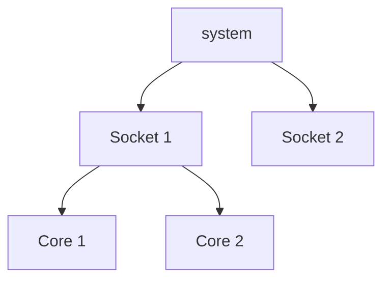
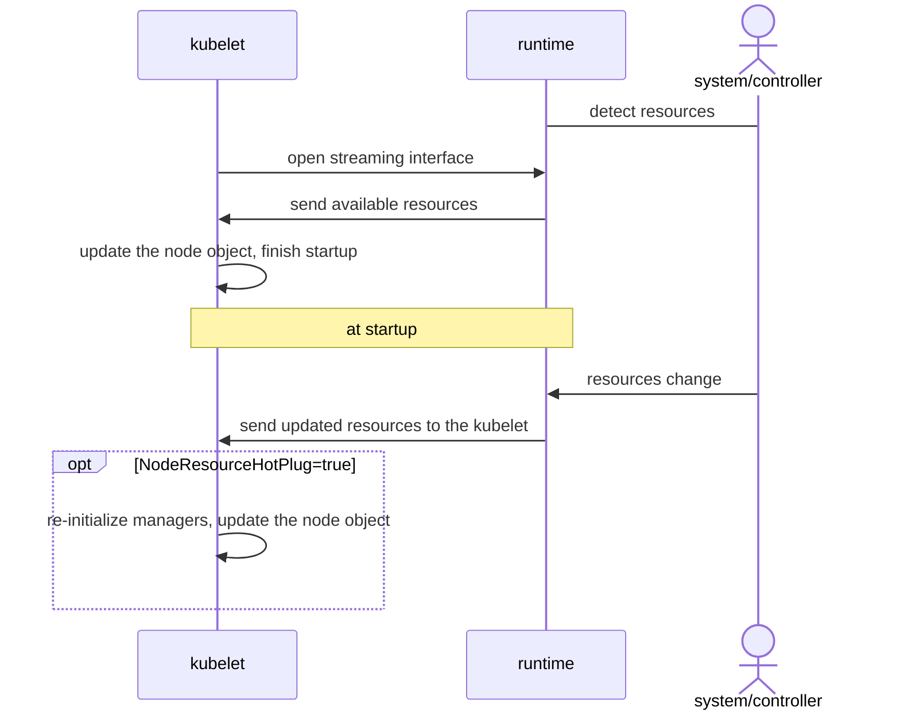

<!--
**Note:** When your KEP is complete, all of these comment blocks should be removed.

To get started with this template:

- [ ] **Pick a hosting SIG.**
  Make sure that the problem space is something the SIG is interested in taking
  up. KEPs should not be checked in without a sponsoring SIG.
- [ ] **Create an issue in kubernetes/enhancements**
  When filing an enhancement tracking issue, please make sure to complete all
  fields in that template. One of the fields asks for a link to the KEP. You
  can leave that blank until this KEP is filed, and then go back to the
  enhancement and add the link.
- [ ] **Make a copy of this template directory.**
  Copy this template into the owning SIG's directory and name it
  `NNNN-short-descriptive-title`, where `NNNN` is the issue number (with no
  leading-zero padding) assigned to your enhancement above.
- [ ] **Fill out as much of the kep.yaml file as you can.**
  At minimum, you should fill in the "Title", "Authors", "Owning-sig",
  "Status", and date-related fields.
- [ ] **Fill out this file as best you can.**
  At minimum, you should fill in the "Summary" and "Motivation" sections.
  These should be easy if you've preflighted the idea of the KEP with the
  appropriate SIG(s).
- [ ] **Create a PR for this KEP.**
  Assign it to people in the SIG who are sponsoring this process.
- [ ] **Merge early and iterate.**
  Avoid getting hung up on specific details and instead aim to get the goals of
  the KEP clarified and merged quickly. The best way to do this is to just
  start with the high-level sections and fill out details incrementally in
  subsequent PRs.

Just because a KEP is merged does not mean it is complete or approved. Any KEP
marked as `provisional` is a working document and subject to change. You can
denote sections that are under active debate as follows:

```
<<[UNRESOLVED optional short context or usernames ]>>
Stuff that is being argued.
<<[/UNRESOLVED]>>
```

When editing KEPS, aim for tightly-scoped, single-topic PRs to keep discussions
focused. If you disagree with what is already in a document, open a new PR
with suggested changes.

One KEP corresponds to one "feature" or "enhancement" for its whole lifecycle.
You do not need a new KEP to move from beta to GA, for example. If
new details emerge that belong in the KEP, edit the KEP. Once a feature has become
"implemented", major changes should get new KEPs.

The canonical place for the latest set of instructions (and the likely source
of this file) is [here](/keps/NNNN-kep-template/README.md).

**Note:** Any PRs to move a KEP to `implementable`, or significant changes once
it is marked `implementable`, must be approved by each of the KEP approvers.
If none of those approvers are still appropriate, then changes to that list
should be approved by the remaining approvers and/or the owning SIG (or
SIG Architecture for cross-cutting KEPs).
-->
# [KEP-5224](https://github.com/kubernetes/enhancements/issues/5224): Node Resource Discovery

<!-- toc -->
- [Release Signoff Checklist](#release-signoff-checklist)
- [Summary](#summary)
- [Motivation](#motivation)
  - [Goals](#goals)
  - [Non-Goals](#non-goals)
- [Proposal](#proposal)
  - [User Stories (Optional)](#user-stories-optional)
    - [Story 1](#story-1)
    - [Story 2](#story-2)
    - [Story 3](#story-3)
    - [Story 4](#story-4)
  - [Notes/Constraints/Caveats (Optional)](#notesconstraintscaveats-optional)
  - [Risks and Mitigations](#risks-and-mitigations)
- [Design Details](#design-details)
  - [CRI API](#cri-api)
  - [kubelet](#kubelet)
  - [Test Plan](#test-plan)
      - [Prerequisite testing updates](#prerequisite-testing-updates)
      - [Unit tests](#unit-tests)
      - [Integration tests](#integration-tests)
      - [e2e tests](#e2e-tests)
  - [Graduation Criteria](#graduation-criteria)
    - [Alpha](#alpha)
    - [Beta](#beta)
    - [GA](#ga)
  - [Upgrade / Downgrade Strategy](#upgrade--downgrade-strategy)
  - [Version Skew Strategy](#version-skew-strategy)
- [Production Readiness Review Questionnaire](#production-readiness-review-questionnaire)
  - [Feature Enablement and Rollback](#feature-enablement-and-rollback)
  - [Rollout, Upgrade and Rollback Planning](#rollout-upgrade-and-rollback-planning)
  - [Monitoring Requirements](#monitoring-requirements)
  - [Dependencies](#dependencies)
  - [Scalability](#scalability)
  - [Troubleshooting](#troubleshooting)
- [Implementation History](#implementation-history)
- [Drawbacks](#drawbacks)
- [Alternatives](#alternatives)
  - [CRI: non-zone-based API](#cri-non-zone-based-api)
  - [Non-CRI: New plugin interface to Kubelet](#non-cri-new-plugin-interface-to-kubelet)
  - [Non-CRI: Config file](#non-cri-config-file)
  - [Non-CRI: Kubernetes API object](#non-cri-kubernetes-api-object)
  - [Non-CRI: Some combination of the two above (config file and API object)](#non-cri-some-combination-of-the-two-above-config-file-and-api-object)
  - [Non-CRI: Extend cAdvisor](#non-cri-extend-cadvisor)
- [Infrastructure Needed (Optional)](#infrastructure-needed-optional)
<!-- /toc -->

## Release Signoff Checklist

<!--
**ACTION REQUIRED:** In order to merge code into a release, there must be an
issue in [kubernetes/enhancements] referencing this KEP and targeting a release
milestone **before the [Enhancement Freeze](https://git.k8s.io/sig-release/releases)
of the targeted release**.

For enhancements that make changes to code or processes/procedures in core
Kubernetes—i.e., [kubernetes/kubernetes], we require the following Release
Signoff checklist to be completed.

Check these off as they are completed for the Release Team to track. These
checklist items _must_ be updated for the enhancement to be released.
-->

Items marked with (R) are required *prior to targeting to a milestone / release*.

- [ ] (R) Enhancement issue in release milestone, which links to KEP dir in [kubernetes/enhancements] (not the initial KEP PR)
- [ ] (R) KEP approvers have approved the KEP status as `implementable`
- [ ] (R) Design details are appropriately documented
- [ ] (R) Test plan is in place, giving consideration to SIG Architecture and SIG Testing input (including test refactors)
  - [ ] e2e Tests for all Beta API Operations (endpoints)
  - [ ] (R) Ensure GA e2e tests meet requirements for [Conformance Tests](https://github.com/kubernetes/community/blob/master/contributors/devel/sig-architecture/conformance-tests.md) 
  - [ ] (R) Minimum Two Week Window for GA e2e tests to prove flake free
- [ ] (R) Graduation criteria is in place
  - [ ] (R) [all GA Endpoints](https://github.com/kubernetes/community/pull/1806) must be hit by [Conformance Tests](https://github.com/kubernetes/community/blob/master/contributors/devel/sig-architecture/conformance-tests.md) 
- [ ] (R) Production readiness review completed
- [ ] (R) Production readiness review approved
- [ ] "Implementation History" section is up-to-date for milestone
- [ ] User-facing documentation has been created in [kubernetes/website], for publication to [kubernetes.io]
- [ ] Supporting documentation—e.g., additional design documents, links to mailing list discussions/SIG meetings, relevant PRs/issues, release notes

<!--
**Note:** This checklist is iterative and should be reviewed and updated every time this enhancement is being considered for a milestone.
-->

[kubernetes.io]: https://kubernetes.io/
[kubernetes/enhancements]: https://git.k8s.io/enhancements
[kubernetes/kubernetes]: https://git.k8s.io/kubernetes
[kubernetes/website]: https://git.k8s.io/website

## Summary

This proposal seeks to a new method how the cpu and memory resources of a
Kubernetes node are discovered. Currently, the kubelet relies on
[cAdvisor][cadvisor] to detect the cpu and memory resources and their topology.
However, [cAdvisor] has limitations that prevent if from meeting the evolving
user requirements –– especially in complex and/or dynamic environments.

The proposal aims to replace [cAdvisor][cadvisor]-based resource discovery with
a more flexible approach that covers the foreseeable usage scenarios, from
simple static node resources to external controllers managing the node
capacity.

## Motivation

The kubelet has a limited and non-dynamic view on the available resources on
the node. Determining the resource capacity available for Kubernetes is often
more involved than just listing all available devices enumerated by the
operating system kernel. For example, when partitioning the system between
Kubernetes and non-Kubernetes-managed workloads.

The kubelet currently uses [cAdvisor][cadvisor] to discover the node capacity
and resource topology of native compute resources (cpu, memory and hugepages)
at kubelet startup. This setup has multiple shortcomings:

- configurability: cAdvisor advertises all resources enumerated by the OS
  kernel, it is not possible to partition the system, e.g. only give a subset
  of CPUs (and/or memory) for Kubernetes
- incomplete topology information: cAdvisor data structure is not able to
  correctly represent a variety of modern CPU architectures
- Incorrect representation of available compute: In the case of hot addition or
  removal of compute resources, cAdvisor is incapable of determining the
  updated capacity, leading to under/overutilization of resources.

This proposal establishes a new mechanism for dynamically discovering and
updating the available resource capacity, to help mitigate the above
shortcomings of the cAdvisor based resource discovery.

This is closely related to Node Resource Hot Plug ([KEP-3953][kep-3953]) which
opens a completely new territory of usage scenarios from green computing (with
fast scaling) to dynamically attached resources like CXL memory (Compute
Express Link). From a perspective of hypervisors that are widely available, a
majority of them support dynamic addition of compute resources such as
[CPU][linux-cpu-hotplug] and [Memory][linux-memory-hotplug]. One major
motivation for the proposal is to make it possible to implement custom
controllers to discover exotic hardware and/or dynamically adjust the node
resources.

### Goals

- Ability for kubelet to get node resources (capacity) from the CRI runtime
- Retain current functionality of cpu, memory and topology managers
- API that can support dynamic node capacity changes

### Non-Goals

- Implement dynamic updates of node capacity (covered by [KEP-3953][kep-3953])
- Change existing behavior on node capacity changes (covered e.g. [KEP-3953][kep-3953])
- Ephemeral storage

## Proposal

This proposal suggests the CRI runtime as the source of truth for resource
capacity. It has visibility and control over all running containers and the
resources in the host. Also, the runtime could be used to serve other clients
(e.g. docker) in addition to Kubernetes. CRI runtimes (containerd and cri-o)
have a plugin mechanism, NRI, which can be extended to provide additional
service to report resources, and external resource discovery can then be
deployed as an [NRI][nri] plugin.

### User Stories (Optional)

#### Story 1

As a system administrator I want to partition my node between system,
non-Kubernetes-managed workloads and Kubernetes-managed workloads.

#### Story 2

As a cluster operator I want to hide the true hardware details, e.g. actual
number of logical CPU cores from the Kubernetes. I want to do this to optimize
application performance by taking advantage of the detailed knowledge of how
the hardware works behind the scenes.


#### Story 3

As a system administrator, I want my cluster to be aware of the compute
available throughout its lifespan and improve scheduling based on the node’s
compute capabilities.

#### Story 4

As a system administrator, I want the cluster to gain insights of the host’s
architecture specific capabilities and leverage the same for improved
performance.

### Notes/Constraints/Caveats (Optional)

<!--
What are the caveats to the proposal?
What are some important details that didn't come across above?
Go in to as much detail as necessary here.
This might be a good place to talk about core concepts and how they relate.
-->

Reported capacity does not fit currently running pods. This is more of a
concern in of [KEP-3953][kep-3953]. In practice, the kubelet/Kubernetes cannot
prevent resources changing (e.g. CPUs getting offlined).

### Risks and Mitigations

<!--
What are the risks of this proposal, and how do we mitigate? Think broadly.
For example, consider both security and how this will impact the larger
Kubernetes ecosystem.

How will security be reviewed, and by whom?

How will UX be reviewed, and by whom?

Consider including folks who also work outside the SIG or subproject.
-->

## Design Details

### CRI API

A new streaming RPC is added to get the node resources.

The proposed API for exposing resources takes inspiration from
[NodeResourceTopology API][noderesourcetopology-api]. It allows
representing the resources in a tree structure representing the hardware
topology of the system.

```proto
import "k8s.io/apimachinery/pkg/api/resource/generated.proto";

// GetDynamicRuntimeConfig is a streaming interface for receiving dynamically
// changing runtime and node configuration
rpc GetDynamicRuntimeConfig(DynamicRuntimeConfigRequest) returns (stream DynamicRuntimeConfigResponse) {}

message DynamicRuntimeConfigRequest{}

message DynamicRuntimeConfigResponse {
    ResourceTopology resource_topology = 1;
}

message ResourceTopology {
    repeated ResourceTopologyZone zones = 1;
}

// ResourceTopologyZone represents a node in the topology tree
message ResourceTopologyZone {
    string name = 1;
    string type = 2;
    string parent = 3;
    repeated ResourceTopologyCost costs = 4;
    map<string, string> attributes = 5;
    repeated ResourceTopologyResourceInfo resources = 6;
}

message ResourceTopologyCost {
    string name = 1;
    uint32 value = 2;
}

message ResourceTopologyResourceInfo {
    string name = 1;
    k8s.io.apimachinery.pkg.api.resource.Quantity capacity = 2;
}
```

The well-known zone types and attributes that kubelet understands are defined
as consts.

```go
const (
    ResourceTopologyZoneCore       = "Core"
    ResourceTopologyZoneCacheGroup = "CacheGroup"
    ResourceTopologyZonePackage    = "Package"
    ResourceTopologyZoneNUMANode   = "NUMANode"
)

const (
    // Attribute name for the CPU IDs of a zone that contains CPU resources
    // in “cpuset” format.
    ResourceTopologyAttributeCPUIDs = "cpu-ids"

    // Attribute names to identify a machine. Used to replace the
    // MachineID, BootID and SystemUUID fields of the cAdvisor
    // MachineInfo.
    ResourceTopologyAttributeMachineID  = "machine-id"
    ResourceTopologyAttributeBootID     = "boot-id"
    ResourceTopologyAttributeSystemUUID = "system-uuid"
)
```

Consider the following simple (and partial) example topology:



The above could be turned into the following resource topology tree:

```yaml
zones:
  - name: "socket-1"
    type: "socket"
    parent: "root"
  - name: "core-1"
    type: "core"
    parent: "socket-1"
    resources:
      - name: "cpu"
        capacity: 1
  - name: "core-2"
    type: "core"
    parent: "socket-1"
    resources:
      - name: "cpu"
        capacity: 1
  - name: "socket-2"
    type: "socket"
    parent: "root"
...
```

### kubelet

The kubelet is updated to query the node resources via the new
GetDynamicRuntimeConfig CRI endpoint. The [cAdvisor][cadvisor] MachineInfo is
fully replaced with the information received from the CRI. The node capacity is
queried at kubelet startup and the Node object on apiserver is only updated at
this time. A separate enhancement proposal ([KEP-3953][kep-3953]) concentrates
on runtime dynamic updates of resources.

The kubelet keeps the streaming channel open and logs dynamic changes. However,
the kubelet does not otherwise react to the dynamic changes after startup –
dynamic node resize will be covered by [KEP-3953][kep-3953]. Node events about
capacity changes will be generated when dynamic node resize
([KEP-3953][kep-3953]) is enabled.

The following diagram illustrates the kubelet resource discovery flow:



The handling of system-reserved and kube-reserved resources is not changed by
this proposal.

There is a fallback to cadvisor-based resource discovery even when the feature
gate is enabled: if the CRI runtime does not support the new
DynamicRuntimeConfigRequest rpc, the kubelet will resort to cadvisor. This will
ensure compatibility with older versions of CRI runtimes.

If the kubelet is not able to parse or consume the resource topology tree it
will set the node into NotReady state, with node status, events (and kubelet
logs) indicating the details.

If the cpu manager static policy is active, the kubelet requires details of the
hardware topology. It recognizes the well-known zone types (“NUMANode”,
“Package”, “Core”, “CacheGroup”) to construct the HW topology to initialize the
cpu manager, memory manager and topology manager. The cpu manager static policy
requires information about CPU IDs and thus the kubelet requires the “cpu-ids”
attribute to be present for zones containing cpu resources. If the cpu manager
static policy is active and cpu-ids are not available the node is set into
NotReady state. If the “none” policy is in use, cpu-ids are not required.

The kubelet reads MachineID, BootID and SystemUUID from the attributes of the
resource topology tree. If this information is not present the kubelet uses the
cAdvisor MachineInfo as a fallback.

### Test Plan

<!--
**Note:** *Not required until targeted at a release.*
The goal is to ensure that we don't accept enhancements with inadequate testing.

All code is expected to have adequate tests (eventually with coverage
expectations). Please adhere to the [Kubernetes testing guidelines][testing-guidelines]
when drafting this test plan.

[testing-guidelines]: https://git.k8s.io/community/contributors/devel/sig-testing/testing.md
-->

[x] I/we understand the owners of the involved components may require updates to
existing tests to make this code solid enough prior to committing the changes necessary
to implement this enhancement.

##### Prerequisite testing updates

<!--
Based on reviewers feedback describe what additional tests need to be added prior
implementing this enhancement to ensure the enhancements have also solid foundations.
-->

##### Unit tests

<!--
In principle every added code should have complete unit test coverage, so providing
the exact set of tests will not bring additional value.
However, if complete unit test coverage is not possible, explain the reason of it
together with explanation why this is acceptable.
-->

<!--
Additionally, for Alpha try to enumerate the core package you will be touching
to implement this enhancement and provide the current unit coverage for those
in the form of:
- <package>: <date> - <current test coverage>
The data can be easily read from:
https://testgrid.k8s.io/sig-testing-canaries#ci-kubernetes-coverage-unit

This can inform certain test coverage improvements that we want to do before
extending the production code to implement this enhancement.
-->

- `k8s.io/kubernetes/pkg/kubelet`: `2025-05-19` - `71.5%`
- `k8s.io/kubernetes/pkg/kubelet/cadvisor`: `2025-05-19` - `30.8%`

##### Integration tests

<!--
Integration tests are contained in https://git.k8s.io/kubernetes/test/integration.
Integration tests allow control of the configuration parameters used to start the binaries under test.
This is different from e2e tests which do not allow configuration of parameters.
Doing this allows testing non-default options and multiple different and potentially conflicting command line options.
For more details, see https://github.com/kubernetes/community/blob/master/contributors/devel/sig-testing/testing-strategy.md

If integration tests are not necessary or useful, explain why.
-->

<!--
This question should be filled when targeting a release.
For Alpha, describe what tests will be added to ensure proper quality of the enhancement.

For Beta and GA, document that tests have been written,
have been executed regularly, and have been stable.
This can be done with:
- permalinks to the GitHub source code
- links to the periodic job (typically https://testgrid.k8s.io/sig-release-master-blocking#integration-master), filtered by the test name
- a search in the Kubernetes bug triage tool (https://storage.googleapis.com/k8s-triage/index.html)
-->

For alpha, no new integration tests are planned. The proposal is node-local and
only touches the kubelet.

##### e2e tests

<!--
This question should be filled when targeting a release.
For Alpha, describe what tests will be added to ensure proper quality of the enhancement.

For Beta and GA, document that tests have been written,
have been executed regularly, and have been stable.
This can be done with:
- permalinks to the GitHub source code
- links to the periodic job (typically a job owned by the SIG responsible for the feature), filtered by the test name
- a search in the Kubernetes bug triage tool (https://storage.googleapis.com/k8s-triage/index.html)

We expect no non-infra related flakes in the last month as a GA graduation criteria.
If e2e tests are not necessary or useful, explain why.
-->

For alpha, no new e2e tests are planned.

### Graduation Criteria

#### Alpha

- Feature implemented behind a feature flag
- Fallback behavior: fall back to cadvisor-based resource discovery if feature
  gate is enabled but the CRI runtime does not support this feature
- Kubelet unit tests implemented and enabled

#### Beta

- Feature flag enabled by default
- Released versions of CRI runtime implementations (containerd and CRI-O)
  support the feature
- Drop support for automatic fallback for cadvisor-based resource discovery
  (only use cadvisor if the feature gate is disabled)

#### GA

- No bugs reported in the previous cycle
- Feature gate removed, feature is always enabled
- Drop support for cadvisor-based resource discovery (no fallback available)

### Upgrade / Downgrade Strategy

<!--
If applicable, how will the component be upgraded and downgraded? Make sure
this is in the test plan.

Consider the following in developing an upgrade/downgrade strategy for this
enhancement:
- What changes (in invocations, configurations, API use, etc.) is an existing
  cluster required to make on upgrade, in order to maintain previous behavior?
- What changes (in invocations, configurations, API use, etc.) is an existing
  cluster required to make on upgrade, in order to make use of the enhancement?
-->

No specific requirements for kubernetes, other than enabling/disabling the
kubelet feature is required. Fallback behavior (in alpha) ensures compatibility
with older CRI runtimes that do not support the feature.

### Version Skew Strategy

<!--
If applicable, how will the component handle version skew with other
components? What are the guarantees? Make sure this is in the test plan.

Consider the following in developing a version skew strategy for this
enhancement:
- Does this enhancement involve coordinating behavior in the control plane and nodes?
- How does an n-3 kubelet or kube-proxy without this feature available behave when this feature is used?
- How does an n-1 kube-controller-manager or kube-scheduler without this feature available behave when this feature is used?
- Will any other components on the node change? For example, changes to CSI,
  CRI or CNI may require updating that component before the kubelet.
-->

No other Kubernetes components than kubelet are affected by this feature so
there is no version skew between them.

If the feature is enabled (in alpha) and the container runtime does not support
it, kubelet resorts to the existing behavior of discovering resources via
cadvisor.

## Production Readiness Review Questionnaire

<!--

Production readiness reviews are intended to ensure that features merging into
Kubernetes are observable, scalable and supportable; can be safely operated in
production environments, and can be disabled or rolled back in the event they
cause increased failures in production. See more in the PRR KEP at
https://git.k8s.io/enhancements/keps/sig-architecture/1194-prod-readiness.

The production readiness review questionnaire must be completed and approved
for the KEP to move to `implementable` status and be included in the release.

In some cases, the questions below should also have answers in `kep.yaml`. This
is to enable automation to verify the presence of the review, and to reduce review
burden and latency.

The KEP must have a approver from the
[`prod-readiness-approvers`](http://git.k8s.io/enhancements/OWNERS_ALIASES)
team. Please reach out on the
[#prod-readiness](https://kubernetes.slack.com/archives/CPNHUMN74) channel if
you need any help or guidance.
-->

### Feature Enablement and Rollback

<!--
This section must be completed when targeting alpha to a release.
-->

###### How can this feature be enabled / disabled in a live cluster?

<!--
Pick one of these and delete the rest.

Documentation is available on [feature gate lifecycle] and expectations, as
well as the [existing list] of feature gates.

[feature gate lifecycle]: https://git.k8s.io/community/contributors/devel/sig-architecture/feature-gates.md
[existing list]: https://kubernetes.io/docs/reference/command-line-tools-reference/feature-gates/
-->

- [ ] Feature gate (also fill in values in `kep.yaml`)
  - Feature gate name: KubeletResourceDiscoveryFromCRI
  - Components depending on the feature gate: kubelet

###### Does enabling the feature change any default behavior?

<!--
Any change of default behavior may be surprising to users or break existing
automations, so be extremely careful here.
-->

No.

###### Can the feature be disabled once it has been enabled (i.e. can we roll back the enablement)?

<!--
Describe the consequences on existing workloads (e.g., if this is a runtime
feature, can it break the existing applications?).

Feature gates are typically disabled by setting the flag to `false` and
restarting the component. No other changes should be necessary to disable the
feature.

NOTE: Also set `disable-supported` to `true` or `false` in `kep.yaml`.
-->

Yes.

Disabling the feature may change the node capacity (cpu, memory, hugepages) as
the resources reported by cAdvisor may be different than what the CRI runtime
reports. If the capacity is decreased, existing pods may be evicted from the
node.

###### What happens if we reenable the feature if it was previously rolled back?

Similar to disabling the feature (above), reenabling it may cause the node
capacity to change. This, in turn, may cause existing pods to be evicted from
the node.

###### Are there any tests for feature enablement/disablement?

<!--
The e2e framework does not currently support enabling or disabling feature
gates. However, unit tests in each component dealing with managing data, created
with and without the feature, are necessary. At the very least, think about
conversion tests if API types are being modified.

Additionally, for features that are introducing a new API field, unit tests that
are exercising the `switch` of feature gate itself (what happens if I disable a
feature gate after having objects written with the new field) are also critical.
You can take a look at one potential example of such test in:
https://github.com/kubernetes/kubernetes/pull/97058/files#diff-7826f7adbc1996a05ab52e3f5f02429e94b68ce6bce0dc534d1be636154fded3R246-R282
-->

TBD.

### Rollout, Upgrade and Rollback Planning

<!--
This section must be completed when targeting beta to a release.
-->

###### How can a rollout or rollback fail? Can it impact already running workloads?

<!--
Try to be as paranoid as possible - e.g., what if some components will restart
mid-rollout?

Be sure to consider highly-available clusters, where, for example,
feature flags will be enabled on some API servers and not others during the
rollout. Similarly, consider large clusters and how enablement/disablement
will rollout across nodes.
-->

A rollout could fail e.g. because of a bug in the CRI runtime, the runtime
returning data that the kubelet cannot consume. In this case the node will be
set into NotReady state. Existing workloads should not be affected but new pods
cannot be scheduled on the node.

There are no identified error paths in rollback (to cAdvisor-based resource discovery).

###### What specific metrics should inform a rollback?

<!--
What signals should users be paying attention to when the feature is young
that might indicate a serious problem?
-->

Nodes getting into NotReady state.

###### Were upgrade and rollback tested? Was the upgrade->downgrade->upgrade path tested?

<!--
Describe manual testing that was done and the outcomes.
Longer term, we may want to require automated upgrade/rollback tests, but we
are missing a bunch of machinery and tooling and can't do that now.
-->

TBD.

###### Is the rollout accompanied by any deprecations and/or removals of features, APIs, fields of API types, flags, etc.?

<!--
Even if applying deprecation policies, they may still surprise some users.
-->

No.

### Monitoring Requirements

<!--
This section must be completed when targeting beta to a release.

For GA, this section is required: approvers should be able to confirm the
previous answers based on experience in the field.
-->

###### How can an operator determine if the feature is in use by workloads?

<!--
Ideally, this should be a metric. Operations against the Kubernetes API (e.g.,
checking if there are objects with field X set) may be a last resort. Avoid
logs or events for this purpose.
-->

TDB. The feature is applies to an entire node so essentially all pods running
on the node are under its influence.

###### How can someone using this feature know that it is working for their instance?

<!--
For instance, if this is a pod-related feature, it should be possible to determine if the feature is functioning properly
for each individual pod.
Pick one more of these and delete the rest.
Please describe all items visible to end users below with sufficient detail so that they can verify correct enablement
and operation of this feature.
Recall that end users cannot usually observe component logs or access metrics.
-->

TBD.

- [ ] Events
  - Event Reason: 
- [ ] API .status
  - Condition name: 
  - Other field: 
- [ ] Other (treat as last resort)
  - Details:

###### What are the reasonable SLOs (Service Level Objectives) for the enhancement?

<!--
This is your opportunity to define what "normal" quality of service looks like
for a feature.

It's impossible to provide comprehensive guidance, but at the very
high level (needs more precise definitions) those may be things like:
  - per-day percentage of API calls finishing with 5XX errors <= 1%
  - 99% percentile over day of absolute value from (job creation time minus expected
    job creation time) for cron job <= 10%
  - 99.9% of /health requests per day finish with 200 code

These goals will help you determine what you need to measure (SLIs) in the next
question.
-->

TBD.

###### What are the SLIs (Service Level Indicators) an operator can use to determine the health of the service?

<!--
Pick one more of these and delete the rest.
-->

TBD.

- [ ] Metrics
  - Metric name: `cri_dynamic_runtime_config_responses_total`
  - [Optional] Aggregation method:
  - Components exposing the metric:
- [ ] Other (treat as last resort)
  - Details:

###### Are there any missing metrics that would be useful to have to improve observability of this feature?

<!--
Describe the metrics themselves and the reasons why they weren't added (e.g., cost,
implementation difficulties, etc.).
-->

TBD.

- `cri_dynamic_runtime_config_responses_total`: indicating "resize" events from the CRI runtime

### Dependencies

<!--
This section must be completed when targeting beta to a release.
-->

###### Does this feature depend on any specific services running in the cluster?

<!--
Think about both cluster-level services (e.g. metrics-server) as well
as node-level agents (e.g. specific version of CRI). Focus on external or
optional services that are needed. For example, if this feature depends on
a cloud provider API, or upon an external software-defined storage or network
control plane.

For each of these, fill in the following—thinking about running existing user workloads
and creating new ones, as well as about cluster-level services (e.g. DNS):
  - [Dependency name]
    - Usage description:
      - Impact of its outage on the feature:
      - Impact of its degraded performance or high-error rates on the feature:
-->

Yes. This feature depends on a version of the CRI runtime that implements the features.

### Scalability

<!--
For alpha, this section is encouraged: reviewers should consider these questions
and attempt to answer them.

For beta, this section is required: reviewers must answer these questions.

For GA, this section is required: approvers should be able to confirm the
previous answers based on experience in the field.
-->

###### Will enabling / using this feature result in any new API calls?

<!--
Describe them, providing:
  - API call type (e.g. PATCH pods)
  - estimated throughput
  - originating component(s) (e.g. Kubelet, Feature-X-controller)
Focusing mostly on:
  - components listing and/or watching resources they didn't before
  - API calls that may be triggered by changes of some Kubernetes resources
    (e.g. update of object X triggers new updates of object Y)
  - periodic API calls to reconcile state (e.g. periodic fetching state,
    heartbeats, leader election, etc.)
-->

If Node Resource Hotplug ([KEP-3953][kep-3953]) is enabled in tandem, the node
object (status.capacity) is updated if the node resources change. However,
these events should be infrequent and have negligible impact on the API server.

CRI API: yes. There will be a new gRPC streaming API through which kubelet
receives resources.

###### Will enabling / using this feature result in introducing new API types?

<!--
Describe them, providing:
  - API type
  - Supported number of objects per cluster
  - Supported number of objects per namespace (for namespace-scoped objects)
-->

No.

###### Will enabling / using this feature result in any new calls to the cloud provider?

<!--
Describe them, providing:
  - Which API(s):
  - Estimated increase:
-->

No.

###### Will enabling / using this feature result in increasing size or count of the existing API objects?

<!--
Describe them, providing:
  - API type(s):
  - Estimated increase in size: (e.g., new annotation of size 32B)
  - Estimated amount of new objects: (e.g., new Object X for every existing Pod)
-->

No.

###### Will enabling / using this feature result in increasing time taken by any operations covered by existing SLIs/SLOs?

<!--
Look at the [existing SLIs/SLOs].

Think about adding additional work or introducing new steps in between
(e.g. need to do X to start a container), etc. Please describe the details.

[existing SLIs/SLOs]: https://git.k8s.io/community/sig-scalability/slos/slos.md#kubernetes-slisslos
-->

No.

###### Will enabling / using this feature result in non-negligible increase of resource usage (CPU, RAM, disk, IO, ...) in any components?

<!--
Things to keep in mind include: additional in-memory state, additional
non-trivial computations, excessive access to disks (including increased log
volume), significant amount of data sent and/or received over network, etc.
This through this both in small and large cases, again with respect to the
[supported limits].

[supported limits]: https://git.k8s.io/community//sig-scalability/configs-and-limits/thresholds.md
-->

No.

###### Can enabling / using this feature result in resource exhaustion of some node resources (PIDs, sockets, inodes, etc.)?

<!--
Focus not just on happy cases, but primarily on more pathological cases
(e.g. probes taking a minute instead of milliseconds, failed pods consuming resources, etc.).
If any of the resources can be exhausted, how this is mitigated with the existing limits
(e.g. pods per node) or new limits added by this KEP?

Are there any tests that were run/should be run to understand performance characteristics better
and validate the declared limits?
-->

Not directly. A catastrophic bug in the CRI runtime code that implements the
feature could have unforeseen effects.

### Troubleshooting

<!--
This section must be completed when targeting beta to a release.

For GA, this section is required: approvers should be able to confirm the
previous answers based on experience in the field.

The Troubleshooting section currently serves the `Playbook` role. We may consider
splitting it into a dedicated `Playbook` document (potentially with some monitoring
details). For now, we leave it here.
-->

###### How does this feature react if the API server and/or etcd is unavailable?

No effect. The feature is node-local between kubelet and the CRI runtime.

###### What are other known failure modes?

<!--
For each of them, fill in the following information by copying the below template:
  - [Failure mode brief description]
    - Detection: How can it be detected via metrics? Stated another way:
      how can an operator troubleshoot without logging into a master or worker node?
    - Mitigations: What can be done to stop the bleeding, especially for already
      running user workloads?
    - Diagnostics: What are the useful log messages and their required logging
      levels that could help debug the issue?
      Not required until feature graduated to beta.
    - Testing: Are there any tests for failure mode? If not, describe why.
-->

TBD.

###### What steps should be taken if SLOs are not being met to determine the problem?

TBD.

## Implementation History

<!--
Major milestones in the lifecycle of a KEP should be tracked in this section.
Major milestones might include:
- the `Summary` and `Motivation` sections being merged, signaling SIG acceptance
- the `Proposal` section being merged, signaling agreement on a proposed design
- the date implementation started
- the first Kubernetes release where an initial version of the KEP was available
- the version of Kubernetes where the KEP graduated to general availability
- when the KEP was retired or superseded
-->

## Drawbacks

<!--
Why should this KEP _not_ be implemented?
-->

This enhancement puts the burden of resource discovery on the CRI runtime
codebase. This will be mitigated by sharing resource discovery the code between
the CRI runtimes.

## Alternatives

<!--
What other approaches did you consider, and why did you rule them out? These do
not need to be as detailed as the proposal, but should include enough
information to express the idea and why it was not acceptable.
-->

The sections below outline multiple alternative approaches. One outlining a
different approach to CRI API design and the others exploring alternatives to
CRI API. The data types inside the API could be virtually unchanged (sick with
the zone-based approach) but the mechanism for delivering the data would be
different.

### CRI: non-zone-based API

```proto
message ResourceTopology {
    repeated ResourceCpuInfo cpu_info = 1;
    repeated ResourceNumaNodeInfo numa_node_info = 2;
    ResourceSwapInfo swap_info = 3;
}

// ResourceCpuInfo provides information about on logical CPU
message ResourceCpuInfo {
    int64 id = 1;
    int64 core_id = 2;
    // cpu_group marks desired cpu grouping between socket (package) and core levels,
    // abstraction for the “uncore cache” level
    int64 cpu_group_id = 3;
    int64 socket_id = 4;
}

message ResourceNumaNodeInfo {
    int64 id = 1;
    // resources is a list of resources that are local to this numa node,
    // expected to contain only memory or hugepages, other resources are ignored
    repeated ResourceTopologyResourceInfo resources = 2;
    // distance is the distance vector, i.e. the distance from this node to all
    // other nodes
    repeated int64 distance = 3;
    // cpu_ids is a list of logical CPU IDs that are local to this numa node
    repeated int64 cpu_ids = 4;
}

message ResourceSwapInfo {
    k8s.io.apimachinery.pkg.api.resource.Quantity capacity = 1;
}

message ResourceTopologyResourceInfo {
    string name = 1;
    k8s.io.apimachinery.pkg.api.resource.Quantity capacity = 2;
}
```

Pros:

- simpler implementation
- simpler validation

Cons:

- less flexible
- new hw features may need changing the API

### Non-CRI: New plugin interface to Kubelet

One possible solution would be to add a new (gRPC) interface, following the
pattern of the device plugin and podresources APIs. Kubelet would expose a
separate socket for this API where the resource discovery plugin could connect
to. The API could be virtually identical to the CRI one proposed above.

Pros:

- controllers running natively on host are easily supported

Cons:

- yet another socket and gRPC API and plugin type in kubelet

### Non-CRI: Config file

(inspired by @tallclair)

A separate configuration file on the host filesystem would be used to
communicate the node resources (and topology). The file would be created by the
node provisioner and read by the kubelet at startup. On top of this, kubelet
could place a watch on the file and update node resources whenever the file is
updated.

Pros:

- simple

Cons:

- more susceptible to syntax errors, unintended tampering or other corruption
- risk of stale, out-of-date files
- bootstrapping is harder and more prone to problems (somebody needs to create the file)
- for dynamic updates
  - care must be taken to prevent race conditions
  - gRPC is already used elsewhere so why use filesystem here

### Non-CRI: Kubernetes API object

(inspired by @tallclair)

Use the Node object (or some other API resource) to communicate the available
resources to the kubelet. A dynamic controller would update the API object and
the kubelet would respond to that change.

Pros:

- the “controller paradigm”

Cons:

- Bootstrapping, how to get started when no Node object exists, in cluster
  bootstrapping even the apiserver is not yet available
- The controller (possibly running on the host os/system directly) needs access
  to the Kubernetes API
- With new K8s API resource, increased implementation/maintenance cost and
  version skew/upgrade/downgrade checks


### Non-CRI: Some combination of the two above (config file and API object)

(inspired by @tallclair)

E.g. use (static) config file for bootstrap and/or startup and then plugin
interface or Kubernetes API for updates.

Pros:

- bootstrapping is better defined than with socket interface or Kubernetes API alone
Cons:

- two apis: “static” and “dynamic”
- cons from the other above

### Non-CRI: Extend cAdvisor

The cAdvisor could be made pluggable (in similar fashion to the new plugin
interface or config file options for kubelet above). However, this seems
complicated for no reason, cAdvisor acting as an unnecessary middle man. The
cAdvisor also has a lot of functionality that the kubelet does not need,
suggesting its removal in the future (totally outside of the scope of this
proposal).


An extreme hack would be to use cadvisor (almost) as is but point it to a fake
sysfs to control the node resources. This feels very complex and error prone
when compared to the other alternatives.


Pros:

- minimal changes in kubelet

Cons:

- complicated, kludge'ish
- cAdvisor is used as library, introducing plugin mechanism inside that library
  might be big surprises to other projects that consume cAdvisor.

## Infrastructure Needed (Optional)

<!--
Use this section if you need things from the project/SIG. Examples include a
new subproject, repos requested, or GitHub details. Listing these here allows a
SIG to get the process for these resources started right away.
-->

<!-- Links -->
[cadvisor]: https://github.com/google/cadvisor
[kep-3953]: https://github.com/kubernetes/enhancements/issues/3953
[linux-cpu-hotplug]: https://www.kernel.org/doc/html/v6.14/core-api/cpu_hotplug.html
[linux-memory-hotplug]: https://docs.kernel.org/admin-guide/mm/memory-hotplug.html
[noderesourcetopology-api]: https://github.com/k8stopologyawareschedwg/noderesourcetopology-api
[nri]: https://github.com/containerd/nri
