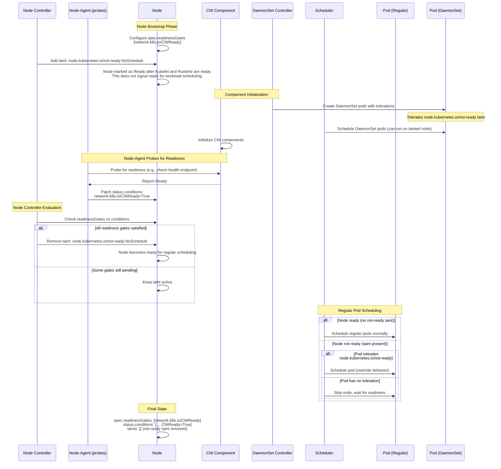

# KEP-5233: Node Readiness Gates

> **Status**: Based on recent API feedback, this KEP is revising its approach to explore a simpler design with less operational risks. The focus is now on using node-local 'probing mechanisms' to verify readiness, rather than relying on multiple agents with broader permissions to patch Node objects.
>
> We will narrow the scope to well-known readiness requirements that can be defined at node provisioning time. This KEP will also avoid introducing a new cluster-scoped CRD, to reduce the risk of global misconfiguration.

<!-- toc -->
- [Release Signoff Checklist](#release-signoff-checklist)
- [Summary](#summary)
- [Motivation](#motivation)
  - [Goals](#goals)
  - [Non-Goals](#non-goals)
- [Proposal](#proposal)
  - [Main Idea](#main-idea)
  - [User Stories](#user-stories)
    - [Story 1: Ensuring Comprehensive Network Readiness](#story-1-ensuring-comprehensive-network-readiness)
    - [Story 2: Reliable Readiness Signal for Autoscaling](#story-2-reliable-readiness-signal-for-autoscaling)
    - [Story 3: Security Agent / Policy Readiness](#story-3-security-agent--policy-readiness)
  - [Notes/Constraints/Caveats (Optional)](#notesconstraintscaveats-optional)
  - [Risks and Mitigations](#risks-and-mitigations)
- [Design Details](#design-details)
  - [High Level Design:](#high-level-design)
  - [API Changes:](#api-changes)
    - [Justification for a new API field](#justification-for-a-new-api-field)
  - [Readiness Taint Control](#readiness-taint-control)
    - [Evaluation Logic](#evaluation-logic)
  - [Labels for Readiness Gates](#labels-for-readiness-gates)
  - [Probing Mechanisms (Optional)](#probing-mechanisms-optional)
    - [Kubelet Local Probing](#kubelet-local-probing)
    - [Node Problem Detector](#node-problem-detector)
  - [Handling Ready -&gt; Not Ready Transitions](#handling-ready---not-ready-transitions)
    - [Node Readiness Transition:](#node-readiness-transition)
    - [Component Readiness Transition:](#component-readiness-transition)
  - [Test Plan](#test-plan)
      - [Prerequisite testing updates](#prerequisite-testing-updates)
      - [Unit tests](#unit-tests)
      - [Integration tests](#integration-tests)
      - [e2e tests](#e2e-tests)
  - [Graduation Criteria](#graduation-criteria)
  - [Upgrade / Downgrade Strategy](#upgrade--downgrade-strategy)
  - [Version Skew Strategy](#version-skew-strategy)
- [Production Readiness Review Questionnaire](#production-readiness-review-questionnaire)
  - [Feature Enablement and Rollback](#feature-enablement-and-rollback)
  - [Rollout, Upgrade and Rollback Planning](#rollout-upgrade-and-rollback-planning)
  - [Monitoring Requirements](#monitoring-requirements)
  - [Dependencies](#dependencies)
  - [Scalability](#scalability)
  - [Troubleshooting](#troubleshooting)
- [Implementation History](#implementation-history)
- [Drawbacks](#drawbacks)
- [Alternatives](#alternatives)
  - [Relying Solely On Retries (Eventual Consistency)](#relying-solely-on-retries-eventual-consistency)
  - [Initial Taints without a Central API](#initial-taints-without-a-central-api)
  - [Cluster-Scoped NodeReadinessRule CRD](#cluster-scoped-nodereadinessrule-crd)
- [Infrastructure Needed (Optional)](#infrastructure-needed-optional)
<!-- /toc -->

## Release Signoff Checklist

Items marked with (R) are required _prior to targeting to a milestone / release_.

1. (R) Enhancement issue in release milestone, which links to KEP dir in [kubernetes/enhancements](https://git.k8s.io/enhancements) (not the initial KEP PR)
1. (R) KEP approvers have approved the KEP status as `implementable`
1. (R) Design details are appropriately documented
1. (R) Test plan is in place, giving consideration to SIG Architecture and SIG Testing input (including test refactors)
    1. e2e Tests for all Beta API Operations (endpoints)
    1. (R) Ensure GA e2e tests meet requirements for [Conformance Tests](https://github.com/kubernetes/community/blob/master/contributors/devel/sig-architecture/conformance-tests.md)
    1. (R) Minimum Two Week Window for GA e2e tests to prove flake free

1. (R) Graduation criteria is in place
    1. (R) [all GA Endpoints](https://github.com/kubernetes/community/pull/1806) must be hit by [Conformance Tests](https://github.com/kubernetes/community/blob/master/contributors/devel/sig-architecture/conformance-tests.md)

1. (R) Production readiness review completed
1. (R) Production readiness review approved
1. "Implementation History" section is up-to-date for milestone
1. User-facing documentation has been created in [kubernetes/website](https://git.k8s.io/website), for publication to [kubernetes.io](https://kubernetes.io/)
1. Supporting documentation—e.g., additional design documents, links to mailing list discussions/SIG meetings, relevant PRs/issues, release notes

## Summary

This proposal introduces a formal mechanism, Node Readiness Gates, to prevent workloads from being scheduled onto new nodes until all required infrastructure components are fully initialized. This applies to essential node-level components like CNI plugins, DRA/CSI drivers, and security scanners, the requirements that can typically be defined at node provisioning time.

The proposal focuses on two core changes:

1. Adding a `readinessGates` field directly to the `NodeSpec`. This provides an explicit list of `conditionTypes` that must be `True` before a node is considered fully operational.

2. Introducing a new, extensible probing mechanism within the Kubelet responsible for performing the health checks that produce these conditions.

The node is considered fully-schedulable only when these components are confirmed operational by meeting thir respective readiness conditions. This mechanism complements the existing Kubelet managed `Ready` condition by providing granular control over node-schedulability.

## Motivation

Currently, a Node's `Ready` condition primarily reflects the Kubelet's health, basic network setup (via CNI config), and its ability to run a basic pod sandbox. However, many clusters often rely on critical DaemonSets or agents (e.g., for device driver readiness, network connectivity, storage, or applying security policies) that need to be fully functional on a node _before_ general application pods are scheduled onto it.  
Scheduling application pods onto a node where these critical components are not yet fully configured can lead to:

-  Pods starting in an insecure or non-compliant state.
-  Pods with network dependencies, like a CNI plugin or a service mesh, can fail if they start before the required network DaemonSets are ready. This can leave a pod without an IP address or prevent it from being correctly configured within the service mesh.
-  Non-preferred pods are scheduled onto the node before driver installation and readiness state is achieved, filling up valuable node capacity.

### Goals

The primary goals of this KEP are to:

1. Establish clear semantics using `NodeSpec` for declaring desired prerequisites (gates) and `NodeStatus` for reporting observed operational readiness (conditions) in node, aligning with Kubernetes API conventions.
1. Define a standard API field (`spec.readinessGates`) on the Node object to specify required readiness conditions beyond the default Kubelet `Ready` state.
1. Establish a standard pattern for gating a node's schedulability based on a set of required readiness conditions. The enforcement of these gates will be managed by a controller that applies a taint (e.g., `node.kubernetes.io/not-ready`) until all required conditions are met.
1. Centralize readiness reporting through a trusted, node-local probing mechanism (such as Kubelet or Node-Problem-Detector). This entity would be responsible for probing components and patching `node.status.Conditions`, which improves security by removing the need for multiple external agents to hold `nodes/status` patch permissions.
1. Improve scheduling correctness by also considering the reliability of the node lifecycle by preventing application pods from being scheduled onto nodes until declared readiness gates are met. 


### Non-Goals

This KEP does not aim to 

1. Replace the existing Kubelet-managed `Ready` condition. Node Readiness Gates act as an additional check.
1. Define the implementation details of the readiness probing mechanism itself. This KEP focuses on consuming the resulting conditions, depending on feedback, if necessary, Kubelet based prober could be addressed in a future KEP.
1. Define a new RPC for standardizing component-readiness. This KEP focuses on consuming the existing health signals in components for synthesizing readiness conditions.
1. Guarantee general pod admission order on node-bootstrap or recovery. While this KEP will enable DaemonSets' pods to be deployed earlier than non-daemon-pods until readiness-requirements are met, it does not provide a comprehensive solution for all arbitrary pod startup ordering.
1. Directly modify Kubelet's admission or pod-startup logic for existing pods. This KEP does not implement changes within Kubelet to make it actively check NodeReadinessGates or their corresponding `status.Conditions` before starting or restarting pods already assigned to the Node.
1. Directly manage pod execution on the node. Node Readiness Gates are a mechanism to only gate the scheduling of new pods based on declared readiness requirements. It does not evict or manage the life-cycle of pods already running on the node beyond the initial scheduling decision influenced by the gates.
1. To handle runtime readiness state changes. This proposal focuses on gating the initial schedulability of a node at bootstrap time. Reacting to components becoming unready during the node's lifecycle (e.g., during agent restarts or failures) is a distinct problem that is not addressed by this KEP.

## Proposal

### Main Idea

This proposal's core idea is to make a node's transition to a fully schedulable state dependent not only on the Kubelet's default `Ready` condition but also on custom criteria defined by the cluster administrator.

The mechanism works as follows:

1. A Node is created with 'readiness-probes' configuration and well-defined taint(s) for holding node-scheduling - referred in this KEP as __gates__.
2. The readiness status of essential components (like CNI plugins or CSI/DRA drivers) is reported as `Conditions` in the `NodeStatus`.
3. These `Conditions` are updated by reliable, node-local entities (such as Node-Problem-Detector or Kubelet itself), which probe the configured components' health-endpoints and update the `/status` sub-resource.
4. This allows a controller to gate the node's schedulability. The node is considered fully available for pod scheduling only when these custom readiness `Conditions` are met.

This approach allows critical components to directly influence when a node is ready, complementing the existing `Ready` condition with more granular, user-defined control.

### User Stories

#### Story 1: Ensuring Comprehensive Network Readiness

As a cluster administrator, I want to prevent application pods from being scheduled onto nodes until all crucial network components are fully operational (ref: [kubernetes/kubernetes#130594](https://github.com/kubernetes/kubernetes/issues/130594))

#### Story 2: Reliable Readiness Signal for Autoscaling

As a cluster operator, I want to ensure the scaling decisions are accurate to prevent overprovisioning and stuck pods awaiting resources: 

-  Enable custom resources (eg: GPUs) and DRA resource drivers to self-publish their ready states, so the Pods can't schedule on it until they are available, and Cluster-Autoscaler does not perform unnecessary scale-up. (ref: [kubernetes/autoscaler/7780](https://github.com/kubernetes/autoscaler/issues/7780)) 
-  Allow CSI plugins to signal their operational readiness, providing accurate CSI node awareness to the Scheduler and Cluster-Autoscaler to prevent overcommitting. (ref: [kubernetes/autoscaler#8083](https://github.com/kubernetes/autoscaler/pull/8083)) 

#### Story 3: Security Agent / Policy Readiness

As a cluster administrator, I need a kubernetes native mechanism to prevent application pods from being scheduled onto nodes where essential security or compliance-enforcing components are not yet fully operational. 

### Notes/Constraints/Caveats (Optional)

The following constraints are assumed based on the components for:

1. The initial implementation would only support probes that involve host-network calls, such as HTTP and gRPC probes. This covers the majority of use cases where a node-level component (like a CNI plugin or driver) exposes a health endpoint on the node.
1. Exec probes, which involve running arbitrary commands, will not be supported by this mechanism. Allowing the Kubelet to execute arbitrary commands from a configuration for readiness checking poses a significant security risk, since these commands would run in the Kubelet's privileged context on the host.

### Risks and Mitigations

1. Adding a new, extensible probing framework to the Kubelet increases its complexity and can introduce performance overhead for Kubelet, a critical node component.

    **Mitigation**:
- Probe configurations will include parameters like `periodSeconds` and `timeoutSeconds`, allowing administrators to tune the probing frequency.
- The entire feature, including the Kubelet prober, will be controlled by a feature flag (`NodeReadinessGates`), disabled by default.

2. An administrator misconfiguring a probe in the Kubelet (e.g., incorrect port) could cause the probe to fail permanently. This would prevent the associated condition from ever becoming `True`, leaving the node perpetually tainted and unschedulable.

    **Mitigation**:
- Kubelet will emit Warning events on the Node object to report probe failures.
- The cluster-admin must manually remove the taint and/or modify the failing configuration from the node.

3. The Kubelet plugins (CSI/DRA) do not have standardized rpc for readiness-probes that can be utilized.

    **Mitigation**:
-  The feature can be delivered incrementally. The `httpGet` probe provides immediate value for networking use-cases. The rpcs to use with `grpc` probes for Storage or DRA use-cases will be defined after engagement with SIG-Storage and other relevant SIGs through separate KEP processes.

## Design Details

### High Level Design:



### API Changes:

1. `NodeSpec.ReadinessGates` **(New Field)**
-  Add an optional field `readinessGates` to `NodeSpec`.
-  Type: `[]NodeReadinessGate`
-  `NodeReadinessGate` struct

```go
// NodeReadinessGate specifies a condition that  must be true for the node to be considered fully-schedulable.
type NodeReadinessGate {
  // ConditionType refers to a condition in the Node's `status.Condition` array with matching type.
  // Each conditionType must be unique within node.spec.readinessGates
  // +required
  ConditionType v1.NodeConditionType `json:”conditionType”`
}

// NodeSpec describes the attributes that a node is created with
type NodeSpec struct {
  // existing fields..

  // ReadinessGates give declared readiness-requirements for node. 
  // This field is immutable. It can only be set during node creation.
  //
  // +featureGate=NodeReadinessGates
  // +optional
  ReadinessGates []NodeReadinessGate `json:"readinessGates,omitempty" patchStrategy:"merge" patchMergeKey:"conditionType"`
}
```

Example Node Manifest:

```yaml
apiVersion: v1
kind: Node
metadata:
  name: gpu-node-1
spec:
  # ... existing fields
  readinessGates:
    # A list of condition types that must be 'True' for the node to be considered ready.
    - conditionType: "vendor.example.com/DeviceDriverReady"
    - conditionType: "vendor.example.com/NetworkReady"
```

2. `NodeStatus.Conditions` **(Existing Field):**
-  This existing array would be used by Kubelet to report the status of the conditions listed in `spec.readinessGates`.
-  The external controller would add or update entries in this array, setting the type to match the gate's `conditionType`, and setting the `status` field to `"True"`, `"False"`, or `"Unknown"`, along with `reason` and `message` fields for details.

3. **API Validation:** 
-  `ConditionType` within `ReadinessGates` must be unique.
-  Each `ConditionType` must have a matching probe-configuration for Kubelet.
-  Node `readinessGates` are immutable and can be only defined by Kubelet at bootstrap time.

#### Justification for a new API field

While Kubernetes aims to minimize changes to core APIs, a new field is justified here because the controller needs to know which of the different conditions in `node.status.conditions` to monitor.

An alternative that was considered is to infer readiness-requirements from initial-taints with an assumed pattern. However, this pattern is brittle and can lead to a "taint deadlock". For instance, it will be problematic in environments when dependencies are managed by different teams/providers. Ensuring every critical daemonset tolerates every other potential readiness taint is unreliable and creates tight coupling between unrelated components.

Beyond providing a scheduling contract, explicit readiness conditions serve as a critical signal for other core Kubernetes components, such as the Cluster Autoscaler, where taints fail to provide the right signal. For instance, CA will know whether storage-driver is fully ready with volume limits initialized, before scaling up. Separating this signal from taints will not block scheduling of other workloads without storage needs with taints.

Without an explicit field like `spec.readinessGates`, the controller has no declarative, machine-readable way to determine the readiness contract for a given node. The readinessGates field provides a clear, simple, and discoverable contract on the Node object itself, defining exactly which conditions must be met.

### Readiness Taint Control

This KEP suggests using the well-known taint `node.kubernetes.io/not-ready:NoSchedule` already used by Kubernetes to signal node-readiness issues for semantic consistency. This taint is applied by admission control on new nodes and removed by node-controller upon Ready signal from Node.

Extend the node controller logic to:
1. Observe the node readiness gates
1. If the readiness conditions are not satisfied ensure `node.kubernetes.io/not-ready:NoSchedule` taint is present.
1. Only after Ready condition is established and all readiness-gates are met, remove the taint.

#### Evaluation Logic

A Node would be considered fully ready for scheduling general workloads only if:

1. The standard `Ready` condition in `node.status.conditions` has `status: "True"`.
1. **AND** all declared gates are satisfied:
    1. For _every_ `conditionType` listed in `node.spec.readinessGates`, there is a corresponding entry in `node.status.conditions` with `status: "True"`. If a declared gate's condition is missing from the status, the gate is considered as not satisfied.

### Labels for Readiness Gates

To improve the integration of node readiness-gates, each gate supported by a node will be represented by a unique label within a reserved namespace: `readiness-gate.<gate-name>: true`. This approach is consistent with existing node metadata practices, such as topology labels and NFD feature discovery labels. This will enable users to be able to easily select nodes based on specific readiness gates using label selectors and node affinity rules.

Kubelet will dynamically manage these labels during node-status synchronization. Kubelet will detect the configured readiness gates and ensure corresponding labels are set and cleaned up if necessary. This ensures advertised node readiness-gates are accurate throughout the node-lifecycle.

### Probing Mechanisms (Optional)

To support `readinessGates`, there could be a privileged node-local entity to probe the component readiness continuously. Based on the probe results, the node-agent will manage the lifecycle of the corresponding `conditionType` in the node's status, patching it when there is a status change after success / failure threshold is met.

#### Kubelet Local Probing

One option is to extend Kubelet with a new, extensible probing framework to evaluate probes and publis matching NodeConditions. This design could leverage existing `v1.Probe` struct for node-readiness configuration.

**Kubelet Configuration Example**

```yaml
# Hypothetical Kubelet Configuration
nodeReadinessProbes:
  - name: "NetworkReady"
    conditionType: "vendor.example.com/NetworkReady"
    probe:
      httpGet:
        host: "127.0.0.1"
        port: 9090
        path: "/healthz"
    periodSeconds: 15
    failureThreshold: 3
  - name: "StorageReady"
    conditionType: "abc.other-vendor.example.com/StorageReady"
    probe:
      grpc:
        port: 19808
    initialDelaySeconds: 20
    periodSeconds: 10
```

**Pros:**

- Integrating the readiness-probes with Kubelet gives advantages such as tighter coupling with pod-lifecycle (probing starts after kubelet is Ready).  
- Kubelet already tracks pod status changes on the node, it will allow future possibilities to efficiently track certain critical pod-readiness as node conditions instead of polling. 

**Cons**

- Kubelet cannot support Exec probes, running arbitrary commands from a configuration, as it would pose a significant security risk for the primary node-agent running on the node, since these commands would run in the Kubelet's privileged context on the host.

#### Node Problem Detector

Node-Problem-Detector is another privileged node-daemon commonly run at kubernetes nodes, that already reports NodeConditions. It is easily extensible to support probing mechanisms to monitor critical component readiness.

**Pros:**

- Cleaner and easier integration; already has established solutions for even advanced predicates such as log-counter, socket availability or systemd state.
- Fits well with the existing Kubernetes patterns for condition reporting.
- Avoids complexity and risk in Kubelet, while giving component owners flexibility to develop custom logic for retry / failure handling etc.

**Cons**

- Primary drawback is the operational complexity, especially in managed-k8s environments where npd itself is managed as a daemonset rollout, and creates a chicken-and-egg problem, making it architecturally less suitable for NPD to be the gatekeeper in certain scenarios. Managing the rollout, configuration, and health of the NPD DaemonSet will need to be carefully planned to avoid disruptions.
- Standalone NPD deployments need to configure longer initial-timeouts to account for kubelet readiness, consequentially causing increased latency for node readiness.

### Handling Ready -> Not Ready Transitions

This KEP does not intend to solve runtime readiness protection (non-goal) with the proposed  mechanism. Though readinessGates could detect probe failures and set the node as not-ready on transition to failures, this guardrail depends largely on the configured timeouts. Since there is a reconciliation delay, there is no guaranteed protection against race-conditions on restarts or ready transitions.  

#### Node Readiness Transition:

When there is a node reboot or kubelet restart, the node will get the persisted `status.Conditions` from etcd. However, this information might be outdated and requires components to reassert their current status.

**Scenarios:**
1. Node Reboots:
    - During node reboot, all pods in it, including the critical components mapping to conditions are also restarted.
    - NPD / Kubelet probers reassert their status and update the node conditions. If there are pending conditions, the node-controller will reconcile the status of the node and mark the nodes as `not-ready:NoSchedule`.
    - After all the declared critical readiness conditions are verified, the node-controller will remove the taint, re-enabling the scheduling on the node.

1. Kubelet restart:
    - When Kubelet restarts, the critical agent pods may still be running.
    - When probes are managed by Kubelet: if there's a change in component readiness state within the Kubelet restart duration, controller will get that transition only after the Kubelet probes are ready. However, if the restart duration is long enough to skip a node heart-beat (managed by Kubelet), controller will mark the node as unschedulable (existing behavior), and apply unreachable taints.
    - When probes are managed by NPD: Kubelet restart does not affect the probing mechanism and condition updates will monitor the critical components.

1. Network partition:
    - The agents on the node are running and probes are succeeding locally.
    - When there is loss of network, and the node-isolation lasts longer than the heart-beat timeout, the node-controller taints the node as ‘unhealthy’.
    - The scheduler will therefore not schedule new pods onto this node, regardless of the status (stale or not) of the custom gate conditions. The main Ready condition acts as a fundamental gate.
    - When network-connectivity is restored, Kubelet will update the main Ready condition to “True”. The probes will update their respective conditions. The scheduler will resume placing pods at the node once all the conditions are satisfied.

#### Component Readiness Transition:

1. **Component Fails:** A running component reports failure. The probing mechanism updates the corresponding node condition to `status:"False"`. The controller observes this change during its reconciliation loop. Because a required condition is no longer True, the controller re-applies the `node.kubernetes.io/not-ready:NoSchedule` taint.

1. **Component Fails:** If there's a critical component rollout, and the readiness-probe detected it as health-check failure (based on thresholds and timeout configurations), it will update a blocking condition for node-scheduling.

### Test Plan

[x] I/we understand the owners of the involved components may require updates to existing tests to make this code solid enough prior to committing the changes necessary to implement this enhancement.

##### Prerequisite testing updates

##### Unit tests

- API validation for the new `NodeSpec.readinessGates` field.
- Node Controller logic for taint-management based on `status.Conditions`.
- Verify readinessGates evaluation logic.

##### Integration tests

* Test node registration with gates defined.
* Test pod scheduling being blocked when gates are not met.
* Test pod scheduling succeeding when gates transition to `True`.
* Test existing scenarios with standard taints eg., `not-ready:NoExecute` for node timeout.

##### e2e tests

-  : 

### Graduation Criteria

* **Alpha:**
    * Feature implemented behind `NodeReadinessGates` feature gate, default `false`.
    * Basic unit and integration tests implemented.
    * Initial API definition (`NodeSpec.readinessGates`) available.

* **Beta:**
    * Feature gate default `true`.
    * e2e tests implemented and passing consistently.
    * Scalability and performance testing performed.
    *

* **GA:**
    *

### Upgrade / Downgrade Strategy

**Upgrade:**

* API server should be upgraded before the node / kubelets.
* Existing nodes without the `readinessGates` field will be ignored by the controller. They will continue to function as before.
* The nodes that need to be enforced with readiness control need to be provisioned with `spec.readinessGates` field. The controller will begin managing the `node.kubernetes.io/not-ready` taint on these new nodes.

**Downgrade:**

* Nodes should be downgraded before the API server. Administrators must ensure no Node objects have the `readinessGates` field set.
* When the feature gate is disabled, the API server will reject any new Node objects containing the readinessGates field.
* The readiness gate controller will stop. It will not automatically remove any existing taints. If a downgrade is performed on a cluster with tainted nodes, those nodes will remain unschedulable until the taints are manually removed by an administrator.

### Version Skew Strategy

Previous kubelets that do not support the feature will simply ignore the `readinessGates` field in their NodeSpec.

## Production Readiness Review Questionnaire

### Feature Enablement and Rollback

###### How can this feature be enabled / disabled in a live cluster?

- [x] Feature gate (also fill in values in `kep.yaml`)
  - Feature gate name: `NodeReadinessGates`
  - Components depending on the feature gate: kubelet, kube-apiserver, kube-controller-manager
- [ ] Other
  - Describe the mechanism:
  - Will enabling / disabling the feature require downtime of the control
    plane? It depends. Readiness requirements are declared per node and can be disabled per node by updating the individual spec. For fleet wide disablement, the control-plane needs to be restarted.
  - Will enabling / disabling the feature require downtime or reprovisioning
    of a node? No. spec update will disable the feature on the node.

###### Does enabling the feature change any default behavior?

No. This feature introduces a new API field. If it's unspecified at the spec, the default node behavior will remain the same.

###### Can the feature be disabled once it has been enabled (i.e. can we roll back the enablement)?

Yes. The feature gate should be disabled in the API server and controller needs to be restarted. If nodes were created with readinessGates field, those fields will be ignored by the node controller

###### What happens if we reenable the feature if it was previously rolled back?

If the feature is re-enabled, the readinessGates API field will become available again. The controller will start enforcing the readiness-conditions for the node. 

###### Are there any tests for feature enablement/disablement?

Yes, this will be covered in the unit tests and integration tests.

### Rollout, Upgrade and Rollback Planning

###### How can a rollout or rollback fail? Can it impact already running workloads?

This is an opt-in feature, and it does not change any default behavior. A bug in the node controller (managing readiness gates) could incorrectly apply or fail to remove taints, making new nodes permanently unschedulable.

###### What specific metrics should inform a rollback?

`kube_node_spec_taint{key="node.kubernetes.io/not-ready"}` A sharp and sustained increase in this kube-state metric would indicate a problem with nodes becoming ready. A significant, unexpected drop in schedulable node capacity cluster-wide.

###### Were upgrade and rollback tested? Was the upgrade->downgrade->upgrade path tested?

This will be tested before Alpha release.

###### Is the rollout accompanied by any deprecations and/or removals of features, APIs, fields of API types, flags, etc.?

No.

### Monitoring Requirements

###### How can an operator determine if the feature is in use by workloads?

If a node has `spec.readinessGates` configured, then the workloads that do not tolerate the `node.kubernetes.io/not-ready` taint will not be scheduled on the node until the conditions are satisfied.

###### How can someone using this feature know that it is working for their instance?

1. Events
    -  Event Reason:

1. API .status
    -  Condition name:
    -  Other field:

1. Other (treat as last resort)
    -  Details: Observe newly added nodes, they should appear with the `node.kubernetes.io/not-ready` taint, and this taint should be removed once the readiness conditions listed in `spec.readinessGates` transition to `True` in `node.status.conditions`.

###### What are the reasonable SLOs (Service Level Objectives) for the enhancement?

99% of nodes should have their not-ready taint removed within 10 seconds of the last required readiness condition becoming True.

###### What are the SLIs (Service Level Indicators) an operator can use to determine the health of the service?

1. Metrics
    -  Metric name: `readiness_gate_unschedulable_nodes_total` and `readiness_gate_controller_taint_removal_latency_seconds` will be added.
    -  [Optional] Aggregation method:
    -  Components exposing the metric: `kube-controller-manager`

1. Other (treat as last resort)
    -  Details:

###### Are there any missing metrics that would be useful to have to improve observability of this feature?

Following metrics will be added in kube-controller-manager:
-  `readiness_gate_controller_nodes_managed_total`: total number of nodes with `spec.readinessGates` defined
-  `readiness_gate_controller_unschedulable_nodes_total`: total number of nodes with `spec.readinessGates` defined and `node.kubernetes.io/not-ready` tainted
-  `readiness_gate_controller_taint_removal_latency_seconds`: taint (`node.kubernetes.io/not-ready`) removal latency in seconds.

### Dependencies

###### Does this feature depend on any specific services running in the cluster?

This feature relies on a functioning control-plane: kube-apiserver, kube-controller-manager and etcd for node state management.

### Scalability

###### Will enabling / using this feature result in any new API calls?

A potential increase in PATCH requests to Node objects for condition updates. This is the primary scalability concern.

###### Will enabling / using this feature result in introducing new API types?

Enabling this feature will introduce a new API field `readinessGates` in the node spec. Cluster autoscalers can directly pay attention to the existing `.status.conditions` on nodes to monitor the readiness gates.

###### Will enabling / using this feature result in any new calls to the cloud provider?

No.

###### Will enabling / using this feature result in increasing size or count of the existing API objects?

###### Will enabling / using this feature result in increasing time taken by any operations covered by existing SLIs/SLOs?

###### Will enabling / using this feature result in non-negligible increase of resource usage (CPU, RAM, disk, IO, ...) in any components?

###### Can enabling / using this feature result in resource exhaustion of some node resources (PIDs, sockets, inodes, etc.)?

### Troubleshooting

###### How does this feature react if the API server and/or etcd is unavailable?
1. Kubelet / npd/ node-agents will fail to PATCH the node status with any updates. It will log errors and retry until the API server is available.
2. The readiness gate controller will be unable to read node updates or remove taints.

Nodes will remain in their current state (tainted or not) until the API server is available again. No new nodes will become schedulable, and no changes to readiness state will be processed. The system will recover once connectivity is restored.

###### What are other known failure modes?

1. A node never becomes ready because a dependent component (e.g., CNI DaemonSet) fails to start and expose its health endpoint.
2. A Kubelet configuration contains an incorrect readiness gate (e.g., wrong condition name), causing probes to fail and the node to remain unschedulable.
3. The controller crashes or fails leader election, preventing it from removing taints from nodes that became ready.

###### What steps should be taken if SLOs are not being met to determine the problem?

1. If `readiness_gate_controller_unschedulable_nodes_total` metric is high, validate the control-plane components are working correctly. Make sure there is no communication errors between stuck-nodes and the control-plane components.
2. Identify one of the stuck nodes and describe its Conditions to find which readiness gate condition is not true to narrow down the problem to specific component. Run tests to verify whether the component is ready as expected.

## Implementation History

* 2025-06-16: Initial KEP published.
* 2025-10-05: KEP updated for milestone retargeting to 1.35.

## Drawbacks

* Adds complexity to the node readiness definition.
* Requires plugins / configurations to be written correctly to manage the status conditions. Misconfigured probes could render nodes perpetually unschedulable.
* Potential for increased `node.status` patch requests to the API server, although targeted patching of conditions should be manageable.
* Defining the right set of gates requires careful consideration by the cluster administrator.

## Alternatives

### Relying Solely On Retries (Eventual Consistency)

Like any distributed system, one could simply allow failures and rely on retries until operations eventually succeed. However, this reactive approach stands in contrast to the proactive management offered by Node Readiness Gates. A proactive system avoids cascading failures, a risk particularly in large-scale workloads like ML training jobs. This makes readiness-gates a critical guardrail for ensuring that complex dependencies are met before scheduling begins.

### Initial Taints without a Central API

This approach relies on the `--register-with-taints` flag to apply readiness taints during node startup. A controller discovers these taints via a `readiness.k8s.io/` prefix and manages them. While simpler, this lacks the flexibility and versioning of a dedicated API. Once the bootstrap taints are removed, the readiness requirements are lost. Additionally, it introduces operational complexity, requiring every critical DaemonSet to tolerate all potential readiness taints, which is impractical when components are managed by different teams or providers.

### Cluster-Scoped NodeReadinessRule CRD

An alternative design centered on a new CRD NodeReadinessRule, keeping the configuration outside of the node. This was rejected due to the risk of a single misconfigured CRD causing a large-scale cluster outage, making the node-local approach inherently safer.

CRD considered -

```yaml
apiVersion: readiness.k8s.io/v1
kind: NodeReadinessRule
metadata:
  name: networking-readiness
spec:
  nodeSelector:
    matchLabels:
      readiness-requirement: "network"
  requiredConditions:
  - type: "vendor.example.com/NetworkReady"
  - type: "vendor.example.com/LowLatencyInterconnectReady"
  taint:
    key: "readiness.k8s.io/network-pending"
    effect: NoSchedule  
```

## Infrastructure Needed (Optional)
