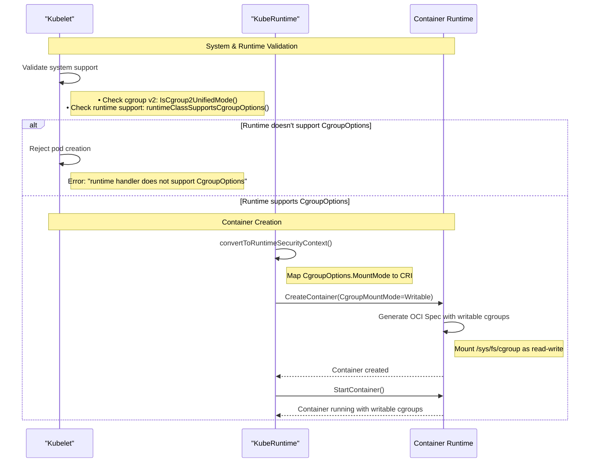

<!-- toc -->
- [Release Signoff Checklist](#release-signoff-checklist)
- [Summary](#summary)
- [Motivation](#motivation)
  - [Goals](#goals)
- [Proposal](#proposal)
  - [User Stories (Optional)](#user-stories-optional)
    - [Story 1: Container-in-Container Development](#story-1-container-in-container-development)
    - [Story 2: Dynamic Resource Management](#story-2-dynamic-resource-management)
    - [Story 3: Accessing Unsupported Cgroup Features](#story-3-accessing-unsupported-cgroup-features)
  - [Notes/Constraints/Caveats (Optional)](#notesconstraintscaveats-optional)
  - [Risks and Mitigations](#risks-and-mitigations)
  - [cpuset Isolation](#cpuset-isolation)
- [Design Details](#design-details)
  - [API Changes](#api-changes)
    - [Core API Types](#core-api-types)
    - [CRI API Changes](#cri-api-changes)
  - [Implementation Details](#implementation-details)
    - [CgroupOptions Implementation Flow](#cgroupoptions-implementation-flow)
    - [Validation](#validation)
  - [Test Plan](#test-plan)
      - [Prerequisite testing updates](#prerequisite-testing-updates)
      - [Unit tests](#unit-tests)
      - [Integration tests](#integration-tests)
      - [e2e tests](#e2e-tests)
  - [Graduation Criteria](#graduation-criteria)
    - [Alpha (v1.36)](#alpha-v136)
    - [Beta (v1.37)](#beta-v137)
    - [GA (v1.38)](#ga-v138)
  - [Upgrade / Downgrade Strategy](#upgrade--downgrade-strategy)
  - [Version Skew Strategy](#version-skew-strategy)
- [Production Readiness Review Questionnaire](#production-readiness-review-questionnaire)
  - [Feature Enablement and Rollback](#feature-enablement-and-rollback)
  - [Rollout, Upgrade and Rollback Planning](#rollout-upgrade-and-rollback-planning)
  - [Monitoring Requirements](#monitoring-requirements)
  - [Dependencies](#dependencies)
  - [Scalability](#scalability)
  - [Troubleshooting](#troubleshooting)
- [Implementation History](#implementation-history)
- [Drawbacks](#drawbacks)
- [Alternatives](#alternatives)
  - [Alternative 1: Runtime-specific Annotations](#alternative-1-runtime-specific-annotations)
  - [Alternative 2: Boolean Field Instead of Struct](#alternative-2-boolean-field-instead-of-struct)
  - [Alternative 3: Runtime Auto-Detection (Implicit Behavior)](#alternative-3-runtime-auto-detection-implicit-behavior)
- [Infrastructure Needed (Optional)](#infrastructure-needed-optional)
<!-- /toc -->

## Release Signoff Checklist


Items marked with (R) are required *prior to targeting to a milestone / release*.

- [ ] (R) Enhancement issue in release milestone, which links to KEP dir in [kubernetes/enhancements] (not the initial KEP PR)
- [ ] (R) KEP approvers have approved the KEP status as `implementable`
- [ ] (R) Design details are appropriately documented
- [ ] (R) Test plan is in place, giving consideration to SIG Architecture and SIG Testing input (including test refactors)
  - [ ] e2e Tests for all Beta API Operations (endpoints)
  - [ ] (R) Ensure GA e2e tests meet requirements for [Conformance Tests](https://github.com/kubernetes/community/blob/master/contributors/devel/sig-architecture/conformance-tests.md) 
  - [ ] (R) Minimum Two Week Window for GA e2e tests to prove flake free
- [ ] (R) Graduation criteria is in place
  - [ ] (R) [all GA Endpoints](https://github.com/kubernetes/community/pull/1806) must be hit by [Conformance Tests](https://github.com/kubernetes/community/blob/master/contributors/devel/sig-architecture/conformance-tests.md) 
- [ ] (R) Production readiness review completed
- [ ] (R) Production readiness review approved
- [ ] "Implementation History" section is up-to-date for milestone
- [ ] User-facing documentation has been created in [kubernetes/website], for publication to [kubernetes.io]
- [ ] Supporting documentation—e.g., additional design documents, links to mailing list discussions/SIG meetings, relevant PRs/issues, release notes


[kubernetes.io]: https://kubernetes.io/
[kubernetes/enhancements]: https://git.k8s.io/enhancements
[kubernetes/kubernetes]: https://git.k8s.io/kubernetes
[kubernetes/website]: https://git.k8s.io/website

## Summary

This KEP proposes adding a `CgroupOptions` struct field to the container SecurityContext in Kubernetes to allow unprivileged containers to have writable access to cgroup interfaces on cgroup v2 systems. This feature relies on the kernel's `nsdelegate` mount option to ensure containers can only manage their own cgroup subtrees, preventing unauthorized access to system resources. The explicit API field is required to provide visibility, policy enforcement, and defense-in-depth for this capability.

## Motivation

 With cgroup v2's secure delegation model, unprivileged containers can safely manage their own cgroup subtree without compromising system security. To support this, a configuration option can be introduced to ensure that, when cgroup v2 is enabled, the cgroup interface (/sys/fs/cgroup) is mounted with read-write permissions for containers.

By exposing the `CgroupOptions` field through the Kubernetes API and CRI interface, container runtimes can be updated to honor the setting via CRI, enabling unprivileged containers to take advantage of writable cgroups in a secure manner.

While the `nsdelegate` mount option makes this safe from a kernel isolation perspective, it represents a significant change in the container's capabilities. Requiring an explicit opt-in via the API ensures this capability is visible to cluster administrators, can be restricted via policy (e.g., Pod Security Standards), and maintains the principle of defense-in-depth by keeping the default secure and restricted.

Related Issues:
- https://github.com/containerd/containerd/issues/10924
- https://github.com/kubernetes/kubernetes/issues/121190

### Goals

- Add a `CgroupOptions` struct field to the container SecurityContext object for extensibility
- CRI API changes
- Integrate with Pod Security Standards to ensure appropriate security policy enforcement
- Container runtime modifications
- Maintain backward compatibility with existing workloads

## Proposal

Add a new `CgroupOptions` struct field to the `SecurityContext` in the core v1 API. This struct-based approach provides extensibility for future cgroup-related configurations. When `mountMode` is set to `Writable` on cgroup v2 systems, it instructs the container runtime to mount the cgroup filesystem with write permissions for the container's own cgroup subtree.

```yaml
apiVersion: v1
kind: Pod
metadata:
  name: writable-cgroups-example
spec:
  containers:
  - name: app
    image: myapp:latest
    securityContext:
      cgroupOptions:
        mountMode: Writable
```

### User Stories (Optional)

#### Story 1: Container-in-Container Development

As a developer, I need to run Docker-in-Docker for testing and development purposes. Currently, I need to use privileged containers which exposes unnecessary security risks. With `CgroupOptions.MountMode: Writable`, I can run these nested containers securely while still allowing them to manage their own resource constraints.

#### Story 2: Dynamic Resource Management

As a developer, I might want to create sub-cgroups for finer granularity and concise control over the different in-pod processes. For instance, distributed AI/ML frameworks like Ray can create sub-cgroups for each worker process and dynamically adjust CPU and memory limits based on workload patterns, enabling better resource utilization and isolation without requiring privileged access.
Another example is, [KubeVirt](https://github.com/kubevirt/kubevirt) runs a hypervisor and a guest VM in the same unprivileged pod which sometimes demands to divide the resources between the management layer (hypervisor + management processes) and the guest layer (e.g. vCPU processes). Currently the management of sub-cgroups is done by a privileged component in a somewhat hacky way, but with writable cgroups the unprivileged pod itself could create and manage these cgroups.

#### Story 3: Accessing Unsupported Cgroup Features

As a developer, I can make use of cgroup knobs that are not supported yet in Kubernetes. Examples are IO related knobs (e.g. io.latency. io.weight, etc)


### Notes/Constraints/Caveats (Optional)

- **cgroup v2 Only**: This feature requires cgroup v2 and will return an error on cgroup v1 systems
- **Linux Only**: The field is only valid on Linux containers and will be validated accordingly
- **Runtime Support**: Requires container runtime support
- **Node Configuration**: The host's cgroup v2 filesystem must be mounted with the `nsdelegate` option for this feature to function safely.
- **Security Context Integration**: Must work cohesively with other SecurityContext fields

### Risks and Mitigations

| Risk | Mitigation |
|------|------------|
| **Security Bypass**: Containers gaining unauthorized access to system cgroups | Only allow write access to container's own cgroup subtree. cgroup v2 delegation model provides isolation |
| **Resource Exhaustion**: Containers setting inappropriate resource limits | Kubernetes resource quotas and limit ranges still apply. Container cannot exceed pod-level limits |
| **Pod Security Policy Bypass**: Feature being used in restricted environments | Integration with Pod Security Standards to block in restricted profiles |
| **Runtime Incompatibility**: Feature not working with older runtimes | **Explicit Failure**: Kubelet rejects pods requesting `CgroupOptions` if the runtime does not support it, ensuring workloads don't run with incorrect assumptions. |
| **cpuset Isolation**: Containers could modify `cpuset.cpus` to access CPUs allocated to other workloads by CPU Manager. | The `nsdelegate` mount option for cgroup v2 prevents containers from modifying their own resource limits (like `cpuset.cpus`). They can only create and manage sub-cgroups within their allocated constraints. |

### cpuset Isolation

**Problem**: If a container has write access to its cgroup directory, it might attempt to modify sensitive resource limits like `cpuset.cpus` to access CPUs allocated to other workloads.

**Mitigation**:

The `nsdelegate` mount option for cgroup v2 provides kernel-level protection. When `/sys/fs/cgroup` is mounted with `nsdelegate`, and the container is in its own cgroup namespace, the kernel prevents the container from modifying its own resource limits. It can only create subdirectories (child cgroups) and manage resources within those sub-cgroups.

This feature relies on `nsdelegate` being supported and configured on the host. If the runtime cannot ensure this isolation (e.g., missing `nsdelegate` support), it MUST NOT enable writable cgroups for the container.

## Design Details

### API Changes

#### Core API Types

Add `CgroupOptions` struct field to `SecurityContext` in both internal and external API:

**File**: `pkg/apis/core/types.go`
```go
type SecurityContext struct {
    // ... existing fields ...
    
    // CgroupOptions controls cgroup filesystem access and configuration.
    // This allows unprivileged containers to manage their own cgroup hierarchies on cgroup v2 systems.
    // Only effective on Linux containers with cgroup v2.
    // +optional
    CgroupOptions *CgroupOptions
}

// CgroupOptions defines options for cgroup filesystem access.
type CgroupOptions struct {
    // MountMode controls whether the cgroup filesystem is mounted as writable.
    // Defaults to "ReadOnly" if not specified.
    // +optional
    MountMode *CgroupMountMode
}

// CgroupMountMode defines the mount mode for cgroup filesystem.
type CgroupMountMode string

const (
    // CgroupMountModeReadOnly mounts cgroup filesystem as read-only (default)
    CgroupMountModeReadOnly CgroupMountMode = "ReadOnly"
    
    // CgroupMountModeWritable mounts cgroup filesystem as writable,
    // allowing containers to manage their own cgroup subtree
    CgroupMountModeWritable CgroupMountMode = "Writable"
)
```

**Verify Runtime Support:**

1. Container runtime introspects its capabilities
2. Kubelet calls CRI Status() to get RuntimeHandlerFeatures  
3. Kubelet maps to internal RuntimeHandler structs
4. Node status update advertises capabilities via NodeRuntimeHandlerFeatures

**File**: `pkg/apis/core/types.go`
```go
type NodeRuntimeHandlerFeatures struct {
    // ... existing fields ...
    
    // SupportsCgroupOptions is set to true if the runtime handler supports CgroupOptions
    // as implemented in Kubernetes SecurityContext.
    // +featureGate=CgroupOptions
    // +optional
    SupportsCgroupOptions *bool
}
```

**File**: `pkg/kubelet/container/runtime.go`
```go
type RuntimeHandler struct {
    Name string
    SupportsRecursiveReadOnlyMounts bool
    SupportsUserNamespaces bool
    SupportsCgroupOptions bool
}
```

#### CRI API Changes

**File**: `cri-api/pkg/apis/runtime/v1/api.proto`
```protobuf
message LinuxContainerSecurityContext {
    // ... existing fields ...
    
    // cgroup_mount_mode controls how the cgroup filesystem is mounted.
    // "ReadOnly" (default) or "Writable" (allows container to manage its cgroup subtree).
    // Only effective with cgroup v2.
    string cgroup_mount_mode = 18;
}

// RuntimeHandlerFeatures is extended to advertise cgroup options support
message RuntimeHandlerFeatures {
    // ... existing fields ...
    
    // supports_cgroup_options is set to true if the runtime handler supports
    // the CgroupOptions field in SecurityContext.
    bool supports_cgroup_options = 3;
}
```

### Implementation Details

#### CgroupOptions Implementation Flow



#### Validation

**Runtime Handler Validation**

A validation check will be added in `startContainer`. If the runtime does not support this field, the Kubelet should return an error.

**File**: `pkg/kubelet/kuberuntime/kuberuntime_container.go`
```go
func (m *kubeGenericRuntimeManager) startContainer(ctx context.Context, podSandboxID string, podSandboxConfig *runtimeapi.PodSandboxConfig, spec *startSpec, pod *v1.Pod) (string, error) {
    for _, c := range pod.Spec.Containers {
        if c.SecurityContext != nil && c.SecurityContext.CgroupOptions != nil &&
           c.SecurityContext.CgroupOptions.MountMode != nil &&
           *c.SecurityContext.CgroupOptions.MountMode == v1.CgroupMountModeWritable {
            if !m.runtimeClassSupportsCgroupOptions(pod) {
                return fmt.Errorf("container %q requires CgroupOptions but runtime handler %q does not support it", 
                    container.Name, spec.pod.Spec.RuntimeClassName)
            }
        }
    }
}
```

**File**: `pkg/kubelet/kubelet_pods.go`
```go
func (kl *Kubelet) runtimeClassSupportsCgroupOptions(pod *v1.Pod) bool {
    if kl.runtimeClassManager == nil {
        return false
    }
    runtimeHandlerName, err := kl.runtimeClassManager.LookupRuntimeHandler(pod.Spec.RuntimeClassName)
    if err != nil {
        klog.ErrorS(err, "failed to look up the runtime handler", "runtimeClassName", pod.Spec.RuntimeClassName)
        return false
    }
    runtimeHandlers := kl.runtimeState.runtimeHandlers()
    return runtimeHandlerSupportsCgroupOptions(runtimeHandlerName, runtimeHandlers)
}

func runtimeHandlerSupportsCgroupOptions(runtimeHandlerName string, runtimeHandlers []kubecontainer.RuntimeHandler) bool {
    if len(runtimeHandlers) == 0 {
        return false
    }
    for _, h := range runtimeHandlers {
        if h.Name == runtimeHandlerName {
            return h.SupportsCgroupOptions
        }
    }
    klog.ErrorS(nil, "Unknown runtime handler", "runtimeHandlerName", runtimeHandlerName)
    return false
}
```


**System Validation**:

**File**: `pkg/apis/core/validation/validation.go`
```go
func ValidateSecurityContext(sc *core.SecurityContext, fldPath *field.Path) field.ErrorList {
    allErrs := field.ErrorList{}
    
    if sc.CgroupOptions != nil {
        // CgroupOptions is Linux-only
        if sc.WindowsOptions != nil {
            allErrs = append(allErrs, field.Invalid(fldPath.Child("cgroupOptions"), 
                sc.CgroupOptions, "cannot be set when WindowsOptions is specified"))
        }
    }
    
    return allErrs
}
```

**File**: `pkg/kubelet/kuberuntime/security_context.go`
```go
func (m *kubeGenericRuntimeManager) determineEffectiveSecurityContext(pod *v1.Pod, container *v1.Container, uid *int64, username string) (*runtimeapi.LinuxContainerSecurityContext, error) {
    effectiveSc := securitycontext.DetermineEffectiveSecurityContext(pod, container)
    synthesized := convertToRuntimeSecurityContext(effectiveSc)
    
    // Add CgroupOptions validation (following existing pattern)
    if effectiveSc.CgroupOptions != nil &&
       effectiveSc.CgroupOptions.MountMode != nil &&
       *effectiveSc.CgroupOptions.MountMode == v1.CgroupMountModeWritable {
        if !isCgroup2UnifiedMode() {
            return nil, fmt.Errorf("CgroupOptions.MountMode=Writable requires cgroup v2")
        }
    }
    
    return synthesized, nil
}
```

### Test Plan

[x] I/we understand the owners of the involved components may require updates to
existing tests to make this code solid enough prior to committing the changes necessary
to implement this enhancement.

##### Prerequisite testing updates

- Update existing SecurityContext validation tests to include CgroupOptions field
- Ensure backward compatibility with existing SecurityContext tests

##### Unit tests

Coverage for new and existing packages:

- `k8s.io/kubernetes/pkg/apis/core/validation`:  Unit tests for CgroupOptions validation logic, Linux-only constraints
- `k8s.io/kubernetes/pkg/kubelet/kuberuntime`: Security context conversion tests including CgroupOptions mapping
- `k8s.io/pod-security-admission/policy`: Pod Security Standards policy enforcement tests
- `k8s.io/kubernetes/pkg/apis/core/v1`:  API defaulting and conversion tests

##### Integration tests

- `TestCgroupOptionsSecurityContextValidation`: API server validation integration test ensuring Linux-only enforcement
- `TestPodSecurityStandardsCgroupOptions`: Pod Security Standards admission controller integration test
- `TestKubeletSecurityContextConversion`: Kubelet CRI conversion integration test

##### e2e tests

- `test/e2e_node/cgroup_options_test.go`: Node E2E tests covering:
  - Basic functionality (writable vs read-only cgroups)
  - Multi-container pods with mixed settings
  - Integration with other SecurityContext fields
  - cgroup v2 requirement validation
  - Containers not able to "escape" the resource limits set by the Pod
  - Runtime compatibility checks

### Graduation Criteria

#### Alpha (v1.36)

- Feature implemented behind a feature gate `CgroupOptions`
- Basic API, validation, and kubelet implementation complete
- CRI API and container runtime changes
- Unit and integration tests implemented
- Pod Security Standards integration complete
- Node E2E tests passing on v2 systems

#### Beta (v1.37)

- Feature gate enabled by default
- E2E tests stable and passing consistently
- At least one runtime supporting the feature in a released version
- User feedback incorporated from alpha testing

#### GA (v1.38)

- Feature stable and ready for production use
- Conformance tests implemented where applicable
- Documentation completed

### Upgrade / Downgrade Strategy

Enable/disable the feature gate

**Upgrade**: 
- New field is optional and defaults to `nil` (no change in behavior)
- Existing workloads continue to function without modification

**Update Flow**:
- `CgroupOptions` field is **immutable** after pod creation.
- Changes to `CgroupOptions` require pod recreation (delete + create)

**Downgrade**:

*Two scenarios depending on downgrade type:*

**Feature Gate Disabled (same Kubernetes version):**
- New pods with `cgroupOptions.mountMode: Writable` will have the field silently dropped to `nil`
- Existing pods with `cgroupOptions` continue to work
- No errors occur - field is accepted but ignored

**True Version Downgrade (to Kubernetes version without CgroupOptions field):**
- Pods with `cgroupOptions` field will be **rejected** with strict decoding error: `unknown field "spec.containers[0].securityContext.cgroupOptions"`
- Remove the field from pod specs before downgrading

### Version Skew Strategy

**kubelet vs Container Runtime**:
On unsupported runtimes, Kubelet will return an error.


## Production Readiness Review Questionnaire


### Feature Enablement and Rollback


###### How can this feature be enabled / disabled in a live cluster?

- [x] Feature gate (also fill in values in `kep.yaml`)
  - Feature gate name: `CgroupOptions`
  - Components depending on the feature gate: kubelet, kube-apiserver
- [ ] Other

The feature can be controlled via:
1. **Feature Gate**: `--feature-gates=CgroupOptions=true/false`
2. **Runtime Support**: Requires compatible container runtime
3. **Pod Specification**: Per-container `securityContext.cgroupOptions.mountMode` field

- Will enabling / disabling the feature require downtime of the control plane? **Yes**
- Will enabling / disabling the feature require downtime or reprovisioning of a node? **Yes** (kubelet restart required for feature gate changes)

###### Does enabling the feature change any default behavior?

**No**. The feature only affects containers that explicitly set `securityContext.cgroupOptions.mountMode: Writable`. Default behavior remains unchanged - containers continue to have read-only access to cgroup filesystem.

###### Can the feature be disabled once it has been enabled (i.e. can we roll back the enablement)?

**Yes**. Disabling the feature gate will:
- Prevent new pods with `cgroupOptions.mountMode: Writable` from being created
- Existing running containers continue with their current cgroup permissions until restart
- API server will reject new pods with the field set

###### What happens if we reenable the feature if it was previously rolled back?

New pods with `cgroupOptions.mountMode: Writable` can be created again. No data loss or corruption occurs during disable/enable cycles.

###### Are there any tests for feature enablement/disablement?

**Yes**. E2E tests will verify:
- Feature gate disabled: API rejects pods with cgroupOptions field
- Feature gate enabled: API accepts and kubelet processes the field correctly
- Runtime compatibility testing with and without feature support


### Rollout, Upgrade and Rollback Planning


###### How can a rollout or rollback fail? Can it impact already running workloads?


###### What specific metrics should inform a rollback?


###### Were upgrade and rollback tested? Was the upgrade->downgrade->upgrade path tested?


###### Is the rollout accompanied by any deprecations and/or removals of features, APIs, fields of API types, flags, etc.?


### Monitoring Requirements


###### How can an operator determine if the feature is in use by workloads?


###### How can someone using this feature know that it is working for their instance?


- [ ] Events
  - Event Reason: 
- [ ] API .status
  - Condition name: 
  - Other field: 
- [ ] Other (treat as last resort)
  - Details:

###### What are the reasonable SLOs (Service Level Objectives) for the enhancement?


###### What are the SLIs (Service Level Indicators) an operator can use to determine the health of the service?


- [ ] Metrics
  - Metric name:
  - [Optional] Aggregation method:
  - Components exposing the metric:
- [ ] Other (treat as last resort)
  - Details:

###### Are there any missing metrics that would be useful to have to improve observability of this feature?


### Dependencies


###### Does this feature depend on any specific services running in the cluster?


### Scalability


###### Will enabling / using this feature result in any new API calls?


###### Will enabling / using this feature result in introducing new API types?


###### Will enabling / using this feature result in any new calls to the cloud provider?


###### Will enabling / using this feature result in increasing size or count of the existing API objects?


###### Will enabling / using this feature result in increasing time taken by any operations covered by existing SLIs/SLOs?


###### Will enabling / using this feature result in non-negligible increase of resource usage (CPU, RAM, disk, IO, ...) in any components?


###### Can enabling / using this feature result in resource exhaustion of some node resources (PIDs, sockets, inodes, etc.)?


### Troubleshooting


###### How does this feature react if the API server and/or etcd is unavailable?

###### What are other known failure modes?


###### What steps should be taken if SLOs are not being met to determine the problem?

## Implementation History

- **2025-08-25**: KEP written and proposed
- **2026-02-05**: KEP refined to focus strictly on `nsdelegate` for isolation and justify API opt-in requirements
- **TBD**: Alpha implementation targeting v1.36
- **TBD**: Beta implementation targeting v1.37
- **TBD**: GA implementation targeting v1.38

## Drawbacks

1. **Runtime Dependency**: Feature requires specific container runtime versions.
1. **Security Complexity**: Adds another security dimension that may need to be considered in Pod Security Standards

## Alternatives

### Alternative 1: Runtime-specific Annotations
Similar to CRI-O's `io.kubernetes.cri-o.cgroup2-mount-hierarchy-rw` annotation approach.

**Pros**: No API changes required
**Cons**: Runtime-specific, not portable, harder to enforce security policies

### Alternative 2: Boolean Field Instead of Struct

Use a simple `WritableCgroups *bool` field instead of the `CgroupOptions` struct:

```go
type SecurityContext struct {
    // WritableCgroups controls whether the container has write access to cgroup interfaces.
    // +optional
    WritableCgroups *bool
}
```

```yaml
securityContext:
  writableCgroups: true
```

**Pros**: 
- Simpler API

**Cons**: 
- Not extensible for future cgroup-related configurations

The struct-based approach (`CgroupOptions`) was chosen to allow future extensibility.

### Alternative 3: Runtime Auto-Detection (Implicit Behavior)

Instead of a new API field, container runtimes could automatically detect if the host has `nsdelegate` enabled and, if so, mount cgroups as read-write.

**Pros**:
- No API changes required.
- "It just works" for configured nodes.

**Cons**:
- **Lack of Visibility**: Cluster administrators cannot easily identify which workloads are using this capability.
- **Policy Enforcement**: Admission controllers and security policies cannot restrict usage since it's not in the Pod spec.
- **Defense in Depth**: It removes a layer of defense. Even if `nsdelegate` is safe, keeping the default restricted protects against potential kernel bugs or implementation flaws.

## Infrastructure Needed (Optional)

- **Runtime Support**: Coordination with container runtime projects to adopt CRI API changes
- **Documentation**: Updates to Kubernetes documentation and security guides
