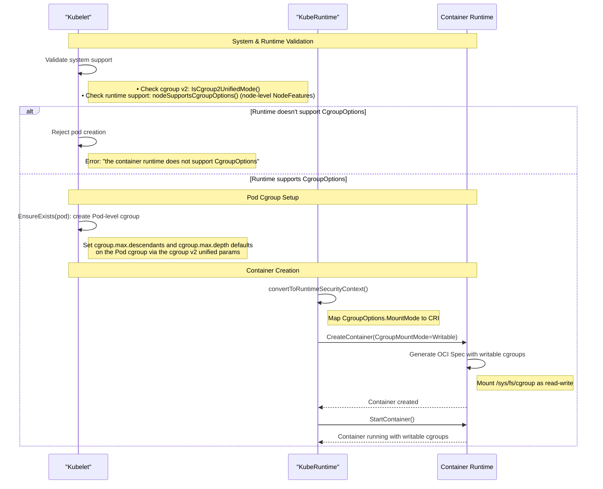

<!-- toc -->
- [Release Signoff Checklist](#release-signoff-checklist)
- [Summary](#summary)
- [Motivation](#motivation)
  - [Goals](#goals)
- [Proposal](#proposal)
  - [User Stories (Optional)](#user-stories-optional)
    - [Story 1: Container-in-Container Development](#story-1-container-in-container-development)
    - [Story 2: Dynamic Resource Management](#story-2-dynamic-resource-management)
  - [Notes/Constraints/Caveats (Optional)](#notesconstraintscaveats-optional)
  - [Risks and Mitigations](#risks-and-mitigations)
  - [cpuset Isolation](#cpuset-isolation)
  - [Verified Behavior](#verified-behavior)
    - [Descendant Cgroup Memory Accounting](#descendant-cgroup-memory-accounting)
- [Design Details](#design-details)
  - [API Changes](#api-changes)
    - [Core API Types](#core-api-types)
    - [CRI API Changes](#cri-api-changes)
      - [Descendant and Depth Limits (Pod-level, no CRI changes)](#descendant-and-depth-limits-pod-level-no-cri-changes)
  - [Implementation Details](#implementation-details)
    - [CgroupOptions Implementation Flow](#cgroupoptions-implementation-flow)
    - [Validation](#validation)
  - [Test Plan](#test-plan)
      - [Prerequisite testing updates](#prerequisite-testing-updates)
      - [Unit tests](#unit-tests)
      - [Integration tests](#integration-tests)
      - [e2e tests](#e2e-tests)
  - [Graduation Criteria](#graduation-criteria)
    - [Alpha](#alpha)
    - [Beta](#beta)
    - [GA](#ga)
  - [Upgrade / Downgrade Strategy](#upgrade--downgrade-strategy)
  - [Version Skew Strategy](#version-skew-strategy)
- [Production Readiness Review Questionnaire](#production-readiness-review-questionnaire)
  - [Feature Enablement and Rollback](#feature-enablement-and-rollback)
  - [Rollout, Upgrade and Rollback Planning](#rollout-upgrade-and-rollback-planning)
  - [Monitoring Requirements](#monitoring-requirements)
  - [Dependencies](#dependencies)
  - [Scalability](#scalability)
  - [Troubleshooting](#troubleshooting)
- [Implementation History](#implementation-history)
- [Drawbacks](#drawbacks)
- [Alternatives](#alternatives)
  - [Alternative 1: Runtime-specific Annotations](#alternative-1-runtime-specific-annotations)
  - [Alternative 2: Boolean Field Instead of Struct](#alternative-2-boolean-field-instead-of-struct)
  - [Alternative 3: Runtime Auto-Detection (Implicit Behavior)](#alternative-3-runtime-auto-detection-implicit-behavior)
  - [Alternative 4: Node-Level Configuration (NRI Plugin or CRI Config)](#alternative-4-node-level-configuration-nri-plugin-or-cri-config)
- [Infrastructure Needed (Optional)](#infrastructure-needed-optional)
<!-- /toc -->

## Release Signoff Checklist


Items marked with (R) are required *prior to targeting to a milestone / release*.

- [ ] (R) Enhancement issue in release milestone, which links to KEP dir in [kubernetes/enhancements] (not the initial KEP PR)
- [x] (R) KEP approvers have approved the KEP status as `implementable`
- [x] (R) Design details are appropriately documented
- [x] (R) Test plan is in place, giving consideration to SIG Architecture and SIG Testing input (including test refactors)
  - [ ] e2e Tests for all Beta API Operations (endpoints)
  - [ ] (R) Ensure GA e2e tests meet requirements for [Conformance Tests](https://github.com/kubernetes/community/blob/master/contributors/devel/sig-architecture/conformance-tests.md) 
  - [ ] (R) Minimum Two Week Window for GA e2e tests to prove flake free
- [x] (R) Graduation criteria is in place
  - [ ] (R) [all GA Endpoints](https://github.com/kubernetes/community/pull/1806) must be hit by [Conformance Tests](https://github.com/kubernetes/community/blob/master/contributors/devel/sig-architecture/conformance-tests.md) 
- [ ] (R) Production readiness review completed
- [ ] (R) Production readiness review approved
- [x] "Implementation History" section is up-to-date for milestone
- [ ] User-facing documentation has been created in [kubernetes/website], for publication to [kubernetes.io]
- [ ] Supporting documentation—e.g., additional design documents, links to mailing list discussions/SIG meetings, relevant PRs/issues, release notes


[kubernetes.io]: https://kubernetes.io/
[kubernetes/enhancements]: https://git.k8s.io/enhancements
[kubernetes/kubernetes]: https://git.k8s.io/kubernetes
[kubernetes/website]: https://git.k8s.io/website

## Summary

This KEP proposes adding a `CgroupOptions` struct field to the container SecurityContext in Kubernetes to allow unprivileged containers to have writable access to cgroup interfaces on cgroup v2 systems. This feature relies on the kernel's `nsdelegate` mount option to ensure containers can only manage their own cgroup subtrees, preventing unauthorized access to system resources. The explicit API field is required to provide visibility, policy enforcement, and defense-in-depth for this capability.

## Motivation

 With cgroup v2's secure delegation model, unprivileged containers can safely manage their own cgroup subtree without compromising system security. To support this, a configuration option can be introduced to ensure that, when cgroup v2 is enabled, the cgroup interface (/sys/fs/cgroup) is mounted with read-write permissions for containers.

By exposing the `CgroupOptions` field through the Kubernetes API and CRI interface, container runtimes can be updated to honor the setting via CRI, enabling unprivileged containers to take advantage of writable cgroups in a secure manner.

While the `nsdelegate` mount option makes this safe from a kernel isolation perspective, it represents a significant change in the container's capabilities. Requiring an explicit opt-in via the API ensures this capability is visible to cluster administrators, can be restricted via policy (e.g., Pod Security Standards), and maintains the principle of defense-in-depth by keeping the default secure and restricted.

Related Issues:
- https://github.com/containerd/containerd/issues/10924
- https://github.com/kubernetes/kubernetes/issues/121190

### Goals

- Add a `CgroupOptions` struct field to the container SecurityContext object for extensibility
- CRI API changes
- Integrate with Pod Security Standards to ensure appropriate security policy enforcement
- Container runtime modifications
- Maintain backward compatibility with existing workloads

## Proposal

Add a new `CgroupOptions` struct field to the `SecurityContext` in the core v1 API. This struct-based approach provides extensibility for future cgroup-related configurations. When `mountMode` is set to `Writable` on cgroup v2 systems, it instructs the container runtime to mount the cgroup filesystem with write permissions for the container's own cgroup subtree.

```yaml
apiVersion: v1
kind: Pod
metadata:
  name: writable-cgroups-example
spec:
  containers:
  - name: app
    image: myapp:latest
    securityContext:
      cgroupOptions:
        mountMode: Writable
```

### User Stories (Optional)

#### Story 1: Container-in-Container Development

As a developer, I need to run Docker-in-Docker for testing and development purposes. Currently, I need to use privileged containers which exposes unnecessary security risks. With `CgroupOptions.MountMode: Writable`, I can run these nested containers securely while still allowing them to manage their own resource constraints.

#### Story 2: Dynamic Resource Management

As a developer, I might want to create sub-cgroups for finer granularity and concise control over the different in-pod processes. For instance, distributed AI/ML frameworks like Ray can create sub-cgroups for each worker process and dynamically adjust CPU and memory limits based on workload patterns, enabling better resource utilization and isolation without requiring privileged access.
Another example is, [KubeVirt](https://github.com/kubevirt/kubevirt) runs a hypervisor and a guest VM in the same unprivileged pod which sometimes demands to divide the resources between the management layer (hypervisor + management processes) and the guest layer (e.g. vCPU processes). Currently the management of sub-cgroups is done by a privileged component in a somewhat hacky way, but with writable cgroups the unprivileged pod itself could create and manage these cgroups.


### Notes/Constraints/Caveats (Optional)

- **cgroup v2 Only**: This feature requires cgroup v2 and will return an error on cgroup v1 systems
- **Linux Only**: The field is only valid on Linux containers and will be validated accordingly
- **Runtime Support**: Requires container runtime support
- **Node Configuration**: The host's cgroup v2 filesystem must be mounted with the `nsdelegate` option for this feature to function safely.
- **Descendant Limits**: When `mountMode: Writable` is enabled, the kubelet sets conservative `cgroup.max.descendants` and `cgroup.max.depth` defaults directly on the Pod-level cgroup it already manages, bounding the entire Pod cgroup subtree. The kubelet applies conservative defaults at alpha; user-tunable overrides via the Pod spec can be considered at beta. This prevents unbounded cgroup creation from exhausting node resources; see [Verified Behavior](#verified-behavior).
- **Security Context Integration**: Must work cohesively with other SecurityContext fields

### Risks and Mitigations

| Risk | Mitigation |
|------|------------|
| **Security Bypass**: Containers gaining unauthorized access to system cgroups | Only allow write access to container's own cgroup subtree. cgroup v2 delegation model provides isolation |
| **Resource Exhaustion**: Containers setting inappropriate resource limits | Kubernetes resource quotas and limit ranges still apply. Container cannot exceed pod-level limits |
| **Pod Security Policy Bypass**: Feature being used in restricted environments | Integration with Pod Security Standards to block in restricted profiles |
| **Runtime Incompatibility**: Feature not working with older runtimes | **Explicit Failure**: Kubelet rejects pods requesting `CgroupOptions` if the runtime does not support it, ensuring workloads don't run with incorrect assumptions. |
| **cpuset Isolation**: Containers could modify `cpuset.cpus` to access CPUs allocated to other workloads by CPU Manager. | The `nsdelegate` mount option for cgroup v2 prevents containers from modifying their own resource limits (like `cpuset.cpus`). They can only create and manage sub-cgroups within their allocated constraints. |
| **Cgroup Descendant Exhaustion**: A container could create many descendant cgroups, exhausting node-level resources (memory and `inotify` watches were observed in the experiment) that are not counted against the container's `memory.max` limit, driving the node into `NotReady`. | When writable cgroups is enabled for a Pod, the kubelet sets `cgroup.max.descendants` and `cgroup.max.depth` on the Pod-level cgroup it already manages, bounding the whole Pod subtree. The kubelet applies conservative defaults at alpha (descendants on the order of hundreds, depth on the order of tens; specific values TBD during implementation); optional Pod-spec overrides can be considered at beta. See [Verified Behavior](#verified-behavior). |

### cpuset Isolation

**Problem**: If a container has write access to its cgroup directory, it might attempt to modify sensitive resource limits like `cpuset.cpus` to access CPUs allocated to other workloads.

**Mitigation**:

The `nsdelegate` mount option for cgroup v2 provides kernel-level protection. When `/sys/fs/cgroup` is mounted with `nsdelegate`, and the container is in its own cgroup namespace, the kernel prevents the container from modifying its own resource limits. It can only create subdirectories (child cgroups) and manage resources within those sub-cgroups.

This feature relies on `nsdelegate` being supported and configured on the host. If the runtime cannot ensure this isolation (e.g., missing `nsdelegate` support), it MUST NOT enable writable cgroups for the container.

### Verified Behavior

#### Descendant Cgroup Memory Accounting

A container with `cgroupOptions.mountMode: Writable` and `memory.max: 128Mi` running on a GKE node (COS 125, kernel 6.12.68+, cgroup v2) was able to create approximately 42,000 sibling cgroups before any `mkdir` failed.

During the test:

- Container `memory.current` grew from 97 MB to 122 MB (within its limit).
- Node `Slab` grew from 200 MB to over 800 MB.
- Node `MemAvailable` dropped from 14.3 GB to ~20 MB.
- Before `NotReady`, the node raised a `ResourceExhausted` condition for `inotify-pressure` (100% of one user's watch quota, 12,288 watches).
- The node entered `NotReady`.

The container stayed within its own `memory.max` while the node ran out of memory and exhausted the inotify watch quota of one user, so the container's memory limit alone does not bound node-level resource consumption from descendant cgroups. To enforce a bound, the kubelet sets `cgroup.max.descendants` and `cgroup.max.depth` on the Pod-level cgroup it already manages when writable cgroups is enabled for the Pod.

## Design Details

### API Changes

#### Core API Types

Add `CgroupOptions` struct field to `SecurityContext` in both internal and external API:

**File**: `pkg/apis/core/types.go`
```go
type SecurityContext struct {
    // ... existing fields ...
    
    // CgroupOptions controls cgroup filesystem access and configuration.
    // This allows unprivileged containers to manage their own cgroup hierarchies on cgroup v2 systems.
    // Only effective on Linux containers with cgroup v2.
    // +optional
    CgroupOptions *CgroupOptions
}

// CgroupOptions defines options for cgroup filesystem access.
type CgroupOptions struct {
    // MountMode controls whether the cgroup filesystem is mounted as writable.
    // Defaults to "ReadOnly" if not specified.
    // +optional
    MountMode *CgroupMountMode
}

// CgroupMountMode defines the mount mode for cgroup filesystem.
type CgroupMountMode string

const (
    // CgroupMountModeReadOnly mounts cgroup filesystem as read-only (default)
    CgroupMountModeReadOnly CgroupMountMode = "ReadOnly"
    
    // CgroupMountModeWritable mounts cgroup filesystem as writable,
    // allowing containers to manage their own cgroup subtree
    CgroupMountModeWritable CgroupMountMode = "Writable"
)
```

**Verify Runtime Support:**

Writable cgroup support is a CRI-implementation property that does not vary between runtime
handlers, so it is advertised via the node-level `RuntimeFeatures` (CRI) / `NodeFeatures`
(Kubernetes API), like `SupplementalGroupsPolicy`. The kubelet reads it from `Status()` and
advertises it in `NodeFeatures`.

**File**: `pkg/apis/core/types.go`
```go
type NodeFeatures struct {
    // ... existing fields (e.g. SupplementalGroupsPolicy) ...

    // SupportsCgroupOptions is set to true if the CRI implementation supports CgroupOptions.
    // +featureGate=CgroupOptions
    // +optional
    SupportsCgroupOptions *bool
}
```

#### CRI API Changes

**File**: `cri-api/pkg/apis/runtime/v1/api.proto`
```protobuf
message LinuxContainerSecurityContext {
    // ... existing fields ...
    
    // cgroup_mount_mode controls how the cgroup filesystem is mounted.
    // "ReadOnly" (default) or "Writable" (allows container to manage its cgroup subtree).
    // Only effective with cgroup v2.
    string cgroup_mount_mode = 18;
}

// RuntimeFeatures (node-level, independent of runtime handlers) propagates to NodeFeatures.
message RuntimeFeatures {
    // ... existing fields (e.g. supplemental_groups_policy) ...

    // supports_cgroup_options is set to true if the CRI implementation supports CgroupOptions.
    bool supports_cgroup_options = 2;
}
```

##### Descendant and Depth Limits (Pod-level, no CRI changes)

The descendant-exhaustion mitigation (see [Verified Behavior](#verified-behavior)) is handled
entirely by the kubelet on the Pod-level cgroup and is currently not part of the CRI
surface. When a Pod opts into writable cgroups, the kubelet sets `cgroup.max.descendants` and
`cgroup.max.depth` on the Pod cgroup it already creates and manages, which bounds the entire Pod
cgroup subtree (including any containers and their descendants).

The kubelet applies conservative defaults at alpha.

### Implementation Details

#### CgroupOptions Implementation Flow


```mermaid
sequenceDiagram
    participant Kubelet as "Kubelet"
    participant KubeRuntime as "KubeRuntime"
    participant Container Runtime

    Note over Kubelet,Container Runtime: System & Runtime Validation

    Kubelet->>Kubelet: Validate system support
    Note right of Kubelet: • Check cgroup v2: IsCgroup2UnifiedMode()<br/>• Check runtime support: nodeSupportsCgroupOptions() (node-level NodeFeatures)

    alt Runtime doesn't support CgroupOptions
        Kubelet->>Kubelet: Reject pod creation
        Note right of Kubelet: Error: "the container runtime does not support CgroupOptions"
    else Runtime supports CgroupOptions

        Note over Kubelet,Container Runtime: Pod Cgroup Setup

        Kubelet->>Kubelet: EnsureExists(pod): create Pod-level cgroup
        Note right of Kubelet: Set cgroup.max.descendants and cgroup.max.depth defaults<br/>on the Pod cgroup via the cgroup v2 unified params

        Note over Kubelet,Container Runtime: Container Creation
        
        KubeRuntime->>KubeRuntime: convertToRuntimeSecurityContext()
        Note right of KubeRuntime: Map CgroupOptions.MountMode to CRI

        KubeRuntime->>Container Runtime: CreateContainer(CgroupMountMode=Writable)
        
        Container Runtime->>Container Runtime: Generate OCI Spec with writable cgroups
        Note right of Container Runtime: Mount /sys/fs/cgroup as read-write

        Container Runtime-->>KubeRuntime: Container created
        
        KubeRuntime->>Container Runtime: StartContainer()
        Container Runtime-->>KubeRuntime: Container running with writable cgroups
    end
```

#### Validation

**Runtime Support Validation**

A validation check will be added in `startContainer`: if the runtime does not support this field, the kubelet returns an error. Support is node-level, so this is a single check against the node's `NodeFeatures`.

**File**: `pkg/kubelet/kuberuntime/kuberuntime_container.go`
```go
func (m *kubeGenericRuntimeManager) startContainer(ctx context.Context, podSandboxID string, podSandboxConfig *runtimeapi.PodSandboxConfig, spec *startSpec, pod *v1.Pod) (string, error) {
    for _, c := range pod.Spec.Containers {
        if c.SecurityContext != nil && c.SecurityContext.CgroupOptions != nil &&
           c.SecurityContext.CgroupOptions.MountMode != nil &&
           *c.SecurityContext.CgroupOptions.MountMode == v1.CgroupMountModeWritable {
            if !m.nodeSupportsCgroupOptions() {
                return fmt.Errorf("container %q requires CgroupOptions but the container runtime does not support it",
                    c.Name)
            }
        }
    }
}
```

**File**: `pkg/kubelet/kubelet_pods.go`
```go
// nodeSupportsCgroupOptions reports whether the CRI implementation advertised CgroupOptions
// support via the node-level RuntimeFeatures (independent of the runtime handler).
func (kl *Kubelet) nodeSupportsCgroupOptions() bool {
    features := kl.runtimeState.runtimeFeatures()
    return features != nil && features.SupportsCgroupOptions
}
```


**System Validation**:

**File**: `pkg/apis/core/validation/validation.go`
```go
func ValidateSecurityContext(sc *core.SecurityContext, fldPath *field.Path) field.ErrorList {
    allErrs := field.ErrorList{}
    
    if sc.CgroupOptions != nil {
        // CgroupOptions is Linux-only
        if sc.WindowsOptions != nil {
            allErrs = append(allErrs, field.Invalid(fldPath.Child("cgroupOptions"), 
                sc.CgroupOptions, "cannot be set when WindowsOptions is specified"))
        }
    }
    
    return allErrs
}
```

**File**: `pkg/kubelet/kuberuntime/security_context.go`
```go
func (m *kubeGenericRuntimeManager) determineEffectiveSecurityContext(pod *v1.Pod, container *v1.Container, uid *int64, username string) (*runtimeapi.LinuxContainerSecurityContext, error) {
    effectiveSc := securitycontext.DetermineEffectiveSecurityContext(pod, container)
    synthesized := convertToRuntimeSecurityContext(effectiveSc)
    
    // Add CgroupOptions validation (following existing pattern)
    if effectiveSc.CgroupOptions != nil &&
       effectiveSc.CgroupOptions.MountMode != nil &&
       *effectiveSc.CgroupOptions.MountMode == v1.CgroupMountModeWritable {
        if !isCgroup2UnifiedMode() {
            return nil, fmt.Errorf("CgroupOptions.MountMode=Writable requires cgroup v2")
        }
    }
    
    return synthesized, nil
}
```

**Pod-Level Descendant and Depth Limits**

When a Pod opts into writable cgroups, the kubelet sets conservative `cgroup.max.descendants` and
`cgroup.max.depth` defaults on the Pod-level cgroup it already manages. This is done through the
existing cgroup v2 `Unified` parameters on the Pod's `ResourceConfig`, which are written when the
Pod cgroup is created in `podContainerManagerImpl.EnsureExists`. No CRI changes are required, and
the bound applies to the whole Pod cgroup subtree.

**File**: `pkg/kubelet/cm/pod_container_manager_linux.go`
```go
// In EnsureExists / ResourceConfigForPod, when the pod opts into writable cgroups:
if podRequestsWritableCgroups(pod) && libcontainercgroups.IsCgroup2UnifiedMode() {
    if containerConfig.ResourceParameters.Unified == nil {
        containerConfig.ResourceParameters.Unified = map[string]string{}
    }
    // Conservative defaults; exact values finalized during implementation.
    containerConfig.ResourceParameters.Unified["cgroup.max.descendants"] = defaultMaxDescendants
    containerConfig.ResourceParameters.Unified["cgroup.max.depth"] = defaultMaxDepth
}
```

### Test Plan

[x] I/we understand the owners of the involved components may require updates to
existing tests to make this code solid enough prior to committing the changes necessary
to implement this enhancement.

##### Prerequisite testing updates

- Update existing SecurityContext validation tests to include CgroupOptions field
- Ensure backward compatibility with existing SecurityContext tests

##### Unit tests

Coverage for new and existing packages:

- `k8s.io/kubernetes/pkg/apis/core/validation`:  Unit tests for CgroupOptions validation logic, Linux-only constraints
- `k8s.io/kubernetes/pkg/kubelet/kuberuntime`: Security context conversion tests including CgroupOptions mapping
- `k8s.io/pod-security-admission/policy`: Pod Security Standards policy enforcement tests
- `k8s.io/kubernetes/pkg/apis/core/v1`:  API defaulting and conversion tests

##### Integration tests

- `TestCgroupOptionsSecurityContextValidation`: API server validation integration test ensuring Linux-only enforcement
- `TestPodSecurityStandardsCgroupOptions`: Pod Security Standards admission controller integration test
- `TestKubeletSecurityContextConversion`: Kubelet CRI conversion integration test

##### e2e tests

- `test/e2e_node/cgroup_options_test.go`: Node E2E tests covering:
  - Basic functionality (writable vs read-only cgroups)
  - Multi-container pods with mixed settings
  - Integration with other SecurityContext fields
  - cgroup v2 requirement validation
  - Containers not able to "escape" the resource limits set by the Pod
  - Runtime compatibility checks
- `critest`: a CRI conformance test in [cri-tools](https://github.com/kubernetes-sigs/cri-tools) exercising `cgroup_mount_mode` and the `supports_cgroup_options` advertisement, so container runtimes implementing the CRI API can validate conformance independently of Kubernetes.

### Graduation Criteria

#### Alpha

- **Alpha-1**
  - Feature implemented behind a feature gate `CgroupOptions`
  - Basic API, validation, and kubelet implementation completed

- **Alpha-2**
  - CRI API and container runtime changes
  - At least one runtime (containerd or CRI-O) implementing the CRI API merged to its dev branch or marked experimental, with an e2e test alongside, per the [CRI API dev policy](https://www.kubernetes.dev/docs/code/cri-api-dev-policies/#same-maturity-level-for-alpha)
  - Unit and integration tests implemented
  - Pod Security Standards integration complete
  - Node E2E tests passing on v2 systems

#### Beta

- Feature gate enabled by default
- E2E tests stable and passing consistently
- Both containerd and CRI-O support the feature in a released version, per the [CRI API dev policy](https://www.kubernetes.dev/docs/code/cri-api-dev-policies/#same-maturity-level-for-beta-and-ga)

#### GA

- Feature stable and ready for production use
- Conformance tests implemented where applicable
- Documentation completed

### Upgrade / Downgrade Strategy

Enable/disable the feature gate

**Upgrade**: 
- New field is optional and defaults to `nil` (no change in behavior)
- Existing workloads continue to function without modification

**Update Flow**:
- `CgroupOptions` field is **immutable** after pod creation.
- Changes to `CgroupOptions` require pod recreation (delete + create)

**Downgrade**:

*Two scenarios depending on downgrade type:*

**Feature Gate Disabled (same Kubernetes version):**
- New pods with `cgroupOptions.mountMode: Writable` will have the field silently dropped to `nil`
- Existing pods with `cgroupOptions` continue to work
- No errors occur - field is accepted but ignored

**True Version Downgrade (to Kubernetes version without CgroupOptions field):**
- Pods with `cgroupOptions` field will be **rejected** with strict decoding error: `unknown field "spec.containers[0].securityContext.cgroupOptions"`
- Remove the field from pod specs before downgrading

### Version Skew Strategy

**kubelet vs Container Runtime**:
On unsupported runtimes, Kubelet will return an error.


## Production Readiness Review Questionnaire


### Feature Enablement and Rollback


###### How can this feature be enabled / disabled in a live cluster?

- [x] Feature gate (also fill in values in `kep.yaml`)
  - Feature gate name: `CgroupOptions`
  - Components depending on the feature gate: kubelet, kube-apiserver
- [ ] Other

The feature can be controlled via:
1. **Feature Gate**: `--feature-gates=CgroupOptions=true/false`
2. **Runtime Support**: Requires compatible container runtime
3. **Pod Specification**: Per-container `securityContext.cgroupOptions.mountMode` field

- Will enabling / disabling the feature require downtime of the control plane? **Yes**
- Will enabling / disabling the feature require downtime or reprovisioning of a node? **Yes** (kubelet restart required for feature gate changes)

###### Does enabling the feature change any default behavior?

**No**. The feature only affects containers that explicitly set `securityContext.cgroupOptions.mountMode: Writable`. Default behavior remains unchanged - containers continue to have read-only access to cgroup filesystem.

###### Can the feature be disabled once it has been enabled (i.e. can we roll back the enablement)?

**Yes**. Disabling the feature gate will:
- Prevent new pods with `cgroupOptions.mountMode: Writable` from being created
- Existing running containers continue with their current cgroup permissions until restart
- API server will reject new pods with the field set

###### What happens if we reenable the feature if it was previously rolled back?

New pods with `cgroupOptions.mountMode: Writable` can be created again. No data loss or corruption occurs during disable/enable cycles.

###### Are there any tests for feature enablement/disablement?

**Yes**. E2E tests will verify:
- Feature gate disabled: API rejects pods with cgroupOptions field
- Feature gate enabled: API accepts and kubelet processes the field correctly
- Runtime compatibility testing with and without feature support


### Rollout, Upgrade and Rollback Planning

This section complements [Feature Enablement and Rollback](#feature-enablement-and-rollback) above with rollout-specific failure modes.

###### How can a rollout or rollback fail? Can it impact already running workloads?

Possible rollout failure modes:

- **Version skew (apiserver enabled, kubelet not)**: The apiserver accepts the field, but a kubelet running a version without the feature gate (or without the field) will not honor it. Pods schedule and start, but cgroups remain read-only, so workloads that need to create cgroups at runtime will not be able to.
- **Runtime missing CRI support**: If the container runtime does not advertise `supports_cgroup_options` via the node-level `NodeFeatures`, the kubelet rejects the pod with a clear error and the pod stays in `ContainerCreating`. No impact on other pods.
- **Host missing cgroup v2 or `nsdelegate`**: The kubelet rejects the pod with a validation error indicating the requirement. No impact on other pods.

Rollback (disabling the feature gate):

- New pods with `cgroupOptions.mountMode: Writable` are rejected by the apiserver.
- Existing running containers with writable cgroups continue to run with their current mount until the container restarts. After restart, if the gate is off, the container starts with read-only cgroups (which may break workloads that depend on writability).

No impact on workloads that do not opt in to the feature.

###### What specific metrics should inform a rollback?

No dedicated metrics for alpha. Existing kubelet pod-startup counters (`kubelet_started_pods_errors_total`, `kubelet_runtime_operations_errors_total`) do not carry a feature-level label that can isolate this feature's impact, so operators should:

- Audit which pods opt in (see the kubectl query under [Monitoring Requirements](#monitoring-requirements)).
- Watch the `FailedNodeDeclaredFeaturesCheck` event on those pods, which the kubelet emits when a pod requires a node feature that is not advertised by the runtime.
- Track restart rates for opted-in pods.

Whether to add a feature-specific dimension to existing counters is deferred to beta, contingent on observed adoption.

###### Were upgrade and rollback tested? Was the upgrade->downgrade->upgrade path tested?

TODO: requires the alpha implementation in kubernetes/kubernetes and a container runtime supporting the new CRI field. Plan: implement in kubernetes and containerd, then exercise the upgrade -> downgrade -> upgrade flow in `kind` (cheap to swap node images and flip feature gates). Cases to cover:

- Enable feature gate, create pod with `cgroupOptions.mountMode: Writable`, confirm container has writable `/sys/fs/cgroup`.
- Disable feature gate, confirm apiserver rejects new pods with the field, confirm previously-running pods continue until restart.
- Re-enable feature gate, confirm new pods can be created again.

True version downgrade behavior (to a kubernetes version without the field) is described under [Upgrade / Downgrade Strategy](#upgrade--downgrade-strategy).

###### Is the rollout accompanied by any deprecations and/or removals of features, APIs, fields of API types, flags, etc.?

No.


### Monitoring Requirements

###### How can an operator determine if the feature is in use by workloads?

By inspecting Pod specs:

```
kubectl get pods -A -o json \
  | jq '.items[] | select(.spec.containers[]?.securityContext.cgroupOptions.mountMode == "Writable") | {namespace: .metadata.namespace, name: .metadata.name}'
```

This follows the alpha pattern used by KEP-3857 (recursive read-only mounts) and KEP-4639 (OCI volume source). A dedicated metric can be considered at beta if there is demand.

###### How can someone using this feature know that it is working for their instance?

From inside the container:

- `mount | grep '^cgroup2'` should show `/sys/fs/cgroup` mounted with `rw`.
- `mkdir /sys/fs/cgroup/test && rmdir /sys/fs/cgroup/test` should succeed.

If the runtime does not advertise `supports_cgroup_options` via the node-level `NodeFeatures`, the kubelet emits a [`FailedNodeDeclaredFeaturesCheck`](https://github.com/kubernetes/kubernetes/blob/v1.36.0/pkg/kubelet/events/event.go#L42) event on the pod, the existing pattern for "pod requires a node feature that is not available." If the host is on cgroup v1 or lacks `nsdelegate`, pod startup fails with a kubelet validation error identifying the cause.

- [x] Events
  - Event Reason: `FailedNodeDeclaredFeaturesCheck` when the container runtime does not advertise `supports_cgroup_options`.
- [ ] API .status
- [ ] Other (treat as last resort)

###### What are the reasonable SLOs (Service Level Objectives) for the enhancement?

No dedicated SLOs at alpha. The feature does not add work to the pod-startup hot path beyond the runtime-support check described under [Scalability](#scalability), so existing pod startup SLOs continue to apply unchanged.

Beta will revisit whether a startup-latency SLO scoped to opted-in pods is warranted.

###### What are the SLIs (Service Level Indicators) an operator can use to determine the health of the service?

For alpha, existing kubelet SLIs apply:

- `kubelet_pod_start_duration_seconds`
- `kubelet_started_pods_errors_total`

- [ ] Metrics
- [x] Other (treat as last resort)
  - Details: For alpha, rely on existing kubelet metrics combined with pod-spec audit (above) and the `FailedNodeDeclaredFeaturesCheck` event for per-pod failure attribution.

###### Are there any missing metrics that would be useful to have to improve observability of this feature?

None planned for alpha. The dominant pattern for SecurityContext-adjacent alpha features (KEP-3857, KEP-4639, KEP-2400) is to defer dedicated metrics until beta. If beta uptake reveals a need for fleet-wide visibility, candidates to consider are: a per-feature label on existing pod-startup counters, or a dedicated `kubelet_writable_cgroup_pods` gauge (matching the KEP-127 pattern, which added `started_user_namespaced_pods_total` at beta).


### Dependencies

###### Does this feature depend on any specific services running in the cluster?

No new in-cluster services. The feature depends on:

- A Linux kernel with cgroup v2 support.
- The host's `/sys/fs/cgroup` mounted with the `nsdelegate` option (the default in modern systemd; required for safe operation, see [cpuset Isolation](#cpuset-isolation)).
- A container runtime that supports the new CRI `cgroup_mount_mode` field and advertises `supports_cgroup_options` via the node-level `NodeFeatures`.

### Scalability

###### Will enabling / using this feature result in any new API calls?

No.

###### Will enabling / using this feature result in introducing new API types?

No new top-level types. The feature adds a nested `CgroupOptions` struct and a `CgroupMountMode` string enum inside the existing `SecurityContext`.

###### Will enabling / using this feature result in any new calls to the cloud provider?

No.

###### Will enabling / using this feature result in increasing size or count of the existing API objects?

Marginal. Pods opting in to the feature add a small nested object containing a single string enum to their spec. Pods that do not opt in are unchanged.

###### Will enabling / using this feature result in increasing time taken by any operations covered by existing SLIs/SLOs?

No measurable impact. The per-pod runtime-support check is a single read of the node-level `NodeFeatures.SupportsCgroupOptions` bool (sourced from the CRI `RuntimeFeatures` already returned by `Status()`), with no per-runtime-handler lookup.

###### Will enabling / using this feature result in non-negligible increase of resource usage (CPU, RAM, disk, IO, ...) in any components?

No new background controllers, watchers, or periodic work. Resource consumption from cgroups created inside an opted-in container is bounded by the kubelet-enforced descendant and depth limits set on the Pod-level cgroup (see resource exhaustion discussion below).

###### Can enabling / using this feature result in resource exhaustion of some node resources (PIDs, sockets, inodes, etc.)?

Yes, without mitigation. A misbehaving or malicious container with writable cgroups can create many descendant cgroups; the resulting node-level resource consumption is not counted against the container's `memory.max` limit, so the container's own memory limit does not bound it (see [Verified Behavior](#verified-behavior)).

Mitigations:

- The kubelet sets `cgroup.max.descendants` and `cgroup.max.depth` on the Pod-level cgroup it already manages when `mountMode: Writable` is enabled for the Pod, bounding the whole Pod cgroup subtree.
- The kubelet uses conservative defaults at alpha; optional Pod-spec overrides can be considered at beta.
- The feature is opt-in via `cgroupOptions.mountMode: Writable`, so cluster administrators can restrict usage via Pod Security Standards or admission policies.


### Troubleshooting

###### How does this feature react if the API server and/or etcd is unavailable?

No different from existing pod creation. If the apiserver is unavailable, no new pods (including those opting in to writable cgroups) can be created. Pods already running with writable cgroups are unaffected; the feature has no runtime dependency on the control plane after pod startup.

###### What are other known failure modes?

| Failure | Detection | Mitigations | Diagnostics | Testing |
|---|---|---|---|---|
| Container runtime does not support the CRI field | Pod stuck in `ContainerCreating`; kubelet event indicates runtime does not support `CgroupOptions` | Use a runtime advertising `supports_cgroup_options`; or remove the field from the pod spec | kubelet logs; pod events | unit + integration tests |
| Host is on cgroup v1 | Pod startup fails with kubelet validation error: `CgroupOptions.MountMode=Writable requires cgroup v2` | Migrate the node to cgroup v2; or remove the field from the pod spec | kubelet logs; pod events | e2e on cgroup v1 nodes |
| Host's `/sys/fs/cgroup` is not mounted with `nsdelegate` | Container can write to its own root-of-namespace controller files, breaking the isolation guarantee this feature relies on | Mount `/sys/fs/cgroup` with `nsdelegate` on the host (the default in modern systemd); the runtime MUST refuse to enable writable cgroups otherwise | inspect mount options on the host with `findmnt /sys/fs/cgroup` | runtime contract; e2e validates `nsdelegate` is present |
| Container creates excessive descendant cgroups | `mkdir` returns `EAGAIN` once `cgroup.max.descendants` is hit; node `Slab` and `MemAvailable` remain stable when the Pod-level defaults are in place | Kubelet-enforced `cgroup.max.descendants` and `cgroup.max.depth` defaults on the Pod-level cgroup; without these defaults, a container can drive the node into `NotReady` (see [Verified Behavior](#verified-behavior)) | container logs; node `/proc/meminfo` `Slab`; `cat /sys/fs/cgroup/cgroup.stat` | e2e for descendant bound |

###### What steps should be taken if SLOs are not being met to determine the problem?

No SLOs at alpha. If pod startup latency degrades after enabling the feature gate:

1. Check kubelet logs for `CgroupOptions` validation errors.
2. Confirm the node advertises `SupportsCgroupOptions: true` in `NodeFeatures` via `kubectl get node -o yaml` (under `status.features`).
3. Confirm the host has cgroup v2 with `nsdelegate` (`findmnt /sys/fs/cgroup`).
4. Disable the feature gate as a rollback.

## Implementation History

- **2025-08-25**: KEP written and proposed
- **2026-02-05**: KEP refined to focus strictly on `nsdelegate` for isolation and justify API opt-in requirements
- **2026-06-08**: Per SIG-Node discussion, descendant/depth exhaustion is mitigated by the kubelet setting `cgroup.max.descendants`/`cgroup.max.depth` defaults on the Pod-level cgroup rather than via new CRI fields
- **TBD**: Alpha implementation targeting v1.37
- **TBD**: Beta implementation targeting v1.38
- **TBD**: GA implementation targeting v1.39

## Drawbacks

1. **Runtime Dependency**: Feature requires specific container runtime versions.
1. **Security Complexity**: Adds another security dimension that may need to be considered in Pod Security Standards

## Alternatives

### Alternative 1: Runtime-specific Annotations
Similar to CRI-O's `io.kubernetes.cri-o.cgroup2-mount-hierarchy-rw` annotation approach.

**Pros**: No API changes required
**Cons**: Runtime-specific, not portable, harder to enforce security policies

### Alternative 2: Boolean Field Instead of Struct

Use a simple `WritableCgroups *bool` field instead of the `CgroupOptions` struct:

```go
type SecurityContext struct {
    // WritableCgroups controls whether the container has write access to cgroup interfaces.
    // +optional
    WritableCgroups *bool
}
```

```yaml
securityContext:
  writableCgroups: true
```

**Pros**: 
- Simpler API

**Cons**: 
- Not extensible for future cgroup-related configurations

The struct-based approach (`CgroupOptions`) was chosen to allow future extensibility.

### Alternative 3: Runtime Auto-Detection (Implicit Behavior)

Instead of a new API field, container runtimes could automatically detect if the host has `nsdelegate` enabled and, if so, mount cgroups as read-write.

**Pros**:
- No API changes required.
- "It just works" for configured nodes.

**Cons**:
- **Lack of Visibility**: Cluster administrators cannot easily identify which workloads are using this capability.
- **Policy Enforcement**: Admission controllers and security policies cannot restrict usage since it's not in the Pod spec.
- **Defense in Depth**: It removes a layer of defense. Even if `nsdelegate` is safe, keeping the default restricted protects against potential kernel bugs or implementation flaws.

### Alternative 4: Node-Level Configuration (NRI Plugin or CRI Config)

Instead of a Kubernetes API change, administrators could enable writable cgroups opaquely at the node level. This could be done globally via a CRI configuration (e.g., containerd's `cgroup_writable = true`) or selectively via an NRI plugin (e.g., the experimental [writable-cgroups plugin](https://github.com/containerd/nri/pull/269)) that modifies the OCI spec during container creation.

**Pros**:
- No Kubernetes API changes required.
- Functionality is either available today (CRI config) or deployable out-of-band (NRI plugin).

**Cons**:
- **Pod Security Standards (PSS) Bypass**: Expanding access to a core control knob like cgroups is a security change. It must be visible to and enforceable by native PSS so it can be blocked in the Restricted profile. Node-level configurations apply opaquely, bypassing native PSS enforcement.
- **Violation of Least Privilege**: Cgroups and namespaces are control tools, not sandbox tools. 99% of workloads do not need writable access. Changing the default via CRI config silently over-privileges workloads, risking subtle and hard-to-troubleshoot behavior changes depending on the node a pod lands on.
- **Obscured Workload Intent**: Even if an NRI plugin selectively enables access based on custom annotations or labels, the requirement isn't captured as a first-class field in the Pod Spec. A native API field provides clear defense-in-depth, making the workload's privileges explicit, auditable, and governed directly by the control plane.

## Infrastructure Needed (Optional)

- **Runtime Support**: Coordination with container runtime projects to adopt CRI API changes
- **Documentation**: Updates to Kubernetes documentation and security guides
