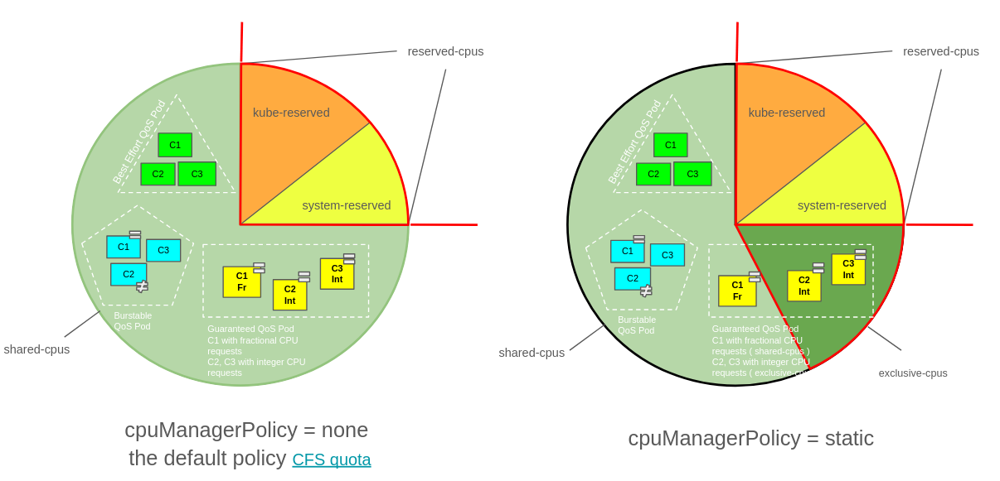
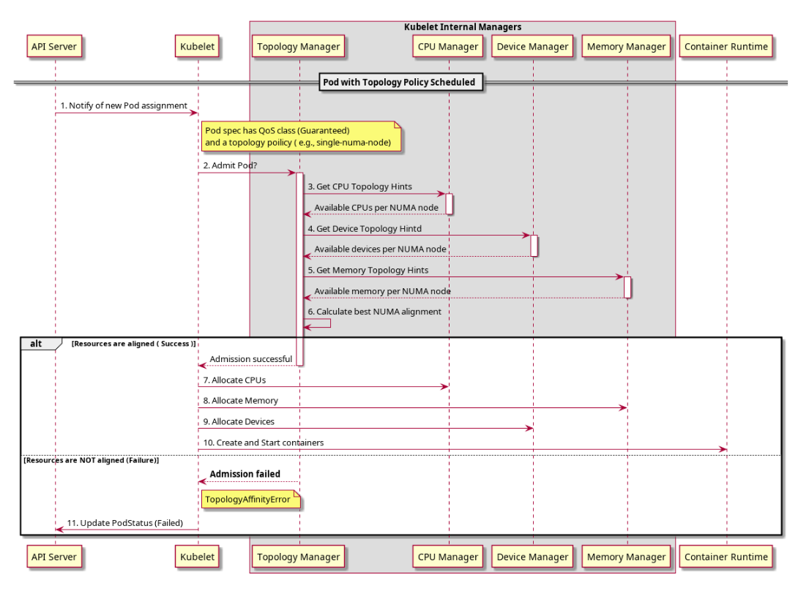
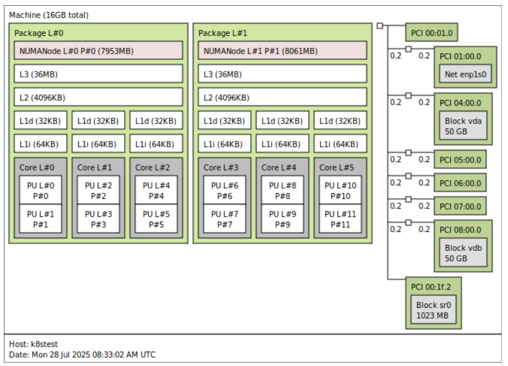
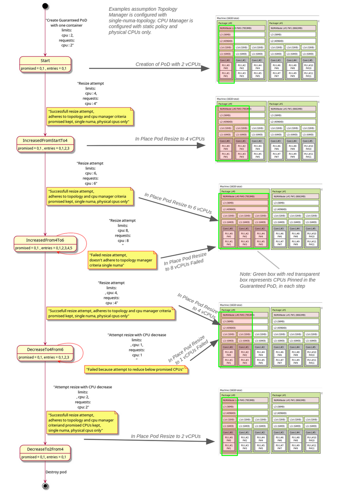

# KEP-5554: In-place Update Pod Resources alongside Static CPU Manager Policy
<!--
This is the title of your KEP. Keep it short, simple, and descriptive. A good
title can help communicate what the KEP is and should be considered as part of
any review.
-->

<!--
A table of contents is helpful for quickly jumping to sections of a KEP and for
highlighting any additional information provided beyond the standard KEP
template.

Ensure the TOC is wrapped with
  <code>&lt; !-- toc --&rt; &lt; !-- /toc --&rt; </code>
tags, and then generate with `hack/update-toc.sh` .
-->

<!-- toc -->
- [Release Signoff Checklist](#release-signoff-checklist)
- [Summary](#summary)
- [Motivation](#motivation)
  - [Goals](#goals)
  - [Non-Goals](#non-goals)
- [Background](#background)
  - [Feasible CPU Static Policy Options Combination matrix](#feasible-cpu-static-policy-options-combination-matrix)
  - [Kubelet CPU reservation](#kubelet-cpu-reservation)
  - [Kubelet interaction with Topology Manager](#kubelet-interaction-with-topology-manager)
  - [Pod Admission Topology Manager interactions](#pod-admission-topology-manager-interactions)
  - [Current behavior](#current-behavior)
- [Proposal](#proposal)
  - [Handling CPU Limit Increase](#handling-cpu-limit-increase)
  - [Handling CPU Limit Decrease](#handling-cpu-limit-decrease)
  - [Use Cases for CPU Resize](#use-cases-for-cpu-resize)
  - [What happens on CPU Resize failures](#what-happens-on-cpu-resize-failures)
  - [Checkpoint file example during resize](#checkpoint-file-example-during-resize)
  - [Supported CPU Static Policy Options Combination matrix](#supported-cpu-static-policy-options-combination-matrix)
  - [Risks and Mitigations](#risks-and-mitigations)
- [Design Details](#design-details)
  - [Implementation](#implementation)
    - [ContainerCPUs checkpoint](#containercpus-checkpoint)
  - [Future enhancements](#future-enhancements)
  - [Test Plan](#test-plan)
      - [Prerequisite testing updates](#prerequisite-testing-updates)
      - [Unit tests](#unit-tests)
      - [Integration tests](#integration-tests)
      - [e2e tests](#e2e-tests)
  - [Graduation Criteria](#graduation-criteria)
    - [Alpha](#alpha)
    - [Beta](#beta)
    - [GA](#ga)
  - [Upgrade / Downgrade Strategy](#upgrade--downgrade-strategy)
  - [Version Skew Strategy](#version-skew-strategy)
- [Production Readiness Review Questionnaire](#production-readiness-review-questionnaire)
  - [Feature Enablement and Rollback](#feature-enablement-and-rollback)
  - [Rollout, Upgrade and Rollback Planning](#rollout-upgrade-and-rollback-planning)
  - [Monitoring Requirements](#monitoring-requirements)
  - [Dependencies](#dependencies)
  - [Scalability](#scalability)
  - [Troubleshooting](#troubleshooting)
- [Implementation History](#implementation-history)
- [Drawbacks](#drawbacks)
- [Alternatives](#alternatives)
  - [Option 1: New field mustKeepCPUs in API](#option-1-new-field-mustkeepcpus-in-api)
  - [Option 2: Use a LIFO cpuset solution](#option-2-use-a-lifo-cpuset-solution)
  - [Option 3: Use NRI solution](#option-3-use-nri-solution)
<!-- /toc -->

## Release Signoff Checklist

<!--
**ACTION REQUIRED:** In order to merge code into a release, there must be an
issue in [kubernetes/enhancements] referencing this KEP and targeting a release
milestone **before the [Enhancement Freeze](https://git.k8s.io/sig-release/releases)
of the targeted release**.

For enhancements that make changes to code or processes/procedures in core
Kubernetes—i.e., [kubernetes/kubernetes], we require the following Release
Signoff checklist to be completed.

Check these off as they are completed for the Release Team to track. These
checklist items _must_ be updated for the enhancement to be released.
-->

Items marked with (R) are required *prior to targeting to a milestone / release*.

- [ ] (R) Enhancement issue in release milestone, which links to KEP dir in [kubernetes/enhancements] (not the initial KEP PR)
- [ ] (R) KEP approvers have approved the KEP status as `implementable`
- [ ] (R) Design details are appropriately documented
- [ ] (R) Test plan is in place, giving consideration to SIG Architecture and SIG Testing input (including test refactors)
  - [ ] e2e Tests for all Beta API Operations (endpoints)
  - [ ] (R) Ensure GA e2e tests meet requirements for [Conformance Tests](https://github.com/kubernetes/community/blob/master/contributors/devel/sig-architecture/conformance-tests.md)
  - [ ] (R) Minimum Two Week Window for GA e2e tests to prove flake free
- [ ] (R) Graduation criteria is in place
  - [ ] (R) [all GA Endpoints](https://github.com/kubernetes/community/pull/1806) must be hit by [Conformance Tests](https://github.com/kubernetes/community/blob/master/contributors/devel/sig-architecture/conformance-tests.md) within one minor version of promotion to GA
- [ ] (R) Production readiness review completed
- [ ] (R) Production readiness review approved
- [ ] "Implementation History" section is up-to-date for milestone
- [ ] User-facing documentation has been created in [kubernetes/website], for publication to [kubernetes.io]
- [ ] Supporting documentation—e.g., additional design documents, links to mailing list discussions/SIG meetings, relevant PRs/issues, release notes

<!--
**Note:** This checklist is iterative and should be reviewed and updated every time this enhancement is being considered for a milestone.
-->

[kubernetes.io]: https://kubernetes.io/
[kubernetes/enhancements]: https://git.k8s.io/enhancements
[kubernetes/kubernetes]: https://git.k8s.io/kubernetes
[kubernetes/website]: https://git.k8s.io/website

## Summary

<!--
This section is incredibly important for producing high-quality, user-focused
documentation such as release notes or a development roadmap. It should be
possible to collect this information before implementation begins, in order to
avoid requiring implementors to split their attention between writing release
notes and implementing the feature itself. KEP editors and SIG Docs
should help to ensure that the tone and content of the `Summary` section is
useful for a wide audience.

A good summary is probably at least a paragraph in length.
-->

This proposal enhances [KEP-1287 (In-place Resource Resize)](https://github.com/kubernetes/enhancements/tree/master/keps/sig-node/1287-in-place-update-pod-resources#summary) and [KEP-3570 (CPU Manager)](https://github.com/kubernetes/enhancements/tree/master/keps/sig-node/3570-cpumanager) features to support In-place cpu resource resizing of [Pods with Guaranteed Quality of Service](https://kubernetes.io/docs/concepts/workloads/pods/pod-qos/#guaranteed) (QoS) class if all four following conditions are satisfied:

 * In-place Resource Resize is enabled.
 * Static CPU management policy is enabled.
 * Topology manager policies can be adhered to.
 * CPUs allocated upon creation of Guaranteed QoS pods are maintained.

## Motivation

<!--
This section is for explicitly listing the motivation, goals, and non-goals of
this KEP.  Describe why the change is important and the benefits to users. The
motivation section can optionally provide links to [experience reports] to
demonstrate the interest in a KEP within the wider Kubernetes community.

[experience reports]: https://github.com/golang/go/wiki/ExperienceReports
-->

Supporting In-place cpu resource resize for Guaranteed QoS pods is crucial because it allows critical, performance-sensitive applications to adjust their CPU allocations without disruptive restarts.

For example in a [Data Plane Development Kit (DPDK)](https://www.dpdk.org/) based high-speed data packet networking application, at application startup:
 + DPDK libraries are initialized in the `main logical core (lcore 0)`. Please note that in DPDK, `lcore` refers to a logical execution unit of the processor, sometimes called a hardware thread.
 + `worker and I/O logical cores ( lcore > 0)` are also initialized, to handle packet processing and run on application's workload at RX and TX logical cores ( depending on the application ).
 + Those initial `DPDK logical cores` must be maintained during applications lifecycle, by design of core DPDK Environment Abstraction Layer (EAL) to ensure no disrupton.

Currently, in-place resource resizing is infeasible for Guaranteed QoS pods on nodes configured with a Static CPU Policy ( issue [#127262](https://github.com/kubernetes/kubernetes/issues/127262) ).

This proposal aims to implement this capability, which was a planned (but out-of-scope) enhancement for the In-Place Resource Resize feature.


### Goals

<!--
List the specific goals of the KEP. What is it trying to achieve? How will we
know that this has succeeded?
-->

* Ensure that the QoS class of the pod does not change during resize.
* Ensure CPU request and limit equality is maintained when a Guaranteed QoS Pod alongside CPU Manager static policy is resized successfully.
* Preserve the properties of the configured Topology Manager, CPU Manager during resize.
* Support CPU limit increase without container restart keeping originally configured CPU values (during pod creation on the Node),
  + maintains original NUMA affinity ( during pod creation of the Node ),
  + expands upon the original NUMA affinity, if needed, respecting the constraints of the topology manager policy in use.
* Support CPU limit decrease without container restart up to the originally configured CPU values (during pod creation on the Node),
  + maintains original NUMA affinity,
  + maintains parts or whole of previously expanded upon the original NUMA affinity ( from a previous CPU limit increase ), if needed, respecting the constraints of the topology manager policy in use.


### Non-Goals

<!--
What is out of scope for this KEP? Listing non-goals helps to focus discussion
and make progress.
-->

* Support CPU limit decrease below the originally configured values (during pod creation on the Node).
* Extend topology / cpu manager to do anything with CPU requests.

## Background

[KEP-693](https://github.com/kubernetes/enhancements/tree/master/keps/sig-node/693-topology-manager) introduced Topology Manager in `kubelet` for topology aligned resource allocation choices for a container. As of Kubernetes 1.35, the following policies are available:

* `none` ( GA, visible by default ) (1.18 or higher) [KEP-693](https://github.com/kubernetes/enhancements/tree/master/keps/sig-node/693-topology-manager)
* `best-effort` ( GA, visible by default ) (1.18 or higher) [KEP-693](https://github.com/kubernetes/enhancements/tree/master/keps/sig-node/693-topology-manager)
* `restricted` ( GA, visible by default ) (1.18 or higher) [KEP-693](https://github.com/kubernetes/enhancements/tree/master/keps/sig-node/693-topology-manager)
* `single-numa-mode` ( GA, visible by default ) (1.18 or higher) [KEP-693](https://github.com/kubernetes/enhancements/tree/master/keps/sig-node/693-topology-manager)

`TopologyManagerPolicyOptions` feature gate ( it is enabled by default ), allows the selection of topology manager allocation policies. As of kubernetes 1.35, the following policy options are visible by default provided that `TopologyManagerPolicyOptions` feature gate is enabled:

* `prefer-closest-numa-modes` ( GA, visible by default ) (1.32 or higher) [KEP-3545](https://github.com/kubernetes/enhancements/tree/master/keps/sig-node/3545-improved-multi-numa-alignment)
* `max-allowable-numa-modes` ( GA, visible by default ) (1.31 or higher)  [KEP-4622](https://github.com/kubernetes/enhancements/tree/master/keps/sig-node/4622-topologymanager-max-allowable-numa-nodes) 

[KEP-3570](https://github.com/kubernetes/enhancements/tree/master/keps/sig-node/3570-cpumanager) introduced the CPU Manager in `kubelet` for assigning pod containers to sets of CPUs on the local node. According to this KEP _“Kubernetes ships with two CPU Manager policies, only one policy is active at a time on a given node, chosen by the operator via Kubelet configuration. The policies are __none__ (default) and __static__ ( allows pods with certain resource characteristics to be granted increased CPU affinity and exclusivity on the node ).”_



`CPUManagerPolicyOptions` allow to fine-tune the behavior of the `static` policy. The details of each option are described in their own KEP. As of kubernetes 1.35, the following options are available:

* full-pcpus-only (GA, visible by default) (1.33 or higher) [KEP-2625](https://github.com/kubernetes/enhancements/tree/master/keps/sig-node/2625-cpumanager-policies-thread-placement)
* distribute-cpus-across-numa (beta, visible by default) (1.33 or higher) [KEP-2902](https://github.com/kubernetes/enhancements/tree/master/keps/sig-node/2902-cpumanager-distribute-cpus-policy-option),
* align-by-socket (alpha, hidden by default) (1.25 or higher) [KEP-3327](https://github.com/fromanirh/enhancements/blob/master/keps/sig-node/3327-align-by-socket/README.md)
* distribute-cpus-across-cores (alpha, hidden by default) (1.31 or higher) [KEP-4176](https://github.com/kubernetes/enhancements/tree/master/keps/sig-node/4176-cpumanager-spread-cpus-preferred-policy)
* strict-cpu-reservation (GA, visible by default) (1.35 or higher) [KEP-4540](https://github.com/kubernetes/enhancements/blob/master/keps/sig-node/4540-strict-cpu-reservation/README.md)
* prefer-align-cpus-by-uncorecache (beta, visible by default) (1.34 or higher) [KEP-4800](https://github.com/kubernetes/enhancements/tree/master/keps/sig-node/4800-cpumanager-split-uncorecache) 

### Feasible CPU Static Policy Options Combination matrix

Fine tuning of CPU Manager allows to combine [static policy options](https://kubernetes.io/docs/tasks/administer-cluster/cpu-management-policies/#cpu-policy-static--options), 34 combinations as of Kubernetes 1.35 are feasible, given that there are two constraints:

* full-pcpus-only is mutually exclusive with distribute-cpus-across-cores
* distribute-cpus-across-cores is mutually exclusive with distribute-cpus-across-numa.

The remaining options are independent and can be combined:

* align-by-socket,
* strict-cpu-reservation,
* prefer-align-cpus-by-uncorecache

The full combination matrix as of v1.35 , results to 34 feasible combinations. 64 logical combinations minus 30 combinations because they are not feasible ( 21-24, 29-32, 37-40, 45-48, 53-56, 61-64 ) as of v1.35. 

From the remaining 34 feasible combinations:
- Combination #35, is GA enabled by default
- Combination #1, #3 and #5 are GA but not enabled by default
- 5 combinations with at least one Beta Option
- 25 combinations with at least one Alpha Option

Please see following table for more details, please note in below table, 1 means feature is set, 0 means feature is not set.

| index | full-pcpus-only GA (GA, visible by default) (1.33 or higher) | distribute-cpus-across-numa (alpha, hidden by default) | align-by-socket (alpha, hidden by default) (1.25 or higher) | distribute-cpus-across-cores (alpha, hidden by default) (1.31 or higher) | strict-cpu-reservation GA (GA, visible by default) (1.35 or higher) | prefer-align-cpus-by-uncorecache (beta, visible by default) (1.34 or higher)<br><br><br> | Comment                                                                                                                                                  |
| ----- | ------------------------------------------------------------ | ------------------------------------------------------ | ----------------------------------------------------------- | ------------------------------------------------------------------------ | ------------------------------------------------------------------- | ---------------------------------------------------------------------------------------- | -------------------------------------------------------------------------------------------------------------------------------------------------------- |
| 1     | 0                                                            | 0                                                      | 0                                                           | 0                                                                        | 0                                                                   | 0                                                                                        | GA but not enabled by default                                                                                                                            |
| 2     | 0                                                            | 0                                                      | 0                                                           | 0                                                                        | 0                                                                   | 1                                                                                        | Beta                                                                                                                                                     |
| 3     | 0                                                            | 0                                                      | 0                                                           | 0                                                                        | 1                                                                   | 0                                                                                        | GA but not enabled by default                                                                                                                            |
| 4     | 0                                                            | 0                                                      | 0                                                           | 0                                                                        | 1                                                                   | 1                                                                                        | Beta                                                                                                                                                     |
| 5     | 0                                                            | 0                                                      | 0                                                           | 1                                                                        | 0                                                                   | 0                                                                                        | GA but not enabled by default                                                                                                                            |
| 6     | 0                                                            | 0                                                      | 0                                                           | 1                                                                        | 0                                                                   | 1                                                                                        | Alpha                                                                                                                                                    |
| 7     | 0                                                            | 0                                                      | 0                                                           | 1                                                                        | 1                                                                   | 0                                                                                        | Alpha                                                                                                                                                    |
| 8     | 0                                                            | 0                                                      | 0                                                           | 1                                                                        | 1                                                                   | 1                                                                                        | Alpha                                                                                                                                                    |
| 9     | 0                                                            | 0                                                      | 1                                                           | 0                                                                        | 0                                                                   | 0                                                                                        | Alpha                                                                                                                                                    |
| 10    | 0                                                            | 0                                                      | 1                                                           | 0                                                                        | 0                                                                   | 1                                                                                        | Beta                                                                                                                                                     |
| 11    | 0                                                            | 0                                                      | 1                                                           | 0                                                                        | 1                                                                   | 0                                                                                        | Alpha                                                                                                                                                    |
| 12    | 0                                                            | 0                                                      | 1                                                           | 0                                                                        | 1                                                                   | 1                                                                                        | Beta                                                                                                                                                     |
| 13    | 0                                                            | 0                                                      | 1                                                           | 1                                                                        | 0                                                                   | 0                                                                                        | Alpha                                                                                                                                                    |
| 14    | 0                                                            | 0                                                      | 1                                                           | 1                                                                        | 0                                                                   | 1                                                                                        | Alpha                                                                                                                                                    |
| 15    | 0                                                            | 0                                                      | 1                                                           | 1                                                                        | 1                                                                   | 0                                                                                        | Alpha                                                                                                                                                    |
| 16    | 0                                                            | 0                                                      | 1                                                           | 1                                                                        | 1                                                                   | 1                                                                                        | Alpha                                                                                                                                                    |
| 17    | 0                                                            | 1                                                      | 0                                                           | 0                                                                        | 0                                                                   | 0                                                                                        | Alpha                                                                                                                                                    |
| 18    | 0                                                            | 1                                                      | 0                                                           | 0                                                                        | 0                                                                   | 1                                                                                        | Alpha                                                                                                                                                    |
| 19    | 0                                                            | 1                                                      | 0                                                           | 0                                                                        | 1                                                                   | 0                                                                                        | Alpha                                                                                                                                                    |
| 20    | 0                                                            | 1                                                      | 0                                                           | 0                                                                        | 1                                                                   | 1                                                                                        | Alpha                                                                                                                                                    |
| 21    | 0                                                            | 1                                                      | 0                                                           | 1                                                                        | 0                                                                   | 0                                                                                        | Cannot be used as of v1.35 because distribute-cpus-across-cores and distribute-cpus-across-numa combination is not allowed by kubelet.                   |
| 22    | 0                                                            | 1                                                      | 0                                                           | 1                                                                        | 0                                                                   | 1                                                                                        | Cannot be used as of v1.35 because distribute-cpus-across-cores and distribute-cpus-across-numa combination is not allowed by kubelet.                   |
| 23    | 0                                                            | 1                                                      | 0                                                           | 1                                                                        | 1                                                                   | 0                                                                                        | Cannot be used as of v1.35 because distribute-cpus-across-cores and distribute-cpus-across-numa combination is not allowed by kubelet.                   |
| 24    | 0                                                            | 1                                                      | 0                                                           | 1                                                                        | 1                                                                   | 1                                                                                        | Cannot be used as of v1.35 because distribute-cpus-across-cores and distribute-cpus-across-numa combination is not allowed by kubelet.                   |
| 25    | 0                                                            | 1                                                      | 1                                                           | 0                                                                        | 0                                                                   | 0                                                                                        | Alpha                                                                                                                                                    |
| 26    | 0                                                            | 1                                                      | 1                                                           | 0                                                                        | 0                                                                   | 1                                                                                        | Beta                                                                                                                                                     |
| 27    | 0                                                            | 1                                                      | 1                                                           | 0                                                                        | 1                                                                   | 0                                                                                        | Alpha                                                                                                                                                    |
| 28    | 0                                                            | 1                                                      | 1                                                           | 0                                                                        | 1                                                                   | 1                                                                                        | Beta                                                                                                                                                     |
| 29    | 0                                                            | 1                                                      | 1                                                           | 1                                                                        | 0                                                                   | 0                                                                                        | Cannot be used as of v1.35 because distribute-cpus-across-cores and distribute-cpus-across-numa combination is not allowed by kubelet.                   |
| 30    | 0                                                            | 1                                                      | 1                                                           | 1                                                                        | 0                                                                   | 1                                                                                        | Cannot be used as of v1.35 because distribute-cpus-across-cores and distribute-cpus-across-numa combination is not allowed by kubelet.                   |
| 31    | 0                                                            | 1                                                      | 1                                                           | 1                                                                        | 1                                                                   | 0                                                                                        | Cannot be used as of v1.35 because distribute-cpus-across-cores and distribute-cpus-across-numa combination is not allowed by kubelet.                   |
| 32    | 0                                                            | 1                                                      | 1                                                           | 1                                                                        | 1                                                                   | 1                                                                                        | Cannot be used as of v1.35 because distribute-cpus-across-cores and distribute-cpus-across-numa combination is not allowed by kubelet.                   |
| 33    | 1                                                            | 0                                                      | 0                                                           | 0                                                                        | 0                                                                   | 0                                                                                        | GA                                                                                                                                                       |
| 34    | 1                                                            | 0                                                      | 0                                                           | 0                                                                        | 0                                                                   | 1                                                                                        | Beta                                                                                                                                                     |
| 35    | 1                                                            | 0                                                      | 0                                                           | 0                                                                        | 1                                                                   | 0                                                                                        | GA Enabled by Default                                                                                                                                    |
| 36    | 1                                                            | 0                                                      | 0                                                           | 0                                                                        | 1                                                                   | 1                                                                                        | Beta                                                                                                                                                     |
| 37    | 1                                                            | 0                                                      | 0                                                           | 1                                                                        | 0                                                                   | 0                                                                                        | Cannot be used as of v1.35 because distribute-cpus-across-cores and full-pcpus-only combination is not allowed by kubelet.                               |
| 38    | 1                                                            | 0                                                      | 0                                                           | 1                                                                        | 0                                                                   | 1                                                                                        | Cannot be used as of v1.35 because distribute-cpus-across-cores and full-pcpus-only combination is not allowed by kubelet.                               |
| 39    | 1                                                            | 0                                                      | 0                                                           | 1                                                                        | 1                                                                   | 0                                                                                        | Cannot be used as of v1.35 because distribute-cpus-across-cores and full-pcpus-only combination is not allowed by kubelet.                               |
| 40    | 1                                                            | 0                                                      | 0                                                           | 1                                                                        | 1                                                                   | 1                                                                                        | Cannot be used as of v1.35 because distribute-cpus-across-cores and full-pcpus-only combination is not allowed by kubelet.                               |
| 41    | 1                                                            | 0                                                      | 1                                                           | 0                                                                        | 0                                                                   | 0                                                                                        | Alpha                                                                                                                                                    |
| 42    | 1                                                            | 0                                                      | 1                                                           | 0                                                                        | 0                                                                   | 1                                                                                        | Beta                                                                                                                                                     |
| 43    | 1                                                            | 0                                                      | 1                                                           | 0                                                                        | 1                                                                   | 0                                                                                        | Alpha                                                                                                                                                    |
| 44    | 1                                                            | 0                                                      | 1                                                           | 0                                                                        | 1                                                                   | 1                                                                                        | Beta                                                                                                                                                     |
| 45    | 1                                                            | 0                                                      | 1                                                           | 1                                                                        | 0                                                                   | 0                                                                                        | Cannot be used as of v1.35 because distribute-cpus-across-cores and full-pcpus-only combination is not allowed by kubelet.                               |
| 46    | 1                                                            | 0                                                      | 1                                                           | 1                                                                        | 0                                                                   | 1                                                                                        | Cannot be used as of v1.35 because distribute-cpus-across-cores and full-pcpus-only combination is not allowed by kubelet.                               |
| 47    | 1                                                            | 0                                                      | 1                                                           | 1                                                                        | 1                                                                   | 0                                                                                        | Cannot be used as of v1.35 because distribute-cpus-across-cores and full-pcpus-only combination is not allowed by kubelet.                               |
| 48    | 1                                                            | 0                                                      | 1                                                           | 1                                                                        | 1                                                                   | 1                                                                                        | Cannot be used as of v1.35 because distribute-cpus-across-cores and full-pcpus-only combination is not allowed by kubelet.                               |
| 49    | 1                                                            | 1                                                      | 0                                                           | 0                                                                        | 0                                                                   | 0                                                                                        | Alpha                                                                                                                                                    |
| 50    | 1                                                            | 1                                                      | 0                                                           | 0                                                                        | 0                                                                   | 1                                                                                        | Alpha                                                                                                                                                    |
| 51    | 1                                                            | 1                                                      | 0                                                           | 0                                                                        | 1                                                                   | 0                                                                                        | Alpha                                                                                                                                                    |
| 52    | 1                                                            | 1                                                      | 0                                                           | 0                                                                        | 1                                                                   | 1                                                                                        | Alpha                                                                                                                                                    |
| 53    | 1                                                            | 1                                                      | 0                                                           | 1                                                                        | 0                                                                   | 0                                                                                        | Cannot be used as of v1.35 because distribute-cpus-across-cores , full-pcpus-only and distribute-cpus-across-numa combination is not allowed by kubelet. |
| 54    | 1                                                            | 1                                                      | 0                                                           | 1                                                                        | 0                                                                   | 1                                                                                        | Cannot be used as of v1.35 because distribute-cpus-across-cores , full-pcpus-only and distribute-cpus-across-numa combination is not allowed by kubelet. |
| 55    | 1                                                            | 1                                                      | 0                                                           | 1                                                                        | 1                                                                   | 0                                                                                        | Cannot be used as of v1.35 because distribute-cpus-across-cores , full-pcpus-only and distribute-cpus-across-numa combination is not allowed by kubelet. |
| 56    | 1                                                            | 1                                                      | 0                                                           | 1                                                                        | 1                                                                   | 1                                                                                        | Cannot be used as of v1.35 because distribute-cpus-across-cores , full-pcpus-only and distribute-cpus-across-numa combination is not allowed by kubelet. |
| 57    | 1                                                            | 1                                                      | 1                                                           | 0                                                                        | 0                                                                   | 0                                                                                        | Alpha                                                                                                                                                    |
| 58    | 1                                                            | 1                                                      | 1                                                           | 0                                                                        | 0                                                                   | 1                                                                                        | Alpha                                                                                                                                                    |
| 59    | 1                                                            | 1                                                      | 1                                                           | 0                                                                        | 1                                                                   | 0                                                                                        | Alpha                                                                                                                                                    |
| 60    | 1                                                            | 1                                                      | 1                                                           | 0                                                                        | 1                                                                   | 1                                                                                        | Alpha                                                                                                                                                    |
| 61    | 1                                                            | 1                                                      | 1                                                           | 1                                                                        | 0                                                                   | 0                                                                                        | Cannot be used as of v1.35 because distribute-cpus-across-cores , full-pcpus-only and distribute-cpus-across-numa combination is not allowed by kubelet. |
| 62    | 1                                                            | 1                                                      | 1                                                           | 1                                                                        | 0                                                                   | 1                                                                                        | Cannot be used as of v1.35 because distribute-cpus-across-cores , full-pcpus-only and distribute-cpus-across-numa combination is not allowed by kubelet. |
| 63    | 1                                                            | 1                                                      | 1                                                           | 1                                                                        | 1                                                                   | 0                                                                                        | Cannot be used as of v1.35 because distribute-cpus-across-cores , full-pcpus-only and distribute-cpus-across-numa combination is not allowed by kubelet. |
| 64    | 1                                                            | 1                                                      | 1                                                           | 1                                                                        | 1                                                                   | 1                                                                                        | Cannot be used as of v1.35 because distribute-cpus-across-cores , full-pcpus-only and distribute-cpus-across-numa combination is not allowed by kubelet. |

### Kubelet CPU reservation 

The Kubelet requires the total CPU reservation from `--kube-reserved` or `--system-reserved` and/or `--reserved-cpus` to be greater than zero when CPU management static policy is enabled. 


### Kubelet interaction with Topology Manager

In the below two sections we present sequence diagrams during Pod Admission and current behavior upon an InPlacePodVertical Scaling attempt of a Guaranteed QoS Pod with static CPU Manager policy enabled ( Kubernetes v1.35 is used at the time of writing of this KEP )

### Pod Admission Topology Manager interactions

Topology Manager calculates the best fit from the topology hints retrieved from the CPU, Device and Memory Manager Hint providers, during the attempt of assignment of a Pod with topology Policy scheduled. In this context best means a fit which adheres with the configured combination of Topology, CPU, Device and Memory manager considering also kubelet CPU reservations and refers to NUMA affinity.



Please note, the order of allocations and the order on which the resource managers are queried is as far as we know, a historical artifact and an implementation detail, there is no intrinsic ordering or priority.

### Current behavior

In-place resource resizing is infeasible for Guaranteed QoS pods on nodes configured with a Static CPU Policy ( issue [#127262](https://github.com/kubernetes/kubernetes/issues/127262) ). Any attempt of in-place resize for Guaranteed QoS pods with static CPU policy will fail and update status to `Infeasible`.

Kubernetes v1.32 [#128287](https://github.com/kubernetes/kubernetes/pull/128287) introduced `InPlacePodVerticalScalingExclusiveCPUs` feature gate to enable/disable in-place resize for guaranteedQOS pods with static CPU policy. 

With this KEPs implementation, when `InPlacePodVerticalScalingExclusiveCPUs` is enabled, [Resize CPU and Memory Resources assigned to Containers Node Policies limitation](https://kubernetes.io/docs/tasks/configure-pod-container/resize-container-resources/#limitations) is resolved thus Pods managed by static CPU policies can be resized in-place.

[Feature gate dependency functionality](https://github.com/kubernetes/kubernetes/pull/133697) will be leveraged to validate `InPlacePodVerticalScalingExclusiveCPUs` dependencies ( `InPlacePodVerticalScaling` and `CPUManager` ) at startup.

## Proposal

<!--
This is where we get down to the specifics of what the proposal actually is.
This should have enough detail that reviewers can understand exactly what
you're proposing, but should not include things like API designs or
implementation. What is the desired outcome and how do we measure success?.
The "Design Details" section below is for the real
nitty-gritty.
-->

### Handling CPU Limit Increase

As it was decided in [SIG Node meeting discussing static CPU policy support](https://www.youtube.com/watch?v=RuqzXH3liqg) and from feedback provided during the KEP review process. CPU limit increase of a running container of a Guaranteed Pod managed by Static CPU Policy: 

* Proposed to find a solution with local checkpoint without a `Last In First Out (LIFO) cpuset` or Node Resource Interface (NRI) solution.
* Must keep "original CPUs" of a running container of a Guaranteed Pod CPUs managed by static CPU policies.
  + “original CPUs” is the cpuset allocated when the container was admitted the first time, "original CPUs" is checkpointed in CPU Managers checkpoint file, please refer to [ContainerCPUs checkpoint](#containercpus-checkpoint) for more details of the proposed implementation using local storage.
  + “resized CPUs” is the cpuset allocated after a successful resize, the "resized CPUs" is always a superset of "original CPUs" i.e. `originalCPUs < resizedCPUS_A_UpSize < resizedCPUS_B_UpSize ... < resizedCPUs_N_UpSize` in case of N successive up sizes. 
* Attempt of allocating additional CPUs should adhere to the combination of Topology/Memory/CPU/Device/kubelet reservation policies
* Must work for all CPU sorting solutions within the socket scope
  + The two cpu sorting solutions today are NUMADistributed, NUMAPacked
* Must ensure reserved CPUs from [Kubelet CPU reservation](#kubelet-cpu-reservation) are kept during resize
* Must work for all [Supported CPU Static Policy Options Combination matrix](#supported-cpu-static-combination-matrix)

Introduction of the inner map items `Original` and `Resized` to checkpoint the corresponding CPUs for a running container ( `ContainerCPUs Checkpoint` for sort ), is meant to make internal upgrade and adaptation easier as we need to track the original CPU set allocated at admission and grant that set never be decreasing. Set must be explicit and recorded clearly in CPUManager checkpoint so it's always simple and safe to derive it. Final naming in the implementation can change a bit without changing concepts as expressed in this KEP.

When the CPU Manager, under a static policy, generates a NUMA Topology hint for a Guaranteed pod undergoing an in place CPU pod-resize, it follows these rules to determine the new affinity:

* The pod's current NUMA Affinity (single or multiple NUMA nodes) can accommodate the resized CPU request. If yes, the current affinity is maintained.
* If the current affinity is insufficient and expansion is needed the new NUMA affinity must always include all NUMA nodes from the current affinity.
* On downsize the end result must be a superset of the "original CPUs" and a subset of the "resized CPUs".

Please refer to [Alternatives](#alternatives) section in this KEP for more information on reasoning why alternatives where rejected.

### Handling CPU Limit Decrease

As it was decided in [SIG Node meeting discussing static CPU policy support](https://www.youtube.com/watch?v=RuqzXH3liqg), CPU limit decrease of a running container of a Guaranteed Pod managed of Static CPU Policy: 

* Must not allow decrease of number of CPUs below the CPUs allocated upon creation of the Guaranteed Pod (“original CPUs”) for the running container in question, instead infeasible error should be returned.
* Allow the decrease of number of CPUs up to the CPUs allocated upon creation of the Guaranteed Pod ( "original CPUS" ) of a running container of a Guaranteed Pod keeping original CPUS.
* Same rules for NUMA Topology applicable for CPU Limit increase should apply for CPU Limit decrease ( Current behavior with Pod Admit )
* Retained CPUs ( "resized CPUs" ) can be a subset of the previous "resized CPUs", and "original CPUs" must be kept i.e. `originalCPUs < resizedCPUS_A_UpSize, originalCPUs <= resizedCPUS_B_DownSize < resizedCPUS_A_UpSize`
* Downsize does not need to be an upsize in reverse for example below is a valid flow
```
  upsize: original = 4 -> 8 -> 12
  downsize: 12 -> 6
```

### Use Cases for CPU Resize

In the following section we will present examples demonstrating the proposed behavior based 
on feedback provided during the [SIG Node meeting discussing static CPU policy support](https://www.youtube.com/watch?v=RuqzXH3liqg). An implementation is available at [Kubernetes PR #129719](https://github.com/kubernetes/kubernetes/pull/129719) with a screencast demonstration in the description of this PR and update.

For the examples we assume a working node which consists of 6 physical CPUs with simultaneous multithreading level 2 resulting in a total of 12 virtual CPUs ( 0 - 11 ). Virtual CPUs 0-5 use NUMA Node 0 and Virtual CPUs 6-11 use NUMA Node 1. The hardware topology of such a machine is given in the following diagram.





As presented in [feasible CPU Static Policy Options Combination matrix](#feasible-cpu-static-policy-options-combination-matrix), there are 34 feasible combination of all possible topology , static cpu manager policy options, for simplicity below diagram gives an example of one combination with: 

* topology manager configured with single numa topology, 
* cpu manager is configured with static policy
* cpu manager policy option is specificied to physical cpus only option. 

Above was a convenient setup and carries no special meaning or is especially significant.

It is in scope of this KEP to create tests with all possible combinations to test and verify expected behavior is ensured for all combinations as well as negative tests.

Please refer to [Prerequisite testing updates](#prerequisite-testing-updates) and [e2e tests](#e2e-tests) example table with use cases, for more details.


### What happens on CPU Resize failures

All errors from topology manager will be treated as [Infeasible](https://github.com/kubernetes/enhancements/tree/master/keps/sig-node/1287-in-place-update-pod-resources#resize-status). This means that when the topology manager cannot generate a topology hint which satisfies the topology manager policy, the proposed resize is not feasible and is rejected; it will never be re-evaluated. We can change them to Deferred later as a follow-up if there is a use case.

Reasons for failure 
* CPU manager cannot generate topology hints which satisfies the topology manager policy. This would happen only during CPU increase resize request if:
  + the current NUMA affinity can't accommodate the increase 
  + current affinity cannot be extended
* CPU manager can generate an extended hint keeping original CPUs: 
  + but the new hint no longer respects topology manager policy (like single-numa-node).
  + Generated hint fails during the calculation of best NUMA affinity
* CPU list generated does not contain the original CPUs checkpointed for any other reason

Three additional Error types, to cater Error handling of such corner cases and to facilitate troubleshooting during production, specific to CPU Manager InPlacePodVerticalScaling failures were needed. 

Please refer to [Introduced Error types for this KEP](#introduced-error-types-for-this-kep) for more details.

When usage metrics for better observability are implemented, those metrics could be used as well.

### Checkpoint file example during resize

Below we give an example, how the `cpu_manager_state` checkpoint file will look like. Please note below example is not a recommendation of how to observe, it is to explain the internal checkpoint functionality. Please check [Monitoring Requirements](#monitoring-requirements) of proposals, how can someone using this feature know that it is working for their instance.

For this example we assume a node with 16 CPUs without kubelet reserved CPUs

```
{
  "policyName": "static",
  "defaultCpuSet": "0-15",
  "checksum": 3285000135
}

```
First a one container QoS Guaranteed PoD ( gu-pod-1 ), managed by CPU Static policy with 2 CPUs is created. original has the assigned cpu 1-2, resized is empty, default cpuset 0,3-15.

For educational purposes, in the example we use gu-pod-1-uid, in a real scenario it would be the podUID of gu-pod-1

```
{                                                                                                                                                                                             
  "policyName": "static",                                                                                                                                                                     
  "defaultCpuSet": "0,3-15",                                                                                                                                                                  
  "entries": {                                                                           
    "gu-pod-1-uid": {                                                                                                                                                 
      "gu-container-1": {                                                                                                                                                                     
        "original": "1-2",                                                                                                                                                                    
        "resized": ""                                                                                                                                                                         
      }                                                                                                                                                                                       
    }                                                                                                                                                                                         
  },                                                                                                                                                                                          
  "checksum": 1759739034                                                                                                                                                                      
}                                                                                                                                                                                             
```

After the Pods CPUs are increased by 2 CPUs, original is kept 1-2, resized updates with the new CPUset 1-4, and default CPU set with 0,5-15.

```
{                                                                                                                                                                                             
  "policyName": "static",                                                                                                                                                                     
  "defaultCpuSet": "0,5-15",                                                                                                                                                                  
  "entries": {                                                                                                                                                                                
    "gu-pod-1-uid": {                                                                                                                                                 
      "gu-container-1": {                                                                                                                                                                     
        "original": "1-2",                                                                                                                                                                    
        "resized": "1-4"                                                                                                                                                                      
      }                                                                                                                                                                                       
    }                                                                                                                                                                                         
  },                                                                                                                                                                                          
  "checksum": 1822250518                                                                                                                                                                      
}                                                                                                                                                                                             
```


Next the Pods CPUs are decreased by 2 CPUs, original is kept 1-2, resized updates with the new CPUset 1-2, default CPU Set updates with 0,3-15.

```
{
  "policyName": "static",
  "defaultCpuSet": "0,3-15",
  "entries": {
    "gu-pod-1-uid": {
      "gu-container-1": {
        "original": "1-2",
        "resized": "1-2"
      }
    }
  },
  "checksum": 4009312802
}
```
Now, a QoS Guaranteed PoD ( gu-pod-2 ), managed by CPU Static policy with two containers with 4 CPUs is created. 

For educational purposes, in the example we use gu-pod-2-uid, in a real scenario it would be the podUID of gu-pod-2

```
{
  "policyName": "static",
  "defaultCpuSet": "0,7-15",
  "entries": {
    "gu-pod-1-uid": {
      "gu-container-1": {
        "original": "1-2",
        "resized": "1-2"
      }
    },
    "gu-pod-2-uid": {
      "gu-container-1": {
        "original": "3-4",
        "resized": ""
      },
      "gu-container-2": {
        "original": "5-6",
        "resized": ""
      }
    }
  },
  "checksum": 3881359401
}
```

Next we delete the first created Pod and then we up size the first container of the second Pod, by two CPUs.

```
{
  "policyName": "static",
  "defaultCpuSet": "0,2,8-15",
  "entries": {
    "gu-pod-2-uid": {
      "gu-container-1": {
        "original": "3-4",
        "resized": "1,3-4,7"
      },
      "gu-container-2": {
        "original": "5-6",
        "resized": "5-6"
      }
    }
  },
  "checksum": 287770558
}
```

Last we increase the number of CPUs for the second container by 2 CPUs and reduce the number of CPUs for the first container by 2 CPUs.

```
{
  "policyName": "static",
  "defaultCpuSet": "0,2,8-15",
  "entries": {
    "gu-pod-2-uid": {
      "gu-container-1": {
        "original": "3-4",
        "resized": "3-4"
      },
      "gu-container-2": {
        "original": "5-6",
        "resized": "1,5-7"
      }
    }
  },
  "checksum": 3738859028
}
```

### Supported CPU Static Policy Options Combination matrix

Based on [feasible CPU Static Policy Options Combination matrix](#feasible-cpu-static-policy-options-combination-matrix) conclusions. The upper bound number of tests is the 34 feasible combinations. To reduce the required test combinations, we propose, for this KEP in alpha, to start with a more limited set of tests for the first aplha and build from there. Where possible, targeted sentinel e2e tests to be used to identify combination(s) which can safely be elided.

Based on those tests and feedback received, supported CPU Static Policy Options Combination matrix might be updated, in such case this section will have the updated supported combination matrix. 

Another option would be this KEP to focus on GA and Beta combinations only ( for alpha ) . This will reduce the number of combinations to fifteen:

| index | full-pcpus-only GA (GA, visible by default) (1.33 or higher) | distribute-cpus-across-numa (alpha, hidden by default) | align-by-socket (alpha, hidden by default) (1.25 or higher) | distribute-cpus-across-cores (alpha, hidden by default) (1.31 or higher) | strict-cpu-reservation GA (GA, visible by default) (1.35 or higher) | prefer-align-cpus-by-uncorecache (beta, visible by default) (1.34 or higher)<br><br><br> | Comment                       |
| ----- | ------------------------------------------------------------ | ------------------------------------------------------ | ----------------------------------------------------------- | ------------------------------------------------------------------------ | ------------------------------------------------------------------- | ---------------------------------------------------------------------------------------- | ----------------------------- |
| 1     | 0                                                            | 0                                                      | 0                                                           | 0                                                                        | 0                                                                   | 0                                                                                        | GA but not enabled by default |
| 2     | 0                                                            | 0                                                      | 0                                                           | 0                                                                        | 0                                                                   | 1                                                                                        | Beta                          |
| 3     | 0                                                            | 0                                                      | 0                                                           | 0                                                                        | 1                                                                   | 0                                                                                        | GA but not enabled by default |
| 4     | 0                                                            | 0                                                      | 0                                                           | 0                                                                        | 1                                                                   | 1                                                                                        | Beta                          |
| 5     | 0                                                            | 0                                                      | 0                                                           | 1                                                                        | 0                                                                   | 0                                                                                        | GA but not enabled by default |
| 10    | 0                                                            | 0                                                      | 1                                                           | 0                                                                        | 0                                                                   | 1                                                                                        | Beta                          |
| 12    | 0                                                            | 0                                                      | 1                                                           | 0                                                                        | 1                                                                   | 1                                                                                        | Beta                          |
| 26    | 0                                                            | 1                                                      | 1                                                           | 0                                                                        | 0                                                                   | 1                                                                                        | Beta                          |
| 28    | 0                                                            | 1                                                      | 1                                                           | 0                                                                        | 1                                                                   | 1                                                                                        | Beta                          |
| 33    | 1                                                            | 0                                                      | 0                                                           | 0                                                                        | 0                                                                   | 0                                                                                        | GA                            |
| 34    | 1                                                            | 0                                                      | 0                                                           | 0                                                                        | 0                                                                   | 1                                                                                        | Beta                          |
| 35    | 1                                                            | 0                                                      | 0                                                           | 0                                                                        | 1                                                                   | 0                                                                                        | GA Enabled by Default         |
| 36    | 1                                                            | 0                                                      | 0                                                           | 0                                                                        | 1                                                                   | 1                                                                                        | Beta                          |
| 42    | 1                                                            | 0                                                      | 1                                                           | 0                                                                        | 0                                                                   | 1                                                                                        | Beta                          |
| 44    | 1                                                            | 0                                                      | 1                                                           | 0                                                                        | 1                                                                   | 1                                                                                        | Beta                          |

### Risks and Mitigations

<!--
What are the risks of this proposal, and how do we mitigate? Think broadly.
For example, consider both security and how this will impact the larger
Kubernetes ecosystem.

How will security be reviewed, and by whom?

How will UX be reviewed, and by whom?

Consider including folks who also work outside the SIG or subproject.
-->

Bugs in handling CPU resizing can result in incorrect CPU pinning affecting performance of the pod being resized and also the other pods on the node.

Resource fragmentation could potentially caused, after pod resizes, especially downsize. Such fragementation could result that future resource requests could be harder to accommodate, including new admissions. In such case a possible mitigation would be in the future to review the allocation algorithm in general to better tolerate fragmentation.

## Design Details

<!--
This section should contain enough information that the specifics of your
change are understandable. This may include API specs (though not always
required) or even code snippets. If there's any ambiguity about HOW your
proposal will be implemented, this is the place to discuss them.
-->

### Implementation

To effectively address the needs of both users and Kubernetes components for the realization of this KEP, the proposed implementation involves the following changes: 

1. Update the `CPUManager` checkpoint file format as stated in [ContainerCPUs checkpoint](#containercpus-checkpoint) section), which will serve as the single source of truth to represent the original and resized exclusive CPUs of an in place CPU resize of a Guaranteed Pod with CPU Static Policy.
2. Update the `CPU Manager`, to support the in place CPU resize of Guaranteed Pods managed by Static Policy
    * maintaining the CPUs already allocated during a scale up Pod resize
    * maintaining the original CPUs during a scale down Pod resize
    * handling `TopologySingleNUMA` , `TopologyNUMADistributed` and `TopologyNUMAPacked` topology manager policies, if those should be kept in CPU Manager or should be separated in topology manager is an implementation detail to be concluded in this KEP.
3. Update the [Static Policy GetTopologyHints](https://github.com/kubernetes/kubernetes/blob/bfafa32d90958a8fe7a2ce09ed553fdfef4edd98/pkg/kubelet/cm/cpumanager/policy_static.go#L551) function, to support the in place CPU resize of Guaranteed Pods managed by Static Policy
    * attempting to generate and return hints that are a superset of the original hint (with original CPUs) when InPlacePodVerticalScaling and InPlacePodVerticalScalingExclusiveCPUs are set
    * return an empty hint When InPlacePodVerticalScaling or InPlacePodVerticalScalingExclusiveCPUs are not set 
4. Update [allocateCPUs](https://github.com/kubernetes/kubernetes/blob/bfafa32d90958a8fe7a2ce09ed553fdfef4edd98/pkg/kubelet/cm/cpumanager/policy_static.go#L444) function to
    * pass the `reusableCPUsForResize` and `mustKeepCPUsForResize` to the policy [takeByTopology](https://github.com/kubernetes/kubernetes/blob/bfafa32d90958a8fe7a2ce09ed553fdfef4edd98/pkg/kubelet/cm/cpumanager/policy_static.go#L534) method
    * update the states.
5. Update [takeByTopology](https://github.com/kubernetes/kubernetes/blob/bfafa32d90958a8fe7a2ce09ed553fdfef4edd98/pkg/kubelet/cm/cpumanager/policy_static.go#L534) to
    * protect against CPU leaks by failing early, when originalCPUs and or reusableCPUs are not a subset of the available CPUs
    * to pass to [takeByTopologyNUMADistributed](https://github.com/kubernetes/kubernetes/blob/bfafa32d90958a8fe7a2ce09ed553fdfef4edd98/pkg/kubelet/cm/cpumanager/cpu_assignment.go#L830) or [takeByTopologyNUMAPacked](https://github.com/kubernetes/kubernetes/blob/bfafa32d90958a8fe7a2ce09ed553fdfef4edd98/pkg/kubelet/cm/cpumanager/cpu_assignment.go#L726) the `reusableCPUsForResize` and `mustKeepCPUsForResize`.

Should the node not be able to resize, could be either during allocation or feasibility checks ( kubelet decides if it is capable of performing the resize ) or during the actuation ( kubelet actually performs the resize ) as per [KEP-1287 (In-place Resource Resize)](https://github.com/kubernetes/enhancements/tree/master/keps/sig-node/1287-in-place-update-pod-resources#summary).  

Below are given as examples, it is not the full list, is an implementation detail to be concluded in this KEP.

The PodResizePending condition should set as Infeasible if CPU static policy resize feasibility check fails:

   * the resize attempts to reduce container's exclusively allocated pool below container's exclusively pool allocated when container was created, with `prohibitedCPUAllocationError` as reason.
   * the resize attempts to either move a container from exclusively allocated pool to shared pool or move a container from shared pool to exclusively allocated pool, with `inconsistentCPUAllocationError` as reason
   * kubelet fail to GetOriginalCPUSet from CPU Manager state file, thus not making it possible to perform a feasibility check, with `getOriginalCPUSetError` as reason
   * [allocateCPUs](https://github.com/kubernetes/kubernetes/blob/bfafa32d90958a8fe7a2ce09ed553fdfef4edd98/pkg/kubelet/cm/cpumanager/policy_static.go#L444) fails with topology.EmptyAllocation and err, with `resizeAllocateCPUsError` as reason including associated Topology Error.

The PoDResizeInProgress condition should be set to Error with the error message, if there is an error during the actuation step,

#### ContainerCPUs checkpoint

As it was decided in [SIG Node meeting discussing static CPU policy support](https://www.youtube.com/watch?v=RuqzXH3liqg), 

* CPUs allocated upon creation of Guaranteed Pods need to be explicitly checkpointed locally in the worker node ( please refer to Static CPU Management Policy Support for more details ) we use the term “original” ( or "promised" ) CPUs in the rest of this document to refer to those CPUs.
* Use of existing CPU Manager checkpoint should be used for storing the “resized” CPUs after a successful resize.

To satisfy this requirement, CPUs allocated upon creation of Guaranteed Pods need to be explicitly checkpointed, for this to happen CPU Manager State checkpoint file version 3 format need to be introduced in CPUManagerCheckpoint struct used to store cpu/pod assignments in a checkpoint v3 format.

```
// ContainerCPUs struct is used in a checkpoint in v3 format,
// to support In place update pod resouces alongside Static CPU Manager policy
type ContainerCPUs struct {
        Original  string `json:"original"`
        Resized   string `json:"resized"`
}

// CPUManagerCheckpoint struct is used to store cpu/pod assignments in a checkpoint in v3 format
type CPUManagerCheckpoint struct {
       PolicyName    string                              `json:"policyName"`
       DefaultCPUSet string                              `json:"defaultCpuSet"`
       Entries       map[string]map[string]ContainerCPUs `json:"entries,omitempty"`
       Checksum      checksum.Checksum                   `json:"checksum"`
} 
```

In addition to above the following list of functions must be added : 
* migrateV2CheckpointToV3 to ensure backwards compatibility and upgrade support
* GetOriginalCPUSet

Last
* GetCPUSet and SetCPUSet where modified accordingly.

### Future enhancements

We may consider [this extended enhancement / future KEP](https://docs.google.com/document/d/19-yzI41L6_XRj6l_27ylWSc114fzgP301FhxCPf0Dbg/edit?tab=t.0#heading=h.lk6ngyjqttpu). To reevaluate this decision during beta graduation requirements.

### Test Plan

<!--
**Note:** *Not required until targeted at a release.*
The goal is to ensure that we don't accept enhancements with inadequate testing.

All code is expected to have adequate tests (eventually with coverage
expectations). Please adhere to the [Kubernetes testing guidelines][testing-guidelines]
when drafting this test plan.

[testing-guidelines]: https://git.k8s.io/community/contributors/devel/sig-testing/testing.md
-->

[x] I/we understand the owners of the involved components may require updates to
existing tests to make this code solid enough prior to committing the changes necessary
to implement this enhancement.

##### Prerequisite testing updates

<!--
Based on reviewers feedback describe what additional tests need to be added prior
implementing this enhancement to ensure the enhancements have also solid foundations.
-->

##### Unit tests

<!--
In principle every added code should have complete unit test coverage, so providing
the exact set of tests will not bring additional value.
However, if complete unit test coverage is not possible, explain the reason of it
together with explanation why this is acceptable.
-->

<!--
Additionally, for Alpha try to enumerate the core package you will be touching
to implement this enhancement and provide the current unit coverage for those
in the form of:
* <package>: <date> - <current test coverage>
The data can be easily read from:
https://testgrid.k8s.io/sig-testing-canaries#ci-kubernetes-coverage-unit

This can inform certain test coverage improvements that we want to do before
extending the production code to implement this enhancement.
-->

This feature will touch multiple components. For alpha, unit tests coverage for following packages needs to be added:

* pkg/kubelet/cm/cpumanager/ will be updated to set container-level cgroups using CPU requests and limits, to test [Pod Resize tests](https://github.com/ndixita/kubernetes/blob/master/test/e2e/common/node/pod_resize.go) alongside CPU Manager Static Policy.
  + cpu_assignment_test.go 
  + cpu_manager_test.go
  + policy_static_test.go

* pkg/kubelet/cm/cpumanager/state/ will be updated to handle v3 CPU Manager checkpoint file format, introduced with this KEP 
  + state_checkpoint_test.go
  + state_test.go

Core packages touched:

* k8s.io/kubernetes/pkg/kubelet/cm/cpumanager:                09-26-2025 - 86.8
* k8s.io/kubernetes/test/e2e/common/node/framework/podresize: 09-26-2025 - 16.4

##### Integration tests

<!--
Integration tests are contained in https://git.k8s.io/kubernetes/test/integration.
Integration tests allow control of the configuration parameters used to start the binaries under test.
This is different from e2e tests which do not allow configuration of parameters.
Doing this allows testing non-default options and multiple different and potentially conflicting command line options.
For more details, see https://github.com/kubernetes/community/blob/master/contributors/devel/sig-testing/testing-strategy.md

If integration tests are not necessary or useful, explain why.
-->

<!--
This question should be filled when targeting a release.
For Alpha, describe what tests will be added to ensure proper quality of the enhancement.

For Beta and GA, document that tests have been written,
have been executed regularly, and have been stable.
This can be done with:
- permalinks to the GitHub source code
- links to the periodic job (typically https://testgrid.k8s.io/sig-release-master-blocking#integration-master), filtered by the test name
- a search in the Kubernetes bug triage tool (https://storage.googleapis.com/k8s-triage/index.html)
-->

e2e_node tests provide good test coverage of interactions between the new pod-level resource feature and existing Kubernetes components i.e. API server, kubelet, cgroup enforcement. We may replicate and/or move some of the E2E tests functionality into integration tests before GA using data from any issues we uncover that are not covered by planned and implemented tests.

##### e2e tests

<!--
This question should be filled when targeting a release.
For Alpha, describe what tests will be added to ensure proper quality of the enhancement.

For Beta and GA, document that tests have been written,
have been executed regularly, and have been stable.
This can be done with:
- permalinks to the GitHub source code
- links to the periodic job (typically a job owned by the SIG responsible for the feature), filtered by the test name
- a search in the Kubernetes bug triage tool (https://storage.googleapis.com/k8s-triage/index.html)

We expect no non-infra related flakes in the last month as a GA graduation criteria.
If e2e tests are not necessary or useful, explain why.
-->

To ensure proper quality of the enhancment and ensure it does't impact quality of touched components following tests will be added: 
* Cgroup settings when CPU Manager with InPlacePodVerticalScalingExclusiveCPUs are set.
* Validate scheduling and admission
* Validate [Pod Resize tests](https://github.com/ndixita/kubernetes/blob/master/test/e2e/common/node/pod_resize.go) alongside CPU Manager Static Policy when InPlacePodVerticalScalingExclusiveCPUs are set

Scenarios to be tested will mirror both negative and positive use cases as described in [Proposal](#proposal), for example:

| Feature combination                                              | Test                                                                                                                                   | Expected result                                                                                                                                                                                                                                                           |
| ---------------------------------------------------------------- | -------------------------------------------------------------------------------------------------------------------------------------- | ------------------------------------------------------------------------------------------------------------------------------------------------------------------------------------------------------------------------------------------------------------------------- |
| CPU Manager with InPlacePodVerticalScalingExclusiveCPUs disabled | when resizing a Guaranteed QoS single container pod with integer CPU requests                                                          | neither should increase the CPU request/limit nor decrease the memory request/limit, within available capacity                                                                                                                                                            |
|                                                                  |                                                                                                                                        | should not decrease the allocated exclusively CPUs below promised cpuset                                                                                                                                                                                                  |
|                                                                  |                                                                                                                                        | should not increase the allocated exclusively CPUs beyond available capacity                                                                                                                                                                                              |
|                                                                  |                                                                                                                                        | should not increase the exclusively CPUs, within available capacity                                                                                                                                                                                                       |
| CPU Manager with InPlacePodVerticalScalingExclusiveCPUs enabled  | when resizing a Burstable single container Pod                                                                                         | should decrease the CPU limit only                                                                                                                                                                                                                                        |
|                                                                  |                                                                                                                                        | should decrease the CPU request and increase the CPU limit                                                                                                                                                                                                                |
|                                                                  |                                                                                                                                        | should decrease the CPU request and increase the memory limit                                                                                                                                                                                                             |
|                                                                  |                                                                                                                                        | should decrease the CPU request only                                                                                                                                                                                                                                      |
|                                                                  |                                                                                                                                        | should decrease the CPU request/limit                                                                                                                                                                                                                                     |
|                                                                  |                                                                                                                                        | should decrease the CPU request/limit and the memory request/limit, within available capacity                                                                                                                                                                             |
|                                                                  |                                                                                                                                        | should decrease the memory limit only                                                                                                                                                                                                                                     |
|                                                                  |                                                                                                                                        | should decrease the memory request                                                                                                                                                                                                                                        |
|                                                                  |                                                                                                                                        | should decrease the memory request and increase the CPU limit                                                                                                                                                                                                             |
|                                                                  |                                                                                                                                        | should decrease the memory request and increase the memory limit                                                                                                                                                                                                          |
|                                                                  |                                                                                                                                        | should decrease the memory request only                                                                                                                                                                                                                                   |
|                                                                  |                                                                                                                                        | should decrease the memory request/limit                                                                                                                                                                                                                                  |
|                                                                  |                                                                                                                                        | should increase the CPU limit only                                                                                                                                                                                                                                        |
|                                                                  |                                                                                                                                        | should increase the CPU request and decrease the memory limit                                                                                                                                                                                                             |
|                                                                  |                                                                                                                                        | should increase the CPU request and the decrease CPU limit                                                                                                                                                                                                                |
|                                                                  |                                                                                                                                        | should increase the CPU request only                                                                                                                                                                                                                                      |
|                                                                  |                                                                                                                                        | should increase the CPU request/limit                                                                                                                                                                                                                                     |
|                                                                  |                                                                                                                                        | should increase the CPU request/limit & the memory request/limit, within available capacity                                                                                                                                                                               |
|                                                                  |                                                                                                                                        | should increase the memory limit only                                                                                                                                                                                                                                     |
|                                                                  |                                                                                                                                        | should increase the memory request and decrease the CPU limit                                                                                                                                                                                                             |
|                                                                  |                                                                                                                                        | should increase the memory request and decrease the memory limit                                                                                                                                                                                                          |
|                                                                  |                                                                                                                                        | should increase the memory request only                                                                                                                                                                                                                                   |
|                                                                  |                                                                                                                                        | should increase the memory request/limit                                                                                                                                                                                                                                  |
|                                                                  | when resizing a Guaranteed Pod with a single container and integer CPU requests                                                        | should increase exclusively CPUs, within available capacity                                                                                                                                                                                                               |
|                                                                  |                                                                                                                                        | should increase the CPU request/limit, decrease memory request/limit, within available capacity                                                                                                                                                                           |
|                                                                  |                                                                                                                                        | should increase the CPU request/limit, increase memory request/limit, within available capacity                                                                                                                                                                           |
|                                                                  |                                                                                                                                        | should not decrease allocated exclusively CPUs, below promised cpuset                                                                                                                                                                                                     |
|                                                                  |                                                                                                                                        | should not increase allocated exclusively CPUs, beyond available capacity                                                                                                                                                                                                 |
|                                                                  | when resizing a Guaranteed single container Pod without integer CPU requests                                                           | should decrease CPU & memory request/limit                                                                                                                                                                                                                                |
|                                                                  |                                                                                                                                        | when resizing a Guaranteed single container Pod without integer CPU requests should decrease CPU request/limit, increase memory request/limit                                                                                                                             |
|                                                                  |                                                                                                                                        | when resizing a Guaranteed single container Pod without integer CPU requests should increase CPU & memory request/limit, within available capacity                                                                                                                        |
|                                                                  |                                                                                                                                        | when scaleDownDelayOption enabled decrease CPU (gu-container-1) request and limit with scale down delay 0s                                                                                                                                                                |
|                                                                  |                                                                                                                                        | when scaleDownDelayOption enabled decrease CPU (gu-container-1) request and limit with scale down delay 10s                                                                                                                                                               |
|                                                                  |                                                                                                                                        | when scaleDownDelayOption enabled decrease CPU (gu-container-1) request and limit with scale down delay 5s                                                                                                                                                                |
|                                                                  | when topology manager policy option is set to single-numa-node, resizing a Guaranteed multiple container pod, with integer CPU request | should first increase (gu-container-1) CPU request/limit and afterwards decrease (gu-container-1) CPU request/limit, within available capacity                                                                                                                            |
|                                                                  |                                                                                                                                        | should first increase (gu-container-1) CPU request/limit, afterwards fail to reduce (gu-container-1) CPU request/limit, below promised and increase (gu-container-2) CPU request/limit, within available capacity                                                         |
|                                                                  |                                                                                                                                        | should first increase (gu-container-1) CPU request/limit, afterwards fail to restore (gu-container-1) CPU request/limit and to increase (gu-container-2) CPU request/limit above available capacity                                                                       |
|                                                                  |                                                                                                                                        | should first increase (gu-container-1) CPU request/limit, afterwards restore (gu-container-1) CPU request/limit and increase (gu-container-2) CPU request/limit, within available capacity                                                                                |
|                                                                  |                                                                                                                                        | when topologyManagerPolicOption is set to best-effort, resizing a Guaranteed multiple containers Pod with integer CPU request should first increase (gu-container-1) CPU request/limit, afterwards decrease (gu-container-1) CPU request/limit, within available capacity |
|                                                                  | when topologyManagerPolicy is set to none, resizing a Guaranteed multiple containers Pod with integer CPU requests                     | should first increase CPU (gu-container-1) request and limit, afterwards decrease CPU (gu-container-1) request and limit within available capacity                                                                                                                        |
|                                                                  |                                                                                                                                        | should first increase (gu-container-1) CPU request/limit, afterwards decrease (gu-container-1) CPU request/limit, within available capacity                                                                                                                               |

For alpha, e2e tests coverage the following existing pipelines could be used for the end to end verification of this KEP

* [pr-kubelet-serial-gce-e2e-cpu-manager](https://testgrid.k8s.io/sig-node-presubmits#pr-kubelet-serial-gce-e2e-cpu-manager)
* [pr-kubelet-serial-gce-e2e-cpu-manager-kubetest2](https://testgrid.k8s.io/sig-node-presubmits#pr-kubelet-serial-gce-e2e-cpu-manager-kubetest2) 

### Graduation Criteria

#### Alpha

* Feature implemented behind `InPlacePodVerticalScalingExclusiveCPUs` feature flag.
* Unit tests and E2E tests covering basic functionality are added.
* E2E tests covering multiple containers are added.
* Initial tests are in Testgrid and linked with feature flag `InPlacePodVerticalScalingExclusiveCPUs`.
* Negative tests are identified and added.

#### Beta

* Gather feedback from developers and surveys.
* Usage metrics for better observability of this KEP will be implemented and could be used.
* Additional tests are in Testgrid and linked with feature flag `InPlacePodVerticalScalingExclusiveCPUs`.
* User feedback (ideally from at least two distinct users) is green,
* No major bugs reported for three months.
* Allowing time for feedback
* Reevaluate decision for [Future enhancements](#future-enhancements).

#### GA

* 2 examples of real-world usage
* No major bugs reported for three months.
* Allowing time for feedback

### Upgrade / Downgrade Strategy

<!--
If applicable, how will the component be upgraded and downgraded? Make sure
this is in the test plan.

Consider the following in developing an upgrade/downgrade strategy for this
enhancement:
* What changes (in invocations, configurations, API use, etc.) is an existing
  cluster required to make on upgrade, in order to maintain previous behavior?
* What changes (in invocations, configurations, API use, etc.) is an existing
  cluster required to make on upgrade, in order to make use of the enhancement?
-->

Addition of CPUManager checkpoint version 3 doesn't impact an upgrade or downgrade, since CPU Manager current behavior is to create a new checkpoint upon kubelet start, otherwise it will require the Node to be drained, i.e. to delete /var/lib/kubelet/cpu_manager_state file. 

For the migration of CPU Manager checkpoint file from v2 to v3, functions have been added following the same design pattern used from existing migration from v1 to v2.

### Version Skew Strategy

<!--
If applicable, how will the component handle version skew with other
components? What are the guarantees? Make sure this is in the test plan.

Consider the following in developing a version skew strategy for this
enhancement:
* Does this enhancement involve coordinating behavior in the control plane and nodes?
* How does an n-3 kubelet or kube-proxy without this feature available behave when this feature is used?
* How does an n-1 kube-controller-manager or kube-scheduler without this feature available behave when this feature is used?
* Will any other components on the node change? For example, changes to CSI, 
  CRI or CNI may require updating that component before the kubelet.
-->
For this enhancement, no coordination must be
done between the control plane and the nodes; all behavior changes are local to
the kubelet component and its start up configuration. An n-3 kube-proxy, n-1
kube-controller-manager, or n-1 kube-scheduler without this feature available is
not affected when this feature is used, nor will different CSI or CNI
implementations. An n-3 kubelet have a feasibility check on the node that will
block the resize from occurring. Code paths that will be touched are exclusively
in kubelet component.

## Production Readiness Review Questionnaire

<!--

Production readiness reviews are intended to ensure that features merging into
Kubernetes are observable, scalable and supportable; can be safely operated in
production environments, and can be disabled or rolled back in the event they
cause increased failures in production. See more in the PRR KEP at
https://git.k8s.io/enhancements/keps/sig-architecture/1194-prod-readiness.

The production readiness review questionnaire must be completed and approved
for the KEP to move to `implementable` status and be included in the release.

In some cases, the questions below should also have answers in `kep.yaml` . This
is to enable automation to verify the presence of the review, and to reduce review
burden and latency.

The KEP must have a approver from the
[ `prod-readiness-approvers` ](http://git.k8s.io/enhancements/OWNERS_ALIASES)
team. Please reach out on the
[#prod-readiness](https://kubernetes.slack.com/archives/CPNHUMN74) channel if
you need any help or guidance.
-->

### Feature Enablement and Rollback

<!--
This section must be completed when targeting alpha to a release.
-->

###### How can this feature be enabled / disabled in a live cluster?

<!--
Pick one of these and delete the rest.

Documentation is available on [feature gate lifecycle] and expectations, as
well as the [existing list] of feature gates.

[feature gate lifecycle]: https://git.k8s.io/community/contributors/devel/sig-architecture/feature-gates.md
[existing list]: https://kubernetes.io/docs/reference/command-line-tools-reference/feature-gates/
-->

* [x] Feature gate (also fill in values in `kep.yaml`)
  + Feature gate name: `InPlacePodVerticalScalingExclusiveCPUS`
  + Components depending on the feature gate: kubelet, kube-controller-manager, kube-scheduler
    - kubelet
  + `InPlacePodVerticalScaling` feature must be enabled ( enabled by default )
  + CPU Manager policy must be set to `static` ( `none` is the default policy )
  + Introduced in v1.33, alpha
* [x] Other
  + Describe the mechanism: 
 + Will enabling / disabling the feature require downtime of the control
    plane?
    - No, this is a node-local feature. 
  + Will enabling / disabling the feature require downtime or reprovisioning
    of a node?
    - No.

###### Does enabling the feature change any default behavior?

<!--
Any change of default behavior may be surprising to users or break existing
automations, so be extremely careful here.
-->

Yes. Admission flow changes for In-place CPU resize requests for Guaranteed QOS pods, i.e. resize requests that previously failed will start succeeding with this KEP. Kubelet will start processing these requests and adjust the CPU Manager's internal state and potentially the CPU and/or NUMA affinity cgroup to apply the resize.

###### Can the feature be disabled once it has been enabled (i.e. can we roll back the enablement)?

<!--
Describe the consequences on existing workloads (e.g., if this is a runtime
feature, can it break the existing applications?).

Feature gates are typically disabled by setting the flag to `false` and
restarting the component. No other changes should be necessary to disable the
feature.

NOTE: Also set `disable-supported` to `true` or `false` in `kep.yaml` .
-->

Yes, `InPlacePodVerticalScalingExclusiveCPUs` can be disabled to disable In-place resource resize alongside Static CPU Management Policy on nodes.

###### What happens if we reenable the feature if it was previously rolled back?

Kubelet will start processing CPU resize requests for Guaranteed QOS pods when InPlacePodVerticalScalingExclusiveCPUs is enabled.

###### Are there any tests for feature enablement/disablement?

<!--
The e2e framework does not currently support enabling or disabling feature
gates. However, unit tests in each component dealing with managing data, created
with and without the feature, are necessary. At the very least, think about
conversion tests if API types are being modified.

Additionally, for features that are introducing a new API field, unit tests that
are exercising the `switch` of feature gate itself (what happens if I disable a
feature gate after having objects written with the new field) are also critical.
You can take a look at one potential example of such test in:
https://github.com/kubernetes/kubernetes/pull/97058/files#diff-7826f7adbc1996a05ab52e3f5f02429e94b68ce6bce0dc534d1be636154fded3R246-R282
-->

Unit tests will be added to cover the code that implements the feature, and will
cover the cases of the feature gate being both enabled and disabled.

The following unit test covers what happens if I disable a feature gate after having
objects written with the new field (in this case, the field should persist).

* Under pkg/kubelet/test/e2e_node
  - cpu_manager_test.go ( updated )

### Rollout, Upgrade and Rollback Planning

<!--
This section must be completed when targeting beta to a release.
-->

###### How can a rollout or rollback fail? Can it impact already running workloads?

<!--
Try to be as paranoid as possible - e.g., what if some components will restart
mid-rollout?

Be sure to consider highly-available clusters, where, for example, 
feature flags will be enabled on some API servers and not others during the
rollout. Similarly, consider large clusters and how enablement/disablement
will rollout across nodes.
-->

A rollout can fail if a bug in the cpumanager prevents _new_ pods to start, or existing pods to be restarted.
Already running workload will not be affected if the node state is steady

###### What specific metrics should inform a rollback?

<!--
What signals should users be paying attention to when the feature is young
that might indicate a serious problem?
-->

Usage and error count metrics for better observability of this KEP will be implemented and could be used.

It must be noted that even in fully healthy system there are known benign condition that can cause CPU allocation failures. Few selected examples are:

- requesting resize to odd numbered cores (not a full physical core) when the cpumanager is configured with the `full-pcpus-only` option
- requesting NUMA-aligned cores resize, with Topology Manager enabled.

###### Were upgrade and rollback tested? Was the upgrade->downgrade->upgrade path tested?

<!--
Describe manual testing that was done and the outcomes.
Longer term, we may want to require automated upgrade/rollback tests, but we
are missing a bunch of machinery and tooling and can't do that now.
-->

No to both.

The introduction of original and resized in version 3 checkpoint for CPU Manager, will be tested during alpha.

Running pods will be unaffected by any change.

###### Is the rollout accompanied by any deprecations and/or removals of features, APIs, fields of API types, flags, etc.?

<!--
Even if applying deprecation policies, they may still surprise some users.
-->

No.

### Monitoring Requirements

<!--
This section must be completed when targeting beta to a release.

For GA, this section is required: approvers should be able to confirm the
previous answers based on experience in the field.
-->

Usage and error count metrics for better observability of this KEP will be implemented, required to be ready in Beta.

###### How can an operator determine if the feature is in use by workloads?

<!--
Ideally, this should be a metric. Operations against the Kubernetes API (e.g., 
checking if there are objects with field X set) may be a last resort. Avoid
logs or events for this purpose.
-->

Usage metrics for better observability will be implemented.

###### How can someone using this feature know that it is working for their instance?

<!--
For instance, if this is a pod-related feature, it should be possible to determine if the feature is functioning properly
for each individual pod.
Pick one more of these and delete the rest.
Please describe all items visible to end users below with sufficient detail so that they can verify correct enablement
and operation of this feature.
Recall that end users cannot usually observe component logs or access metrics.
-->

In order to verify this feature is working, one should first inspect the kubelet configuration and ensure that all required feature gates are enabled as described in [Summary](#summary). 

When usage metrics and/or podresources API (or any other suitable APIs) and/or surface data in the statuses are implemented, those metrics/API/statuses could be used ( planned for Beta ) to verify feature is working for their instance.

Until those metrics/API/statuses are implemented ( planned for Beta ), it is possible to determine the feature if functioning properly as follows:

- User should create a guaranteed QoS Pod with integer CPU requests.
- Inspect the `/var/lib/kubelet/cpu_manager_state` and check original and resized CPU set, for the created Pod.
- Upon creation original should be equal to the assigned CPU and resized should be nil. If it exists it means the feature is enabled and working.
- The user can also check the CPU affinitity of the created Pod, from within the running container to confirm.
- Afterwards the user should attempt to increase the number of CPUs, within the limits of the node, patching the created guaranteed QoS Pod.
- Upon success, the user can check the CPU affinity of the resized Pod, from within the running container to confirm assigned CPU set is increased keeping original CPU set.

When the usage metrics/API/statuses are implemented ( planned for Beta ), the user should not need to inspect the `/var/lib/kubelet/cpu_manager_state` but instead watch the values of those metrics/API/statuses after successful resizes.

###### What are the reasonable SLOs (Service Level Objectives) for the enhancement?

<!--
This is your opportunity to define what "normal" quality of service looks like
for a feature.

It's impossible to provide comprehensive guidance, but at the very
high level (needs more precise definitions) those may be things like:
  + per-day percentage of API calls finishing with 5XX errors <= 1%
  + 99% percentile over day of absolute value from (job creation time minus expected
    job creation time) for cron job <= 10%

  + 99.9% of /health requests per day finish with 200 code

These goals will help you determine what you need to measure (SLIs) in the next
question.
-->

Not required for alpha, but will be required for beta.

###### What are the SLIs (Service Level Indicators) an operator can use to determine the health of the service?

<!--
Pick one more of these and delete the rest.
-->

No change for alpha, but for beta looks reasonable to expect a pod/status update for conditions within a reasonable time. This might already be an existing metric, but if it's not, for example tracking the number of pods waiting on a resize answer could be a reasonable candidate.

###### Are there any missing metrics that would be useful to have to improve observability of this feature?

<!--
Describe the metrics themselves and the reasons why they weren't added (e.g., cost, 
implementation difficulties, etc.).
-->

Yes, usage metrics and/or podresources API (or any other suitable APIs) and/or surface data in the statuses would be useful to improve observability allowing user to determine the feature is functioning properly, required for beta. 

### Dependencies

<!--
This section must be completed when targeting beta to a release.
-->

Not applicable.

###### Does this feature depend on any specific services running in the cluster?

<!--
Think about both cluster-level services (e.g. metrics-server) as well
as node-level agents (e.g. specific version of CRI). Focus on external or
optional services that are needed. For example, if this feature depends on
a cloud provider API, or upon an external software-defined storage or network
control plane.

For each of these, fill in the following—thinking about running existing user workloads
and creating new ones, as well as about cluster-level services (e.g. DNS):
  + [Dependency name]
    - Usage description:
      - Impact of its outage on the feature:
      - Impact of its degraded performance or high-error rates on the feature:
-->

No.

### Scalability

<!--
For alpha, this section is encouraged: reviewers should consider these questions
and attempt to answer them.

For beta, this section is required: reviewers must answer these questions.

For GA, this section is required: approvers should be able to confirm the
previous answers based on experience in the field.
-->

###### Will enabling / using this feature result in any new API calls?

<!--
Describe them, providing:
  + API call type (e.g. PATCH pods)
  + estimated throughput
  + originating component(s) (e.g. Kubelet, Feature-X-controller)
Focusing mostly on:
  + components listing and/or watching resources they didn't before
  + API calls that may be triggered by changes of some Kubernetes resources
    (e.g. update of object X triggers new updates of object Y)

  + periodic API calls to reconcile state (e.g. periodic fetching state, 
    heartbeats, leader election, etc.)

-->

No, this is a node-local feature.

###### Will enabling / using this feature result in introducing new API types?

<!--
Describe them, providing:
  + API type
  + Supported number of objects per cluster
  + Supported number of objects per namespace (for namespace-scoped objects)
-->

No, this is a node-local feature.

###### Will enabling / using this feature result in any new calls to the cloud provider?

<!--
Describe them, providing:
  + Which API(s):
  + Estimated increase:
-->

No, this is a node-local feature.

###### Will enabling / using this feature result in increasing size or count of the existing API objects?

<!--
Describe them, providing:
  + API type(s):
  + Estimated increase in size: (e.g., new annotation of size 32B)
  + Estimated amount of new objects: (e.g., new Object X for every existing Pod)
-->

No.

###### Will enabling / using this feature result in increasing time taken by any operations covered by existing SLIs/SLOs?

<!--
Look at the [existing SLIs/SLOs].

Think about adding additional work or introducing new steps in between
(e.g. need to do X to start a container), etc. Please describe the details.

[existing SLIs/SLOs]: https://git.k8s.io/community/sig-scalability/slos/slos.md#kubernetes-slisslos
-->

No.

###### Will enabling / using this feature result in non-negligible increase of resource usage (CPU, RAM, disk, IO, ...) in any components?

<!--
Things to keep in mind include: additional in-memory state, additional
non-trivial computations, excessive access to disks (including increased log
volume), significant amount of data sent and/or received over network, etc.
This through this both in small and large cases, again with respect to the
[supported limits].

[supported limits]: https://git.k8s.io/community//sig-scalability/configs-and-limits/thresholds.md
-->

No.

###### Can enabling / using this feature result in resource exhaustion of some node resources (PIDs, sockets, inodes, etc.)?

<!--
Focus not just on happy cases, but primarily on more pathological cases
(e.g. probes taking a minute instead of milliseconds, failed pods consuming resources, etc.).
If any of the resources can be exhausted, how this is mitigated with the existing limits
(e.g. pods per node) or new limits added by this KEP?

Are there any tests that were run/should be run to understand performance characteristics better
and validate the declared limits?
-->

No.

### Troubleshooting

<!--
This section must be completed when targeting beta to a release.

For GA, this section is required: approvers should be able to confirm the
previous answers based on experience in the field.

The Troubleshooting section currently serves the `Playbook` role. We may consider
splitting it into a dedicated `Playbook` document (potentially with some monitoring
details). For now, we leave it here.
-->

###### How does this feature react if the API server and/or etcd is unavailable?

Not applicable.

###### What are other known failure modes?

<!--
For each of them, fill in the following information by copying the below template:
  + [Failure mode brief description]
    - Detection: How can it be detected via metrics? Stated another way:
      how can an operator troubleshoot without logging into a master or worker node?
    - Mitigations: What can be done to stop the bleeding, especially for already
      running user workloads?
    - Diagnostics: What are the useful log messages and their required logging
      levels that could help debug the issue?
      Not required until feature graduated to beta.
    - Testing: Are there any tests for failure mode? If not, describe why.
-->

Using this feature without enabling InPlacePodVerticalScaling feature flag. We are emitting appropriate error message for this case, Kubelet will fail to start and print error message what happened. To recover one just have to disable/enable feature flags.

There are 3 scenarios, where we are emitting approriate error message for this case. Please see [Introduced Error types for this KEP](#introduced-error-types-for-this-kep) for more details.

###### What steps should be taken if SLOs are not being met to determine the problem?

Not applicable.

## Implementation History

<!--
Major milestones in the lifecycle of a KEP should be tracked in this section.
Major milestones might include:
* the `Summary` and `Motivation` sections being merged, signaling SIG acceptance
* the `Proposal` section being merged, signaling agreement on a proposed design
* the date implementation started
* the first Kubernetes release where an initial version of the KEP was available
* the version of Kubernetes where the KEP graduated to general availability
* when the KEP was retired or superseded
-->


## Drawbacks

<!--
Why should this KEP _not_ be implemented?
-->

There are no drawbacks that we are aware of, beside Code complexity argument which may apply. However we believe this is counterbalanced by making the feature composable and enabling the full in-place resize flow. Both last two factors are highly desirable aspects.

## Alternatives

<!--
What other approaches did you consider, and why did you rule them out? These do
not need to be as detailed as the proposal, but should include enough
information to express the idea and why it was not acceptable.
-->

For the problems solved by the proposed `original` and `resized` introduction in checkpoint, the following options have been cosidered and presented in sig-node meetings. 

More info can be read at [129719 comment](https://github.com/kubernetes/kubernetes/pull/129719#issuecomment-2715258098) , [March 11th 2025, sig node meeting minutes](https://docs.google.com/document/d/1Ne57gvidMEWXR70OxxnRkYquAoMpt56o75oZtg-OeBg/edit?tab=t.0#heading=h.g56cg3xshw40) and [SIG Node meeting recording discussing static CPU policy support](https://www.youtube.com/watch?v=RuqzXH3liqg)

### Option 1: New field mustKeepCPUs in API

Introduction of a new field with `mustKeepCPUs` in API, solution was rejected because:

* Introduces unnecessary dependency and complexity with API.
* Potential scalability issues.

### Option 2: Use a LIFO cpuset solution

Introduction of `LIFO cpuset` functionality in `cpu_assignement.go` solution was rejected because:

+ Modification of `cpuset package` to support Last In First Out ( LIFO ) was rejected because existing [cpuset go package](https://pkg.go.dev/k8s.io/utils/cpuset) is used widely, thus a `cpuset package` modification would impact users beyond Kubernetes.
+ Creation of a new `LIFO cpuset go package` only for this KEP was considered an overkill.

### Option 3: Use NRI solution

Use of a NRI, solution was rejected because:

* Use of NRI solution would break `CPU Manager` non NRI dependency. 
