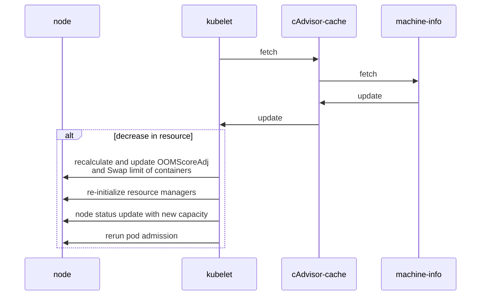

# KEP-5578: Node Resource Hot-Unplug

<!--
A table of contents is helpful for quickly jumping to sections of a KEP and for
highlighting any additional information provided beyond the standard KEP
template.

Ensure the TOC is wrapped with
  <code>&lt;!-- toc --&rt;&lt;!-- /toc --&rt;</code>
tags, and then generate with `hack/update-toc.sh`.
-->

<!-- toc -->
- [Release Signoff Checklist](#release-signoff-checklist)
- [Glossary](#glossary)
- [Summary](#summary)
- [Motivation](#motivation)
  - [Goals](#goals)
  - [Non-Goals](#non-goals)
- [Proposal](#proposal)
  - [User Stories (Optional)](#user-stories-optional)
    - [Story 1](#story-1)
  - [Notes/Constraints/Caveats (Optional)](#notesconstraintscaveats-optional)
  - [Risks and Mitigations](#risks-and-mitigations)
- [Design Details](#design-details)
  - [Test Plan](#test-plan)
      - [Prerequisite testing updates](#prerequisite-testing-updates)
      - [Unit tests](#unit-tests)
      - [Integration tests](#integration-tests)
      - [e2e tests](#e2e-tests)
  - [Graduation Criteria](#graduation-criteria)
  - [Upgrade / Downgrade Strategy](#upgrade--downgrade-strategy)
  - [Version Skew Strategy](#version-skew-strategy)
- [Production Readiness Review Questionnaire](#production-readiness-review-questionnaire)
  - [Feature Enablement and Rollback](#feature-enablement-and-rollback)
  - [Rollout, Upgrade and Rollback Planning](#rollout-upgrade-and-rollback-planning)
  - [Monitoring Requirements](#monitoring-requirements)
  - [Dependencies](#dependencies)
  - [Scalability](#scalability)
  - [Troubleshooting](#troubleshooting)
- [Implementation History](#implementation-history)
- [Drawbacks](#drawbacks)
- [Alternatives](#alternatives)
- [Infrastructure Needed (Optional)](#infrastructure-needed-optional)
<!-- /toc -->

## Release Signoff Checklist

Items marked with (R) are required *prior to targeting to a milestone / release*.

- [ ] (R) Enhancement issue in release milestone, which links to KEP dir in [kubernetes/enhancements] (not the initial KEP PR)
- [ ] (R) KEP approvers have approved the KEP status as `implementable`
- [ ] (R) Design details are appropriately documented
- [ ] (R) Test plan is in place, giving consideration to SIG Architecture and SIG Testing input (including test refactors)
  - [ ] e2e Tests for all Beta API Operations (endpoints)
  - [ ] (R) Ensure GA e2e tests meet requirements for [Conformance Tests](https://github.com/kubernetes/community/blob/master/contributors/devel/sig-architecture/conformance-tests.md)
  - [ ] (R) Minimum Two Week Window for GA e2e tests to prove flake free
- [ ] (R) Graduation criteria is in place
  - [ ] (R) [all GA Endpoints](https://github.com/kubernetes/community/pull/1806) must be hit by [Conformance Tests](https://github.com/kubernetes/community/blob/master/contributors/devel/sig-architecture/conformance-tests.md) within one minor version of promotion to GA
- [ ] (R) Production readiness review completed
- [ ] (R) Production readiness review approved
- [ ] "Implementation History" section is up-to-date for milestone
- [ ] User-facing documentation has been created in [kubernetes/website], for publication to [kubernetes.io]
- [ ] Supporting documentation—e.g., additional design documents, links to mailing list discussions/SIG meetings, relevant PRs/issues, release notes

<!--
**Note:** This checklist is iterative and should be reviewed and updated every time this enhancement is being considered for a milestone.
-->

[kubernetes.io]: https://kubernetes.io/
[kubernetes/enhancements]: https://git.k8s.io/enhancements
[kubernetes/kubernetes]: https://git.k8s.io/kubernetes
[kubernetes/website]: https://git.k8s.io/website

## Glossary
Hotplug: Dynamically add compute resources (CPU, Memory, Swap Capacity and HugePages) to the node, either via software (online offlined resources) or via hardware (physical additions while the system is running)

Hotunplug: Dynamically remove compute resources (CPU, Memory, Swap Capacity and HugePages) to the node, either via software (make resources go offline) or via hardware (physical removal while the system is running)

Node Compute Resource: CPU, Memory, Swap Capacity and HugePages

Node Resource Hotplug KEP: https://github.com/Karthik-K-N/enhancements/tree/node-resize/keps/sig-node/3953-node-resource-hot-plug

## Summary

This KEP is intended to be added on top of the Node Resource Hotplug [KEP](https://github.com/Karthik-K-N/enhancements/tree/node-resize/keps/sig-node/3953-node-resource-hot-plug) to facilitate the hotunplug of the node compute resources.

## Motivation

Node Resource Hotplug provides the ability to increase the resources of a cluster on demand without any downtime during a surge of resource usages by workloads
Now with Node resource hot-unplug the motive is to remove the resources when not needed for cost optimisation without any downtime.

### Goals

* Achieve seamless node capacity reduction through resource hotunplug.

### Non-Goals

* Dynamically adjust system reserved and kube reserved values.
* Update the autoscaler to utilize resource hotplug.
* Re-balance workloads across the nodes.
* Update runtime/NRI plugins with host resource changes.

## Proposal

### User Stories (Optional)

#### Story 1

As a Cluster administrator, I want to resize a Kubernetes node dynamically, so that I can quickly hot-unplug resources without waiting for nodes to be removed from cluster.

### Notes/Constraints/Caveats (Optional)

### Risks and Mitigations

- Workloads that are dependent on the initial node configuration, such as:
  - Workloads that spawns per-CPU processes (threads, workpools, etc.)
  - Workloads that depend on the CPU-Memory relationships (e.g Processes that depend on NUMA/NUMA alignment.)
  - Dependency of external libraries/device drivers to support CPU hot-unplug as a supported feature.
- Kubelet failure during re running pod admission. But its very less likely to occur.

With hot-unplug of resources following components will also be affected but most of them will be handled in Node Resource HotPlug

- Change in Swap limit
- Change in OOMScoreAdjust value

## Design Details

The diagram below shows the interaction between kubelet, node and cAdvisor.

PoC implementation is available here: https://github.com/marquiz/kubernetes/commits/devel/resource-discovery-hot-unplug

### Test Plan

- [x] I/we understand the owners of the involved components may require updates to
existing tests to make this code solid enough prior to committing the changes necessary
to implement this enhancement.

##### Prerequisite testing updates

##### Unit tests

- Add necessary tests in kubelet_node_status_test.go to check for the node status behaviour with resource hot-unplug.
- Add necessary tests in kubelet_pods_test.go to check for the pod cleanup and pod re-addition workflow. 
- Add necessary tests in eventhandlers_test.go to check for scheduler behaviour with dynamic node capacity change. 
- Add necessary tests in resource managers to check for managers behaviour to adopt dynamic node capacity change.

##### Integration tests

Nessary integration tests will be added.

##### e2e tests

Following scenarios need to be covered:

- Node resource information before and after resource hot-unplug for the following scenarios.
        downsize -> upsize
        downsize -> upsize ->  downsize
        upsize -> downsize
- State of Running pods after hot-unplug of resources.

### Graduation Criteria

Phase 1: Alpha (target 1.36)

- Feature is disabled by default. It is an opt-in feature which can be enabled by enabling the NodeResourceHotUnPlug feature gate.
- Unit test coverage.
- E2E tests.
- Documentation mentioning high level design.

### Upgrade / Downgrade Strategy

Upgrade

To upgrade the cluster to use this feature, Kubelet should be updated to enable featuregate. Existing cluster does not have any impact as the node resources already been updated during cluster creation.

Downgrade

It's always possible to trivially downgrade to the previous kubelet.

### Version Skew Strategy

Not relevant, As this kubelet specific feature and does not impact other components.

## Production Readiness Review Questionnaire

### Feature Enablement and Rollback

###### How can this feature be enabled / disabled in a live cluster?

- [x] Feature gate (also fill in values in `kep.yaml`)
  - Feature gate name: NodeResourceHotUnPlug
  - Components depending on the feature gate: kubelet
- [ ] Other
  - Describe the mechanism:
  - Will enabling / disabling the feature require downtime of the control
    plane?
  - Will enabling / disabling the feature require downtime or reprovisioning
    of a node?

###### Does enabling the feature change any default behavior?

No. This feature is guarded by a feature gate. Existing default behavior does not change if the feature is not used. Even if the feature is enabled via feature gate, If there is no change in node configuration the system will continue to work in the same way.

###### Can the feature be disabled once it has been enabled (i.e. can we roll back the enablement)?

Yes. The feature can be disabled by restarting kubelet with the feature-gate off.

###### What happens if we reenable the feature if it was previously rolled back?

To reenanble the feature, need to turn on the feature-gate and restart the kubelet, with feature reenabled, the node resources can be hot-unplugged in again. Cluster will be automatically updated with the new resource information.

###### Are there any tests for feature enablement/disablement?

Yes, the tests will be added along with alpha implementation.

- Validate the hot-unplug of resource to machine is updated at the node resource level.
- Validate the hot-unplug of resource made the running pods move into pending due to lack of resources.

### Rollout, Upgrade and Rollback Planning

Rollout may fail if kubelet failing to rerun pod admission due to programmatic errors. In case of rollout failures, running workloads are not affected, The workload might get OOM killed and will be in Pending state due to lack of resources. 
Rollback failure should not affect running workloads.

###### How can a rollout or rollback fail? Can it impact already running workloads?

<!--
Try to be as paranoid as possible - e.g., what if some components will restart
mid-rollout?

Be sure to consider highly-available clusters, where, for example,
feature flags will be enabled on some API servers and not others during the
rollout. Similarly, consider large clusters and how enablement/disablement
will rollout across nodes.
-->

###### What specific metrics should inform a rollback?

If there is significant increase in node_hot_unplug_errors_total metric means the feature is not working as expected.

###### Were upgrade and rollback tested? Was the upgrade->downgrade->upgrade path tested?

It will be tested manually as a part of implementation and there will also be automated tests to cover the scenarios.

###### Is the rollout accompanied by any deprecations and/or removals of features, APIs, fields of API types, flags, etc.?

No

### Monitoring Requirements

Monitor the metrics

 - node_hot_unplug_request_total
  - node_hot_unplug_errors_total

###### How can an operator determine if the feature is in use by workloads?

This feature will be built into kubelet and behind a feature gate. Examining the kubelet feature gate would help in determining whether the feature is used. The enablement of the kubelet feature gate can be determined from the kubernetes_feature_enabled metric.

In addition, newly added metrics node_hot_unplug_request_total, node_hot_unplug_errors_total are incremented in case of unplug of resource and failing to re-runt the pod readmission.

###### How can someone using this feature know that it is working for their instance?

End user can do a hot-unplug of resource and verify the same change as reflected at the node resource level.

###### What are the reasonable SLOs (Service Level Objectives) for the enhancement?

For each node, the value of the metric node_hot_unplug_request_total is expected to match the number of time the node is hot-unplugged. For each node, the value of the metric node_hot_unplug_errors_total is expected to be zero.

###### What are the SLIs (Service Level Indicators) an operator can use to determine the health of the service?

- [x] Metrics
  - Metric name:
     - node_hot_unplug_request_total
     - node_hot_unplug_errors_total
  - Components exposing the metric: kubelet

###### Are there any missing metrics that would be useful to have to improve observability of this feature?
     
  - node_hot_unplug_request_total
  - node_hot_unplug_errors_total

### Dependencies

###### Does this feature depend on any specific services running in the cluster?

No, It does not depend on any service running on the cluster.

### Scalability

###### Will enabling / using this feature result in any new API calls?

No, It won't add/modify any user facing APIs. Internally kubelet runs the pod-readmission.

###### Will enabling / using this feature result in introducing new API types?

No

###### Will enabling / using this feature result in any new calls to the cloud provider?

No
###### Will enabling / using this feature result in increasing size or count of the existing API objects?

No

###### Will enabling / using this feature result in increasing time taken by any operations covered by existing SLIs/SLOs?

Negligible, In the case of resource hot-unplug pod readmission will be run, which might take some time.

###### Will enabling / using this feature result in non-negligible increase of resource usage (CPU, RAM, disk, IO, ...) in any components?

Negligible computational overhead might be introduced into kubelet as it need to re-run the pod admission after resource hot-unplug.

###### Can enabling / using this feature result in resource exhaustion of some node resources (PIDs, sockets, inodes, etc.)?

No, Since feature relies on removing node resources it wont result in resource exhaustion as there wont be any addition of new pods.

### Troubleshooting

###### How does this feature react if the API server and/or etcd is unavailable?

This feature is node local and mainly handled in kubelet, It has no dependency on etcd.
In case there are running pods using the resources and there is hot-unplug of resources, Kubelet will re-run the pod admission and it relies on the API server to fetch node information. Without access to the API server, it cannot make accurate decisions as the node resources are not updated. 
The pending pods would remain in same condition.

###### What are other known failure modes?
The main logic is with the pod readmission during hot-unplug of resources. Failure scenarios can occur during the readmission.

###### What steps should be taken if SLOs are not being met to determine the problem?

If the SLOs are not being met one can examine the kubelet logs and its also advised not to hot-unplug the node resources.

## Implementation History

## Drawbacks

Pod readmission will be run during hot-unplug of resources and there is very less chance of failure, because of it there might be workload disruption incase there is OOM Kill.

## Alternatives

Scale down the cluster by removing compute nodes.

## Infrastructure Needed (Optional)

VMs backing the nodes of cluster should support hot-unplug of compute resources for e2e tests.
