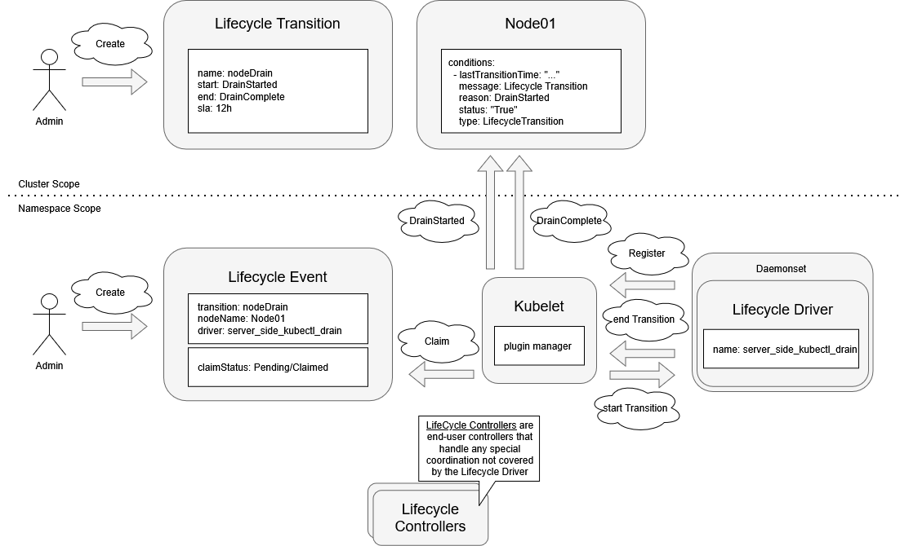

<!--
**Note:** When your KEP is complete, all of these comment blocks should be removed.

To get started with this template:

- [ ] **Pick a hosting SIG.**
  Make sure that the problem space is something the SIG is interested in taking
  up. KEPs should not be checked in without a sponsoring SIG.
- [ ] **Create an issue in kubernetes/enhancements**
  When filing an enhancement tracking issue, please make sure to complete all
  fields in that template. One of the fields asks for a link to the KEP. You
  can leave that blank until this KEP is filed, and then go back to the
  enhancement and add the link.
- [ ] **Make a copy of this template directory.**
  Copy this template into the owning SIG's directory and name it
  `NNNN-short-descriptive-title`, where `NNNN` is the issue number (with no
  leading-zero padding) assigned to your enhancement above.
- [ ] **Fill out as much of the kep.yaml file as you can.**
  At minimum, you should fill in the "Title", "Authors", "Owning-sig",
  "Status", and date-related fields.
- [ ] **Fill out this file as best you can.**
  At minimum, you should fill in the "Summary" and "Motivation" sections.
  These should be easy if you've preflighted the idea of the KEP with the
  appropriate SIG(s).
- [ ] **Create a PR for this KEP.**
  Assign it to people in the SIG who are sponsoring this process.
- [ ] **Merge early and iterate.**
  Avoid getting hung up on specific details and instead aim to get the goals of
  the KEP clarified and merged quickly. The best way to do this is to just
  start with the high-level sections and fill out details incrementally in
  subsequent PRs.

Just because a KEP is merged does not mean it is complete or approved. Any KEP
marked as `provisional` is a working document and subject to change. You can
denote sections that are under active debate as follows:

```
<<[UNRESOLVED optional short context or usernames ]>>
Stuff that is being argued.
<<[/UNRESOLVED]>>
```

When editing KEPS, aim for tightly-scoped, single-topic PRs to keep discussions
focused. If you disagree with what is already in a document, open a new PR
with suggested changes.

One KEP corresponds to one "feature" or "enhancement" for its whole lifecycle.
You do not need a new KEP to move from beta to GA, for example. If
new details emerge that belong in the KEP, edit the KEP. Once a feature has become
"implemented", major changes should get new KEPs.

The canonical place for the latest set of instructions (and the likely source
of this file) is [here](/keps/NNNN-kep-template/README.md).

**Note:** Any PRs to move a KEP to `implementable`, or significant changes once
it is marked `implementable`, must be approved by each of the KEP approvers.
If none of those approvers are still appropriate, then changes to that list
should be approved by the remaining approvers and/or the owning SIG (or
SIG Architecture for cross-cutting KEPs).
-->
# KEP-5683: Specialized Lifecycle Management

<!--
A table of contents is helpful for quickly jumping to sections of a KEP and for
highlighting any additional information provided beyond the standard KEP
template.

Ensure the TOC is wrapped with
  <code>&lt;!-- toc --&rt;&lt;!-- /toc --&rt;</code>
tags, and then generate with `hack/update-toc.sh`.
-->

<!-- toc -->
- [Release Signoff Checklist](#release-signoff-checklist)
- [Summary](#summary)
- [Motivation](#motivation)
  - [Goals](#goals)
  - [Non-Goals](#non-goals)
- [Proposal](#proposal)
  - [User Stories](#user-stories)
    - [Story 1: Graceful Node Shutdown State Persistence](#story-1-graceful-node-shutdown-state-persistence)
    - [Story 2: Standardized Node Maintenance](#story-2-standardized-node-maintenance)
  - [Risks and Mitigations](#risks-and-mitigations)
- [Design Details](#design-details)
  - [Names](#names)
  - [Diagram](#diagram)
  - [Publishing Lifecycle Transitions](#publishing-lifecycle-transitions)
  - [Driver Registration](#driver-registration)
  - [Binding Selection](#binding-selection)
  - [Lifecycle Controllers](#lifecycle-controllers)
  - [Stalled Transitions and Corner Cases](#stalled-transitions-and-corner-cases)
  - [Orchestration](#orchestration)
  - [Garbage Collection and End States](#garbage-collection-and-end-states)
  - [API](#api)
  - [Driver Write Permission](#driver-write-permission)
  - [Test Plan](#test-plan)
      - [Prerequisite testing updates](#prerequisite-testing-updates)
      - [Unit tests](#unit-tests)
      - [Integration tests](#integration-tests)
      - [e2e tests](#e2e-tests)
  - [Graduation Criteria](#graduation-criteria)
    - [Alpha](#alpha)
    - [Beta](#beta)
    - [GA](#ga)
  - [Upgrade / Downgrade Strategy](#upgrade--downgrade-strategy)
  - [Version Skew Strategy](#version-skew-strategy)
- [Production Readiness Review Questionnaire](#production-readiness-review-questionnaire)
  - [Feature Enablement and Rollback](#feature-enablement-and-rollback)
  - [Rollout, Upgrade and Rollback Planning](#rollout-upgrade-and-rollback-planning)
  - [Monitoring Requirements](#monitoring-requirements)
  - [Dependencies](#dependencies)
  - [Scalability](#scalability)
  - [Troubleshooting](#troubleshooting)
- [Implementation History](#implementation-history)
- [Drawbacks](#drawbacks)
- [Alternatives](#alternatives)
  - [No-Kubelet Design](#no-kubelet-design)
  - [Declarative Node Maintenance](#declarative-node-maintenance)
- [Infrastructure Needed (Optional)](#infrastructure-needed-optional)
<!-- /toc -->

## Release Signoff Checklist

<!--
**ACTION REQUIRED:** In order to merge code into a release, there must be an
issue in [kubernetes/enhancements] referencing this KEP and targeting a release
milestone **before the [Enhancement Freeze](https://git.k8s.io/sig-release/releases)
of the targeted release**.

For enhancements that make changes to code or processes/procedures in core
Kubernetes—i.e., [kubernetes/kubernetes], we require the following Release
Signoff checklist to be completed.

Check these off as they are completed for the Release Team to track. These
checklist items _must_ be updated for the enhancement to be released.
-->

Items marked with (R) are required *prior to targeting to a milestone / release*.

- [ ] (R) Enhancement issue in release milestone, which links to KEP dir in [kubernetes/enhancements] (not the initial KEP PR)
- [ ] (R) KEP approvers have approved the KEP status as `implementable`
- [ ] (R) Design details are appropriately documented
- [ ] (R) Test plan is in place, giving consideration to SIG Architecture and SIG Testing input (including test refactors)
  - [ ] e2e Tests for all Beta API Operations (endpoints)
  - [ ] (R) Ensure GA e2e tests meet requirements for [Conformance Tests](https://github.com/kubernetes/community/blob/master/contributors/devel/sig-architecture/conformance-tests.md) 
  - [ ] (R) Minimum Two Week Window for GA e2e tests to prove flake free
- [ ] (R) Graduation criteria is in place
  - [ ] (R) [all GA Endpoints](https://github.com/kubernetes/community/pull/1806) must be hit by [Conformance Tests](https://github.com/kubernetes/community/blob/master/contributors/devel/sig-architecture/conformance-tests.md) 
- [ ] (R) Production readiness review completed
- [ ] (R) Production readiness review approved
- [ ] "Implementation History" section is up-to-date for milestone
- [ ] User-facing documentation has been created in [kubernetes/website], for publication to [kubernetes.io]
- [ ] Supporting documentation—e.g., additional design documents, links to mailing list discussions/SIG meetings, relevant PRs/issues, release notes

<!--
**Note:** This checklist is iterative and should be reviewed and updated every time this enhancement is being considered for a milestone.
-->

[kubernetes.io]: https://kubernetes.io/
[kubernetes/enhancements]: https://git.k8s.io/enhancements
[kubernetes/kubernetes]: https://git.k8s.io/kubernetes
[kubernetes/website]: https://git.k8s.io/website

## Summary

Over the past several years, it has become a common pattern to use Taints, PDBs, Labels, and Annotations to coordinate lifecycle operations between controllers. While this technique is flexible and easy to use, it is brittle, has little reusability across projects, and limited upside. Now with new workloads entering the Kubernetes ecosystem through the introduction of Dynamic Resource Allocation (DRA), the day-2 lifecycle will get even more challenging, overwhelming these commonly used techniques.

This KEP proposes establishing a lifecycle management framework. A standardized, declarative API for coordinating lifecycle management that follows the architectural patterns of PersistentVolumeClaims (PVC) and Dynamic Resource Allocation (DRA). This API would:
- Allow a user to signal a desired lifecycle state (e.g. EnteringMaintenance) with specific constraints
- Provide a binding resource that a specialized Lifecycle Driver "claims" to execute the lifecycle transition
- Create a canonical lifecycle interface so that core Kubernetes controllers like, Cluster Autoscaler, can coordinate maintenance with community projects like, NodeProblemDetector (NPD)
- Give end-users a strict framework for implementing lifecycle business logic

While Kubernetes evolves its day-1 scheduling through DRA, this KEP proposes we evolve the day-2 lifecycle management in parallel. The growth of specialized hardware into data centers will only compound the pressure on Providers to maintain hardware health and uptime. Because these workloads are often multi-device multi-node, a single health failure can multiply into many unavailable devices, costly re-scheduling, or application disruption. Therefore, we need a flexible solution that works across ecosystem domains (e.g. capacity management and health reporting), works for any Kubernetes resource API (e.g. Node), and is extensible to support end-user business-logic.

This project does not replace Taints, PDBs, Labels, and Annotations. Its intent is to replace the misuse of Taints, PDBs, Labels, and Annotations to coordinate lifecycle operations.

## Motivation

The Kubernetes ecosystem currently lacks a standardized mechanism for managing complex lifecycle transitions. Today, the lifecycle management ecosystem is fragmented and solutions are implemented through a combination of Conditions, CRDs, Labels, Taints, and Annotations [^1]. While these work in isolation, they lack a common schema or "source of truth", forcing ecosystem components - such as Cluster API, Cluster Autoscaler, and the Scheduler - to implement custom logic for every provider or environment they support.

A primary example of this friction is the "Drained" state for Nodes. The definition of a "Drained" node is highly context-specific: for some, it means zero pods; for others, it allows for specific DaemonSets or high-priority system pods to remain. Because Kubernetes lacks a formal interface to define and observe these lifecycle states, it is nearly impossible to build shared, reusable controllers that react consistently across different clusters.

This proposal introduces a standardized, observable interface for lifecycle transitions. By moving away from fragile, ad-hoc signaling (like Labels) and toward a first-class API, we aim to:
- Unify the Ecosystem - Enable tools like the Autoscaler to understand a resource's lifecycle state without provider-specific shims
- Formalize Intent - Provide a clear path for end-users to communicate intent (e.g. Start Maintenance) and for controllers to report status
- Reduce Complexity - Replace brittle, unstructured solutions with a declarative, strict binding model similar to the PVC/PV architecture

Initially, this work will focus on two scenarios:
1. Graceful Node Shutdown - Solve the kubelet losing state bug [kubernetes/issues/122674](https://github.com/kubernetes/kubernetes/issues/122674)
1. Node Maintenance - Managing the hand-off between cluster-level orchestration (e.g. Drain) and hardware-level operations (e.g. Reboot)

### Goals

<!--
List the specific goals of the KEP. What is it trying to achieve? How will we
know that this has succeeded?
-->

- Introduce the `LifecycleTransition` API to express intent for lifecycle state changes that require external coordination
- Introduce the `LifecycleEvent` API as a binding mechanism that allows specialized Lifecycle Drivers to fulfill lifecycle requests without modifying core Kubernetes controllers
- Ensure the current lifecycle state is discoverable on the resource itself (e.g. in the Node status)
- Solve the "Kubelet amnesia" problem by ensuring that lifecycle state transitions are persisted on the Node, allowing a Kubelet to discover state and resume a Graceful Node Shutdown after a restart
- Provide a generic framework that supports Graceful Node Shutdown and Node Maintenance out of the box while remaining flexible for custom user-defined states

### Non-Goals

<!--
What is out of scope for this KEP? Listing non-goals helps to focus discussion
and make progress.
-->

- This KEP does not provide a component to decide when a Node should be drained or undergo maintenance. It only provides the interface for how lifecycle change is communicated
- This KEP is not a Pod Disruption Budget replacement, but rather a complementary signal for the infrastructure layer
- This proposal does not include logic to automatically fix or retry failed transitions; that responsibility remains with the user
- Create a new Status field on K8s resource APIs to track lifecycle state (Conditions will work in Alpha, so we can revisit this later)

## Proposal

<!--
This is where we get down to the specifics of what the proposal actually is.
This should have enough detail that reviewers can understand exactly what
you're proposing, but should not include things like API designs or
implementation. What is the desired outcome and how do we measure success?.
The "Design Details" section below is for the real
nitty-gritty.
-->

Create the `LifecycleTransition` and `LifecycleEvent` APIs. Here’s a sample for doing Node drain:
```yaml
apiVersion: v1alpha1
kind: LifecycleTransition
metadata:
  name: nodeDrain
spec:
  start: DrainStarted
  end: DrainComplete
  sla: 12h
  allNodes: true
  driver: example.com/server_side_kubectl_drain
```
```yaml
apiVersion: v1alpha1
kind: LifecycleEvent
metadata:
  name: nodeDrainEvent
spec:
  transitionName: nodeDrain
  nodeName: Node01
```

Specialized lifecycle drivers will be created by the end-user to carry out the transition.  Here’s an example implementation of a Kubectl-server-side Drain Driver: 

```Go
package driver

...

func (kubectlServerSideDrain *kssdDriver) drainHelper() (*drain.Helper) {
   // Configure kubectl drain
   return = &drain.Helper{
        Client:              kssdDriver.client,
        Force:               true,
        IgnoreAllDaemonSets: true,
        DeleteEmptyDirData:  true,
        GracePeriodSeconds:  30,
        Out:                 os.Stdout,
        ErrOut:              os.Stderr,
        Ctx:                 context.TODO(),
    }
}

func (kubectlServerSideDrain *kssdDriver) StartLifecycleTransition(ctx context.Context, req *slm.StartLifecycleTransitionRequest) (*slm.LifecycleTransitionResponse, error) {
    // ** Server side kubectl drain **
    helper = kubectlServerSideDrain.drainHelper()
    node, err := client.CoreV1().Nodes().Get(context.TODO(), nodeName, metav1.GetOptions{})
    if err != nil {
        return nil, err
    }

    // Cordon the node
    fmt.Printf("Cordoning node: %s\n", nodeName)
    err = drain.RunCordonOrUncordon(helper, node, true)
    if err != nil {
        return nil, err
    }

    pods, err := helper.GetPodsForDeletion(nodeName)
    if len(errList) > 0 {
        return nil, err
    }

    // Drain the node
    fmt.Printf("Draining node: %s\n", nodeName)
    if err := helper.RunNodeDrain(pods); err != nil {
        return nil, err
    }

    // Return the Start lifecycleCondition so it can be published to the Node
    return &slm.LifecycleTransitionResponse{lifecycleCondition: req.Start, node: req.nodeName}, nil
}

func (kubectlServerSideDrain *kssdDriver) EndLifecycleTransition(ctx context.Context, req *slm.EndLifecycleTransitionRequest) (*slm.LifecycleTransitionResponse, error) {

    ...

    helper = kubectlServerSideDrain.drainHelper()
    // Wait for the Pods to leave the Node
    helper = kubectlServerSideDrain.drainHelper()
    pods, err := helper.GetPodsForDeletion(nodeName)
    for len(pods) > 0 && !req.SlaExpired {
        fmt.Println("Waiting for drain to complete.")
        time.Sleep(5)
    }
    fmt.Println("Drain completed successfully.")

    // Return the End lifecycleCondition so it can be published to the Node
    return &slm.LifecycleTransitionResponse{lifecycleCondition: req.End, node: req.nodeName}, nil
}
```

The Kubelet will `PATCH` the Node's `.status.conditions` after each callback and use `reason` `lifecycleTransition.spec.start` or `lifecycleTransition.spec.end`:
```yaml
  conditions:
    lastHeartbeatTime: "2025-12-18T21:12:55Z"
    lastTransitionTime: "2025-12-18T21:12:51Z"
    message: Lifecycle Transition 'nodeDrain'
    reason: DrainStarted
    status: "True"
    type: LifecycleTransition
```
```yaml
 conditions:
    lastHeartbeatTime: "2025-12-18T21:12:55Z"
    lastTransitionTime: "2025-12-18T21:12:51Z"
    message: Lifecycle Transition 'nodeDrain'
    reason: DrainComplete
    status: "True"
    type: LifecycleTransition
```

### User Stories

<!--
Detail the things that people will be able to do if this KEP is implemented.
Include as much detail as possible so that people can understand the "how" of
the system. The goal here is to make this feel real for users without getting
bogged down.
-->

#### Story 1: Graceful Node Shutdown State Persistence

As a Cluster Operator, I need the node's shutdown state to persist across Kubelet restarts so that graceful shutdown can resume safely after an interruption. This ensures that certain cleanup is not bypassed by a process restart - [kubernetes/issues/122674](https://github.com/kubernetes/kubernetes/issues/122674)

#### Story 2: Standardized Node Maintenance

As an Infrastructure Provider, I would benefit from a core Kubernetes API to signal maintenance events so that I can integrate my proprietary hardware-management workflows without building and maintaining a custom API. This will allow my lifecycle controllers to interoperate seamlessly with ecosystem tools like the Cluster Autoscaler.

### Risks and Mitigations

<!--
What are the risks of this proposal, and how do we mitigate? Think broadly.
For example, consider both security and how this will impact the larger
Kubernetes ecosystem.

How will security be reviewed, and by whom?

How will UX be reviewed, and by whom?

Consider including folks who also work outside the SIG or subproject.
-->

- Adds another plugin interface to the Kubelet
- The `LifecycleTransition` start and end spec fields are very flexible. So they may get used in unexpected ways
- The Lifecycle Driver is essentially a controller with a few callbacks. So there’s a possibility it is used for things it’s not supposed to

## Design Details

<!--
This section should contain enough information that the specifics of your
change are understandable. This may include API specs (though not always
required) or even code snippets. If there's any ambiguity about HOW your
proposal will be implemented, this is the place to discuss them.
-->

### Names
- `LifecycleTransition` - The specification that encapsulates a single, complete lifecycle transition (start to end) within a defined location and time period
- `LifecycleEvent` - A binding API, used to indicate ownership of the active `LifecycleTransition` by the Kubelet
- Lifecycle Driver - An end-user controller that registers with the Kubelet to act on a `LifecycleEvent`

### Diagram



### Publishing Lifecycle Transitions
Lifecycle transitions will be published to the API server for cluster-wide visibility. We'll use the same method as DRA, where the Kubelet uses information provided by the driver to publish a `LifecycleTransition`.

The `LifecycleTransition` object is heavily inspired by the DRA `ResourceSlice` object. We would use the same methods for the same reasons described in the [publishing-node-resources](https://github.com/pohly/enhancements/blob/624bec4521a2ad67642bebd315006623f9bd66a3/keps/sig-node/4381-dra-structured-parameters/README.md#publishing-node-resources) section of the dra-structured-parameters KEP.

### Driver Registration
A user will create their own specialized Lifecycle Driver that runs as a Daemonset and registers with the Kubelet through the plugin manager interface. The Driver will register two functions: `StartLifecycleTransition(...)` and `EndLifecycleTransition(...)`, each corresponding to the start and end fields from the `LifecycleTransition` spec. It will also register its name and the start + end transitions it will be responsible for.

### Binding Selection
The Kubelet will be responsible for “claiming” a `LifecycleEvent`. Here’s how the claim would work.
- Kubelet will notice a `LifecycleEvent` in `Pending` state
- Kubelet will locate a Driver capable of handling the transition
- Kubelet will change the `LifecycleEvent` to `Claimed` state
 - If a suitable Driver cannot be located, continue with a retry backoff for 5min. If there’s no match after the timeout, change the `LifecycleEvent` to `Failed` state
- Kubelet will call the selected Driver’s start callback, `StartLifecycleTransition(...)`
- Kubelet will `PATCH` the Node condition type: `LifecycleTransition` with `reason: <start>`
- Kubelet starts a timer for the SLA. It can also be discovered by Kubelet later as `SLA` minus `condition.lastTransitionTime`.

This approach has some challenges. First, in order to deal with multiple `LifecycleEvents`, the Kubelet will claim only one `LifecycleEvent` at a time and on a first come first serve basis. So whatever `LifecycleEvent` it notices first, it will attempt to claim it.

At least for Alpha, Transitions will be single-direction, start to end, and Events will be non-interruptible through the API.

It's possible for the Kubelet to come across a `LifecycleEvent` this is already claimed. This can occur when the Kubelet "forgot" it previously claimed the Event, and so it will attempt to continue work. Or another controller may have claimed the Event and the Kubelet will ignore it. The Kubelet will only attempt to claim when there is not another `Claimed` Event on the Node.

### Lifecycle Controllers
If allowed by the Admin, a controller can claim Events as they wish - this is another extension point for users. It would be up to the admin to implement this extension and enforce the Driver contract using some method other than the Kubelet.

### Stalled Transitions and Corner Cases
The proposed design relies on the availability of both the Kubelet and the Lifecycle Driver to progress through state transitions. In scenarios where either component fails or loses connectivity, a lifecycle transition may stall in a non-terminal state.

While this proposal does not introduce a centralized orchestration engine to automatically resolve these hangs, it significantly improves upon the current methods by adding an observability layer. This empowers external monitoring systems and operators to identify and intervene in stalled operations by reviewing the `LifecycleEvent` and `LifecycleTransition` APIs or the Condition on the Node. Resolving these edge cases remains the responsibility of the user, which will provide a clear separation of concerns between the core API and context-specific business logic.

### Orchestration
While centralized orchestration is a Non-Goal for the core API, this proposal will include a reference implementation to prove viability. We will address the long-standing community request for Server-Side Drain [Issue #25625](https://github.com/kubernetes/kubernetes/issues/25625) by building a specialized Lifecycle Driver.

This reference implementation will be hosted as a sub-project under kubernetes-sigs and will include:
- The Server-side-drain Driver
- Two `LifecycleTransitions`
  - DrainStarted to DrainComplete
  - Uncordoning to MaintenanceComplete
- The _DrainStarted_ to _DrainComplete_ transition will run attempt to drain Pods
- The _Uncordoning_ to _MaintenanceComplete_ transition will uncordon the Node

Lastly, we would extend `kubectl drain` to add a `--server-side` flag to execute the drain. `kubectl` would orchestrate the transition from _DrainStarted_ to _MaintenanceComplete_.

By implementing Server-Side Drain via the SLM proposal, we would prove that context-specific logic can be offloaded to a driver while maintaining a standard observability interface in core Kubernetes.

### Garbage Collection and End States
For a `LifecycleEvent` to conclude, either the Driver returns the end callback to the Kubelet or the SLA expires. If the SLA expires, Kubelet will change the Event to `SlaExpired` state and look for more claims. If the driver does return the end callback, Kubelet will change the Event to `Succeeded` state.

The Kubelet will use a Finalizer on the `LifecycleEvent` to control the object's termination. The finalizer must be set before the Driver attempts the start transition, after the `LifecycleEvent` is claimed. Kubelet removes the finalizer when:
- The transition times out (`SLAExpired`)
- The transition fails (`Failed`)
- The transition is completed (`Succeeded`)
An end-user removing the finalizer will risk state be not being properly updated. Users will need to take that into account.

If there's no unexpected interruption, then garbage collection will occur when an Event is in an end state: `Succeeded`, `Failed`, and `SLAExpired`. While retaining `LifecycleEvents` in these end states can be valuable for debugging, we're proposing that solution be developed outside this proposal. For this KEP, the garbage collection sequence will be as follows:
- Kubelet Updates `LifecycleEvent` to and end state and removes the Finalizer
- Kubelet Deletes the `LifecycleEvent`
- Standard GC removes the object

### Graceful Node Shutdown State Persistence
The long-term goal for Specialized Lifecycle Managment is to build an ecosystem of controllers that understand important lifecycle operations. A perfect place to start building this ecosystem is with the kubelet.

The bug [kubernetes/issues/122674](https://github.com/kubernetes/kubernetes/issues/122674), which I refer to as Graceful Node Shutdown Amnesia, occurs because the kubelet can be interupted during GNS and lose context. The kubelet holds the GNS context in memory, which gets lost if the kubelet is interupted before GNS completes.

What's missing is an API to share current state, resume logic in the GNS manager, and a non-node local controller to share the current state. Because the end state of GNS is a non-running kubelet, there's no way for the kubelet to ever *know* it successfully reached the end state. This state has to be observered by a controller running elsewhere, that's observering the intent to gracefully shutdown the Node.

Fixing this bug will introduce the idea of Kubernetes reserved `LifecycleTransitions`. These `Start`/`End` reasons will have well-known meaning to Kubernetes controllers.

To communicate the Graceful Node Shutdown state, the transitions `shutdown-drain-started` and `shutdown-drain-complete` will represent when GNS drain is occuring and complete.

### API

The `LifecycleTransition` and `LifecycleEvent` APIs will have the following structure:
```Go
// Package-level tags.
// +k8s:deepcopy-gen=package
// +k8s:protobuf-gen=package
// +k8s:openapi-gen=true
// +k8s:openapi-model-package=io.k8s.api.lifecycle.v1alpha1
// +groupName=lifecycle.k8s.io

// +genclient
// +genclient:nonNamespaced
// +k8s:deepcopy-gen:interfaces=k8s.io/apimachinery/pkg/runtime.Object

// LifecycleTransition defines the desired intent for a Kubernetes resource to
// undergo a lifecycle change.
type LifecycleTransition struct {
	metav1.TypeMeta   `json:",inline"`
	metav1.ObjectMeta `json:"metadata,omitempty" protobuf:"bytes,1,opt,name=metadata"`

	// Spec defines the desired lifecycle transition.
	Spec LifecycleTransitionSpec `json:"spec" protobuf:"bytes,2,opt,name=spec"`
}

// +k8s:deepcopy-gen:interfaces=k8s.io/apimachinery/pkg/runtime.Object

// LifecycleTransitionList contains a list of LifecycleTransition resources.
type LifecycleTransitionList struct {
	metav1.TypeMeta `json:",inline"`
	metav1.ListMeta `json:"metadata,omitempty" protobuf:"bytes,1,opt,name=metadata"`
	Items           []LifecycleTransition `json:"items" protobuf:"bytes,2,rep,name=items"`
}

// LifecycleTransitionSpec describes the parameters of a lifecycle transition.
type LifecycleTransitionSpec struct {
	// start identifies the initial state of the lifecycle transition.
	Start string `json:"start" protobuf:"bytes,1,opt,name=start"`

	// end identifies the desired terminal state of the lifecycle transition.
	End string `json:"end" protobuf:"bytes,2,opt,name=end"`

	// nodeName identifies the specific Node that has a Driver capable of
	// reconciling the LifecycleTransition.
	// +optional
	NodeName *string `json:"nodeName,omitempty" protobuf:"bytes,3,opt,name=nodeName"`

	// nodeSelector defines which Nodes have Drivers capable of
	// reconciling the LifecycleTransition.
	// +optional
	NodeSelector *v1.NodeSelector `json:"nodeSelector,omitempty" protobuf:"bytes,4,opt,name=nodeSelector"`

	// allNodes indicates that all Nodes are capable of
	// reconciling the LifecycleTransition.
	// +optional
	AllNodes *bool `json:"allNodes,omitempty" protobuf:"varint,5,opt,name=allNodes"`

	// sla specifies the duration by which the transition from Start to End
	// must be completed.
	// +optional
	Sla *metav1.Duration `json:"sla,omitempty" protobuf:"bytes,6,opt,name=sla"`

	// driver specifies the unique identifier of the lifecycle driver
	// responsible for reconciling this transition.
	Driver string `json:"driver" protobuf:"bytes,7,opt,name=driver"`
}

// +genclient
// +genclient:nonNamespaced
// +k8s:deepcopy-gen:interfaces=k8s.io/apimachinery/pkg/runtime.Object

// LifecycleEvent represents a binding between a LifecycleTransition
// and the Kubelet/Driver responsible for executing it.
type LifecycleEvent struct {
	metav1.TypeMeta   `json:",inline"`
	metav1.ObjectMeta `json:"metadata,omitempty" protobuf:"bytes,1,opt,name=metadata"`

	// Spec defines the binding parameters for claiming a transition.
	Spec LifecycleEventSpec `json:"spec" protobuf:"bytes,2,opt,name=spec"`

	// Status reports the current state of the transition claim.
	// +optional
	Status LifecycleEventStatus `json:"status,omitempty" protobuf:"bytes,3,opt,name=status"`
}

// +k8s:deepcopy-gen:interfaces=k8s.io/apimachinery/pkg/runtime.Object

// LifecycleEventList contains a list of LifecycleEvent resources.
type LifecycleEventList struct {
	metav1.TypeMeta `json:",inline"`
	metav1.ListMeta `json:"metadata,omitempty" protobuf:"bytes,1,opt,name=metadata"`
	Items           []LifecycleEvent `json:"items" protobuf:"bytes,2,rep,name=items"`
}

// LifecycleEventSpec defines the binding parameters to claim a transition.
type LifecycleEventSpec struct {
	// transitionName refers to a LifecycleTransition object by name.
	TransitionName string `json:"transitionName" protobuf:"bytes,1,opt,name=transitionName"`

	// bindingNode identifies a specific Node whose Kubelet can claim the event.
	BindingNode string `json:"bindingNode" protobuf:"bytes,2,opt,name=bindingNode"`
}

// LifecycleEventStatus reports the current state of the transition claim.
type LifecycleEventStatus struct {
	// claimStatus represents the current phase of the event's lifecycle.
	// +optional
	ClaimStatus LifecycleEventClaimStatus `json:"claimStatus,omitempty" protobuf:"bytes,1,opt,name=claimStatus"`

	// driver is a copy of the driver name from the LifecycleTransition.
	// +optional
	Driver string `json:"driver,omitempty" protobuf:"bytes,2,opt,name=driver"`

	// sla specifies the deadline by which the transition must complete.
	// +optional
	Sla *metav1.Time `json:"sla,omitempty" protobuf:"bytes,3,opt,name=sla"`
}

// LifecycleEventClaimStatus represents the phase of a LifecycleEvent.
type LifecycleEventClaimStatus string

const (
    LifecycleEventPending LifecycleEventClaimStatus = "Pending"
    LifecycleEventClaimed LifecycleEventClaimStatus = "Claimed"
    LifecycleEventFailed LifecycleEventClaimStatus = "Failed"
    LifecycleEventSlaExpired LifecycleEventClaimStatus = "SlaExpired"
    LifecycleEventSucceeded LifecycleEventClaimStatus = "Succeeded"
)
```

### Driver Write Permission
The Lifecycle Driver from this design should follow the best practices for security. These best practices are the same as DRA drivers, which means write permissions should be limited to objects that are on the Node. For example, if doing a Drain, the driver should only have permission to Delete Pods on the Node it's lifecycling. This section from this [KEP](https://github.com/kubernetes/enhancements/blob/cecae1eae768ad61e3794eb138ff161adca000c1/keps/sig-node/4817-resource-claim-device-status/README.md#write-permission) explains how this technique works in DRA and would work here.

### Test Plan

<!--
**Note:** *Not required until targeted at a release.*
The goal is to ensure that we don't accept enhancements with inadequate testing.

All code is expected to have adequate tests (eventually with coverage
expectations). Please adhere to the [Kubernetes testing guidelines][testing-guidelines]
when drafting this test plan.

[testing-guidelines]: https://git.k8s.io/community/contributors/devel/sig-testing/testing.md
-->

[x] I/we understand the owners of the involved components may require updates to
existing tests to make this code solid enough prior to committing the changes necessary
to implement this enhancement.

##### Prerequisite testing updates

<!--
Based on reviewers feedback describe what additional tests need to be added prior
implementing this enhancement to ensure the enhancements have also solid foundations.
-->

##### Unit tests

<!--
In principle every added code should have complete unit test coverage, so providing
the exact set of tests will not bring additional value.
However, if complete unit test coverage is not possible, explain the reason of it
together with explanation why this is acceptable.
-->

<!--
Additionally, for Alpha try to enumerate the core package you will be touching
to implement this enhancement and provide the current unit coverage for those
in the form of:
- <package>: <date> - <current test coverage>
The data can be easily read from:
https://testgrid.k8s.io/sig-testing-canaries#ci-kubernetes-coverage-unit

This can inform certain test coverage improvements that we want to do before
extending the production code to implement this enhancement.
-->

- `k8s.io/kubernetes/pkg/kubelet`: 2025-12-25 - 72.3%

##### Integration tests

<!--
Integration tests are contained in https://git.k8s.io/kubernetes/test/integration.
Integration tests allow control of the configuration parameters used to start the binaries under test.
This is different from e2e tests which do not allow configuration of parameters.
Doing this allows testing non-default options and multiple different and potentially conflicting command line options.
For more details, see https://github.com/kubernetes/community/blob/master/contributors/devel/sig-testing/testing-strategy.md

If integration tests are not necessary or useful, explain why.
-->

We will create integration tests to cover the basic functionality using the
reference specialized Lifecycle Driver, Kubectl-server-side Drain. These tests
will include:
- Coordinating an e2e Node drain
- Verifying the Kubelet only claims one `LifecycleEvent` at a time
- An expired SLA transitions a `LifecycleEvent` to `SlaExpired` state
- A failed claim by the Kubelet transitions the `LifecycleEvent` to `Failed` state

We will also expand the Graceful Node Shutdown tests to include:
- A Kubelet restart during a GNS that recovers and completes the shutdown

In Beta, we'll cover more cases when the Kubelet claims events.

<!--
This question should be filled when targeting a release.
For Alpha, describe what tests will be added to ensure proper quality of the enhancement.

For Beta and GA, document that tests have been written,
have been executed regularly, and have been stable.
This can be done with:
- permalinks to the GitHub source code
- links to the periodic job (typically https://testgrid.k8s.io/sig-release-master-blocking#integration-master), filtered by the test name
- a search in the Kubernetes bug triage tool (https://storage.googleapis.com/k8s-triage/index.html)
-->

##### e2e tests

We'll start with a basic scenarios like Node drain and expand to other scenarios later.

<!--
This question should be filled when targeting a release.
For Alpha, describe what tests will be added to ensure proper quality of the enhancement.

For Beta and GA, document that tests have been written,
have been executed regularly, and have been stable.
This can be done with:
- permalinks to the GitHub source code
- links to the periodic job (typically a job owned by the SIG responsible for the feature), filtered by the test name
- a search in the Kubernetes bug triage tool (https://storage.googleapis.com/k8s-triage/index.html)

We expect no non-infra related flakes in the last month as a GA graduation criteria.
If e2e tests are not necessary or useful, explain why.
-->

### Graduation Criteria

#### Alpha
- LifecycleTransition API and LifecycleEvent API is introduced behind SpecializedLifecycleManagement feature flag
- API tests for LifecycleTransition and LifecycleEvent
- Kubelet will claim LifecycleEvents with strict limitations
- Give providers a way to solve the "Kubelet amnesia" problem for Graceful Node Shutdown

#### Beta
- Review community feedback to learn which transitions are generally useful so they can be reserved
- Reserve several LifecycleTransitions for Kubernetes with strict meaning (e.g. We can define canonical Node Maintenance transitions and they can be used in any order. Those transitions can been seen in the [Node Maintenance KEP](https://github.com/kubernetes/enhancements/pull/4213))
- Integrate a core controller, like the Cluster Autoscaler, with the reserved LifecycleTransitions
- Bring the "Kubelet amnesia" solution for Graceful Node Shutdown into the core
- Give providers a way to solve the remaining blocker bugs for Graceful Node Shutdown GA
  - [Graceful Node Shutdown does not update endpoints for terminating pods #116965](https://github.com/kubernetes/kubernetes/issues/116965)
  - [Readiness probes should keep running (or pod marked as not ready) during graceful node termination #105780](https://github.com/kubernetes/kubernetes/issues/105780)
  - [GracefulNodeShutdown not evacuating all pods #112443](https://github.com/kubernetes/kubernetes/issues/112443)

#### GA
- TBD in Beta release

<!--
**Note:** *Not required until targeted at a release.*

Define graduation milestones.

These may be defined in terms of API maturity, [feature gate] graduations, or as
something else. The KEP should keep this high-level with a focus on what
signals will be looked at to determine graduation.

Consider the following in developing the graduation criteria for this enhancement:
- [Maturity levels (`alpha`, `beta`, `stable`)][maturity-levels]
- [Feature gate][feature gate] lifecycle
- [Deprecation policy][deprecation-policy]

Clearly define what graduation means by either linking to the [API doc
definition](https://kubernetes.io/docs/concepts/overview/kubernetes-api/#api-versioning)
or by redefining what graduation means.

In general we try to use the same stages (alpha, beta, GA), regardless of how the
functionality is accessed.

[feature gate]: https://git.k8s.io/community/contributors/devel/sig-architecture/feature-gates.md
[maturity-levels]: https://git.k8s.io/community/contributors/devel/sig-architecture/api_changes.md#alpha-beta-and-stable-versions
[deprecation-policy]: https://kubernetes.io/docs/reference/using-api/deprecation-policy/

Below are some examples to consider, in addition to the aforementioned [maturity levels][maturity-levels].

#### Alpha

- Feature implemented behind a feature flag
- Initial e2e tests completed and enabled

#### Beta

- Gather feedback from developers and surveys
- Complete features A, B, C
- Additional tests are in Testgrid and linked in KEP
- More rigorous forms of testing—e.g., downgrade tests and scalability tests
- All functionality completed
- All security enforcement completed
- All monitoring requirements completed
- All testing requirements completed
- All known pre-release issues and gaps resolved 

**Note:** Beta criteria must include all functional, security, monitoring, and testing requirements along with resolving all issues and gaps identified

#### GA

- N examples of real-world usage
- N installs
- Allowing time for feedback
- All issues and gaps identified as feedback during beta are resolved

**Note:** GA criteria must not include any functional, security, monitoring, or testing requirements.  Those must be beta requirements.

**Note:** Generally we also wait at least two releases between beta and
GA/stable, because there's no opportunity for user feedback, or even bug reports,
in back-to-back releases.

**For non-optional features moving to GA, the graduation criteria must include
[conformance tests].**

[conformance tests]: https://git.k8s.io/community/contributors/devel/sig-architecture/conformance-tests.md

#### Deprecation

- Announce deprecation and support policy of the existing flag
- Two versions passed since introducing the functionality that deprecates the flag (to address version skew)
- Address feedback on usage/changed behavior, provided on GitHub issues
- Deprecate the flag
-->

### Upgrade / Downgrade Strategy

<!--
If applicable, how will the component be upgraded and downgraded? Make sure
this is in the test plan.

Consider the following in developing an upgrade/downgrade strategy for this
enhancement:
- What changes (in invocations, configurations, API use, etc.) is an existing
  cluster required to make on upgrade, in order to maintain previous behavior?
- What changes (in invocations, configurations, API use, etc.) is an existing
  cluster required to make on upgrade, in order to make use of the enhancement?
-->

This KEP is additive, so it can safely return the previous behavior on downgrade.

After upgrading the cluster to a version that supports this proposed feature:
- a user can start using the new APIs by creating LifecycleTransition objects and LifecycleEvent objects
- a kubelet will attempt to claim these LifecycleEvent objects and a driver will execute the lifecycle transition

After downgrading the cluster to a version that no longer supports this proposed feature:
- a user can no longer use proposed APIs
- kubelets will not attempt to claim LifecycleEvent objects

### Version Skew Strategy

<!--
If applicable, how will the component handle version skew with other
components? What are the guarantees? Make sure this is in the test plan.

Consider the following in developing a version skew strategy for this
enhancement:
- Does this enhancement involve coordinating behavior in the control plane and nodes?
- How does an n-3 kubelet or kube-proxy without this feature available behave when this feature is used?
- How does an n-1 kube-controller-manager or kube-scheduler without this feature available behave when this feature is used?
- Will any other components on the node change? For example, changes to CSI,
  CRI or CNI may require updating that component before the kubelet.
-->

It's possible that specialized lifecycle management is enabled in the apiserver, but not on some nodes.  In this case, LifecycleEvents can sit in `Pending` state for extended periods of time.

## Production Readiness Review Questionnaire

<!--

Production readiness reviews are intended to ensure that features merging into
Kubernetes are observable, scalable and supportable; can be safely operated in
production environments, and can be disabled or rolled back in the event they
cause increased failures in production. See more in the PRR KEP at
https://git.k8s.io/enhancements/keps/sig-architecture/1194-prod-readiness.

The production readiness review questionnaire must be completed and approved
for the KEP to move to `implementable` status and be included in the release.

In some cases, the questions below should also have answers in `kep.yaml`. This
is to enable automation to verify the presence of the review, and to reduce review
burden and latency.

The KEP must have a approver from the
[`prod-readiness-approvers`](http://git.k8s.io/enhancements/OWNERS_ALIASES)
team. Please reach out on the
[#prod-readiness](https://kubernetes.slack.com/archives/CPNHUMN74) channel if
you need any help or guidance.
-->

### Feature Enablement and Rollback

<!--
This section must be completed when targeting alpha to a release.
-->

###### How can this feature be enabled / disabled in a live cluster?

<!--
Pick one of these and delete the rest.

Documentation is available on [feature gate lifecycle] and expectations, as
well as the [existing list] of feature gates.

[feature gate lifecycle]: https://git.k8s.io/community/contributors/devel/sig-architecture/feature-gates.md
[existing list]: https://kubernetes.io/docs/reference/command-line-tools-reference/feature-gates/
-->

- [x] Feature gate (also fill in values in `kep.yaml`)
  - Feature gate name: SpecializedLifecycleManagement
  - Components depending on the feature gate:
    - kube-apiserver
    - kubelet
- [ ] Other
  - Describe the mechanism:
  - Will enabling / disabling the feature require downtime of the control
    plane?
  - Will enabling / disabling the feature require downtime or reprovisioning
    of a node?

###### Does enabling the feature change any default behavior?

<!--
Any change of default behavior may be surprising to users or break existing
automations, so be extremely careful here.
-->

No. The feature requires the user to opt-in, by using the primitives described in this document

###### Can the feature be disabled once it has been enabled (i.e. can we roll back the enablement)?

<!--
Describe the consequences on existing workloads (e.g., if this is a runtime
feature, can it break the existing applications?).

Feature gates are typically disabled by setting the flag to `false` and
restarting the component. No other changes should be necessary to disable the
feature.

NOTE: Also set `disable-supported` to `true` or `false` in `kep.yaml`.
-->

Yes. Switching the SpecializedLifecycleManagement feature gate off will disable the functionality.

###### What happens if we reenable the feature if it was previously rolled back?

The feature will start to work again.

###### Are there any tests for feature enablement/disablement?

No.

<!--
The e2e framework does not currently support enabling or disabling feature
gates. However, unit tests in each component dealing with managing data, created
with and without the feature, are necessary. At the very least, think about
conversion tests if API types are being modified.

Additionally, for features that are introducing a new API field, unit tests that
are exercising the `switch` of feature gate itself (what happens if I disable a
feature gate after having objects written with the new field) are also critical.
You can take a look at one potential example of such test in:
https://github.com/kubernetes/kubernetes/pull/97058/files#diff-7826f7adbc1996a05ab52e3f5f02429e94b68ce6bce0dc534d1be636154fded3R246-R282
-->

### Rollout, Upgrade and Rollback Planning

<!--
This section must be completed when targeting beta to a release.
-->

###### How can a rollout or rollback fail? Can it impact already running workloads?

<!--
Try to be as paranoid as possible - e.g., what if some components will restart
mid-rollout?

Be sure to consider highly-available clusters, where, for example,
feature flags will be enabled on some API servers and not others during the
rollout. Similarly, consider large clusters and how enablement/disablement
will rollout across nodes.
-->

###### What specific metrics should inform a rollback?

<!--
What signals should users be paying attention to when the feature is young
that might indicate a serious problem?
-->

###### Were upgrade and rollback tested? Was the upgrade->downgrade->upgrade path tested?

<!--
Describe manual testing that was done and the outcomes.
Longer term, we may want to require automated upgrade/rollback tests, but we
are missing a bunch of machinery and tooling and can't do that now.
-->

###### Is the rollout accompanied by any deprecations and/or removals of features, APIs, fields of API types, flags, etc.?

No.
<!--
Even if applying deprecation policies, they may still surprise some users.
-->

### Monitoring Requirements

<!--
This section must be completed when targeting beta to a release.

For GA, this section is required: approvers should be able to confirm the
previous answers based on experience in the field.
-->

###### How can an operator determine if the feature is in use by workloads?

<!--
Ideally, this should be a metric. Operations against the Kubernetes API (e.g.,
checking if there are objects with field X set) may be a last resort. Avoid
logs or events for this purpose.
-->

###### How can someone using this feature know that it is working for their instance?

<!--
For instance, if this is a pod-related feature, it should be possible to determine if the feature is functioning properly
for each individual pod.
Pick one more of these and delete the rest.
Please describe all items visible to end users below with sufficient detail so that they can verify correct enablement
and operation of this feature.
Recall that end users cannot usually observe component logs or access metrics.
-->

- [ ] Events
  - Event Reason: 
- [ ] API .status
  - Condition name: 
  - Other field: 
- [ ] Other (treat as last resort)
  - Details:

###### What are the reasonable SLOs (Service Level Objectives) for the enhancement?

<!--
This is your opportunity to define what "normal" quality of service looks like
for a feature.

It's impossible to provide comprehensive guidance, but at the very
high level (needs more precise definitions) those may be things like:
  - per-day percentage of API calls finishing with 5XX errors <= 1%
  - 99% percentile over day of absolute value from (job creation time minus expected
    job creation time) for cron job <= 10%
  - 99.9% of /health requests per day finish with 200 code

These goals will help you determine what you need to measure (SLIs) in the next
question.
-->

###### What are the SLIs (Service Level Indicators) an operator can use to determine the health of the service?

<!--
Pick one more of these and delete the rest.
-->

- [ ] Metrics
  - Metric name:
  - [Optional] Aggregation method:
  - Components exposing the metric:
- [ ] Other (treat as last resort)
  - Details:

###### Are there any missing metrics that would be useful to have to improve observability of this feature?

<!--
Describe the metrics themselves and the reasons why they weren't added (e.g., cost,
implementation difficulties, etc.).
-->

### Dependencies

<!--
This section must be completed when targeting beta to a release.
-->

###### Does this feature depend on any specific services running in the cluster?

<!--
Think about both cluster-level services (e.g. metrics-server) as well
as node-level agents (e.g. specific version of CRI). Focus on external or
optional services that are needed. For example, if this feature depends on
a cloud provider API, or upon an external software-defined storage or network
control plane.

For each of these, fill in the following—thinking about running existing user workloads
and creating new ones, as well as about cluster-level services (e.g. DNS):
  - [Dependency name]
    - Usage description:
      - Impact of its outage on the feature:
      - Impact of its degraded performance or high-error rates on the feature:
-->

Yes. This feature depends on Lifecycle Driver(s), which register with the Kubelet to perform lifecycle operations.

### Scalability

<!--
For alpha, this section is encouraged: reviewers should consider these questions
and attempt to answer them.

For beta, this section is required: reviewers must answer these questions.

For GA, this section is required: approvers should be able to confirm the
previous answers based on experience in the field.
-->

###### Will enabling / using this feature result in any new API calls?

<!--
Describe them, providing:
  - API call type (e.g. PATCH pods)
  - estimated throughput
  - originating component(s) (e.g. Kubelet, Feature-X-controller)
Focusing mostly on:
  - components listing and/or watching resources they didn't before
  - API calls that may be triggered by changes of some Kubernetes resources
    (e.g. update of object X triggers new updates of object Y)
  - periodic API calls to reconcile state (e.g. periodic fetching state,
    heartbeats, leader election, etc.)
-->

Watching for LifecycleTransition:
- API call type: LIST+WATCH LifecycleTransition
- estimated throughput: < XX/s
- originating component: kubelet, kube-controller-manager (GC)

Watching for LifecycleEvent:
- API call type: LIST+WATCH LifecycleEvent
- estimated throughput: < XX/s
- originating component: kubelet, kube-controller-manager (GC)

Status updates Node:
- API call type: PUT/PATCH Node
- estimated throughput < XX/s
- originating component: kubelet

Status updates LifecycleEvent:
- API call type: PUT/PATCH LifecycleEvent
- estimated throughput < XX/s
- originating component: kubelet

###### Will enabling / using this feature result in introducing new API types?

<!--
Describe them, providing:
  - API type
  - Supported number of objects per cluster
  - Supported number of objects per namespace (for namespace-scoped objects)
-->

Yes:
- API type: LifecycleTransition
- Supported number of objects per cluster: XX
- Supported number of objects per namespace: XX

Yes:
- API type: LifecycleEvent
- Supported number of objects per cluster: XX
- Supported number of objects per namespace: XX

###### Will enabling / using this feature result in any new calls to the cloud provider?

<!--
Describe them, providing:
  - Which API(s):
  - Estimated increase:
-->

Unknown at this point.

###### Will enabling / using this feature result in increasing size or count of the existing API objects?

<!--
Describe them, providing:
  - API type(s):
  - Estimated increase in size: (e.g., new annotation of size 32B)
  - Estimated amount of new objects: (e.g., new Object X for every existing Pod)
-->

It will at one Condition to the Node or any K8s resource API.

###### Will enabling / using this feature result in increasing time taken by any operations covered by existing SLIs/SLOs?

<!--
Look at the [existing SLIs/SLOs].

Think about adding additional work or introducing new steps in between
(e.g. need to do X to start a container), etc. Please describe the details.

[existing SLIs/SLOs]: https://git.k8s.io/community/sig-scalability/slos/slos.md#kubernetes-slisslos
-->

No.

###### Will enabling / using this feature result in non-negligible increase of resource usage (CPU, RAM, disk, IO, ...) in any components?

<!--
Things to keep in mind include: additional in-memory state, additional
non-trivial computations, excessive access to disks (including increased log
volume), significant amount of data sent and/or received over network, etc.
This through this both in small and large cases, again with respect to the
[supported limits].

[supported limits]: https://git.k8s.io/community//sig-scalability/configs-and-limits/thresholds.md
-->

The increase of CPU/MEM consumption of kube-apiserver and kubelet should be small.

###### Can enabling / using this feature result in resource exhaustion of some node resources (PIDs, sockets, inodes, etc.)?

<!--
Focus not just on happy cases, but primarily on more pathological cases
(e.g. probes taking a minute instead of milliseconds, failed pods consuming resources, etc.).
If any of the resources can be exhausted, how this is mitigated with the existing limits
(e.g. pods per node) or new limits added by this KEP?

Are there any tests that were run/should be run to understand performance characteristics better
and validate the declared limits?
-->

No.

### Troubleshooting

<!--
This section must be completed when targeting beta to a release.

For GA, this section is required: approvers should be able to confirm the
previous answers based on experience in the field.

The Troubleshooting section currently serves the `Playbook` role. We may consider
splitting it into a dedicated `Playbook` document (potentially with some monitoring
details). For now, we leave it here.
-->

###### How does this feature react if the API server and/or etcd is unavailable?

###### What are other known failure modes?

<!--
For each of them, fill in the following information by copying the below template:
  - [Failure mode brief description]
    - Detection: How can it be detected via metrics? Stated another way:
      how can an operator troubleshoot without logging into a master or worker node?
    - Mitigations: What can be done to stop the bleeding, especially for already
      running user workloads?
    - Diagnostics: What are the useful log messages and their required logging
      levels that could help debug the issue?
      Not required until feature graduated to beta.
    - Testing: Are there any tests for failure mode? If not, describe why.
-->

###### What steps should be taken if SLOs are not being met to determine the problem?

## Implementation History

<!--
Major milestones in the lifecycle of a KEP should be tracked in this section.
Major milestones might include:
- the `Summary` and `Motivation` sections being merged, signaling SIG acceptance
- the `Proposal` section being merged, signaling agreement on a proposed design
- the date implementation started
- the first Kubernetes release where an initial version of the KEP was available
- the version of Kubernetes where the KEP graduated to general availability
- when the KEP was retired or superseded
-->

2025-12-23: Specialized Lifecycle Management superseded the Declarative NodeMaintenance KEP.

## Drawbacks

<!--
Why should this KEP _not_ be implemented?
-->

If the community is satisfied with the many existing lifecycle solutions and if there's no desire for interoperability between core K8s controllers and community lifecycle projects.

## Alternatives

<!--
What other approaches did you consider, and why did you rule them out? These do
not need to be as detailed as the proposal, but should include enough
information to express the idea and why it was not acceptable.
-->

### No-Kubelet Design
Note: This design is implementable in this KEP, which is described in the [Lifecycle Controllers](#lifecycle-controllers) section. However, it is listed as an Alternative because the Alternative is we develop this solution in-tree. Developing this solution in-tree would require implementing a structured claiming and registration mechanism that needs an additional KEP. While the Kubelet design is implementable today using existing patterns.

The No-Kubelet design uses the same APIs but instead of having the Kubelet claim a LifecycleEvent, create a new controller that does it. This design changes a few things like not requiring the Lifecycle Driver to be a Daemonset, allowing it be a centralized controller. While this option has some appeal, it does lack a strict integration point for Lifecycle Drivers. Meaning, the Lifecycle Driver scope can expand allowing orchestration at the Lifecycle Driver layer.

With the approach, you gain flexiblity at the expense of accounting:
- Drivers have "loose" accounting requirements for lifecycle state
  - There's no way to tell a Driver what it should be doing; rather, that has to be discovered by the Driver (pull model) and implemented correctly without any guardrails
- There's no account of who is reconciling the lifecycle states - it could be done by anything with the proper RBAC. Meaning, states can be updated to anything in any order
- The solution won’t have an easy way to know who reconciled the state. Only a record of who is supposed to

We're assuming that for Specialized Lifecycle Management to be used throughout the ecosystem, there needs to be strict accounting. It becomes especially important if we want to integrate with core K8s controllers.

There's a detailed table of Pros/Cons in this [google doc](https://docs.google.com/document/d/1rY3s_cGIaz4-mTwQGQL1LD5udr2cwIvwFuWAh_pd0MI/edit?tab=t.ah9ysvru58ek#heading=h.xv05q329f8uv).

### Declarative Node Maintenance
This KEP replaced the [Declarative Node Maintenance KEP]https://github.com/kubernetes/enhancements/pull/4213). The scope in this KEP is brader, such that the design is extensible to any K8s Resource API and not just the Node.

## Infrastructure Needed (Optional)

<!--
Use this section if you need things from the project/SIG. Examples include a
new subproject, repos requested, or GitHub details. Listing these here allows a
SIG to get the process for these resources started right away.
-->

[^1]:[aws-node-termination-handler](https://github.com/aws/aws-node-termination-handler)
[pod-graceful-drain](https://github.com/foriequal0/pod-graceful-drain)
[karpenter-deprovision-controller](https://github.com/jukie/karpenter-deprovision-controller)
[kured](https://github.com/kubereboot/kured)
[cluster-autoscaler](https://github.com/kubernetes/autoscaler/tree/master/cluster-autoscaler)
[cluster-api](https://github.com/kubernetes-sigs/cluster-api/)
[karpenter](https://github.com/kubernetes-sigs/karpenter)
[kubespray](https://github.com/kubernetes-sigs/kubespray)
[node-maintenance-operator](https://github.com/medik8s/node-maintenance-operator)
[Mellanox maintenance-operator](https://github.com/Mellanox/maintenance-operator)
[NVIDIA pika](https://github.com/NVIDIA/pika)
[machine-config-operator](https://github.com/openshift/machine-config-operator)
[draino](https://github.com/planetlabs/draino)
[node-problem-detector](https://github.com/kubernetes/node-problem-detector)
[drain-cleaner](https://github.com/strimzi/drain-cleaner)
[NVIDIA skyhook](https://github.com/NVIDIA/skyhook)
