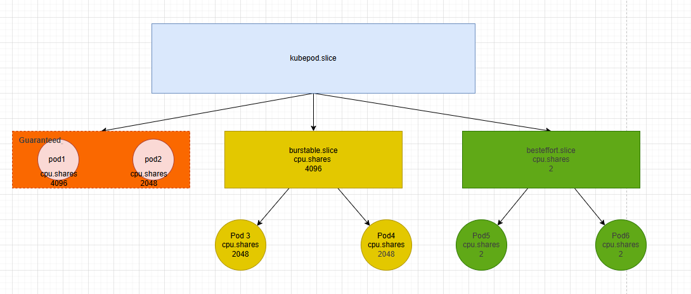
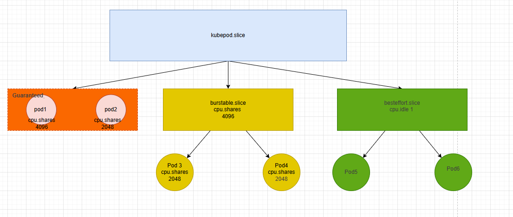

# KEP-5889 cpu.idle for besteffort qos pod 
<!-- toc -->
- [Release Signoff Checklist](#release-signoff-checklist)
- [Summary](#summary)
- [Motivation](#motivation)
  - [Goals](#goals)
  - [Non-Goals](#non-goals)
- [Proposal](#proposal)
  - [User Stories (Optional)](#user-stories-optional)
    - [Story 1 (Optional)](#story-1-optional)
    - [Story 2 (Optional)](#story-2-optional)
  - [Notes/Constraints/Caveats (Optional)](#notesconstraintscaveats-optional)
  - [Risks and Mitigations](#risks-and-mitigations)
- [Design Details](#design-details)
  - [Test Plan](#test-plan)
      - [Prerequisite testing updates](#prerequisite-testing-updates)
      - [Unit tests](#unit-tests)
      - [Integration tests](#integration-tests)
      - [e2e tests](#e2e-tests)
  - [Graduation Criteria](#graduation-criteria)
  - [Upgrade / Downgrade Strategy](#upgrade--downgrade-strategy)
  - [Version Skew Strategy](#version-skew-strategy)
- [Production Readiness Review Questionnaire](#production-readiness-review-questionnaire)
  - [Feature Enablement and Rollback](#feature-enablement-and-rollback)
  - [Rollout, Upgrade and Rollback Planning](#rollout-upgrade-and-rollback-planning)
  - [Monitoring Requirements](#monitoring-requirements)
  - [Dependencies](#dependencies)
  - [Scalability](#scalability)
  - [Troubleshooting](#troubleshooting)
- [Implementation History](#implementation-history)
- [Drawbacks](#drawbacks)
- [Alternatives](#alternatives)
- [Infrastructure Needed (Optional)](#infrastructure-needed-optional)
<!-- /toc -->

## Release Signoff Checklist

Items marked with (R) are required *prior to targeting to a milestone / release*.

- [ ] (R) Enhancement issue in release milestone, which links to KEP dir in [kubernetes/enhancements] (not the initial KEP PR)
- [ ] (R) KEP approvers have approved the KEP status as `implementable`
- [ ] (R) Design details are appropriately documented
- [ ] (R) Test plan is in place, giving consideration to SIG Architecture and SIG Testing input (including test refactors)
  - [ ] e2e Tests for all Beta API Operations (endpoints)
  - [ ] (R) Ensure GA e2e tests meet requirements for [Conformance Tests](https://github.com/kubernetes/community/blob/master/contributors/devel/sig-architecture/conformance-tests.md)
  - [ ] (R) Minimum Two Week Window for GA e2e tests to prove flake free
- [ ] (R) Graduation criteria is in place
  - [ ] (R) [all GA Endpoints](https://github.com/kubernetes/community/pull/1806) must be hit by [Conformance Tests](https://github.com/kubernetes/community/blob/master/contributors/devel/sig-architecture/conformance-tests.md) within one minor version of promotion to GA
- [ ] (R) Production readiness review completed
- [ ] (R) Production readiness review approved
- [ ] "Implementation History" section is up-to-date for milestone
- [ ] User-facing documentation has been created in [kubernetes/website], for publication to [kubernetes.io]
- [ ] Supporting documentation—e.g., additional design documents, links to mailing list discussions/SIG meetings, relevant PRs/issues, release notes

[kubernetes.io]: https://kubernetes.io/
[kubernetes/enhancements]: https://git.k8s.io/enhancements
[kubernetes/kubernetes]: https://git.k8s.io/kubernetes
[kubernetes/website]: https://git.k8s.io/website

## Summary
This proposal aims to limit CPU resource usage for BestEffort QoS-level pods during CPU shortages by leveraging idle CPU capacity.The optimal pod configuration at best-effort level restricts CPU resource allocation by setting a minimum value for CPU sharing in QoS level. Practical tests demonstrate that idle CPU usage provides superior constraint effectiveness, while guaranteed QoS pods exhibit enhanced performance.

For a comparison between the two implementation methods, cpu.idle and cpu.shares||cpu.weight, please refer to this [section](https://github.com/kubernetes/kubernetes/issues/136025#issuecomment-3804009894).

The feature require cgroupV2 & linux kernel 5.4 or later(cpu.idle enable)
Users can configure the use of the CPU.idle function according to their needs or continue using cpu.shares/cpu.weight.

The feature prototype code is ready. [code](https://github.com/kubernetes/kubernetes/pull/136458)

## Motivation

### Goals

Currently, Kubelet sets cpu.shares to 2 for the top-level BestEffort QoS cgroup. The goal is to allow BestEffort tasks to utilize free CPU cycles (improving node utilization) while minimizing the impact on Guaranteed and Burstable workloads.

However, relying solely on cpu.shares (even with a minimal value) provides "weight-based" isolation. In high-load scenarios, this can still lead to latency interference for high-priority tasks.

Since Linux Kernel 5.4, significant improvements have been made to SCHED_IDLE (Reference Patch: sched/fair: Improve the scheduling of SCHED_IDLE tasks).

Better Isolation: cpu.idle (SCHED_IDLE) ensures that tasks are treated with truly "idle" priority. They only run when there is absolutely no other higher-priority task to run. This offers significantly better isolation for Guaranteed/Burstable pods compared to simply lowering cpu.shares（cgroup v2 cpu.weight）.
Safe Colocation: It allows safe colocation of BestEffort batch jobs with latency-sensitive services without the risk of performance degradation for the latter

### Non-Goals

## Proposal
Users can choose whether to enable cpu.idle features based on their cluster environment.When this feature is enabled, the kernel sets the cpu.shares ||cpu.weight value to the default.The original implementation of cpu.shares||cpu.weight will no work.

### Notes/Constraints/Caveats (Optional)
#### Two Necessary Conditions
- must be cgroupv2
- The kernel version is 5.4 or later
#### If conditions not met
If the user does not meet the usage requirements but still activates this feature, they will continue to use cpu.shares to implement BestEffort QoS

### Risks and Mitigations

## Design Details
In the earlier implementation of Pod QoS, we utilized the CPU shares feature, adjusting the CPU shares value based on the CPU usage of each pod's requests.The best-effort QoS level sets the pod CPU shares to the minimum value. In this solution, the other two QoS levels remain unchanged, with the best-effort level's CPU idle value set to 1 to indicate the current Cgroup idle state, allowing fewer CPU resources to be allocated.

the original design, All three levels utilize cpu.shares

the new design , besteffort levels pod cpu.idle values set to 1 

### Test Plan

[ ] I/we understand the owners of the involved components may require updates to
existing tests to make this code solid enough prior to committing the changes necessary
to implement this enhancement.

##### Prerequisite testing updates

##### Unit tests

This feature depends on the Linux kernel's CPU resource scheduling.Therefore, unit testing can only verify whether the configuration is effective and correct.
This feature change is minimal,The unit test is in package under `pkg/kubelet/cm/qos_container_manager_linux_test.go`

- `qos_container_manager_linux.go`

##### Integration tests

##### e2e tests

- [test name](https://github.com/kubernetes/kubernetes/blob/2334b8469e1983c525c0c6382125710093a25883/test/e2e/...): [SIG ...](https://testgrid.k8s.io/sig-...?include-filter-by-regex=MyCoolFeature), [triage search](https://storage.googleapis.com/k8s-triage/index.html?test=MyCoolFeature)

### Graduation Criteria

### Upgrade / Downgrade Strategy

### Version Skew Strategy

## Production Readiness Review Questionnaire

### Feature Enablement and Rollback

###### How can this feature be enabled / disabled in a live cluster?

- [ ] Feature gate (also fill in values in `kep.yaml`)
  - Feature gate name:
  - Components depending on the feature gate:
- [ ] Other
  - Describe the mechanism:
  - Will enabling / disabling the feature require downtime of the control
    plane?
  - Will enabling / disabling the feature require downtime or reprovisioning
    of a node?

###### Does enabling the feature change any default behavior?

yes 

###### Can the feature be disabled once it has been enabled (i.e. can we roll back the enablement)?

yes

###### What happens if we reenable the feature if it was previously rolled back?

set besteffort qos level cpu.idle value to 0

###### Are there any tests for feature enablement/disablement?

cat besteffort qos level cpu.idle value 
0 mean the feature is disabled 
1 mean the feature is enabled 

### Rollout, Upgrade and Rollback Planning

###### How can a rollout or rollback fail? Can it impact already running workloads?

No

###### What specific metrics should inform a rollback?

If the feature is not supported, the original QoS implementation remains unchanged, so whether to roll back is not a critical decision.

###### Were upgrade and rollback tested? Was the upgrade->downgrade->upgrade path tested?

###### Is the rollout accompanied by any deprecations and/or removals of features, APIs, fields of API types, flags, etc.?

No 

### Monitoring Requirements

<!--
This section must be completed when targeting beta to a release.

For GA, this section is required: approvers should be able to confirm the
previous answers based on experience in the field.
-->

###### How can an operator determine if the feature is in use by workloads?

<!--
Ideally, this should be a metric. Operations against the Kubernetes API (e.g.,
checking if there are objects with field X set) may be a last resort. Avoid
logs or events for this purpose.
-->

###### How can someone using this feature know that it is working for their instance?

<!--
For instance, if this is a pod-related feature, it should be possible to determine if the feature is functioning properly
for each individual pod.
Pick one more of these and delete the rest.
Please describe all items visible to end users below with sufficient detail so that they can verify correct enablement
and operation of this feature.
Recall that end users cannot usually observe component logs or access metrics.
-->

- [ ] Events
  - Event Reason: 
- [ ] API .status
  - Condition name: 
  - Other field: 
- [ ] Other (treat as last resort)
  - Details:

###### What are the reasonable SLOs (Service Level Objectives) for the enhancement?

<!--
This is your opportunity to define what "normal" quality of service looks like
for a feature.

It's impossible to provide comprehensive guidance, but at the very
high level (needs more precise definitions) those may be things like:
  - per-day percentage of API calls finishing with 5XX errors <= 1%
  - 99% percentile over day of absolute value from (job creation time minus expected
    job creation time) for cron job <= 10%
  - 99.9% of /health requests per day finish with 200 code

These goals will help you determine what you need to measure (SLIs) in the next
question.
-->

###### What are the SLIs (Service Level Indicators) an operator can use to determine the health of the service?

<!--
Pick one more of these and delete the rest.
-->

- [ ] Metrics
  - Metric name:
  - [Optional] Aggregation method:
  - Components exposing the metric:
- [ ] Other (treat as last resort)
  - Details:

###### Are there any missing metrics that would be useful to have to improve observability of this feature?

No

### Dependencies

###### Does this feature depend on any specific services running in the cluster?

No

### Scalability

###### Will enabling / using this feature result in any new API calls?

No

###### Will enabling / using this feature result in introducing new API types?

No

###### Will enabling / using this feature result in any new calls to the cloud provider?

No

###### Will enabling / using this feature result in increasing size or count of the existing API objects?

No

###### Will enabling / using this feature result in increasing time taken by any operations covered by existing SLIs/SLOs?

No

###### Will enabling / using this feature result in non-negligible increase of resource usage (CPU, RAM, disk, IO, ...) in any components?

No

###### Can enabling / using this feature result in resource exhaustion of some node resources (PIDs, sockets, inodes, etc.)?

No

### Troubleshooting

<!--
This section must be completed when targeting beta to a release.

For GA, this section is required: approvers should be able to confirm the
previous answers based on experience in the field.

The Troubleshooting section currently serves the `Playbook` role. We may consider
splitting it into a dedicated `Playbook` document (potentially with some monitoring
details). For now, we leave it here.
-->

###### How does this feature react if the API server and/or etcd is unavailable?

uninvolved

###### What are other known failure modes?

uninvolved

###### What steps should be taken if SLOs are not being met to determine the problem?

- cat besteffort qos level cpu.idle value ,the value except is 0

## Implementation History

<!--
Major milestones in the lifecycle of a KEP should be tracked in this section.
Major milestones might include:
- the `Summary` and `Motivation` sections being merged, signaling SIG acceptance
- the `Proposal` section being merged, signaling agreement on a proposed design
- the date implementation started
- the first Kubernetes release where an initial version of the KEP was available
- the version of Kubernetes where the KEP graduated to general availability
- when the KEP was retired or superseded
-->

## Drawbacks

<!--
Why should this KEP _not_ be implemented?
-->

## Alternatives

<!--
What other approaches did you consider, and why did you rule them out? These do
not need to be as detailed as the proposal, but should include enough
information to express the idea and why it was not acceptable.
-->

## Infrastructure Needed (Optional)

<!--
Use this section if you need things from the project/SIG. Examples include a
new subproject, repos requested, or GitHub details. Listing these here allows a
SIG to get the process for these resources started right away.
-->
