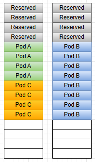
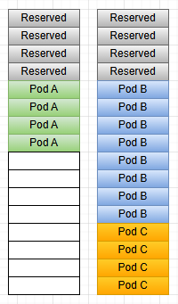

# KEP-6007: Add Topology Manager option to improve workload density for single-numa-node

[enhancement tracking issue]: https://github.com/kubernetes/enhancements/issues/6007

<!-- toc -->
- [Release Signoff Checklist](#release-signoff-checklist)
- [Summary](#summary)
- [Motivation](#motivation)
  - [Problem statement](#problem-statement)
  - [Illustrative NUMA packing](#illustrative-numa-packing)
  - [Goals](#goals)
  - [Non-Goals](#non-goals)
- [Proposal](#proposal)
  - [User Stories](#user-stories)
  - [Proposed API](#proposed-api)
  - [Algorithm](#algorithm)
  - [Notes / Constraints / Caveats](#notes--constraints--caveats)
  - [Risks and Mitigations](#risks-and-mitigations)
- [Design Details](#design-details)
  - [Kubelet wiring (container manager ↔ topology manager)](#kubelet-wiring-container-manager--topology-manager)
  - [Test Plan](#test-plan)
    - [Unit tests](#unit-tests)
    - [Integration / e2e](#integration--e2e)
  - [Rollout and Documentation](#rollout-and-documentation)
  - [Graduation Criteria](#graduation-criteria)
- [Drawbacks](#drawbacks)
- [Alternatives](#alternatives)
- [Implementation History](#implementation-history)
<!-- /toc -->

## Release Signoff Checklist

Items marked with (R) are required *prior to targeting to a milestone / release*.

- [ ] (R) Enhancement issue in release milestone, which links to KEP dir in [kubernetes/enhancements]
- [ ] (R) KEP approvers have approved the KEP status as `implementable`
- [ ] (R) Design details are appropriately documented
- [ ] (R) Test plan is in place
- [ ] (R) Graduation criteria is in place
- [ ] (R) Production readiness review completed
- [ ] (R) Production readiness review approved

[kubernetes/enhancements]: https://git.k8s.io/enhancements

## Summary

Clusters that enforce strict NUMA locality with `topologyManagerPolicy: single-numa-node`
often give up **workload density**: pods fail to schedule even when node has **enough CPUs
in total**, because exclusive CPUs are fragmented across NUMAs.
Among **tied** equally valid single-NUMA merged outcomes, Topology Manager today breaks ties
with **bitmask / `Narrowest`** (equal width → **smaller mask / lower NUMA id**), **not**
**free or contiguous** exclusive-CPU headroom—so it cannot prefer the choice that leaves
**more room for the next** large single-NUMA pod.

This KEP proposes an **optional** Topology Manager policy option **`prefer-most-allocated-numa-node`**
so that, under **`single-numa-node`**, kubelet can break ties using **kubelet-local** signals
(static CPU and Memory managers)—in the spirit of **“most allocated”** packing (favor placing the pod
on the NUMA that **preserves a larger contiguous exclusive-CPU hole** on other NUMA for the **next**
workload). Default behavior stays **unchanged** when the option is off.

## Motivation

### Problem statement

- **Why `best-effort` provides “more capacity”:** The same Guaranteed workload with
  integer CPUs can be admitted under `best-effort` with **cross-NUMA** CPU placement.
  `single-numa-node` rejects unless the request fits on **one** NUMA; the difference is
  topology locality, not raw millis.
- **Observed failure mode:** Workloads pinned to one NUMA (devices, hugepages etc) make
  the node **asymmetric**. For **new** pods whose merged hints allow **either** NUMA,
  **always preferring the lower NUMA id** reduces the overall workload density on the node.

### Illustrative NUMA packing

The two figures below show why **where** work lands on each NUMA affects **single-NUMA**
workloads that need a **contiguous** block. Pod B is NUMA pinned due to device affinity.



*Capacity-not-aware (today):* among valid NUMAs, the merger **prefers the lower NUMA id**
(via bitmask ordering) when there are **no** stronger hints from devices, hugepages, or
static memory—**without** considering remaining contiguous exclusive-CPU headroom.



*With `prefer-most-allocated-numa-node` (proposed):* tie-break scoring favors an outcome in the
**most-allocated / consolidate** spirit—**concentrating** use so the **other** NUMA keeps a
**larger contiguous** exclusive-CPU region—often better for the **next** Guaranteed pod under
static CPU.

### Goals

- **Improve workload density** (better use of nodes)
  for operators who use **`single-numa-node`** for strict locality (like in Telco).
- Integrate via **`TopologyManagerPolicyOptions`**, using the same **feature gate /
  graduation pattern** as for other topology policy options.

### Non-Goals

- Reimplementing **`NodeResourcesFit`** or other scheduler scoring. The NUMA-level scoring
  **aligns with** the scheduler's `mostRequestedScore` formula but does not import or
  duplicate scheduler code.

**Side benefit:** Because the default kube-scheduler is **not NUMA-aware**, it may place a
pod on a node whose aggregate resources look sufficient, only for kubelet to **reject** the
pod when no single NUMA node has enough contiguous free space. By acting as a **local
defragmenter**—consolidating smaller workloads on one NUMA to preserve larger contiguous
free regions on the other—this option reduces such "last-mile" admission failures and the
wasted scheduling cycles they cause.

## Proposal

### User Stories

1. **As a cluster operator** running `single-numa-node` with static CPU and Memory managers,
   I want **better density** under strict single-NUMA locality—without switching to
   **`best-effort`** (which results in cross-NUMA CPUs).
2. **As a platform engineer**, I want an **opt-in** policy option so existing clusters keep
   today’s behavior unless they enable the new option.

### Proposed API

Introduce a new Topology Manager policy option **`prefer-most-allocated-numa-node`**, configurable
via kubelet configuration alongside existing options:
- Only in effect when **`topologyManagerPolicy` is `single-numa-node`**.
- `TopologyManagerPolicyOptions` / alpha-beta gates as for other new options.

When the option is **disabled** (default), behavior remains **unchanged** from today.

```yaml
kind: KubeletConfiguration
apiVersion: kubelet.config.k8s.io/v1beta1
featureGates:
  ...
  TopologyManagerPolicyAlphaOptions: true
topologyManagerPolicyOptions:
  prefer-most-allocated-numa-node: "true"
topologyManagerPolicy: single-numa-node
memoryManagerPolicy: Static
cpuManagerPolicy: static
...
```

### Algorithm

**Trigger:** `topologyManagerPolicy` is **`single-numa-node`**, **`prefer-most-allocated-numa-node`**
is set in **`topologyManagerPolicyOptions`** (with required feature gates), and the hint merger is
comparing **preferred** merged hints whose NUMA affinity is a **single** NUMA node (bit count 1).

**Scoring (kubelet aggregator):**

Each signal computes a **utilization score** per NUMA using the same formula as
kube-scheduler's `MostAllocated` plugin: `score = (assigned × 100) / allocatable`,
where **allocatable** accounts for reserved resources so the ratio reflects true
utilization.

1. **CPU signal (static CPU manager):** Score each NUMA by exclusive-CPU utilization
   (assigned / allocatable, where allocatable excludes reserved CPUs). Higher score wins.
   Equal scores or non-static policy → undecided.
2. **Memory signal (static memory manager):** Score each NUMA by regular-memory utilization
   (assigned / allocatable, where allocatable excludes per-NUMA reserved memory). Higher score
   wins. Equal scores or non-static policy → undecided.
3. **Combine:** Neither decides → **`Narrowest`** fallback. One decides → use it.
   Both decide and agree → use it. Both decide but disagree → **`Narrowest`** fallback.

**Interactions:**

- **Scheduler / descheduler:** Not a substitute for this option. The **scheduler** chooses a
  **node**; it does not run Topology Manager or finalize **static** CPU / memory **NUMA** placement
  on the node. The **descheduler** evicts pods so they can be scheduled again. This KEP answers
  the question "which single-NUMA outcome wins when several are equivalent?".
- **Merge:** Still driven by hint providers; this step only affects **which** valid
  single-NUMA preferred outcome wins when multiple exist.


### Notes / Constraints / Caveats

- Requires **static** CPU Manager and Memory Manager so **per-NUMA** signals are meaningful.

### Risks and Mitigations

| Risk | Mitigation |
|------|------------|
| Admission latency | Run scoring only on the tie path; reuse cached summaries where possible |
| Behavior surprise when enabled | Opt-in; metrics `topology_manager_admission_*` already exist |

## Design Details

### Kubelet wiring (container manager ↔ topology manager)

Topology Manager is created **before** the CPU and Memory managers, so those dependencies are
not available at `NewManager` time. Inside the **container manager**, after the CPU and Memory
managers are constructed (and registered as topology hint providers), kubelet builds a **preferred
NUMA tie-breaker** object that **holds references** to those two managers and registers it via
**`TopologyManager.SetPreferredSingleNUMATieBreaker`**. The topology **Manager** forwards to
**Scope**, which stores the object on **`singleNumaNodePolicy`** when the active policy is
**`single-numa-node`**; other policies ignore registration.

When a pod reaches topology admission and the hint **merger** takes the tie path (two **preferred**
hints with **single-bit** NUMA masks) and **`PreferMostAllocatedNUMANode`** is **true** in
**`PolicyOptions`**, the merger calls **`ComparePreferredSingleNUMAForTopology`** on the stored
tie-breaker. That implementation delegates to the **CPU** and **Memory** managers’
**`ComparePreferredSingleNUMAForTopology`** methods, then applies the **agree / single-signal /
disagree→fallback** rules described under **Algorithm**.

### Test Plan

[X] Owners of involved components may require updates to existing tests before merge.

#### Unit tests

Five test suites cover each layer of the feature:

1. **CPU signal scoring** (`pkg/kubelet/cm/cpumanager/cpu_compare_preferred_scoring_test.go`) —
   Verifies the CPU manager's utilization-based comparison: equal utilization → undecided,
   higher utilization → prefer that NUMA, non-static policy → undecided, and asymmetric
   reserved CPUs correctly change the outcome even when raw assigned counts are equal.

2. **Memory signal scoring** (`pkg/kubelet/cm/memorymanager/memory_compare_preferred_scoring_test.go`) —
   Verifies the memory manager's utilization-based comparison: equal utilization → undecided,
   higher utilization → prefer that NUMA, non-static policy → undecided, and asymmetric
   per-NUMA reserved memory correctly change the outcome even when raw assigned bytes are equal.

3. **Aggregator combine rules** (`pkg/kubelet/cm/preferred_numa_tiebreak_test.go`) —
   Stub-driven tests for the combine logic: both undecided, CPU-only, memory-only,
   agree, and disagree→fallback.

4. **Topology Manager merge** (`pkg/kubelet/cm/topologymanager/policy_prefer_most_allocated_test.go`) —
   End-to-end merge through `singleNumaNodePolicy`: tie-breaker overrides default, and
   absent tie-breaker falls back to Narrowest.

5. **Policy option gating** (`pkg/kubelet/cm/topologymanager/policy_options_test.go`) —
   `prefer-most-allocated-numa-node` accepted only with `TopologyManagerPolicyAlphaOptions`
   enabled; rejected otherwise.

#### Integration / e2e

- Multi-NUMA **static** CPU + `single-numa-node`: ordered admission of Guaranteed pods
  (no devices) to validate **baseline** vs **option** NUMA choice when ties exist.
- Scenarios where **one** NUMA already holds an exclusive / device-bound pod and pods could
  admit to **either** NUMA—assert the option changes **which** NUMA wins vs low-index default.

### Rollout and Documentation

- Alpha: new option behind `TopologyManagerPolicyAlphaOptions`
- User-facing docs: kubelet configuration reference, relationship to `single-numa-node` and
  static managers
- Release notes per phase.

### Graduation Criteria

- **Alpha:** Implementation + unit tests; documented semantics and known limitations.
- **Beta:** e2e signal on multi-NUMA CI; no major semantic surprises from production feedback.
- **GA:** Sufficient soak; option promotion per SIG Node policy for policy options.

## Drawbacks

- More logic and coupling between Topology Manager and CPU/Memory manager state.

## Alternatives

1. **Status quo:** Keep bitmask / low-NUMA-id tie-break; accept lower density on **asymmetric**
   nodes when symmetric pods **always** stack on the lower-id NUMA first.

## Implementation History

- 2026-04-07: Draft created.
