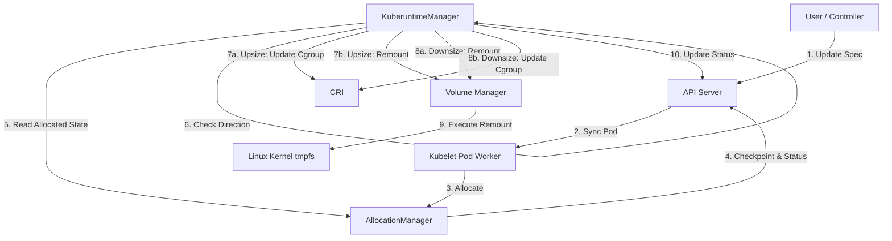

<!--
**Note:** When your KEP is complete, all of these comment blocks should be removed.

Follow the guidelines of the [documentation style guide].
In particular, wrap lines to a reasonable length, to make it
easier for reviewers to cite specific portions, and to minimize diff churn on
updates.

[documentation style guide]: https://github.com/kubernetes/community/blob/master/contributors/guide/style-guide.md

To get started with this template:

- [ ] **Pick a hosting SIG.**
  Make sure that the problem space is something the SIG is interested in taking
  up. KEPs should not be checked in without a sponsoring SIG.
- [ ] **Create an issue in kubernetes/enhancements**
  When filing an enhancement tracking issue, please make sure to complete all
  fields in that template. One of the fields asks for a link to the KEP. You
  can leave that blank until this KEP is filed, and then go back to the
  enhancement and add the link.
- [ ] **Make a copy of this template directory.**
  Copy this template into the owning SIG's directory and name it
  `NNNN-short-descriptive-title`, where `NNNN` is the issue number (with no
  leading-zero padding) assigned to your enhancement above.
- [ ] **Fill out as much of the kep.yaml file as you can.**
  At minimum, you should fill in the "Title", "Authors", "Owning-sig",
  "Status", and date-related fields.
- [ ] **Fill out this file as best you can.**
  At minimum, you should fill in the "Summary" and "Motivation" sections.
  These should be easy if you've preflighted the idea of the KEP with the
  appropriate SIG(s).
- [ ] **Create a PR for this KEP.**
  Assign it to people in the SIG who are sponsoring this process.
- [ ] **Merge early and iterate.**
  Avoid getting hung up on specific details and instead aim to get the goals of
  the KEP clarified and merged quickly. The best way to do this is to just
  start with the high-level sections and fill out details incrementally in
  subsequent PRs.

Just because a KEP is merged does not mean it is complete or approved. Any KEP
marked as `provisional` is a working document and subject to change. You can
denote sections that are under active debate as follows:

```
<<[UNRESOLVED optional short context or usernames ]>>
Stuff that is being argued.
<<[/UNRESOLVED]>>
```

When editing KEPS, aim for tightly-scoped, single-topic PRs to keep discussions
focused. If you disagree with what is already in a document, open a new PR
with suggested changes.

One KEP corresponds to one "feature" or "enhancement" for its whole lifecycle.
You do not need a new KEP to move from beta to GA, for example. If
new details emerge that belong in the KEP, edit the KEP. Once a feature has become
"implemented", major changes should get new KEPs.

The canonical place for the latest set of instructions (and the likely source
of this file) is [here](/keps/NNNN-kep-template/README.md).

**Note:** Any PRs to move a KEP to `implementable`, or significant changes once
it is marked `implementable`, must be approved by each of the KEP approvers.
If none of those approvers are still appropriate, then changes to that list
should be approved by the remaining approvers and/or the owning SIG (or
SIG Architecture for cross-cutting KEPs).
-->
# KEP-6030: Dynamic Resize of Memory-Backed Volumes

<!--
This is the title of your KEP. Keep it short, simple, and descriptive. A good
title can help communicate what the KEP is and should be considered as part of
any review.
-->

<!--
A table of contents is helpful for quickly jumping to sections of a KEP and for
highlighting any additional information provided beyond the standard KEP
template.

Ensure the TOC is wrapped with
  <code>&lt;!-- toc --&rt;&lt;!-- /toc --&rt;</code>
tags, and then generate with `hack/update-toc.sh`.
-->

<!-- toc -->
- [Release Signoff Checklist](#release-signoff-checklist)
- [Summary](#summary)
- [Motivation](#motivation)
  - [Goals](#goals)
  - [Non-Goals](#non-goals)
- [Proposal](#proposal)
  - [User Stories](#user-stories)
    - [Story 1](#story-1)
    - [Story 2](#story-2)
  - [Risks and Mitigations](#risks-and-mitigations)
    - [OOM-kills](#oom-kills)
- [Design Details](#design-details)
  - [API Changes](#api-changes)
    - [New Status Fields and State Mapping](#new-status-fields-and-state-mapping)
    - [API Validation and Restrictions](#api-validation-and-restrictions)
    - [Resize Restart Policy](#resize-restart-policy)
    - [Atomic Resize Principle](#atomic-resize-principle)
  - [Component Interaction &amp; Design Flow](#component-interaction--design-flow)
  - [1. User/Control Plane](#1-usercontrol-plane)
  - [2. Kubelet Pod Workers &amp; Allocation](#2-kubelet-pod-workers--allocation)
  - [3. Coordination &amp; Actuation (KuberuntimeManager)](#3-coordination--actuation-kuberuntimemanager)
  - [4. Observation &amp; Feedback Loop](#4-observation--feedback-loop)
  - [Resource Coordination: Volume and Cgroup Ordering of Updates](#resource-coordination-volume-and-cgroup-ordering-of-updates)
    - [Technical Context: The Enforcement Divergence](#technical-context-the-enforcement-divergence)
    - [Priority of Enforcement](#priority-of-enforcement)
    - [Order of Actuation](#order-of-actuation)
      - [Asynchronous Updates or Opposite Directions](#asynchronous-updates-or-opposite-directions)
      - [Actuation Priority Matrix](#actuation-priority-matrix)
    - [Role of the Allocation Manager and Kuberuntime Manager](#role-of-the-allocation-manager-and-kuberuntime-manager)
    - [Volume Manager interface](#volume-manager-interface)
  - [Shrinkage Safety](#shrinkage-safety)
    - [Ephemeral Storage Monitoring and Eviction](#ephemeral-storage-monitoring-and-eviction)
  - [Interaction with Ephemeral Storage: Resource Accounting and Eviction](#interaction-with-ephemeral-storage-resource-accounting-and-eviction)
  - [Interaction with Secrets, Projected Volumes, and DownwardAPI](#interaction-with-secrets-projected-volumes-and-downwardapi)
    - [ConfigMaps](#configmaps)
  - [Test Plan](#test-plan)
      - [Prerequisite testing updates](#prerequisite-testing-updates)
      - [Unit tests](#unit-tests)
      - [Integration tests](#integration-tests)
      - [e2e tests](#e2e-tests)
  - [Graduation Criteria](#graduation-criteria)
    - [Alpha](#alpha)
    - [Beta](#beta)
    - [GA](#ga)
  - [Upgrade / Downgrade Strategy](#upgrade--downgrade-strategy)
    - [Upgrade](#upgrade)
    - [Downgrade](#downgrade)
  - [Version Skew Strategy](#version-skew-strategy)
    - [Kubelet vs API Server](#kubelet-vs-api-server)
    - [API Server Component Skew](#api-server-component-skew)
- [Production Readiness Review Questionnaire](#production-readiness-review-questionnaire)
  - [Feature Enablement and Rollback](#feature-enablement-and-rollback)
  - [Rollout, Upgrade and Rollback Planning](#rollout-upgrade-and-rollback-planning)
  - [Monitoring Requirements](#monitoring-requirements)
  - [Dependencies](#dependencies)
  - [Scalability](#scalability)
  - [Troubleshooting](#troubleshooting)
- [Implementation History](#implementation-history)
- [Drawbacks](#drawbacks)
- [Alternatives](#alternatives)
  - [Volume Reconciler detects changes (Async approach)](#volume-reconciler-detects-changes-async-approach)
  - [Moving <code>emptyDir</code> handling entirely to <code>KuberuntimeManager</code>](#moving-emptydir-handling-entirely-to-kuberuntimemanager)
  - [Restricting <code>sizeLimit</code> to not exceed memory limits](#restricting-sizelimit-to-not-exceed-memory-limits)
  - [Non-atomic handling of volume and resource resizes](#non-atomic-handling-of-volume-and-resource-resizes)
<!-- /toc -->

## Release Signoff Checklist

<!--
**ACTION REQUIRED:** In order to merge code into a release, there must be an
issue in [kubernetes/enhancements] referencing this KEP and targeting a release
milestone **before the [Enhancement Freeze](https://git.k8s.io/sig-release/releases)
of the targeted release**.

For enhancements that make changes to code or processes/procedures in core
Kubernetes—i.e., [kubernetes/kubernetes], we require the following Release
Signoff checklist to be completed.

Check these off as they are completed for the Release Team to track. These
checklist items _must_ be updated for the enhancement to be released.
-->

Items marked with (R) are required *prior to targeting to a milestone / release*.

- [ ] (R) Enhancement issue in release milestone, which links to KEP dir in [kubernetes/enhancements] (not the initial KEP PR)
- [ ] (R) KEP approvers have approved the KEP status as `implementable`
- [ ] (R) Design details are appropriately documented
- [ ] (R) Test plan is in place, giving consideration to SIG Architecture and SIG Testing input (including test refactors)
  - [ ] e2e Tests for all Beta API Operations (endpoints)
  - [ ] (R) Ensure GA e2e tests meet requirements for [Conformance Tests](https://github.com/kubernetes/community/blob/master/contributors/devel/sig-architecture/conformance-tests.md)
  - [ ] (R) Minimum Two Week Window for GA e2e tests to prove flake free
- [ ] (R) Graduation criteria is in place
  - [ ] (R) [all GA Endpoints](https://github.com/kubernetes/community/pull/1806) must be hit by [Conformance Tests](https://github.com/kubernetes/community/blob/master/contributors/devel/sig-architecture/conformance-tests.md) within one minor version of promotion to GA
- [ ] (R) Production readiness review completed
- [ ] (R) Production readiness review approved
- [ ] "Implementation History" section is up-to-date for milestone
- [ ] User-facing documentation has been created in [kubernetes/website], for publication to [kubernetes.io]
- [ ] Supporting documentation—e.g., additional design documents, links to mailing list discussions/SIG meetings, relevant PRs/issues, release notes

<!--
**Note:** This checklist is iterative and should be reviewed and updated every time this enhancement is being considered for a milestone.
-->

[kubernetes.io]: https://kubernetes.io/
[kubernetes/enhancements]: https://git.k8s.io/enhancements
[kubernetes/kubernetes]: https://git.k8s.io/kubernetes
[kubernetes/website]: https://git.k8s.io/website

## Summary

This KEP proposes a mechanism to dynamically resize `emptyDir` volumes with `medium: Memory` (tmpfs) without requiring Pod recreation or Pod restart. It leverages the `InPlacePodVerticalScaling` (IPPVS) infrastructure to manage the transition from the desired state to the actual state via an allocation and actuation loop.

## Motivation

Currently, increasing memory-backed storage (tmpfs `emptyDir` volumes) requires Pod recreation, which is disruptive for high-performance caches or in-memory databases that are otherwise capable of resizing their memory footprints dynamically.

This enhancement builds directly on the foundation laid by **In-Place Pod Vertical Scaling (IPPVS)** (KEP-1287). Just as IPPVS allows scaling container CPU and memory resources without Pod disruption, high-performance workloads frequently require scaling their scratch space or in-memory caches simultaneously. Since memory-backed `emptyDir` volumes consume the node's memory (and can be bounded by the Pod's memory limits), integrating their resize lifecycle with the IPPVS allocation and actuation phases ensures consistent resource accounting and prevents node exhaustion.

### Goals

*   Allow updating `emptyDir.sizeLimit` for existing Pods when `medium` is `Memory`.
*   Reflect resize progress in `Pod.Status` using an allocation/actuation model similar to IPPVS.
*   Actuate the resize via `tmpfs` remount without Pod disruption.

### Non-Goals

*   Resizing non-memory-backed `emptyDir` volumes (disk-backed).
*   Resizing other volume types (e.g., PVCs) through this mechanism.

## Proposal

We propose extending the `InPlacePodVerticalScaling` pattern to memory-backed `emptyDir` volumes.

### User Stories

#### Story 1
A user runs an in-memory database in a Pod and needs to increase the available cache size. The user updates the `emptyDir.sizeLimit` in the Pod spec. The Kubelet remounts the `tmpfs` volume with the new size limit without restarting the container, allowing the database to expand its cache immediately.

#### Story 2
An autoscaling controller dynamically scales the memory limits of workload worker pods (e.g., for machine learning or data processing) to handle varying demands. These workers utilize memory-backed `emptyDir` volumes for shared memory and caching, typically sizing the volume to a fixed proportion of the container's total memory limit. 

While the controller can use `InPlacePodVerticalScaling` to scale up a container's memory limit without restarting the pod, the inability to dynamically resize the associated memory-backed volume limits the worker's ability to utilize the expanded capacity for shared memory tasks without a disruptive restart. This feature allows the controller to update both the container memory limits and the `emptyDir.sizeLimit` simultaneously, providing seamless vertical scaling for distributed workloads.

### Risks and Mitigations

#### OOM-kills

The user is allowed to set the volume `sizeLimit` higher than the pod or container memory limits. Attempting to add such a restriction is considered out of scope for this KEP (see [Restricting sizeLimit to not exceed memory limits](#restricting-sizelimit-to-not-exceed-memory-limits)). This means that the user is reponsible for ensuring that the volume `sizeLimit` is set to be within the pod or container memory limits. Failure to do so may result in OOM-kills as applications within the pod fill up the volume.

The mitigation for this risk is that the API server can emit a warning when it sees a resize request that results in the volume `sizeLimit` being set to higher than the pod-level memory limits. 

## Design Details

### API Changes

#### New Status Fields and State Mapping

To support dynamic resizing, the `Pod.Spec.Volumes[].EmptyDir.SizeLimit` field is made **mutable** for existing Pods (when `medium` is `Memory`). This represents the **Desired State**.

We introduce two new fields to `corev1.VolumeStatus` (included within `VolumeMountStatus` in `Pod.Status`) to track the resize lifecycle:

*   **Desired State**: Represented by the mutable `Pod.Spec.Volumes[].EmptyDir.SizeLimit`.
*   **Allocated State**: Represented by the new `VolumeStatus.AllocatedSizeLimit` (The Kubelet has acknowledged the request and "reserved" the node capacity).
*   **Actual State**: Represented by the new `VolumeStatus.SizeLimit` (The `tmpfs` remount has succeeded and is reported by the mounter).

These status fields will **only** be populated for memory-backed volumes, and will **not** be populated other types of volumes.

#### API Validation and Restrictions

API Validation logic will be added to ensure that `Pod.Spec.Volumes[].EmptyDir.SizeLimit` is only mutable when:
* the volume is memory-backed (meaning the `medium` field is set to `Memory`).
* updates are made through the `resize` subresource.

Only modifications to an existing `Pod.Spec.Volumes[].EmptyDir.SizeLimit` will be allowed.
* The addition or removal of a memory-backed volume in a pod will not be allowed. 
* For alpha, the addition or removal of a `sizeLimit` to an existing memory-backed volume will not be allowed. This will be revisited for beta.

#### Resize Restart Policy 

There are existing resize restart policies that control when a container is restarted during a resize operation, which are described in more detail in the [InPlacePodVerticalScaling KEP](https://github.com/kubernetes/enhancements/tree/master/keps/sig-node/1287-in-place-update-pod-resources#container-resize-policy).

We do not introduce an analogous policy nor honor the existing restart policies when resizing memory-backed `emptyDir` volumes. The resizing of memory-backed `emptyDir` volumes is fundamentally non-disruptive to running processes and does not require application-level awareness beyond standard handling of filesystem capacity. If a volume resize is accompanied by a container or pod resource resize, the container's existing `RestartPolicy` will govern whether the container is restarted.

#### Atomic Resize Principle 

The atomic resize principle will be maintained. The Kubelet treats updates to volume `sizeLimit` and container / pod resources (both limits and requests) as a single, atomic transaction. The `AllocationManager` performs an All-or-Nothing Admission check, rejecting the entire update if the resize feasibility checks do not pass. The volume `sizeLimit` is not taken into consideration during the feasibility checks, but can fail the admission check atomically if the container / pod resize fails to be admitted. The volume `sizeLimit` is also checkpointed atomically along with container and pod resources.

The Pod's `ResizeStatus` will only transition to `Completed` once all container and volume states reach their respective desired values. If any component of the update fails, the status remains in a `PodResizeInProgress` (with an error) state to reflect the incomplete transition. This ensures resource integrity by preventing "partial resizes" that could leave a volume expanded within a container that failed to scale its memory budget.

See [Non-atomic handling of volume and resource resizes](#non-atomic-handling-of-volume-and-resource-resizes) for the alternative that was considered and rejected.

### Component Interaction & Design Flow

The following diagram illustrates the end-to-end flow.



The following steps elaborate on the flow illustrated in the above diagram:

### 1. User/Control Plane
*   The user or an external controller updates `Pod.Spec.Volumes[].EmptyDir.SizeLimit`.
*   The API server preserves volume updates during the `dropNonResizeUpdates` phase.

### 2. Kubelet Pod Workers & Allocation
*   The Kubelet detects the specification change in `HandlePodUpdates`.
*   The `AllocationManager` validates the new resize request. The changing `sizeLimit` will not affect the feasibility of the resize, as pod admission takes only pod and container requests into consideration. 
*   If allocation succeeds, the `AllocationManager` updates the Kubelet's internal allocated state. The `AllocatedSizeLimit` is checkpointed (along with the container and pod requests/limits) to ensure that memory-backed volume size limits survive Kubelet restarts.
*   The Kubelet populates `Pod.Status.VolumeMounts[].VolumeStatus.AllocatedSizeLimit` to reflect the successful allocation.

### 3. Coordination & Actuation (KuberuntimeManager)
*   The `KuberuntimeManager` reads the `AllocatedSizeLimit` from the allocated state maintained by `AllocationManager`.
*   It acts as the central orchestrator for the actuation phase to enforce strict ordering.
*   The `KuberuntimeManager` checks the direction of the volume resize (upsize vs. downsize) by comparing the allocated size with the current actual size to determine the correct order of operations. See [Resource Coordination: Volume and Cgroup Ordering of Updates](#resource-coordination-volume-and-cgroup-ordering-of-updates) for the detailed rationale behind this ordering.
* The `KuberuntimeManager` directly calls a new interface on the Volume Manager (see [Volume Manager interface](#volume-manager-interface)) to perform the remount at the correct time, bypassing the async reconciler loop. The Volume Manager executes the remount: `mount -o remount,size=<limit> -t tmpfs tmpfs <path>`. 
* **Note**: The `emptyDir` reconciler today will never remount because `RequiresRemount` is hardcoded to always return false; this means that the `KuberuntimeManager` is the only one who will ever make this change. We considered alternatives such as relying on the `emptyDir` reconciler to detect changes asynchronously or moving `emptyDir` handling entirely to `KuberuntimeManager`, but they were ruled out. See [Alternatives](#alternatives) for more details.

### 4. Observation & Feedback Loop
*   Upon successful remount and cgroup update, the `KuberuntimeManager` checkpoints the actual resources as the new 'actuated resources'. 
*   The Kubelet updates `Pod.Status.VolumeMounts[].VolumeStatus.SizeLimit` to reflect the successful resize.
*   Once the actual size matches the allocated size (and any container resource updates are done), the Kubelet clears the `PodResizeInProgress` condition.

### Resource Coordination: Volume and Cgroup Ordering of Updates
 
#### Technical Context: The Enforcement Divergence

Memory-backed volumes consume the same physical RAM as the container's processes. While all usage is enforced by the container and pod cgroups, it is governed by two different enforcement thresholds:

*   **tmpfs `size` option**: An internal quota for the volume. When a write exceeds the volume's `sizeLimit`, the kernel returns a disk full (**ENOSPC**) error. This is a graceful I/O exception.
*   **cgroup `memory.max`**: The external limit for the entire container. Since `tmpfs` usage counts toward the cgroup total, hitting this limit triggers an **OOM (Out of Memory) Kill**, resulting in container termination.
 
#### Priority of Enforcement

The volume `sizeLimit` acts as a safety "inner boundary" to ensure volume growth does not starve the container's processes of execution RAM. Ideally, `sizeLimit` should be lower than the container's memory limit.

Kubernetes does not strictly enforce this "lower-than" relationship, allowing users to set a `sizeLimit` exceeding the pod's memory limits or shrink pod memory limits below the volume `sizeLimit`. In these cases:
*   The Kubelet will not block the resize but will issue a **Warning Event**.
*   If `sizeLimit` > cgroup memory limits, the volume's `ENOSPC` protection is effectively disabled, as the container will be OOM-killed before the volume quota is reached. This is consistent with what is permitted during pod creation today (see [Restricting sizeLimit to not exceed memory limits](#restricting-sizelimit-to-not-exceed-memory-limits)).

#### Order of Actuation

To prevent race-condition OOMs during a resize, the order of operations is driven primarily by the direction of the **Volume sizeLimit** change to ensure the container maintains the maximum possible "slack" during transition.

*   **When Increasing Volume `sizeLimit`**:
    1.  **Adjust Cgroup First**: Adjust `memory.max` to ensure the container envelope is prepared for potential volume expansion.
    2.  **Remount Volume Second**: Increase the `tmpfs` quota.

*(Rationale: Ensures the physical budget is expanded before the internal quota allows more usage.)*

*   **When Decreasing Volume `sizeLimit`**:
    1.  **Remount Volume First**: Shrink the `tmpfs` quota to reclaim space.
    2.  **Adjust Cgroup Second**: Adjust `memory.max`.

*(Rationale: Ensures the volume's claim on memory is reduced before the cgroup envelope is tightened around it.)*

In the case of multiple volumes, all volumes with an decreasing `sizeLimit` are downsized first, followed by the cgroup memory limit update, followed by all volumes with an increasing `sizeLimit` upsized.

##### Asynchronous Updates or Opposite Directions

It is possible that the resize requests for the container memory limits and the volume `sizeLimit` will be issued in separate updates or in opposite directions. We allow both scenarios. In these cases, the actuation order is less critical because the opposing nature of the updates means the sequence does not materially increase or decrease the risk of OOM kills. For the sake of implementation simplicity and predictability, we follow the standard order described above.

The user remains responsible for ensuring the container memory limit provides sufficient headroom for both volume data and process execution to prevent OOM kills.

##### Actuation Priority Matrix

The following table illustrates the finalized actuation priority matrix that the Kubelet follows, based on the direction of the volume's `sizeLimit` change:

| Scenario | Volume `sizeLimit` | Container `memory.max` | 1st Action | 2nd Action | Rationale |
| :--- | :--- | :--- | :--- | :--- | :--- |
| **Expansion** | Increasing ⬆️ | Increasing ⬆️ | **Cgroup** | **Volume** | Expand envelope before expanding the internal quota. |
| **Contraction** | Decreasing ⬇️ | Decreasing ⬇️ | **Volume** | **Cgroup** | Shrink the internal quota before tightening the envelope. |
| **Volume Only** | Increasing / Decreasing | Unchanged | **Volume** | **N/A** | No cgroup update necessary. |
| **Opposite (Vol Up)** | Increasing ⬆️ | Decreasing ⬇️ | **Cgroup** | **Volume** | If this configuration results in an OOM kill, it will do so regardless of ordering; follows "Vol Up" sequence for consistency. |
| **Opposite (Vol Down)** | Decreasing ⬇️ | Increasing ⬆️ | **Volume** | **Cgroup** | If this configuration results in an OOM kill it will do so regardless of ordering; follows "Vol Down" sequence for consistency. |
| **Cgroup Only** | Unchanged | Increasing / Decreasing | **Cgroup** | **N/A** | Standard container resize; no volume remount required. |

#### Role of the Allocation Manager and Kuberuntime Manager

The `AllocationManager`'s role is focused on maintaining the source of truth for allocated resources (checkpointing) and ensuring atomic admission of resource updates.

The `KuberuntimeManager` serves as the coordination layer that understands the nested relationship between volume size and cgroup limits and enforces the strict ordering of updates.

#### Volume Manager interface

To support direct resizing from the `KuberuntimeManager` while maintaining separation of concerns, we extend the Volume Manager and Volume Plugin interfaces:

*   **VolumeManager Extension**: The `VolumeManager` interface is extended with `ResizeVolume(pod *v1.Pod, volumeName string, newSize *resource.Quantity) error` and `GetVolumeSize(pod *v1.Pod, volumeName string) (*resource.Quantity, error)`. This allows the `KuberuntimeManager` to query the current size and trigger volume operations synchronously at the correct time in its sync loop.
*   **DirectResizableVolumePlugin Interface**: We introduce a new optional interface `DirectResizableVolumePlugin` in `pkg/volume/plugins.go`. Volume plugins that support online, synchronous resizing (in this case, the `emptyDir` plugin for memory-backed volumes) can implement this interface. The `VolumeManager` checks if the plugin for the volume implements this interface and delegates the call to it.

This design allows `KuberuntimeManager` to act as the central orchestrator for resource updates (ensuring strict ordering with cgroups) while leaving the actual filesystem manipulation logic encapsulated within the volume plugins.

We considered alternatives such as relying on the Volume Reconciler to detect changes asynchronously or moving `emptyDir` handling entirely to `KuberuntimeManager`, but they were ruled out. See [Alternatives](#alternatives) for more details.

### Shrinkage Safety 

In the existing `InPlacePodVerticalScaling` feature, there is a best-effort safety logic to ensure that we do not decrease memory limits below usage.

For alpha, we do not plan to handle the analogous case for memory-backed volumes. If the user attempts to remount the volume with a smaller size than currently used, the mount update will fail with an EINVAL error. In this case, the error is propagated back to the Kubelet and surfaced in the `PodResizeInProgress` condition. The error message from the kernel is `mount point not mounted or bad option`, which we can surface to the user in the condition message. 

For beta, we will consider improving the error message surfaced to the user in one of two ways:
1. Assume that `mount point not mounted or bad option` implies the mount volume being shrunk below usage, and provide a more informative error message accordingly.
2. Actually add an analogous best-effort check of the current volume usage in order to detect this scneario before sending the remount request to the kernel. This check will be subject to a TOCTOU (time-of-check to time-of-use) race condition.

In the case that there is an ongoing request to shrink the volume below usage, the kubelet will repeatedly attempt to resize the volume on every periodic sync until the resize is either successful, the resize request is cancelled, or the pod is terminated.

#### Ephemeral Storage Monitoring and Eviction

Kubelet is running an ephemeral storage monitoring system (the eviction manager) to ensure that the space usage of the ephemeral storage on the node does not exceed the volume size limits, and to trigger evictions when necessary. The eviction manager today looks at the `sizeLimit` defined in the pod spec, and compares it to the ephemeral storage usage for the pod.

For memory-backed volumes, the eviction manager will be updated to instead look at the actual `sizeLimit` by reading the actual capacity from the pod volume stats. This ensures that eviction manager does not trigger evictions due to changes in the desired `sizeLimit`, but only when the actual `sizeLimit` is exceeded. 

### Interaction with Ephemeral Storage: Resource Accounting and Eviction

Memory-backed `emptyDir` volumes are functionally distinct from disk-backed ephemeral storage. This KEP maintains the existing isolation between these resource pools to ensure that dynamic resizing does not interfere with node-level storage management.

While this KEP only deals with memory-backed volumes, we call out the following behavior to avoid confusion: 

*   **Resource Accounting**: Usage of `medium: Memory` volumes is tracked via the cgroups, rather than the `ephemeral-storage` (disk) resource. Resizing the `sizeLimit` has no effect on the `ephemeral-storage` capacity or quotas assigned to the node.
*   **Exclusion from Disk Monitoring**: The Kubelet’s eviction manager monitors disk-backed ephemeral storage usage using periodic filesystem scans. Because memory-backed volumes are mounted as `tmpfs`, they are naturally excluded from these root-partition disk-usage calculations.
*   **Eviction Logic**: Scaling a memory-backed volume up or down will never trigger `DiskPressure` evictions. Pressure resulting from these volumes is handled via the OOM killer (at the container level), `emptyDir limit eviction` at the pod level, or `MemoryPressure` eviction thresholds (at the node level).

### Interaction with Secrets, Projected Volumes, and DownwardAPI

Projected volumes, secrets, and downwardAPI are typically implemented as `tmpfs` mounts to ensure data is never persisted to physical storage. These share the same underlying kernel infrastructure as memory-backed `emptyDir` volumes.

While projected volumes are out of scope for this KEP, we call out their behavior here to avoid confusion:

*   **Implicit Memory Consumption**: Memory used by projected volumes is accounted for in the container or Pod-level memory cgroup usage. The `AllocationManager` does not explicitly track or reserve space for these volumes, as they do not have user-defined resource requests or `sizeLimits`.
*   **Resize Validation Boundaries**: When validating a resize request, the `AllocationManager` ensures the new container and pod requests are feasible based on node capacity. It does not account for the "hidden" overhead of projected volumes; users must ensure that their container memory limit provides sufficient headroom for both the expanded `emptyDir` and any projected volumes.
*   **Actuation Isolation**: Dynamic resizing of an `emptyDir` volume is a targeted `remount` operation on a specific mount point. It does not interfere with the file descriptors or mount states of existing Secret or ConfigMap volumes.
*   **Shared Fate in OOM Scenarios**: Because all `tmpfs` mounts share a memory budget, an over-provisioned `emptyDir` expansion could push the cgroup usage to the limit. If a process attempts to access a large Secret or write to the `emptyDir` when the cgroup is exhausted, the kernel will trigger an OOM kill based on the cgroup threshold, not the individual volume quota.

#### ConfigMaps

At the time of writing, ConfigMaps are implemented using disk-backed volumes rather than `tmpfs`. This means that they are currently independent of the memory-backed volumes implementation. There is a pending action item to move it (see the [code comment here](https://github.com/kubernetes/kubernetes/blob/f8eb5197fa6554c565155f13ec085fc77b7e9625/pkg/volume/configmap/configmap.go#L172)), at which point they will fall into the same category as Secrets and Projected Volumes described above.


### Test Plan

[X] I/we understand the owners of the involved components may require updates to
existing tests to make this code solid enough prior to committing the changes necessary
to implement this enhancement.

##### Prerequisite testing updates
None.

##### Unit tests

We will add or extend unit tests in the following packages to cover the new logic:
- `pkg/kubelet/kuberuntime`: Test `computeVolumeResizeAction` to ensure it correctly detects size differences, and `doPodResizeAction` to verify the strict ordering of cgroup and volume updates.
- `pkg/kubelet/volumemanager`: Test `ResizeVolume` and `GetVolumeSize` to ensure correct delegation to supporting plugins.
- `pkg/volume/emptydir`: Test `DirectResize` (remount execution) and `GetVolumeSize` (parsing mount options).
- `pkg/kubelet/eviction`: Test `emptyDirLimitEviction` to ensure it correctly reads from stats capacity instead of spec.

##### Integration tests

Unit and e2e tests should provide sufficient coverage for alpha. For beta, we will reevaluate if integration tests should be added.

##### e2e tests

We will add a new E2E test case (or extend existing In-Place Pod Resize tests) in `test/e2e/`:
- **Successful Upsize Test**: Create a pod with a memory volume (e.g., 100Mi), patch the size limit to 200Mi via the `resize` subresource, and verify that the mount inside the container reflects the new size (e.g., checking `mount` output via exec) and that the `PodResizeInProgress` condition clears.
- **Failure on Shrink Test**: Verify that attempting to shrink a volume below its current data usage results in a remount failure, and that the error is surfaced in the pod status condition.

### Graduation Criteria

<!--
**Note:** *Not required until targeted at a release.*

Define graduation milestones.

These may be defined in terms of API maturity, [feature gate] graduations, or as
something else. The KEP should keep this high-level with a focus on what
signals will be looked at to determine graduation.

Consider the following in developing the graduation criteria for this enhancement:
- [Maturity levels (`alpha`, `beta`, `stable`)][maturity-levels]
- [Feature gate][feature gate] lifecycle
- [Deprecation policy][deprecation-policy]

Clearly define what graduation means by either linking to the [API doc
definition](https://kubernetes.io/docs/concepts/overview/kubernetes-api/#api-versioning)
or by redefining what graduation means.

In general we try to use the same stages (alpha, beta, GA), regardless of how the
functionality is accessed.

[feature gate]: https://git.k8s.io/community/contributors/devel/sig-architecture/feature-gates.md
[maturity-levels]: https://git.k8s.io/community/contributors/devel/sig-architecture/api_changes.md#alpha-beta-and-stable-versions
[deprecation-policy]: https://kubernetes.io/docs/reference/using-api/deprecation-policy/

Below are some examples to consider, in addition to the aforementioned [maturity levels][maturity-levels].

-->

#### Alpha
- Feature implemented behind the `InPlacePodVerticalScalingMemoryBackedVolumes` feature gate.
- Sufficient unit test coverage completed.
- E2E tests verifying successful upsize and downsize operations in a live cluster.

#### Beta
- Gather feedback from users.
- Warning event emitted when `sizeLimit` exceeds pod-level memory limits.
- Determine whether integration tests need to be added.
- Resolve edge cases around "shrinkage safety" (e.g., improving error messages when attempting to shrink a volume below current usage).

#### GA
- Feature in beta and enabled by default for at least one release.
- Any critical bugs discovered during the beta period are resolved.

<!--

#### Deprecation

- Announce deprecation and support policy of the existing flag
- Two versions passed since introducing the functionality that deprecates the flag (to address version skew)
- Address feedback on usage/changed behavior, provided on GitHub issues
- Deprecate the flag
-->

### Upgrade / Downgrade Strategy

#### Upgrade
Upgrading is non-disruptive. Existing pods continue to run with their original volume sizes. To utilize the feature on existing pods, users must start sending patch requests to the `resize` subresource.

#### Downgrade
If rolled back to a previous version where the feature is disabled:
*   The API server will stop accepting updates to `sizeLimit` via the `resize` subresource.
*   Pods that were already resized will retain their updated `sizeLimit` in etcd.
*   If these pods are restarted on an older Kubelet, the old Kubelet will still read the updated `sizeLimit` from the spec during initial mount, and hence the pod will be started with the updated size limit.

### Version Skew Strategy

#### Kubelet vs API Server
If the API Server supports the feature but the Kubelet does not, the API server will accept the resize request, but the Kubelet will ignore it, and the resize will remain incomplete.

#### API Server Component Skew
In a cluster with multiple API servers, if a request to mutate `sizeLimit` via the `resize` subresource is routed to a `kube-apiserver` instance without the feature gate enabled, it will be rejected. Clients should retry or wait for the rollout to complete. Once the request is accepted by an upgraded API server it will be persisted. Kubelet will only actuate the change if the feature is enabled on the Kubelet.

## Production Readiness Review Questionnaire

<!--

Production readiness reviews are intended to ensure that features merging into
Kubernetes are observable, scalable and supportable; can be safely operated in
production environments, and can be disabled or rolled back in the event they
cause increased failures in production. See more in the PRR KEP at
https://git.k8s.io/enhancements/keps/sig-architecture/1194-prod-readiness.

The production readiness review questionnaire must be completed and approved
for the KEP to move to `implementable` status and be included in the release.

In some cases, the questions below should also have answers in `kep.yaml`. This
is to enable automation to verify the presence of the review, and to reduce review
burden and latency.

The KEP must have a approver from the
[`prod-readiness-approvers`](http://git.k8s.io/enhancements/OWNERS_ALIASES)
team. Please reach out on the
[#prod-readiness](https://kubernetes.slack.com/archives/CPNHUMN74) channel if
you need any help or guidance.
-->

### Feature Enablement and Rollback

<!--
This section must be completed when targeting alpha to a release.
-->

###### How can this feature be enabled / disabled in a live cluster?

- [X] Feature gate (also fill in values in `kep.yaml`)
  - Feature gate name: `InPlacePodVerticalScalingMemoryBackedVolumes`
  - Components depending on the feature gate: `kube-apiserver`, `kubelet`

Enabling or disabling this feature requires setting the `InPlacePodVerticalScalingMemoryBackedVolumes` feature gate flag on the respective components. This operation requires a restart of the control plane components (`kube-apiserver`) and the `kubelet` on each node. It cannot be enabled or disabled dynamically without component restarts.

###### Does enabling the feature change any default behavior?

No. Enabling this feature does not change any default behavior for existing workloads. It only introduces a new capability allowing the `sizeLimit` of memory-backed `emptyDir` volumes to be mutated via the `resize` subresource. Existing Pods and volumes will continue to function as before without any impact unless users explicitly invoke the new resize capability.

###### Can the feature be disabled once it has been enabled (i.e. can we roll back the enablement)?

Yes. The feature can be disabled by turning off the feature gate and restarting the components.

**Consequences of disablement:**
*   If a volume was already resized while the feature was enabled, the actual mounted `tmpfs` volume will retain its new size on the node (we do not automatically shrink it back).
*   The API server will stop allowing any further mutations to `emptyDir.sizeLimit` via the `resize` subresource.
*   For Pods that were already resized, the Pod spec will retain the updated `sizeLimit` value, but it will become immutable again.

###### What happens if we reenable the feature if it was previously rolled back?

If the feature is re-enabled:
*   The API server will once again allow mutations to `emptyDir.sizeLimit` via the `resize` subresource.
*   The Kubelet will resume its reconciliation logic. If any Pod's actual mounted volume size differs from the allocated size recorded in the status (e.g., if a resize was pending or if the spec was updated but not actuated before rollback), the Kubelet will proceed to actuate the resize to match the desired state.

###### Are there any tests for feature enablement/disablement?

Yes. 
*   **API Validation Tests**: We will include unit tests in `pkg/apis/core/validation` to verify that mutation of `emptyDir.sizeLimit` is forbidden when the feature gate is disabled and allowed when it is enabled.
*   **Kubelet Tests**: We will add unit tests in the Kubelet (specifically in `KuberuntimeManager` and the `eviction` manager) to verify that the actuation and enhanced monitoring logic are skipped or fall back to default behavior when the feature gate is disabled.

### Rollout, Upgrade and Rollback Planning

<!--
This section must be completed when targeting beta to a release.
-->

###### How can a rollout or rollback fail? Can it impact already running workloads?

<!--
Try to be as paranoid as possible - e.g., what if some components will restart
mid-rollout?

Be sure to consider highly-available clusters, where, for example,
feature flags will be enabled on some API servers and not others during the
rollout. Similarly, consider large clusters and how enablement/disablement
will rollout across nodes.
-->

###### What specific metrics should inform a rollback?

<!--
What signals should users be paying attention to when the feature is young
that might indicate a serious problem?
-->

###### Were upgrade and rollback tested? Was the upgrade->downgrade->upgrade path tested?

<!--
Describe manual testing that was done and the outcomes.
Longer term, we may want to require automated upgrade/rollback tests, but we
are missing a bunch of machinery and tooling and can't do that now.
-->

###### Is the rollout accompanied by any deprecations and/or removals of features, APIs, fields of API types, flags, etc.?

<!--
Even if applying deprecation policies, they may still surprise some users.
-->

### Monitoring Requirements

<!--
This section must be completed when targeting beta to a release.

For GA, this section is required: approvers should be able to confirm the
previous answers based on experience in the field.
-->

###### How can an operator determine if the feature is in use by workloads?

<!--
Ideally, this should be a metric. Operations against the Kubernetes API (e.g.,
checking if there are objects with field X set) may be a last resort. Avoid
logs or events for this purpose.
-->

###### How can someone using this feature know that it is working for their instance?

<!--
For instance, if this is a pod-related feature, it should be possible to determine if the feature is functioning properly
for each individual pod.
Pick one more of these and delete the rest.
Please describe all items visible to end users below with sufficient detail so that they can verify correct enablement
and operation of this feature.
Recall that end users cannot usually observe component logs or access metrics.
-->

- [ ] Events
  - Event Reason: 
- [ ] API .status
  - Condition name: 
  - Other field: 
- [ ] Other (treat as last resort)
  - Details:

###### What are the reasonable SLOs (Service Level Objectives) for the enhancement?

<!--
This is your opportunity to define what "normal" quality of service looks like
for a feature.

It's impossible to provide comprehensive guidance, but at the very
high level (needs more precise definitions) those may be things like:
  - per-day percentage of API calls finishing with 5XX errors <= 1%
  - 99% percentile over day of absolute value from (job creation time minus expected
    job creation time) for cron job <= 10%
  - 99.9% of /health requests per day finish with 200 code

These goals will help you determine what you need to measure (SLIs) in the next
question.
-->

###### What are the SLIs (Service Level Indicators) an operator can use to determine the health of the service?

<!--
Pick one more of these and delete the rest.
-->

- [ ] Metrics
  - Metric name:
  - [Optional] Aggregation method:
  - Components exposing the metric:
- [ ] Other (treat as last resort)
  - Details:

###### Are there any missing metrics that would be useful to have to improve observability of this feature?

<!--
Describe the metrics themselves and the reasons why they weren't added (e.g., cost,
implementation difficulties, etc.).
-->

### Dependencies

<!--
This section must be completed when targeting beta to a release.
-->

###### Does this feature depend on any specific services running in the cluster?

<!--
Think about both cluster-level services (e.g. metrics-server) as well
as node-level agents (e.g. specific version of CRI). Focus on external or
optional services that are needed. For example, if this feature depends on
a cloud provider API, or upon an external software-defined storage or network
control plane.

For each of these, fill in the following—thinking about running existing user workloads
and creating new ones, as well as about cluster-level services (e.g. DNS):
  - [Dependency name]
    - Usage description:
      - Impact of its outage on the feature:
      - Impact of its degraded performance or high-error rates on the feature:
-->

### Scalability

<!--
For alpha, this section is encouraged: reviewers should consider these questions
and attempt to answer them.

For beta, this section is required: reviewers must answer these questions.

For GA, this section is required: approvers should be able to confirm the
previous answers based on experience in the field.
-->

###### Will enabling / using this feature result in any new API calls?

<!--
Describe them, providing:
  - API call type (e.g. PATCH pods)
  - estimated throughput
  - originating component(s) (e.g. Kubelet, Feature-X-controller)
Focusing mostly on:
  - components listing and/or watching resources they didn't before
  - API calls that may be triggered by changes of some Kubernetes resources
    (e.g. update of object X triggers new updates of object Y)
  - periodic API calls to reconcile state (e.g. periodic fetching state,
    heartbeats, leader election, etc.)
-->

###### Will enabling / using this feature result in introducing new API types?

<!--
Describe them, providing:
  - API type
  - Supported number of objects per cluster
  - Supported number of objects per namespace (for namespace-scoped objects)
-->

###### Will enabling / using this feature result in any new calls to the cloud provider?

<!--
Describe them, providing:
  - Which API(s):
  - Estimated increase:
-->

###### Will enabling / using this feature result in increasing size or count of the existing API objects?

<!--
Describe them, providing:
  - API type(s):
  - Estimated increase in size: (e.g., new annotation of size 32B)
  - Estimated amount of new objects: (e.g., new Object X for every existing Pod)
-->

###### Will enabling / using this feature result in increasing time taken by any operations covered by existing SLIs/SLOs?

<!--
Look at the [existing SLIs/SLOs].

Think about adding additional work or introducing new steps in between
(e.g. need to do X to start a container), etc. Please describe the details.

[existing SLIs/SLOs]: https://git.k8s.io/community/sig-scalability/slos/slos.md#kubernetes-slisslos
-->

###### Will enabling / using this feature result in non-negligible increase of resource usage (CPU, RAM, disk, IO, ...) in any components?

<!--
Things to keep in mind include: additional in-memory state, additional
non-trivial computations, excessive access to disks (including increased log
volume), significant amount of data sent and/or received over network, etc.
This through this both in small and large cases, again with respect to the
[supported limits].

[supported limits]: https://git.k8s.io/community//sig-scalability/configs-and-limits/thresholds.md
-->

###### Can enabling / using this feature result in resource exhaustion of some node resources (PIDs, sockets, inodes, etc.)?

<!--
Focus not just on happy cases, but primarily on more pathological cases
(e.g. probes taking a minute instead of milliseconds, failed pods consuming resources, etc.).
If any of the resources can be exhausted, how this is mitigated with the existing limits
(e.g. pods per node) or new limits added by this KEP?

Are there any tests that were run/should be run to understand performance characteristics better
and validate the declared limits?
-->

### Troubleshooting

<!--
This section must be completed when targeting beta to a release.

For GA, this section is required: approvers should be able to confirm the
previous answers based on experience in the field.

The Troubleshooting section currently serves the `Playbook` role. We may consider
splitting it into a dedicated `Playbook` document (potentially with some monitoring
details). For now, we leave it here.
-->

###### How does this feature react if the API server and/or etcd is unavailable?

###### What are other known failure modes?

<!--
For each of them, fill in the following information by copying the below template:
  - [Failure mode brief description]
    - Detection: How can it be detected via metrics? Stated another way:
      how can an operator troubleshoot without logging into a master or worker node?
    - Mitigations: What can be done to stop the bleeding, especially for already
      running user workloads?
    - Diagnostics: What are the useful log messages and their required logging
      levels that could help debug the issue?
      Not required until feature graduated to beta.
    - Testing: Are there any tests for failure mode? If not, describe why.
-->

###### What steps should be taken if SLOs are not being met to determine the problem?

## Implementation History

<!--
Major milestones in the lifecycle of a KEP should be tracked in this section.
Major milestones might include:
- the `Summary` and `Motivation` sections being merged, signaling SIG acceptance
- the `Proposal` section being merged, signaling agreement on a proposed design
- the date implementation started
- the first Kubernetes release where an initial version of the KEP was available
- the version of Kubernetes where the KEP graduated to general availability
- when the KEP was retired or superseded
-->

- **2026-04-30**: Initial alpha KEP submitted.

## Drawbacks

<!--
Why should this KEP _not_ be implemented?
-->

No drawbacks have been identified.

## Alternatives

<!--
What other approaches did you consider, and why did you rule them out? These do
not need to be as detailed as the proposal, but should include enough
information to express the idea and why it was not acceptable.
-->

### Volume Reconciler detects changes (Async approach)

*   **Description**: Relying on the Volume Manager's periodic reconciler to detect changes in `emptyDir.sizeLimit` (via `RequiresRemount`) and trigger the remount asynchronously.
*   **Why ruled out**: It makes coordination with cgroup updates extremely difficult. Cgroup updates are handled synchronously in `kuberuntime`'s `SyncPod` flow. Attempting to coordinate strict ordering (upsize: cgroups first; downsize: volume first) between a synchronous flow and an asynchronous polling loop introduces complex state management and potential race conditions.

### Moving `emptyDir` handling entirely to `KuberuntimeManager`

*   **Description**: Handling creation and resizing of memory-backed `emptyDir` volumes directly in `KuberuntimeManager`.
*   **Why ruled out**:
    *   **Violation of Concerns**: `KuberuntimeManager` manages containers and cgroups via CRI, not volumes.
    *   **Architectural Fragmentation**: Special-cases `emptyDir` and breaks the unified volume lifecycle model used for all other volumes.
    *   **Metrics Breakage**: Bypassing Volume Manager breaks centralized metrics collection, requiring duplicated filesystem monitoring logic in `KuberuntimeManager` to feed the stats API.

### Restricting `sizeLimit` to not exceed memory limits

*   **Description**: Not allowing users to adjust `sizeLimit` to exceed pod or container level memory limits as part of this KEP.
*   **Why ruled out**: This was deemed out of scope for this KEP since this behavior is allowed during pod creation today. Enforcing this restriction only during resize updates would introduce inconsistency in API behavior.

### Non-atomic handling of volume and resource resizes

*   **Description**: Treating updates to volume `sizeLimit` and container/pod resource limits as separate, non-atomic transactions.
*   **Why ruled out**: This introduces a risk of partial resizes. If a user updates both expecting the volume to maintain a certain proportion of the container's memory limit, a failure or delay in applying the cgroup limit while the volume is expanded could lead to unexpected OOM kills if the application attempts to fill the volume.
