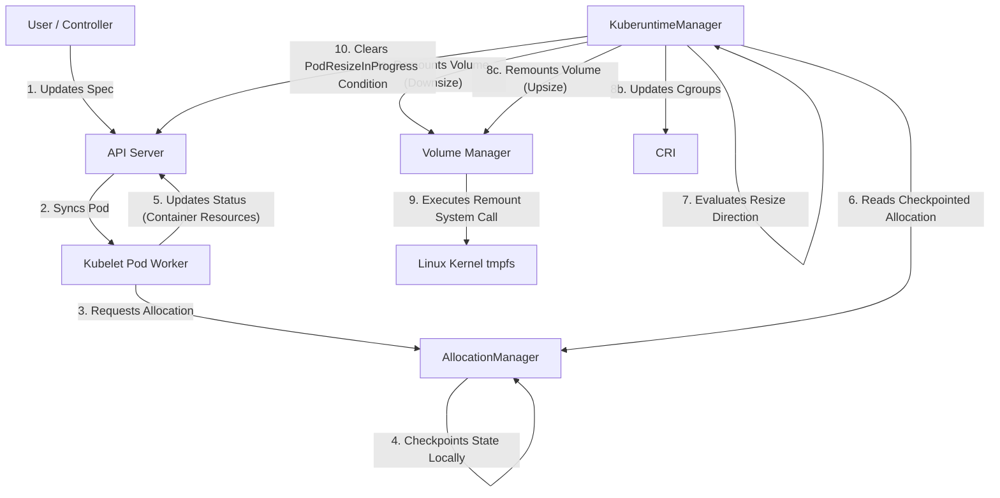

<!--
**Note:** When your KEP is complete, all of these comment blocks should be removed.

Follow the guidelines of the [documentation style guide].
In particular, wrap lines to a reasonable length, to make it
easier for reviewers to cite specific portions, and to minimize diff churn on
updates.

[documentation style guide]: https://github.com/kubernetes/community/blob/master/contributors/guide/style-guide.md

To get started with this template:

- [ ] **Pick a hosting SIG.**
  Make sure that the problem space is something the SIG is interested in taking
  up. KEPs should not be checked in without a sponsoring SIG.
- [ ] **Create an issue in kubernetes/enhancements**
  When filing an enhancement tracking issue, please make sure to complete all
  fields in that template. One of the fields asks for a link to the KEP. You
  can leave that blank until this KEP is filed, and then go back to the
  enhancement and add the link.
- [ ] **Make a copy of this template directory.**
  Copy this template into the owning SIG's directory and name it
  `NNNN-short-descriptive-title`, where `NNNN` is the issue number (with no
  leading-zero padding) assigned to your enhancement above.
- [ ] **Fill out as much of the kep.yaml file as you can.**
  At minimum, you should fill in the "Title", "Authors", "Owning-sig",
  "Status", and date-related fields.
- [ ] **Fill out this file as best you can.**
  At minimum, you should fill in the "Summary" and "Motivation" sections.
  These should be easy if you've preflighted the idea of the KEP with the
  appropriate SIG(s).
- [ ] **Create a PR for this KEP.**
  Assign it to people in the SIG who are sponsoring this process.
- [ ] **Merge early and iterate.**
  Avoid getting hung up on specific details and instead aim to get the goals of
  the KEP clarified and merged quickly. The best way to do this is to just
  start with the high-level sections and fill out details incrementally in
  subsequent PRs.

Just because a KEP is merged does not mean it is complete or approved. Any KEP
marked as `provisional` is a working document and subject to change. You can
denote sections that are under active debate as follows:

```
<<[UNRESOLVED optional short context or usernames ]>>
Stuff that is being argued.
<<[/UNRESOLVED]>>
```

When editing KEPS, aim for tightly-scoped, single-topic PRs to keep discussions
focused. If you disagree with what is already in a document, open a new PR
with suggested changes.

One KEP corresponds to one "feature" or "enhancement" for its whole lifecycle.
You do not need a new KEP to move from beta to GA, for example. If
new details emerge that belong in the KEP, edit the KEP. Once a feature has become
"implemented", major changes should get new KEPs.

The canonical place for the latest set of instructions (and the likely source
of this file) is [here](/keps/NNNN-kep-template/README.md).

**Note:** Any PRs to move a KEP to `implementable`, or significant changes once
it is marked `implementable`, must be approved by each of the KEP approvers.
If none of those approvers are still appropriate, then changes to that list
should be approved by the remaining approvers and/or the owning SIG (or
SIG Architecture for cross-cutting KEPs).
-->
# KEP-6030: Dynamic Resize of Memory-Backed Volumes

<!--
This is the title of your KEP. Keep it short, simple, and descriptive. A good
title can help communicate what the KEP is and should be considered as part of
any review.
-->

<!--
A table of contents is helpful for quickly jumping to sections of a KEP and for
highlighting any additional information provided beyond the standard KEP
template.

Ensure the TOC is wrapped with
  <code>&lt;!-- toc --&rt;&lt;!-- /toc --&rt;</code>
tags, and then generate with `hack/update-toc.sh`.
-->

<!-- toc -->
- [Release Signoff Checklist](#release-signoff-checklist)
- [Summary](#summary)
- [Motivation](#motivation)
  - [Goals](#goals)
  - [Non-Goals](#non-goals)
- [Proposal](#proposal)
  - [User Stories](#user-stories)
    - [Story 1](#story-1)
    - [Story 2](#story-2)
  - [Risks and Mitigations](#risks-and-mitigations)
    - [OOM-kills](#oom-kills)
- [Design Details](#design-details)
  - [API Changes](#api-changes)
    - [State Mapping and Status Tracking](#state-mapping-and-status-tracking)
    - [API Validation and Restrictions](#api-validation-and-restrictions)
    - [Resize Restart Policy](#resize-restart-policy)
    - [Atomic Resize Principle](#atomic-resize-principle)
  - [Component Interaction &amp; Design Flow](#component-interaction--design-flow)
  - [1. User/Control Plane](#1-usercontrol-plane)
  - [2. Kubelet Pod Workers &amp; Allocation](#2-kubelet-pod-workers--allocation)
  - [3. Coordination &amp; Actuation (KuberuntimeManager)](#3-coordination--actuation-kuberuntimemanager)
  - [4. Observation &amp; Feedback Loop](#4-observation--feedback-loop)
  - [Resource Coordination: Volume and Cgroup Ordering of Updates](#resource-coordination-volume-and-cgroup-ordering-of-updates)
    - [Background: The Enforcement Divergence](#background-the-enforcement-divergence)
      - [Memory Attribution &amp; cgroup Limits](#memory-attribution--cgroup-limits)
      - [Sharing Volumes Between Multiple Containers](#sharing-volumes-between-multiple-containers)
      - [Init Container Lifecycles &amp; Handoff](#init-container-lifecycles--handoff)
      - [Priority of Enforcement](#priority-of-enforcement)
    - [Order of Actuation](#order-of-actuation)
      - [Asynchronous Updates or Opposite Directions](#asynchronous-updates-or-opposite-directions)
      - [Actuation Priority Matrix](#actuation-priority-matrix)
    - [Role of the Allocation Manager and Kuberuntime Manager](#role-of-the-allocation-manager-and-kuberuntime-manager)
    - [Volume Manager interface](#volume-manager-interface)
    - [The Role of the Container Runtime](#the-role-of-the-container-runtime)
  - [Shrinkage Safety](#shrinkage-safety)
    - [Existing Cgroup Validation](#existing-cgroup-validation)
    - [Volume-level safety](#volume-level-safety)
    - [emptyDir Size Limit Monitoring and Eviction](#emptydir-size-limit-monitoring-and-eviction)
  - [Interaction with Ephemeral Storage: Resource Accounting and Eviction](#interaction-with-ephemeral-storage-resource-accounting-and-eviction)
  - [Interaction with Secrets, Projected Volumes, and DownwardAPI](#interaction-with-secrets-projected-volumes-and-downwardapi)
    - [ConfigMaps](#configmaps)
  - [Instrumentation](#instrumentation)
    - [<code>volume_requested_resizes_total</code>](#volume_requested_resizes_total)
    - [<code>pod_resize_duration_milliseconds</code>](#pod_resize_duration_milliseconds)
    - [Resize Lifecycle Events](#resize-lifecycle-events)
  - [Test Plan](#test-plan)
      - [Prerequisite testing updates](#prerequisite-testing-updates)
      - [Unit tests](#unit-tests)
      - [Integration tests](#integration-tests)
      - [e2e tests](#e2e-tests)
  - [Graduation Criteria](#graduation-criteria)
    - [Alpha](#alpha)
    - [Beta](#beta)
    - [GA](#ga)
  - [Upgrade / Downgrade Strategy](#upgrade--downgrade-strategy)
    - [Upgrade](#upgrade)
    - [Downgrade](#downgrade)
  - [Version Skew Strategy](#version-skew-strategy)
    - [Kubelet vs API Server](#kubelet-vs-api-server)
- [Production Readiness Review Questionnaire](#production-readiness-review-questionnaire)
  - [Feature Enablement and Rollback](#feature-enablement-and-rollback)
  - [Rollout, Upgrade and Rollback Planning](#rollout-upgrade-and-rollback-planning)
  - [Monitoring Requirements](#monitoring-requirements)
  - [Dependencies](#dependencies)
  - [Scalability](#scalability)
  - [Troubleshooting](#troubleshooting)
- [Implementation History](#implementation-history)
- [Drawbacks](#drawbacks)
- [Alternatives](#alternatives)
  - [Volume Reconciler detects changes (Async approach)](#volume-reconciler-detects-changes-async-approach)
  - [Moving <code>emptyDir</code> handling entirely to <code>KuberuntimeManager</code>](#moving-emptydir-handling-entirely-to-kuberuntimemanager)
  - [Restricting <code>sizeLimit</code> to not exceed memory limits](#restricting-sizelimit-to-not-exceed-memory-limits)
  - [Non-atomic handling of volume and resource resizes](#non-atomic-handling-of-volume-and-resource-resizes)
<!-- /toc -->

## Release Signoff Checklist

<!--
**ACTION REQUIRED:** In order to merge code into a release, there must be an
issue in [kubernetes/enhancements] referencing this KEP and targeting a release
milestone **before the [Enhancement Freeze](https://git.k8s.io/sig-release/releases)
of the targeted release**.

For enhancements that make changes to code or processes/procedures in core
Kubernetes—i.e., [kubernetes/kubernetes], we require the following Release
Signoff checklist to be completed.

Check these off as they are completed for the Release Team to track. These
checklist items _must_ be updated for the enhancement to be released.
-->

Items marked with (R) are required *prior to targeting to a milestone / release*.

- [ ] (R) Enhancement issue in release milestone, which links to KEP dir in [kubernetes/enhancements] (not the initial KEP PR)
- [ ] (R) KEP approvers have approved the KEP status as `implementable`
- [ ] (R) Design details are appropriately documented
- [ ] (R) Test plan is in place, giving consideration to SIG Architecture and SIG Testing input (including test refactors)
  - [ ] e2e Tests for all Beta API Operations (endpoints)
  - [ ] (R) Ensure GA e2e tests meet requirements for [Conformance Tests](https://github.com/kubernetes/community/blob/master/contributors/devel/sig-architecture/conformance-tests.md)
  - [ ] (R) Minimum Two Week Window for GA e2e tests to prove flake free
- [ ] (R) Graduation criteria is in place
  - [ ] (R) [all GA Endpoints](https://github.com/kubernetes/community/pull/1806) must be hit by [Conformance Tests](https://github.com/kubernetes/community/blob/master/contributors/devel/sig-architecture/conformance-tests.md) within one minor version of promotion to GA
- [ ] (R) Production readiness review completed
- [ ] (R) Production readiness review approved
- [ ] "Implementation History" section is up-to-date for milestone
- [ ] User-facing documentation has been created in [kubernetes/website], for publication to [kubernetes.io]
- [ ] Supporting documentation—e.g., additional design documents, links to mailing list discussions/SIG meetings, relevant PRs/issues, release notes

<!--
**Note:** This checklist is iterative and should be reviewed and updated every time this enhancement is being considered for a milestone.
-->

[kubernetes.io]: https://kubernetes.io/
[kubernetes/enhancements]: https://git.k8s.io/enhancements
[kubernetes/kubernetes]: https://git.k8s.io/kubernetes
[kubernetes/website]: https://git.k8s.io/website

## Summary

This KEP proposes a mechanism to dynamically resize `emptyDir` volumes with `medium: Memory` (tmpfs) without requiring Pod recreation or Pod restart, and while maintaining the files already written to the volume's filesystem. It leverages the `InPlacePodVerticalScaling` (IPPVS) infrastructure to manage the transition from the desired state to the actual state via an allocation and actuation loop.

## Motivation

Currently, increasing memory-backed storage (tmpfs `emptyDir` volumes) requires Pod recreation, which is disruptive for high-performance caches or in-memory databases that are otherwise capable of resizing their memory footprints dynamically.

This enhancement builds directly on the foundation laid by **In-Place Pod Vertical Scaling (IPPVS)** (KEP-1287). Just as IPPVS allows scaling container CPU and memory resources without Pod disruption, high-performance workloads frequently require scaling their scratch space or in-memory caches simultaneously. Since memory-backed `emptyDir` volumes consume the node's memory (and can be bounded by the Pod's memory limits), integrating their resize lifecycle with the IPPVS allocation and actuation phases ensures consistent resource accounting and prevents node exhaustion.

### Goals

*   Allow updating `emptyDir.sizeLimit` for existing Pods when `medium` is `Memory`.
*   Reflect resize progress in `Pod.Status` using an allocation/actuation model similar to IPPVS.
*   Actuate the resize via `tmpfs` remount without Pod disruption and while maintaining the files already written to the volume's filesystem.
*   Support dynamic resizing of memory-backed volumes on cgroup v2 nodes only (where memory charging and charge migration for `tmpfs` are properly supported by the kernel).

### Non-Goals

*   Resizing non-memory-backed `emptyDir` volumes (disk-backed).
*   Resizing other volume types (such as PVCs, CSI ephemeral volumes etc.) through this mechanism.
*   Supporting this feature on nodes running with cgroup v1 (due to limitations in memory accounting and tracking for shared `tmpfs` volumes).

## Proposal

We propose extending the `InPlacePodVerticalScaling` pattern to memory-backed `emptyDir` volumes.

### User Stories

#### Story 1
A user runs an in-memory database in a Pod and needs to increase the available cache size. The user updates the `emptyDir.sizeLimit` in the Pod spec. The Kubelet remounts the `tmpfs` volume with the new size limit without restarting the container, allowing the database to expand its cache immediately.

#### Story 2
An autoscaling controller dynamically scales the memory limits of workload worker pods (e.g., for machine learning or data processing) to handle varying demands. These workers utilize memory-backed `emptyDir` volumes for shared memory and caching, typically sizing the volume to a fixed proportion of the container's total memory limit. 

While the controller can use `InPlacePodVerticalScaling` to scale up a container's memory limit without restarting the pod, the inability to dynamically resize the associated memory-backed volume limits the worker's ability to utilize the expanded capacity for shared memory tasks without a disruptive restart. This feature allows the controller to update both the container memory limits and the `emptyDir.sizeLimit` simultaneously, providing seamless vertical scaling for distributed workloads.

### Risks and Mitigations

#### OOM-kills

The user is allowed to set the volume `sizeLimit` higher than the pod or container memory limits. Attempting to add such a restriction is considered out of scope for this KEP (see [Restricting sizeLimit to not exceed memory limits](#restricting-sizelimit-to-not-exceed-memory-limits)). This means that the user is responsible for ensuring that the volume `sizeLimit` is set to be within the pod or container memory limits. Failure to do so may result in OOM-kills as applications within the pod fill up the volume.

The mitigation for this risk is that the API server can emit a warning when it sees a resize request that results in the volume `sizeLimit` being set to higher than the pod-level memory limits. 

## Design Details

### API Changes

#### State Mapping and Status Tracking

To support dynamic resizing, the `Pod.Spec.Volumes[].EmptyDir.SizeLimit` field is made **mutable** when modified via the `/resize` subresource for existing Pods (when `medium` is `Memory`). This represents the **Desired State**.

This enhancement builds upon the resource state tracking model established in [In-Place Pod Vertical Scaling (KEP-1287)](/keps/sig-node/1287-in-place-update-pod-resources#resource-states), extending the lifecycle progression to memory-backed volumes:

*   **Desired State**: Represented by the mutable `Pod.Spec.Volumes[].EmptyDir.SizeLimit`.
*   **Allocated State**: Checkpointed and maintained by the Kubelet's `AllocationManager` for local resource accounting, but **not exposed** in `Pod.Status`.
    *   *Definition*: Represents the volume capacity acknowledged and admitted by the Kubelet on the node.
    *   *Initial Admission*: Admitted and checkpointed locally by the Kubelet once the initial resource admission phase completes.
    *   *Admission during Resize*: Upon admitting a resize update, the `AllocationManager` updates the Kubelet's local checkpoint with the newly acknowledged capacity.
    *   *Scope*: Maintained only for memory-backed `emptyDir` volumes.
*   **Actuated State**: Checkpointed and maintained locally by `KuberuntimeManager` to track the volume capacity passed to the volume plugin to actuate.
    *   *Definition*: Represents the target size that the Kubelet successfully actuated via `ResizeEphemeralVolume`.
    *   *Scope*: Not reported in the API.
*   **Actual State**: Represents the actual mounted filesystem capacity of the `tmpfs` volume on the node.
    *   *Definition*: Represents the actual mounted capacity reported by the mount/remount call.
    *   *Scope*: Unlike container resources, actual volume capacity is **not exposed** in `Pod.Status`. Users can inspect the actual mount size on the node or within the container via `df` command on the volume mount point.

#### API Validation and Restrictions

API validation logic ensures that `Pod.Spec.Volumes[].EmptyDir.SizeLimit` is only mutable when:
* The volume is memory-backed (meaning the `medium` field is set to `Memory`).
* Updates occur through the `resize` subresource.

Only modifications to the `sizeLimit` of existing memory-backed volumes are permitted:
* The addition or removal of a memory-backed volume in a pod spec is forbidden. 
* Adding or removing a `sizeLimit` to an existing memory-backed volume is supported.

#### Resize Restart Policy 

There are existing resize restart policies that control when a container is restarted during a resize operation, which are described in more detail in the [InPlacePodVerticalScaling KEP](https://github.com/kubernetes/enhancements/tree/master/keps/sig-node/1287-in-place-update-pod-resources#container-resize-policy).

We do not introduce an analogous policy nor honor the existing restart policies when resizing memory-backed `emptyDir` volumes. The resizing of memory-backed `emptyDir` volumes is fundamentally non-disruptive to running processes and does not require application-level awareness beyond standard handling of filesystem capacity. If a volume resize is accompanied by a container or pod resource resize, the container's existing `RestartPolicy` governs container restarts.

#### Atomic Resize Principle 

The atomic resize principle is preserved. The Kubelet treats updates to volume `sizeLimit` and container or pod-level resources (both requests and limits) as a single atomic transaction. This applies to requests that modify multiple volumes, multiple containers, pod-level resources, or any combination thereof.

The `AllocationManager` performs an All-or-Nothing Admission check, rejecting the entire update if the resize feasibility checks do not pass. The volume `sizeLimit` is also checkpointed atomically along with container and pod resources.
* The volume `sizeLimit` is not taken into consideration during the resource-fit checks, but will fail the admission check atomically if the container/pod resize fails to be admitted.
* On cgroups v1, volume resize is not supported, so any resize request containing a `sizeLimit` update will be atomically rejected as `Infeasible` during the admission phase.

The Pod's `ResizeStatus` (tracked via `PodResizeInProgress` condition) only transitions to completed once all container and volume states reach their respective desired values. If any component of the update fails, the status remains in a `PodResizeInProgress` state (with an error) to reflect the incomplete transition. This ensures resource integrity by preventing "partial resizes" that could leave a volume expanded within a container that fails to scale its memory budget.

See [Non-atomic handling of volume and resource resizes](#non-atomic-handling-of-volume-and-resource-resizes) for the alternative that was considered and rejected.

### Component Interaction & Design Flow

The following diagram illustrates the proposed end-to-end flow.


```mermaid
graph TD
    User["User / Controller"]
    API["API Server"]
    Kubelet["Kubelet Pod Worker"]
    Alloc["AllocationManager"]
    KRT["KuberuntimeManager"]
    VM["Volume Manager"]
    CRI["CRI"]
    Kernel["Linux Kernel tmpfs"]

    User -->|1. Updates Spec| API
    API -->|2. Syncs Pod| Kubelet
    Kubelet -->|3. Requests Allocation| Alloc
    Alloc -->|4. Checkpoints State Locally| Alloc
    Kubelet -->|"5. Updates Status (Container Resources)"| API
    KRT -->|6. Reads Checkpointed Allocation| Alloc
    KRT -->|7. Evaluates Resize Direction| KRT
    KRT -->|"8a. Remounts Volume (Downsize)"| VM
    KRT -->|8b. Updates Cgroups| CRI
    KRT -->|"8c. Remounts Volume (Upsize)"| VM
    VM -->|9. Executes Remount System Call| Kernel
    KRT -->|"10. Clears PodResizeInProgress Condition"| API
```

The following steps elaborate on this flow:

### 1. User/Control Plane
*   The user or an external controller updates `Pod.Spec.Volumes[].EmptyDir.SizeLimit`.
*   The API server preserves volume updates during the `dropNonResizeUpdates` phase.

### 2. Kubelet Pod Workers & Allocation
*   The Kubelet detects the specification change in `HandlePodUpdates`.
*   The `AllocationManager` validates the new resize request. The changing `sizeLimit` does not affect the feasibility of the resize on cgroup v2, as pod admission takes only pod and container requests into consideration. If the node is running with cgroup v1, the `AllocationManager` will reject the resize request as `Infeasible`.
*   If allocation succeeds, the `AllocationManager` updates the Kubelet's internal allocated state. The `AllocatedSizeLimit` is checkpointed locally (along with container and pod requests/limits) to ensure that memory-backed volume size limits survive Kubelet restarts.

### 3. Coordination & Actuation (KuberuntimeManager)
*   The `KuberuntimeManager` reads the `AllocatedSizeLimit` from the local checkpointed state maintained by `AllocationManager`.
*   It acts as the central orchestrator for the actuation phase to enforce strict ordering. See [Resource Coordination: Volume and Cgroup Ordering of Updates](#resource-coordination-volume-and-cgroup-ordering-of-updates) for the detailed rationale behind this ordering.
*   The `KuberuntimeManager` checks the direction of the volume resize (upsize vs. downsize) by comparing the newly allocated size with the checkpointed **Actuated State** (the target size that the Kubelet last attempted to apply, which is maintained in Kuberuntime's internal checkpoint). Comparing against the *actuated* state rather than the live kernel state avoids unnecessary remount requests caused by kernel rounding differences.
*   The `KuberuntimeManager` directly calls a new interface on the Volume Manager (see [Volume Manager interface](#volume-manager-interface)) to perform the remount at the correct time, bypassing the async reconciler loop. The Volume Manager executes the remount: `mount -o remount,size=<limit> -t tmpfs tmpfs <path>`. Once this actuation completes, the `KuberuntimeManager` checkpoints this sizeLimit in its own **Actuated State**. This Actuated State represents what the Kubelet tries to actuate, which may diverge slightly from what is read directly from the kernel (`Actual State`).
*   **Note**: Bypassing the async reconciler loop is both safe and inconsequential. The `emptyDir` reconciler today never remounts because `RequiresRemount` is hardcoded to always return false; this means that the `KuberuntimeManager` is the only component that makes this change. We considered alternatives such as relying on the `emptyDir` reconciler to detect changes asynchronously or moving `emptyDir` handling entirely to `KuberuntimeManager`, but they are ruled out. See [Alternatives](#alternatives) for more details.

### 4. Observation & Feedback Loop
*   Upon successful remount and cgroup update, the `KuberuntimeManager` checkpoints the new target values as the current 'actuated resources' (the baseline for future resizes).
*   Once the actual size matches the allocated size checkpoint (and container resource updates are complete), the Kubelet clears the `PodResizeInProgress` condition.

### Resource Coordination: Volume and Cgroup Ordering of Updates
 
#### Background: The Enforcement Divergence

Memory-backed volumes consume the same physical RAM as the container's processes. While all usage is enforced by the container and pod cgroups, it is governed by two different enforcement thresholds:

*   **tmpfs `size` option**: An internal quota for the volume. When a write exceeds the volume's `sizeLimit`, the kernel returns a disk full (**ENOSPC**) error. This is a graceful I/O exception.
*   **cgroup `memory.max`**: The external limit for the entire container. Since `tmpfs` usage counts toward the cgroup total, hitting this limit triggers an **OOM (Out of Memory) Kill**, resulting in container termination.

##### Memory Attribution & cgroup Limits

Because memory-backed volumes are backed by `tmpfs`, their memory usage is charged directly to the **cgroup of the process that writes the data**, rather than to the volume itself.

* **Container-level charging**: If Container A writes to the shared volume, the memory is initially charged against **Container A's cgroup memory limit**. If Container B writes to the shared volume, it is charged against **Container B's cgroup limit**.
  * **cgroup v2 Page Charge Migration**: In clusters running cgroup v2, if Container A writes files to a shared `tmpfs` volume and Container B later accesses or page-faults those same files, the kernel's active memory controller can dynamically migrate or split the page cache attribution between Container A's and Container B's cgroups under memory pressure. This behavior is a key enhancement of cgroup v2 but makes individual container-level memory metrics unpredictable, as a container's memory usage can rise or fall based on access to shared cached files.
* **Pod-level charging**: Since container cgroups are nested under the parent Pod cgroup, all files written to the memory-backed volume always count against the **Pod-level cgroup memory limit**, regardless of any dynamic charge migration between containers.

This dynamic page migration has implications for how we validate the safety of resource down-sizing. See [Shrinkage Safety](#shrinkage-safety) for details on how this is taken into account.

##### Sharing Volumes Between Multiple Containers

When a single memory-backed `emptyDir` volume is mounted and shared by multiple containers under the same Pod:
* **Volume Quota (`ENOSPC`)**: The volume-level `sizeLimit` acts as a hard boundary on the *aggregate* space consumed. If the sum of bytes written across all sharing containers exceeds this limit, standard disk-full (`ENOSPC`) errors are returned to subsequent writes. The containers are not OOM-killed at this boundary.
* **cgroup Enforcement (OOM-Kill)**: If a container's write to the shared volume pushes its total memory usage (processes + files written) past its cgroup memory limit, the container's processes are **OOM-killed** by the kernel—even if the shared volume usage is well below its `sizeLimit`.
* **Persistence of Orphaned Space**: If a container is terminated or OOM-killed, the files it wrote remain in host memory (tmpfs survives container lifecycles). This memory continues to consume headroom in the parent Pod cgroup.

##### Init Container Lifecycles & Handoff

Init containers are commonly used to pre-populate a memory-backed volume (e.g., pre-loading templates, caches, or datasets) before primary application containers start:
1. **Init Execution**: During execution, files written by the Init container count against the **Init container's individual limit**.
2. **Termination**: When the Init container exits and its cgroup is cleaned up, the files remain in the memory volume. The memory usage of these files continues to count against the overall **Pod cgroup memory limit**.
3. **App Container Handoff**: When the primary application container starts, it can read the pre-populated data. Under standard memory accounting rules, simply reading pre-existing files does not charge that memory to the app container's individual limit. The app container can use the cache without it counting toward its own limit (it only consumes Pod-level cgroup headroom).
 
##### Priority of Enforcement

The volume `sizeLimit` acts as a safety "inner boundary" to ensure volume growth does not starve the container's processes of execution RAM. Ideally, `sizeLimit` is lower than the container's memory limit.

When mounting or resizing a memory-backed volume, the Kubelet today computes the actual mounted `tmpfs` capacity as:
$$\text{capacity} = \min(\text{NodeAllocatableMemory}, \text{PodMemoryLimit}, \text{VolumeSizeLimit})$$

* If `sizeLimit` is omitted (`nil` or `0`), the volume size defaults to the total pod memory limit (or node allocatable if pod limits are unset).
* If `sizeLimit` is specified and exceeds the total pod memory limit (e.g. 256Mi on a 200Mi pod), the mounted `tmpfs` volume capacity is capped to the total pod memory limit (200Mi). The Kubelet emits a `Warning VolumeSizeExceedsPodMemoryLimit` event during admission.

#### Order of Actuation

To prevent race-condition OOMs during a resize, the order of operations is driven primarily by the direction of the **Volume sizeLimit** change to ensure the container maintains the maximum possible "slack" during transition.

*   **When Increasing Volume `sizeLimit`**:
    1.  **Adjust Cgroup First**: Adjust `memory.max` to ensure the container envelope is prepared for potential volume expansion.
    2.  **Remount Volume Second**: Increase the `tmpfs` quota.

*(Rationale: Ensures the physical budget is expanded before the internal quota allows more usage.)*

*   **When Decreasing Volume `sizeLimit`**:
    1.  **Remount Volume First**: Shrink the `tmpfs` quota to reclaim space.
    2.  **Adjust Cgroup Second**: Adjust `memory.max`.

*(Rationale: Ensures the volume's claim on memory is reduced before the cgroup envelope is tightened around it.)*

In the case of multiple volumes, all volumes with a decreasing `sizeLimit` are downsized first, followed by the cgroup memory limit update, followed by all volumes with an increasing `sizeLimit` upsized.

##### Asynchronous Updates or Opposite Directions

It is possible that the resize requests for the container memory limits and the volume `sizeLimit` occur in separate updates or in opposite directions. Both scenarios are permitted. In these cases, the actuation order is less critical because the opposing nature of the updates means the sequence does not materially increase or decrease the risk of OOM kills. For implementation simplicity and predictability, actuation follows the standard order described above.

The user remains responsible for ensuring the container memory limit provides sufficient headroom for both volume data and process execution to prevent OOM kills.

##### Actuation Priority Matrix

The following table illustrates the finalized actuation priority matrix that the Kubelet follows, based on the direction of the volume's `sizeLimit` change:

| Scenario | Volume `sizeLimit` | Container `memory.max` | 1st Action | 2nd Action | Rationale |
| :--- | :--- | :--- | :--- | :--- | :--- |
| **Expansion** | Increasing ⬆️ | Increasing ⬆️ | **Cgroup** | **Volume** | Expand envelope before expanding the internal quota. |
| **Contraction** | Decreasing ⬇️ | Decreasing ⬇️ | **Volume** | **Cgroup** | Shrink the internal quota before tightening the envelope. |
| **Volume Only** | Increasing / Decreasing | Unchanged | **Volume** | **N/A** | No cgroup update necessary. |
| **Opposite (Vol Up)** | Increasing ⬆️ | Decreasing ⬇️ | **Cgroup** | **Volume** | If this configuration results in an OOM kill, it does so regardless of ordering; follows "Vol Up" sequence for consistency. |
| **Opposite (Vol Down)** | Decreasing ⬇️ | Increasing ⬆️ | **Volume** | **Cgroup** | If this configuration results in an OOM kill it does so regardless of ordering; follows "Vol Down" sequence for consistency. |
| **Cgroup Only** | Unchanged | Increasing / Decreasing | **Cgroup** | **N/A** | Standard container resize; no volume remount required. |

#### Role of the Allocation Manager and Kuberuntime Manager

The `AllocationManager`'s role is focused on maintaining the source of truth for allocated resources (checkpointing) and ensuring atomic admission of resource updates. The volume manager should only ever see the allocated size limits, rather than the desired size limits.

The `KuberuntimeManager` serves as the coordination layer that understands the nested relationship between volume size and cgroup limits and enforces the strict ordering of updates.

#### Volume Manager interface

To support direct resizing from the `KuberuntimeManager` while maintaining separation of concerns, this proposal extends the Volume Manager and Volume Plugin interfaces:

*   **VolumeManager Extension**: The `VolumeManager` interface is extended with `ResizeEphemeralVolume(pod *v1.Pod, volumeName string) error`. This allows the `KuberuntimeManager` to trigger volume operations synchronously at the correct time in its sync loop.
*   **ResizableEphemeralVolumePlugin Interface**: A new optional interface `ResizableEphemeralVolumePlugin` is introduced in `pkg/volume/plugins.go`. Volume plugins that support online, synchronous resizing (in this case, the `emptyDir` plugin for memory-backed volumes) can implement this interface: `ResizeEphemeralVolume(spec *volume.Spec, pod *v1.Pod) error`. The `VolumeManager` checks if the plugin for the volume implements this interface and delegates the call to it.

This design allows `KuberuntimeManager` to act as the central orchestrator for resource updates (ensuring strict ordering with cgroups) while leaving the actual filesystem manipulation logic encapsulated within the volume plugins.

We considered alternatives such as relying on the Volume Reconciler to detect changes asynchronously or moving `emptyDir` handling entirely to `KuberuntimeManager`, but they are ruled out. See [Alternatives](#alternatives) for more details.

#### The Role of the Container Runtime

On startup, the container runtime helps to bind the Kubelet's host path into the container's mount namespace, but subsequent remount requests do not require intervention from the container runtime, nor does the container runtime need to be notified of changing volume sizes.

### Shrinkage Safety 

In the existing `InPlacePodVerticalScaling` feature, a best-effort safety logic ensures that container memory limits are not decreased below usage. We analogously validate the safety of volume size decreases.

#### Existing Cgroup Validation

The Kubelet already contains validation logic (in `validateMemoryResizeAction`) to ensure that proposed cgroup limit reductions do not fall below active memory usage. We will leverage this check:
* **Container-level Validation**: Ensures the proposed container memory limit is not decreased below its current container cgroup usage. Note that this check is insufficient if dynamic kernel-level page charge migration has temporarily shifted memory charges to another container (see [Memory Attribution & cgroup Limits](#memory-attribution--cgroup-limits)).
* **Pod-level Validation**: For pods with enforced Pod-level cgroup limits (e.g., pods with pod-level limits specified, Guaranteed pods, or Burstable pods where all containers specify limits), the Kubelet validates the proposed aggregate Pod limit against the Pod-level cgroup usage. This acts as a reliable backstop since it compares against the aggregate memory footprint regardless of charge migration.

#### Volume-level safety

If a user attempts to shrink a volume below its current usage, `/bin/mount` fails at the kernel level (e.g. on modern Linux kernels using the `fsconfig` tmpfs mount API, returning `fsconfig() failed: tmpfs: Too small a size for current use.` with exit status 32).

The Kubelet does not perform string parsing on mount error output to distinguish shrinkage failures from other mount errors. Any `/bin/mount` remount failure is returned directly by `ResizeEphemeralVolume` to `KuberuntimeManager`, which exposes it to the user:
* In the `PodResizeInProgress` condition (`Status: True`, `Reason: Error`, with the raw mount error message).
* In a `Warning ResizeError` event with the `podResourceSummary` JSON payload describing the observed resize state and error.

The volume remains mounted at its previous capacity, running containers are unaffected (no container restarts), and the Kubelet periodically retries the resize operation on subsequent sync iterations until it succeeds, is cancelled, or the Pod terminates.

#### emptyDir Size Limit Monitoring and Eviction

The Kubelet runs a local storage capacity monitoring system (part of the eviction manager) to ensure that the space usage of `emptyDir` volumes does not exceed their volume size limits, and triggers evictions when necessary.

For memory-backed `emptyDir` volumes (`medium: Memory`), the eviction manager skips size limit eviction when `InPlacePodVerticalScalingMemoryBackedVolumes` is enabled. Because memory-backed volumes are backed by `tmpfs`, their size limit is enforced directly by the Linux kernel, returning `ENOSPC` when the volume size limit is reached. Eviction manager enforcement is not needed.

### Interaction with Ephemeral Storage: Resource Accounting and Eviction

Memory-backed `emptyDir` volumes are functionally distinct from disk-backed ephemeral storage. This KEP maintains the existing isolation between these resource pools to ensure that dynamic resizing does not interfere with node-level storage management.

While this KEP only deals with memory-backed volumes, we call out the following behavior to avoid confusion: 

*   **Resource Accounting**: Usage of `medium: Memory` volumes is tracked via the cgroups, rather than the `ephemeral-storage` (disk) resource. Resizing the `sizeLimit` has no effect on the `ephemeral-storage` capacity or quotas assigned to the node.
*   **Exclusion from Disk Monitoring**: The Kubelet’s eviction manager monitors disk-backed ephemeral storage usage using periodic filesystem scans. Because memory-backed volumes are mounted as `tmpfs`, they are naturally excluded from these root-partition disk-usage calculations.
*   **Eviction Logic**: Scaling a memory-backed volume up or down never triggers `DiskPressure` evictions. Pressure resulting from these volumes is handled via the OOM killer (at the container level), `emptyDir limit eviction` at the pod level, or `MemoryPressure` eviction thresholds (at the node level).

### Interaction with Secrets, Projected Volumes, and DownwardAPI

Projected volumes, secrets, and downwardAPI are typically implemented as `tmpfs` mounts to ensure data is never persisted to physical storage. These share the same underlying kernel infrastructure as memory-backed `emptyDir` volumes.

While projected volumes are out of scope for this KEP, we call out their behavior here to avoid confusion:

*   **Implicit Memory Consumption**: Memory used by projected volumes is accounted for in the container or Pod-level memory cgroup usage. The `AllocationManager` does not explicitly track or reserve space for these volumes, as they do not have user-defined resource requests or `sizeLimits`.
*   **Resize Validation Boundaries**: When validating a resize request, the `AllocationManager` ensures the new container and pod requests are feasible based on node capacity. It does not account for the "hidden" overhead of projected volumes; users must ensure that their container memory limit provides sufficient headroom for both the expanded `emptyDir` and any projected volumes.
*   **Actuation Isolation**: Dynamic resizing of an `emptyDir` volume is a targeted `remount` operation on a specific mount point. It does not interfere with the file descriptors or mount states of existing Secret or ConfigMap volumes.
*   **Shared Fate in OOM Scenarios**: Because all `tmpfs` mounts share a memory budget, an over-provisioned `emptyDir` expansion can push the cgroup usage to its limit. If a process attempts to access a large Secret or write to the `emptyDir` when the cgroup is exhausted, the kernel triggers an OOM kill based on the cgroup threshold, not the individual volume quota.

#### ConfigMaps

At the time of writing, ConfigMaps are implemented using disk-backed volumes rather than `tmpfs`. This means that they are currently independent of the memory-backed volumes implementation. There is a pending action item to move it (see the [code comment here](https://github.com/kubernetes/kubernetes/blob/f8eb5197fa6554c565155f13ec085fc77b7e9625/pkg/volume/configmap/configmap.go#L172)), at which point they fall into the same category as Secrets and Projected Volumes described above.

### Instrumentation

#### `volume_requested_resizes_total`

This is a new metric that tracks the total number of resize attempts observed by the Kubelet, counted at the volume level. A single pod update changing multiple volumes will increment the counter once for each modified volume.

Labels:
- `medium`: The storage medium of the volume (e.g. `memory`).
- `operation`: Whether the resize is an increase, decrease, addition, or removal of the size limit. Possible values: `increase`, `decrease`, `add`, or `remove`.

This metric is recorded as a counter.

#### `pod_resize_duration_milliseconds`

This metric already exists in the Kubelet to track the duration of `doPodResizeAction`, and now also includes memory-backed volume resizes since that function is responsible for actuating both container cgroups and memory-backed volumes.

This metric is recorded as a histogram.

#### Resize Lifecycle Events

The Kubelet emits lifecycle events for in-place pod resizes (`ResizeStarted`, `ResizeCompleted`, `ResizeError`). The event payload (`podResourceSummary`) is extended to include memory-backed `volumes` alongside containers:

```json
{
  "containers": [...],
  "volumes": [{"name": "mem-vol", "emptyDir": {"medium": "Memory", "sizeLimit": "128Mi"}}],
  "generation": 2
}
```

### Test Plan

[X] I/we understand the owners of the involved components may require updates to
existing tests to make this code solid enough prior to committing the changes necessary
to implement this enhancement.

##### Prerequisite testing updates
None.

##### Unit tests

Unit tests in the following packages are added or extended to cover the new logic:
- `pkg/apis/core/validation`: Test `ValidatePodResize` to verify that `sizeLimit` of memory-backed volumes is mutable on resize, and that adding/removing/renaming volumes or modifying size limits of non-memory volumes is forbidden.
- `pkg/registry/core/pod`: Test `dropNonResizeUpdates` to verify that volume size limit updates are preserved on resize when the feature gate is enabled, and reverted when disabled.
- `pkg/kubelet/allocation`: Test allocation manager to verify that `sizeLimit` of memory-backed volumes is checkpointed as allocated resources, and that cgroups v1 nodes reject resize requests as `Infeasible`.
- `pkg/kubelet/kuberuntime`: Test `computeVolumeResizeAction` to ensure it detects size differences, `doPodResizeAction` to verify the strict ordering of cgroup and volume updates, and `IsPodResizeInProgress` to check volume resize progress.
- `pkg/kubelet/volumemanager`: Test `ResizeEphemeralVolume` to ensure correct delegation to supporting plugins.
- `pkg/volume/emptydir`: Test `ResizeEphemeralVolume` (remount execution on Linux and stubs for unsupported OSes).
- `pkg/kubelet/eviction`: Test `emptyDirLimitEviction` to ensure that memory-backed `emptyDir` volumes are skipped.

##### Integration tests

Integration tests in `test/integration/pods/pods_test.go` (`TestNodeDeclaredFeatureAdmission`) verify API server admission behavior when `InPlacePodVerticalScalingMemoryBackedVolumes` is declared or missing on the destination node.

##### e2e tests

E2E tests in the following suites verify end-to-end functionality:
- `test/e2e/common/node/pod_resize.go`: Verifies online upsize and downsize of memory-backed `emptyDir` volumes alone and concurrently with container resource updates, asserting mount capacity inside the container and verifying that `PodResizeInProgress` clears.
- `test/e2e/node/pod_resize.go`: Serial E2E tests verifying deferred resize behavior for memory-backed volumes under resource pressure.
- `test/e2e_node/pod_resize_criproxy_linux_test.go`: Node E2E tests using CRI proxy interception to verify actuation ordering and error handling/retry loops.

For Beta, we plan to add failure on shrink tests for both pod-level and container-level.

### Graduation Criteria

<!--
**Note:** *Not required until targeted at a release.*

Define graduation milestones.

These may be defined in terms of API maturity, [feature gate] graduations, or as
something else. The KEP should keep this high-level with a focus on what
signals will be looked at to determine graduation.

Consider the following in developing the graduation criteria for this enhancement:
- [Maturity levels (`alpha`, `beta`, `stable`)][maturity-levels]
- [Feature gate][feature gate] lifecycle
- [Deprecation policy][deprecation-policy]

Clearly define what graduation means by either linking to the [API doc
definition](https://kubernetes.io/docs/concepts/overview/kubernetes-api/#api-versioning)
or by redefining what graduation means.

In general we try to use the same stages (alpha, beta, GA), regardless of how the
functionality is accessed.

[feature gate]: https://git.k8s.io/community/contributors/devel/sig-architecture/feature-gates.md
[maturity-levels]: https://git.k8s.io/community/contributors/devel/sig-architecture/api_changes.md#alpha-beta-and-stable-versions
[deprecation-policy]: https://kubernetes.io/docs/reference/using-api/deprecation-policy/

Below are some examples to consider, in addition to the aforementioned [maturity levels][maturity-levels].

-->

#### Alpha
- [X] The feature is implemented behind the `InPlacePodVerticalScalingMemoryBackedVolumes` feature gate.
- [X] Unit test coverage is complete.
- [X] E2E tests implemented in CI verify successful upsize and downsize operations in a live cluster.

#### Beta
- [ ] Gather feedback from users.
- [ ] Metrics are defined and implemented.
- [ ] Kubelet emits a warning event when `sizeLimit` exceeds pod-level memory limits.
- [X] The plan evaluates whether integration tests are required.
- [X] Edge cases around "shrinkage safety" are resolved.

#### GA
- [ ] The feature is stable in Beta and enabled by default for at least one release.
- [ ] Critical bugs discovered during the Beta phase are resolved.

<!--

#### Deprecation

- Announce deprecation and support policy of the existing flag
- Two versions passed since introducing the functionality that deprecates the flag (to address version skew)
- Address feedback on usage/changed behavior, provided on GitHub issues
- Deprecate the flag
-->

### Upgrade / Downgrade Strategy

#### Upgrade
Upgrading is non-disruptive. Existing pods continue to run with their original volume sizes. To utilize the feature on existing pods, users send patch requests to the `resize` subresource.

#### Downgrade
If the control plane rolls back to a previous version where the feature is disabled:
*   The API server stops accepting updates to `sizeLimit` via the `resize` subresource.
*   Pods that are already resized retain their updated `sizeLimit` in etcd.
*   If these pods are restarted on an older Kubelet, the old Kubelet still reads the updated `sizeLimit` from the spec during the initial mount phase, starting the pod with the updated size limit.

### Version Skew Strategy

#### Kubelet vs API Server

If the API Server supports the feature but the target Kubelet does not, the `NodeDeclaredFeatures` framework rejects the resize request during admission.

Adding or removing `sizeLimits` is not supported in Alpha, but is planned for Beta.

If N-1 Kubelet supports an Alpha version of the feature, but the API server is upgraded to support the Beta version of the feature, the API server will permit `add` / `remove` of the `sizeLimit` field on memory-backed volumes. Due to Kubelet implementation details in N-1, add operations will succeed, but remove operations will be silently ignored until the Kubelet is upgraded.

## Production Readiness Review Questionnaire

<!--

Production readiness reviews are intended to ensure that features merging into
Kubernetes are observable, scalable and supportable; can be safely operated in
production environments, and can be disabled or rolled back in the event they
cause increased failures in production. See more in the PRR KEP at
https://git.k8s.io/enhancements/keps/sig-architecture/1194-prod-readiness.

The production readiness review questionnaire must be completed and approved
for the KEP to move to `implementable` status and be included in the release.

In some cases, the questions below should also have answers in `kep.yaml`. This
is to enable automation to verify the presence of the review, and to reduce review
burden and latency.

The KEP must have a approver from the
[`prod-readiness-approvers`](http://git.k8s.io/enhancements/OWNERS_ALIASES)
team. Please reach out on the
[#prod-readiness](https://kubernetes.slack.com/archives/CPNHUMN74) channel if
you need any help or guidance.
-->

### Feature Enablement and Rollback

<!--
This section must be completed when targeting alpha to a release.
-->

###### How can this feature be enabled / disabled in a live cluster?

- [X] Feature gate (also fill in values in `kep.yaml`)
  - Feature gate name: `InPlacePodVerticalScalingMemoryBackedVolumes`
  - Components depending on the feature gate: `kube-apiserver`, `kubelet`

Enabling or disabling this feature requires setting the `InPlacePodVerticalScalingMemoryBackedVolumes` feature gate flag on the respective components. This operation requires a restart of the control plane components (`kube-apiserver`) and the `kubelet` on each node. It cannot be enabled or disabled dynamically without component restarts.

###### Does enabling the feature change any default behavior?

No. Enabling this feature does not change any default behavior for existing workloads. It only introduces a new capability allowing the `sizeLimit` of memory-backed `emptyDir` volumes to be mutated via the `resize` subresource. Existing Pods and volumes continue to function as before without any impact unless users explicitly invoke the new resize capability.

###### Can the feature be disabled once it has been enabled (i.e. can we roll back the enablement)?

Yes. The feature can be disabled by turning off the feature gate and restarting the components.

**Consequences of disablement:**
*   If a volume was already resized while the feature was enabled, the actual mounted `tmpfs` volume retains its new size on the node (we do not automatically shrink it back).
*   The API server rejects further mutations to `emptyDir.sizeLimit` via the `resize` subresource.
*   For Pods that were already resized, the Pod spec retains the updated `sizeLimit` value, but it becomes immutable again.

###### What happens if we reenable the feature if it was previously rolled back?

If the feature is re-enabled:
*   The API server once again permits mutations to `emptyDir.sizeLimit` via the `resize` subresource.
*   The Kubelet resumes its reconciliation logic. If a Pod's actual mounted volume size differs from the target allocated capacity checkpointed locally (e.g., if a resize is pending or if the spec was updated but not actuated before rollback), the Kubelet proceeds to actuate the resize to match the desired state.

###### Are there any tests for feature enablement/disablement?

Yes. 
*   **API Validation Tests**: Unit tests in `pkg/apis/core/validation` verify that mutating `emptyDir.sizeLimit` is forbidden when the feature gate is disabled and permitted when it is enabled.
*   **Kubelet Tests**: Unit tests in the Kubelet (specifically in `KuberuntimeManager` and the `eviction` manager) verify that actuation and enhanced monitoring logic are skipped or fall back to default behavior when the feature gate is disabled.

### Rollout, Upgrade and Rollback Planning

<!--
This section must be completed when targeting beta to a release.
-->

###### How can a rollout or rollback fail? Can it impact already running workloads?

<!--
Try to be as paranoid as possible - e.g., what if some components will restart
mid-rollout?

Be sure to consider highly-available clusters, where, for example,
feature flags will be enabled on some API servers and not others during the
rollout. Similarly, consider large clusters and how enablement/disablement
will rollout across nodes.
-->

**Rollout Failure Scenarios and Impact:**
*   **Node-Declared Feature Gating (Skew Prevention):** If a client attempts to mutate `emptyDir.sizeLimit` on a Pod scheduled on a Kubelet that does not support the feature (or does not have the feature gate enabled), the API Server automatically rejects the patch via Node Declared Features. This prevents skew issues where a spec is modified but cannot be actuated by the Kubelet.
*   **Kubelet Crash or Restart Mid-Actuation:** If the Kubelet restarts or crashes after writing the local `AllocationManager` checkpoint but before executing the dynamic `tmpfs` remount syscall, the Kubelet's startup reconciliation loop automatically discovers the discrepancy between the checkpointed state (allocated limit) and the actual host mount parameters, and it will safely re-attempt and complete the remount.
*   **Actuation Failure:** If the mounter's `remount` syscall fails, the volume stays at its previous size limit. The Pod's actual volume status will remain out-of-sync with the desired spec, but the running workload continues to execute safely at the old size.

**Rollback Failure Scenarios and Impact:**
*   **Pending Resize State Mismatch (Disablement Skew):** If the feature gate is disabled while a Pod has an active, pending resize operation (i.e., the Pod spec has been updated to a new `sizeLimit` but the Kubelet has not yet completed the mount/remount actuation):
    *   Once the feature gate is disabled, the Kubelet stops processing dynamic volume updates. The actual volume size remains stuck at the old limit, creating a permanent discrepancy between the desired state in the Pod spec and the actual state on the node.
    *   The `PodResizeInProgress` condition will no longer reflect the discrepancy and may be cleared despite the desired and actual volume size mismatch, as the Kubelet will no longer check the volume size as part of its reconciliation loop.
*   **Workload Safety:** Disabling the feature gate does not automatically shrink already-resized volumes back to their original limits.

###### What specific metrics should inform a rollback?

<!--
What signals should users be paying attention to when the feature is young
that might indicate a serious problem?
-->

Operators should monitor the following signals to identify anomalies that might require a rollback:
*   **API Server Metrics:**
    *   A high rate of client request errors (4xx or 5xx response codes) on the Pod `resize` subresource endpoint, tracked via the `apiserver_request_total{subresource="resize", verb="PATCH"}` counter.
*   **Kubelet Volume Operation Metrics:**
    *   An increase in failure rates for volume mount or filesystem resize operations, tracked via the `storage_operation_duration_seconds_count{volume_plugin="kubernetes.io/empty-dir", operation_name=~"volume_mount|volume_fs_resize", status=~"fail-.*"}` metric.
    *   A failure of actual reported capacity to transition to the newly desired capacity, tracked via the `kubelet_volume_stats_capacity_bytes{volume_plugin="kubernetes.io/empty-dir"}` gauge.
*   **Node and Container Health Metrics:**
    *   An increase in the Kubelet pod eviction rate, tracked via the `kubelet_evictions` counter (specifically monitoring for evictions driven by emptyDir limit enforcement).

###### Were upgrade and rollback tested? Was the upgrade->downgrade->upgrade path tested?

<!--
Describe manual testing that was done and the outcomes.
Longer term, we may want to require automated upgrade/rollback tests, but we
are missing a bunch of machinery and tooling and can't do that now.
-->

The following manual verification plan will validate the behavior during development and testing:
*   **Upgrade Path Test:**
    1.  Deploy a cluster with the `InPlacePodVerticalScalingMemoryBackedVolumes` feature gate disabled.
    2.  Create a Pod with a memory-backed `emptyDir` volume configured with a static `sizeLimit: 128Mi`.
    3.  Enable the feature gate and restart the control plane and Kubelet components.
    4.  Submit a dynamic resize request targeting `256Mi`. Verify that the Kubelet successfully remounts the `tmpfs` filesystem, the host mount reflects `256Mi` via `df`, and the `PodResizeInProgress` condition clears.
*   **Downgrade/Rollback Path Test:**
    1.  With the feature gate active, create a Pod with a memory-backed volume of `128Mi` and dynamically resize it to `256Mi`.
    2.  Write `200Mi` of files to the volume to confirm active capacity utilization.
    3.  Disable the feature gate and restart the API servers and Kubelets.
    4.  Verify that the running Pod's memory volume is **not disrupted**, the files remain fully readable/writeable, and the mounted directory keeps its `256Mi` capacity.
    5.  Attempt a new dynamic volume resize update and verify that the API server returns a validation error rejecting the request.
*   **Re-upgrade/Re-enablement Path Test:**
    1.  Re-enable the feature gate and restart the Kubelets and API servers.
    2.  Verify that the API server resumes accepting mutations on the subresource and that the Kubelet resumes full dynamic actuation.

###### Is the rollout accompanied by any deprecations and/or removals of features, APIs, fields of API types, flags, etc.?

<!--
Even if applying deprecation policies, they may still surprise some users.
-->

No. This feature is strictly additive and introduces new dynamic capabilities for existing fields and volume types. No existing APIs, fields, flags, or default volume behaviors are deprecated or removed as part of this enhancement. Legacy static workloads remain fully compatible.

### Monitoring Requirements

<!--
This section must be completed when targeting beta to a release.

For GA, this section is required: approvers should be able to confirm the
previous answers based on experience in the field.
-->

###### How can an operator determine if the feature is in use by workloads?

<!--
Ideally, this should be a metric. Operations against the Kubernetes API (e.g.,
checking if there are objects with field X set) may be a last resort. Avoid
logs or events for this purpose.
-->

The Kubelet exposes the Prometheus metric `volume_requested_resizes_total` with label `medium="memory"`. Operators can query this metric to track the total count of memory-backed volume resize requests processed across the cluster.

###### How can someone using this feature know that it is working for their instance?

<!--
For instance, if this is a pod-related feature, it should be possible to determine if the feature is functioning properly
for each individual pod.
Pick one more of these and delete the rest.
Please describe all items visible to end users below with sufficient detail so that they can verify correct enablement
and operation of this feature.
Recall that end users cannot usually observe component logs or access metrics.
-->

- [X] Events
  - Event Reason: `ResizeStarted` (emitted when kubelet accepts a resize request, along with the new requested size)
  - Event Reason: `ResizeCompleted` (emitted when kubelet successfully resizes the volume)
- [X] API .status
  - Condition name: `PodResizeInProgress` (transitions to `True` during active resize and cleared upon successful completion)
- [X] Other (treat as last resort)
  - Details: Users can run `df` inside their container on the volume mount point to inspect the actual kernel-enforced mount size.

###### What are the reasonable SLOs (Service Level Objectives) for the enhancement?

<!--
This is your opportunity to define what "normal" quality of service looks like
for a feature.

It's impossible to provide comprehensive guidance, but at the very
high level (needs more precise definitions) those may be things like:
  - per-day percentage of API calls finishing with 5XX errors <= 1%
  - 99% percentile over day of absolute value from (job creation time minus expected
    job creation time) for cron job <= 10%
  - 99.9% of /health requests per day finish with 200 code

These goals will help you determine what you need to measure (SLIs) in the next
question.
-->

- Resize requests should succeed (`pod_resize_duration_milliseconds{"error=true"}` should be low)
- Volume resize operations should complete quickly (`pod_resize_duration_milliseconds{error="false"}` < 3000ms for 99% of requests)

###### What are the SLIs (Service Level Indicators) an operator can use to determine the health of the service?

<!--
Pick one more of these and delete the rest.
-->

- [X] Metrics
  - Metric name: `pod_resize_duration_milliseconds`
    - Components exposing the metric: Kubelet
  - Metric name: `volume_requested_resizes_total`
    - Components exposing the metric: Kubelet

###### Are there any missing metrics that would be useful to have to improve observability of this feature?

<!--
Describe the metrics themselves and the reasons why they weren't added (e.g., cost,
implementation difficulties, etc.).
-->

None.

### Dependencies

<!--
This section must be completed when targeting beta to a release.
-->

###### Does this feature depend on any specific services running in the cluster?

<!--
Think about both cluster-level services (e.g. metrics-server) as well
as node-level agents (e.g. specific version of CRI). Focus on external or
optional services that are needed. For example, if this feature depends on
a cloud provider API, or upon an external software-defined storage or network
control plane.

For each of these, fill in the following—thinking about running existing user workloads
and creating new ones, as well as about cluster-level services (e.g. DNS):
  - [Dependency name]
    - Usage description:
      - Impact of its outage on the feature:
      - Impact of its degraded performance or high-error rates on the feature:
-->

None.

### Scalability

<!--
For alpha, this section is encouraged: reviewers should consider these questions
and attempt to answer them.

For beta, this section is required: reviewers must answer these questions.

For GA, this section is required: approvers should be able to confirm the
previous answers based on experience in the field.
-->

###### Will enabling / using this feature result in any new API calls?

<!--
Describe them, providing:
  - API call type (e.g. PATCH pods)
  - estimated throughput
  - originating component(s) (e.g. Kubelet, Feature-X-controller)
Focusing mostly on:
  - components listing and/or watching resources they didn't before
  - API calls that may be triggered by changes of some Kubernetes resources
    (e.g. update of object X triggers new updates of object Y)
  - periodic API calls to reconcile state (e.g. periodic fetching state,
    heartbeats, leader election, etc.)
-->

Yes.
* **API call type**: Standard `PATCH /status` calls during Pod status reconciliation to reflect the transition of the `PodResizeInProgress` condition.
* **Estimated throughput**: Extremely low. Resizing memory-backed volumes is an infrequent, on-demand event triggered manually by cluster administrators or periodically by vertical autoscalers. It is not a standard high-frequency workload operation.
* **Originating component(s)**: Kubelet (via `PodStatus` updates).
* **Listing / Watching**: No new listing or watching of resources is introduced.

###### Will enabling / using this feature result in introducing new API types?

<!--
Describe them, providing:
  - API type
  - Supported number of objects per cluster
  - Supported number of objects per namespace (for namespace-scoped objects)
-->

No. No new API types are introduced. The feature purely extends existing fields and makes the existing `Pod.Spec.Volumes[].EmptyDir.SizeLimit` mutable for memory-backed volumes.

###### Will enabling / using this feature result in any new calls to the cloud provider?

<!--
Describe them, providing:
  - Which API(s):
  - Estimated increase:
-->

No. Volume resizing is strictly local and does not require any external cloud provider storage controller interactions.

###### Will enabling / using this feature result in increasing size or count of the existing API objects?

<!--
Describe them, providing:
  - API type(s):
  - Estimated increase in size: (e.g., new annotation of size 32B)
  - Estimated amount of new objects: (e.g., new Object X for every existing Pod)
-->

No.
* **API Type(s)**: None.
* **Estimated increase in size**: None. No new fields are added to `Pod.Spec` or `Pod.Status`. The existing `sizeLimit` field under `EmptyDirVolumeSource` is simply made mutable.
* **Estimated amount of new objects**: None.

###### Will enabling / using this feature result in increasing time taken by any operations covered by existing SLIs/SLOs?

<!--
Look at the [existing SLIs/SLOs].

Think about adding additional work or introducing new steps in between
(e.g. need to do X to start a container), etc. Please describe the details.

[existing SLIs/SLOs]: https://git.k8s.io/community/sig-scalability/slos/slos.md#kubernetes-slisslos
-->

No.
* Resizing memory-backed `emptyDir` volumes is performed synchronously in the Kubelet pod sync loop via lightweight Linux system calls (`mount -o remount`).
* The duration of the remount operation is on the order of microseconds/milliseconds and does not block pod creation, container startup, or container termination.
* There is zero impact on scheduling latency, pod startup latency, or any other standard Kubernetes SLIs/SLOs.

###### Will enabling / using this feature result in non-negligible increase of resource usage (CPU, RAM, disk, IO, ...) in any components?

<!--
Things to keep in mind include: additional in-memory state, additional
non-trivial computations, excessive access to disks (including increased log
volume), significant amount of data sent and/or received over network, etc.
This through this both in small and large cases, again with respect to the
[supported limits].

[supported limits]: https://git.k8s.io/community//sig-scalability/configs-and-limits/thresholds.md
-->

No.
* **Kubelet**: The memory and CPU overhead for tracking the actual volume status is negligible. The local Kubelet checkpoint footprint increases by a negligible amount (a few bytes) to store the internal allocated state.
* **kube-apiserver / etcd**: The etcd storage footprint increases negligibly. No additional CPU or memory overhead is introduced.
* **Node RAM/CPU**: Physical memory consumption remains governed entirely by the container/pod memory cgroups and standard kernel-level `tmpfs` quota enforcement.

###### Can enabling / using this feature result in resource exhaustion of some node resources (PIDs, sockets, inodes, etc.)?

<!--
Focus not just on happy cases, but primarily on more pathological cases
(e.g. probes taking a minute instead of milliseconds, failed pods consuming resources, etc.).
If any of the resources can be exhausted, how this is mitigated with the existing limits
(e.g. pods per node) or new limits added by this KEP?

Are there any tests that were run/should be run to understand performance characteristics better
and validate the declared limits?
-->

No.
* Resizing acts on *existing* mount points by modifying their options. No new mount points, file descriptors, or socket connections are created.
* The inode limit on `tmpfs` mounts remains governed by kernel defaults or specific `sizeLimit` attributes, ensuring no new paths for resource exhaustion are introduced.

### Troubleshooting

<!--
This section must be completed when targeting beta to a release.

For GA, this section is required: approvers should be able to confirm the
previous answers based on experience in the field.

The Troubleshooting section currently serves the `Playbook` role. We may consider
splitting it into a dedicated `Playbook` document (potentially with some monitoring
details). For now, we leave it here.
-->

###### How does this feature react if the API server and/or etcd is unavailable?

If the API server or etcd is unavailable, users will not be able to submit new resize requests. Existing requests will be processed by the Kubelet, but the pod status will not be updated with the resize status. 

Once the API server or etcd is available again, new requests will be accepted and processed normally.

###### What are other known failure modes?

<!--
For each of them, fill in the following information by copying the below template:
  - [Failure mode brief description]
    - Detection: How can it be detected via metrics? Stated another way:
      how can an operator troubleshoot without logging into a master or worker node?
    - Mitigations: What can be done to stop the bleeding, especially for already
      running user workloads?
    - Diagnostics: What are the useful log messages and their required logging
      levels that could help debug the issue?
      Not required until feature graduated to beta.
    - Testing: Are there any tests for failure mode? If not, describe why.
-->

- **Volume shrinkage below current in-use memory**:
  - **Detection**: The `PodResizeInProgress` condition in pod status is set to `Status: True`, `Reason: Error` with a message from the mount failure (e.g., `tmpfs: Too small a size for current use.`), and a `Warning ResizeError` event is emitted on the pod.
  - **Mitigations**: Running containers are unaffected (0 container restarts) and the volume remains mounted at its previous capacity. The workload can delete files to reduce usage, or the user/autoscaler can update the pod spec with a higher `sizeLimit` or cancel the resize.
  - **Diagnostics**: Kubelet logs at `v=2` with `Resizing emptyDir volume` and mount error details.
  - **Testing**: Covered by unit tests in `pkg/volume/emptydir` and node E2E tests verifying retry behavior and condition reporting on shrink failures.

###### What steps should be taken if SLOs are not being met to determine the problem?

- Inspect the `PodResizeInProgress` condition and Pod warning events (`ResizeError`, `VolumeSizeExceedsPodMemoryLimit`).
- Check Kubelet logs for volume remount failures or container runtime cgroup update errors.
- Query Kubelet metrics: `volume_requested_resizes_total` and `pod_resize_duration_milliseconds`.

## Implementation History

<!--
Major milestones in the lifecycle of a KEP should be tracked in this section.
Major milestones might include:
- the `Summary` and `Motivation` sections being merged, signaling SIG acceptance
- the `Proposal` section being merged, signaling agreement on a proposed design
- the date implementation started
- the first Kubernetes release where an initial version of the KEP was available
- the version of Kubernetes where the KEP graduated to general availability
- when the KEP was retired or superseded
-->

- **2026-04-30**: Initial alpha KEP submitted.
- **2026-08-25**: Correct the alpha KEP based on what was actually implemented.
- **2026-09-01**: Update KEP for Beta graduation in 1.38.

## Drawbacks

<!--
Why should this KEP _not_ be implemented?
-->

No drawbacks have been identified.

## Alternatives

<!--
What other approaches did you consider, and why did you rule them out? These do
not need to be as detailed as the proposal, but should include enough
information to express the idea and why it was not acceptable.
-->

### Volume Reconciler detects changes (Async approach)

*   **Description**: Relying on the Volume Manager's periodic reconciler to detect changes in `emptyDir.sizeLimit` (via `RequiresRemount`) and trigger the remount asynchronously.
*   **Why ruled out**: It makes coordination with cgroup updates extremely difficult. Cgroup updates are handled synchronously in `kuberuntime`'s `SyncPod` flow. Attempting to coordinate strict ordering (upsize: cgroups first; downsize: volume first) between a synchronous flow and an asynchronous polling loop introduces complex state management and potential race conditions.

### Moving `emptyDir` handling entirely to `KuberuntimeManager`

*   **Description**: Handling creation and resizing of memory-backed `emptyDir` volumes directly in `KuberuntimeManager`.
*   **Why ruled out**:
    *   **Violation of Concerns**: `KuberuntimeManager` manages containers and cgroups via CRI, not volumes.
    *   **Architectural Fragmentation**: Special-cases `emptyDir` and breaks the unified volume lifecycle model used for all other volumes.
    *   **Metrics Breakage**: Bypassing Volume Manager breaks centralized metrics collection, requiring duplicated filesystem monitoring logic in `KuberuntimeManager` to feed the stats API.

### Restricting `sizeLimit` to not exceed memory limits

*   **Description**: Not allowing users to adjust `sizeLimit` to exceed pod or container level memory limits as part of this KEP.
*   **Why ruled out**: This was deemed out of scope for this KEP since this behavior is allowed during pod creation today. Enforcing this restriction only during resize updates would introduce inconsistency in API behavior.

### Non-atomic handling of volume and resource resizes

*   **Description**: Treating updates to volume `sizeLimit` and container/pod resource limits as separate, non-atomic transactions.
*   **Why ruled out**: This introduces a risk of partial resizes. If a user updates both expecting the volume to maintain a certain proportion of the container's memory limit, a failure or delay in applying the cgroup limit while the volume is expanded could lead to unexpected OOM kills if the application attempts to fill the volume.
