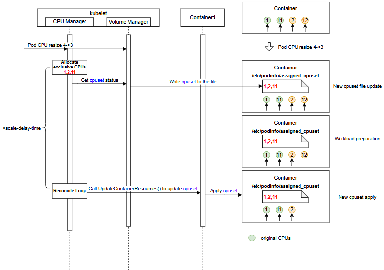
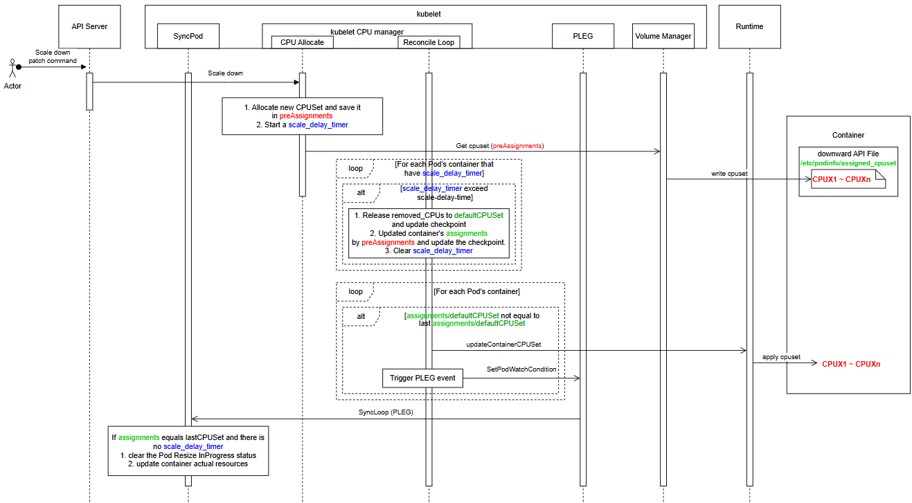
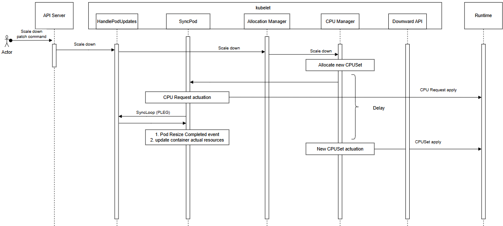
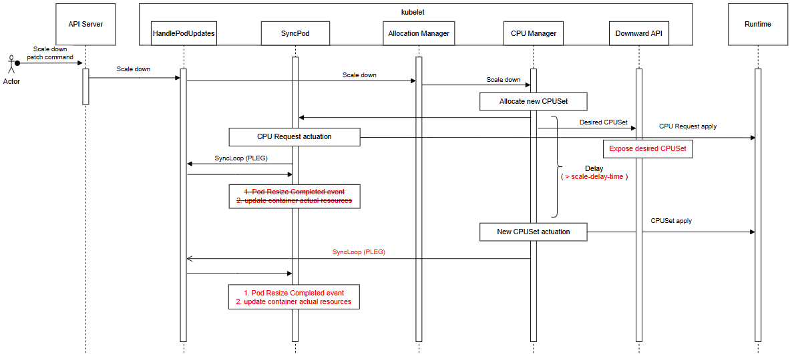
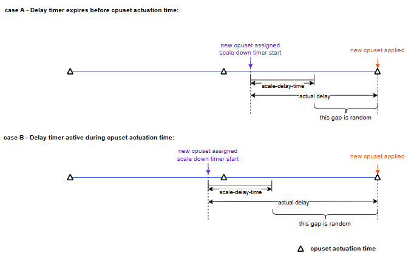

# KEP-6122: Configurable Scaling Delay with Pod Resource Exposure

<!--
This is the title of your KEP. Keep it short, simple, and descriptive. A good
title can help communicate what the KEP is and should be considered as part of
any review.
-->

<!--
A table of contents is helpful for quickly jumping to sections of a KEP and for
highlighting any additional information provided beyond the standard KEP
template.

Ensure the TOC is wrapped with
  <code>&lt;!-- toc --&rt;&lt;!-- /toc --&rt;</code>
tags, and then generate with `hack/update-toc.sh`.
-->

<!-- toc -->
- [Release Signoff Checklist](#release-signoff-checklist)
- [Summary](#summary)
- [Motivation](#motivation)
  - [Goals](#goals)
  - [Non-Goals](#non-goals)
- [Proposal](#proposal)
  - [Use Cases](#use-cases)
  - [Risks and Mitigations](#risks-and-mitigations)
- [Design Details](#design-details)
  - [Implementation](#implementation)
    - [Scale Down Delay in CPU Manager](#scale-down-delay-in-cpu-manager)
      - [Scale-Down Delay Timing](#scale-down-delay-timing)
      - [Consecutive Scaling](#consecutive-scaling)
    - [Resize Complete State](#resize-complete-state)
    - [Actual Resources Update](#actual-resources-update)
    - [Extend Downward API Volume to Expose CPU Manager Status](#extend-downward-api-volume-to-expose-cpu-manager-status)
  - [Test Plan](#test-plan)
      - [Prerequisite testing updates](#prerequisite-testing-updates)
      - [Unit tests](#unit-tests)
      - [Integration tests](#integration-tests)
      - [e2e tests](#e2e-tests)
  - [Graduation Criteria](#graduation-criteria)
    - [Alpha](#alpha)
    - [Beta](#beta)
    - [GA](#ga)
  - [Upgrade / Downgrade Strategy](#upgrade--downgrade-strategy)
  - [Version Skew Strategy](#version-skew-strategy)
- [Production Readiness Review Questionnaire](#production-readiness-review-questionnaire)
  - [Feature Enablement and Rollback](#feature-enablement-and-rollback)
  - [Rollout, Upgrade and Rollback Planning](#rollout-upgrade-and-rollback-planning)
  - [Monitoring Requirements](#monitoring-requirements)
  - [Dependencies](#dependencies)
  - [Scalability](#scalability)
  - [Troubleshooting](#troubleshooting)
- [Implementation History](#implementation-history)
- [Drawbacks](#drawbacks)
- [Alternatives](#alternatives)
  - [1. LIFO (Last-In, First-Out) CPU Release](#1-lifo-last-in-first-out-cpu-release)
  - [2. CPU Release Based on Real-Time Usage](#2-cpu-release-based-on-real-time-usage)
  - [3. Immediate Actuation (No Delay)](#3-immediate-actuation-no-delay)
  - [4. Handshake-Based Synchronization](#4-handshake-based-synchronization)
  - [5. Node Declared Features as Opt-Out Mechanism](#5-node-declared-features-as-opt-out-mechanism)
  - [6. Pod-Level Grace Period (Opt-In/Opt-Out Mechanism)](#6-pod-level-grace-period-opt-inopt-out-mechanism)
  - [7. Hook-Based Synchronization Approach](#7-hook-based-synchronization-approach)
  - [8. Generalizing Scale-Down Delay to Other Resource Types](#8-generalizing-scale-down-delay-to-other-resource-types)
- [Infrastructure Needed (Optional)](#infrastructure-needed-optional)
<!-- /toc -->

## Release Signoff Checklist

<!--
**ACTION REQUIRED:** In order to merge code into a release, there must be an
issue in [kubernetes/enhancements] referencing this KEP and targeting a release
milestone **before the [Enhancement Freeze](https://git.k8s.io/sig-release/releases)
of the targeted release**.

For enhancements that make changes to code or processes/procedures in core
Kubernetes—i.e., [kubernetes/kubernetes], we require the following Release
Signoff checklist to be completed.

Check these off as they are completed for the Release Team to track. These
checklist items _must_ be updated for the enhancement to be released.
-->

Items marked with (R) are required *prior to targeting to a milestone / release*.

- [X] (R) Enhancement issue in release milestone, which links to KEP dir in [kubernetes/enhancements] (not the initial KEP PR)
- [X] (R) KEP approvers have approved the KEP status as `implementable`
- [X] (R) Design details are appropriately documented
- [X] (R) Test plan is in place, giving consideration to SIG Architecture and SIG Testing input (including test refactors)
  - [X] e2e Tests for all Beta API Operations (endpoints)
  - [ ] (R) Ensure GA e2e tests meet requirements for [Conformance Tests](https://github.com/kubernetes/community/blob/master/contributors/devel/sig-architecture/conformance-tests.md)
  - [ ] (R) Minimum Two Week Window for GA e2e tests to prove flake free
- [X] (R) Graduation criteria is in place
  - [ ] (R) [all GA Endpoints](https://github.com/kubernetes/community/pull/1806) must be hit by [Conformance Tests](https://github.com/kubernetes/community/blob/master/contributors/devel/sig-architecture/conformance-tests.md) within one minor version of promotion to GA
- [ ] (R) Production readiness review completed
- [ ] (R) Production readiness review approved
- [ ] "Implementation History" section is up-to-date for milestone
- [ ] User-facing documentation has been created in [kubernetes/website], for publication to [kubernetes.io]
- [ ] Supporting documentation—e.g., additional design documents, links to mailing list discussions/SIG meetings, relevant PRs/issues, release notes

<!--
**Note:** This checklist is iterative and should be reviewed and updated every time this enhancement is being considered for a milestone.
-->

[kubernetes.io]: https://kubernetes.io/
[kubernetes/enhancements]: https://git.k8s.io/enhancements
[kubernetes/kubernetes]: https://git.k8s.io/kubernetes
[kubernetes/website]: https://git.k8s.io/website

## Summary

<!--
This section is incredibly important for producing high-quality, user-focused
documentation such as release notes or a development roadmap. It should be
possible to collect this information before implementation begins, in order to
avoid requiring implementors to split their attention between writing release
notes and implementing the feature itself. KEP editors and SIG Docs
should help to ensure that the tone and content of the `Summary` section is
useful for a wide audience.

A good summary is probably at least a paragraph in length.
-->

This proposal introduces a new option, `scale-delay-time`, in the CPU Manager static policy. The `scale-delay-time` option ensures the updated cpuset is not applied sooner than the specified delay after a container scale-down event.

This proposal also extends the downward API volume to expose the CPUs assigned to containers. This extension is controlled by the new `DownwardAPIAssignedResources` feature gate.

Together, these two features allow latency-sensitive applications to obtain the assigned cpuset in advance via the downward API. This enables workloads to prepare for CPU removal triggered by scale-down within the guaranteed delay window `scale-delay-time`. As a result, performance degradation caused by sudden CPU loss is avoided.

## Motivation

<!--
This section is for explicitly listing the motivation, goals, and non-goals of
this KEP.  Describe why the change is important and the benefits to users. The
motivation section can optionally provide links to [experience reports] to
demonstrate the interest in a KEP within the wider Kubernetes community.

[experience reports]: https://github.com/golang/go/wiki/ExperienceReports
-->

Latency-sensitive applications often require exclusive CPUs to achieve predictable performance and resource isolation. These applications commonly use CPU affinity to minimize performance degradation caused by CPU migration.

When scaling down, guaranteed QoS pods need to know in advance which CPUs will be removed from their cpuset. This allows latency-sensitive applications to take preparatory actions — such as migrating workloads away from affected CPUs — and avoid performance degradation caused by CPU migration and core sharing during the removal of active CPUs.

This KEP depends on [KEP-1287](https://github.com/kubernetes/enhancements/blob/master/keps/sig-node/1287-in-place-update-pod-resources/README.md), which allows Pods (without exclusive CPUs) to update their resource requests and limits in-place, and [KEP-5554](https://github.com/kubernetes/enhancements/blob/master/keps/sig-node/5554-in-place-update-pod-resources-alongside-static-cpu-manager-policy/README.md), which extends this feature to support guaranteed QoS Pods with exclusive CPUs to resize without restarts. The scale-down delay feature only applies to in-place resize enabled by KEP-1287 and exclusive CPUs resize enabled by KEP-5554.

> **Note:** This KEP was originally considered as part of KEP-5554 but was separated to keep KEP-5554 focused on the core scaling functionality. This KEP introduces two complementary features: configurable scale-down delay and exposure of assigned CPU sets via the Downward API. These features are independent of the basic scaling mechanism and can be implemented and adopted separately.

### Goals

<!--
List the specific goals of the KEP. What is it trying to achieve? How will we
know that this has succeeded?
-->

* Expose CPUSet assignments to containers via the downward API volume with `DownwardAPIAssignedResources` feature gate enabled:
   + `assigned.cpuset`: the desired exclusive cpuset (Linux cpuset format, e.g. `0-3,7,12-15`). Empty string when no exclusive CPUs are assigned.
* Wait at least the configured `scale-delay-time` before applying the new cpuset configuration when a container scales down.
* The `scale-delay-time` option applies to the entire kubelet. Its value must be between 0s and 10s. Setting it to 0s preserves the existing behavior (no delay before applying the cpuset), whereas 10s is the maximum allowed value.

### Non-Goals

<!--
What is out of scope for this KEP? Listing non-goals helps to focus discussion
and make progress.
-->

* Add new CPU manager policies.
* Allow containers to specify which CPUs to remove during scale-down.
* **Scale-down delay for PodLevelResourceManagers:** The scale-down delay introduced by this KEP does not apply to resources managed by `PodLevelResourceManagers` (KEP-5526). `PodLevelResourceManagers` does not support In-Place scaling for pod-level resources. Additionally, KEP-5554 (which enables In-Place scaling of exclusive CPU at the container level) excludes scaling for pods that define pod-level resources.

## Proposal

<!--
This is where we get down to the specifics of what the proposal actually is.
This should have enough detail that reviewers can understand exactly what
you're proposing, but should not include things like API designs or
implementation. What is the desired outcome and how do we measure success?.
The "Design Details" section below is for the real
nitty-gritty.
-->

This proposal introduces a new `scale-delay-time` option for the CPU Manager static policy. The option specifies the minimum delay before applying an updated cpuset when a container has its CPU allocation scaled down.
During the delay window, the container continues to use the current cpuset for at least the configured `scale-delay-time`. This allows latency-sensitive workloads to monitor and prepare for the upcoming CPUSet change before CPU(s) are removed from the container. The minimum delay must be guaranteed at all times, including during kubelet restarts.

This proposal also extends the Downward API volume to expose CPU Manager cpuset information through a new `assigned.cpuset` resource field. During the delay window, `assigned.cpuset` exposes the desired cpuset so that workloads can prepare for the upcoming change. Exposition of new field is gated by the `DownwardAPIAssignedResources` feature gate.

This proposal does not require a handshake (acknowledgment) from the workload, because the `scale-delay-time` is configured based on the workload's needed reaction time, providing a guaranteed time window for the workload to react to the upcoming cpuset change.

### Use Cases

1.	A Pod with one container is allocated 4 CPUs: {1, 2, 11, 12}, where {1, 11} are the initially assigned CPUs. DPDK workers are deployed on each core.
2.	When the container's CPU request scales down from 4 to 3, the CPU manager assigns a new cpuset {1, 2, 11}. Subsequently, the Downward API Volume (/etc/podinfo/assigned_cpuset) within the container is updated with the CPU Manager's state information (cpuset allocated in the CPU manager).
3.	After waiting at least `scale-delay-time`, the new cpuset {1, 2, 11} is applied to the container. And later, once applied, kubelet marks the container resize as successful.
4.	During the interval between the update of the Downward API Volume and the new cpuset application, the container can perform necessary preparations for the DPDK workers.


### Risks and Mitigations

<!--
What are the risks of this proposal, and how do we mitigate? Think broadly.
For example, consider both security and how this will impact the larger
Kubernetes ecosystem.

How will security be reviewed, and by whom?

How will UX be reviewed, and by whom?

Consider including folks who also work outside the SIG or subproject.
-->

When `scale-delay-time` is configured on a node, the delay applies to all guaranteed pods with exclusive CPUs — not only those that need it. This means even pods without latency-sensitive workloads will experience the delayed cpuset application during scale-down.

**Mitigation in Alpha:** Operators are recommended to taint nodes that have `scale-delay-time` configured, so that only pods with corresponding tolerations are scheduled to those nodes. This effectively provides an opt-in mechanism at the node level.

**Future improvement:** In Alpha2/Beta, a more granular opt-out mechanism will be investigated, such as using taints, labels/annotations or other mechanisms to allow pods to opt out of the scale-down delay at the pod level.

**Workload may not complete preparations within the delay window:** The kubelet guarantees only that the cpuset will not be applied before `scale-delay-time` has elapsed. There is no synchronization mechanism between the workload and kubelet — if the workload fails to complete its preparations (e.g., workload migration, draining tasks) within the delay window, the cpuset change is applied anyway. This is an inherent limitation of keeping kubelet independent from workload state.

**Mitigation:** Operators should configure `scale-delay-time` based on the worst-case preparation time required by their latency-sensitive workloads. Workloads should be designed to handle premature CPU removal gracefully (e.g., by quickly migrating tasks to remaining CPUs or tolerating brief performance degradation). The `assigned.cpuset` field in the Downward API provides early notification of the upcoming change, giving workloads the maximum possible preparation time.

## Design Details

<!--
This section should contain enough information that the specifics of your
change are understandable. This may include API specs (though not always
required) or even code snippets. If there's any ambiguity about HOW your
proposal will be implemented, this is the place to discuss them.
-->

### Implementation

The overview of the design:


The basic flow shown in the diagram is as follows:
- During allocation of new CPUSets, changes are not applied to assignments immediately but kept in preAssignments, and scale_delay_timers are started.
- Downward API exposes the new CPUSets in preAssignments to the container.
- During cpuset actuation, containers scaling down (with active `scale_delay_timer`) are skipped if the scale-delay-time has not yet elapsed. For those where the time has passed, preAssignments are written to assignments and actuated in containers.
- The SyncPod processes two actions after there are no active scale_delay_timer on the pod, and actuated states equal the allocated ones:
  - Marking the resize as completed
  - Updating the actual resources

When a scale-down operation is started and accepted for processing, it is handled by the AllocationManager. The AllocationManager delegates allocation of new CPUSets to the CPUManager. The CPUManager allocates new CPUs, and at this point the synchronous control of resize is completed.

There are 2 more asynchronous actions:
1. The CPUManager actuates the cpuset in the container to reflect the allocated state.
2. The SyncPod loop updates actual resources and marks the pod resize as completed when all actuated states equal the allocated ones.

The existing flow (before applying this KEP) among AllocationManager, CPUManager, and SyncPod is as follows:



The flow after the modifications introduced by this KEP is as follows:



Regarding the ownership of resize:
- **AllocationManager** is responsible for accepting resize and triggering the allocation phase. This KEP does not modify this part.
- **CPUManager** is responsible for:
  - Allocating CPUs (with this KEP, when scaling down, starting a scale_delay_timer and saving the new cpuset in preAssignments).
  - Actuating cpuset in containers (with this KEP, after the scale_delay_timer expires, applying the new cpuset).
- **SyncPod loop** is responsible for
  - Updating pod resize status (with this KEP, clears PodResizeInProgress when all actuated states equal the allocated ones).
  - Updating container actual resources (with this KEP, update actual resources when actuated states equal the allocated ones).

#### Scale Down Delay in CPU Manager

Add an option `scale-delay-time` in the CPU Manager's static policy
```go
const (
	FullPCPUsOnlyOption             string = "full-pcpus-only"
	DistributeCPUsAcrossNUMAOption  string = "distribute-cpus-across-numa"
	AlignBySocketOption             string = "align-by-socket"
	DistributeCPUsAcrossCoresOption string = "distribute-cpus-across-cores"
	StrictCPUReservationOption      string = "strict-cpu-reservation"
	PreferAlignByUnCoreCacheOption  string = "prefer-align-cpus-by-uncorecache"
	// ⚠️ new option
	ScaleDelayTimeOption            string = "scale-delay-time"
)
```

The `scale-delay-time` value must be in the range [0s, 10s]. Negative values are not allowed. It can be specified in seconds or milliseconds, for example: '5s', or '500ms'.

The default value of `scale-delay-time` is 0s, meaning the existing behavior is preserved — no guaranteed delay is enforced before the cpuset is applied.

When `InPlacePodVerticalScalingExclusiveCPUs` is disabled, `scale-delay-time` must be 0; otherwise, the kubelet will emit a warning and reject the configuration.

1. In the Allocate CPU stage:
   Allocate a new CPUSet based on the container's assignments and defaultCPUset in the checkpoint (all references to "checkpoint" below refer to cpu_manager_state).

   When a container scales down (If the CPU number of assignments in checkpoint > CPU request and limit for the container Pod Spec):
   - If the `scale-delay-time` is 0, the container's scale down behavior is the same as before, after reallocating the new cpuset:
     - The removed_CPUs (assignments in checkpoint - new cpuset) are added to the defaultCPUset
     - The container's assignments are updated to the new cpuset
     - CPU manager checkpoint is updated immediately with new assignments and defaultCPUSet.
   - If the `scale-delay-time` is not 0, after reallocating the new cpuset:
     - A scale_delay_timer starts after the new cpuset is allocated. (monotonic time should be considered)
     - The new cpuset is saved in preAssignments, which is a local parameter in the CPU manager.

   When a container scales up (If the CPU number of assignments in checkpoint <= CPU request and limit for the container in Pod Spec), after reallocating the new cpuset:
   - The added_CPUs (new cpuset - assignments in checkpoint) are removed from the defaultCPUset.
   - The container's assignments are updated.
   - CPU manager checkpoint is updated immediately with new assignments and defaultCPUSet.
   - If the `scale-delay-time` is not 0:
     - The scale_delay_timer and preAssignment are cleared if they exist

   When kubelet restarts during a pod scale-down delay time, the pod will restart the scale_delay_timer and reallocate the new cpuset.

2. When cpuset actuation time is reached:
   If scale_delay_timer exists for a container, and after the scale_delay_timer has expired:
   - The removed_CPUs (assignments in checkpoint - preAssignments) are released to the defaultCPUset.
   - The container's assignments are updated to preAssignments.
   - CPU manager checkpoint is updated immediately with new assignments and defaultCPUSet.
   - The scale_delay_timer and preAssignments are cleared.

   If the cpuset (assignments) differs from lastCPUSet for a container:
   - The CPUSet(assignments) is applied to the container by the runtime.
   - If the CPUSet(assignments) is an exclusive CPUSet, a PLEG event is triggered.


Note: If the kubelet restarts during a pending scale-down delay, the scale-down operation is restarted from the beginning with a fresh `scale_delay_timer`. This is because the CPU Manager does not persist `preAssignments` or active timers to the checkpoint — only the current `assignments` (the original cpuset before scale-down) are preserved. Upon restart, the kubelet observes a mismatch between the container's desired CPU request (from the Pod spec) and the allocated CPUs (from the checkpoint), triggering a new allocation cycle. This results in new `preAssignments` being created and a new `scale_delay_timer` being started, ensuring the full `scale-delay-time` delay is guaranteed even after a restart.

##### Scale-Down Delay Timing

From the time a new cpuset is allocated to when it is actually applied, there is a delay. The minimum guaranteed delay before the new cpuset is applied is `scale-delay-time`. The actual delay may be longer than `scale-delay-time` depending on when the cpuset actuation occurs, but is guaranteed to be no less than `scale-delay-time`.

The following diagrams illustrate the two cases.



**Case A: Timer expires before cpuset actuation time** — The scale_delay_timer expires between two cpuset actuation times. Since the timer has already expired when the next actuation time arrives, the new cpuset is applied at that actuation time as it normally would. In this case, the scale_delay_timer does not affect the actual time when the cpuset is applied.

**Case B: Timer active during cpuset actuation time** — The scale_delay_timer is still active when the next cpuset actuation time arrives. The new cpuset cannot be applied at this actuation time because the timer has not yet expired. It is applied at the next actuation time after the timer expires. In this case, the actual delay is longer than the normal delay.

In both cases, the actual delay is at least `scale-delay-time`, but may be longer due to the gap between timer expiry and the cpuset actuation time.

##### Consecutive Scaling

When another scale-down request arrives while a scale-down is already in progress (i.e., the scale_delay_timer is active), the CPU Manager allocates a new cpuset (which is stored in preAssignments, replacing the previous one) and resets the timer, so the delay starts again from the beginning.

When a scale-up request arrives while a scale-down is in progress, the behavior depends on the resulting CPU count:

- **If the new CPU count is greater than or equal to the original (pre-scale-down) CPU count**, it is effectively a scale-up: the assignments are updated directly (not via preAssignments), and the scale_delay_timer and preAssignments are cleared.
- **If the new CPU count is still lower than the original CPU count**, it is effectively a scale-down: the preAssignments are updated with the new cpuset, and the scale_delay_timer is reset.

#### Resize Complete State
The pod resize completed event (Pod Lifecycle Event) is not emitted until the new cpuset has been successfully applied to all containers in the pod. Only then is the pod resize considered complete.

In SyncPod(), the Pod Resize InProgress status is cleared only when the allocated cpusets equal actuated ones and no scale_delay_timer is active for any container, in addition to the existing conditions. This indicates the pod resize is complete.
These new conditions are evaluated by the CPU Manager, which is queried from SyncPod() via the Container Manager.

#### Actual Resources Update

The actual resources are used by the scheduler to calculate the available CPU number for the node (see [KEP-1287](https://github.com/kubernetes/enhancements/tree/master/keps/sig-node/1287-in-place-update-pod-resources#scheduler-and-api-server-interaction)). The actual resources reflect the container resource current state, reported by the runtime.

When a pod resize passes admission, the CPU request is applied immediately (updating cpu.weight in cgroup v2), but the cpuset is applied after a delay. Therefore, in `convertToAPIContainerStatuses`, before the cpuset is applied, the actual resources are not updated; after the cpuset is applied (i.e., after at least the `scale-delay-time` expires and the new cpuset is applied), the actual resources are converted to the current cpu.weight value.

Note: Before the checkpoint is updated and the cpuset is applied, if the runtime-reported CPU resource request (value from cpu.weight in cgroup v2) were used to update the actual resources during the delay, it would cause a mismatch between the available CPU number reported to the scheduler and the actual available CPUs in kubelet. This would result in a new pod being scheduled to the node but failing to allocate CPU resources, leading to an `UnexpectedAdmissionError`. Deferring the actual resources update until after cpuset application prevents this scenario from occurring.

#### Extend Downward API Volume to Expose CPU Manager Status

A new field `assigned.cpuset` is added to the existing `ResourceFieldRef.Resource`:

ResourceFieldRef.Resource
* resource: limits.cpu
   + A container's CPU limit
* resource: requests.cpu
   + A container's CPU request
* resource: limits.memory
   + A container's memory limit
* resource: requests.memory
   + A container's memory request
* resource: limits.hugepages-*
   + A container's hugepages limit
* resource: requests.hugepages-*
   + A container's hugepages request
* resource: limits.ephemeral-storage
   + A container's ephemeral-storage limit
* resource: requests.ephemeral-storage
   + A container's ephemeral-storage request
* **resource: assigned.cpuset** *(NEW)*
   + **A container’s CPU desired assignments**

The Volume manager gets the CPU state from CPU manager, and writes it to the Downward API volume file `assigned.cpuset`, which exposes the CPUSet to the container:
  - If the container has exclusive CPUs assigned, the value exposes the exclusive cpuset (If preAssignments exist (scale-down is pending), this exposes the preAssignments; otherwise, it exposes the assignments).
  - Otherwise, the value is empty ("").

### Test Plan

<!--
**Note:** *Not required until targeted at a release.*
The goal is to ensure that we don't accept enhancements with inadequate testing.

All code is expected to have adequate tests (eventually with coverage
expectations). Please adhere to the [Kubernetes testing guidelines][testing-guidelines]
when drafting this test plan.

[testing-guidelines]: https://git.k8s.io/community/contributors/devel/sig-testing/testing.md
-->

[X] I/we understand the owners of the involved components may require updates to
existing tests to make this code solid enough prior to committing the changes necessary
to implement this enhancement.

##### Prerequisite testing updates

<!--
Based on reviewers feedback describe what additional tests need to be added prior
implementing this enhancement to ensure the enhancements have also solid foundations.
-->

##### Unit tests

<!--
In principle every added code should have complete unit test coverage, so providing
the exact set of tests will not bring additional value.
However, if complete unit test coverage is not possible, explain the reason of it
together with explanation why this is acceptable.
-->

<!--
Additionally, for Alpha try to enumerate the core package you will be touching
to implement this enhancement and provide the current unit coverage for those
in the form of:
- <package>: <date> - <current test coverage>
The data can be easily read from:
https://testgrid.k8s.io/sig-testing-canaries#ci-kubernetes-coverage-unit

This can inform certain test coverage improvements that we want to do before
extending the production code to implement this enhancement.
-->

We plan on adding/modifying functions to the following files:
- `pkg/kubelet/cm/cpumanager/policy_options_test.go`
- `pkg/kubelet/cm/cpumanager/policy_static_test.go`
- `pkg/volume/downwardapi/downwardapi_test.go`
- `pkg/apis/core/validation/validation_test.go`


##### Integration tests

<!--
Integration tests are contained in https://git.k8s.io/kubernetes/test/integration.
Integration tests allow control of the configuration parameters used to start the binaries under test.
This is different from e2e tests which do not allow configuration of parameters.
Doing this allows testing non-default options and multiple different and potentially conflicting command line options.
For more details, see https://github.com/kubernetes/community/blob/master/contributors/devel/sig-testing/testing-strategy.md

If integration tests are not necessary or useful, explain why.
-->

<!--
This question should be filled when targeting a release.
For Alpha, describe what tests will be added to ensure proper quality of the enhancement.

For Beta and GA, document that tests have been written,
have been executed regularly, and have been stable.
This can be done with:
- permalinks to the GitHub source code
- links to the periodic job (typically https://testgrid.k8s.io/sig-release-master-blocking#integration-master), filtered by the test name
- a search in the Kubernetes bug triage tool (https://storage.googleapis.com/k8s-triage/index.html)
-->

Integration tests are not necessary because all cases are covered by unit and e2e tests.

##### e2e tests

<!--
This question should be filled when targeting a release.
For Alpha, describe what tests will be added to ensure proper quality of the enhancement.

For Beta and GA, document that tests have been written,
have been executed regularly, and have been stable.
This can be done with:
- permalinks to the GitHub source code
- links to the periodic job (typically a job owned by the SIG responsible for the feature), filtered by the test name
- a search in the Kubernetes bug triage tool (https://storage.googleapis.com/k8s-triage/index.html)

We expect no non-infra related flakes in the last month as a GA graduation criteria.
If e2e tests are not necessary or useful, explain why.
-->

These cases will be added in the existing e2e_node tests to verify that CPU Manager works with `scale-delay-time` static policy option and downward API exposing CPU states.

Prerequisites:

1. Enable the following feature gates:
    * `InPlacePodVerticalScalingExclusiveCPUs`
    * `CPUManagerPolicyAlphaOptions`
    * `DownwardAPIAssignedResources`
2. Configure the CPU Manager policy option to use `scale-delay-time`.

The following scenarios will be tested:

| No | Test | Description | Expected Result |
|----|------|-------------|-----------------|
| 1 | Validate Scale-Down Delay | Initiate a scale-down request for a container and verify the operation timing against the configured `scale-delay-time`. | • Verify the pod is successfully patched for scale-down<br />• The downward API volume exposes the new cpuset before it is applied to the container<br />• Verify the pod scales down only after the scale-delay timer has expired<br />• Verify the final resources allocated to the pod after the resize |
| 2 | Resource Allocation Blocking | Initiate a scale-down request for Pod 1 and attempt to allocate the CPU resources being released from Pod 1 to Pod 2 before the delay timer expires. | • Verify Pod 1's scale-down request is pending and new cpuset has not yet been applied<br />• Verify Pod 2 cannot allocate the CPUs held by Pod 1 until the delay timer has fully elapsed<br />• Verify Pod 2 successfully resizes and claims the CPUs only after Pod 1's delay period expires |
| 3 | Validate Scale-Up Before Timer Expiry | Initiate a scale-down request and, before the delay timer expires, send a scale-up request for the container CPU. | • Verify the pending scale-down request is cleared<br />• The downward API volume reflects the current (scaled-up) cpuset<br />• Verify the pod scales up as requested<br />• Verify the resources allocated to the pod match the latest requested scale-up configuration |
| 4 | Validate Repeated Scale-Down Before Timer Expiry | Initiate a scale-down request and, before the delay timer expires, send another, different scale-down request for the container CPU. | • Verify the initial pending scale-down request is cleared<br />• The downward API volume reflects the cpuset from the latest scale-down request<br />• Verify the pod scales down following the latest request after the timer expires<br />• Verify the resources allocated to the pod match the final scaled-down configuration |
| 5 | Validate Kubelet Restart Before Timer Expiry | Initiate a scale-down request and restart the Kubelet before the delay timer expires. | • Verify the scale-down is reprocessed after the kubelet restarts<br />• Once the Kubelet restarts, verify the downward API volume exposes the new cpuset for the pending scale-down<br />• Verify the Pod scales down after the `scale-delay-time` has elapsed |
| 6 | Feature gate `DownwardAPIAssignedResources` Rollback | Enable the feature gate and initiate a scale-down request. After scale-down actuation, disable the feature gate and perform another scale-down request. | • Verify CPU manager states are exposed through the Downward API when the feature gate is enabled<br />• Verify the pod scales down after timer expiry<br />• Restart kubelet and kube-apiserver with the feature gate disabled, patch the pod to remove the downwardApi and verify the pod comes in Running state without errors<br />• Perform pod downscaling again and verify the pod still scales down after timer expiry |
| 7 | Feature gate `DownwardAPIAssignedResources` Rollout | Disable the feature gate and initiate a scale-down request. After scale-down actuation, enable the feature gate and perform another scale-down request. | • Verify the pod scales down after timer expiry<br />• Restart kubelet and kube-apiserver with the feature gate enabled, patch the pod to add downwardAPI and verify the pod comes in Running state without errors<br />• Perform pod downscaling again and verify CPU manager states are exposed through the Downward API, while the pod scales down after timer expiry |
| 8 | Kubelet Version Rollback | Start with version v1.37 and initiate a scale-down request. Before scale-down completes (i.e. before timer expiry), downgrade kubelet to v1.36. | Before Downgrade:<br />• Verify CPU manager states are exposed through the Downward API<br />After Downgrade:<br />• Patch the pod to remove downward-API, verify the pod comes in Running state and the pending scale-down request is rejected since scaling exclusive cpus are not supported in v1.36 |
| 9 | Kubelet Version Rollout | Start with version v1.36, deploy a pod with exclusive cpu, upgrade to v1.37, enable the `DownwardAPIAssignedResources` feature gate, and initiate a scale-down request. | • Verify the pod remains in Running state<br />• Patch the pod to add downward-API and verify CPU manager states are exposed through the Downward API<br />• Verify the pod scales down after the scale-delay timer expires |


### Graduation Criteria

#### Alpha

For scale down delay feature
* Feature implemented behind the existing static policy feature flag
* Feature is behind feature gate flags:
   + `CPUManagerPolicyAlphaOptions`
   + `InPlacePodVerticalScalingExclusiveCPUs`
* The `scale-delay-time` functionality is implemented.
* Unit and e2e tests are completed with sufficient coverage.

For downward API exposing CPU states feature
* Feature implemented behind the `DownwardAPIAssignedResources`.
* Validation logic is in-place in kube-apiserver
* Kubelet has support for CPU manager exposure in the pod
* unit testing and e2e testing for downward API enhancement for CPU exposure.

#### Beta

For scale down delay feature
* No unresolved critical bugs.
* Bugs reported by users have been addressed
* A pod-level opt-out mechanism for the scale-down delay has been analyzed and designed. This allows pods that do not require the delay to skip it, while still allowing latency-sensitive pods to benefit from the guaranteed preparation time.
* Generalization of scale down delay to another type of resources has been analyzed.
* New metrics or events will be considered to improve the observability of this feature.

For downward API exposing CPU states feature
* Exposing Memory Manager information (e.g., `assigned.memset`) via the Downward API.
* unit testing and e2e testing for downward API enhancement for memory exposure.

#### GA

* Allow time for feedback (6+ months).
* Make sure all risks have been addressed.

### Upgrade / Downgrade Strategy

<!--
If applicable, how will the component be upgraded and downgraded? Make sure
this is in the test plan.

Consider the following in developing an upgrade/downgrade strategy for this
enhancement:
- What changes (in invocations, configurations, API use, etc.) is an existing
  cluster required to make on upgrade, in order to maintain previous behavior?
- What changes (in invocations, configurations, API use, etc.) is an existing
  cluster required to make on upgrade, in order to make use of the enhancement?
-->

The scale-down delay functionality doesn't store any information in kubelet checkpoints or any other persistent storage. This makes upgrades and downgrades seamless.

The new field `assigned.cpuset` is exposed behind the `DownwardAPIAssignedResources` feature gate. Field validation in kube-api-server depends on this gate. Kubelet handles file creation and updates based on pod spec (no dependency on feature gate).

The feature gate is Alpha and disabled by default. The documentation states: "Only enable this feature gate when all kubelets in the cluster support this feature." The operator must upgrade all kubelets first, then enable the feature gate.

This documentation entry guarantees that, in both upgrades and downgrades, if one of the kubelet versions does not yet support this feature, the feature gate must remain disabled.


### Version Skew Strategy

<!--
If applicable, how will the component handle version skew with other
components? What are the guarantees? Make sure this is in the test plan.

Consider the following in developing a version skew strategy for this
enhancement:
- Does this enhancement involve coordinating behavior in the control plane and nodes?
- How does an n-3 kubelet or kube-proxy without this feature available behave when this feature is used?
- How does an n-1 kube-controller-manager or kube-scheduler without this feature available behave when this feature is used?
- Will any other components on the node change? For example, changes to CSI,
  CRI or CNI may require updating that component before the kubelet.
-->

The `scale-delay-time` functionality is local to kubelet only so it is not affected by skewness problems between components.

Exposition of the field `assigned.cpuset` is behind feature gate `DownwardAPIAssignedResources`. The feature gate is Alpha and disabled by default. The documentation states: "Only enable this feature gate when all kubelets in the cluster support this feature." The operator must upgrade all kubelets first, then enable the feature gate.


Considering the following scenarios:

* Cluster has kubelets both: without the feature (1.36-) and with feature implemented (1.37+) (mixed versions): The operator does not enable the feature gate. Nobody can use `assigned.cpuset`.

* All kubelets upgraded to versions having feature implemented (1.37+): The operator enables the feature gate on the API server and kubelets.
`assigned.cpuset` can be mounted as DownwardAPI volume files by pods.

* Operator enables the feature gate while some kubelets still don’t have feature implemented (1.36-): This is an operator error. The feature gate is Alpha and disabled by default. The documentation states: "Only enable this feature gate when all kubelets in the cluster support this feature." The operator must upgrade all kubelets first, then enable the feature gate.

## Production Readiness Review Questionnaire

<!--

Production readiness reviews are intended to ensure that features merging into
Kubernetes are observable, scalable and supportable; can be safely operated in
production environments, and can be disabled or rolled back in the event they
cause increased failures in production. See more in the PRR KEP at
https://git.k8s.io/enhancements/keps/sig-architecture/1194-prod-readiness.

The production readiness review questionnaire must be completed and approved
for the KEP to move to `implementable` status and be included in the release.

In some cases, the questions below should also have answers in `kep.yaml`. This
is to enable automation to verify the presence of the review, and to reduce review
burden and latency.

The KEP must have a approver from the
[`prod-readiness-approvers`](http://git.k8s.io/enhancements/OWNERS_ALIASES)
team. Please reach out on the
[#prod-readiness](https://kubernetes.slack.com/archives/CPNHUMN74) channel if
you need any help or guidance.
-->

### Feature Enablement and Rollback

<!--
This section must be completed when targeting alpha to a release.
-->

###### How can this feature be enabled / disabled in a live cluster?

<!--
Pick one of these and delete the rest.

Documentation is available on [feature gate lifecycle] and expectations, as
well as the [existing list] of feature gates.

[feature gate lifecycle]: https://git.k8s.io/community/contributors/devel/sig-architecture/feature-gates.md
[existing list]: https://kubernetes.io/docs/reference/command-line-tools-reference/feature-gates/
-->

This feature requires enabling the following feature gates

- [ ] Feature gate (also fill in values in `kep.yaml`)
  - Feature gate name: `InPlacePodVerticalScalingExclusiveCPUs`
  - Feature gate name: `CPUManagerPolicyAlphaOptions`
  - Feature gate name: `DownwardAPIAssignedResources`
  - Requires `--cpu-manager-policy` kubelet configuration set to `static`
  -	Requires `scale-delay-time` kubelet configuration.

The following table shows the effect of each feature gate combination:

| CPUManager PolicyAlpha Options | InPlacePod VerticalScaling ExclusiveCPUs | DownwardAPI Assigned Resources | Effect |
|---|---|---|---|
| ✗ | ✗ | ✗ | Legacy version: no scaling of exclusive CPUs, no minimum delay, no exposure of cpuset in downwardAPI |
| ✗ | ✗ | ✓ | No scaling of exclusive CPUs, no minimum delay, desired cpuset exposed in downwardAPI |
| ✗ | ✓ | ✗ | Scaling of exclusive CPUs, no minimum delay, no exposure of cpuset in downwardAPI |
| ✗ | ✓ | ✓ | Scaling of exclusive CPUs, no minimum delay, desired cpuset exposed in downwardAPI |
| ✓ | ✗ | ✗ | No scaling of exclusive CPUs, `scale-delay-time` > 0 rejected (warning emitted), no exposure of cpuset in downwardAPI |
| ✓ | ✗ | ✓ | No scaling of exclusive CPUs, `scale-delay-time` > 0 rejected (warning emitted), desired cpuset exposed in downwardAPI |
| ✓ | ✓ | ✗ | Scaling of exclusive CPUs, delay configurable and working, no exposure of cpuset in downwardAPI |
| ✓ | ✓ | ✓ | Full feature: scaling of exclusive CPUs, delay configurable and working, desired cpusets exposed in downwardAPI |

###### Does enabling the feature change any default behavior?

<!--
Any change of default behavior may be surprising to users or break existing
automations, so be extremely careful here.
-->

Enabling `scale-delay-time`, it will ensure a minimum delay before the cpuset is applied when the pod scales down.

Enabling `DownwardAPIAssignedResources`, it will expose the CPU states via downward API. Feature gate `DownwardAPIAssignedResources` only gates the kube-apiserver.

###### Can the feature be disabled once it has been enabled (i.e. can we roll back the enablement)?

<!--
Describe the consequences on existing workloads (e.g., if this is a runtime
feature, can it break the existing applications?).

Feature gates are typically disabled by setting the flag to `false` and
restarting the component. No other changes should be necessary to disable the
feature.

NOTE: Also set `disable-supported` to `true` or `false` in `kep.yaml`.
-->

Yes.

Disabling `scale-delay-time` does not have any consequences.

Disabling `DownwardAPIAssignedResources` on kube-apiserver requires that no pods have declared usage of the files as mount points. Such pod specs must be modified before disabling the feature not to cause validation errors: "unsupported container resource: assigned.cpuset".

###### What happens if we reenable the feature if it was previously rolled back?

The cpuset will be applied with a minimum delay again based on the configuration of `scale-delay-time`.

The `assigned.cpuset` will contain proper values.

###### Are there any tests for feature enablement/disablement?

<!--
The e2e framework does not currently support enabling or disabling feature
gates. However, unit tests in each component dealing with managing data, created
with and without the feature, are necessary. At the very least, think about
conversion tests if API types are being modified.

Additionally, for features that are introducing a new API field, unit tests that
are exercising the `switch` of feature gate itself (what happens if I disable a
feature gate after having objects written with the new field) are also critical.
You can take a look at one potential example of such test in:
https://github.com/kubernetes/kubernetes/pull/97058/files#diff-7826f7adbc1996a05ab52e3f5f02429e94b68ce6bce0dc534d1be636154fded3R246-R282
-->

Provided E2E tests cover rollout and rollback cases.

### Rollout, Upgrade and Rollback Planning

<!--
This section must be completed when targeting beta to a release.
-->

###### How can a rollout or rollback fail? Can it impact already running workloads?

<!--
Try to be as paranoid as possible - e.g., what if some components will restart
mid-rollout?

Be sure to consider highly-available clusters, where, for example,
feature flags will be enabled on some API servers and not others during the
rollout. Similarly, consider large clusters and how enablement/disablement
will rollout across nodes.
-->

The feature gate `DownwardAPIAssignedResources` is Alpha and is disabled by default.

The upgrade and rollback of kubelet and kube-apiserver components can be conducted with feature gate enabled only if it does not break the rule written in documentation: "Only enable this feature gate when all kubelets in the cluster support this feature.". See above sections for  Upgrade / Downgrade Strategy and Version Skew Strategy

This feature ensures a minimum delay before applying the new cpuset during scale-down. A rollout or rollback can fail if the kubelet configuration is invalid (e.g., an invalid `scale-delay-time` value).

However, since this feature only affects the timing of cpuset changes and not the allocation itself, a failure does not impact already running workloads — their current cpuset remains in effect.

###### What specific metrics should inform a rollback?

<!--
What signals should users be paying attention to when the feature is young
that might indicate a serious problem?
-->

N/A

###### Were upgrade and rollback tested? Was the upgrade->downgrade->upgrade path tested?

<!--
Describe manual testing that was done and the outcomes.
Longer term, we may want to require automated upgrade/rollback tests, but we
are missing a bunch of machinery and tooling and can't do that now.
-->

Local Testing Plan:

**Test `DownwardAPIAssignedResources` feature upgrade and rollback**

1. Deploy kubelet with the feature gate `DownwardAPIAssignedResources` disabled.
2. Initiate a pod downscaling request.
   - Verify CPU manager states are NOT exposed through the Downward API.
3. Enable the feature gate and initiate another pod downscaling request.
   - Verify the pod remains in `Running` state without errors.
   - Verify CPU manager states are exposed through the Downward API.
4. Disable the feature gate again and initiate another pod downscaling request.
   - Verify the pod remains in `Running` state without errors.
   - Verify CPU manager states are NOT exposed through the Downward API
5. Finally, re-enable the feature gate and initiate another pod downscaling request.
   - Verify the pod remains in `Running` state without errors.
   - Verify CPU manager states are exposed through the Downward API.

**Test `scale-delay-time` feature upgrade and rollback**

1. Deploy kubelet v1.36 with `scale-delay-time` as 0.
   - Do not verify the pod scale-down delay, as exclusive CPU resize is not supported in this version.
2. Upgrade kubelet from v1.36 to v1.37, configure `scale-delay-time` as Xs (e.g. 5s), and initiate a pod scale up first and request scale-down.
   - Verify the pod remains in `Running` state without errors.
   - Verify the pod scales down delay is greater than 5s.
3. Downgrade kubelet from v1.37 to v1.36, clear the `scale-delay-time` configuration.
   - Verify the pod remains in `Running` state without errors.
   - Do not verify the pod scale-down delay, as exclusive CPU resize is not supported in this version.
4. Upgrade kubelet back to v1.37, configure `scale-delay-time` again, and initiate a pod scale up first and request scale-down.
   - Verify the pod remains in `Running` state without errors.
   - Verify the pod scales down delay is greater than 5s.

###### Is the rollout accompanied by any deprecations and/or removals of features, APIs, fields of API types, flags, etc.?

<!--
Even if applying deprecation policies, they may still surprise some users.
-->

N/A

### Monitoring Requirements

<!--
This section must be completed when targeting beta to a release.

For GA, this section is required: approvers should be able to confirm the
previous answers based on experience in the field.
-->

###### How can an operator determine if the feature is in use by workloads?

<!--
Ideally, this should be a metric. Operations against the Kubernetes API (e.g.,
checking if there are objects with field X set) may be a last resort. Avoid
logs or events for this purpose.
-->

Check the downward API volume in the pod. Files /etc/podinfo/cpuset should be present respectively for CPU info.

The kubelet configuration printed in kubelet's logs shows non-zero `scale-delay-time`.

###### How can someone using this feature know that it is working for their instance?

<!--
For instance, if this is a pod-related feature, it should be possible to determine if the feature is functioning properly
for each individual pod.
Pick one more of these and delete the rest.
Please describe all items visible to end users below with sufficient detail so that they can verify correct enablement
and operation of this feature.
Recall that end users cannot usually observe component logs or access metrics.
-->

Check whether there is a downward API volume of cpuset in the pod.

After scaling containers with exclusive CPUs assigned down there should be a temporary (for at least `scale-delay-time`) visible discrepancy between the /etc/podinfo/cpuset file (which already contains the new values) and the current cpuset settings in cgroups (still containing old CPUset).

###### What are the reasonable SLOs (Service Level Objectives) for the enhancement?

<!--
This is your opportunity to define what "normal" quality of service looks like
for a feature.

It's impossible to provide comprehensive guidance, but at the very
high level (needs more precise definitions) those may be things like:
  - per-day percentage of API calls finishing with 5XX errors <= 1%
  - 99% percentile over day of absolute value from (job creation time minus expected
    job creation time) for cron job <= 10%
  - 99.9% of /health requests per day finish with 200 code

These goals will help you determine what you need to measure (SLIs) in the next
question.
-->

- The downward API volume must reflect the new cpuset before the cpuset is applied, ensuring the workload has the full delay window to prepare.
- After at least `scale-delay-time` has elapsed, the new cpuset is applied to the container at the next cpuset actuation time.
- Scale-up operations are not delayed by this feature and follow the existing behavior.
- The cpuset values exposed via the downward API must always be accurate: `assigned.cpuset` must reflect the allocated cpuset (preAssignments if scale-down is pending, otherwise assignments).


###### What are the SLIs (Service Level Indicators) an operator can use to determine the health of the service?

<!--
Pick one more of these and delete the rest.
-->

- Time from the CPU manager determining the new cpuset to the downward API volume being updated. This indicates whether the workload receives timely notification of the upcoming change.

- Time from the `scale-delay-time` expiring to the new cpuset being applied to the container. This indicates whether the cpuset change is applied promptly after the delay.

- Number of scale-down operations where the downward API volume was updated after the cpuset was applied (should be zero). This indicates whether the critical guarantee — that the workload is notified before the change — is being upheld.

###### Are there any missing metrics that would be useful to have to improve observability of this feature?

<!--
Describe the metrics themselves and the reasons why they weren't added (e.g., cost,
implementation difficulties, etc.).
-->

These can be measured via kubelet metrics and events. For example, a `scale_delay_timer_fired` event and a `cpuset_applied` timestamp allow computing the delay between notification and application.

These metrics won't be implemented for alpha stage, but will be considered later for alpha2/beta

### Dependencies

<!--
This section must be completed when targeting beta to a release.
-->

###### Does this feature depend on any specific services running in the cluster?

<!--
Think about both cluster-level services (e.g. metrics-server) as well
as node-level agents (e.g. specific version of CRI). Focus on external or
optional services that are needed. For example, if this feature depends on
a cloud provider API, or upon an external software-defined storage or network
control plane.

For each of these, fill in the following—thinking about running existing user workloads
and creating new ones, as well as about cluster-level services (e.g. DNS):
  - [Dependency name]
    - Usage description:
      - Impact of its outage on the feature:
      - Impact of its degraded performance or high-error rates on the feature:
-->

No

### Scalability

<!--
For alpha, this section is encouraged: reviewers should consider these questions
and attempt to answer them.

For beta, this section is required: reviewers must answer these questions.

For GA, this section is required: approvers should be able to confirm the
previous answers based on experience in the field.
-->

###### Will enabling / using this feature result in any new API calls?

<!--
Describe them, providing:
  - API call type (e.g. PATCH pods)
  - estimated throughput
  - originating component(s) (e.g. Kubelet, Feature-X-controller)
Focusing mostly on:
  - components listing and/or watching resources they didn't before
  - API calls that may be triggered by changes of some Kubernetes resources
    (e.g. update of object X triggers new updates of object Y)
  - periodic API calls to reconcile state (e.g. periodic fetching state,
    heartbeats, leader election, etc.)
-->

No

###### Will enabling / using this feature result in introducing new API types?

<!--
Describe them, providing:
  - API type
  - Supported number of objects per cluster
  - Supported number of objects per namespace (for namespace-scoped objects)
-->

A new field `assigned.cpuset` is added to the existing `ResourceFieldRef.Resource`:

* resource: limits.cpu
   + A container's CPU limit
* resource: requests.cpu
   + A container's CPU request
* resource: limits.memory
   + A container's memory limit
* resource: requests.memory
   + A container's memory request
* resource: limits.hugepages-*
   + A container's hugepages limit
* resource: requests.hugepages-*
   + A container's hugepages request
* resource: limits.ephemeral-storage
   + A container's ephemeral-storage limit
* resource: requests.ephemeral-storage
   + A container's ephemeral-storage request
* **resource: assigned.cpuset** *(NEW)*
   + **A container’s CPU desired assignments**

###### Will enabling / using this feature result in any new calls to the cloud provider?

<!--
Describe them, providing:
  - Which API(s):
  - Estimated increase:
-->

No

###### Will enabling / using this feature result in increasing size or count of the existing API objects?

<!--
Describe them, providing:
  - API type(s):
  - Estimated increase in size: (e.g., new annotation of size 32B)
  - Estimated amount of new objects: (e.g., new Object X for every existing Pod)
-->

No

###### Will enabling / using this feature result in increasing time taken by any operations covered by existing SLIs/SLOs?

<!--
Look at the [existing SLIs/SLOs].

Think about adding additional work or introducing new steps in between
(e.g. need to do X to start a container), etc. Please describe the details.

[existing SLIs/SLOs]: https://git.k8s.io/community/sig-scalability/slos/slos.md#kubernetes-slisslos
-->

No

###### Will enabling / using this feature result in non-negligible increase of resource usage (CPU, RAM, disk, IO, ...) in any components?

<!--
Things to keep in mind include: additional in-memory state, additional
non-trivial computations, excessive access to disks (including increased log
volume), significant amount of data sent and/or received over network, etc.
This through this both in small and large cases, again with respect to the
[supported limits].

[supported limits]: https://git.k8s.io/community//sig-scalability/configs-and-limits/thresholds.md
-->

No

###### Can enabling / using this feature result in resource exhaustion of some node resources (PIDs, sockets, inodes, etc.)?

<!--
Focus not just on happy cases, but primarily on more pathological cases
(e.g. probes taking a minute instead of milliseconds, failed pods consuming resources, etc.).
If any of the resources can be exhausted, how this is mitigated with the existing limits
(e.g. pods per node) or new limits added by this KEP?

Are there any tests that were run/should be run to understand performance characteristics better
and validate the declared limits?
-->

No

### Troubleshooting

<!--
This section must be completed when targeting beta to a release.

For GA, this section is required: approvers should be able to confirm the
previous answers based on experience in the field.

The Troubleshooting section currently serves the `Playbook` role. We may consider
splitting it into a dedicated `Playbook` document (potentially with some monitoring
details). For now, we leave it here.
-->

###### How does this feature react if the API server and/or etcd is unavailable?

N/A

###### What are other known failure modes?

<!--
For each of them, fill in the following information by copying the below template:
  - [Failure mode brief description]
    - Detection: How can it be detected via metrics? Stated another way:
      how can an operator troubleshoot without logging into a master or worker node?
    - Mitigations: What can be done to stop the bleeding, especially for already
      running user workloads?
    - Diagnostics: What are the useful log messages and their required logging
      levels that could help debug the issue?
      Not required until feature graduated to beta.
    - Testing: Are there any tests for failure mode? If not, describe why.
-->

N/A

###### What steps should be taken if SLOs are not being met to determine the problem?

N/A

## Implementation History

<!--
Major milestones in the lifecycle of a KEP should be tracked in this section.
Major milestones might include:
- the `Summary` and `Motivation` sections being merged, signaling SIG acceptance
- the `Proposal` section being merged, signaling agreement on a proposed design
- the date implementation started
- the first Kubernetes release where an initial version of the KEP was available
- the version of Kubernetes where the KEP graduated to general availability
- when the KEP was retired or superseded
-->

N/A

## Drawbacks

<!--
Why should this KEP _not_ be implemented?
-->

## Alternatives

This section summarizes the alternatives considered during the design phase. These discussions originated in the context of KEP-5554 (which enables in-place scaling of pods with exclusive CPUs) and continued during the design of this KEP (which adds configurable scale-down delay and Downward API exposure).

The following alternatives were discussed in SIG Node meetings and in the KEP review process. For more details, see:
- [SIG Node Meeting Recording (March 2025) discussing static CPU policy support](https://www.youtube.com/watch?v=RuqzXH3liqg)
- [SIG Node Meeting Minutes (March 11, 2025)](https://docs.google.com/document/d/1Ne57gvidMEWXR70OxxnRkYquAoMpt56o75oZtg-OeBg/edit)
- [KEP Review Document (Google Doc)](https://docs.google.com/document/d/19-yzI41L6_XRj6l_27ylWSc114fzgP301FhxCPf0Dbg/edit)
- [GitHub Discussion: kubernetes/kubernetes#131309](https://github.com/kubernetes/kubernetes/pull/131309)

The following alternatives were considered:

### 1. LIFO (Last-In, First-Out) CPU Release

* **Description**: Track the order in which CPUs were allocated and release them in reverse order during scale-down.
* **Why Rejected**: This approach was discussed as a potential implementation detail for determining which CPUs to remove. However, KEP-5554 established the principle of preserving the *Original CPUSet* allocated during pod creation. The "never-remove-promised-CPUs" requirement means that the initial CPUs must remain in the actuated set throughout the pod's lifetime. LIFO would add tracking complexity without providing additional guarantees. This was rejected during SIG Node meetings as an unnecessary complication.

### 2. CPU Release Based on Real-Time Usage

* **Description**: Monitor CPU utilization inside the container and release the least utilized or idle cores during scale-down.
* **Why Rejected**: This approach was briefly mentioned as a possibility but was rejected because:
  1. It deviates from Kubernetes' deterministic resource management model.
  2. CPU usage fluctuates rapidly, making it unreliable for infrastructure decisions.
  3. It risks performance degradation for workloads that depend on specific cache topologies (NUMA, L3 caches).

### 3. Immediate Actuation (No Delay)

* **Description**: Apply the new cpuset immediately when the scale-down request is processed, without any delay.
* **Why Rejected**: This is the current behavior without this KEP. Immediate actuation does not give workloads time to prepare for CPU removal. Latency-sensitive applications (e.g., DPDK workloads) may experience performance degradation because they cannot migrate tasks away from CPUs being removed. This KEP addresses this gap by introducing a configurable delay window.

### 4. Handshake-Based Synchronization

* **Description**: Require the workload to send a signal to kubelet when it is ready for the cpuset change, rather than using a time-based delay.
* **Why Rejected**: This approach would create a dependency between kubelet and workload state, which violates Kubernetes' design principle of keeping kubelet independent from application behavior. A workload could potentially block the scaling operation indefinitely. The time-based delay provides a guaranteed preparation window without introducing this coupling.

### 5. Node Declared Features as Opt-Out Mechanism

* **Description**: Use Node Declared Features to allow pods to opt out of the scale-down delay at the pod level.
* **Why Rejected**: Node Declared Features are intended to be temporary and tied to feature gates, to be removed at GA+3. They are not suitable as a permanent opt-out mechanism. Alternative approaches (such as pod annotations or node taints) will be evaluated for Beta graduation.

### 6. Pod-Level Grace Period (Opt-In/Opt-Out Mechanism)

* **Description**: Introduce a `scaleDownGracePeriodSeconds` field at the Pod spec level (analogous to `terminationGracePeriodSeconds`). This approach, proposed by @natasha41575, would allow application developers to define the grace period on an opt-in, per-pod basis, completely decoupled from any specific resource manager (CPU Manager, Memory Manager, DRA, etc.).

* **Why Deferred to Alpha2/Beta**: This approach requires changes to the Pod API spec and broader SIG Node consensus. The current node-level `scale-delay-time` configuration was chosen for Alpha as it allows faster iteration and feedback collection without API changes. The pod-level approach remains a strong candidate for a more granular opt-in/opt-out mechanism in Beta.

### 7. Hook-Based Synchronization Approach

* **Description**: Instead of using a time-based delay, implement a hook-based mechanism where the workload can register a pre-scale-down hook that the kubelet invokes before applying the cpuset change. The kubelet would wait for the hook to complete (or timeout) before proceeding with the actual cpuset actuation. This approach was suggested by @ffromani during the KEP review process as an alternative to the timer-based delay.

* **Future Consideration**: The hook-based approach remains a candidate for Alpha2/Beta as one of the mechanisms to provide opt-in/opt-out capability at the pod or container level.

### 8. Generalizing Scale-Down Delay to Other Resource Types

* **Description**: Extend the scale-down delay mechanism beyond exclusive CPUs to other resource types, such as memory, hugepages, ephemeral-storage, or dynamically allocated resources via the Dynamic Resource Allocation (DRA) framework. This approach would provide a unified grace period mechanism for various resize operations across the kubelet.

* **Key Considerations**:
  - **Memory Resize**: When a container's memory limit is scaled down, the application could receive a notification via the Downward API and the kubelet would wait for a configured grace period before enforcing the new limit. This gives the application time to reduce its memory usage (e.g., by releasing caches, shrinking buffers, or triggering garbage collection) before the hard limit is applied. This use case was explicitly mentioned in discussions around KEP-6050 for memory-backed emptyDir downsizing scenarios.
  
  - **DRA Resources**: For dynamically allocated resources (e.g., GPUs, FPGAs, or other accelerators managed via DRA), a scale-down grace period would allow applications to gracefully release or migrate workloads from resources being removed. This is particularly relevant as DRA evolves to support more dynamic allocation patterns.

* **Why Deferred to Alpha2/Beta**: This generalization was not included in the initial Alpha implementation for the following reasons:
  1. **Scope Focus**: The initial implementation focuses exclusively on exclusive CPUs, which is the only resource type currently supporting in-place vertical scaling with guaranteed QoS pods (via KEP-5554). Non-exclusive resources like general CPU and memory requests are not distinguishable at the container level for the purposes of selective resource removal.
  
  2. **Implementation Complexity**: Extending the delay mechanism to other resource types requires coordination across multiple resource managers (Memory Manager, DRA framework, etc.) and potentially new APIs. Each resource type has different semantics for what "graceful release" means.
  
  3. **Limited Use Cases**: As of today, exclusive CPUs are the primary use case requiring delayed scale-down. Not all of other resource types have in-place scaling implementations that would benefit from this feature.
  
  4. **Need for User Feedback**: The SIG Node community agreed to collect user feedback from the Alpha1 implementation of the CPU-focused delay mechanism before designing a more generalized solution. This feedback will inform whether and how to extend the feature to other resource types.

**Note:** The scale-down delay approach was selected during the KEP review process (discussed in SIG Node meetings and document reviews) as it provides a simple, deterministic guarantee without requiring workload-kubelet synchronization. Concerns about timer-based approaches introducing race conditions are unfounded: both the delay verification and cpuset actuation occur sequentially within the CPUManager's reconcile loop, ensuring deterministic behavior.


## Infrastructure Needed (Optional)

<!--
Use this section if you need things from the project/SIG. Examples include a
new subproject, repos requested, or GitHub details. Listing these here allows a
SIG to get the process for these resources started right away.
-->
