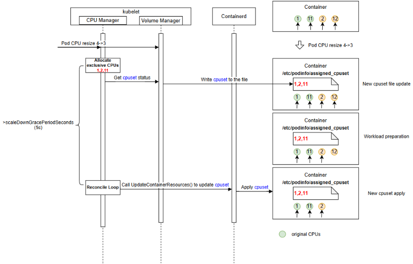
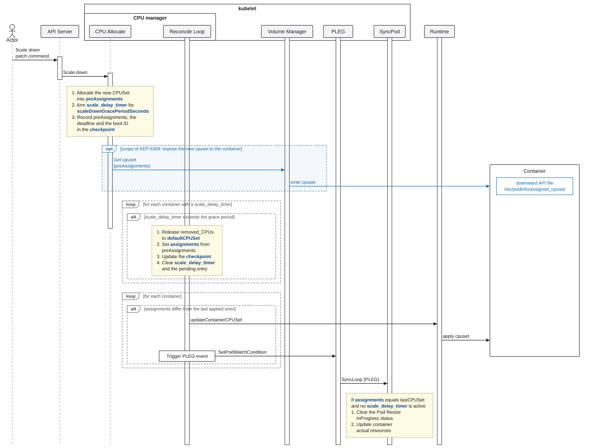
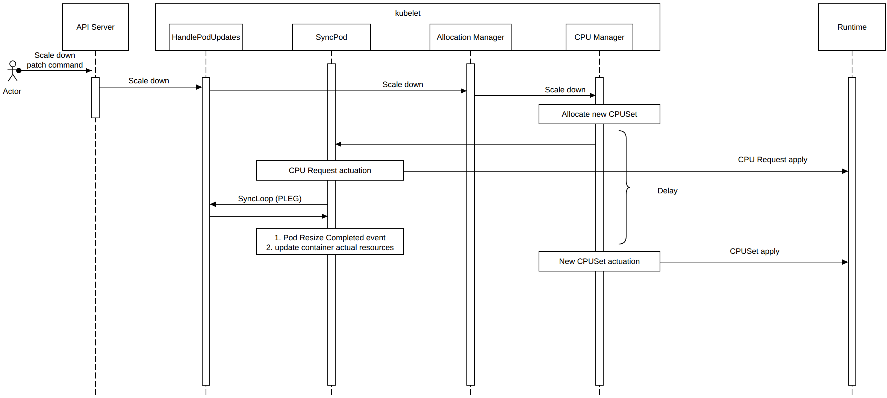
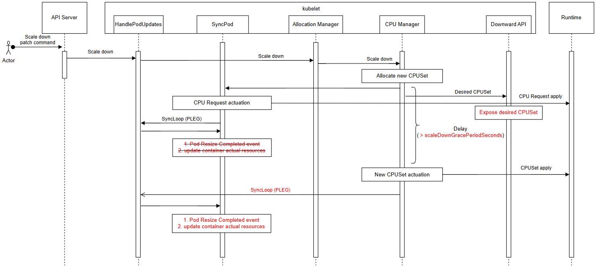
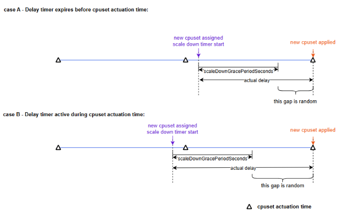

# KEP-6122: Configurable Scaling Delay

<!-- toc -->
- [Release Signoff Checklist](#release-signoff-checklist)
- [Summary](#summary)
- [Motivation](#motivation)
  - [Goals](#goals)
  - [Non-Goals](#non-goals)
- [Proposal](#proposal)
  - [User Stories](#user-stories)
    - [Story 1: Scale-Down with Preparation Window](#story-1-scale-down-with-preparation-window)
    - [Story 2: Immediate Scale-Up](#story-2-immediate-scale-up)
    - [Story 3: Immediate Scale-Down for Delay-Tolerant Workloads](#story-3-immediate-scale-down-for-delay-tolerant-workloads)
  - [Notes/Constraints/Caveats](#notesconstraintscaveats)
  - [Risks and Mitigations](#risks-and-mitigations)
- [Design Details](#design-details)
  - [Implementation](#implementation)
    - [Pod API Extension](#pod-api-extension)
    - [Node Declared Features Integration](#node-declared-features-integration)
    - [Grace Period Not Honored](#grace-period-not-honored)
    - [Scale Down Delay in CPU Manager](#scale-down-delay-in-cpu-manager)
      - [Scale-Down Delay Timing](#scale-down-delay-timing)
      - [Consecutive Scaling](#consecutive-scaling)
      - [Kubelet Restart](#kubelet-restart)
    - [Resize Complete State](#resize-complete-state)
    - [Actual Resources Update](#actual-resources-update)
    - [Metrics](#metrics)
  - [Test Plan](#test-plan)
      - [Prerequisite testing updates](#prerequisite-testing-updates)
      - [Unit tests](#unit-tests)
      - [Integration tests](#integration-tests)
      - [e2e tests](#e2e-tests)
  - [Graduation Criteria](#graduation-criteria)
    - [Alpha](#alpha)
    - [Beta](#beta)
    - [GA](#ga)
    - [Deprecation](#deprecation)
  - [Upgrade / Downgrade Strategy](#upgrade--downgrade-strategy)
  - [Version Skew Strategy](#version-skew-strategy)
- [Production Readiness Review Questionnaire](#production-readiness-review-questionnaire)
  - [Feature Enablement and Rollback](#feature-enablement-and-rollback)
  - [Rollout, Upgrade and Rollback Planning](#rollout-upgrade-and-rollback-planning)
  - [Monitoring Requirements](#monitoring-requirements)
  - [Dependencies](#dependencies)
  - [Scalability](#scalability)
  - [Troubleshooting](#troubleshooting)
- [Implementation History](#implementation-history)
- [Drawbacks](#drawbacks)
- [Alternatives](#alternatives)
  - [1. LIFO (Last-In, First-Out) CPU Release](#1-lifo-last-in-first-out-cpu-release)
  - [2. CPU Release Based on Real-Time Usage](#2-cpu-release-based-on-real-time-usage)
  - [3. Immediate Actuation (No Delay)](#3-immediate-actuation-no-delay)
  - [4. Handshake-Based Synchronization](#4-handshake-based-synchronization)
  - [5. Node-Level Scale Delay as CPU Manager Option](#5-node-level-scale-delay-as-cpu-manager-option)
  - [6. Node Declared Features as Opt-Out Mechanism](#6-node-declared-features-as-opt-out-mechanism)
  - [7. Hook-Based Synchronization Approach](#7-hook-based-synchronization-approach)
  - [8. Generalizing Scale-Down Delay to Other Resource Types](#8-generalizing-scale-down-delay-to-other-resource-types)
  - [9. No Persistence of Pending Scale-Down State](#9-no-persistence-of-pending-scale-down-state)
- [Infrastructure Needed](#infrastructure-needed)
<!-- /toc -->

## Release Signoff Checklist

Items marked with (R) are required *prior to targeting to a milestone / release*.

- [X] (R) Enhancement issue in release milestone, which links to KEP dir in [kubernetes/enhancements] (not the initial KEP PR)
- [ ] (R) KEP approvers have approved the KEP status as `implementable`
- [X] (R) Design details are appropriately documented
- [X] (R) Test plan is in place, giving consideration to SIG Architecture and SIG Testing input (including test refactors)
  - [ ] e2e Tests for all Beta API Operations (endpoints)
  - [ ] (R) Ensure GA e2e tests meet requirements for [Conformance Tests](https://github.com/kubernetes/community/blob/master/contributors/devel/sig-architecture/conformance-tests.md)
  - [ ] (R) Minimum Two Week Window for GA e2e tests to prove flake free
- [X] (R) Graduation criteria is in place
  - [ ] (R) [all GA Endpoints](https://github.com/kubernetes/community/pull/1806) must be hit by [Conformance Tests](https://github.com/kubernetes/community/blob/master/contributors/devel/sig-architecture/conformance-tests.md) within one minor version of promotion to GA
- [ ] (R) Production readiness review completed
- [ ] (R) Production readiness review approved
- [X] "Implementation History" section is up-to-date for milestone
- [ ] User-facing documentation has been created in [kubernetes/website], for publication to [kubernetes.io]
- [ ] Supporting documentation—e.g., additional design documents, links to mailing list discussions/SIG meetings, relevant PRs/issues, release notes

[kubernetes.io]: https://kubernetes.io/
[kubernetes/enhancements]: https://git.k8s.io/enhancements
[kubernetes/kubernetes]: https://git.k8s.io/kubernetes
[kubernetes/website]: https://git.k8s.io/website

## Summary

This proposal introduces a new pod-level field, `scaleDownGracePeriodSeconds`, which lets a pod declare a minimum delay before a new cpuset is applied to its containers after a scale-down event. Pods that do not set the field keep the current behavior: the new cpuset is applied at the next cpuset actuation, with no added delay.

The delay gives a latency-sensitive workload a guaranteed window in which to prepare for the removal of CPUs from its cpuset — for example by migrating tasks away from the affected cores — so that performance degradation caused by sudden CPU loss is avoided. Learning *which* CPUs are about to be removed is the subject of the companion [KEP-6369](https://github.com/kubernetes/enhancements/issues/6369), which exposes the assigned cpuset through the Downward API.

## Motivation

Latency-sensitive applications often require exclusive CPUs to achieve predictable performance and resource isolation. These applications commonly use CPU affinity to minimize performance degradation caused by CPU migration.

When scaling down, guaranteed QoS pods need to know in advance which CPUs will be removed from their cpuset, and they need time to act on that before the removal happens. Together this allows latency-sensitive applications to take preparatory actions — such as migrating workloads away from affected CPUs — and avoid performance degradation caused by CPU migration and core sharing during the removal of active CPUs. This KEP provides the time; the information is provided by [KEP-6369](https://github.com/kubernetes/enhancements/issues/6369).

This KEP depends on [KEP-1287](https://github.com/kubernetes/enhancements/blob/master/keps/sig-node/1287-in-place-update-pod-resources/README.md), which allows Pods (without exclusive CPUs) to update their resource requests and limits in-place, and [KEP-5554](https://github.com/kubernetes/enhancements/blob/master/keps/sig-node/5554-in-place-update-pod-resources-alongside-static-cpu-manager-policy/README.md), which extends this feature to support guaranteed QoS Pods with exclusive CPUs to resize without restarts. The scale-down delay feature only applies to in-place resize enabled by KEP-1287 and exclusive CPUs resize enabled by KEP-5554.

> **Note:** This KEP was originally considered as part of KEP-5554 but was separated to keep KEP-5554 focused on the core scaling functionality. It initially covered two complementary features; the exposure of assigned CPU sets via the Downward API was then moved into its own [KEP-6369](https://github.com/kubernetes/enhancements/issues/6369), leaving this KEP focused on the scale-down delay alone. Both features are independent of the basic scaling mechanism and can be implemented and adopted separately.

> **Note:** This KEP introduces one new feature gate, `InPlacePodVerticalScalingExclusiveCPUsScaleDownDelay`, which requires `InPlacePodVerticalScalingExclusiveCPUs` to be enabled as well. The dependency is enforced at kubelet startup by the [feature gate dependency functionality](https://github.com/kubernetes/kubernetes/pull/133697).

### Goals

* Allow pods to optionally specify a scale-down grace period via the `scaleDownGracePeriodSeconds` field in the Pod spec.
* When a pod specifies `scaleDownGracePeriodSeconds`, wait at least that duration before applying the new cpuset configuration when a container scales down.
* The `scaleDownGracePeriodSeconds` value must be between 0s and 10s. Setting it to 0s or leaving it unset disables the delay before applying the cpuset, preserving the existing behavior. The 10s maximum bounds how long a pod can hold CPUs it no longer requests, since those CPUs are not available to other pods until the delay expires.

### Non-Goals

* Add new CPU manager policies.
* Allow containers to specify which CPUs to remove during scale-down.
* **Per-container grace periods:** `scaleDownGracePeriodSeconds` is a pod-level field, so a single value applies to every container in the pod, even though cpusets are assigned per container. Allowing a different grace period per container is out of scope.
* **Scale-down delay for PodLevelResourceManagers:** [KEP-5554](https://github.com/kubernetes/enhancements/blob/master/keps/sig-node/5554-in-place-update-pod-resources-alongside-static-cpu-manager-policy/README.md) and [KEP-5526](https://github.com/kubernetes/enhancements/issues/5526) were developed in parallel and both assumed they do not cover scaling exclusive CPUs for pods that define pod-level resources. Because this KEP builds on KEP-5554 for the underlying scaling mechanism, it inherits the same limitation: the scale-down delay does not apply to resources managed by `PodLevelResourceManagers`. However, the delay mechanism is opt-in at the pod level (not per container), so if scaling exclusive CPUs managed by `PodLevelResourceManagers` is introduced in the future, extending the delay to cover the pod-level CPU bubble should be straightforward, but currently it is out of scope of this KEP.

## Proposal

This proposal introduces a new pod-level field, `scaleDownGracePeriodSeconds`, which specifies the minimum delay before applying an updated cpuset when a container has its CPU allocation scaled down. This field is opt-in; for pods that do not specify it (or set it to 0), the new cpuset is applied at the next cpuset actuation, preserving the existing behavior.

During the delay window, the container continues to use the current cpuset for at least the configured grace period. This allows latency-sensitive workloads to monitor and prepare for the upcoming CPUSet change before CPU(s) are removed from the container. The minimum delay must be guaranteed at all times, including during kubelet restarts.

This proposal does not require a handshake (acknowledgment) from the workload. The workload declares its needed preparation time via `scaleDownGracePeriodSeconds`, and the kubelet guarantees to honor this time window without requiring explicit feedback from the application.

### User Stories

#### Story 1: Scale-Down with Preparation Window

As a workload developer running latency-sensitive applications with exclusive CPUs (e.g., DPDK workers), I want a guaranteed delay between the moment my pod's CPU allocation is scaled down and the moment the new, smaller cpuset is actually applied to my containers, so that I have a bounded window in which to learn which CPUs are being removed and prepare for their loss — for example by migrating tasks away from the affected cores — before they are taken from me.

Consider a pod with one container allocated 4 CPUs — `{1, 2, 11, 12}` — where `{1, 11}` are the initially assigned CPUs and DPDK workers are deployed on each core. The pod spec sets `scaleDownGracePeriodSeconds: 5`, requesting a 5-second preparation window for scale-down events.

When the container's CPU request scales down from 4 to 3, the CPU manager computes the new cpuset `{1, 2, 11}`. The kubelet starts a 5-second timer and holds the current cpuset `{1, 2, 11, 12}` for at least that long. During this window the container learns the upcoming cpuset through the companion [KEP-6369](https://github.com/kubernetes/enhancements/issues/6369) — which is out of scope here and not required for the delay itself — and performs the necessary preparations for the DPDK workers, such as migrating tasks from CPU 12 to the remaining cores. Only after at least 5 seconds (the pod's specified `scaleDownGracePeriodSeconds`) does the kubelet apply the new cpuset `{1, 2, 11}` and mark the container resize as successful.



#### Story 2: Immediate Scale-Up

As a workload developer running latency-sensitive applications with exclusive CPUs, I want scale-up events to take effect immediately — with no delay — so that my application can start using the newly assigned CPUs as soon as they are available, and only then migrate additional tasks onto them once the resize is complete.

Consider the same pod from Story 1, now scaling up from 3 CPUs back to 4. The container's current cpuset is `{1, 2, 11}` and the CPU manager computes the new cpuset `{1, 2, 11, 12}`, re-assigning CPU 12. Because no CPUs are being removed, there is nothing to evacuate and no preparation window is needed: the `scaleDownGracePeriodSeconds` field does not apply. The kubelet applies the new cpuset `{1, 2, 11, 12}` at the next cpuset actuation. Once the new cpuset is in place, the container can migrate additional tasks onto the newly gained CPU 12 at its own pace, taking advantage of the extra capacity without any urgency.

#### Story 3: Immediate Scale-Down for Delay-Tolerant Workloads

As a workload developer running applications on exclusive CPUs that are designed to tolerate the loss of cores at any time — for example because they are stateless, horizontally scaled, or use work-stealing schedulers that adapt to changing CPU availability — I want scale-down events to take effect immediately with no delay, so that the CPUs I no longer need are released as fast as possible and become available to other pods on the node.

My application does not require a preparation window before CPUs are removed: it can absorb the sudden loss of a core without performance degradation, because its workloads are distributed across all available CPUs and any in-flight tasks on a removed core are simply re-scheduled elsewhere. To opt out of the delay introduced by this KEP, I simply do not set `scaleDownGracePeriodSeconds` in my pod spec. The kubelet then applies the new, smaller cpuset at the next cpuset actuation, exactly as it does today, and the freed CPUs are immediately available for other pods to claim.

### Notes/Constraints/Caveats

- **The delay is a minimum, not an exact duration.** The kubelet applies the new cpuset at the first reconcile loop after the timer expires, so the actual delay is at least `scaleDownGracePeriodSeconds` but may be slightly longer.
- **Actual resources are not updated until the cpuset is applied.** During the delay the scheduler still sees the old CPU allocation. Updating actual resources earlier (from `cpu.weight`) would let the scheduler place a new pod on CPUs the kubelet has not yet released, causing an `UnexpectedAdmissionError`.

### Risks and Mitigations

**A pod's grace period is not honored by the node:** A pod that sets `scaleDownGracePeriodSeconds` could run on a kubelet where the feature gate is disabled, and have its cpuset changed with no preparation window.

**Mitigation:** kube-apiserver rejects the field while the gate is disabled, so it cannot be set in a cluster that does not support the feature, and the scheduler only places such pods on nodes that declare it. The remaining case is a gate flip on a node that already runs the pod; the kubelet then resizes it without the delay and reports this via the `PodResizeInProgress` condition and an event, rather than killing a running pod — see [Grace Period Not Honored](#grace-period-not-honored).

**Workload may not complete preparations within the delay window:** The kubelet guarantees only that the cpuset will not be applied before `scaleDownGracePeriodSeconds` has elapsed. There is no synchronization mechanism between the workload and kubelet — if the workload fails to complete its preparations (e.g., workload migration, draining tasks) within the delay window, the cpuset change is applied anyway. This is an inherent limitation of keeping kubelet independent from workload state.

**Mitigation:** Application developers should configure `scaleDownGracePeriodSeconds` based on the worst-case preparation time required by their latency-sensitive workloads. Workloads should be designed to handle premature CPU removal gracefully (e.g., by quickly migrating tasks to remaining CPUs or tolerating brief performance degradation). Early notification of the upcoming change, which gives a workload the maximum possible preparation time, is provided by [KEP-6369](https://github.com/kubernetes/enhancements/issues/6369).

**Security Considerations:** The scale-down delay exposes no new information and creates no new data recipients; it only changes *when* an already-decided cpuset is applied. The security considerations of exposing the assigned cpuset itself belong to [KEP-6369](https://github.com/kubernetes/enhancements/issues/6369).

## Design Details

### Implementation

The overview of the design:


The basic flow shown in the diagram is as follows:
- During allocation of new CPUSets, changes are not applied to assignments immediately but kept in preAssignments, and `scale_delay_timers` are started.
- The preAssignments and the time at which the cpuset may be applied are recorded in the CPU manager checkpoint.
- The new CPUSets kept in preAssignments are the values [KEP-6369](https://github.com/kubernetes/enhancements/issues/6369) exposes to the container.
- During cpuset actuation, containers scaling down (with active `scale_delay_timer`) are skipped if the pod's `scaleDownGracePeriodSeconds` has not yet elapsed. For those where the time has passed, preAssignments are written to assignments and actuated in containers.
- The SyncPod performs two actions after there is no active `scale_delay_timer` on the pod, and actuated states equal the allocated ones:
  - Marking the resize as completed
  - Updating the actual resources

When a scale-down operation is started and accepted for processing, it is handled by the AllocationManager. The AllocationManager delegates allocation of new CPUSets to the CPUManager. The CPUManager allocates new CPUs, and at this point the synchronous control of resize is completed.

There are 2 more asynchronous actions:
1. The CPUManager actuates the cpuset in the container to reflect the allocated state.
2. The SyncPod loop updates actual resources and marks the pod resize as completed when all actuated states equal the allocated ones.

The existing flow (before applying this KEP) among AllocationManager, CPUManager, and SyncPod is as follows:



The flow after the modifications introduced by this KEP is as follows:



Regarding the ownership of resize:
- **AllocationManager** is responsible for accepting resize and triggering the allocation phase. This KEP does not modify this part.
- **CPUManager** is responsible for:
  - Allocating CPUs (with this KEP, when scaling down, starting a scale_delay_timer and saving the new cpuset in preAssignments).
  - Actuating cpuset in containers (with this KEP, after the scale_delay_timer expires, applying the new cpuset).
- **SyncPod loop** is responsible for
  - Updating pod resize status (with this KEP, clears PodResizeInProgress when all actuated states equal the allocated ones).
  - Updating container actual resources (with this KEP, update actual resources when actuated states equal the allocated ones).

#### Pod API Extension

A new optional pod-level field `scaleDownGracePeriodSeconds` is added to `PodSpec`, modelled on `terminationGracePeriodSeconds`:

```go
type PodSpec struct {
	// ...
	// Optional duration in seconds the pod needs to prepare for the removal of exclusive
	// CPUs during an in-place scale-down. The kubelet does not apply the new cpuset sooner
	// than this duration after the new cpuset has been allocated.
	// Value must be in the range [0, 10]. An unset field or the value zero
	// adds no delay: the new cpuset is applied at the next cpuset actuation, with no preparation window. This field is
	// immutable. It is honored only for containers with exclusive CPUs, and only when the
	// InPlacePodVerticalScalingExclusiveCPUsScaleDownDelay feature gate is enabled.
	// +optional
	ScaleDownGracePeriodSeconds *int64
}
```

| Property | Behavior |
|---|---|
| Scope | Pod-level: applies to every container in the pod that scales down exclusive CPUs |
| Range | `[0, 10]` seconds, validated by kube-apiserver; values outside the range are rejected |
| Unset (`nil`) or `0` | No added delay — the cpuset is applied at the next cpuset actuation. This is the default and preserves the behavior from before this KEP |
| Mutability | Immutable: rejected by `ValidatePodUpdate`, including as part of a resize request |
| Feature gate disabled, pod creation | The pod is rejected in validation; the value is never dropped, so there is no `dropDisabledFields` handling for this field |
| Feature gate disabled, pod update | Accepted if the old spec already carries the field, so that disabling the gate does not block updates of pods already using it |

Validation re-checks the whole spec on every update, not only what changed, so without that second rule disabling the gate would make every update to a pod that already carries the field fail — including the resize this KEP exists to serve. Permitting a value that is already in use (validation ratcheting) is the established pattern for gated values in the Pod API.

The upper bound of 10s is needed because the CPUs being released are not returned to the shared pool until the delay expires, so another pod on the node cannot claim them in the meantime. The cap bounds how long a single pod can hold onto CPUs it no longer requests, while still covering the preparation time reported for DPDK-style workloads.

The field is a pointer so that `nil` remains distinguishable from an explicit `0`, leaving `nil` free to mean "inherit a default" if a node- or namespace-level default is added later. `terminationGracePeriodSeconds` is a pointer for the same reason.

#### Node Declared Features Integration

Rejecting the field in kube-apiserver guarantees that an accepted pod was admitted by a cluster that understands `scaleDownGracePeriodSeconds`. It does not guarantee that the node the pod lands on honors it, because the feature gate is per-kubelet. That gap is closed with the Node Declared Features framework ([KEP-5328](https://github.com/kubernetes/enhancements/tree/master/keps/sig-node/5328-node-declared-features), GA since v1.37).

When the `InPlacePodVerticalScalingExclusiveCPUsScaleDownDelay` feature gate is enabled, the kubelet declares `InPlacePodVerticalScalingExclusiveCPUsScaleDownDelay` in `node.status.declaredFeatures` during bootstrap. The scheduler infers that a pod setting `scaleDownGracePeriodSeconds` requires the feature and only places it on nodes that declare it, which keeps such a pod off a node that would ignore its grace period.

Once the feature graduates to GA and the feature gate is removed, every kubelet honors the field unconditionally and the declared feature is no longer needed.

#### Grace Period Not Honored

Scheduler filtering leaves one case open: the feature gate is turned off on a node that already runs a pod which sets `scaleDownGracePeriodSeconds` (a gate flip together with a node restart). Here the kubelet does **not** reject the pod, unlike the default handling in KEP-5328 — killing a running latency-sensitive pod is worse than resizing it without the preparation window. Instead the kubelet applies the new cpuset without the delay and reports the skipped grace period:

- the `PodResizeInProgress` condition ([KEP-1287](https://github.com/kubernetes/enhancements/tree/master/keps/sig-node/1287-in-place-update-pod-resources)) carries a message stating that the grace period was not honored,
- the kubelet emits an event with reason `ScaleDownGracePeriodNotHonored`.

Neither requires a new API type.

#### Scale Down Delay in CPU Manager

The CPU Manager reads `scaleDownGracePeriodSeconds` from the spec of the pod being resized. When it is unset or `0`, scale-down behaves exactly as it did before this KEP.

1. In the Allocate CPU stage:
   Allocate a new CPUSet based on the container's assignments and defaultCPUset in the checkpoint (all references to "checkpoint" below refer to cpu_manager_state).

   When a container scales down (if the CPU number of assignments in the checkpoint > CPU request and limit for the container in the pod spec):
   - If `scaleDownGracePeriodSeconds` is unset or 0, the container's scale down behavior is the same as before, after reallocating the new cpuset:
     - The removed_CPUs (assignments in checkpoint - new cpuset) are added to the defaultCPUset
     - The container's assignments are updated to the new cpuset
     - CPU manager checkpoint is updated immediately with new assignments and defaultCPUSet.
   - If `scaleDownGracePeriodSeconds` is greater than 0, after reallocating the new cpuset:
     - A scale_delay_timer is started with the pod's `scaleDownGracePeriodSeconds` as its duration.
     - The new cpuset is saved in preAssignments, and both the preAssignments and the time at which the cpuset may be applied are recorded in the CPU manager checkpoint (see [Kubelet Restart](#kubelet-restart)).

   When a container scales up (if the CPU number of assignments in the checkpoint <= CPU request and limit for the container in the pod spec), after reallocating the new cpuset:
   - The added_CPUs (new cpuset - assignments in checkpoint) are removed from the defaultCPUset.
   - The container's assignments are updated.
   - CPU manager checkpoint is updated immediately with new assignments and defaultCPUSet.
   - The scale_delay_timer and preAssignment are cleared if they exist.

2. When cpuset actuation time is reached:
   If scale_delay_timer exists for a container, and after the scale_delay_timer has expired:
   - The removed_CPUs (assignments in checkpoint - preAssignments) are released to the defaultCPUset.
   - The container's assignments are updated to preAssignments.
   - CPU manager checkpoint is updated immediately with new assignments and defaultCPUSet.
   - The scale_delay_timer and preAssignments are cleared.

   If the cpuset (assignments) differs from lastCPUSet for a container:
   - The CPUSet(assignments) is applied to the container by the runtime.
   - If the CPUSet(assignments) is an exclusive CPUSet, a PLEG event is triggered.

Note: a pending scale-down survives a kubelet restart and its delay is not restarted — see [Kubelet Restart](#kubelet-restart).

##### Scale-Down Delay Timing

From the time a new cpuset is allocated to when it is actually applied, there is a delay. The minimum guaranteed delay before the new cpuset is applied is the pod's `scaleDownGracePeriodSeconds`. The actual delay may be longer, depending on when the cpuset actuation occurs, but is guaranteed to be no less than `scaleDownGracePeriodSeconds`.

The following diagrams illustrate the two cases.



**Case A: Timer expires before cpuset actuation time** — The scale_delay_timer expires between two cpuset actuation times. Since the timer has already expired when the next actuation time arrives, the new cpuset is applied at that actuation time as it normally would. In this case, the scale_delay_timer does not affect the actual time when the cpuset is applied.

**Case B: Timer active during cpuset actuation time** — The scale_delay_timer is still active when the next cpuset actuation time arrives. The new cpuset cannot be applied at this actuation time because the timer has not yet expired. It is applied at the next actuation time after the timer expires. In this case, the actual delay is longer than it would be without the timer.

In both cases, the actual delay is at least `scaleDownGracePeriodSeconds`, but may be longer due to the gap between timer expiry and the cpuset actuation time.

##### Consecutive Scaling

When another scale-down request arrives while a scale-down is already in progress (i.e., the scale_delay_timer is active), the CPU Manager allocates a new cpuset (which is stored in preAssignments, replacing the previous one) and resets the timer, so the delay starts again from the beginning.

When a scale-up request arrives while a scale-down is in progress, the behavior depends on the resulting CPU count:

- **If the new CPU count is greater than or equal to the original (pre-scale-down) CPU count**, it is effectively a scale-up: the assignments are updated directly (not via preAssignments), and the scale_delay_timer and preAssignments are cleared.
- **If the new CPU count is still lower than the original CPU count**, it is effectively a scale-down: the preAssignments are updated with the new cpuset, and the scale_delay_timer is reset.

##### Kubelet Restart

A pending scale-down is persisted in the CPU Manager checkpoint, so that a kubelet restart neither restarts the delay nor recomputes the target cpuset. For each container with a pending scale-down the checkpoint holds:

- the **preAssignments**, so the cpuset already exposed to the workload is the one eventually applied,
- the **time at which the new cpuset may be applied**, expressed as monotonic time since boot, not counting time spent suspended,
- the **node's boot ID**, read locally from cAdvisor (the same value the kubelet publishes in `node.status.nodeInfo.bootID`).

Wall-clock time is deliberately not used: serializing a `time.Time` discards its monotonic reading and leaves only a wall clock, which is exposed to NTP steps, manual changes and timezone handling. Monotonic time since boot advances steadily by kernel guarantee, but it is comparable only within a single boot — which is what the boot ID establishes. How the value is represented in the checkpoint is an implementation detail.

A container with no persisted entry needs no special handling. For an entry that does exist, the kubelet evaluates the following in order:

| Check | Decision |
|---|---|
| The feature gate is disabled | Ignore the persisted fields. The resize is then processed without a delay, as described in [Grace Period Not Honored](#grace-period-not-honored) |
| The boot ID differs from the current one | The node rebooted, so every container process is new and was never notified: drop the entry. If the pod spec still requests fewer CPUs, admission treats it as a new resize and the container gets a fresh, full grace period |
| The CPU request in the pod spec matches the number of assignments in the checkpoint | The scale-down was reverted while the kubelet was down: drop the entry. No CPUs were ever released |
| The CPU request does not match the number of preAssignments | The request changed again while the kubelet was down: treat it as [Consecutive Scaling](#consecutive-scaling), allocating a new cpuset and starting a new grace period only if this is still a scale-down |
| The stored time has passed | Apply the new cpuset |
| Otherwise | Keep the entry unchanged; the reconcile loop applies the new cpuset once the stored time is reached |

Because the grace period comes from the immutable pod field, the stored time never needs to be recomputed.

Releasing CPUs waits until the kubelet's pod sources are synced, the same condition the CPU Manager already applies before discarding stale state. Without it the reconcile loop could release CPUs before the pods are re-admitted, so a scale-down that had been reverted during the downtime would be applied and then immediately undone, possibly on different CPUs.

#### Resize Complete State
The pod resize completed event (Pod Lifecycle Event) is not emitted until the new cpuset has been successfully applied to all containers in the pod. Only then is the pod resize considered complete.

In SyncPod(), the Pod Resize InProgress status is cleared only when the allocated cpusets equal actuated ones and no scale_delay_timer is active for any container, in addition to the existing conditions. This indicates the pod resize is complete.
These new conditions are evaluated by the CPU Manager, which is queried from SyncPod() via the Container Manager.

#### Actual Resources Update

The actual resources are used by the scheduler to calculate the available CPU number for the node (see [KEP-1287](https://github.com/kubernetes/enhancements/tree/master/keps/sig-node/1287-in-place-update-pod-resources#scheduler-and-api-server-interaction)). The actual resources reflect the container resource current state, reported by the runtime.

When a pod resize passes admission, the CPU request is applied immediately (updating cpu.weight in cgroup v2), but the cpuset is applied after a delay. Therefore, in `convertToAPIContainerStatuses`, before the cpuset is applied, the actual resources are not updated; after the cpuset is applied (i.e., after at least `scaleDownGracePeriodSeconds` has elapsed and the new cpuset is applied), the actual resources are converted to the current cpu.weight value.

Note: Before the checkpoint is updated and the cpuset is applied, if the runtime-reported CPU resource request (value from cpu.weight in cgroup v2) were used to update the actual resources during the delay, it would cause a mismatch between the available CPU number reported to the scheduler and the actual available CPUs in kubelet. This would result in a new pod being scheduled to the node but failing to allocate CPU resources, leading to an `UnexpectedAdmissionError`. Deferring the actual resources update until after cpuset application prevents this scenario from occurring.

#### Metrics

The kubelet exports the following metrics, all at ALPHA stability level. They are registered with the `kubelet` subsystem and a `cpu_manager_` name prefix, the way the existing CPU Manager metrics are, so their full names carry both.

| Metric | Type | Help |
|---|---|---|
| `cpu_manager_scale_down_delay_started_total` | Counter | Number of scale-down delays started. |
| `cpu_manager_scale_down_delay_completed_total` | Counter | Number of scale-down delays that completed, applying the pending cpuset. |
| `cpu_manager_scale_down_pending_cpu_count` | Gauge | Number of CPUs still assigned to a container but already earmarked for release, and therefore unavailable to other pods. |

A delay is *started* when a new cpuset is recorded in preAssignments and its timer is armed, including a re-arm under [Consecutive Scaling](#consecutive-scaling), and *completes* when that cpuset has been applied. The *started* and *completed* counters track these events independently, and their difference represents the number of delays that never completed: still pending, superseded, or dropped on restore (see [Kubelet Restart](#kubelet-restart)).

The gauge sums, over containers with a pending scale-down, the CPUs that will be released once the resize completes: those present in assignments but absent from preAssignments. If it does not return to zero, a delayed release is stuck.

### Test Plan

[X] I/we understand the owners of the involved components may require updates to
existing tests to make this code solid enough prior to committing the changes necessary
to implement this enhancement.

##### Prerequisite testing updates

None

##### Unit tests

We plan on adding or extending tests in the following files.

Pod API field:
- `pkg/apis/core/validation/validation_test.go`: `2026-09-19` - `88.4%` — the `[0, 10]` range, rejection of the field on creation while the feature gate is disabled, immutability on update including as part of a resize, and acceptance on update when the old spec already carries the field.
- `pkg/api/pod/util_test.go`: `2026-09-19` - `72.1%` — wiring the feature gate into the pod validation options, and the ratcheting rule that keeps the value allowed once it is in use.

Scale-down delay in the CPU Manager:
- `pkg/kubelet/cm/cpumanager/policy_static_test.go`: `2026-09-19` - `97.3%` — recording a pending scale-down, applying it once the grace period has elapsed, consecutive scaling in both directions, and an unset or zero `scaleDownGracePeriodSeconds`.
- `pkg/kubelet/cm/cpumanager/cpu_assignment_test.go`: `2026-09-19` - `98.1%` — the cpuset computed for a scale-down.
- `pkg/kubelet/cm/cpumanager/cpu_manager_test.go`: `2026-09-19` - `85.9%` — the reconcile loop applying an expired pending scale-down, waiting for the pod sources to be synced before releasing CPUs, and the [Metrics](#metrics) counters and gauge across the arm, complete and drop paths.
- `pkg/kubelet/cm/cpumanager/topology_hints_test.go`: `2026-09-19` - `87.1%` — topology hints while a scale-down is pending.

Checkpoint persistence:
- `pkg/kubelet/cm/cpumanager/state/state_checkpoint_test.go`: `2026-09-19` - `74.5%` — round-trip of the persisted pending scale-down, restoring a checkpoint written without it, restoring with the feature gate disabled, and tolerance of unknown fields.
- `pkg/kubelet/cm/cpumanager/state/state_test.go`: `2026-09-19` - `88.4%` — removing a container or clearing the state also removes its pending scale-down.
- `pkg/kubelet/cm/cpumanager/policy_static_restore_test.go`: `2026-09-19` - `97.3%` — every row of the restart decision table — a mismatched boot ID, a stored time that has and has not elapsed, and a request reverted or changed again while the kubelet was down.
- `pkg/kubelet/util`: `2026-09-19` - `81.5%` — the helper returning monotonic time since boot, with a test per supported platform alongside the existing boot-time helpers.

Node Declared Features:
- `staging/src/k8s.io/component-helpers/nodedeclaredfeatures/features`: `2026-09-19` - `88.8%` — a new package declaring this feature and its registration, following the per-feature packages already present there.

Reporting and resize completion:
- `pkg/kubelet/allocation/allocation_manager_test.go`: `2026-09-19` - `86.2%` — the `PodResizeInProgress` condition and the event emitted when a grace period cannot be honored.
- `pkg/kubelet/kubelet_pods_test.go`: `2026-09-19` - `84.6%` — deferring the actual resources update until the new cpuset has been applied.

##### Integration tests

Integration tests cover the two behaviors that are out of reach for `e2e_node`, which runs a single node and exercises the kubelet:

- **Validation ratcheting**: with the feature gate disabled in kube-apiserver, creating a pod that sets `scaleDownGracePeriodSeconds` is rejected, while updating a pod that already carries the field — including through a resize request — is accepted.
- **Scheduler filtering**: a pod that sets `scaleDownGracePeriodSeconds` is placed only on nodes declaring `InPlacePodVerticalScalingExclusiveCPUsScaleDownDelay`, and stays unschedulable while no such node exists.

Both are control plane behaviors driven by the feature gate, which an integration test can exercise without standing up a cluster.

##### e2e tests

These cases will be added to the existing e2e_node tests to verify that the CPU Manager honors a pod's `scaleDownGracePeriodSeconds`.

Prerequisites:

1. Enable the following feature gates:
    * `InPlacePodVerticalScalingExclusiveCPUs`
    * `InPlacePodVerticalScalingExclusiveCPUsScaleDownDelay`
2. Configure the CPU Manager policy as `static`.
3. Pods under test set `scaleDownGracePeriodSeconds` in their spec.

The restart decision table in [Kubelet Restart](#kubelet-restart) is covered row by row by unit tests. The cases below take only the situations where a real node matters: that the grace period is not re-armed, a node reboot, and a kubelet outage longer than the grace period.

The following scenarios will be tested:

| No | Test | Description | Expected Result |
|----|------|-------------|-----------------|
| 1 | Validate Scale-Down Delay | Initiate a scale-down request for a container and verify the operation timing against the pod's `scaleDownGracePeriodSeconds`. | • Verify the pod is successfully patched for scale-down<br />• Verify the pod scales down only after the grace period has elapsed<br />• Verify the final resources allocated to the pod after the resize |
| 2 | Resource Allocation Blocking | Initiate a scale-down request for Pod 1 and attempt to allocate the CPU resources being released from Pod 1 to Pod 2 before the grace period expires. | • Verify Pod 1's scale-down request is pending and new cpuset has not yet been applied<br />• Verify Pod 2 cannot allocate the CPUs held by Pod 1 until the grace period has fully elapsed<br />• Verify Pod 2 successfully resizes and claims the CPUs only after Pod 1's grace period expires |
| 3 | Validate Scale-Up Before Timer Expiry | Initiate a scale-down request and, before the grace period expires, send a scale-up request for the container CPU. | • Verify the pending scale-down request is cleared<br />• Verify the pod scales up as requested<br />• Verify the resources allocated to the pod match the latest requested scale-up configuration |
| 4 | Validate Repeated Scale-Down Before Timer Expiry | Initiate a scale-down request and, before the grace period expires, send another, different scale-down request for the container CPU. | • Verify the initial pending scale-down request is replaced by the latest one<br />• Verify the pod scales down following the latest request after the grace period expires<br />• Verify the resources allocated to the pod match the final scaled-down configuration |
| 5 | Grace Period Is Not Re-Armed by a Kubelet Restart | Initiate a scale-down request and restart the kubelet before the grace period expires. | • Verify the pending scale-down survives the restart with its target cpuset unchanged<br />• Verify the total time from the resize request to the cpuset change is approximately one grace period, not two |
| 6 | Kubelet Outage Longer Than the Grace Period | Initiate a scale-down request and keep the kubelet down until after the grace period would have expired. | • Verify the new cpuset is applied on the first reconcile after the kubelet restarts and its pod sources are synced |
| 7 | Node Reboot Before Timer Expiry | Initiate a scale-down request and reboot the node before the grace period expires. | • Verify the persisted pending scale-down is discarded, because the boot ID no longer matches<br />• Verify the container is given a fresh, full grace period before the new cpuset is applied |
| 8 | Grace Period Not Honored | Disable the feature gate on the kubelet of a node already running a pod that sets `scaleDownGracePeriodSeconds`, then initiate a scale-down request. | • Verify the pod keeps running and is not rejected<br />• Verify the new cpuset is applied without a delay<br />• Verify the `PodResizeInProgress` condition reports that the grace period was not honored and a `ScaleDownGracePeriodNotHonored` event is emitted |
| 9 | Feature Gate Rollback | With the gate enabled, create a pod that sets `scaleDownGracePeriodSeconds` and scale it down. Then disable the gate on kube-apiserver and the kubelet and scale down again. | • Verify the first scale-down waits for the grace period<br />• Verify the existing pod keeps running once the gate is disabled and can still be resized, since the field is already in use<br />• Verify the second scale-down is applied without a delay<br />• Verify a newly created pod that sets the field is rejected |
| 10 | Feature Gate Rollout | With the gate disabled, create a pod without the field and scale it down. Then enable the gate on kube-apiserver and the kubelet, create a pod that sets `scaleDownGracePeriodSeconds` and scale it down. | • Verify the first scale-down is applied without a delay<br />• Verify the pod created after the rollout is admitted<br />• Verify its scale-down waits for the grace period |
| 11 | Kubelet Version Rollback | Start with kubelet v1.38 running a pod that sets `scaleDownGracePeriodSeconds`, initiate a scale-down and downgrade the kubelet to v1.37 before the grace period expires. | • Verify the pod keeps running with its original cpuset<br />• Verify the persisted pending scale-down is ignored by v1.37 and the resize is reported `Infeasible`, since resizing exclusive CPUs is not supported before v1.38 |
| 12 | Kubelet Version Rollout | Start with kubelet v1.37 running a pod with exclusive CPUs and request a scale-down, then upgrade the kubelet to v1.38, enable the feature gates, and create a pod that sets `scaleDownGracePeriodSeconds` on that node. | • Verify the scale-down requested before the upgrade is reported `Infeasible` and is carried out only after it<br />• Verify the pre-existing pod stays in Running state across the upgrade<br />• Verify the upgraded node declares the feature, the new pod is scheduled to it and admitted, and its scale-down waits for the grace period |

### Graduation Criteria

#### Alpha

* Feature implemented behind the feature gate `InPlacePodVerticalScalingExclusiveCPUsScaleDownDelay`
* Feature requires the `InPlacePodVerticalScalingExclusiveCPUs` feature gate to be enabled
* Pod-level API field `scaleDownGracePeriodSeconds` is added to the Pod spec
* Validation logic is in-place in kube-apiserver to validate the field (range [0, 10] seconds)
* Kubelet enforces the scale-down delay for pods that specify `scaleDownGracePeriodSeconds`
* Graceful handling when feature gate is disabled: delay is silently not applied (no error)
* The metrics described in [Metrics](#metrics) are added
* Unit and e2e tests are completed with sufficient coverage

#### Beta

* No unresolved critical bugs.
* Bugs reported by users have been addressed
* Generalization of the scale-down delay to other resource types has been analyzed.

#### GA

* Allow time for feedback (6+ months).
* Make sure all risks have been addressed.

#### Deprecation

N/A

### Upgrade / Downgrade Strategy

**Upgrade.** No change is required of an existing cluster. `scaleDownGracePeriodSeconds` is optional, and leaving it unset keeps the behavior from before this KEP. To use the feature, enable `InPlacePodVerticalScalingExclusiveCPUsScaleDownDelay` on kube-apiserver and on the kubelets, and set the field on the pods that need it.

**Changing the value.** The field is immutable, so moving a workload to a different grace period means recreating its pods.

The two downgrade paths differ in whether the target version knows the field at all.

**The target version has the field, with the feature gate disabled.** The field is preserved on existing pods and rejected on new ones, so a pod already using it keeps running and can still be resized. A scale-down of such a pod is applied without waiting, and the kubelet reports that as described in [Grace Period Not Honored](#grace-period-not-honored).

**The target version does not have the field.** The field becomes unknown to kube-apiserver and is dropped, so pods keep running but lose the grace period without any error. Operators should remove the field from pod specs before such a downgrade, so that the loss of the guarantee is a deliberate change rather than a silent one.

**CPU Manager checkpoint.** The pending scale-down is stored as an optional field of the existing v4 checkpoint payload, added the way KEP-5554 added `Baselines`. A kubelet that knows v4 but not this field ignores it, and `Entries` still holds the cpuset the container currently owns, so a checkpoint written by a newer kubelet is read by an older one without draining the node or deleting the file. Ignoring the field only means the pending scale-down is forgotten: the container keeps the cpuset it holds, and the resize is processed again according to that kubelet's own capabilities.

### Version Skew Strategy

This feature involves coordination between kube-apiserver (field validation), the kubelet (enforcing the delay and declaring the feature) and the scheduler (node filtering via Node Declared Features).

**New apiserver, older kubelet.** The apiserver accepts `scaleDownGracePeriodSeconds`. An older kubelet — the [version skew policy](https://kubernetes.io/releases/version-skew-policy/#kubelet) allows it to lag the apiserver by up to three minor versions — does not have the code for it, so it would apply a scale-down with no preparation window and could not report having done so. Node Declared Features prevents this: such a kubelet does not declare `InPlacePodVerticalScalingExclusiveCPUsScaleDownDelay`, so the scheduler does not place these pods on it.

**Old apiserver, newer kubelet.** Not a supported configuration, since the [version skew policy](https://kubernetes.io/releases/version-skew-policy/#kubelet) requires that the kubelet not be newer than kube-apiserver. Were it to occur anyway, the apiserver would not know the field and would drop it as unknown, so the kubelet would never see it and would behave as before.

**Apiserver ON, kubelet OFF.** The pod is admitted, but the node does not declare the feature and the scheduler avoids it. If such a pod does run there anyway — a gate flip under a running pod, or a pod that bypassed the scheduler — the kubelet applies the new cpuset without a delay and reports it, rather than rejecting a running pod; see [Grace Period Not Honored](#grace-period-not-honored). Unlike the older kubelet above, this one has the code and can report.

**Apiserver OFF, kubelet ON.** New pods setting the field are rejected by the apiserver, so it never reaches the kubelet. A pod that already carries the field keeps it and is still honored, since validation permits a value already in use. Static pods bypass the apiserver, so a static pod setting the field is honored by the kubelet regardless of the gate on the apiserver.

**Both ON.** Full behavior: the apiserver validates the field, the kubelet declares the feature and enforces the delay, and the scheduler places these pods only on nodes that declare it.

**Both OFF.** Feature disabled, existing behavior.

In clusters with mixed node versions the Node Declared Features framework ([KEP-5328](https://github.com/kubernetes/enhancements/tree/master/keps/sig-node/5328-node-declared-features)) handles the skew on its own: only nodes declaring the feature receive pods that set the field. The operator therefore does not have to upgrade every kubelet before enabling the gate, and a pod that no node can honor stays unschedulable instead of running without its grace period.

A newer kubelet writing a pending scale-down into the CPU Manager checkpoint does not break an older kubelet that later reads it; see [Upgrade / Downgrade Strategy](#upgrade--downgrade-strategy).

## Production Readiness Review Questionnaire

### Feature Enablement and Rollback

###### How can this feature be enabled / disabled in a live cluster?

- [X] Feature gate (also fill in values in `kep.yaml`)
  - Feature gate name: `InPlacePodVerticalScalingExclusiveCPUsScaleDownDelay`
  - Components depending on the feature gate: kube-apiserver, kubelet

 **Note:** The newly introduced feature gate  `InPlacePodVerticalScalingExclusiveCPUsScaleDownDelay` depends on `InPlacePodVerticalScalingExclusiveCPUs`
The following table shows the effect of each feature gate combination:

| InPlacePodVerticalScaling ExclusiveCPUs | InPlacePodVerticalScalingExclusiveCPUs ScaleDownDelay | Effect |
|---|---|---|
| ✗ | ✗ | Exclusive CPUs cannot be resized in place; the field cannot be set |
| ✗ | ✓ | Rejected at kubelet startup, because the second gate depends on the first |
| ✓ | ✗ | Exclusive CPUs can be resized; the field is rejected on creation and the new cpuset is applied without the delay |
| ✓ | ✓ | Full behavior: a pod's `scaleDownGracePeriodSeconds` is honored |

Feature affects only pods with exclusive CPUs, so it requires `--cpu-manager-policy` kubelet configuration set to `static`.

###### Does enabling the feature change any default behavior?

No. Enabling the feature gates changes nothing on its own: the delay applies only to pods that set `scaleDownGracePeriodSeconds`, and a pod that leaves it unset scales down exactly as it did before.

###### Can the feature be disabled once it has been enabled (i.e. can we roll back the enablement)?

Yes. Pods that already set the field keep it and keep running, since validation permits a value already in use, while new pods setting it are rejected. A scale-down of a pod that still carries the field is then applied without waiting, and the kubelet reports that; see [Grace Period Not Honored](#grace-period-not-honored). A pending scale-down already persisted in the CPU Manager checkpoint is ignored, and the resize is carried out without the delay.

###### What happens if we reenable the feature if it was previously rolled back?

Pods that still carry `scaleDownGracePeriodSeconds` have it honored again from the next scale-down onwards. Pods created while the gate was off could not set the field, and because it is immutable they have to be recreated in order to use the feature.

###### Are there any tests for feature enablement/disablement?

Yes. Unit tests exercise the feature gate switch itself: that the validation option follows the gate, and that a value already present in the old spec stays permitted once the gate is off. An integration test covers the same behavior end to end in kube-apiserver, and the e2e cases "Feature Gate Rollback" and "Feature Gate Rollout" cover a running cluster.

### Rollout, Upgrade and Rollback Planning

###### How can a rollout or rollback fail? Can it impact already running workloads?

**Highly available control plane.** During a rollout the gate may be enabled on some apiservers and not others. Creating a pod that sets `scaleDownGracePeriodSeconds` then succeeds or fails depending on which apiserver serves the request. The failure is an explicit validation error rather than silent acceptance, and it disappears once the rollout completes. Updates of pods that already carry the field are unaffected, because the validation option is derived from the old spec and therefore does not depend on the gate state of the apiserver handling the request.

**Rolling the gate out across nodes.** A kubelet starts declaring `InPlacePodVerticalScalingExclusiveCPUsScaleDownDelay` once the gate is enabled on it. Until enough nodes declare it, a pod that sets the field stays `Pending` with a scheduling event, rather than running somewhere that would ignore its grace period. That is a visible and recoverable state.

**Already running workloads are not affected.** The feature only changes when an already-decided cpuset is applied, never which CPUs are allocated. If anything about it fails, the container keeps the cpuset it currently has. A rollback of the kubelet likewise leaves the persisted pending scale-down ignored rather than misread; see [Upgrade / Downgrade Strategy](#upgrade--downgrade-strategy).

###### What specific metrics should inform a rollback?

The metrics in [Metrics](#metrics) inform a rollback. `cpu_manager_scale_down_pending_cpu_count` should return to zero once the last resize has settled; a gauge that stays non-zero means CPUs are held by a release that is not finishing. The gap between the started and completed counters also grows when a delay is superseded or dropped, so watch how fast it grows rather than its size. Other signals are the `ScaleDownGracePeriodNotHonored` events, which indicate nodes applying a cpuset without the preparation window a pod asked for, and pods that stay `Pending` because no node declares the feature.

###### Were upgrade and rollback tested? Was the upgrade->downgrade->upgrade path tested?

Local testing plan.

**Feature gate enable → disable → enable**

1. Cluster with both gates enabled and the CPU Manager static policy. Create a pod with exclusive CPUs and `scaleDownGracePeriodSeconds: 5`, then scale it down.
   - Verify the cpuset changes no sooner than 5s after the request.
2. Disable `InPlacePodVerticalScalingExclusiveCPUsScaleDownDelay` on kube-apiserver and the kubelet and restart both.
   - Verify the pod keeps running and can still be resized.
   - Verify its next scale-down is applied without waiting and is reported through the `PodResizeInProgress` condition and an event.
   - Verify that creating a new pod which sets the field is rejected.
3. Re-enable the gate on both and restart.
   - Verify the existing pod's next scale-down waits for its grace period again.
   - Verify a newly created pod setting the field is admitted.

**Kubelet downgrade with a pending scale-down**

1. Request a scale-down with a grace period long enough for it to still be pending, then restart the kubelet from an older build.
   - Verify the kubelet starts without errors, ignores the persisted pending scale-down, and leaves the container on the cpuset it currently holds.

###### Is the rollout accompanied by any deprecations and/or removals of features, APIs, fields of API types, flags, etc.?

N/A

### Monitoring Requirements

###### How can an operator determine if the feature is in use by workloads?

Since the feature is requested through a pod field, the pods using it can be listed directly:

```
kubectl get pods -A -o custom-columns='NS:.metadata.namespace,NAME:.metadata.name,GRACE:.spec.scaleDownGracePeriodSeconds'
```

The nodes able to honor it are those declaring `InPlacePodVerticalScalingExclusiveCPUsScaleDownDelay` in `node.status.declaredFeatures`.

Usage is also visible in the metrics: a non-zero `cpu_manager_scale_down_delay_started_total` on a node means it has started at least one delayed scale-down, and a non-zero `cpu_manager_scale_down_pending_cpu_count` means CPUs on it are currently held by one.

###### How can someone using this feature know that it is working for their instance?

- [X] Events
  - Event Reason: `ScaleDownGracePeriodNotHonored`
  - If the node could not honor the grace period, this is visible on the pod itself rather than only in node logs: the `PodResizeInProgress` condition says so and a `ScaleDownGracePeriodNotHonored` event is emitted, both shown by `kubectl describe pod`.
- [X] API .status
  - Condition name: `PodResizeInProgress`
  - On a scale-down, the pod's `PodResizeInProgress` condition stays set until the new cpuset has been applied, so the resize visibly takes at least the requested grace period. Inside the container, the cpuset in cgroups is unchanged for at least that long after the resize was accepted.

###### What are the reasonable SLOs (Service Level Objectives) for the enhancement?

- A scale-down of a pod that sets `scaleDownGracePeriodSeconds` is never actuated sooner than that grace period. This is the guarantee the feature exists to provide, so violations should be zero.
- The new cpuset is applied at the first cpuset actuation after the grace period elapses, so the wait beyond the grace period is bounded by one reconcile period.
- Scale-up is never delayed by this feature.
- A kubelet restart does not re-arm the grace period. The new cpuset is applied at the first reconcile after the stored deadline has passed and the pod sources have synced, so a restart delays the release only when the kubelet is still down, or still syncing, at that deadline.

###### What are the SLIs (Service Level Indicators) an operator can use to determine the health of the service?

- [X] Metrics
  - Metric name: `cpu_manager_scale_down_delay_started_total`
  - Components exposing the metric: `kubelet`
  - Metric increases everytime a scale down is started
- [X] Metrics
  - Metric name: `cpu_manager_scale_down_delay_completed_total`
  - Components exposing the metric: `kubelet`
  - Metric increases everytime a scale down is completed
- [X] Metrics
  - Metric name: `cpu_manager_scale_down_pending_cpu_count`
  - Components exposing the metric: `kubelet`
  - Metric increases at the start of scale down by the number of cpus to be released and decreases by same number at scale down completion. When no scale down is performed, metric is zero.
- [X] Other (treat as last resort)
  - Details:
    - Time from a resize being accepted to the new cpuset being applied, compared against the pod's grace period.
    - Number of scale-downs actuated earlier than the grace period, which must be zero.
    - Number of `ScaleDownGracePeriodNotHonored` events, which counts pods whose requested window was not provided.

###### Are there any missing metrics that would be useful to have to improve observability of this feature?

The counters and gauge described in [Metrics](#metrics) are added in Alpha and give an aggregate view of how many scale-down delays start and complete. A histogram of the delay between a scale-down being accepted and the new cpuset being applied would additionally let an operator check the timing SLO without inspecting individual pods; it is not implemented yet and remains a candidate for Beta.

### Dependencies

###### Does this feature depend on any specific services running in the cluster?

No new in-cluster or external services. The feature relies on the following, all in-tree:

- `InPlacePodVerticalScalingExclusiveCPUs` feature gate
  - Usage description: the scale-down delay applies to in-place resizes of exclusive CPUs, which this gate enables.
    - Impact of its outage on the feature: `InPlacePodVerticalScalingExclusiveCPUsScaleDownDelay` cannot be enabled without it, and the dependency is refused at kubelet startup.
    - Impact of its degraded performance or high-error rates on the feature: N/A, a feature gate is binary.
- CPU Manager `static` policy
  - Usage description: only containers with exclusive CPUs have a cpuset whose change can be delayed, and those exist only under the static policy.
    - Impact of its outage on the feature: under any other policy no pod has exclusive CPUs, so the field has no effect.
    - Impact of its degraded performance or high-error rates on the feature: N/A, a kubelet configuration.
- Node Declared Features ([KEP-5328](https://github.com/kubernetes/enhancements/tree/master/keps/sig-node/5328-node-declared-features), GA since v1.37)
  - Usage description: the kubelet declares the feature and the scheduler uses it to filter nodes for pods that set `scaleDownGracePeriodSeconds`.
    - Impact of its outage on the feature: a pod may be placed on a node that cannot honor its grace period. The kubelet then applies the new cpuset without waiting and reports it, see [Grace Period Not Honored](#grace-period-not-honored). The same applies to pods placed without the scheduler, such as static pods.
    - Impact of its degraded performance or high-error rates on the feature: a stale node status could misroute pods for as long as the declared features are out of date, with the same bounded consequence.

No new container runtime capability is required: applying a cpuset already goes through the existing CRI `UpdateContainerResources` call.

### Scalability

###### Will enabling / using this feature result in any new API calls?

No new periodic or per-pod calls. The kubelet's node status already carries declared features, and the `PodResizeInProgress` condition is already maintained by the in-place resize machinery — this KEP only changes the message it carries. A `ScaleDownGracePeriodNotHonored` event is emitted only when a node cannot honor a grace period, which is not part of normal operation.

###### Will enabling / using this feature result in introducing new API types?

No new API types. One new optional field, `scaleDownGracePeriodSeconds`, is added to `PodSpec`.

###### Will enabling / using this feature result in any new calls to the cloud provider?

No

###### Will enabling / using this feature result in increasing size or count of the existing API objects?

Yes, marginally. Pods that set `scaleDownGracePeriodSeconds` carry one additional optional integer: a few tens of bytes in JSON, a couple of bytes in protobuf. Pods that do not set it are unchanged, and no new objects are created.

###### Will enabling / using this feature result in increasing time taken by any operations covered by existing SLIs/SLOs?

No existing SLI/SLO covers in-place pod resize, and pod startup is unaffected, since the field only takes effect when a running container's exclusive CPUs are reduced. The one bounded side effect is that the CPUs being released stay assigned for the duration of the grace period, so another pod requiring exactly those CPUs can only be admitted once it has elapsed.

###### Will enabling / using this feature result in non-negligible increase of resource usage (CPU, RAM, disk, IO, ...) in any components?

Negligible. A resize already rewrites the CPU Manager checkpoint as the assignments and the shared pool change; this feature adds writes for recording a pending scale-down and for clearing it. They happen per resize event, not per reconcile.

###### Can enabling / using this feature result in resource exhaustion of some node resources (PIDs, sockets, inodes, etc.)?

No. The persisted state is one entry per container with a pending scale-down, bounded by the number of containers being resized at once, and each entry is removed once the new cpuset has been applied.

### Troubleshooting

###### How does this feature react if the API server and/or etcd is unavailable?

The delay itself needs no control plane: the grace period comes from the pod spec the kubelet already holds, and a scale-down already in flight is completed locally by the CPU Manager.

Two things do depend on the apiserver. The resize completion and the `ScaleDownGracePeriodNotHonored` event are reported only once it is reachable again, through the existing retry paths. And if the kubelet restarts while the apiserver is unreachable, releasing CPUs waits for the pod sources to sync, so a pending scale-down stays pending and the container keeps the CPUs it currently has — the minimum delay is still honored, only its completion is postponed.

###### What are other known failure modes?

- A pod's grace period is not honored
  - Detection: `ScaleDownGracePeriodNotHonored` events, and the message on the pod's `PodResizeInProgress` condition.
  - Mitigations: re-enable `InPlacePodVerticalScalingExclusiveCPUsScaleDownDelay` on the node, or move the pod to a node that declares the feature.
  - Diagnostics: kubelet logs where the pending scale-down is applied without waiting.
  - Testing: e2e case "Grace Period Not Honored".
- A pod that sets the field stays `Pending`
  - Detection: the pod has no node assigned and the scheduler reports that no node satisfies its required features.
  - Mitigations: enable the gate on at least one node running the static CPU policy, or remove the field from the pod.
  - Diagnostics: scheduling events from `kubectl describe pod`, and `node.status.declaredFeatures` on the candidate nodes.
  - Testing: the scheduler filtering integration test.
- A pending scale-down is discarded
  - Detection: the resize does not complete and takes a fresh grace period instead, visible as the `PodResizeInProgress` condition persisting.
  - Mitigations: none needed. The container keeps the CPUs it holds and the resize is carried out on the next cycle.
  - Diagnostics: kubelet logs on checkpoint restore, reporting a boot ID mismatch or an entry that could not be used.
  - Testing: e2e case "Node Reboot Before Timer Expiry", and the restart decision table in unit tests.

###### What steps should be taken if SLOs are not being met to determine the problem?

The SLOs concern when the new cpuset is applied relative to a pod's grace period.

If a cpuset is applied sooner than the grace period, check whether the node still declares the feature and look for a `ScaleDownGracePeriodNotHonored` event, which tells a node that could not honor the request apart from an actual defect.

If it is applied far later than the grace period, the wait beyond it is bounded by the CPU Manager reconcile period, so check that configuration first, then look for kubelet restarts during the window and for a pending scale-down discarded on restore.

## Implementation History

- 2026-05-28: KEP created, initially targeting v1.37 with a node-level `scale-delay-time` CPU Manager policy option
- 2026-06-16: KEP merged as `implementable` ([#6123](https://github.com/kubernetes/enhancements/pull/6123))
- 2026-09-02: Retargeted to Alpha in v1.38
- 2026-09-16: Design changed from the node-level `scale-delay-time` policy option to the pod-level `scaleDownGracePeriodSeconds` field, making the scale-down delay opt-in per pod, gated by the new `InPlacePodVerticalScalingExclusiveCPUsScaleDownDelay` feature gate
- 2026-09-16: Pending scale-downs are persisted in the CPU Manager checkpoint, so a kubelet restart no longer re-arms the grace period, addressing the restart race raised in review
- 2026-09-16: Split in two in agreement with the community, because the KEP had grown too large to review as one unit: the exposure of assigned resources via the Downward API moved to [KEP-6369](https://github.com/kubernetes/enhancements/issues/6369), leaving the scale-down delay in this KEP

## Drawbacks

N/A

## Alternatives

This section summarizes the alternatives considered during the design phase. These discussions originated in the context of KEP-5554 (which enables in-place scaling of pods with exclusive CPUs) and continued during the design of this KEP (which adds the configurable scale-down delay).

The following alternatives were discussed in SIG Node meetings and in the KEP review process. For more details, see:
- [SIG Node Meeting Recording (March 2025) discussing static CPU policy support](https://www.youtube.com/watch?v=RuqzXH3liqg)
- [SIG Node Meeting Minutes (March 11, 2025)](https://docs.google.com/document/d/1Ne57gvidMEWXR70OxxnRkYquAoMpt56o75oZtg-OeBg/edit)
- [KEP Review Document (Google Doc)](https://docs.google.com/document/d/19-yzI41L6_XRj6l_27ylWSc114fzgP301FhxCPf0Dbg/edit)
- [GitHub Discussion: kubernetes/kubernetes#131309](https://github.com/kubernetes/kubernetes/pull/131309)

The following alternatives were considered:

### 1. LIFO (Last-In, First-Out) CPU Release

* **Description**: Track the order in which CPUs were allocated and release them in reverse order during scale-down.
* **Why Rejected**: This approach was discussed as a potential implementation detail for determining which CPUs to remove. However, KEP-5554 established the principle of preserving the *Original CPUSet* allocated during pod creation. The "never-remove-promised-CPUs" requirement means that the initial CPUs must remain in the actuated set throughout the pod's lifetime. LIFO would add tracking complexity without providing additional guarantees. This was rejected during SIG Node meetings as an unnecessary complication.

### 2. CPU Release Based on Real-Time Usage

* **Description**: Monitor CPU utilization inside the container and release the least utilized or idle cores during scale-down.
* **Why Rejected**: This approach was briefly mentioned as a possibility but was rejected because:
  1. It deviates from Kubernetes' deterministic resource management model.
  2. CPU usage fluctuates rapidly, making it unreliable for infrastructure decisions.
  3. It risks performance degradation for workloads that depend on specific cache topologies (NUMA, L3 caches).

### 3. Immediate Actuation (No Delay)

* **Description**: Apply the new cpuset at the next cpuset actuation after the scale-down request is processed, without any added delay.
* **Why Rejected**: This is the current behavior without this KEP. Immediate actuation does not give workloads time to prepare for CPU removal. Latency-sensitive applications (e.g., DPDK workloads) may experience performance degradation because they cannot migrate tasks away from CPUs being removed. This KEP addresses this gap by introducing a configurable delay window.

### 4. Handshake-Based Synchronization

* **Description**: Require the workload to send a signal to kubelet when it is ready for the cpuset change, rather than using a time-based delay.
* **Why Rejected**: This approach would create a dependency between kubelet and workload state, which violates Kubernetes' design principle of keeping kubelet independent from application behavior. A workload could potentially block the scaling operation indefinitely. The time-based delay provides a guaranteed preparation window without introducing this coupling.

### 5. Node-Level Scale Delay as CPU Manager Option

* **Description**: Configure `scale-delay-time` as an option in the CPU Manager's static policy configuration on the node. This approach affects all guaranteed pods with exclusive CPUs on that node uniformly.
* **Why Rejected**: A node-level configuration applies the delay to all pods on the node, regardless of whether they need it. This impacts cluster elasticity and automated scaling responsiveness. Individual pods without latency-sensitive workloads are forced to wait the configured duration during scale-down, slowing down the cluster's ability to respond to resource changes. While node taints provide an operational workaround for Alpha, this masks an underlying design gap — the feature should be opt-in at the pod level, not a one-size-fits-all node setting. It would also interact badly with persisting pending scale-downs across a kubelet restart (see [Kubelet Restart](#kubelet-restart)): the operator could change or remove the option between the moment a scale-down is accepted and the moment its delay expires, leaving in-flight resizes governed by a value they were never admitted with — whereas a pod-level field is immutable for the pod's lifetime, so a persisted deadline is never ambiguous. See discussion in [GitHub issue #6123](https://github.com/kubernetes/enhancements/pull/6123#issuecomment-4712288809).

### 6. Node Declared Features as Opt-Out Mechanism

* **Description**: Use Node Declared Features to allow pods to opt out of the scale-down delay at the pod level.
* **Why Rejected**: Node Declared Features are intended to be temporary and tied to feature gates, to be removed at GA+3. They are not suitable as a permanent opt-out mechanism.
* **Note**: What is rejected here is using declared features as the opt-in/opt-out mechanism itself. This KEP does use the framework, in its intended temporary role, so that the scheduler avoids nodes that cannot honor `scaleDownGracePeriodSeconds` — see [Node Declared Features Integration](#node-declared-features-integration).

### 7. Hook-Based Synchronization Approach

* **Description**: Instead of using a time-based delay, implement a hook-based mechanism where the workload can register a pre-scale-down hook that the kubelet invokes before applying the cpuset change. The kubelet would wait for the hook to complete (or timeout) before proceeding with the actual cpuset actuation. This approach was suggested by @ffromani during the KEP review process as an alternative to the timer-based delay.

* **Why Rejected**: This approach was evaluated during the work on v1.38 and rejected for three reasons:
  1. **It does not avoid an API change.** Registering a hook would itself require a new field in the pod spec, so the approach offers no saving over adding `scaleDownGracePeriodSeconds` — it only replaces a duration with a more complex field.
  2. **A maximum wait is unavoidable.** The kubelet would have to cap how long it waits for the hook; without a cap, a misbehaving or malicious workload could block the release of its CPUs indefinitely. @kad raised this during the review, noting that a hook would give the workload a way to prevent or significantly delay the scale-down ([comment](https://github.com/kubernetes/enhancements/pull/6123#issuecomment-4715291188)). Once that cap exists, the timer remains and the hook is merely added on top of it.
  3. **There is no safe behavior across a kubelet restart.** After a restart the kubelet cannot tell whether the hook already ran to completion. The only safe choice is to invoke it again, so every restart would re-arm the wait — exactly what persisting the pending scale-down avoids (see [Kubelet Restart](#kubelet-restart)).

### 8. Generalizing Scale-Down Delay to Other Resource Types

* **Description**: Extend the scale-down delay mechanism beyond exclusive CPUs to other resource types, such as memory, hugepages, ephemeral-storage, or dynamically allocated resources via the Dynamic Resource Allocation (DRA) framework. This approach would provide a unified grace period mechanism for various resize operations across the kubelet.

* **Key Considerations**:
  - **Memory Resize**: When a container's memory limit is scaled down, the application could receive a notification via the Downward API and the kubelet would wait for a configured grace period before enforcing the new limit. This gives the application time to reduce its memory usage (e.g., by releasing caches, shrinking buffers, or triggering garbage collection) before the hard limit is applied. This use case was explicitly mentioned in discussions around KEP-6050 for memory-backed emptyDir downsizing scenarios.
  
  - **DRA Resources**: For dynamically allocated resources (e.g., GPUs, FPGAs, or other accelerators managed via DRA), a scale-down grace period would allow applications to gracefully release or migrate workloads from resources being removed. This is particularly relevant as DRA evolves to support more dynamic allocation patterns.

* **Why Deferred to Beta**: This generalization was not included in the initial Alpha implementation for the following reasons:
  1. **Scope Focus**: The initial implementation focuses exclusively on exclusive CPUs, which is the only resource type currently supporting in-place vertical scaling with guaranteed QoS pods (via KEP-5554). Non-exclusive resources like general CPU and memory requests are not distinguishable at the container level for the purposes of selective resource removal.
  
  2. **Implementation Complexity**: Extending the delay mechanism to other resource types requires coordination across multiple resource managers (Memory Manager, DRA framework, etc.) and potentially new APIs. Each resource type has different semantics for what "graceful release" means.
  
  3. **Limited Use Cases**: As of today, exclusive CPUs are the primary use case requiring delayed scale-down. Not all other resource types have in-place scaling implementations that would benefit from this feature.
  
  4. **Need for User Feedback**: The SIG Node community agreed to collect user feedback from the Alpha implementation of the CPU-focused delay mechanism before designing a more generalized solution. This feedback will inform whether and how to extend the feature to other resource types.

### 9. No Persistence of Pending Scale-Down State

* **Description**: Keep the pending scale-down — the preAssignments and its timer — in kubelet memory only. After a kubelet restart the resize is re-admitted from the pod spec and the grace period starts again from zero. This was the behavior in the version of this KEP approved for the v1.37 milestone.

* **Why Rejected**: Repeated kubelet restarts postpone the release of the CPUs indefinitely, because each restart re-arms the full grace period. The target cpuset is also recomputed after the restart, so the container can end up on a different set of cores than the one originally allocated to it. In fairness, the kubelet does re-arm the pod termination grace period and the crash-loop backoff after a restart, so re-arming would be consistent with existing kubelet behavior. Avoiding it here, however, costs only a cpuset and one timestamp per pending scale-down, and the v4 CPU Manager checkpoint already has a precedent for such additive extensions, so the more predictable option was chosen during the work on v1.38.

**Note:** The scale-down delay approach was selected during the KEP review process (discussed in SIG Node meetings and document reviews) as it provides a simple, deterministic guarantee without requiring workload-kubelet synchronization. Within a running kubelet the approach is free of races: both the delay check and the cpuset actuation happen sequentially in the CPUManager's reconcile loop. The one real race — losing a pending scale-down when the kubelet restarts — is addressed by persisting it in the CPU Manager checkpoint (see [Kubelet Restart](#kubelet-restart)).

## Infrastructure Needed

N/A
