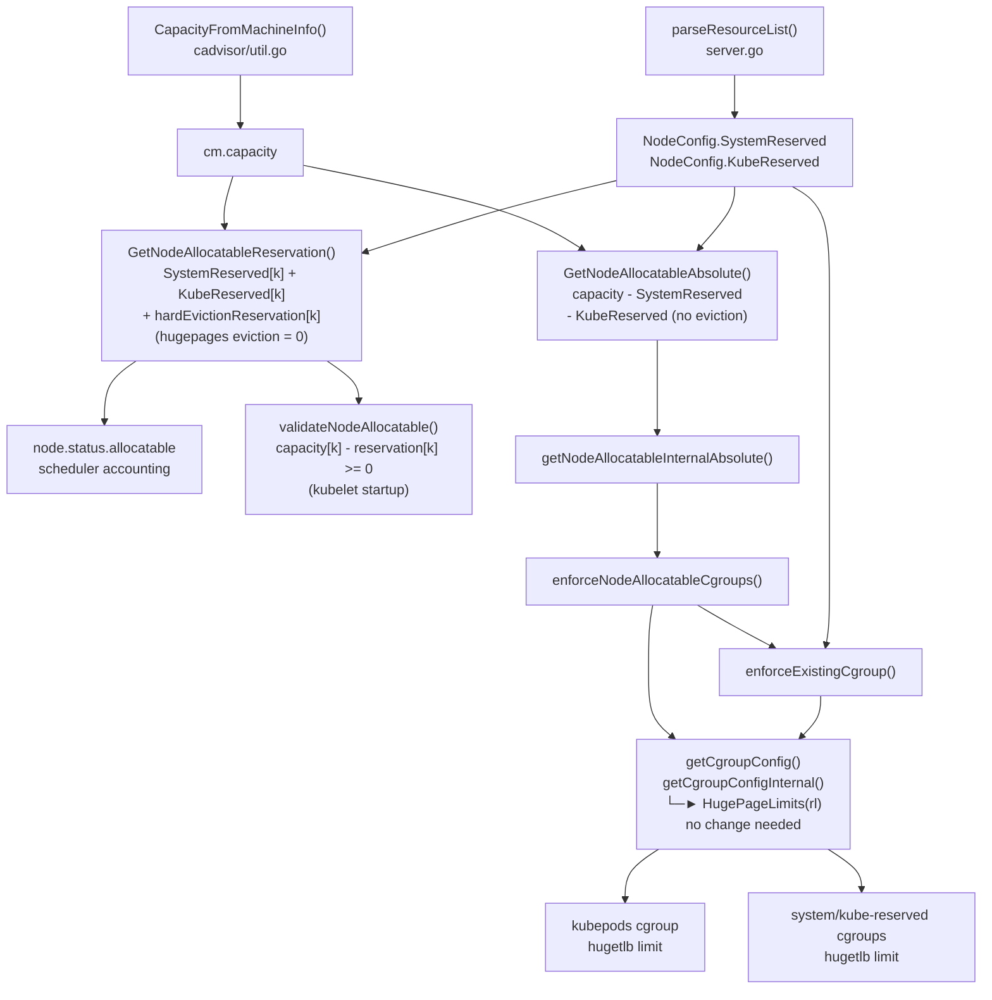

# KEP-6252: Hugepages Reservation

<!-- toc -->
- [Release Signoff Checklist](#release-signoff-checklist)
- [Summary](#summary)
- [Motivation](#motivation)
  - [Goals](#goals)
  - [Non-Goals](#non-goals)
- [Proposal](#proposal)
  - [User Stories](#user-stories)
    - [Story 1: OVS-DPDK](#story-1-ovs-dpdk)
    - [Story 2: Other system daemons](#story-2-other-system-daemons)
  - [Notes/Constraints/Caveats (Optional)](#notesconstraintscaveats-optional)
  - [Risks and Mitigations](#risks-and-mitigations)
- [Design Details](#design-details)
  - [Flag Parsing](#flag-parsing)
  - [Allocatable Computation](#allocatable-computation)
  - [Cgroup Enforcement](#cgroup-enforcement)
  - [Memory Manager Integration](#memory-manager-integration)
  - [Feature Gate](#feature-gate)
  - [Test Plan](#test-plan)
    - [Prerequisite testing updates](#prerequisite-testing-updates)
      - [Unit tests](#unit-tests)
      - [Integration tests](#integration-tests)
      - [e2e tests](#e2e-tests)
  - [Graduation Criteria](#graduation-criteria)
    - [Alpha](#alpha)
    - [Beta](#beta)
    - [GA](#ga)
    - [Deprecation](#deprecation)
  - [Upgrade / Downgrade Strategy](#upgrade--downgrade-strategy)
  - [Version Skew Strategy](#version-skew-strategy)
- [Production Readiness Review Questionnaire](#production-readiness-review-questionnaire)
  - [Feature Enablement and Rollback](#feature-enablement-and-rollback)
  - [Rollout, Upgrade and Rollback Planning](#rollout-upgrade-and-rollback-planning)
    - [How can a rollout or rollback fail? Can it impact already running workloads?](#how-can-a-rollout-or-rollback-fail-can-it-impact-already-running-workloads)
  - [Monitoring Requirements](#monitoring-requirements)
  - [Dependencies](#dependencies)
  - [Scalability](#scalability)
  - [Troubleshooting](#troubleshooting)
- [Implementation History](#implementation-history)
- [Drawbacks](#drawbacks)
- [Alternatives](#alternatives)
- [Infrastructure Needed (Optional)](#infrastructure-needed-optional)
<!-- /toc -->

## Release Signoff Checklist

Items marked with (R) are required *prior to targeting to a milestone / release*.

- [ ] (R) Enhancement issue in release milestone, which links to KEP dir in [kubernetes/enhancements] (not the initial KEP PR)
- [ ] (R) KEP approvers have approved the KEP status as `implementable`
- [ ] (R) Design details are appropriately documented
- [ ] (R) Test plan is in place, giving consideration to SIG Architecture and SIG Testing input (including test refactors)
  - [ ] e2e Tests for all Beta API Operations (endpoints)
  - [ ] (R) Ensure GA e2e tests meet requirements for [Conformance Tests](https://github.com/kubernetes/community/blob/master/contributors/devel/sig-architecture/conformance-tests.md)
  - [ ] (R) Minimum Two Week Window for GA e2e tests to prove flake free
- [ ] (R) Graduation criteria is in place
  - [ ] (R) [all GA Endpoints](https://github.com/kubernetes/community/pull/1806) must be hit by [Conformance Tests](https://github.com/kubernetes/community/blob/master/contributors/devel/sig-architecture/conformance-tests.md) within one minor version of promotion to GA
- [ ] (R) Production readiness review completed
- [ ] (R) Production readiness review approved
- [ ] "Implementation History" section is up-to-date for milestone
- [ ] User-facing documentation has been created in [kubernetes/website], for publication to [kubernetes.io]
- [ ] Supporting documentation—e.g., additional design documents, links to mailing list discussions/SIG meetings, relevant PRs/issues, release notes

[kubernetes.io]: https://kubernetes.io/
[kubernetes/enhancements]: https://git.k8s.io/enhancements
[kubernetes/kubernetes]: https://git.k8s.io/kubernetes
[kubernetes/website]: https://git.k8s.io/website

## Summary

This KEP proposes extending kubelet's `--system-reserved` and `--kube-reserved`
flags to accept hugepages resources (e.g., `hugepages-2Mi=512Mi`). When set,
the specified hugepages are subtracted from the node's `Allocatable` capacity,
preventing kubelet from offering hugepages that are already consumed by system
daemons to pods. Accepting hugepages in those flags also unblocks
`--reserved-memory` hugepage reservations used by Memory Manager.

## Motivation

System daemons such as OVS-DPDK allocate hugepages at startup for their own use
(see [OVS-DPDK hugepages setup](https://docs.openvswitch.org/en/latest/intro/install/dpdk/#setup-hugepages)).
When this happens, kubelet is unaware that those hugepages are taken and
continues to report them as `Allocatable`. This leads to pods being scheduled
with hugepages requests that cannot actually be fulfilled, causing allocation
failures at runtime.

Today, `--system-reserved` and `--kube-reserved` only accept `cpu`, `memory`,
`pid`, and `ephemeral-storage`. There is no supported way to tell kubelet to
exclude system-consumed hugepages from the allocatable pool.

See also [kubernetes/kubernetes#140544](https://github.com/kubernetes/kubernetes/issues/140544)
and [kubernetes/kubernetes#124357](https://github.com/kubernetes/kubernetes/pull/124357),
which implemented this feature but went stale due to lack of a concrete use case
at the time.

### Goals

- Allow `hugepages-<size>` resource types in `--system-reserved` and
  `--kube-reserved` kubelet flags.
- Subtract reserved hugepages from node `Allocatable` so the scheduler does not
  over-commit hugepages that are consumed by system processes.
- Enable `--reserved-memory` to work with hugepages end-to-end. The memory
  manager's validation requires that `--reserved-memory` totals match
  `system-reserved + kube-reserved + eviction-threshold` for memory and hugepages resource type.
  Once hugepages are accepted in `--system-reserved` / `--kube-reserved`, this
  validation will naturally pass (see [`validateReservedMemory` L445](https://github.com/kubernetes/kubernetes/blob/4b19e2b0244b00b56d6604deab3ff32b1c7e5706/pkg/kubelet/cm/memorymanager/memory_manager.go#L445)).
- Document the two-flag workflow: node-wide hugepage totals in
  `--system-reserved` / `--kube-reserved`, and the per-NUMA split in
  `--reserved-memory`.

### Non-Goals

- Changes to the Kubernetes scheduler.
- Hugepages support in eviction thresholds.
- Windows kubelet support. This work is Linux-only.

## Proposal

Extend `--system-reserved` and `--kube-reserved` to accept `hugepages-<size>`
keys. Kubelet already subtracts matching
`system-reserved` and `kube-reserved` entries from node capacity when computing
Allocatable, so hugepages flow through that path with no scheduler changes.
The same totals unblock `--reserved-memory`: Memory Manager requires per-type
reserved-memory sums to equal system-reserved + kube-reserved +
eviction-threshold. Kubelet applies these reservations through the existing
node-allocatable enforcement path, as it already does for cpu and memory.

### User Stories

#### Story 1: OVS-DPDK

As a cluster administrator running OVS-DPDK for high-performance networking,
I configure OVS to use DPDK which requires allocating hugepages for packet
buffers. I want to reserve those hugepages via `--system-reserved` so that
kubelet does not offer them to pods, avoiding runtime allocation failures.
When the daemon is NUMA-bound, I split the same total across NUMA nodes with
`--reserved-memory`.

Example:
```
--system-reserved=cpu=500m,memory=1Gi,hugepages-2Mi=512Mi
--reserved-memory 0:hugepages-2Mi=256Mi --reserved-memory 1:hugepages-2Mi=256Mi
```

#### Story 2: Other system daemons

As a cluster administrator running system daemons that require hugepages,
I need to reserve those hugepages at the kubelet level to prevent resource
contention with pods.

### Notes/Constraints/Caveats (Optional)

The `--reserved-memory` flag already shows hugepages in its help text example
(`--reserved-memory 0:memory=1Gi,hugepages-1M=2Gi`), but in practice this
cannot be used for hugepages today because the memory manager's validation
requires matching values in `system-reserved + kube-reserved +
eviction-threshold`, which don't accept hugepages. This KEP unblocks that
path.

The administrator must keep the per-NUMA `--reserved-memory` totals equal to
`system-reserved + kube-reserved` for memory and hugepages specifically, just
as with ordinary memory today. Eviction thresholds never include hugepages, so they do not contribute to
that equality for hugepage resources. There are two reasons hugepage eviction
is not meaningful:

1. **No overcommit.** Unlike standard memory, hugepages cannot be
   overcommitted — even for Burstable pods. A pod's hugepage `requests` must
   equal its `limits`. A pod therefore can never consume more hugepages than
   its pre-allocated limit, so there is no surprise pressure to react to.

2. **Separate accounting pool.** The eviction threshold mechanism exists to
   maintain a small amount of free general memory so critical system processes
   can continue to function. When `memory.available` falls below the threshold,
   kubelet evicts pods to relieve pressure. Hugepages are accounted in their
   own kernel pool and do not count toward `memory.available`. Evicting a
   hugepage-consuming pod would not reduce general memory pressure — the
   pressure would remain.

`node.status.capacity` and `node.status.allocatable` report node-wide totals
per hugepage size. They do not expose per-NUMA hugepages.

Kubelet does not allocate hugepages from the kernel. The host must still
pre-allocate the pool through sysfs before kubelet can reserve or schedule
against it.

When [KEP-5894 Node System Partition](/keps/sig-node/5894-node-system-partition)
is enabled, hugepages reservation is configured via `--system-reserved` and
`--kube-reserved`, not under `systemPartition`. KEP-5894's `systemPartition`
reserves resources for system pods; this KEP reserves hugepages for host-level
services (kubelet, container runtime, OS daemons). The two are orthogonal:
this KEP does not depend on or modify KEP-5894.

### Risks and Mitigations

**Risk:** Misconfiguration — an administrator reserves more hugepages than
available on the node.
**Mitigation:** Kubelet already validates that reservations do not exceed node
capacity via `validateNodeAllocatable()`. This validation applies to all
resource types including hugepages once they are accepted.

**Risk:** Feature interaction with Memory Manager — reserved hugepages must be
consistent with `--reserved-memory` when the Memory Manager is enabled.
**Mitigation:** The existing `validateReservedMemory()` check enforces this
consistency. No additional validation is needed.

## Design Details

### Flag Parsing

`--system-reserved` and `--kube-reserved` use `MapStringString` and accept
arbitrary key-value pairs. The values are parsed by `parseResourceList()` in
`cmd/kubelet/app/server.go`, which has a switch case that only accepts `cpu`,
`memory`, `ephemeral-storage`, and `pid`. Any other resource type is rejected
with `"cannot reserve %q resource"`.

`parseResourceList()` must be extended to also accept keys for which
`v1helper.IsHugePageResourceName` is true. No feature gate guards
this change - the flags themselves are the opt-in mechanism: clusters
that do not add hugepages entries under the KubeletConfig keep current behavior.

Hugepage quantities should be divisible by the page size, matching pod
admission (`IsHugePageResourceValueDivisible`). Non-divisible values should
be rejected at parse time.

The `--system-reserved` and `--kube-reserved` flag help text in
`cmd/kubelet/app/options/options.go` should list hugepages as an accepted
resource type.

The two flags are independent of each other; no cross-validation between them
is performed. Their combined value is validated against node capacity by
`validateNodeAllocatable()` at kubelet startup, which rejects configurations
where `system-reserved + kube-reserved + eviction-threshold` exceeds capacity
for any resource type.

### Allocatable Computation

`CapacityFromMachineInfo()` in `pkg/kubelet/cadvisor/util.go` populates
`cm.capacity` from cAdvisor machine info, including hugepage entries for each
pre-allocated page size. No changes are needed there.

`GetNodeAllocatableReservation()` in
`pkg/kubelet/cm/node_container_manager_linux.go` iterates over `cm.capacity`
keys and sums `SystemReserved[k] + KubeReserved[k] + evictionReservation[k]`
for each. Because `cm.capacity` is the key universe, a hugepage reservation
only takes effect if the corresponding page size exists in `cm.capacity` -
i.e. the host has that hugepage pool pre-allocated. That reservation is
subtracted from `Capacity` to compute `Allocatable` on the node status (used
for scheduling).

`GetNodeAllocatableAbsolute()` is `capacity - system-reserved - kube-reserved`
with no eviction component. It is the value used when applying node-allocatable
cgroup limits.

`hardEvictionReservation` only handles `memory` and `ephemeral-storage`, so
the eviction term for hugepages is always zero. For hugepages,
`GetNodeAllocatableReservation()` and `GetNodeAllocatableAbsolute()` therefore
produce the same result: `capacity - system-reserved - kube-reserved`.



### Cgroup Enforcement

Memory and hugepages use separate cgroup controllers: the `memory` controller
for RAM, and the `hugetlb` controller for hugepages. There is a kernel mount
option (`memory_hugetlb_accounting`) that routes hugepage accounting through
the memory controller instead, but Kubernetes does not enable it. Doing so
would conflict with container runtimes, which set the two controllers
independently based on pod resource requests.

[getCgroupConfigInternal()](https://github.com/kubernetes/kubernetes/blob/457ebaa229bda1f835c508c402391711adc9c32f/pkg/kubelet/cm/node_container_manager_linux.go#L220)
already calls `HugePageLimits(rl)` unconditionally. Every enforcement path -
`kubepods` via `enforceNodeAllocatableCgroups()`, and the system-reserved /
kube-reserved cgroups via `enforceExistingCgroup()` - goes through this
function. Those paths require no changes once hugepages are in the parsed
`ResourceList`.

The only issue is the QoS cgroup manager which runs [UpdateCgroups()](https://github.com/kubernetes/kubernetes/blob/457ebaa229bda1f835c508c402391711adc9c32f/pkg/kubelet/cm/qos_container_manager_linux.go#L371)
every minute and currently sets hugepage limits to unbounded on all QoS tiers,
including Guaranteed. Because the Guaranteed tier maps to the `kubepods` root,
this overwrites the limits that node-allocatable enforcement applied.

The fix is to apply `GetNodeAllocatableAbsolute()` hugepage limits on the
Guaranteed / `kubepods` root tier and keep Burstable and BestEffort unbounded,
matching the existing QoS cgroup design for other resources.

### Memory Manager Integration

The Memory Manager plumbing for hugepages in `--reserved-memory` already
exists: `validateReservedMemory()` already handles hugepage resource names
(via `IsHugePageResourceName`) alongside memory. However, the end-to-end
flow is currently blocked because `--system-reserved` and `--kube-reserved`
do not accept hugepages, so `validateReservedMemory()` always sees a zero
node-allocatable reservation for hugepages and rejects any non-zero
`--reserved-memory` hugepage value. This KEP completes the end-to-end flow
by accepting hugepages in those flags, allowing the per-NUMA
`--reserved-memory` values to match and pass validation.

The administrator sets node-wide totals in `--system-reserved` / `--kube-reserved`
and splits them per NUMA in `--reserved-memory` to match where system daemons
bind. For example:

```
--system-reserved=hugepages-2Mi=512Mi
--reserved-memory 0:hugepages-2Mi=256Mi --reserved-memory 1:hugepages-2Mi=256Mi
```

`node.status.allocatable` reports node-wide totals per page size; per-NUMA
state is internal to Memory Manager.

### Feature Gate

N/A

This enhancement does not use a feature gate. The `--system-reserved` and
`--kube-reserved` flags themselves serve as the opt-in mechanism: unless an
administrator explicitly adds `hugepages-<size>` entries to these flags,
behavior is identical to today. Hugepages are already a GA resource type, and
this change only extends which resource keys the existing flags accept - it
does not introduce a new API or resource model. A dedicated feature gate would
be a redundant guard that adds no additional rollback safety beyond what
removing the flag entries already provides.

### Test Plan

[x] I/we understand the owners of the involved components may require updates to
existing tests to make this code solid enough prior to committing the changes
necessary to implement this enhancement.

#### Prerequisite testing updates

None.

##### Unit tests

- `k8s.io/kubernetes/cmd/kubelet/app`: `parseResourceList` with
  `hugepages-<size>` keys, and quantities that are not divisible by the page
  size.
- `k8s.io/kubernetes/pkg/kubelet/cm`: extend
  `TestNodeAllocatableReservationForScheduling` in
  `node_container_manager_linux_test.go` so `GetNodeAllocatableReservation`
  and `GetNodeAllocatableAbsolute` include hugepages in `SystemReserved` and/or
  `KubeReserved`. QoS manager tests: Guaranteed tier gets limited hugepages;
  Burstable and BestEffort stay unbounded.
- [validateReservedMemory](https://github.com/kubernetes/kubernetes/blob/457ebaa229bda1f835c508c402391711adc9c32f/pkg/kubelet/cm/memorymanager/memory_manager.go#L433)
  with matching hugepage totals across `--reserved-memory` and
  system/kube-reserved.

##### Integration tests

None planned at this time, because e2e test will cover the flows.

##### e2e tests

Extend `test/e2e_node/node_container_manager_test.go`:

- Configure both 2Mi and 1Gi hugepages on the host.
- Set `--system-reserved` to `hugepages-2Mi=2Mi,hugepages-1Gi=1Gi` and
  `--kube-reserved` to `hugepages-2Mi=2Mi,hugepages-1Gi=1Gi`
  (4Mi and 2Gi reserved in total respectively).
- Set `enforce-node-allocatable` to `[pods, system-reserved, kube-reserved]`.
- Verify:
  - `kubepods` `hugetlb.2MB.max` equals 2Mi capacity minus 4Mi.
  - `kubepods` `hugetlb.1GB.max` equals 1Gi capacity minus 2Gi.
  - `node.status.allocatable[hugepages-2Mi]` and
    `node.status.allocatable[hugepages-1Gi]` match their respective values.
  - system-reserved and kube-reserved cgroup hugepage limits match the
    configured 2Mi and 1Gi each.

- Upgrade behavior - reservation introduced while node is over-committed:
  - Start kubelet with no hugepage reservation; schedule a pod consuming all
    available 2Mi hugepages.
  - Restart kubelet with `--system-reserved=hugepages-2Mi=2Mi`.
  - Verify kubelet fails to start because `Allocatable` has changed and now it requires
    deletion of the memory-manager checkpoint file.
    see: [policy_static.go#L1089-L1094](https://github.com/kubernetes/kubernetes/blob/30536385bedcaa871f7c07da79af171224ef02e2/pkg/kubelet/cm/memorymanager/policy_static.go#L1089-L1094)
  - Delete checkpoint file and restart kubelet; verify it starts successfully and the pod will failed to start on the node due to insufficient resources.

- QoS cgroup periodic reconciliation regression test:
  - Configure 2Mi hugepages and set `--system-reserved=hugepages-2Mi=2Mi`.
  - After initial enforcement, wait for at least one full QoS cgroup manager
    reconciliation cycle (`UpdateCgroups` runs every minute).
  - Re-read `kubepods` `hugetlb.2MB.max` and verify it still equals capacity
    minus the reserved value - i.e. the periodic `UpdateCgroups` call on the
    Guaranteed / `kubepods` tier did not overwrite the limit back to unbounded.

### Graduation Criteria

#### Alpha

- Feature implemented — `parseResourceList()` accepts hugepages keys.
- Unit tests covering flag validation and allocatable computation.
- Initial e2e tests completed and enabled.

#### Beta

- Gather feedback from developers and users, by verifying no reported issues, and no collisions with other features were reported.
- Extend e2e test coverage based on feedback and reported issues.

#### GA

- At least two releases since beta with no major bugs.
- Real-world usage confirmed - i.e. users are using this feature to reserve HugePages for their ovs-dpdk app.

#### Deprecation

N/A — this feature extends existing flags; no deprecation is planned.

### Upgrade / Downgrade Strategy

No special upgrade steps required. The feature is opt-in via
`--system-reserved` / `--kube-reserved` flags. Existing clusters that do not
add hugepages entries to these flags are unaffected.

When introducing a hugepage reservation on a node that is already running
workloads and/or system processes that consume hugepages, the outcome depends
on the subject and the configuration:

**Host processes:**
See [How can a rollout or rollback fail?](#how-can-a-rollout-or-rollback-fail-can-it-impact-already-running-workloads)
for the enforcement behavior when host daemons are consuming hugepages.

**Pods:**
Unlike other resources, hugepage `requests` must equal `limits` regardless of
the pod's QoS class. When upgrading to a version that supports hugepages
reservation while pods are already consuming hugepages, the behavior depends
on the Memory Manager policy:

- **Memory Manager policy `None`:**
  Here Memory Manger is not part of the flow (no-op).
  When `--system-reserved` is configured for hugepages and all hugepages are
  already allocated to pods, the kernel will reject setting `hugetlb.max` on
  the `kubepods` cgroup below the current usage. This cap is applied during
  the periodic QoS cgroup [update](https://github.com/kubernetes/kubernetes/blob/f341cb461861b3af9743262e57390120dedae96e/pkg/kubelet/cm/qos_container_manager_linux.go#L180),
  which logs the error and continues. Kubelet will keep operating.

- **Memory Manager policy `Static`:**
  When `--system-reserved` is configured for hugepages, the Memory Manager
  recomputes `Allocatable` and validates it against its checkpoint file. This
  causes the Memory Manager to return an
  [error](https://github.com/kubernetes/kubernetes/blob/f341cb461861b3af9743262e57390120dedae96e/pkg/kubelet/cm/memorymanager/policy_static.go#L1092) and the only fix is deleting the checkpoint file.
  By deleting the checkpoint file, the Memory Manager reallocates hugepages
  for all pods. If there are not enough hugepages - because some are now
  reserved - some pods will not be admitted. It is the administrator's
  responsibility to ensure the system has enough resources to accommodate all
  pod requests while setting aside hugepages for system processes.

On downgrade to a kubelet version that does not support hugepages in these
flags, remove hugepages entries from `--system-reserved` and
`--kube-reserved` first. If those keys remain, kubelet will fail to start.

### Version Skew Strategy

This feature is kubelet-only and does not involve coordination with the control
plane. The kubelet independently computes `Allocatable` and reports it on the
node status. No version skew concerns exist.

## Production Readiness Review Questionnaire

### Feature Enablement and Rollback

###### How can this feature be enabled / disabled in a live cluster?

- [x] Other
  - Describe the mechanism: Add or remove `hugepages-<size>` entries in the
    kubelet `--system-reserved` and/or `--kube-reserved` flags and restart
    kubelet. The flags themselves serve as the opt-in mechanism - no feature
    gate is needed because hugepages are already a GA resource type and the
    change only extends which resource keys these existing flags accept.

###### Does enabling the feature change any default behavior?

No. The feature only takes effect when an administrator explicitly adds
hugepages entries to `--system-reserved` and/or `--kube-reserved`. Without those
entries, behavior is identical to today.

see [Cgroup Enforcement](#cgroup-enforcement) for changes in the QoS cgroup manager behavior for hugepages.
Also note those changes will take effect on when `--system-reserved` and/or `--kube-reserved` are
set for hugepages.

###### Can the feature be disabled once it has been enabled (i.e. can we roll back the enablement)?

Yes. Remove hugepages entries from `--system-reserved` / `--kube-reserved`
and restart kubelet. The node's `Allocatable` will return to its previous
values.

###### What happens if we reenable the feature if it was previously rolled back?

Re-adding hugepages entries to `--system-reserved` / `--kube-reserved` and
restarting kubelet will subtract them from `Allocatable` again. No state is
persisted beyond the flag values.

###### Are there any tests for feature enablement/disablement?

Unit tests will verify that hugepages keys are accepted by `parseResourceList()`
and that allocatable computation correctly subtracts them.

### Rollout, Upgrade and Rollback Planning

#### How can a rollout or rollback fail? Can it impact already running workloads?

**Case 1 — enforcement caps a running daemon below its demand:**
An administrator sets `--system-reserved=hugepages-2Mi=512Mi` with
`--enforce-node-allocatable=pods,system-reserved`. Kubelet starts, subtracts
512Mi from allocatable, and writes `hugetlb.2MB.max=512Mi` on the
system-reserved cgroup. If the host daemon (e.g. OVS-DPDK) running in that
cgroup later tries to allocate beyond 512Mi, the kernel refuses the extra
pages and the daemon must handle the rejection in its own code. This is the
intended behavior: `--enforce-node-allocatable` sets a hard cap to prevent a
specific application from over-committing and putting pressure on the rest of
the system, exactly as it does for cpu and memory.

**Case 2 — daemon already exceeds the reservation before kubelet starts:**
A host daemon is already using 600Mi of hugepages. The administrator adds
`--system-reserved=hugepages-2Mi=512Mi` with system-reserved enforcement and
starts kubelet. Kubelet tries to write `hugetlb.2MB.max=512Mi` on the
system-reserved cgroup, but the kernel rejects the write because current
usage exceeds the requested limit. This follows the same pattern as other
resources: [`enforceExistingCgroup()`](https://github.com/kubernetes/kubernetes/blob/6d13e54a08b511582318f24ba0a5bb670214693e/pkg/kubelet/cm/node_container_manager_linux.go#L141-L148)
returns an error and kubelet fails to start. The administrator must either
reduce the daemon's hugepage consumption or increase the reservation before
restarting kubelet.

**Rollback to an older kubelet version:**
A downgrade to a kubelet version that does not support hugepages in these
flags while hugepages entries are still present causes kubelet to reject the
configuration on restart. Administrators must remove the entries first.

###### What specific metrics should inform a rollback?

The same kube-state-metrics used for other reserved resources apply.
kube-state-metrics explicitly handles hugepage resource names via
`isHugePageResourceName` in both
[`createNodeStatusAllocatableFamilyGenerator`](https://github.com/kubernetes/kube-state-metrics/blob/ca59026251fddbc245a37015f94e4d9cee945474/internal/store/node.go#L379)
and
[`createNodeStatusCapacityFamilyGenerator`](https://github.com/kubernetes/kube-state-metrics/blob/ca59026251fddbc245a37015f94e4d9cee945474/internal/store/node.go#L462),
so these metrics are emitted out of the box once hugepages appear in
`node.Status.Allocatable`:

- `kube_node_status_capacity{resource="hugepages_<size>",unit="byte"}` and
  `kube_node_status_allocatable{resource="hugepages_<size>",unit="byte"}`
  (resource names are sanitized: e.g. `hugepages-2Mi` → `hugepages_2mi`,
  `hugepages-1Gi` → `hugepages_1gi`; one metric series per configured page size).

The difference between the two reflects the active reservation.
A successful rollback is confirmed when the difference
returns to zero (no reservation) and allocatable equals capacity.

###### Were upgrade and rollback tested? Was the upgrade->downgrade->upgrade path tested?

Will be tested during alpha.

###### Is the rollout accompanied by any deprecations and/or removals of features, APIs, fields of API types, flags, etc.?

No.

### Monitoring Requirements

###### How can an operator determine if the feature is in use by workloads?

Check the node's `status.allocatable` for hugepages resources and compare with
`status.capacity`. If they differ, hugepages reservation is active.

###### How can someone using this feature know that it is working for their instance?

- [x] API .status
  - Other field: `node.status.allocatable[hugepages-<size>]` reflects
    `capacity - system-reserved - kube-reserved`.

###### What are the reasonable SLOs (Service Level Objectives) for the enhancement?

No new SLOs. This feature affects node status reporting, which is covered by
existing kubelet SLOs.

###### What are the SLIs (Service Level Indicators) an operator can use to determine the health of the service?

- [x] Other (treat as last resort)
  - Details: Compare `node.status.capacity[hugepages-<size>]` with
    `node.status.allocatable[hugepages-<size>]`. The difference should equal
    the configured reservation.

###### Are there any missing metrics that would be useful to have to improve observability of this feature?

No. The existing node capacity and allocatable fields provide sufficient
observability.

### Dependencies

###### Does this feature depend on any specific services running in the cluster?

No.

### Scalability

###### Will enabling / using this feature result in any new API calls?

No.

###### Will enabling / using this feature result in introducing new API types?

No.

###### Will enabling / using this feature result in any new calls to the cloud provider?

No.

###### Will enabling / using this feature result in increasing size or count of the existing API objects?

No. The node status already includes hugepages in capacity and allocatable.

###### Will enabling / using this feature result in increasing time taken by any operations covered by existing SLIs/SLOs?

No.

###### Will enabling / using this feature result in non-negligible increase of resource usage (CPU, RAM, disk, IO, ...) in any components?

No.

###### Can enabling / using this feature result in resource exhaustion of some node resources (PIDs, sockets, inodes, etc.)?

No.

### Troubleshooting

###### How does this feature react if the API server and/or etcd is unavailable?

Kubelet computes `Allocatable` locally, but it needs the API server to update
the node status. If the API server is unavailable, the node status will not
reflect the reserved hugepages until connectivity is restored. This is the same
behavior as existing resource reservations (cpu, memory).

###### What are other known failure modes?

- Misconfigured hugepages reservation exceeding node capacity
  - Detection: Kubelet will fail to start with a validation error.
  - Mitigations: Fix the `--system-reserved` / `--kube-reserved` values.
  - Diagnostics: Kubelet logs will contain the validation error message.
  - Testing: Unit tests cover this case.
- `--reserved-memory` hugepage totals do not match system-reserved +
  kube-reserved for that resource type
  - Detection: Kubelet fails `validateReservedMemory()` at startup.
  - Mitigations: Align the per-NUMA `--reserved-memory` values with the
    node-wide reserved flags.
  - Diagnostics: Kubelet logs will contain the validation error message.
  - Testing: Unit tests cover this case.
- Kernel hugepage pool is smaller than the configured reservation, or was
  never pre-allocated
  - Detection: `validateNodeAllocatable()` fails, or pods and system daemons
    cannot obtain hugepages at runtime.
  - Mitigations: Pre-allocate the kernel pool via sysfs so capacity covers
    reserved plus pod demand.
  - Diagnostics: Compare sysfs hugepage counts with `node.status.capacity`
    and the reserved flag values.
  - Testing: e2e_node configures host hugepages before applying reserved
    flags.

###### What steps should be taken if SLOs are not being met to determine the problem?

This feature does not introduce new SLOs. It modifies a static value on the
node status at kubelet startup. If the node's `Allocatable` hugepages value
is incorrect, check the `--system-reserved` and `--kube-reserved` flag values.

## Implementation History

- 2024-04-18: Prior implementation PR [kubernetes/kubernetes#124357](https://github.com/kubernetes/kubernetes/pull/124357) opened.
- 2024-10-15: PR closed as stale.
- 2026-07-20: KEP created.
- 2026-09-24: KEP updated with implementation scope, Memory Manager workflow,
  and a concrete test plan.

## Drawbacks

This feature extends the accepted resource types for existing flags, which
increases the surface area for misconfiguration. However, the existing
validation mechanisms (`validateNodeAllocatable`) already handle this.

## Alternatives

**Run system daemons as pods.** Give those workloads ordinary pod hugepage
requests instead of system-reserved. This is not always possible: daemons
such as OVS-DPDK are often started on the host, outside the pod lifecycle.

**Placeholder pods.** Deploy a pod that requests the exact hugepage
amount the system daemon consumes. This requires no kubelet changes and the
scheduler accounts for the reservation correctly. It is however a hack: the
pod serves no workload purpose, must be kept in sync with the daemon's actual
consumption, and adds operational overhead.
plus, the pod should started first (or among the first),
but there's no real direct/explicit control over the ordering on which kubelet restore pods

## Infrastructure Needed (Optional)

None.
