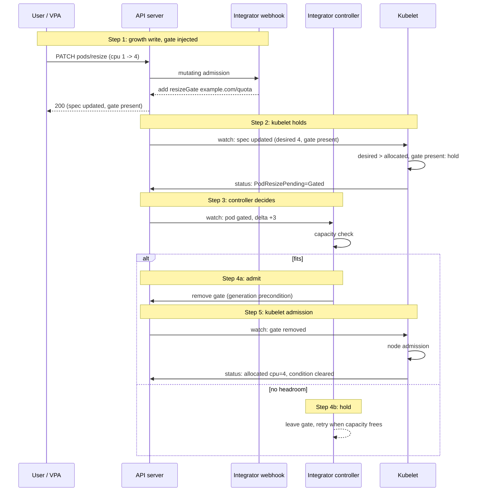

# KEP-6438: Resize Gates for In-Place Pod Resize

<!-- toc -->
- [Release Signoff Checklist](#release-signoff-checklist)
- [Summary](#summary)
- [Motivation](#motivation)
  - [Why denying at admission is not enough](#why-denying-at-admission-is-not-enough)
  - [Goals](#goals)
  - [Non-Goals](#non-goals)
- [Proposal](#proposal)
  - [Notes/Constraints/Caveats (Optional)](#notesconstraintscaveats-optional)
  - [Risks and Mitigations](#risks-and-mitigations)
- [Design Details](#design-details)
  - [API changes](#api-changes)
  - [Kubelet contract](#kubelet-contract)
  - [Integrator flow](#integrator-flow)
  - [Scheduler interaction](#scheduler-interaction)
  - [Example sequences](#example-sequences)
    - [Accepted resize](#accepted-resize)
    - [Held, then canceled by the user](#held-then-canceled-by-the-user)
    - [Second resize while the first is held](#second-resize-while-the-first-is-held)
    - [Approved, then infeasible on the node](#approved-then-infeasible-on-the-node)
    - [Approved, then deferred on the node (KEP-5836)](#approved-then-deferred-on-the-node-kep-5836)
  - [Test Plan](#test-plan)
      - [Prerequisite testing updates](#prerequisite-testing-updates)
      - [Unit tests](#unit-tests)
      - [Integration tests](#integration-tests)
      - [e2e tests](#e2e-tests)
  - [Graduation Criteria](#graduation-criteria)
    - [Alpha](#alpha)
    - [Beta](#beta)
    - [GA](#ga)
    - [Deprecation](#deprecation)
  - [Upgrade / Downgrade Strategy](#upgrade--downgrade-strategy)
  - [Version Skew Strategy](#version-skew-strategy)
- [Production Readiness Review Questionnaire](#production-readiness-review-questionnaire)
  - [Feature Enablement and Rollback](#feature-enablement-and-rollback)
  - [Rollout, Upgrade and Rollback Planning](#rollout-upgrade-and-rollback-planning)
  - [Monitoring Requirements](#monitoring-requirements)
  - [Dependencies](#dependencies)
  - [Scalability](#scalability)
  - [Troubleshooting](#troubleshooting)
- [Implementation History](#implementation-history)
- [Drawbacks](#drawbacks)
- [Alternatives](#alternatives)
  - [Persistent gates with approvals in status](#persistent-gates-with-approvals-in-status)
  - [Optimistic admission (actuate, then reclaim)](#optimistic-admission-actuate-then-reclaim)
  - [Comparison](#comparison)
  - [Open questions](#open-questions)
    - [Proposal or persistent gates](#proposal-or-persistent-gates)
    - [Gate mutability and authorization](#gate-mutability-and-authorization)
    - [Scope of the hold](#scope-of-the-hold)
    - [Field name](#field-name)
- [Infrastructure Needed](#infrastructure-needed)
<!-- /toc -->

## Release Signoff Checklist

Items marked with (R) are required *prior to targeting to a milestone / release*.

- [ ] (R) Enhancement issue in release milestone, which links to KEP dir in [kubernetes/enhancements] (not the initial KEP PR)
- [ ] (R) KEP approvers have approved the KEP status as `implementable`
- [ ] (R) Design details are appropriately documented
- [ ] (R) Test plan is in place, giving consideration to SIG Architecture and SIG Testing input (including test refactors)
  - [ ] e2e Tests for all Beta API Operations (endpoints)
  - [ ] (R) Ensure GA e2e tests meet requirements for [Conformance Tests](https://github.com/kubernetes/community/blob/master/contributors/devel/sig-architecture/conformance-tests.md)
  - [ ] (R) Minimum Two Week Window for GA e2e tests to prove flake free
- [ ] (R) Graduation criteria is in place
  - [ ] (R) [all GA Endpoints](https://github.com/kubernetes/community/pull/1806) must be hit by [Conformance Tests](https://github.com/kubernetes/community/blob/master/contributors/devel/sig-architecture/conformance-tests.md) within one minor version of promotion to GA
- [ ] (R) Production readiness review completed
- [ ] (R) Production readiness review approved
- [ ] "Implementation History" section is up-to-date for milestone
- [ ] User-facing documentation has been created in [kubernetes/website], for publication to [kubernetes.io]
- [ ] Supporting documentation—e.g., additional design documents, links to mailing list discussions/SIG meetings, relevant PRs/issues, release notes

[kubernetes.io]: https://kubernetes.io/
[kubernetes/enhancements]: https://git.k8s.io/enhancements
[kubernetes/kubernetes]: https://git.k8s.io/kubernetes
[kubernetes/website]: https://git.k8s.io/website

## Summary

In-place pod resize ([KEP-1287], GA in v1.35) lets a running Pod grow CPU and memory through the
`pods/resize` subresource without passing through any point where an out-of-tree quota or
capacity controller can hold or reject the growth. This KEP adds `pod.spec.resizeGates`,
mirroring `schedulingGates` ([KEP-3521]): while a gate is present, the kubelet does not allocate
resource growth for the pod. External controllers install gates on the mutation paths they care
about, observe the proposed growth, admit it against their own capacity model, and remove their
gate to let the kubelet proceed. Enforcement lives at the kubelet allocation step and applies
only to growth, so the same gate covers any mutation path that grows a running pod, while
down-sizes and resource-neutral updates are never held.

[KEP-1287]: /keps/sig-node/1287-in-place-update-pod-resources
[KEP-3521]: /keps/sig-scheduling/3521-pod-scheduling-readiness
[KEP-5836]: /keps/sig-scheduling/5836-scheduler-preemption-for-ippr
[KEP-5465]: https://github.com/kubernetes/enhancements/issues/5465
[KEP-5972]: https://github.com/kubernetes/enhancements/pull/6169
[KEP-5328]: /keps/sig-node/5328-node-declared-features

## Motivation

One of the stated use cases of [KEP-3521] was out-of-tree quota: gate the pod, admit it against
external capacity, release the gate. In-place resize breaks the underlying assumption that
resources are only committed through scheduling. After bind, `pods/resize` can grow a pod past
any externally enforced budget, and the controller has no point at which to hold or reject:

| Project | How it enforces quota today | How resize bypasses it |
| :---- | :---- | :---- |
| **AAQ** (KubeVirt) | Holds new pods with a scheduling gate until they fit its quota | Resize happens after the pod is scheduled, so the gate is never consulted again |
| **Kueue** | Admits a workload before its pods run; deletes pods whose spec drifts from what was admitted | Can only delete a resized pod, never approve a resize that fits; eviction defeats the point of in-place resize |
| **KAI Scheduler** | Checks queue capacity (`limit`, non-preemptible deserved `quota`) when it schedules each pod | A resized pod is not rescheduled, so the capacity check never runs; a `pods/resize` webhook can only check best-effort and races |

In-tree ResourceQuota is not affected: its admission-time ledger already accounts for resize
deltas ([KEP-1287]). The gap is exclusively out-of-tree.

Three projects hit this independently ([kubernetes/kubernetes#131835], [kueue#5257]), and VPA's
in-place modes (`InPlaceOrRecreate`, `InPlace`) will widen it: growth that today arrives through
pod recreation, and therefore through external admission, becomes automated `pods/resize`
traffic.

[kubernetes/kubernetes#131835]: https://github.com/kubernetes/kubernetes/issues/131835
[kueue#5257]: https://github.com/kubernetes-sigs/kueue/issues/5257

### Why denying at admission is not enough

Denying resource growth on `pods/resize` with a validating webhook or a
ValidatingAdmissionPolicy was suggested on [kubernetes/kubernetes#131835] as a workaround. KAI
Scheduler ships this as an interim mitigation ([KAI-Scheduler#1997]), but it is not sufficient
long term:

- Races: two concurrent resizes each fit the remaining budget; together they exceed it. A
  reservation ledger behind the webhook can serialize those, at the cost of consistent shared
  state and cleanup for admissions that never land, and every project rebuilds it. It still
  cannot see the scheduler binding new pods against the same headroom on its own path. With a
  hold, the component that admits new pods also decides when held resizes proceed. Both kinds of
  consumption are decided in one place, against one view of usage, so they cannot race.
- No hold semantics: admission can only accept or deny at request time. Quota controllers often
  need to defer until capacity frees, which is the same reason scheduling gates exist instead of
  deny-at-create.
- Decision latency: a webhook must answer synchronously, within admission timeouts, on the API
  request path. A real capacity decision can be expensive (hierarchical queue state, fair share)
  and belongs in an asynchronous controller loop, not inside an API call.
- Operational cost: every quota project ships its own racing webhook on the pod write path,
  adding latency at the API server and duplicating effort.

[KAI-Scheduler#1997]: https://github.com/kai-scheduler/KAI-Scheduler/pull/1997

### Goals

- Give out-of-tree controllers a point to observe, hold, and admit or reject `pods/resize`
  growth before the kubelet allocates it.
- Keep upstream minimal: the kubelet honors gates; installation, admission logic, and which
  paths to gate are integrator policy.
- Keep the kubelet the source of truth for node-level feasibility (unchanged).

### Non-Goals

- Node-capacity preemption for `Deferred` resizes; that is [KEP-5836].
- A generic in-tree quota API; desirable but much larger in scope.
- Making in-tree ResourceQuota a gate owner. ResourceQuota rejects growth that exceeds quota at
  admission today; it could instead add a gate and release it when quota allows, so one
  mechanism serves in-tree and out-of-tree quota. This is the resize counterpart of [KEP-5465]
  (deferred ResourceQuota enforcement for gated pods), which stalled. It is a separate change
  owned by SIG API Machinery; this proposal does not need it and does not rule it out.

## Proposal

[KEP-1287] separates *desired* resources (the spec, written through `/resize`) from *allocated*
resources (checkpointed by the kubelet and reported in status), with the `PodResizePending`
condition (`Deferred` or `Infeasible`) in between. This proposal inserts an externally clearable
hold into that existing state machine:

1. A new pod spec field, `resizeGates`, lists named gates, with the same shape as
   `schedulingGates`.
2. While any gate is present, the kubelet does not allocate a spec whose resources exceed what
   is currently allocated, and reports `PodResizePending` with a new reason, `Gated`.
3. An external controller adds its gate in the same write that grows the pod, decides against
   its own capacity model, and removes the gate to admit the growth.

The gate does not block the API write: a resize against a gated pod is accepted and stored in
the spec, so controllers can see the requested growth. What is held is the kubelet's allocation
of that growth. Down-sizes and updates that do not change resources are never held.

### Notes/Constraints/Caveats (Optional)

- The predicate is growth only. Growth is measured against allocated resources, never against a
  previous desired value: shrinking a pending request (desired 4 → 2 while allocated is 1) is
  still pending growth and stays held. A mixed resize (cpu up, memory down) is treated as growth.
- A gate with no pending growth is dormant and harmless.
- Gates apply only after the kubelet's first allocation of the pod; they do not affect initial
  admission. Growth written before that point (after the pod's scheduling gates are removed but
  before the kubelet admits it) is therefore not held. Integrators may reject such growth at
  admission instead, for example with a webhook that denies a growth write while the pod has
  no allocated resources yet.
- The kubelet never mutates gates; only their owners add or remove them.
- Gates are per controller, not per resize. A second growth write while the first is held is
  covered by the gate already present, and the controller evaluates the latest desired
  resources.
- A mutating webhook is the common way to install a gate, but any actor that mutates the growth
  write can add it: a MutatingAdmissionPolicy, or the resizing controller itself. This document
  says "webhook" for brevity.

### Risks and Mitigations

- **Self-approval.** Removing a gate needs pod update permission, which many users hold, so a
  user with resize permission could remove a gate and approve their own resize. This is the
  same trust model as `schedulingGates` today. Integrators can defend with the arming webhook
  (re-add the gate while growth is pending unless the requester is the controller) or with a
  ValidatingAdmissionPolicy. Whether upstream needs per-gate ownership is an api-review
  question.
- **Stale controller.** If a gate owner stops running, pending growth on its pods hangs. This
  matches `schedulingGates` today. The `Gated` condition names the pending gates, a kubelet
  gauge shows how many resizes are held, and the gate owner is responsible for its gates.
  Growth-only scope bounds the damage to upsizes: downsizes always proceed.
- **Webhook unavailability.** With `failurePolicy: Ignore`, a growth write made while the
  integrator's webhook is down is not gated. With `failurePolicy: Fail`, resizes are rejected
  while the webhook is down. This is the integrator's trade-off, as for scheduling gates
  installed by webhook today. The status-based alternative moves this risk to pod creation: a
  pod created while the webhook is down is never gated.
- **Scheduler accounting and preemption.** The scheduler sizes a running pod at the maximum of
  desired, allocated, and actual resources. Without a change, a gated resize would reserve node
  room for growth that no controller has approved, and a stale `Deferred` condition could
  trigger preemption for it. See [Scheduler interaction](#scheduler-interaction).

## Design Details

### API changes

- New field `pod.spec.resizeGates`, a map-type list of named gates keyed by `name`, with the
  same shape and validation as `schedulingGates` (duplicate names are rejected). Gates can be
  removed through a pod update and added through `/resize`, so a gate lands in the same write
  that grows resources.
- New `PodResizePending` reason `Gated`, alongside `Deferred` and `Infeasible`. The condition
  message names the gates present.
- The kubelet does not allocate resource growth while any gate is present.
- A `PodResizeGates` feature is registered with the node declared features framework
  ([KEP-5328]), and the kubelet declares it when the feature gate is on. KEP-5328's
  `NodeDeclaredFeatureValidator` admission plugin then rejects a `/resize` that adds a resize
  gate, or grows a pod that has one, when the pod's node does not declare the feature. Gated
  growth therefore only reaches nodes that enforce gates. No scheduling requirement is added.
- The scheduler treats a pod with any resize gate in its spec as having no approved growth. A
  new option on the shared effective-request helper (`PodRequests` in `k8s.io/component-helpers`),
  set only by the scheduler, sizes such a pod at the larger of allocated and actual resources,
  as for `Infeasible` resizes. In-tree ResourceQuota uses the same helper without the option, so
  it keeps charging the requested size when the `/resize` is written. The pod is also not
  eligible for resize preemption ([KEP-5836]).

```yaml
# A pod held on a 1 -> 4 cpu resize, before the controller approves
spec:
  containers:
  - name: main
    resources:
      requests:
        cpu: "4"          # desired, written via /resize
  resizeGates:
  - name: example.com/quota   # added by the integrator's webhook in the same write
status:
  containerStatuses:
  - name: main
    allocatedResources:
      cpu: "1"          # unchanged until the gate is removed
  conditions:
  - type: PodResizePending
    status: "True"
    reason: Gated
    message: "resize gated by: example.com/quota"
```

### Kubelet contract

While any gate is present, the kubelet does not allocate a spec whose effective resources exceed
what is currently allocated, and reports `PodResizePending: Gated` with a message naming the
pending gates. The predicate is growth only: down-sizes, container removals, and
resource-neutral updates (for example, image-only) are allocated normally even while gated. Once
the last gate is removed, the kubelet runs its normal admission: node fit, then allocate and
actuate, or `Deferred`/`Infeasible` exactly as today.

Gates are evaluated before node admission: while any gate is present the condition is `Gated`,
even if the resize would otherwise be `Deferred`, and the resize is not part of the kubelet's
deferred-retry set until the last gate is removed.

### Integrator flow

Step numbers in the diagram match the list below.



1. The controller's mutating webhook on `pods/resize` adds its gate in the same write that grows
   resources (atomic; no bypass window while the webhook is up).
2. The kubelet sees desired above allocated with a gate present, holds, and reports
   `PodResizePending: Gated`.
3. The controller watches pods that carry its gate and have pending growth (reported by the
   kubelet as `Gated`), and runs its capacity logic.
4. Admit: remove its gate, conditional on the pod still being at the spec generation it
   evaluated, so an approval computed for one spec cannot land after a newer, larger growth.
   Hold: leave the gate until capacity frees.
5. The kubelet runs its normal node admission and allocates. If it reports `Infeasible` instead,
   the controller drops the ask from its accounting; the upstream effective-request formula
   already excludes the desired spec for infeasible resizes. If `Deferred`, the resize may still
   actuate later, so the booking stays.

The spec can still change between gate removal and allocation, but no approval goes stale in
the unsafe direction: new growth passes the arming webhook and is re-gated, and a shrink stays
within what was approved.

The kubelet's `Gated` condition lists the gates holding the resize, so users can see which
controller to ask. Each controller explains its own reasons, as with scheduling gates: for
example in a pod condition named after its gate, in an event, or in its own status object.

### Scheduler interaction

The scheduler sizes a running pod at the maximum of desired, allocated, and actual resources
([KEP-1287]), so a pending resize keeps its node room. For a gated resize that would reserve
capacity for unapproved growth, and a quota controller that relies on the upstream scheduler for
placement (Kueue, for example) could not place other pods into that room while it holds the
resize. While a pod has any resize gate in its spec, the shared effective-request helper
therefore excludes the desired resources and sizes each container at the larger of allocated and
actual, the rule [KEP-1287] already applies to `Infeasible` resizes. Only the scheduler opts
into this rule: in-tree ResourceQuota uses the same helper without it and keeps charging the
requested size, so its checks are unchanged. Before the kubelet has allocated a container, the
scheduler counts its spec request, as today, so a pod that carries a gate before its first
allocation is still counted at its requested size.

The scheduler decides from the gate in the spec, not from the `PodResizePending` condition. The
condition is written by the kubelet and lags the spec by a sync: right after a gate is added it
may still read `Deferred`, and right after the last gate is removed it may still read `Gated`.
The gate in the spec has no such lag, so the scheduler's count changes right away. For the same
reason, the scheduler never preempts other pods for a resize while the pod has a gate
([KEP-5836]), whatever the condition says.

This cannot oversubscribe a node, since the kubelet's own admission decides fit. Once the last
gate is removed, the kubelet runs node admission; if the room is gone, the resize becomes
`Deferred` and [KEP-5836] preemption applies as today. Preemption never runs for growth that has
not been approved.

### Example sequences

In the tables below, the Desired column is the CPU request in the pod spec
(`spec.containers[0].resources.requests.cpu`), the Allocated column is the CPU the kubelet has
allocated (`status.containerStatuses[0].allocatedResources.cpu`), and the Condition column is the
reason on the `PodResizePending` condition.

#### Accepted resize

| Step | Actor | Desired | `spec.resizeGates` | Allocated | Condition |
| :---- | :---- | :---- | :---- | :---- | :---- |
| 0 | Pod running | 1 | none | 1 | none |
| 1 | User patches `/resize` cpu=4; webhook adds gate in the same write | 4 | `example.com/quota` | 1 | none |
| 2 | Kubelet: desired > allocated, gate present | 4 | `example.com/quota` | 1 | `Gated` |
| 3 | Controller: +3 fits, removes its gate | 4 | none | 1 | `Gated` |
| 4 | Kubelet: no gates, node fit ok, allocates and actuates | 4 | none | 4 | none |

#### Held, then canceled by the user

| Step | Actor | Desired | `spec.resizeGates` | Allocated | Condition |
| :---- | :---- | :---- | :---- | :---- | :---- |
| 0-2 | As above | 4 | `example.com/quota` | 1 | `Gated` |
| 3 | Controller: no headroom, leaves the gate | 4 | `example.com/quota` | 1 | `Gated` (message names the gate) |
| 4 | User patches `/resize` cpu=1; a decrease, so no gate is added | 1 | `example.com/quota` | 1 | none (no pending growth; gate dormant) |

If capacity frees later instead, the controller removes the gate and the flow continues as in
step 3 of the accepted case.

#### Second resize while the first is held

| Step | Actor | Desired | `spec.resizeGates` | Allocated | Condition |
| :---- | :---- | :---- | :---- | :---- | :---- |
| 0-2 | As in the accepted case | 4 | `example.com/quota` | 1 | `Gated` |
| 3 | User patches `/resize` cpu=8; the gate is already present | 8 | `example.com/quota` | 1 | `Gated` |
| 4 | Controller evaluates the latest delta (+7) | 8 | `example.com/quota` | 1 | `Gated` |

The same gate covers any number of writes; gates are per controller, not per resize.

#### Approved, then infeasible on the node

| Step | Actor | Desired | `spec.resizeGates` | Allocated | Condition |
| :---- | :---- | :---- | :---- | :---- | :---- |
| 0-3 | As in the accepted case | 4 | none | 1 | `Gated` |
| 4 | Kubelet: 4 exceeds node capacity | 4 | none | 1 | `Infeasible` |
| 5 | Controller sees `Infeasible`, drops the ask from its accounting | 4 | none | 1 | `Infeasible` |

`Deferred` is the same shape, but the resize may still actuate later, so the controller keeps
the booking.

#### Approved, then deferred on the node (KEP-5836)

| Step | Actor | Desired | `spec.resizeGates` | Allocated | Scheduler sizes pod at | Condition |
| :---- | :---- | :---- | :---- | :---- | :---- | :---- |
| 0-2 | As in the accepted case | 4 | `example.com/quota` | 1 | 1 (gated: allocated) | `Gated` |
| 3 | Controller removes its gate | 4 | none | 1 | 4 (pending: desired) | `Gated` |
| 4 | Kubelet: node has no room | 4 | none | 1 | 4 | `Deferred` |
| 5 | Scheduler preempts lower-priority pods for the `Deferred` resize ([KEP-5836]) | 4 | none | 1 | 4 | `Deferred` |
| 6 | Kubelet retries, allocates | 4 | none | 4 | 4 | none |

No preemption happens at steps 0-2: the pod carries a gate, so it is not eligible for resize
preemption, and the scheduler sizes it at allocated. At step 3 the condition still reads
`Gated`, but the scheduler already sizes the pod at 4, since it keys on the gate in the spec.

### Test Plan

[x] I/we understand the owners of the involved components may require updates to
existing tests to make this code solid enough prior to committing the changes necessary
to implement this enhancement.

##### Prerequisite testing updates

None identified.

##### Unit tests

Coverage figures to be filled in before the KEP is marked implementable.

- `k8s.io/kubernetes/pkg/apis/core/validation`: `resizeGates` can be set on create and added
  through `/resize`, and only removed on a plain pod update; duplicate names rejected.
- `k8s.io/kubernetes/pkg/api/pod`: the field is dropped on create and update when the
  `PodResizeGates` feature gate is disabled, unless the pod already has it.
- `k8s.io/kubernetes/pkg/registry/core/pod`: `/resize` strategy allows `resizeGates` changes.
- `k8s.io/kubernetes/pkg/kubelet/allocation`: growth held while a gate is present, measured
  against allocated (a pending request shrinking from 4 to 2 with 1 allocated stays held); a
  mixed resize (cpu up, memory down) counts as growth; downsizes and resource-neutral updates
  allocated; a gate present at first admission does not hold it; `Gated` takes precedence over
  `Deferred`; gated resizes excluded from the deferred-retry set; release after the last gate is
  removed; gates ignored when the feature gate is disabled.
- `k8s.io/kubernetes/pkg/kubelet/status`: `PodResizePending` condition with reason `Gated` and
  gate names in the message.
- `k8s.io/component-helpers/resource`: with the scheduler's option set, `PodRequests` excludes
  desired resources while a resize gate is present, keeping the larger of allocated and actual;
  without the option, results are unchanged.
- `k8s.io/kubernetes/pkg/scheduler`: a pod with a resize gate is not eligible for resize
  preemption ([KEP-5836] code path).
- `k8s.io/component-helpers/nodedeclaredfeatures/features/inplacepodresize`: the `PodResizeGates`
  update requirement applies when a `/resize` adds a gate or grows a pod that has one, and not
  to downsizes or to scheduling.

##### Integration tests

- API server: `resizeGates` accepted on create and `/resize`, remove-only on pod update,
  duplicate names rejected, field dropped with the feature gate disabled, and preserved on
  update of pods that already have it when the gate is disabled. A `/resize` on a pod that
  already has a gate is accepted.
- Scheduler: a pod's size for node fit follows the gate in its spec, both when a gate is added
  while the condition still reads `Deferred` and when the last gate is removed while it still
  reads `Gated`. A gated pod does not trigger resize preemption in either case.
- ResourceQuota: gated growth that exceeds a ResourceQuota is rejected at `/resize`, so removing
  the gate later cannot release growth that quota never admitted.
- Scheduler: a pod with a gate and no container status yet, both pending and just bound, is
  counted at its spec requests.
- Node declared features: a `/resize` that adds a gate, or grows a gated pod, on a node that
  does not declare `PodResizeGates` is rejected; the same write on a node that declares it is
  accepted.

##### e2e tests

Node e2e (`test/e2e_node`). The tests add and remove gates directly through the API, so no
webhook is needed:

- Gated growth is held: allocated resources unchanged, `PodResizePending: Gated`.
- Removing the last gate releases the resize; a downsize proceeds while gated.
- A second growth while held is covered by the same gate.
- A gate present when the pod is first admitted does not hold initial admission.
- After release, an oversized resize reports `Infeasible`, and a resize that no longer fits
  reports `Deferred`.
- Restarting the kubelet with `PodResizeGates` disabled while a resize is held allocates the
  held growth, and the node stops declaring the feature.

### Graduation Criteria

#### Alpha

- `resizeGates`, the `Gated` reason, the kubelet hold, and the effective-request change
  implemented behind the `PodResizeGates` feature gate.
- Unit, integration, and node e2e tests listed above.
- A reference integration (KAI Scheduler) validating the flow end to end.
- API approved through api-review, including the field name and the choice between the
  proposal and the status-based alternative.

#### Beta

- Feedback from at least one other integrator (Kueue or AAQ).
- The kubelet reports held resizes through the `gated` reason on `kubelet_pod_pending_resizes`
  and through `kubelet_pod_gated_resizes_total`.
- `kubectl describe pod` lists the pod's resize gates, as it does for scheduling gates.

#### GA

- At least two releases in beta with no open issues on gate semantics.
- Real-world usage by at least two integrators.

The field is optional; pods without gates are unaffected, so conformance tests are not required
for the feature itself.

#### Deprecation

Not applicable.

### Upgrade / Downgrade Strategy

No changes are required on upgrade to keep existing behavior: pods without `resizeGates` behave
as today. To use the feature, the feature gate must be enabled on the API server, kubelet, and
scheduler, and an integrator must install gates.

On downgrade or when the feature gate is disabled, the kubelet ignores `resizeGates` and
allocates pending growth as it does today, so resizes that were held proceed without approval.
The node stops declaring `PodResizeGates`, so further gated growth on its pods is rejected at
admission once the API server sees the change. The API server drops the field on writes when the
gate is disabled, except for pods that already carry it.

Operators who need hard quota should drain pods with held resizes from the node first.

### Version Skew Strategy

The version skew policy allows the kubelet to be up to three minor versions older than the API
server, and the scheduler up to one. During an upgrade, API servers can also run different
versions.

- **Old kubelet.** It doesn't know about gates and would apply gated growth without approval. To
  prevent that, its node doesn't declare `PodResizeGates`, and the `NodeDeclaredFeatureValidator`
  admission plugin rejects any `/resize` that adds a gate to a pod on that node, or grows a pod
  there that already has one. Integrators check the node's declared features before adding a
  gate, and use their existing mitigation on nodes without it. This protection starts once the
  API server sees the node's declared features. A resize already held when a node loses support
  is covered under [Upgrade / Downgrade Strategy](#upgrade--downgrade-strategy).
- **Old scheduler.** It ignores the field and counts a gated pod at its requested size. That
  holds more node room than needed, but is safe. With [KEP-5836] enabled, it may also preempt for
  a gated resize for a short time, until the kubelet replaces a stale `Deferred` condition with
  `Gated`.
- **API servers on different versions during an upgrade.** An update handled by an API server
  without the feature drops `resizeGates`, which releases the held growth. Integrators should
  rely on gates only once every API server has the feature enabled.
- **Old controllers.** Not affected; they don't read the field.

## Production Readiness Review Questionnaire

### Feature Enablement and Rollback

###### How can this feature be enabled / disabled in a live cluster?

- [x] Feature gate (also fill in values in `kep.yaml`)
  - Feature gate name: `PodResizeGates`
  - Components depending on the feature gate: kube-apiserver, kubelet, kube-scheduler

Enforcement also requires the `NodeDeclaredFeatureValidator` admission plugin ([KEP-5328]) on
every API server. It is on by default, and its `NodeDeclaredFeatures` feature gate has been GA
and locked on since v1.37.

###### Does enabling the feature change any default behavior?

No. Pods without `resizeGates` behave exactly as today. Behavior changes only for pods on which
an integrator has installed a gate.

###### Can the feature be disabled once it has been enabled (i.e. can we roll back the enablement)?

Yes. Disabling the gate on the kubelet makes it ignore `resizeGates`, so held resizes proceed
through normal node admission. Disabling it on the API server drops the field from new writes.
Existing gates on pods are preserved but have no effect.

###### What happens if we reenable the feature if it was previously rolled back?

Gates still present on pods are enforced again. Growth that was allocated while the feature was
disabled is not undone.

###### Are there any tests for feature enablement/disablement?

Unit tests for the API server dropping and preserving the field with the gate on and off, and
for the kubelet ignoring gates with the gate off, will be added with the implementation.

### Rollout, Upgrade and Rollback Planning

###### How can a rollout or rollback fail? Can it impact already running workloads?

During a partial rollout across nodes, only nodes that declare `PodResizeGates` accept gated
growth; on the others, adding a gate is rejected at admission, so integrators fall back to their
existing mitigation there. While API servers are only partly enabled, one with the feature off
removes a newly added gate from the write, so that growth is not held; integrators should rely
on gates only once every API server has the feature on. On rollback, held resizes are allocated
without approval (see [Upgrade / Downgrade Strategy](#upgrade--downgrade-strategy)). Running pods
are not restarted or evicted in either case.

###### What specific metrics should inform a rollback?

- A rise in `apiserver_request_total` errors for the `pods/resize` subresource after enabling the
  feature, beyond the expected rejections on nodes that do not declare `PodResizeGates`.
- Pods whose `PodResizePending` condition stays `Gated` while their spec has no gates, which
  would indicate a kubelet bug.

###### Were upgrade and rollback tested? Was the upgrade->downgrade->upgrade path tested?

To be done before beta.

###### Is the rollout accompanied by any deprecations and/or removals of features, APIs, fields of API types, flags, etc.?

No.

### Monitoring Requirements

###### How can an operator determine if the feature is in use by workloads?

Pods with a non-empty `spec.resizeGates`, or a rising `kubelet_pod_gated_resizes_total`. The
counter is the dependable signal: integrators that approve quickly leave gates on pods only
briefly, so the gauge below can read zero between scrapes.

###### How can someone using this feature know that it is working for their instance?

- [x] API .status
  - Condition name: `PodResizePending` with reason `Gated` while a resize is held; cleared or
    replaced by `Deferred`/`Infeasible` once the last gate is removed.

###### What are the reasonable SLOs (Service Level Objectives) for the enhancement?

Once the last gate is removed, the kubelet acts on the resize within the same bounds as an
ungated resize today.

###### What are the SLIs (Service Level Indicators) an operator can use to determine the health of the service?

- [x] Metrics
  - Metric name: `kubelet_pod_pending_resizes`, with a new `gated` value for its `reason` label
    - Gauge, the number of resizes currently held by gates on the node. The metric already
      exists ([KEP-1287]), with `reason` values `infeasible` and `deferred`; this KEP adds the
      label value.
  - Metric name: `kubelet_pod_gated_resizes_total`
    - Counter, incremented when a pod's `PodResizePending` condition changes to reason `Gated`.
      Each held resize counts once: a second growth while already held does not add to it, and a
      kubelet restart does not recount resizes that are already held. It follows the pattern of
      [KEP-1287]'s `kubelet_pod_infeasible_resizes_total`.
  - Components exposing the metrics: kubelet

###### Are there any missing metrics that would be useful to have to improve observability of this feature?

None identified.

### Dependencies

###### Does this feature depend on any specific services running in the cluster?

No external services. In-tree, it depends on the `NodeDeclaredFeatureValidator` admission
plugin ([KEP-5328]) to keep gated growth off nodes that do not enforce gates. If an operator
disables that plugin, gated growth can reach such nodes, and integrators fall back to their
existing mitigation. Its usefulness depends on an out-of-tree controller installing and
removing gates.

### Scalability

###### Will enabling / using this feature result in any new API calls?

One pod update per admitted resize (gate removal) by the integrator, and one mutating admission
call per growth write for integrators that use a webhook. Integrators already watch pods.

###### Will enabling / using this feature result in introducing new API types?

No.

###### Will enabling / using this feature result in any new calls to the cloud provider?

No.

###### Will enabling / using this feature result in increasing size or count of the existing API objects?

Pods gain a `resizeGates` list, roughly the size of `schedulingGates`: tens of bytes per gate,
only on pods where an integrator installs one.

###### Will enabling / using this feature result in increasing time taken by any operations covered by existing SLIs/SLOs?

No. Resize actuation for gated pods waits for the integrator by design; ungated pods are
unaffected.

###### Will enabling / using this feature result in non-negligible increase of resource usage (CPU, RAM, disk, IO, ...) in any components?

No. The kubelet performs one additional comparison per resize evaluation.

###### Can enabling / using this feature result in resource exhaustion of some node resources (PIDs, sockets, inodes, etc.)?

No.

### Troubleshooting

###### How does this feature react if the API server and/or etcd is unavailable?

The kubelet keeps holding gated resizes based on its cached pod spec. Controllers cannot remove
gates until the API server is back, so held resizes stay held. Ungated behavior is unchanged.

###### What are other known failure modes?

- Stale gate owner
  - Detection: `PodResizePending: Gated` persists; `kubelet_pod_pending_resizes{reason="gated"}`
    stays high on the node.
  - Mitigations: remove the gate with a pod update; fix or disable the controller.
  - Diagnostics: the condition message names the gate.

###### What steps should be taken if SLOs are not being met to determine the problem?

Check the `Gated` condition on the pod for the gate names, then the state of the named
controllers.

## Implementation History

- 2025-05: [kubernetes/kubernetes#131835] opened by the AAQ maintainers.
- 2026-08: Issue reopened and accepted for triage; design outline shared with SIG Node and
  SIG Scheduling participants.
- 2026-09: Presented at the SIG Scheduling meeting.
- 2026-09-28: Tracking issue [kubernetes/enhancements#6438](https://github.com/kubernetes/enhancements/issues/6438) opened; KEP opened as provisional.

## Drawbacks

- Adds a field to the Pod spec for a use case served only by out-of-tree controllers.
- Integrators need a mutating admission step on the resize path to install gates, with the
  usual webhook availability trade-offs.
- Gate removal uses pod update permission, so the self-approval risk of `schedulingGates` is
  inherited (see [Risks and Mitigations](#risks-and-mitigations)).

## Alternatives

### Persistent gates with approvals in status

Gate names are declared in spec at creation (remove-only, like `schedulingGates`); controllers
approve by writing `status.resizeApprovals: [{name, approvedGeneration}]`, and the kubelet holds
pending growth while any gate's approved generation differs from `metadata.generation`. The
kubelet only reads, so there is no per-resize webhook and a single writer, and approvals never
need clearing: any later spec change makes them stale. That includes unrelated changes, which
then need a re-approval. Binding the approval to the approved pod requests instead avoids this,
since only a larger request then invalidates it, but the kubelet must clear approvals it has
allocated so a later downsize and re-upsize is re-approved.

```yaml
spec:
  containers:
  - name: main
    resources:
      requests:
        cpu: "8"          # desired, written via /resize (generation 5)
  resizeGates:
  - name: example.com/quota   # static, set at creation
status:
  resizeApprovals:
  - name: example.com/quota
    approvedGeneration: 4     # written by the controller for the previous request
  conditions:
  - type: PodResizePending
    status: "True"
    reason: Gated
    message: "approvedGeneration is 4, but metadata.generation is 5"
```

| Step | Actor | Desired | Generation | `status.resizeApprovals` | Allocated | Condition |
| :---- | :---- | :---- | :---- | :---- | :---- | :---- |
| 0 | Pod created with `spec.resizeGates: [example.com/quota]` | 1 | 1 | none | 1 | none |
| 1 | User patches `/resize` cpu=4; no webhook | 4 | 2 | none | 1 | none |
| 2 | Kubelet: desired > allocated, no approval for generation 2 | 4 | 2 | none | 1 | `Gated` |
| 3 | Controller approves generation 2 | 4 | 2 | `approvedGeneration: 2` | 1 | `Gated` |
| 4 | Kubelet: approval matches the generation, allocates | 4 | 2 | `approvedGeneration: 2` | 4 | none |

### Optimistic admission (actuate, then reclaim)

The kubelet actuates immediately and the controller checks quota in parallel, shrinking the pod
back if it rejects. This needs no API and is available today by not gating a pod, so integrators
can use it for latency-sensitive workloads. It is not suitable as the default for hard quota:
the pod runs over quota until the controller reacts; the shrink is best-effort for memory (per
[KEP-1287], the kubelet skips a memory limit decrease below current usage), so the reject may
never take effect; and the controller overwrites the requested size, which a resizing controller
such as VPA would then re-apply.

### Comparison

|  | Proposal: gates re-armed per resize | Persistent gates, approvals in status | Optimistic admission |
| :---- | :---- | :---- | :---- |
| New API | `spec.resizeGates`, `Gated` reason | same, plus `status.resizeApprovals` | none |
| Webhook on the resize path | yes | no (only at creation) | no |
| Approval write | remove a gate (pod update) | write to `pods/status` | shrink the pod (`/resize`) |
| Re-arm for the next resize | webhook re-adds the gate | any spec change stales the approval, including unrelated ones | n/a |
| Safe for hard quota | yes | yes | no: over quota until the controller reacts, revert not guaranteed |
| Symmetry with `schedulingGates` | exact | partial | none |

### Open questions

#### Proposal or persistent gates

Whether to adopt the proposal, with gates added per resize by the integrator, or the
[persistent-gates alternative](#persistent-gates-with-approvals-in-status), with gates set at
creation and approvals written to status. The proposal mirrors `schedulingGates` and needs no new
status field. The alternative removes the webhook from the resize path. See the
[comparison](#comparison).

#### Gate mutability and authorization

Unlike `schedulingGates`, `resizeGates` must be addable after creation. Any pod writer can also
remove a gate, so a resize-permitted user could self-approve; integrators can defend with the
arming webhook or a ValidatingAdmissionPolicy. Whether upstream needs per-gate ownership is for
api-review.

#### Scope of the hold

Growth only (proposed), or every resize while gated? Growth-only keeps downsizes immediate
(including a user canceling a pending request), bounds a stale controller's damage to upsizes,
and spares integrators approving capacity-safe shrinks. Static floors on downsizing are already
served by a ValidatingAdmissionPolicy, LimitRange, or VPA's `minAllowed`. A shrink that must
wait for something (draining in-flight work, reconfiguring the app) is a hold rather than a
floor and would need a gate; a per-gate scope (`Growth` by default, `All`) could serve it later,
added without breaking anything, at the cost of a stale controller blocking reclamation.

#### Field name

`resizeGates` is the working name, consistent with the `PodResizePending` and
`PodResizeInProgress` conditions, which already cover container additions under the dynamic
containers proposal ([KEP-5972]). Alternatives raised: `allocationGates` and
`reallocationGates` (kubelet-internal, and the former suggests gating initial admission),
`kubeletAllocationGates`, `updateGates` (too generic), and `resourceChangeGates` (general and
admission-neutral, longer). Final name for api-review.

## Infrastructure Needed

None.
