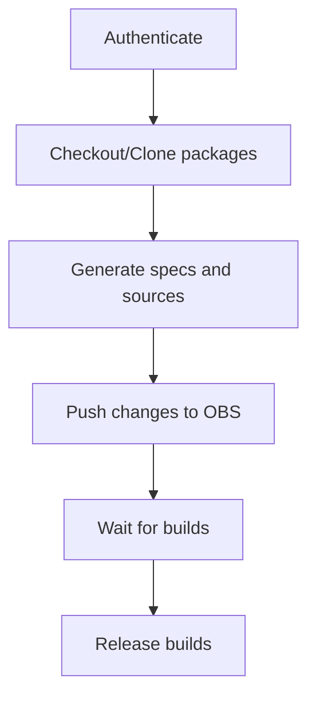

# KEP-1731: Publishing Kubernetes packages on community infrastructure <!-- omit in toc -->

<!-- toc -->
- [Summary](#summary)
- [Motivation](#motivation)
  - [Goals](#goals)
  - [Non-Goals](#non-goals)
- [Proposal](#proposal)
  - [User Stories](#user-stories)
    - [User Roles](#user-roles)
  - [Risks and Mitigations](#risks-and-mitigations)
- [Design Details](#design-details)
    - [Using OBS instead of manually building and hosting packages](#using-obs-instead-of-manually-building-and-hosting-packages)
    - [How Open Build Service works?](#how-open-build-service-works)
    - [Packages, Operating Systems, and Architectures in Scope](#packages-operating-systems-and-architectures-in-scope)
    - [Repository Layout](#repository-layout)
    - [Projects and Packages in OBS](#projects-and-packages-in-obs)
    - [Packages in OBS](#packages-in-obs)
    - [Package Sources](#package-sources)
    - [Package Specs](#package-specs)
    - [Integrating OBS with our current release pipeline](#integrating-obs-with-our-current-release-pipeline)
    - [Recovering from a failed build](#recovering-from-a-failed-build)
    - [Authentication to OBS and User Management](#authentication-to-obs-and-user-management)
    - [Ownership of OBS infrastructure and commitments](#ownership-of-obs-infrastructure-and-commitments)
    - [GPG key ownership as part of the OBS infrastructure](#gpg-key-ownership-as-part-of-the-obs-infrastructure)
    - [Clarification on the community-owned infrastructure](#clarification-on-the-community-owned-infrastructure)
    - [Risks of vendor-lock in](#risks-of-vendor-lock-in)
    - [How are packages used?](#how-are-packages-used)
  - [Test Plan](#test-plan)
  - [Graduation Criteria](#graduation-criteria)
    - [Alpha](#alpha)
    - [Alpha -&gt; Beta Graduation](#alpha---beta-graduation)
    - [Beta -&gt; GA Graduation](#beta---ga-graduation)
  - [Upgrade / Downgrade Strategy](#upgrade--downgrade-strategy)
  - [Version Skew Strategy](#version-skew-strategy)
- [Production Readiness Review Questionnaire](#production-readiness-review-questionnaire)
  - [Feature Enablement and Rollback](#feature-enablement-and-rollback)
  - [Rollout, Upgrade and Rollback Planning](#rollout-upgrade-and-rollback-planning)
  - [Monitoring Requirements](#monitoring-requirements)
  - [Dependencies](#dependencies)
  - [Scalability](#scalability)
  - [Troubleshooting](#troubleshooting)
- [Implementation History](#implementation-history)
- [Drawbacks](#drawbacks)
- [Alternatives](#alternatives)
- [Infrastructure Needed (Optional)](#infrastructure-needed-optional)
<!-- /toc -->

Items marked with (R) are required *prior to targeting to a milestone / release*.

- [x] (R) Enhancement issue in release milestone, which links to KEP dir in [kubernetes/enhancements] (not the initial KEP PR)
- [ ] (R) KEP approvers have approved the KEP status as `implementable`
- [x] (R) Design details are appropriately documented
- [x] (R) Test plan is in place, giving consideration to SIG Architecture and SIG Testing input (including test refactors)
  - [ ] e2e Tests for all Beta API Operations (endpoints)
  - [ ] ~(R) Ensure GA e2e tests meet requirements for [Conformance Tests](https://github.com/kubernetes/community/blob/master/contributors/devel/sig-architecture/conformance-tests.md)~ (Not applicable)
  - [ ] (R) Minimum Two Week Window for GA e2e tests to prove flake free
- [x] (R) Graduation criteria is in place
  - [ ] ~(R) [all GA Endpoints](https://github.com/kubernetes/community/pull/1806) must be hit by [Conformance Tests](https://github.com/kubernetes/community/blob/master/contributors/devel/sig-architecture/conformance-tests.md)~ (Not applicable)
- [x] (R) Production readiness review completed
- [ ] (R) Production readiness review approved
- [ ] "Implementation History" section is up-to-date for milestone
- [ ] User-facing documentation has been created in [kubernetes/website], for publication to [kubernetes.io]
- [ ] Supporting documentation—e.g., additional design documents, links to mailing list discussions/SIG meetings, relevant PRs/issues, release notes

<!--
**Note:** This checklist is iterative and should be reviewed and updated every time this enhancement is being considered for a milestone.
-->

[kubernetes.io]: https://kubernetes.io/
[kubernetes/enhancements]: https://git.k8s.io/enhancements
[kubernetes/kubernetes]: https://git.k8s.io/kubernetes
[kubernetes/website]: https://git.k8s.io/website

## Summary

This document describes how deb and rpm packages get published in the same way as the currently [documented package mirror] as part of cutting a release, with the tooling the release management team has at hand ([krel] and others from [k/release], [k/k/build] and potentially other places).

[documented package mirror]: https://kubernetes.io/docs/tasks/tools/install-kubectl-linux/#install-using-native-package-management
[gcbmgr]: https://github.com/kubernetes/release/tree/master/gdcbmgr
[k/release]: https://github.com/kubernetes/release
[k/k/build]: https://github.com/kubernetes/kubernetes/tree/master/build

## Motivation

Currently:

- Only Googlers can publish packages.
- The packages get published on Google infrastructure.
- After publishing a new release but before sending out the release notification
  emails the process needs to be paused. Googlers need to build and publish the
  deb and rpm packages before the branch manager can continue and send the
  release announcement.
- We can only publish packages for stable releases right now.
- We use different packages in CI then we officially release.

This all prolongs the release process, it is a hard dependency on a small group of people from one company (and its infrastructure), and we only ever publish and test packages very late in the release process.

### Goals

The whole process should be folded into the release tooling, it should be part of the release process, and should not involve anyone other than the release managers.
For each release the release team cuts, packages should also be generated and published automatically.

There should be multiple channels users can subscribe to: **stable**, **dev**, and **nightly**.

### Non-Goals

The original version of this KEP had the following statement:

> The actual package generation is a different problem that is discussed in [this KEP][pkg-gen-kep].

Based on a review of this KEP, Kubernetes contributor @saschagrunert wants SIG
Release to own the process of automatically building and publishing the packages
and this will implicitly achieve the main goal of
[#2503](https://github.com/kubernetes/enhancements/issues/2503).

[pkg-gen-kep]: https://github.com/kubernetes/enhancements/pull/858

## Proposal

- Make the infrastructure generic and simple enough to be easily handed off to the CNCF
  - Choose a Packages as a Service solution (e.g. Open Build Service...) or build
    the infrastructure manually. In case we build the infrastructure manually, we need
    at least:
    - Storage buckets (to store the staged/released packages) or anything similar
    - DNS entries (e.g. apt.kubernetes.io, ...)
    - Package mirror (e.g. a self hosted aptly/artifactory/... or as a service)
      - have multiple channels, e.g. `stable`, `dev`, `nightly`
- Run the package builds as part of [krel stage and release]
- Have a safe way to store the signing key and make it available to the release team and release tooling
  - Making key available to the Release Team/Managers is not a requirement if using 'as a service' solution
- Automatically sign the repository and packages
- Automatically build and publish packages on a nightly basis (not required)

[krel stage and release]: https://github.com/kubernetes/release/blob/master/docs/krel/README.md#usage

### User Stories

_Note_: The following user stories are using the keywords of the [gherkin language][gherkin].

[gherkin]: https://cucumber.io/docs/gherkin/reference/

#### User Roles

[Release Managers] are SIG Release Team Members that are

> ... Kubernetes contributors responsible for maintaining release branches and creating releases by using the tools SIG Release provides.

[release managers]: https://kubernetes.io/releases/release-managers

An [End User] is used in the CNCF sense to refer to consumers of the Kubernetes artifacts built and published by [Release Managers]

[end user]: https://www.cncf.io/enduser/

```
Scenario: End User lists the available packages from the stable channel
  Given an End User has configured the officially documented package mirror for stable releases on their machine
  When they use their system's package manager to query the list of kubelet packages available (e.g. apt-cache policy kubelet)
  Then they see a list of all stable patch versions of the kubelet and a preference to install the latest available patch version
  But they do not see any alpha, beta, release candidate or nightly releases of the kubelet package from this specific kubernetes minor version
  And they do not see any packages of any other kubernetes minor releases
```

```
Scenario: Release tools automatically publish new packages
  Given a Release Manager ran `./krel stage --nomock` and `./krel release --nomock` to create a new  release (alpha, beta, rc or final).
  When an End User inspects the officially documented deb and rpm kubernetes repositories for this specific kubernetes minor version
  Then they see the newly cut releases published in the appropriate channel only
```

```
Scenario: End users can retrieve the public key that signed the packages, or the repository metadata is signed with
  Given an End User configured their system to disallow the use of unsigned, untrusted package repositories
  And they have setup the officially documented repository for a specific kubernetes minor release
  When they download the public key from the location stated in the official documentation
  And they configure their system's package manager to use that key
  And they use their system's package manager to install a package from this specific kubernetes minor release
  Then their package manager does not complain about untrusted packages, sources or repositories
```

<!--
```
Scenario: [...]
  Given ...
    And ...
   When ...
   Then ...
```
-->

### Risks and Mitigations

- _Risk_: The OBS installation provided by SUSE is unable to serve the load generated by the Kubernetes project
  _Mitigation_: We can host our own mirrors and take some load from SUSE (e.g. on Equinix Metal)
- _Risk_: Building all the packages for all the distributions and their version takes too long to be done nightly or via cutting the release  
  _Mitigation_: We do not deliver nightly packages or wait for packages to be published in the release pipeline.

## Design Details

Packages will be built and published using [Open Build Service (OBS)][obs]. SUSE will sponsor the Kubernetes
project by giving us access to the [OBS instance hosted by SUSE][obs-build].

[obs]: https://openbuildservice.org/
[obs-build]: https://build.opensuse.org/

#### Using OBS instead of manually building and hosting packages

The reasons for using Open Build Service (OBS) instead of building and hosting packages ourselves are:

- We want to handoff managing GPG keys to the third-party
  - Managing GPG keys ourselves represents a security risk. For example, if a Release Manager with access to the GPG key
    steps down, we might need to rotate the key. This is a process that affects End Users, therefore
    we want to avoid it
  - In this case, GPG keys are securely managed by the OBS platform hosted by SUSE. No one from the Kubernetes
    project will have direct access to the key, mitigating one of the main risks of this proposal
- We want to avoid managing the infrastructure ourselves, including buckets, mirrors/CDNs...
- We want to provide 'as a service' access to the packages infrastructure to Release Managers and eventually other
  Kubernetes maintainers for their subprojects

#### How Open Build Service works?

From the [OBS website](https://openbuildservice.org/):

> The Open Build Service (OBS) is a generic system to build and distribute binary packages from sources in an automatic, consistent and reproducible way. You can release packages as well as updates, add-ons, appliances and entire distributions for a wide range of operating systems and hardware architectures.

OBS works in a way that we push sources and package spec files. Upon pushing packages/changes, OBS automatically
triggers builds for all chosen operating systems and architectures. Under the hood, OBS uses the same set of tools that
we use for building packages: `dpkg-buildpackage` and `rpmbuild`.

OBS implements a simple source-control management (SCM) system. It provides a complete history for all packages
allowing users to see what spec files and sources we used to build the concrete package. The history is accessible
via the OBS web interface.

Interaction with the OBS platform is done mainly via the [`osc` command-line tool][osc]. Alternatively, it's possible
to interact via the web interface. Currently there are no (Go) libraries that we can use instead of the `osc` tool.

[osc]: https://openbuildservice.org/help/manuals/obs-user-guide/cha.obs.osc.html

#### Packages, Operating Systems, and Architectures in Scope

We'll publish Debian-based (`deb`) and RPM-based (`rpm`) packages. Packages will be published for the following
architectures:

* `x86_64` (`amd64`)
* `aarch64`
* `armv7l` (`arm`)
* `ppc64le`
* `s390x`

It's important to note that we should build packages in a way to ensure the best compatibility with both newer and older versions of operating systems and package managers. That can be done by building packages on OS versions that has the appropriate build toolchain. For example, the latest OS version might have the latest build toolchain version which doesn't produce packages compatible with older operating systems and package managers. We refer to OS-es used for building packages as **builders**.

Builders we'll be changed over time as operating systems reach End-of-Life (EOL) and new versions are becoming widely adopted. At the time of writing this KEP, we're looking at using following builders:

- Ubuntu 20.04 (`aarch64`, `armv7l`, `ppc64le`, `s390x`, `x86_64`)
- CentOS Stream 8 (`aarch64`, `ppc64le`, `x86_64`)
  - CentOS Stream 8 doesn't support `armv7l` and `s390x`, hence, we need to use another builder for those architectures
- SUSE Linux Enterprise (SLE) 12 SP5 (`armv7l`, `s390x`)

[The following discussion][kep-1731-builders] has more details on reasoning behind looking at those builders.

**Note: this is a non-binding list of builders that can change at any time without prior notification. This list should be used only as a guidance for the initial implementation.**

[kep-1731-builders]: https://github.com/kubernetes/enhancements/pull/3750#discussion_r1083146253

The following packages will be published for all operating system and architectures listed earlier. For simplicity,
we'll refer to those as packages as the **core packages**:

- cri-tools
- kubeadm
- kubectl
- kubelet
- kubernetes-cni

#### Repository Layout

We'll use this layout when creating repositories for the **core packages**:

- **`${channel}`**: can be `stable`, `dev`, `nightly`
  - `stable`: all official releases for `${k8s_release}`
    (e.g.: `1.26.0`, `1.26.1`, `1.26.2`, ...)
  - `dev`: all development releases for all minor releases in this `${k8s_release}`,
    including `alpha`s, `beta`s and `rc`s (e.g.: `1.26.0-rc.2`, `1.26.2-beta.0`, `1.26.1-alpha.3`, ...)
  - `nightly`: any package cut automatically from the `master` branch on a daily basis (optionally)
    - Nightly packages are currently out of scope and might be handled via a different KEP
- **`${k8s_release}`**: the version of Kubernetes `<major>.<minor>`
  (e.g. `1.12`, `1.13`, `1.14`, ...)

#### Projects and Packages in OBS

Speaking of OBS, **Packages** are located in **Projects**. We'll use two different types of projects:

- Building/Staging project - we'll build packages in a project of this type
- Publishing/Maintenance project - we'll publish packages from a project of this type

The reason for using two different types of projects is that in the default OBS projects, which are of build-type, only one set of binaries is kept at any point in time and used to provide build dependencies for all the artifacts to build. By releasing built binaries into  a maintenance-type project, they can be snapshot-ed and stored together. The published repository includes all snapshotted binaries.

The repository layout mentioned earlier replicates in OBS as:

- The root OBS project is [**`isv:kubernetes`**](https://build.opensuse.org/project/show/isv:kubernetes)
- **`core`** subproject of the root project will be created to be used for **core packages**
  - In the future, we might decide to publish other packages (e.g. Minikube), so we want to have
    a proper and scalable layout from the beginning
- Each **`${channel}`** has a subproject of the **`core`** project (e.g. **`isv:kubernetes:core:stable`**)
- Each **`${k8s_release}`** has a **publishing** subproject of the **`${channel}`** subproject
  (e.g. **`isv:kubernetes:core:stable:v1.26`**)
  - We'll publish our packages from this project
- Each **`${k8s_release}`** has a **building** subproject as a subproject of the appropriate publishing subproject
  (e.g. **`isv:kubernetes:core:stable:v1.26:stage`**)
  - We'll build packages in this project
  
Having **`${k8s_release}`** subproject as a subproject of **`${channel}`** is required so we can build multiple
releases in parallel. This is because if changes are pushed to the package, the ongoing build process is aborted.
Running builds sequentially is not an option because that would slow down the release process too much.

Mentioned subprojects can be created manually via the web interface. Upon creating appropriate **`${k8s_release}`**
subprojects, the target operating systems and architectures (listed earlier) must be configured for those subprojects
(via the Repositories option). Additionally, some meta configuration is needed to declare the projects as publishing
and building. This is to be done by the Release Managers before cutting the first alpha release for that minor release.
The concrete configuration steps will be documented outside of this KEP, as part of the Release Managers Handbook.
We'll also consider automating this in some form.

#### Packages in OBS

**Package** object must be created in the **`${k8s_release}`** **building** subproject for each package that we want
to build and publish. This can be done via the `osc` command-line tool or the web interface. The created package 
inherits information about the target operating systems and architectures from the subproject.

Creating packages is to be done by the Release Managers before cutting the first alpha release for that minor release.
We'll consider automating this in some form.

Packages in the **publishing** subproject are created automatically for each published build. Those automatically
packages are named as `<package-name>.<timestamp>`, e.g. `kubectl.20230120135613`. This naming schema doesn't affect
package managers or users, i.e. those packages are still installable by their original name
(e.g. `apt install kubectl=1.26.0*`). More about building and publishing packages is explained in the next sections.

#### Package Sources

We'll build packages using pre-built binaries instead of pushing sources and then building binaries in the OBS pipeline.
The reasoning for this is:

- We already have our own release pipeline. Adding another release pipeline would increase the maintenance burden for
  Release Managers
- It would increase the effort for updating build dependencies such as Go
- It would increase the effort for validating correctness of created binaries
- Binary published by our release process would differ to binaries built by OBS
  - Additional efforts would be needed to get reproducible builds working
  - We would also lose cosign signatures for binaries built by OBS

`kubepkg` will be extended with a subcommand to create a tarball with all required binaries and files (e.g. systemd
units and config files). The tarball is supposed to be created with the maximum compression to save on bandwidth and
storage. The structure of the tarball is supposed to be:

- Root of tarball:
  - LICENSE file
  - README.md file
  - All accompanying files (e.g. systemd units)
  - Subdirectory for each target architecture:
    - Binary for that architecture (e.g. `kubectl`)

#### Package Specs

There are two key changes to the package specs compared to what specs we have at the time of writing this KEP:

- We'll maintain specs only for the RPM-based distros
- We'll have a dedicated spec for each package
  - Right now, for RPM-based distros, we have one spec file that builds all packages
  - This is to make it easier to maintain and update those spec files / packages, as well as, to make it easier for
    distributors to consume and use those spec files

The starting point for creating RPM specs is going to be the [RPM specs currently embedded in `kubepkg`][kubepkg-rpm].
The following changes are needed to those RPM specs:

- Parametrize specs so the build tooling is able to pick a binary for the correct target architecture
- Provide additional metadata needed for building Debian-based packages
- Ensure all spec files are passing rpm-lint

The reason for dropping deb specs is that maintaining and generating those specs is more complicated than
maintaining RPM specs. Considering that we use pre-built binaries, we can easily convert RPM specs to Debian specs
automatically using the [`debbuild` tool][debbuild]. The `debbuild` tool is already available in the OBS pipeline.
This tool can also be used by distributors if they want to build deb packages on their own.

The RPM specs will be generated by `kubepkg`, which already supports this. That said, we only need to update the spec
files.

[kubepkg-rpm]: https://github.com/kubernetes/release/tree/e10a44f8f9a9c08441260574e3d2a8711031fafe/cmd/kubepkg/templates/latest/rpm
[debbuild]: https://github.com/debbuild/debbuild

#### Integrating OBS with our current release pipeline

As described above, currently, it's up to the Release Manager to create the subproject and packages structure in OBS
before releasing the first alpha release. This should be the only manual steps required by Release Managers (besides
the user management, described below). We'll consider automating those steps in the future if possible.

`krel` should be extended with the following workflow for publishing packages:
 
- Authenticate to OBS via `osc` and pull existing packages from the appropriate **building subproject**
- Update specs and generate the sources tarball using `kubepkg`
- Commit changes and push them to the **building subproject**
- Wait for packages to be built
  - There's [RabbitMQ][obs-rabbitmq] hosted by SUSE that we can use to listen for events
  - This might not be feasible for all architectures, for example, building for `s390x` can take quite a while
- Once packages are built, release those packages by running `osc release`
  - Releasing (or publishing) packages means taking them from the **building subproject** and publishing them
    from the **publishing subproject**. This step makes packages available to end users
  - As described earlier, this ensures we keep previous builds and versions (e.g. both v1.26.0 and v1.26.1)



Ideally and optionally, publishing/promoting a package means to commit a change
to a configuration file which triggers a "package promotion tool", which:

- manages which packages need to go into which `${channel}` for which package manager of which `${k8s_release}`
- guard that by the packages checksum
- work off of a declarative configuration

This tool does for packages what the [Image Promoter][img-promoter] tool does
for container images. Therefore, ideally, we can implement this work-flow as part
of the [Image Promoter][img-promoter] or at least use its libraries.

[img-promoter]: https://github.com/kubernetes/enhancements/blob/7a2e7c25ee3f2a50f2218557801fbd8dd79fd0f2/keps/sig-release/k8s-image-promoter.md

We can achieve the same directly in `krel release`, means that the dedicated
promotion is an optional part of this KEP. As an intermediate solution we can
also leave the package publishing on the Google side and focus on building them
before graduating the KEP to GA.

At the time of writing this KEP, there are no Go libraries for working with OBS that we could use to integrate directly
with `krel`. Eventually, we could evaluate if it makes sense to build such a library for our purposes. Until then,
we'll use `osc` directly (by exec-ing), which also requires adding `osc` to our build images.

[obs-rabbitmq]: https://rabbit.opensuse.org/

#### Recovering from a failed build

In case a build fails for any reason, the Release Manager handling the release needs to take manual steps to recover that build. That might include logging in to the OBS platform and retriggering the build. If it's not possible to recover the build by restarting the build job, the Release Manager should bring it up to the appropriate channel for discussion on how should we proceed with that build. This is very similar to how we handle Kubernetes releases in general.

#### Authentication to OBS and User Management

The concept of API tokens in OBS is very limited and provides access only to a very few endpoints. In other words,
it's not possible to use API tokens for publishing to OBS. Instead, we need to create some sort of a service account
to be used when publishing packages. This is one time operation that can be done by SIG Release Leads.

Users are managed manually via the OBS web interface. SIG Release Leads must have access to add/remove users from
our OBS project. Release Managers should be given read/write access, so they can maintain and create projects and
packages.

We'll consider automating the user management in the future by integrating with the `osc` tool or by building a Go library/tool for that ourselves.

#### Ownership of OBS infrastructure and commitments

Packages will be hosted, published, and served from the [OpenBuildService instance hosted and maintained by SUSE][obs-build]. The instance is under the full ownership and control of SUSE. SUSE provide us:

- access to the instance to build, publish, and maintain packages form their instance
- [best-effort based support][obs-support] (commercial/business support is not included and might be negotiated if needed)

OBS consists of multiple parts and [its architecture is described in their docs][obs-arch]. If we want to take ownership of the infrastructure we have two options:

- Partial ownership: Host the Download Infrastructure ourselves. The Download Infrastructure is used to serve packages to the end users. Depending on load that the Kubernetes project is generating, we might need to do it in order to take some load from the SUSE OBS instance (this is documented as a risk)
- Full ownership: OBS platform is open source under the GPL license and we can completely run it on our own servers, however, we want to avoid this if possible
  - We want to avoid this because of increased costs, problems with managing the GPG key, and efforts needed to maintain the infrastructure ourselves

As per [comments from the OBS team][obs-installation], OBS is serving 25 TB over several hundred thousand request per day at the time of writing this KEP. The SUSE OBS Download Infrastructure is geo-replicated in various places on the planet, and can be scaled up if needed. As stated in the Risks section, we don't know how much load is generated by Kubernetes packages currently and that's why we might need to take some of load generated by the Kubernetes project by hosting a part of Download Infrastructure ourselves.

[obs-arch]: https://openbuildservice.org/help/manuals/obs-user-guide/cha.obs.architecture.html#_overview_graph
[obs-support]: https://github.com/kubernetes/enhancements/pull/3750#discussion_r1106006818
[obs-installation]: https://github.com/kubernetes/enhancements/pull/3750#discussion_r1105994163

#### GPG key ownership as part of the OBS infrastructure

One of the main reasons we want to use OBS is to handover managing the GPG key to the platform instead of doing it ourselves. Reasons for that are described at the beginning of this KEP.

OBS handles GPG keys in the following way:

- The signing keys are generated on the signing server automatically
- The signing keys are backed-up in the encrypted form on the OBS backend servers

This means that there's no way to get the decrypted private key outside of the isolated signing server.

#### Clarification on the community-owned infrastructure

The initial version of this KEP insisted on the completely community owned infrastructure. However, due to all the challenges described above and time constraints, we decided to change this and integrate with a platform that can take most of those tasks from us. With OBS, we get much more control then we had before, because we can trigger build ourselves, we completely control spec files ourselves, what packages we want to publish, who should have access to the platform, and more.

#### Risks of vendor-lock in

It's important to clarify that there are no risks of vendor lock-in by using the OBS platform. Under the hood, the OBS platform is using upstream/standard tooling to build and publish packages (`dpkg-buildpackage` and `rpmbuild`). This also means that the package spec files can be used outside of OBS out-of-box.

We'll take additional steps to ensure that we don't depend on the platform as an implementation detail:

- We'll use a vanity domain pointing to the SUSE OBS platform, so in case we change the platform, users don't need to change the URL
- Redistribution of the new GPG key can be done from the current platform, so that users don't need to take manual steps to update their GPG key

#### How are packages used?

The End Users can configure their systems’ package managers to use
those different `${channel}`s of a kubernetes `${k8s_release}` for their
corresponding package manager.

A configuration for the package managers might look something like:

- deb (deb822 formatted version):
  ```
  Types: deb
  URIs: http://packages.kubernetes.io/core:/stable:/v1.26/deb/
  Suites: ./
  Signed-By: /etc/keyrings/kubernetes-keyring.gpg
  ```
- rpm/yum:
  ```
  [kubernetes]
  name=Kubernetes
  type=rpm-md
  baseurl=https://packages.kubernetes.io/core:/stable:/v1.26:/build/rpm/
  gpgcheck=1
  gpgkey=https://packages.kubernetes.io/core:/stable:/v1.26:/build/rpm/repodata/repomd.xml.key
  enabled=1
  ```

**Note**: The (base) URL for packages will be changed from `{apt,yum}.kubernetes.io` to `packages.kubernetes.io`.
This is to better support the OBS workflow. This is consider as a kind of breaking change, however, since there
are other manual migration steps needed (e.g. changing the GPG key), we don't consider this as a problem.

Different architectures will be published into the same repos, it is up to the package managers to pull and install the correct package for the target platform.

### Test Plan

[x] We understand the owners of the involved components may require updates to
existing tests to make this code solid enough prior to committing the changes necessary
to implement this enhancement.

There should be post-publish tests, which can be run as part or after the release process

- pull packages from the official mirrors
- assert that all the packages we expect to be published are actually published
- assert that all published packages have the expected checksums
- assert that the packages and the repo metadata is signed with the current signing key
- assert that installed packages contain the correct binary versions

### Graduation Criteria

In general we can keep the current way of publishing (via googlers onto Google's
infrastructure) and introduce new infrastructure in parallel. For example, it is
still possible to optimize the current package building process by splitting up
the rapture script into a build script and sign/publish one. This would allow us
to intermediately automate the build step to publish artifacts on the release
GCS bucket. The sign/publish script would then be able to utilize those
artifacts and publish them into the current destination manually.

Once the tests show that the mirrors are good, we can adapt the official documentation. This includes:

- for release team members:
  - How and where do the packages get published as part of the release process
  - How can the post-publish tests be run
- for kubernetes contributors:
  - How and where do the nightly builds get published
- for kubernetes users:

  - Which repositories are available for users
  - How to configure their package managers

- There is a documented process to create and publish deb and rpm packages of Kubernetes components
- It is possible to consume the published deb and rpm packages using steps that document the process

#### Alpha

- Open Build Service is configured and ready to host packages
- Spec files are ready and can be used in OBS to bulid packages
- There is a documented process to create and publish deb and rpm packages of Kubernetes components
- It is possible to consume the published deb and rpm packages using steps similar to the documented process

#### Alpha -> Beta Graduation

- [ ] [krel] interacts with Open Build Service to automatically trigger package builds and publishing
- [ ] Packages are signed
- [ ] Post-publish tests are written and run as part of the release process
- [ ] Nightly builds will be built and published on a daily basis using [krel] which will be improved to take over this task from [kubepkg] making use of [pre-existing periodic jobs] (https://github.com/kubernetes/test-infra/blob/97cb34fa9e2bfc4af35de3e561cb9fc5a1094da1/config/jobs/kubernetes/sig-release/kubernetes-builds.yaml#L120-L166)
- [ ] Documentation written checked to be complete and correct.
- [ ] Outline deprecation policy and communication plan

[kubepkg]: https://github.com/kubernetes/release/tree/master/cmd/kubepkg
[krel]: https://github.com/kubernetes/release/blob/master/docs/krel/README.md

#### Beta -> GA Graduation

This new publishing infrastructure and mechanisms can be considered GA when no Googler is needed anymore to publish the packages.

- Removing remaining documentation for old Google hosted packages

### Upgrade / Downgrade Strategy

N/A

### Version Skew Strategy

N/A

## Production Readiness Review Questionnaire

### Feature Enablement and Rollback

It's up to the user what package repository (OBS or Google) they want to use.
In case OBS doesn't work for them, they can reconfigure their systems to use
the Google package repository.

Once we graduate this KEP to beta, we'll strongly recommend using OBS
instead of Google repos in order to migrate the load from Google to OBS as soon
as possible. We also plan to deprecate and stop publishing to Google repos
once the OBS implementation graduates to stable.

###### How can this feature be enabled / disabled in a live cluster?

N/A. This is configured on the operating system (i.e. package manager) level. 

###### Does enabling the feature change any default behavior?

Not anticipated. We're trying to match the existing spec files as best as we
can.

###### Can the feature be disabled once it has been enabled (i.e. can we roll back the enablement)?

Yes. Users can rollback to the Google package repository.

###### What happens if we reenable the feature if it was previously rolled back?

There are no side effects anticipated.

###### Are there any tests for feature enablement/disablement?

N/A

### Rollout, Upgrade and Rollback Planning

<!--
This section must be completed when targeting beta to a release.
-->

###### How can a rollout or rollback fail? Can it impact already running workloads?

N/A

###### What specific metrics should inform a rollback?

Installation and upgrading issues. For example, if a package upgrade is not
possible due to some error.

###### Were upgrade and rollback tested? Was the upgrade->downgrade->upgrade path tested?

<!--
Describe manual testing that was done and the outcomes.
Longer term, we may want to require automated upgrade/rollback tests, but we
are missing a bunch of machinery and tooling and can't do that now.
-->

###### Is the rollout accompanied by any deprecations and/or removals of features, APIs, fields of API types, flags, etc.?

No.

### Monitoring Requirements

<!--
This section must be completed when targeting beta to a release.

For GA, this section is required: approvers should be able to confirm the
previous answers based on experience in the field.
-->

###### How can an operator determine if the feature is in use by workloads?

We'll ask SUSE to provide us with metrics on the repository usage. We don't
have any metrics for the Google repository and there's no way that we can
get those metrics.

###### How can someone using this feature know that it is working for their instance?

Kubernetes is installed successfully and the Node is coming up and is "Ready".

###### What are the reasonable SLOs (Service Level Objectives) for the enhancement?

<!--
This is your opportunity to define what "normal" quality of service looks like
for a feature.

It's impossible to provide comprehensive guidance, but at the very
high level (needs more precise definitions) those may be things like:
  - per-day percentage of API calls finishing with 5XX errors <= 1%
  - 99% percentile over day of absolute value from (job creation time minus expected
    job creation time) for cron job <= 10%
  - 99.9% of /health requests per day finish with 200 code

These goals will help you determine what you need to measure (SLIs) in the next
question.
-->

TBD

###### What are the SLIs (Service Level Indicators) an operator can use to determine the health of the service?

<!--
Pick one more of these and delete the rest.
-->

- [ ] Metrics
  - Metric name:
  - [Optional] Aggregation method:
  - Components exposing the metric:
- [ ] Other (treat as last resort)
  - Details:

TBD

###### Are there any missing metrics that would be useful to have to improve observability of this feature?

<!--
Describe the metrics themselves and the reasons why they weren't added (e.g., cost,
implementation difficulties, etc.).
-->

TBD

### Dependencies

<!--
This section must be completed when targeting beta to a release.
-->

###### Does this feature depend on any specific services running in the cluster?

N/A -- this is not a core Kubernetes feature.

### Scalability

###### Will enabling / using this feature result in any new API calls?

No -- this is not a core Kubernetes feature.

###### Will enabling / using this feature result in introducing new API types?

No -- this is not a core Kubernetes feature.

###### Will enabling / using this feature result in any new calls to the cloud provider?

No -- this is not a core Kubernetes feature.

###### Will enabling / using this feature result in increasing size or count of the existing API objects?

No -- this is not a core Kubernetes feature.

###### Will enabling / using this feature result in increasing time taken by any operations covered by existing SLIs/SLOs?

No -- this is not a core Kubernetes feature.

###### Will enabling / using this feature result in non-negligible increase of resource usage (CPU, RAM, disk, IO, ...) in any components?

No.

###### Can enabling / using this feature result in resource exhaustion of some node resources (PIDs, sockets, inodes, etc.)?

No.

### Troubleshooting

<!--
This section must be completed when targeting beta to a release.

For GA, this section is required: approvers should be able to confirm the
previous answers based on experience in the field.

The Troubleshooting section currently serves the `Playbook` role. We may consider
splitting it into a dedicated `Playbook` document (potentially with some monitoring
details). For now, we leave it here.
-->

###### How does this feature react if the API server and/or etcd is unavailable?

This isn't relevant -- this is not a core Kubernetes feature.

###### What are other known failure modes?

<!--
For each of them, fill in the following information by copying the below template:
  - [Failure mode brief description]
    - Detection: How can it be detected via metrics? Stated another way:
      how can an operator troubleshoot without logging into a master or worker node?
    - Mitigations: What can be done to stop the bleeding, especially for already
      running user workloads?
    - Diagnostics: What are the useful log messages and their required logging
      levels that could help debug the issue?
      Not required until feature graduated to beta.
    - Testing: Are there any tests for failure mode? If not, describe why.
-->

- OpenBuildService is down or in a degraded mode
  - Detection: relevant tests are failing, we're getting alerts from users, or
    the OBS team alerted us of such an issue
  - Mitigations: Such an issue wouldn't affect already provisioned nodes. Users
    wouldn't be able to provision new nodes.
  - Diagnostics: APT and Yum error messages.
  - Testing: No, we can't know in what way OBS can fail in case that happens.

###### What steps should be taken if SLOs are not being met to determine the problem?

## Implementation History

<!--
Major milestones in the lifecycle of a KEP should be tracked in this section.
Major milestones might include:
- the `Summary` and `Motivation` sections being merged, signaling SIG acceptance
- the `Proposal` section being merged, signaling agreement on a proposed design
- the date implementation started
- the first Kubernetes release where an initial version of the KEP was available
- the version of Kubernetes where the KEP graduated to general availability
- when the KEP was retired or superseded
-->

N/A

## Drawbacks

<!--
Why should this KEP _not_ be implemented?
-->

N/A

## Alternatives

<!--
What other approaches did you consider, and why did you rule them out? These do
not need to be as detailed as the proposal, but should include enough
information to express the idea and why it was not acceptable.
-->

N/A

## Infrastructure Needed (Optional)

<!--
Use this section if you need things from the project/SIG. Examples include a
new subproject, repos requested, or GitHub details. Listing these here allows a
SIG to get the process for these resources started right away.
-->

N/A
