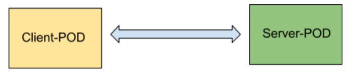
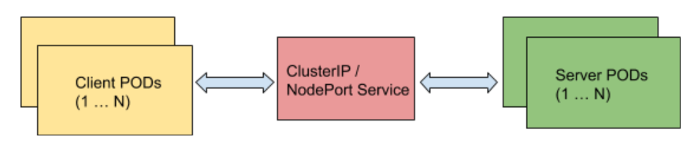
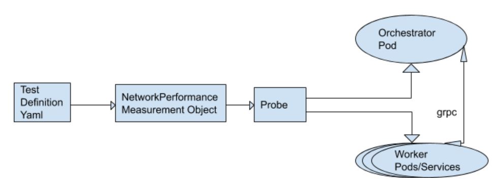
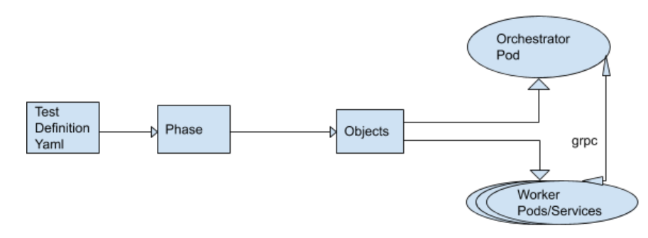

<!--
**Note:** When your KEP is complete, all of these comment blocks should be removed.

To get started with this template:

- [ ] **Pick a hosting SIG.**
  Make sure that the problem space is something the SIG is interested in taking
  up. KEPs should not be checked in without a sponsoring SIG.
- [ ] **Create an issue in kubernetes/enhancements**
  When filing an enhancement tracking issue, please make sure to complete all
  fields in that template. One of the fields asks for a link to the KEP. You
  can leave that blank until this KEP is filed, and then go back to the
  enhancement and add the link.
- [ ] **Make a copy of this template directory.**
  Copy this template into the owning SIG's directory and name it
  `NNNN-short-descriptive-title`, where `NNNN` is the issue number (with no
  leading-zero padding) assigned to your enhancement above.
- [ ] **Fill out as much of the kep.yaml file as you can.**
  At minimum, you should fill in the "Title", "Authors", "Owning-sig",
  "Status", and date-related fields.
- [ ] **Fill out this file as best you can.**
  At minimum, you should fill in the "Summary" and "Motivation" sections.
  These should be easy if you've preflighted the idea of the KEP with the
  appropriate SIG(s).
- [ ] **Create a PR for this KEP.**
  Assign it to people in the SIG who are sponsoring this process.
- [ ] **Merge early and iterate.**
  Avoid getting hung up on specific details and instead aim to get the goals of
  the KEP clarified and merged quickly. The best way to do this is to just
  start with the high-level sections and fill out details incrementally in
  subsequent PRs.

Just because a KEP is merged does not mean it is complete or approved. Any KEP
marked as `provisional` is a working document and subject to change. You can
denote sections that are under active debate as follows:

```
<<[UNRESOLVED optional short context or usernames ]>>
Stuff that is being argued.
<<[/UNRESOLVED]>>
```

When editing KEPS, aim for tightly-scoped, single-topic PRs to keep discussions
focused. If you disagree with what is already in a document, open a new PR
with suggested changes.

One KEP corresponds to one "feature" or "enhancement" for its whole lifecycle.
You do not need a new KEP to move from beta to GA, for example. If
new details emerge that belong in the KEP, edit the KEP. Once a feature has become
"implemented", major changes should get new KEPs.

The canonical place for the latest set of instructions (and the likely source
of this file) is [here](/keps/NNNN-kep-template/README.md).

**Note:** Any PRs to move a KEP to `implementable`, or significant changes once
it is marked `implementable`, must be approved by each of the KEP approvers.
If none of those approvers are still appropriate, then changes to that list
should be approved by the remaining approvers and/or the owning SIG (or
SIG Architecture for cross-cutting KEPs).
-->
# KEP-0001: Enhancing Network Performance Benchmarking Testcases

<!--
This is the title of your KEP. Keep it short, simple, and descriptive. A good
title can help communicate what the KEP is and should be considered as part of
any review.
-->

<!--
A table of contents is helpful for quickly jumping to sections of a KEP and for
highlighting any additional information provided beyond the standard KEP
template.

Ensure the TOC is wrapped with
  <code>&lt;!-- toc --&rt;&lt;!-- /toc --&rt;</code>
tags, and then generate with `hack/update-toc.sh`.
-->

<!-- toc -->
- [Release Signoff Checklist](#release-signoff-checklist)
- [Summary](#summary)
- [Motivation](#motivation)
  - [Goals](#goals)
  - [Non-Goals](#non-goals)
- [Proposal](#proposal)
  - [Test Scenarios](#test-scenarios)
  - [Tools](#tools)
  - [Resource Requirements](#resource-requirements)  
  - [Future Enhancements](#future-enhancements)  
  - [Benefits](#benefits)
  - [Notes/Constraints/Caveats (Optional)](#notesconstraintscaveats-optional)
  - [Risks and Mitigations](#risks-and-mitigations)
- [Design Details](#design-details)
  - [Probes (Option1)](#probes-option1)
  - [Phase (Option2)](#phase-option2)
  - [Metrics visualization](#metrics-visualization)
  - [Running tests](#running-tests)
  - [Comparison of Option1 and Option2](#comparison-of-option1-and-option2)
  - [Test Plan](#test-plan)
  - [Graduation Criteria](#graduation-criteria)
  - [Upgrade / Downgrade Strategy](#upgrade--downgrade-strategy)
  - [Version Skew Strategy](#version-skew-strategy)
- [Production Readiness Review Questionnaire](#production-readiness-review-questionnaire)
  - [Feature Enablement and Rollback](#feature-enablement-and-rollback)
  - [Rollout, Upgrade and Rollback Planning](#rollout-upgrade-and-rollback-planning)
  - [Monitoring Requirements](#monitoring-requirements)
  - [Dependencies](#dependencies)
  - [Scalability](#scalability)
  - [Troubleshooting](#troubleshooting)
- [Implementation History](#implementation-history)
- [Drawbacks](#drawbacks)
- [Alternatives](#alternatives)
- [Infrastructure Needed (Optional)](#infrastructure-needed-optional)
<!-- /toc -->

## Release Signoff Checklist

<!--
**ACTION REQUIRED:** In order to merge code into a release, there must be an
issue in [kubernetes/enhancements] referencing this KEP and targeting a release
milestone **before the [Enhancement Freeze](https://git.k8s.io/sig-release/releases)
of the targeted release**.

For enhancements that make changes to code or processes/procedures in core
Kubernetes—i.e., [kubernetes/kubernetes], we require the following Release
Signoff checklist to be completed.

Check these off as they are completed for the Release Team to track. These
checklist items _must_ be updated for the enhancement to be released.
-->

Items marked with (R) are required *prior to targeting to a milestone / release*.

- [ ] (R) Enhancement issue in release milestone, which links to KEP dir in [kubernetes/enhancements] (not the initial KEP PR)
- [ ] (R) KEP approvers have approved the KEP status as `implementable`
- [ ] (R) Design details are appropriately documented
- [ ] (R) Test plan is in place, giving consideration to SIG Architecture and SIG Testing input
- [ ] (R) Graduation criteria is in place
- [ ] (R) Production readiness review completed
- [ ] Production readiness review approved
- [ ] "Implementation History" section is up-to-date for milestone
- [ ] User-facing documentation has been created in [kubernetes/website], for publication to [kubernetes.io]
- [ ] Supporting documentation—e.g., additional design documents, links to mailing list discussions/SIG meetings, relevant PRs/issues, release notes

<!--
**Note:** This checklist is iterative and should be reviewed and updated every time this enhancement is being considered for a milestone.
-->

[kubernetes.io]: https://kubernetes.io/
[kubernetes/enhancements]: https://git.k8s.io/enhancements
[kubernetes/kubernetes]: https://git.k8s.io/kubernetes
[kubernetes/website]: https://git.k8s.io/website

## Summary

<!--
This section is incredibly important for producing high-quality, user-focused
documentation such as release notes or a development roadmap. It should be
possible to collect this information before implementation begins, in order to
avoid requiring implementors to split their attention between writing release
notes and implementing the feature itself. KEP editors and SIG Docs
should help to ensure that the tone and content of the `Summary` section is
useful for a wide audience.

A good summary is probably at least a paragraph in length.

Both in this section and below, follow the guidelines of the [documentation
style guide]. In particular, wrap lines to a reasonable length, to make it
easier for reviewers to cite specific portions, and to minimize diff churn on
updates.

[documentation style guide]: https://github.com/kubernetes/community/blob/master/contributors/guide/style-guide.md
-->

We are proposing to add more testcases for network performance benchmarking.

## Motivation

<!--
This section is for explicitly listing the motivation, goals and non-goals of
this KEP.  Describe why the change is important and the benefits to users. The
motivation section can optionally provide links to [experience reports] to
demonstrate the interest in a KEP within the wider Kubernetes community.

[experience reports]: https://github.com/golang/go/wiki/ExperienceReports
-->

As Kubernetes is increasingly being adopted by various telco cloud providers for deployments, 
it brings additional networking requirements/scenarios to be supported.  
With wide array of network functions being containerized, the need to analyse and 
monitor the networking performance metrics such as latency, throughput etc has arisen.

We have evaluated 3 test frameworks which have limited testcases for network performance benchmarking.

* [E2E](https://github.com/kubernetes/community/blob/master/contributors/devel/sig-testing/e2e-tests.md): This framework has only 2 testcases for measuring throughput.

* [netperf](https://github.com/kubernetes/perf-tests/tree/master/network/benchmarks/netperf) : This framework 
   measures only the throughput between client-server pods for various MSS(Maximum Segment size). 
   Other performance metrics such as latency , loss-rate , response time are not measured.
   
* [clusterloader2](https://github.com/kubernetes/perf-tests/tree/master/clusterloader2) : This framework 
   measures only network latency. Other performance metrics are not measured.

### Goals

<!--
List the specific goals of the KEP. What is it trying to achieve? How will we
know that this has succeeded?
-->

The primary goal of this proposal is to enhance the testcases to cover various 
networking scenarios :

1. IPv4 , IPv6 , Dual-Stack.
2. Protocols: TCP, UDP, HTTP/HTTPS.
3. Pod-to-Pod , with services ClusterIP , NodePort etc.

We intend to submit tests to measure the following network performance metrics for various 
scenarios such as different services (ClusterIP/NodePort), with IPv4/IPv6 configured etc.

1. Throughput (For TCP traffic)
2. Packets per second (For UDP traffic)
3. Loss rate (For UDP traffic)
4. Latency/Jitter (For UDP/HTTP/HTTPS)
    (Note: Latency being measured is a one-way latency)
5. Response time (For HTTP/HTTPs)
    (Note: Response time is a two-way latency plus processing time)

Our important goal is to make sure these benchmarking testcases are run periodically,
so that any degradation in performance is detected in early phase of feature delivery.

### Non-Goals

<!--
What is out of scope for this KEP? Listing non-goals helps to focus discussion
and make progress.
-->

## Proposal

<!--
This is where we get down to the specifics of what the proposal actually is.
This should have enough detail that reviewers can understand exactly what
you're proposing, but should not include things like API designs or
implementation. The "Design Details" section below is for the real
nitty-gritty.
-->

### Test Scenarios

1. Baseline Testcases

	Following testcases will be able to gather the baseline values for network performance metrics. 

	1.1 Point-To-Point (P2P)

	  

	  1.1.1 Client-Server POD on different worker node (1:1)

	  Testcase-Id | Testcase Description | Tool | Metrics Measured
	  ----------- | ---------------------|------|-----------------
	  TC1.1.1.1   | Send TCP traffic from client pod IP to server pod IP | iperf3 | Throughput in Gbits/s
	  TC1.1.1.2   | Send UDP traffic from client pod IP to server pod IP | iperf2 | Packets per second (pps), Loss Rate, Latency, jitter
	  TC1.1.1.3   | Send HTTP traffic from client pod IP to server pod IP | siege | Latency , ResponseTime


	1.2 ClusterIP / NodePort Services

	  

	  1.2.1 Client-Server POD on different worker node (1:1)

	  TestcaseId | Testcase Description | Tool | Metrics Measured
	  ----------- | ---------------------|------|-----------------
	  TC1.2.1.1   | Send TCP traffic from client pod IP to ClusterIP. 1 server pod is located behind ClusterIP service. | iperf3 | Throughput in Gbits/s
	  TC1.2.1.2   | Send UDP traffic from client pod IP to ClusterIP. 1 server pod is located behind ClusterIP service. | iperf2 | Packets per second (pps), Loss Rate, Latency, jitter
	  TC1.2.1.3   | Send HTTP traffic from client pod IP to ClusterIP. 1 server pod is located behind ClusterIP service. | siege | Latency , ResponseTime
	  TC1.2.1.4   | Send TCP traffic from client pod IP to NodePort svc IP. 1 server pod is located behind NodePort service. | iperf3 | Throughput in Gbits/s
	  TC1.2.1.5   | Send UDP traffic from client pod IP to NodePort svc IP. 1 server pod is located behind NodePort service. | iperf2 | Packets per second (pps), Loss Rate, Latency, jitter
	  TC1.2.1.6   | Send HTTP traffic from client pod IP to NodePort svcIP. 1 server pod is located behind NodePort service. | siege | Latency , ResponseTime


2. Scale Testcases

    2.1 Point-To-Point (P2P) 

    2.1.1 Client-Server POD on different worker node (N:1)

	  TestcaseId  | Testcase Description | Tool | Metrics Measured
	  ----------- | ---------------------|------|-----------------
	  TC2.1.1.1   | Send TCP traffic from N=50 client pods to 1 server pod IP. | iperf3 | Throughput in Gbits/s
	  TC2.1.1.2   | Send TCP traffic from N=100 client pods to 1 server pod IP. | iperf3 | Throughput in Gbits/s
	  TC2.1.1.3   | Send UDP traffic from N=50 client pods to 1 server pod IP. | iperf2 | Packets per second (pps), Loss Rate, Latency, jitter
	  TC2.1.1.4   | Send UDP traffic from N=50 client pods to 1 server pod IP. | iperf2 | Packets per second (pps), Loss Rate, Latency, jitter
	  TC2.1.1.5   | Send HTTP traffic from N=50 client pods to 1 server pod IP. | siege | Latency , ResponseTime
	  TC2.1.1.6   | Send HTTP traffic from N=100 client pods to 1 server pod IP. | siege | Latency , ResponseTime


	2.1.2 Client-Server POD on different worker node (N:M)

	* A pair of client and server pod will be selected out of N/M pod.
	* Client POD size N=50 and Server POD size M=50.
	* This test will require 100 worker nodes i.e N+M, so that we can make sure client and server pods are not co-located.
	* Each metric will be a percentile of 50 pairs.
	

   TestcaseId  | Testcase Description | Tool | Metrics Measured
   ----------- | ---------------------|------|-----------------
    TC2.1.2.1 | Send TCP traffic from client pod IP to server pod IP (1:1) | iperf3 | Throughput in Gbits/s
    TC2.1.2.2 | Send UDP traffic from client pod IP to server pod IP (1:1) | iperf2 | Packets per second (pps), Loss Rate, Latency, jitter
    TC2.1.2.3 | Send HTTP traffic from client pod IP to server pod IP (1:1) | siege | Latency , ResponseTime


    2.2 ClusterIP / NodePort Services

      N:1 Scenario has been intentionally omitted because, in real-world deployment scenarios application pods will be more than one behind services such as ClusterIP/NodePort.
      
	  2.2.1 Client-Server POD on different worker node (N:M) (HTTP traffic)

	* Client POD size N=50 and Server POD size M=50. 5 HTTP Server PODs will be grouped under 1 Service.
	* 5 Client PODS will send traffic to 1 ClusterIP/NodePort svc IP.
	* Below testcases will measure the network performance metrics with scaled service IPs (1 ClientPOD -> 1 ServiceIP -> 1 ServerPOD), as well as with load-balancing (N ClientPOD -> 1 ServiceIP -> N ServerPOD).
	
     TestcaseId  | Testcase Description | Tool | Metrics Measured
     ----------- | ---------------------|------|-----------------
     TC2.2.1.1  | Send HTTP traffic from 1 client pod IPs to ClusterIP. 1 server pod is located behind ClusterIP service (1:1) | siege | Latency , ResponseTime
     TC2.2.1.2  | Send HTTP traffic from 1 client pod IPs to NodePort svc IP. 1 server pod is located behind NodePort service (1:1) | siege | Latency , ResponseTime
     TC2.2.1.3  | Send HTTP traffic from 5 client pod IPs to ClusterIP. 5 server pods are located behind ClusterIP service. | siege | Latency , ResponseTime
     TC2.2.1.4  | Send HTTP traffic from 5 client pod IPs to NodePort svc IP. 5 server pods are located behind NodePort service. | siege | Latency , ResponseTime
	
      2.2.2 Client-Server POD on different worker node (N:M) (TCP/UDP traffic)
	  
	* Client POD size N=50 and Server POD size M=50. Each server pod will be behind one unique ClusterIP/NodePort Svc. So 50 clusterIP will be created for TCP/UDP traffic only. ( 1 Client POD ---> 1 ClusterIP ---> 1 Server POD)
	* This test will require 100 worker nodes i.e N+M, so that we can make sure client and server pods are not co-located.
	* Each metric will be a percentile of 50 pairs.
		
     TestcaseId  | Testcase Description | Tool | Metrics Measured
     ----------- | ---------------------|------|-----------------
     TC2.2.2.1  | Send TCP traffic from 1 client pod IPs to 1 server pod is located behind respective unique ClusterIP (1:1) | iperf3 | Throughput in Gbits/s
     TC2.2.2.2  | Send UDP traffic from 1 client pod IPs to 1 server pods is located behind respective unique ClusterIP (1:1) | iperf2 | Packets per second (pps), Loss Rate, Latency, jitter
     TC2.2.2.3  | Send TCP traffic from 1 client pod IPs to NodePort svc IP. 1 server pod is located behind NodePort service (1:1) | iperf3 | Throughput in Gbits/s
     TC2.2.2.4  | Send UDP traffic from 1 client pod IPs to NodePort svc IP. 1 server pod is located behind NodePort service (1:1) | iperf2 | Packets per second (pps), Loss Rate, Latency, jitter
    

### Tools

We intend to use the following tools for testing :

1. iperf3: For TCP throughput measurement.

2. iperf2: For UDP latency, loss rate , pps measurement.

3. Siege: Siege is an open source benchmark utility. 
   It will be used for measuring HTTP/HTTPs metrics such as total number of hits recorded, 
   bytes transferred, response time, concurrency, and return status. 

Other tools such as Trex will be used in future for further enhancements.

### Resource Requirements

1. Worker nodes : We will need worker nodes (VMs) to run client and server pods.
   As mentioned in test scenarios, we require 100 worker nodes to run the testcases.

2. Memory : Each worker node should have atleast 4 Gb of memory. 

3. vCPUs : Each worker node should have atleast 2 vCPUs to run tools at full capacity.
   We can pin the vCPUs to tools to run them efficienlty. If multiple client-server pods 
   are run on same worker node, then more then 2 vCPUs might be required.

### Future Enhancements

Performance benchmarking frameworks can be enhanced to include testcases related to various CNIs.

### Benefits

1) Our proposal attempts to standardize the test scenarios and cover most common performance metrics.
2) Detecting performance degradation in early phase of feature delivery.
3) With standard test scenarios available, kubernetes users will be able adopt these test frameworks
   to validate their downstream offerings.  
   

### Notes/Constraints/Caveats (Optional)

<!--
What are the caveats to the proposal?
What are some important details that didn't come across above?
Go in to as much detail as necessary here.
This might be a good place to talk about core concepts and how they relate.
-->

Benchmarking and measurements with intermediate services like ingress controllers, load-balancers 
are out of scope of this proposal.

### Risks and Mitigations

<!--
What are the risks of this proposal, and how do we mitigate? Think broadly.
For example, consider both security and how this will impact the larger
Kubernetes ecosystem.

How will security be reviewed, and by whom?

How will UX be reviewed, and by whom?

Consider including folks who also work outside the SIG or subproject.
-->

## Design Details

<!--
This section should contain enough information that the specifics of your
change are understandable. This may include API specs (though not always
required) or even code snippets. If there's any ambiguity about HOW your
proposal will be implemented, this is the place to discuss them.
-->

Kubernetes uses the Prow framework for CI/CD and the new network performance related tests are also planned to be added as part of prow jobs.

There were multiple test frameworks analysed for running the test cases like: k8s E2E tests and sig-scalability’s Netperf and ClusterLoader2 frameworks.
Since we are planning to have the test cases under sig scalability where ClusterLoader2 is already running many test cases as part of kubernetes CI/CD and since the framework is easy to extend for creating new tests and test scenarios ,it is decided to use ClusterLoader2 for the implementation.These tests needs a statistical distribution on a large number of pods to smooth out infrastructure dependencies  and cluster loader framework already run tests with similar requirements.


The below 3PP tools will be used for benchmarking network performance:
* Iperf2
* Iperf3
* Siege

These tools would be included as part of a container image and would be run as pods(as client pods and server pods) for collecting measurements.

There are 2 design options identified to implement these test cases in ClusterLoader:
* Probes
* Phases

### Probes (Option1)

Currently clusterloader2 captures Network Latency of http request/response and uses probes for measuring the Network Latency, this design option would follow the similar implementation for measuring new network performance parameters.

The implementation would be such that the measurement could not only be used for the specific test cases but would give access to anyone to measure any of these network parameters in their respective tests.There would be an option to run all the measurements in parallel or option to measure each performance parameters individually(or a subset) as required(as per test definition yaml).



There would be 3 major changes for the test case implementation:

* New measurement object and test definition yaml
  A new measurement object would be created using probe which supports following actions(existing actions) 
  * Start: for starting the probes which would create an orchestrator pod, and worker pods and any services required
  * Gather: for collecting the measurements.
  
  The measurement object would support following new parameters for giving flexibility to measure all the network performance metrics or a specific one(or a subset) :
  * Protocol : Can have value ‘all’ or specific protocol/s like tcp/udp/http
  * Metrics: Can have value ‘all’ or specific metric/s like throughput/latency/jitter
  * Service: Can have value ‘all’ or specific service/s,like clusterip/nodePort/ingress/noservice(noservice would mean pod to pod communication using pod ip)
  * Nodes: Number of nodes on which the test has to run.
  * Topology: Can have value ‘all’ or specific value/s like 1:1,N:1,N:M
  
  NOTE:In the initial implementation, Protocol and Measurement would be  allowed to take only ‘all’ as value.Implementation for giving subset of metrics ,protocol and type of service(no service/clusterip/nodePort) will be done in later phase.
  
  If Protocol and Measurement is given ‘all’ as value, then all the test cases(which measure all network performance metrics and test scenarios) as described in the test scenario/topology document will be run.

  The node value would be used to allocate number of pods for specific test scenarios(a ratio will be predefined to determine how many pods for 1:1,N:1,N:M with and without services) and all measurements would be run in parallel.

  The new measurement object with action and parameters could be specified in test definition yaml to start and gather network performance metric measurements.

* Orchestrator Pod :
  The orchestrator pod would be responsible for identifying client server pod pairs,assigning work(type of metrics to collect) to worker pods,starting measurements ,synchronization between worker pods and collecting the measurement once the measurements are completed(ie gather).Orchestrator pods will talk to the worker pods using grpc mechanism.The orchestrator pod will be loaded by the measurement probe and there would be only one orchestrator pod loaded.
  
* Worker Pods(client pods and server pods):
  There could be multiple worker pods created for measuring all metrics and multiple scenarios(like co located client-server,distributed client-server,without service and with service, topologies 1:1,N:1,N:M)

  The worker pods will receive instructions from the orchestrator pods for starting any kind of measurement through grpc.The worker pods will work in pairs(client pod:server pod).For N:1 test scenario the N pods need to be starting measurement at the same time, this could be achieved either by depending on grpc or OS time stamp if the machines in cloud are synchronized on time.

  Each worked pod will be provided the following details by the orchestrator through grpc: client address(could be ip or name depending on service) for server, server address for client,protocol,metric to measure,start measurement,stop measurement.
  
### Phase (Option2)



In this design option instead of implementing the metric collection as clusterLoader Measurement, the pods and service objects for measuring the metrics will be created using clusterLoader’s Phase definition.

There would be following object templates created : 
* Object template for worker and server pods(having image containing test tools and code)
* Object template for services(clusterip and NodePort)

These templates would be used in phase definition.The design of pods and services would be inline as in the previous option,the only difference here would be that the pods would not be created as probes.

As in the previous option there would be one orchestrator pod and multiple worker pods created(the number of replicas and other variable parameters will be passed from test definition).Orchestrator pod would be required for assigning client server pods with ip addresses(esp in pod to pod scenario with no service),synchronizing between worker pods and for collecting and creating result summaries.

The different test cases/scenarios can be run in parallel or serial by specifying the objects(pod and services) in different clusterloader steps(serial) or same step(parallel).

### Metrics visualization

The metrics collected would be displayed in the Perfdash dashboard by modifying the perfdash config.go to include all the new metrics collected as part of the new test cases. Perfdash shows graphs containing data points from multiple builds(along with historical data) ,this would help in analyzing variation of metrics across builds and help identify issues wrt network performance in new builds.
The metrics to be displayed will be put into a file in the required file format and file name format in the artifacts directory so that Perfdash picks up the metrics and displays in its dashboard.

### Running tests

The new tests could be run in 2 ways:
* As part of existing clusterloader test scenarios like density/load test:
  Clusterloader currently runs multiple test scenarios like load and density tests.Network latency measurement for http request/response are currently measured as part of these tests.The new network performance metrics could also be measured along with these tests itself in similar manner.
  
  Advantages:
  * The number of resources required for running the tests will not be significantly higher as we would be adding tests on existing test scenarios and hence the resources will be shared with the existing tests.
  * The total time for running CI tests will not be considerably increased as compared to if the tests were to run as separate tests,since the new tests would be running in parallel to the existing tests.
  * We would be able to capture the network performance parameters in different loads/density scenarios,which would help us know the worst case measurements for these metrics.
  
  Disadvanatages:
  * There is a possibility of the metrics output getting polluted as there would be other tests also  running in parallel.  

* As new set of tests:
  In this option there would be a new test definition yaml created and all the new network performance related tests would be run independent of existing test scenarios.
  
  Advantages:
  * The metrics will not be polluted by other test cases running in parallel.
  
  Disadvanatages:
  * The number of resources required for running these news tests would be significantly higher.
  * The total time for running the CI test cases will be higher.The time would be further increased if the new tests are run as part of a new prow job(and not as a new test scenario as part of existing prow job) since the time for cluster setup and teardown will have to be considered.
  
### Comparison of Option1 and Option2

* Probes (Option1)
  Advantages:
  * Since the test actually measures metrics, creating new clusterLoader measurement object will be inline with the clusterloader framework and moreover current implementation of InClusterNetworkLatency follows this design. 
  * Other users would be able to make use of the new measurements as part of any of their test cases as well.
  * Defining test cases requiring any Network performance measurements would be simpler when compared to the other design 

  Disadvantages:
  * The implementation will need to change the framework code to include new measurements and would require more effort than the other option
  
* Phases (Option2)
  Advantages:
  * The implementation would be simpler and with less effort than the other option.

  Disadvantages:
  * This implementation may not be inline with the concepts of clusterloader, since the test measures network performance metrics.
  * The test definition would be little complex compared to the other option.
  
### Test Plan

<!--
**Note:** *Not required until targeted at a release.*

Consider the following in developing a test plan for this enhancement:
- Will there be e2e and integration tests, in addition to unit tests?
- How will it be tested in isolation vs with other components?

No need to outline all of the test cases, just the general strategy. Anything
that would count as tricky in the implementation, and anything particularly
challenging to test, should be called out.

All code is expected to have adequate tests (eventually with coverage
expectations). Please adhere to the [Kubernetes testing guidelines][testing-guidelines]
when drafting this test plan.

[testing-guidelines]: https://git.k8s.io/community/contributors/devel/sig-testing/testing.md
-->

### Graduation Criteria

<!--
**Note:** *Not required until targeted at a release.*

Define graduation milestones.

These may be defined in terms of API maturity, or as something else. The KEP
should keep this high-level with a focus on what signals will be looked at to
determine graduation.

Consider the following in developing the graduation criteria for this enhancement:
- [Maturity levels (`alpha`, `beta`, `stable`)][maturity-levels]
- [Deprecation policy][deprecation-policy]

Clearly define what graduation means by either linking to the [API doc
definition](https://kubernetes.io/docs/concepts/overview/kubernetes-api/#api-versioning)
or by redefining what graduation means.

In general we try to use the same stages (alpha, beta, GA), regardless of how the
functionality is accessed.

[maturity-levels]: https://git.k8s.io/community/contributors/devel/sig-architecture/api_changes.md#alpha-beta-and-stable-versions
[deprecation-policy]: https://kubernetes.io/docs/reference/using-api/deprecation-policy/

Below are some examples to consider, in addition to the aforementioned [maturity levels][maturity-levels].

#### Alpha -> Beta Graduation

- Gather feedback from developers and surveys
- Complete features A, B, C
- Tests are in Testgrid and linked in KEP

#### Beta -> GA Graduation

- N examples of real-world usage
- N installs
- More rigorous forms of testing—e.g., downgrade tests and scalability tests
- Allowing time for feedback

**Note:** Generally we also wait at least two releases between beta and
GA/stable, because there's no opportunity for user feedback, or even bug reports,
in back-to-back releases.

#### Removing a Deprecated Flag

- Announce deprecation and support policy of the existing flag
- Two versions passed since introducing the functionality that deprecates the flag (to address version skew)
- Address feedback on usage/changed behavior, provided on GitHub issues
- Deprecate the flag

**For non-optional features moving to GA, the graduation criteria must include 
[conformance tests].**

[conformance tests]: https://git.k8s.io/community/contributors/devel/sig-architecture/conformance-tests.md
-->

### Upgrade / Downgrade Strategy

<!--
If applicable, how will the component be upgraded and downgraded? Make sure
this is in the test plan.

Consider the following in developing an upgrade/downgrade strategy for this
enhancement:
- What changes (in invocations, configurations, API use, etc.) is an existing
  cluster required to make on upgrade, in order to maintain previous behavior?
- What changes (in invocations, configurations, API use, etc.) is an existing
  cluster required to make on upgrade, in order to make use of the enhancement?
-->

### Version Skew Strategy

<!--
If applicable, how will the component handle version skew with other
components? What are the guarantees? Make sure this is in the test plan.

Consider the following in developing a version skew strategy for this
enhancement:
- Does this enhancement involve coordinating behavior in the control plane and
  in the kubelet? How does an n-2 kubelet without this feature available behave
  when this feature is used?
- Will any other components on the node change? For example, changes to CSI,
  CRI or CNI may require updating that component before the kubelet.
-->

## Production Readiness Review Questionnaire

<!--

Production readiness reviews are intended to ensure that features merging into
Kubernetes are observable, scalable and supportable; can be safely operated in
production environments, and can be disabled or rolled back in the event they
cause increased failures in production. See more in the PRR KEP at
https://git.k8s.io/enhancements/keps/sig-architecture/20190731-production-readiness-review-process.md.

The production readiness review questionnaire must be completed for features in
v1.19 or later, but is non-blocking at this time. That is, approval is not
required in order to be in the release.

In some cases, the questions below should also have answers in `kep.yaml`. This
is to enable automation to verify the presence of the review, and to reduce review
burden and latency.

The KEP must have a approver from the
[`prod-readiness-approvers`](http://git.k8s.io/enhancements/OWNERS_ALIASES)
team. Please reach out on the
[#prod-readiness](https://kubernetes.slack.com/archives/CPNHUMN74) channel if
you need any help or guidance.

-->

### Feature Enablement and Rollback

_This section must be completed when targeting alpha to a release._

* **How can this feature be enabled / disabled in a live cluster?**
  - [ ] Feature gate (also fill in values in `kep.yaml`)
    - Feature gate name:
    - Components depending on the feature gate:
  - [ ] Other
    - Describe the mechanism:
    - Will enabling / disabling the feature require downtime of the control
      plane?
    - Will enabling / disabling the feature require downtime or reprovisioning
      of a node? (Do not assume `Dynamic Kubelet Config` feature is enabled).

* **Does enabling the feature change any default behavior?**
  Any change of default behavior may be surprising to users or break existing
  automations, so be extremely careful here.

* **Can the feature be disabled once it has been enabled (i.e. can we roll back
  the enablement)?**
  Also set `disable-supported` to `true` or `false` in `kep.yaml`.
  Describe the consequences on existing workloads (e.g., if this is a runtime
  feature, can it break the existing applications?).

* **What happens if we reenable the feature if it was previously rolled back?**

* **Are there any tests for feature enablement/disablement?**
  The e2e framework does not currently support enabling or disabling feature
  gates. However, unit tests in each component dealing with managing data, created
  with and without the feature, are necessary. At the very least, think about
  conversion tests if API types are being modified.

### Rollout, Upgrade and Rollback Planning

_This section must be completed when targeting beta graduation to a release._

* **How can a rollout fail? Can it impact already running workloads?**
  Try to be as paranoid as possible - e.g., what if some components will restart
   mid-rollout?

* **What specific metrics should inform a rollback?**

* **Were upgrade and rollback tested? Was the upgrade->downgrade->upgrade path tested?**
  Describe manual testing that was done and the outcomes.
  Longer term, we may want to require automated upgrade/rollback tests, but we
  are missing a bunch of machinery and tooling and can't do that now.

* **Is the rollout accompanied by any deprecations and/or removals of features, APIs, 
fields of API types, flags, etc.?**
  Even if applying deprecation policies, they may still surprise some users.

### Monitoring Requirements

_This section must be completed when targeting beta graduation to a release._

* **How can an operator determine if the feature is in use by workloads?**
  Ideally, this should be a metric. Operations against the Kubernetes API (e.g.,
  checking if there are objects with field X set) may be a last resort. Avoid
  logs or events for this purpose.

* **What are the SLIs (Service Level Indicators) an operator can use to determine 
the health of the service?**
  - [ ] Metrics
    - Metric name:
    - [Optional] Aggregation method:
    - Components exposing the metric:
  - [ ] Other (treat as last resort)
    - Details:

* **What are the reasonable SLOs (Service Level Objectives) for the above SLIs?**
  At a high level, this usually will be in the form of "high percentile of SLI
  per day <= X". It's impossible to provide comprehensive guidance, but at the very
  high level (needs more precise definitions) those may be things like:
  - per-day percentage of API calls finishing with 5XX errors <= 1%
  - 99% percentile over day of absolute value from (job creation time minus expected
    job creation time) for cron job <= 10%
  - 99,9% of /health requests per day finish with 200 code

* **Are there any missing metrics that would be useful to have to improve observability 
of this feature?**
  Describe the metrics themselves and the reasons why they weren't added (e.g., cost,
  implementation difficulties, etc.).

### Dependencies

_This section must be completed when targeting beta graduation to a release._

* **Does this feature depend on any specific services running in the cluster?**
  Think about both cluster-level services (e.g. metrics-server) as well
  as node-level agents (e.g. specific version of CRI). Focus on external or
  optional services that are needed. For example, if this feature depends on
  a cloud provider API, or upon an external software-defined storage or network
  control plane.

  For each of these, fill in the following—thinking about running existing user workloads
  and creating new ones, as well as about cluster-level services (e.g. DNS):
  - [Dependency name]
    - Usage description:
      - Impact of its outage on the feature:
      - Impact of its degraded performance or high-error rates on the feature:


### Scalability

_For alpha, this section is encouraged: reviewers should consider these questions
and attempt to answer them._

_For beta, this section is required: reviewers must answer these questions._

_For GA, this section is required: approvers should be able to confirm the
previous answers based on experience in the field._

* **Will enabling / using this feature result in any new API calls?**
  Describe them, providing:
  - API call type (e.g. PATCH pods)
  - estimated throughput
  - originating component(s) (e.g. Kubelet, Feature-X-controller)
  focusing mostly on:
  - components listing and/or watching resources they didn't before
  - API calls that may be triggered by changes of some Kubernetes resources
    (e.g. update of object X triggers new updates of object Y)
  - periodic API calls to reconcile state (e.g. periodic fetching state,
    heartbeats, leader election, etc.)

* **Will enabling / using this feature result in introducing new API types?**
  Describe them, providing:
  - API type
  - Supported number of objects per cluster
  - Supported number of objects per namespace (for namespace-scoped objects)

* **Will enabling / using this feature result in any new calls to the cloud 
provider?**

* **Will enabling / using this feature result in increasing size or count of 
the existing API objects?**
  Describe them, providing:
  - API type(s):
  - Estimated increase in size: (e.g., new annotation of size 32B)
  - Estimated amount of new objects: (e.g., new Object X for every existing Pod)

* **Will enabling / using this feature result in increasing time taken by any 
operations covered by [existing SLIs/SLOs]?**
  Think about adding additional work or introducing new steps in between
  (e.g. need to do X to start a container), etc. Please describe the details.

* **Will enabling / using this feature result in non-negligible increase of 
resource usage (CPU, RAM, disk, IO, ...) in any components?**
  Things to keep in mind include: additional in-memory state, additional
  non-trivial computations, excessive access to disks (including increased log
  volume), significant amount of data sent and/or received over network, etc.
  This through this both in small and large cases, again with respect to the
  [supported limits].

### Troubleshooting

The Troubleshooting section currently serves the `Playbook` role. We may consider
splitting it into a dedicated `Playbook` document (potentially with some monitoring
details). For now, we leave it here.

_This section must be completed when targeting beta graduation to a release._

* **How does this feature react if the API server and/or etcd is unavailable?**

* **What are other known failure modes?**
  For each of them, fill in the following information by copying the below template:
  - [Failure mode brief description]
    - Detection: How can it be detected via metrics? Stated another way:
      how can an operator troubleshoot without logging into a master or worker node?
    - Mitigations: What can be done to stop the bleeding, especially for already
      running user workloads?
    - Diagnostics: What are the useful log messages and their required logging
      levels that could help debug the issue?
      Not required until feature graduated to beta.
    - Testing: Are there any tests for failure mode? If not, describe why.

* **What steps should be taken if SLOs are not being met to determine the problem?**

[supported limits]: https://git.k8s.io/community//sig-scalability/configs-and-limits/thresholds.md
[existing SLIs/SLOs]: https://git.k8s.io/community/sig-scalability/slos/slos.md#kubernetes-slisslos

## Implementation History

<!--
Major milestones in the lifecycle of a KEP should be tracked in this section.
Major milestones might include:
- the `Summary` and `Motivation` sections being merged, signaling SIG acceptance
- the `Proposal` section being merged, signaling agreement on a proposed design
- the date implementation started
- the first Kubernetes release where an initial version of the KEP was available
- the version of Kubernetes where the KEP graduated to general availability
- when the KEP was retired or superseded
-->

## Drawbacks

<!--
Why should this KEP _not_ be implemented?
-->

## Alternatives

<!--
What other approaches did you consider, and why did you rule them out? These do
not need to be as detailed as the proposal, but should include enough
information to express the idea and why it was not acceptable.
-->

## Infrastructure Needed (Optional)

<!--
Use this section if you need things from the project/SIG. Examples include a
new subproject, repos requested, or GitHub details. Listing these here allows a
SIG to get the process for these resources started right away.
-->
