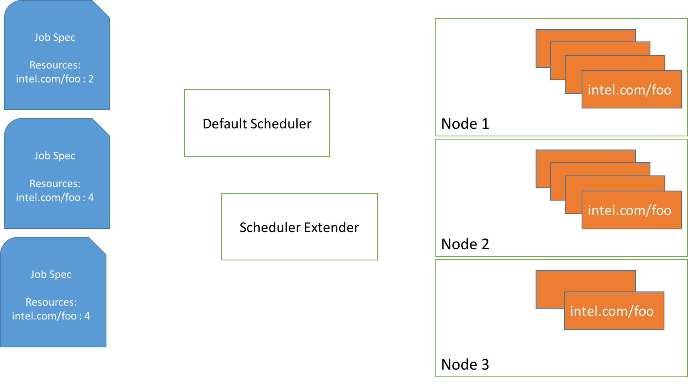
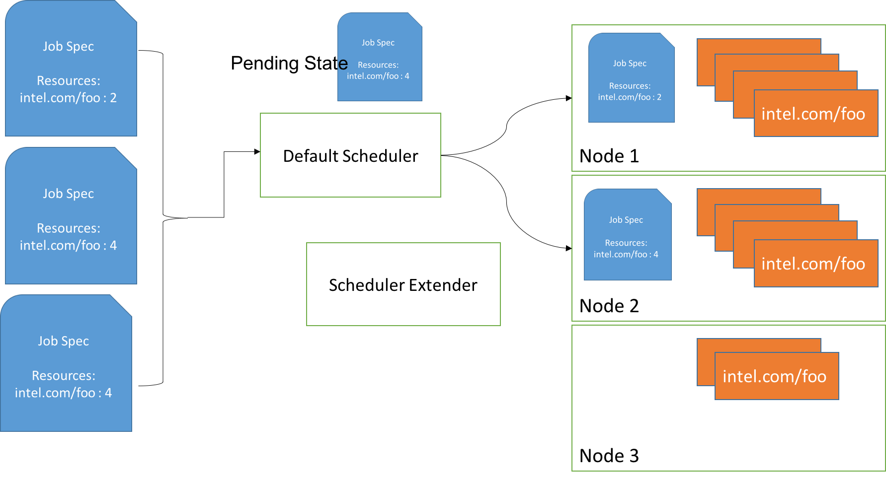
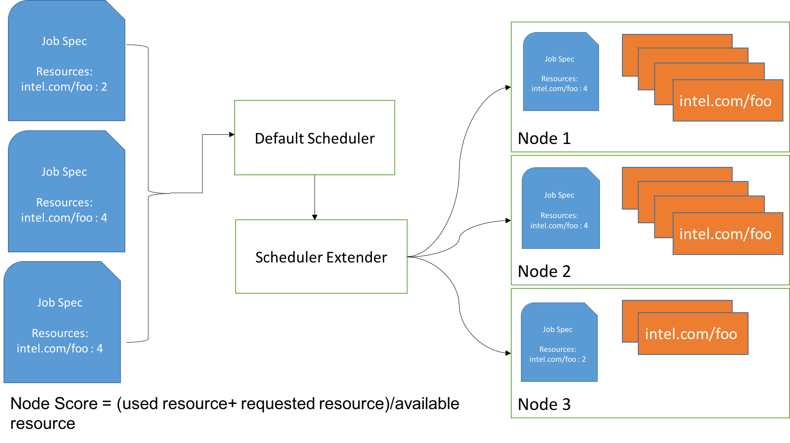

# ExtendingRequestedToCapacityRatio Priority Function to support Resource Bin Packing of Extended Resources

## Table of Contents

<!-- toc -->
- [Summary](#summary)
- [Motivation](#motivation)
  - [Goals](#goals)
  - [Non-Goals](#non-goals)
- [Proposal](#proposal)
  - [Argument Input Scenarios](#argument-input-scenarios)
  - [Design Details](#design-details)
  - [User Stories](#user-stories)
    - [Story 1](#story-1)
    - [Default Behavior](#default-behavior)
    - [Extender Resource Scheduler Behavior](#extender-resource-scheduler-behavior)
  - [Test Plan](#test-plan)
  - [Graduation Criteria](#graduation-criteria)
    - [Examples](#examples)
- [Implementation History](#implementation-history)
<!-- /toc -->

## Summary

Extend RequestedToCapacityRatio Priority Function to allow users to use the best fit polices during scheduling. It will allow users to apply [bin packing](https://en.wikipedia.org/wiki/Bin_packing_problem) on core resources like CPU, Memory as well as extended resources like accelerators.

## Motivation

While running workloads on kubernetes which use accelerator devices the default scheduler spreads pods across nodes resulting in fragmentation of extended resources. This fragmentation prevents scheduling pods with larger device resource requirements, and they remain in the pending state.

### Goals

- Schedule Pods using BestFit Policy using RequestedToCapacityRatio Priority Function for extended Resources
- Reduce Fragmentation of scarce resources on the Cluster

### Non-Goals

-

## Proposal

The plan is to modify  `requested_to_capacity_ratio` priority function to support `resource_bin_packing` of extended resources. Add another argument `resources` of type `map[v1.ResourceName]int64{}` .This would allow users who want to bin pack a resource to use the function by setting the argument resources which would require them to specify weights for bin packing. For example

```yaml
"priorities": [
   ...{
      "name":"RequestedToCapacityRatioPriority",
      "weight":5,
      "argument":{
         "requestedToCapacityRatioArguments":{
            "shape":[
               {
                  "utilization":100,
                  "score":10
               },
               {
                  "utilization":0,
                  "score":0
               }
            ],
            "resources":[
               {
                  "resource":"intel.com/foo",
                  "weight":5
               },
               {
                  "resource":"intel.com/bar",
                  "weight":2
               },
               {
                  "resource":"cpu",
                  "weight":1
               }
            ]
         }
      }
   }
]
```

The argument `resources` is optional and by default will be set to the value

```go
resources := map[v1.ResourceName]int64{
  v1.ResourceMemory : 1,
  v1.ResourceCPU    : 1,
}
```

### Argument Input Scenarios

1. If the resource does not exist the score for that resources defaults to 0
2. As we are storing resources as a map there can be a single weight for every resource type.
3. Negative weights are not allowed, this would be filtered inside the function and an appropriate error would be thrown.


### Design Details

The node score would be calculated as (podRequest + requested) / allocatable. The weights would be used to calculate the resulting node score in the following way.

```go
resources := make(map[v1.ResourceName]weight)
nodeScore := 0
weightSum := 0
for resource, weight := range resources {
  nodeScore += resourceScoringFunction((podRequest[resource]+ requested[resource]), allocatable[resource]) * weight
  weightSum += weight
}
nodeScore = nodeScore / weightSum
```

Update the  function `buildRequestedToCapacityRatioScorerFunction` definition as

```go
func buildRequestedToCapacityRatioScorerFunction(scoringFunctionShape FunctionShape, resources []Resources) func(nodeInfo *schedulercache.NodeInfo) int64
```


### User Stories

#### Story 1

Let's consider a cluster with `intel.com/foo` as a scarce resource. A user needs to submit 3 `jobs` with specs as shown below



#### Default Behavior

The default scheduler in most cases will schedule the Pods as follows as there is no priority function for an extended resource for bin packing.



#### Extender Resource Scheduler Behavior

The Scheduler should submit the 2 resource job on Node 3 as the utilization is higher. This would reduce the fragmentation of extended resource and reduce pods in the pending state.



### Test Plan

- **Unit Tests:** All changes must be covered by unit tests.
- **Integration Tests:** The use cases discussed in this KEP must
  be covered by integration tests.

### Graduation Criteria

Alpha:

- [ ] This feature will be rolled out as an Alpha feature in v1.15
- [ ] Necessary defaulting, validation
- [ ] Adequate documentation for the changes
- [ ] Minimum viable test cases mentioned in [Test Plan](#test-plan) section

#### Examples

```
Requested Resources

intel.com/foo : 2
Memory: 256MB
CPU: 2

Resource Weights

intel.com/foo : 5
Memory: 1
CPU: 3

FunctionShapePoint {{0, 0}, {100, 10}}

Node 1 Spec

Available:
intel.com/foo : 4
Memory : 1 GB
CPU: 8

Used:
intel.com/foo: 1
Memory: 256MB
CPU: 1


Node Score:

intel.com/foo  = resourceScoringFunction((2+1),4)
               =  (100 - ((4-3)*100/4)
               =  (100 - 25)
               =  75
               =  rawScoringFunction(75)
               = 7

Memory         = resourceScoringFunction((256+256),1024)
               = (100 -((1024-512)*100/1024))
               = 50
               = rawScoringFunction(50)
               = 5

CPU            = resourceScoringFunction((2+1),8)
               = (100 -((8-3)*100/8))
               = 37.5
               = rawScoringFunction(37.5)
               = 4

NodeScore   =  (7 * 5) + (5 * 1) + (4 * 3) / (5 + 1 + 3)
            =  6


Node 2 Spec

Available:
intel.com/foo: 8
Memory: 1GB
CPU: 8

Used:

intel.com/foo: 2
Memory: 512MB
CPU: 6


Node Score:

intel.com/foo  = resourceScoringFunction((2+2),8)
               =  (100 - ((8-4)*100/8)
               =  (100 - 25)
               =  50
               =  rawScoringFunction(50)
               = 5

Memory         = resourceScoringFunction((256+512),1024)
               = (100 -((1024-768)*100/1024))
               = 75
               = rawScoringFunction(75)
               = 7

CPU            = resourceScoringFunction((2+6),8)
               = (100 -((8-8)*100/8))
               = 100
               = rawScoringFunction(100)
               = 10

NodeScore   =  (5 * 5) + (7 * 1) + (10 * 3) / (5 + 1 + 3)
            =  7

```

## Implementation History

- 2019-03-11: Initial KEP sent out for review.