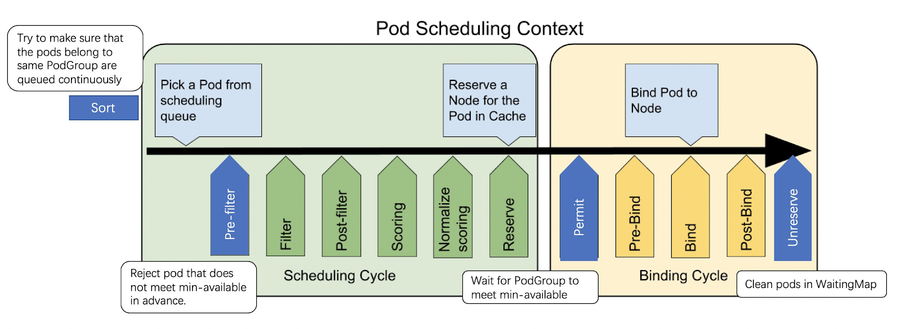

# Coscheduling plugin based on scheduler framework

## Table of Contents

<!-- toc -->
- [Motivation](#motivation)
- [Goals](#goals)
- [Non-Goals](#non-goals)
- [Use Cases](#use-cases)
- [Terms](#terms)
- [Proposal](#proposal)
- [Design Details](#design-details)
  - [PodGroup](#podgroup)
  - [Coscheduling](#coscheduling)
  - [Extension points](#extension-points)
    - [QueueSort](#queuesort)
    - [Pre-Filter](#pre-filter)
    - [Permit](#permit)
    - [UnReserve](#unreserve)
- [Alternatives considered](#alternatives-considered)
- [Graduation Criteria](#graduation-criteria)
- [Testing Plan](#testing-plan)
- [Implementation History](#implementation-history)
- [References](#references)
<!-- /toc -->

## Motivation
Kubernetes has become a popular solution for orchestrating containerized workloads. Due to limitation of Kubernetes scheduler, some offline workloads (ML/DL) are managed in a different system. To improve cluster utilization and operation efficiency, we'd like to treat Kubneretes as a unified management platform. But ML jobs are All-or-Nothing: they require all tasks of a job to be scheduled at the same time. If the job only start part of tasks, it will wait for other tasks to be ready to begin to work. In the worst case, all jobs are pending leading to a deadlock. To solve this problem, co-scheduling is needed for the scheduler. The new scheduler framework makes the goal possible.
 
## Goals
 Use scheduler plugin, which is the most Kubernetes native way, to implement coscheduling.
 
## Non-Goals
 Discuss the API definition of `PodGroup`.
 
## Use Cases
When running a Tensorflow/MPI job, all tasks of a job must start or none. If the job only start part of tasks, it will wait for other tasks to be ready to start work. In worst case, all jobs are pending leading to a deadlock.
 
## Terms

- **pgPod**: pod belongs to some `PodGroup`.
- **regularPod**: a regular `Pod` (which doesn't have `PodGropuName` set).

## Proposal

In order to implement coscheduling, we developed plugins in different extension points. In `QueueSort`  we ensure that the Pods belonging to the same PodGroup are queued back-to-back. For example, suppose PodGroup A owns Pod-A1, Pod-A2, Pod-A3, while PodGroup B owns Pod-B1, Pod-B2. The pods of the two PodGroups should not interleave - it should be always <PodGroup-A, PodGroup-B> or the other way around; but never <Pod-A1, Pod-B1, Pod-A2, ...>. In `Permit` phase we put the pod that doesn't meet min-available into the WaitingMap and reserve resources until min-available are met or timeout is triggered. In `Unreserve` phase，clean up the pods that timed-out.




## Design Details

### PodGroup

 `Pod` is distinguished by its `labels`. Pod of the same `PodGroup` has the same name. We use the label to distinguish the `PodGroup` for less dependence on the api definition of `PodGroup`.  It's just a simple description of the `PodGroup`. If the definition of `PodGroup` is accepted by the community, we will define it directly through the CRD of `PodGroup`. This is not the focus of this proposal.

```yaml 
labels:
     pod-group/name: nginx
     pod-group/min-available: "2"
``` 

### Coscheduling
```go
// Coscheduling is a plugin that implements the mechanism of gang scheduling.
type Coscheduling struct {
    FrameworkHandle     	framework.FrameworkHandle
    PodLister               corelisters.PodLister
    // Key is the name of PodGroup.
    PodGroupInfos       	map[string]PodGroupInfo
    // Name of the last scheduled podgroup
    LastPodGroup        	string
}
 
type PodGroupInfo struct {
    // LastFailureTimestamp stores the timestamp of last scheduling failure.
    LastFailureTimestamp 	time.Time
    UID           			types.UID
    MinAvailable  		int
    Name                                 String
}
```

1.  `PodGroupInfo` is initialized the first time the pod belongs to the PodGroup is encountered, and LastFailureTimestamp is updated every time the PodGroup fails to schedule.
2.  `LastPodGroup` records which `PodGroup` the last scheduled pod belongs to.
3.  `UID` is the unique identification value used to distinguish different podgroups.
 

### Extension points

#### QueueSort
In order to make the pods which belongs to the same `PodGroup` to be scheduled together as much as possible, implement a strategy in `QueueSort` phase. 

```go
  func  Less(podA *PodInfo, podB *PodInfo) bool
```
1. When priorities (i.e. .spec.priorityValue) are different, they are compared based on their priorities. When priorities are the same, they are operated according to the following process.
   
2. When podA and podB are both regularPods (we will check it by their labels), it follows the same logic of default in-tree [PrioritySort](https://github.com/kubernetes/kubernetes/blob/master/pkg/scheduler/framework/plugins/queuesort/priority_sort.go#L41-L45) plugin.
   
3. When podA is regularPod, podB is pgPod. they are compared according to podA’s timestamp and podB’s `LastFailureTimestamp` (we get the PodGroupInfo from the cache). If timestampA is earlier than LastFailureTimestampB, return true. Otherwise, return false. When podA is pgPod, podB is regularPod. Ditto
   
4. When podA and podB are both pgPods. Compare the the `LastFailureTimestamp` of the podGroup. 
   1. If `LastFailureTimestampA` is earlier than `LastFailureTimestampB`, return true. `LastFailureTimestampA` is later than `LastFailureTimestampB`, return false.
   
   2. If `LastFailureTimestampA` is equal to `LastFailureTimestampB`, we will compare the `UID` of `PodGroup`. (The purpose is to distinguish different `PodGroup` with the same `LastFailureTimestamp` and to keep the pods of the same `PodGroup` together)

**Note1**: There are different `LastFailureTimestamp` (even if they are the same, the UID will be different). So when the pods enter the queue, the pods that belongs to the same PodGroup will be together.

#### Pre-Filter
1. When a pod which belongs to a `PodGroup` comes, calculate the total number of Pods  excludes terminating ones belongs to the same PodGroup. If the result is less than minAvailable, the scheduling process is terminated directly.
   
2. Compare whether the `PodGroup` of the current pod is `LastPodGroup`, and if so, keep it unchanged. If not, it indicates that the new PodGroup scheduling cycle has been entered. Update LastPodGroup. And if there is a pod belongs to the last podgroup is waiting and if no chance to meet minAvailable, reject it directly here. The purpose is 1. To avoid invalid waiting, 2. To make the pod belongs to the same `PodGroup` fail together, rather than waiting partially.

```go
func (cs *Coscheduling) PreFilter(ctx context.Context, state *framework.CycleState, p *v1.Pod) *framework.Status {
    …
 
     // Count the numbers of all pods belongs to the same PodGroup excludes terminating ones.
    total := cs.calculateTotalPods(podGroupName)
    if total < minAvailable {
        return framework.NewStatus(framework.Unschedulable, "less than minAvailable")
    }
    ...
    if cs.Last != "" && cs.Last != podGroupName {
        allocated := cs.calculateAllocatedPods(cs.LastPodGroup)
        pgInfo, ok := cs.PodGroupInfos[cs.LastPodGroup]
        if ok {
        	pgInfo.LastFailureTimestamp = time.Now()
        	if allocated < pgInfo.minAvailable {
            	cs.FrameworkHandle.IterateOverWaitingPods(func(p framework.WaitingPod) {
                	if p.GetPod().Labels[PodGroupName] == cs.LastPodGroup {
                    	p.Reject(cs.Name())
                	}
            	})
        	}
        }
    }
    cs.LastPodGroup = podGroupName
    return nil
}
```

#### Permit
1. Get the number of Running pods that belong to the same PodGroup
2. Get the number of WaitingPods (used to record pods in waiting status) that belong to the same PodGroup
3. If Running + WaitingPods + 1 >= min-available(1 means the pod itself), apprve the waiting pods that  belongs to the same PodGroup. Otherwise, put the pod into WaitingPods and set the timeout(eg: 10s)
 
```go
func (cs Coscheduling) Permit(ctx context.Context, state *framework.CycleState, p *v1.Pod, nodeName string) (*framework.Status, time.Duration) {
    ...
    running := cs.calculateRunningPods(podGroupName)
    waiting := cs.calculateWaitingPods(podGroupName)
    if running+waiting+1 < minAvailable {
        return framework.NewStatus(framework.Wait, ""), 10 * time.Second
    }
    ...
    cs.FrameworkHandle.IterateOverWaitingPods(func(p framework.WaitingPod) {
        if p.GetPod().Labels[PodGroupName] == podGroupName {
        	p.Allow(cs.Name())
        }
    })
   
    delete(cs.PodGroupInfos, podGroupName)
    return framework.NewStatus(framework.Success, ""), 0
}
```
 

#### UnReserve
After a pod which belongs to a PodGroup times out in the permit phase.  We will release the pods belongs to the same PodGroup to avoid long-term invalid occupy of resources.

```go 
func (cs *Coscheduling) Unreserve(ctx context.Context, state *framework.CycleState, p *v1.Pod, nodeName string) {
    ...
    cs.FrameworkHandle.IterateOverWaitingPods(func(p framework.WaitingPod) {
        if p.GetPod().Labels[PodGroupName] == podGroupName {
        	p.Reject(cs.Name())
        }
    })
}
```

## Alternatives considered
1. Change the unit of Queue from `Pod` to `PodGroup`.
In this way, the workload is huge and it will affect the overall process of scheduling.


## Graduation Criteria

## Testing Plan
1.  Add detailed unit and integration tests for nonpreempting workloads.
2.  Add basic e2e tests, to ensure all components are working together.
 
## Implementation History
## References
- [Coscheduling in Kubernetes](https://docs.google.com/document/d/1AUwcvTtULNvow5M9e428FnlvINO1uQ7ojRoTGuTp4DA/edit#heading=h.ckn8nv2jj0xv)
- [Schedule a group of pods all at once](https://github.com/kubernetes/kubernetes/issues/16845)
- [kubeflow/tf-operator: Prevent scheduling deadlocks](https://github.com/kubeflow/tf-operator/issues/165)
- [Added PodGroup Phase in Status](https://github.com/kubernetes-sigs/kube-batch/pull/533)
